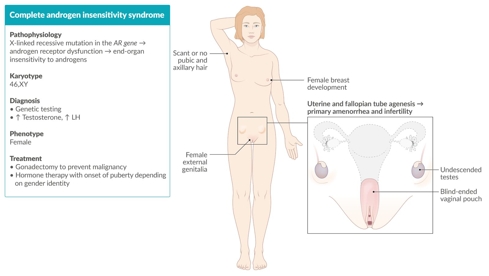
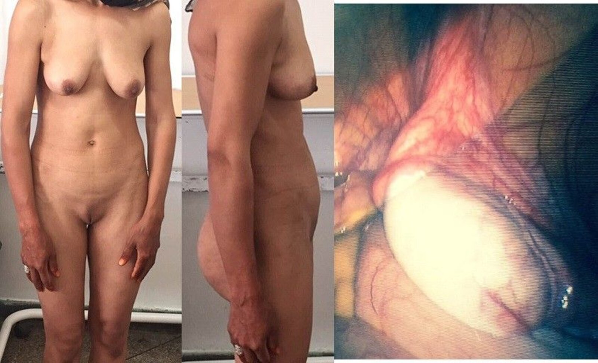
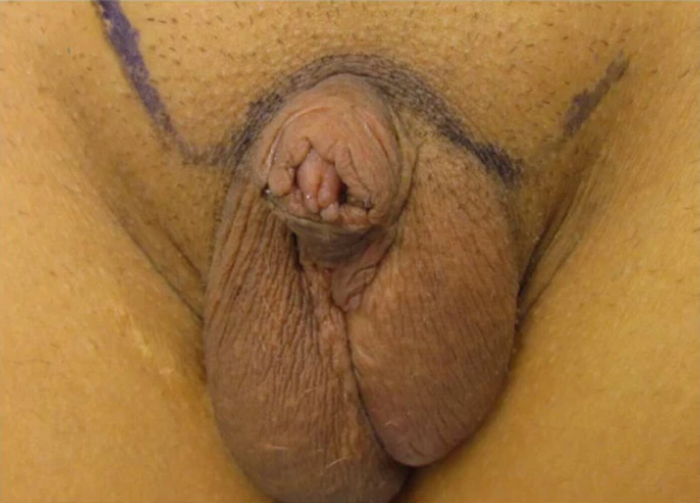
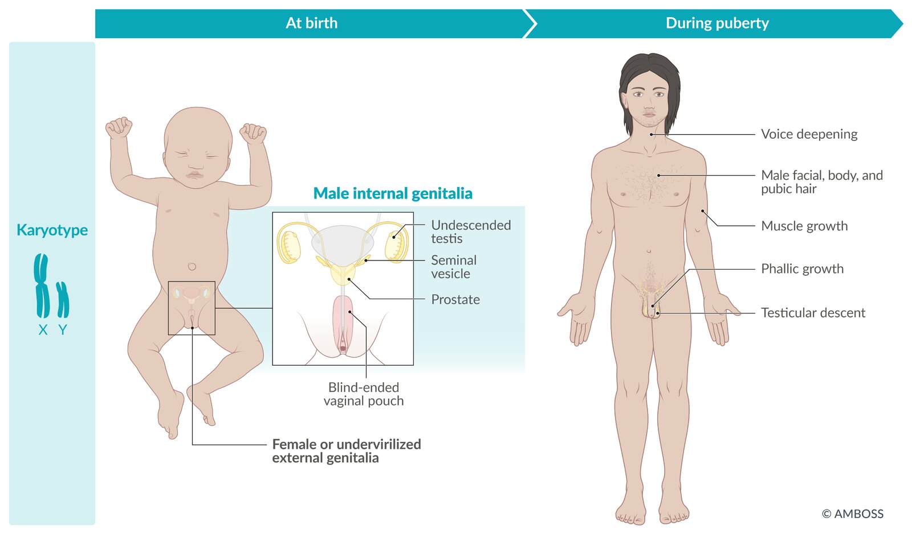
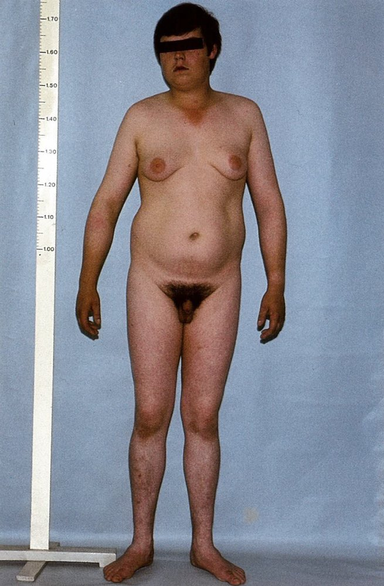
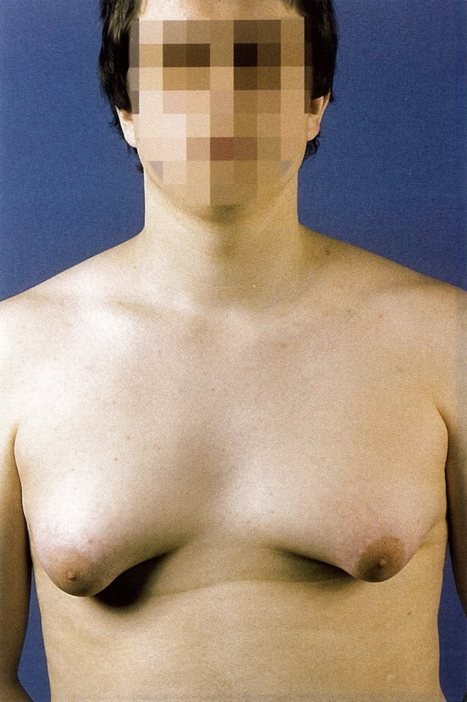
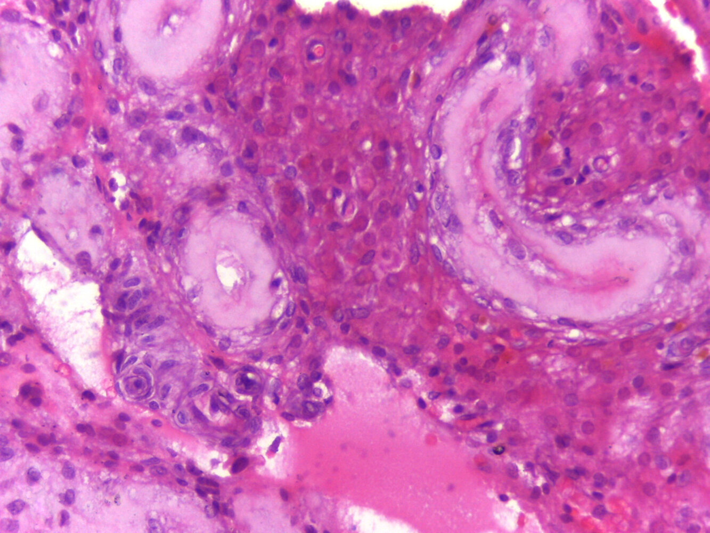
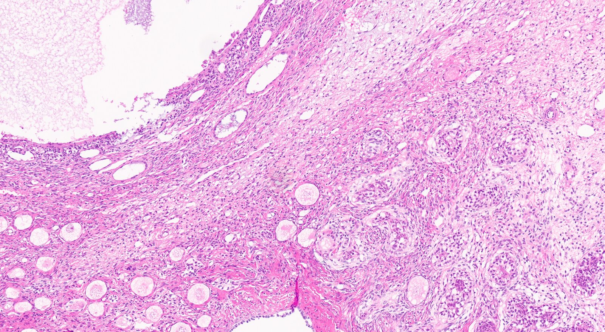
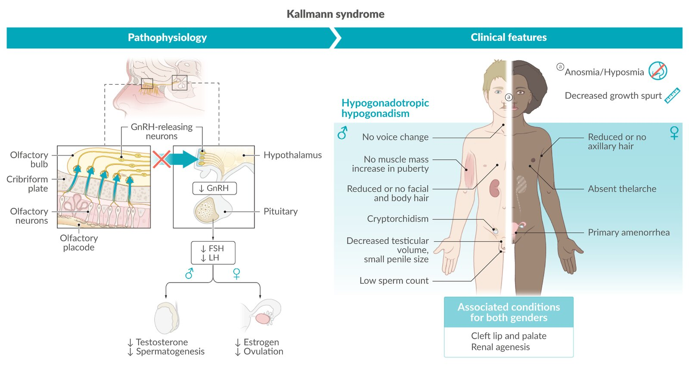

# Differences (disorders) of sex development

*Categories: Clinical knowledge > Genetics > Inherited syndromes > Differences (disorders) of sex development*

[Original Article Link](https://coursology-qbank.com/amboss/article/Wo0PaS)

---

## Summary

Differences (disorders) of sex development (DSDs; formerly known as “<u>intersex</u> conditions”) are a group of congenital conditions characterized by the atypical development of <u>chromosomal</u>, gonadal, and/or <u>phenotypic sex</u>. The underlying genetic mutations can affect the number and function of sex <u>chromosomes</u> (e.g., in <u>Turner syndrome</u>), cause structural changes that influence the <u>sensitivity</u> of <u>hormone</u> <u>receptors</u> (e.g., <u>androgen insensitivity syndrome</u>), and alter the function of enzymes responsible for sex <u>hormone</u> synthesis (e.g., <u>congenital adrenal hyperplasia</u>). Features vary depending on the specific disorder but may include the mismatch between sexual <u>genotype</u> and <u>phenotype</u>, reduced <u>fertility</u> or <u>infertility</u>, and organ <u>malformations</u> (e.g., cardiac abnormalities). The discrepancy between sexual <u>phenotype</u> and <u>genotype</u> can cause difficulties in <u>gender</u> identification with considerable subsequent psychological <u>distress</u>. The diagnosis of DSDs is based on clinical features, evaluation of <u>hormone</u> levels, and <u>genetic testing</u>. Differential diagnosis should take into account other anomalies of the male and female genital tracts (see the articles on “<u>Anomalies of the female genital tract</u>” and “<u>Infertility</u>”). Treatment should be provided based on patient preference and sexual identification as well as clinical necessity backed by strong ethical principles. If treatment is necessary and/or desired, it generally follows a multidisciplinary approach involving <u>hormone</u> substitution and psychological counseling. <u>Gender affirmation surgery</u> should only be performed if the patient expressly requests the procedure and can provide <u>informed consent</u>.

---

## Overview

### Differences (disorders) of sex development [[1]](https://coursology-qbank.com/amboss/article/7rb4iE)

#### Definitions

* Differences (disorders) of sex development (DSDs): a group of congenital conditions characterized by the atypical development of <u>chromosomal</u>, gonadal, and/or <u>phenotypic sex</u>

* Historical terms

* <u>Intersex</u>

* A historical term replaced now by the widely accepted terms “disorders of sex development” proposed in the 2006 Chicago consensus statement or the more recently introduced variation “differences of sex development”  [[2]](https://coursology-qbank.com/amboss/article/kDbmeD)

* This notwithstanding, the term “<u>intersex</u>” may be an accurate sex assignment designator for certain individuals with a DSD who do not identify as binary male or female.

* <u>True hermaphroditism</u>: presence of both male and female reproductive tissue and/or organs

* Pseudohermaphroditism: mismatch between <u>gonads</u> and <u>secondary sexual characteristics</u>

* <u>Male pseudohermaphroditism</u>: male <u>gonads</u>, female <u>secondary sexual characteristics</u>

* <u>Female pseudohermaphroditism</u>: female <u>gonads</u>, male <u>secondary sexual characteristics</u>

#### Classification [[2]](https://coursology-qbank.com/amboss/article/kDbmeD)[[3]](https://coursology-qbank.com/amboss/article/KubUHv)

* 46,XY DSD

* <u>Androgen insensitivity syndrome</u> (most common cause)

* <u>5-alpha reductase deficiency</u>

* <u>17β-hydroxysteroid dehydrogenase 3 deficiency</u>

* <u>Kallmann syndrome</u>

* <u>Persistent Mullerian duct syndrome</u>

* <u>46,XY complete gonadal dysgenesis</u> (<u>Swyer syndrome</u>)

* 46,XX DSD

* <u>Congenital adrenal hyperplasia</u> (most common cause)

* Exposure to <u>exogenous</u> <u>androgens</u> during <u>pregnancy</u>

* <u>Ovotesticular disorder of sex development</u>

* <u>Aromatase deficiency</u>

* <u>46,XX gonadal dysgenesis</u>

* <u>46,XX testicular DSD</u>

* <u>Sex chromosome</u> DSD

* <u>Turner syndrome</u> (<u>45,XO</u>)

* <u>Klinefelter syndrome</u> (<u>47,XXY</u>)

* <u>Double Y syndrome</u> (47,XYY)

#### Treatment

* The clinical management of DSDs involves a multidisciplinary approach guided by clinical necessity, patient choice, and strong ethical principles.

* Physicians should consider the following when determining the best treatment options for patients with DSDs:

* Ethical and human rights aspects of sex assignment and reassignment <u>surgery</u>

* Patient <u>gender identity</u> independent of <u>chromosomal</u> or <u>phenotypical sex</u>

* Psychological <u>distress</u> resulting from stigmatization, discrimination, and difficulties developing <u>gender identity</u> (e.g., <u>gender dysphoria</u>)

* Patient choice

* Clinical necessity

* Types of treatment

* <u>Hormone</u> substitution

* Psychological support

* <u>Surgery</u>

* <u>Gonadectomy</u>

* <u>Gender affirmation surgery</u>

### <u>Chromosomal abnormalities</u>

| Overview of <u>chromosomal abnormalities</u> |  |  |  |
| --- | --- | --- | --- |
| Condition | Underlying cause | Gonadal dysfunction | Clinical features |
|  <u>Turner syndrome</u>    |  * <u>45,XO</u> <u>monosomy</u>   |   * Ovarian dysgenesis  * <u>Streak gonads</u>    |   * <u>Infertility</u>  * <u>Webbed neck</u>  * <u>Cystic hygroma</u>  * <u>Shield chest</u>  * <u>Coarctation of the aorta</u>  * <u>Horseshoe kidney</u>    |
| <u>Klinefelter syndrome</u> |  * <u>47,XXY</u> <u>trisomy</u>   |   * Testicular dysgenesis (testicular <u>hypoplasia</u>)  * <u>Testosterone</u> deficiency    |   * <u>Eunuchoidism</u>  * <u>Gynecomastia</u>  * Reduced facial and body <u>hair</u>  * Testicular <u>atrophy</u>  * <u>Mitral valve prolapse</u>    |
| <u>Double Y syndrome</u> |  * 47,XYY <u>trisomy</u>   |  * Normal gonadal function   |   * Normal <u>fertility</u> and <u>pubertal development</u>  * <u>Tall stature</u>  * <u>Severe acne</u>  * Associated with:  * <u>ADHD</u>  * <u>Autism spectrum disorder</u>    |

Section 11 Sex Chromosome Disorders

### Genetic disorders

| Overview of genetic disorders |  |  |  |
| --- | --- | --- | --- |
| Condition | Underlying cause | Gonadal dysfunction | Other clinical features |
| In both 46,XY and 46,XX <u>karyotypes</u> |  |  |  |
| <u>Congenital adrenal hyperplasia</u> (<u>CAH</u>) |  * <u>Autosomal recessive</u> <u>gene</u> mutation encoding any of the following:  * <u>21-hydroxylase</u>  * <u>17α-hydroxylase</u>  * <u>11β-hydroxylase</u>   |  * Increased or decreased <u>androgen</u> production (depending on the defective/deficient enzyme)   |   * <u>21-hydroxylase</u> and <u>11β-hydroxylase</u> deficiencies  * <u>Hypotension</u> (<u>hypertension</u> in <u>11β-hydroxylase deficiency</u>)  * <u>Precocious puberty</u> in boys  * <u>17α-hydroxylase deficiency</u>  * <u>Hypertension</u>  * <u>Delayed puberty</u> in girls  * See “<u>Congenital adrenal hyperplasia</u>.”    |
| <u>Aromatase deficiency</u> |  * <u>Autosomal recessive</u> CYP19A1 <u>gene</u> mutations   |   * Defective/absent <u>aromatase</u>  * Decreased <u>estrogen</u> and increased <u>androgen</u> production    |   * In 46,XX individuals  * Ambiguous external genitalia  * Normal internal genitalia  * <u>Virilization</u>  * <u>Amenorrhea</u>  * In 46,XY individuals  * Abnormal <u>sperm</u> production  * Small or <u>undescended testes</u>  * Both  * <u>Tall stature</u>  * <u>Osteoporosis</u>  * <u>Hyperglycemia</u>  * Weight gain and <u>fatty liver</u>    |
| <u>Ovotesticular disorder of sex development</u> |  * <u>SRY</u> <u>gene</u> translocation from Y to the X <u>chromosome</u>   |   * Mixed testicular and ovarian dysgenesis  * <u>Ovotestis</u>    |   * In 46,XX individuals  * <u>Labial fusion</u>  * <u>Urogenital sinus</u>  * In 46,XY individuals  * <u>Hypospadias</u>  * <u>Cryptorchidism</u>  * Testicular enlargement  * <u>Gynecomastia</u>  * Both  * Ambiguous genitalia  * <u>Infertility</u>    |
| <u>Kallmann syndrome</u> |  * Mutations in multiple <u>genes</u> responsible for the migration of <u>GnRH</u>-releasing <u>neurons</u> from the olfactory bulbs   |  * <u>Hypogonadotropic hypogonadism</u>   |   * <u>Infertility</u>  * Absent or attenuated <u>pubertal changes</u>  * <u>Anosmia</u> or <u>hyposmia</u>  * <u>Renal agenesis</u>  * <u>Cleft lip</u>/<u>cleft palate</u>    |
| <u>SOX9 mutation</u> (<u>campomelic dysplasia</u>) |   * <u>Autosomal dominant</u> SOX9 <u>gene</u> mutations on <u>chromosome</u> 17  * See “<u>Campomelic dysplasia</u>” in “<u>Short stature</u>”.    |  * Impaired <u>transcription</u> of sex-determining factors (e.g., <u>anti-Mullerian hormone</u>)   |   * Ambiguous external and/or internal genitalia  * <u>Skeletal dysplasia</u>  * Bowing of <u>long bones</u>  * <u>Short stature</u>  * <u>Pierre Robin sequence</u>  * Life-threatening laryngotracheomalacia  * <u>Hearing loss</u>    |
| In 46,XY <u>karyotype</u> only |  |  |  |
|  <u>Androgen insensitivity syndrome</u>    |  * <u>X-linked recessive</u> mutation of the <u>androgen</u> <u>receptor</u> <u>gene</u>   |   * Insensitivity to <u>androgens</u>  * Normal <u>androgen</u> production    |   * Female <u>phenotype</u>  * Blind-ended vaginal pouch  * Uterine <u>agenesis</u>  * <u>Cryptorchidism</u>  * <u>Primary amenorrhea</u>  * <u>Infertility</u>  * Scant or missing pubic <u>hair</u>    |
| <u>5-alpha reductase deficiency</u> |  * <u>Autosomal recessive</u> <u>loss-of-function</u> mutation of SRD5A2 <u>gene</u>   |  * Decreased conversion of <u>testosterone</u> to <u>dihydrotestosterone</u>   |   * Female external genitalia  * Male internal genitalia  * <u>Pseudovaginal perineoscrotal hypospadias</u>  * Development of secondary sexual male characteristics in <u>puberty</u>    |
| <u>Persistent Mullerian duct syndrome</u> |  * <u>Autosomal recessive</u> mutation of <u>AMH</u> or AMHR2 <u>gene</u>   |  * Decreased production of and/or insensitivity to <u>anti-Mullerian hormone</u> (<u>AMH</u>)   |   * Male <u>phenotype</u>  * Female internal genitalia  * <u>Cryptorchidism</u>  * <u>Inguinal hernia</u>  * <u>Hematospermia</u> and <u>hematuria</u>    |
| <u>17β-hydroxysteroid dehydrogenase 3 deficiency</u> |  * HSD17B3 <u>gene</u> mutation with <u>17β-hydroxysteroid dehydrogenase 3 deficiency</u>   |  * Decreased conversion of <u>androstenedione</u> to <u>testosterone</u>   |   * Male internal genitalia (<u>testes</u>)  * Ambiguous or undervirilized external genitalia  * <u>Gynecomastia</u>  * <u>Infertility</u>    |
| <u>46,XY gonadal dysgenesis</u> (<u>Swyer syndrome</u>) |  * Mutations of <u>SRY</u>, MAP3K1, NR5A1 or DHH <u>gene</u>   |   * Testicular dysgenesis  * <u>Streak gonads</u>  * Decreased <u>androgen</u> production    |   * Female <u>phenotype</u>  * Small <u>uterus</u>  * Enlarged <u>clitoris</u>  * <u>Delayed puberty</u>, absence of <u>breast</u> enlargement  * <u>Primary amenorrhea</u>  * <u>Infertility</u>    |
| In 46,XX <u>karyotype</u> only |  |  |  |
| <u>46,XX gonadal dysgenesis</u> |  * Most commonly mutations of BMP15 or NR5A1 <u>gene</u>   |   * Ovarian dysgenesis  * <u>Streak gonads</u>    |   * Female <u>phenotype</u>  * Normal internal genitalia (<u>uterus</u> and <u>vagina</u>)  * <u>Infertility</u>    |
| <u>46,XX testicular DSD</u> |  * Translocation of the <u>SRY</u> <u>gene</u> from the Y <u>chromosome</u> to the X <u>chromosome</u>   |   * Small or <u>undescended testes</u>  * Absent <u>Mullerian duct</u> structures  * <u>Testosterone</u> deficiency    |   * Male <u>phenotype</u>  * <u>Short stature</u>  * <u>Gynecomastia</u>  * <u>Azoospermia</u>-related <u>infertility</u>    |

### Congenital <u>malformations</u> of the reproductive system

| Overview of congenital <u>malformations</u> of the reproductive system |  |  |
| --- | --- | --- |
| Condition | Underlying cause | Clinical features |
| <u>Anomalies of Mullerian duct fusion</u> |   * Defective fusion of the <u>Mullerian ducts</u> during embryonal development  * See “<u>Anomalies of the female genital tract</u>.”    |   * <u>Infertility</u>  * <u>Dyspareunia</u>  * <u>Primary amenorrhea</u> (in <u>Mullerian agenesis</u>)    |
| <u>Imperforate hymen</u> |  * Failed <u>apoptosis</u> of the central <u>epithelial</u> cells of the <u>hymen</u>   |   * <u>Primary amenorrhea</u>  * <u>Hematocolpos</u>  * Palpable abdominal mass  * <u>Urinary retention</u>  * <u>Dysuria</u>    |
| <u>Transverse vaginal septum</u> |  * Failed recanalization of the <u>Mullerian duct</u>   |   * <u>Primary amenorrhea</u>  * <u>Hematocolpos</u>  * <u>Infertility</u>  * Lower abdominal <u>pain</u>    |
| <u>Bladder exstrophy</u> |  * Impaired development of the <u>ventral</u> abdominal wall and <u>bladder</u> during the <u>cloacal membrane</u> rupture   |   * <u>Bladder</u> <u>herniation</u> through the abdominal wall  * <u>Urinary incontinence</u>  * <u>Epispadias</u>  * In male individuals  * Short <u>penis</u>  * <u>Dorsal</u> penile curvature  * <u>Indirect inguinal hernia</u>  * In female individuals  * Bifid <u>clitoris</u>  * Anteriorly separated labia  * <u>Bicornuate uterus</u>    |

---

## Androgen insensitivity syndrome

* <u>Prevalence</u>: 2–5:100,000 genetically male population in the US [[4]](https://coursology-qbank.com/amboss/article/DtY1fI)

* Etiology: : <u>X-linked recessive</u> mutation of the <u>gene</u> encoding the <u>androgen</u> <u>receptor</u> (AR gene)

* <u>Karyotype</u>: : 46,XY

* Pathophysiology: Defects in the <u>androgen</u> <u>receptor</u> result in varying degrees of end-organ insensitivity to <u>androgens</u>.

* Clinical features

* Complete <u>androgen</u> insensitivity  

* Female external genitalia and physique

* Due to increased aromatization of <u>androgens</u> to <u>estrogens</u>

* Includes testicular feminization and female <u>breast</u> development

* Blind-ended vaginal pouch, uterine and <u>fallopian tube</u> <u>agenesis</u> (due to testicular <u>anti-Mullerian hormone</u> secretion)

* Absent male internal genitalia (with the exception of the <u>testes</u>)

* <u>Cryptorchidism</u>: intralabial, inguinal, or abdominal localization of undescended <u>testicles</u>

* Scant or no pubic <u>hair</u>

* <u>Primary amenorrhea</u>, <u>infertility</u> (no <u>menarche</u>)

* Partial <u>androgen</u> insensitivity: various <u>phenotypical</u> configurations possible, depending on the degree of <u>androgen</u> insensitivity

* Diagnostics

* Clinical presentation

* Before <u>puberty</u>: ↑ <u>testosterone</u>

* After <u>puberty</u>: ↑ <u>LH</u>, ↑ <u>estrogen</u>, and normal/↑ <u>testosterone</u> levels (no <u>virilization</u>)

* <u>Genetic testing</u>

* Treatment: depends on <u>receptor</u> status as well as on the <u>phenotype</u> and <u>gender identity</u>

* <u>Hormone</u> treatment

* Complete <u>androgen</u> insensitivity: <u>estrogen</u> replacement

* Partial <u>androgen</u> insensitivity: high-dose <u>androgen</u> therapy in patients with male <u>gender identity</u>

* <u>Gonadectomy</u>: for intraabdominal/intralabial <u>testicles</u>

* Typically performed after <u>puberty</u>

* Prevents malignant transformation of the abnormally localized <u>gonads</u>

* Psychological support

Complete androgen insensitivity syndrome

Complete androgen insensitivity syndrome (AIS)

Partial androgen insensitivity syndrome (PAIS)

---

## Aromatase deficiency

* <u>Prevalence</u>: rare  [[5]](https://coursology-qbank.com/amboss/article/-8bD6v)

* Etiology: <u>autosomal recessive</u> mutations in the CYP19A1 <u>gene</u> that encodes the enzyme <u>aromatase</u> [[6]](https://coursology-qbank.com/amboss/article/wtYhfI)

* <u>Karyotype</u>: 46,XX or 46,XY (normal <u>sexual development</u> in males)

* Pathophysiology: defective/absent <u>aromatase</u> → ↓ conversion of <u>testosterone</u> to <u>estrogen</u> → ↓ serum <u>estrogen</u> and ↑ serum <u>testosterone</u>

* Clinical features

* 46,XX individuals

* At <u>birth</u>

* Ambiguous external genitalia

* Normal internal genital organs

* <u>Puberty</u>

* Impaired maturation of <u>secondary sexual characteristics</u> (e.g., <u>breast</u> growth)

* <u>Primary amenorrhea</u>

* <u>Virilization</u> (features include <u>hirsutism</u>, <u>severe acne</u>)

* 46,XY individuals 

* Abnormal <u>sperm</u> production

* Small or <u>undescended testes</u>

* Decreased sex drive

* Both 46,XX and 46,XY individuals

* <u>Tall stature</u> (due to excessive bone growth with slowed mineralization)

* <u>Osteoporosis</u> (may result in <u>fractures</u> following minimal trauma)

* <u>Hyperglycemia</u> (due to impaired tissue response to <u>insulin</u>)

* Weight gain and <u>fatty liver</u>

* Diagnostics

* Before <u>birth</u>: maternal <u>virilization</u> during <u>pregnancy</u> (due to fetal <u>androgens</u> crossing the <u>placenta</u> and entering maternal circulation)

* After <u>birth</u>

* Clinical presentation of the <u>newborn</u>

* <u>Hormone</u> levels: ↑ <u>testosterone</u>, ↑ <u>androstenedione</u>, ↓ <u>estrogen</u>

* <u>Karyotyping</u>: normal 46,XX or 46,XY <u>karyotype</u>

* Treatment

* <u>Estrogen</u> and <u>progesterone</u> replacement therapy

* <u>Calcium</u> and <u>vitamin D</u> supplementation

* Surgical correction of ambiguous genitalia (depending on the patient's <u>gender identity</u> and preference)

---

## 5-alpha-reductase deficiency

* <u>Prevalence</u>: rare disease (exact <u>incidence</u> unknown)  [[7]](https://coursology-qbank.com/amboss/article/APWRhl0)

* Etiology: rare <u>autosomal recessive</u> <u>loss-of-function</u> mutation of the SRD5A2 <u>gene</u> on <u>chromosome</u> 2

* <u>Karyotype</u>: : 46,XY

* Pathophysiology: defective <u>5-alpha-reductase</u> → ↓ conversion of <u>testosterone</u> to <u>dihydrotestosterone</u> (<u>DHT</u>) → ↓ <u>DHT</u>-dependent masculinization of external genitalia and the <u>prostate</u> (despite normal <u>testosterone</u> production)

* Clinical features [[8]](https://coursology-qbank.com/amboss/article/ZubZpv)

* Female external genitalia at <u>birth</u>

* Possibly pseudovaginal perineoscrotal hypospadias (<u>PPSH</u>): a symptom constellation of <u>hypospadias</u>, a <u>micropenis</u> that resembles a <u>clitoris</u>, and an incompletely closed urogenital opening that resembles a <u>vagina</u>

* Male internal genital organs

* Development of the secondary sexual male characteristics (phallic growth, testicular descent) in <u>puberty</u> due to high <u>testosterone</u> levels

* Diagnosis

* Clinical presentation

* <u>Hormone</u> levels

* Normal/↑ <u>testosterone</u>, ↓ <u>DHT</u> (<u>testosterone</u>:<u>DHT</u> <u>ratio</u> > 20)

* Normal <u>estrogen</u>

* Normal or ↑ <u>LH</u>

* <u>Genetic testing</u>: confirms the diagnosis

* Treatment

* Female <u>gender identity</u>: <u>gonadectomy</u> and <u>estrogen</u> substitution therapy upon completion of longitudinal growth

* Male <u>gender identity</u>: <u>testosterone</u> substitution

* Surgical correction of <u>hypospadias</u> and <u>cryptorchidism</u>

5-Alpha-reductase deficiency

---

## Klinefelter syndrome

* <u>Prevalence</u>

* Approx. 1:650 population in the US [[9]](https://coursology-qbank.com/amboss/article/9tYNfI)

* One of the most common <u>causes of male hypogonadism</u>

* Etiology

* Usually due to <u>nondisjunction</u> of sex <u>chromosomes</u> during <u>meiosis</u>

* Associated with <u>advanced maternal age</u>

* <u>Karyotype</u>

* <u>47,XXY</u> (rarely <u>48,XXXY</u> or <u>48,XXYY</u>)

* Presence of a <u>Barr body</u> (inactivated X <u>chromosome</u>)

* Pathophysiology  

* Testicular dysgenesis leads to:

* <u>Seminiferous tubules</u> dysgenesis → loss of <u>Sertoli cells</u> → ↓ <u>inhibin B</u> → ↑ <u>FSH</u>

* <u>Leydig cell</u> dysfunction → ↓ <u>testosterone</u> → ↑ <u>LH</u>

* Both ↑ <u>LH</u> and ↑ <u>FSH</u> lead to increased conversion of <u>testosterone</u> to <u>estrogen</u>.

* Clinical features: Testicular dysgenesis and subsequent <u>testosterone</u> deficiency manifest at the onset of <u>puberty</u> (symptoms are rare during childhood).

* Signs and symptoms of <u>hypoandrogenism</u> 

* <u>Eunuchoid growth pattern</u>: tall, slim stature with long extremities (<u>Growth plate</u> closure is delayed;  )

* <u>Gynecomastia</u>

* Reduced facial and body <u>hair</u>

* Testicular <u>atrophy</u> [[10]](https://coursology-qbank.com/amboss/article/0ubepv)

* Reduced <u>fertility</u> and libido

* Frequent <u>azoospermia</u>

* <u>Micropenis</u>

* <u>Osteoporosis</u> (common feature in adulthood)

* Possible <u>developmental delay</u>

* Neurocognitive dysfunction (impaired <u>executive function</u> and <u>memory</u>, decreased <u>intelligence</u>)

* Language impairment (affects expression more than comprehension)

* Poor social skills

* Associated disorders

* <u>Mitral valve prolapse</u>

* Increased risk of <u>breast</u> and <u>testicular cancer</u>

* <u>Metabolic syndrome</u>

* Diagnostics

* Clinical presentation

* <u>Hormone</u> levels

* ↑ <u>FSH</u> and <u>LH</u>

* ↓ <u>Testosterone</u> with ↑ <u>aromatase</u> and ↑ <u>estrogen</u> levels

* Testicular <u>biopsy</u> (performed after <u>puberty</u>) 

* <u>Seminiferous tubules</u> <u>fibrosis</u>

* <u>Leydig cells</u> <u>hyperplasia</u>

* <u>Karyotyping</u>: <u>confirmatory test</u>

* Treatment: life-long <u>testosterone</u> substitution

Klinefelter syndrome fact sheet

Klinefelter syndrome

Bilateral gynecomastia in Klinefelter syndrome

Testis in Klinefelter syndrome

Section 11.2 Klinefelter Syndrome

---

## Double Y syndrome

* <u>Prevalence</u>: approx. 1:1000 male <u>newborns</u> in the US [[11]](https://coursology-qbank.com/amboss/article/abaQHQ)

* Etiology: paternal <u>meiotic</u> <u>nondisjunction</u>

* <u>Karyotype</u>: 47,XYY or 46,XY/47,XYY <u>mosaicism</u>

* Clinical features [[12]](https://coursology-qbank.com/amboss/article/TcY6bL)

* Male <u>phenotype</u> (patients often remain undiagnosed)

* <u>Tall stature</u>

* May manifest with <u>severe acne</u>

* Normal <u>fertility</u> and <u>pubertal development</u>

* Mild delays in motor and <u>language development</u>  [[11]](https://coursology-qbank.com/amboss/article/abaQHQ)

* Higher rates of <u>ADHD</u>, <u>autism spectrum disorder</u>, and <u>learning</u> disabilities

* Diagnostics

* Clinical presentation

* <u>Karyotyping</u> (<u>confirmatory tests</u>)

* Treatment

* Not recommended in asymptomatic patients

* Neurodevelopmental evaluation and treatment for <u>ADHD</u> or <u>autism</u> may be indicated.

> [!TIP]
> Contrary to what is frequently still stated in the literature, there is no evidence that individuals with <u>double Y syndrome</u> have higher levels of aggression compared to karyotypically normal male individuals with comparable levels of <u>intelligence</u>.

---

## Ovotesticular disorder of sex development

* <u>Prevalence</u>: less than 1:20,000 population in the US [[13]](https://coursology-qbank.com/amboss/article/pubLHv)

* Etiology: <u>SRY</u> <u>gene</u> translocation from the Y to the X <u>chromosome</u> (rarely to other <u>chromosomes</u>)

* <u>Karyotype</u>: : typically normal (46,XX is more common than 46,XY)

* Pathophysiology: <u>SRY</u> <u>gene</u> translocation results in simultaneous development of male and female <u>gonads</u> (<u>ovotestis</u>).

* Clinical features [[13]](https://coursology-qbank.com/amboss/article/pubLHv)

* 46,XX individuals

* At <u>birth</u>

* <u>Labial fusion</u>

* <u>Urogenital sinus</u>

* Polycystic <u>ovaries</u>

* <u>Puberty</u>/adulthood: <u>primary amenorrhea</u>, if the <u>uterus</u> does not form

* 46,XY individuals

* At <u>birth</u>

* <u>Hypospadias</u>

* <u>Cryptorchidism</u>

* <u>Puberty</u>/adulthood

* <u>Gynecomastia</u>

* Recurrent groin or scrotal <u>pain</u>

* Testicular enlargement

* Both female and male individuals

* Ambiguous genitalia (<u>ovotestis</u>)

* Can be bilateral (more common) or unilateral

* Descent depends on amount of testicular tissue present in <u>ovotestis</u>.

* Can be intraabdominal (most commonly), inguinal, or labioscrotal

* In some cases, a single <u>testis</u> and <u>contralateral</u> <u>ovary</u> may be present.

* <u>Infertility</u>

* Diagnostics

* Clinical presentation

* <u>Chromosomal</u> and <u>genetic testing</u>

* <u>Biopsy</u> of the <u>gonads</u> shows both testicular and ovarian tissue

* Treatment: surgical removal of male or female genital structures for normal <u>sexual development</u> according to <u>gender identity</u> and preference [[14]](https://coursology-qbank.com/amboss/article/aPYQW6)

Ovotestis

---

## Gonadal dysgenesis

* Description

* A group of DSDs characterized by gonadal underdevelopment during <u>embryogenesis</u> (see “Classification” below).

* Results in different degrees of <u>hypogonadism</u> and sex development

* Typically results in the development of malfunctioning <u>gonads</u> (<u>streak gonads</u>) with fibrous tissue instead of normal germ cells, increasing the risk of <u>malignancy</u> (e.g., <u>dysgerminoma</u>, <u>seminoma</u>)

* Classification

* <u>Turner syndrome</u> (<u>45,XO</u>)

* Pure gonadal dysgenesis (or <u>complete gonadal dysgenesis</u>)

* <u>46,XY gonadal dysgenesis</u> (<u>Swyer syndrome</u>)

* <u>46,XX gonadal dysgenesis</u>

* General clinical features

* <u>Delayed puberty</u>

* <u>Infertility</u>

* <u>Streak gonads</u>

* High risk for malignancies (e.g., <u>dysgerminoma</u>, <u>seminoma</u>)

* Diagnosis

* Clinical presentation

* <u>Genetic analysis</u>

* <u>Karyotyping</u>

* Laboratory findings of <u>hypergonadotropic hypogonadism</u>

* Imaging tests (to assess for <u>streak gonads</u>)

* Treatment

* Lifelong <u>estrogen</u> and <u>progesterone</u> substitution

* Surgical removal of <u>streak gonads</u>

---

## Turner syndrome

* <u>Prevalence</u>

* Approx. 1:2500 genetically female population in the US [[15]](https://coursology-qbank.com/amboss/article/89bO6D)

* Most common cause of ovarian dysgenesis and <u>primary ovarian insufficiency</u>

* Etiology: <u>chromosomal</u> <u>nondisjunction</u> during <u>meiosis</u> or <u>mitosis</u>

* <u>Karyotype</u>

* <u>Meiotic</u> <u>nondisjunction</u> (most often in paternal <u>gametes</u>) → complete sex <u>chromosomal</u> <u>monosomy</u> (<u>45,XO</u>; no <u>Barr body</u>)

* <u>Mitotic</u> <u>nondisjunction</u> of an embryonic cell → sex <u>chromosomal mosaicism</u> (<u>45,XO</u>/46,XX) → mild <u>phenotypic</u> expression

* Pathophysiology: <u>chromosomal</u> <u>nondisjunction</u> → X <u>chromosome</u> <u>monosomy</u>/<u>mosaicism</u> → impaired ovarian development → malfunctioning streak gonads with <u>connective tissue</u> instead of normal germ cells → <u>estrogen</u> and <u>progesterone</u> deficiencies

* Clinical features of <u>Turner syndrome</u>

* Sex development

* Female <u>phenotype</u>

* <u>Primary ovarian insufficiency</u> with:

* <u>Delayed puberty</u>

* <u>Primary amenorrhea</u>

* <u>Infertility</u>: <u>Pregnancy</u> is still possible via <u>IVF</u> using donor <u>oocytes</u> and <u>exogenous</u> <u>estradiol</u> 17β and <u>progesterone</u> (similar rates of success to those in the general population).  [[16]](https://coursology-qbank.com/amboss/article/QrXuSz)

* <u>Lymphatic system</u> abnormalities

* <u>Cystic hygroma</u>

* <u>Lymphedema</u> of the hands and feet in the <u>neonatal period</u>

* Musculoskeletal findings

* <u>Short stature</u>: due to the presence of only one copy of the <u>SHOX</u> (<u>short stature homeobox</u>) <u>gene</u>, normally located on the X <u>chromosome</u>

* Shield chest: broad chest with widely spaced <u>nipples</u>

* Webbed neck: <u>skin</u> folds along the side of the neck between the <u>mastoid process</u> and the <u>acromion</u>

* <u>Cubitus valgus</u>

* Short fourth <u>metacarpals</u>/<u>metatarsals</u>, <u>nail</u> <u>dysplasia</u>

* High arched <u>palate</u>

* Low-set <u>posterior</u> hairline

* <u>Osteoporosis</u> and <u>pathologic fractures</u>

* Cardiovascular abnormalities in Turner syndrome

* <u>Bicuspid aortic valve</u>: increased risk of premature <u>aortic stenosis</u> and/or insufficiency

* <u>Coarctation of the aorta</u> with brachial-femoral delay

* <u>Aortic dissection</u> and rupture

* <u>Hypertension</u> (even in children)  [[17]](https://coursology-qbank.com/amboss/article/JgYswo)

* Other disorders [[18]](https://coursology-qbank.com/amboss/article/rgYf9o)

* <u>Gonadoblastoma</u> (especially in patients with <u>45,XO</u>/46,XY <u>mosaicism</u>)

* <u>Malformations</u> of the <u>kidney</u> and <u>ureters</u> (especially <u>horseshoe kidney</u>)

* <u>Hashimoto thyroiditis</u>

* <u>Type 2 diabetes mellitus</u>

* Diagnostics

* Clinical presentation

* <u>Hypergonadotropic hypogonadism</u>: ↓ <u>estrogen</u>, ↓ <u>androgens</u>, ↑ <u>FSH</u>, ↑ <u>LH</u>

* <u>Karyotyping</u>: <u>confirmatory test</u>

* Treatment

* <u>Estrogen</u> and progestogen substitution

* <u>Growth hormone</u> (<u>GH</u>) therapy

* Surgical removal of <u>streak gonads</u>

> [!TIP]
> Unlike <u>Klinefelter syndrome</u>, <u>Turner syndrome</u> is not associated with <u>advanced maternal age</u>.

> [!TIP]
> Most patients with <u>Turner syndrome</u> have normal <u>intelligence</u>. [[19]](https://coursology-qbank.com/amboss/article/xtYEfI)

> [!TIP]
> Evaluate for <u>X-linked recessive</u> conditions in patients with <u>Turner syndrome</u>, as this group lacks a second X <u>chromosome</u>.

Turner syndrome fact sheet

Section 11.1 Turner Syndrome

---

## 46,XY gonadal dysgenesis

* <u>Prevalence</u>: approx. 1:20,000 population in the US [[20]](https://coursology-qbank.com/amboss/article/Lubw7v)

* Etiology: mutations of <u>genes</u> involved in male sex development after the 8th embryonic week

* Mutation of <u>SRY</u> <u>gene</u> on <u>chromosome</u> Y in approx. 20% of affected individuals

* Other potentially involved <u>genes</u>: MAP3K1, NR5A1, and DHH <u>genes</u>

* <u>Karyotype</u>: 46,XY

* Pathophysiology [[21]](https://coursology-qbank.com/amboss/article/VxaGv5)

* Impaired testicular development and the subsequent underproduction of <u>testosterone</u> and <u>anti-Mullerian hormone</u>, which results in:

* Persistence of <u>Mullerian ducts</u> → development of female genitalia (except <u>ovaries</u>) despite the presence of Y <u>chromosome</u>

* Underdevelopment of <u>Wolffian ducts</u> → absence of male genitalia

* Development of <u>streak gonads</u> → ↓ <u>estrogen</u> and <u>progesterone</u> → ↓ negative feedback → ↑ <u>FSH</u> and <u>LH</u> → <u>delayed puberty</u> and <u>infertility</u>

* Clinical features [[22]](https://coursology-qbank.com/amboss/article/_FY5kI)

* Typically female <u>phenotype</u>

* Childhood: normal female development without evidence of a <u>chromosomal</u> aberration

* <u>Puberty</u>: <u>estrogen deficiency</u> due to the absence of functional <u>ovaries</u> [[23]](https://coursology-qbank.com/amboss/article/dxaov5)

* <u>Primary amenorrhea</u>

* <u>Infertility</u>

* Small <u>uterus</u>

* Enlarged <u>clitoris</u>

* Absence of <u>breast</u> enlargement

* Diagnostics: See “Diagnosis” in “<u>Gonadal dysgenesis</u>” section above.

* Treatment: See “Treatment” in “<u>Gonadal dysgenesis</u>” section above.  [[24]](https://coursology-qbank.com/amboss/article/7gY49o)

---

## Kallmann syndrome

* <u>Prevalence</u>: 3:100,000 male and 0.8:100,000 female population in the US [[29]](https://coursology-qbank.com/amboss/article/AtYRTI)

* <u>Karyotype</u>: 46,XY or 46,XX

* Etiology: : associated with more than 20 different <u>gene mutations</u> that result in the development of <u>hypogonadotropic hypogonadism</u> with <u>hyposmia</u>/<u>anosmia</u>

* Pathophysiology [[30]](https://coursology-qbank.com/amboss/article/IMYYJp)

* Defective migration of <u>GnRH</u>-releasing <u>neurons</u> from the olfactory bulbs to the <u>hypothalamic</u> <u>preoptic nuclei</u> → ↓ <u>GnRH</u> secretion and underdevelopment of the olfactory bulbs

* ↓ <u>GnRH</u> → ↓ <u>pituitary</u> secretion of <u>FSH</u> and <u>LH</u> → ↓ <u>testosterone</u> in male individuals and ↓ <u>estrogen</u> in female individuals

* Clinical features: <u>Phenotype</u> according to <u>karyotype</u> [[30]](https://coursology-qbank.com/amboss/article/IMYYJp)

* <u>Anosmia</u> or <u>hyposmia</u>

* <u>Infertility</u>

* Male individuals: <u>cryptorchidism</u> and low <u>sperm</u> count

* Female individuals: <u>primary amenorrhea</u>

* Absent or attenuated <u>pubertal changes</u>

* Decreased <u>growth spurt</u>

* Male individuals: reduced or no facial and body <u>hair</u>, lack of voice changes, no muscle bulk

* Female individuals: reduced or no axillary <u>hair</u>, absent <u>thelarche</u>

* <u>Osteoporosis</u>

* In rare cases: neurological manifestations (e.g., <u>ataxia</u>, focal <u>dystonia</u>, <u>bimanual synkinesia</u>) [[31]](https://coursology-qbank.com/amboss/article/aGcQBd0)

* Associated disorders

* <u>Renal agenesis</u>

* <u>Cleft lip</u>/<u>cleft palate</u>

* Dental <u>agenesis</u>

* <u>Cleft hand</u> or foot

* <u>Syndactyly</u>

* <u>Hearing loss</u>

* Diagnostics

* Clinical presentation

* <u>Hormone</u> levels: ↓ levels of <u>GnRH</u>, <u>FSH</u>, <u>LH</u>, <u>estrogen</u>/<u>testosterone</u> (otherwise normal <u>pituitary</u> function)

* Treatment [[32]](https://coursology-qbank.com/amboss/article/AMYRrp)

* <u>Hormone replacement therapy</u> is given in <u>puberty</u> to stimulate the development of <u>secondary sexual characteristics</u>.

* In male individuals: <u>testosterone</u>

* In female individuals: <u>estrogen</u> and <u>progesterone</u> combination therapy

* <u>Gonadotropins</u> or pulsatile <u>GnRH</u> therapy can be used to increase <u>fertility</u>.

* In male individuals: stimulates testicular growth and <u>sperm</u> production

* In female individuals: stimulates <u>ovulation</u>

Kallmann syndrome

---

## Persistent Mullerian duct syndrome

* <u>Prevalence</u>: rare disease; exact <u>prevalence</u> unknown

* Etiology: insufficient <u>anti-Mullerian hormone</u> (<u>AMH</u>) or insensitivity to <u>AMH</u> due to <u>AMH</u> <u>gene</u> or AMHR2 <u>gene</u> mutation

* <u>Karyotype</u>: 46,XY

* Pathophysiology: <u>AMH</u> deficiency/insensitivity → persistence of the <u>Mullerian duct</u> → development of <u>uterus</u>, <u>cervix</u>, <u>fallopian tubes</u>, and upper two thirds of the <u>vagina</u> in 46,XY individuals [[33]](https://coursology-qbank.com/amboss/article/zMYrrp)

* Clinical features [[34]](https://coursology-qbank.com/amboss/article/-MYDrp)

* Normal male external genitalia and <u>secondary sexual characteristics</u>

* Female internal genitalia

* Increased risk of <u>cryptorchidism</u> and inguinal <u>herniation</u> in <u>infancy</u>

* <u>Hematospermia</u> and <u>hematuria</u>

* <u>Infertility</u>

* Diagnostics

* Often discovered incidentally during <u>orchidopexy</u>

* <u>ELISA</u>: decreased levels of <u>AMH</u>

* Treatment [[35]](https://coursology-qbank.com/amboss/article/_MY5rp)

* <u>Orchidopexy</u>/<u>herniotomy</u>

* Surgical removal of remnants of the <u>Mullerian duct</u>

---