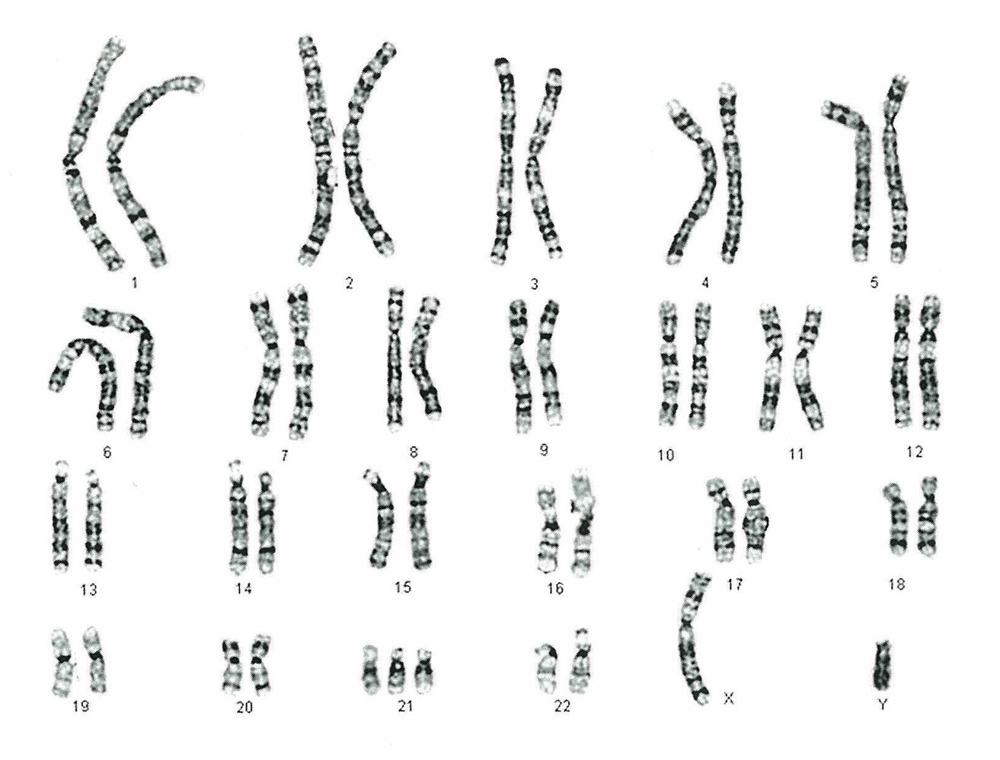
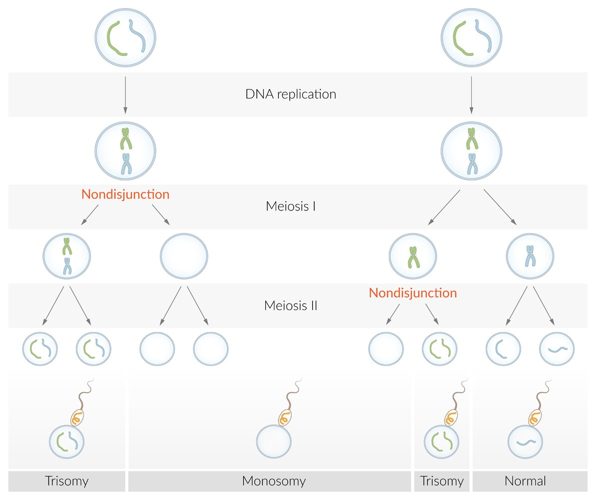
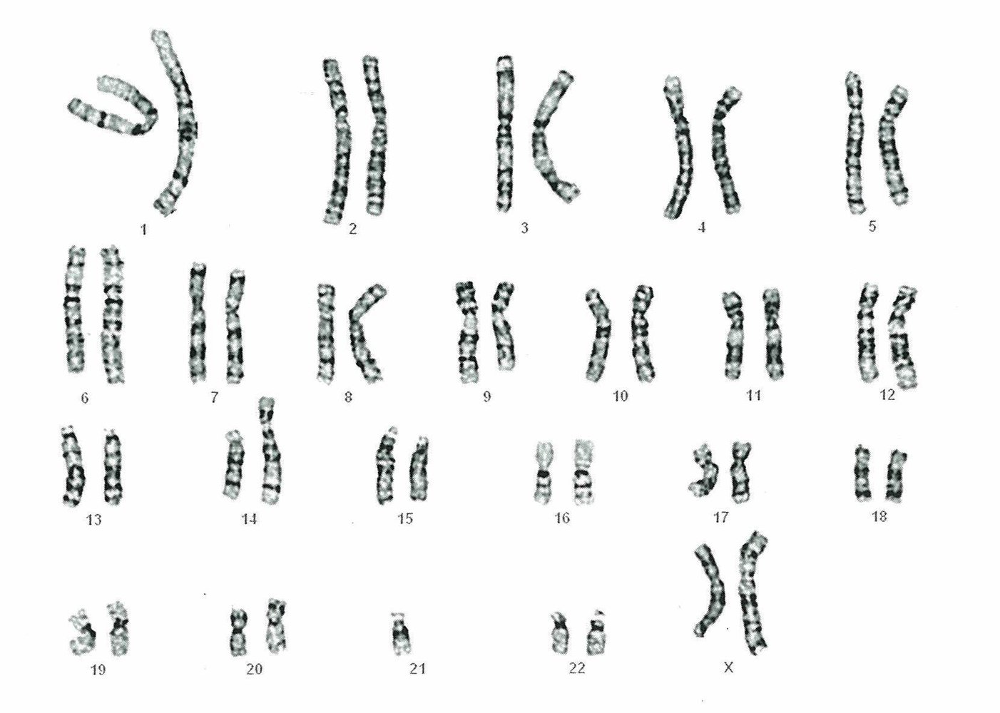
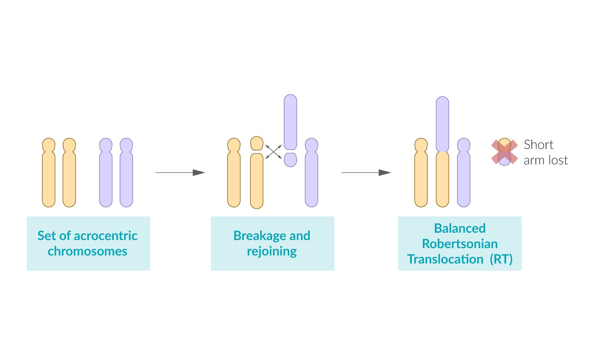
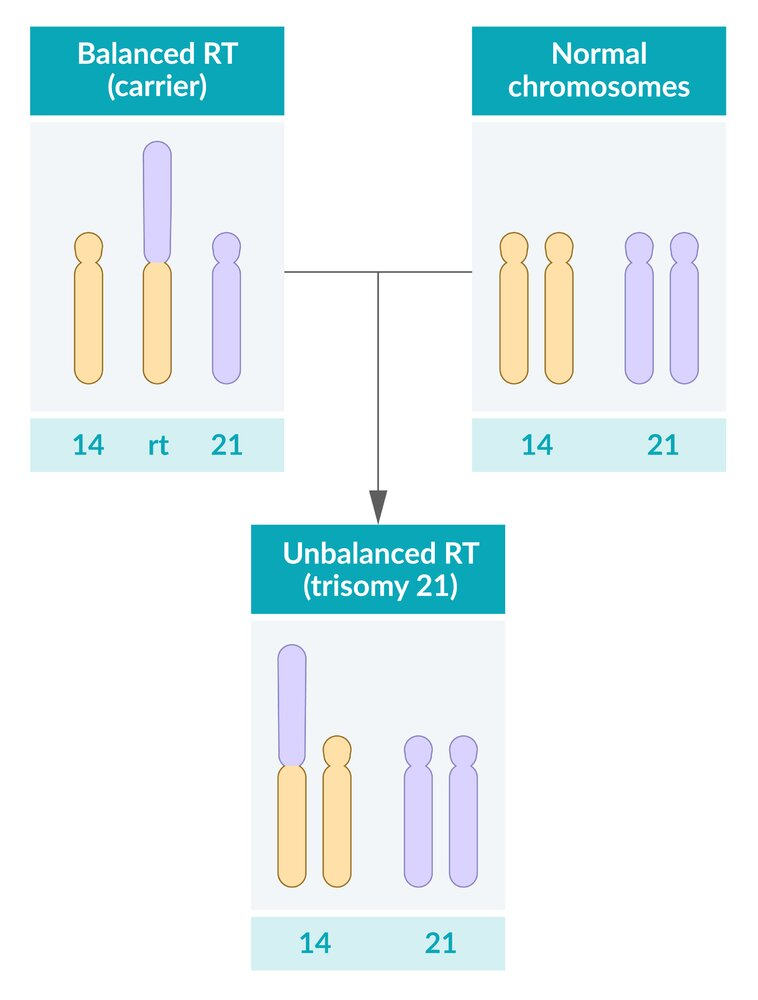
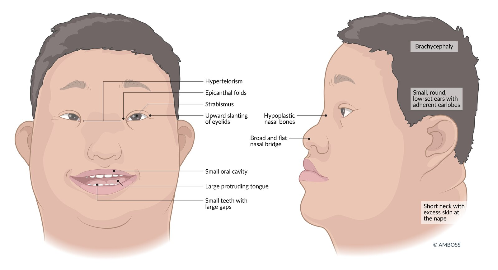
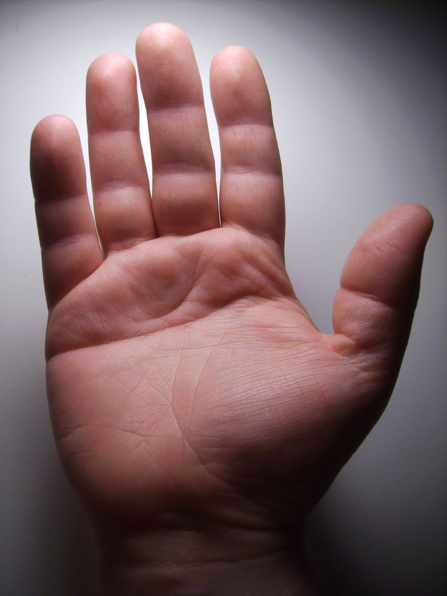
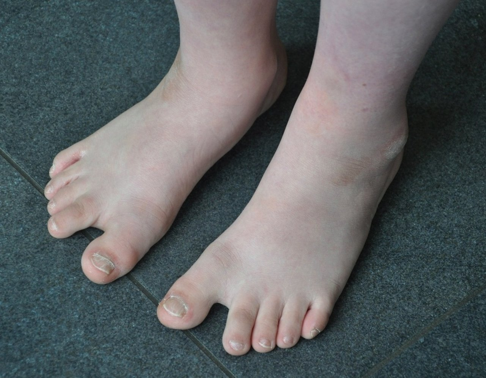
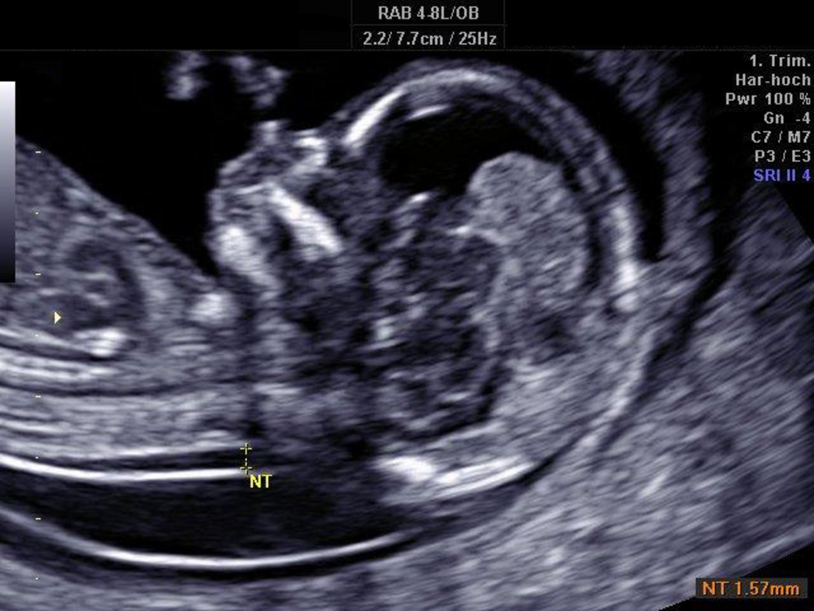
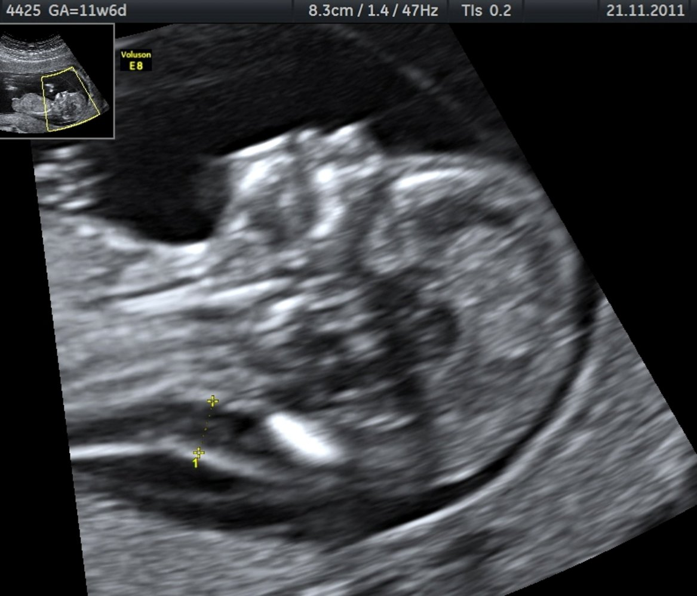

# Down syndrome

*Categories: Clinical knowledge > Genetics > Inherited syndromes > Down syndrome*

[Original Article Link](https://coursology-qbank.com/amboss/article/U40biT)

---

## Summary

Down syndrome, also called <u>trisomy</u> 21, is the most common <u>autosomal</u> <u>chromosomal</u> irregularity, occurring in approximately 1:700 live births. The risk of a <u>trisomy</u> 21 <u>pregnancy</u> increases with maternal age. Most individuals with Down syndrome have full <u>trisomy</u> 21, which occurs due to <u>meiotic</u> <u>nondisjunction</u> and results in a <u>genotype</u> with three complete copies of <u>chromosome</u> 21 and a total of 47 <u>chromosomes</u>. Other less common forms of Down syndrome are translocation <u>trisomy</u> 21 and <u>mosaic</u> <u>trisomy</u> 21. Clinically, <u>trisomy</u> 21 manifests as a syndrome involving a characteristic appearance (e.g., upward-slanting <u>palpebral fissures</u>, <u>epicanthal folds</u>, protruding <u>tongue</u>, <u>short stature</u>, <u>transverse palmar crease</u>, <u>sandal gap</u>), organ <u>malformations</u> (e.g., <u>heart</u> defects, <u>duodenal atresia</u>, <u>Hirschsprung disease</u>), and endocrine disorders (e.g., <u>obesity</u>, <u>diabetes mellitus</u>, <u>hypothyroidism</u>). <u>Trisomy</u> 21 is associated with an increased risk of <u>malignancy</u> (e.g., high risk of <u>leukemia</u>) and <u>intellectual disability</u>. Down syndrome is primarily detected in prenatal tests, including <u>ultrasound</u> measurement of <u>nuchal translucency</u> and maternal blood tests for certain <u>hormones</u> (e.g., increased <u>inhibin A</u> and <u>β-hCG</u>; decreased <u>estriol</u>, <u>alpha-fetoprotein</u>, and <u>pregnancy-associated protein A</u>). Fetal <u>karyotyping</u> via <u>chorionic villus sampling</u> or <u>amniocentesis</u> confirm the diagnosis, but these procedures are associated with an increased risk of fetal injury or loss. Management of <u>trisomy</u> 21 involves evaluation, monitoring, and treatment of the symptom complex and <u>malformations</u> as necessary.

Section 10.1 Down Syndrome

Down syndrome (trisomy 21) fact sheet

---

## Epidemiology

* Most common viable <u>autosomal chromosome</u> aberration;  (∼ 1:700;  <u>live births</u>) and most common genetic cause of cognitive impairment [[1]](https://coursology-qbank.com/amboss/article/1Ia2bN)[[2]](https://coursology-qbank.com/amboss/article/FkbgpF)

* The risk of a Down syndrome <u>pregnancy</u> increases with maternal age. [[3]](https://coursology-qbank.com/amboss/article/_tb5Tv)

* <u>Incidence</u> at 20 years: ∼ 1:2000

* <u>Incidence</u> at 30 years: ∼ 1:900

* <u>Incidence</u> at 40 years: ∼ 1:100

* <u>Incidence</u> at 45 years: ∼ 1:30

> [!TIP]
> The general risk of <u>trisomy</u> 21 increases with maternal age. This does not, however, apply to translocation <u>trisomies</u>!

Epidemiological data refers to the US, unless otherwise specified.

---

## Etiology

### Full <u>trisomy</u> 21 (∼ 95% of cases)

* Definition: three complete copies of <u>chromosome</u> 21 are present in all cells, with a total of 47 <u>chromosomes</u>

* Occurrence: : Full <u>trisomy</u> 21 is not a hereditary disease; ; the <u>chromosomal</u> irregularity occurs spontaneously.

* Pathogenesis: <u>meiotic</u> <u>nondisjunction</u>;   [[4]](https://coursology-qbank.com/amboss/article/xHYEsq)

* Maternal <u>nondisjunction</u> occurs during <u>meiosis I</u> in approx. 70% of cases and during <u>meiosis II</u> in approx. 20% of cases.

* May occur due to paternal <u>nondisjunction</u> during <u>spermatogenesis</u>, more commonly during <u>meiosis II</u> (approx. 5% of cases)

* <u>Karyotype</u>: <u>♀</u>: 47,XX,+21 or <u>♂</u>: 47,XY,+21

Karyogram in full trisomy 21

Meiotic nondisjunction

### Translocation trisomy 21 (3–4% of cases)

* Definition: : three copies of <u>chromosome</u> 21 are present, one of which is attached to another <u>chromosome</u>, usually <u>chromosome</u> 14 (less likely attached to <u>chromosomes</u> 13, 15, or 22)

* Occurrence: : independent of maternal age; occurs as a spontaneous translocation

* Pathogenesis and <u>karyotype</u>: Carriers of <u>balanced Robertsonian translocation</u> have a normal <u>phenotype</u>. Children of a translocation carrier can inherit a normal <u>karyotype</u>, <u>balanced translocation</u>, or <u>unbalanced translocation</u> (<u>trisomy</u> 21).

* In approx. 50% of cases, a <u>balanced translocation</u> is inherited from a parent, usually the mother, who does not show <u>phenotypic</u> expression of <u>trisomy</u> 21. [[5]](https://coursology-qbank.com/amboss/article/QsYuuq)

* <u>Balanced Robertsonian translocation</u>: translocation of the long arm of <u>chromosome</u> 21 to the long arm of <u>chromosome</u> 14 

* <u>Karyogram</u> shows a total number of 45 <u>chromosomes</u> and may be expressed as either <u>♀</u>: 45,XX,t(14;21) or <u>♂</u>: 45,XY,t(14;21)

* Affected individuals inherit a <u>balanced translocation</u> from their <u>phenotypically</u> normal parent.

* <u>Unbalanced Robertsonian translocation</u>: clinical features of <u>trisomy</u> 21 caused by inheritance of a translocation <u>chromosome</u> and a normal <u>chromosome</u> 

* Although there are only 46 <u>chromosomes</u> present, there are three copies of genetic material from <u>chromosome</u> 21.

* Results in the <u>karyotypes</u> <u>♀</u>: 46,XX,+21,t(14;21) and <u>♂</u>: 46,XY,+21,t(14;21)

* <u>Pregnancy</u> can end in <u>miscarriage</u>.  [[6]](https://coursology-qbank.com/amboss/article/csYaFq)

* The other cases of <u>balanced Robertsonian translocation</u> are caused by new translocations during <u>meiosis</u>.

Karyogram in balanced Robertsonian translocation (14/21)

Robertsonian Translocation 1

Robertsonian Translocation 2

### Mosaic trisomy 21 (1–2% of cases)

* Definition: two cell lines are present, the <u>trisomy</u> 21 cell line and the normal cell line

* Pathogenesis

* <u>Nondisjunction</u> during <u>mitosis</u> that occurs after <u>fertilization</u>

* Depending on the timing of the <u>mitotic</u> error, there is a variable <u>proportion</u> of trisomic and normal cells.

* <u>Phenotypic</u> expression varies according to the <u>ratio</u> of healthy to trisomic cells.

* <u>Karyotype</u>: either <u>♀</u>: 46,XX/47,XX,+21 or <u>♂</u>: 46,XY/47,XY,+21

> [!TIP]
> Although symptoms may be less severe in <u>mosaic</u> <u>trisomies</u>, the clinical manifestation generally provides no indication of the underlying genetic mutation.

> [!NOTE]
> To remember that Down syndrome is caused by <u>trisomy</u> 21, think of the Drinking age of 21 (in the US).

---

## Clinical features

### Facial and <u>cranial</u> features (craniofacial dysmorphia)

* Eyes

* Upward-slanting <u>palpebral fissures</u>

* <u>Epicanthal folds</u>

* Ocular <u>hypertelorism</u>: a distance between the eyes greater than the 95th <u>percentile</u>

* Brushfield spots: an aggregation of <u>connective tissue</u> in the periphery of the <u>iris</u>, visible as white or grayish-brown spots.

* <u>Refractive errors</u> (e.g., <u>myopia</u>, <u>astigmatism</u>)

* <u>Strabismus</u>

* <u>Cataracts</u> (congenital, infantile, or juvenile) [[7]](https://coursology-qbank.com/amboss/article/fIakXN)

* Mouth

* A small <u>oral cavity</u> together with a large and furrowed <u>tongue</u> results in the appearance of a protruding <u>tongue</u>.

* High arched and narrow <u>palate</u> [[8]](https://coursology-qbank.com/amboss/article/vHYAHq)

* <u>Teeth</u>: late development, small size with short roots, large gaps between <u>teeth</u>

* Further features

* <u>Brachycephaly</u>

* <u>Hypoplastic</u> <u>nasal bones</u>, broad and flat nasal bridge

* <u>Ear</u> anomalies (small, round, low-set <u>ears</u>, adherent earlobes)

* Short neck, excess <u>skin</u> at the nape of the neck (may be seen on <u>prenatal ultrasound</u>)

Facial features of Down syndrome

Common facial and cranial features of Down Syndrome

### Extremities, <u>soft tissue</u>, and skeletal features

* Extremities

* Transverse palmar crease: single crease that runs across the palm, along the <u>metacarpophalangeal joints</u> perpendicular to the fingers    [[9]](https://coursology-qbank.com/amboss/article/zHYrGq)

* Sandal gap: a <u>medial</u> displacement of the first toe leading to a large space between the first and second toes    [[10]](https://coursology-qbank.com/amboss/article/XsY9tq)

* Clinodactyly; : abnormal curvature of a finger (typically refers to inward curvature of the 5th finger)

* Camptodactyly

* A congenital, fixed digital <u>flexion</u> deformity most often seen in the 5th digit

* Associated with several congenital syndromes, including Down syndrome

* <u>Brachydactyly</u>

* <u>Soft tissue</u>

* <u>Connective tissue</u> deficiency → ↑ risk of umbilical and <u>inguinal hernias</u>

* Marked hyperextension of <u>joints</u>

* <u>Obesity</u>: <u>prevalence</u> is approx. 50% (higher than in the general population)  [[11]](https://coursology-qbank.com/amboss/article/iFbJ3v)

* Skeletal features

* <u>Atlantoaxial instability</u>

* <u>Short stature</u>

* Reduced growth with shortening of <u>long bones</u>

* Average adult height: 150 cm (4 ft 11 in)  [[12]](https://coursology-qbank.com/amboss/article/FK0gRS)

Single transverse palmar crease

Sandal gap

### Organ <u>malformations</u> and associated conditions

* <u>Heart</u>: congenital heart defects in trisomy 21 (∼ 50% of cases) [[13]](https://coursology-qbank.com/amboss/article/keXm_C)

* <u>Atrioventricular septal defect</u> (<u>endocardial cushion defect</u>) is the most common <u>heart</u> defect in individuals with Down syndrome.

* <u>Ventricular septal defect</u>

* <u>Atrial septal defects</u>

* <u>Tetralogy of Fallot</u>

* <u>Patent ductus arteriosus</u>

* <u>Gastrointestinal tract</u>

* <u>Duodenal atresia</u>/stenosis

* <u>Annular pancreas</u>

* <u>Anal atresia</u>

* <u>Megacolon</u>

* <u>Rectal prolapse</u>

* <u>Hirschsprung disease</u>

* Urogenital system

* <u>Hypogonadism</u>

* <u>Cryptorchidism</u>

* Decreased <u>fertility</u> in men

* Further features

* <u>Hypothyroidism</u>

* <u>Type 1 diabetes</u>

* <u>Celiac disease</u>

* <u>Obstructive sleep apnea</u>

* <u>Hearing loss</u> due to recurrent <u>otitis media</u>

* Increased risk of <u>leukemia</u> (<u>acute lymphoblastic leukemia</u>, <u>acute myeloid leukemia</u>)

* Early-onset <u>Alzheimer disease</u>;  (The <u>amyloid precursor protein</u>; , which generates <u>amyloid beta</u>, is located on <u>chromosome</u> 21.)

* Increased risk of developing <u>epilepsy</u>

### Development

* Motor skills

* Delayed <u>motor development</u>

* Muscle <u>hypotonia</u>

* <u>Intelligence</u>

* Varying levels of <u>intellectual disability</u> (average <u>IQ</u>: 50) [[14]](https://coursology-qbank.com/amboss/article/kFbmRv)

* Apparent within the first 12 months: <u>Developmental milestones</u> (e.g., sitting, walking, talking) are achieved at approximately twice the age of children without Down syndrome. [[15]](https://coursology-qbank.com/amboss/article/OFbIRv)

* Behavioral and psychiatric disorders

* Behavioral disorders

* <u>ADHD</u>

* <u>Conduct disorder</u>

* <u>Autism spectrum disorder</u>

> [!TIP]
> Down syndrome is the most common genetic cause of <u>intellectual disability</u>.

> [!NOTE]
> To remember the most important features associated with Down syndrome, think of the 5 A's: Advanced maternal age, <u>duodenal</u> Atresia, Atrioventricular septal defect, AML/ALL, early onset of Alzheimer disease.

---

## Diagnosis

### Diagnostic approach

* Diagnosis of Down syndrome is primarily prenatal and the diagnostic approach is dependent on the week of <u>gestation</u>.

* Initial <u>screening test</u>

* Standard tests

* First-trimester combined test (11–13 weeks)

* Second-trimester <u>quadruple test</u> (15–18 weeks)

* Additional tests, usually performed optionally in high-risk <u>pregnancies</u> (e.g., maternal age > 35 years, history of prior <u>pregnancy</u> with <u>trisomy</u>, <u>ultrasound</u> features suggesting <u>aneuploidy</u>) [[16]](https://coursology-qbank.com/amboss/article/ssYtwq)[[17]](https://coursology-qbank.com/amboss/article/AsYRxq)

* Integrated tests over the first and second trimesters

* Cell-free <u>DNA</u> (10–20 weeks)

* If any of the above <u>screening tests</u> yield an abnormal result, one of the following confirmatory diagnostic tests is performed:

* <u>Amniocentesis</u> (15–22 weeks)

* <u>Chorionic villus sampling</u> (9–14 weeks)

* <u>Percutaneous umbilical cord sampling</u> (18–22 weeks)

* See “<u>Prenatal diagnostics</u>.”

### Prenatal screening

#### Counseling

* Precedes screening procedures

* Provides information that screening is voluntary

* Explains the option of terminating the <u>pregnancy</u> if <u>trisomy</u> 21 is diagnosed

#### Screening procedures

* Indication: recommended for all women prior to the 20th week of <u>gestation</u>

* <u>Combined test (first trimester)</u> (11–13 weeks)

* Has a 90% detection rate [[18]](https://coursology-qbank.com/amboss/article/KsYUDq)

* Maternal serum

* ↑ Beta <u>human chorionic gonadotropin</u> (<u>β-hCG</u>)

* ↓ <u>Pregnancy-associated plasma protein A</u> (<u>PAPP-A</u>)

* <u>Ultrasound</u>

* <u>Nuchal translucency</u>;  measurement: <u>nuchal translucency</u> increases due to the large amount of fluid collecting behind the neck    [[19]](https://coursology-qbank.com/amboss/article/V8bGlv)

* Short neck, thickened nuchal fold

* Absent or <u>hypoplastic</u> <u>nasal bone</u>

* Shortened middle <u>phalanges</u> of the fifth digits with <u>clinodactyly</u>

* Shortened <u>long bones</u> (<u>humerus</u>, <u>femur</u>)

* <u>Quadruple test (second trimester)</u> (15–18 weeks)

* ↓ <u>Free estriol</u>

* ↓ <u>Alpha-fetoprotein</u> (<u>AFP</u>)

* ↑ <u>Inhibin A</u>

* ↑ <u>β-hCG</u>

* Additional <u>screening tests</u>: The following tests are optional and performed in addition to the above-mentioned tests, and they are evaluated along with the results of the second-trimester <u>quadruple test</u>.

* Sequential integrated test: combines the results from the first-trimester combined test and second-trimester <u>quadruple test</u>

* Cell-free fetal DNA (10–20 weeks): fetal <u>DNA</u> is isolated from a maternal blood specimen and evaluated for <u>chromosomal abnormalities</u>  [[20]](https://coursology-qbank.com/amboss/article/GsYBwq)

* Noninvasive (for the fetus) but expensive test

* More predictive in women with a high risk

* The test is currently available but not guideline-recommended.

> [!NOTE]
> In the <u>quadruple test</u>, hCG and Inhibin A are both HIgh up (↑) and Estriol and α-fEtoprotein are both dEficient (↓).

Normal nuchal translucency

Increased nuchal translucency in Down syndrome

#### Fetal <u>karyotyping</u> (<u>confirmatory test</u>)

* Indications

* Positive <u>screening test</u>

* Previous <u>trisomy</u> 21 <u>pregnancy</u>

* Parent with known <u>chromosomal translocation</u> or aberration

* Procedures [[21]](https://coursology-qbank.com/amboss/article/NsY-Eq)

* <u>Chorionic villus sampling</u> (9–14 weeks)

* <u>Amniocentesis</u> (15–22 weeks)

* <u>Percutaneous umbilical cord sampling</u> (18–22 weeks) [[22]](https://coursology-qbank.com/amboss/article/6sYjDq)

* Complications

* Bleeding

* Infection

* Fetal injury

* <u>Amniocentesis</u> has a lower risk of fetal loss  compared to <u>chorionic villus sampling</u>.

### Postnatal diagnostics

* <u>Chromosome</u> analysis

* Screening for associated conditions (see “Clinical features”), e.g., <u>echocardiography</u> to detect <u>heart</u> defects

> [!NOTE]
> Typical features and <u>malformations</u> are important indicators but diagnostic confirmation is still required.

---

## Differential diagnoses

* Isolated <u>hypotonia</u>

* <u>Zellweger syndrome</u>

* <u>Congenital hypothyroidism</u>

* <u>Trisomy 13</u>

* <u>Trisomy 18</u>

* <u>Williams syndrome</u>

* <u>Turner syndrome</u>

The differential diagnoses listed here are not exhaustive.

---

## Treatment

* Evaluation, monitoring, and treatment of the symptom complex and <u>malformations</u> as necessary (e.g., cardiac screening with an <u>echocardiogram</u> and <u>heart</u> <u>surgery</u> for cardiac <u>malformations</u>)

* Early, targeted intervention, educational programs, and support

* <u>Physical therapy</u>

* <u>Behavioral therapy</u>

* <u>Speech therapy</u>

* <u>Occupational therapy</u>

---

## Prognosis

* Decreased <u>life expectancy</u> with an average lifespan of approx. 60 years [[23]](https://coursology-qbank.com/amboss/article/P8bW5v)

* Common <u>causes of death</u> in individuals with Down syndrome (in decreasing order of <u>incidence</u>) [[24]](https://coursology-qbank.com/amboss/article/-HYDGq)[[25]](https://coursology-qbank.com/amboss/article/ZsYZtq)

* Infections, particularly <u>pneumonia</u>

* Congenital <u>malformations</u>, particularly <u>congenital heart diseases</u>

* Circulatory diseases (e.g., <u>coronary artery disease</u>)

* <u>Dementia</u>

---