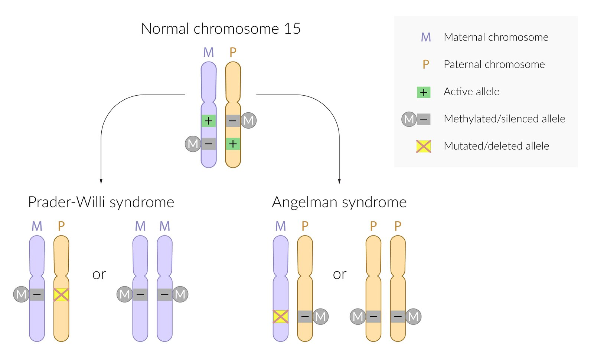
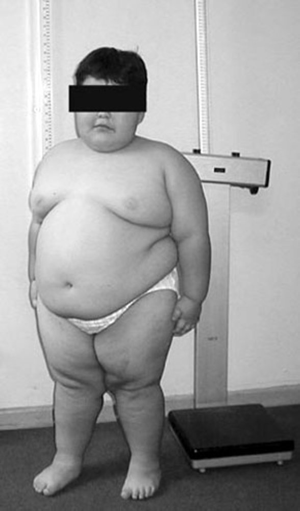
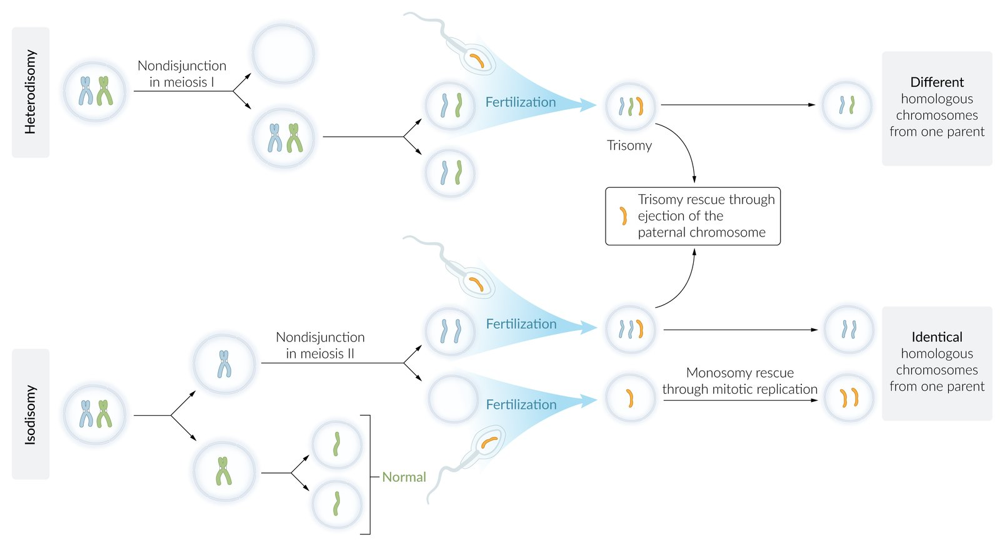
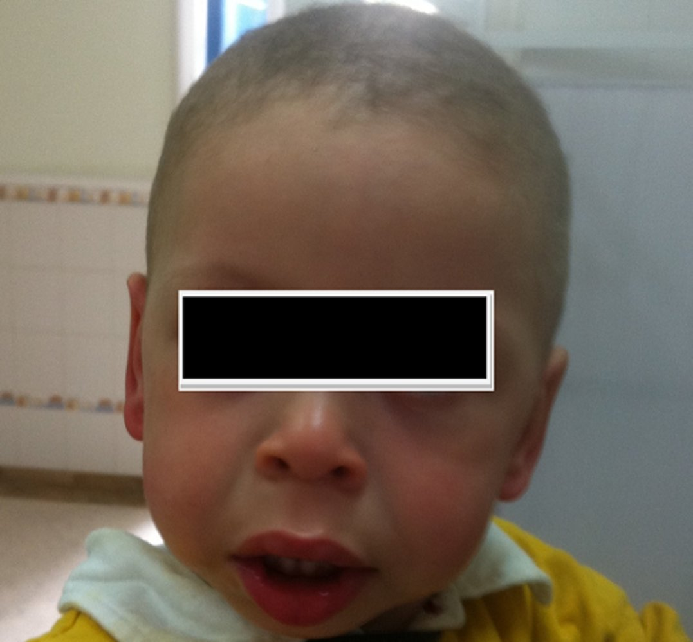

# Rare inherited syndromes

*Categories: Clinical knowledge > Genetics > Inherited syndromes > Rare inherited syndromes*

[Original Article Link](https://coursology-qbank.com/amboss/article/240TiT)

---

## Summary

This article provides an overview of inherited symptom complexes that occur rarely in the general population. These syndromes are caused by inherited genetic defects, which occur either due to <u>chromosomal aberrations</u> or <u>autosomal</u>/sex-linked traits. The presentation differs for each syndrome, with most features arising from developmental, functional, or structural anomalies of various organs. The diagnosis can be confirmed with the help of molecular genetic detection, <u>fluorescence in situ hybridization</u> (<u>FISH</u>), or other genetic/<u>chromosomal</u> studies. Treatment is usually symptomatic.

---

## Prader-Willi syndrome and Angelman syndrome

### Overview

* Definition: genetic syndromes caused by microdeletion (at 15q11-q13);   in combination with <u>genomic imprinting</u>.

* Etiology: The resulting condition depends on the affected <u>gene</u> copy. 

* <u>Angelman syndrome</u>

* Deletion or mutation of maternal UBE3A (<u>chromosome</u> 15) <u>gene</u> copy and paternal <u>gene</u> <u>methylation</u> (silencing)

* In ∼ 5% of cases, it results from paternal <u>uniparental disomy</u> (i.e. both copies of <u>chromosome</u> 15 are inherited from the father).

* <u>Prader-Willi syndrome</u>

* Deletion or mutation of paternal <u>gene</u> copy and maternal <u>gene</u> <u>methylation</u> (silencing)

* Caused by maternal <u>uniparental disomy</u> in about 20–35% of cases [[1]](https://coursology-qbank.com/amboss/article/rPbfTF)[[2]](https://coursology-qbank.com/amboss/article/7Pb4TF)

* Diagnosis: genetic tests

* <u>Fluorescence in situ hybridization</u> (<u>FISH</u>)

* Methylation testing

> [!NOTE]
> “Prader misses his Papa, and Angel her Mama”: <u>allele</u> mutation/deletion of paternal origin in Prader-Willi syndrome and maternal in Angelman syndrome.

Etiology of Prader-Willi and Angelman syndromes

#### Prader-Willi syndrome [[3]](https://coursology-qbank.com/amboss/article/SJaytl)[[4]](https://coursology-qbank.com/amboss/article/hJacFl)[[5]](https://coursology-qbank.com/amboss/article/AZYRVn)

* Clinical features 

* Muscular <u>hypotonia</u>  and poor feeding in <u>infants</u>

* Increased appetite (hyperphagia) and <u>obesity</u>

* <u>Short stature</u> , <u>scoliosis</u>

* <u>Cryptorchidism</u>, <u>hypogonadism</u> , genital <u>hypoplasia</u>

* Facial dysmorphia (e.g., almond-shaped eyes, thin upper lip)

* <u>Premature adrenarche</u> with early development of pubic/axillary <u>hair</u>

* <u>Developmental delays</u>;  (e.g., delayed achievement of milestones), <u>intellectual disability</u>

* Behavioral problems (e.g., <u>temper tantrums</u>, stubbornness, obsessive-compulsive behavior)

* Treatment

* Calorie restriction

* Substitution of <u>growth hormone</u> and sex <u>hormones</u>

* Complications

* <u>Sleep apnea</u> (most common)

* <u>Type 2 diabetes mellitus</u>

* Choking episodes

* Gastric distention and rupture

* Prognosis: normal <u>life expectancy</u> if extreme <u>obesity</u> is avoided

Prader-Willi syndrome fact sheet

Child with Prader-Willi syndrome

#### Angelman syndrome [[5]](https://coursology-qbank.com/amboss/article/AZYRVn)[[6]](https://coursology-qbank.com/amboss/article/3JaSFl)[[7]](https://coursology-qbank.com/amboss/article/Q-auCM)

* Clinical features  

* Delayed mental development and acquisition of motor skills in <u>infants</u> and young children; absent <u>speech development</u>

* <u>Intellectual disability</u>

* In more than 80% of cases, pronounced <u>epileptic seizures</u>

* <u>Microcephaly</u>

* <u>Ataxia</u>, tremulous movements of the limbs

* Truncal <u>hypotonia</u>, limb hypertonia, <u>hyperreflexia</u>

* Difficulty sleeping

* Characteristic happy demeanor with frequent laughing (inappropriate laughter)

* Hyperexcitability, short attention span

* Fascination with water

* Treatment

* No specific treatment

* Physical, occupational, and <u>speech therapy</u>

* <u>Antiepileptic drugs</u> (if applicable)

* Prognosis: <u>Life expectancy</u> is typically normal.

Angelman syndrome fact sheet

Uniparental disomy

> [!NOTE]
> “Angels in the HEAVENS”: Happy-go-lucky, Easily Excitable <u>personality</u>, Ataxia, Verbal underdevelopment, Epileptic <u>seizures</u>, abNormal facial features, Severe <u>intellectual disability</u>.

---

## Fragile X syndrome

* Definition: an <u>X-linked dominant</u> disease caused by a CGG <u>trinucleotide repeat expansion</u> in the FMR1 gene (<u>fragile X mental retardation 1 gene</u>) during <u>oogenesis</u>. This leads to its hypermethylation, which silences the <u>gene</u> and renders it unable to express its physiological <u>gene</u> product.    [[8]](https://coursology-qbank.com/amboss/article/TJa6tl)[[9]](https://coursology-qbank.com/amboss/article/yZYdVn)

* <u>Epidemiology</u>

* Second most common genetic cause of <u>intellectual disability</u> (after <u>trisomy 21</u>)

* Most common inherited cause of <u>intellectual disability</u>, as <u>trisomy 21</u> mostly occurs sporadically

* Sex distribution: <u>♂</u> >> <u>♀</u>

* Clinical features: The clinical presentation varies depending on the number of <u>trinucleotide repeats</u>.

* 50–200 repeats (premutation): <u>ataxia</u>, <u>primary ovarian insufficiency</u>, <u>tremor</u>

* > 200 repeats (full mutation):

* <u>Intellectual disability</u> of varying severity

* Delayed <u>language development</u>

* Behavioral features: autistic behavior, hyperactivity, <u>anxiety</u>

* Characteristic facial anomalies  

* Long and narrow face

* Prominent forehead and <u>jaw</u>

* Large everted <u>ears</u>

* <u>Hypermobile joints</u>

* In men: postpubertal macroorchidism (enlarged <u>testes</u>; rarely occurs prior to <u>puberty</u>)

* <u>Mitral valve prolapse</u>: can lead to <u>mitral regurgitation</u>

* Above-average head circumference

* <u>Focal seizures</u>

* Diagnosis

* Molecular genetic detection (<u>PCR</u>, <u>Southern blot</u>)

* Cytogenetic detection (not very sensitive)

* <u>Echocardiography</u>

* Treatment: symptomatic

* Prognosis: generally normal <u>life expectancy</u>

> [!NOTE]
> Fragile X: “X-tra large” <u>ears</u>, <u>testes</u>, and face in these patients.

---

## Rett syndrome

* Definition: X-linked disorder with progressive loss of <u>intelligence</u> and cognitive abilities such as language, locomotion, and fine motor skills [[10]](https://coursology-qbank.com/amboss/article/kJam8l)

* Etiology: X-linked dominant <u>gene</u> mutation in methyl-CpG binding protein 2 gene (MECP2 <u>gene</u>)

* Usually not an inherited <u>gene</u> defect, but rather a sporadic mutation

* Mutation usually occurs in the paternal <u>allele</u>; thus, females are almost exclusively affected

* If affected, male fetuses die in utero or shortly after <u>birth</u>.

* Clinical features

* Normal development until the first symptoms appear, which typically happens at 6–18 months of age

* Symptoms of neurodevelopmental regression, including:

* Loss of motor skills, especially targeted hand movements (affected children show characteristic hand wringing)

* <u>Truncal ataxia</u>, <u>apraxia</u>, choreatic movements

* Intellectual and verbal disability

* <u>Seizures</u>

* <u>Growth failure</u>

* <u>Scoliosis</u>

* <u>Hyperventilation</u>

* <u>Microcephaly</u>

* Diagnosis: : a combination of typical clinical presentation and <u>gene</u> mutation detection

* Prognosis: There is not enough data regarding <u>life expectancy</u> beyond the age of 40, as long-term studies are not available and the disease is fairly rare.

> [!NOTE]
> Rett Regresses: Normal development is shortly followed by a loss of targeted hand movements and intellectual and verbal disability.

Section 7.2 Rett Syndrome

---

## Cri-du-chat syndrome (cat cry syndrome)

* Definition: rare syndrome caused by a <u>chromosome</u> 5 aberration   [[11]](https://coursology-qbank.com/amboss/article/PJaW8l)[[12]](https://coursology-qbank.com/amboss/article/4Ja38l)

* <u>Epidemiology</u>: sex distribution: <u>♀</u> > <u>♂</u> (2:1)

* Etiology: microdeletion of the short arm at <u>chromosome</u> 5 (46,XX,5p- or 46,XY, 5p‑)

* Clinical features

* Cat-like, high-pitched crying in affected <u>infants</u>

* <u>Congenital heart defects</u>, e.g., <u>VSD</u>

* <u>Microcephaly</u>

* <u>Intellectual disability</u> (moderate to severe)

* <u>Single palmar crease</u>

* Dysmorphic facial features

* Moon facies

* Widely spaced eyes

* <u>Epicanthal folds</u>

* Broad nasal bridge

* Downward-slanting <u>palpebral fissures</u>

* Skeletal abnormalities

* Treatment

* Symptomatic treatment

* Early psychological and physical assistance

* Prognosis: A normal <u>life expectancy</u> is possible, but depends on the accompanying symptoms and therapeutic assistance.

Cri-du-chat syndrome (Cat cry syndrome) fact sheet

Section 12.1 Cri Du Chat Syndrome

---

## Williams syndrome

* Definition: a multisystem developmental disorder caused by a deletion at <u>chromosome</u> 7

* Etiology: : microdeletion of the long arm of <u>chromosome</u> 7 (includes a deletion of the <u>elastin</u> <u>gene</u>)

* Clinical features

* <u>Intellectual disability</u>

* Hypersociability (e.g., comfort with strangers), good verbal skills

* Characteristic facial features (elfin facies): 

* Midfacial <u>hypoplasia</u>,

* Short <u>palpebral fissure</u>

* Wide forehead

* Flattened nasal bridge, <u>anteverted</u> nostrils

* Long <u>philtrum</u>

* Hypodontia

* Cardiovascular <u>malformations</u>;  (esp. supravalvular aortic stenosis, <u>renal artery stenosis</u>)

* <u>Hypercalcemia</u> (due to increased <u>sensitivity</u> to <u>vitamin D</u>)

* Low muscle tone

* <u>Hyperacusis</u>, <u>phonophobia</u>

* Potential <u>malformations</u> and development problems in multiple organ systems, such as starburst-like pattern in the <u>iris</u> ("stellate <u>iris</u>")

* Diagnosis: : a combination of typical clinical presentation and <u>gene</u> mutation detection

Williams syndrome fact sheet

Williams syndrome

Section 12.2 Williams Syndrome

> [!NOTE]
> William takes ICEcream from strangers (Intellectual disabilities, Cardiovascular <u>malformations</u>, Elfin-like facial features, comfort with strangers).

---

## Zellweger syndrome (cerebrohepatorenal syndrome)

* Definition: an <u>autosomal recessive</u> defect in the PEX <u>gene</u> that results in impaired <u>peroxisome</u> synthesis  [[13]](https://coursology-qbank.com/amboss/article/RJalFl)[[14]](https://coursology-qbank.com/amboss/article/QJauFl)

* Clinical features

* Characterized by presentation in the <u>neonatal period</u> with <u>neonatal seizures</u> and <u>hypotonia</u>

* <u>Malformation</u> of the face and head

* <u>Hepatomegaly</u>

* Prolonged <u>jaundice</u> and feeding difficulties

* <u>Polycystic kidney disease</u> (PKD)

* Retinal <u>dystrophy</u> and <u>sensorineural hearing loss</u>

* Diagnosis: increased concentration of <u>very long chain fatty acids</u> in the blood

* Treatment

* Currently, there is no cure for <u>Zellweger syndrome</u> available.

* Supportive management, including:

* Placement of a <u>feeding tube</u>

* Consulting specialists to treat individual problems (e.g., audiologists, ophthalmologists, orthopedists)

* Prognosis: <u>death</u> within one year of <u>birth</u>

---

## Pierre Robin sequence (Pierre Robin syndrome)

* Definition: : a set of abnormalities causing fetal oral and maxillofacial <u>malformations</u>  [[15]](https://coursology-qbank.com/amboss/article/jJa_Fl)

* Clinical features

* <u>Cleft palate</u>

* Glossoptosis (<u>retraction</u> of the <u>tongue</u> in the <u>pharynx</u>) with possible complications such as acute <u>respiratory distress</u> and <u>aspiration</u>

* Mandibular retrognathia (<u>posterior</u> mandibular positioning) or micrognathia (small lower <u>jaw</u>)

* Possible <u>intellectual disability</u> [[16]](https://coursology-qbank.com/amboss/article/-ZYDVn)

* Diagnosis: <u>fluorescence in situ hybridization</u> (<u>FISH</u>)

* Treatment

* If moderate <u>dyspnea</u>: symptomatic treatment

* <u>Noninvasive ventilation</u>

* Supervision and assistance while eating

* If severe <u>dyspnea</u>: surgical correction

* Special interventions for long-term correction (e.g., mandibular distraction to position the <u>tongue</u> closer to the front of the mouth)

* In cases of acute life-threatening respiratory <u>distress</u> → <u>tracheostomy</u>

---

## Smith-Lemli-Opitz syndrome

* Definition: <u>autosomal recessive</u> disease with <u>cholesterol</u> shortage due to deficient <u>7-dehydrocholesterol</u> reductase [[18]](https://coursology-qbank.com/amboss/article/Y0Ynen)[[19]](https://coursology-qbank.com/amboss/article/b0YHen)

* Etiology: <u>gene</u> mutation of DHCR7 (<u>7-dehydrocholesterol</u> reductase) at <u>chromosome</u> 11

* Clinical features: Symptoms may vary widely.

* <u>Short stature</u>

* Dysmorphic facial features (<u>ptosis</u>, <u>epicanthal folds</u>, <u>microcephaly</u>, <u>micrognathia</u>)

* <u>Intellectual disability</u>

* Internal organs <u>malformations</u> (genitals, <u>kidneys</u>, <u>heart</u>)

* Toe <u>syndactyly</u>

* <u>Single palmar crease</u>

* <u>Seizures</u>

* Diagnosis: ↑ <u>7-dehydrocholesterol</u>, ↓ <u>cholesterol</u>

* Treatment: <u>cholesterol</u> substitution

---

## Albright hereditary osteodystrophy (Martin-Albright syndrome)

* Definition: a constellation of physical findings that occur in patients with pseudohypoparathyroidism type 1a and <u>pseudopseudohypoparathyroidism</u>

* Mode of inheritance: : usually <u>autosomal dominant</u>

* Clinical features

* <u>Short stature</u>, round face, as well as <u>metacarpal</u> and <u>metatarsal</u> shortening (shortened fourth and fifth digits)

* <u>Intellectual disability</u> (oligophrenia)

* Additionally signs of <u>hypoparathyroidism</u>: <u>hypocalcemia</u>, <u>tetany</u>, cerebral <u>seizures</u>, intracranial calcifications, and <u>tooth</u> anomalies

* Laboratory findings

* Pseudohypoparathyroidism type 1a: ↑ <u>PTH</u>, ↓ <u>calcitriol</u>, ↓ <u>calcium</u>, ↑ <u>phosphate</u>

* <u>Pseudopseudohypoparathyroidism</u>: normal <u>PTH</u>, <u>calcitriol</u>, <u>calcium</u>, and <u>phosphate</u>

---

## Noonan syndrome

* Definition: <u>autosomal dominant</u> condition with a heterogeneous clinical picture due to mutation in the PTPN11 <u>gene</u> on <u>chromosome</u> 12 [[20]](https://coursology-qbank.com/amboss/article/c0YaUn)

* <u>Epidemiology</u>: 1:1000–2500 <u>live births</u>

* Clinical features

* Proportionate <u>short stature</u> (often developing only after <u>birth</u>)

* Minor facial dysmorphism, including ocular hypertelorism (a distance between the eyes that is greater than the 95th <u>percentile</u>);  and downslanting eyes; <u>webbed neck</u>

* <u>Heart</u> disease (including <u>pulmonary valve stenosis</u>)

* Intellectual development may be delayed, but by adulthood <u>intelligence</u> is normal in ⅔ of patients.

* Differential diagnoses

* Bardet-Biedl syndrome: a rare monogenic hereditary disease characterized by <u>short stature</u>, <u>obesity</u>, <u>retinitis pigmentosa</u>, <u>intellectual disability</u>, and <u>polydactyly</u>

* Weill-Marchesani syndrome: a rare hereditary disorder characterized by <u>dwarfism</u>, <u>heart</u> defects, and <u>eye</u> conditions (<u>lenticonus</u>, <u>ectopia lentis</u>, and secondary <u>glaucoma</u>)

---

## Treacher Collins syndrome

* Definition: An <u>autosomal dominant</u> condition characterized by craniofacial abnormalities and external <u>ear</u> deformities resulting from impaired migration of <u>neural crest cells</u> into the first and second <u>branchial arches</u>. [[21]](https://coursology-qbank.com/amboss/article/4Ob3sF)

* Etiology: most commonly results from the mutations of TCOF1 <u>gene</u>  on <u>chromosome</u> 5 or POLR1D <u>gene</u>  on <u>chromosome</u> 5

* Clinical features

* <u>Micrognathia</u> and <u>retrognathia</u> → difficulties with feeding and respiration

* <u>Hypoplasia</u> of the zygomatic arch → downward slant of the eyes

* External <u>ear</u> and auditory canal abnormalities → <u>conductive hearing loss</u>

* <u>Coloboma</u> of the lower lid

* Management

* <u>Respiratory support</u> if needed

* Craniofacial reconstruction <u>surgery</u>

* <u>Hearing aids</u>

* <u>Speech therapy</u>

---

## Pulmonary alveolar proteinosis (PAP)

|  Overview of <u>pulmonary alveolar proteinosis</u> [[22]](https://coursology-qbank.com/amboss/article/_lc5zc0)[[23]](https://coursology-qbank.com/amboss/article/-5cD510)  |  |  |  |  |
| --- | --- | --- | --- | --- |
| Characteristics | Primary <u>PAP</u> |  | Secondary <u>PAP</u> | Congenital <u>PAP</u> |
| Autoimmune <u>PAP</u> | Hereditary <u>PAP</u> |  |  |  |
| Definition |  * Syndromes characterized by the progressive accumulation of <u>surfactant</u> protein in the <u>alveoli</u>   |  |  |  |
|  <u>Epidemiology</u> [[23]](https://coursology-qbank.com/amboss/article/-5cD510)  |   * > 90% of all <u>PAP</u> cases  * <u>Prevalence</u>: 6–7:1,000,000  * Peak age of onset: 30–40 years    |  * ∼ 3% of all cases of <u>PAP</u>   |  * 5–10% of all cases of <u>PAP</u>   |  * ∼ 2% of all cases of <u>PAP</u>   |
| Etiology |  * <u>Autoimmunity</u>   |  * Genetic mutations   |  * Associated with conditions such as:  * Chronic infections  * Exposure to toxic substances (e.g., <u>chemotherapeutic agents</u>)  * <u>Myelodysplastic syndromes</u>  * <u>Malignancy</u>  * <u>Immunodeficiency</u> (e.g., due to <u>HIV infection</u>/<u>AIDS</u>)   |  * Genetic mutations   |
| Pathophysiology |  * Production of <u>GM-CSF</u> <u>autoantibodies</u> → ↓ stimulation of <u>alveolar macrophages</u>   |  * Mutations in <u>genes</u> encoding for <u>GM-CSF</u> <u>receptor</u> subunits → dysfunctional <u>GM-CSF</u> <u>receptors</u> on alveolar <u>macrophages</u> → inability to bind <u>GM-CSF</u> → ↓ ability to remove <u>surfactant</u>   |  * Underlying cause → ↓ number of <u>alveolar macrophages</u>   |  * Mutations in <u>genes</u> coding for <u>surfactant</u> <u>proteins</u> (e.g., <u>surfactant</u> <u>protein C</u>), involved in <u>lung</u> development (e.g., NKX2.1), or <u>surfactant</u> lipid inclusion (ABCA3) → production of abnormal <u>surfactant</u>   |
|  * Progressive <u>surfactant</u> accumulation in the <u>alveoli</u> interferes with <u>gas exchange</u>.   |  |  |  |  |
| Clinical features |   * <u>Dyspnea</u>  * <u>Cough</u> (dry or productive), <u>hemoptysis</u>  * <u>Cyanosis</u>  * Weight loss, fatigue, <u>malaise</u>    |  |  |  |
| Diagnostics |   * Clinical history  * <u>X-ray</u>/CT chest shows a characteristic pattern of <u>ground-glass opacity</u> and reticular densities (<u>crazy-paving</u> pattern)  * <u>Bronchoalveolar lavage</u>  * Possibly <u>lung</u> <u>biopsy</u>    |  |  |  |
| Treatment |   * Whole <u>lung</u> lavage: excess <u>surfactant</u> is removed from the <u>lungs</u> via saline solution; may require repeated application  * Subcutaneous injection or experimental inhalation of <u>GM-CSF</u> may be beneficial in autoimmune <u>PAP</u>, as might treatment with <u>rituximab</u> and/or <u>plasmapheresis</u>    |  |  * Treatment of the underlying condition   |   * Supportive treatment  * <u>Lung transplantation</u>    |
| Complications |   * Secondary infections  * <u>Respiratory failure</u>  * <u>Lung</u> <u>fibrosis</u>    |  |  |  |

---

## Familial lipoprotein lipase deficiency

* Definition: an inherited genetic condition characterized by <u>lipoprotein lipase</u> (<u>LPL</u>) enzyme deficiency, which leads to hyperchylomicronemia

* <u>Epidemiology</u>: 1:250,000 [[24]](https://coursology-qbank.com/amboss/article/zlcrzc0)

* Etiology: : caused by mutations of the <u>LPL</u> <u>gene</u>

* Pathophysiology: <u>gene mutations</u> → <u>LPL deficiency</u> → ↓ breakdown of <u>chylomicrons</u> → hyperchylomicronemia

* Clinical features

* Episodic epigastric <u>pain</u> of varying intensity

* <u>Hepatosplenomegaly</u>

* Eruptive cutaneous <u>xanthomas</u>

* <u>Lipemia retinalis</u>

* Neuropsychiatric symptoms (e.g., <u>depression</u>)

* Diagnostics

* Clinical history

* Blood tests: ↓ <u>LPL</u> activity

* Confirmatory molecular genetic

* Treatment: lifestyle modifications (e.g., dietary restriction of fat, avoidance of <u>alcohol</u> and drugs that increase <u>triglyceride</u> levels)  [[25]](https://coursology-qbank.com/amboss/article/-lcDzc0)

References:[[24]](https://coursology-qbank.com/amboss/article/zlcrzc0)

---