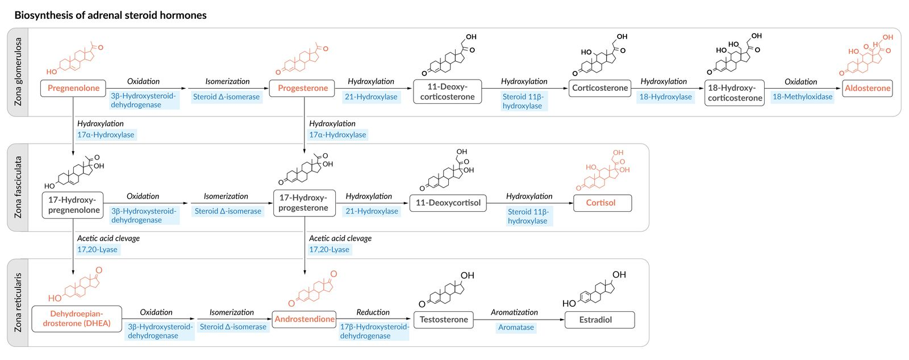
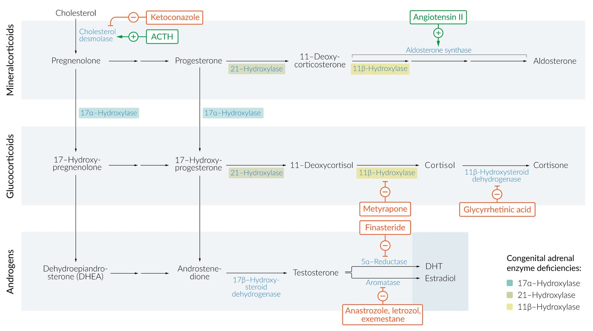

# Congenital adrenal hyperplasia

*Categories: Clinical knowledge > Genetics > Metabolic and endocrine disorders > Congenital adrenal hyperplasia*

[Original Article Link](https://coursology-qbank.com/amboss/article/W40PRT)

---

## Summary

Congenital <u>adrenal hyperplasia</u> (CAH) refers to a group of disorders caused by <u>autosomal recessive</u> variants that reduce or eliminate the activity of enzymes responsible for synthesizing <u>adrenal</u> <u>steroid hormones</u> (e.g., <u>cortisol</u>, <u>aldosterone</u>). CAH is characterized by reduced <u>cortisol</u>, elevated <u>adrenocorticotropic hormone</u> (<u>ACTH</u>), <u>adrenal hyperplasia</u>, and often <u>androgen excess</u>, with or without <u>aldosterone</u> deficiency. Clinical features vary by <u>karyotype</u> (i.e., 46,XX or 46,XY) and type and severity of the enzyme deficiency. The most common type of CAH is caused by a deficiency of <u>21-hydroxylase</u>. <u>Classic 21-hydroxylase deficiency</u> may be recognizable at <u>birth</u> in 46,XX individuals because it can cause atypical external genitalia. <u>Neonates</u> with the salt-wasting subtype of <u>21-hydroxylase deficiency</u> may present with <u>adrenal crisis</u> (e.g., <u>shock</u>, <u>vomiting</u>, poor feeding) within a few weeks of <u>birth</u>. Routine <u>neonatal screening</u> is performed within 48 hours of <u>birth</u> to identify <u>neonates</u> with the condition before symptoms manifest. The simple <u>virilizing</u> subtype of <u>classic 21-hydroxylase deficiency</u> typically manifests in childhood with early <u>adrenarche</u> and <u>precocious puberty</u>, while <u>nonclassic 21-hydroxylase deficiency</u> is a milder form of CAH that is often not diagnosed until <u>adolescence</u> or adulthood. Other types of CAH (e.g., <u>11β-hydroxylase deficiency</u> and <u>17α-hydroxylase deficiency</u>) are rare. Treatment varies depending on the <u>karyotype</u> and type and severity of the enzyme deficiency and may include <u>glucocorticoid</u> and <u>mineralocorticoid</u> replacement, <u>hypertension management</u>, <u>androgen</u> inhibition or replacement, and/or <u>surgery</u> for atypical genitalia.

---

## Overview

|  Overview of CAH [[1]](https://coursology-qbank.com/amboss/article/nJd7uI0)[[2]](https://coursology-qbank.com/amboss/article/g0VF2G0) [[3]](https://coursology-qbank.com/amboss/article/m0VVgG0)[[4]](https://coursology-qbank.com/amboss/article/h0VcfG0)  |  |  |  |
| --- | --- | --- | --- |
| ‎ | <u>Classic 21-hydroxylase deficiency</u> (salt-wasting type) |  Classic <u>11β-hydroxylase deficiency</u> |  <u>17α-hydroxylase deficiency</u> |
|  Endocrine changes |   * ↓ <u>11-deoxycorticosterone</u>  * ↓ <u>Corticosterone</u> [[5]](https://coursology-qbank.com/amboss/article/KbVUuG0)  * ↓ <u>Aldosterone</u>  * ↑↑ <u>17-hydroxyprogesterone</u>  * ↓ <u>Cortisol</u>  * ↑ <u>Androgens</u>    |   * ↑↑ <u>11-deoxycorticosterone</u>  * ↓ <u>Corticosterone</u>  * ↓ <u>Aldosterone</u>  * ↑ <u>17-hydroxyprogesterone</u>  * ↓ <u>Cortisol</u>  * ↑ <u>Androgens</u>    |   * ↑ <u>11-deoxycorticosterone</u>  * ↑↑ <u>Corticosterone</u>  * ↓ <u>Aldosterone</u>  [[6]](https://coursology-qbank.com/amboss/article/pbVLuG0)  * ↓ <u>17-hydroxyprogesterone</u>  * ↓ <u>Cortisol</u>  * ↓ <u>Androgens</u>    |
|  <u>Electrolyte</u> changes |   * ↓ <u>Sodium</u>  * ↑ <u>Potassium</u>  * <u>Metabolic acidosis</u> [[7]](https://coursology-qbank.com/amboss/article/S0Vy2G0)    |   * ↑ <u>Sodium</u> retention  [[8]](https://coursology-qbank.com/amboss/article/FbVgvG0)[[9]](https://coursology-qbank.com/amboss/article/l0VvTG0)  * ↓ <u>Potassium</u>  * <u>Metabolic alkalosis</u> [[10]](https://coursology-qbank.com/amboss/article/6bVjuG0)    |   * ↑ <u>Sodium</u> retention  [[10]](https://coursology-qbank.com/amboss/article/6bVjuG0)  * ↓ <u>Potassium</u>  * <u>Metabolic alkalosis</u>    |
|  Blood pressure changes |  * <u>Hypotension</u>   |  * <u>Hypertension</u>   |  |
|  46,XX <u>karyotype</u> |   * <u>46,XX DSD due to hyperandrogenism</u> (manifesting with, e.g., clitoromegaly)  * <u>Precocious puberty</u>  * <u>Virilization</u>  * Irregular <u>menstrual cycles</u>, <u>infertility</u>    |  |   * Typical female external genitalia at <u>birth</u>  * <u>Delayed puberty</u> (<u>primary amenorrhea</u>), absent <u>secondary sexual characteristics</u>    |
|  46,XY <u>karyotype</u> |   * Typical male external genitalia at <u>birth</u>  * <u>Precocious puberty</u>    |  |   * <u>46,XY DSD</u> due to <u>hypoandrogenism</u> (female external genitalia with a blind-ending <u>vagina</u> and <u>undescended testes</u>)  * <u>Delayed puberty</u>, absent <u>secondary sexual characteristics</u>    |

> [!NOTE]
> <u>Hypocortisolism</u> is seen in all forms of CAH.

---

## Pathophysiology

* Congenital <u>adrenal hyperplasia</u> (CAH) is caused by <u>autosomal recessive</u> genetic variants that reduce or eliminate the activity of enzymes responsible for synthesizing <u>adrenal</u> <u>steroid hormones</u> (e.g., <u>cortisol</u>, <u>aldosterone</u>). 

* <u>21-hydroxylase deficiency</u> → ↓ <u>cortisol</u> and ↓ <u>aldosterone</u>  [[2]](https://coursology-qbank.com/amboss/article/g0VF2G0)

* <u>11β-hydroxylase deficiency</u> and <u>17α-hydroxylase deficiency</u> → ↓ <u>cortisol</u> and ↑ <u>11-deoxycorticosterone</u> (<u>DOC</u>)

* ↓ <u>Cortisol</u> → ↑ <u>ACTH</u> → <u>adrenal hyperplasia</u>

* In <u>21-hydroxylase deficiency</u> and <u>11β-hydroxylase deficiency</u>, <u>adrenal hyperplasia</u> results in accumulation of <u>cortisol</u> precursors → ↑ <u>androgens</u>

* In <u>17α-hydroxylase deficiency</u>, production of <u>cortisol</u> precursors is blocked → ↓ <u>androgens</u>

* ↑ <u>DOC</u> (a <u>mineralocorticoid</u>) → <u>sodium</u> retention, urinary excretion of <u>potassium</u>, volume expansion, <u>hypertension</u> → <u>renin-angiotensin-aldosterone system</u> suppression → ↓ <u>aldosterone</u> [[6]](https://coursology-qbank.com/amboss/article/pbVLuG0)

> [!NOTE]
> “1 <u>DOC</u>:” If the deficient enzyme starts with 1 (11β-hydroxylase, 17α-hydroxylase), there is increased <u>DOC</u>. “AND 1:” If the deficient enzyme numeral ends with 1 (21-hydroxylase, 11β‑hydroxylase), <u>androgens</u> are increased.

Biosynthesis of adrenal steroid hormones

Congenital adrenal hyperplasia on steroid pathway and affecting drugs

---

## Clinical features

Specific features of CAH vary by subtype; see "Subtypes and variants" for details. General features suggestive of CAH include: [[1]](https://coursology-qbank.com/amboss/article/nJd7uI0)[[2]](https://coursology-qbank.com/amboss/article/g0VF2G0)[[3]](https://coursology-qbank.com/amboss/article/m0VVgG0)

* Atypical genitalia

* <u>Clinical features of adrenal crisis</u> (e.g., <u>vomiting</u>, <u>diarrhea</u>, <u>shock</u>, <u>dehydration</u>, poor feeding) within 3 weeks of <u>birth</u>

* Signs of <u>virilization</u> (e.g., early <u>adrenarche</u>, <u>precocious puberty</u>, advanced <u>bone age</u>, <u>acne</u>) in prepubertal children

* <u>Amenorrhea</u> and/or absent <u>secondary sexual characteristics</u> in <u>adolescents</u>

* <u>Signs of hyperandrogenism</u> in <u>adolescent</u> or adult female individuals

* <u>Hypertension in children</u>

* <u>Stress</u>-induced <u>hypoglycemia</u>

* <u>Hyperpigmentation</u>

> [!WARNING]
> <u>Infants</u> with <u>21-hydroxylase</u> deficiency may present with <u>shock</u> in the first 3 weeks of life due to <u>hypoaldosteronism</u>. [[11]](https://coursology-qbank.com/amboss/article/DbV1DG0) [[2]](https://coursology-qbank.com/amboss/article/g0VF2G0)

> [!NOTE]
> Individuals with a 46,XX <u>karyotype</u> and <u>virilizing</u> CAH are more likely to experience <u>gender dysphoria</u>.

---

## Differential diagnoses

* <u>Precocious pseudopuberty</u>

* <u>Primary adrenal insufficiency</u>

* <u>PCOS</u>

* <u>Hyperprolactinemia</u>

* Cushing Syndrome

> [!TIP]
> <u>Nonclassic CAH</u> may be difficult to distinguish from <u>polycystic ovarian syndrome</u>. [[9]](https://coursology-qbank.com/amboss/article/l0VvTG0)

The differential diagnoses listed here are not exhaustive.

---

## Subtypes and variants

* The three most common subtypes are:

* <u>21-hydroxylase deficiency</u> (∼ 95% of CAH) [[7]](https://coursology-qbank.com/amboss/article/S0Vy2G0)

* <u>11β-hydroxylase deficiency</u> (∼ 5% of CAH) [[13]](https://coursology-qbank.com/amboss/article/NmV-fE0)

* <u>17α-hydroxylase deficiency</u> (rare) [[3]](https://coursology-qbank.com/amboss/article/m0VVgG0)

* Other rare subtypes include: [[3]](https://coursology-qbank.com/amboss/article/m0VVgG0)

* <u>3β-hydroxysteroid dehydrogenase deficiency</u>

* <u>Cytochrome P450</u> oxidoreductase deficiency

* Lipoid CAH

---

## 21-hydroxylase deficiency

### <u>Epidemiology</u>

* <u>Classic 21-hydroxylase deficiency</u>

* <u>Prevalence</u>: rare (1:14,000–1:18,000 <u>live births</u>) [[1]](https://coursology-qbank.com/amboss/article/nJd7uI0)

* Most common in genetically isolated populations (e.g., Alaskan Yupik) [[7]](https://coursology-qbank.com/amboss/article/S0Vy2G0)[[14]](https://coursology-qbank.com/amboss/article/WbVPsG0)

* <u>Nonclassic 21-hydroxylase deficiency</u> 

* <u>Prevalence</u>: most common type (∼ 1:200) [[15]](https://coursology-qbank.com/amboss/article/n0V7gG0)

* Most common in Mediterranean and <u>Ashkenazi Jewish populations</u> [[15]](https://coursology-qbank.com/amboss/article/n0V7gG0)

### Clinical features

* The <u>clinical features of 21-hydroxylase deficiency</u> occur on a spectrum based on the level of enzyme activity. [[1]](https://coursology-qbank.com/amboss/article/nJd7uI0)

* <u>Classic 21-hydroxylase deficiency</u>: <2% of normal enzyme activity levels

* <u>Nonclassic 21-hydroxylase deficiency</u>: 20–50% of normal enzyme activity levels

| ‎Clinical features of 21-hydroxylase deficiency [[2]](https://coursology-qbank.com/amboss/article/g0VF2G0)[[4]](https://coursology-qbank.com/amboss/article/h0VcfG0)[[7]](https://coursology-qbank.com/amboss/article/S0Vy2G0)  |  |  |  |
| --- | --- | --- | --- |
|  |  <u>Classic 21-hydroxylase deficiency</u>  [[2]](https://coursology-qbank.com/amboss/article/g0VF2G0)  |  | <u>Nonclassic 21-hydroxylase deficiency</u> |
| Salt-wasting type | Simple <u>virilizing</u> type |  |  |
| Appearance of external genitalia at <u>birth</u> |   * XX <u>karyotype</u>: atypical (<u>46,XX DSD due to hyperandrogenism</u>)  * XY karotype: typical    |  |  * Typical   |
| Symptom onset |  * Early: first 21 days of life   |  * Late: typically during <u>toddler</u> years   |  * Childhood, <u>adolescence</u>, or adulthood   |
|  Signs and symptoms |   * Symptoms of salt-wasting <u>adrenal crisis</u> (e.g., <u>shock</u>, <u>vomiting</u>, poor feeding, <u>dehydration</u>)  * <u>Growth faltering</u>  [[1]](https://coursology-qbank.com/amboss/article/nJd7uI0)    |   * No signs of <u>adrenal crisis</u>  * Accelerated <u>linear growth velocity</u>  * Early <u>adrenarche</u>, <u>precocious puberty</u>    |   * Children  * Accelerated <u>linear growth velocity</u>  * Advanced <u>bone age</u>  * Early <u>adrenarche</u>, <u>precocious puberty</u>  * <u>Adolescents</u> and adults  * <u>Signs of hyperandrogenism</u> (e.g., <u>hirsutism</u>, <u>acne</u>)  * Irregular <u>menstrual cycles</u>  * <u>Infertility</u>, <u>recurrent miscarriage</u>    |

> [!WARNING]
> All individuals with <u>classic 21-hydroxylase deficiency</u> have some level of salt-wasting and <u>androgen excess</u> regardless of subtype. [[2]](https://coursology-qbank.com/amboss/article/g0VF2G0)

> [!TIP]
> Individuals with <u>nonclassic 21-hydroxylase deficiency</u> and XY <u>karyotype</u> are often asymptomatic before <u>puberty</u>. [[7]](https://coursology-qbank.com/amboss/article/S0Vy2G0)

### <u>Newborn screening</u> [[1]](https://coursology-qbank.com/amboss/article/nJd7uI0)[[12]](https://coursology-qbank.com/amboss/article/O0VITG0)[[14]](https://coursology-qbank.com/amboss/article/WbVPsG0)

Newborn screening for 21-hydroxylase deficiency is performed routinely.  [[7]](https://coursology-qbank.com/amboss/article/S0Vy2G0)

* Sample collection: within 24–48 hours of <u>birth</u> via <u>heel stick test</u> [[14]](https://coursology-qbank.com/amboss/article/WbVPsG0)

* <u>Screening test</u>: <u>17-hydroxyprogesterone</u> (<u>17-OHP</u>) immunoassay  [[1]](https://coursology-qbank.com/amboss/article/nJd7uI0)[[12]](https://coursology-qbank.com/amboss/article/O0VITG0)

* Immediate follow-up for elevated <u>17-OHP</u> immunoassay: 

* Evaluate <u>newborns</u> for <u>clinical features of adrenal crisis</u>.

* Obtain serum <u>electrolytes</u>, <u>glucose</u>, and additional tests in urgent consultation with pediatric <u>endocrinology</u>.

> [!TIP]
> If the <u>newborn screen</u> is negative but there are <u>clinical features of adrenal insufficiency</u>, perform additional testing to rule out CAH caused by other enzyme deficiencies. [[11]](https://coursology-qbank.com/amboss/article/DbV1DG0)

### Diagnosis [[1]](https://coursology-qbank.com/amboss/article/nJd7uI0)[[2]](https://coursology-qbank.com/amboss/article/g0VF2G0)

The diagnosis is based on clinical findings and evidence of enzyme deficiency.

* Initial test: serum <u>17-OHP</u> level by <u>liquid chromatography</u>-<u>mass spectrometry</u>

* Perform before 8:00 a.m.

* <u>17-OHP</u> > 200 ng/dL suggests deficiency. [[15]](https://coursology-qbank.com/amboss/article/n0V7gG0)

* <u>Confirmatory test</u>: <u>ACTH</u> stimulation test

* Perform > 24–48 hours after <u>birth</u>.  [[1]](https://coursology-qbank.com/amboss/article/nJd7uI0)

* Method: Measure <u>17-OHP</u> levels before and after administration of <u>exogenous</u> <u>ACTH</u>.  [[1]](https://coursology-qbank.com/amboss/article/nJd7uI0)

* <u>17-OHP</u> > 1000 ng/dL is typically considered positive.  [[2]](https://coursology-qbank.com/amboss/article/g0VF2G0)

* Additional testing

* <u>Electrolyte</u> and/or acid-base studies

* <u>Genetic testing</u> is recommended for:

* Diagnostic uncertainty

* <u>Pregnancy planning</u>

* <u>Bone age</u> in children: to determine skeletal maturation

* <u>Pelvic</u> or testicular <u>ultrasound</u>: to assess for reproductive organ anomalies

### Management [[1]](https://coursology-qbank.com/amboss/article/nJd7uI0)[[2]](https://coursology-qbank.com/amboss/article/g0VF2G0) [[12]](https://coursology-qbank.com/amboss/article/O0VITG0)

Management is provided by an endocrinologist and includes <u>general management of CAH</u>. For management of <u>adrenal</u> salt-wasting crisis, see "<u>Adrenal crisis</u>."

#### Classic <u>21-hydroxylase</u> deficiency

* Pharmacological treatment

* <u>Glucocorticoids</u>: Lifelong replacement therapy is required in all patients.

* <u>Infants</u> and children: <u>hydrocortisone</u>

* <u>Adolescents</u> and adults: <u>Hydrocortisone</u> is preferred, but other <u>glucocorticoids</u> may be used.

* <u>Fludrocortisone</u>

* <u>Infants</u>: required in all

* Older individuals: used only if <u>mineralocorticoid</u> deficiency persists

* NaCl supplementation: required only in <u>infants</u>

* Oral <u>hormonal contraception</u>: may be used for the management of <u>hyperandrogenism</u> in women

* Monitoring  [[1]](https://coursology-qbank.com/amboss/article/nJd7uI0)

* All ages: weight, blood pressure, biochemical markers

* Children: <u>linear growth velocity</u>, <u>bone age</u>  [[1]](https://coursology-qbank.com/amboss/article/nJd7uI0)[[16]](https://coursology-qbank.com/amboss/article/lRVvM80)

* Male individuals beginning in <u>adolescence</u>: testicular <u>ultrasound</u>  [[1]](https://coursology-qbank.com/amboss/article/nJd7uI0)

> [!TIP]
> Individuals with <u>classic 21-hydroxylase deficiency</u> require lifelong <u>glucocorticoid</u> replacement therapy. [[1]](https://coursology-qbank.com/amboss/article/nJd7uI0)

> [!WARNING]
> Monitor for signs of <u>mineralocorticoid</u> and <u>glucocorticoid</u> excess (e.g., decreased <u>linear growth velocity</u>, delayed <u>bone age</u>, weight gain, <u>hypertension</u>) as well as signs of inadequate treatment response. [[1]](https://coursology-qbank.com/amboss/article/nJd7uI0)

#### Nonclassic <u>21-hydroxylase</u> deficiency

* Indications for <u>glucocorticoids</u> include:

* Children with <u>precocious puberty</u>, accelerated <u>linear growth velocity</u>, and/or advanced <u>bone age</u>  [[1]](https://coursology-qbank.com/amboss/article/nJd7uI0)[[15]](https://coursology-qbank.com/amboss/article/n0V7gG0)

* <u>Infertility</u>

* Patients with <u>oligomenorrhea</u> and/or <u>anovulatory cycles</u> who are planning <u>pregnancy</u>

* <u>Adolescent</u> and adult women with <u>signs of hyperandrogenism</u> (e.g., <u>hirsutism</u>) 

* First line: <u>combined oral contraceptive</u> ± direct <u>hair</u> removal methods (e.g., electrolysis)  [[15]](https://coursology-qbank.com/amboss/article/n0V7gG0)

* For refractory symptoms, consider:

* Antiandrogen medications (e.g., <u>spironolactone</u>, <u>finasteride</u>)  [[15]](https://coursology-qbank.com/amboss/article/n0V7gG0)

* <u>Glucocorticoids</u>

> [!TIP]
> Most adult male individuals do not require <u>glucocorticoid</u> treatment. [[1]](https://coursology-qbank.com/amboss/article/nJd7uI0)

> [!TIP]
> <u>Combined oral contraceptives</u> are first-line therapy for women with <u>signs of hyperandrogenism</u> who are not planning <u>pregnancy</u>. [[1]](https://coursology-qbank.com/amboss/article/nJd7uI0)[[15]](https://coursology-qbank.com/amboss/article/n0V7gG0)

---

## 11β-hydroxylase deficiency

### Clinical features

|  Clinical features of 11β-hydroxylase deficiency [[9]](https://coursology-qbank.com/amboss/article/l0VvTG0)  |  |  |
| --- | --- | --- |
| ‎ | Classic <u>11β-hydroxylase deficiency</u> | Nonclassic <u>11β-hydroxylase deficiency</u> |
| Features common to both sex <u>karyotypes</u> |   * <u>Hypertension</u>  * Early <u>adrenarche</u>, <u>precocious puberty</u>  * Accelerated growth with advanced <u>bone age</u> and short adult stature  * <u>Infertility</u>  [[9]](https://coursology-qbank.com/amboss/article/l0VvTG0)    |   * Features resemble those of the classic form but are milder.  * Typically no <u>hypertension</u>    |
| 46,XX individuals |  * Atypical genitalia at <u>birth</u> (<u>46,XX DSD</u> due to <u>hyperandrogenism</u>)   |   * Typical external genitalia at <u>birth</u>  * <u>Signs of hyperandrogenism</u> (e.g., <u>hirsutism</u>, <u>acne</u>)  * Irregular <u>menstrual cycles</u>    |
| 46,XY individuals |   * Typical external genitalia at <u>birth</u>  * If untreated:  * Enlarged <u>penis</u> with age-appropriate <u>testicle</u> size  * <u>Gynecomastia</u>  * Testicular <u>adrenal</u> rest tumors    |  * Typical external genitalia at <u>birth</u>   |

> [!TIP]
> Individuals with classic <u>11β-hydroxylase deficiency</u> typically have <u>hypertension</u> due to higher residual <u>mineralocorticoid</u> enzyme activity. [[9]](https://coursology-qbank.com/amboss/article/l0VvTG0)

### Diagnosis [[3]](https://coursology-qbank.com/amboss/article/m0VVgG0)[[9]](https://coursology-qbank.com/amboss/article/l0VvTG0)

The diagnosis is based on clinical findings and evidence of enzyme deficiency.

* Suspected <u>11β-hydroxylase deficiency</u>: Refer to <u>endocrinology</u> for the following studies. 

* Basal or <u>ACTH</u>-stimulated serum <u>11-deoxycortisol</u> and <u>DOC</u>  [[9]](https://coursology-qbank.com/amboss/article/l0VvTG0)

* <u>Electrolyte</u> studies: to evaluate for <u>hypokalemia</u>

* <u>Genetic testing</u>: to determine the type of CYP11B1 variant

> [!TIP]
> <u>17-OHP</u> levels cannot be used to distinguish between <u>11β-hydroxylase deficiency</u> and <u>21-hydroxylase deficiency</u> because they are typically elevated in both types. [[9]](https://coursology-qbank.com/amboss/article/l0VvTG0)

### Management [[9]](https://coursology-qbank.com/amboss/article/l0VvTG0)

Management is provided by an endocrinologist and includes <u>general management of CAH</u>.

* <u>Glucocorticoid</u> replacement therapy

* <u>Management of hypertension</u> with <u>potassium-sparing diuretic</u> (e.g., <u>spironolactone</u> to block <u>mineralocorticoid</u> <u>receptors</u>)

* Regular monitoring of growth, blood pressure, signs of <u>virilization</u>, and biochemical markers

> [!WARNING]
> During acute illness, some patients may have <u>mineralocorticoid</u> deficiency, which requires short-term replacement therapy. [[9]](https://coursology-qbank.com/amboss/article/l0VvTG0)

---

## 17α-hydroxylase deficiency

### Clinical features [[3]](https://coursology-qbank.com/amboss/article/m0VVgG0)[[17]](https://coursology-qbank.com/amboss/article/N0V-TG0)

Clinical features of <u>17α-hydroxylase deficiency</u> include the following:

* 46,XX individuals: typical female external genitalia at <u>birth</u>

* 46,XY individuals: <u>46,XY DSD</u> due to <u>hypoandrogenism</u> 

* Female external genitalia with a blind-ending <u>vagina</u>

* <u>Testes</u> located in the abdomen or the <u>inguinal canal</u>

* <u>Hypertension</u> and/or <u>hypokalemia</u>  [[3]](https://coursology-qbank.com/amboss/article/m0VVgG0)

* <u>Hypergonadotropic hypogonadism</u>: <u>delayed puberty</u> with <u>primary amenorrhea</u> and absence of <u>secondary sexual characteristics</u>  [[3]](https://coursology-qbank.com/amboss/article/m0VVgG0)

### Diagnosis [[3]](https://coursology-qbank.com/amboss/article/m0VVgG0)

The diagnosis is based on clinical findings and evidence of enzyme deficiency.

* Suspected <u>17α-hydroxylase deficiency</u>: Refer to <u>endocrinology</u> for the following studies. 

* <u>Corticosterone</u>, <u>DOC</u>, and <u>progesterone</u> levels  [[3]](https://coursology-qbank.com/amboss/article/m0VVgG0)

* <u>Electrolyte</u> studies: to evaluate for <u>hypokalemia</u>

* <u>Genetic testing</u>: to determine the type of CYP17A1 variant

> [!TIP]
> The diagnosis is often not made until <u>adolescence</u> or early adulthood.

### Management [[3]](https://coursology-qbank.com/amboss/article/m0VVgG0)

Management is provided by an endocrinologist and includes <u>general management of CAH</u>.

* <u>Management of hypertension</u> and <u>hypokalemia</u> with one or more of the following:

* <u>Glucocorticoid</u> therapy  [[3]](https://coursology-qbank.com/amboss/article/m0VVgG0)

* <u>Mineralocorticoid receptor antagonist</u> (e.g., <u>spironolactone</u>)

* <u>Estrogen</u> replacement therapy for 46,XX individuals identifying as female, starting in early <u>puberty</u>  [[3]](https://coursology-qbank.com/amboss/article/m0VVgG0)

* <u>Treatment for infertility</u>  [[3]](https://coursology-qbank.com/amboss/article/m0VVgG0)

---