# Cystic fibrosis

*Categories: Clinical knowledge > Genetics > Metabolic and endocrine disorders > Cystic fibrosis*

[Original Article Link](https://coursology-qbank.com/amboss/article/L40wPT)

---

## Summary

Cystic <u>fibrosis</u> (CF) is an <u>autosomal recessive</u> disorder that is common in individuals of European descent. It is caused by mutations in the <u>CFTR</u> <u>gene</u>, which encodes the CF transmembrane conductance regulator (<u>CFTR</u>) protein. These mutations result in defective <u>chloride</u> (<u>Cl-</u>) channels. Mandated <u>newborn screening</u> (<u>NBS</u>) in many countries can frequently detect CF during the asymptomatic <u>newborn</u> period. Initial manifestations may include <u>meconium ileus</u>, <u>failure to thrive</u>, and symptoms of <u>malabsorption</u>, and later in life, patients may experience symptoms such as recurrent respiratory infections, recurrent <u>pancreatitis</u>, and <u>infertility</u>. As the disease progresses, defective <u>Cl-</u> channels in the respiratory tract result in thickened bronchial mucus and impaired <u>mucociliary clearance</u>, which leads to chronic respiratory infections, pulmonary <u>colonization</u> with multiresistant bacteria, and a progressive decline in <u>lung function</u>. Patients often experience acute episodes of worsening respiratory symptoms, known as pulmonary exacerbations. <u>CFTR</u> dysfunction in the <u>exocrine pancreas</u> and <u>biliary tract</u> can ultimately lead to <u>CF-related liver disease</u> (<u>CFLD</u>) and <u>CF-related diabetes</u> (<u>CFRD</u>). If CF is suspected, the first diagnostic study is a <u>sweat test</u>, usually followed by <u>genetic testing</u>, and if the diagnosis remains unclear, <u>CFTR physiologic testing</u>. Patients with CF should be managed at a CF-accredited center, if possible. Management should focus on slowing the progression of <u>lung</u> disease, eradicating and/or suppressing chronic infections, preventing and/or treating exacerbations, and addressing complications and comorbidities. Many patients may also benefit from novel treatments such as <u>CFTR modulators</u>, which can partially restore <u>CFTR</u> function. With the recent advances in treatment, the predicted median <u>life expectancy</u> of a patient born in 2021 with CF is estimated to be ∼ 45 years. Complications due to <u>lung</u> disease are the most common <u>cause of death</u> in CF.

Cystic fibrosis fact sheet

---

## Epidemiology

* Second most common genetic metabolic disorder in individuals of Northern European descent after <u>hemochromatosis</u>  [[1]](https://coursology-qbank.com/amboss/article/_qb5aE)[[2]](https://coursology-qbank.com/amboss/article/XIb9YE)[[3]](https://coursology-qbank.com/amboss/article/fqbkBu)

* <u>Incidence</u>: approx. 1:3500 in the US [[4]](https://coursology-qbank.com/amboss/article/9qbN0E)

Epidemiological data refers to the US, unless otherwise specified.

---

## Etiology

* CF is a hereditary <u>autosomal recessive</u> disorder caused by defective <u>CFTR</u> (<u>cystic fibrosis transmembrane conductance regulator</u>) protein due to mutation in the <u>CFTR</u> <u>gene</u> located on the long arm of <u>chromosome</u> 7. [[5]](https://coursology-qbank.com/amboss/article/IXYYzn)

* The most common mutation causing CF is delta F508 (ΔF508), a <u>codon</u> deletion that leads to the absence of <u>phenylalanine</u> (F) in position 508 of the <u>CFTR</u> protein.

> [!NOTE]
> Children whose parents are both <u>heterozygous</u> carriers of cystic <u>fibrosis</u> have a 25% chance of being affected by the condition.

---

## Pathophysiology

* General considerations

* The <u>CFTR</u> <u>gene</u> encodes the <u>CFTR</u> protein, which is an important component of the <u>ATP</u>-gated <u>chloride</u> channel in <u>cell membranes</u>.

* Mutated CFTR <u>gene</u> → misfolded protein → retention for degradation of the defective protein in the rough endoplasmic reticulum (<u>rER</u>) → absence of <u>ATP</u>-gated <u>chloride</u> channel on <u>the cell</u> surface of <u>epithelial</u> cells throughout the body (e.g., intestinal and <u>respiratory epithelia</u>, <u>sweat glands</u>, <u>exocrine pancreas</u>, <u>exocrine glands</u> of reproductive organs) [[6]](https://coursology-qbank.com/amboss/article/7XY4zn)[[7]](https://coursology-qbank.com/amboss/article/HXYKzn)

* In <u>sweat glands</u>

* The <u>chloride</u> channel is responsible for transporting <u>Cl-</u> from the lumen into <u>the cell</u> (reabsorption).

* Defective <u>ATP</u>-gated <u>chloride</u> channel → inability to reabsorb <u>Cl-</u> from the lumen of the sweat glands → reduced reabsorption of Na+and H2O → excessive loss of salt and elevated levels of NaCl in sweat

* In all other <u>exocrine glands</u> (e.g., in the <u>GI tract</u> or <u>lungs</u>)

* The <u>chloride</u> channel is responsible for transporting <u>Cl-</u> from <u>the cell</u> into the lumen (secretion).

* Defective <u>ATP</u>-gated <u>chloride</u> channel → inability to transport intracellular <u>Cl-</u> across <u>the cell</u> membrane → reduced secretion of <u>Cl-</u> and H2O → accumulation of intracellular <u>Cl-</u> → ↑ Na+ reabsorption (via <u>ENaC</u>);   → ↑ H2O reabsorption;   → formation of hyperviscous mucus → accumulation of secretions and blockage of small passages of affected organs → <u>chronic inflammation</u> and remodeling → organ damage (see “Clinical features” below)

* ↑ Na+ reabsorption → transepithelial potential difference between <u>interstitial</u> fluid and the <u>epithelial</u> surface increases;  (i.e., negative charge increases; e.g., from normal -13 mv to abnormal -25 mv)

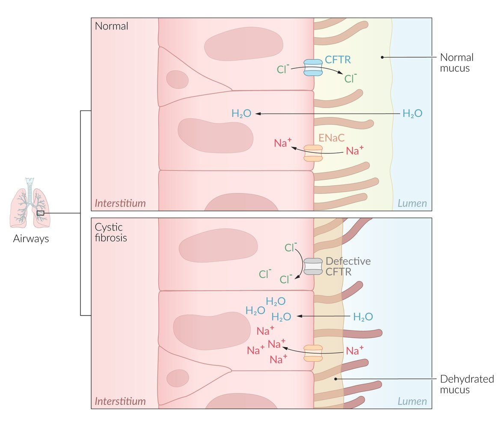

Cystic fibrosis pathophysiology

---

## Clinical features

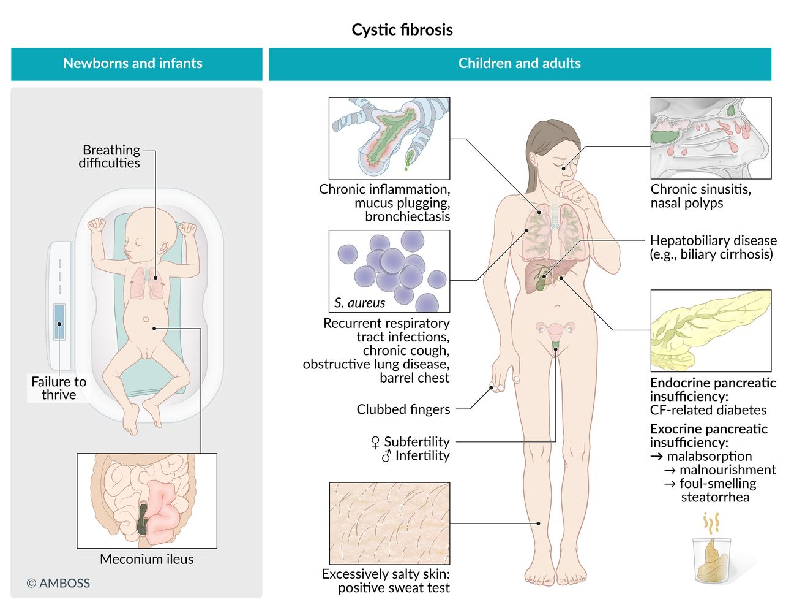

Cystic fibrosis

### Gastrointestinal symptoms of CF [[11]](https://coursology-qbank.com/amboss/article/1ba2sQ)

Gastrointestinal symptoms are common in children. The presence of these features during <u>infancy</u> should raise suspicion for CF.

* <u>Meconium ileus</u> (in <u>newborns</u>)

* <u>Failure to thrive</u> (due to <u>malabsorption</u>)

* <u>Pancreatic</u> disease

* <u>Pancreatitis</u>

* <u>Exocrine pancreatic insufficiency</u> 

* Foul-smelling <u>steatorrhea</u> (<u>fatty stools</u>) may occur.

* <u>Malabsorption</u>

* Abdominal distention

* <u>Diarrhea</u>

* <u>Hypoproteinemia</u>

* <u>Deficiency of fat-soluble vitamins</u>

* <u>CF-related diabetes</u> mellitus (<u>CFRD</u>)  [[12]](https://coursology-qbank.com/amboss/article/0t0eX3)

* <u>Liver</u> and <u>bile</u> duct abnormalities

* <u>Cholecystolithiasis</u>, <u>cholestasis</u>

* Fatty metamorphosis of the <u>liver</u>, eventually progressing to <u>liver cirrhosis</u>

* Biliary <u>cirrhosis</u>;  with <u>portal hypertension</u>, <u>jaundice</u>, and/or <u>esophageal varices</u>

* <u>Intestinal obstruction</u>: abdominal distention, <u>pain</u>, and a palpable mass

* <u>Rectal prolapse</u> (rare)

> [!TIP]
> In almost all cases of <u>meconium ileus</u>, cystic <u>fibrosis</u> is the underlying disease.

Rectal prolapse in cystic fibrosis

### Respiratory [[11]](https://coursology-qbank.com/amboss/article/1ba2sQ)

Respiratory symptoms are common in adulthood. CF should be considered in individuals with the following features:

* Chronic <u>obstructive lung disease</u> with <u>bronchiectasis</u>

* <u>Chronic sinusitis</u>: <u>nasal polyps</u> may eventually develop

* Recurrent or chronic productive <u>cough</u> and pulmonary infections

* <u>S. aureus</u> is the most common cause of recurrent pulmonary infection in <u>infancy</u> and childhood.

* <u>P. aeruginosa</u> is the most common cause of recurrent pulmonary infections in adulthood.

* Other commonly involved bacteria

* <u>Burkholderia cepacia</u>: can lead to cepacia syndrome, a severe <u>necrotizing pneumonia</u> that is often accompanied by rapid respiratory decline and can progress to <u>sepsis</u> [[13]](https://coursology-qbank.com/amboss/article/SpXyK_)

* <u>S. pneumoniae</u>

* <u>H. influenzae</u>

* Increased susceptibility of individuals with CF to opportunistic, potentially life-threatening pathogens (e.g., <u>Pseudomonas aeruginosa</u>, <u>Aspergillus</u>)

* Infections with <u>Pseudomonas aeruginosa</u> → rapid decline in <u>pulmonary function</u> (patients with CF go through multiple <u>antibiotic</u> courses in their lifetime → increasing resistance of <u>Pseudomonas aeruginosa</u> to commonly used <u>antibiotics</u>) [[14]](https://coursology-qbank.com/amboss/article/cbaasQ)

* A chronic infection with <u>Aspergillus</u> species  may lead to <u>allergic bronchopulmonary aspergillosis</u> (see “Complications” below)

* Pulmonary obstruction and <u>airway</u> hyperreactivity  may manifest with expiratory <u>wheezing</u> and/or <u>dyspnea</u>.

* <u>Barrel chest</u> , moist <u>rales</u> (indicate <u>pneumonia</u>), <u>hyperresonance</u> to percussion

* <u>Hemoptysis</u>

* Signs of chronic <u>respiratory insufficiency</u>: <u>digital clubbing</u> associated with chronic <u>hypoxia</u>

Finger clubbing and hippocratic nails in cystic fibrosis

### <u>Sweat glands</u>

* Particularly salty sweat

* Possible <u>electrolyte</u> wasting

### Musculoskeletal

* Frequent <u>fractures</u> due to <u>osteopenia</u>

* <u>Kyphoscoliosis</u>

### Urogenital

* Urinary

* <u>Nephrolithiasis</u>, <u>nephrocalcinosis</u>

* Frequent <u>urinary tract infections</u>

* Genital

* Men: usually <u>infertile</u>

* Obstructive <u>azoospermia</u>;  is common, <u>spermatogenesis</u> may be intact

* The <u>vas deferens</u> may be absent.

* <u>Undescended testicle</u>

* Women: reduced <u>fertility</u>

* Viscous cervical mucus can obstruct <u>fertilization</u>.

* Menstrual abnormalities (e.g., <u>amenorrhea</u>)

* Delayed development of <u>secondary sexual characteristics</u>

---

## Newborn screening

<u>Newborn screening</u> (<u>NBS</u>) for CF is essential for early detection and treatment, which can improve health outcomes. In many countries, including the US, it is mandatory to screen for CF.  [[10]](https://coursology-qbank.com/amboss/article/pAXLk00)[[15]](https://coursology-qbank.com/amboss/article/tHbXHE)

* Sample collection: <u>newborn</u> <u>blood spot test</u>, performed via heel prick blood sampling in the first 24 and 48 hours of life

* <u>Screening tests</u> [[16]](https://coursology-qbank.com/amboss/article/R0clfa0)

* Immunoreactive trypsinogen (<u>IRT</u>) : initial <u>screening test</u>

* An <u>immunofluorescence</u> assay that measures levels of <u>IRT</u>  [[17]](https://coursology-qbank.com/amboss/article/PHXWqz)

* Normal <u>IRT</u> levels: CF unlikely

* Elevated <u>IRT</u> levels: CF possible; additional <u>screening tests</u> required  [[16]](https://coursology-qbank.com/amboss/article/R0clfa0)

* <u>CFTR mutation testing</u> (<u>DNA</u> testing): second-tier <u>screening test</u>

* Identifies the most common CF-causing <u>CFTR</u> mutations, including CF carriers  [[18]](https://coursology-qbank.com/amboss/article/6AXjk00)

* Cannot detect uncommon <u>CFTR</u> mutations that are not included on the panel.

* Screening protocols: a combination of CF screening methods to minimize <u>false-positive</u> and <u>false-negative</u> <u>NBS</u> results  [[18]](https://coursology-qbank.com/amboss/article/6AXjk00)

* <u>IRT</u>/<u>DNA</u> protocol: If initial <u>IRT</u> levels are elevated, a <u>CFTR mutation test</u> is performed on the same sample.

* <u>IRT</u>/<u>IRT</u> protocol: If initial <u>IRT</u> levels are elevated, a new sample is obtained and the test is repeated.

* Other protocols: e.g., <u>IRT</u>/<u>IRT</u>/<u>DNA</u>, <u>IRT</u>/<u>DNA</u>/full-<u>gene</u> analysis

* Next steps after positive <u>NBS</u>: Refer patients promptly to a specialist for a complete diagnostic workup and to start treatment if required.

> [!TIP]
> Patients who test positive for CF during <u>NBS</u> should undergo a <u>sweat test</u>, ideally in the first 4 weeks of life. [[10]](https://coursology-qbank.com/amboss/article/pAXLk00)

> [!WARNING]
> Patients with a presumptive diagnosis of CF (i.e., <u>meconium ileus</u>, positive <u>NBS</u> result with suggestive symptoms, or two CF-causing mutations detected during <u>NBS</u>) should immediately be referred to a specialized center and ideally evaluated within 24–72 hours. [[15]](https://coursology-qbank.com/amboss/article/tHbXHE)

---

## Diagnosis

### Approach  [[15]](https://coursology-qbank.com/amboss/article/tHbXHE)

Diagnosis of CF is based on clinical findings and evidence of <u>CFTR</u> protein dysfunction.

* Presence of any of the following requires a follow-up with <u>confirmatory testing</u>:

* Positive <u>newborn screening</u> (<u>NBS</u>)

* First-degree family member with CF

* Typical <u>clinical features of CF</u> (e.g., chronic sinopulmonary disease, gastrointestinal and nutritional irregularities, syndromes of salt loss, <u>obstructive azoospermia</u>)

* Any of the following findings are evidence of <u>CFTR</u> protein dysfunction:

* <u>Sweat chloride</u> testing with a <u>chloride</u> value ≥ 60 mmol/L

* Evidence of two CF-causing <u>CFTR</u> <u>gene mutations</u> and a <u>sweat chloride test</u> result ≥ 30 mmol/L

* Positive physiologic <u>CFTR</u> testing with abnormal <u>nasal potential difference test</u> or <u>intestinal current measurement</u>

> [!TIP]
> All patients with suspected CF should undergo a <u>sweat test</u> and <u>CFTR</u> <u>genetic testing</u> to help identify mutations that may affect management. [[15]](https://coursology-qbank.com/amboss/article/tHbXHE)

|  Confirmatory testing for CF [[15]](https://coursology-qbank.com/amboss/article/tHbXHE)[[19]](https://coursology-qbank.com/amboss/article/4HX3qz)  |  |  |  |  |
| --- | --- | --- | --- | --- |
| Order of testing |  | Results |  | Next steps |
| <u>Sweat test</u> (initial test) |  |  * ≥ 60 mmol/L: CF confirmed   |  |   * Refer for specialized management.  * Proceed to <u>CFTR mutation analysis</u>.    |
|  * 30–59 mEq/L: borderline result   |  |  * Repeat <u>sweat test</u> and base next steps on the second result. * Borderline results from two sweat tests: Proceed to <u>CFTR mutation analysis</u> for diagnostic confirmation.   |  |  |
|  * < 30 mmol/L: CF unlikely   |  |  * Consider alternative diagnoses.   |  |  |
|  <u>CFTR mutation analysis</u>   |  |  * Two CF-causing <u>CFTR</u> mutations: CF confirmed   |  |  * Refer for specialized management.   |
|  * One CF-causing <u>CFTR</u> mutation: diagnosis unclear   |  |  * Proceed to <u>CFTR full gene analysis</u>   |  |  |
|  * No CF-causing <u>CFTR</u> mutations: CF unlikely   |  |   * Consider other diagnoses.  * If clinical suspicion is very high: Obtain a <u>CFTR full gene analysis</u> and consider physiologic testing.    |  |  |
|  <u>CFTR full gene analysis</u>   |  |  * Two CF-causing mutations: CF confirmed   |  |  * Refer for specialized management.   |
|  * One CF-causing mutation and a mutation with unknown clinical significance: diagnosis unclear   |  |  * Proceed to physiologic testing   |  |  |
|  * One CF-causing mutation with no alterations in the other <u>CFTR</u> copy: carrier status confirmed   |  |  * Refer to <u>genetic counseling</u>   |  |  |
|  <u>CFTR physiologic testing</u>   |  |  * Positive: CF confirmed   |  |  * Refer for specialized management.   |
|  * Negative: CF unlikely   |  |  * Consider other diagnoses.   |  |  |
|  * Equivocal: diagnosis unclear   |  |  * Refer to a specialized center for further evaluation.   |  |  |

> [!TIP]
> Ideally, all patients with a confirmed diagnosis of CF should be evaluated at a specialized center (e.g., an accredited CF center) within 24–72 hours of diagnosis. [[15]](https://coursology-qbank.com/amboss/article/tHbXHE)

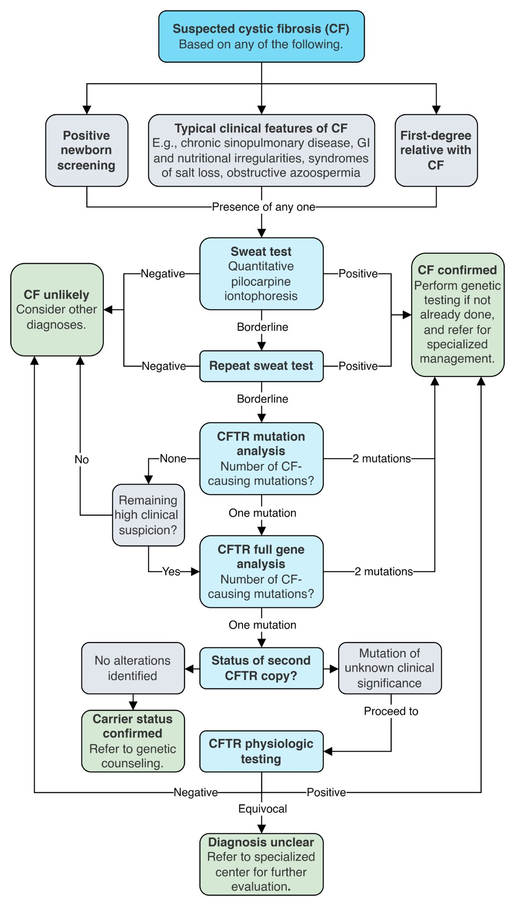

Diagnosis of cystic fibrosis

### <u>Confirmatory tests</u>

#### Sweat test (<u>quantitative pilocarpine iontophoresis</u>)  [[15]](https://coursology-qbank.com/amboss/article/tHbXHE)

* Indications: preferred initial test in all patients with suspected CF

* Method  [[10]](https://coursology-qbank.com/amboss/article/pAXLk00)

* <u>Pilocarpine</u> and an electrical current are applied to the <u>skin</u> to stimulate sweat production.

* Sweat is collected with absorbent pads and the <u>Cl-</u> concentration is measured.

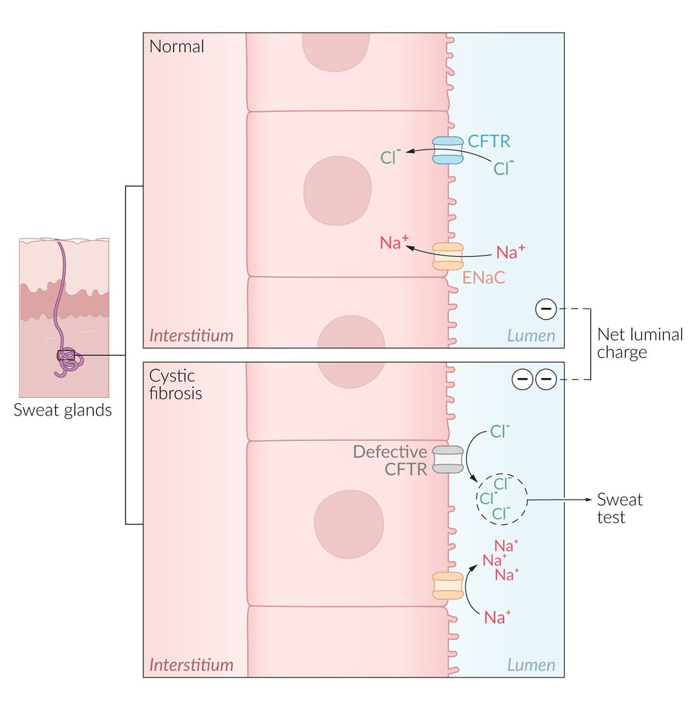

Cystic fibrosis sweat test

> [!TIP]
> <u>CFTR</u> dysfunction is confirmed with a positive <u>sweat test</u> (≥ 60 mmol/L). If the result is borderline (30–59 mEq/L), proceed to <u>genetic testing</u> and, if the diagnosis is still unclear, consider physiologic testing.

> [!NOTE]
> In most <u>exocrine glands</u>, intracellular <u>Cl-</u> is transported across <u>the cell</u> membrane into the lumen through the <u>CFTR</u> <u>Cl-</u> channel. In <u>sweat glands</u>, <u>Cl-</u> is transported in the opposite direction, from the lumen into <u>the cell</u>. In CF, a defect in the <u>CFTR</u> <u>Cl-</u> channel results in an accumulation of <u>Cl-</u> and, subsequently, of Na+ in the lumen of the <u>sweat gland</u>, leading to an increased concentration of NaCl in the sweat.

#### <u>CFTR</u> <u>genetic testing</u> [[15]](https://coursology-qbank.com/amboss/article/tHbXHE)[[20]](https://coursology-qbank.com/amboss/article/FIXgez)[[21]](https://coursology-qbank.com/amboss/article/yAXdm00)

* Indication

* Carrier screening

* <u>Confirmatory test</u> after equivocal <u>sweat test</u>

* Guidance of <u>targeted therapy</u> (e.g., <u>CFTR modulators</u>)

* Modalities

* CFTR mutation analysis: only tests for the most common CF-causing <u>CFTR</u> mutations

* CFTR full gene analysis: includes <u>gene</u> <u>sequencing</u> and deletion/duplication analysis to detect less common <u>CFTR</u> mutations

#### CFTR physiologic testing  [[15]](https://coursology-qbank.com/amboss/article/tHbXHE)[[22]](https://coursology-qbank.com/amboss/article/-AXDm00)[[23]](https://coursology-qbank.com/amboss/article/T_X6n00)

* Procedure

* Exposing specific tissues to different standardized solutions results in predictable ion movements and <u>voltage</u> changes.

* Ionic charges and <u>voltage</u> responses can be measured and compared with standard <u>reference ranges</u> for patients with and without CF.

* Modalities

* Nasal potential difference test

* In vivo assessment of <u>CFTR</u> function in the <u>respiratory epithelium</u>, performed in the nasal cavity

* Results include e.g., more negative baseline potential difference and no difference in nasal potential difference after administration of a <u>chloride</u>-free solution

* Intestinal current measurement: ex vivo assessment of <u>CFTR</u> function in the intestinal <u>epithelium</u>, performed in a fresh rectal <u>biopsy</u> sample

### Additional investigations

The pulmonary status of all patients with CF should be assessed at the time of diagnosis using <u>pulmonary function tests</u> (<u>PFTs</u>) and imaging, in addition to microbiological studies to detect respiratory pathogens. These studies should be repeated regularly to monitor for disease progression, which allows for early initiation of any required interventions.

* <u>Pulmonary function tests</u>: indicated at diagnosis and repeated every 3 months for monitoring

* Modalities: predominantly <u>spirometry</u> in patients ≥ 6 years of age  [[24]](https://coursology-qbank.com/amboss/article/-1cDjY0)

* Findings: obstructive pattern, e.g., ↓ <u>FEV1:FVC ratio</u> (see “<u>Obstructive lung diseases</u>”)  [[25]](https://coursology-qbank.com/amboss/article/KuXUH-)[[26]](https://coursology-qbank.com/amboss/article/6uXjH-)[[20]](https://coursology-qbank.com/amboss/article/FIXgez)

* Imaging: chest <u>x-ray</u> or chest CT are indicated at baseline and every 2–4 years in patients with stable <u>lung function</u> 

* Early findings: may be normal or show subtle signs of <u>air trapping</u> and hyperinflation

* Late findings

* Signs of <u>obstructive lung disease</u> (e.g., <u>air trapping</u>, hyperinflation)

* Reticular nodular pattern

* <u>Bronchiectasis</u>

* Microbiology: findings can help prevent and treat exacerbations [[20]](https://coursology-qbank.com/amboss/article/FIXgez)[[27]](https://coursology-qbank.com/amboss/article/FXYg-n)

* Bacterial <u>sputum</u> cultures most commonly show growth of some of the following pathogens: 

* <u>Gram positive</u>: <u>Staphylococcus aureus</u>

* <u>Gram negative</u>: <u>Hemophilus</u> influenzae, <u>Pseudomonas aeruginosa</u> (a defining <u>pathogen</u> in CF), <u>Burkholderia cepacia</u>  , Achromobacter spp., and Stenotrophomonas maltophilia

* Additional studies include: <u>sputum</u> smear and culture for <u>acid-fast bacilli</u>, fungal cultures

> [!TIP]
> Monitoring with <u>sputum</u> cultures helps guide the selection of <u>antibiotics</u> to prevent and treat exacerbations. [[20]](https://coursology-qbank.com/amboss/article/FIXgez)[[27]](https://coursology-qbank.com/amboss/article/FXYg-n)

> [!TIP]
> <u>Pseudomonas</u>, Stenotrophomonas, and/or <u>Burkholderia</u> infections are associated with rapid <u>lung function</u> deterioration and higher rates of <u>lung transplantation</u>. [[27]](https://coursology-qbank.com/amboss/article/FXYg-n)

* Additional screening and monitoring

* Routine <u>laboratory studies</u>

* <u>CBC</u>: may show <u>anemia</u>; potentially <u>leukocytosis</u> during exacerbations

* <u>BMP</u>: findings are variable, e.g., <u>contraction alkalosis</u> and <u>hypokalemia</u>

* Nutritional assessment

* Weight, height, and head circumference

* Blood tests: total protein and <u>albumin</u> (typically low), <u>fat-soluble vitamins</u>

* Stool tests: low levels of <u>pancreatic elastase</u> suggest <u>exocrine pancreatic insufficiency</u>

* <u>Liver chemistries</u> and <u>coagulation panel</u>: to assess <u>liver function</u> and screen for <u>CF-related liver disease</u> (<u>CFLD</u>)

* <u>Fasting</u> <u>glucose</u>: as a part of the screening for <u>CF-related diabetes</u> (<u>CFRD</u>)

* Audiology exam

* CT head may show opacification of sinuses in patients with features of <u>chronic sinusitis</u>

> [!NOTE]
> Sweat losses of NaCl and H2O lead to contraction of the <u>ECF</u> volume and <u>RAAS</u> activation (similar to the effects of <u>loop diuretics</u>). This can result in increased renal reabsorption of NaCl and H2O and excretion of H+ and <u>K+</u>, causing <u>alkalosis</u> and <u>hypokalemia</u>.

Bronchiectasis

Bronchiectasis

---

## Differential diagnoses

* <u>Primary ciliary dyskinesia</u> (PCD)

* <u>Allergic bronchopulmonary aspergillosis</u> (<u>ABPA</u>)

* <u>Congenital immunodeficiency disorders</u>

### Primary ciliary dyskinesia [[28]](https://coursology-qbank.com/amboss/article/nxb7CD)[[29]](https://coursology-qbank.com/amboss/article/LxbwCD)

* Definition: rare <u>autosomal recessive</u> disorder characterized by absent or dysmotile <u>cilia</u> caused by a defect in the <u>dynein</u> arm of <u>microtubules</u>

* Clinical features

* Chronic productive <u>cough</u>

* Recurrent otitis, <u>sinusitis</u>, and <u>nasal polyps</u>

* <u>Bronchiectasis</u>

* <u>Conductive hearing loss</u>

* Displaced <u>heart sounds</u> (as a result of <u>dextrocardia</u>)

* <u>Infertility</u> in men due to decreased <u>sperm</u> motility as a result of defective <u>flagella</u>

* Reduced <u>fertility</u> in women (and rarely <u>ectopic pregnancy</u>) due to defective <u>cilia</u> in <u>fallopian tubes</u>

* Kartagener syndrome: classic triad of <u>situs inversus</u>, <u>recurrent sinusitis</u>, and <u>bronchiectasis</u>

* Diagnostics

* Nasal nitric oxide test: reduced <u>nasal nitric oxide</u> (<u>screening test</u>)

* Genetic tests for <u>dynein</u> arm mutations

* <u>Chest x-ray</u>: <u>bronchiectasis</u>, <u>dextrocardia</u>, and <u>situs inversus</u> (suggests <u>Kartagener syndrome</u>)

* <u>Electron microscopy</u>: abnormal <u>cilia</u>

* Treatment: depends on individual clinical presentation and course

> [!NOTE]
> You can memorize the cause of <u>Kartagener syndrome</u> by thinking of Kartagener's restaurant that only has 'take-out' service because there is no dine-in (<u>dynein</u>).

> [!NOTE]
> <u>Kartagener syndrome</u> is a subtype of <u>primary ciliary dyskinesia</u> characterized by the triad of <u>situs inversus</u>, <u>chronic sinusitis</u>, and <u>bronchiectasis</u>.

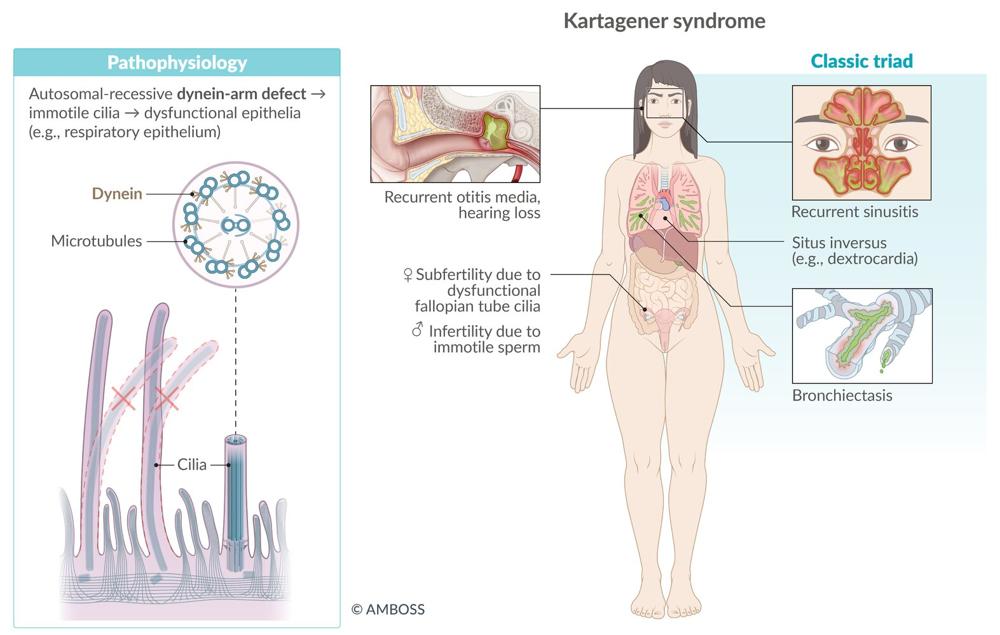

Kartagener syndrome

Situs inversus with dextrocardia (situs inversus totalis)

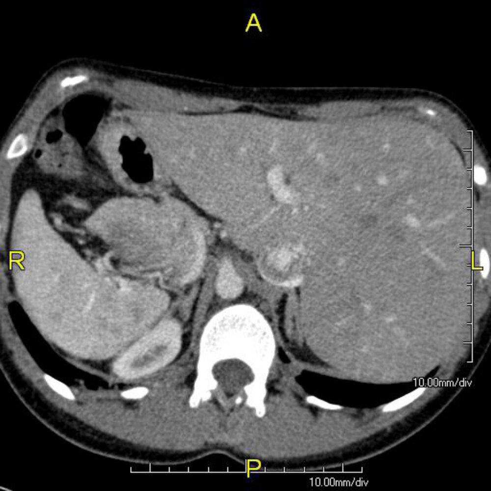

Situs inversus due to Kartagener syndrome

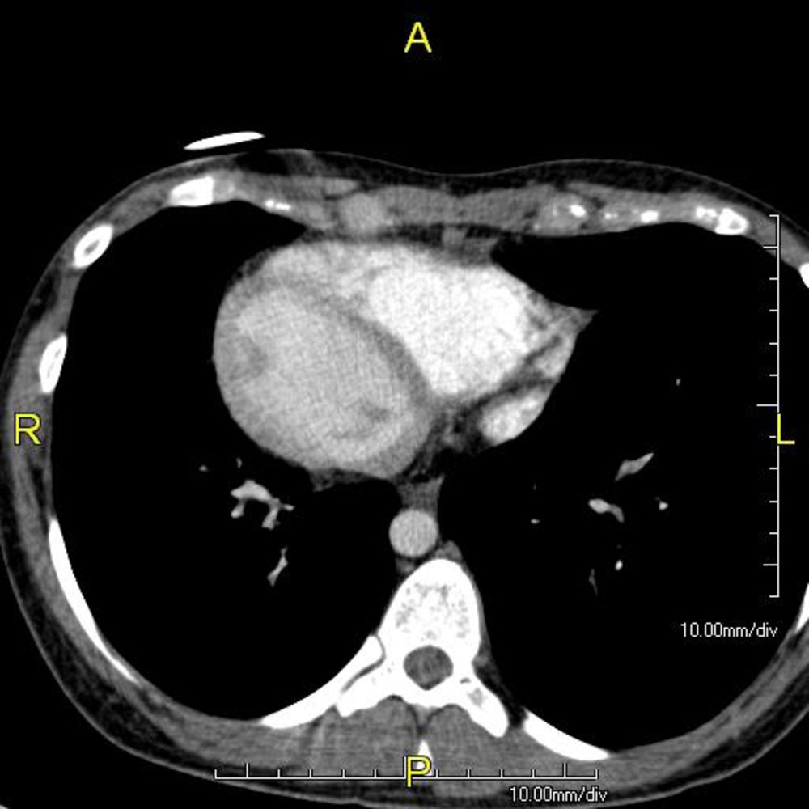

Dextrocardia in Kartagener syndrome

The differential diagnoses listed here are not exhaustive.

---

## Management

### General principles [[20]](https://coursology-qbank.com/amboss/article/FIXgez)[[30]](https://coursology-qbank.com/amboss/article/wKYhiJ)

* All patients with CF require periodic follow-up with a multidisciplinary team for specialized management.

* Management should include the following goal-directed interventions:

* Preservation of <u>lung function</u>

* Pharmacological and nonpharmacological interventions

* Prevention of infection and reduction of exacerbations

* Optimization of nutrition

* Screening and monitoring for comorbidities and complications

* Patients with certain mutations may benefit from treatment with <u>CFTR modulators</u>.

* Acute pulmonary exacerbations require rapid and effective treatment.

### Preservation of <u>lung function</u> [[20]](https://coursology-qbank.com/amboss/article/FIXgez)[[31]](https://coursology-qbank.com/amboss/article/VHXG6z)[[32]](https://coursology-qbank.com/amboss/article/uIXpez)

<u>Lung function</u> is preserved by combining pharmacological and nonpharmacological interventions to improve <u>mucociliary clearance</u>, reduce mucus viscosity, and mobilize secretions.

#### Pharmacological interventions [[20]](https://coursology-qbank.com/amboss/article/FIXgez)[[31]](https://coursology-qbank.com/amboss/article/VHXG6z)

* High-dose <u>ibuprofen</u>: can slow the progression of <u>lung</u> disease

* Indication: Consider in patients 6–17 years of age with mild disease (<u>FEV1</u> > 60% of predicted).

* Avoid in patients with a history of <u>hemoptysis</u>.

* <u>Bronchodilators</u>: <u>SABA</u> (e.g., <u>albuterol</u>), <u>LABA</u> (e.g., <u>salmeterol</u>)

* <u>SABA</u> indications: prior to inhaled therapies and/or chest <u>physiotherapy</u> , patients with episodes of <u>airway</u> hyperresponsiveness

* Long-term use is not routinely recommended  [[20]](https://coursology-qbank.com/amboss/article/FIXgez)[[31]](https://coursology-qbank.com/amboss/article/VHXG6z)

* <u>Mucolytics</u> [[20]](https://coursology-qbank.com/amboss/article/FIXgez)[[31]](https://coursology-qbank.com/amboss/article/VHXG6z)[[32]](https://coursology-qbank.com/amboss/article/uIXpez)

* <u>Hypertonic saline</u> nebulization;  (6–7% NaCl): mucociliary and osmotic effect;  that can improve <u>mucociliary clearance</u> and thin the mucus  [[32]](https://coursology-qbank.com/amboss/article/uIXpez)

* Dornase alfa DOSAGE, aerosolized: a <u>recombinant DNase</u> that thins the mucus by breaking down extracellular <u>DNA</u> in <u>sputum</u> [[32]](https://coursology-qbank.com/amboss/article/uIXpez)

* Other therapies

* <u>N-acetylcysteine</u>: <u>efficacy</u> is unproven in CF [[20]](https://coursology-qbank.com/amboss/article/FIXgez)[[31]](https://coursology-qbank.com/amboss/article/VHXG6z)

* <u>Corticosteroids</u> (inhaled and systemic): insufficient evidence; not routinely used  [[32]](https://coursology-qbank.com/amboss/article/uIXpez)

#### Nonpharmacological interventions

* <u>Airway clearance techniques</u>: a mainstay of CF treatment that loosens and mobilizes mucus secretions 

* Conventional chest physiotherapy (CPT): <u>postural drainage</u> with percussion and/or clapping

* Alternative <u>airway</u> clearance methods 

* High-frequency <u>chest compression</u>

* <u>Airway</u> oscillating devices

* Positive expiratory pressure devices

* <u>Huff coughing</u>

* Exercise (e.g., swimming, jogging, cycling)

> [!TIP]
> Patients with CF benefit from a regular <u>airway</u> clearance routine that combines pharmacological measures with <u>airway clearance techniques</u> to preserve <u>lung function</u> and reduce symptoms. [[20]](https://coursology-qbank.com/amboss/article/FIXgez)[[31]](https://coursology-qbank.com/amboss/article/VHXG6z)

> [!TIP]
> An <u>airway</u> clearance session generally begins with <u>SABA</u> therapy to open the <u>airways</u>, followed by <u>mucolytics</u> to thin the mucus, then <u>airway clearance techniques</u>. [[20]](https://coursology-qbank.com/amboss/article/FIXgez)[[31]](https://coursology-qbank.com/amboss/article/VHXG6z)

#### Prevention of infection and reduction of exacerbations in CF [[20]](https://coursology-qbank.com/amboss/article/FIXgez)[[27]](https://coursology-qbank.com/amboss/article/FXYg-n)[[31]](https://coursology-qbank.com/amboss/article/VHXG6z)[[32]](https://coursology-qbank.com/amboss/article/uIXpez)[[33]](https://coursology-qbank.com/amboss/article/C0cqRa0)

* Pulmonary exacerbations in patients with CF are often triggered by chronic <u>lung</u> infections of pathogenic organisms.

* Eradication and/or suppression regimens can prevent exacerbations and improve <u>lung function</u>.

* Consider treatment after early detection of relevant pathogens during routine surveillance <u>sputum</u> cultures.

* Eradication regimens include: 

* <u>P. aeruginosa</u>: inhaled <u>tobramycin</u>

* <u>MRSA</u>: inhaled <u>vancomycin</u>  PLUS oral <u>antibiotics</u> , PLUS extrapulmonary eradication

* Suppression regimens

* Indicated in patients with chronic infections

* May suppress the bacterial load, improve <u>lung function</u>, and/or prevent exacerbations

* <u>Azithromycin</u>: may be given long term, with benefits relying on its antiinflammatory effect  [[20]](https://coursology-qbank.com/amboss/article/FIXgez)[[27]](https://coursology-qbank.com/amboss/article/FXYg-n)[[31]](https://coursology-qbank.com/amboss/article/VHXG6z)[[32]](https://coursology-qbank.com/amboss/article/uIXpez)

> [!TIP]
> <u>Antibiotic</u> eradication and suppression regimens for patients with CF should always be selected in consultation with a specialist.

### Optimization of nutrition [[34]](https://coursology-qbank.com/amboss/article/iHXJJz)

There is a direct <u>correlation</u> between <u>BMI</u> and pulmonary <u>lung function</u> in patients with CF. The following are common dietary recommendations for patients with CF:

* High-energy diet to compensate for increased demand (target <u>BMI</u> ≥ 50th<u>percentile</u>)  [[20]](https://coursology-qbank.com/amboss/article/FIXgez)[[35]](https://coursology-qbank.com/amboss/article/RHXlJz)

* <u>Pancreatic enzyme</u> supplements  [[10]](https://coursology-qbank.com/amboss/article/pAXLk00)

* Additional NaCl intake  [[35]](https://coursology-qbank.com/amboss/article/RHXlJz)

* Oral supplementation of <u>fat-soluble vitamins</u> (ADEK)  [[20]](https://coursology-qbank.com/amboss/article/FIXgez)

### CFTR modulators [[30]](https://coursology-qbank.com/amboss/article/wKYhiJ)[[36]](https://coursology-qbank.com/amboss/article/_Hb5GE)

A relatively new therapy for the long-term management of CF that targets specific defects in the <u>CFTR</u> protein to improve its function.

* Indications 

* Approved for patients with specific <u>CFTR</u> mutations (e.g., ΔF508, G511D mutations)

* Their use can potentially reduce CF complications and comorbidities

* Mechanism of action: improve <u>CFTR</u> protein function by targeting underlying protein defects  [[31]](https://coursology-qbank.com/amboss/article/VHXG6z)

* Potentiators (e.g., ivacaftor): increase <u>CFTR</u> <u>Cl-</u> channel gate opening and conductance and improve <u>Cl-</u> transport

* Correctors (e.g., lumacaftor, tezacaftor, elexacaftor): improve <u>protein folding</u>, protein stability, and the transport of functional <u>CFTR</u> protein to <u>the cell</u> surface [[37]](https://coursology-qbank.com/amboss/article/IzXY800)

* Combination therapy

* Two or more <u>CFTR modulators</u> with different mechanisms of action can be combined to synergistically improve <u>CFTR</u> protein quantity and function.

* Combination therapy increases the yield of <u>CFTR modulators</u> and can therefore benefit larger numbers of patients.  [[10]](https://coursology-qbank.com/amboss/article/pAXLk00)

> [!TIP]
> Perform <u>CFTR</u> <u>genetic testing</u> in all patients diagnosed with CF to assess for specific mutations that can be targeted by <u>CFTR modulators</u>.

> [!TIP]
> <u>CFTR modulators</u> can improve <u>FEV1</u>, help patients gain weight, reduce exacerbations, and decrease sweat <u>Cl-</u> concentration. [[36]](https://coursology-qbank.com/amboss/article/_Hb5GE)

> [!NOTE]
> The names of <u>CFTR modulators</u> include all the letters C-F-T-R: IvaCaFToR, LumaCaFToR, TezaCaFToR, and ElexaCaFToR.

### Additional measures [[20]](https://coursology-qbank.com/amboss/article/FIXgez)[[38]](https://coursology-qbank.com/amboss/article/kHXmqz)

* <u>Oxygen therapy</u>: frequent oxygen monitoring and support for chronic <u>respiratory insufficiency</u> as needed

* Intermittent oxygen: indicated for desaturation during exercise and <u>sleep</u>

* Long-term oxygen: indicated for <u>hypoxia</u> on room air and borderline <u>hypoxia</u> with evidence of <u>cor pulmonale</u>

* Double-<u>lung transplant</u>

* A treatment option for patients with end-stage <u>lung</u> disease  [[20]](https://coursology-qbank.com/amboss/article/FIXgez)[[38]](https://coursology-qbank.com/amboss/article/kHXmqz)

* Common indications for <u>transplantation</u> referral include:

* Low (< 30% of predicted) or rapidly declining <u>FEV1</u>

* Evidence of <u>pulmonary hypertension</u>

* Significant clinical decline.

* Provide emotional support and recommend additional mental health support to help patients manage their chronic condition and <u>end-of-life care</u> decisions.  [[32]](https://coursology-qbank.com/amboss/article/uIXpez)

* Discuss the patient's long-term <u>goals of care</u>.

> [!TIP]
> CF is a chronic, progressive, and ultimately life-shortening condition. Preferably, CF should be managed by a multidisciplinary team that can provide comprehensive care, which emphasizes <u>shared decision-making</u>.

---

## Acute pulmonary exacerbations

### General principles [[8]](https://coursology-qbank.com/amboss/article/EIX8ez)[[20]](https://coursology-qbank.com/amboss/article/FIXgez)[[27]](https://coursology-qbank.com/amboss/article/FXYg-n)

* Increased severity or new onset of clinical symptoms can be a sign of acute pulmonary exacerbation.

* There are no universally accepted diagnostic criteria.

* Findings are varied and include increased <u>dyspnea</u> or <u>cough</u>, changes in <u>sputum</u> production, weight loss, and <u>fever</u>

* Start culture-guided <u>antibiotic therapy</u> for pulmonary exacerbations.

* Additional measures

* Optimize nutrition.

* Increase <u>airway</u> clearance.

* Provide <u>respiratory support</u> as needed; see “<u>Oxygen therapy</u>” for details.

* <u>Glucocorticoids</u>: insufficient evidence, not routinely used

* Order inpatient <u>contact precautions</u>.

> [!WARNING]
> Treat pulmonary exacerbations quickly and aggressively to prevent an irreversible decline in <u>lung function</u>. [[32]](https://coursology-qbank.com/amboss/article/uIXpez)

### Diagnostics [[8]](https://coursology-qbank.com/amboss/article/EIX8ez)[[20]](https://coursology-qbank.com/amboss/article/FIXgez)[[27]](https://coursology-qbank.com/amboss/article/FXYg-n)

Obtain a detailed clinical history, including the frequency and severity of respiratory symptoms. Patients may report weight loss, <u>fever</u>, and/or <u>hemoptysis</u>. Perform a thorough <u>physical examination</u>, paying particular attention to new <u>auscultation</u> findings and abnormal <u>vital signs</u> (e.g., increased <u>respiratory rate</u>, low <u>oxygen saturation</u>).

* Laboratory: <u>CBC</u>, <u>BMP</u>, <u>liver chemistries</u>, and consider <u>blood gas</u>

* Assess pulmonary status.

* <u>PFTs</u>: possible decline in <u>FEV1</u>

* Chest <u>x-ray</u>: may show new infiltrates

* Obtain new <u>sputum</u> cultures upon admission.

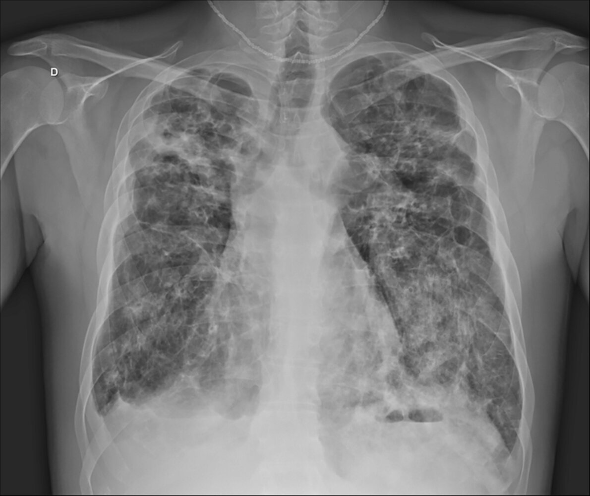

Cystic fibrosis with concurrent pneumonia

### <u>Antibiotics</u> [[27]](https://coursology-qbank.com/amboss/article/FXYg-n)

<u>Antibiotic therapy</u> in patients with CF is challenging because of a high <u>prevalence</u> of <u>antibiotic</u> resistance following frequent <u>antibiotic</u> use and the presence of multiple pathogenic organisms.  Involve specialists early.

> [!TIP]
> Choose initial <u>antibiotics</u> based on the speciation and <u>sensitivities</u> of the patient's recent routine <u>sputum</u> cultures. Adjust the <u>antibiotics</u>, if needed, once the results from the new <u>sputum</u> culture have been reported.

|  Antibiotic therapy for CF pulmonary exacerbations [[27]](https://coursology-qbank.com/amboss/article/FXYg-n)  |  |
| --- | --- |
| <u>Pathogen</u> | Example regimens |
| <u>Staphylococcus aureus</u> |   * <u>MSSA</u> [[39]](https://coursology-qbank.com/amboss/article/LMbw68)  * <u>Nafcillin</u> DOSAGE  * OR <u>oxacillin</u> DOSAGE [[39]](https://coursology-qbank.com/amboss/article/LMbw68)  * <u>MRSA</u>  * <u>Vancomycin</u> DOSAGE  * OR <u>linezolid</u> DOSAGE    |
| <u>Pseudomonas aeruginosa</u> |   * Outpatient: specialists may initiate PO regimens with <u>fluoroquinolones</u> (e.g., <u>ciprofloxacin</u>)  * Inpatient: Select two <u>antipseudomonal antibiotics</u> (double coverage) with different mechanisms of action. [[27]](https://coursology-qbank.com/amboss/article/FXYg-n)  * Antipseudomonal <u>beta-lactam antibiotics</u>: e.g., <u>ceftazidime</u> DOSAGE [[39]](https://coursology-qbank.com/amboss/article/LMbw68), <u>meropenem</u> DOSAGE [[27]](https://coursology-qbank.com/amboss/article/FXYg-n)  * <u>Fluoroquinolones</u>: e.g., <u>ciprofloxacin</u> DOSAGE [[27]](https://coursology-qbank.com/amboss/article/FXYg-n)  * <u>Aminoglycosides</u>: e.g., <u>tobramycin</u> DOSAGE, <u>amikacin</u> DOSAGE [[27]](https://coursology-qbank.com/amboss/article/FXYg-n)    |
| Other pathogens |   * <u>H. influenzae</u>: often susceptible to <u>antipseudomonal antibiotics</u>  * Other gram-positive infections: should be covered by <u>antibiotics</u> that are used to treat <u>S. aureus</u>  * Drug-resistant pathogens (e.g., B. cepacia, S. maltophilia, Achromobacter spp.)  * Known to be resistant to many <u>antibiotics</u> and often require double coverage  * Treatment should be decided in consultation with an infectious diseases specialist.    |

### Disposition [[8]](https://coursology-qbank.com/amboss/article/EIX8ez)[[20]](https://coursology-qbank.com/amboss/article/FIXgez)[[27]](https://coursology-qbank.com/amboss/article/FXYg-n)

* Outpatient management: Specialists may provide ambulatory management for mild exacerbations with inhaled and/or oral <u>antibiotics</u>.

* Indications for inpatient management [[8]](https://coursology-qbank.com/amboss/article/EIX8ez)[[20]](https://coursology-qbank.com/amboss/article/FIXgez)

* Resistant bacteria with no PO <u>antibiotic</u> options

* Exacerbations with a poor response to outpatient management

* Moderate to severe disease or complicating comorbidities

* Critical care: Consider especially for young patients with a good baseline status and <u>transplantation</u> candidates.

---

## Complications

### Gastrointestinal

Gastrointestinal complications of CF include:

* Meconium ileus: failure to pass the first stool in <u>neonates</u> (<u>meconium</u> usually passes within the first 24–48 hours after <u>birth</u>)

* Etiology: Cystic <u>fibrosis</u> is the cause in > 90% of cases.

* Clinical findings: signs of a <u>distal</u> <u>small bowel obstruction</u> (thick <u>meconium</u> plugs the <u>distal</u> <u>ileum</u>)

* <u>Bilious</u> <u>vomiting</u>

* Abdominal distention

* No passing of <u>meconium</u> or stool

* Diagnostics
* <u>X-ray</u> abdomen (with contrast agent) ;    [[40]](https://coursology-qbank.com/amboss/article/2t0T13)

* Dilated <u>small bowel</u> loops

* Microcolon: narrow caliber of the <u>colon</u>, as it is still unused (<u>meconium</u> has not been passed through yet)

* Neuhauser sign (soap bubble appearance): a mottled or bubble-like appearance in the <u>distal</u> <u>ileum</u> and/or <u>cecum</u> as a result of <u>meconium</u> mixing with swallowed air  [[41]](https://coursology-qbank.com/amboss/article/yXYd0L)

* Air-fluid levels are uncommon because of the viscous consistency of <u>meconium</u>.

* Differential diagnosis: See “<u>Differential diagnosis of intestinal obstruction in neonates</u>.”

* Treatment

* Enema with a contrast agent

* <u>Surgery</u> is required in complicated cases (e.g., <u>intestinal perforation</u>, <u>volvulus</u>)

* <u>Small bowel obstruction</u>: can also occur in older children and adults

* Distal intestinal obstruction syndrome (<u>DIOS</u>) : blockage of the <u>small intestines</u> by thickened stool in the <u>distal</u> <u>ileum</u> and right <u>colon</u> [[42]](https://coursology-qbank.com/amboss/article/srbtiE) 

* Highest <u>prevalence</u> in the second and third decades of life

* Tends to occur in individuals with <u>pancreatic</u> insufficiency

* Clinical manifestations include abdominal <u>pain</u> and distention, a palpable cecal mass, and flatulence.

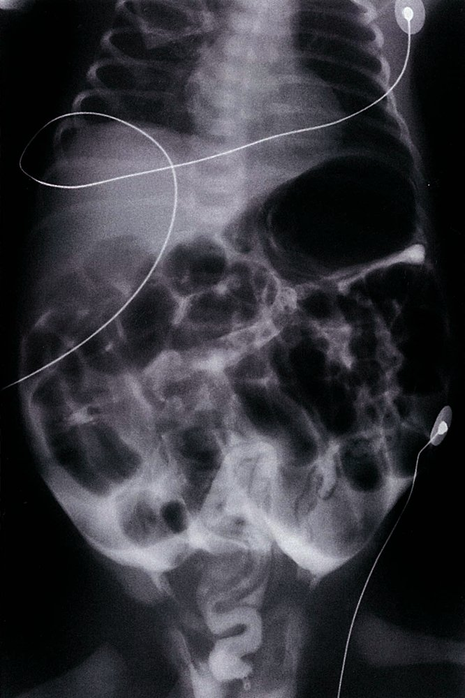

Microcolon and bowel perforation in meconium ileus

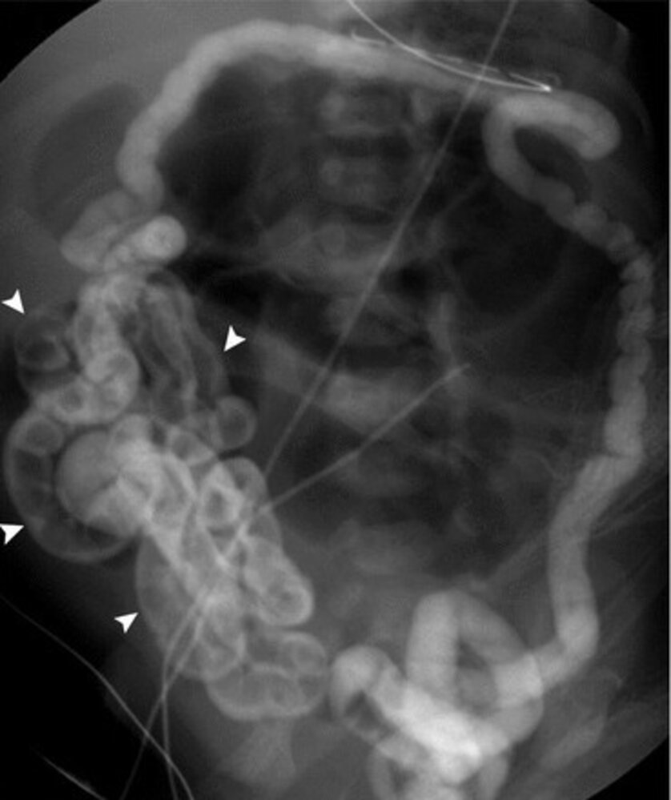

Meconium ileus

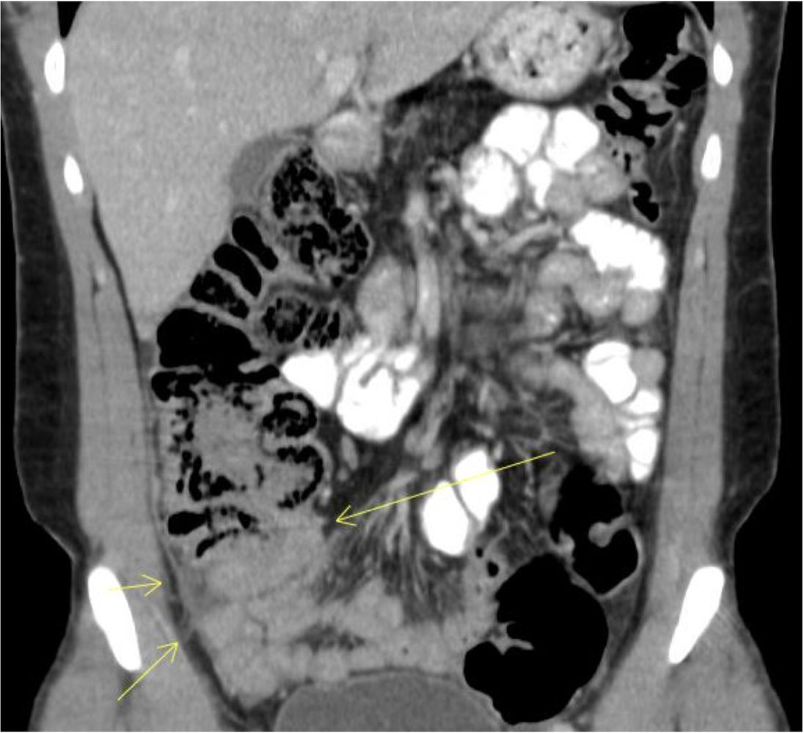

Distal intestinal obstruction syndrome (DIOS)

### Respiratory

* <u>Allergic bronchopulmonary aspergillosis</u> (<u>ABPA</u>): ∼ 10% of individuals with CF develop this condition.  [[43]](https://coursology-qbank.com/amboss/article/AXYR0L)[[44]](https://coursology-qbank.com/amboss/article/_XY50L)

* Pulmonary <u>emphysema</u>

* <u>Pneumothorax</u>

* <u>Cor pulmonale</u>

We list the most important complications. The selection is not exhaustive.

---

## Prognosis

* Median <u>life expectancy</u>:  39 years [[45]](https://coursology-qbank.com/amboss/article/zXYr0L)

* Individuals with CF who have <u>pancreatic</u> sufficiency tend to present with mainly pulmonary symptoms in late childhood/early adulthood and generally have a milder course of disease [[46]](https://coursology-qbank.com/amboss/article/1K022S)

* The main determinant of <u>life expectancy</u> is the severity of pulmonary disease: chronic respiratory infections and mucus plugging → <u>bronchiectasis</u> (irreversible) → progressive respiratory failure → <u>death</u>

---

## Prevention

* Annual <u>influenza vaccine</u> for all affected individuals > 6 months with <u>inactivated influenza vaccine</u>

* <u>Pneumococcal vaccine</u> (see ”<u>Immunization schedule</u>”)

* <u>Palivizumab</u>: <u>antibody</u> against <u>respiratory syncytial virus</u> (<u>RSV</u>) for <u>infants</u> < 24 months

* Long-term treatment with <u>azithromycin</u> may be used to prevent recurrent pulmonary infections.

---