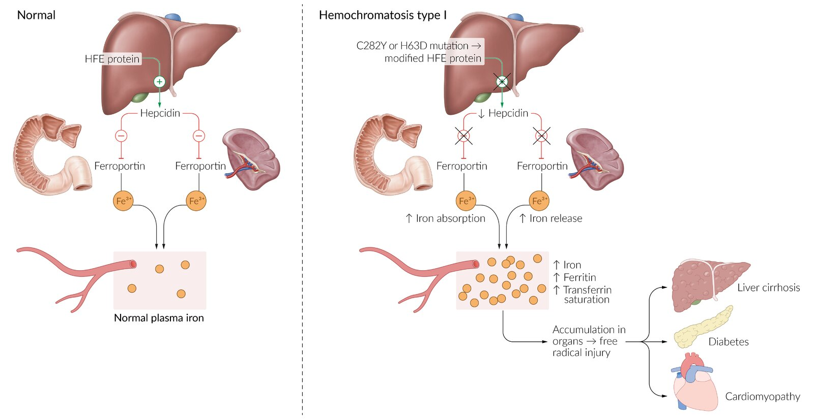
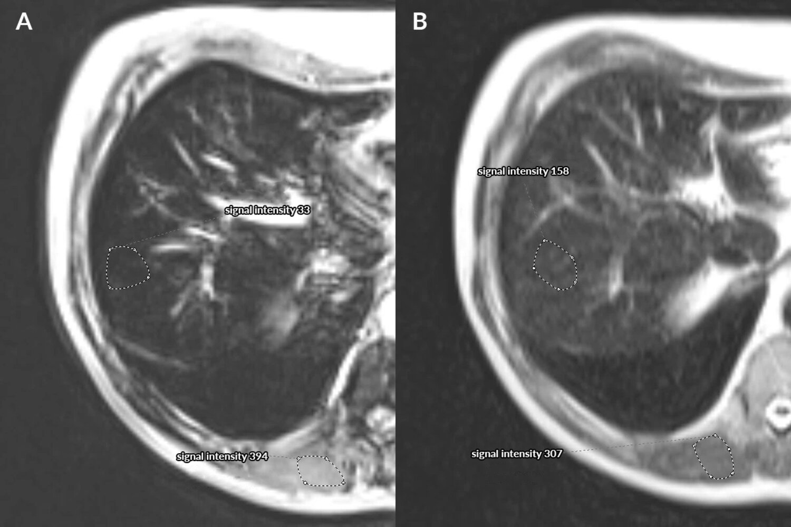
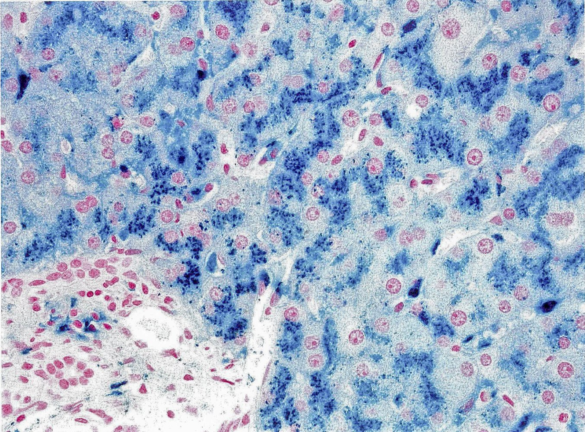
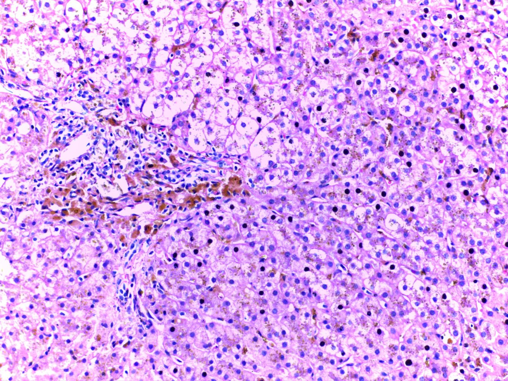
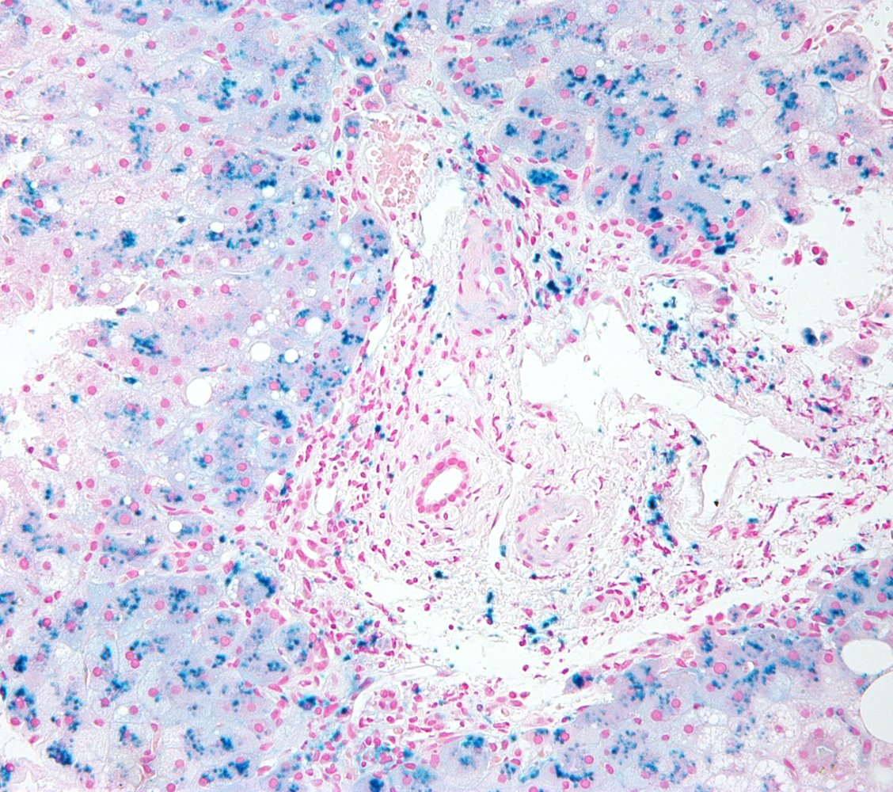

# Hemochromatosis

*Categories: Clinical knowledge > Genetics > Metabolic and endocrine disorders > Hemochromatosis*

[Original Article Link](https://coursology-qbank.com/amboss/article/qS0C0f)

---

## Summary

Hemochromatosis refers to a group of conditions characterized by excess <u>iron</u> deposition (or increased risk of excess deposition) in the body as a result of increased <u>iron absorption</u>. Increased <u>iron absorption</u> leads to <u>iron overload</u> as there is no physiologic method for <u>iron</u> excretion (except through menstrual bleeding). <u>Primary iron overload</u> (primary/<u>hereditary hemochromatosis</u>) is caused by mutations in <u>genes</u> involved in regulating gastrointestinal <u>iron absorption</u>, resulting in <u>iron</u> over-absorption. <u>Secondary iron overload</u> (sometimes referred to as <u>secondary hemochromatosis</u>) is caused by conditions affecting <u>iron metabolism</u> (e.g., <u>chronic liver disease</u>) or excessive <u>iron</u> ingestion or infusion (e.g., from repeated <u>transfusions</u> to treat <u>beta-thalassemia major</u>). Patients with <u>primary iron overload</u> often only become symptomatic after irreversible damage has occurred, commonly in the third to fifth decades of life. Early clinical features are often nonspecific (e.g., fatigue, decreased libido, <u>hyperpigmentation</u>, <u>symptoms of diabetes mellitus</u>, <u>arthralgia</u>). Laboratory findings of elevated serum <u>ferritin</u> combined with elevated <u>transferrin saturation</u> are highly suggestive of <u>iron overload</u>. <u>Genetic testing</u>, <u>MRI</u> abdomen, and, occasionally, <u>liver biopsy</u> may be used to confirm the diagnosis. Treatment with <u>therapeutic phlebotomy</u> or <u>chelating agents</u> (e.g., <u>deferoxamine</u>) can prevent or mitigate the downstream effects of <u>parenchymal</u> <u>iron</u> deposition (e.g., <u>cardiomyopathy</u>, <u>arrhythmia</u>). The <u>liver</u> is the most commonly affected organ, and the development of <u>cirrhosis</u> is associated with an increased risk of <u>hepatocellular carcinoma</u>. Patients with <u>iron overload</u> should be advised to avoid <u>alcohol</u> consumption and <u>vitamin C</u> supplementation, as they increase <u>iron absorption</u>, which may lead to disease progression.

Hemochromatosis fact sheet

---

## Epidemiology

* <u>Prevalence</u>: the most frequent genetic disease in the white population

* Age of onset: individuals > 40 years

* Symptoms start to show when body <u>iron</u> levels reach > 20 g.

* Before <u>menopause</u>, women lose <u>iron</u> via <u>menstruation</u> and <u>pregnancy</u>, which slows down <u>iron</u> accumulation within the body. As a result, symptom onset occurs later in women (typically <u>postmenopausal</u>) than in men.

References:[[1]](https://coursology-qbank.com/amboss/article/Qkaunk)[[2]](https://coursology-qbank.com/amboss/article/kkamLk)[[3]](https://coursology-qbank.com/amboss/article/EdY87L)

Epidemiological data refers to the US, unless otherwise specified.

---

## Etiology

### Primary (hereditary) hemochromatosis

* Classical and most frequent form: adult hemochromatosis type I

* <u>Homozygous</u> or <u>heterozygous</u> for the HFE gene defect

* Located on <u>chromosome</u> 6

* Most commonly affects C282Y and H63D

* Associated with HLA-A3 <u>genotype</u>

* Inheritance: <u>autosomal recessive</u> with <u>incomplete penetrance</u>

* Further forms: Hemochromatosis types II–IV are also hereditary, but significantly less frequent.

> [!NOTE]
> HLA A3 as in HA3mochromatosis!

### Secondary iron overload (<u>secondary hemochromatosis</u>)

* Caused by <u>iron overload</u>

* <u>Transfusion</u>-related (e.g., in individuals with <u>beta-thalassemia major</u> or other forms of chronic <u>anemia</u> requiring chronic <u>transfusion</u>)

* Ineffective <u>erythropoiesis</u>

* <u>Thalassemia</u>

* Sickle-cell <u>anemia</u>

* <u>Sideroblastic anemia</u> (e.g., hereditary <u>sideroblastic anemia</u>; <u>anemia of chronic disease</u>)

* <u>Excessive alcohol consumption</u>

References:[[2]](https://coursology-qbank.com/amboss/article/kkamLk)[[4]](https://coursology-qbank.com/amboss/article/M3YMQK)

---

## Pathophysiology

### Hemochromatosis type I

* The <u>HFE gene</u> regulates <u>iron</u> <u>homeostasis</u> (see “<u>Iron</u>” in the articles on <u>trace elements</u>).

* <u>HFE gene defect</u> (<u>homozygous</u>) → defective binding of <u>transferrin</u> to its <u>receptor</u> → ↓ <u>hepcidin</u> synthesis by the <u>liver</u> → unregulated ferroportin activity in <u>enterocytes</u> → ↑ intestinal <u>iron</u> absorption → <u>iron</u> accumulation throughout the body → damage to the affected organs

> [!NOTE]
> In <u>hereditary hemochromatosis</u>, decreased <u>hepcidin</u> leads to <u>iron overload</u>. In <u>secondary hemochromatosis</u>, <u>iron overload</u> leads to increased <u>hepcidin</u> immediately after a <u>blood transfusion</u> (unless <u>liver fibrosis</u> or <u>cirrhosis</u>, which leads to decreased <u>hepcidin</u> synthesis, is present).

Pathophysiology of hemochromatosis

Hepatic microstructure: hepatic lobule

Hepatic microstructure: hepatic lobule showing bile canaliculi

Hepatic microstructure: sinusoids, perisinusoidal space, and hepatocytes

References:[[5]](https://coursology-qbank.com/amboss/article/udYp7L)[[6]](https://coursology-qbank.com/amboss/article/WaXPj9)

---

## Clinical features

Hemochromatosis is asymptomatic in 75% of cases. [[2]](https://coursology-qbank.com/amboss/article/kkamLk)

### General symptoms

* Fatigue, <u>lethargy</u>

* Increased susceptibility to infections  [[7]](https://coursology-qbank.com/amboss/article/6GXjZ-)

### Organ-specific symptoms

* <u>Liver</u>

* Abdominal <u>pain</u>

* <u>Hepatomegaly</u>

* <u>Cirrhosis</u>

* Increased risk of <u>hepatocellular carcinoma</u> (common <u>cause of death</u>)  [[8]](https://coursology-qbank.com/amboss/article/vVbAws)

* <u>Pancreas</u>: signs of <u>diabetes mellitus</u> (<u>polydipsia</u>, <u>polyuria</u>)

* <u>Skin</u>: : <u>hyperpigmentation</u>, bronze skin

* <u>Pituitary gland</u>: <u>hypogonadism</u>, <u>erectile dysfunction</u>, testicular <u>atrophy</u>, loss of libido, <u>amenorrhea</u>  [[9]](https://coursology-qbank.com/amboss/article/PkaWLk)

* <u>Joints</u>: : <u>arthralgia</u> (typically symmetrical <u>arthropathy</u> of the <u>MCP joints</u> II and III); , <u>chondrocalcinosis</u> (accumulation of <u>calcium</u> <u>pyrophosphate</u>)

* <u>Heart</u>

* <u>Cardiomyopathy</u> due to cardiac siderosis

* Occurs in individuals with <u>iron overload</u> (e.g., due to <u>hereditary hemochromatosis</u> or repeated <u>blood transfusions</u>)

* Can lead to chamber remodeling and subsequent dilated (reversible);   or <u>restrictive cardiomyopathy</u>

* The process of accumulation of <u>iron</u> in cardiac tissue.

* <u>Cardiac arrhythmias</u>: <u>paroxysmal</u> <u>atrial fibrillation</u> (most common), <u>sinus node dysfunction</u>, <u>complete AV block</u>, atrial and <u>ventricular tachyarrhythmias</u>, and <u>sudden cardiac death</u>

* <u>Congestive heart failure</u>

> [!NOTE]
> In combination with <u>diabetes mellitus</u>, bronze-colored <u>skin</u> pigmentation is also referred to as "<u>bronze diabetes</u>.”

---

## Diagnosis

### General principles [[10]](https://coursology-qbank.com/amboss/article/6f1jMT0)

* Early diagnosis and management are critical to avoid permanent organ damage and early mortality.

* Diagnosis is often incidental.

* <u>Iron overload</u> can progress slowly over decades.

* Patients with significant <u>iron overload</u> may be asymptomatic.

* Clinical features of advanced disease: organ dysfunction (e.g., of the <u>liver</u>, <u>pancreas</u>, or <u>heart</u>)

* Suggestive laboratory findings: elevated serum <u>ferritin</u> and <u>transferrin saturation</u>

* <u>Genetic testing</u> confirms <u>hereditary hemochromatosis</u>.

### <u>Laboratory studies</u> [[10]](https://coursology-qbank.com/amboss/article/6f1jMT0)

* <u>Diagnosis of iron overload</u>  [[10]](https://coursology-qbank.com/amboss/article/6f1jMT0)[[11]](https://coursology-qbank.com/amboss/article/tT1XsT0)

* ↑ Serum <u>ferritin</u>

* ≥ 200 ng/mL for <u>premenopausal</u> patients

* ≥ 300 ng/mL for all other patients

* ↑ <u>Transferrin saturation</u> (≥ 45%)

* ↑ <u>Serum iron</u>

* ↓ <u>Total iron-binding capacity</u>

* <u>Genetic testing</u> (<u>HFE gene</u>)  [[10]](https://coursology-qbank.com/amboss/article/6f1jMT0)

* Indications: unexplained <u>iron overload</u> and/or <u>first-degree relative</u> with <u>hereditary hemochromatosis</u>

* Findings: <u>Homozygous</u> C282Y, <u>homozygous</u> H63D, or <u>heterozygous</u> C282Y/H63D mutation in the <u>HFE gene</u> confirms the diagnosis.

* Additional studies

* ↑ Hepatocellular enzymes (e.g., <u>AST</u>, <u>ALT</u>)

* <u>CBC</u> may identify <u>iron-loading anemia</u> (e.g., <u>sideroblastic anemia</u>).

> [!TIP]
> Elevated serum <u>ferritin</u> in conjunction with elevated <u>transferrin saturation</u> is highly suggestive of <u>iron overload</u>. The combination of normal serum <u>ferritin</u> and <u>transferrin saturation</u> has a 97% <u>negative predictive value</u>. [[10]](https://coursology-qbank.com/amboss/article/6f1jMT0)

### Imaging [[10]](https://coursology-qbank.com/amboss/article/6f1jMT0)

* <u>MRI</u> abdomen (without contrast) 

* Used to estimate hepatic <u>iron</u> concentration (HIC)

* Hepatic <u>iron</u> pattern can help to distinguish between <u>hereditary hemochromatosis</u> and <u>secondary iron overload</u>.

* Additional imaging: based on symptoms

* <u>Echocardiogram</u>, <u>cardiac MRI</u>, and/or <u>X-ray chest</u> to evaluate for cardiac manifestations (e.g., <u>cardiomyopathy</u>)

* <u>Plain radiography</u> to evaluate for <u>joint</u> manifestations (e.g., <u>arthritis</u> of the second and third <u>MCPs</u>)

Hereditary hemochromatosis

### <u>Liver biopsy</u> [[10]](https://coursology-qbank.com/amboss/article/6f1jMT0)

* Indications

* <u>Homozygous</u> <u>HFE</u> C282Y mutation plus either of the following: 

* Serum <u>ferritin</u> level > 1000 ng/mL

* Additional <u>risk factors</u> for <u>cirrhosis</u>

* All other patients: if needed to stage <u>fibrosis</u> or investigate an alternative cause of <u>liver</u> disease  [[12]](https://coursology-qbank.com/amboss/article/DdY1HL)

* <u>Histology</u> findings

* Concentration and distribution pattern of hepatic <u>iron</u>

* <u>Hemosiderin</u> (normally golden yellow on microscopy) appears blue with the <u>Prussian blue stain</u>.

* Pattern of <u>hereditary hemochromatosis</u>: pronounced <u>parenchymal</u> <u>siderosis</u> (accumulation of <u>hemosiderin</u> within the tissue) in <u>hepatocytes</u> and <u>bile</u> duct <u>epithelium</u>

* Pattern of <u>secondary iron overload</u>: <u>Kupffer cells</u> (specialized <u>macrophages</u>) containing <u>hemosiderin</u>

* Presence and degree of <u>hepatic fibrosis</u> (see “Pathophysiology” in “<u>Cirrhosis</u>”)

> [!TIP]
> The use of <u>liver biopsy</u> in hemochromatosis is limited, as the concentration and distribution pattern of hepatic <u>iron</u> can be assessed using noninvasive <u>MRI</u>. [[13]](https://coursology-qbank.com/amboss/article/cg1a8T0)

Hemochromatosis

Hemochromatosis of the liver

Hemochromatosis

---

## Treatment

### Approach [[10]](https://coursology-qbank.com/amboss/article/6f1jMT0)

Management is guided by a specialist (e.g., hepatologist, gastroenterologist, or hematologist).

* <u>Hereditary hemochromatosis</u>: <u>Therapeutic phlebotomy</u> and <u>chelation therapy</u> are the primary options for <u>iron</u> removal.

* <u>Secondary iron overload</u>

* Address the underlying cause (e.g., <u>alcohol use disorder</u>) to stop <u>iron</u> loading.

* Consider <u>iron</u> removal on a case-by-case basis.  [[12]](https://coursology-qbank.com/amboss/article/DdY1HL)

* Counseling and education: Early treatment can stabilize organ damage, improve symptoms, and increase <u>life expectancy</u>.

### <u>Therapeutic phlebotomy</u> [[10]](https://coursology-qbank.com/amboss/article/6f1jMT0)[[12]](https://coursology-qbank.com/amboss/article/DdY1HL)

* Indications

* First-line treatment for <u>hereditary hemochromatosis</u> (including asymptomatic patients)

* Consider in patients with <u>secondary iron overload</u> (e.g., for patients with symptomatic <u>porphyria cutanea tarda</u>)

* Contraindications

* Inability to tolerate the procedure (e.g., due to <u>anxiety</u>)

* Low <u>hemoglobin</u> (e.g., due to <u>iron-loading anemia</u>)

* Conditions sensitive to fluid shifts (e.g., <u>end-stage liver disease</u>, <u>congestive heart failure</u>)

* Therapeutic regimen

* Initial phase: ∼ 500 mL of blood removed weekly over 1–2 sessions; serum <u>ferritin</u> goal of 50–100 ng/mL

* Maintenance phase: ∼ 500 mL of blood removed 3–4 times per year; serum <u>ferritin</u> goal of 50 ng/mL

### Iron chelation therapy [[10]](https://coursology-qbank.com/amboss/article/6f1jMT0)

* Indications

* First-line treatment for <u>secondary iron overload</u> due to <u>iron-loading anemia</u>

* Consider for <u>hereditary hemochromatosis</u> refractory to <u>therapeutic phlebotomy</u> and patients with contraindications to <u>phlebotomy</u>.

* <u>Chelating agents</u>: deferoxamine, deferasirox, or deferiprone [[14]](https://coursology-qbank.com/amboss/article/FVXgwC)[[15]](https://coursology-qbank.com/amboss/article/WfXPOx)[[16]](https://coursology-qbank.com/amboss/article/dfXoOx)

* Important considerations

* High cost

* Significant risk of adverse effects

> [!WARNING]
> Check renal function prior to administration of <u>chelating agents</u> because of the risk of <u>nephrotoxicity</u> and renal accumulation.

> [!NOTE]
> Drugs that delete <u>iron</u> (Fe) in hemochromatosis: deFeroxamine, deFerasirox, deFeriprone

### <u>Liver transplantation</u> [[10]](https://coursology-qbank.com/amboss/article/6f1jMT0)

* Indications

* <u>Decompensated cirrhosis</u>

* <u>Hepatocellular carcinoma</u>

* Important consideration: Untreated <u>iron overload</u> is not a contraindication to <u>transplantation</u>.

### Additional therapies [[10]](https://coursology-qbank.com/amboss/article/6f1jMT0)

* Dietary changes

* Advise avoidance of <u>iron</u> and <u>vitamin C</u> supplements.

* Encourage strict avoidance of <u>alcohol</u>.

* No need to reduce dietary <u>iron</u>

* <u>Proton pump inhibitors</u> (<u>PPIs</u>)

* Can decrease <u>iron absorption</u>

* Consider as an adjunct to <u>phlebotomy</u>.

* Only recommended for patients with an indication for <u>PPIs</u> (e.g., <u>GERD</u>)

* <u>Erythrocytapheresis</u> [[17]](https://coursology-qbank.com/amboss/article/eg1x8T0)

* Selective removal of <u>red blood cells</u> from the patient's circulation

* Useful for patients with <u>thrombocytopenia</u> or <u>hypoproteinemia</u>

> [!TIP]
> In patients with <u>iron overload</u>, <u>alcohol</u> use significantly increases the risk of progression of both <u>liver fibrosis</u> and <u>cirrhosis</u>.

### <u>Patient counseling</u> [[10]](https://coursology-qbank.com/amboss/article/6f1jMT0)

* Early treatment of <u>iron overload</u> may:

* Improve fatigue and <u>skin</u> <u>hyperpigmentation</u>

* Reverse early organ damage (e.g., elevated <u>liver chemistries</u>, early <u>cardiomyopathy</u>)

* Increase <u>life expectancy</u>

* It may be possible to prevent the progression of advanced complications , but they cannot be reversed.

---