# Inborn errors of metabolism

*Categories: Clinical knowledge > Genetics > Metabolic and endocrine disorders > Inborn errors of metabolism*

[Original Article Link](https://coursology-qbank.com/amboss/article/vR0AKf)

---

## Summary

Inborn errors of metabolism are a group of inherited genetic disorders characterized by enzyme defects. Clinical manifestations are usually due to the accumulation of toxic substances in the body. While in many cases the disorder cannot be cured, disease outcomes and <u>life expectancy</u> can be improved with <u>supportive care</u> and the appropriate diet.

See also “<u>Inborn errors of carbohydrate metabolism</u>” and “<u>Lysosomal storage diseases</u>”.

---

## Mitochondrial myopathies

### General considerations [[1]](https://coursology-qbank.com/amboss/article/lNYvYp)

* Definition: : A group of disorders characterized by an impaired energy production that mainly affects organs with a high energy requirement (e.g., <u>brain</u>).

* <u>Epidemiology</u>

* Rare disease

* <u>Prevalence</u>: 13:100,000

* Etiology: caused by defects in <u>mitochondrial DNA</u>, which are maternally inherited 

* Children of an affected mother will likewise be affected.

* Genetic expression is variable due to <u>heteroplasmy</u>.

* General pathophysiology

* Impaired <u>oxidative phosphorylation</u> → decreased production of energy in <u>mitochondria</u> (lack of <u>ATP</u>) → up-regulation of <u>glycolysis</u> → overproduction of <u>pyruvate</u> → accumulation of <u>lactate</u> and <u>alanine</u>

* Organs with a high energy requirement (e.g., <u>retina</u>, <u>brain</u>, <u>inner ear</u>, skeletal, cardiac muscles) are particularly affected.

* Clinical features

* Commonly external <u>ophthalmoplegia</u>, <u>ptosis</u>, and/or exertional <u>muscle weakness</u>.

* See “Subtypes of <u>mitochondrial myopathies</u>” below

* Diagnostics

* Genetic studies (including <u>mitochondrial DNA</u>)

* Muscle <u>biopsy</u>: <u>Immunohistochemistry</u> typically shows ragged red fibers, which are caused by subsarcolemmal and intermyofibrillar accumulation of defective <u>mitochondria</u> in muscles (<u>mitochondria</u> stain red).

* <u>Laboratory studies</u>

* Normal CK

* Elevated <u>lactate</u> and <u>alanine</u> in serum, urine and/or <u>CSF</u>

* <u>Electron microscopy</u>: shows crystalline <u>inclusions</u> within the <u>mitochondria</u>

* Treatment: mainly supportive

> [!NOTE]
> <u>Mitochondrial myopathies</u> are maternally inherited and manifest with <u>ragged red fibers</u>, <u>lactic acidosis</u>, <u>myopathy</u>, and neurological symptoms.

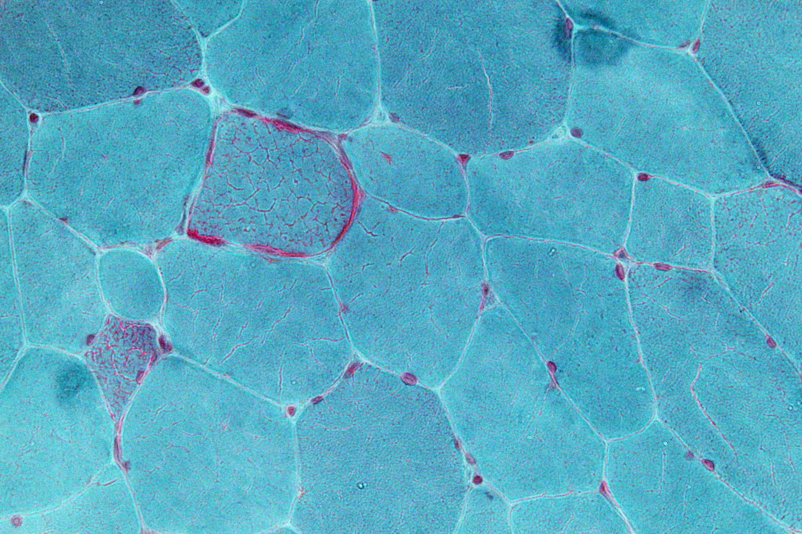

Ragged red fibers

### Subtypes of <u>mitochondrial myopathies</u> [[1]](https://coursology-qbank.com/amboss/article/lNYvYp)[[2]](https://coursology-qbank.com/amboss/article/mNYVbp)[[3]](https://coursology-qbank.com/amboss/article/t2YXjo)

* MELAS: characterized by <u>mitochondrial</u> encephalomyopathy, <u>lactic acidosis</u>, recurring <u>stroke</u>-like episodes [[4]](https://coursology-qbank.com/amboss/article/AiYR8K)[[5]](https://coursology-qbank.com/amboss/article/u2Ypjo)
* Other findings include

* <u>Muscle weakness</u>

* <u>Tonic-clonic seizures</u>

* MERRF: characterized by <u>myoclonic</u> <u>epilepsy</u> with <u>ragged red fibers</u> [[6]](https://coursology-qbank.com/amboss/article/E2Y8jo)

* Cause: <u>Point mutation</u> of the 8344th<u>base pair</u> of <u>mitochondrial DNA</u> (in 80% of cases)  → destruction of important <u>proteins</u> involved in <u>oxidative phosphorylation</u>

* Other findings include

* <u>Generalized seizures</u>

* <u>Cerebellar ataxia</u>

* <u>Dementia</u>

* CPEO: characterized by <u>chronic progressive external ophthalmoplegia</u> (with bilateral <u>ptosis</u>) [[7]](https://coursology-qbank.com/amboss/article/F2Ygjo)

* Kearns-Sayre syndrome: [[8]](https://coursology-qbank.com/amboss/article/82YOjo)

* <u>Epidemiology</u>: most commonly occurs in individuals < 20 years of age

* Etiology: hereditary deletion in <u>mitochondrial DNA</u> → disruption of <u>mitochondrial</u> energy production

* Clinical features

* Impaired electrical activity of the <u>heart</u>, especially <u>AV block</u>

* <u>Ophthalmoplegia</u> and <u>retinitis pigmentosa</u>

* Unsteady posture and gait due to <u>cerebellar ataxia</u>

* LHON (<u>Leber hereditary optic neuropathy</u>)

* <u>Epidemiology</u>

* Most commonly occurs in teenagers and young adults

* <u>♂</u> > <u>♀</u> (3:1) [[9]](https://coursology-qbank.com/amboss/article/IPbYTF)

* Etiology: <u>point mutation</u> in <u>mtDNA</u> that leads to dysfunction of <u>complex I</u> in the <u>electron transport chain</u>

* Pathophysiology: <u>cellular death</u> in <u>optic nerve</u> <u>neurons</u>

* Clinical features: painless acute or subacute bilateral <u>vision loss</u> which is usually irreversible

* Leigh syndrome [[10]](https://coursology-qbank.com/amboss/article/NNY-Yp)

* Etiology

* In 80% of cases, caused by a mutation in nuclear <u>DNA</u> (e.g., SURF1)

* In 20% of cases, caused by a mutation in <u>mitochondrial DNA</u> (e.g., MT-ATP6)

* Most common cause is disruption of <u>complex I</u>

* Clinical features

* <u>Vomiting</u>, <u>diarrhea</u>, <u>dysphagia</u>

* <u>Growth faltering</u>

* <u>Hypotonia</u>, <u>dystonia</u>, <u>ataxia</u>

* Rapidly progressive psychomotor regression

* Ophthalmoparesis, <u>nystagmus</u>, <u>optic atrophy</u>

* <u>Peripheral neuropathy</u>

* <u>Hypertrophic cardiomyopathy</u>

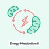

Energy Metabolism - Part 8: Anaerobic vs. Aerobic Metabolism

---

## Amino acid metabolism disorders

All <u>amino acid metabolism disorders</u> are <u>autosomal recessive</u> disorders.

| Overview of amino acid metabolism disorders |  |  |  |  |  |
| --- | --- | --- | --- | --- | --- |
|  |  | Deficiency/impairment | Accumulated substances |  | Clinical features |
|  <u>Phenylketonuria</u>    |  |   * Defective <u>phenylalanine hydroxylase</u> (<u>classic PKU</u>)  * Deficient <u>tetrahydrobiopterin</u> (<u>malignant PKU</u>)    |  * <u>Phenylalanine</u>   |  |   * Musty odor  * Light <u>skin</u> and <u>hair</u>, blue eyes  * Growth restriction  * Psychomotor delay  * <u>Seizures</u>  * <u>Eczema</u>    |
|  <u>Homocystinuria</u>    |  |  * Deficiency of one or more of the following:    * <u>Methionine synthase</u>  * <u>Cystathionine synthase</u>  * <u>Methylenetetrahydrofolate reductase</u>   |  * <u>Homocysteine</u>   |  |   * <u>Marfanoid features</u>  * Downward <u>lens subluxation</u>  * <u>Thromboembolism</u>  * Progressive <u>intellectual disability</u>  * Psychiatric and behavioral disorders  * Light <u>skin</u>  * <u>Osteoporosis</u>    |
| <u>Hartnup disease</u> |  |  * Impaired Na+-dependent neutral <u>amino acid</u> transporter on <u>enterocytes</u> and <u>proximal</u> renal tubular cells   |  * <u>Tryptophan</u> in the urine   |  |  * <u>Vitamin B3 deficiency</u>  * <u>Pellagra</u>  * <u>Cerebellar ataxia</u>   |
|  <u>Alkaptonuria</u>   |  |  * Lack of functional <u>homogentisic acid dioxygenase</u>   |  * <u>Homogentisate</u>   |  |   * <u>Ochronosis</u>  * <u>Arthritis</u>  * <u>Nephrolithiasis</u>    |
| <u>Maple syrup urine disease</u> |  |  * Absent or deficient <u>branched-chain alpha-ketoacid dehydrogenase</u>   |  * <u>Branched-chain amino acids</u> (<u>valine</u>, <u>leucine</u>, <u>isoleucine</u>)   |  |   * Sweet-smelling urine  * <u>Intellectual disability</u>  * <u>Vomiting</u>, <u>lethargy</u>, poor feeding    |
| <u>Cystinuria</u> |  |  * Impaired renal reabsorption of dibasic <u>amino acids</u> (<u>cystine</u>, <u>ornithine</u>, <u>arginine</u>, <u>lysine</u>)   |  * <u>Cystine</u> in the urine   |  |  * Recurrent <u>nephrolithiasis</u> (hexagonal <u>cystine stones</u>)   |
| <u>Organic acidemias</u> | <u>Propionic acidemia</u> |  * Deficient <u>propionyl-CoA carboxylase</u>   |  * Propionic acid   |  * <u>Ammonia</u>   |   * <u>Vomiting</u>, poor feeding  * <u>Growth faltering</u>  * <u>Lethargy</u>, <u>hypotonia</u>  * <u>Seizures</u>  * <u>Intellectual disability</u>, <u>developmental delay</u>  * <u>Hepatomegaly</u>  * <u>Hypoglycemia</u> during <u>fasting</u> periods  * Ketoacidosis    |
| <u>Methylmalonic acidemia</u> |  * Deficient <u>methylmalonyl-CoA mutase</u>   |  * <u>Methylmalonic acid</u>   |  |  |  |

Phenylketonuria fact sheet

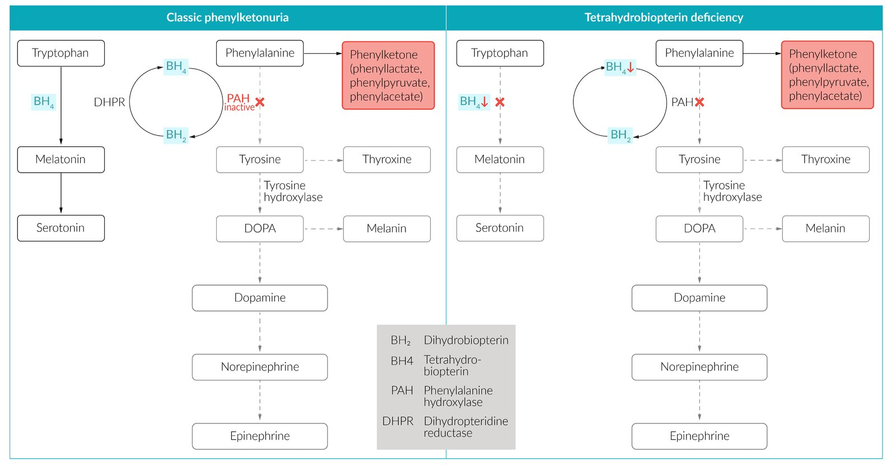

Classic phenylketonuria vs. tetrahydrobiopterin deficiency (malignant PKU)

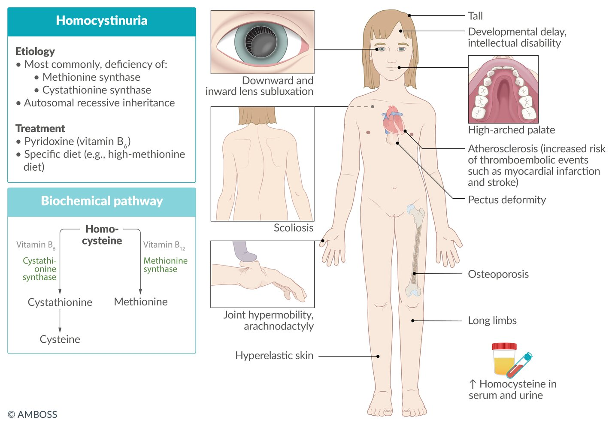

Homocystinuria

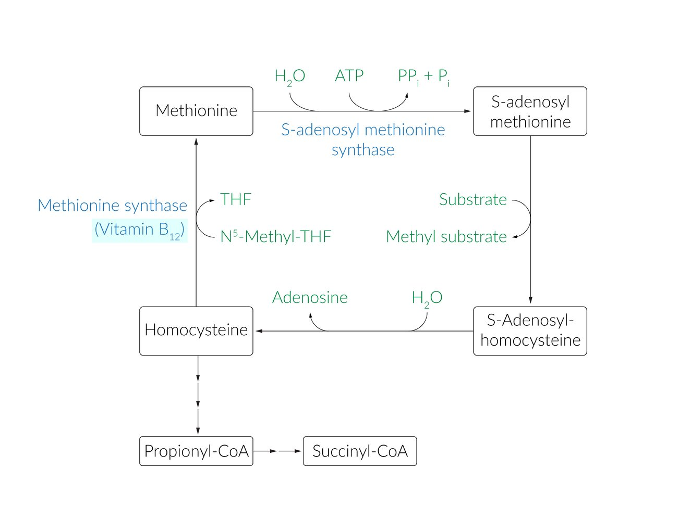

Methionine cycle

Alkaptonuria fact sheet

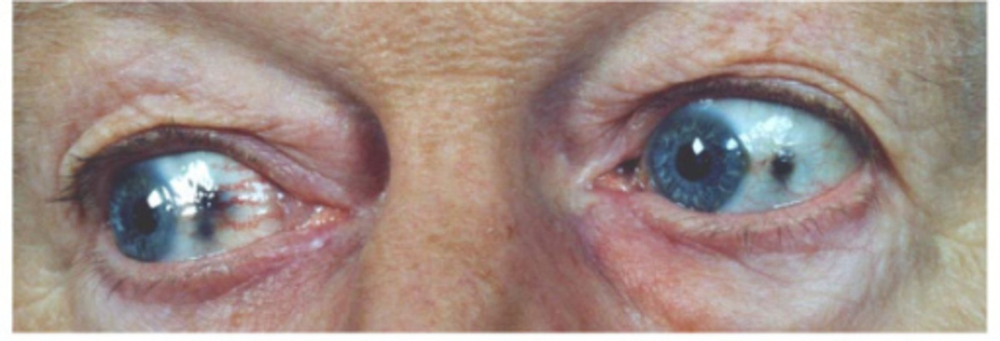

Ocular ochronosis in alkaptonuria

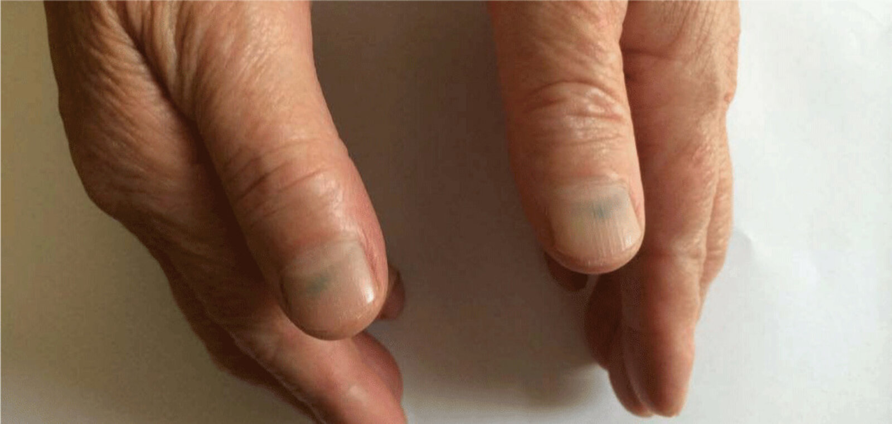

Alkaptonuria

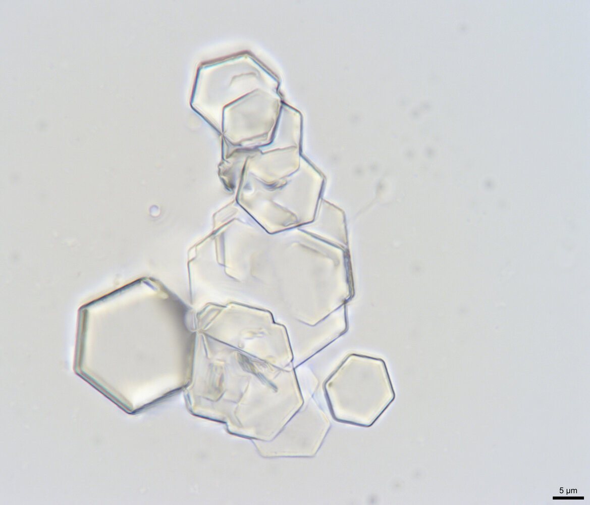

Cystine crystals

---

## Phenylketonuria

* Definition: inherited genetic disorder characterized by the accumulation of <u>phenylalanine</u> [[11]](https://coursology-qbank.com/amboss/article/x2YEPo)[[12]](https://coursology-qbank.com/amboss/article/y2Yd4o)[[13]](https://coursology-qbank.com/amboss/article/AqaRaN)

* <u>Epidemiology</u>: <u>incidence</u> is up to 1:15,000 [[14]](https://coursology-qbank.com/amboss/article/B2YzPo)

* Etiology: mutation in the <u>PAH</u> <u>gene</u>

* Inheritance: <u>autosomal recessive</u>

* Pathophysiology  

* Accumulation of <u>phenylalanine</u>  

* Most commonly due to a defect of the <u>liver</u> enzyme phenylalanine hydroxylase (<u>PAH</u>) → impaired conversion of <u>phenylalanine</u> to <u>tyrosine</u> → <u>tyrosine</u> becomes nutritionally essential (classical <u>PKU</u>)

* Less commonly

* Tetrahydrobiopterin deficiency (<u>malignant PKU</u>) due to impaired <u>tetrahydrobiopterin</u> biosynthesis or recycling, resulting in:

* Hyperphenylalaninemia due to ↓ conversion of <u>phenylalanine</u> to <u>tyrosine</u> → ↓ <u>synthesis of catecholamines</u> (<u>BH4</u> is a <u>cofactor</u> for <u>phenylalanine hydroxylase</u> and <u>tyrosine hydroxylase</u>)

* ↓ Synthesis of <u>serotonin</u> (<u>BH4</u> is a <u>cofactor</u> for <u>tryptophan hydroxylase</u>) → deficiencies of <u>neurotransmitters</u>

* Symptom severity varies between affected individuals.

* <u>Phenylalanine embryopathy</u> (<u>maternal PKU</u>): For more information, see "<u>Teratogenesis</u>."

* Excess of <u>phenylalanine</u> is transformed into phenylketone metabolites (e.g., phenylpyruvate, phenylacetate, and phenyllactate) that are excreted in the urine

* <u>Tyrosine</u> deficiency → decreased <u>neurotransmitter</u>, <u>melanin</u>, and <u>thyroxine</u> synthesis (see ”<u>Amino acid derivatives</u>”)

* Clinical features 

* Symptoms may manifest within the first few months of life.

* Growth restriction

* Psychomotor delay (starting as early as 4–6 months of age)

* <u>Seizures</u> [[15]](https://coursology-qbank.com/amboss/article/92YNPo)

* Blue eyes, light <u>skin</u>, pale <u>hair</u>

* <u>Eczema</u>

* Musty odor (due to an increase in <u>aromatic amino acids</u>)

* <u>Infants</u> with <u>maternal PKU</u> may show

* <u>Microcephaly</u>, growth restriction

* Facial dysmorphisms

* <u>Congenital heart defects</u>

* <u>Intellectual disability</u>

* Diagnostics [[16]](https://coursology-qbank.com/amboss/article/vDdATH0)

* <u>Newborn screening</u>: direct measurement of serum <u>phenylalanine</u> levels on 2nd–3rd day after <u>birth</u> (<u>phenylalanine</u> levels are normal at <u>birth</u> because of circulating maternal <u>PAH</u>)

* If the <u>screening test</u> is positive:

* Quantitative plasma <u>amino acid</u> analysis to confirm elevated <u>phenylalanine</u> levels

* Oral <u>tetrahydrobiopterin</u> loading test to differentiate between <u>PKU</u> and <u>BH4 deficiency</u>

* If <u>phenylalanine</u> levels remain unchanged: <u>PAH</u> deficiency

* If <u>phenylalanine</u> levels are decreased: <u>BH4 deficiency</u>

* ↑ Phenylketones in urine

* Pathology: shows abnormal myelination in affected individuals [[17]](https://coursology-qbank.com/amboss/article/m_cVKU0)

* <u>Pallor</u> in regions that undergo postnatal myelination (e.g., axonal connections to the <u>prefrontal cortex</u>, cortico-hippocampal relay circuits)

* Animal models reveal <u>synaptic</u> and dendritic changes (e.g., malformed dendritic trees, reduced neocortical <u>synaptic</u> density)

* Treatment

* Low <u>phenylalanine</u> and high <u>tyrosine</u> diet

* <u>BH4deficiency</u>: supplementation of <u>BH4</u> and possibly <u>levodopa</u> and 5-hydroxytryptophan

* Prognosis: Untreated individuals with <u>BH4deficiency</u> usually die within the first years of life.

> [!WARNING]
> Patients with <u>PKU</u> should be advised to avoid aspartame, an artificial sweetener that contains <u>phenylalanine</u>!

Phenylketonuria fact sheet

Classic phenylketonuria vs. tetrahydrobiopterin deficiency (malignant PKU)

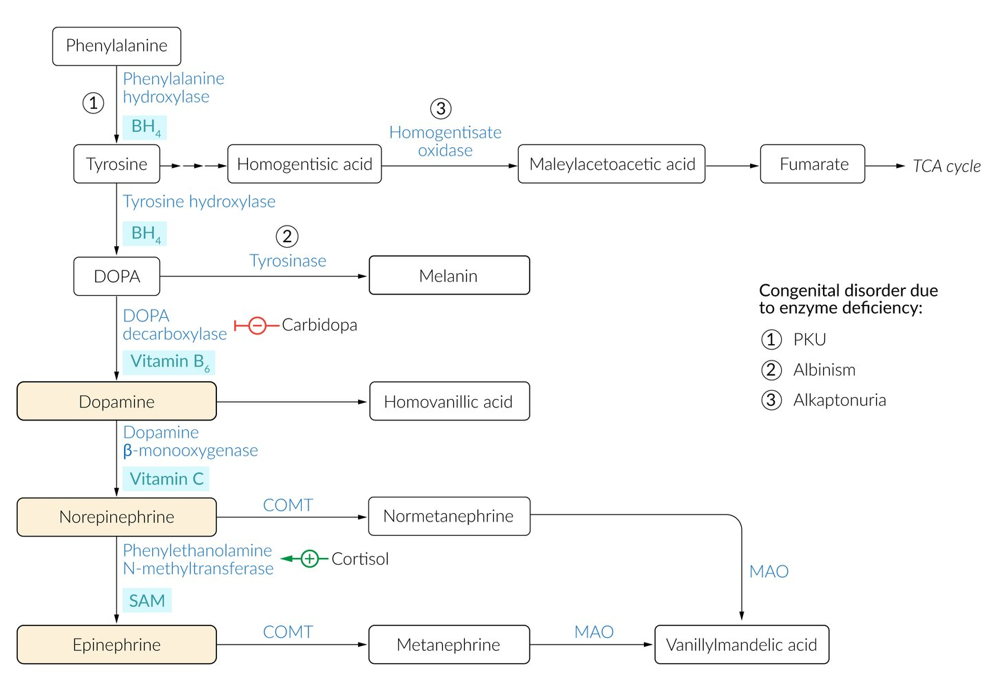

Biosynthesis and breakdown of catecholamines

---

## Homocystinuria

* Definition: a group of inherited genetic disorders characterized by impaired <u>homocysteine</u> metabolism

* <u>Epidemiology</u>: affects 1:200,000–335,000 people worldwide [[18]](https://coursology-qbank.com/amboss/article/YRXnlB)

* Etiology: mutations in CBS, <u>MTHFR</u>, MTR, MTRR, and MMADHC <u>genes</u>

* Cause deficiencies in one or more of the following enzymes

* Cystathionine synthase: an enzyme that catalyzes the conversion of <u>homocysteine</u> and <u>serine</u> to <u>cystathionine</u>, using <u>vitamin B6</u> as a <u>cofactor</u>.

* <u>Methionine synthase</u>

* Methylenetetrahydrofolate reductase (<u>MTHFR</u>): an enzyme involved in <u>folate</u> metabolism that reduces <u>N5,10-methylenetetrahydrofolate</u> to <u>methyltetrahydrofolate</u>.

* Impaired affinity of <u>cystathionine synthase</u> for <u>pyridoxal phosphate</u>

* Inheritance: : all enzyme deficiencies that cause <u>homocystinuria</u> are <u>autosomal recessive</u>

* Pathophysiology  

* <u>Methionine synthase</u> (<u>homocysteine</u> methyltransferase) deficiency → impaired conversion of <u>homocysteine</u> into <u>methionine</u>

* <u>Cystathionine synthase</u> deficiency → impaired conversion of <u>homocysteine</u> into <u>cystathionine</u>

* All forms result in the accumulation of <u>homocysteine</u>.

* Clinical features: Disease severity varies greatly. [[19]](https://coursology-qbank.com/amboss/article/7NY4cp)

* Nonspecific features in <u>infancy</u>: <u>growth faltering</u>, <u>developmental delay</u>

* Eyes

* Downward and inward subluxation of the ocular <u>lens</u>;  (<u>ectopia lentis</u>) after 3 years of age (in <u>Marfan syndrome</u>, the <u>lens</u> usually luxates upwards and outwards)

* <u>Myopia</u> and <u>glaucoma</u> later in life

* Progressive <u>intellectual disability</u>

* Psychiatric and behavioral disorders

* Light <u>skin</u>

* <u>Marfanoid features</u>

* Tall, thin

* Pectus deformities (e.g., <u>pectus excavatum</u>)

* <u>Scoliosis</u>

* Elongated limbs (↑ arm:height <u>ratio</u>; ↓ upper:lower body segment <u>ratio</u>), <u>arachnodactyly</u>

* Hyperlaxity of <u>joints</u> and <u>hyperelasticity of the skin</u>

* <u>Osteoporosis</u>

* Cardiovascular complications like <u>thromboembolism</u>, premature <u>arteriosclerosis</u>, and <u>coronary heart disease</u> increase the risk of <u>myocardial infarction</u> and <u>stroke</u>

* Diagnostics

* ↑ <u>Homocysteine</u> in urine and serum

* Urine <u>sodium nitroprusside</u> test: Urine changes color to an intense red in the presence of <u>homocysteine</u>. [[20]](https://coursology-qbank.com/amboss/article/HNYKcp)

* Serum <u>methionine</u> levels

* Increased in <u>cystathionine synthase</u> deficiency

* Decreased in <u>methionine synthase</u> deficiency and <u>methylenetetrahydrofolate reductase</u> deficiency

* Treatment

* Some patients respond to large doses of <u>pyridoxine</u> (<u>vitamin B6</u>). [[21]](https://coursology-qbank.com/amboss/article/rNYfcp)

* <u>Methionine synthase</u> deficiency: high-<u>methionine</u> diet

* <u>Cystathionine synthase</u> deficiency

* Low-<u>methionine</u>, high-<u>cysteine</u> diet

* Supplementation of <u>vitamin B12</u> and <u>folate</u>

* Impaired affinity of <u>cystathionine synthase</u> for <u>pyridoxal phosphate</u>: high-<u>cysteine</u> diet

* <u>MTHFR</u> deficiency

* Supplementation of <u>folate</u>

* <u>Betaine</u>  [[22]](https://coursology-qbank.com/amboss/article/BDdzgH0)

> [!TIP]
> <u>Marfan syndrome</u> and <u>homocystinuria</u> both present with <u>marfanoid habitus</u>. Distinguishing features include <u>intellectual disability</u>, which is only seen in <u>homocystinuria</u>, and the direction of <u>lens dislocation</u> (downwards in <u>homocystinuria</u> and upwards in <u>Marfan syndrome</u>).

> [!NOTE]
> The most important features of <u>homocystinuria</u> are <u>Marfanoid habitus</u>, skeletal abnormalities (e.g., <u>osteoporosis</u>, <u>kyphosis</u>), accelerated <u>atherosclerosis</u>, and downward <u>lens subluxation</u>: “Tall grown, brittle bone, vessels of stone, <u>lens</u> in downward zone.”

Homocystinuria

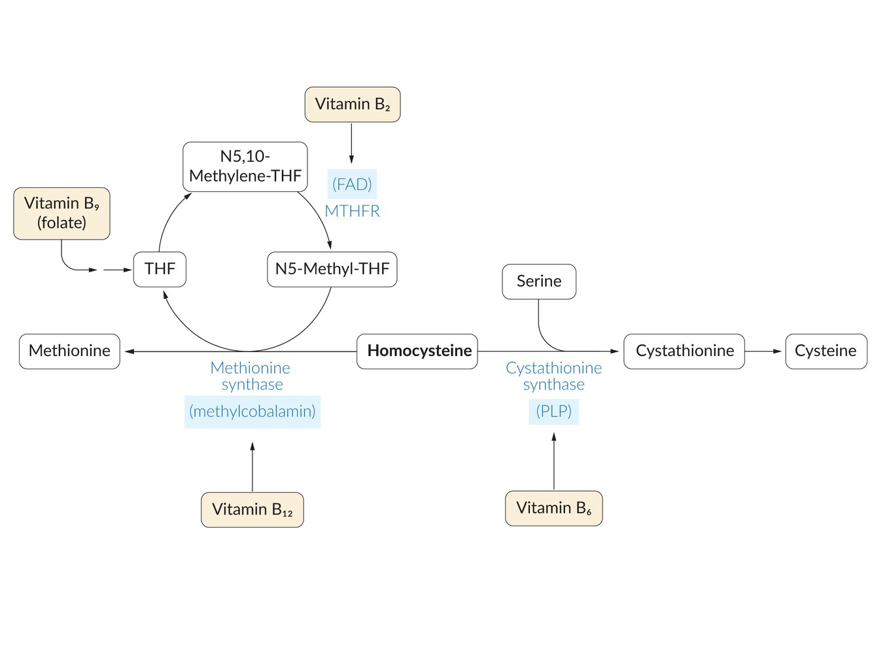

Pathophysiology of homocystinuria

Methionine cycle

---

## Hartnup disease

* Definition: : inherited genetic disorder characterized by a defect in the renal and intestinal transport of neutral <u>amino acids</u> (e.g., <u>tryptophan</u>) [[23]](https://coursology-qbank.com/amboss/article/sNYtcp)

* <u>Epidemiology</u>: <u>incidence</u> is 1:30,000 [[24]](https://coursology-qbank.com/amboss/article/bRXHlB)

* Etiology: mutation in the SLC6A19 <u>gene</u>

* Inheritance: : <u>autosomal recessive</u>

* Pathophysiology: impaired Na+-dependent neutral <u>amino acid</u> transporter on <u>enterocytes</u> and <u>proximal</u> renal tubular cells → decreased renal and intestinal absorption of <u>tryptophan</u> → inability to synthesize <u>vitamin B3</u> (<u>niacin</u>)

* Clinical features: symptoms of <u>vitamin B3 deficiency</u>

* <u>Pellagra</u>: dermatitis, <u>glossitis</u>, <u>diarrhea</u>, <u>dementia</u>

* <u>Cerebellar ataxia</u>

* Diagnostics: ↑ neutral <u>amino acids</u> in urine (neutral <u>aminoaciduria</u>)

* Treatment

* High-protein diet

* <u>Niacin</u> supplementation

---

## Alkaptonuria

* Definition: inherited genetic disorder characterized by a mutation in the HGD <u>gene</u> and subsequent <u>homogentisic acid dioxygenase</u> deficiency and impaired <u>tyrosine</u> <u>catabolism</u>    [[25]](https://coursology-qbank.com/amboss/article/v2YAjo)[[26]](https://coursology-qbank.com/amboss/article/INYYcp)

* <u>Epidemiology</u>: affects 1:250,000–1,000,000 people worldwide [[27]](https://coursology-qbank.com/amboss/article/XRX9lB)

* Etiology: mutation in the HGD <u>gene</u>

* Inheritance: <u>autosomal recessive</u>

* Pathophysiology

* Lack of functional homogentisic acid dioxygenase → impaired conversion of homogentisic acid to 4-maleylacetoacetate

* Accumulation of <u>homogentisic acid</u> → tissue discoloration and organ damage

* Clinical features

* Usually, a benign condition

* Ochronosis: bluish-black discoloration of <u>connective tissues</u>  

* Affects <u>cartilage</u> (e.g., <u>ears</u>), <u>tendons</u>, <u>skin</u>, and/or <u>sclera</u>

* Body fluids (e.g., urine, sweat) often turn black when exposed to air

* Calcifications of the following

* <u>Cartilage</u>: <u>arthritis</u> (<u>ochronotic osteoarthropathy</u>)

* May manifest with <u>arthralgias</u> due to accumulation of <u>homogentisic acid</u>, which attacks <u>cartilage</u>, in the <u>joints</u>

* Degenerative changes in the <u>vertebral column</u>

* <u>Kidneys</u>: <u>nephrolithiasis</u>

* <u>Heart valves</u>: <u>mitral valve stenosis</u>

* <u>Coronary arteries</u>: <u>coronary artery disease</u>

* Diagnostics

* Urine turns black when left standing for a prolonged time or when alkalinized.

* ↑ <u>Homogentisic acid</u> in urine and serum

* Normal <u>tyrosine</u> levels

* Treatment: diet low in <u>tyrosine</u> and <u>phenylalanine</u> to reduce the formation of <u>homogentisic acid</u>

Alkaptonuria fact sheet

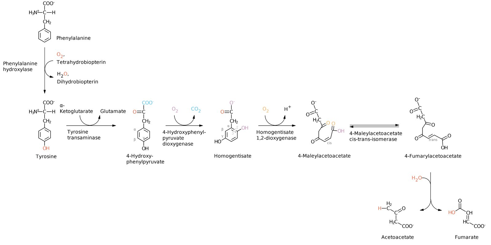

Catabolic pathway of amino acids phenylalanine and tyrosine

Ocular ochronosis in alkaptonuria

Alkaptonuria

---

## Maple syrup urine disease

* Definition: : inherited genetic disorder characterized by the impaired break down of <u>branched-chain amino acids</u> (<u>BCAA</u>) [[28]](https://coursology-qbank.com/amboss/article/emYxep)[[29]](https://coursology-qbank.com/amboss/article/KmYUgp)[[30]](https://coursology-qbank.com/amboss/article/UmYbUp)

* <u>Epidemiology</u>: <u>incidence</u> is 1:185,000 (worldwide) [[31]](https://coursology-qbank.com/amboss/article/cRXaNB)

* Etiology: mutations in BCKDHA, BCKDHB, and DBT <u>genes</u>

* Inheritance: : <u>autosomal recessive</u>

* Pathophysiology: absent or deficient branched-chain alpha-ketoacid dehydrogenase → impaired degradation of <u>BCAA</u> (<u>valine</u>, <u>leucine</u>, <u>isoleucine</u>) → elevated α-ketoacid formation

* Clinical features

* Symptom onset: early <u>neonatal period</u>

* <u>Vomiting</u>, <u>lethargy</u>, poor feeding

* Sweet-smelling urine (maple syrup or burnt sugar odor)

* <u>Intellectual disability</u>

* <u>Dystonia</u>

* Damage to the <u>CNS</u> can be severe (elevated <u>leucine</u> level leads to <u>brain injury</u>)

* <u>Death</u> may occur without appropriate treatment

* Diagnostics

* Part of <u>newborn screening</u>

* Serum

* Increased levels of alpha-ketoacids (especially <u>leucine</u> alpha-ketoacids)

* Increased levels of <u>leucine</u>, <u>isoleucine</u>, and <u>valine</u>

* <u>Hypoglycemia</u>

* Urine: presence of abnormal branched-chain hydroxy acids and ketoacids

* Treatment

* Avoid foods containing <u>BCAA</u>

* Supplementation of <u>thiamine</u>, a <u>cofactor</u> of branched-chain alpha-ketoacid <u>dehydrogenase</u>

* Treatment of last resort: <u>liver transplantation</u>

> [!NOTE]
> Grab the Maple BRANCH if you want to LIVe! In Maple syrup urine disease, the breakdown of BRANCHED <u>amino acids</u> (Leucine, Isoleucine, and Valine) is impaired.

---

## Cystinuria

* Definition: : an inherited genetic disorder characterized by the accumulation of <u>cystine</u> in the <u>kidneys</u> and <u>bladder</u> due to a disruption of <u>amino acid</u> transporter function in the <u>proximal convoluted tubule</u> and intestine. [[32]](https://coursology-qbank.com/amboss/article/MmYMTp)

* <u>Epidemiology</u>: <u>incidence</u> is ∼ 1:7,000

* Inheritance: <u>autosomal recessive</u>

* Pathophysiology: impaired renal reabsorption of dibasic <u>amino acids</u> (<u>cystine</u>, <u>ornithine</u>, <u>arginine</u>, <u>lysine</u>) → accumulation of <u>cystine</u> in the urine → frequent formation of hexagonal <u>cystine stones</u>

* Clinical features: recurrent <u>nephrolithiasis</u>, starting as early as childhood (see also “<u>Cystine stones</u>”)

* Diagnostics

* Urine microscopy: hexagonal <u>cystine stones</u>

* Urinary <u>cyanide nitroprusside test</u>: positive

* Treatment: increase <u>cystine</u> solubility to counter the formation of <u>renal stones</u>

* Adequate hydration

* <u>Urinary alkalinization</u>: <u>acetazolamide</u>, <u>potassium</u> <u>citrate</u>

* <u>Chelating agents</u>: <u>penicillamine</u>

> [!NOTE]
> To remember the four dibasic <u>amino acids</u> that cannot be absorbed by the <u>kidney</u> in <u>cystinuria</u>, think of “Dibasic COAL: Cystine, Ornithine, Arginine, Lysine.”

Cystine crystals

---

## Organic acidemias

* Definition: inherited genetic disorders characterized by impaired metabolism of fats and <u>proteins</u> [[33]](https://coursology-qbank.com/amboss/article/TmY6Up)[[34]](https://coursology-qbank.com/amboss/article/gmYFUp)[[35]](https://coursology-qbank.com/amboss/article/8dbO7s)

* <u>Epidemiology</u> [[35]](https://coursology-qbank.com/amboss/article/8dbO7s)

* <u>Incidence</u> of <u>propionic acidemia</u> is ∼ 1:100,000

* <u>Incidence</u> of <u>methylmalonic acidemia</u> is ∼ 1:50,000

* Etiology

* <u>Propionic acidemia</u>: PCCA and PCCB <u>gene mutations</u>

* <u>Methylmalonic acidemia</u>

* MMUT, MMA, MMAB, or MMADHC <u>gene mutations</u> (<u>methylmalonyl-CoA mutase</u> deficiency)

* MCEE <u>gene</u> mutation (<u>methylmalonyl-CoA</u> epimerase deficiency)

* Inheritance: <u>autosomal recessive</u>

* Pathophysiology

* Propionic acidemia: <u>propionyl-CoA carboxylase</u> deficiency → impaired conversion of <u>propionyl-CoA</u> to <u>methylmalonyl-CoA</u> → ↑ <u>propionyl-CoA</u> and ↓ <u>methylmalonate</u> → conversion into propionic acid, which accumulates in serum and urine

* Methylmalonic acidemia: <u>methylmalonyl-CoA mutase</u> deficiency or <u>vitamin B12 deficiency</u> → accumulation of <u>methylmalonic acid</u>
* <u>Methylmalonyl-CoA</u> is transformed into <u>succinyl-CoA</u> by the enzyme <u>methylmalonyl-CoA mutase</u>, which requires adenosylcobalamin, the active form of <u>vitamin B12</u>, as a <u>cofactor</u>.

* Accumulation of organic acids leads to

* <u>Urea cycle</u> inhibition → <u>hyperammonemia</u>

* <u>Gluconeogenesis</u> inhibition → <u>hypoglycemia</u> during <u>fasting</u> periods and increased risk of ketoacidosis (<u>high anion gap metabolic acidosis</u>)

* Clinical features

* Manifests in the <u>neonatal period</u>

* <u>Vomiting</u>, poor feeding

* <u>Growth faltering</u>
<u>Lethargy</u>

* <u>Seizures</u>

* <u>Hypotonia</u>

* <u>Intellectual disability</u>, <u>developmental delay</u>

* <u>Hepatomegaly</u>

* <u>Coma</u>

* <u>Death</u> may occur without appropriate treatment

* Diagnostics

* ↑ Propionic acid or ↑ <u>methylmalonic acid</u> in urine and serum

* <u>High anion gap metabolic acidosis</u>

* <u>Hyperammonemia</u>

* <u>Ketonuria</u>

* Treatment: to avoid further production of <u>propionyl-CoA</u>, follow a diet that is low in

* Protein, especially low in <u>amino acids</u> <u>isoleucine</u>, <u>valine</u>, <u>threonine</u>, and <u>methionine</u>

* <u>Pyrimidines</u> (<u>thymine</u> and <u>uracil</u>)

* <u>Odd-chain fatty acids</u>, <u>cholesterol</u>

> [!NOTE]
> <u>Infants</u> PRObably VOMIT when affected by <u>organic acidemia</u>: in PROpionic <u>acidemia</u>, Valine, Odd-chain <u>fatty acids</u>, Methionine, Isoleucine, and Threonine should be avoided.

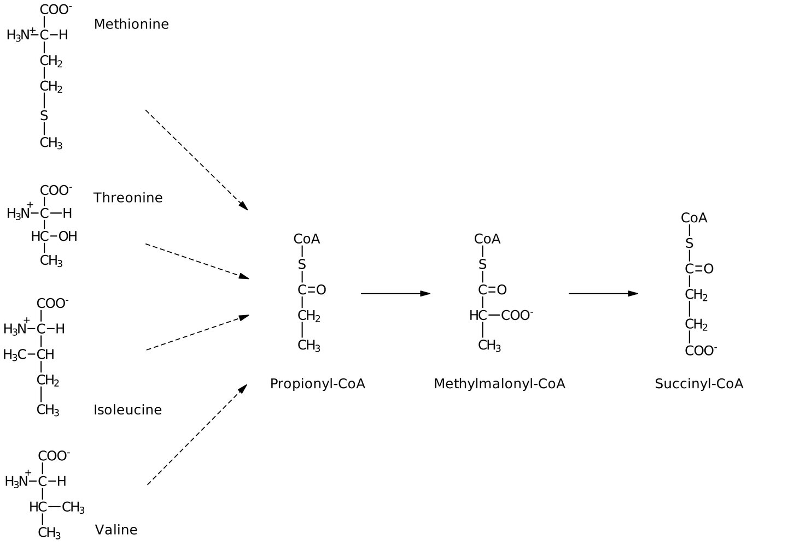

Metabolism of methionine, isoleucine, valine, and threonine

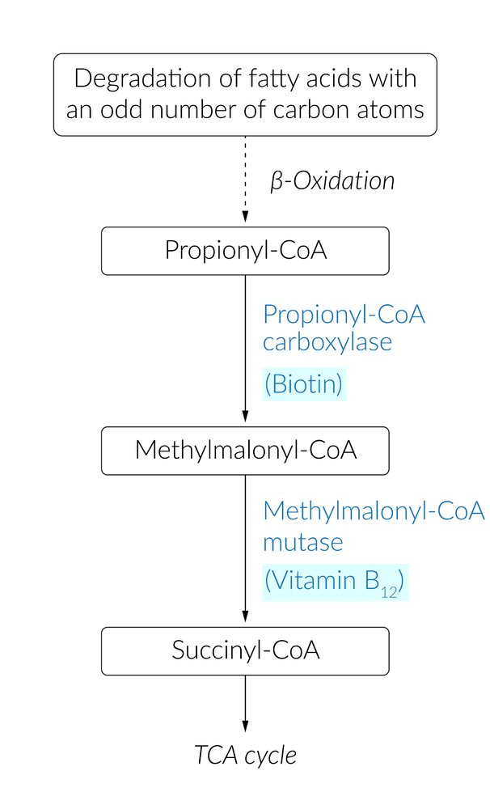

Degradation of odd chain fatty acids

---

## Cystinosis

* Definition: inherited genetic disorder characterized by impaired <u>cystine</u> storage [[36]](https://coursology-qbank.com/amboss/article/A2YR4o)[[37]](https://coursology-qbank.com/amboss/article/vNYA1p)

* <u>Epidemiology</u>: <u>incidence</u> of the most common form (infantile <u>cystinosis</u>) is up to 1:200,000

* Inheritance: <u>autosomal recessive</u>

* Pathophysiology

* Defective transport of <u>cystine</u> out of <u>lysosomes</u> → accumulation of <u>cystine</u> within <u>lysosomes</u>

* Formation of <u>cystine</u> crystals and cellular dysfunction (particularly, renal <u>proximal</u> tubular cells)

* <u>Fanconi syndrome</u>: a tubular disorder with increased excretion of <u>sodium</u>, <u>potassium</u>, <u>phosphate</u>, <u>bicarbonate</u>, <u>glucose</u>, <u>amino acids</u>, <u>uric acid</u>, and water

* Three clinical forms in order of severity: infantile > juvenile > ocular (adult) <u>cystinosis</u>

* Clinical features

* <u>Growth faltering</u>

* <u>Vomiting</u>, <u>weakness</u>, <u>dehydration</u>

* <u>Polyuria</u>, <u>polydipsia</u>

* Progressive <u>renal failure</u>

* <u>Photophobia</u> (due to corneal crystal formation)

* Additional organ involvement (e.g., <u>hepatomegaly</u>)

* Diagnosis

* Observation of <u>cystine</u> crystals in the <u>cornea</u> during <u>slit-lamp examination</u>

* Progressive decrease of <u>GFR</u>

* <u>Hypokalemia</u>, <u>hyponatremia</u>, <u>metabolic acidosis</u>

* Confirmed by elevated <u>cystine</u> content in <u>leukocytes</u>

* Treatment

* Correction of metabolic abnormalities associated with <u>Fanconi syndrome</u> or <u>renal failure</u>

* Specific therapy: cysteamine

* <u>Renal transplantation</u>

---

## Pyruvate dehydrogenase complex deficiency

* Definition: : inherited genetic disorder characterized by impaired <u>pyruvate metabolism</u>

* Inheritance: <u>X-linked recessive</u> or <u>autosomal recessive</u>

* Pathophysiology

* Absent <u>pyruvate dehydrogenase complex</u> (<u>PDC</u>) → impaired conversion of <u>pyruvate</u> to <u>acetyl-CoA</u> → reduced production of <u>citrate</u> → impaired <u>citric acid cycle</u> → energy deficit (especially in the <u>CNS</u>) → neurological dysfunction

* Excess <u>pyruvate</u> is further metabolized in the <u>Cahill cycle</u> to the following

* <u>Lactate</u> via <u>lactate dehydrogenase</u>

* <u>Alanine</u> via <u>alanine aminotransferase</u>

* Clinical features

* Onset: early <u>neonatal period</u>

* Poor feeding, <u>lethargy</u>

* <u>Tachypnea</u>

* <u>Developmental delay</u>

* Progressive neurological symptoms (e.g., <u>seizures</u>)

* Diagnostics

* ↑ <u>Lactate</u> (<u>lactic acidosis</u>) and <u>pyruvate</u> in serum

* ↑ <u>Alanine</u> in serum and urine

* Treatment

* Acute: correction of <u>acidosis</u>

* Long-term: ketogenic diet

* High in fat, low in <u>carbohydrates</u>

* High in <u>ketogenic amino acids</u> (<u>lysine</u> and <u>leucine</u>)

* Avoidance of glucogenic acids (e.g., <u>valine</u>)

* Supplementation of <u>cofactors</u> of <u>PDC</u> (<u>thiamine</u>, carnitine, and <u>lipoic acid</u>) [[40]](https://coursology-qbank.com/amboss/article/fmYkUp)

> [!NOTE]
> The main features of <u>PDCD</u> are <u>X-linked recessive inheritance</u>, neurological symptoms, and increased <u>lactate</u> and <u>alanine</u> in serum. A ketogenic diet helps to control <u>lactic acidosis</u>.

---

## Fatty acid metabolism disorders

### Overview

* <u>Autosomal recessive</u> disorders caused by disruptions in <u>mitochondrial</u> <u>beta-oxidation</u> or in carnitine transport and <u>fatty acid oxidation</u>

* Cause an inability to break down <u>fatty acids</u>, which then accumulate in the <u>liver</u>, cardiac, and <u>skeletal muscles</u>

* Although clinical presentation varies, most <u>fatty acid metabolism disorders</u> manifest with hypoketotic <u>hypoglycemia</u>, <u>encephalopathy</u>, skeletal <u>myopathy</u>, <u>cardiomyopathy</u>, and <u>liver</u> dysfunction.

| Overview of fatty acid metabolism disorders |  |  |  |  |  |
| --- | --- | --- | --- | --- | --- |
|  |  | Deficiency/impairment | Accumulated substance |  Clinical features [[41]](https://coursology-qbank.com/amboss/article/ycWdU40)  |  |
| <u>Medium-chain acyl-CoA dehydrogenase deficiency</u> (<u>MCAD deficiency</u>) |  |  * Deficient <u>medium-chain acyl-CoA dehydrogenase</u>   |  * <u>Medium-chain fatty acids</u> (acyl-CoAs)   |   * Hypoketotic <u>hypoglycemia</u>  * Liver dysfunction  * <u>Encephalopathy</u> (<u>lethargy</u>, <u>seizures</u>, <u>coma</u>)    |  * N/A   |
| <u>Long-chain hydroxyacyl-CoA dehydrogenase deficiency</u> (<u>LCHAD deficiency</u>) |  |  * Deficient <u>long-chain hydroxyacyl-CoA dehydrogenase</u>   |  * <u>Long-chain fatty acids</u>   |   * <u>Cardiomyopathy</u>  * <u>Peripheral neuropathy</u>  * <u>Retinopathy</u>  * Skeletal <u>myopathy</u>  * <u>Rhabdomyolysis</u>    |  |
| <u>Primary carnitine deficiency</u> |  |  * Defective carnitine transporter   |  * <u>Long-chain fatty acids</u>   |  * N/A   |  |
| <u>Carnitine palmitoyltransferase II deficiency</u> (<u>CPT II deficiency</u>) |  |  * Defective carnitine palmitoyltransferase II (CPT II)   |  * Long-chain acylcarnitines   |   * <u>Cardiomyopathy</u>  * Skeletal <u>myopathy</u>  * <u>Rhabdomyolysis</u>    |  |

### <u>Medium-chain acyl-CoA dehydrogenase deficiency</u> (MCAD deficiency) [[42]](https://coursology-qbank.com/amboss/article/qKaChl)[[43]](https://coursology-qbank.com/amboss/article/pmYLgp)[[44]](https://coursology-qbank.com/amboss/article/SmYyUp)

* Definition: : a condition characterized by a defect in the breakdown of <u>medium-chain fatty acids</u>, which renders <u>fatty acids</u> an unusable alternative energy source in case of <u>carbohydrate</u> deficiency.

* Inheritance: <u>autosomal recessive</u>

* Pathophysiology

* Deficiency of medium-chain <u>acyl-CoA dehydrogenase</u> → defective breakdown of medium-chain <u>fatty acids</u> into <u>acetyl-CoA</u> → elevated concentrations of fatty <u>acyl-CoA</u> in the blood → hypoketotic <u>hypoglycemia</u>

* Symptoms are usually triggered by the following:

* Prolonged <u>fasting</u>

* States of increased metabolic demand (e.g., infection, exercise)

* Clinical features

* Onset: within the first years of life

* <u>Dehydration</u>, poor feeding

* <u>Vomiting</u>

* <u>CNS</u>

* <u>Lethargy</u>

* <u>Seizures</u>

* <u>Coma</u>

* <u>Hypotonia</u>

* Cardiopulmonary collapse

* Diagnostics

* Part of <u>newborn screening</u>

* Laboratory findings

* <u>Hypoglycemia</u>

* ↓ <u>Ketones</u> in blood and urine

* <u>Hyperammonemia</u>, <u>hyperuricemia</u>

* <u>Metabolic acidosis</u>

* ↑ <u>AST</u> and <u>ALT</u>

* Prolonged <u>PT</u> and <u>aPTT</u>

* Plasma acylcarnitine profile

* <u>Genetic testing</u> for the common A985G mutation

* Treatment

* IV administration of <u>10% dextrose</u> during acute decompensation

* Avoid <u>fasting states</u>

* Diet high in <u>carbohydrates</u> and low in fat [[42]](https://coursology-qbank.com/amboss/article/qKaChl)

* Complications

* <u>Encephalopathy</u>

* <u>Fatty liver</u> disease and impaired <u>hepatic function</u>

* Sudden <u>death</u>

Energy Metabolism - Part 5: Beta-oxidation Reactions with molecular structures

Energy Metabolism - Part 5: Beta-oxidation Reactions without molecular structures

### Long-chain hydroxyacyl-CoA dehydrogenase deficiency (<u>LCHAD deficiency</u>) [[45]](https://coursology-qbank.com/amboss/article/nNW7bN0)[[46]](https://coursology-qbank.com/amboss/article/6NWjXN0)

* Definition: a condition in which a deficiency in <u>long-chain fatty acid</u> oxidation causes a buildup of toxic <u>fatty acid</u> intermediates

* Inheritance: <u>autosomal recessive</u>

* Pathophysiology [[47]](https://coursology-qbank.com/amboss/article/oNW0XN0)

* <u>Long-chain hydroxyacyl-CoA dehydrogenase deficiency</u> → defective breakdown of <u>long-chain fatty acids</u> → buildup of toxic <u>fatty acid</u> intermediates → hypoketotic <u>hypoglycemia</u>

* Symptoms are usually triggered by the following:

* Prolonged <u>fasting</u>

* States of increased metabolic demand (e.g., infection, exercise)

* Clinical features

* Onset: within the first few years of life

* Poor feeding

* <u>Growth faltering</u>

* Irritability, <u>lethargy</u>

* <u>Hypoglycemia</u>

* Skeletal <u>myopathy</u> (<u>hypotonia</u>, <u>myalgia</u>)

* <u>Rhabdomyolysis</u>

* <u>Hepatomegaly</u>, liver dysfunction

* <u>Cardiomyopathy</u>

* Diagnostics

* <u>Newborn screening</u>

* Laboratory findings

* <u>Hypoglycemia</u>

* ↓ <u>Ketones</u> in blood and urine

* <u>Hyperammonemia</u>

* <u>Metabolic acidosis</u>

* ↑ 3-hydroxydicarboxylic acids in urine

* ↑ <u>Lactic acid</u> in urine

* ↑ <u>AST</u> and <u>ALT</u>

* ↑ <u>Creatine kinase</u>

* <u>Genetic testing</u> for <u>HADHA gene</u> variant

* Enzymatic assay in <u>skin</u> <u>fibroblasts</u> or <u>lymphocytes</u>

* Treatment [[45]](https://coursology-qbank.com/amboss/article/nNW7bN0)

* IV administration of <u>10% dextrose</u> during acute decompensation

* Frequent feeding intervals

* Diet low in fat and high in <u>carbohydrates</u>  [[45]](https://coursology-qbank.com/amboss/article/nNW7bN0)

* Dietary supplementation with <u>medium-chain fatty acids</u> (e.g., <u>Triheptanoin</u>)

* Avoid prolonged <u>fasting</u>.

* Complications

* <u>Encephalopathy</u>

* <u>Retinopathy</u>

<u>Peripheral neuropathy</u>

* <u>Pregnancy</u>-associated disorders (e.g., <u>preeclampsia</u>, <u>HELLP syndrome</u>, <u>acute fatty liver of pregnancy</u>)  [[46]](https://coursology-qbank.com/amboss/article/6NWjXN0)

### Primary carnitine deficiency [[48]](https://coursology-qbank.com/amboss/article/-iYD8K)

* Definition: : a congenital condition characterized by a defective plasma-membrane carnitine transporter that leads to renal loss, <u>systemic carnitine deficiency</u>, and impaired <u>fatty acid oxidation</u> of the carnitine transporter

* Inheritance: <u>autosomal recessive</u>

* Pathophysiology

* Defective carnitine transporter → impaired entry of <u>long-chain fatty acids</u> into <u>mitochondria</u> via <u>carnitine-dependent shuttle</u> → impaired <u>fatty acid metabolism</u> via <u>beta-oxidation</u>

* ↓ Energy production from <u>fatty acids</u> (↓ <u>gluconeogenesis</u>) and ↓ production of <u>ketones</u> → hypoketotic <u>hypoglycemia</u>

* Accumulation of fat (<u>long-chain fatty acids</u>) in the <u>cytosol</u> of the <u>liver</u> and cardiac and <u>skeletal muscle</u> cells → toxicity

* Clinical features

* Onset: early childhood

* <u>Growth faltering</u>

* <u>Weakness</u>, <u>lethargy</u>

* <u>Liver</u> dysfunction

* <u>Dilated cardiomyopathy</u>, <u>congestive heart failure</u>

* <u>Hypotonia</u>

* <u>Encephalopathy</u>

* <u>Rhabdomyolysis</u> (can cause <u>renal failure</u>)

* Diagnostics

* Part of <u>newborn screening</u>

* ↓ <u>Glucose</u> and ↓ <u>ketones</u> in serum (hypoketotic <u>hypoglycemia</u>), <u>hyperammonemia</u>, ↑ <u>ALT</u>, ↑ <u>AST</u>

* Very low plasma carnitine levels

* Treatment

* Avoid <u>fasting states</u>

* Oral carnitine supplementation

* Acute hypoketotic <u>hypoglycemic</u> <u>encephalopathy</u>: administer IV carnitine and <u>10% dextrose</u> in water

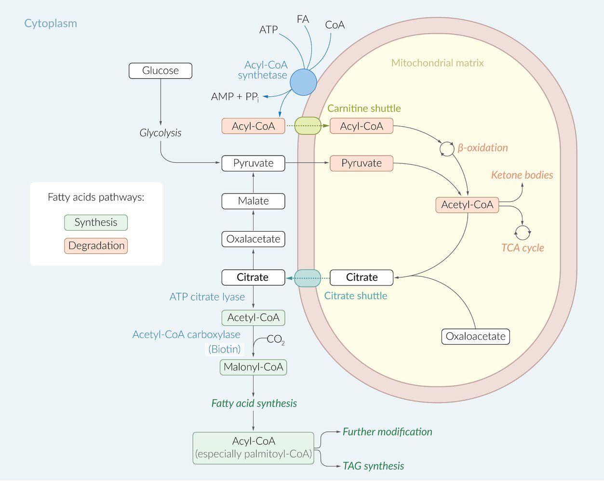

Fatty acid metabolism (overview)

### Carnitine palmitoyltransferase II deficiency (<u>CPT II deficiency</u>) [[49]](https://coursology-qbank.com/amboss/article/aQYQuK)[[50]](https://coursology-qbank.com/amboss/article/ZQYZuK)[[51]](https://coursology-qbank.com/amboss/article/0QYeuK)

* Definition: : a disorder characterized by impaired <u>long-chain fatty acid</u> oxidation in the <u>mitochondria</u>

* Inheritance: <u>autosomal recessive</u>

* Pathophysiology

* CPT II normally removes carnitine from <u>long-chain fatty acids</u> in the <u>mitochondria</u>, which is necessary for <u>fatty acid oxidation</u> to occur

* Defective carnitine palmitoyltransferase II (CPT II) → carnitine cannot be removed from <u>long-chain fatty acids</u> → no <u>fatty acid</u> oxidation → no substrate for <u>gluconeogenesis</u> and <u>ketogenesis</u> → hypoketotic <u>hypoglycemia</u>

* Accumulation of <u>fatty acids</u> and long-chain acylcarnitines → damage to <u>liver</u>, <u>heart</u>, and muscles [[50]](https://coursology-qbank.com/amboss/article/ZQYZuK)

* Clinical features

* Symptoms may occur as early as the <u>neonatal period</u>.

* Presentation is variable

* <u>Growth faltering</u>

* <u>Myalgia</u>, <u>hypotonia</u>

* <u>Hepatomegaly</u>, <u>liver</u> dysfunction, <u>liver</u> failure

* <u>Cardiomyopathy</u>, <u>congestive heart failure</u>

* <u>Encephalopathy</u>

* <u>Seizures</u>

* <u>Rhabdomyolysis</u> (can cause <u>renal failure</u>)

* Sudden <u>death</u>

* Diagnostics

* Part of the expanded <u>newborn screening</u>

* <u>Hypoglycemia</u>, ↓ serum <u>ketones</u>

* ↓ Total and free carnitine levels, ↑ acylcarnitines

* <u>Myoglobinuria</u> and ↑ serum <u>creatine kinase</u>

* ↑ <u>ALT</u>, ↑ <u>AST</u>, <u>hyperammonemia</u>

* Treatment

* Diet low in long-chain <u>triglyceride</u>, high in <u>medium-chain fatty acids</u>, and high in <u>carbohydrates</u>

* Avoid prolonged strenuous activity and <u>fasting</u>

---

## Purine salvage deficiencies

### General

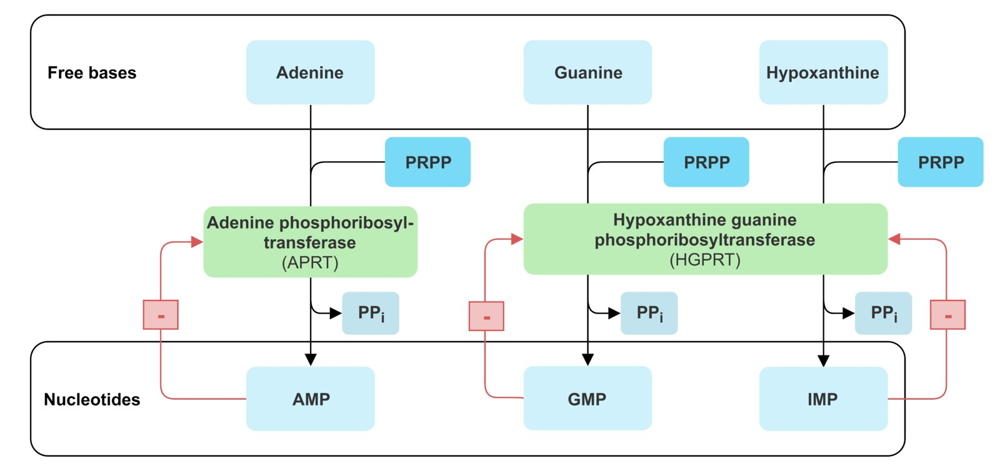

Salvage pathway

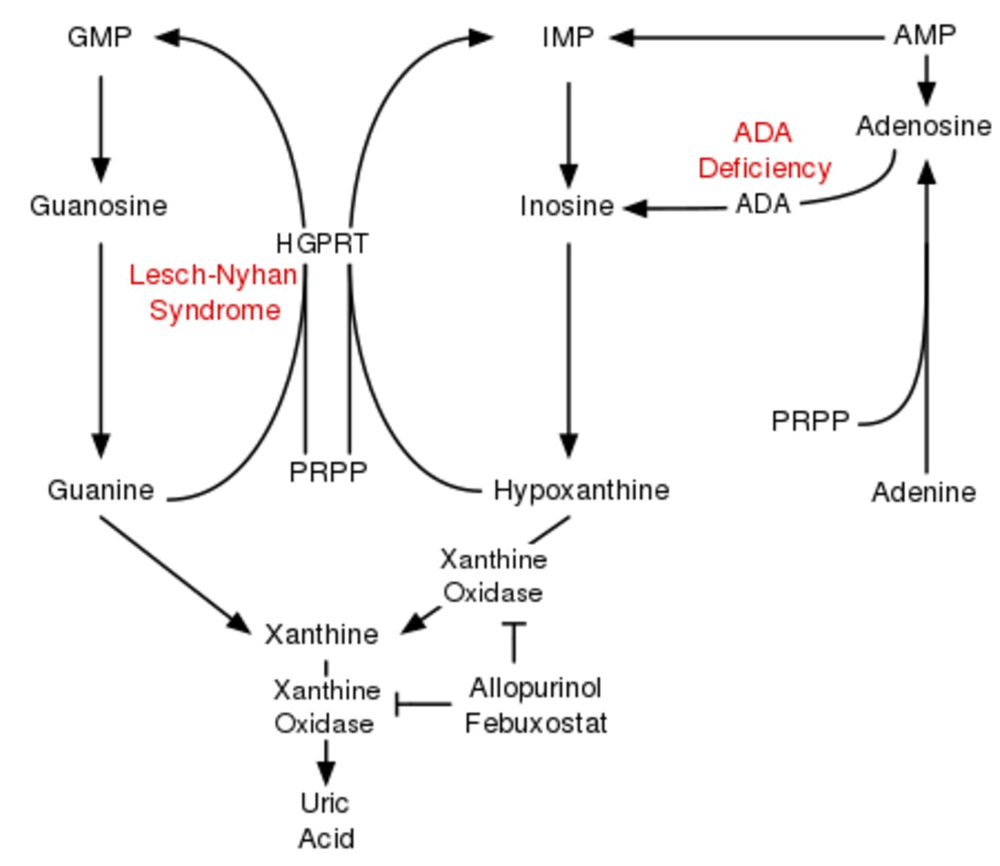

Purine salvage deficiencies

### Lesch-Nyhan syndrome [[52]](https://coursology-qbank.com/amboss/article/z2Yr4o)[[53]](https://coursology-qbank.com/amboss/article/KNYUXp)

* Definition: : inherited genetic disorder characterized by impaired <u>purine salvage pathway</u>, resulting in an overproduction of <u>uric acid</u>

* Inheritance: <u>X-linked recessive</u>

* Pathophysiology: defect in the enzyme <u>hypoxanthine-guanine phosphoribosyltransferase</u> (<u>HGPRT</u>) → impaired conversion of <u>hypoxanthine</u> to <u>IMP</u> and <u>guanine</u> to <u>GMP</u> → excess <u>uric acid</u> and ↑ de novo <u>purine</u> synthesis

* Clinical features 

* Usually asymptomatic for the first 6 months of life

* Orange sand-like <u>sodium</u> <u>urate</u> crystals can be found in the diapers of <u>infants</u> with <u>hyperuricemia</u>.

* <u>Developmental delay</u> and cognitive impairment

* Pyramidal and <u>extrapyramidal symptoms</u> (e.g., <u>dystonia</u>, <u>spasticity</u>)

* <u>Gouty arthritis</u>, <u>urate nephropathy</u>

* Aggression, self-injurious behavior

* <u>Renal failure</u>

* Diagnostics

* <u>Hyperuricemia</u>

* ↓ <u>HGPRT</u> activity

* <u>Macrocytosis</u> (<u>megaloblastic anemia</u> may occur)

* Treatment

* There is no treatment for the underlying enzyme defect.

* Reduce <u>uric acid</u> levels:

* <u>Allopurinol</u> (first-line)

* <u>Febuxostat</u> (second-line)

* Low-<u>purine</u> diet

* Prognosis: high mortality if the <u>infant</u> is not treated within the first year of life

> [!NOTE]
> To remember the enzyme <u>hypoxanthine</u>-<u>guanine</u> phosphoribosyltransferase (<u>HGPRT</u>), which is involved in <u>Lesch-Nyhan syndrome</u>: He's Got Purine Recovery Troubles OR Hyperuricemia, Gout, Poor intellect, Rage/aggression, abnormal muscle Tone.

### Adenosine deaminase deficiency [[54]](https://coursology-qbank.com/amboss/article/6mYjgp)

* Definition: : inherited genetic disorder characterized by the impaired metabolism of deoxyadenosine during <u>DNA</u> breakdown

* Etiology: mutations in the <u>ADA</u> <u>gene</u>

* Inheritance: <u>autosomal recessive</u>

* Pathophysiology

* Deficiency in <u>adenosine</u> deaminase → ↓ breakdown of <u>adenosine</u> and deoxyadenosine → ↑ deoxyadenosine (<u>dATP</u>) accumulation → ↓ enzyme activity of <u>ribonucleotide reductase</u> → <u>lymphocyte</u> toxicity → <u>immunodeficiency</u>

* See “<u>Purines and pyrimidines</u>.”

* Clinical features

* Severe, recurrent infections

* <u>Growth faltering</u>

* See “<u>Severe combined immunodeficiency</u>.”

* Treatment: <u>supportive care</u>, IVIG, <u>bone marrow transplantation</u>

---

## Urea cycle disorders

### Overview

|  Overview of urea cycle disorders   |  |  |  |  |  |  |
| --- | --- | --- | --- | --- | --- | --- |
|  |  | Inheritance | Deficiency/impairment | Accumulated substance |  | Clinical features |
|  <u>Ornithine transcarbamylase deficiency</u> (<u>OTC deficiency</u>) (most common)  |  |  * <u>X-linked recessive</u>   |  * Defective <u>ornithine transcarbamylase</u>   |   * <u>Carbamoyl phosphate</u>  * <u>Orotic acid</u>  * <u>Ornithine</u>  * <u>Glutamine</u>    |  * <u>Ammonia</u>   |   * Women are usually asymptomatic.  * Neonatal form (most common): irritability, poor feeding, <u>metabolic encephalopathy</u>    |
| <u>Arginase deficiency</u> |  |  * <u>Autosomal recessive</u>   |  * Absent or defective <u>arginase</u>   |   * <u>Arginine</u>  * <u>Orotic acid</u>    |  * <u>Hyperammonemia</u>  * Poor feeding, <u>vomiting</u>  * Delayed growth  * Cognitive impairment  * <u>Metabolic encephalopathy</u>  * Progressive <u>spasticity</u>  * <u>Dystonia</u>  * <u>Ataxia</u>, <u>flapping tremor</u>  * <u>Seizures</u>  * Blurred <u>vision</u>  * <u>Somnolence</u>  * <u>Coma</u> and <u>death</u>   |  |
| <u>Carbamoyl phosphate synthetase 1 (CPS1) deficiency</u> |  |  * Deficient <u>carbamoyl phosphate synthetase 1</u>   |   * <u>Glutamine</u>  * <u>Ornithine</u>    |  |  |  |
| <u>N-acetylglutamate synthase deficiency</u> |  |  * Deficient <u>N-acetylglutamate synthase</u>   |  * N/A   |  |  |  |

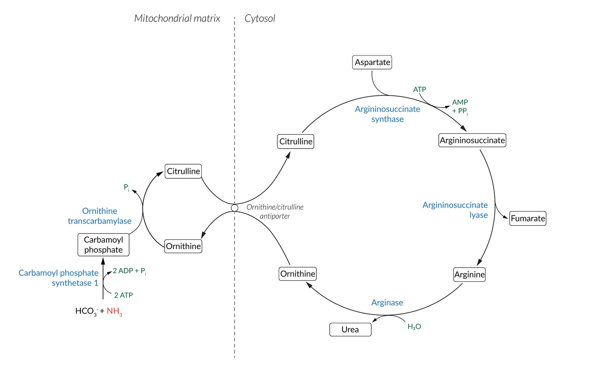

Urea cycle

### Ornithine transcarbamylase deficiency (<u>OTC deficiency</u>) [[55]](https://coursology-qbank.com/amboss/article/oNY0Xp)[[56]](https://coursology-qbank.com/amboss/article/qmYCgp)

* Definition: : inherited genetic disorder characterized by the inability to excrete <u>ammonia</u>

* <u>Epidemiology</u>: most common <u>urea cycle defect</u>

* Inheritance: <u>X-linked recessive</u> (in contrast to the rest of <u>urea cycle</u> enzyme deficiencies which are all <u>autosomal recessive</u>)

* Pathophysiology

* Defect in the enzyme <u>ornithine transcarbamylase</u> → impaired conversion of <u>carbamoyl phosphate</u> and <u>ornithine</u> to <u>citrulline</u> (and <u>phosphate</u>) → <u>ammonia</u> cannot be eliminated and accumulates

* Conversion of excess <u>carbamoyl phosphate</u> to <u>orotic acid</u> occurs as part of the <u>pyrimidine</u> synthesis pathway

* Clinical features

* Symptoms commonly manifest in the first days of life but can develop at any age.

* <u>Nausea</u>, <u>vomiting</u>, irritability, poor feeding

* Delayed growth and cognitive impairment

* In severe cases, <u>metabolic encephalopathy</u> with <u>coma</u> and <u>death</u>

* Does not cause <u>megaloblastic anemia</u> (as opposed to <u>orotic aciduria</u>)

* Diagnostics

* <u>Hyperammonemia</u> (usually > 100 μmol/L)

* ↑ <u>Orotic acid</u> in urine and blood

* ↓ <u>BUN</u>

* ↑ <u>Carbamoyl phosphate</u> and ↓ <u>citrulline</u> in the serum

* Normal <u>ketone</u> and <u>glucose</u> levels

* Enzyme analysis of <u>OTC</u> activity

* Treatment

* Strict low-protein diet

* Reduce serum <u>ammonia</u>

* Nitrogen scavengers such as <u>sodium</u> benzoate

* Fluid management

* Dialysis (in severe cases)

* <u>Arginine</u> supplementation: to promote <u>urea</u> formation

> [!NOTE]
> <u>OTC deficiency</u> is the only <u>urea cycle disorder</u> that is <u>X-linked recessive</u>. All other <u>urea cycle disorders</u> are <u>autosomal recessive</u>.

### Arginase deficiency [[55]](https://coursology-qbank.com/amboss/article/oNY0Xp)[[57]](https://coursology-qbank.com/amboss/article/bQYHuK)

* Definition: inherited genetic disorder characterized by impaired <u>arginase</u> activity, resulting in the accumulation of nitrogen (in the form of <u>ammonia</u>)

* Inheritance: <u>autosomal recessive</u>

* Pathophysiology: absent or nonfunctional <u>arginase</u> enzyme → impaired conversion of <u>arginine</u> to <u>ornithine</u> → accumulation of <u>ammonia</u> and <u>arginine</u> in the serum

* Clinical features

* Acute: episodic <u>hyperammonemia</u>

* Often asymptomatic

* Triggered by metabolic <u>stress</u> (e.g., infections, trauma, <u>surgery</u>)

* Chronic

* Delayed growth (usually present by 3 years of age)

* Poor <u>cognitive development</u>, missed <u>developmental milestones</u>

* Progressive <u>spasticity</u> (especially of lower extremities)

* <u>Dystonia</u>

* <u>Ataxia</u>

* <u>Seizures</u>

* Diagnostics

* ↑ Serum <u>arginine</u>

* Plasma <u>ammonia</u>: normal or mildly elevated

* ↑ <u>Orotic acid</u> in urine and blood

* ↓ <u>BUN</u>

* <u>Genetic testing</u>

* <u>Arginase</u> activity analysis

* Treatment

* Reduce serum <u>ammonia</u>

* Nitrogen scavengers such as <u>sodium</u> phenylacetate and <u>sodium</u> benzoate

* Fluid management

* Dialysis (in severe cases)

* Low-protein diet

Arginase deficiency factsheet

### Carbamoyl phosphate synthetase 1 (CPS1) deficiency [[58]](https://coursology-qbank.com/amboss/article/YyXnd00)

* Definition: rare, inherited genetic disorder characterized <u>CPS1</u> <u>gene mutations</u> and subsequent <u>hyperammonemia</u>

* <u>Epidemiology</u>: <u>incidence</u> between 1:50,000 and 1:300,000 [[59]](https://coursology-qbank.com/amboss/article/GBXBX00)

* Inheritance: <u>autosomal recessive</u>

* Etiopathogenesis: <u>CPS1</u> <u>gene</u> mutations → disruptions in <u>urea cycle</u> → ↓ conversion of <u>ammonia</u> to <u>carbamoyl phosphate</u> → <u>hyperammonemia</u>

* Clinical features: See clinical features in “<u>Hyperammonemia</u>.”

* Diagnostics

* Blood test as part of <u>newborn screening</u> showing low levels of <u>citrulline</u> and <u>arginine</u>, but high levels of <u>glutamine</u>, indicating <u>hyperammonemia</u>

* Confirmation via molecular <u>genetic testing</u> for mutated <u>CPS1</u> <u>gene</u>

* <u>Orotic acid</u> levels are not increased.

* Treatment

* Acute management

* Lowering of serum <u>ammonia</u> level (e.g., <u>lactulose</u>, rifamixin/<u>neomycin</u>, <u>phenylbutyrate</u>)

* Dialysis (in severe cases)

* Fluid management

* Long-term management

* Dietary modifications: reduction of protein intake, <u>amino acid</u> supplementation (e.g., <u>essential amino acids</u>)

* Tailored treatment based on symptoms (e.g., <u>antiseizure medications</u>, <u>liver transplantation</u>)

* Prognosis: fatal if left untreated

### N-acetylglutamate synthase deficiency [[60]](https://coursology-qbank.com/amboss/article/ayXQd00)

* Definition: rare, inherited genetic disorder characterized by NAGS <u>gene mutations</u> and subsequent <u>hyperammonemia</u> due to <u>N-acetylglutamate synthase</u> (NAGS) deficiency

* <u>Epidemiology</u>: rarest <u>urea cycle disorder</u>; <u>incidence</u> between 1:3,500,000 and 1:7,000,000 [[61]](https://coursology-qbank.com/amboss/article/0yXed00)

* Inheritance: <u>autosomal recessive</u>

* Etiopathogenesis: NAGS <u>gene</u> mutations → ↓ function or complete loss of enzyme → disruptions in <u>urea cycle</u> → <u>hyperammonemia</u>

* Clinical features: See clinical features in “<u>Hyperammonemia</u>.”

* Diagnostics: usually a <u>clinical diagnosis</u>; confirmation via molecular <u>genetic testing</u> for mutated NAGS <u>gene</u>

* Treatment

* Acute management

* Lowering of serum <u>ammonia</u> level (especially carbamylglutamate; see “Acute management” of <u>CPS1 deficiency</u> above)

* Fluid management

* Dialysis (in severe cases)

* Long-term management: See “Long-term management” of <u>CPS1 deficiency</u> above.

* Prognosis: fatal if left untreated

> [!NOTE]
> High levels of <u>ammonia</u> and <u>ornithine</u> in combination with normal levels of <u>urea cycle</u> enzymes raise suspicion for <u>N-acetylglutamate</u> deficiency.

---

## Orotic aciduria

* Definition: : a rare inherited genetic disorder that is characterized by an elevation of <u>orotic acid</u> in the serum and urine due to defective <u>UMP synthase</u>

* Inheritance: : <u>autosomal recessive</u> [[62]](https://coursology-qbank.com/amboss/article/5NYibp)

* Pathophysiology

* <u>UMP synthase</u> normally converts <u>orotic acid</u> into <u>uridine monophosphate</u>.

* Deficiency of <u>UMP synthase</u> → accumulation of <u>orotic acid</u> in serum and urine

* Defective <u>de novo synthesis of pyrimidine nucleotides</u>

* Clinical features

* Manifests in early childhood

* <u>Growth faltering</u>

* Delayed physical and mental development

* <u>Megaloblastic anemia</u>, which does not respond to <u>folate</u> and <u>vitamin B12</u> supplementation

* <u>Orotic acid</u> crystalluria

* Diagnostics [[62]](https://coursology-qbank.com/amboss/article/5NYibp)

* Serum

* ↓ <u>Hemoglobin</u>

* ↑ <u>Mean corpuscular volume</u>

* ↑ <u>Orotic acid</u>

* Normal <u>ammonia</u> levels and <u>BUN</u>

* Urine: ↑ <u>orotic acid</u>

* Treatment [[62]](https://coursology-qbank.com/amboss/article/5NYibp)

* <u>Uridine monophosphate</u> substitution

* <u>Uridine</u> triacetate substitution

> [!NOTE]
> Increased serum <u>orotic acid</u> is seen in <u>ornithine transcarbamylase deficiency</u> (<u>urea cycle disorder</u>) and in <u>orotic aciduria</u>. However, in <u>orotic aciduria</u>, the <u>urea cycle</u> is intact, so <u>BUN</u> and <u>ammonia</u> levels are normal. Patients with <u>orotic aciduria</u> also have an increased <u>MCV</u> and <u>megaloblastic anemia</u> due to impaired <u>pyrimidine</u> synthesis.

---