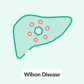
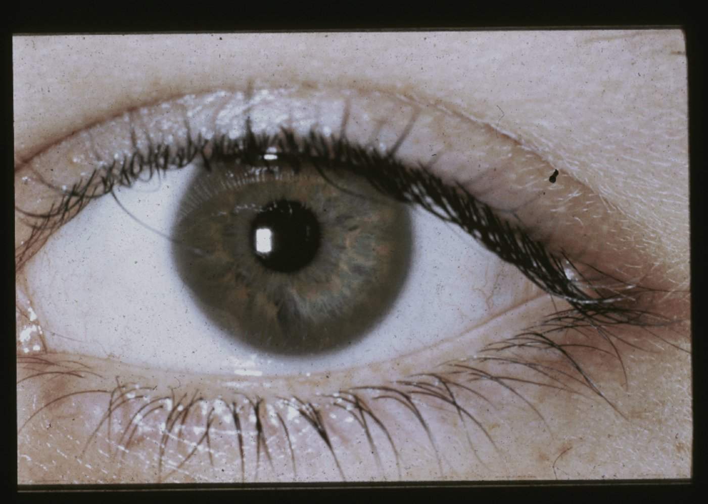

# Wilson disease

*Categories: Clinical knowledge > Genetics > Metabolic and endocrine disorders > Wilson disease*

[Original Article Link](https://coursology-qbank.com/amboss/article/IS0Yaf)

---

## Summary

Wilson disease is an <u>autosomal recessive</u> metabolic disorder in which impaired <u>copper</u> excretion causes <u>copper</u> to accumulate in the body. Early-stage Wilson disease is characterized by the presence of <u>copper</u> deposits in the <u>liver</u>. As the disease progresses, <u>copper</u> accumulates in other organs as well, most importantly in the <u>brain</u> and <u>cornea</u>. The disease often goes undiagnosed until clinical suspicion is raised by the characteristic combination of <u>hepatitis</u> or <u>cirrhosis</u>, <u>dementia</u>, and <u>parkinsonism</u>. <u>Kayser-Fleischer rings</u> (brownish <u>copper</u> deposits visible around the <u>iris</u>) are a further indication of Wilson disease. Diagnostics involve <u>slit lamp examination</u> and <u>laboratory studies</u> to assess <u>copper</u> metabolism (e.g., <u>ceruloplasmin</u>, urinary <u>copper</u> excretion). <u>Genetic testing</u> or <u>liver</u> <u>biopsies</u> with quantitative <u>copper</u> assays may be necessary if the diagnosis is indeterminate. Management consists of maintaining a low-<u>copper</u> diet and administration of a <u>chelating agent</u> (e.g., <u>penicillamine</u>) or <u>zinc salts</u>. Individuals with Wilson disease have a good prognosis if the condition is diagnosed and treated early.

Wilson disease fact sheet

Wilson Disease: Mutations in the ATP7B Gene

---

## Epidemiology

* Age of onset: : 5–35 years ; (mean age 12–23 years) [[1]](https://coursology-qbank.com/amboss/article/Tzb6Hw)[[2]](https://coursology-qbank.com/amboss/article/_k05qT)

* <u>Prevalence</u>: ∼ 1/30,000 [[3]](https://coursology-qbank.com/amboss/article/gzbFHw)

Epidemiological data refers to the US, unless otherwise specified.

---

## Pathophysiology

* <u>Autosomal recessive</u> mutations in the ATP7B gene (Wilson <u>gene</u>) on <u>chromosome</u> 13, which encodes for a membrane-bound, <u>copper</u>-transporting ATPase → defective ATP7B protein [[4]](https://coursology-qbank.com/amboss/article/Bk0zJT)

* Reduced incorporation of <u>copper</u> into <u>apoceruloplasmin</u>;   → ↓ serum <u>ceruloplasmin</u>

* Reduced biliary <u>copper</u> excretion

* Results in ↑ free serum <u>copper</u> → accumulation in the <u>liver</u>, <u>cornea</u>, <u>CNS</u> (<u>basal ganglia</u>, <u>brain stem</u>, <u>cerebellum</u>), <u>kidneys</u>, and <u>enterocytes</u> [[5]](https://coursology-qbank.com/amboss/article/Ddb1Hs)

Copper metabolism in normal hepatocyte and hepatocyte affected by Wilson disease

Hepatic microstructure: hepatic lobule

Hepatic microstructure: hepatic lobule showing bile canaliculi

Hepatic microstructure: sinusoids, perisinusoidal space, and hepatocytes

Copper Metabolism: Role of ATP7B

---

## Clinical features

* Hepatic: variable degrees of <u>liver</u> disease possible

* <u>Hepatosplenomegaly</u>

* <u>Jaundice</u>

* <u>Ascites</u>

* Abdominal <u>pain</u>

* Symptoms of acute or chronic <u>hepatitis</u> (may be indistinguishable from <u>autoimmune hepatitis</u>)

* <u>Signs of chronic liver disease</u>

* <u>Hepatic encephalopathy</u>

* <u>Cirrhosis</u>

* <u>Portal hypertension</u>

* <u>Symptoms of acute liver failure</u>

* Ocular

* Kayser-Fleischer rings 

* <u>Copper</u> accumulation in the <u>Descemet membrane</u>;  that results in 1–2 mm wide;  golden or  green-brown rings in the periphery of the <u>cornea</u>

* Characteristic for Wilson disease, but absence does not rule out the diagnosis

* Sunflower <u>cataracts</u>: <u>copper</u> deposits in the <u>lens</u> causing opacification in the shape of a sunflower

* Neurological

* <u>Cerebellar symptoms</u>, e.g.:

* <u>Dysarthria</u> (most common)

* Gait abnormalities

* <u>Choreoathetosis</u>

* <u>Extrapyramidal symptoms</u>, e.g.:

* <u>Dystonia</u>

* <u>Parkinsonism</u>

* <u>Tremor</u> (usually asymmetric, affecting the hands), which may be any combination of:

* <u>Resting tremor</u>

* <u>Intention tremor</u>

* Wing-beating tremor: a low frequency, high amplitude <u>tremor</u> that is most prominent when the arms are outstretched anteriorly or laterally

* Drooling (caused by <u>oropharyngeal dysphagia</u>)

* <u>Seizures</u>

* Cognitive impairment

* Psychiatric and behavioral

* <u>Major depressive disorder</u>

* Irritability

* <u>Psychosis</u>

* Other: : e.g., <u>Fanconi syndrome</u>

> [!TIP]
> Wilson disease should be suspected in cases of nonspecific noninfectious <u>liver</u> disease and in nonspecific extrapyramidal movement disorders.

Kayser-Fleischer ring

Kayser-Fleischer ring

---

## Diagnosis

### Approach [[7]](https://coursology-qbank.com/amboss/article/UA1bQj0)

* Consider a <u>diagnosis of Wilson disease</u> in individuals with:

* <u>Acute liver failure</u> (<u>ALF</u>) with nonimmune <u>hemolytic anemia</u> (i.e., negative <u>Coombs test</u>)

* Recurrent <u>self-limited</u> <u>hemolysis</u>

* Unexplained <u>liver</u> disease, especially if accompanied by neuropsychiatric symptoms

* A <u>first-degree relative</u> with Wilson disease

* Perform a comprehensive clinical assessment.

* Obtain routine <u>laboratory studies</u> to evaluate for <u>liver</u> involvement and <u>hemolysis</u>.

* Obtain <u>copper</u> metabolism studies to assess for Wilson disease.

* Consider advanced studies (e.g., <u>liver biopsy</u>, <u>genetic testing</u>) if the diagnosis remains unclear.

> [!TIP]
> Routine screening for Wilson disease in patients with <u>acute liver failure</u> is not recommended. [[8]](https://coursology-qbank.com/amboss/article/fGXkAz)

### Clinical evaluation [[6]](https://coursology-qbank.com/amboss/article/e_1xMj0)

* Obtain a detailed personal and <u>family history</u>.

* Conduct a comprehensive examination, including:

* <u>Neurological examination</u>

* Psychiatric evaluation

* <u>Slit lamp examination</u>: <u>Kayser-Fleischer rings</u>, sunflower <u>cataract</u>

### <u>Laboratory studies</u>

#### Routine <u>laboratory studies</u> [[6]](https://coursology-qbank.com/amboss/article/e_1xMj0)

* <u>Liver chemistries</u>

* ↑ <u>Transaminases</u>; <u>AST</u> > <u>ALT</u> in <u>cirrhosis</u>

* ↑ <u>Bilirubin</u>, ↓ <u>alkaline phosphatase</u> in patients with <u>ALF</u> and/or <u>hemolysis</u>

* <u>CBC</u>: <u>hemolytic anemia</u>, <u>thrombocytopenia</u>, <u>leukopenia</u> may be present

* <u>BMP</u>: ↑ <u>BUN</u>, ↑ <u>creatinine</u>, ↓ <u>potassium</u> in renal involvement

* Other

* <u>Coombs test</u>: negative

* ↑ <u>INR</u> in patients with severe <u>liver</u> damage

* ↓ Uric acid in patients with associated renal tubular dysfunction

* <u>Urinalysis</u>: may show <u>microscopic hematuria</u> and/or other findings consistent with <u>Fanconi syndrome</u> (e.g., <u>aminoaciduria</u>)

#### <u>Copper</u> metabolism studies [[6]](https://coursology-qbank.com/amboss/article/e_1xMj0)

* ↓ Serum <u>ceruloplasmin</u> (< 20 mg/dL)

* ↑ 24-hour urine <u>copper</u> excretion (> <u>ULN</u>)

* Serum <u>copper</u> (optional)  

* ↓ Total serum <u>copper</u>

* ↑ Free serum <u>copper</u> (i.e., non-<u>ceruloplasmin</u>-bound <u>copper</u>)

### Interpretation of initial testing [[6]](https://coursology-qbank.com/amboss/article/e_1xMj0)

* In patients with one or more <u>clinical features of Wilson disease</u>:

* ↓ Serum <u>ceruloplasmin</u> and ↑ 24-hour urine <u>copper</u>: Diagnosis is confirmed.

* Inconclusive serum <u>ceruloplasmin</u> and/or 24-hour urine <u>copper</u>:  Obtain advanced studies.

* Scoring systems (e.g., Leipzig score) may help establish the diagnosis.

> [!WARNING]
> The absence of typical findings (e.g., <u>Kayser-Fleischer rings</u>) does not exclude the diagnosis.

### Advanced studies [[2]](https://coursology-qbank.com/amboss/article/_k05qT)[[7]](https://coursology-qbank.com/amboss/article/UA1bQj0)

* <u>Liver biopsy</u>: Consider if other tests are inconclusive. ;  [[2]](https://coursology-qbank.com/amboss/article/_k05qT)

* May show positive <u>copper</u> staining (low <u>sensitivity</u>)

* Hepatic <u>copper</u> concentration > 250 mcg/g (dry weight) indicates Wilson disease.  [[7]](https://coursology-qbank.com/amboss/article/UA1bQj0)

* Nonspecific findings include mild <u>steatosis</u>, <u>fibrosis</u>, and <u>cirrhosis</u>.

* <u>Genetic testing</u> for ATP7B mutation in patients with either:

* <u>First-degree relatives</u> with Wilson disease

* Inconclusive diagnostic tests

* <u>MRI</u> <u>brain</u>

* Consider in patients with neurological findings.

* Findings

* Hyperintensities in the <u>basal ganglia</u>, <u>thalamus</u>, <u>pons</u>, and <u>white matter</u>

* “Face of the giant panda” sign (rare but <u>pathognomonic</u>): a specific pattern of <u>midbrain</u> <u>copper</u> accumulation

---

## Treatment

### General principles [[6]](https://coursology-qbank.com/amboss/article/e_1xMj0)

* Refer to hepatology for specialist-guided management.

* All patients require lifelong pharmacological therapy.

* Encourage a low-<u>copper</u> diet (e.g., avoidance of organ meats, shellfish, nuts, chocolate, <u>copper</u>-containing dietary supplements).

* Manage hepatic symptoms.

* Implement <u>treatment of cirrhosis</u> in advanced <u>liver</u> disease.

* Initiate <u>management of acute liver failure</u> in <u>decompensated cirrhosis</u>.

* Refer patients with ; refractory <u>decompensated cirrhosis</u> or <u>acute liver failure</u> for <u>liver transplantation</u>.

* Consult <u>neurology</u> and/or <u>psychiatry</u> for symptomatic management.

### Pharmacological therapy [[7]](https://coursology-qbank.com/amboss/article/UA1bQj0)

* Initial therapy

* First line: <u>chelating agents</u>; , e.g., <u>penicillamine</u>;  (preferred) or <u>trientine</u>

* Alternative: <u>zinc salts</u> (may also be used first-line for asymptomatic individuals)

* <u>Maintenance therapy</u>: : reduced-dose <u>zinc salts</u> or a <u>chelating agent</u>

> [!TIP]
> The goal of initial therapy is to eliminate <u>copper</u>; the goal of <u>maintenance therapy</u> is to prevent reaccumulation of <u>copper</u>.

> [!WARNING]
> <u>Chelating agents</u> should be titrated gradually. Rapid mobilization of the <u>copper</u> stored in tissues may exacerbate neurological symptoms.

### Monitoring [[6]](https://coursology-qbank.com/amboss/article/e_1xMj0)

All patients should be regularly monitored for clinical and laboratory-based improvement and treatment side effects.

* Clinical assessment, including <u>neurological examination</u>, at least every 6 months

* <u>Laboratory studies</u>

* At least every 6 months: serum <u>copper</u>, <u>ceruloplasmin</u>, <u>liver</u> enzymes, <u>INR</u>, <u>CBC</u>, and <u>urinalysis</u>

* At least once yearly: 24-hour urine <u>copper</u>

---