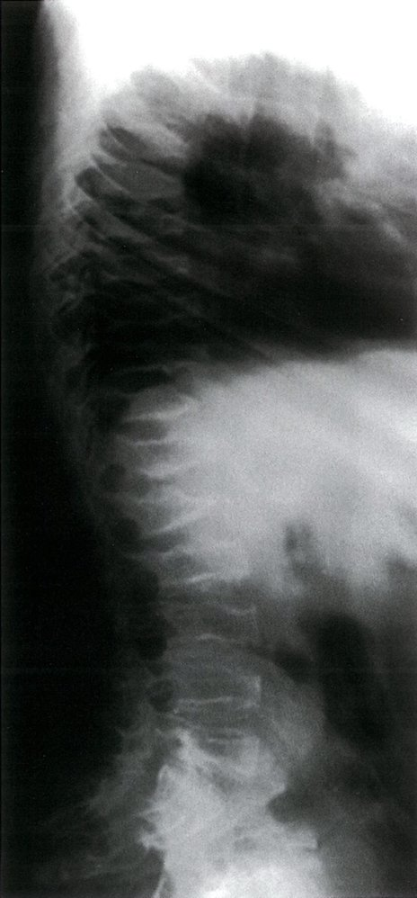
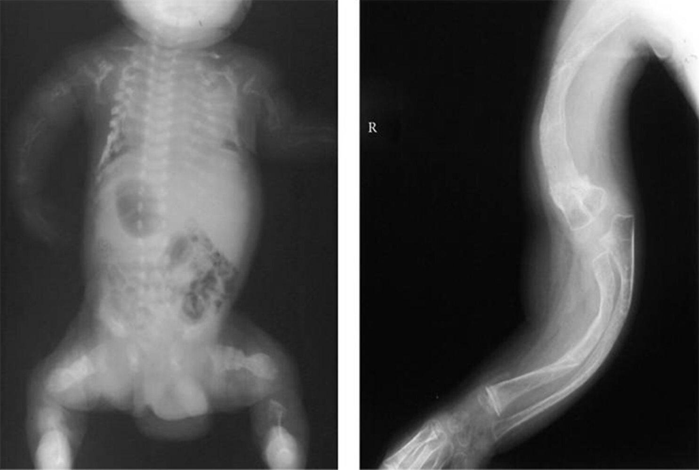
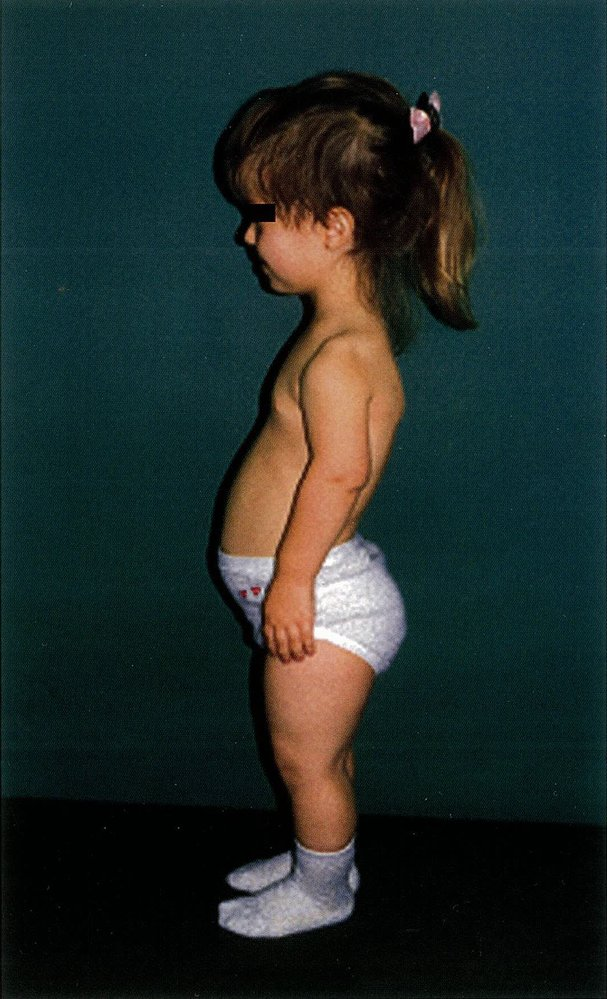
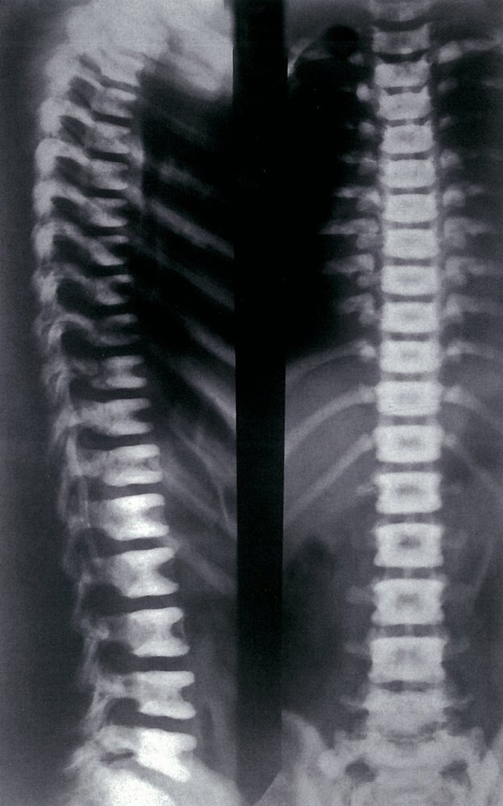
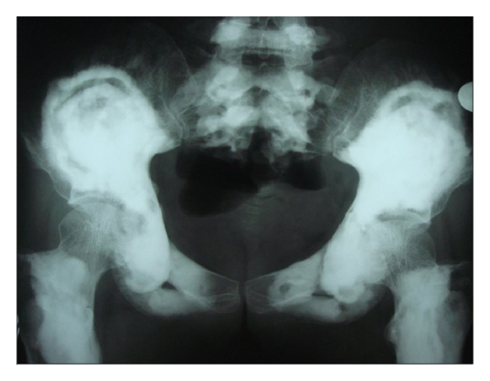

# Skeletal dysplasias

*Categories: Clinical knowledge > Genetics > Skeletal, connective tissue, and skin disorders > Skeletal dysplasias*

[Original Article Link](https://coursology-qbank.com/amboss/article/wH0hsh)

---

## Summary

Skeletal dysplasias are a group of genetic disorders that affect the <u>development of bone</u> and <u>cartilage</u>. The disorders may be inherited in an <u>autosomal dominant</u>, <u>autosomal recessive</u>, or X-linked manner. Some skeletal dysplasias can be detected as early as the prenatal period, while others manifest later in life, typically during childhood or <u>adolescence</u>. <u>Achondroplasia</u>, characterized by <u>disproportionate short stature</u> and craniofacial abnormalities, is the most common type of skeletal <u>dysplasia</u>. <u>Osteogenesis imperfecta</u> is a bone disease characterized by impaired <u>osteogenesis</u> that results in brittle bones that <u>fracture</u> easily, while <u>osteopetrosis</u> is a high-density bone disease that results in increased <u>sclerotic</u> thickening of the skeleton on radiological examination. <u>Campomelic syndrome</u> is a life-threatening disorder characterized by skeletal <u>dysplasia</u>, abnormal sex development, and other congenital defects due to SOX9 <u>gene mutations</u>.

---

## Achondroplasia

* Definition: a genetic disorder characterized by impaired longitudinal bone growth that results in <u>disproportionate short stature</u>

* <u>Epidemiology</u>

* Most common type of skeletal <u>dysplasia</u>

* Most common cause of <u>disproportionate short stature</u>

* 1:15,000–40,000 children affected in the US [[1]](https://coursology-qbank.com/amboss/article/JG0sZ3)

* Etiology

* <u>Gain of function mutation</u> in <u>fibroblast</u> growth factor <u>receptor</u> 3 <u>gene</u> (<u>FGFR3</u>) on <u>chromosome</u> 4

* New (sporadic) mutations in ∼ 80% of cases [[2]](https://coursology-qbank.com/amboss/article/CFYq4I)

* The <u>probability</u> of new mutations increases with the father's age at the time of <u>conception</u>.

* <u>Autosomal dominant inheritance</u> in ∼ 20% of cases (homozygosity is lethal <u>perinatally</u>)

* Pathophysiology

* Defective <u>FGFR3</u> → continuous <u>receptor</u> stimulation by FGF → inhibited <u>chondrocyte</u> <u>proliferation</u> → ↓ endochondral <u>ossification</u> → impaired longitudinal bone growth

* Normal <u>intramembranous ossification</u> of the craniofacial bones → disproportionately large head in relation to the limbs

* Clinical features 

* Stature 

* Disproportionate <u>short stature</u>

* Normal-sized torso

* Short, plump extremities

* Craniofacial abnormalities

* <u>Macrocephaly</u>

* Prominent brows

* Midface retrusion

* Flattening of the nose

* <u>Middle ear</u> deformation: recurrent <u>otitis media</u>

* Other skeletal abnormalities

* Small <u>foramen magnum</u>: compression of the cervical medulla

* Lumbar <u>lordosis</u> and <u>kyphoscoliosis</u>

* <u>Spinal canal stenosis</u>: lower back and leg <u>pain</u>, <u>paresthesias</u>, <u>dysesthesia</u>, incontinence

* Small <u>chest wall</u>

* Trident hand: a deformity of the hand that is characterized by short stubby fingers of equal size and increased separation between the middle finger and ring finger, which gives the hand the three-pronged appearance of a trident

* Normal intellectual development

* Diagnostics

* <u>Physical examination</u>

* <u>X-ray</u> findings

* <u>Lateral</u> <u>skull</u>: frontal prominence, midface <u>hypoplasia</u>

* <u>Spine</u>: <u>spinal canal stenosis</u>, <u>scoliosis</u>

* Extremities: short, thick bones

* CT/<u>MRI</u> head: indicated in patients with signs of cervicomedullary compression 

* Assessment of <u>brain stem</u> compression

* Measurement of the size of the <u>foramen magnum</u>

* Therapy [[3]](https://coursology-qbank.com/amboss/article/hw1ciQ0)

* Daily s.c. vosoritide injections (C-type <u>natriuretic peptide</u> analog): increases linear <u>growth in children</u> 5 years of age and older with open <u>epiphyses</u> (<u>growth plates</u>)

* Surgical correction of <u>spinal stenosis</u>, secondary <u>scoliosis</u>, <u>genu varum</u>, <u>brain stem</u> compression

Achondroplasia fact sheet

Achondroplasia

Achondroplasia

---

## Osteogenesis imperfecta (brittle bone disease)

<u>Osteogenesis imperfecta</u> is a genetic disorder characterized by defective synthesis, structure, and/or processing of <u>type 1 collagen</u> resulting in skeletal deformities and brittle bones that <u>fracture</u> easily. [[4]](https://coursology-qbank.com/amboss/article/VQVGE80)

### <u>Epidemiology</u>

* 1 in 15,000–20,000 births [[4]](https://coursology-qbank.com/amboss/article/VQVGE80)

* <u>Osteogenesis imperfecta</u> type I is the most common form in populations of European origin. [[5]](https://coursology-qbank.com/amboss/article/nkV7ou0)

### Etiology [[4]](https://coursology-qbank.com/amboss/article/VQVGE80)

* Various genetic defects

* Most commonly <u>autosomal dominant</u> mutations in <u>COL1A1</u> or <u>COL1A2</u> <u>genes</u> that affect <u>collagen synthesis</u>, structure, and/or processing

* Rare variants: usually recessive or X-linked  [[4]](https://coursology-qbank.com/amboss/article/VQVGE80)

### Pathophysiology [[6]](https://coursology-qbank.com/amboss/article/2QVTv80)

The most common mutations affecting <u>collagen synthesis</u>: ↓ formation of hydrogen and <u>disulfide bonds</u> between type I <u>preprocollagen</u> molecules → ↓ triple helix formation → ↓ synthesis of normal <u>type I collagen</u> → impaired <u>bone matrix</u> formation (<u>osteogenesis</u>)

### Clinical features of osteogenesis imperfecta [[5]](https://coursology-qbank.com/amboss/article/nkV7ou0)[[6]](https://coursology-qbank.com/amboss/article/2QVTv80)[[7]](https://coursology-qbank.com/amboss/article/UQVbv80)

The severity of skeletal features and presence of extraskeletal features vary by type of <u>osteogenesis imperfecta</u>.

* Skeletal features

* Brittle bones

* Recurrent <u>fractures</u> from minimal trauma (including during <u>birth</u>)

* Secondary skeletal deformities from <u>fractures</u>, e.g.:   [[5]](https://coursology-qbank.com/amboss/article/nkV7ou0)

* <u>Scoliosis</u>

* Bowing of <u>long bones</u> (e.g., tibial bowing)

* <u>Chest wall</u> deformities

* Growth delay and <u>short stature</u>

* Facial and <u>skull</u> anomalies (e.g., <u>macrocephaly</u>, triangular-shaped face, flat midface)

* Extraskeletal features

* <u>Blue sclerae</u>

* <u>Dentinogenesis imperfecta</u> (due to a lack of <u>dentin</u>); : dental abnormalities, including brittle, opalescent <u>teeth</u>

* <u>Joint hypermobility</u>

* <u>Muscle weakness</u>

* Progressive <u>hearing loss</u>  [[6]](https://coursology-qbank.com/amboss/article/2QVTv80)

* Pulmonary complications  [[6]](https://coursology-qbank.com/amboss/article/2QVTv80)[[7]](https://coursology-qbank.com/amboss/article/UQVbv80)

* Cardiovascular complications (e.g., valvular disease, <u>aortic root dilation</u>)

* <u>Chronic pain</u>

> [!WARNING]
> The <u>fractures</u> caused by <u>osteogenesis imperfecta</u> may be mistaken for <u>nonaccidental injury</u>. [[4]](https://coursology-qbank.com/amboss/article/VQVGE80)

#### Clinical features of classical types

* <u>Osteogenesis imperfecta</u> was originally classified into four types based on clinical features; this classification may still be used for treatment decisions.

* A classification based on genetics is often preferred, as it allows <u>genetic counseling</u> and prognostication; clinical features are also not exclusive to type.  [[7]](https://coursology-qbank.com/amboss/article/UQVbv80)

|  Clinical features of classical types of <u>osteogenesis imperfecta</u> [[5]](https://coursology-qbank.com/amboss/article/nkV7ou0)[[6]](https://coursology-qbank.com/amboss/article/2QVTv80)  |  |  |
| --- | --- | --- |
| ‎ | Severity | Clinical features |
| Type I (non-deforming with <u>blue sclerae</u>) |  * Usually mild   |   * Blue sclerae (choroidal <u>veins</u> show through the thin, translucent sclerae)   [[7]](https://coursology-qbank.com/amboss/article/UQVbv80)[[8]](https://coursology-qbank.com/amboss/article/JkVsKu0)  * Near-normal stature  * Minimal bone deformity  * Progressive <u>hearing loss</u>  [[7]](https://coursology-qbank.com/amboss/article/UQVbv80) [[9]](https://coursology-qbank.com/amboss/article/AcVRUt0)    |
| Type II (<u>perinatally</u> lethal) |  * Severe; usually lethal in the <u>neonatal period</u>   |   * Multiple intrauterine and/or <u>perinatal</u> <u>fractures</u>  * Shortened limbs (<u>micromelia</u>) due to crumpled <u>long bones</u>  * <u>Chest wall</u> deformities (e.g., <u>hypoplastic</u> thorax) and underdeveloped <u>lungs</u> lead to <u>respiratory distress</u> and <u>death</u>. [[10]](https://coursology-qbank.com/amboss/article/CmVq3E0)    |
| Type III (progressively deforming) |  * Severe  [[5]](https://coursology-qbank.com/amboss/article/nkV7ou0)   |   * White sclerae  [[5]](https://coursology-qbank.com/amboss/article/nkV7ou0)  * <u>Short stature</u> [[7]](https://coursology-qbank.com/amboss/article/UQVbv80)  * <u>Dentinogenesis imperfecta</u>  * Progressive deformity of the limbs and <u>kyphoscoliosis</u>    |
| Type IV (common variable) |  * Mild to severe [[4]](https://coursology-qbank.com/amboss/article/VQVGE80)   |   * White sclerae  [[5]](https://coursology-qbank.com/amboss/article/nkV7ou0)  * <u>Short stature</u> [[7]](https://coursology-qbank.com/amboss/article/UQVbv80)  * <u>Dentinogenesis imperfecta</u>  * Variable bone deformities    |

> [!NOTE]
> Individuals with <u>osteogenesis imperfecta</u> can't BITE: Bones (recurrent <u>fractures</u>), I (“<u>eye</u>” = <u>blue sclerae</u>), Teeth (dental abnormalities), Ears (<u>hearing loss</u>).

Osteogenesis imperfecta (brittle bone disease) fact sheet🖼

### Diagnostics [[4]](https://coursology-qbank.com/amboss/article/VQVGE80)[[5]](https://coursology-qbank.com/amboss/article/nkV7ou0)[[6]](https://coursology-qbank.com/amboss/article/2QVTv80)

* Diagnosis is based on clinical features and radiological findings. 

* <u>Skeletal survey</u> shows characteristic changes (e.g., <u>fractures</u>, bone anomalies).

* <u>DEXA scan</u> may be used to confirm low <u>bone density</u> and exclude differential diagnoses. [[9]](https://coursology-qbank.com/amboss/article/AcVRUt0)

* Severe forms can be detected with <u>prenatal diagnostics</u> (e.g., <u>fetal anatomy scan</u>).

* Diagnosis is confirmed with <u>genetic testing</u>.

* <u>Bone biopsy</u> and <u>histology</u> are rarely needed for diagnosis. [[9]](https://coursology-qbank.com/amboss/article/AcVRUt0)

#### <u>X-ray</u> findings

* <u>Fractures</u> in various stages of healing

* <u>Osteopenia</u>

* <u>Long bone</u> anomalies, e.g.:

* Bowing

* Shortened crumpled <u>long bones</u> (accordion appearance)

* Metaphyseal flaring

* <u>Rib</u> anomalies (e.g., thin <u>ribs</u>, narrow thorax)

* <u>Vertebral compression fractures</u>

* <u>Skull</u> anomalies (e.g., <u>intrasutural bones</u>, <u>basilar invagination</u>)

#### <u>Prenatal diagnostics</u>

* More severe forms may be detected on routine <u>fetal anatomy scan</u> based on:

* <u>Long bone</u> anomalies (e.g., <u>fractures</u>, bowing, shortening)

* <u>Rib</u> anomalies (e.g., <u>fractures</u>, thickened, thinned)

* Decreased mineralization of the bones

* <u>Fetal growth restriction</u>

* Diagnosis may be confirmed with <u>invasive prenatal genetic testing</u>.

Skeletal deformities in osteogenesis imperfecta

### Differential diagnoses [[9]](https://coursology-qbank.com/amboss/article/AcVRUt0)

* <u>Nonaccidental injury</u>

* Nutritional deficiencies (e.g., <u>rickets</u>) [[11]](https://coursology-qbank.com/amboss/article/lsdvEr0)

* <u>Fractures</u> secondary to <u>malignancy</u>

* Inherited disorders (e.g., chondrodysplasia, <u>hypophosphatasia</u>)

* Early-onset <u>osteoporosis</u> [[4]](https://coursology-qbank.com/amboss/article/VQVGE80)

### Management [[4]](https://coursology-qbank.com/amboss/article/VQVGE80)[[6]](https://coursology-qbank.com/amboss/article/2QVTv80)[[7]](https://coursology-qbank.com/amboss/article/UQVbv80)

#### General principles

* Refer to a multidisciplinary team for management of skeletal and extraskeletal manifestations.

* Advise adequate <u>calcium</u> and <u>vitamin D</u> intake to <u>optimize bone health</u>. [[9]](https://coursology-qbank.com/amboss/article/AcVRUt0)

* Offer <u>genetic counseling</u> to affected patients and family members.

* Offer support to caregivers.  [[6]](https://coursology-qbank.com/amboss/article/2QVTv80)

* Screen regularly for complications.

> [!TIP]
> If a severe or lethal form is diagnosed prenatally, <u>pregnancy</u> termination may be offered in accordance with patient preferences and applicable laws. [[6]](https://coursology-qbank.com/amboss/article/2QVTv80)

#### Management of skeletal manifestations

* <u>Acute fracture management</u>

* <u>Bisphosphonates</u> to improve <u>bone density</u>  [[12]](https://coursology-qbank.com/amboss/article/FkVgpu0)

* Orthopedic <u>surgery</u> to reduce deformities and improve mobility (e.g., <u>osteotomy</u>, <u>intramedullary rods</u>, <u>spinal fusion</u>)

* <u>Physical therapy</u> and <u>occupational therapy</u>

* <u>Orthotics</u> and mobility aids [[9]](https://coursology-qbank.com/amboss/article/AcVRUt0)

* <u>Pain management</u> (see "<u>Chronic noncancer pain management</u>" and "<u>Pain management in children</u>")

#### Management of extraskeletal manifestations

* Interventions to improve <u>hearing</u> (e.g., <u>hearing aids</u>, stapedotomy, and/or <u>cochlear implants</u>)

* Oral hygiene; <u>capping</u> of <u>teeth</u> and mandibular <u>surgery</u> to prevent <u>malocclusion</u> [[9]](https://coursology-qbank.com/amboss/article/AcVRUt0)

* Management of cardiac and pulmonary complications

#### Screening for complications

* Regular <u>audiologic evaluation</u> to assess for <u>hearing loss</u>

* Oral health checks

* Regular <u>spirometry</u>  [[13]](https://coursology-qbank.com/amboss/article/3OVSHu0)

* <u>Echocardiography</u> every 3–5 years if asymptomatic; more frequently for patients with <u>murmurs</u>, cardiac or pulmonary symptoms, or thoracic deformities [[6]](https://coursology-qbank.com/amboss/article/2QVTv80)[[9]](https://coursology-qbank.com/amboss/article/AcVRUt0)

* CT <u>skull base</u> to assess for <u>basilar invagination</u> every 3–5 years if height <u>Z-score</u> is below -3 [[9]](https://coursology-qbank.com/amboss/article/AcVRUt0)

---

## Osteopetrosis (marble bone disease)

* Definition: an inherited, diffuse bone disease that results in <u>sclerotic</u> thickening of the skeleton on radiological examination

* <u>Epidemiology</u>

* Type I <u>osteopetrosis</u>: 2–5 per 1,000,000 <u>live births</u>

* Type II <u>osteopetrosis</u>: 2–10 per 1,000,000 <u>live births</u>

* Etiology

* Type I <u>osteopetrosis</u> (malignant <u>osteopetrosis</u>): <u>autosomal recessive</u> disease

* Age of onset: <u>infancy</u>

* Clinical course: severe

* Type II <u>osteopetrosis</u> (benign <u>osteopetrosis</u>, Albers-Schonberg disease): <u>autosomal dominant</u> disease

* Age of onset: early adulthood

* Clinical course: mild

* Rare cause: <u>carbonic anhydrase II deficiency</u>

* <u>Autosomal recessive</u> condition associated with inability of <u>osteoclasts</u> to generate an acidic environment for bone resorption

* Leads to <u>renal tubular acidosis</u>, <u>osteopetrosis</u> of intermediate severity, and cerebral calcification resulting in <u>intellectual disability</u>

* Pathophysiology: <u>gene mutations</u> → inability of <u>osteoclasts</u> to generate acidic environment in the <u>bone matrix</u> → impaired bone resorption with preserved <u>osteoblastic</u> function → overgrowth of bone with pathological <u>bone composition</u>

* Clinical features

* Recurring <u>pathological fractures</u> (osteopetrotic <u>bone tissue</u> is very dense but brittle)

* <u>Cranial nerve disorders</u> (e.g., palsies) due to hyperostosis and stenosis of the <u>cranial nerve</u> foramina

* <u>Pancytopenia</u> due to reduced marrow space

* <u>Hepatosplenomegaly</u> due to <u>extramedullary hematopoiesis</u>

* Diagnostics

* <u>X-ray</u>: symmetrical, homogenous, <u>sclerotic</u> thickening of both cortical and <u>trabecular bone</u> (stone bone)

* Laboratory findings: See “<u>Laboratory evaluation of bone disease</u>.”

* <u>Calcium</u> levels may be normal or low (especially in severe form, e.g., type I <u>osteopetrosis</u>).

* ↑ CK-BB

* ↑ <u>Tartrate-resistant acid phosphatase</u> (<u>TRAP</u>)

* Therapy

* <u>Bone marrow transplant</u> (potentially curative treatment): Functional <u>osteoclasts</u> may develop from unimpaired <u>monocytes</u> deriving from transplanted <u>stem cells</u>.

* Surgical decompression is required in the case of optic and/or auditory nerve compression.

Osteopetrosis

Osteopetrosis

Osteopetrosis

References:[[14]](https://coursology-qbank.com/amboss/article/Ol0ICT)

---