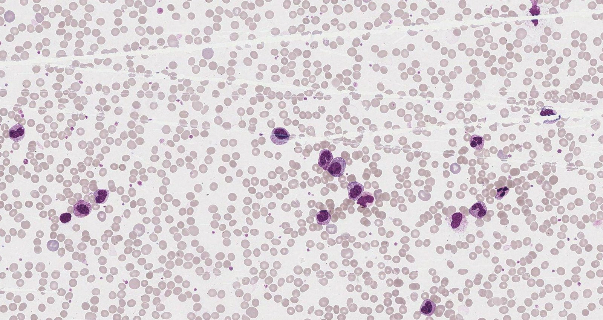
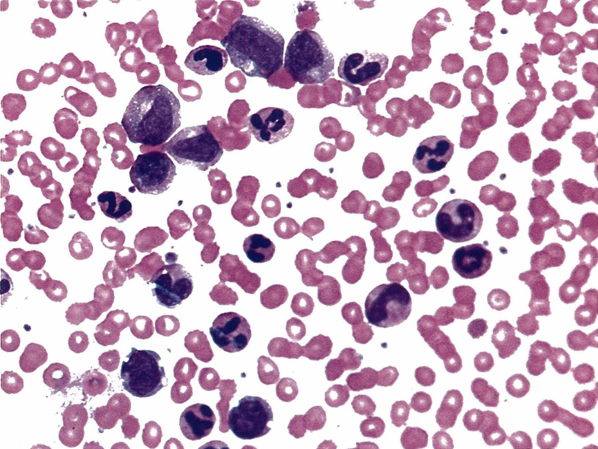
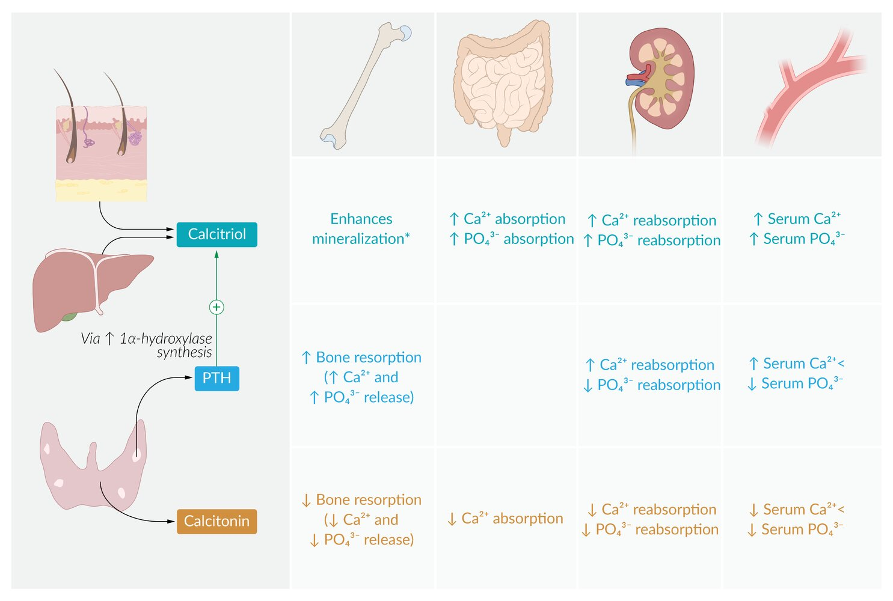
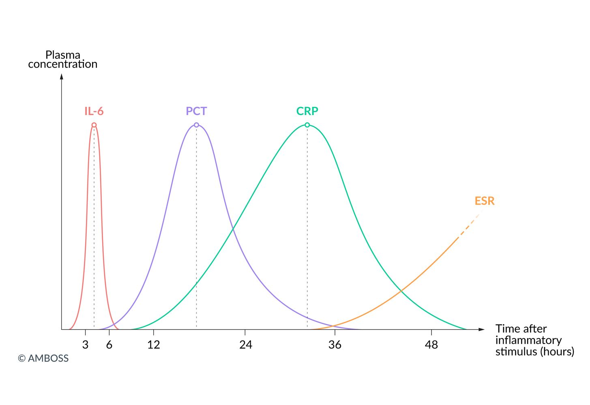

# Laboratory medicine

*Categories: Clinical knowledge > Internal medicine > Basics of internal medicine > Laboratory medicine*

[Original Article Link](https://coursology-qbank.com/amboss/article/Ln0wFg)

---

## Summary

Laboratory medicine involves the analysis and evaluation of body fluids such as blood, urine, and <u>cerebrospinal fluid</u> (<u>CSF</u>), the results of which are important for the prevention, diagnosis, and staging of diseases. Even though laboratory medicine plays an important role in daily clinical practice, the evaluation of results should always take into account the patient's <u>medical history</u> as well as clinical and diagnostic findings. This article covers important laboratory parameters, such as <u>hematological parameters</u>, <u>iron studies</u>, <u>coagulation studies</u>, parameters of certain organ functions, and <u>inflammatory markers</u>. Further parameters of clinical relevance may be found in other articles and are listed in the section “Overview of important laboratory parameters.” If not otherwise indicated, the <u>reference ranges</u> provided here are consistent with those used by the <u>NBME</u>.

---

## Hematological parameters

### Complete blood count (<u>CBC</u>)

* A laboratory test that measures:

* <u>Red blood cell</u> (<u>RBC</u>) count

* <u>Hemoglobin</u> (<u>Hb</u>)

* <u>Hematocrit</u> (<u>Hct</u>)

* <u>Mean corpuscular volume</u> (<u>MCV</u>)

* <u>Mean corpuscular hemoglobin</u> (<u>MCH</u>)

* <u>Mean corpuscular hemoglobin concentration</u> (<u>MCHC</u>)

* <u>White blood cell</u> (<u>WBC</u>) count

* <u>Platelet count</u>

* In a CBC with differential, the percentage of <u>WBC</u> subtypes (e.g., <u>neutrophils</u>, <u>lymphocytes</u>, etc.) is also included.

### <u>RBC</u> parameters

* RBC indices

* A set of calculated <u>RBC</u> parameters that comprises <u>MCV</u>, <u>MCH</u>, <u>MCHC</u>, and <u>RBC distribution width</u>

* Used to determine the <u>cause of anemia</u>

| Overview of <u>RBC</u> parameters |  |  |  |  |
| --- | --- | --- | --- | --- |
| Parameter | <u>Reference range</u> | Description | Common causes of elevation | Common causes of reduction |
| RBC count |   * <u>♂</u>: 4.3–5.9 million/mm³ (4.3–5.9 x 10¹²/L)  * <u>♀</u>: 3.5–5.5 million/mm³ (3.5–5.5 x 10¹²/L)    |  * Absolute number of <u>RBCs</u> contained in a certain volume of blood   |   * <u>Polycythemia vera</u>  * <u>Relative polycythemia</u> (e.g., due to <u>severe dehydration</u>)  * Increased <u>erythropoietin</u> (<u>EPO</u>) synthesis, e.g., due to:  * Chronic <u>hypoxia</u> (e.g., in <u>COPD</u> or <u>CHF</u>)  * Malignancies (paraneoplastic effect)  * <u>EPO</u> <u>doping</u>  * See “<u>Secondary erythrocytosis</u>.”    |  * <u>Anemia</u>: See “<u>Classification of anemia</u>.”   |
|  Hemoglobin(<u>Hb</u>)  |   * <u>♂</u>: 13.5–17.5 g/dL (8.38–10.9 mmol/L)  * <u>♀</u>: 12–16 g/dL (7.4–9.9 mmol/L)    |   * Oxygen-transporting protein found in <u>RBCs</u>  * Contains <u>heme</u>  * See “<u>Erythrocyte morphology and hemoglobin</u>.”    |   * <u>Anemia</u>: See “<u>Classification of anemia</u>.”  * <u>Porphyria</u>  * <u>Methemoglobinemia</u>  * <u>Iron deficiency</u>  * <u>Lead poisoning</u>    |  |
| <u>Hematocrit</u> (<u>Hct</u>) |   * <u>♂</u>: 41–53 % (0.41–0.53 ratio)  * <u>♀</u>: 36–46 % (0.36–0.46 ratio)    |  * <u>Ratio</u> of <u>RBC</u> volume to total blood volume   |   * Same as for elevated <u>Hb</u> and <u>RBC count</u>  * <u>Dehydration</u>    |  * <u>Anemia</u>: See “<u>Classification of anemia</u>.”   |
|  Mean corpuscular volume (<u>MCV</u>) |  * 80–100 μm³ (80–100 fL)   |  * Average volume of an <u>RBC</u>   |   * <u>Megaloblastic anemia</u>, e.g., caused by:  * <u>Vitamin B12 deficiency</u>  * <u>Folate deficiency</u>  * <u>Nonmegaloblastic macrocytic anemia</u>, e.g, caused by:  * <u>Liver</u> disease  * <u>Alcohol</u> use  * <u>Diamond-Blackfan anemia</u>  * <u>Hypothyroidism</u>    |  * <u>Microcytic anemia</u>, e.g., due to:  * <u>Iron deficiency</u>  * <u>Thalassemia</u>   |
|  Mean corpuscular hemoglobin (<u>MCH</u>) |  * 25.4–34.6 pg/cell (0.39–0.54 fmol/cell)   |  * Average mass of <u>hemoglobin</u> in each <u>RBC</u>   |  * <u>Hypochromic</u> <u>anemia</u>, e.g., due to:  * <u>Iron deficiency</u>  * <u>Thalassemia</u>   |  |
|  Mean corpuscular hemoglobin concentration (<u>MCHC</u>) |  * 31–36 % Hb/cell (4.8–5.6 mmol Hb/L)   |   * <u>MCHC</u> = <u>Hb</u>/<u>Hct</u>  * Measure for the <u>hemoglobin concentration</u> of all <u>RBCs</u>.    |  * <u>Spherocytosis</u>   |  |
| Reticulocyte count |  * 0.5–1.5 % (0.005–0.015 ratio)   |   * Percentage of all <u>RBCs</u> that are <u>reticulocytes</u>  * Represents erythropoietic activity    |  * Increased <u>erythropoiesis</u>, e.g. secondary to:  * <u>Hemolysis</u>  * Blood loss   |  * Insufficient <u>erythropoiesis</u>, e.g., caused by  * <u>Aplastic anemia</u>  * <u>Chronic kidney disease</u>   |
| Absolute <u>reticulocyte count</u> |  * 50,000–100,000 /mm³ (50–100 x 10⁹/L)[[1]](https://coursology-qbank.com/amboss/article/-HbDGE)   |   * Absolute number of <u>reticulocytes</u> contained in a certain volume of blood  * In cases of <u>anemia</u>, more accurate than <u>reticulocyte count</u> expressed as a percent    |  |  |
| Corrected reticulocyte count |  * Same range as <u>reticulocyte count</u>   |   * Used in cases of <u>anemia</u>: evaluates the <u>reticulocyte count</u> in context of <u>hematocrit</u>  * Calculation: <u>reticulocyte count</u> (in %) x (patient <u>Hct</u>/normal <u>Hct</u>)    |  * <u>Anemia</u> (reactive increased <u>erythropoiesis</u>)   |  * No clinical relevance in healthy individuals   |
|  Reticulocyte production index (<u>RPI</u>)  |   * Individuals without <u>anemia</u>: 1  * Individuals with <u>anemia</u> [[2]](https://coursology-qbank.com/amboss/article/pKYLhJ)  * ≥ 2 is a normal value.  * < 2 is an abnormal value.    |   * Measures adequate <u>erythrocyte</u> production in response to <u>anemia</u>  * Calculation: <u>corrected reticulocyte count</u>/<u>reticulocyte</u> maturation time  * <u>Reticulocyte</u> maturation time: estimated value (in days), ranging from 1 to 2.5, correlating with <u>hematocrit</u>    |  |  |
| Red blood cell distribution width (<u>RDW</u>) |  * 11–15% [[3]](https://coursology-qbank.com/amboss/article/WCbPID)   |  * Measures the variation in <u>RBC</u> volumes   |   * <u>Anisocytosis</u>  * <u>Vitamin B12 deficiency</u>  * <u>Folate deficiency</u>  * <u>Iron deficiency</u>  * <u>Sideroblastic anemia</u>  * <u>Anemia of chronic disease</u>  * <u>Hereditary spherocytosis</u>  * Conditions associated with <u>reticulocytosis</u> (e.g., recent hemorrhage)    |  |

### <u>WBC</u> parameters

#### WBC count and differential [[4]](https://coursology-qbank.com/amboss/article/JsbsDE)

* <u>Granulocytes</u> make up the largest portion of <u>WBCs</u>: 8,500/mm³. [[5]](https://coursology-qbank.com/amboss/article/IKYY3J)

* An increase (granulocytosis) or decrease (granulocytopenia) in <u>granulocytes</u> (especially <u>neutrophils</u>) usually contributes the most to changes in the total <u>WBC count</u>.

* For more information about the structure and functions of particular types of <u>WBCs</u>, see the section “White cell line - <u>leukocytes</u>” in “<u>Basics of hematology</u>.”

| Overview of WBC parameters |  |  |  |
| --- | --- | --- | --- |
| Parameter |  <u>Reference range</u>   | Common cause of elevation | Common cause of reduction |
| <u>WBC count</u> |  * 4,000–11,000 /mm³ (4.0–11.0 x 10⁹/L)   |   * Leukocytosis: <u>WBC count</u> > 11,000/mm³  * Causes   * Infections  * <u>Sepsis</u>  * <u>Leukemia</u>: leads to increased release of premature <u>leukocytes</u> into the blood  * <u>Acute myeloid leukemia</u> (<u>AML</u>)  * <u>Acute lymphocytic leukemia</u> (<u>ALL</u>)  * <u>Chronic myeloid leukemia</u> (<u>CML</u>)  * <u>Chronic lymphocytic leukemia</u> (<u>CLL</u>)  * Autoimmune reactions  * Drugs: e.g., <u>lithium</u>    |   * Leukopenia: <u>WBC count</u> < 4,000/mm³ (for the <u>NBME</u>, the cutoff for <u>leukopenia</u> is <u>WBC count</u> < 4,500/mm³)  * Causes  * <u>Malignancy</u> (e.g., <u>leukemia</u>, <u>myelodysplastic syndrome</u>)  * Infections: mainly viral (e.g., <u>HIV</u>)  * <u>Sepsis</u>  * Drug toxicity (e.g., <u>clozapine</u>, interaction between <u>allopurinol</u> and <u>azathioprine</u>)  * <u>Aplastic anemia</u>  * <u>Bone marrow</u> <u>irradiation</u>  * Autoimmune disease (e.g., <u>SLE</u>, <u>rheumatoid arthritis</u>)  * Inherited <u>immunodeficiencies</u> (e.g., <u>SCID</u>)    |
|  <u>Segmented neutrophil</u> count  |  * 54–62 % (0.54–0.62 ratio)   |   * Neutrophilia: > 65%  * Causes    * Bacterial infections (especially <u>pyogenic</u>, due to, e.g., <u>S. aureus</u>, <u>S. pneumoniae</u>)  * Inflammation (e.g., in <u>burns</u>, after <u>myocardial infarction</u>)  * Physical <u>stress</u> (e.g., <u>surgery</u>, exercise, <u>generalized seizures</u>)  * Drugs, e.g.:  * <u>Glucocorticoids</u>: cause <u>neutrophilia</u> via <u>demargination</u>  * <u>Catecholamines</u>  * <u>Myeloproliferative neoplasms</u> (e.g., <u>CML</u>)  * Smoking  * <u>Asplenia</u>    |   * Neutropenia: < 51% or < 1,500/mm³  [[6]](https://coursology-qbank.com/amboss/article/xVXE9C)  * Mild: 1,000–1,500 /mm³  * Moderate: 500–1,000 /mm³  * Severe: < 500/mm³ (characterized by severe infections; see “<u>Agranulocytosis</u>”)  * Causes   * <u>Bone marrow</u> damage/suppression (e.g., <u>aplastic anemia</u>, <u>chemotherapy</u>, radiation)  * Drugs (e.g., <u>methimazole</u>, <u>propylthiouracil</u>, <u>clozapine</u>)  * Autoimmune diseases (e.g., <u>SLE</u>, <u>rheumatoid arthritis</u>/<u>Felty syndrome</u>) [[7]](https://coursology-qbank.com/amboss/article/IsbYwE)  * Rarely: bacterial infection (e.g., <u>typhoid fever</u>, <u>sepsis</u>, postinfectious state)  * <u>Immune deficiencies</u> (e.g., <u>Kostmann syndrome</u>)  * Viral infections (e.g., <u>hepatitis</u>, <u>EBV infection</u>)  * <u>Constitutional neutropenia</u> (not pathological)    |
|  <u>Band neutrophil</u> count  |  * 3–5 % (0.03–0.05 ratio)   |  |  |
| <u>Eosinophil</u> count |  * 1–5 % (0.01–0.05 ratio)   |   * Eosinophilia: <u>absolute eosinophil count</u> (<u>AEC</u>) > 500/mm³ and/or <u>eosinophil</u> differential > 5%   [[8]](https://coursology-qbank.com/amboss/article/YRdnlp0)  * Causes  * <u>Neoplastic</u> disorders  * Some <u>non-Hodgkin</u> <u>lymphomas</u>  * <u>Hodgkin disease</u>  * <u>CML</u>  * <u>Myeloproliferative disorders</u>  * <u>Addison disease</u> [[9]](https://coursology-qbank.com/amboss/article/sKYt3J)  * <u>Allergy</u> (e.g., <u>atopic dermatitis</u>, <u>asthma</u>)  * Parasitic infections (esp. <u>helminths</u>)  * <u>Aspergillus</u> infection  * Eosinophilic pulmonary syndromes (e.g., <u>Löffler syndrome</u>)  * Autoimmune <u>vasculitis</u> (e.g., <u>eosinophilic granulomatosis with polyangiitis</u>)  * <u>Hyper-IgE syndrome</u>  * Drugs (e.g., <u>allopurinol</u>)  * <u>Cholesterol embolization syndrome</u> [[10]](https://coursology-qbank.com/amboss/article/q1YC3L)  * See “<u>Causes of eosinophilia</u>.”    |   * Eosinopenia: < 1%  * Causes  * Infections (<u>typhoid fever</u>, <u>paratyphoid fever</u>, <u>sepsis</u>)  * <u>Cushing syndrome</u>  * <u>Glucocorticoids</u> (<u>exogenous</u> and <u>endogenous</u>)  * <u>Stress</u>    |
| <u>Basophil</u> count |  * 0–0.75 % (0–0.0075 ratio)   |   * Basophilia: > 0.75%  * Causes  * Often occurs together with <u>eosinophilia</u> (e.g., in allergic responses)  * <u>CML</u>    |  * Basopenia: difficult to assess because the normal <u>basophil</u> count is already very low   |
| <u>Lymphocyte</u> count |  * 25–33 % (0.25–0.33 ratio)   |   * Lymphocytosis: > 33%  * Causes:  * Acute viral infections (e.g., <u>rubella</u>, <u>infectious mononucleosis</u>, <u>mumps</u>)  * Chronic infections (e.g., <u>tuberculosis</u>, <u>brucellosis</u>, <u>syphilis</u>, <u>toxoplasmosis</u>)  * <u>Neoplasia</u> (e.g., <u>Hodgkin lymphoma</u>, <u>non-Hodgkin lymphoma</u>, <u>CLL</u>)  [[11]](https://coursology-qbank.com/amboss/article/lJav8l)    |   * Lymphopenia: < 25%  * Causes  * <u>Immunosuppression</u>  * <u>Immunodeficiencies</u> (e.g., <u>DiGeorge syndrome</u>, <u>SCID</u>, <u>Wiskott-Aldrich syndrome</u>)  * Use of <u>immunosuppressants</u>: <u>chemotherapy</u>, <u>glucocorticoids</u>, radiation  * Autoimmune disorders (e.g., <u>SLE</u>)  * Inherited immune disorders (e.g., <u>Wiskott-Aldrich syndrome</u>, <u>SCID</u>)  * Infections (e.g., <u>sepsis</u>, <u>measles</u>, <u>miliary tuberculosis</u>, <u>HIV</u> )  * <u>Neoplasia</u> (e.g., <u>Hodgkin lymphoma</u>, some <u>non-Hodgkin</u> <u>lymphomas</u>)  [[12]](https://coursology-qbank.com/amboss/article/tsbX9E) [[11]](https://coursology-qbank.com/amboss/article/lJav8l)  * Drugs (e.g., <u>carbamazepine</u>)  * Postoperative state    |
| <u>Monocyte</u> count |  * 3–7 % (0.03–0.07 ratio)   |   * Monocytosis: > 7%  * Causes  * Chronic bacterial infections (e.g., <u>tuberculosis</u>, rickettsioses, <u>syphilis</u>)  * <u>Protozoal</u> infections (e.g., <u>malaria</u>, <u>toxoplasmosis</u>)  * <u>Malignancy</u> (e.g., <u>CML</u>, <u>Hodgkin disease</u>)  * Autoimmune disease (e.g., <u>SLE</u>)    |   * Monocytopenia: < 3%  * Causes  * Infections (e.g., <u>HIV</u>, <u>EBV</u>)  * Drugs (e.g., <u>glucocorticoids</u>, <u>chemotherapy</u> )  * <u>Aplastic anemia</u>  * <u>Malignancy</u> (e.g., <u>hairy cell leukemia</u>, <u>AML</u>)    |

> [!NOTE]
> For <u>causes of eosinophilia</u>, think CHINAA: Collagen vascular disease (e.g., eosinophilic granulomatosis), Helminths, Hyper-IgE syndrome, Neoplasms, Allergies, Addison disease.

#### Neutrophil left shift

* Definition: increase in immature <u>leukocytes</u> (e.g., <u>band cells</u>, <u>metamyelocytes</u>) in the peripheral blood

* Causes

* Infections (especially bacterial infections)

* <u>Acute inflammation</u>

* <u>Severe anemia</u>

* <u>Bone marrow</u> infiltration

* <u>Necrosis</u>

Left shift (blood shift) in peripheral blood smear

#### Leukemoid reaction [[13]](https://coursology-qbank.com/amboss/article/7Ba4XM)

* Definition

* <u>Reactive leukocytosis</u>: cell <u>hyperplasia</u> with <u>proliferation</u> of myeloid or lymphoid elements

* Characterized by an increased <u>leukocyte alkaline phosphatase</u> (<u>LAP</u>) score

* Causes

* Infections (predominantly bacterial, e.g., <u>pertussis</u>)

* Severe <u>purulent</u> conditions (e.g., <u>perforated appendicitis</u>)

* Drugs (e.g., <u>steroids</u>)

* Associated with certain solid tumors (e.g., <u>lung cancer</u>, <u>renal cancer</u>)

* Mimics <u>hematopoietic</u> <u>malignancy</u>

* See “Differential diagnosis” in “<u>Chronic myeloid leukemia</u>.”

Left shift to promyelocyte stage in chronic myeloid leukemia (CML)

#### Leukoerythroblastic reaction

* Definition: The presence of immature and/or abnormal cells : (e.g.,;  <u>dacrocytes</u>, nucleated <u>red blood cells</u>; , <u>myelocytes</u>, <u>metamyelocytes</u>, and <u>myeloblasts</u>, giant <u>platelets</u>) in the peripheral blood.

* Causes: <u>Bone marrow</u> infiltration or <u>fibrosis</u> (e.g., <u>myelofibrosis</u>, <u>bone marrow</u> <u>metastasis</u>)

### Platelet count

* <u>Reference range</u>: 150,000–400,000 /mm³ (150–400 x 10⁹/L)

* Thrombocytosis

* Definition: absolute <u>platelet count</u> of > 400,000/mm³

* Causes

* Reactive thrombocytosis : secondary to certain conditions, e.g.:

* <u>Malignancy</u> (e.g., <u>CML</u>)

* <u>Splenectomy</u>

* <u>Chronic inflammation</u>

* Autoimmune diseases: e.g., <u>rheumatoid arthritis</u>, <u>celiac disease</u>, <u>connective tissue disorders</u>

* Chronic infections: e.g., <u>tuberculosis</u>, <u>syphilis</u>

* <u>Anemia</u>: <u>hemolytic anemia</u>, <u>iron deficiency</u>

* Increased cellular turnover following acute blood loss

* <u>Pregnancy</u>

* Following cytostatic therapy

* <u>Essential thrombocythemia</u>

* <u>Thrombocytopenia</u>

* Definition: absolute <u>platelet count</u> of < 150,000/mm³

* Causes: See “Etiology” in “<u>Thrombocytopenia</u>.”

### <u>Pancytopenia</u>

* Definition: a decrease in the number of cells of all cell lines (i.e., <u>RBCs</u>, <u>WBCs</u>, and <u>platelets</u>) in the peripheral blood

* Causes

* <u>Aplastic anemia</u>

* <u>Fanconi anemia</u>

* <u>Multiple myelomas</u>

* <u>Myelodysplastic syndrome</u>

* Acute and chronic <u>leukemia</u>

* <u>Chemotherapy</u>

* Autoimmune disease (e.g., <u>SLE</u>)

* Infections (e.g., <u>CMV</u>, <u>EBV</u>)

* For more information, see “<u>Pancytopenia</u>.”

### Peripheral blood smear

* Manual examination of a peripheral blood sample under a microscope

* May reveal <u>pathognomonic</u> <u>RBC</u> morphologies, which can be used to identify certain types of <u>anemia</u> that automated <u>RBC indices</u> cannot

* Examples of findings

* Abnormal cell shapes

* E.g., <u>schistocytes</u>, <u>spherocytes</u>, <u>sickle cells</u>, <u>macrocytes</u>

* See also “<u>Anemia</u>” and “<u>Erythrocyte morphology</u>.”

* <u>Inclusion bodies</u> (e.g., <u>Howell-Jolly bodies</u>, <u>basophilic stippling</u>, <u>Heinz bodies</u>)

* Detection of pathogens (e.g., <u>Plasmodium</u> spp.)

Peripheral blood smear of a healthy individual

---

## Iron studies

* <u>Iron</u> is a <u>trace element</u> that is essential for <u>hematopoiesis</u>. 

* <u>Iron</u> is required for the synthesis of <u>heme</u> and, subsequently, of <u>hemoglobin</u>.

* See “<u>Iron</u>” in “<u>Trace elements</u>.”

* <u>Iron studies</u> are particularly important in the <u>differential diagnosis of anemia</u>.

* See also “<u>Hematological parameters</u>” above.

* See the articles “<u>Anemia</u>” and “<u>Iron deficiency anemia</u>.”

| Overview of <u>iron studies</u> |  |  |  |  |
| --- | --- | --- | --- | --- |
| Laboratory parameter | <u>Reference range</u> | Description | Common causes of elevation | Common causes of reduction |
| Serum iron |   * Male: 65–175 μg/dL  * Female: 50–170 μg/dL    |   * Measurement of circulating <u>iron</u>, most of which is bound to <u>transferrin</u>  * <u>Serum iron</u> levels are subject to physiological daily fluctuation and can be influenced by dietary intake.    |   * <u>Iron overload</u>, e.g., due to:  * <u>Hemochromatosis</u>  * Repeated <u>transfusions</u>  * Ineffective <u>erythropoiesis</u> (e.g., in <u>thalassemia</u>)  * Increased <u>iron</u> intake (e.g., due to oversupplementation)  * <u>Iron poisoning</u>  * <u>Sideroblastic anemia</u>    |   * <u>Iron deficiency</u>, e.g., due to:  * Hemorrhage  * <u>Malnutrition</u>  * Increased demand (e.g., in <u>pregnancy</u>)  * <u>Anemia of chronic disease</u>    |
| Ferritin |   * Male: 20–250 ng/mL  * Female: 10–120 ng/mL    |  * Main storage protein for <u>iron</u>   |   * <u>Acute phase reaction</u>  * <u>Anemia of chronic disease</u>  * <u>Iron overload</u>  * <u>Sideroblastic anemia</u>    |  * <u>Iron deficiency</u>: <u>Ferritin</u> is the parameter of choice in diagnosing <u>iron deficiency</u>.   |
|  Transferrin* |  * 200–360 mg/dL   |   * Transport protein for <u>iron</u>  * Can be reported as <u>total iron binding capacity</u> (<u>TIBC</u>)    |   * <u>Iron deficiency</u>  * <u>Pregnancy</u>    |   * Inflammation: <u>Transferrin</u> is a <u>negative acute phase reactant</u>.  * <u>Iron overload</u>    |
| Total iron binding capacity (<u>TIBC</u>) |  * 250–400 μg/dL   |  * Indirect measure of <u>transferrin</u> (same diagnostic value)   |   * <u>Anemia of chronic disease</u>  * <u>Iron overload</u>    |  |
| Transferrin saturation(<u>TfS</u>) |  * 20–50%   |  * <u>Ratio</u> of <u>serum iron</u> to <u>TIBC</u>   |   * <u>Iron overload</u>  * <u>Sideroblastic anemia</u>    |   * <u>Iron deficiency</u>  * <u>Pregnancy</u>    |
| Soluble transferrin receptor (<u>sTfR</u>) |   * Male: 2–5 mg/L  * Female: 1.9–4.4 mg/L    |   * Part of the <u>transferrin receptor</u> of erythroid precursor cells of the <u>bone marrow</u>  * Serum levels reflect the <u>erythropoiesis</u> rate.    |   * <u>Iron deficiency</u>  * Other conditions associated with erythroid <u>hyperplasia</u> (e.g., chronic <u>hemolytic anemia</u>)    |   * Conditions associated with erythroid <u>hypoplasia</u>, e.g.:  * <u>Aplastic anemia</u>  * <u>Anemia of chronic kidney disease</u>  * No elevation in <u>anemia of chronic disease</u>    |
|  | * There are two additional forms of <u>transferrin</u> that may be used for diagnosis: <u>beta-2 transferrin</u> (used for the detection of a <u>CSF leak</u> in <u>skull fractures</u>) and <u>carbohydrate-deficient transferrin</u> (used to detect <u>heavy alcohol consumption</u>). |  |  |  |

> [!TIP]
> In combination with an elevated <u>TIBC</u>, low <u>hemoglobin</u>, <u>ferritin</u>, and <u>iron</u> levels are diagnostic of <u>iron deficiency anemia</u>.

> [!TIP]
> Elevated <u>ferritin</u> levels do not rule out <u>iron deficiency anemia</u>. <u>Ferritin</u> can be elevated in response to simultaneous <u>chronic inflammation</u>.

Regulation of iron metabolism

---

## Coagulation studies

### Most common tests

|  Overview of <u>coagulation parameters</u> [[14]](https://coursology-qbank.com/amboss/article/fCakr5) |  |  |  |  |  |  |
| --- | --- | --- | --- | --- | --- | --- |
| Parameter |  <u>Reference range</u>   | Description |  Pathways tested  |  |  | Clinical relevance |
| Common | Intrinsic | Extrinsic |  |  |  |  |
| Prothrombin time (<u>PT</u>) |  * 11–15 seconds   |  * Time it takes to produce <u>fibrin</u> polymers after adding <u>thromboplastin</u> and <u>calcium</u>   |  ✓  |  |  ✓   |   * Increased in:  * <u>Vitamin K deficiency</u>  * Impaired <u>coagulation factor</u> production (e.g., in <u>cirrhosis</u>)  * <u>Factor VII deficiency</u>  * <u>DIC</u>  * Monitoring of <u>vitamin K antagonist</u> therapy (<u>INR</u>)    |
| International normalized ratio (<u>INR</u>) |  * 0.9–1.1  [[15]](https://coursology-qbank.com/amboss/article/0QXeuB)   |  * Derived from <u>PT</u>, but calculated by comparing the laboratory-specific <u>PT</u> to a standardized <u>PT</u>   |  |  |  |  |
| (Activated) partial thromboplastin time (<u>aPTT</u>, <u>PTT</u>) |  * 25–40 seconds   |  * Time it takes to produce <u>fibrin</u> polymers after adding phospholipids   |  ✓   |  ✓   |  |   * Prolonged in:  * <u>Hemophilia</u>  * <u>Vitamin K deficiency</u>  * <u>DIC</u>  * Possibly in <u>von Willebrand disease</u>  * <u>SLE</u> (if <u>lupus anticoagulant</u> is present)  * Monitoring of <u>unfractionated heparin</u> (<u>UFH</u>) therapy    |
| (Plasma) thrombin time (TT) |  * < 2 seconds deviation from control   |  * Time it takes to produce <u>fibrin</u> polymers after adding <u>thrombin</u>   |  ✓   |  |  |   * Test for <u>fibrinogen</u> deficiency  * Monitoring of <u>heparin</u> therapy  and <u>fibrinolytic therapy</u>    |
|  Reptilase time  |  * 14–24 seconds [[16]](https://coursology-qbank.com/amboss/article/gqbFBu)   |  * Time it takes to produce <u>fibrin</u> polymers after adding reptilase   |  ✓   |  |  |  * Test for <u>fibrinogen</u> deficiency   |

### Additional tests

* Bleeding time: amount of time it takes for a bleeding to stop after a small <u>skin</u> puncture 

* Prolonged in <u>disorders of primary hemostasis</u> (<u>thrombocytopenia</u> and <u>platelet dysfunction</u>)

* Not routinely performed [[17]](https://coursology-qbank.com/amboss/article/SpbyKu)

* Anti-factor Xa assay: used to monitor certain <u>anticoagulant</u> therapies

* <u>Low molecular weight heparin</u> (<u>LMWH</u>) or <u>fondaparinux</u> therapy in patients with impaired renal function

* <u>Unfractionated heparin</u> (<u>UFH</u>) therapy if <u>aPTT</u> is inconclusive (e.g., due to <u>coagulation factor</u> deficiency or <u>heparin</u> <u>antibodies</u>)

* D-dimer: <u>fibrin degradation product</u> that correlates with activity of coagulation and <u>fibrinolysis</u>

* High <u>sensitivity</u>: Increased serum <u>D-dimer</u> levels occur in <u>deep vein thrombosis</u> (<u>DVT</u>), <u>pulmonary embolism</u> (<u>PE</u>), and <u>disseminated intravascular coagulation</u>.

* Low <u>specificity</u>: Elevation can also occur due to other conditions, including malignancies, infection, <u>pregnancy</u>, <u>renal insufficiency</u>, or surgical procedures.

* Ristocetin cofactor assay: measures the ability of <u>von Willebrand factor</u> (<u>vWF</u>) to agglutinate <u>platelets</u> ;  [[18]](https://coursology-qbank.com/amboss/article/PcXWcC) 

* Ristocetin: <u>antibiotic</u> that activates <u>vWF</u>, which then binds to <u>glycoprotein Ib</u> on <u>platelets</u>

* Interpretation: If <u>ristocetin</u> is added to blood lacking <u>vWF</u> (or the <u>vWF receptor</u>), <u>platelets</u> will not agglutinate.  

* <u>Von Willebrand disease</u> (↓ <u>vWF</u>)  

* Failure of <u>platelet</u> agglutination or a <u>ristocetin</u> <u>cofactor</u> level < 30 IU/dL that corrects with the addition of normal plasma

* Normal <u>platelet</u> agglutination in response to other <u>agonists</u> such as <u>ADP</u>, <u>epinephrine</u>, <u>collagen</u>, and <u>thrombin</u>

* <u>Bernard-Soulier syndrome</u> (↓ <u>vWF receptor</u> on <u>platelets</u>)  

* Failure of <u>platelet</u> agglutination or a <u>ristocetin</u> <u>cofactor</u> level < 30 IU/dL that does not correct with the addition of normal plasma

* Normal <u>platelet</u> agglutination in response to other <u>agonists</u> such as <u>ADP</u>, <u>epinephrine</u>, <u>collagen</u>, and <u>thrombin</u>

* <u>Glanzmann thrombasthenia</u>  

* Normal <u>platelet</u> agglutination in response to <u>ristocetin</u>

* Failure of <u>platelet</u> agglutination in response to other <u>agonists</u> such as <u>ADP</u>, <u>epinephrine</u>, <u>collagen</u>, and <u>thrombin</u>

* <u>Coagulation factor</u> assays: e.g., reduced <u>factor VIII</u> activity in <u>hemophilia A</u>

* Clot observation test: simple method of point-of-care testing to assess coagulation, especially if <u>hyperfibrinolysis</u> is suspected

* Procedure: A small amount of blood is collected in a test tube and examined macroscopically after a few minutes.

* Interpretation

* Stable <u>thrombus formation</u> : normal coagulation

* No <u>thrombi</u> formation: severely impaired coagulation (e.g., in <u>DIC</u>)

* Formation of an unstable <u>thrombus</u> that dissolves quickly: <u>hyperfibrinolysis</u>

* Thromboelastography: full blood assay that assesses the formation, stability, and dissolution of a <u>thrombus</u> alongside <u>PT</u> and <u>aPTT</u>

* Rumpel-Leede test: detects <u>primary hemostasis disorders</u> and increased <u>dermal</u> <u>capillary</u> fragility

* Procedure: A <u>tourniquet</u> is applied to the upper arm and the cuff is inflated to a pressure that is midway between the patient's systolic and <u>diastolic</u> blood pressure. After 5 minutes, the <u>tourniquet</u> is removed and the cubital pit and forearm are examined for <u>petechiae</u>.

* Interpretation

* Test is positive if ≥ 10 <u>petechiae</u> appear per square inch.

* Positive test results occur in:

* <u>Dengue hemorrhagic fever</u>

* Disorders affecting <u>primary hemostasis</u> (e.g., <u>thrombocytopenia</u>)

* Increased <u>capillary</u> fragility (e.g., prolonged <u>steroid</u> use, <u>scurvy</u>)

* Vascular <u>hemorrhagic diathesis</u> (<u>Osler-Weber-Rendu disease</u>, <u>IgA vasculitis</u>)

* <u>Scarlet fever</u>

---

## Liver chemistries

### <u>Parameters of hepatocellular damage</u>

* Damage to <u>hepatocytes</u> results in the release of various enzymes that are then detectable in the blood.

* These parameters may help to evaluate the cause and severity of hepatic cell damage.

| Laboratory parameters of hepatocellular damage |  |  |  |  |
| --- | --- | --- | --- | --- |
| Laboratory parameter |  | Physiological function | Characteristics | Common causes of elevation |
|  Transaminases (<u>aminotransferases</u>)   |  Alanine aminotransferase (<u>ALT</u>)   |  * Enzyme involved in <u>gluconeogenesis</u> and the generation of <u>urea</u>   |  * Specific to the <u>cytoplasm</u> of <u>hepatocytes</u>   |   * All types of <u>hepatocyte</u> damage (see “<u>AST/ALT ratio</u>”)  * Muscle damage (esp. <u>AST</u>)  * <u>Myocardial infarction</u> (esp. <u>AST</u>)  * Significant elevation (> 1,000 U/L)  * <u>Hepatotoxic</u> drugs (e.g., <u>acetaminophen</u>)  * Some <u>hepatitis</u> subtypes (e.g., autoimmune, <u>ischemic</u>, or <u>acute viral hepatitis</u>)    |
|  Aspartate aminotransferase (<u>AST</u>)   |  * Enzyme involved in <u>amino acid metabolism</u>   |   * Present in the <u>liver</u>, <u>heart</u>, muscle, and <u>erythrocytes</u>  * In <u>hepatocytes</u>, <u>AST</u> is located in the <u>mitochondria</u> and <u>cytoplasm</u>.    |  |  |
|  Glutamate dehydrogenase (<u>GLDH</u>) |  |  * An enzyme involved in <u>amino acid metabolism</u>   |   * Only present in the <u>mitochondria</u> of <u>hepatocytes</u>  * Marker for severe hepatocellular damage    |   * Severe <u>hepatitis</u>  * Toxins (e.g., <u>α-amanitin</u>)  * <u>Hepatocellular carcinoma</u>, <u>liver metastases</u>    |

> [!TIP]
> Always begin evaluating the asymptomatic elevation of <u>liver</u> enzymes with a thorough history to exclude <u>risk factors</u> for <u>hepatitis</u> (e.g., <u>alcohol</u> or <u>recreational drug</u> use).

##### AST/ALT ratio

* The <u>ratio</u> of <u>AST</u> serum levels to <u>ALT</u> serum levels is used to determine the etiology of hepatocellular injury.

* <u>AST</u>/<u>ALT</u> < 1 (<u>AST</u> < <u>ALT</u>) 

* Uncomplicated viral <u>hepatitis</u>

* Minor <u>fatty liver</u> disease

* Extrahepatic <u>cholestasis</u>

* <u>AST</u>/<u>ALT</u> ≥ 1 (<u>AST</u> > <u>ALT</u>) 

* <u>Alcohol-associated hepatitis</u>

* Typically <u>AST</u>/<u>ALT</u> > 1.5

* <u>AST</u> usually does not exceed 400 U/L in <u>alcohol-associated hepatitis</u>.

* Fulminant, <u>necrotic</u> <u>hepatitis</u>

* (Decompensated) <u>cirrhosis</u>: The <u>AST/ALT ratio</u> can increase as <u>fibrosis</u> advances.

* <u>Hepatocellular carcinoma</u>, <u>liver metastases</u>

* Muscle damage

* <u>Myocardial infarction</u>

### <u>Parameters of cholestasis</u>

* <u>Cholestasis</u> typically leads to an increase in <u>direct (conjugated) bilirubin</u> and induces the production of <u>ALP</u> and <u>γ-GT</u>.

* Fractionating <u>bilirubin</u> (i.e., determining total <u>bilirubin</u> and <u>direct bilirubin</u>) can help to differentiate between <u>cholestasis</u> and other causes of <u>hyperbilirubinemia</u>.

* In <u>cholestasis</u>, the retention of <u>bile salts</u> can additionally lead to <u>hepatocyte</u> damage, resulting in the release of various enzymes (see “<u>Parameters of hepatocellular damage</u>”).

* For more information, see “<u>Jaundice and cholestasis</u>.”

| Laboratory parameters of cholestasis |  |  |  |  |
| --- | --- | --- | --- | --- |
| Laboratory parameter |  | Physiological function | Characteristics | Common causes of elevation |
|  Alkaline phosphatase (<u>ALP</u>) |  | Enzyme that cleaves <u>phosphate</u> groups under alkaline conditions |  * <u>Isoenzymes</u> found in numerous tissues, including <u>liver</u>, bones, <u>placenta</u>, and <u>kidney</u>   |   * <u>Cholestasis</u> (obstructive or nonobstructive)  * Infiltrative diseases of the <u>liver</u> (e.g., malignancies or <u>amyloidosis</u>)  * Increased <u>osteoblast</u> activity  * <u>Seminoma</u>  * <u>Pregnancy</u> (<u>third trimester</u>)  * <u>Chronic kidney disease</u>    |
|  γ-Glutamyl transpeptidase (<u>γ-GT</u>, <u>GGT</u>) [[19]](https://coursology-qbank.com/amboss/article/W8bPlv) |  |  * Membrane-bound enzyme involved in <u>glutathione</u> metabolism and <u>amino acid</u> transport   |   * The most sensitive parameter for diseases of the <u>liver</u> and/or <u>biliary tract</u>  * Usually the first <u>liver</u> enzyme to rise after <u>bile duct obstruction</u>  * Used to confirm hepatic origin of elevated <u>ALP</u> levels    |   * <u>Cholestasis</u> (obstructive or nonobstructive)  * <u>Alcohol</u> use  * Not elevated in bone disease (in contrast to <u>ALP</u>)    |
| Bilirubin |  Indirect (unconjugated) bilirubin   |   * <u>Lipophilic</u> catabolite of <u>heme</u>  * See “<u>Bilirubin metabolism</u>.”    |  * Water-insoluble   |   * Overproduction (extrahepatic)  [[20]](https://coursology-qbank.com/amboss/article/G8bBLv)  * <u>Hemolysis</u>  * Large <u>hematomas</u>  * Ineffective <u>erythropoiesis</u> (e.g., in <u>folate</u> or <u>iron deficiency</u>)  * Impaired uptake (prehepatic)  * <u>Congestive heart failure</u>  * <u>Portosystemic shunts</u>  * Drugs (e.g., <u>rifampin</u>, <u>probenecid</u>)  * Impaired conjugation (intrahepatic)  * <u>Crigler-Najjar syndrome</u> types I and II  * <u>Gilbert syndrome</u>  * <u>Neonates</u>  * Chronic <u>hepatitis</u>  * Advanced <u>cirrhosis</u>  * <u>Hyperthyroidism</u>  * <u>Ethinyl estradiol</u> (e.g., in some <u>combined oral contraceptives</u>)    |
| Direct (conjugated) bilirubin |   * In the <u>liver</u>, <u>bilirubin</u> is conjugated with <u>glucuronic acid</u>.  * Excreted via <u>bile</u>  * See “<u>Bilirubin metabolism</u>.”    |  * Water-soluble   |   * <u>Cholestasis</u> (typically greater increase in obstructive <u>cholestasis</u>)  * Obstructive (extrahepatic) causes include:  * <u>Choledocholithiasis</u>  * Tumors (e.g., <u>cholangiocarcinoma</u>, <u>pancreatic cancer</u>)  * <u>Primary sclerosing cholangitis</u>  * <u>Pancreatitis</u>  * Strictures after invasive procedures  * Parasitic infections (e.g., <u>Ascaris lumbricoides</u>, <u>liver</u> <u>flukes</u>)  * Nonobstructive (intrahepatic) causes include:  * <u>Hepatitis</u> (viral, <u>alcohol</u>-associated, <u>NASH</u>)  * <u>Primary biliary cholangitis</u>  * Drugs (e.g., alkylated <u>steroids</u>, <u>chlorpromazine</u>)  * <u>Sepsis</u>  * Infiltrative diseases (e.g., <u>amyloidosis</u>, <u>sarcoidosis</u>, <u>tuberculosis</u>)  * <u>Pregnancy</u>  * <u>Dubin-Johnson syndrome</u>  * <u>Rotor syndrome</u>    |  |
|  5'-nucleotidase (<u>5'-NT</u>) [[21]](https://coursology-qbank.com/amboss/article/d8bolv) |  |  * Membrane-bound enzyme that <u>hydrolyzes</u> a <u>nucleotide</u> into a <u>nucleoside</u> and <u>phosphate</u>   |  * Used to confirm hepatobiliary origin of elevated <u>ALP</u> levels   |   * <u>Cholestasis</u> (esp. obstructive)  * Infiltrative diseases of the <u>liver</u> (e.g., <u>malignancy</u>, <u>amyloidosis</u>)    |

> [!NOTE]
> In<u>direct bilirubin</u> is water-insoluble.

### Synthetic liver function tests

* <u>Liver</u> dysfunction can reduce the hepatic production of various substances, which is reflected in their decreased serum levels.

* The initial evaluation of <u>liver</u> synthesis capacity typically consists of determining serum <u>albumin</u>, <u>PT</u>/<u>INR</u>, and <u>platelet count</u>.

* For a more exhaustive list of substances produced by the <u>liver</u>, see the article on the “<u>Liver</u>.”

| Laboratory parameters of hepatic synthesis |  |  |  |  |
| --- | --- | --- | --- | --- |
| Laboratory parameter | Physiological function | Characteristics | Common causes of elevation | Common causes of reduction |
| Albumin |   * Maintenance of <u>colloid osmotic pressure</u>  * Transport protein (<u>ligand</u>) for various substances (e.g., degradation products, <u>hormones</u>, enzymes, drugs)    |   * Comprises the majority (∼ 60%) of total <u>plasma proteins</u>  * Produced exclusively in the <u>liver</u>    |  * <u>Dehydration</u>   |   * <u>Liver cirrhosis</u>, leading to:  * Decreased hepatic synthetic capacity  * Greater distribution volume (e.g., due to <u>ascites</u>)  * Loss of protein (e.g., <u>nephrotic syndrome</u>)  * <u>Malnutrition</u>  * Acute or <u>chronic inflammation</u>    |
| <u>PT</u> and <u>INR</u> |  * Tests that evaluate the common and extrinsic pathways of coagulation   |  |   * Decreased hepatic production of <u>coagulation factors</u> (e.g., in <u>liver cirrhosis</u>)  * See “<u>Coagulation studies</u>.”    |  * Usually no clinical relevance   |
| <u>Platelet count</u> |  * <u>Platelets</u> are involved in <u>primary hemostasis</u>.   |  |  * See “<u>Thrombocytosis</u>.”   |   * <u>Liver cirrhosis</u> (reduced <u>thrombopoietin</u> production)  * <u>Portal hypertension</u>, leading to <u>hypersplenism</u> and increased <u>platelet</u> sequestration  * See “<u>Thrombocytopenia</u>.”    |

---

## Pancreatic parameters

* This table lists parameters that are commonly tested to evaluate <u>pancreas</u> function and disease. For a more exhaustive list of substances produced by the <u>pancreas</u>, see the article “<u>Pancreas</u>.”

| Overview of <u>pancreatic parameters</u> |  |  |  |  |  |
| --- | --- | --- | --- | --- | --- |
| Laboratory parameter |  | Physiological function | Characteristics | Common causes of elevation | Common causes of reduction |
| Pancreatic lipase |  |  * Enzyme involved in the digestion of lipids in the <u>small intestine</u>   |  * <u>Pancreas</u>-specific   |   * <u>Acute pancreatitis</u>  * <u>Renal failure</u>    |  * <u>Exocrine pancreatic insufficiency</u>   |
| Amylase |  |  * Enzyme involved in the digestion of <u>carbohydrates</u> in the <u>small intestine</u>   |   * Several <u>isoenzymes</u> are found in many different tissues (not specific to <u>pancreas</u>).  * Mainly produced by the <u>pancreas</u> and <u>salivary glands</u>    |   * <u>Acute pancreatitis</u>  * Diseases affecting the <u>salivary glands</u>, e.g.:  * <u>Parotitis</u>  * <u>Bulimia nervosa</u>, leading to <u>parotid gland</u> <u>hypertrophy</u> [[22]](https://coursology-qbank.com/amboss/article/GubBsv)  * <u>Renal failure</u>    |  * <u>Exocrine pancreatic insufficiency</u>   |
| Elastase | In serum |  * Enzyme that breaks down <u>elastin</u>   |   * <u>Pancreas</u>-specific  * Most common test for assessing <u>exocrine pancreas</u> function    |  * <u>Acute pancreatitis</u>   |  * Usually no clinical relevance   |
| In stool |  * Usually no clinical relevance   |  * <u>Exocrine pancreatic insufficiency</u>  * <u>Chronic pancreatitis</u>  * <u>Cystic fibrosis</u>   |  |  |  |

---

## Other metabolic parameters

* Basic metabolic panel (<u>BMP</u>) measures the serum concentrations of:

* <u>Electrolytes</u> (typically Na+, <u>K+</u>, <u>Cl-</u>)

* <u>Bicarbonate</u>

* <u>Blood urea nitrogen</u>

* <u>Creatinine</u>

* <u>Glucose</u>

* Comprehensive metabolic panel (<u>CMP</u>) measures all parameters included in the <u>BMP</u> plus:

* <u>Calcium</u>

* Total <u>serum protein</u> and <u>albumin</u>

* <u>ALT</u>, <u>AST</u>, <u>ALP</u>, and <u>bilirubin</u>

* Clinical use: Metabolic parameters are used to diagnose and monitor a wide variety of conditions. They are particularly useful in the diagnosis of:

* <u>Acid-base disorders</u>

* <u>Kidney failure</u>

* <u>Hypertension</u>

* <u>Congestive heart failure</u>

* <u>Diabetes mellitus</u>

---

## Electrolytes

* <u>Electrolytes</u> develop when a salt dissolves in a solution, causing it to separate into <u>cations</u> (positively charged) and <u>anions</u> (negatively charged).

* Normal body function requires the appropriate concentrations of the following <u>electrolytes</u>: <u>sodium</u> (Na+), <u>potassium</u> (<u>K+</u>), <u>chloride</u> (<u>Cl-</u>), <u>bicarbonate</u> (<u>HCO3-</u>), <u>calcium</u> (<u>Ca2+</u>), <u>magnesium</u> (<u>Mg2+</u>), and <u>phosphate</u> (H2PO4-, HPO42-).

* More detailed information about <u>electrolyte</u> imbalances can be found in dedicated articles.

* “<u>Hypernatremia</u>” and “<u>Hyponatremia</u>”

* “<u>Hyperkalemia</u>” and “<u>Hypokalemia</u>”

* “<u>Hypercalcemia</u>” and “<u>Hypocalcemia</u>”

* “<u>Hypomagnesemia</u>” and “<u>Hypermagnesemia</u>”

* “<u>Hyperphosphatemia</u>” and “<u>Hypophosphatemia</u>”

* “<u>Electrolyte repletion</u>”

* “<u>Acid-base disorders</u>”

### Chloride (<u>Cl-</u>)

* <u>Reference range</u>: 95–105 mEq/L (95–105 mmol/L)

* Physiology

* <u>Cl-</u> is the main <u>anion</u> in the <u>extracellular space</u> and is the counterpart to the main extracellular <u>cation</u> Na+.

* Changes in serum <u>chloride</u> levels typically reflect changes in serum <u>sodium</u> levels.

* An exception to this is in <u>acid-base disorders</u>, which can be caused by or lead to changes in <u>chloride</u> levels independent of <u>sodium</u>.

* <u>Cl-</u> is involved in water balance, maintaining <u>osmotic pressure</u>, and acid-base balance.

| Disorders of <u>chloride</u> balance |  |  |
| --- | --- | --- |
|  | Common causes | Clinical features |
|  Hyperchloremia (> 105 mEq/L) |   * <u>Normal anion gap metabolic acidosis</u> (<u>hyperchloremic metabolic acidosis</u>): primary loss of <u>HCO3-</u> → compensatory ↑ <u>Cl-</u>  * <u>Renal tubular acidosis</u>  * <u>Diarrhea</u>  * Biliary or <u>pancreatic fistula</u>  * <u>Addison disease</u>  * Excessive IV saline  * Drugs (e.g., <u>carbonic anhydrase inhibitors</u>)  * <u>Dehydration</u>    |   * Clinical features of the underlying cause  * Potentially, symptoms of accompanying <u>electrolyte</u> imbalances (e.g., <u>hypernatremia</u> or <u>hyponatremia</u>)    |
|  Hypochloremia (< 95 mEq/L) |   * <u>Metabolic alkalosis</u>: primary loss of <u>Cl-</u> → compensatory ↑ <u>HCO3-</u>  * <u>Vomiting</u>  * <u>Diuretics</u>  * Chronic <u>respiratory acidosis</u> (e.g., <u>hypoventilation</u>)  * Overhydration    |  |

### Magnesium (<u>Mg2+</u>)

* <u>Reference range</u>: 1.5–2.0 mg/dL (0.75–1.0 mmol/L)

* Physiology

* Part of <u>bone matrix</u>

* <u>Mg2+</u> is one of the main intracellular <u>cations</u>.

* <u>Magnesium</u> balance is closely interlinked with <u>calcium</u> and <u>potassium</u> <u>homeostasis</u>.

* An imbalance of one of these <u>electrolytes</u> may be a result of or cause an imbalance in another.

* <u>Magnesium</u> prevents the <u>intracellular accumulation</u> of <u>calcium</u>. A balance of intracellular <u>Mg2+</u> and extracellular <u>Ca2+</u> is required to maintain normal neuromuscular activity.

* <u>Magnesium repletion</u> is required for effective <u>treatment of hypocalcemia</u> or <u>hypokalemia</u>.

* <u>Mg2+</u> is an important <u>cofactor</u> for a large number of enzymes and transporters.

* Regulation of <u>magnesium</u> <u>homeostasis</u>

* Reabsorption rates in the <u>kidneys</u> respond to <u>magnesium</u> serum levels.

* Influenced by a variety of <u>hormones</u> (e.g., <u>PTH</u>, <u>insulin</u>, <u>glucagon</u>, <u>PTH</u>, <u>calcitonin</u>, <u>ADH</u>, <u>corticosteroids</u>)

For more on the effects and treatment of altered <u>magnesium</u> levels, see “<u>Hypomagnesemia</u>” and “<u>Hypermagnesemia</u>.”

### Phosphate (H2PO4-, HPO42-)

* Normal range: 2.5–4.5 mg/dL (1.0–1.5 mmol/L)

* Physiology

* Approx. 85% of the body's <u>phosphate</u> is found in the <u>bone matrix</u>. [[23]](https://coursology-qbank.com/amboss/article/gDbFdD)

* Outside of bone, <u>phosphate</u> is mainly found in the <u>intracellular space</u> (esp. in <u>soft tissue</u> cells).

* Component of many important molecules, including <u>creatine phosphate</u>, <u>membrane phospholipids</u>, <u>DNA</u>, <u>ATP</u>/<u>ADP</u>, <u>2,3-DPG</u>, and <u>NADP</u>

* <u>Phosphate</u> <u>homeostasis</u>

* <u>Vitamin D</u> stimulates intestinal absorption and release of <u>phosphate</u> from bones.

* <u>PTH</u> stimulates renal <u>phosphate</u> excretion by inhibiting its reabsorption in the <u>kidneys</u>.

For more on the effects and treatment of altered <u>phosphate</u> levels, see “<u>Hypophosphatemia</u>” and “<u>Hyperphosphatemia</u>.”

Regulation of calcium and phosphate metabolism

---

## Lactic acid (lactate)

### General

* <u>Reference range</u>: < 2.0 mmol/L

* Physiology

* <u>Lactic acid</u> is the end product of <u>anaerobic glycolysis</u>, which is accomplished in the <u>Cori cycle</u>.

* The majority of <u>lactic acid</u> is produced by muscle cells and <u>RBCs</u>, especially in <u>hypoxic</u> states.

### Hyperlactatemia

* Common causes

* Tissue <u>hypoperfusion</u> (<u>hypoxic</u> states)

* <u>Heart failure</u>

* <u>Sepsis</u> and other infections

* <u>Shock</u>

* <u>Infarction</u>

* <u>Lung</u> disease (e.g., <u>pulmonary embolism</u>)

* <u>Dehydration</u>

* <u>Severe anemia</u> and <u>pancytopenia</u>

* <u>Poisoning</u>

* CO (<u>carbon monoxide</u>)

* Ethanol

* <u>Methanol</u>

* <u>Ethylene glycol</u>

* <u>Liver</u> disease

* Drugs (e.g., <u>metformin</u> or <u>isoniazid</u>)

* <u>Thiamine deficiency</u>

* <u>Kidney</u> disease (especially in individuals with <u>diabetes</u>)

* Strenuous exercise

* Clinical features: Symptoms are largely caused by <u>lactic acidosis</u> and compensatory mechanisms. They can include:

* <u>Tachypnea</u>

* <u>Tachycardia</u>

* <u>Nausea</u>, <u>vomiting</u>

* Sweating

* Confusion

---

## Inflammatory markers

<u>Inflammatory markers</u> are used in the diagnosis and monitoring of a large spectrum of conditions, including infection, autoimmune diseases, and malignancies. Most inflammatory processes lead to elevated <u>CRP</u>, elevated <u>ESR</u>, and <u>leukocytosis</u>.

### Acute phase reaction [[24]](https://coursology-qbank.com/amboss/article/HtbKUv)[[25]](https://coursology-qbank.com/amboss/article/YA0nRi)

* Definition: systemic response to systemic and/or local disturbances (e.g., acute or chronic inflammation, infection, <u>surgery</u>, trauma, <u>malignancy</u>)

* Part of the <u>humoral immune response</u> of the <u>innate immune system</u>

* Consists of:

* <u>Fever</u>

* <u>Leukocytosis</u>

* Increased synthesis of > 30 <u>acute phase reactants</u>

* Produced by the <u>liver</u>

* Synthesis is induced mainly by <u>IL-6</u>.

* Diagnostic use

* Serum levels of <u>acute phase reactants</u> are used to detect and monitor inflammatory processes.

* An increase of <u>acute phase reactants</u> is reflected in an increase in alpha-1 and alpha-2 zones in <u>serum protein electrophoresis</u>.

Time course of inflammatory markers

#### Positive acute phase reactants

Hepatic production and serum levels of <u>positive acute phase reactants</u> increase in response to inflammatory processes.

* C-reactive protein (<u>CRP</u>) 

* Promotes the <u>opsonization</u> of pathogens, which leads to increased <u>phagocytosis</u> by <u>macrophages</u>

* Activates the <u>complement system</u>

* High <u>sensitivity</u> for detecting inflammation but not specific to any disease or organ

* Increases 6–12 hours after the inflammatory process begins

* <u>Half-life</u> is 24 hours.

* Procalcitonin (PCT) 

* Sensitive parameter for monitoring the progression of bacterial infections, especially <u>pneumonia</u> and <u>sepsis</u>

* <u>Peptide</u> precursor of <u>calcitonin</u>

* <u>Ferritin</u> [[26]](https://coursology-qbank.com/amboss/article/dA0oii)[[27]](https://coursology-qbank.com/amboss/article/cA0aii)

* Serum <u>ferritin</u> levels increase in infection to limit the amount of free <u>iron</u> available to pathogens, as well as in <u>malignancy</u> to limit the amount available to <u>tumor</u> cells.

* In contrast, some organisms (e.g., <u>Pseudomonas</u>) cause serum <u>ferritin</u> levels to drop.

* See “<u>Iron studies</u>.”

* <u>Hepcidin</u>

* Reduces <u>iron</u> available to pathogens by:

* Decreasing intestinal <u>iron absorption</u> (via <u>ferroportin</u> degradation)

* Preventing the release of <u>iron</u> from <u>macrophages</u>

* Can cause <u>anemia of chronic disease</u>

* <u>Haptoglobin</u>: binds free <u>hemoglobin</u>

* Antimicrobial effects: In infection, <u>haptoglobin</u> is upregulated to make extracellular <u>heme</u> <u>iron</u> less available to pathogens.

* Antioxidative effects

* Free <u>hemoglobin</u> (e.g. in <u>hemolysis</u>) can cause oxidative damage.

* <u>Haptoglobin</u> levels decrease in <u>hemolysis</u>.

* Serum amyloid A (<u>SAA</u>)

* Recruits <u>immune cells</u> to inflammatory sites

* Prolonged increased levels may cause <u>amyloidosis</u>.

* <u>Fibrinogen</u>

* Coagulant that promotes <u>wound healing</u> and <u>endothelial</u> repair

* Correlates with <u>ESR</u>

* <u>Von Willebrand factor</u> [[28]](https://coursology-qbank.com/amboss/article/utbp2v)

* <u>α1-antitrypsin</u>: protection from <u>protease</u> activity

* <u>Interleukin-6</u> (<u>IL-6</u>)

* <u>Ceruloplasmin</u>: binds free <u>copper</u> and has antioxidative effects [[29]](https://coursology-qbank.com/amboss/article/Etb82v)

* <u>Complement components</u>

> [!NOTE]
> Important <u>positive acute phase reactants</u>: “Upstream, Fred Hopes He Catches Some Perfect Fish.” (Upregulation, Ferritin, Haptoglobin, Hepcidin, C-reactive protein, Serum <u>amyloid</u> A, Procalcitonin, Fibrinogen)

Time course of inflammatory markers

#### Negative acute phase reactants

Serum levels of <u>negative acute phase reactants</u> decrease in response to inflammatory processes.

* <u>Albumin</u>: Reduced production of <u>albumin</u> conserves <u>amino acids</u> that can then be used to produce <u>positive acute phase reactants</u>.

* <u>Transferrin</u>: <u>Macrophages</u> take up <u>transferrin</u> and use it to remove <u>iron</u> from circulation, making it unavailable for pathogens.

* <u>Antithrombin</u>

* <u>Transthyretin</u>

### Erythrocyte sedimentation rate (<u>ESR</u>) [[30]](https://coursology-qbank.com/amboss/article/XA09Ri)

* Description: distance that <u>erythrocytes</u> (<u>RBCs</u>) descend in a vertical tube of anticoagulated blood over one hour

* Normal ranges

* <u>♀</u> 0–20 mm/h

* <u>♂</u> 0–15 mm/h

* Common causes of increase

* All conditions associated with ↑ <u>fibrinogen</u> (e.g., infection, inflammation, malignancies)

* Normally, <u>RBCs</u> are separated from each other by their negatively charged surfaces.

* Elevated <u>fibrinogen</u> levels lead to a decrease in the negative charges, causing <u>RBCs</u> to aggregate and sink faster in the test tube.

* Inflammation

* Infection

* Malignancies (e.g., <u>multiple myeloma</u>, <u>Waldenstrom macroglobulinemia</u>, <u>metastases</u>)

* Autoimmune diseases;  (e.g., <u>SLE</u>, <u>rheumatoid arthritis</u>, <u>giant cell arteritis</u>, <u>polymyalgia rheumatica</u>, <u>de Quervain thyroiditis</u>)

* <u>Anemia</u>

* <u>Macrocytosis</u>

* Renal disease (e.g., <u>nephrotic syndrome</u>, <u>ESRD</u>)

* <u>Pregnancy</u> (leads to ↑ <u>fibrinogen</u>)

* Old age

* Common causes of decrease

* Conditions affecting <u>RBCs</u>

* <u>Polycythemia</u> (the increased number of <u>RBCs</u> lowers the concentration of aggregation factors)

* <u>Sickle cell disease</u> (irregular and smaller <u>RBCs</u> sink slower)

* <u>Spherocytosis</u>

* <u>Microcytosis</u>

* <u>Leukocytosis</u> with very high <u>WBC count</u> (e.g., in <u>chronic lymphocytic leukemia</u>)

* <u>Congestive heart failure</u> (<u>CHF</u>)  [[31]](https://coursology-qbank.com/amboss/article/iQbJDt)

* <u>Hypofibrinogenemia</u> (e.g., in <u>DIC</u>)

* <u>Hypogammaglobulinemia</u>

### <u>White blood cell count</u>

* Inflammation typically causes <u>leukocytosis</u> (> 11,000/mm³).

* Which type of <u>WBC</u> is increased depends on the underlying cause.

* See “<u>Leukocytosis</u>” and “<u>Leukemoid reaction</u>” above.

---