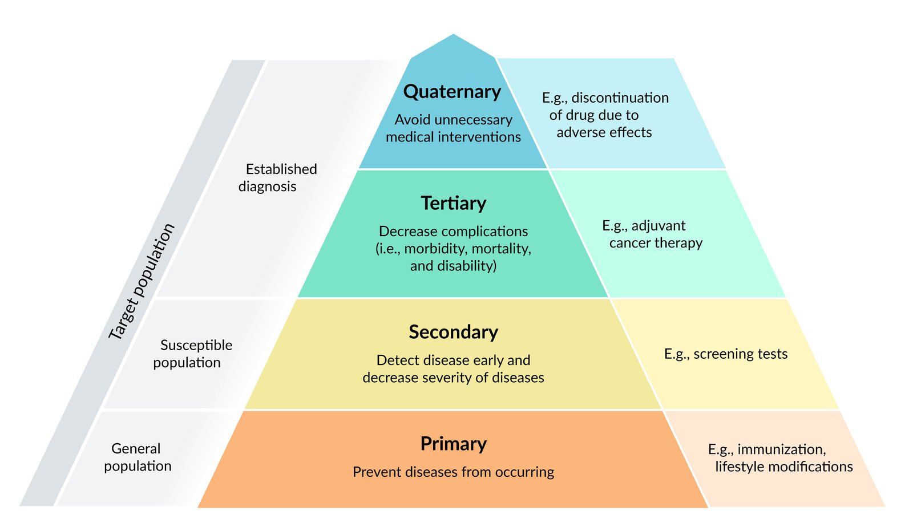

# Preventive medicine

*Categories: Clinical knowledge > Internal medicine > Basics of internal medicine > Preventive medicine > Preventive medicine*

[Original Article Link](https://coursology-qbank.com/amboss/article/Wj0Pzf)

---

## Summary

Preventive medicine aims to prevent disease occurrence as well as disease progression and complications after disease onset. The five levels of preventive medicine target all stages of disease: primordial prevention (prevention of disease <u>risk factors</u>), <u>primary prevention</u> (prevention of specific diseases), <u>secondary prevention</u> (identification of early-stage disease, e.g., using <u>screening tests</u>), <u>tertiary prevention</u> (optimization of care for an established disease to limit progression and complications), and quaternary prevention (prevention of <u>medical overuse</u>). Such efforts may occur on a population level (e.g., through <u>public health</u> interventions) or an individual level (e.g., through routine health maintenance). Challenges to the implementation of preventive medicine include the “<u>prevention paradox</u>” and nonadherence. <u>Health promotion</u> can help individuals overcome these challenges and empower them to improve their health.

See also “<u>Adult health maintenance</u>,” “<u>Adolescent health care</u>,” and “<u>Well-child visits</u>.”

Disease prevention

---

## Public health interventions

<u>Public health</u> interventions are actions and policies introduced by <u>public health</u> authorities to protect and improve the health of a population. Population-based practice focuses on the health concerns of entire populations and intervenes at the individual, community, and systemic levels. [[1]](https://coursology-qbank.com/amboss/article/nCc7se0)

|  Population-based <u>public health</u> interventions [[1]](https://coursology-qbank.com/amboss/article/nCc7se0) |  |  |  |  |
| --- | --- | --- | --- | --- |
|  | Intervention | Examples |  |  |
| Category | System-focused | Community-focused | Individual-focused |  |
| Case finding and <u>epidemiology</u> |   * Surveillance (public health): collection, analysis, and interpretation of data required for planning and evaluation of <u>public health</u> interventions  * Outreach: identifying at-risk populations and informing them about prevention, mitigation, and treatment  * Case finding: identifying individuals and families with <u>risk factors</u> and providing them with educational resources and medical referrals  * Health event and disease investigation: gathering data on reported threats to <u>population health</u> in order to develop control measures (see “<u>Disease outbreak investigation</u>”)  * Screening: for identification of asymptomatic or at-risk individuals in a population    |  * Establishing protocols during a <u>pandemic</u> for sharing of <u>case reports</u> and <u>incidence</u> data between providers and local health departments   |   * Creating hotlines during a <u>pandemic</u> to provide information to the general population and assist in mitigation and control measures  * Establishing testing centers during a <u>pandemic</u> to identify cases in the community    |   * Raising awareness during a <u>pandemic</u> and staying vigilant regarding pertinent symptoms in patients and colleagues  * Monitoring local <u>incidence</u> and reporting data during health care worker staff meetings    |
| Diagnosis and management |   * Referral and follow-up: directing individuals to health care resources and assessing outcomes  * Case management: collaborating with individuals and providers to plan, coordinate, and assess care  * Delegated functions: entrusting health care tasks to other authorized personnel    |  * Developing school policies that implement new guidelines for children with <u>asthma</u>   |  * Coordinating with the local chapter of the American <u>Lung</u> Association to organize regular <u>asthma</u> information events for students and parents   |  * Creating an individualized management plan for a child recently diagnosed with <u>asthma</u>   |
| Information, education, empowerment |   * Counseling: developing interpersonal rapport to facilitate coping and self-care  * Consultation: deliberation between health care workers and/or experts on the diagnosis or treatment in any particular case  * Health teaching: educating the public about health-related conditions and behaviors    |   * Training physicians and midwives on latest research about the risks of <u>alcohol</u> use during <u>pregnancy</u>  * Organizing meetings between a health care worker and the staff at a childcare center to develop a protocol to prevent <u>measles</u> <u>outbreaks</u>    |   * Developing and distributing posters that aim to reduce <u>alcohol</u> use by women at establishments serving alcoholic beverages  * Providing safer sex education at schools    |   * Providing information about the impact of <u>alcohol</u> use on <u>pregnancy</u> for a reproductive health class in high schools  * Providing <u>fertility counseling</u> for young couples at a free health clinic    |
| Partnerships and networks |   * Collaboration: coordinating cooperation between institutions, groups, and/or individuals directed toward a particular health care goal  * Community organizing: uniting individuals to identify and develop strategies to solve <u>public health</u> problems  * Coalition building: developing alliances among organizations and institutions to solve <u>public health</u> problems    |  * Collaborating with senior centers to provide screening of older adults for fall risk   |  * Introducing a home safety checklist on fall prevention to residents of a senior center   |  * Conducting home visits to the homes of older adults to assess risks and prevent falls   |
| Policy development, promotion, and enforcement |   * Health advocacy: promoting <u>public health</u> through collaboration with community stakeholders and engagement with policymakers  * Social marketing: deploying marketing techniques to positively influence a target audience's health behaviors  * Policy development and enforcement: working with decision-makers to develop laws and regulations to protect and promote <u>public health</u>    |   * Drafting legislation to mitigate certain <u>risk factors</u>, e.g.:  * Cigarette and soda taxes  * <u>Air pollution</u> regulations  * Smoke-free laws  * <u>Alcohol</u> sales bans  * Carrying out an anti-bullying social media campaign in a school district    |   * Providing free health care for persons experiencing homelessness  * Organizing fundraising campaigns for orphan disease research    |  * Providing reproductive health counseling to a sexually-active teenager   |

---

## Primordial prevention

* Definition: actions that aim to prevent the development of <u>risk factors</u> for disease [[5]](https://coursology-qbank.com/amboss/article/JAWskL0)[[6]](https://coursology-qbank.com/amboss/article/uHbpHE)

* Target: entire population [[6]](https://coursology-qbank.com/amboss/article/uHbpHE)

* Goal: encourage positive and discourage negative lifestyle habits [[6]](https://coursology-qbank.com/amboss/article/uHbpHE)

* Strategies

* <u>Health promotion</u>

* Mass education

* Legislation

* Examples

* Programs on food safety and nutrition guidelines

* Campaigns discouraging tobacco and drug use (e.g., smokefree air laws in public buildings)

* Building bicycle lanes and sidewalks to promote physical activity

> [!TIP]
> Primordial prevention aims to prevent <u>risk factors</u> from developing, whereas <u>primary prevention</u> targets existing <u>risk factors</u> to prevent the onset of a disease. [[7]](https://coursology-qbank.com/amboss/article/sZdt1o0)

---

## Primary prevention

* Definition: actions targeted at preventing specific diseases from occurring to decrease the <u>incidence</u> and, subsequently, the <u>prevalence</u> of those diseases

* Target: entire population or selected groups of individuals without disease who are at increased risk of disease

* Goal: decrease <u>incidence</u> and, in turn, <u>prevalence</u> of a specific disease

* Strategies

* <u>Health promotion</u> (health interventions, lifestyle modifications)

* Environmental modifications (e.g., work safety)

* Specific protection interventions (immunizations, <u>chemoprophylaxis</u>, safety of drugs and food)

* Examples

* <u>Immunization</u>

* Lifestyle modification (e.g., <u>smoking cessation</u> to reduce <u>lung cancer</u> risk, exercise to reduce the risk of <u>heart</u> disease, dental care to reduce the risk of <u>tooth</u> loss)

* Fortification of salt with <u>iodine</u> to prevent <u>iodine deficiency</u>

* Fluoridation of toothpaste, water, and salt to reduce the risk of dental conditions

* Fortification of food with <u>folic acid</u> to reduce the <u>prevalence</u> of <u>neural tube defects</u> [[8]](https://coursology-qbank.com/amboss/article/xHbEsE)

* Health legislation (e.g., seat belt laws, food safety standards, traffic laws)

* <u>Routine neonatal ophthalmic antibiotic prophylaxis</u> to prevent <u>neonatal gonococcal conjunctivitis</u>

* <u>Postexposure prophylaxis</u>

* For further information, see:

* “<u>Adult health maintenance</u>”

* “<u>Anticipatory guidance for children</u>”

* “<u>Preventive health recommendations for adolescents</u>”

* “<u>Prenatal patient education</u>”

> [!NOTE]
> Primary prevention helps to Prevent disease.

---

## Secondary prevention

* Definition: actions targeted at early detection of disease in asymptomatic individuals to promote timely intervention, preventing disease progression and/or improving the chance of treatment success  [[9]](https://coursology-qbank.com/amboss/article/v0dA3o0)[[10]](https://coursology-qbank.com/amboss/article/E0d83o0)

* Target: individuals at risk for disease

* Goal: detect disease and initiate treatment early to improve the chance of treatment success

* Strategy: two-step process

* Screening test to identify disease

* Follow-up for disease management

* For further information on screening, see:

* “<u>Adult health maintenance screening recommendations</u>”

* “<u>Adolescent health screening</u>”

* “<u>Pediatric screening recommendations</u>”

* “<u>Prenatal care</u>”

* “<u>Preventive health care for transgender individuals</u>”

> [!TIP]
> Screening complements diagnostics, but it is not a substitute.

> [!NOTE]
> Secondary prevention helps Screen.

---

## Tertiary prevention

* Definition: actions taken to optimize the care of patients with an existing disease to improve well-being and prevent complications [[11]](https://coursology-qbank.com/amboss/article/7-W4AL0)

* Target: individuals with an established disease

* Goal: decrease <u>morbidity</u> and mortality by preventing disease progression and reducing the risk of relapse

* Strategies

* <u>Chronic disease management</u>

* <u>Strategies to improve treatment adherence</u>

* Examples

* <u>Adjuvant therapy</u> to reduce the risk of cancer recurrence (e.g., <u>tamoxifen</u> in <u>breast cancer</u>)

* Blood pressure management (e.g., <u>antihypertensives</u>) to reduce the risk of a cardiovascular event

* <u>Diabetes management</u> (e.g., <u>antidiabetic drugs</u>, <u>HbA1c monitoring</u>) to reduce the risk of <u>chronic kidney disease</u> and/or cardiovascular events

* Measures to prevent recurrent <u>myocardial infarction</u> (e.g., <u>low-dose aspirin</u>)

> [!NOTE]
> Tertiary prevention helps Treat.

---

## Quaternary prevention

* Definition: actions taken to avoid medical interventions in which the harms may outweigh the benefits [[12]](https://coursology-qbank.com/amboss/article/TyW6eL0)

* Target: individuals with the potential to undergo unnecessary or inappropriate diagnostic and therapeutic interventions

* Goal: prevent <u>medical overuse</u> (i.e., overdiagnosis and overtreatment) and avoidable <u>iatrogenesis</u> [[13]](https://coursology-qbank.com/amboss/article/7AW4OL0)

* Strategies

* Practicing <u>evidence-based medicine</u>

* Using <u>shared decision-making</u> before initiating medical interventions

* Educating <u>health care providers</u> and patients on potential harms of unnecessary interventions (e.g., through initiatives such as the <u>Choosing Wisely campaign</u>)

* Avoidance of exploitation of medical conditions to sell products and/or procedures [[14]](https://coursology-qbank.com/amboss/article/uzWpuL0)

* Examples

* Inappropriate investigations leading to overdiagnosis: the detection of disease that would never manifest clinically or result in <u>death</u>

* Screening individuals outside of the recommended age range (e.g., <u>cervical cancer screening</u> in individuals > 65 years of age without <u>risk factors</u>). [[15]](https://coursology-qbank.com/amboss/article/NSc--b0)[[16]](https://coursology-qbank.com/amboss/article/3J1SF30)[[17]](https://coursology-qbank.com/amboss/article/lScv-b0)

* <u>MRI</u> for <u>lower back pain</u> of < 6 weeks duration or without <u>red flag features</u> [[18]](https://coursology-qbank.com/amboss/article/i0dJfo0)

* Unnecessary examinations (e.g., routine <u>pelvic examination</u> before prescribing <u>contraception</u>) [[19]](https://coursology-qbank.com/amboss/article/jD1_VQ0)

* Unnecessary or excessive treatment (overtreatment)

* <u>Antibiotics</u> for viral infections

* Use of <u>opioids</u> in chronic noncancer <u>pain</u>  [[20]](https://coursology-qbank.com/amboss/article/gyWFeL0)

* <u>Antibiotics</u> for acute mild to moderate <u>sinusitis</u>, as this may lead to <u>antibiotic</u> resistance [[21]](https://coursology-qbank.com/amboss/article/ys0dxh)

* Avoidable <u>iatrogenesis</u>

* Use of the <u>combined hormonal contraception</u> in patients with <u>absolute contraindications</u> (e.g., <u>migraine with aura</u>)

* Continuation of <u>antidiabetic drugs</u> (e.g., <u>sulfonylureas</u>) despite patients experiencing adverse effects (e.g., multiple <u>hypoglycemic</u> events)

> [!NOTE]
> QUaternary prevention helps sQUeeze out unnecessary interventions.

---

## Disease outbreak investigation

* Definitions

* Disease cluster: an unusual aggregation, real or perceived, of cases of a disease that are grouped together in time and space

* Disease outbreak: the sudden occurrence of more cases of a disease than expected in a given area, population, and/or season

* Identifying <u>outbreaks</u>

* <u>Outbreaks</u> are identified by health authorities through reports that may come from hospitals, laboratories, <u>health care providers</u>, and even the general population.

* After receiving an initial report, health authorities decide on whether to investigate further.

* Investigating <u>outbreaks</u>

* Field investigation involves identifying a potential <u>disease outbreak</u>, forming a hypothesis about its cause, gathering data to test the hypothesis, and finally, developing and implementing control and prevention measures.

* Steps of the <u>field investigation</u> usually include:

* Preparing for the investigation

* Gathering information about the condition, area, and/or population of interest

* Organizing a team and necessary supplies

* Confirming the <u>outbreak</u>

* Establishing a case definition

* Finding cases and documenting details of each case

* Developing a hypothesis about the cause of the <u>outbreak</u>

* Analyzing the gathered data and evaluating the hypothesis

* Comparing and reconciling with laboratory and/or environmental studies

* Developing and implementing control and prevention measures

* Initiating or maintaining surveillance.

* Communicating the findings to the public

---