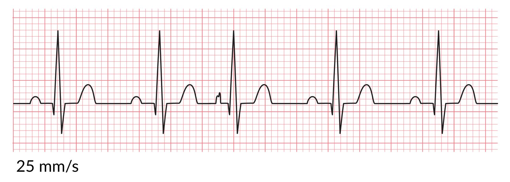
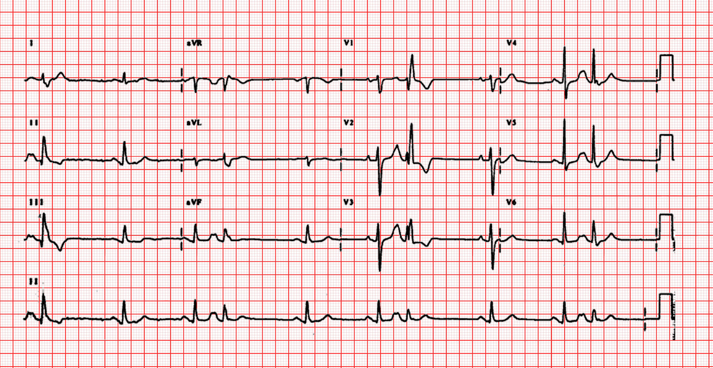

# Supraventricular premature beats

*Categories: Clinical knowledge > Internal medicine > Cardiology and angiology > Arrhythmias > Supraventricular premature beats*

[Original Article Link](https://coursology-qbank.com/amboss/article/sS0taf)

---

## Summary

Supraventricular premature beats (SPBs) are atrial contractions triggered by <u>ectopic foci</u> rather than the <u>sinoatrial node</u>. They arise within the <u>atria</u> (atrial premature beats) or, through retrograde conduction, in the <u>atrioventricular node</u> (junctional premature beats). Premature beats may be found in healthy individuals as well as in individuals with underlying <u>heart</u> disease. Certain triggers (e.g., <u>alcohol</u>, smoking, or <u>electrolyte</u> imbalances) may contribute to the occurrence of SPBs. SPBs can be identified on <u>ECG</u> by <u>QRS complexes</u> preceded by absent or abnormal <u>P waves</u> and an altered <u>PR interval</u>. Although SPBs do not significantly impair <u>cardiac output</u> on their own, they may predispose to more severe forms of <u>arrhythmia</u> such as <u>atrial fibrillation</u>. Treatment is not required unless patients exhibit severe symptoms (e.g., <u>tachycardia</u>).

---

## Etiology

Atrial contractions are triggered by <u>ectopic foci</u> (not the <u>sinoatrial node</u>), which arise from within the <u>atria</u> (atrial premature beats) or, through retrograde conduction, in the <u>atrioventricular node</u> (junctional premature beats).

* <u>Idiopathic</u>

* Potential triggers: smoking, <u>alcohol</u>, coffee  [[1]](https://coursology-qbank.com/amboss/article/9-WNzL0)

* Cardiovascular disease or <u>electrolyte</u> imbalances (e.g., <u>hypokalemia</u>)

> [!TIP]
> SPBs are very common in the general population. In one study, 99% of participants had at least 1 premature atrial contraction during 24-hour <u>Holter monitoring</u>. [[2]](https://coursology-qbank.com/amboss/article/0ZdeZo0)

---

## Classification

* Atrial premature beat: : extrasystole that originates in the atrial <u>myocardium</u> and occurs prior to the expected <u>QRS complex</u>

* Junctional premature beat: premature beat that originates between the <u>atria</u> and ventricles and occurs prior to the expected <u>QRS complex</u>

Atrial premature beats

---

## Clinical features

* Usually asymptomatic

* Irregular <u>pulse</u>

* <u>Palpitations</u>

---

## Diagnosis

### General principles [[3]](https://coursology-qbank.com/amboss/article/B-WzzL0)

* 12-lead <u>ECG</u> may incidentally identify SPBs.

* <u>Ambulatory ECG monitoring</u> (e.g., <u>Holter monitoring</u>) is most reliable for assessing SPB burden.

* <u>Echocardiography</u> may be considered to rule out underlying <u>heart</u> disease, especially in symptomatic patients.

> [!TIP]
> Frequent SPBs are associated with the future development of <u>atrial fibrillation</u> and <u>stroke</u>. [[4]](https://coursology-qbank.com/amboss/article/ycddUK0)

### <u>ECG</u> [[5]](https://coursology-qbank.com/amboss/article/bUbHbG)

#### Atrial premature beats

* <u>P-wave</u> abnormalities or absent <u>P waves</u>

* Altered <u>PR interval</u> in the premature beats (compared to the normal beats)

* <u>QRS complex</u> may be normal, aberrant (widened), or absent.

* No full <u>compensatory pause</u>  [[6]](https://coursology-qbank.com/amboss/article/x-WEzL0)

* <u>Atrial bigeminy</u>: atrial premature beat that couples to a normal beat coming from the sinus node [[5]](https://coursology-qbank.com/amboss/article/bUbHbG)

* Atrial trigeminy: atrial premature beat that couples to two normal beats coming from the sinus node

#### Junctional premature beats

* Retrograde <u>P wave</u>

* Narrow <u>QRS complex</u> or widened <u>QRS complex</u> if aberrant ventricular conduction is present  [[5]](https://coursology-qbank.com/amboss/article/bUbHbG)

* Junctional <u>bigeminy</u>: junctional premature beat that couples to a normal beat coming from the sinus node [[5]](https://coursology-qbank.com/amboss/article/bUbHbG)

* Junctional trigeminy: junctional premature beat that couples to two normal beats coming from the sinus node [[5]](https://coursology-qbank.com/amboss/article/bUbHbG)

Atrial premature beats

Supraventricular premature beats

Atrial premature beats (APBs) with trigeminy

### Specialized testing [[3]](https://coursology-qbank.com/amboss/article/B-WzzL0)

#### Indications [[3]](https://coursology-qbank.com/amboss/article/B-WzzL0)

* Symptomatic SPBs

* Frequent SPBs  [[3]](https://coursology-qbank.com/amboss/article/B-WzzL0)[[7]](https://coursology-qbank.com/amboss/article/bZdHZo0)

> [!TIP]
> SPBs are a common incidental finding on routine <u>ECGs</u>. No workup is required in asymptomatic patients without frequent SPBs.

#### Modalities [[3]](https://coursology-qbank.com/amboss/article/B-WzzL0)

* <u>Ambulatory ECG monitoring</u>: e.g., 24- or 48-hour <u>Holter monitoring</u>

* Determines the frequency and overall burden of SPBs

* Can help match symptoms to the occurrence of SPBs

* May allow for identification of concomitant <u>arrhythmias</u> (e.g., <u>atrial fibrillation</u>)

* <u>Cardiac imaging</u>: to rule out <u>structural heart disease</u> and evaluate cardiac structure and function

* <u>Echocardiography</u>

* <u>Cardiac MRI</u>

---

## Treatment

* Treatment is not required in asymptomatic individuals without underlying structural <u>heart</u> defects. [[7]](https://coursology-qbank.com/amboss/article/bZdHZo0)[[8]](https://coursology-qbank.com/amboss/article/-UbDfG)

* Underlying conditions, e.g., <u>electrolyte</u> imbalances, should be treated.

* Anticoagulation may be considered in patients with high SPB burden to reduce the risk of <u>stroke</u>.  [[3]](https://coursology-qbank.com/amboss/article/B-WzzL0)[[7]](https://coursology-qbank.com/amboss/article/bZdHZo0)

* <u>ASCVD risk assessment</u> in patients with <u>risk factors</u>, and <u>management of ASCVD</u> [[9]](https://coursology-qbank.com/amboss/article/XZd9Zo0)

* Symptomatic patients

* Advise patients to reduce potential triggers like <u>caffeine</u>, <u>alcohol</u>, <u>stress</u>, and smoking. [[8]](https://coursology-qbank.com/amboss/article/-UbDfG)

* Consider <u>beta blockers</u> or <u>catheter ablation</u> in patients with persistent symptoms. [[9]](https://coursology-qbank.com/amboss/article/XZd9Zo0)

---