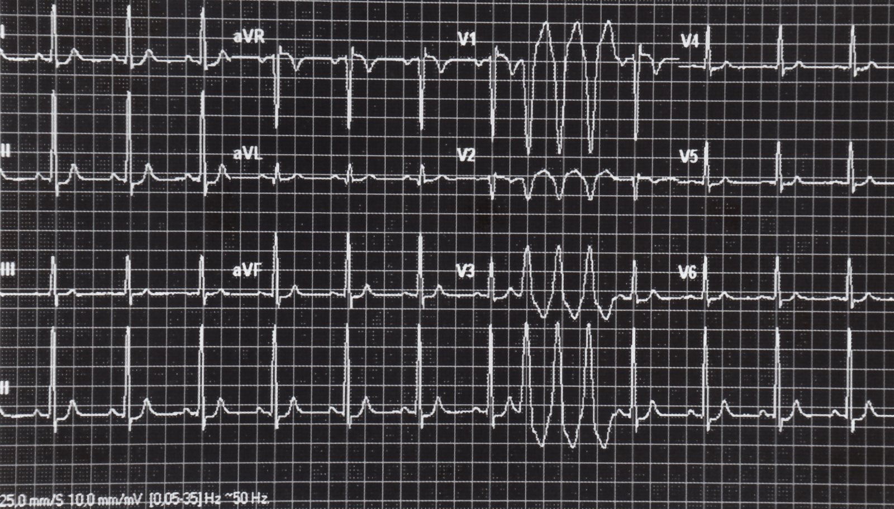
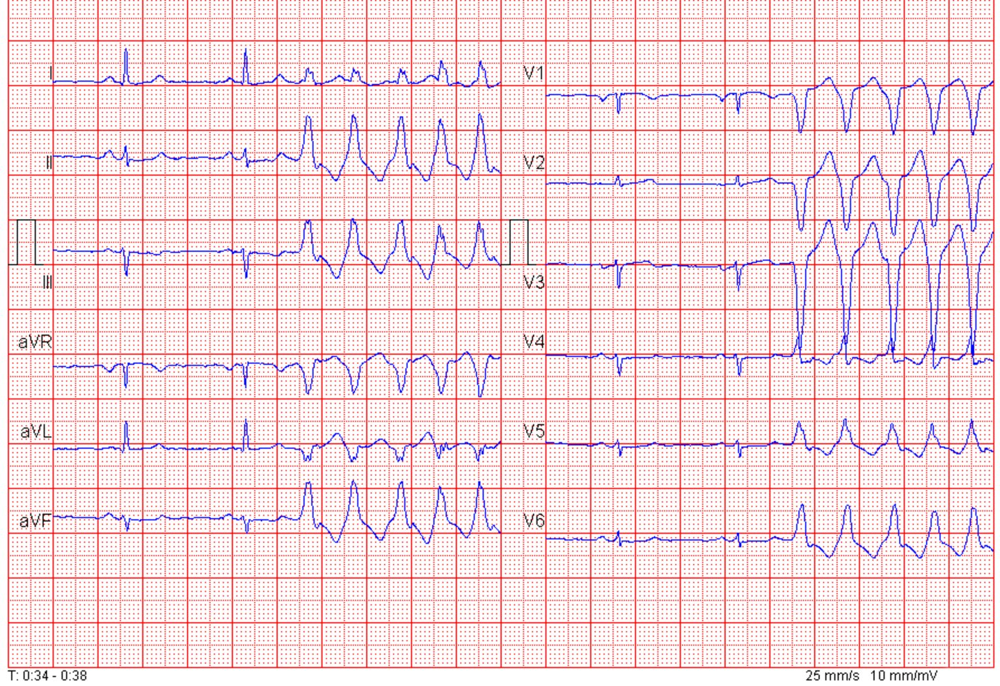
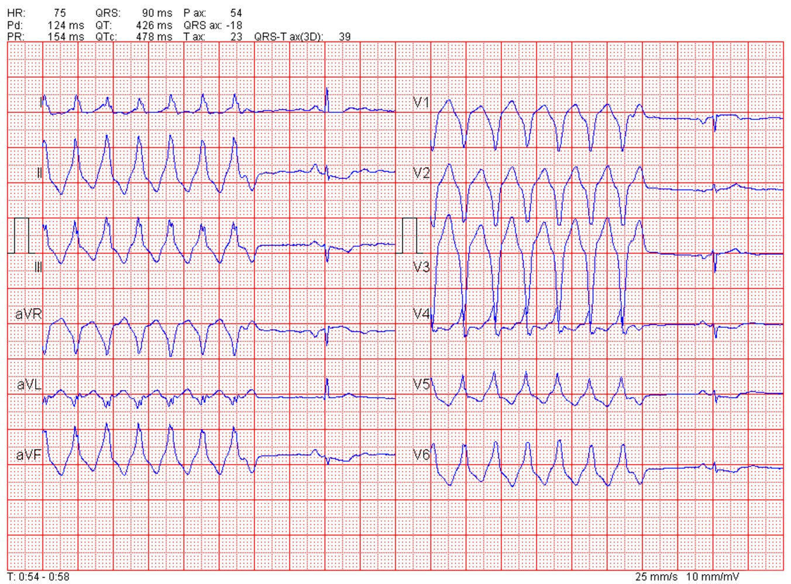
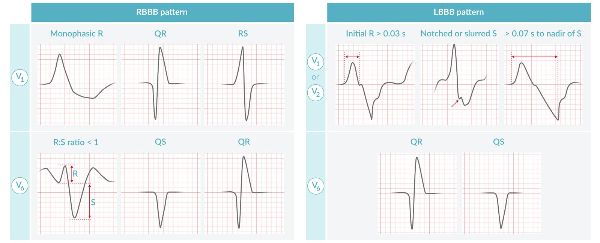
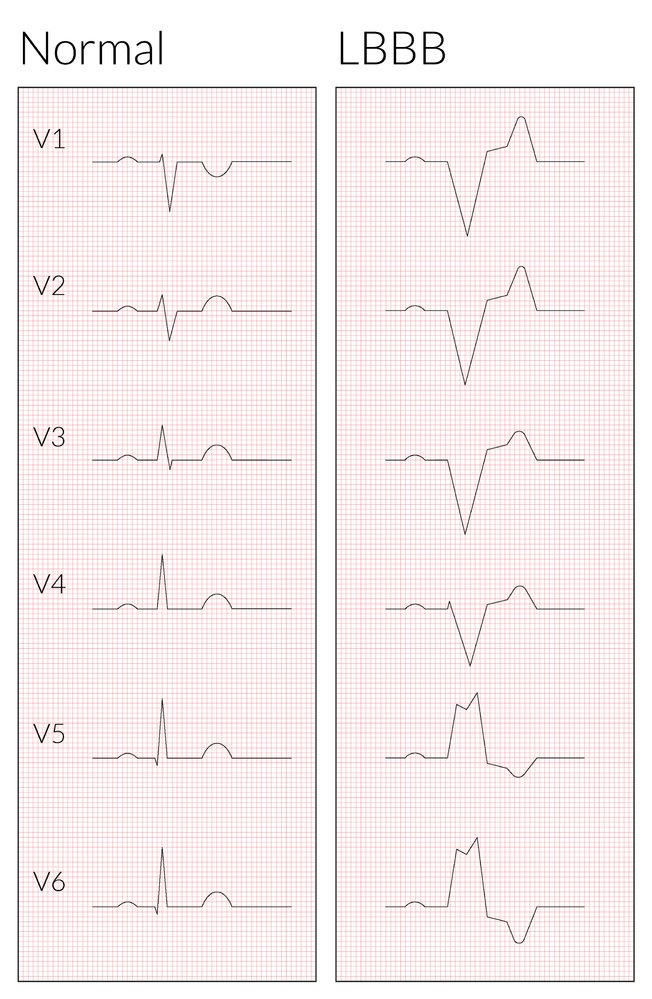
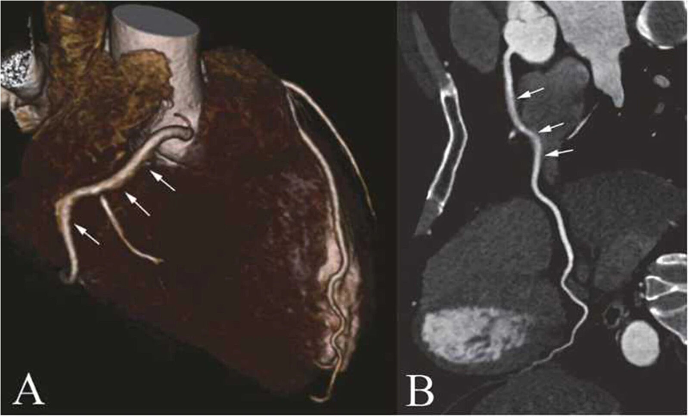
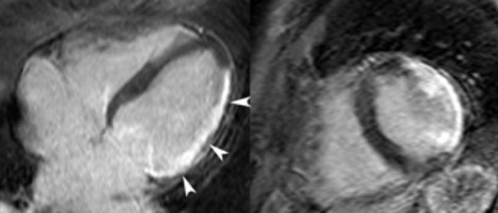
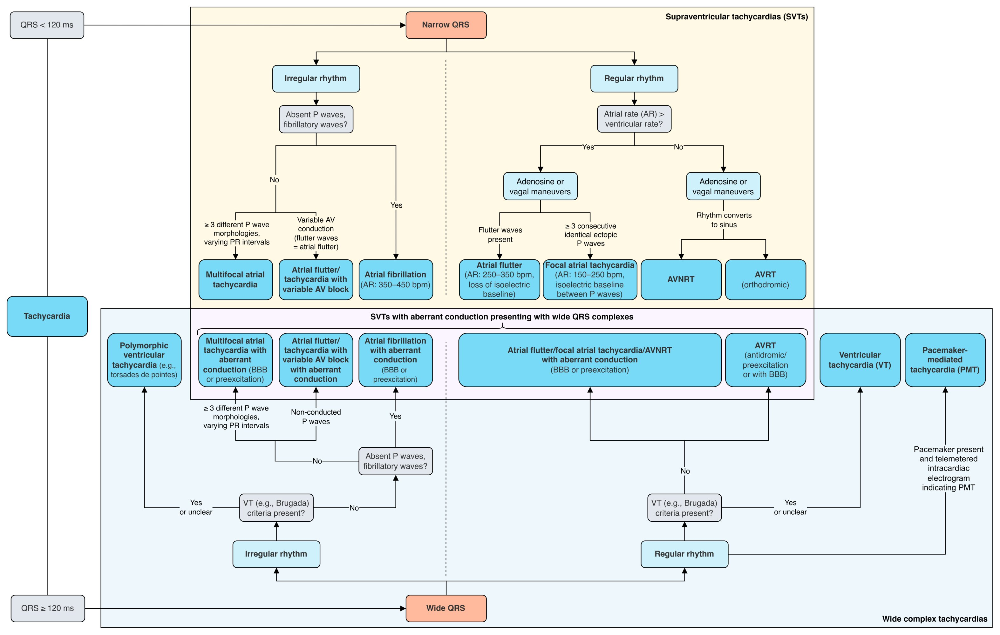

# Ventricular tachycardia

*Categories: Clinical knowledge > Internal medicine > Cardiology and angiology > Arrhythmias > Ventricular tachycardia*

[Original Article Link](https://coursology-qbank.com/amboss/article/ES08Yf)

---

## Summary

Ventricular <u>tachycardia</u> (VT) is a potentially life-threatening <u>arrhythmia</u> originating in the cardiac ventricles. VT usually results from underlying cardiac diseases, such as <u>myocardial infarction</u> or <u>cardiomyopathy</u>, but it can also be <u>idiopathic</u> or caused by drugs and <u>electrolyte</u> imbalances. Clinical manifestations range from <u>palpitations</u> and <u>syncope</u> to <u>cardiogenic shock</u> and <u>sudden cardiac death</u> (<u>SCD</u>). The characteristic <u>ECG findings of VT</u> are <u>wide QRS complexes</u> (> 120 ms), <u>tachycardia</u> (≥ 100/minute), and <u>signs of AV dissociation</u>. In the acute setting, management of VT may require immediate <u>cardioversion</u>, <u>defibrillation</u>, or administration of <u>antiarrhythmic drugs</u>. Most patients who develop symptomatic, recurrent VT require long-term therapy involving <u>antiarrhythmic medication</u>, <u>automated implantable cardioverter-defibrillator</u> (<u>AICD</u>) insertion, or <u>catheter ablation</u> of the arrhythmogenic focus. <u>Torsades de pointes</u> (<u>TdP</u>) is a type of <u>polymorphic VT</u> occurring in patients with a <u>prolonged QT interval</u>. Intravenous <u>magnesium sulfate</u> and correction of the underlying <u>etiology of prolonged QTc</u> are important aspects of <u>TdP</u> management.

<u>Ventricular fibrillation</u> is a type of <u>ventricular tachyarrhythmia</u> but is covered in a separate article (see “<u>Ventricular fibrillation</u>”).

---

## Definitions

* Ventricular <u>tachycardia</u>: ≥ 3 consecutive <u>ventricular complexes</u> (<u>wide QRS complex</u>) at a frequency of ≥ 100/minute 

* Classification by duration

* Nonsustained ventricular tachycardia (<u>NSVT</u>): VT lasting < 30 seconds with spontaneous termination

* Sustained ventricular tachycardia: VT lasting ≥ 30 seconds or VT causing <u>hemodynamic instability</u> within 30 seconds

* Classification by morphology

* Monomorphic VT: QRS morphology similar in all beats, indicating a single arrhythmogenic focus

* Polymorphic VT: QRS morphology varies in each beat, indicating multiple arrhythmogenic foci

* <u>Premature ventricular complex</u> : ≤ 3 consecutive <u>ventricular complexes</u> often followed by a complete <u>compensatory pause</u> 

* <u>Ventricular couplet</u>: 2 consecutive <u>ventricular complexes</u>

* Ventricular triplet: 3 consecutive <u>ventricular complexes</u>  [[1]](https://coursology-qbank.com/amboss/article/1zX2700)[[2]](https://coursology-qbank.com/amboss/article/WzXP700)

Monomorphic ventricular tachycardia

Polymorphic ventricular tachycardia

Premature ventricular complexes

Comparison of monomorphic and polymorphic ventricular tachycardia (VT), including torsades de pointes

Reference: [[3]](https://coursology-qbank.com/amboss/article/xBYE17)

---

## Etiology

### Cardiac causes [[3]](https://coursology-qbank.com/amboss/article/xBYE17)[[4]](https://coursology-qbank.com/amboss/article/uVXpwC)

* Cardiac scars: secondary to <u>myocardial infarction</u> or cardiac <u>surgery</u>

* <u>Myocardial</u> <u>ischemia</u>: secondary to <u>angina</u>

* Inflammatory causes: <u>myocarditis</u>, <u>endocarditis</u>, or <u>rheumatic heart disease</u>

* <u>Idiopathic</u>: areas of increased <u>automaticity</u> in a structurally normal <u>heart</u>

* Conduction disorders

* Nonischemic <u>cardiomyopathy</u> (CM)

* Inherited CM (e.g., <u>HCM</u>, <u>DCM</u>, arrhythmogenic <u>right ventricular</u> CM, <u>progressive muscular dystrophies</u>)

* CM secondary to infiltrative disorders (e.g., <u>sarcoidosis</u>, <u>hemochromatosis</u>, or <u>amyloidosis</u>)

* Inherited arrhythmia syndromes (channelopathies)

* A group of genetic syndromes caused by mutations in <u>genes</u> that encode cardiac ion channels resulting in a predisposition for <u>arrhythmias</u> [[5]](https://coursology-qbank.com/amboss/article/vUXAUx)

* Can lead to <u>sudden cardiac death</u> if uncontrolled

* Examples: <u>Congenital long QT syndrome</u>, <u>Brugada syndrome</u>, <u>catecholaminergic polymorphic ventricular tachycardia</u> (<u>CPVT</u>)

> [!TIP]
> <u>Ischemic heart disease</u> is the most common cause of ventricular <u>tachycardia</u>. [[3]](https://coursology-qbank.com/amboss/article/xBYE17)

### Extracardiac causes [[4]](https://coursology-qbank.com/amboss/article/uVXpwC)

* <u>Acquired long QT syndrome</u> ;  [[6]](https://coursology-qbank.com/amboss/article/wp0h7S)[[7]](https://coursology-qbank.com/amboss/article/fTYkJo)[[8]](https://coursology-qbank.com/amboss/article/2tYT1I)

* <u>Drug-induced QT prolongation</u> (e.g., class I and <u>class III antiarrhythmics</u>, <u>macrolides</u>, <u>fluoroquinolones</u>)

* <u>Electrolyte</u> imbalances (<u>hypokalemia</u>, <u>hypomagnesemia</u>, <u>hypocalcemia</u>)

* See “<u>Acquired LQTS</u>” for further detail.

* Certain drugs ;  [[9]](https://coursology-qbank.com/amboss/article/0rXefz)

* <u>Digoxin toxicity</u>

* <u>Antiarrhythmics</u>

* <u>Recreational drugs</u> such as <u>cocaine</u>

> [!TIP]
> Drug-induced toxicity and <u>electrolyte</u> abnormalities are the most common extracardiac causes of ventricular <u>tachycardia</u>.

---

## Pathophysiology

### Mechanism

VT can result from an alteration in <u>myocardial</u> <u>automaticity</u>, electrical conduction, or ventricular <u>repolarization</u> secondary to several factors (see “Etiology” for details).

* <u>Monomorphic VT</u> (similar <u>QRS complexes</u>)

* Increased <u>automaticity</u>

* Reentry circuit 
* <u>Wide QRS complex</u> (≥ 120 msec): usually caused by a slow ventricular activation outside the normal ventricular <u>conduction system</u>; <u>tachycardia</u> then originates below the <u>AV node</u>

* <u>Polymorphic VT</u> (dissimilar <u>QRS complexes</u>): abnormal ventricular <u>repolarization</u> (e.g., due to <u>long QT syndrome</u>, drug toxicity, <u>electrolyte</u> abnormalities)

### Effect

* Asynchronous atrial and ventricular beats and rapid ventricular rhythm → ↓ blood flow into the ventricle during <u>diastole</u> → ↓ <u>cardiac output</u>

* Consequent hemodynamic compromise → symptoms of <u>syncope</u>, <u>MI</u>, <u>angina</u>

Reference [[3]](https://coursology-qbank.com/amboss/article/xBYE17)

---

## Clinical features

* Often asymptomatic, especially in <u>NSVT</u>

* Cardiovascular features

* <u>Palpitations</u>

* <u>Tachycardia</u> (HR ≥100/min; typically regular)

* <u>Chest pain</u>/pressure

* <u>Dyspnea</u>, <u>orthopnea</u>

* Symptoms of reduced <u>cardiac output</u>

* <u>Dizziness</u>

* <u>Hypotension</u>

* <u>Syncope</u>

* <u>Cardiogenic shock</u> and <u>loss of consciousness</u>

* <u>Cardiac arrest</u>

* Symptoms may be unprovoked or exacerbated by physical and/or emotional triggers (e.g., exercise, anger). [[10]](https://coursology-qbank.com/amboss/article/arXQfz)

> [!WARNING]
> If <u>sustained VT</u> is suspected, immediately obtain an <u>ECG</u> to confirm the diagnosis and initiate treatment as it can rapidly progress to <u>ventricular fibrillation</u> and cause <u>sudden cardiac death</u>.

Reference: [[3]](https://coursology-qbank.com/amboss/article/xBYE17)

---

## Initial management of sustained VT

See “<u>Approach to tachycardia</u>” for details on the initial management of undifferentiated <u>tachycardia</u>.

### All patients [[3]](https://coursology-qbank.com/amboss/article/xBYE17)[[11]](https://coursology-qbank.com/amboss/article/HnXKuA)

* Urgently consult cardiology.

* Bring a <u>crash cart</u> to the bedside and attach the <u>defibrillator</u> pads to the patient.

* Assess for hemodynamic stability and <u>signs of unstable tachycardia</u>.

> [!TIP]
> Attach <u>defibrillator</u> pads to unstable patients and use a <u>cardioverter-defibrillator</u> or bedside monitor to obtain a <u>rhythm strip</u> for rapid assessment.

Placement of adhesive electrode pads for defibrillation, electrical cardioversion, or transcutaneous pacing

Placement of paddles for defibrillation or electrical cardioversion

### <u>Hemodynamically unstable</u> patients [[3]](https://coursology-qbank.com/amboss/article/xBYE17)[[11]](https://coursology-qbank.com/amboss/article/HnXKuA)

* <u>Pulseless VT</u>: Commence <u>CPR</u> while preparing to <u>defibrillate</u> and administer <u>shock</u> as soon as possible (see “<u>ACLS</u>” for details).

* VT with <u>pulse</u>: See “<u>Management of unstable tachycardia with a pulse</u>” for details.

* <u>Polymorphic VT</u>: <u>Defibrillate</u>.

* <u>Monomorphic VT</u>: Perform <u>synchronized electrical cardioversion</u> under <u>procedural sedation</u> .

* Uncertain if monomorphic or <u>polymorphic VT</u>: <u>Defibrillate</u>.

* Refractory VT: Consider infusion of <u>amiodarone</u> or <u>beta blockers</u> (see “<u>Electrical storm</u>”).

* Deterioration to <u>ventricular fibrillation</u>: <u>Defibrillation</u> and <u>CPR</u> (managed the same as <u>pulseless VT</u>)

> [!TIP]
> <u>Pulseless VT</u> and <u>ventricular fibrillation</u> are managed similarly with <u>CPR</u> and <u>defibrillation</u>.

### Hemodynamically stable patients [[3]](https://coursology-qbank.com/amboss/article/xBYE17)[[11]](https://coursology-qbank.com/amboss/article/HnXKuA)

See also “<u>Management of stable wide-complex tachycardia</u>” (<u>WCT</u>) for an algorithm to diagnose and treat undifferentiated <u>WCTs</u>.

* Confirm the underlying rhythm

* Differentiate VT from <u>SVT with aberrancy</u> if unclear (see “Diagnostics” for an approach).

* If the diagnosis remains uncertain, treat as VT (∼ 80% of <u>WCT</u> is caused by VT).

* Regular monomorphic <u>WCT</u> of unclear origin: Consider <u>adenosine</u> DOSAGE as a diagnostic and therapeutic measure for possible underlying <u>SVT</u>, unless an <u>accessory pathway</u> is suspected.  [[11]](https://coursology-qbank.com/amboss/article/HnXKuA)[[12]](https://coursology-qbank.com/amboss/article/3DYSVr)

* First-line treatment of VT: <u>pharmacological cardioversion</u> with <u>antiarrhythmics</u>

* Patients with <u>QT prolongation</u> on <u>baseline ECG</u>: <u>amiodarone</u> DOSAGE

* Patients without prolongation on <u>baseline ECG</u>: <u>procainamide</u>  DOSAGE or <u>sotalol</u> DOSAGE

* Refractory VT: <u>electrical cardioversion</u>

> [!TIP]
> A <u>WCT</u> may occur as a result of either VT or <u>SVT with aberrancy</u>. The <u>Brugada criteria</u> can help differentiate between the two.

> [!WARNING]
> <u>Antiarrhythmics</u> may precipitate acute <u>hypotension</u> and/or rhythm deterioration to <u>TdP</u> or <u>ventricular fibrillation</u>; be prepared to provide immediate <u>defibrillation</u> or <u>hemodynamic support</u> as required.

> [!WARNING]
> Avoid <u>procainamide</u> and <u>sotalol</u> in patients with <u>QT prolongation</u> on their <u>baseline ECG</u>, as this may precipitate <u>TdP</u>. [[3]](https://coursology-qbank.com/amboss/article/xBYE17)

### Further management

* Once stabilized, evaluate for an underlying cause (see “Diagnostics”).

* Consider long-term management (see “Treatment”).

* Disposition [[13]](https://coursology-qbank.com/amboss/article/35YSPp)

* High risk of recurrence or <u>electrical storm</u>: Admit to critical care unit.

* Resolved <u>sustained VT</u>: Admit most patients to hospital for observation and further investigations.

* <u>Nonsustained VT</u>: Admission for workup and risk <u>stratification</u> is typically required for all new cases of <u>nonsustained VT</u>; Discuss disposition of patients with known <u>nonsustained VT</u> with a specialist.

---

## Diagnosis

### Approach

Obtain an <u>ECG</u> in all patients with <u>suspected VT</u> (ongoing or resolved). A <u>narrow-complex tachycardia</u> on <u>ECG</u> or <u>rhythm strip</u> excludes VT.

* Ongoing stable undifferentiated <u>WCT</u> (on presenting <u>rhythm strip</u> or 12-lead <u>ECG</u>)

* High likelihood of VT (e.g., high clinical suspicion and clearly apparent <u>ECG findings of VT</u>): Presume VT diagnosis and begin <u>initial management of VT</u> prior to detailed diagnostics.

* Uncertain likelihood of VT: Distinguish between VT and <u>SVT with aberrancy</u> if the patient remains stable.

* Evaluate clinically and check 12-lead <u>ECG</u> in detail (see “<u>VT vs. SVT with aberrancy</u>”).

* Consider using validated scores to differentiate VT from <u>SVT with aberrancy</u> based on <u>ECG</u> findings: e.g., <u>Brugada criteria</u>

* Consider urgent cardiology consultation.

* Resolved confirmed VT (i.e., spontaneous resolution or successful <u>cardioversion</u>)

* Obtain a new <u>baseline ECG</u> to identify signs of an underlying cardiac condition or conduction abnormality associated with episodic VT.

* Consider further <u>laboratory studies</u> or imaging to identify underlying causes based on clinical suspicion and <u>ECG</u> findings.

* Resolved <u>tachyarrhythmia</u> of unclear origin: Consult cardiology for specialized studies, e.g., <u>stress ECG</u>, <u>ambulatory ECG monitoring</u>, <u>EP study</u>

> [!WARNING]
> If the patient becomes unstable at any time, presume a diagnosis of VT and proceed directly to treatment. Do not delay <u>initial management of VT</u> for detailed diagnostics.

Brugada Criteria for Ventricular Tachycardia

### ECG findings of VT [[3]](https://coursology-qbank.com/amboss/article/xBYE17)

* Rate: ≥ 100/minute, (most commonly 150–200/minute) [[13]](https://coursology-qbank.com/amboss/article/35YSPp)

* Rhythm: typically regular  [[14]](https://coursology-qbank.com/amboss/article/MRXMnB)

* <u>QRS complexes</u>

* Duration: >120 ms; or > 3 small squares on the <u>ECG</u> (known as <u>wide QRS complex</u>)

* Can be <u>monomorphic VT</u> or <u>polymorphic VT</u>

* QRS morphology consistent with VT: The presence of any of the following is highly suggestive of VT.   [[13]](https://coursology-qbank.com/amboss/article/35YSPp)

* <u>RBBB</u> pattern

* V6: R:S <u>ratio</u> < 1 (amplitude), QS wave (i.e., no R wave), or QR wave (i.e., no S wave)

* V1: monophasic R wave, QR wave (i.e., no S wave), or RS wave (i.e., no <u>Q wave</u>)

* <u>LBBB</u> pattern

* V1 or V2: R wave duration > 0.03 seconds, S wave notched or slurred, or duration of <u>Q wave</u> to the lowest point of S wave > 0.07 seconds

* V6: QR wave (i.e., no S wave) or QS wave (i.e., no R wave)

* No RS complex in all <u>precordial leads</u>

* RS duration > 100 ms in any <u>precordial lead</u>

* QRS morphology reflects pathways of de- and <u>repolarization</u> and can indicate the origin of VT.   [[15]](https://coursology-qbank.com/amboss/article/uUXpUx)

* Signs of AV dissociation [[16]](https://coursology-qbank.com/amboss/article/OrXIhz)

* Dissociated P waves

* No relationship between <u>P waves</u> and <u>QRS complexes</u>

* Indicates that atrial and ventricular contractions are occurring independently

* Fusion complexes

* Mixed QRS morphology containing components of a <u>ventricular complex</u> and a normal sinus <u>QRS complex</u>

* Caused by an atrial impulse transmitted to the ventricles colliding with the ventricular impulse

* Capture beats (seen occasionally)

* A normal sinus wave pattern interrupting <u>wide-complex tachycardia</u>

* <u>Capture beats</u> have a normal <u>QRS complex</u> duration; a <u>P wave</u> may also be visible.

* Caused by the occasional supraventricular impulse that passes through the <u>AVN</u> to cause ventricular <u>depolarization</u>

* Indicates incomplete <u>AV dissociation</u>

Monomorphic ventricular tachycardia

Polymorphic ventricular tachycardia

Ventricular bigeminy and ventricular tachycardia

Onset of ventricular tachycardia (1/2)

Termination of ventricular tachycardia (2/2)

QRS morphology criteria for ventricular tachycardia

> [!TIP]
> ≥ 3 consecutive <u>wide QRS complexes</u> at a frequency ≥ 100/minute and <u>signs of AV dissociation</u> confirm a diagnosis of VT. [[16]](https://coursology-qbank.com/amboss/article/OrXIhz)

> [!TIP]
> In <u>wide-complex tachycardia</u> (<u>WCT</u>), <u>signs of AV dissociation</u> help distinguish between VT (<u>AV dissociation</u> present) from <u>SVT with aberrancy</u> (<u>AV dissociation</u> absent). See “<u>Brugada criteria</u>” for further information.

### <u>Baseline ECG</u>

* May be normal

* Features of the underlying cause may be seen, such as:

* Signs of <u>myocardial</u> <u>ischemia</u> or previous <u>infarction</u>

* <u>Prolonged QT interval</u> in <u>acquired LQTS</u> or <u>congenital LQTS</u>

* <u>Brugada pattern</u> in patients with <u>Brugada syndrome</u>

* <u>Bundle branch blocks</u>, reduced QRS <u>voltage</u>, or other signs of <u>cardiomyopathies</u>

> [!TIP]
> Always obtain a 12-lead <u>ECG</u> following VT termination and patient stabilization to look for clues to help identify the underlying etiology.

Prolonged QT-interval (long QT syndrome)

Left bundle branch block (LBBB)

Brugada pattern

Onset of ventricular tachycardia (1/2)

Termination of ventricular tachycardia (2/2)

### Investigating the underlying cause

#### <u>Laboratory studies</u> [[3]](https://coursology-qbank.com/amboss/article/xBYE17)

* All patients: <u>BMP</u> and serum <u>magnesium</u> levels

* Further studies: to evaluate for the underlying cause 

* Toxicology screen

* Drug levels (e.g., <u>digoxin</u>, <u>lithium</u>)

* <u>Troponin</u>  [[17]](https://coursology-qbank.com/amboss/article/DUX12x)[[18]](https://coursology-qbank.com/amboss/article/ZQXZuB)

* <u>BNP</u> or <u>NT-proBNP</u>  [[3]](https://coursology-qbank.com/amboss/article/xBYE17)

* <u>Genetic testing</u> for <u>inherited arrhythmic syndromes</u>  [[3]](https://coursology-qbank.com/amboss/article/xBYE17)

#### Imaging [[3]](https://coursology-qbank.com/amboss/article/xBYE17)

* Indications: all patients with confirmed VT to assess <u>LVEF</u> and evaluate for structural cardiac defects  [[17]](https://coursology-qbank.com/amboss/article/DUX12x)

* Modalities

* <u>Echocardiography</u>: commonly used as first-line imaging

* <u>MRI</u>: to assess for <u>myocardial</u> scarring and infiltrative diseases

* <u>Cardiac CT</u>: alternative to <u>MRI</u> , and in the assessment of <u>coronary arteries</u>

* Findings: Variable; may include valvular defects, regional wall motion abnormalities, ↓ <u>LVEF</u>, and evidence of <u>myocardial</u> infiltration, scarring, or inflammation.

> [!TIP]
> A bedside <u>TTE</u> may help identify regional wall motion abnormalities indicative of acute (or prior) <u>myocardial infarction</u>.

Symmetric hypertrophic cardiomyopathy

Hypertrophic cardiomyopathy

CT coronary angiogram

Cardiac scarring

### Further assessment of suspected <u>arrhythmia</u> [[3]](https://coursology-qbank.com/amboss/article/xBYE17)[[17]](https://coursology-qbank.com/amboss/article/DUX12x)

* <u>Exercise stress test</u>: Consider if there is suspicion for VT provoked by <u>stress</u>/exertion (e.g., <u>CPVT</u>)

* <u>Ambulatory ECG monitoring</u> (<u>Holter monitor</u> or cardiac <u>event recorder</u>)

* Evaluation of suspected intermittent VT

* Assessment of response to antiarrhythmic treatment in confirmed VT

* <u>Coronary angiography</u>

* Evaluation of unexplained <u>cardiac arrest</u>, VT with suspected <u>MI</u>, or recurrent <u>polymorphic VT</u>

* Identification and treatment of coronary stenosis (<u>PTCA</u>)   [[3]](https://coursology-qbank.com/amboss/article/xBYE17)

* <u>Electrophysiological studies</u>

* Indications

* Symptomatic patients with <u>cardiomyopathy</u> who do not meet <u>AICD</u> criteria to determine if <u>sustained VT</u> is the cause of the symptoms

* Patients in whom <u>catheter ablation</u> is planned (see “Treatment”)

* Can be used to provoke a VT or map <u>ectopic foci</u>, and can be combined with <u>catheter ablation</u> as a treatment

---

## Differential diagnoses

* Undifferentiated <u>tachycardia</u>: See “<u>Differential diagnosis of tachycardia</u>.”

* <u>Wide-complex tachycardia</u>: : Usually caused by VT, but can be due to <u>supraventricular tachycardia with aberrancy</u> in ∼ 20% of cases. [[3]](https://coursology-qbank.com/amboss/article/xBYE17)[[19]](https://coursology-qbank.com/amboss/article/peXL-C)

* Regular <u>WCT</u>: VT mimics include regular <u>SVTs</u> (e.g., <u>AVNRT</u>, <u>atrial flutter</u>) with <u>aberrant conduction</u> and <u>pacemaker-related tachycardias</u>.

* Irregular <u>WCT</u>: VT mimics include irregular <u>SVT with aberrancy</u>, e.g., <u>A-fib with WPW</u>, <u>MAT</u> with <u>LBBB</u>

* See also “<u>Differential diagnosis of WCT</u>.”

|  VT vs. SVT with aberrancy [[13]](https://coursology-qbank.com/amboss/article/35YSPp)[[20]](https://coursology-qbank.com/amboss/article/PtYWdI)[[21]](https://coursology-qbank.com/amboss/article/PhbWVt)  |  |  |  |
| --- | --- | --- | --- |
| Features |  | Favors VT | Favors <u>SVT with aberrancy</u> |
| Clinical | Typical age |  * ≥ 50 years   |  * ≤ 35 years   |
| <u>PMH</u> |   * <u>Structural heart disease</u>: e.g., <u>CAD</u>, <u>CHF</u>, previous <u>CABG</u>  * Previous episode of VT    |   * Typically no <u>structural heart disease</u>  * Previous episode of <u>SVT</u>    |  |
| <u>Physical examination</u> |   * <u>Cannon A-waves</u>  * Variable <u>S1</u>  * Variable <u>pulse</u>    |   * Absence of <u>cannon A waves</u>  * No <u>pulse</u> or <u>heart sound</u> variability    |  |
| Response to <u>vagal maneuvers</u> |  * None   |  * Slowing of <u>ventricular rhythm</u> or termination of <u>arrhythmia</u>   |  |
| <u>ECG</u> | <u>Fusion complexes</u> |  * Yes   |  * No   |
| <u>Signs of AV dissociation</u> |  * Yes   |  * No, <u>P waves</u> precede all <u>QRS complexes</u>   |  |
| <u>QRS complex</u> |   * Duration > 0.14 seconds  * <u>QRS morphology consistent with VT</u>    |   * Duration typically < 0.14 seconds  * QRS morphology consistent with <u>SVT</u>    |  |
| Axis |  * <u>Left axis deviation</u> (∼ 30°)   |  * Normal   |  |
| <u>Baseline ECG</u> findings |   * No prior <u>aberrant conduction</u> findings  * Findings of conditions that cause VT, e.g., <u>Brugada pattern</u>, <u>short QT interval</u>, <u>QTc prolongation</u>, <u>epsilon wave</u>, <u>ischemic ECG changes</u>    |   * Preexisting conduction delay, e.g., <u>RBBB</u>, <u>LBBB</u>  * Signs of preexcitation, e.g., <u>ECG delta wave</u>    |  |

> [!TIP]
> If uncertainty persists, assume a diagnosis of VT and treat accordingly.

Tachycardia differentials

The differential diagnoses listed here are not exhaustive.

---

## Treatment

### Approach [[3]](https://coursology-qbank.com/amboss/article/xBYE17)[[11]](https://coursology-qbank.com/amboss/article/HnXKuA)

* Ongoing or <u>sustained VT</u>: Stabilize with pharmacological or <u>electrical cardioversion</u> (see “<u>Initial management of VT</u>”).

* <u>Nonsustained VT</u> or resolved <u>sustained VT</u>

* Treat reversible causes if identified.

* Correct any <u>electrolyte</u> imbalances

* See the “Treatment” section in <u>hypokalemia</u>, <u>hypomagnesemia</u>, and/or <u>hypocalcemia</u> as needed.

* Maintain serum <u>potassium</u> and <u>magnesium</u> levels within the physiologic range.

* Stop <u>drugs that prolong QTc</u>.

* Consider <u>digoxin</u> immune fab (fragment <u>antigen</u>-binding) for <u>digoxin toxicity</u>.

* Treat underlying <u>myocardial</u> <u>ischemia</u> if present (see “<u>Treatment of acute coronary syndrome</u>” for details).

* No identifiable reversible cause or recurrent VT 

* Consider long-term management with <u>antiarrhythmics</u>, <u>AICD</u> placement, or <u>catheter ablation</u>.

* Optimize therapy in patients with <u>heart failure</u>.

### Long-term management of patients with VT

Pharmacological therapy (<u>antiarrhythmics</u>) is often used alongside device therapy (e.g., <u>AICD</u>) to minimize symptoms, risk of recurrence, and risk of <u>sudden cardiac death</u>. <u>Ablation</u> of the arrhythmogenic foci is potentially curative.

#### Pharmacological therapy [[3]](https://coursology-qbank.com/amboss/article/xBYE17)[[17]](https://coursology-qbank.com/amboss/article/DUX12x)

* <u>β-blockers</u> are typically used as first-line therapy because they reduce the risk of <u>sudden cardiac death</u>.

* Other medications (e.g., class Ic <u>antiarrhythmics</u> or <u>class III antiarrhythmics</u>) may be combined with <u>β-blockers</u> if symptoms persist.

|  Medications to minimize VT recurrence[[3]](https://coursology-qbank.com/amboss/article/xBYE17)[[17]](https://coursology-qbank.com/amboss/article/DUX12x)  |  |  |  |
| --- | --- | --- | --- |
| Drug class |  | Indications | Medications |
| Safe in known <u>heart</u> disease | <u>β-blockers</u> |  * Consider as first-line treatment in:   * Symptomatic, non-life-threatening recurrent VT  * <u>Polymorphic VT</u> after <u>myocardial infarction</u>  * Most channelopathies (e.g., <u>LQTS</u> and <u>catecholaminergic polymorphic VT</u>)   |   * <u>Bisoprolol</u> DOSAGE  * <u>Carvedilol</u> DOSAGE  * <u>Metoprolol</u> DOSAGE  * <u>Propranolol</u> DOSAGE    |
| <u>Amiodarone</u> |  * Recurrent VT: Consider in combination with a <u>β-blocker</u>.   |  * <u>Amiodarone</u> DOSAGE   |  |
| Caution in known <u>heart</u> disease |  <u>Sotalol</u> (<u>class III antiarrhythmic</u>)  |   * Recurrent VT: potential alternative to <u>amiodarone</u>  * Avoid in patients with:   * <u>Heart failure</u> (particularly <u>LVEF</u> < 20%  * Preexisting <u>QT prolongation</u>    |  * <u>Sotalol</u> DOSAGE   |
| Class Ic <u>antiarrhythmics</u> |   * Consider in addition to <u>β-blockers</u> to patients with:   * Refractory symptomatic <u>NSVT</u> despite <u>β-blockers</u>  * <u>Catecholaminergic polymorphic VT</u>  * Avoid in patients with <u>angina</u>, <u>MI</u>, or <u>structural heart disease</u>    |   * <u>Flecainide</u> DOSAGE  * <u>Propafenone</u> DOSAGE    |  |
| <u>Calcium channel blockers</u> |   * Consider in patients with:  * Symptomatic <u>idiopathic</u> VT  * VT due to <u>vasospastic angina</u>  * Avoid in patients with <u>structural heart disease</u>    |   * <u>Diltiazem</u> DOSAGE  * <u>Verapamil</u> DOSAGE    |  |

#### AICD for VT [[3]](https://coursology-qbank.com/amboss/article/xBYE17)

* Overview

* Used to terminate episodes of VT in order to prevent <u>sudden cardiac death</u>.

* Typically combined with pharmacological therapy

* May be used for primary or secondary VT prevention

* <u>Indications for AICD</u>  : all of the following criteria are met [[22]](https://coursology-qbank.com/amboss/article/9UXN2x)

* Expected survival > 1 year

* Recurrent VT despite treatment of reversible causes

* One or more of the following:

* Previous sudden <u>cardiac arrest</u>, <u>sustained VT</u>, or unstable VT

* Select patients with <u>HFrEF</u> (See “<u>AICDs in heart failure</u>” for more information.)

* <u>LVEF</u> ≤ 40% with <u>NSVT</u> or recent <u>myocardial infarction</u> if <u>EP study</u> shows inducible <u>sustained VT</u>

#### <u>Ablation</u> [[3]](https://coursology-qbank.com/amboss/article/xBYE17)[[23]](https://coursology-qbank.com/amboss/article/wUXh2x)

* Overview

* Potential curative treatment for VT

* Most patients do not subsequently require an <u>AICD</u> or further antiarrhythmic therapy.  [[24]](https://coursology-qbank.com/amboss/article/f2XkSx)[[25]](https://coursology-qbank.com/amboss/article/T2X6Sx)

* Following an <u>EP study</u>, the arrhythmogenic focus is ablated.

* Indications

* Recurrent VT despite optimal therapy

* <u>Antiarrhythmics</u> are not tolerated

* Patient preference

* Options

* Radiofrequency <u>catheter ablation</u>

* Surgical <u>ablation</u>

---

## Subtypes and variants

### Torsades de pointes (<u>TdP</u>) [[3]](https://coursology-qbank.com/amboss/article/xBYE17)[[8]](https://coursology-qbank.com/amboss/article/2tYT1I)

* Definition: a type of <u>polymorphic VT</u> occurring in patients with a <u>prolonged QT interval</u>

* Etiology

* <u>Congenital LQTS</u>

* <u>Acquired LQTS</u> (e.g., <u>drug-induced LQTS</u>, <u>electrolyte</u> abnormalities, <u>heart</u> disease)

* Clinical features: similar to <u>clinical features of VT</u>

* Diagnostics

* Laboratory and imaging studies: same as for VT (see “Diagnostics”)

* Characteristic <u>ECG</u> findings include:  [[26]](https://coursology-qbank.com/amboss/article/8iXOtB)

* <u>Polymorphic VT</u> with <u>QRS complexes</u> that typically appear to twist around the isoelectric line, usually in <u>self-limiting</u> bursts

* Often preceded by <u>bigeminy</u> and followed by several <u>premature ventricular contractions</u>

* <u>R-on-T phenomenon</u> may also be seen.

* Acute management

* <u>Hemodynamically unstable</u> patients: <u>Defibrillation</u> plus <u>CPR</u>.

* Hemodynamically stable patients: Administer IV <u>magnesium</u> sulfate  DOSAGE. [[3]](https://coursology-qbank.com/amboss/article/xBYE17)

* Identify and treat the underlying <u>etiology of QT prolongation</u>.

* Restrict or withdraw <u>QT-prolonging drugs</u>.  [[3]](https://coursology-qbank.com/amboss/article/xBYE17)

* Maintain <u>electrolyte</u> balance.[[3]](https://coursology-qbank.com/amboss/article/xBYE17)

* Acute <u>potassium repletion</u> to bring serum <u>K+</u> ≥ 4.0 mEq/L

* Maintaining serum <u>K+</u> level between 4.5 mEq/L and 5 mEq/L may help prevent recurrent <u>TdP</u>.

* <u>Magnesium repletion</u> to bring serum <u>magnesium</u> ≥ 2.0 mmol/L, then maintain within physiological range

* <u>Calcium repletion</u> for <u>hypocalcemia</u> as needed

* Chronic <u>hypoxia</u> (e.g. <u>COPD</u>): Supplement O2.

* <u>Hypothyroidism</u>: screen with serum <u>TSH</u> and treat with <u>L-thyroxine replacement</u> as needed [[27]](https://coursology-qbank.com/amboss/article/hDYcVr)[[28]](https://coursology-qbank.com/amboss/article/gDYFdr)

* <u>TdP</u> refractory to <u>magnesium sulfate</u>: Consider overdrive pacing with pacemaker or <u>isoproterenol</u> infusion. [[3]](https://coursology-qbank.com/amboss/article/xBYE17)

* Long-term management [[3]](https://coursology-qbank.com/amboss/article/xBYE17)

* Consult cardiology.

* Consider <u>β-blockers</u> to minimize the risk of <u>sudden cardiac death</u> (see “<u>Long-term pharmacotherapy in VT</u>” for details).

* Persistent <u>prolonged QT interval</u> despite <u>β-blocker</u> therapy: Consider <u>AICD</u> insertion (with pharmacotherapy) or left cardiac <u>sympathetic denervation</u>.

* <u>Congenital LQTS</u>: See “Treatment” in “<u>Long QT syndrome</u>.”

* Complications: can progress to life-threatening <u>ventricular fibrillation</u> [[29]](https://coursology-qbank.com/amboss/article/xPXESy)

Comparison of monomorphic and polymorphic ventricular tachycardia (VT), including torsades de pointes

Torsades de pointes

Torsades de pointes

### Electrical storm [[30]](https://coursology-qbank.com/amboss/article/bwYHhr)[[31]](https://coursology-qbank.com/amboss/article/JrcsRd0)

* Definition: ≥ 3 episodes of <u>sustained VT</u>, <u>V-fib</u>, or appropriate shocks delivered by an <u>AICD</u> within a 24-hour period

* Causes

* <u>Structural heart disease</u>, e.g., <u>MI</u>, <u>cardiomyopathy</u>

* Nonstructural <u>cardiac dysrhythmias</u>: e.g., <u>short QT interval</u>, <u>Brugada syndrome</u>, <u>congenital long QT syndrome</u>

* Cardiotoxic substances: e.g., <u>QT-prolonging drugs</u>, <u>cardiac glycoside toxicity</u>

* Metabolic disturbances: e.g., <u>thyrotoxicosis</u>, <u>electrolyte</u> imbalances

* Management

* Follow <u>ACLS</u>.

* Treat reversible causes, e.g., <u>correction of electrolyte imbalances</u>, <u>Digoxin</u> immune fab for <u>cardiac glycoside toxicity</u>, <u>definitive therapy for thyrotoxicosis</u>, <u>PCI</u> for <u>ACS</u>, <u>antipyretics</u> for patients with <u>Brugada syndrome</u> and <u>fever</u>.

* Consider IV antiarrhythmic infusions under specialist guidance for <u>pharmacological cardioversion</u>. [[3]](https://coursology-qbank.com/amboss/article/xBYE17)[[31]](https://coursology-qbank.com/amboss/article/JrcsRd0)

* <u>Beta blockers</u> (e.g., <u>propranolol</u>) and <u>amiodarone</u> are most commonly used.  [[31]](https://coursology-qbank.com/amboss/article/JrcsRd0)

* Other <u>antiarrhythmics</u> are indicated for specific underlying disorders.

* Consult cardiology for definitive treatment.

> [!WARNING]
> Aggressively treat <u>electrical storm</u> as it has high <u>morbidity</u> and mortality.

### <u>ARVC</u>-associated VT [[3]](https://coursology-qbank.com/amboss/article/xBYE17)[[12]](https://coursology-qbank.com/amboss/article/3DYSVr)

Young adults with <u>arrhythmogenic right ventricular cardiomyopathy (ARVC)</u> can present with life-threatening VT.

* Suggestive <u>baseline ECG</u>: may show <u>RBBB</u>, <u>Epsilon waves</u>

* <u>Pharmacological cardioversion</u> (preferred agents) [[32]](https://coursology-qbank.com/amboss/article/yBYdW7)[[33]](https://coursology-qbank.com/amboss/article/ABYRW7)[[34]](https://coursology-qbank.com/amboss/article/QDYuVr)

* <u>Amiodarone</u> DOSAGE OR <u>sotalol</u> DOSAGE

* With or without other <u>β-blockers</u>, e.g., <u>atenolol</u> DOSAGE

* Further management: Cardiology consult to consider <u>EP study</u>, <u>beta blockers</u>, and <u>AICD</u> placement (See “<u>ARVC</u>” for details).

> [!WARNING]
> Urgently refer patients with suspected <u>ARVC</u> to cardiology for confirmation of diagnosis and definitive treatment as it can cause <u>sudden cardiac death</u>.

### VT in patients with AICDs [[13]](https://coursology-qbank.com/amboss/article/35YSPp)[[30]](https://coursology-qbank.com/amboss/article/bwYHhr)

#### Multiple appropriate shocks

* <u>Clinical features of shock</u> may be present between shocks delivered by <u>AICD</u>

* <u>ECG</u> shows VT

* Treat as <u>electrical storm</u> and consider <u>pharmacological cardioversion</u> if <u>electrical cardioversion</u> is ineffective.

#### Lack of appropriate shocks

* <u>Clinical features of shock</u> are typically present without shocks delivered by <u>AICD</u>

* <u>ECG</u> shows VT

* Management

* Begin <u>initial management of VT</u>.

* Urgently consult cardiology for <u>CIED interrogation</u>

* See “<u>Overview of acute AICD complications</u>” for further information.

#### Inappropriate shocks

* Typically presents with multiple <u>AICD</u> shocks without intervening <u>clinical features of shock</u>

* <u>ECG</u> may be normal, show atrial <u>arrhythmias</u>, or other artifacts that cause <u>oversensing</u>

* Management

* Urgent cardiology consult for <u>CIED interrogation</u>

* Consider <u>magnet placement</u> in select cases.

* See “<u>Overview of acute AICD complications</u>” for further information.

---

## Complications

* Progression to <u>ventricular fibrillation</u>

* <u>Sudden cardiac death</u>

* <u>Arrhythmia-induced cardiomyopathy</u> [[35]](https://coursology-qbank.com/amboss/article/xUXE2x)

We list the most important complications. The selection is not exhaustive.

---