# Heart

*Categories: Clinical knowledge > Internal medicine > Cardiology and angiology > Basics of cardiology > Heart*

[Original Article Link](https://coursology-qbank.com/amboss/article/Up0bKS)

---

## Summary

The heart is a muscular organ located in the <u>middle mediastinum</u> that pumps blood through the <u>circulatory system</u>. The heart is surrounded by the <u>pericardium</u> and is divided into four chambers: two <u>atria</u> and two ventricles. The <u>right atrium</u> and ventricle are often referred to as the right heart while the <u>left atrium</u> and ventricle are often referred to as the left heart. The <u>atria</u> and ventricles are separated by the <u>atrioventricular valves</u>, while the ventricles and the arterial outflow tracts of the heart (namely the <u>pulmonary trunk</u> and the aorta) are separated by the <u>semilunar valves</u>. The heart wall consists of the <u>endocardium</u> (innermost), the <u>myocardium</u>, and the <u>epicardium</u>. The <u>conduction system of the heart</u> is composed of specialized nodes and pacemaker cells that initiate and coordinate the contraction of the heart.
The right heart receives deoxygenated blood from the <u>systemic circulation</u> and pumps it through the <u>pulmonary circulation</u>, where it becomes oxygenated. The left heart then receives the oxygenated blood from the <u>pulmonary circulation</u> and pumps it through the <u>blood vessels</u> of the <u>systemic circulation</u>. The <u>coronary arteries</u>, namely the <u>right coronary artery</u> and the <u>left coronary artery</u>, arise in the root of the aorta and supply the <u>myocardium</u> and <u>endocardium</u>. The heart develops embryologically from the heart tube, which undergoes looping and septation to separate it into the four chambers.

Organ fact sheet: heart

---

## Gross anatomy

### Overview

* Characteristics

* Two ventricles and two <u>atria</u>, which connect the <u>pulmonary circulation</u> with the <u>systemic circulation</u>

* Four valves, which ensure that blood flow occurs in only one direction

* Roughly the size of a fist

* Weighs approx. 300–500 g

* Surrounded by <u>pericardium</u> (a fibroserous, fluid-filled sac)

* Location: in the <u>middle mediastinum</u> between the <u>lungs</u> 

* <u>Anterior</u> to the heart: <u>sternum</u> and <u>rib</u> <u>cartilage</u>

* <u>Posterior</u> to the heart 

* <u>Vertebral column</u> (T5–T8)

* <u>Esophagus</u>

* <u>Carina</u> and primary <u>bronchi</u>

* The upper part of the heart is at the level of the third costal <u>cartilage</u>.
* The site of attachment for the venae cavae, aorta, and <u>pulmonary trunk</u>

* The lower part of the heart (cardiac apex) lies left of the <u>sternum</u> at the level between the fourth and fifth <u>ribs</u>.

* Function

* Pumps blood through the body via the <u>circulatory system</u>

* <u>ANP</u> synthesis

> [!NOTE]
> The <u>left atrium</u> is the posteriormost part of the heart, located directly in front of the <u>esophagus</u>. It can be visualized using <u>TEE</u>. The <u>right ventricle</u> is the anteriormost part of the heart and is at greatest risk of injury following chest trauma.

> [!NOTE]
> The cardiac apex beat can typically be palpated to the left of the <u>sternum</u>, <u>medial</u> to the <u>midclavicular line</u> at the 4th–5th <u>intercostal space</u>. In patients with <u>dextrocardia</u>, the orientation of the heart is inverse so the apex is located to the right of the <u>mediastinum</u> rather than the left.

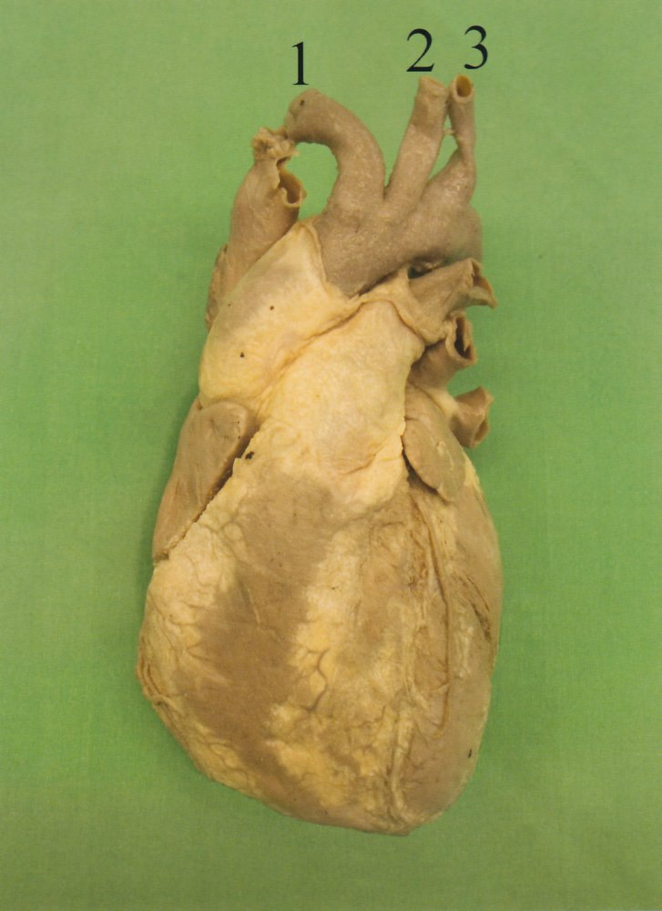

Heart and adjacent large vessels

Anatomy of the heart and adjacent large vessels

Anatomy of the heart, aorta, trachea, and esophagus

### Heart chambers

#### Two atria

Separated by the interatrial septum (The fossa ovalis is visible on the septum as a small oval-shaped <u>depression</u> in the <u>interatrial septum</u>.)

* Right atrium

* Receives deoxygenated blood via the <u>superior vena cava</u> (<u>SVC</u>), <u>inferior vena cava</u> (<u>IVC</u>), and the <u>coronary veins</u>

* Pumps deoxygenated blood into the <u>right ventricle</u>

* Right auricle (<u>right atrial appendage</u>)

* Muscular pouch that acts to increase the capacity of the <u>atrium</u>

* Located close to the <u>ascending aorta</u>

* Separated from the <u>atrium</u> by the terminal sulcus (sulcus terminalis) and terminal crest (crista terminalis).

* Cavotricuspid isthmus, a region of fibrous tissue between the opening of the <u>inferior vena cava</u> and the <u>tricuspid valve</u>, is a common location of the re-entry circuit in <u>atrial flutter</u>.

* Common site for the development of <u>thrombi</u> in patients with <u>atrial fibrillation</u>

* Left atrium

* Receives oxygenated blood from the four <u>pulmonary veins</u>

* Pumps oxygenated blood into the <u>left ventricle</u> to enter the <u>systemic circulation</u>

* Left auricle (<u>left atrial appendage</u>)

* Muscular pouch that acts to increase the capacity of the <u>atrium</u>

* Extends from superior aspect of the chamber in close proximity to the root of the <u>pulmonary trunk</u>

* Common site for the development of <u>thrombi</u> in patients with <u>atrial fibrillation</u>

### Two ventricles of the heart

* Right ventricle

* Receives deoxygenated blood from the <u>right atrium</u>

* Pumps deoxygenated blood into the <u>pulmonary trunk</u> as part of the <u>pulmonary circulation</u>

* Moderator band: a muscular structure located in the <u>right ventricle</u> that extends from the base of the <u>anterior</u> <u>papillary muscle</u> to the ventricular septum; acts as part of the electrical conduction pathway

* Left ventricle

* Receives oxygenated blood from the <u>left atrium</u>

* Pumps oxygenated blood into the aorta via the left ventricular outflow tract as part of the <u>systemic circulation</u>

Anatomy of the heart and adjacent large vessels

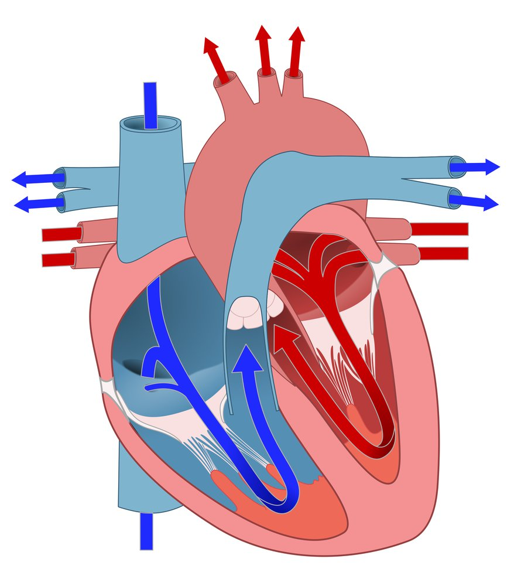

Blood flow through the heart

### Cardiac borders

* Frontal view

* Right border is formed by the <u>right atrium</u>

* Left border is formed by the <u>left ventricle</u> and <u>left atrial appendage</u>

* Inferior border is formed by the <u>right ventricle</u>

* Superior border is formed by the <u>atria</u> and great vessels

* <u>Lateral</u> view

* <u>Anterior</u> border is formed by the <u>right ventricle</u>

* <u>Posterior</u> border is formed by the <u>left atrium</u> and <u>left ventricle</u>

> [!NOTE]
> The cardiac borders form the cardiac silhouette on chest <u>x-ray</u>.

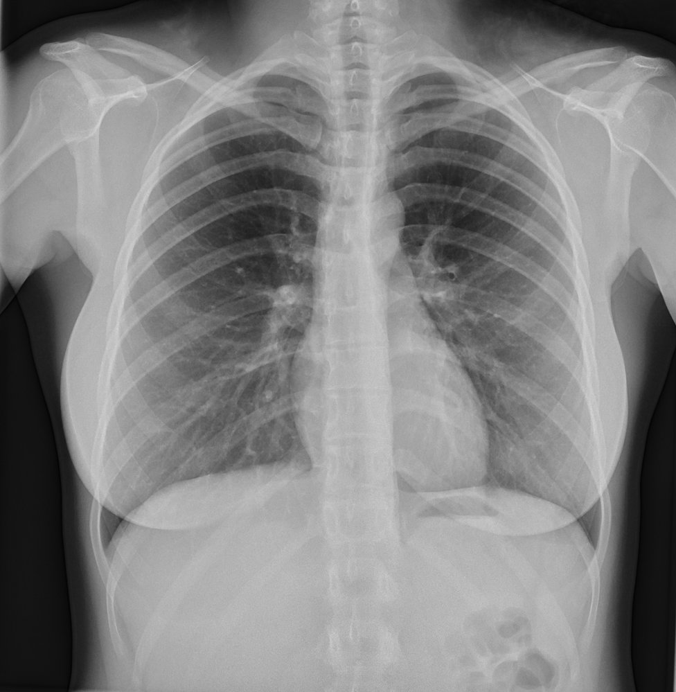

Normal posteroanterior (PA) chest radiograph

### Heart valves

* Two types of cardiac valves that differ in location and morphology

* Cardiac skeleton 

* Consists of four fibrous rings (annuli fibrosi <u>cordis</u>)  that surround the atrioventricular and arterial orifices

* Function

* Separates <u>atria</u> and ventricles

* Provides anchor and structural support for the valves

* Provides electrical insulation layer between <u>atria</u> and ventricles

* Closure of <u>heart valves</u> produces <u>heart sounds</u> (See <u>auscultation of the heart</u> in <u>cardiovascular examination</u> for details.)

> [!NOTE]
> “Try <u>PUL</u>ling My AORTA“: Tricuspidal, Pulmonary, Mitral, Aortic is the order in which blood flows through the <u>heart valves</u>.

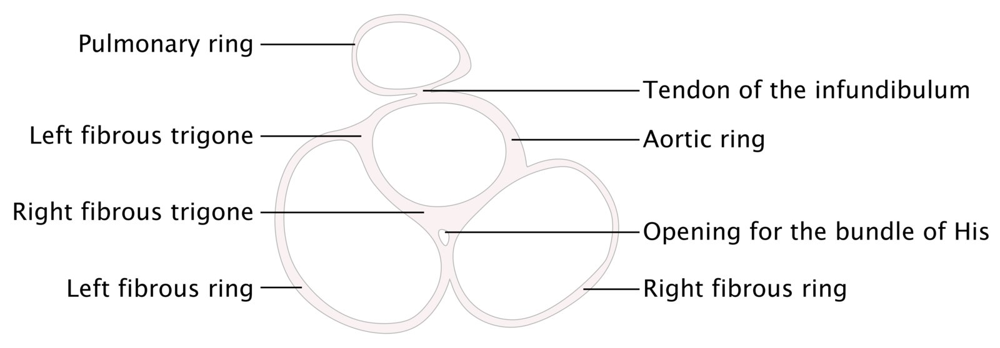

Overview of the cardiac skeleton

#### Atrioventricular valves

* Structure: leaflets supported by subvalvular apparatus

* Valves

* Tricuspid valve

* Consists of three leaflets

* Located between <u>right atrium</u> and <u>right ventricle</u>

* Mitral valve (<u>bicuspid valve</u>)

* Consists of two leaflets

* Located between <u>left atrium</u> and <u>left ventricle</u>

* Subvalvular apparatus

* Chordae tendineae: fibrous cords that support the <u>AV valves</u> and connect them to the <u>papillary muscles</u>

* Papillary muscles (two in the <u>left ventricle</u>; three in the <u>right ventricle</u>)

* Derive from the <u>myocardium</u>

* Extend from the <u>anterior</u> and <u>posterior</u> ventricular walls and the septum

* Have apices that are attached to the <u>chordae tendineae</u>

* Contract during <u>systole</u> and thereby tighten the <u>chordae tendineae</u>: prevent prolapse of valve leaflets and <u>regurgitation</u> into the <u>atria</u> when pressure rises during ventricular contraction

> [!NOTE]
> The tricuspid valve has three leaflets and is located on the right side, as is the three-lobed right <u>lung</u>. The bicuspid (mitral) valve has two leaflets and is located on the left side, as is the two-lobed left <u>lung</u>.

#### Semilunar valves

* Structure: three crescent-shaped cusps without subvalvular apparatus

* Valves

* Pulmonary valve: located between <u>right ventricle</u> and <u>pulmonary trunk</u>

* Aortic valve

* Located between <u>left ventricle</u> and aorta

* Consists of three leaflets and the aortic sinuses (a space immediately above the <u>aortic valve</u>, between an <u>aortic valve</u> leaflet and the wall of the <u>ascending aorta</u>)

* There are three <u>aortic sinuses</u> (one above each aortic leaflet): the left, right, and <u>posterior</u> <u>aortic sinuses</u>.

* The left and right <u>aortic sinus</u> give rise to the left and <u>right coronary artery</u>.

* The three <u>aortic sinuses</u> together with the <u>aortic valve</u> leaflets form a dilation of the root of the aorta called the aortic bulb.

Anatomy of the heart and adjacent large vessels

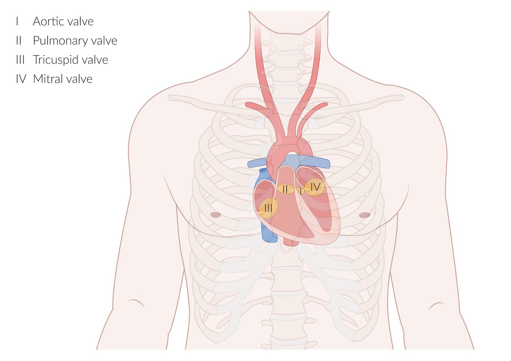

Location of heart valves

Anatomical locations and auscultatory sites for heart valves

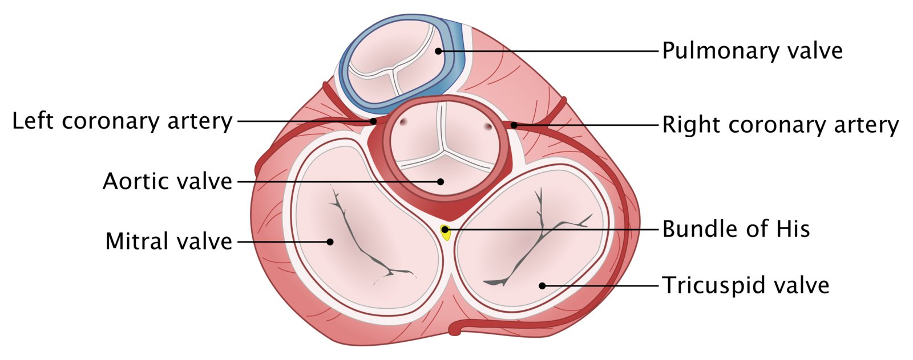

Valve plane of the heart

### Coronary arteries

* The left and right <u>coronary arteries</u> arise from the root of the aorta and supply the <u>heart muscle</u> with arterial blood.

* Coronary arterial dominance 

* Right-dominant (∼ 85% of the population): <u>posterior descending artery</u> (<u>PDA</u>) supplied by the <u>RCA</u>

* Left-dominant (∼ 8% of the population): <u>PDA</u> supplied by the <u>left circumflex artery</u> (<u>LCX</u>)

* <u>Codominant</u> (balanced; ∼ 7% of people): <u>PDA</u> supplied by both <u>RCA</u> and <u>LCX</u>

* Coronary blood flow peaks during early <u>diastole</u> at a point when the pressure differential between the aorta and the ventricle is the greatest (see <u>left ventricular</u> <u>pressure-volume diagram</u>.)

| <u>Coronary arteries</u> |  |  |  |
| --- | --- | --- | --- |
|  | Source | Important branches | Territory |
|  Left coronary artery (<u>LCA</u>)   |  * Arises from left <u>aortic sinus</u> of <u>ascending aorta</u>   |  * Left anterior descending artery (<u>LAD</u>, <u>LADA</u>): descends between right and left ventricles on <u>anterior</u> surface of heart (in the <u>anterior</u> interventricular sulcus) towards cardiac apex → gives off several diagonal branches on its course   |   * > 50% of <u>left atrium</u> and ventricle  * <u>Anterior</u> aspect of the <u>left ventricle</u>  * <u>Anterior</u> ⅔ of the interventricular septum  * Anterolateral <u>papillary muscle</u> (also receives blood from the <u>LCX</u>)  * Cardiac apex    |
|  * Left circumflex artery (<u>LCX</u>): courses left around the heart in the coronary sulcus towards the <u>posterior</u> aspect, ending before the <u>posterior</u> interventricular sulcus → gives off left marginal <u>artery</u>   |   * Posterolateral <u>left atrium</u> and ventricle  * Anterolateral <u>papillary muscle</u> (also receives blood from the <u>LAD</u>)  * In 40% of the population: <u>SA node</u>  * In left-dominant and <u>codominant</u> circulation (15% of the population): gives rise to the <u>PDA</u> to supply the <u>posterior</u> ⅓ of the interventricular septum, posteroinferior aspect of the heart, and posteromedial <u>papillary muscle</u>    |  |  |
|  Right coronary artery (<u>RCA</u>)   |  * Arises from right <u>aortic sinus</u> of the <u>ascending aorta</u>   |  * Various branches   |  * Majority of <u>right atrium</u> and ventricle   |
|  * Right marginal artery: courses along the diaphragmatic border (acute margin) of the heart   |  * <u>Lateral</u> <u>right ventricle</u> and cardiac apex   |  |  |
|  * Posterior descending artery (PDA): descends between right and left ventricles on <u>posterior</u> surface of heart (in the <u>posterior</u> interventricular sulcus) towards cardiac apex * Can also originate from the <u>LCX</u> OR <u>LCX</u> and <u>RCA</u> (in left-dominant and <u>codominant</u> circulation, respectively)   |   * <u>Posterior</u> ⅓ of the interventricular septum  * Posteroinferior aspect of heart  * Posteromedial <u>papillary muscle</u>    |  |  |
|  * Atrioventricular nodal artery   |   * <u>AV node</u> (in a left dominant circulation, the <u>AV node</u> is supplied by the <u>LCA</u>)  * <u>Bundle of His</u> (minor contribution from the <u>LAD</u>)    |  |  |
|  * Sinoatrial nodal artery   |  * <u>SA node</u>   |  |  |

> [!NOTE]
> The <u>LAD</u> is the most commonly occluded <u>coronary artery</u> and is often referred to as the “widow maker” due to the high <u>mortality rate</u> associated with <u>LAD</u> <u>infarction</u>.

> [!NOTE]
> The <u>RCA</u> usually supplies the heart's <u>conduction system</u> (sinus and <u>AV node</u>) so that stenosis or occlusion of this vessel often leads to <u>cardiac arrhythmias</u>.

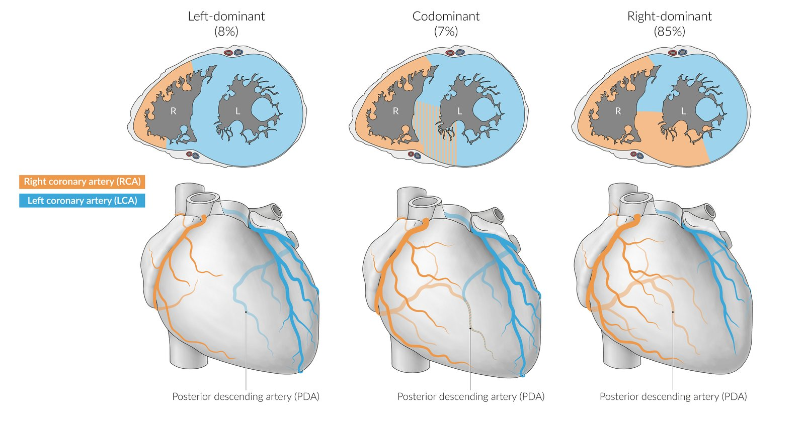

Coronary arterial dominance

Coronary arteries

Illustration of the coronary arteries

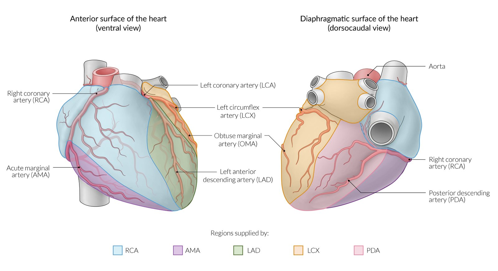

Coronary blood supply

#### Venous drainage

* Coronary sinus

* Largest <u>vein</u> of the heart, into which all other <u>coronary veins</u> drain

* Lies in the left <u>posterior</u> atrioventricular groove

* Drains into the <u>right atrium</u> between the <u>IVC</u> orifice and the right atrioventricular orifice

* <u>Veins draining into coronary sinus</u> (coronary veins):

* Left side of the heart: great cardiac <u>vein</u> and <u>posterior</u> cardiac <u>vein</u>(s)

* Right side of the heart: small cardiac <u>vein</u> and middle cardiac <u>vein</u>

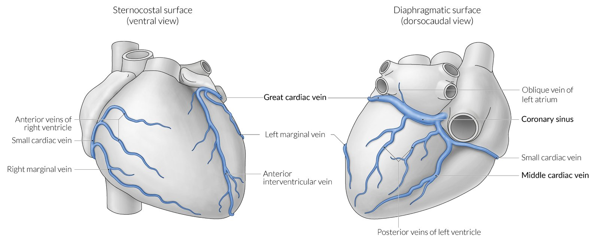

Coronary veins

### <u>Lymphatics</u>

The lymphatics of the heart drain into the <u>anterior</u> <u>mediastinal</u> nodes and the tracheobronchial nodes.

### Innervation

| Innervation of the heart |  |  |
| --- | --- | --- |
| Nervous system | Nerves | Function |
| Somatic nervous system |  * <u>Phrenic nerve</u>   |  * Sensory innervation of the <u>pericardium</u>   |
|  <u>Sympathetic nervous system</u>  |  * Cardiac plexus   |   * ↑ Heart rate (positive <u>chronotropy</u>)  * ↑ Contractility (positive <u>inotropy</u>)  * ↑ Conduction <u>velocity</u> (positive <u>dromotropy</u>)  * <u>Coronary artery</u> dilation    |
|  <u>Parasympathetic</u> nervous system  |  * <u>Vagal nerve</u>   |   * ↓ <u>Heart rate</u> (negative <u>chronotropy</u>)  * ↓ Contractility (negative <u>inotropy</u>)  * ↓ Conduction <u>velocity</u> (negative <u>dromotropy</u>)    |

#### Structures of cardiac conduction system

* Definition: collection of nodes and specialized conduction cells that initiate and coordinate contraction of the <u>heart muscle</u>.

* Components

* <u>Sinoatrial node</u> (<u>SA node</u>): in the upper wall of the <u>right atrium</u> (at the junction where the <u>SVC</u> enters)

* <u>Atrioventricular node</u> (<u>AV node</u>): within the AV septum (superior and <u>medial</u> to the opening of the <u>coronary sinus</u> in the <u>right atrium</u>)

* <u>Atrioventricular bundle</u> (<u>bundle of His</u>): directly below the <u>cardiac skeleton</u> within the membranous part of the interventricular septum

* <u>Purkinje fibers</u> (modified <u>myocytes</u>): terminal conducting fibers in the subendocardium

See “<u>Conducting system of the heart</u>“ in “<u>Cardiac physiology</u>“ for more details.

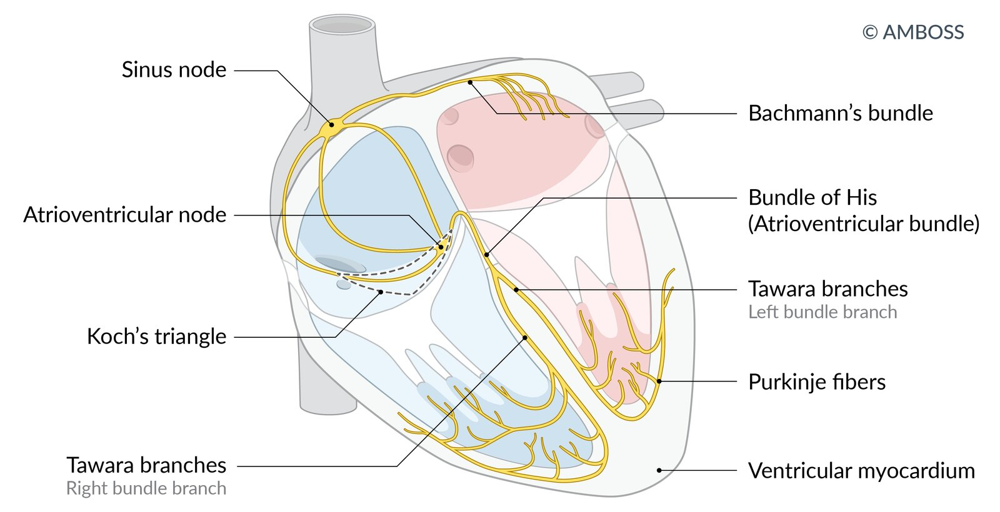

Cardiac conduction pathway

Cardiac action potentials

References:[[1]](https://coursology-qbank.com/amboss/article/akYQm6)

---

## Microscopic anatomy

### Layers of the heart

* The heart wall itself consists of three layers (from inside to outside):

* <u>Endocardium</u>

* <u>Myocardium</u>

* <u>Epicardium</u>: <u>connective tissue</u> layer attached to the outside of the <u>myocardium</u>, i.e., <u>visceral</u> layer of serous <u>pericardium</u>

* <u>Pericardium</u>: membrane that directly surrounds the heart

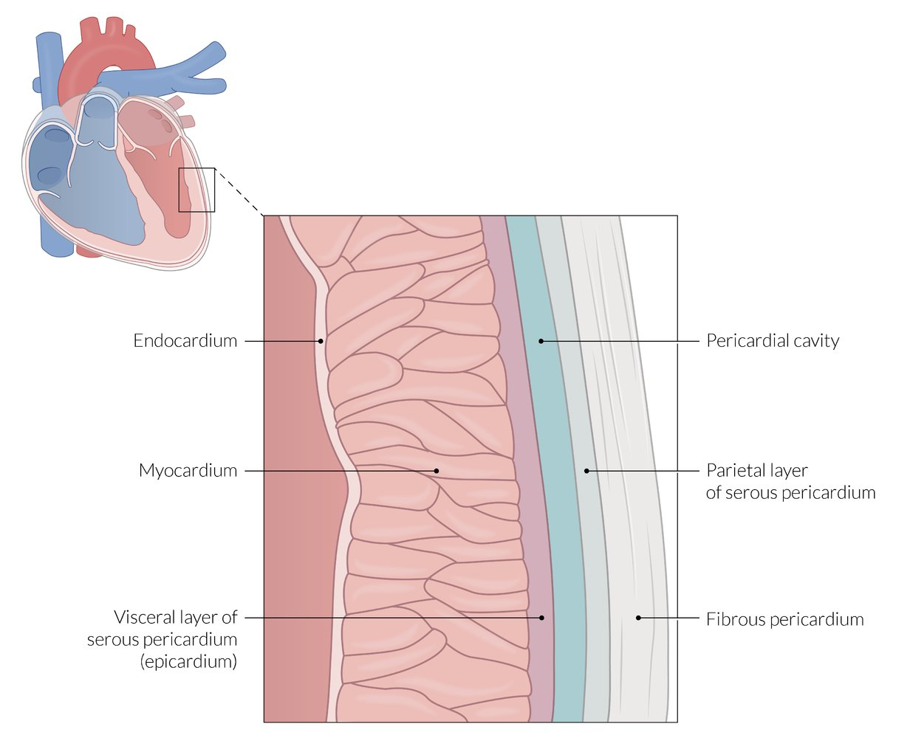

Layers of the heart

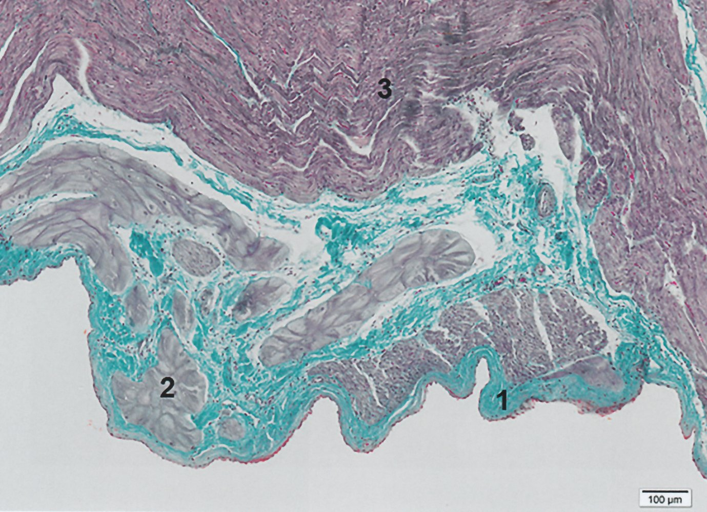

Microscopic anatomy of the heart

#### Endocardium

* Description: innermost layer of heart tissue, consisting of the following three sublayers:

* <u>Endothelium</u> (innermost): simple <u>squamous epithelium</u>

* A layer of <u>loose connective tissue</u>

* Subendocardium (outermost): <u>loose connective tissue</u> containing

* Cardiac Purkinje cells

* Specialized/modified <u>cardiomyocytes</u> that are part of the <u>conducting system of the heart</u>

* Contain fewer contractile <u>myofibrils</u> and more <u>mitochondria</u>, <u>glycogen</u>, and <u>gap junctions</u> than normal <u>cardiomyocytes</u>.

* <u>Veins</u> and nerves

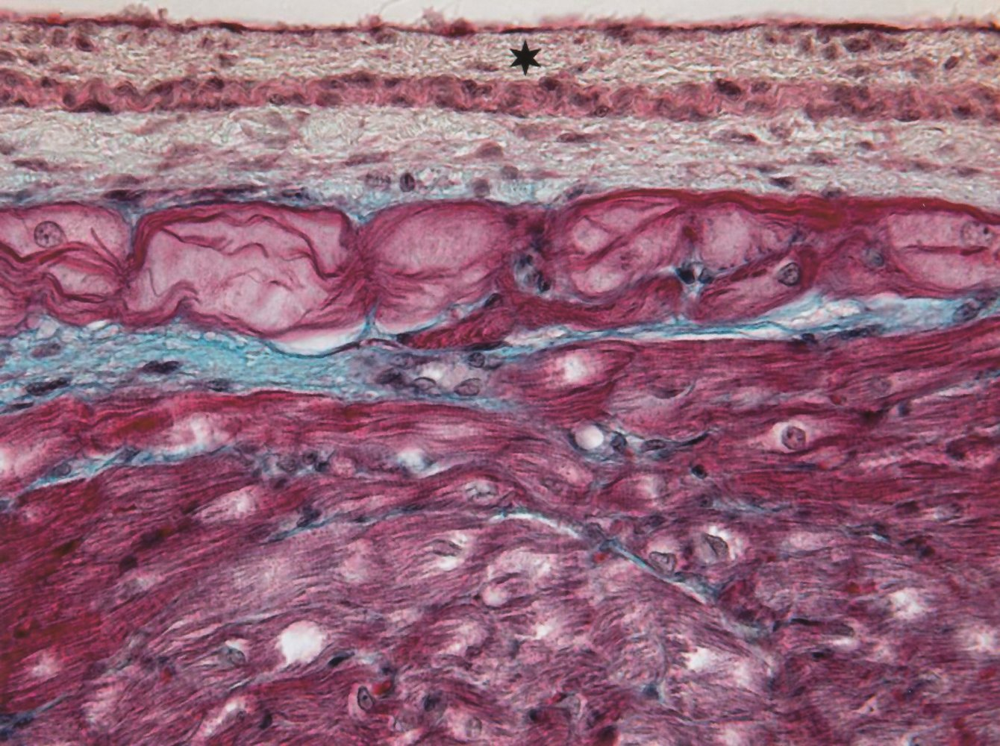

Endocardium and subendocardial tissue

#### Myocardium

* Description: thick <u>myocardial</u> layer composed of the following:

* Cardiomyocytes: <u>striated muscle</u> cells containing a single, centrally located <u>nucleus</u>  

* Contain many <u>mitochondria</u>, which produce <u>ATP</u> for contraction.

* <u>Myofibrils</u> within <u>cardiomyocytes</u> are organized into <u>sarcomeres</u> (smallest functional contractile unit of <u>cardiac muscle</u>).

* Connected by intercalated discs to form long fibers.

* <u>Intercalated discs</u> connect individual <u>cardiomyocytes</u> into a <u>functional syncytium</u> and force transmission during muscle contraction.

* They contain adherent junctions (transmit mechanical stimuli) and <u>gap junctions</u> (transmit electrical stimuli)

* They appear as slightly darker-staining lines between <u>cardiac muscle cells</u> under <u>light microscopy</u> and <u>electron microscopy</u>.

* See also ”<u>Cardiac muscle</u>” in the article on <u>muscle tissue</u>.

* Atrial <u>cardiomyocytes</u> release <u>atrial natriuretic peptide</u> (<u>ANP</u>) when stretched (i.e., at higher BPs) → ↑ water and <u>sodium</u> excretion by the <u>kidneys</u> → ↓ BP

* <u>Fibroblasts</u> (these become <u>myofibroblasts</u> after injury)

* <u>Extracellular matrix</u>: <u>collagen</u>, <u>elastin</u>, and <u>glycosaminoglycans</u>

> [!NOTE]
> Damaged <u>myocardial</u> tissue is replaced by noncontractile <u>scar</u> tissue (<u>fibrosis</u>) that does not conduct electrical impulses well and, thus, predisposes to <u>cardiac arrhythmias</u>.

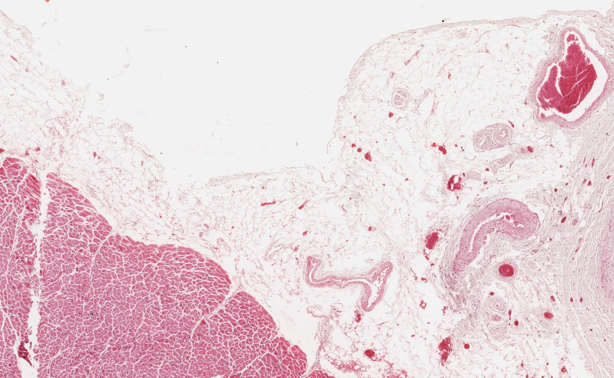

Myocardium and epicardium

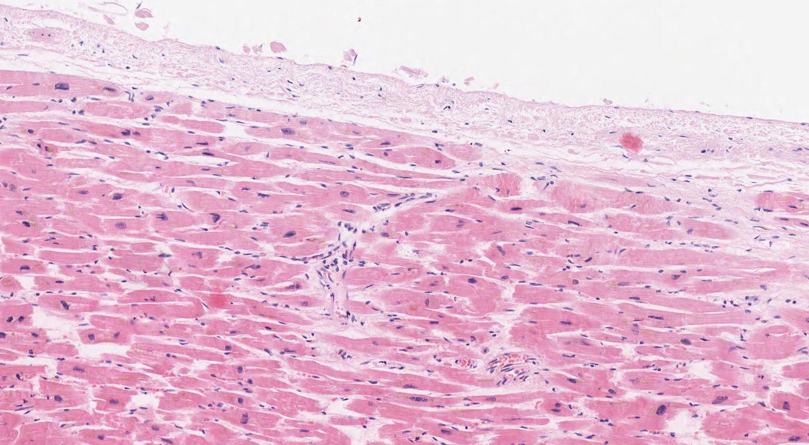

Cardiac muscle

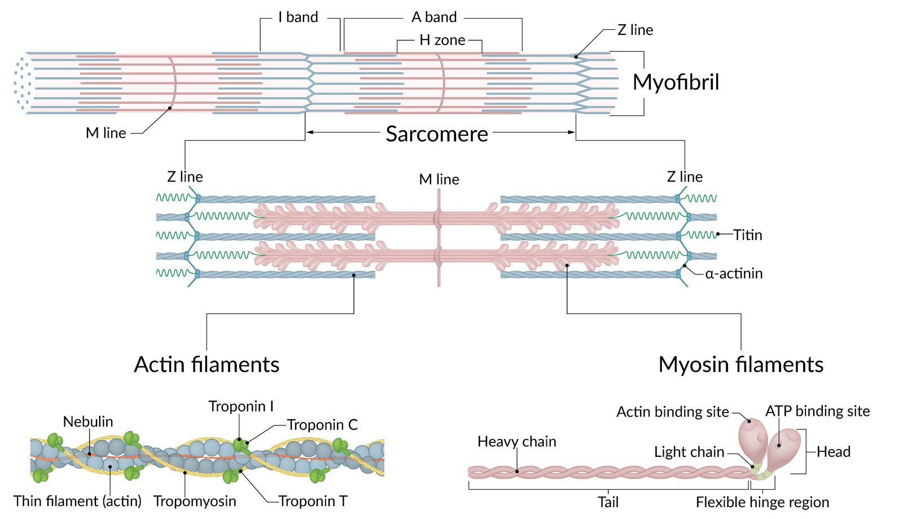

Overview of the sarcomere and myofilaments

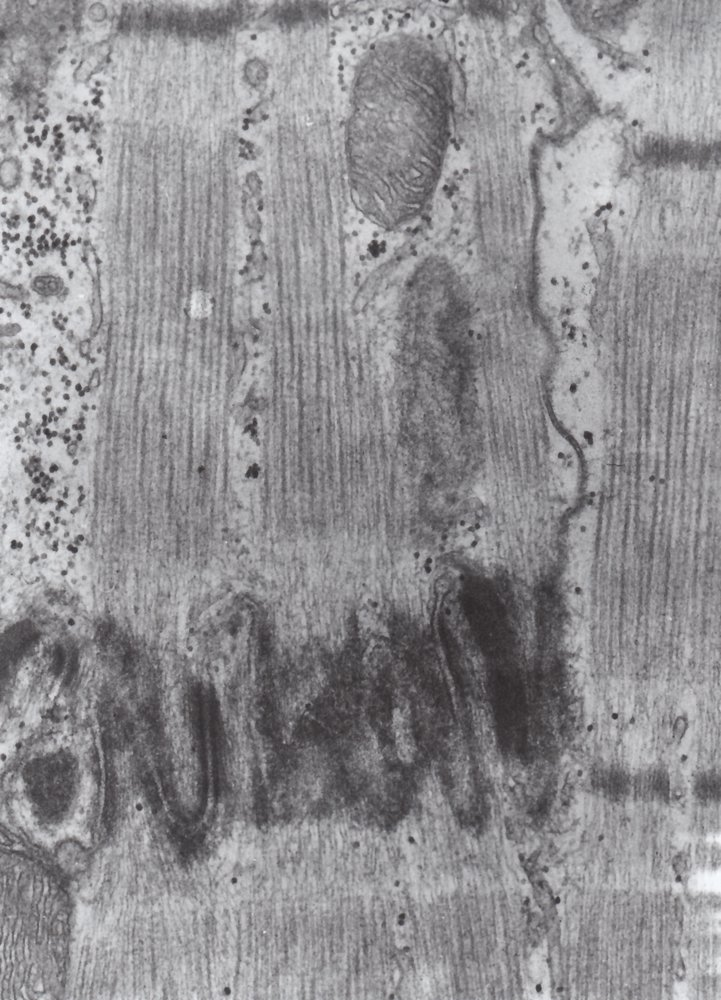

Cell junction between two cardiomyocytes

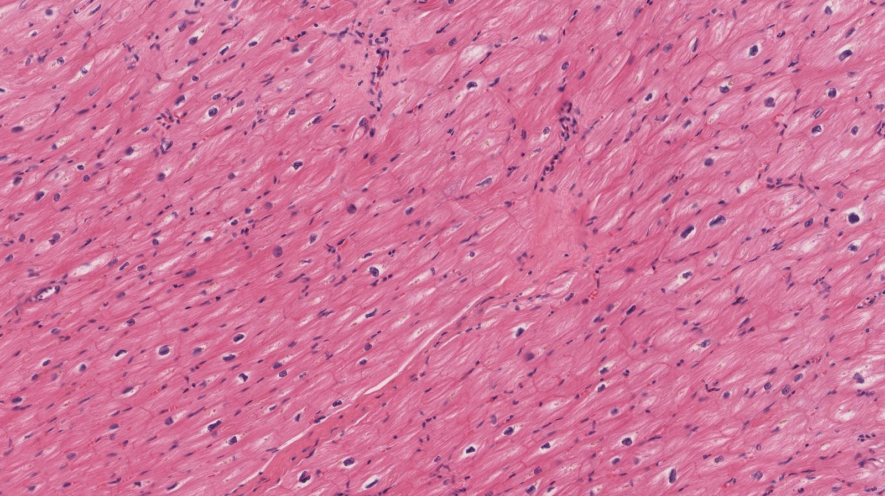

Intercalated discs of cardiac muscle

#### Pericardium

* Description

* Fibroserous sac enclosing the heart

* Defines the <u>pericardial cavity</u>

* <u>Pericardial</u> layers

* Serous <u>pericardium</u> (innermost)

* <u>Visceral</u> layer of serous <u>pericardium</u> (epicardium)

* Outermost layer of the heart wall

* Separated from the parietal layer of the serous <u>pericardium</u> by the <u>pericardial cavity</u>.

* Secretes lubricating serous fluid into the <u>pericardial cavity</u>

* Contains <u>blood vessels</u>, <u>lymphatics</u>, and <u>adipose tissue</u>

* Parietal layer of serous <u>pericardium</u>

* Fibrous <u>pericardium</u> (outermost)

* Pericardial cavity: space between the <u>visceral</u> and parietal layers of the serous <u>pericardium</u> that contains serous, <u>pericardial</u> fluid

* Innervation: innervated by the <u>phrenic nerve</u>

> [!NOTE]
> The capacity of the <u>pericardial cavity</u> is limited by the stiff, fibrous <u>pericardium</u>. If fluid abnormally accumulates in the <u>pericardial space</u> (<u>pericardial effusion</u>), intrapericardial pressure increases and may impair cardiac function → <u>pericardial tamponade</u>.

> [!NOTE]
> Because of the sensory innervation of the <u>pericardium</u> by the <u>phrenic nerve</u>, <u>pericarditis</u> can result in <u>referred pain</u> to the neck, arms, or shoulders (often the left side).

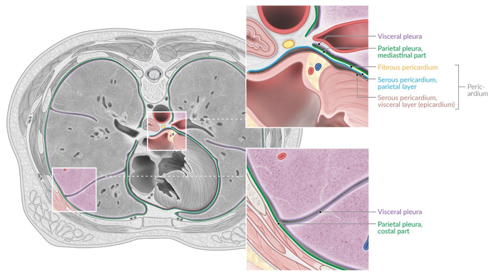

Pleural and pericardial layers (cross-section of the thorax)

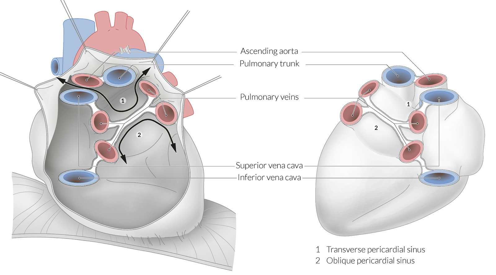

Pericardial layers and sinuses

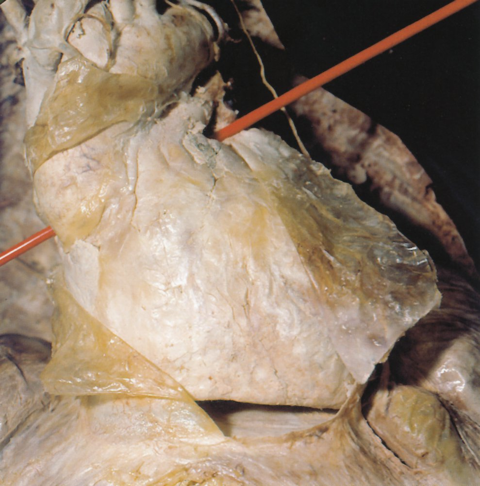

Open pericardium

### Microscopy of the <u>heart valves</u>

* Composed of <u>connective tissue</u> and <u>endocardium</u>

* Mostly vessel-free, with nutrition derived from the surrounding blood (This makes valvular involvement in <u>endocarditis</u> difficult to treat because both the cells of the <u>immune system</u> and <u>antibiotics</u> typically reach sites of infection via the <u>circulatory system</u>.)

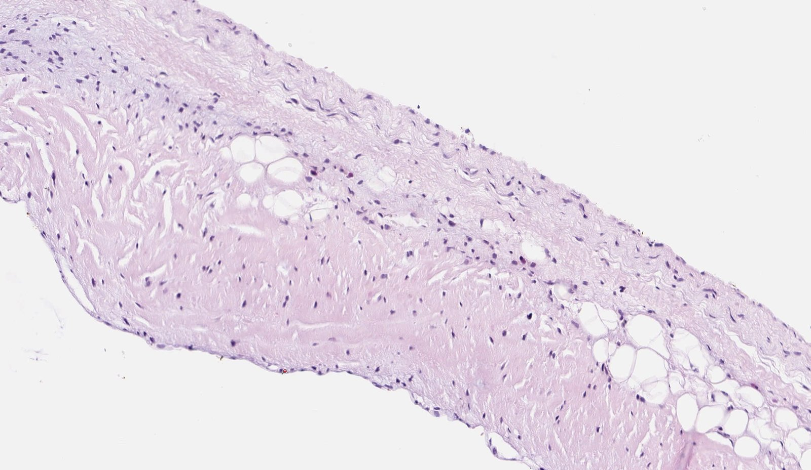

Fine structure of a semilunar heart valve

References:[[2]](https://coursology-qbank.com/amboss/article/XkY9m6)

---

## Embryology

### Overview

* Mesodermal origin

* <u>Mesoderm</u> → <u>myocardium</u>

* <u>Mesoderm</u> → <u>mesothelium</u> → <u>pericardium</u>

* <u>Mesoderm</u> → <u>endothelium</u> → <u>endocardium</u>, <u>blood vessels</u>, <u>lymphatics</u>

* Steps of heart development
1. * Two single endocardial tubes merge to form the heart tube.
2. * The straight heart tube transforms into an S-shaped heart loop.
3. * <u>Endocardial cushions</u> grow towards each other and fuse to separate the <u>atria</u> and ventricles.
4. * Two <u>atria</u> and two ventricles form and one common outflow tract divides into an aortic trunk and a <u>pulmonary trunk</u>.
5. * Valves form from the <u>endocardial cushion</u>.

* <u>Fetal circulation</u> is covered in the corresponding section of <u>prenatal and postnatal physiology</u>.

* Postnatal derivatives of fetal vascular structures are covered in the section on postnatal adaptation of the circulatory and respiratory system in the <u>prenatal and postnatal physiology</u> article.

| Overview of embryonic structures of the heart |  |  |
| --- | --- | --- |
| Embryonic structures | Details | Give rise to |
| Endocardial cushions | Two protuberances located on the <u>dorsal</u> and <u>ventral</u> inner surfaces of the primitive heart tube | Atrial septum, interventricular septum, and <u>heart valves</u> |
| Primitive atrium | A single cavity separated from the ventricular cavity by the <u>endocardial cushion</u>  | Trabeculated portions of the <u>atria</u> |
| Primitive ventricle | A single cavity separated from the atrial cavity by the <u>endocardial cushion</u>  | Trabeculated portions of ventricles |
| Primitive pulmonary vein | Forms from a pouch in the <u>dorsal</u> wall of the primitive <u>left atrium</u>  | Smooth portion of the <u>left atrium</u> |
| Sinus venosus | Cavity at the <u>caudal</u> end of the embryonic heart tube in which the <u>veins</u> from the embryonic circulatory arcs unite | Right horn of the <u>sinus venosus</u> gives rise to the smooth part of the <u>right atrium</u> (sinus venarum) and the left horn to the <u>coronary sinus</u> |
| Bulbus cordis | Connects the <u>primitive ventricle</u> to the <u>truncus arteriosus</u>  | Left and <u>right ventricular</u> outflow tracts |
| Truncus arteriosus | A single arterial trunk that originates from both ventricles of the embryonic heart | <u>Ascending aorta</u> and <u>pulmonary trunk</u> |
| <u>Posterior</u>, subcardinal, and supracardinal <u>veins</u> |  <u>Veins</u> of primitive <u>cardiovascular system</u> in the embryo that empty into the <u>sinus venosus</u>  | <u>Inferior vena cava</u> |
| Right common cardinal <u>vein</u> and right <u>anterior</u> cardinal <u>vein</u> | <u>Superior vena cava</u> |  |

> [!NOTE]
> <u>Persistent truncus arteriosus</u> is a <u>congenital heart disease</u> in which the <u>truncus arteriosus</u> fails to divide into the aorta and <u>pulmonary artery</u> before <u>birth</u>.

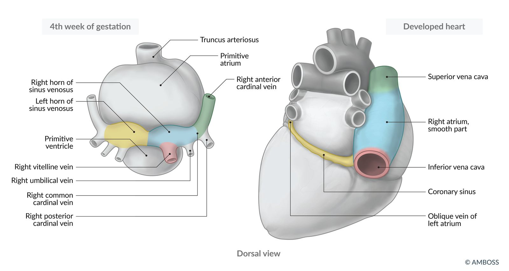

Heart development: development of the inflow tract

### Cardiac morphogenesis

* <u>Ectopia cordis</u> [[3]](https://coursology-qbank.com/amboss/article/pibLst)

* See “<u>Acyanotic congenital heart defects</u>“ and “<u>Cyanotic heart defects</u>“ for associated heart defects.

#### Cardiac looping

Week 4 of <u>gestation</u>: looping of the primary heart tube establishes left-right polarity

> [!NOTE]
> The heart begins to beat spontaneously by week 4 of <u>gestation</u> and is detectable via <u>transvaginal ultrasound</u> by week 6 of <u>gestation</u>.

> [!NOTE]
> A defect in <u>cardiac looping</u> is caused by a defect in the dynein arm of <u>microtubules</u> and results in <u>Kartagener syndrome</u> with <u>situs inversus</u> and dextrocardia. See primary dyskinesia for details.

#### Chamber septation

##### Atrial septation

1. * Development of the <u>septum primum</u> and <u>foramen primum</u>

* Initially, the two <u>atria</u> communicate via the foramen primum.

* The septum primum, located cranially, grows <u>caudally</u> towards the <u>dorsal</u> <u>endocardial cushion</u>.
2. * Narrowing of the <u>foramen primum</u> occurs as the <u>septum primum</u> grows towards the <u>endocardial cushion</u>.
3. * Development of the foramen secundum

* Before fusion of the <u>septum primum</u> with the <u>endocardial cushion</u> is complete, an opening appears in the <u>cranial</u> end of the <u>septum primum</u>, known as the <u>foramen secundum</u>, through which interatrial communication continues.

* Ensures right-to-left shunting of the blood
4. * Development of the septum secundum
* A second muscular septum begins to grow on the right side of the <u>septum primum</u> in two segments:

* The superior part grows <u>caudally</u> from the roof of the primitive <u>right atrium</u>.

* The inferior part grows cranially from the <u>endocardial cushion</u>.
5. * Development of the <u>foramen ovale cordis</u>

* The space between the two parts of the <u>septum secundum</u> is known as the foramen ovale.

* The superior portion of the <u>septum primum</u> regresses.

* The inferior portion of the <u>septum primum</u> persists and acts as a one-way valve, allowing blood to flow from the <u>right atrium</u> into the <u>left atrium</u>.
6. * Formation of the atrial septum (no further interatrial communication)

* <u>Closure of the foramen ovale</u> occurs shortly after <u>birth</u>, when the left atrial pressure increases (due to loss of low resistance <u>placental</u> circulation) and the <u>right atrial pressure</u> decreases (due to increased <u>pulmonary circulation</u> upon <u>lung</u> inflation).

* The <u>septum secundum</u> completely fuses with the remnant of the <u>septum primum</u> to form the atrial septum during <u>infancy</u>.

> [!NOTE]
> If the <u>septum primum</u> and <u>septum secundum</u> fail to fuse after <u>birth</u>, a <u>patent foramen ovale</u> (<u>PFO</u>) remains. Later in life, a <u>PFO</u> can result in a <u>paradoxical embolus</u>, in which a <u>venous thrombus</u> may travel via the <u>PFO</u> from the venous to the arterial circulation and cause end-organ <u>infarction</u> (e.g., <u>stroke</u>).

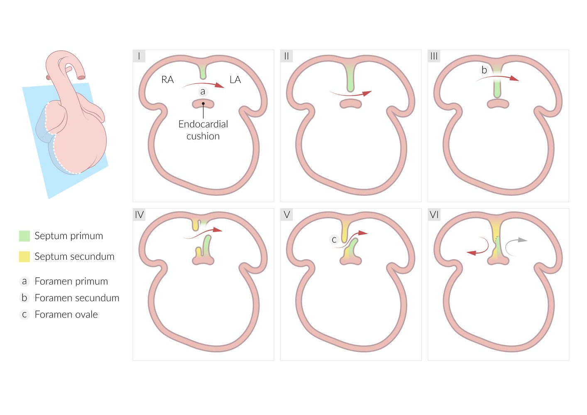

Atrial septation

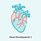

Heart Development - Atrial septation

##### Ventricular septation

1. * A <u>caudally</u> located muscular interventricular septum forms with an <u>interventricular foramen</u> between the two ventricles.
2. * The cranially developing <u>aorticopulmonary septum</u> rotates and <u>caudally</u> fuses with the <u>muscular interventricular septum</u>, and this fusion forms the membranous interventricular septum and closes the <u>interventricular foramen (heart)</u>.
3. * <u>Endocardial cushions</u> grow to further separate the ventricles and the <u>atria</u>.

> [!NOTE]
> Abnormal development of the <u>membranous interventricular septum</u> results in a <u>ventricular septal defect</u>, the most common congenital cardiac anomaly.

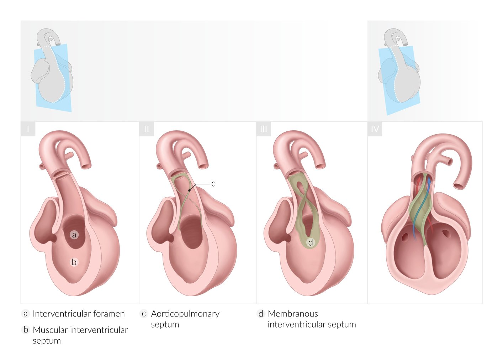

Ventricular septation

Heart Development - Septation of the Outflow Tract and Ventricles

#### Development of the outflow tract

* Sequence of events
1. * Development of the aorticopulmonary septum (<u>AP septum</u>)

* <u>Neural crest</u> and endocardial cells migrate to form truncal ridges and bulbar ridges from the <u>truncus arteriosus</u> and <u>bulbus cordis</u>, respectively.

* Truncal and <u>bulbar ridges</u> spiral and fuse to form the <u>AP septum</u>.
2. * Division of the ventricular outflow tract
* The <u>aorticopulmonary septum</u> fuses and rotates 180°, dividing the outflow tract into the aorta (from the <u>left ventricle</u>) and <u>pulmonary trunk</u> (from the <u>right ventricle</u>).

* Associated <u>conotruncal abnormalities</u> 

* Failure to spiral: <u>transposition of the great vessels</u>

* Malaligned <u>AP septum</u>: <u>tetralogy of Fallot</u>

* Partial <u>AP septum</u> development: <u>persistent truncus arteriosus</u>

#### Valve formation

| Overview of valve formation |  |  |
| --- | --- | --- |
| Stage | Embryonic origin | Structures |
| Development of <u>semilunar valves</u> |  * <u>Endocardial cushions</u> of outflow tract   |   * <u>Aortic valve</u>  * <u>Pulmonary valve</u>    |
| Development of <u>atrioventricular valves</u> |  * Fused <u>endocardial cushions</u> of AV canal   |   * <u>Mitral valve</u>  * <u>Tricuspid valve</u>    |

* Defective development of the <u>heart valves</u> can result in:

* Stenotic valves

* Regurgitant valves

* Displaced valves (e.g., <u>Ebstein anomaly</u>)

* <u>Atretic</u> valves (e.g., <u>tricuspid atresia</u>)

* Minor abnormalities (e.g., <u>bicuspid aortic valve</u>)

---

## Clinical significance

* <u>Cardiovascular examination</u>

* <u>Acute coronary syndrome</u>

* <u>Overview of cardiac arrhythmias</u>

* <u>Artificial cardiac pacemaker</u>

* <u>Congestive heart failure</u>

* <u>Cardiac myxoma</u>

* <u>Cardiac tamponade</u>

* <u>Valvular heart diseases</u>

* <u>Myocarditis</u>

* <u>Pericarditis</u>

* <u>Pericardial effusion and cardiac tamponade</u>

* <u>Rheumatic fever</u>

* <u>Infective endocarditis</u>

* <u>Overview of major types of cardiomyopathy</u>

* <u>Cyanotic congenital heart defects</u>

* <u>Acyanotic congenital heart defects</u>

* <u>Aging cardiovascular system</u>

---