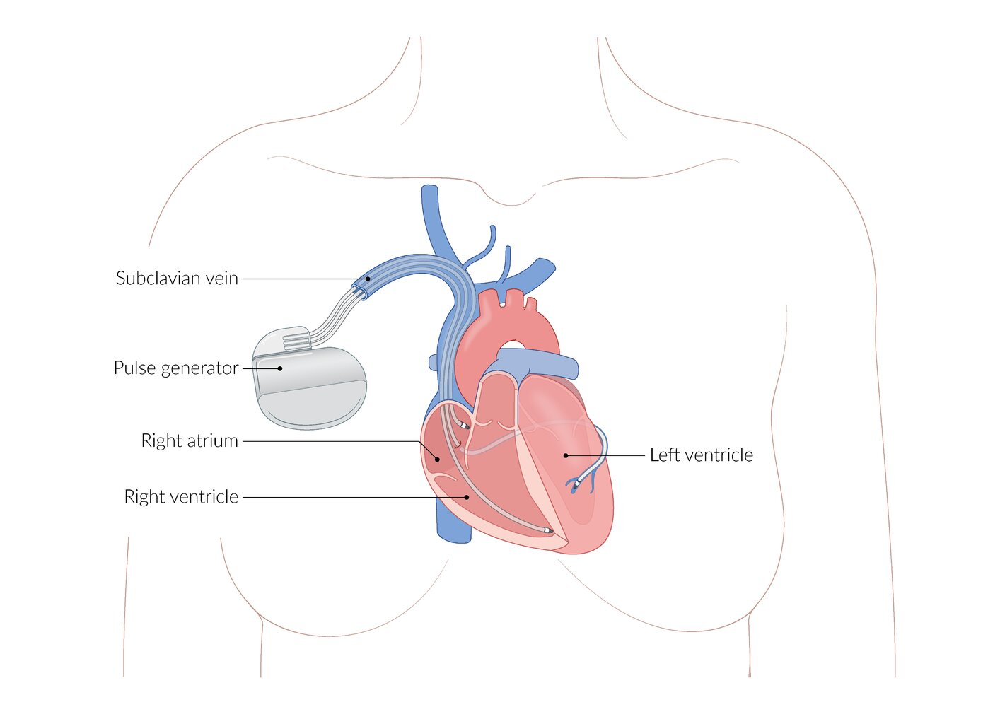
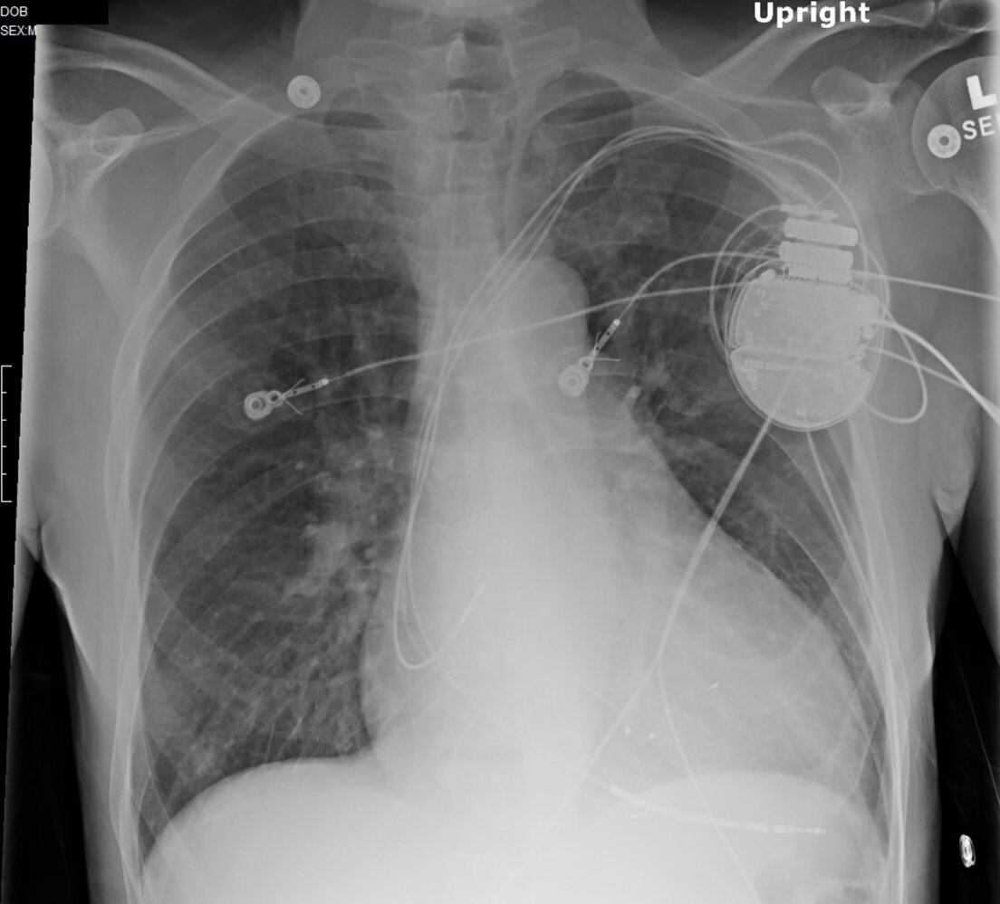

# Cardiac implantable electronic devices

*Categories: Clinical knowledge > Internal medicine > Cardiology and angiology > Heart failure > Cardiac implantable electronic devices*

[Original Article Link](https://coursology-qbank.com/amboss/article/ql0CBT)

---

## Summary

Cardiac implantable electronic devices (CIEDs) are battery-powered medical devices used to treat a variety of cardiac disorders and include <u>permanent pacemakers</u> (PPMs), <u>automated implantable cardioverter defibrillators</u> (<u>AICDs</u>), and <u>cardiac resynchronization therapy</u> devices (<u>CRTs</u>). CIEDs are used to monitor and control <u>arrhythmias</u> (PPMs, <u>AICDs</u>, <u>CRTs</u>) and improve systolic function (<u>CRTs</u>). Complications of CIEDs may result from implantation or device-related malfunctions. Device malfunctions are divided into pacing malfunctions (e.g., <u>oversensing</u>, <u>undersensing</u>) and <u>cardioversion</u> malfunctions (e.g., lack of appropriate shocks, inappropriate shocks). Management of <u>CIED malfunctions</u> typically involves <u>CIED interrogation</u> and treatment of underlying or resulting <u>arrhythmias</u>.

See also “<u>Implantable loop recorders</u>” and “<u>Mechanical circulatory support devices</u>.”

---

## Overview

### Types of CIEDs

* <u>Permanent pacemakers</u> (PPMs): capable of pacing the <u>heart</u> to maintain an adequate <u>heart rate</u> in <u>bradyarrhythmia</u>

* <u>Automated implantable cardioverter defibrillators</u> (<u>AICDs</u>)

* Capable of delivering shocks to terminate <u>ventricular tachyarrhythmia</u>

* Transvenous <u>AICDs</u> are also capable of pacing the <u>heart</u> to maintain an adequate <u>heart rate</u> in <u>bradyarrhythmia</u>.

* <u>Cardiac resynchronization therapy</u> devices (<u>CRTs</u>): capable of pacing both RV and LV to improve <u>cardiac output</u> in <u>heart failure</u> and pace the <u>heart</u> to maintain an adequate <u>heart rate</u> in <u>bradyarrhythmia</u>

* <u>Cardiac resynchronization therapy pacemaker</u> (<u>CRT-P</u>): <u>biventricular pacemaker</u> only

* <u>Cardiac resynchronization therapy defibrillator</u> (<u>CRT-D</u>): <u>biventricular pacemaker</u> and <u>AICD</u>

### Comparison of PPMs, <u>ICDs</u>, and <u>CRTs</u>

| Comparison of PPMs, <u>AICDs</u>, and <u>CRTs</u> |  |  |  |
| --- | --- | --- | --- |
|  | PPMs | <u>AICDs</u> | <u>CRTs</u> |
|  Functions [[1]](https://coursology-qbank.com/amboss/article/AN1Rdh0) |  * <u>Antibradycardia pacing</u>   |   * Subcutaneous <u>AICD</u>: <u>defibrillation</u> (i.e., high-energy unsynchronized shocks)  * Transvenous <u>AICD</u>: <u>defibrillation</u>, <u>synchronized cardioversion</u>, <u>antitachycardia pacing</u>, and <u>antibradycardia pacing</u>    |   * <u>CRT-P</u>: <u>biventricular pacing</u>, <u>antibradycardia pacing</u>  * <u>CRT-D</u>: <u>biventricular pacing</u>, <u>antibradycardia pacing</u>, <u>defibrillation</u>    |
| Basic types |   * Single chamber: usually RV  * Dual chamber: RV and <u>RA</u>    |  |  * Triple chamber: <u>RA</u>, RV, and <u>coronary sinus</u> (adjacent to LV)   |
| Common indications |   * Symptomatic <u>SND</u>  * Symptomatic <u>AV block</u>  * <u>High-risk AV block</u>  * See also “<u>Indications for PPMs</u>.”    |   * Primary prophylaxis: for conditions with increased risk of <u>sudden cardiac death</u>  * Secondary prophylaxis: following <u>ventricular flutter</u> or fibrillation (not associated with <u>myocardial infarction</u>)  * See also “<u>Indications for AICDs</u>.”    |   * Selected patients with <u>heart failure</u>  * See “<u>CRT in HF</u>” for details.    |

---

## Automated implantable cardioverter defibrillators

An <u>AICD</u> (or <u>ICD</u>) is a CIED consisting of a <u>pulse generator</u> and leads that can sense VF and VT and deliver a <u>shock</u> to restore <u>sinus rhythm</u>.

### Types of <u>AICDs</u>

* Transvenous <u>AICD</u>: leads implanted into the <u>right ventricle</u> ± <u>right atrium</u> via the cephalic, axillary, or <u>subclavian vein</u>; multifunction device

* Subcutaneous <u>AICD</u>: subcutaneous lead positioned along the left parasternal margin; single function device  [[7]](https://coursology-qbank.com/amboss/article/BaWz5P0)

* Combined <u>AICD</u> and <u>CRT</u>: See “<u>CRT-D</u>.”

### Functions

Specific functions may vary by device depending on programming and patient needs.

* All <u>AICDs</u>

* Cardiac rhythm monitoring

* Delivery of an <u>electrical shock</u> to the <u>myocardium</u>

* Transvenous <u>AICDs</u>

* <u>Defibrillation</u>

* <u>Synchronized cardioversion</u>

* Antitachycardia pacing: a pacing algorithm that paces the <u>heart</u> faster than the native <u>heart rate</u> to terminate VT without the use of an <u>electrical shock</u>

* <u>Antibradycardia pacing</u>

* Subcutaneous <u>AICDs</u>: <u>defibrillation</u> only

> [!TIP]
> All modern transvenous <u>AICDs</u> are capable of <u>antibradycardia pacing</u> in addition to <u>synchronized cardioversion</u>, <u>defibrillation</u>, and <u>antitachycardia pacing</u>.

### Indications for AICDs [[8]](https://coursology-qbank.com/amboss/article/xBYE17)

The primary goal of <u>AICDs</u> is to prevent <u>sudden cardiac death</u> from <u>ventricular tachyarrhythmias</u>. Consult a cardiologist and/or electrophysiologist and use <u>shared decision-making</u> to determine if an <u>AICD</u> should be implanted, taking the patient's <u>risk factors</u> into account.

#### <u>Primary prevention</u>

Selected patients with an expected survival of > 1 year and any of the following:

* <u>Arrhythmogenic right ventricular cardiomyopathy</u>

* <u>Hypertrophic obstructive cardiomyopathy</u> (see “<u>Treatment of HCM</u>” for details)

* <u>Cardiac channelopathies</u> (e.g., <u>congenital long QT syndrome</u>, <u>Brugada syndrome</u>)

* Severe <u>congestive heart failure</u> (see “<u>AICDs in heart failure</u>” for specific indications) [[9]](https://coursology-qbank.com/amboss/article/-p1DH30)

* Neuromuscular disorders (e.g., <u>Duchenne muscular dystrophy</u>, <u>Becker muscular dystrophy</u>)

* <u>Cardiac sarcoidosis</u>

#### <u>Secondary prevention</u>

All patients with an expected survival of > 1 year, an irreversible cause of <u>ventricular tachyarrhythmias</u>, and any of the following:  [[8]](https://coursology-qbank.com/amboss/article/xBYE17)

* Sudden <u>cardiac arrest</u> (e.g., due to <u>Vfib</u>)

* Unstable VT

* Stable <u>sustained VT</u>

* Inducible VT and/or <u>Vfib</u> on an <u>EP study</u> AND underlying:

* Unexplained <u>syncope</u> and <u>ischemic heart disease</u>

* <u>NSVT</u> due to previous <u>MI</u> or <u>LVEF</u> ≤ 40%

* See “<u>AICD for VT</u>” for more information.

---

## Cardiac resynchronization therapy

A <u>CRT</u> device is a CIED that contains a <u>pulse generator</u> and leads to the <u>atrium</u> and both ventricles that pace the <u>heart</u> in a coordinated manner. Some <u>CRTs</u> also can deliver shocks to restore <u>sinus rhythm</u>.

### Types of <u>CRTs</u>

All <u>CRT</u> devices have leads implanted in the <u>right atrium</u>, <u>right ventricle</u>, and <u>coronary sinus</u>.

* Cardiac resynchronization therapy-pacemaker (<u>CRT-P</u>): <u>biventricular pacemaker</u> only

* Cardiac resynchronization therapy-defibrillator (<u>CRT-D</u>): <u>biventricular pacemaker</u> PLUS an <u>AICD</u>

Biventricular pacemaker

CRT-D

> [!TIP]
> All <u>CRTs</u> are <u>biventricular pacemakers</u>.

### Functions

* All devices

* Cardiac rhythm monitoring

* Biventricular pacing (<u>cardiac resynchronization</u>)

* Electrodes stimulate the right and left ventricles in a coordinated manner to achieve synchronous contractions.

* Improves outcomes in <u>heart failure</u> (see “<u>CRT in HF</u>” for details)

* <u>CRT-P</u>

* <u>Antibradycardia pacing</u>

* <u>Cardiac resynchronization</u>

* <u>CRT-D</u>

* <u>Antibradycardia pacing</u>

* <u>Cardiac resynchronization</u>

* <u>Defibrillation</u>

### Indication for <u>CRTs</u>

* Indicated in patients with <u>congestive heart failure</u> who meet certain criteria, e.g., <u>LVEF</u> ≤ 35% and a <u>wide QRS complex</u> [[9]](https://coursology-qbank.com/amboss/article/-p1DH30)

* See “<u>CRT in HF</u>” for detailed indications.

---