# Heart failure

*Categories: Clinical knowledge > Internal medicine > Cardiology and angiology > Heart failure > Heart failure*

[Original Article Link](https://coursology-qbank.com/amboss/article/rS0faf)

---

## Summary

<u>Heart</u> failure (HF) is a complex clinical syndrome caused by structural or functional impairment of <u>ventricular filling</u> and/or ejection of blood. The three main underlying <u>causes of HF</u> are <u>coronary artery disease</u>, <u>diabetes mellitus</u>, and <u>hypertension</u>; <u>incidence</u> increases with age. Typical clinical features include <u>dyspnea</u> and <u>peripheral edema</u>. The initial diagnostic workup includes measurement of <u>natriuretic peptide</u> levels, <u>echocardiography</u>, <u>chest x-ray</u>, and an <u>ECG</u>. Classification of patients based on <u>left ventricular ejection fraction</u> (<u>LVEF</u>), symptoms and functional capacity (<u>NYHA class</u>), and <u>ACC</u>/<u>AHA</u> stage helps guide management. <u>Guideline-directed medical therapy</u> for HF includes lifestyle modifications and treatment of associated conditions (e.g., <u>hypertension</u>) and comorbidities (e.g., <u>anemia</u>), along with a combination of pharmacological agents that reduce cardiac workload (e.g., <u>SGLT2is</u>, <u>ARNIs</u>, <u>beta blockers</u>, <u>mineralocorticoid receptor antagonists</u>). Treatment options for patients with <u>advanced HF</u>, a highly morbid condition, include <u>device therapy for HF</u>, <u>mechanical circulatory support</u>, and/or <u>heart transplant</u>. <u>Acute heart failure</u> (<u>AHF</u>) may occur as an exacerbation of HF (i.e., <u>acute decompensated HF</u>) or be caused by an acute cardiac condition such as <u>myocardial infarction</u>.

<u>Heart failure in children</u> is covered separately.

---

## Definitions

### Preferred terminology [[1]](https://coursology-qbank.com/amboss/article/-p1DH30)[[2]](https://coursology-qbank.com/amboss/article/g3WF3O0)[[3]](https://coursology-qbank.com/amboss/article/bmWHVN0)

* <u>Heart</u> failure (HF): a complex clinical syndrome in which there is structural or functional impairment of <u>ventricular filling</u> and/or ejection of blood [[1]](https://coursology-qbank.com/amboss/article/-p1DH30)

* Congestive heart failure (<u>CHF</u>): HF with signs and/or symptoms of <u>fluid overload</u>, e.g., <u>peripheral edema</u>, <u>jugular venous distention</u>

* Left heart failure (<u>LHF</u>): HF caused by structural or functional impairment of the left <u>heart</u> <u>circulatory system</u> that results in tissue <u>hypoperfusion</u> and/or increased pulmonary <u>capillary</u> pressure

* Right heart failure (<u>RHF</u>): HF caused by structural or functional impairment of the right <u>heart</u> <u>circulatory system</u> that results in impaired blood flow to the <u>pulmonary circulation</u> and/or elevated venous pressures [[4]](https://coursology-qbank.com/amboss/article/CnWqvN0)

* Biventricular (<u>global</u>) <u>heart</u> failure: HF in which both the left and right ventricles are affected, resulting in the development of both <u>RHF</u> and <u>LHF</u> symptoms

* Chronic compensated <u>heart</u> failure: HF with stable symptoms

* <u>Acute decompensated heart failure</u> (<u>ADHF</u>): <u>AHF</u> due to decompensation of preexisting disease and/or <u>cardiomyopathy</u> (most common) [[5]](https://coursology-qbank.com/amboss/article/lxYv9r)

* Systolic dysfunction: reduced ventricular contractility resulting in ventricular enlargement and reduced <u>ejection fraction</u> [[6]](https://coursology-qbank.com/amboss/article/dqWoxm0)

* Diastolic dysfunction: reduced <u>ventricular compliance</u> characterized by elevated filling pressures, abnormal relaxation, and increased ventricular stiffness [[7]](https://coursology-qbank.com/amboss/article/XqW9Cm0)

* <u>Guideline-directed medical therapy</u> (GDMT): the stepwise use of evidence-based clinical evaluation, diagnostic studies, medication, and procedures to manage patients with HF

> [!NOTE]
> The term “<u>heart</u> failure” is preferred over “<u>congestive heart failure</u>” because not all patients present with symptoms of <u>fluid overload</u>. [[8]](https://coursology-qbank.com/amboss/article/ObWIFP0)

### Historical terminology [[1]](https://coursology-qbank.com/amboss/article/-p1DH30)[[2]](https://coursology-qbank.com/amboss/article/g3WF3O0)

* <u>Systolic HF</u> has been used as a synonym for <u>HF with reduced ejection fraction</u> (<u>HFrEF</u>) but is no longer favored because individuals with <u>HFrEF</u> have both systolic and <u>diastolic dysfunction</u>.

* <u>Diastolic HF</u> has been used as a synonym for HF with preserved <u>ejection fraction</u> (<u>HFpEF</u>) but is no longer favored because individuals with <u>HFpEF</u> have both systolic and <u>diastolic dysfunction</u>.

---

## Epidemiology

* Approx. 1.9% of the US population (6.2 million individuals) has HF. [[9]](https://coursology-qbank.com/amboss/article/kLbmB8)

* <u>Incidence</u> is higher among African American and Hispanic individuals.  [[10]](https://coursology-qbank.com/amboss/article/tJWXDm0)

* <u>Incidence</u> increases with age: Approx. 20% of individuals aged > 75 years are affected.  [[11]](https://coursology-qbank.com/amboss/article/FJWgDm0)

* An increasing <u>proportion</u> of patients with HF have <u>HFpEF</u> (≥ 50%). [[1]](https://coursology-qbank.com/amboss/article/-p1DH30)

Epidemiological data refers to the US, unless otherwise specified.

---

## Etiology

* Cardiovascular

* <u>Ischemic heart disease</u> (50% of <u>HFrEF</u> cases): <u>coronary artery disease</u> (<u>CAD</u>), <u>myocardial infarction</u> [[12]](https://coursology-qbank.com/amboss/article/MNWMbN0)

* <u>Hypertension</u>

* <u>Valvular heart disease</u>

* <u>Arrhythmias</u> and <u>heart</u> rhythm-related conditions, e.g., <u>tachycardia</u>, high <u>PVC</u> burden, RV pacing

* <u>Myocarditis</u>, e.g., infectious, toxic, autoimmune

* <u>Cardiomyopathies</u>

* <u>Dilated cardiomyopathy</u>, e.g., <u>hemochromatosis</u>

* <u>Stress-induced cardiomyopathy</u>

* <u>Peripartum cardiomyopathy</u>

* <u>Hypertrophic cardiomyopathy</u>

* Infiltrative <u>restrictive cardiomyopathy</u>, e.g., <u>amyloidosis</u>, <u>sarcoidosis</u>

* <u>Constrictive pericarditis</u>

* Endocrine/metabolic

* <u>Diabetes mellitus</u>   [[13]](https://coursology-qbank.com/amboss/article/mSVVZ80)

* <u>Obesity</u>

* <u>Thyroid disease</u>

* <u>Kidney</u> disease [[14]](https://coursology-qbank.com/amboss/article/orW0R50)

* Pulmonary

* <u>COPD</u>

* <u>Pulmonary artery hypertension</u>, <u>cor pulmonale</u>

* Toxic

* <u>Chemotherapy</u>

* <u>Alcohol</u>, tobacco

* <u>Cocaine</u>, <u>methamphetamines</u>

* Other

* Familial or genetic

* Autoimmune, e.g., <u>SLE</u>, <u>giant cell arteritis</u>

> [!TIP]
> The three major <u>causes of HF</u> are <u>CAD</u>, <u>hypertension</u>, and <u>diabetes mellitus</u>. Patients typically have multiple <u>risk factors</u> that contribute to the development of HF. [[1]](https://coursology-qbank.com/amboss/article/-p1DH30)

---

## Classification

### Classification of HF by <u>LVEF</u> [[1]](https://coursology-qbank.com/amboss/article/-p1DH30)

* Heart failure with preserved ejection fraction (<u>HFpEF</u>): HF with reduced <u>stroke volume</u>, normal or reduced <u>EDV</u>, preserved <u>LVEF</u> :  (≥ 50%), and evidence of increased LV filling pressures, e.g., increased <u>natriuretic peptides</u>, hemodynamic measurements  [[1]](https://coursology-qbank.com/amboss/article/-p1DH30)[[2]](https://coursology-qbank.com/amboss/article/g3WF3O0)

* Heart failure with reduced ejection fraction (<u>HFrEF</u>): HF with reduced <u>stroke volume</u> and reduced <u>LVEF</u> (≤ 40%) [[1]](https://coursology-qbank.com/amboss/article/-p1DH30)[[12]](https://coursology-qbank.com/amboss/article/MNWMbN0)

* <u>Heart failure with improved ejection fraction</u> (<u>HFimpEF</u>): previous <u>HFrEF</u>, with a follow-up <u>LVEF</u> measurement > 40% [[1]](https://coursology-qbank.com/amboss/article/-p1DH30)

* <u>Heart failure with mildly reduced ejection fraction</u> (<u>HFmrEF</u>): HF with an <u>LVEF</u> 41–49% and evidence of increased LV filling pressures, e.g., increased <u>natriuretic peptides</u>, hemodynamic measurements [[1]](https://coursology-qbank.com/amboss/article/-p1DH30)[[2]](https://coursology-qbank.com/amboss/article/g3WF3O0)

### American College of Cardiology/American <u>Heart</u> Association (<u>ACC</u>/<u>AHA</u>) stages [[1]](https://coursology-qbank.com/amboss/article/-p1DH30)

The <u>ACC</u>/<u>AHA</u> classification system categorizes patients based on an objective assessment of clinical features and diagnostic findings.

|  <u>ACC</u>/<u>AHA</u> <u>stages of heart failure</u> [[1]](https://coursology-qbank.com/amboss/article/-p1DH30)  |  |  |  |
| --- | --- | --- | --- |
| Stage |  | Definition and criteria |  |
| Stage A HF: at risk |  |  * Asymptomatic   |   * No <u>structural heart disease</u> or abnormal biomarkers  * <u>Risk factors</u> for HF, e.g., <u>hypertension</u>, <u>ASCVD</u>, <u>diabetes mellitus</u>, <u>family history</u> of <u>cardiomyopathy</u>    |
| Stage B HF: <u>pre-HF</u> |  |  * Evidence of ≥ 1 of the following:  * <u>Structural heart disease</u> (e.g., reduced <u>ejection fraction</u>, <u>valvular heart disease</u>, ventricular <u>hypertrophy</u>)  * Increased filling pressures  * <u>Risk factors</u> for HF plus ↑ <u>BNP</u> or ↑ cardiac <u>troponins</u> with no alternative diagnoses   |  |
| Stage C HF: symptomatic HF |  |   * Signs and/or <u>symptoms of HF</u> (current or previous)  * <u>Structural heart disease</u>    |  |
| Stage D HF: <u>advanced HF</u> |  |  * <u>Symptoms of HF</u> that disrupt daily life, with frequent hospitalizations despite GDMT optimization   |  |

> [!TIP]
> Patients with <u>stage C HF</u> will always remain categorized as such, even if they become asymptomatic (i.e., <u>NYHA class</u> I) with treatment. [[1]](https://coursology-qbank.com/amboss/article/-p1DH30)

### New York <u>Heart</u> Association NYHA functional classification [[1]](https://coursology-qbank.com/amboss/article/-p1DH30)

The <u>NYHA classification</u> system is used to assess limitations in physical activity and symptoms of patients with symptomatic HF (i.e., <u>ACC</u>/<u>AHA</u> stages C and D); it helps determine treatment eligibility and prognosis.

|  <u>NYHA functional classification</u> [[1]](https://coursology-qbank.com/amboss/article/-p1DH30)[[2]](https://coursology-qbank.com/amboss/article/g3WF3O0)  |  |
| --- | --- |
| <u>NYHA class</u> | Characteristics |
| Class I |   * No limitations in physical activity  * No symptoms of HF    |
| Class II |   * Mild symptoms and slight limitations during ordinary physical activity  * No symptoms at rest    |
| Class III |   * Marked limitations in physical activity  * Less-than-ordinary activity causes symptoms.  * Comfortable only at rest    |
| Class IV |   * Severe limitations  * Symptoms during any form of physical activity  * Symptoms at rest    |

---

## Pathophysiology

<u>Cardiac output</u>, which is <u>stroke volume</u> times <u>heart rate</u>, is determined by three factors: <u>preload</u>, <u>afterload</u>, and ventricular contractility.

### Underlying mechanism of reduced <u>cardiac output</u>

* <u>Heart failure with reduced ejection fraction</u> (<u>HFrEF</u>)

* Reduced contractility → systolic ventricular dysfunction → decreased <u>left ventricular ejection fraction</u> (<u>LVEF</u>) → decreased <u>cardiac output</u>

* Causes include:

* Damage and loss of <u>myocytes</u> (e.g., following <u>myocardial infarction</u>, <u>CAD</u>, <u>dilated cardiomyopathy</u>)

* <u>Cardiac arrhythmias</u>

* High-output conditions (see “<u>High-output heart failure</u>” below)

* <u>Heart failure with preserved ejection fraction</u> (<u>HFpEF</u>) 

* Decreased ventricular compliance → <u>diastolic</u> ventricular dysfunction → reduced <u>ventricular filling</u> and increased <u>diastolic</u> pressure → decreased <u>cardiac output</u> (while the <u>left ventricular ejection fraction</u> remains normal)

* Causes include:

* Increased stiffness of the ventricle (e.g., long-standing <u>arterial hypertension</u> with ventricular wall <u>hypertrophy</u>, <u>restrictive cardiomyopathy</u>)

* Impaired relaxation of the ventricle (e.g., <u>constrictive pericarditis</u>, <u>pericardial tamponade</u>)

* <u>Left-sided heart failure</u> (<u>HFrEF</u> and/or <u>HFpEF</u>)

* Increased <u>left ventricular</u> <u>afterload</u>: increased mean aortic pressure;  (e.g., <u>arterial hypertension</u>), outflow obstruction (e.g., <u>aortic stenosis</u>)

* Increased <u>left ventricular</u> <u>preload</u>: <u>left ventricular</u> <u>volume overload</u> (e.g., backflow into the <u>left ventricle</u> caused by <u>aortic insufficiency</u>)

* <u>Right-sided heart failure</u>

* Increased <u>right ventricular</u> <u>afterload</u>: increase in <u>pulmonary artery</u> pressure (e.g., <u>pulmonary hypertension</u>)

* Increased <u>right ventricular</u> <u>preload</u>: <u>right ventricular</u> <u>volume overload</u> (e.g., <u>tricuspid valve regurgitation</u>, <u>left-to-right shunt</u>)

Congestive heart failure (CHF) & paroxysmal nocturnal dyspnea: question-based learning

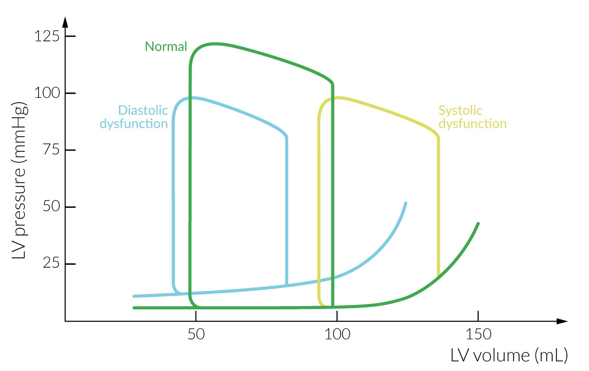

Pressure-volume loops of the left ventricle in systolic and diastolic dysfunction

### Consequences of <u>decompensated heart failure</u>

* Forward failure: reduced <u>cardiac output</u> → poor organ <u>perfusion</u> → organ dysfunction (e.g., <u>hypotension</u>, renal dysfunction)

* Backward failure

* <u>Left ventricle</u>: increased left-ventricular volumes or pressures → backup of blood into <u>lungs</u> → increased pulmonary <u>capillary</u> pressure;   → cardiogenic pulmonary edema (presenting with <u>orthopnea</u>) and increased <u>pulmonary artery</u> pressure

* <u>Right ventricle</u>: increased <u>pulmonary artery</u> pressure → reduced right-sided <u>cardiac output</u> → systemic venous congestion → <u>peripheral edema</u> and progressive congestion of internal organs (e.g., <u>liver</u>, <u>stomach</u>)

* Nutmeg liver: the macroscopic appearance of the <u>liver</u> which resembles a nutmeg seed due to <u>ischemia</u> and fatty degeneration from <u>hepatic venous congestion</u>

> [!NOTE]
> HF is characterized by reduced <u>cardiac output</u> that results in venous congestion and poor systemic <u>perfusion</u>.

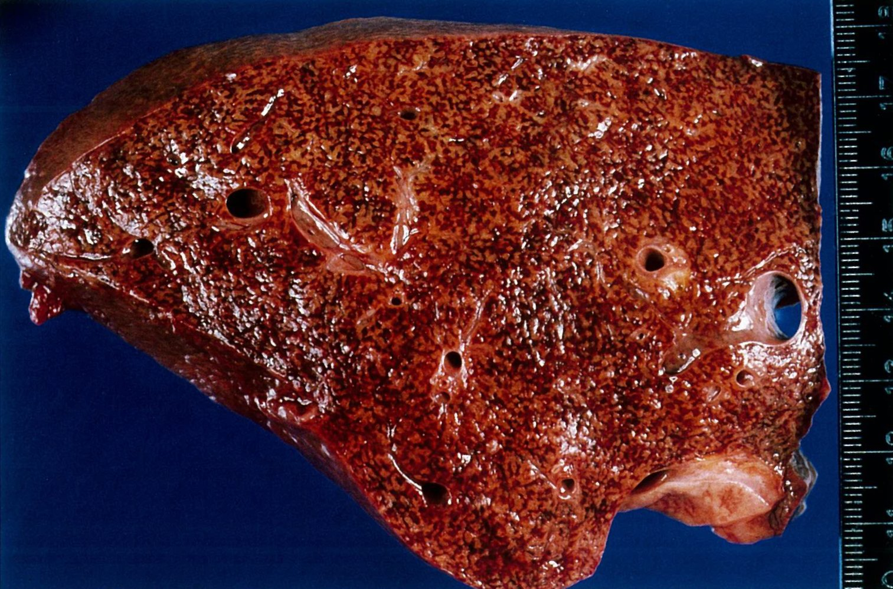

Hepatic congestion (nutmeg liver)

### Compensation mechanisms

The compensation mechanisms are meant to maintain the <u>cardiac output</u> when <u>stroke volume</u> is reduced.

* Increased adrenergic activity : increase in <u>heart rate</u>, blood pressure, and ventricular contractility

* Increase of <u>renin-angiotensin-aldosterone system</u> activity (<u>RAAS</u>): activated following decrease in renal <u>perfusion</u> secondary to reduction of <u>stroke volume</u> and <u>cardiac output</u>  

* ↑ <u>Angiotensin II</u> secretion results in:

* Peripheral <u>vasoconstriction</u> → ↑ systemic blood pressure → ↑ <u>afterload</u>

* <u>Vasoconstriction</u> of the <u>efferent arterioles</u>  → ↓ net <u>renal blood flow</u> and ↑ intraglomerular pressure → maintained <u>GFR</u>

* ↑ <u>Aldosterone</u> secretion → ↑ renal Na+ and H2O reabsorption → ↑ <u>preload</u>

* Secretion of <u>natriuretic peptides</u>: ↑ intracellular <u>smooth muscle</u> <u>cGMP</u> → <u>vasodilation</u> → <u>hypotension</u> and decreased <u>pulmonary capillary wedge pressure</u> → cleavage of the prohormone proBNP into <u>BNP</u> and <u>NT-proBNP</u>

* Brain natriuretic peptide (<u>BNP</u>): ventricular <u>myocyte</u> <u>hormone</u> released in response to increased <u>ventricular filling</u> and stretching

* NT-proBNP: inert biomarker produced in <u>cardiomyocytes</u> from the cleavage of the prohormone proBNP

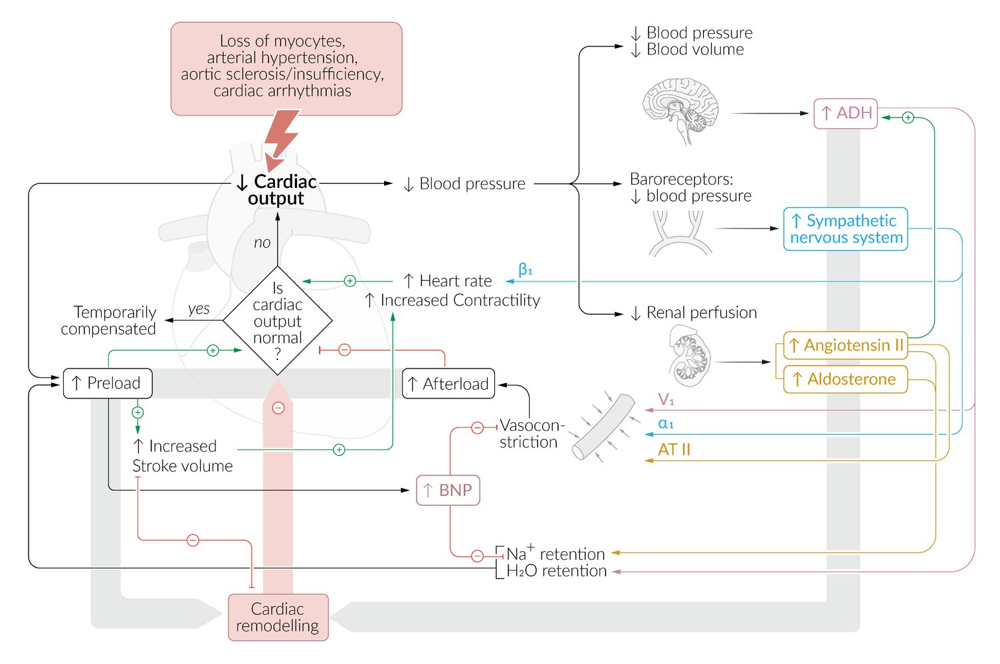

Pathophysiology of heart failure

Renin-angiotensin-aldosterone system

---

## Clinical features

### General <u>features of heart failure</u>

* <u>Nocturia</u>  [[15]](https://coursology-qbank.com/amboss/article/epYxoJ)

* Fatigue

* <u>Tachycardia</u>, various <u>arrhythmias</u>

* <u>S3</u>/<u>S4 gallop</u> on <u>auscultation</u>

* <u>Pulsus alternans</u>

* <u>Cachexia</u> [[16]](https://coursology-qbank.com/amboss/article/zDbrSD)

### Clinical features of left-sided heart failure

* <u>Symptoms of pulmonary congestion</u> 

* <u>Dyspnea</u>  , orthopnea (a sensation of <u>shortness of breath</u> that occurs upon lying down and is relieved by sitting up)

* <u>Pulmonary edema</u>

* Paroxysmal nocturnal dyspnea

* Nocturnal bouts of <u>coughing</u> and acute <u>shortness of breath</u>

* Caused by reabsorption of <u>peripheral edema</u> at night → increased <u>venous return</u>

* Cardiac asthma

* Increased pressure in the <u>bronchial arteries</u> → <u>airway</u> compression and <u>bronchospasm</u>

* Symptoms mimic <u>asthma</u>, with <u>shortness of breath</u>, <u>wheezing</u>, and <u>coughing</u>. [[17]](https://coursology-qbank.com/amboss/article/TYa6oQ)

* <u>Physical examination</u> findings [[18]](https://coursology-qbank.com/amboss/article/G70BMh)

* Bilateral basilar <u>rales</u> may be audible on <u>auscultation</u>.

* Laterally displaced apical <u>heart</u> beat (precordial palpation beyond the <u>midclavicular line</u>)

* Coolness and <u>pallor</u> of lower extremities

### Clinical features of right-sided heart failure

* Symptoms of fluid retention and increased <u>CVP</u> 

* Peripheral <u>pitting edema</u>: as a result of fluid transudation due to increased venous pressure

* Hepatic venous congestion symptoms

* Abdominal <u>pain</u>

* <u>Jaundice</u>

* Other symptoms of organ congestion (e.g., <u>nausea</u>, loss of appetite in <u>congestive gastropathy</u>)

* <u>Physical examination</u> findings

* Jugular venous distention: visible swelling of the jugular <u>veins</u> due to an increase in <u>CVP</u> and venous congestion

* <u>Kussmaul sign</u>

* <u>Hepatosplenomegaly</u>: may result in <u>cardiac cirrhosis</u> and <u>ascites</u>

* Hepatojugular reflux: jugular venous congestion induced by exerting manual pressure over the patient's <u>liver</u> → ↑ right <u>heart</u> volume overload → inability of the right <u>heart</u> to pump additional blood → visible <u>jugular venous distention</u> that persists for several seconds

Pitting edema of lower leg

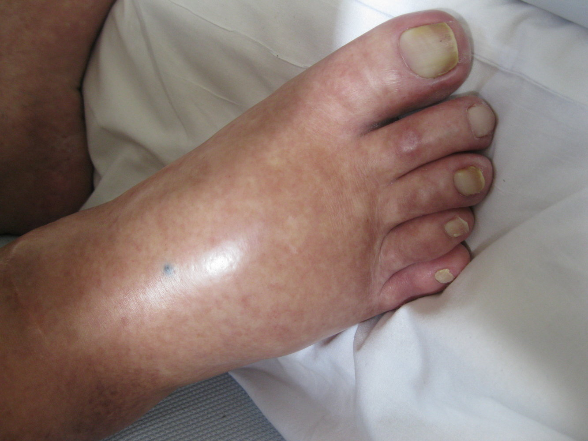

Edema

Cardiovascular Examination - Clinical Examination of the Heart

Examination of the Jugular Venous Pressure - Clinical Examination

Testing the Hepatojugular Reflux - Clinical Examination

---

## Subtypes and variants

### High-output heart failure

* Definition: <u>heart</u> failure secondary to conditions associated with a high-output state, in which <u>cardiac output</u> is elevated to meet the peripheral tissue oxygen demands

* Etiology: conditions that lead to an increased cardiac demand (high-output state)  [[19]](https://coursology-qbank.com/amboss/article/l-0vxi)

* Physiological causes

* <u>Pregnancy</u>

* <u>Fever</u>

* Exercise

* Other causes

* Class III <u>obesity</u>

* Advanced <u>cirrhosis</u>

* <u>Anemia</u>

* Systemic <u>arteriovenous fistulas</u>

* <u>Paget disease of bone</u>

* <u>Hyperthyroidism</u>; <u>thyroid storm</u>

* <u>Wet beriberi</u> (<u>vitamin B1</u> deficiency)

* <u>Sepsis</u>

* <u>Multiple myeloma</u>

* <u>Glomerulonephritis</u>

* <u>Polycythemia vera</u>

* <u>Carcinoid heart disease</u> [[20]](https://coursology-qbank.com/amboss/article/hj0cZT)

* Pathophysiology: peripheral <u>vasodilation</u> or <u>arteriovenous shunting</u> → ↓ in <u>systemic vascular resistance</u> → ↑ <u>heart</u> rate and <u>stroke volume</u> → ↑ cardiac output

* Clinical features

* Symptoms shared with low-output HF 

* <u>Dyspnea</u>, <u>tachypnea</u>

* <u>Tachycardia</u>

* <u>Peripheral edema</u>

* Fatigue

* <u>Low blood pressure</u>

* Symptoms specific to high-output HF

* <u>Midsystolic murmur</u>, <u>S3 gallop</u>

* Jugular distention with an audible hum over the <u>internal jugular vein</u>

* <u>Pulsatile tinnitus</u>

* Bounding peripheral pulses

* Laterally displaced apex beat

* Diagnostics

* Primarily a <u>clinical diagnosis</u>

* <u>X-ray</u> and <u>echocardiography</u>: <u>cardiomegaly</u>

* Treatment

* <u>Heart failure management</u>

* Symptom relief

* Hemodynamic stabilization

* Treatment of the underlying condition

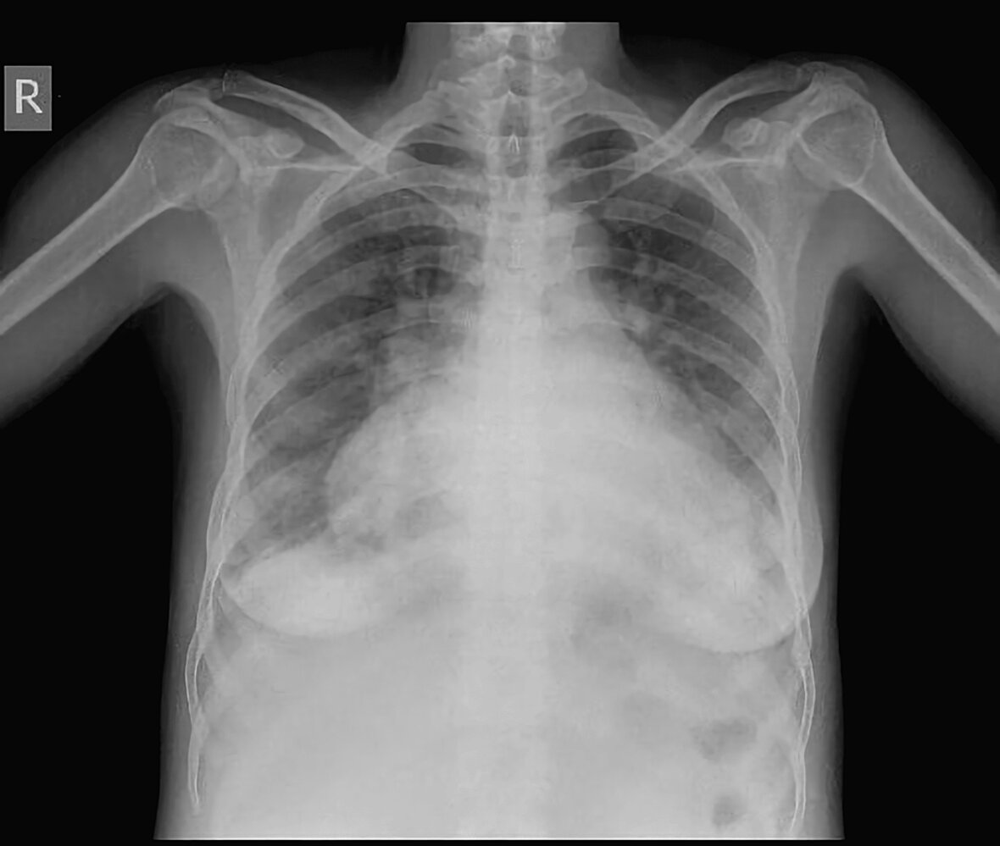

High output cardiac failure

---

## Diagnosis

See “<u>Diagnosis of AHF</u>” for the evaluation of <u>acute decompensated HF</u>.

### General principles

* Initial workup

* Comprehensive clinical evaluation, focused on acuity and <u>volume status</u>

* <u>ECG</u>, <u>CXR</u>, and <u>TTE</u>

* <u>BNP</u> and additional <u>laboratory studies</u>, e.g., <u>CBC</u>, <u>HbA1c</u>

* HF is confirmed if a patient has <u>clinical features of HF</u> attributable to structural or functional cardiac abnormalities and either: [[1]](https://coursology-qbank.com/amboss/article/-p1DH30)[[2]](https://coursology-qbank.com/amboss/article/g3WF3O0)

* Elevated <u>natriuretic peptides</u>

* Evidence of cardiogenic pulmonary or systemic congestion

* If the diagnosis is uncertain, consider:

* A validated clinical composite score, e.g., Framingham <u>heart</u> failure diagnostic criteria

* Advanced studies, e.g., <u>right heart catheterization</u>

* Refer to a cardiologist or an HF specialist if <u>advanced HF</u> is suspected.

> [!TIP]
> Multiple conditions can mimic HF and/or impact therapeutic decisions, e.g., <u>anemia</u> or <u>kidney</u> or <u>liver</u> failure. No single laboratory finding, imaging study, or clinical feature either excludes or is diagnostic for HF. [[1]](https://coursology-qbank.com/amboss/article/-p1DH30)[[2]](https://coursology-qbank.com/amboss/article/g3WF3O0)

### Clinical evaluation

* <u>Medical history</u>

* <u>Family history</u> of cardiac disease  [[1]](https://coursology-qbank.com/amboss/article/-p1DH30)

* Lifestyle and behavioral factors

* <u>Social determinants of health</u>

* Systemic and comorbid conditions

* <u>Physical examination</u>

* <u>Vital signs</u> and <u>volume status assessment</u> [[1]](https://coursology-qbank.com/amboss/article/-p1DH30)

* Findings suggestive of other underlying conditions, e.g.:

* <u>Clinical features of hemochromatosis</u>

* <u>Hypertensive retinopathy</u> on <u>fundoscopic examination</u>

### <u>Laboratory studies</u> [[1]](https://coursology-qbank.com/amboss/article/-p1DH30)[[21]](https://coursology-qbank.com/amboss/article/ENW81N0)

#### <u>BNP</u> or <u>NT-proBNP</u>

* Indication: all patients with suspected HF

* Uses: to help confirm the diagnosis and assess disease severity and prognosis [[1]](https://coursology-qbank.com/amboss/article/-p1DH30)[[22]](https://coursology-qbank.com/amboss/article/aKWQUm0)

* Interpretation

* Elevated levels in patients with classic <u>symptoms of HF</u> support the diagnosis (high predictive index). [[2]](https://coursology-qbank.com/amboss/article/g3WF3O0)[[22]](https://coursology-qbank.com/amboss/article/aKWQUm0)

* HF is unlikely if:

* <u>BNP</u> is < 35 pg/mL or <u>NT-proBNP</u> is < 125 pg/mL in chronic HF [[2]](https://coursology-qbank.com/amboss/article/g3WF3O0)[[12]](https://coursology-qbank.com/amboss/article/MNWMbN0)

* <u>BNP</u> is < 100 pg/mL or <u>NT-proBNP</u> is < 300 pg/mL in <u>AHF</u>  [[22]](https://coursology-qbank.com/amboss/article/aKWQUm0)

* Several conditions can affect levels of <u>BNP</u> and <u>NT-proBNP</u>.  [[1]](https://coursology-qbank.com/amboss/article/-p1DH30)[[22]](https://coursology-qbank.com/amboss/article/aKWQUm0)

* Increased levels: e.g., in advanced age, compromised <u>kidney function</u>, <u>atrial fibrillation</u> and other <u>arrhythmias</u>

* Decreased levels: e.g., in <u>obesity</u>, <u>flash pulmonary edema</u>, <u>pericardial</u> constriction [[12]](https://coursology-qbank.com/amboss/article/MNWMbN0)

> [!TIP]
> Normal <u>BNP</u> or <u>NT-proBNP</u> levels do not exclude HF. Always consider the complete clinical picture. [[1]](https://coursology-qbank.com/amboss/article/-p1DH30)[[21]](https://coursology-qbank.com/amboss/article/ENW81N0)

#### Additional <u>laboratory studies</u>

Order the following studies to assess for <u>causes of HF</u>, comorbidities, and suitability for pharmacological treatment.

* <u>CBC</u>: screening for <u>anemia</u> and signs of infection

* <u>BMP</u>

* <u>Creatinine</u>: normal or ↑

* Na+: normal or ↓; <u>hyponatremia</u> may indicate a poor prognosis.  [[23]](https://coursology-qbank.com/amboss/article/CdXqHC)

* <u>HbA1c</u> or <u>fasting</u> <u>glucose</u>: <u>diabetes mellitus screening</u>

* <u>Liver chemistries</u>: Elevations, particularly of <u>cholestatic enzymes</u>, can indicate <u>hepatic venous congestion</u>.

* <u>Fasting lipid panel</u>: <u>screening for lipid disorders</u>

* <u>TSH</u>: to assess <u>thyroid</u> function

* <u>Iron studies</u>: to assess for <u>iron deficiency</u> in HF

* Serum <u>ferritin</u> < 100 ng/mL [[24]](https://coursology-qbank.com/amboss/article/Xzc9rU0)

* Or serum <u>ferritin</u> < 300 ng/mL with <u>transferrin saturation</u> < 20% [[24]](https://coursology-qbank.com/amboss/article/Xzc9rU0)

* Cardiac <u>troponin T/I</u>: may be useful for risk <u>stratification</u>  [[25]](https://coursology-qbank.com/amboss/article/3pYS6J)

* Often elevated in patients with HF

* In patients with significant elevations and a serial increase in value, <u>ACS</u> must be ruled out. [[26]](https://coursology-qbank.com/amboss/article/SaXyP9)[[27]](https://coursology-qbank.com/amboss/article/O2XI3x)

> [!TIP]
> Most patients with HF (> 85%) have two or more associated chronic conditions. [[1]](https://coursology-qbank.com/amboss/article/-p1DH30)

### <u>Transthoracic echocardiogram</u> (<u>TTE</u>) [[1]](https://coursology-qbank.com/amboss/article/-p1DH30)[[21]](https://coursology-qbank.com/amboss/article/ENW81N0)

* Indications

* All patients with suspected HF (preferred initial imaging modality) [[1]](https://coursology-qbank.com/amboss/article/-p1DH30)[[21]](https://coursology-qbank.com/amboss/article/ENW81N0)

* Patients receiving treatment with a change in clinical status

* Patients undergoing evaluation for device therapy

* Findings

* LV <u>systolic dysfunction</u> and/or <u>diastolic dysfunction</u>

* Quantitative measurement of <u>LVEF</u>

* Atrial and ventricular size and thickness

* Evidence of complications, e.g.:

* <u>Cardiac dyssynchrony</u>, <u>functional mitral regurgitation</u>, <u>left atrial enlargement</u> [[28]](https://coursology-qbank.com/amboss/article/AcXRUC)

* <u>Pericardial</u> and/or <u>pleural effusion</u>  [[29]](https://coursology-qbank.com/amboss/article/ESb8Yt)

* Underlying causes: e.g., <u>LV hypertrophy</u> in <u>hypertension</u>, regional wall motion abnormalities due to <u>CAD</u>

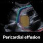

AMBOSS POCUS series | Pericardial effusion

AMBOSS POCUS series | Pleural effusion

### <u>Chest x-ray</u> [[1]](https://coursology-qbank.com/amboss/article/-p1DH30)

* Indication: all patients with suspected HF; especially useful in <u>AHF</u>

* Findings 

* Changes to the <u>cardiac silhouette</u>

* <u>Cardiomegaly</u>, i.e., <u>cardiothoracic ratio</u> > 0.5  [[30]](https://coursology-qbank.com/amboss/article/uaXpm9)

* <u>Boot-shaped heart</u> on PA view: RV enlargement

* Signs of <u>pericardial effusion</u> (e.g., <u>water bottle heart</u>)

* <u>X-ray</u> findings of <u>pulmonary congestion</u>

* Signs of concomitant <u>heart</u> conditions, including:

* Valvular calcifications in valvular disease

* <u>Pericardial</u> calcification in <u>constrictive pericarditis</u>

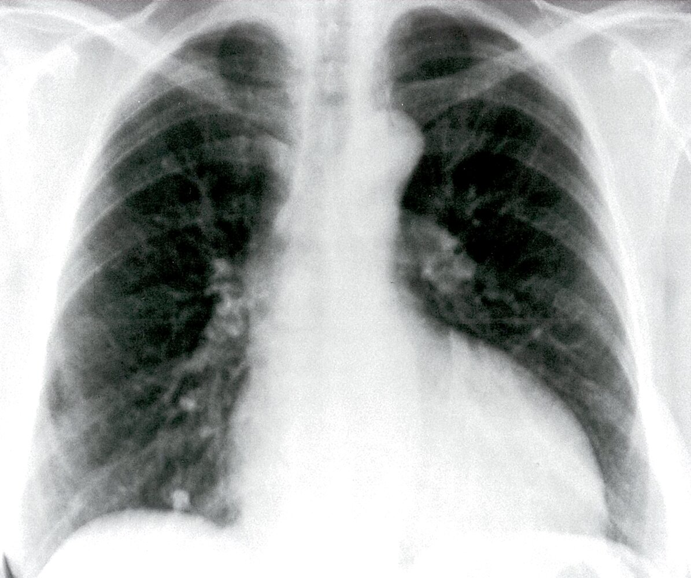

Left ventricular enlargement (1/2)

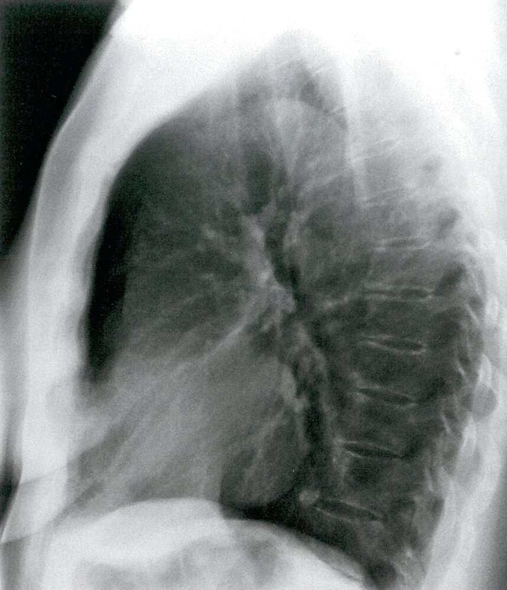

Left ventricular enlargement (2/2)

Cardiogenic pulmonary edema

Hydrostatic pulmonary edema

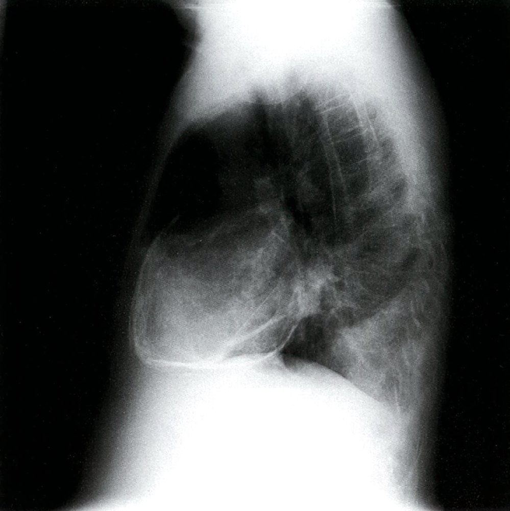

Constrictive pericarditis

### 12-lead <u>ECG</u> [[1]](https://coursology-qbank.com/amboss/article/-p1DH30)[[31]](https://coursology-qbank.com/amboss/article/nyb7fw)[[32]](https://coursology-qbank.com/amboss/article/wCYh8r)

* Indications: all patients with suspected HF

* Findings

* Some patients may have a normal <u>ECG</u>, especially those with <u>HFpEF</u>.

* Changes associated with the <u>etiology of HF</u> and other cardiovascular comorbidities, e.g., <u>ECG changes in STEMI</u>, <u>arrhythmias</u> [[1]](https://coursology-qbank.com/amboss/article/-p1DH30)

* Abnormalities related to HF (common but mainly nonspecific), e.g.:

* <u>ECG signs of LV hypertrophy</u> (e.g., positive <u>Sokolow-Lyon index</u>)   [[33]](https://coursology-qbank.com/amboss/article/pwbLPD)

* <u>ST-segment</u> and <u>T-wave</u> abnormalities (e.g., <u>ST depression</u>)

* <u>P wave abnormalities</u> (e.g., <u>P mitrale</u>)

* Prolonged <u>QTc</u> interval [[34]](https://coursology-qbank.com/amboss/article/HgXK9x)

ECG in left ventricular hypertrophy

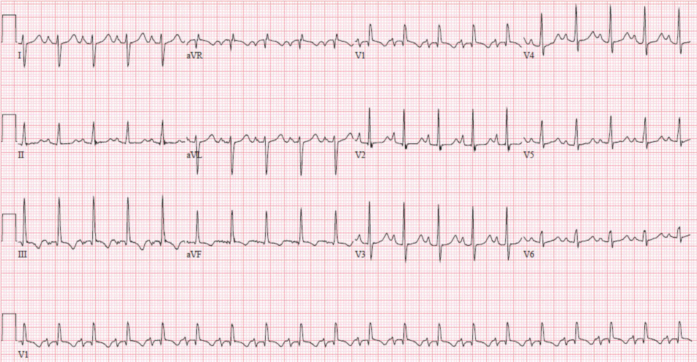

Decompensated right heart failure

### Additional assessment [[1]](https://coursology-qbank.com/amboss/article/-p1DH30)[[2]](https://coursology-qbank.com/amboss/article/g3WF3O0)

#### Clinical composite scores

* Framingham <u>heart</u> failure diagnostic criteria may be used to rule in HF.

* H2FPEF score

* Use: estimates the likelihood of HF in symptomatic patients with preserved <u>ejection fraction</u> on <u>echocardiogram</u>

* Variables

* High <u>BMI</u>: > 30 kg/m2 (2 points)

* <u>Hypertension</u> treated with ≥ 2 medications (1 point)

* <u>Atrial fibrillation</u> (<u>paroxysmal</u> or persistent) (3 points)

* PA systolic pressure > 35 mm Hg on <u>echocardiogram</u> (1 point)

* Elder age: > 60 years (1 point)

* Filling pressure elevated on <u>echocardiogram</u>: <u>E/e′ ratio</u> > 9 (1 point)

* Interpretation

* Score 0–1: <u>HFpEF</u> is ruled out.

* Score 2–5: Further diagnostic workup is needed.

* Score 6–9: <u>HFpEF</u> is ruled in.

#### Advanced studies

The following studies may be ordered by a specialist if there is diagnostic uncertainty and/or to evaluate for underlying causes.

* <u>Cardiac MRI</u>: highly accurate assessment of ventricular volume, mass, and <u>ejection fraction</u>  [[1]](https://coursology-qbank.com/amboss/article/-p1DH30)

* Noninvasive <u>stress</u> imaging, i.e., <u>echocardiography</u>, nuclear <u>scintigraphy</u>: to assess for <u>obstructive CAD</u> and <u>myocardial</u> <u>ischemia</u> [[1]](https://coursology-qbank.com/amboss/article/-p1DH30)

* <u>Right heart catheterization</u> (RHC)

* Most sensitive and specific study for <u>HFpEF</u> confirmation, but expensive and invasive [[21]](https://coursology-qbank.com/amboss/article/ENW81N0)

* Used to assess right <u>heart</u> function and <u>pulmonary vascular resistance</u> in patients being considered for <u>mechanical circulatory support</u> or <u>heart transplant</u>

* May be considered for monitoring and guiding management in certain patients with <u>cardiogenic shock</u>. <u>SvO2</u> is low in <u>decompensated HF</u>.  [[1]](https://coursology-qbank.com/amboss/article/-p1DH30)

* <u>Endomyocardial biopsy</u>

* Ongoing diagnostic uncertainty and rapidly progressive disease

* Suspected infiltrative <u>heart</u> disease [[1]](https://coursology-qbank.com/amboss/article/-p1DH30)

> [!TIP]
> Identifying the specific <u>cause of HF</u> is crucial because it allows for tailored treatment in addition to GDMT. [[1]](https://coursology-qbank.com/amboss/article/-p1DH30)

---

## Pathology

<u>Sputum analysis</u> in patients with <u>pulmonary edema</u> may show heart failure cells (<u>hemosiderin</u>-containing cells).

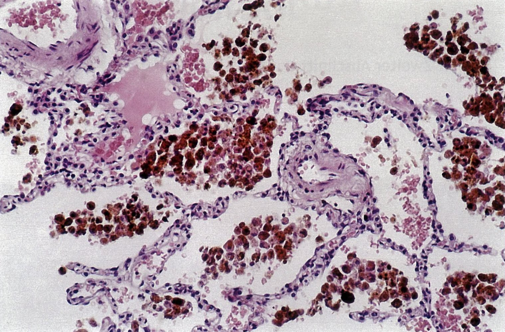

Heart failure cells in decompensated heart failure

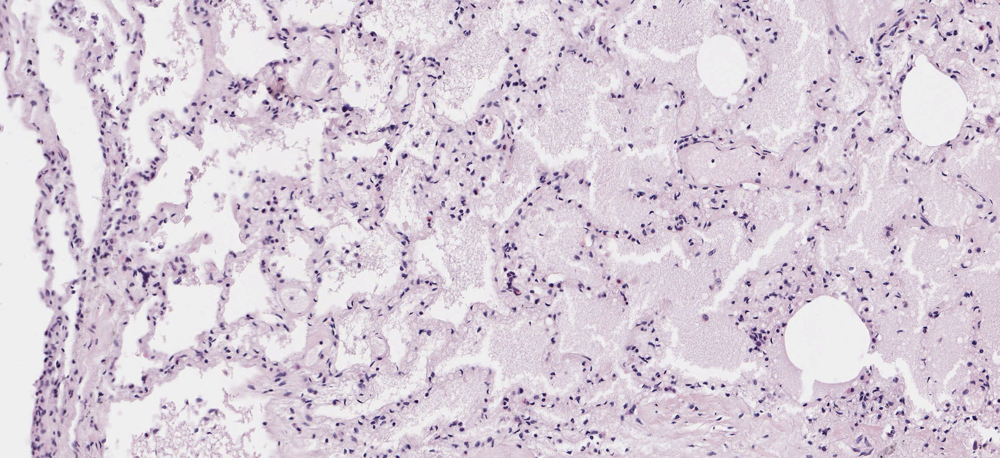

Pulmonary alveolar edema

---

## Management

<u>Management of AHF</u> is detailed in “<u>Acute HF</u>.”

### Approach [[1]](https://coursology-qbank.com/amboss/article/-p1DH30)[[2]](https://coursology-qbank.com/amboss/article/g3WF3O0)[[35]](https://coursology-qbank.com/amboss/article/h0dcfo0)

* Counsel on nonpharmacological interventions and self-care.

* Manage comorbidities and precipitating factors.

* Start <u>pharmacotherapy for HF</u> based on <u>HF staging</u> and <u>LVEF</u>, and monitor at each patient visit to optimize GDMT.

* Consider indications for referral to a cardiologist, e.g.:

* <u>New-onset HF</u>

* Clinical suspicion for <u>HFpEF</u> mimics

> [!TIP]
> Multidisciplinary management of HF that includes nurses, cardiologists, and clinical pharmacists is associated with lower hospitalization and <u>mortality rates</u>. [[1]](https://coursology-qbank.com/amboss/article/-p1DH30)[[2]](https://coursology-qbank.com/amboss/article/g3WF3O0)

### Nonpharmacological interventions [[1]](https://coursology-qbank.com/amboss/article/-p1DH30)[[21]](https://coursology-qbank.com/amboss/article/ENW81N0)

Encourage and/or provide the following in combination with <u>pharmacotherapy for HF</u>.

* Lifestyle modifications

* Aerobic exercise, e.g., brisk walking for ≥ 150 minutes/week [[1]](https://coursology-qbank.com/amboss/article/-p1DH30)[[2]](https://coursology-qbank.com/amboss/article/g3WF3O0)[[36]](https://coursology-qbank.com/amboss/article/FydgSs0)

* Weight loss  [[36]](https://coursology-qbank.com/amboss/article/FydgSs0)

* Nutrition and fluid management

* Encourage healthy eating patterns, e.g., <u>DASH diet</u>, <u>Mediterranean diet</u>.

* Avoid excessive dietary <u>sodium</u> intake to reduce the risk of congestion.  [[1]](https://coursology-qbank.com/amboss/article/-p1DH30)

* Fluid restriction does not reduce hospitalization or <u>mortality rates</u> in patients with HF. [[1]](https://coursology-qbank.com/amboss/article/-p1DH30)

* <u>Smoking cessation</u>, avoidance of <u>alcohol</u> and <u>recreational drug</u> use [[1]](https://coursology-qbank.com/amboss/article/-p1DH30)

* Patient self-care

* Daily self-monitoring

* Weight: Patients with significant weight changes (e.g., > 2 kg in 3 days) should seek medical advice.  [[2]](https://coursology-qbank.com/amboss/article/g3WF3O0)[[12]](https://coursology-qbank.com/amboss/article/MNWMbN0)

* <u>Home blood pressure monitoring</u> [[2]](https://coursology-qbank.com/amboss/article/g3WF3O0)

* <u>HF symptoms</u>, e.g., persistent or increasing <u>dyspnea</u> and/or <u>edema</u>

* Weight-based <u>diuretic</u> dose adjustment  [[1]](https://coursology-qbank.com/amboss/article/-p1DH30)

* Monitoring of medication side effects

* Other interventions [[1]](https://coursology-qbank.com/amboss/article/-p1DH30)

* <u>Vaccinations</u>: <u>pneumococcal vaccine</u>, <u>seasonal influenza vaccine</u>, <u>COVID-19 vaccine</u> [[1]](https://coursology-qbank.com/amboss/article/-p1DH30)

* Identification of factors associated with poor self-care, e.g.: [[1]](https://coursology-qbank.com/amboss/article/-p1DH30)

* <u>Frailty assessment</u>

* <u>Screening for depression</u>

* Assessing for <u>symptoms of cognitive impairment</u>

* <u>Assessment of social situation for older adults</u>

* <u>Cardiac rehabilitation</u> [[1]](https://coursology-qbank.com/amboss/article/-p1DH30)

> [!TIP]
> Nonpharmacological interventions are associated with better patient outcomes, e.g., decreased rates of hospitalization and all-cause and cardiovascular mortality. [[1]](https://coursology-qbank.com/amboss/article/-p1DH30)

### Management of comorbidities [[1]](https://coursology-qbank.com/amboss/article/-p1DH30)[[2]](https://coursology-qbank.com/amboss/article/g3WF3O0)[[35]](https://coursology-qbank.com/amboss/article/h0dcfo0)

The following recommendations are specific to comorbidities in HF. Treat other comorbidities (e.g., <u>lipid disorders</u>, <u>ASCVD</u>, <u>atrial fibrillation</u>) as recommended by guidelines.

* <u>Hypertension</u>: treatment target of < 130/80 mm Hg [[1]](https://coursology-qbank.com/amboss/article/-p1DH30)[[2]](https://coursology-qbank.com/amboss/article/g3WF3O0)[[37]](https://coursology-qbank.com/amboss/article/OzaIGM)

* <u>Diabetes mellitus</u>: <u>SGLT2is</u> are recommended for all patients.

* <u>Iron deficiency</u>: Parenteral <u>iron</u> therapy is recommended for patients with symptomatic <u>HFrEF</u> or <u>HFmrEF</u>.  [[1]](https://coursology-qbank.com/amboss/article/-p1DH30)[[38]](https://coursology-qbank.com/amboss/article/WJWPGm0)

* Initial dosing is based on <u>hemoglobin</u> levels:

* <u>Hgb</u> ≤ 14 g/dL: ferric carboxymaltose DOSAGE

* <u>Hgb</u> 14–14.9 g/dL: ferric carboxymaltose DOSAGE

* Subsequent doses are based on patient weight and <u>hemoglobin</u> and <u>ferritin</u> levels.

* <u>Obesity</u> [[36]](https://coursology-qbank.com/amboss/article/FydgSs0)

* Consider using anthropometric data (e.g., <u>waist circumference</u>) to assess patients with <u>BMI</u> < 35 kg/m².

* Consider <u>GLP-1 agonists</u> for patients with <u>HFpEF</u> or <u>HFmrEF</u> to improve symptoms and functional capacity.

* <u>Semaglutide</u> DOSAGE for EF ≥ 45% [[36]](https://coursology-qbank.com/amboss/article/FydgSs0)[[39]](https://coursology-qbank.com/amboss/article/qJWCEm0)

* <u>Tirzepatide</u> (<u>off-label</u>) DOSAGE for EF ≥ 50%  [[40]](https://coursology-qbank.com/amboss/article/lSVv-F0)[[36]](https://coursology-qbank.com/amboss/article/FydgSs0)

* Consider <u>metabolic and bariatric surgery</u> for patients with HF and <u>obesity</u> to reduce the risk of HF hospitalization and cardiovascular mortality.

* <u>Obstructive sleep apnea</u>: Consider nocturnal <u>continuous positive airway pressure</u> (<u>CPAP</u>) therapy.  [[1]](https://coursology-qbank.com/amboss/article/-p1DH30)

> [!TIP]
> Individuals with <u>obesity</u> have lower <u>BNP</u> and <u>NT</u>-pro <u>BNP</u> levels; consider a lower <u>BNP</u> threshold for diagnosis and monitoring of HF in patients with <u>obesity</u>. [[36]](https://coursology-qbank.com/amboss/article/FydgSs0)

### Monitoring [[1]](https://coursology-qbank.com/amboss/article/-p1DH30)[[2]](https://coursology-qbank.com/amboss/article/g3WF3O0)

To optimize GDMT, the following factors should be assessed at each patient visit.

* Clinical status

* Signs and <u>symptoms of pulmonary congestion</u> and/or leg <u>edema</u>

* Tolerance of physical activity

* Unexplained change in clinical status: Repeat <u>TTE</u>.

* Causes of clinical deterioration

* Concurrent illness, e.g., infection, <u>MI</u>

* Nonadherence to pharmacotherapy or nutritional recommendations

* Adverse effects and intolerance to pharmacotherapy, e.g.:

* <u>Hypotension</u>, <u>dizziness</u>, and/or <u>cough</u>: <u>ARNIs</u>, <u>ARBs</u>, ISDN with <u>hydralazine</u>

* <u>Bradycardia</u>: <u>beta blockers</u>, <u>ivabradine</u>

* Mycotic genital infections: <u>SGLT2is</u>

* <u>BMP</u> to assess for:

* <u>Electrolyte</u> derangements

* <u>Hyperkalemia</u> in patients on <u>RAAS inhibitors</u>, <u>SGLT2is</u>, and/or <u>aldosterone antagonists</u>  [[1]](https://coursology-qbank.com/amboss/article/-p1DH30)

* <u>Hypokalemia</u> in patients on <u>diuretics</u>

* <u>Kidney function</u> in patients on <u>RAAS inhibitors</u>, <u>SGLT2is</u>, and/or <u>digoxin</u>

### Indications for referral [[35]](https://coursology-qbank.com/amboss/article/h0dcfo0)

The following are guideline-based indications for referral to a cardiologist:

* <u>New-onset HF</u>

* ≥ 1 <u>high-risk features of chronic HF</u>

* <u>LVEF</u> ≤ 35% for ≥ 3 months despite treatment with GDMT  [[35]](https://coursology-qbank.com/amboss/article/h0dcfo0)

* The patient or clinician would like a second opinion on the <u>etiology of HF</u> and possible <u>targeted therapies</u>, e.g., <u>revascularization</u>

* Consideration for enrollment in a clinical trial

* <u>Advanced HF</u> therapies, e.g., <u>device therapy for HF</u> [[1]](https://coursology-qbank.com/amboss/article/-p1DH30)

* Clinical suspicion for <u>HFpEF</u> mimics, e.g.: [[2]](https://coursology-qbank.com/amboss/article/g3WF3O0)

* Valvular disease

* <u>HCM</u>

* <u>Familial amyloid cardiomyopathy</u>

* <u>Pericardial</u> disease

* <u>Cardiac sarcoidosis</u>

* <u>Myocarditis</u>

---

## Pharmacotherapy

### General principles [[1]](https://coursology-qbank.com/amboss/article/-p1DH30)[[2]](https://coursology-qbank.com/amboss/article/g3WF3O0)[[35]](https://coursology-qbank.com/amboss/article/h0dcfo0)

* Titrate medications to the target dosage, even if symptoms improve at lower doses.

* Dosages may be adjusted as frequently as every 1–2 weeks. [[1]](https://coursology-qbank.com/amboss/article/-p1DH30)

* Most patients with <u>HFimpEF</u> should continue treatment, even if asymptomatic, to prevent relapse and worsening <u>LV dysfunction</u>. [[1]](https://coursology-qbank.com/amboss/article/-p1DH30)

* Patients with <u>HFmrEF</u> may benefit from the agents recommended for <u>HFrEF</u>, especially <u>SGLT2is</u>.  [[1]](https://coursology-qbank.com/amboss/article/-p1DH30)[[41]](https://coursology-qbank.com/amboss/article/pJWLEm0)

* <u>Diuretics</u> are recommended for all patients with congestion regardless of <u>LVEF</u>.

* Avoid prescribing <u>drugs that may worsen HF</u>.

* See “<u>Use of heart failure medications in pregnancy and lactation</u>” for modifications.

### Pharmacotherapy for <u>HFrEF</u> [[1]](https://coursology-qbank.com/amboss/article/-p1DH30)[[3]](https://coursology-qbank.com/amboss/article/bmWHVN0)[[35]](https://coursology-qbank.com/amboss/article/h0dcfo0)

* <u>ACC/AHA stage B</u>: The goal of pharmacotherapy in these patients is to prevent symptomatic HF.

* <u>Beta blocker</u>

* PLUS either an <u>ACEI</u> or <u>ARB</u>

* <u>ACC</u>/<u>AHA</u> stages C and D: The goal of pharmacotherapy in these patients is to reduce <u>morbidity</u>, mortality, and hospitalizations. 

* One agent from each of the following drug classes, unless contraindicated (e.g., prior <u>hypersensitivity reaction</u>):

* <u>Diuretics</u>

* <u>RAAS inhibitors</u>

* <u>Beta blockers</u>

* <u>SGLT2 inhibitors</u>

* <u>Mineralocorticoid receptor antagonists</u>

* Consider additional pharmacotherapy for refractory symptoms.

|  Initial pharmacotherapy for <u>HFrEF</u> [[1]](https://coursology-qbank.com/amboss/article/-p1DH30)[[3]](https://coursology-qbank.com/amboss/article/bmWHVN0)[[35]](https://coursology-qbank.com/amboss/article/h0dcfo0)  |  |  |  |  |  |  |
| --- | --- | --- | --- | --- | --- | --- |
| Class |  | Indications |  Recommended agents  |  |  |  |
| <u>Diuretics</u> | <u>Loop diuretics</u> |  * Preferred option for all patients with congestion   |   * <u>Bumetanide</u> DOSAGE  * <u>Furosemide</u> DOSAGE  * <u>Torsemide</u> DOSAGE    |  |  |  |
| <u>Thiazide diuretics</u> |  * May be added if no response to moderate or high-dose <u>loop diuretics</u>   |   * <u>Chlorthalidone</u> DOSAGE  * <u>Hydrochlorothiazide</u> DOSAGE  * <u>Metolazone</u> DOSAGE    |  |  |  |  |
| <u>RAAS inhibitors</u> | <u>Angiotensin receptor-neprilysin inhibitors</u> (<u>ARNIs</u>) |   * Preferred initial agent for <u>RAAS inhibition</u> for patients with <u>ACC/AHA stage C</u> <u>HFrEF</u> and/or <u>NYHA class</u> II-IV HF  [[35]](https://coursology-qbank.com/amboss/article/h0dcfo0)  * Stop <u>ACEIs</u> 36 hours before starting an <u>ARNI</u> to avoid an elevated risk of <u>angioedema</u>.    |  * <u>Sacubitril/valsartan</u> DOSAGE   |  |  |  |
| <u>ACE inhibitors</u> (<u>ACEIs</u>) |   * All patients with <u>ACC/AHA stage B</u> <u>HFrEF</u>  * Patients with <u>ACC</u>/<u>AHA</u> stages C and D <u>HFrEF</u> if <u>ARNI</u> is not tolerated or affordable    |   * <u>Enalapril</u> DOSAGE  * <u>Ramipril</u> DOSAGE  * <u>Lisinopril</u> DOSAGE    |  |  |  |  |
| <u>Angiotensin receptor blockers</u> (<u>ARBs</u>) |  * Patients with <u>ACC</u>/<u>AHA</u> stages B, C, and D <u>HFrEF</u> if <u>ARNI</u> and <u>ACEIs</u> are not tolerated (e.g., because of a dry <u>cough</u> or history of <u>angioedema</u>) or affordable   |   * <u>Candesartan</u> DOSAGE  * <u>Losartan</u> (<u>off-label</u>) DOSAGE [[1]](https://coursology-qbank.com/amboss/article/-p1DH30)  * <u>Valsartan</u> DOSAGE    |  |  |  |  |
|  <u>Beta blockers</u>  |  |  * All patients with <u>ACC</u>/<u>AHA</u> stages B, C, and D <u>HFrEF</u>   |   * <u>Bisoprolol</u> (<u>off-label</u>) DOSAGE [[1]](https://coursology-qbank.com/amboss/article/-p1DH30)  * <u>Carvedilol</u> DOSAGE  * <u>Metoprolol</u> <u>succinate</u> DOSAGE    |  |  |  |
| <u>SGLT2 inhibitors</u> (<u>SGLT2is</u>) |  |  * Patients with any of the following: [[35]](https://coursology-qbank.com/amboss/article/h0dcfo0)  * <u>ACC/AHA stage C</u>  * <u>NYHA class</u> II-IV <u>HFrEF</u>  * <u>LVEF</u> ≤ 40%   |   * <u>Dapagliflozin</u> DOSAGE  * <u>Empagliflozin</u> DOSAGE    |  |  |  |
| <u>Mineralocorticoid receptor antagonists</u> (<u>MRAs</u>) |  |  * All patients with <u>ACC/AHA stage C</u> <u>HFrEF</u> without contraindications i.e., <u>eGFR</u> < 30 mL/min/1.73 m2 and serum <u>K+</u>> 5.0 mEq/L   |   * <u>Spironolactone</u> DOSAGE  * <u>Eplerenone</u> DOSAGE    |  |  |  |

> [!TIP]
> Drugs that improve prognosis (i.e., reduce <u>morbidity</u>, mortality, and hospitalization rates) are <u>beta blockers</u>, <u>ACEIs</u>, <u>ARNIs</u>, <u>MRAs</u>, <u>hydralazine</u> with <u>isosorbide dinitrate</u>, and <u>SGLT2is</u>.

|  Additional pharmacotherapy for <u>HFrEF</u> [[1]](https://coursology-qbank.com/amboss/article/-p1DH30)[[3]](https://coursology-qbank.com/amboss/article/bmWHVN0)  |  |  |
| --- | --- | --- |
| Class | Indications | Recommended agents |
| <u>Isosorbide dinitrate</u> with <u>hydralazine</u> |   * Add to first-line therapy for African American patients with <u>NYHA</u> III–IV <u>HFrEF</u>  [[1]](https://coursology-qbank.com/amboss/article/-p1DH30)  * May be considered in patients who cannot tolerate <u>ARNI</u>, <u>ACEIs</u>, or <u>ARBs</u> (e.g., due to impaired <u>kidney function</u>) [[1]](https://coursology-qbank.com/amboss/article/-p1DH30)    |   * Fixed-dose combination of <u>isosorbide dinitrate</u>/<u>hydralazine</u> DOSAGE  * OR <u>isosorbide dinitrate</u> DOSAGE PLUS <u>hydralazine</u> DOSAGE [[1]](https://coursology-qbank.com/amboss/article/-p1DH30)    |
| Ifchannel inhibitor |  * Patients with <u>NYHA</u> II–III <u>HFrEF</u> and all of the following: [[1]](https://coursology-qbank.com/amboss/article/-p1DH30)[[35]](https://coursology-qbank.com/amboss/article/h0dcfo0)  * Stable <u>LVEF</u> ≤ 35%  * Maximum tolerated first-line GDMT that includes a  <u>beta blocker</u>  * <u>Sinus rhythm</u> with HR of ≥ 70 bpm at rest   |  * <u>Ivabradine</u> DOSAGE   |
| <u>Digoxin</u> |  * Refractory symptoms despite first-line GDMT [[1]](https://coursology-qbank.com/amboss/article/-p1DH30)   |  * <u>Digoxin</u> DOSAGE  [[1]](https://coursology-qbank.com/amboss/article/-p1DH30)   |
| Soluble <u>guanylate cyclase</u> stimulator |  * Patients with all of the following: [[35]](https://coursology-qbank.com/amboss/article/h0dcfo0)  * <u>LVEF</u> < 45%  * On maximum tolerated GDMT  * Worsening <u>HF symptoms</u>, i.e., recent hospitalization due to HF or use of IV <u>diuretics</u>   |  * <u>Vericiguat</u> DOSAGE   |
| <u>Omega-3 fatty acid</u> |  * May be added to first-line GDMT in patients with <u>NYHA</u> II–IV <u>HFrEF</u>   |  * <u>Omega-3 fatty acid</u> (<u>off-label</u>) DOSAGE [[42]](https://coursology-qbank.com/amboss/article/oq10z30)   |

> [!NOTE]
> <u>Diuretics</u> and <u>digoxin</u> improve symptoms and significantly reduce the number of hospitalizations.

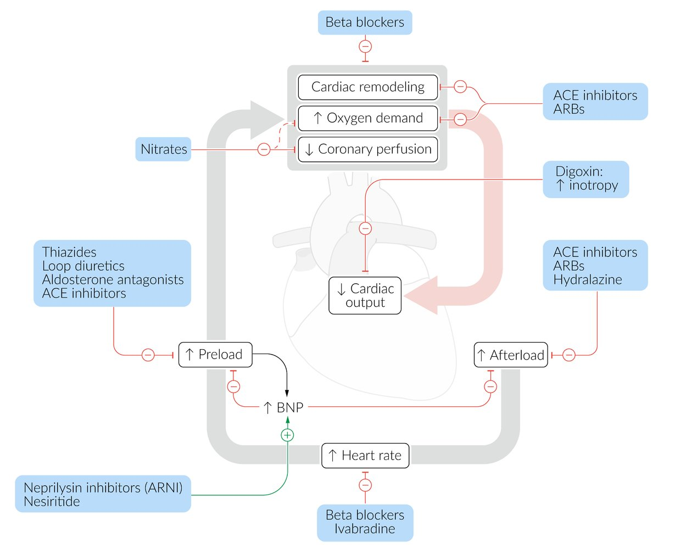

Mechanism of action: drugs used in heart failure

### Pharmacotherapy for <u>HFpEF</u> [[2]](https://coursology-qbank.com/amboss/article/g3WF3O0)[[3]](https://coursology-qbank.com/amboss/article/bmWHVN0)[[21]](https://coursology-qbank.com/amboss/article/ENW81N0)

* <u>SGLT2i</u> for all patients: e.g., <u>dapagliflozin</u> DOSAGE or <u>empagliflozin</u> DOSAGE [[2]](https://coursology-qbank.com/amboss/article/g3WF3O0)[[38]](https://coursology-qbank.com/amboss/article/WJWPGm0)

* <u>Loop diuretic</u> for patients with congestion: e.g., <u>furosemide</u> DOSAGE  or <u>torsemide</u> DOSAGE

* <u>MRA</u>, e.g., <u>spironolactone</u> (<u>off-label</u>) DOSAGE [[2]](https://coursology-qbank.com/amboss/article/g3WF3O0)

* <u>ARNI</u>, i.e., <u>sacubitril/valsartan</u> (preferred) DOSAGE or <u>ARB</u> (if <u>ARNI</u> is contraindicated or not available), e.g., <u>candesartan</u> DOSAGE  [[2]](https://coursology-qbank.com/amboss/article/g3WF3O0)

> [!TIP]
> Some agents used in GDMT for <u>HFrEF</u> (e.g., <u>beta blockers</u>, <u>ACE inhibitors</u>) lack evidence for benefit in most patients with <u>HFpEF</u>.

### Drugs that may worsen HF [[1]](https://coursology-qbank.com/amboss/article/-p1DH30)

The following drugs should be avoided or used with caution in patients with HF.

* <u>Nondihydropyridine calcium channel blockers</u>: associated with higher HF rate of recurrence

* <u>NSAIDs</u>: can worsen <u>HF symptoms</u>

* <u>Thiazolidinediones</u> (e.g., <u>pioglitazone</u>): increased risk of congestion and hospitalization

* <u>Antidepressants</u> (e.g., <u>tricyclic antidepressants</u>): Consider interactions with HF pharmacotherapy.  [[43]](https://coursology-qbank.com/amboss/article/ddXoKC)

* Inhalation <u>anesthetics</u>: may induce <u>myocardial</u> <u>depression</u> and peripheral <u>vasodilation</u>, and decrease <u>sympathetic</u> activity

* <u>Class IC</u> and <u>class III antiarrhythmic drugs</u>: increased mortality

* <u>DPP-4 inhibitors</u> (e.g., <u>saxagliptin</u>, alogliptin): increased risk of hospitalization for HF

---

## Device therapy and advanced HF management

### Device therapy in HF

<u>Automated implantable cardioverter defibrillators</u> (<u>AICDs</u>) and <u>cardiac resynchronization therapy</u> devices (<u>CRTs</u>) are beneficial in select patients with HF who are at risk for <u>sudden cardiac death</u> from <u>ventricular tachyarrhythmias</u> and who have worsening HF from <u>cardiac dyssynchrony</u>. [[1]](https://coursology-qbank.com/amboss/article/-p1DH30)[[44]](https://coursology-qbank.com/amboss/article/IcXYdC)

#### AICDs in heart failure [[1]](https://coursology-qbank.com/amboss/article/-p1DH30)

For more information, see “<u>AICDs</u>.”

* Goal: prevention of <u>sudden cardiac death</u> from <u>tachyarrhythmias</u> caused by <u>cardiomyopathy</u>

* Indications 

* <u>HFrEF</u> patients with an expected survival of > 1 year and on GDMT with either:

* Nonischemic <u>dilated cardiomyopathy</u> (<u>DCM</u>) or <u>ischemic heart disease</u>;  at least 40 days post-<u>MI</u> with <u>LVEF</u> ≤ 35% and <u>NYHA class</u> II–III

* <u>Ischemic heart disease</u>;  at least 40 days post-<u>MI</u> with <u>LVEF</u> ≤ 30% and <u>NYHA class</u> I

* Any other indication for <u>AICDs</u>

#### CRT in heart failure [[1]](https://coursology-qbank.com/amboss/article/-p1DH30)

For more information, see “<u>CRTs</u>.”

* Goal consists of synchronizing contractions of the right and left ventricles, resulting in:

* Improved ventricular function  [[45]](https://coursology-qbank.com/amboss/article/2pYTKJ)[[46]](https://coursology-qbank.com/amboss/article/qcXCWC)

* Reverse <u>ventricular remodeling</u>

* Reduction in <u>secondary mitral regurgitation</u>

* Indications: The following criteria apply to patients with stage C <u>HFrEF</u> on optimized medical therapy and an expected survival of > 1 year.

* <u>LVEF</u> ≤ 35% with <u>NYHA</u> class II–IV symptoms and <u>sinus rhythm</u> OR select patients with AFib PLUS: 

* QRS duration of > 150 ms with or without <u>LBBB</u> pattern

* OR QRS duration of 120–149 ms with <u>LBBB</u> pattern

* <u>LVEF</u> ≤ 35% requiring pacing for other purposes, e.g., replacement of existing PPM

* <u>LVEF</u> 36–50% with <u>high-risk AV block</u>

> [!TIP]
> Consider <u>CRT-D</u> in patients with indications for both <u>CRT</u> and <u>AICD</u>.

### <u>Advanced heart failure</u> management (<u>ACC</u>/<u>AHA</u> stage D) [[1]](https://coursology-qbank.com/amboss/article/-p1DH30)[[3]](https://coursology-qbank.com/amboss/article/bmWHVN0)

Promptly refer all patients with <u>advanced HF</u> to an HF specialist for management.

* <u>Mechanical circulatory support</u> (<u>MCS</u>) [[1]](https://coursology-qbank.com/amboss/article/-p1DH30)

* May be short-term (days to weeks) or long-term (months to years)

* Short-term devices include <u>intra-aortic balloon pump</u> and <u>venoarterial extracorporeal membrane oxygenation</u>.

* Long-term devices include <u>ventricular assist devices</u>, e.g., <u>LV assist device</u>. [[47]](https://coursology-qbank.com/amboss/article/X1X92C)

* IV <u>inotropic</u> support: e.g., adrenergic <u>agonists</u>, <u>PDE3 inhibitors</u>, <u>vasopressors</u> [[1]](https://coursology-qbank.com/amboss/article/-p1DH30)

* May be used as a bridging measure for patients awaiting <u>MCS</u> or <u>heart transplant</u>

* In rare cases, may be used for palliative symptom control

* See also “<u>Management of cardiogenic shock</u>.”

* <u>Heart transplant</u> [[1]](https://coursology-qbank.com/amboss/article/-p1DH30)

* <u>Heart transplant</u> is the only cure for <u>advanced HF</u>.

* Recommended for patients with <u>advanced HF</u> despite optimal pharmacological, device, and surgical therapy

* Bridging measures, e.g., IV <u>inotropic</u> support and <u>MCS</u>, are usually required.

* <u>Palliative care</u>: Refer patients who are not candidates for transplant.

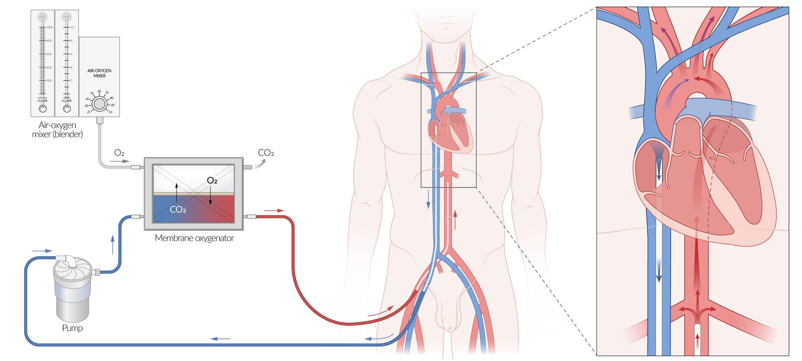

Venoarterial extracorporeal membrane oxygenation

---

## Complications

* <u>Acute decompensated heart failure</u> (see “<u>Acute heart failure</u>”)

* <u>Cardiorenal syndrome</u>

* <u>Cardiac arrhythmias</u>

* <u>Central sleep apnea</u>

* <u>Cardiogenic shock</u>

* <u>Stroke</u>: due to increased risk of <u>arterial thromboembolisms</u> (especially with concurrent <u>atrial fibrillation</u>)

* <u>Chronic kidney disease</u>

* Cardiac cirrhosis

* A complication of <u>right-sided heart failure</u> characterized by <u>cirrhosis</u> due to chronic <u>hepatic vein</u> congestion.

* Associated with "<u>nutmeg liver</u>" (diffuse mottling on imaging due to <u>ischemia</u> and fatty degeneration).

* <u>Venous stasis</u>, <u>leg ulcers</u>

We list the most important complications. The selection is not exhaustive.

---

## Cardiorenal syndrome

* Definition: a complex syndrome in which renal function progressively declines as a result of severe cardiac dysfunction [[48]](https://coursology-qbank.com/amboss/article/J-0syi)

* <u>Epidemiology</u>: occurs in ∼ 30% of patients with <u>acute decompensated heart failure</u>

* <u>AHA</u> classification [[49]](https://coursology-qbank.com/amboss/article/Fibgtt)

* Type 1: acute <u>cardiorenal syndrome</u> (most common subtype)

* <u>Heart</u> failure leading to <u>acute kidney injury</u>

* Examples: <u>acute coronary syndrome</u> and/or <u>acute heart failure</u> resulting in <u>acute kidney injury</u>

* Type 2: chronic <u>cardiorenal syndrome</u>

* Chronic <u>heart</u> failure leading to <u>chronic kidney disease</u>

* Example: chronic <u>heart</u> failure resulting in the new onset or progression of <u>chronic kidney disease</u>

* Type 3: acute renocardiac syndrome

* <u>Acute kidney injury</u> leading to <u>acute heart failure</u>

* Example: <u>heart</u> failure resulting from <u>acute kidney injury</u> due to <u>volume overload</u>

* Type 4: chronic renocardiac syndrome

* <u>Chronic kidney disease</u> leading to chronic <u>heart</u> failure

* Example: <u>LV hypertrophy</u> resulting from <u>chronic kidney disease</u>-associated <u>cardiomyopathy</u>

* Type 5: secondary <u>cardiorenal syndrome</u>

* Systemic disease leading to <u>kidney</u> and <u>heart</u> failure

* Examples: <u>cirrhosis</u>, <u>amyloidosis</u>

* Pathophysiology

* <u>Systolic dysfunction</u> → ↓ <u>cardiac output</u> → renal <u>hypoperfusion</u> → <u>prerenal kidney failure</u>

* <u>Diastolic dysfunction</u> → systemic venous congestion → renal venous congestion → ↓ transglomerular pressure gradient → ↓ <u>GFR</u> → ↓ <u>kidney</u> function

* <u>RAAS</u> activation → salt and fluid retention → <u>hypertension</u> → <u>hypertensive nephropathy</u>

* Diagnostics: ↓ <u>GFR</u>, ↑ <u>creatinine</u> that cannot be explained by underlying <u>kidney</u> disease

* Treatment: <u>heart</u> failure and <u>renal failure</u> management (see “<u>Acute renal injury</u>”)

* Prognosis: <u>CHF</u> with reduced <u>GFR</u> and high <u>creatinine</u> levels (> 3 mg/dL) is associated with a poor prognosis. [[50]](https://coursology-qbank.com/amboss/article/7wb44D)

---