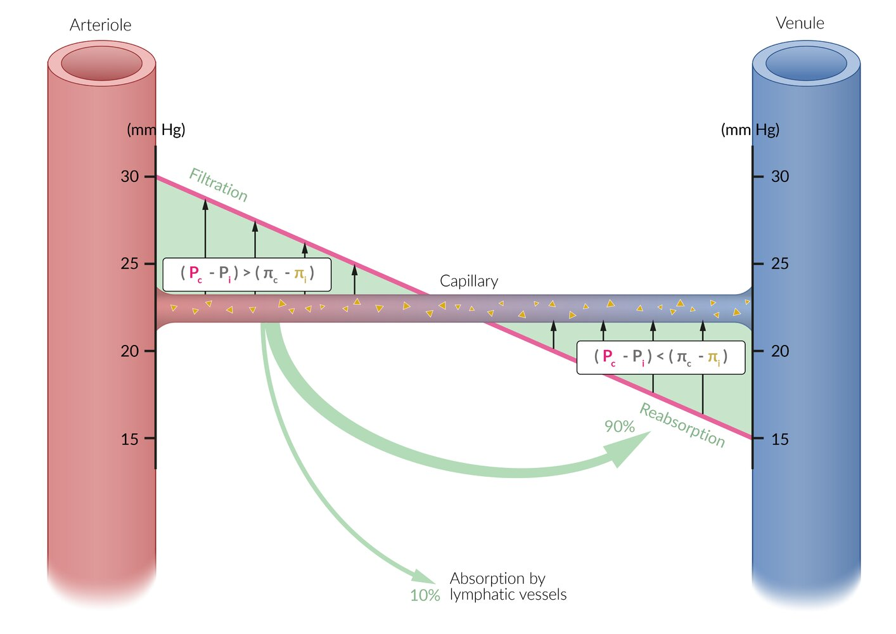

# Peripheral edema

*Categories: Clinical knowledge > Internal medicine > Cardiology and angiology > Heart failure > Peripheral edema*

[Original Article Link](https://coursology-qbank.com/amboss/article/SM0yLg)

---

## Summary

Peripheral <u>edema</u> is the accumulation of excess fluid in the tissues, particularly in the feet and legs. Although peripheral <u>edema</u> is often a manifestation of underlying systemic diseases, including <u>heart failure</u>, <u>kidney</u> disease (e.g., <u>nephrotic syndrome</u>), and <u>cirrhosis</u>, it can also result from localized issues such as <u>chronic venous insufficiency</u> or lymphatic obstruction and is a common side effect of some medications (e.g., <u>calcium channel blockers</u>). Peripheral <u>edema</u> manifests with swelling of the affected areas, which may be accompanied by <u>skin</u> tightness, discomfort, and, in severe cases, <u>pain</u>. Diagnosis involves a thorough <u>patient history</u> and <u>physical examination</u>, supported by laboratory tests and imaging studies to identify the underlying cause. Management strategies are primarily directed at treating the root cause of the <u>edema</u>, while symptoms can be relieved with limb elevation, compression therapy, and <u>diuretics</u> when <u>fluid overload</u> is a contributing factor.

<u>Pulmonary edema</u>, <u>pleural effusion</u>, <u>ascites</u>, <u>angioedema</u>, and <u>cerebral edema</u> are discussed in separate articles.

---

## Definitions

* <u>Edema</u>: abnormal fluid accumulation in the <u>interstitium</u> due to an imbalance in fluid <u>homeostasis</u> caused by either decreased absorption or increased secretion of fluid in the <u>interstitium</u>

* Peripheral <u>edema</u>: excess fluid in tissues <u>perfused</u> by the peripheral vascular system

* Dependent edema: the accumulation of fluid in the <u>interstitial space</u> in areas of the body influenced by gravity, e.g., the lower limbs in ambulatory individuals and the sacral area in patients who are not ambulatory

* Pitting edema: residual indentation following the application of pressure to the site of the swelling

* Nonpitting edema: no residual indentation following the application of pressure to the site of swelling

Pitting edema of lower leg

Pretibial myxedema

---

## Etiology

### Common etiologies by mechanism [[1]](https://coursology-qbank.com/amboss/article/H-WKAL0)[[2]](https://coursology-qbank.com/amboss/article/s-WtAL0)

Some <u>causes of peripheral edema</u> (e.g., <u>pregnancy</u>, <u>cirrhosis</u>) have more than one pathophysiological mechanism. See “<u>Capillary fluid exchange</u>” for more information on <u>vascular physiology</u>.

* Increased <u>capillary</u> pressure

* <u>Chronic venous insufficiency</u>

* <u>Heart failure</u>

* Medications, e.g., <u>calcium channel blockers</u>

* <u>Pregnancy</u>

* <u>Deep vein thrombosis</u>

* <u>Postthrombotic syndrome</u>

* <u>Cirrhosis</u>

* Decreased <u>oncotic pressure</u>: resulting from protein deficiency (mainly <u>hypoalbuminemia</u>) 

* <u>Protein-losing enteropathy</u>

* <u>Malnutrition</u>

* <u>Nephrotic syndrome</u>

* <u>Cirrhosis</u>

* <u>Pregnancy</u>

* Increased <u>capillary</u> permeability

* Inflammation

* Infection

* Toxins

* <u>Burns</u>

* <u>Allergic reaction</u>

* Trauma

* Lymphatic obstruction: <u>lymphedema</u>

* Other: <u>myxedema</u>

* <u>Hypothyroidism</u> (generalized <u>edema</u>)

* <u>Hyperthyroidism</u> (typically <u>pretibial myxedema</u>)

> [!TIP]
> The <u>etiology of peripheral edema</u> is often multifactorial. [[3]](https://coursology-qbank.com/amboss/article/J-WsyL0)

Capillary fluid exchange

### Common etiologies by site and acuity

|  Etiologies of bilateral vs. unilateral peripheral <u>edema</u> [[3]](https://coursology-qbank.com/amboss/article/J-WsyL0)[[4]](https://coursology-qbank.com/amboss/article/q-WCyL0)[[5]](https://coursology-qbank.com/amboss/article/HZdK1o0)  |  |  |
| --- | --- | --- |
|  | Bilateral | Unilateral |
|  Acute (< 72 hours) [[3]](https://coursology-qbank.com/amboss/article/J-WsyL0)  |   * Acute <u>heart failure</u>  * Medications  * <u>Nephrotic syndrome</u>  * <u>Acute kidney injury</u>  * Acute <u>decompensated cirrhosis</u>  * Bilateral or <u>proximal DVT</u>  * <u>IVC thrombosis</u> or <u>tumor</u>    |   * Unilateral <u>DVT</u>  * <u>Superficial thrombophlebitis</u>  * <u>Cellulitis</u>  * Inflammation or infection  * <u>Burns</u>  * <u>Allergic reaction</u>  * Trauma  * <u>Insect bites and stings</u>  * <u>Ruptured popliteal cyst</u>    |
|  Subacute (3 days to 3 months) [[3]](https://coursology-qbank.com/amboss/article/J-WsyL0)  |  |  |
|  Chronic (> 3 months) [[3]](https://coursology-qbank.com/amboss/article/J-WsyL0)  |   * <u>Chronic venous insufficiency</u>  * <u>Heart failure</u>  * <u>Nephrotic syndrome</u>  * <u>Cirrhosis</u>  * Medications  * <u>Pulmonary hypertension</u>  * <u>Malnutrition</u>, <u>malabsorption</u>  * Immobility  * <u>Pregnancy</u>  * <u>Lymphedema</u>  * <u>Obstructive sleep apnea</u> (<u>OSA</u>)  * <u>Thyroid disease</u>    |   * <u>Chronic venous insufficiency</u>  * <u>Postthrombotic syndrome</u>  * <u>Complex regional pain syndrome</u>  * <u>Lymphedema</u>  * Iliac <u>vein</u> compression  * <u>Gastrocnemius</u> <u>weakness</u>  [[5]](https://coursology-qbank.com/amboss/article/HZdK1o0)    |

### Medications that cause edema [[2]](https://coursology-qbank.com/amboss/article/s-WtAL0)[[3]](https://coursology-qbank.com/amboss/article/J-WsyL0)

The following list includes medications that commonly cause <u>edema</u>. It is not exhaustive.

* <u>Antihypertensives</u>

* <u>Calcium channel blockers</u>, especially <u>dihydropyridines</u>

* <u>Beta blockers</u>

* <u>Clonidine</u>

* <u>Hydralazine</u>

* <u>Methyldopa</u>

* <u>Gabapentinoids</u>

* <u>Hormones</u>

* <u>Corticosteroids</u>

* <u>Estrogen</u>

* <u>Progesterone</u>

* <u>Chemotherapy</u>

* <u>Docetaxel</u>

* <u>Gemcitabine</u>

* <u>Pemetrexed</u>

* <u>Lenalidomide</u>, <u>thalidomide</u>

* <u>Anticancer immunotherapy</u>

* <u>NSAIDs</u>

* <u>Thiazolidinediones</u>

* <u>MAO inhibitors</u>

* <u>Pramipexole</u>

---

## Subtypes and variants

### Anasarca

* Extreme generalized peripheral <u>edema</u>

* Typically caused by systemic illness, e.g., <u>liver</u> failure, <u>nephrotic syndrome</u>, <u>heart failure</u>, or severe <u>malnutrition</u>

### Periorbital edema

* <u>Edema</u> of the <u>soft tissues</u> that surround the orbital cavity

* Usually secondary to trauma, inflammation, protein deficiency (e.g., <u>nephrotic syndrome</u>), or <u>malignancy</u>

### Lipedema [[6]](https://coursology-qbank.com/amboss/article/r0dfho0)

* Definition: <u>loose connective tissue</u> disease characterized by the excessive accumulation of nodular and <u>fibrotic</u> fat, primarily in the limbs, hips, and buttocks

* <u>Epidemiology</u>: occurs almost exclusively in women

* Clinical features

* Symmetrical nonpitting swelling

* <u>Pain</u>, and tenderness in the affected areas

* Spares hands and feet

* Management includes:

* Weight loss programs: i.e., diet, exercise, and/or <u>bariatric surgery</u>  [[6]](https://coursology-qbank.com/amboss/article/r0dfho0)

* Compression garments

* Surgical removal (e.g., <u>liposuction</u>)

---