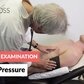
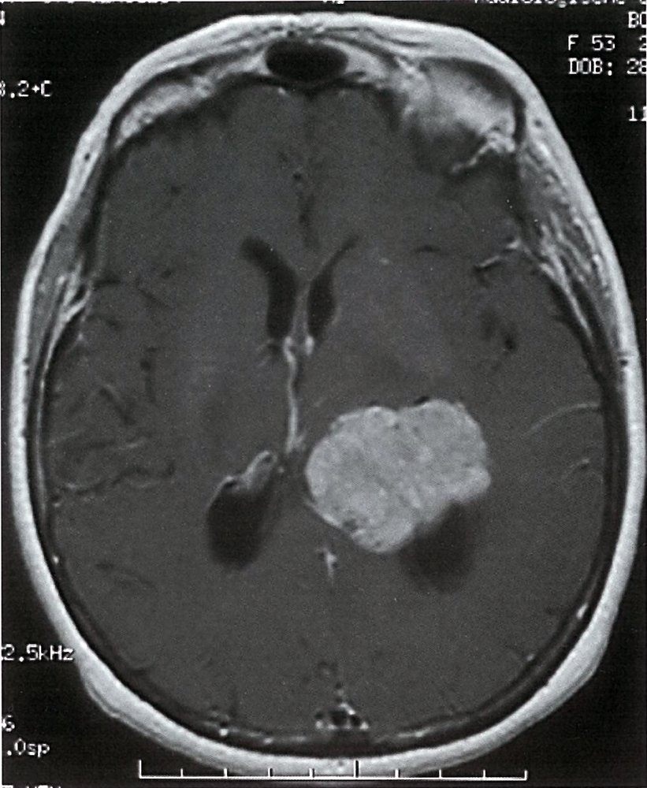
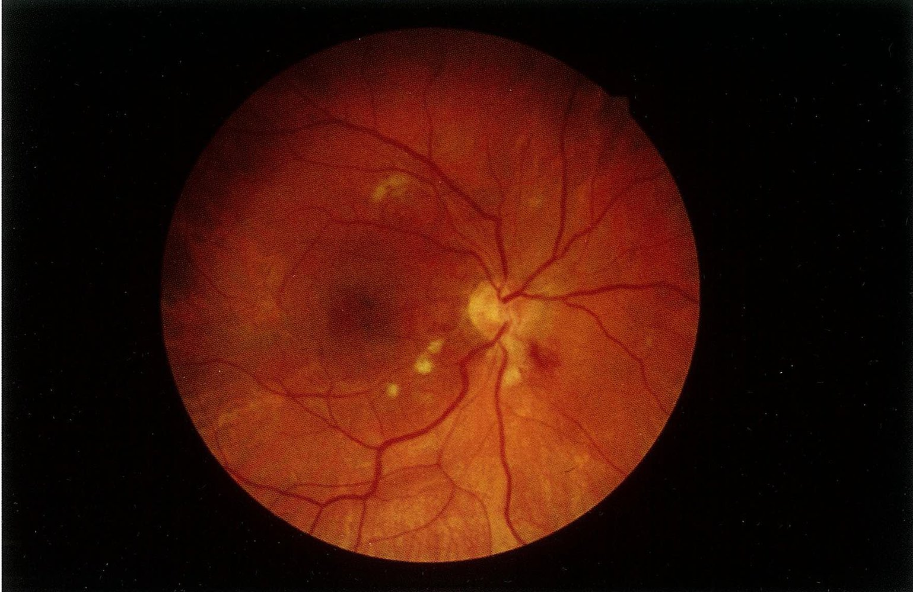

# Hypertension

*Categories: Clinical knowledge > Internal medicine > Cardiology and angiology > Hypertensive disorders > Hypertension*

[Original Article Link](https://coursology-qbank.com/amboss/article/Xh09cf)

---

## Summary

Hypertension (HTN) is a common condition that affects one in every three adults in the United States and is becoming increasingly prevalent among children. The 2017 American College of Cardiology (<u>ACC</u>)/American <u>Heart</u> Association (<u>AHA</u>) guidelines define hypertension in adults as a blood pressure of ≥ 130/80 mm Hg and the Eighth <u>Joint</u> National Committee (JNC 8) criteria specify ≥ 140/90 mm Hg. Hypertension can be classified as either primary (essential) or secondary. <u>Primary hypertension</u> accounts for ∼ 90% of cases of hypertension and has no detectable cause, whereas <u>secondary hypertension</u> is caused by a specific underlying condition. Typical underlying conditions include renal, endocrine, and vascular diseases (e.g., <u>renal failure</u>, <u>primary hyperaldosteronism</u>, <u>coarctation of the aorta</u>). Clinically, hypertension is usually asymptomatic until organ damage occurs, with the <u>brain</u>, <u>heart</u>, <u>kidneys</u>, and/or eyes (e.g., <u>retinopathy</u>, <u>myocardial infarction</u>, <u>stroke</u>) most commonly affected. If present, early <u>symptoms of hypertension</u> may include <u>headache</u>, <u>dizziness</u>, <u>tinnitus</u>, and chest discomfort. Hypertension is suspected if in-office blood pressure is persistently elevated on two or more separate measurements and is confirmed with out-of-office measurement. Further diagnostic measures include assessment of cardiovascular risk, evaluation of possible <u>target organ damage</u> (e.g., <u>kidney function tests</u>), and additional tests if an underlying disease is suspected. Treatment of <u>primary hypertension</u> includes lifestyle changes (e.g., diet, weight loss, exercise) and pharmacotherapy. Commonly prescribed <u>antihypertensive medications</u> include <u>angiotensin-converting enzyme inhibitors</u> (<u>ACEIs</u>), <u>angiotensin receptor blockers</u> (<u>ARBs</u>), <u>thiazide diuretics</u>, and <u>calcium channel blockers</u> (<u>CCBs</u>); pharmacological management of pediatric and pregnant patients differs, as some of these drugs are contraindicated in these patient populations. To treat <u>secondary hypertension</u>, the underlying cause needs to be addressed.

See also “<u>Hypertensive crisis</u>.”

Hypertension fact sheet

---

## Definitions

* Hypertension in adults 

* 2017 <u>ACC</u>/<u>AHA</u>: persistent systolic blood pressure (<u>SBP</u>) ≥ 130 mm Hg and/or <u>diastolic</u> blood pressure (<u>DBP</u>) ≥ 80 mm Hg [[1]](https://coursology-qbank.com/amboss/article/OzaIGM)

* 2020 International Society of Hypertension (<u>ISH</u>) and 2014 JNC 8: persistent <u>SBP</u> ≥ 140 mm Hg and/or <u>DBP</u> ≥ 90 mm Hg [[2]](https://coursology-qbank.com/amboss/article/oC00GR)[[3]](https://coursology-qbank.com/amboss/article/2MXTLA)

* <u>Hypertension in children</u>

* < 13 years of age: blood pressure ≥ 95th<u>percentile</u> or ≥ 130/80 mm Hg, whichever is lower [[4]](https://coursology-qbank.com/amboss/article/lnYvtp)

* ≥ 13 years of age: persistent systolic blood pressure (<u>SBP</u>) ≥ 130 mm Hg and/or <u>diastolic</u> blood pressure (<u>DBP</u>) ≥ 80 mm Hg  [[4]](https://coursology-qbank.com/amboss/article/lnYvtp)

* Primary hypertension: hypertension with no identifiable cause

* <u>Secondary hypertension</u>: hypertension caused by an identifiable underlying condition

* Resistant hypertension: hypertension that remains uncontrolled (≥ 130/80 mm Hg) despite treatment with ≥ 3 <u>antihypertensives</u> OR requires ≥ 4 medications to be controlled  [[1]](https://coursology-qbank.com/amboss/article/OzaIGM)[[5]](https://coursology-qbank.com/amboss/article/0WcePY0)[[6]](https://coursology-qbank.com/amboss/article/WbcPsa0)

---

## Epidemiology

* <u>Prevalence</u>  [[1]](https://coursology-qbank.com/amboss/article/OzaIGM)

* Hypertension affects between approximately one-third and one-half of adults in the US. [[8]](https://coursology-qbank.com/amboss/article/ZbcZHa0)[[9]](https://coursology-qbank.com/amboss/article/5Mci610)

* <u>Primary hypertension</u>:  accounts for ∼ 90% of cases of hypertension in adults and <u>prevalence</u> is increasing in children and <u>adolescents</u>. [[1]](https://coursology-qbank.com/amboss/article/OzaIGM)[[4]](https://coursology-qbank.com/amboss/article/lnYvtp)[[10]](https://coursology-qbank.com/amboss/article/VbcGsa0)

* <u>Secondary hypertension</u>:  accounts for ∼ 10% of cases of hypertension in adults [[1]](https://coursology-qbank.com/amboss/article/OzaIGM)

* <u>Prevalence</u> increases with age: Approximately 65–75% of adults develop hypertension by 65–74 years of age.  [[11]](https://coursology-qbank.com/amboss/article/fMXkLA)

* Rates are highest in African American individuals, followed by white individuals, and lowest in Asian American and Hispanic individuals.  [[8]](https://coursology-qbank.com/amboss/article/ZbcZHa0)[[12]](https://coursology-qbank.com/amboss/article/ebcxsa0)[[13]](https://coursology-qbank.com/amboss/article/Xec9xY0)[[14]](https://coursology-qbank.com/amboss/article/jMc_o10)

* ∼ 60–87% of <u>overweight</u> and ∼ 73–95% of <u>obese</u> patients are affected. [[15]](https://coursology-qbank.com/amboss/article/J90soR)

* Sex [[1]](https://coursology-qbank.com/amboss/article/OzaIGM)

* <u>♂</u> > <u>♀</u> below 65 years of age

* After <u>menopause</u>, <u>prevalence</u> increases in women.

Epidemiological data refers to the US, unless otherwise specified.

---

## Etiology

### <u>Primary hypertension</u> [[1]](https://coursology-qbank.com/amboss/article/OzaIGM)[[8]](https://coursology-qbank.com/amboss/article/ZbcZHa0)

* Multifactorial etiology including <u>epigenetic</u>, genetic, and environmental factors

* Directly related to <u>total peripheral resistance</u> and <u>cardiac output</u>

* Risk factors for primary hypertension

* <u>Nonmodifiable risk factors</u>

* Positive <u>family history</u>

* Race and ethnicity

* Advanced age

* <u>Modifiable risk factors</u>

* <u>Overweight</u> and <u>obesity</u> (greatest <u>modifiable risk factor</u>)

* Uncontrolled <u>diabetes</u>

* Smoking

* Excessive <u>alcohol</u> intake

* Diet high in <u>sodium</u>  and low in <u>potassium</u>

* Physical inactivity

* Psychological <u>stress</u>

### <u>Secondary hypertension</u>

See “<u>Secondary hypertension</u>.”

---

## Clinical features

* Hypertension is usually asymptomatic until:

* Complications of <u>end-organ damage</u> arise (see “Complications” below)

* Or an acute increase in blood pressure occurs (see “<u>Hypertensive crisis</u>”)

* <u>Secondary hypertension</u> usually manifests with symptoms of the underlying disease.

* Nonspecific <u>symptoms of hypertension</u>

* <u>Headaches</u>, esp. early morning or waking <u>headache</u>

* <u>Dizziness</u>, <u>tinnitus</u>, blurred <u>vision</u>

* Flushed appearance

* <u>Epistaxis</u>

* Chest discomfort, <u>palpitations</u>

* Strong, <u>bounding pulse</u> on palpation

* Nervousness

* Fatigue, <u>sleep</u> disturbances

> [!TIP]
> Since hypertension is often asymptomatic, regular screening is necessary to prevent <u>end-organ damage</u>.

---

## Subtypes and variants

### White coat and <u>masked hypertension</u> [[1]](https://coursology-qbank.com/amboss/article/OzaIGM)

These subtypes can be distinguished either by <u>ambulatory blood pressure measurement</u> (<u>ABPM</u>) or <u>home blood pressure monitoring</u> (<u>HBPM</u>).

|  Interpretation of blood pressure readings [[1]](https://coursology-qbank.com/amboss/article/OzaIGM)[[16]](https://coursology-qbank.com/amboss/article/obc0ua0)  |  |  |  |
| --- | --- | --- | --- |
|  |  | In-office blood pressure | Out-of-office blood pressure |
|  Sustained hypertension   |  |  * Elevated   |  * Elevated   |
|  <u>White coat hypertension</u> (isolated clinic hypertension) |  |  * Elevated   |  * Normal   |
|  <u>Masked hypertension</u> (isolated ambulatory hypertension) |  |  * Normal   |  * Elevated   |

#### White coat hypertension [[1]](https://coursology-qbank.com/amboss/article/OzaIGM)[[16]](https://coursology-qbank.com/amboss/article/obc0ua0)

* Definition: elevated blood pressure readings in a clinical setting but normal readings when measured elsewhere

* Cause: primarily due to <u>anxiety</u> and <u>stress</u> associated with being in a medical environment

* Diagnostics

* Confirm true elevation of the in-office blood pressure measurements.

* Take different blood pressure measurements several minutes apart (after the patient has had time to relax).

* Take blood pressure measurements on several visits (at least two).

* Consider screening using daytime <u>ABPM</u> (preferable) or <u>HBPM</u> in patients with in-office blood pressure ≥ 130/89 mm Hg and ≤ 160/100 mm Hg after a 3-month trial of lifestyle changes.

* Diagnosis is confirmed in patients with: [[1]](https://coursology-qbank.com/amboss/article/OzaIGM)

* In-office readings ≥ 130/89 mm Hg and ≤ 160/100 mm Hg

* AND out-of-office readings < 130/80 mm Hg

* Management

* Continue <u>lifestyle changes for managing hypertension</u>.

* Repeat <u>ABPM</u> or <u>HBPM</u> annually to monitor for progression to sustained hypertension.

> [!TIP]
> In patients with <u>white coat hypertension</u>, the <u>incidence</u> of conversion to sustained hypertension is ∼ 1–5% per year. It is unclear if the risk of <u>ASCVD</u> is increased; this likely depends on the presence of additional <u>risk factors</u>. [[1]](https://coursology-qbank.com/amboss/article/OzaIGM)[[16]](https://coursology-qbank.com/amboss/article/obc0ua0)

> [!TIP]
> The term “<u>white coat effect</u>” refers to patients who are already diagnosed with hypertension and experience an additional increase in blood pressure when in a clinical setting.

#### Masked hypertension [[1]](https://coursology-qbank.com/amboss/article/OzaIGM)[[16]](https://coursology-qbank.com/amboss/article/obc0ua0)

* Definition: normal blood pressure readings in a clinical setting but consistently elevated readings when measured elsewhere

* Screening: Consider <u>ABPM</u> or <u>HBPM</u> in adults with consistent in-office <u>SBP</u> 120–129 mm Hg or <u>DBP</u> 75–79 mm Hg.  [[8]](https://coursology-qbank.com/amboss/article/ZbcZHa0)

* Management

* Continue <u>lifestyle changes for managing hypertension</u>.

* Start pharmacological <u>treatment of hypertension</u>.

* Repeat <u>ABPM</u> or <u>HBPM</u> annually.

> [!TIP]
> Patients with <u>masked hypertension</u> have a similar risk of <u>stroke</u>, cardiovascular disease, and <u>all-cause mortality</u> to those with sustained hypertension. [[1]](https://coursology-qbank.com/amboss/article/OzaIGM)[[16]](https://coursology-qbank.com/amboss/article/obc0ua0)

### Isolated systolic hypertension [[17]](https://coursology-qbank.com/amboss/article/MXcMAa0)[[18]](https://coursology-qbank.com/amboss/article/nXc7Aa0)

* Definition: elevated <u>SBP</u> (≥ 140 mm Hg) with <u>DBP</u> within normal limits (≤ 90 mm Hg)

* Etiology [[17]](https://coursology-qbank.com/amboss/article/MXcMAa0)

* Most common: decreased arterial elasticity and compliance due to <u>aging</u>

* May also be secondary to increased <u>cardiac output</u> due to:

* <u>Anemia</u>

* <u>Hyperthyroidism</u>

* Chronic <u>aortic regurgitation</u>

* <u>AV fistula</u>

* Clinical features

* Often asymptomatic

* Signs of increased <u>pulse pressure</u>: e.g., head pounding, rhythmic nodding, bobbing of the head in synchrony with the heartbeat

* <u>Symptoms of hypertension</u>

* Diagnostics

* Assess for secondary causes.

* See “<u>Diagnosis of hypertension</u>” for details on diagnostic testing.

* Treatment

* Recommend <u>lifestyle changes for managing hypertension</u>.

* Start pharmacological <u>treatment of hypertension</u>.

* First-line medication: <u>thiazide diuretics</u> or dihydropyridine <u>calcium antagonists</u> [[18]](https://coursology-qbank.com/amboss/article/nXc7Aa0)

* Treatment goal: <u>SBP</u> < 140 mm Hg

> [!TIP]
> Patients with <u>isolated systolic hypertension</u> have a high risk of renal dysfunction and cardiovascular events, e.g., <u>myocardial infarction</u>, <u>stroke</u>.

---

## Secondary hypertension

### Signs suggestive of secondary hypertension [[1]](https://coursology-qbank.com/amboss/article/OzaIGM)[[19]](https://coursology-qbank.com/amboss/article/nbc78a0)

* Severe hypertension

* <u>Resistant hypertension</u>

* <u>Target organ damage</u> disproportionate to the degree of hypertension

* <u>Hypertensive emergency</u>

* Unusual onset of hypertension

* Abrupt onset

* Onset at < 30 years of age [[10]](https://coursology-qbank.com/amboss/article/VbcGsa0)

* Onset of <u>diastolic</u> hypertension at > 65 years of age

* Exacerbation of previously controlled hypertension

* Drug-induced hypertension

* Unprovoked or significant <u>hypokalemia</u>

> [!WARNING]
> <u>Aortic dissection</u> is a (rare) life-threatening cause of <u>secondary hypertension</u> that may manifest with a blood pressure difference between the right and left arm.

### Causes of secondary hypertension [[1]](https://coursology-qbank.com/amboss/article/OzaIGM)[[10]](https://coursology-qbank.com/amboss/article/VbcGsa0)[[10]](https://coursology-qbank.com/amboss/article/VbcGsa0)[[19]](https://coursology-qbank.com/amboss/article/nbc78a0)

* Most common causes in adults include:

* < 40 years of age: <u>thyroid</u> dysfunction, <u>fibromuscular dysplasia</u>, and renal <u>parenchymal</u> disease

* 40–64 years of age: hyperaldosteronism, <u>thyroid</u> dysfunction, and <u>obstructive sleep apnea</u>

* ≥ 65 years of age: <u>renal artery stenosis</u>

* Most common causes in children and <u>adolescents</u> (< 18 years of age) include renal <u>parenchymal</u> disease and <u>coarctation of the aorta</u>.

> [!TIP]
> Young adults (especially women < 40 years of age) with suspected <u>secondary hypertension</u> should be assessed for <u>renal artery stenosis</u> caused by <u>fibromuscular dysplasia</u>.

> [!NOTE]
> RECENT: Renal (e.g., <u>renal artery stenosis</u>, <u>glomerulonephritis</u>), Endocrine (e.g., <u>Cushing syndrome</u>, <u>hyperthyroidism</u>, <u>Conn syndrome</u>), Coarctation of the aorta, Estrogen (<u>oral contraceptives</u>), Neurological (<u>raised intracranial pressure</u>, <u>psychostimulants</u> use), and Treatment (e.g., <u>glucocorticoids</u>, <u>NSAIDs</u>) are the <u>causes of secondary hypertension</u>.

#### Renal hypertension

Any renal disease can potentially trigger hypertension.

* <u>Renal artery stenosis</u> (e.g., due to <u>atherosclerosis</u>, <u>fibromuscular dysplasia</u>, <u>polyarteritis nodosa</u>, <u>aortic arch syndrome</u>) 

* Potential indications for further workup

* <u>Resistant hypertension</u>

* Recurrent <u>flash pulmonary edema</u>

* Abdominal <u>bruit</u>

* ↑ Serum <u>creatinine</u> (by ≥ 50%) within 1 week of starting an <u>ACEI</u> or <u>ARB</u> [[19]](https://coursology-qbank.com/amboss/article/nbc78a0)

* <u>Hypokalemia</u> [[20]](https://coursology-qbank.com/amboss/article/XIX9Yz)[[21]](https://coursology-qbank.com/amboss/article/cIXabz)

* Asymmetric <u>kidney</u> size

* Workup and findings: <u>Duplex ultrasonography</u> or <u>MRA</u> or <u>CTA</u> of the <u>renal arteries</u>

* Renal <u>parenchymal</u> disease:  (e.g., due to <u>glomerulonephritis</u>, <u>polycystic kidney disease</u>, <u>systemic lupus erythematosus</u>, renal tumors, <u>atrophic</u> <u>kidney</u>)

* Potential indications for further workup

* Urinary symptoms

* History of excessive <u>analgesic</u> use

* <u>Family history</u> of <u>polycystic kidney disease</u>

* Abdominal mass (<u>ADPKD</u>)

* ↑ Serum <u>creatinine</u>

* Abnormal <u>urine analysis</u> (e.g., <u>hematuria</u>, <u>proteinuria</u>)

* Workup and findings: <u>Renal ultrasound</u>

* <u>Chronic kidney disease</u>

#### Endocrine hypertension

|  Common causes of <u>endocrine hypertension</u> [[1]](https://coursology-qbank.com/amboss/article/OzaIGM)  |  |  |
| --- | --- | --- |
|  | Potential indication for further workup | Typical findings |
| <u>Primary hyperaldosteronism</u> (<u>Conn syndrome</u>) |   * <u>Resistant hypertension</u>  * <u>Stroke</u> at < 40 years of age  * <u>Family history</u> of early-onset hypertension and/or <u>primary hyperaldosteronism</u>  * <u>Adrenal incidentaloma</u>  * Possible <u>hypokalemia</u> with consequent <u>metabolic alkalosis</u>  [[1]](https://coursology-qbank.com/amboss/article/OzaIGM)    |   * ↑ <u>Plasma aldosterone concentration</u> (≥ 10 ng/dL)  * ↓ <u>Plasma renin activity</u> (< 1.0 ng/mL/hour)  * ↑ <u>Aldosterone-to-renin ratio</u> on a morning blood sample [[22]](https://coursology-qbank.com/amboss/article/UbcbGa0)    |
| <u>Pheochromocytoma</u> |   * <u>Resistant hypertension</u>  * <u>Paroxysmal</u> hypertension  * Episodes of <u>headaches</u>, <u>palpitations</u>, and <u>diaphoresis</u>  * <u>Family history</u> of endocrine tumors  * Cutaneous features suggestive of <u>NF type 1</u>    |   * ↑ 24-hour urinary fractionated <u>metanephrines</u>  * ↑ Plasma <u>metanephrines</u>    |
| <u>Hypercortisolism</u> (<u>Cushing syndrome</u>) |   * Weight gain  * <u>Osteoporosis</u>  * Facial <u>plethora</u>, <u>skin</u> thinning, <u>striae</u>  * <u>Muscle weakness</u>  * <u>Hyperglycemia</u>    |  * ↑ Serum <u>cortisol</u> following a low-dose <u>dexamethasone suppression test</u>   |
| <u>Hyperthyroidism</u> |  * Heat intolerance, <u>diarrhea</u>, <u>tachycardia</u>, and/or <u>tremor</u>   |  * ↓ <u>TSH</u>, ↑ free T4   |
| <u>Primary hyperparathyroidism</u> |   * Typically asymptomatic  * ↑ Serum <u>calcium</u>    |   * ↑ <u>PTH</u> level  * ↓ Serum <u>phosphates</u>    |
| <u>Congenital adrenal hyperplasia</u> |   * <u>11β-hydroxylase</u> deficiency: <u>virilization</u>  * <u>17α-hydroxylase</u> deficiency  * Incomplete masculinization (males)  * <u>Primary amenorrhea</u> (females)  * <u>Hypokalemia</u>    |  * ↑ <u>17-hydroxyprogesterone</u>   |
| <u>Acromegaly</u> |  * <u>Clinical features of acromegaly</u>, including:  * <u>Tumor</u> <u>mass effects</u> like <u>bitemporal hemianopia</u>  * Typical facial features   |  * ↑ Serum <u>IGF-1</u>   |

> [!TIP]
> It is not necessary to stop a patient's <u>antihypertensive medications</u> prior to testing for <u>primary hyperaldosteronism</u>. [[22]](https://coursology-qbank.com/amboss/article/UbcbGa0)

#### Other

* <u>Coarctation of the aorta</u> <u>distal</u> to the <u>left subclavian artery</u>

* Potential indications for further workup: Blood pressure difference between the upper and lower limbs

* Workup and findings

* Doppler <u>echocardiography</u>

* <u>X-ray chest</u>

* <u>CTA</u> or <u>MRA</u> chest and abdomen

* <u>Obstructive sleep apnea</u>

* Pathophysiology: ↑ <u>catecholamines</u> during <u>apneic</u> phases → <u>secondary hypertension</u>

* Potential indications for further workup

* <u>Resistant hypertension</u>

* <u>Obesity</u>, snoring, and/or daytime sleepiness

* Nondipping pattern on 24-hour blood pressure monitoring

* Workup and findings: <u>sleep studies</u> often leads to resolution of hypertension.

* <u>Continuous positive airway pressure</u> (<u>CPAP</u>)

* Substance-related

* Potential indications for further workup

* <u>Recreational drug</u> use: <u>amphetamines</u>, <u>cocaine</u>, <u>phencyclidine</u>

* <u>Caffeine</u>, <u>nicotine</u>, and/or <u>alcohol</u> use

* Use of certain medications: <u>sympathomimetic drugs</u> (e.g., decongestants), <u>corticosteroids</u>, <u>NSAIDs</u>, <u>oral contraceptives</u>

* Workup and findings

* <u>Urine drug screening</u>

* Response to withdrawal of suspected culprit

### Management

* Management of <u>secondary hypertension</u> depends on the suspected cause; involve specialists (e.g., endocrinologist or nephrologist) early.

* See “<u>Approach to management of hypertension</u>.”

---

## Diagnosis

### Approach [[1]](https://coursology-qbank.com/amboss/article/OzaIGM)

* Screen patients using in-office <u>blood pressure measurement</u>.

* Confirm elevated values with <u>ABPM</u> or <u>HBPM</u>.

* Perform a thorough <u>physical examination</u> and obtain initial <u>laboratory studies</u>.

* <u>Stratify</u> patients by cardiovascular risk (using the <u>ASCVD risk</u> estimator tool).

* Evaluate for <u>target organ damage</u>.

* Consider diagnostic workup for secondary causes of hypertension in patients with:

* Abnormalities identified during <u>evaluation for newly diagnosed hypertension</u>

* <u>Signs suggestive of secondary hypertension</u>

ASCVD risk calculator (2013 ACC/AHA pooled cohort equations)

### Screening for hypertension [[8]](https://coursology-qbank.com/amboss/article/ZbcZHa0)

* Indications

* Annual screening [[1]](https://coursology-qbank.com/amboss/article/OzaIGM)

* Individuals > 40 years of age

* Adults of any age with <u>risk factors for primary hypertension</u>

* Screening every 3–5 years: individuals 18–39 years of age with previously normal blood pressure (< 130/85 mm Hg) and no <u>risk factors</u>

* Method: in-office <u>blood pressure measurement</u>

* If elevated, measurements should be repeated on both arms.

* Elevated average blood pressure on at least two readings obtained on at least two separate visits supports a <u>diagnosis of hypertension</u>. [[1]](https://coursology-qbank.com/amboss/article/OzaIGM)

> [!TIP]
> ∼ 20% of individuals with high blood pressure are unaware they have hypertension. [[23]](https://coursology-qbank.com/amboss/article/W1cPfY0)

### Diagnostic confirmation [[1]](https://coursology-qbank.com/amboss/article/OzaIGM)[[8]](https://coursology-qbank.com/amboss/article/ZbcZHa0)[[24]](https://coursology-qbank.com/amboss/article/0bceHa0)

Out-of-office measurement is recommended in all individuals for confirmation of hypertension before initiating treatment.

* Ambulatory blood pressure measurement (<u>ABPM</u>): preferred method

* A device measures blood pressure at fixed intervals (e.g., every 15–30 minutes) over 12–24 hours.

* Takes measurements while the individual is carrying out normal activities during the day and at nighttime

* Home blood pressure monitoring (<u>HBPM</u>): Blood pressure is measured by the individual at periodic intervals.

> [!TIP]
> Patients should be taught to measure their own blood pressure to allow for long-term monitoring and assessment of treatment.

### Evaluation of patients with newly diagnosed hypertension [[1]](https://coursology-qbank.com/amboss/article/OzaIGM)[[3]](https://coursology-qbank.com/amboss/article/2MXTLA)[[19]](https://coursology-qbank.com/amboss/article/nbc78a0)

The initial exam should focus on evaluation for <u>signs indicating secondary hypertension</u> and <u>target organ damage</u>, and the <u>assessment of ASCVD risk</u>. [[25]](https://coursology-qbank.com/amboss/article/1bc2sa0)

* <u>Physical examination</u> and <u>patient history</u>

* <u>BMI</u> and <u>waist circumference</u>

* <u>Neurological examination</u> [[19]](https://coursology-qbank.com/amboss/article/nbc78a0)[[25]](https://coursology-qbank.com/amboss/article/1bc2sa0)

* <u>Cardiac examination</u>

* Routine studies

* <u>Fasting blood glucose</u>

* Serum <u>sodium</u>, <u>potassium</u>, and <u>calcium</u> levels

* <u>Renal function tests</u>: serum <u>creatinine</u> and <u>eGFR</u>

* <u>CBC</u>

* <u>TSH</u>

* <u>Lipid profile</u> (<u>HDL</u>, <u>LDL</u>, and <u>triglycerides</u> levels)

* <u>Urinalysis</u> and urinary <u>albumin-to-creatinine ratio</u>

* <u>Electrocardiogram</u> (<u>ECG</u>)

* Additional studies

* <u>Hemoglobin</u> A1c

* <u>Fundoscopy</u>

* <u>Liver chemistries</u>  [[3]](https://coursology-qbank.com/amboss/article/2MXTLA)

* Serum <u>uric acid</u>

* <u>Echocardiogram</u>

> [!TIP]
> The initial evaluation should include an assessment for <u>orthostatic hypotension</u> (by measuring blood pressure while sitting and standing), especially in older adults. All adults ≤ 30 years of age with elevated brachial blood pressure should also have their blood pressure measured in their thigh to rule out <u>coarctation of the aorta</u>. [[1]](https://coursology-qbank.com/amboss/article/OzaIGM)

> [!TIP]
> Some experts recommend that all individuals with hypertension be tested for <u>primary hyperaldosteronism</u> at least once because of its relatively high <u>prevalence</u> in patients with hypertension. [[5]](https://coursology-qbank.com/amboss/article/0WcePY0)[[22]](https://coursology-qbank.com/amboss/article/UbcbGa0)

Measuring Blood Pressure - Measuring Vital Signs

---

## Management

Recommendations regarding indications for treatment and target blood pressure differ between clinical practice guidelines. The following recommendations are consistent with those in the 2017 <u>ACC</u>/<u>AHA</u> guidelines unless specified otherwise.  [[1]](https://coursology-qbank.com/amboss/article/OzaIGM)[[2]](https://coursology-qbank.com/amboss/article/oC00GR)[[3]](https://coursology-qbank.com/amboss/article/2MXTLA)[[26]](https://coursology-qbank.com/amboss/article/cbcasa0)[[27]](https://coursology-qbank.com/amboss/article/A1cRjY0)

### Approach [[1]](https://coursology-qbank.com/amboss/article/OzaIGM)

* <u>Lifestyle changes for managing hypertension</u>: for all patients with <u>SBP</u> > 120 mm Hg or <u>DBP</u> > 80 mm Hg

* Identify <u>indications for antihypertensive treatment</u>.

* Select <u>first-line antihypertensive medication</u> based on individual patient characteristics (see also “<u>Antihypertensive treatment by comorbidities</u>”)

* Titrate treatment to reach target blood pressure. ;  [[1]](https://coursology-qbank.com/amboss/article/OzaIGM)[[2]](https://coursology-qbank.com/amboss/article/oC00GR)[[3]](https://coursology-qbank.com/amboss/article/2MXTLA)

* Most adults: blood pressure < 130/80 mm Hg

* Individualize targets based on age and comorbidities.

* Follow-up regularly: reassess indications for pharmacological treatment and tailor therapy to individual needs.

### Nonpharmacological measures

* Lifestyle measures alone may be trialed for 3–6 months in patients with:  [[5]](https://coursology-qbank.com/amboss/article/0WcePY0) 

* Elevated blood pressure

* Stage 1 hypertension and <u>10-year ASCVD risk</u> < 10 %

|  Lifestyle changes for managing hypertension [[1]](https://coursology-qbank.com/amboss/article/OzaIGM)[[5]](https://coursology-qbank.com/amboss/article/0WcePY0)[[19]](https://coursology-qbank.com/amboss/article/nbc78a0)  |  |  |  |
| --- | --- | --- | --- |
|  Intervention (in order of <u>effectiveness</u>) |  | Target | Approximate <u>SBP</u> reduction in hypertensive patients |
| Weight loss(most effective measure) |  |  * <u>Ideal body weight</u>   |  * 1 mm Hg per kg reduction in body weight in <u>overweight</u> individuals   |
| Diet |  DASH diet  |   * Diet rich in fruits, vegetables, and whole grains  [[28]](https://coursology-qbank.com/amboss/article/GVcBDY0)  * Low in saturated and trans fats    |  * 11 mm Hg   |
| Decrease dietary sodium |  * Daily <u>sodium</u> intake < 1500 mg  [[5]](https://coursology-qbank.com/amboss/article/0WcePY0)[[25]](https://coursology-qbank.com/amboss/article/1bc2sa0)[[28]](https://coursology-qbank.com/amboss/article/GVcBDY0)   |  * 5–6 mm Hg   |  |
| Increase dietary <u>potassium</u> |  * Daily <u>potassium</u> intake 3.5–5 g (preferably by increasing fruit and vegetable intake)  [[29]](https://coursology-qbank.com/amboss/article/gEbFEv)   |  * 4–5 mm Hg   |  |
| Decrease <u>alcohol</u> intake |   * <u>♂</u>: ≤ 2 <u>standard drinks</u> daily; <u>♀</u>: ≤ 1 <u>standard drink</u> daily  * Provide counseling on <u>alcohol use disorder</u>, if necessary.    |  * 4 mm Hg   |  |
| Exercise |  Aerobic [[30]](https://coursology-qbank.com/amboss/article/d1cofY0)  |  * 90–150 minutes per week  [[5]](https://coursology-qbank.com/amboss/article/0WcePY0)[[28]](https://coursology-qbank.com/amboss/article/GVcBDY0)   |  * 5–8 mm Hg   |
|  Dynamic resistance (e.g., weight training) |  * 90–150 minutes per week   |  * 4 mm Hg   |  |
|  Isometric resistance (e.g., hand grip exercise) |  * Three sessions per week   |  * 5 mm Hg   |  |

> [!TIP]
> <u>Smoking cessation</u> should be advised in all patients to reduce <u>ASCVD risk</u>. [[1]](https://coursology-qbank.com/amboss/article/OzaIGM)

> [!TIP]
> Consider possible psychosocial factors or <u>social determinants of health</u> that may be contributing to the patient's high blood pressure (e.g., <u>stress</u>, <u>anxiety</u>, lack of access to fresh food) and make appropriate referrals where necessary. [[5]](https://coursology-qbank.com/amboss/article/0WcePY0)

> [!WARNING]
> Increased <u>potassium</u> intake should not be recommended for patients with advanced <u>CKD</u>. [[29]](https://coursology-qbank.com/amboss/article/gEbFEv)

---

## Pharmacological treatment

### Indications for antihypertensive treatment [[1]](https://coursology-qbank.com/amboss/article/OzaIGM)[[2]](https://coursology-qbank.com/amboss/article/oC00GR)[[3]](https://coursology-qbank.com/amboss/article/2MXTLA)[[31]](https://coursology-qbank.com/amboss/article/_1c5jY0)[[32]](https://coursology-qbank.com/amboss/article/Y0cnea0)

The thresholds for pharmacological treatment are controversial and vary depending on age (see “Hypertension in older adults”); the following recommendations are based on the 2017 <u>ACC</u>/<u>AHA</u> guidelines.

* Adults with <u>SBP</u> ≥ 130 mm Hg or <u>DBP</u> ≥ 80 mm Hg and ≥ 1 of the following:

* <u>Clinical ASCVD</u> (e.g., <u>ischemic heart disease</u>, <u>peripheral artery disease</u>, or previous <u>stroke</u>) or <u>congestive heart failure</u> (<u>CHF</u>)

* <u>10-year ASCVD risk</u> ≥ 10%;  (based on the <u>ACC</u>/<u>AHA</u> Pooled Cohort Equations; includes age ≥ 65 years and <u>diabetes mellitus</u>)

* All adults with <u>SBP</u> ≥ 140 mm Hg or <u>DBP</u> ≥ 90 mm Hg

ASCVD risk calculator (2013 ACC/AHA pooled cohort equations)

### Initial medication [[1]](https://coursology-qbank.com/amboss/article/OzaIGM)[[2]](https://coursology-qbank.com/amboss/article/oC00GR)[[19]](https://coursology-qbank.com/amboss/article/nbc78a0)

Choice of initial medication should be based on the following:

* Patient's initial blood pressure ;  [[1]](https://coursology-qbank.com/amboss/article/OzaIGM)[[3]](https://coursology-qbank.com/amboss/article/2MXTLA)[[33]](https://coursology-qbank.com/amboss/article/a0cQea0)

* <u>SBP</u> 130–139 mm Hg or <u>DBP</u> 80–89 mm Hg (stage 1 hypertension): Consider initial monotherapy.

* <u>SBP</u> ≥ 140 mm Hg or <u>DBP</u> ≥ 90 mm Hg (stage 2 hypertension) AND an average blood pressure > 20/10 mm Hg above target

* Initiate combination therapy.

* Prescribe combination pills if possible.

* Commonly used combinations are an <u>ACEI</u> or <u>ARB</u> PLUS either a <u>dihydropyridine CCB</u> OR a <u>thiazide</u>-type <u>diuretic</u>.

* Additional factors to consider

* Major comorbidities (see “<u>Antihypertensive treatment by comorbidities</u>”)

* Major contraindications

* Adverse effects that may be unacceptable to patients

* Patient race: For Black patients (including individuals with <u>diabetes</u>) without <u>CHF</u> or <u>CKD</u>, initial <u>antihypertensive therapy</u> should include a <u>thiazide</u>-type <u>diuretic</u> or <u>CCB</u>.  [[12]](https://coursology-qbank.com/amboss/article/ebcxsa0)[[34]](https://coursology-qbank.com/amboss/article/Xbc9Ha0)

> [!TIP]
> To maximize <u>medication adherence</u>, prescribe generic medications in dosing regimens comprising as few pills as few times a day as possible (use combination pills whenever clinically appropriate), and provide a 90-day medication supply once the dosage is stable.

#### First-line options

|  First-line antihypertensive medications [[1]](https://coursology-qbank.com/amboss/article/OzaIGM)[[19]](https://coursology-qbank.com/amboss/article/nbc78a0)[[25]](https://coursology-qbank.com/amboss/article/1bc2sa0)[[35]](https://coursology-qbank.com/amboss/article/bbcHHa0)  |  |  |  |
| --- | --- | --- | --- |
| Drug class |  | Examples | Indications |
| <u>ACEIs</u> |  |   * <u>Lisinopril</u> DOSAGE [[1]](https://coursology-qbank.com/amboss/article/OzaIGM)  * <u>Enalapril</u> DOSAGE [[1]](https://coursology-qbank.com/amboss/article/OzaIGM)  * <u>Captopril</u> DOSAGE [[1]](https://coursology-qbank.com/amboss/article/OzaIGM)    |  * Nephroprotective, therefore preferred in patients with:  * <u>Diabetes mellitus</u> and <u>albuminuria</u>  * Renal disease [[36]](https://coursology-qbank.com/amboss/article/uVcpwY0)   |
| <u>ARBs</u> |  |   * <u>Losartan</u> DOSAGE [[1]](https://coursology-qbank.com/amboss/article/OzaIGM)  * <u>Valsartan</u> DOSAGE [[1]](https://coursology-qbank.com/amboss/article/OzaIGM)    |  |
| <u>Thiazide diuretics</u> |  |   * <u>Chlorthalidone</u> DOSAGE  [[1]](https://coursology-qbank.com/amboss/article/OzaIGM)[[25]](https://coursology-qbank.com/amboss/article/1bc2sa0)  * <u>Hydrochlorothiazide</u> DOSAGE [[1]](https://coursology-qbank.com/amboss/article/OzaIGM)    |  * Preferred:  * As one of the initial <u>antihypertensive medications</u> in Black patients [[2]](https://coursology-qbank.com/amboss/article/oC00GR)  * In patients with <u>isolated systolic hypertension</u> [[17]](https://coursology-qbank.com/amboss/article/MXcMAa0)[[18]](https://coursology-qbank.com/amboss/article/nXc7Aa0)   |
|  Dihydropyridine <u>CCBs</u> [[19]](https://coursology-qbank.com/amboss/article/nbc78a0)  |  |   * <u>Amlodipine</u> DOSAGE (preferred) [[1]](https://coursology-qbank.com/amboss/article/OzaIGM)[[5]](https://coursology-qbank.com/amboss/article/0WcePY0)  * <u>Nifedipine</u> DOSAGE [[1]](https://coursology-qbank.com/amboss/article/OzaIGM)    |  |
| Nondihydropyridine <u>CCBs</u> |  |   * <u>Diltiazem</u> DOSAGE [[1]](https://coursology-qbank.com/amboss/article/OzaIGM)  * <u>Verapamil</u> DOSAGE [[1]](https://coursology-qbank.com/amboss/article/OzaIGM)    |  * Less commonly used   |

> [!TIP]
> First-line medications for <u>primary hypertension</u> are <u>thiazide diuretics</u>, <u>ACEIs</u>, <u>ARBs</u>, and <u>dihydropyridine CCBs</u>.

> [!WARNING]
> Do not prescribe an <u>ACEI</u> and <u>ARB</u> together or in combination with a <u>direct renin inhibitor</u>. This increases the risk of <u>hyperkalemia</u> and renal dysfunction and does not provide additional benefit. [[1]](https://coursology-qbank.com/amboss/article/OzaIGM)[[19]](https://coursology-qbank.com/amboss/article/nbc78a0)

#### Second-line options

|  Second-line antihypertensive medications [[1]](https://coursology-qbank.com/amboss/article/OzaIGM)[[25]](https://coursology-qbank.com/amboss/article/1bc2sa0)  |  |  |  |  |  |  |
| --- | --- | --- | --- | --- | --- | --- |
| Drug class |  |  |  |  | Examples | Indications |
| <u>Beta blockers</u> |  |  |  |  |   * Combined alpha- and <u>beta-adrenergic receptor</u> <u>antagonists</u>  * <u>Carvedilol</u> DOSAGE [[1]](https://coursology-qbank.com/amboss/article/OzaIGM)  * <u>Labetalol</u> DOSAGE [[1]](https://coursology-qbank.com/amboss/article/OzaIGM)  * Noncardioselective  * <u>Nadolol</u> DOSAGE [[1]](https://coursology-qbank.com/amboss/article/OzaIGM)  * <u>Propranolol</u> DOSAGE [[1]](https://coursology-qbank.com/amboss/article/OzaIGM)  * Cardioselective  * <u>Atenolol</u> DOSAGE [[1]](https://coursology-qbank.com/amboss/article/OzaIGM)  * <u>Bisoprolol</u> DOSAGE [[1]](https://coursology-qbank.com/amboss/article/OzaIGM)  * <u>Metoprolol</u> <u>succinate</u> DOSAGE[[1]](https://coursology-qbank.com/amboss/article/OzaIGM)    |  * Recommended for first-line use only in patients with the following comorbidities:  * <u>Ischemic heart disease</u>  * <u>Heart failure</u>  [[1]](https://coursology-qbank.com/amboss/article/OzaIGM)  * <u>Atrial fibrillation</u>  * Thoracic aortic disease (e.g., <u>aortic dissection</u>, <u>thoracic aortic aneurysm</u>)  * <u>Thyrotoxicosis</u>  * <u>Migraine</u>  * <u>Essential tremor</u>   |
| <u>Loop diuretics</u> |  |  |  |  |   * <u>Furosemide</u> DOSAGE [[1]](https://coursology-qbank.com/amboss/article/OzaIGM)  * <u>Torsemide</u> DOSAGE [[1]](https://coursology-qbank.com/amboss/article/OzaIGM)    |  * Preferred choice of <u>diuretic</u> in patients with symptomatic <u>heart failure</u> and <u>CKD</u> (if <u>GFR</u> < 30 mL/min)   |
| <u>Potassium-sparing diuretics</u> |  |  | <u>Aldosterone antagonists</u> |  |   * Steroidal  * <u>Spironolactone</u> DOSAGE [[1]](https://coursology-qbank.com/amboss/article/OzaIGM)  * <u>Eplerenone</u> DOSAGE  [[1]](https://coursology-qbank.com/amboss/article/OzaIGM)  * Nonsteroidal: finerenone DOSAGE    |   * Preferred in hypertension due to <u>primary hyperaldosteronism</u>  * Frequently used as add-on therapy in <u>resistant hypertension</u>    |
|  <u>Epithelial sodium channel blockers</u>  |  |   * <u>Amiloride</u> DOSAGE [[1]](https://coursology-qbank.com/amboss/article/OzaIGM)  * <u>Triamterene</u> DOSAGE [[1]](https://coursology-qbank.com/amboss/article/OzaIGM)    |  * Consider as add-on therapy for patients with <u>hypokalemia</u> who are receiving <u>thiazides</u>.   |  |  |  |
| <u>Direct renin inhibitors</u> |  |  |  |  |  * <u>Aliskiren</u> DOSAGE   |  * Rarely used   |
| <u>Alpha-1 blockers</u> |  |  |  |  |   * <u>Prazosin</u> DOSAGE [[1]](https://coursology-qbank.com/amboss/article/OzaIGM)  * <u>Doxazosin</u> DOSAGE [[1]](https://coursology-qbank.com/amboss/article/OzaIGM)    |   * Used in hypertension caused by <u>pheochromocytoma</u>  * May be used as an adjunct in patients with <u>benign prostatic hypertrophy</u>    |
| <u>Alpha-2 agonists</u> |  |  |  |  |   * <u>Clonidine</u> DOSAGE  [[1]](https://coursology-qbank.com/amboss/article/OzaIGM)  * <u>Methyldopa</u> DOSAGE [[1]](https://coursology-qbank.com/amboss/article/OzaIGM)    |  * Rarely used   |
| Direct arteriolar <u>vasodilators</u> |  |  |  |  |   * <u>Hydralazine</u> DOSAGE [[1]](https://coursology-qbank.com/amboss/article/OzaIGM)  * <u>Minoxidil</u> DOSAGE  [[1]](https://coursology-qbank.com/amboss/article/OzaIGM)    |  * <u>Hydralazine</u> is a treatment option in pregnant patients.   |

> [!WARNING]
> Patients with <u>CKD</u> or baseline <u>potassium</u> > 5.5 mEq/L and those who take <u>potassium</u> supplements or <u>potassium-sparing</u> drugs are at higher risk of <u>hyperkalemia</u> as an adverse effect from pharmacological <u>treatment for hypertension</u>. [[1]](https://coursology-qbank.com/amboss/article/OzaIGM)[[25]](https://coursology-qbank.com/amboss/article/1bc2sa0)[[28]](https://coursology-qbank.com/amboss/article/GVcBDY0)

> [!WARNING]
> Do not abruptly discontinue <u>beta blockers</u> or <u>alpha-2 agonists</u>. They must be slowly tapered to avoid triggering rebound hypertension. [[1]](https://coursology-qbank.com/amboss/article/OzaIGM)

Renin-angiotensin-aldosterone system

### Treatment based on comorbidities

|  Antihypertensive treatment by comorbidities [[1]](https://coursology-qbank.com/amboss/article/OzaIGM)  |  |  |
| --- | --- | --- |
| Comorbidity | Treatment recommendations |  |
|  History of <u>stroke</u> or <u>TIA</u> [[37]](https://coursology-qbank.com/amboss/article/wXchZY0)  |   * Initial therapy  * Monotherapy: <u>thiazides</u>, <u>ACEIs</u>, or <u>ARBs</u>  * Combination therapy: <u>thiazides</u> PLUS either <u>ACEIs</u> or <u>ARBs</u>  * Treatment goal: blood pressure < 130/80 mm Hg in most patients [[1]](https://coursology-qbank.com/amboss/article/OzaIGM)    |  |
| <u>Chronic coronary disease</u> |   * Initial therapy: <u>ACEIs</u>, <u>ARBs</u>, or <u>beta blockers</u> depending on the indication (e.g., <u>beta blockers</u> post-<u>MI</u>) [[38]](https://coursology-qbank.com/amboss/article/b1dH2K0)  * Add-on therapy  * For patients with <u>angina</u>: <u>dihydropyridine CCBs</u>  * For patients without <u>angina</u>: <u>dihydropyridine CCBs</u>, <u>thiazides</u>, OR <u>aldosterone antagonists</u>  * Treatment goal: blood pressure < 130/80 mm Hg    |  |
|  <u>CKD</u> [[28]](https://coursology-qbank.com/amboss/article/GVcBDY0)  |   * Initial therapy  [[1]](https://coursology-qbank.com/amboss/article/OzaIGM)[[28]](https://coursology-qbank.com/amboss/article/GVcBDY0)  * For patients with <u>microalbuminuria</u> and <u>diabetes</u>, or with <u>overt proteinuria</u>: <u>ACEIs</u> or <u>ARBs</u>  * For patients with <u>microalbuminuria</u> but no <u>diabetes</u>: Consider <u>ACEIs</u> or <u>ARBs</u>.  * See “<u>Pharmacotherapy for CKD</u>” for details.  * Treatment goal: <u>SBP</u> < 120 mm Hg (if tolerated)  [[1]](https://coursology-qbank.com/amboss/article/OzaIGM)[[28]](https://coursology-qbank.com/amboss/article/GVcBDY0)    |  |
| <u>Diabetes</u> |   * Initial therapy  * For patients with <u>microalbuminuria</u> or <u>overt proteinuria</u>: <u>ACEIs</u> or <u>ARBs</u> (protective against <u>diabetic nephropathy</u>)  [[1]](https://coursology-qbank.com/amboss/article/OzaIGM)[[28]](https://coursology-qbank.com/amboss/article/GVcBDY0)[[39]](https://coursology-qbank.com/amboss/article/kicm7X0)[[40]](https://coursology-qbank.com/amboss/article/AFXRk-)  * For patients without <u>albuminuria</u>: any first-line agent (<u>ACEIs</u>, <u>ARBs</u>, <u>CCBs</u>, OR <u>thiazide diuretics</u>)  * Treatment goal: blood pressure < 130/80 mm Hg    |  |
| <u>CHF</u> |   * Initial therapy  * <u>HFrEF</u>: <u>guideline-directed medical therapy</u>  * <u>Beta blockers</u> (<u>carvedilol</u>, or <u>metoprolol</u> <u>succinate</u>, or <u>bisoprolol</u>)  * Recommended for use in compensated <u>CHF</u>  * Must be used cautiously in <u>decompensated CHF</u>  * Contraindicated in <u>cardiogenic shock</u>  * <u>Diuretics</u>, including <u>aldosterone antagonists</u>  * <u>ACEIs</u> OR <u>ARBs</u>  * <u>Angiotensin receptor-neprilysin inhibitor</u>  * <u>HFpEF</u>   * Current <u>volume overload</u>: <u>diuretics</u>  * No current <u>volume overload</u>: <u>ACEIs</u> or <u>ARBs</u> PLUS <u>beta blockers</u>  * Avoid <u>nitrates</u>.  * Treatment goals [[1]](https://coursology-qbank.com/amboss/article/OzaIGM)  * <u>HFrEF</u>: blood pressure < 130/80 mm Hg  * <u>HFpEF</u>: <u>SBP</u> < 130 mm Hg    |  |
|  <u>Asthma</u> [[41]](https://coursology-qbank.com/amboss/article/sVctDY0)  |  * Initial therapy  * <u>ARBs</u>, <u>CCB</u>, OR <u>thiazide diuretics</u> (no preference)  * Cautions  * Avoid <u>beta blockers</u> unless for a particular indication.  * Use <u>cardioselective beta blockers</u> when necessary (noncardioselective <u>beta blockers</u> can cause bronchoconstriction).  * <u>ARBs</u> may be preferred over <u>ACEIs</u> (increased risk of <u>cough</u>)   |  |
| <u>Osteoporosis</u> |  * Initial therapy: <u>thiazide diuretics</u> (↓ renal <u>calcium</u> excretion → ↓ bone loss)   |  |
| <u>Gout</u> |  * Initial therapy  * <u>ARBs</u> (e.g., <u>losartan</u>, have an <u>uricosuric</u> effect), <u>ACEIs</u>, and <u>CCBs</u>  * <u>Thiazide diuretics</u> should be avoided (↑ <u>uric acid</u> levels).   |  |
| <u>Migraine</u> |  * Initial therapy: <u>beta blockers</u> OR <u>CCBs</u>   |  |

> [!WARNING]
> Do not use <u>nondihydropyridine CCBs</u> in patients with <u>HFrEF</u> because of their <u>myocardial</u> depressant effects. [[1]](https://coursology-qbank.com/amboss/article/OzaIGM)

> [!TIP]
> <u>Beta blockers</u> can mask <u>symptoms of hypoglycemia</u> in patients with <u>diabetes mellitus</u>.

---

## Long-term management and follow-up

### General principles [[1]](https://coursology-qbank.com/amboss/article/OzaIGM)[[2]](https://coursology-qbank.com/amboss/article/oC00GR)[[5]](https://coursology-qbank.com/amboss/article/0WcePY0)

Goals include evaluating <u>medication adherence</u>, monitoring treatment and relevant <u>laboratory studies</u>, and adjusting medication.

* Patients on nonpharmacological treatment alone: Follow up after 3–6 months.
* If blood pressure is uncontrolled: Initiate pharmacological treatment.

* Most patients initiated on pharmacological treatment: Follow up after ∼ 1 month. 

* If blood pressure is uncontrolled: Continue to escalate therapy at one-month intervals.

* Once blood pressure is controlled: Reassess after 3–6 months and annually thereafter if blood pressure remains stable.

### <u>Laboratory studies</u> [[1]](https://coursology-qbank.com/amboss/article/OzaIGM)[[2]](https://coursology-qbank.com/amboss/article/oC00GR)[[5]](https://coursology-qbank.com/amboss/article/0WcePY0)

* Serum <u>electrolytes</u>

* For most patients, check at the one-month follow-up visit.

* Checking after ∼ 2 weeks may be reasonable in certain patients, e.g.:

* Patients with initial low serum <u>sodium</u> who were started on a <u>thiazide diuretic</u>  [[42]](https://coursology-qbank.com/amboss/article/YecnxY0)

* Patients with <u>CKD</u> and initial high <u>creatinine</u> or high normal <u>potassium</u> who were started on an <u>ACEI</u> or <u>ARB</u>  [[28]](https://coursology-qbank.com/amboss/article/GVcBDY0)

* Serum <u>creatinine</u>

* Check within 2–4 weeks in patients with <u>CKD</u> who were started on an <u>ACEI</u> or <u>ARB</u>.

* Discontinuation of <u>ACEIs</u> or <u>ARBs</u> is usually not necessary if <u>creatinine</u> increases by < 30% from baseline without concomitant <u>hyperkalemia</u> or fluid retention. [[28]](https://coursology-qbank.com/amboss/article/GVcBDY0)

### Medication <u>titration</u> [[1]](https://coursology-qbank.com/amboss/article/OzaIGM)

* Adjust medication based on adverse effects, e.g.:

* <u>Hyponatremia</u>: Discontinue or avoid <u>thiazide diuretics</u>; consider <u>loop diuretics</u> if necessary.

* <u>Hypokalemia</u>: Consider initiating a <u>potassium-sparing diuretic</u> after ruling out hyperaldosteronism.

* <u>Hyperkalemia</u>: Consider restricting dietary <u>potassium</u> or initiating a <u>thiazide diuretic</u> or <u>cation-exchange polymer</u> after ruling out <u>pseudohyperkalemia</u>.

* <u>Cough</u> in patients on <u>ACEIs</u>: Switch to an <u>ARB</u>.

* Adjust medication to reach optimal blood pressure control. 

* Ask about <u>medication adherence</u>.  [[6]](https://coursology-qbank.com/amboss/article/WbcPsa0)

* If indicated, adjust medications using one of the following strategies:  [[2]](https://coursology-qbank.com/amboss/article/oC00GR)[[25]](https://coursology-qbank.com/amboss/article/1bc2sa0)[[43]](https://coursology-qbank.com/amboss/article/SWYykL)

* Increasing the dose of the initial drug

* Switching to another drug (“sequential monotherapy”)  [[44]](https://coursology-qbank.com/amboss/article/SLcyC10)

* Adding a second drug (in the form of a single combination pill, if possible)

* If the treatment goal cannot be reached with two drugs: [[1]](https://coursology-qbank.com/amboss/article/OzaIGM)[[35]](https://coursology-qbank.com/amboss/article/bbcHHa0)

* Add a third drug.

* Evaluate for <u>secondary hypertension</u>, if indicated.

> [!WARNING]
> Therapeutic inertia (failure on the part of the physician to appropriately escalate treatment when indicated) is one possible reason for poor blood pressure control. Be sure to reassess the treatment plan at each visit. [[45]](https://coursology-qbank.com/amboss/article/c1cafY0)

---

## Special patient groups

Select patient groups (e.g., children, older adults, pregnant patients) require specialized management if hypertension develops. <u>Hypertension in children</u> and hypertension in older adults are covered below. <u>Hypertensive pregnancy disorders</u> are covered in a separate article.

---

## Complications

* Arterial hypertension is the most common <u>risk factor for cardiovascular disease</u>

* It leads to changes in the vascular <u>endothelium</u>, particularly of the small vessels, and can therefore affect any organ system.

* See also “<u>Hypertensive crisis</u>.”

### <u>Cardiovascular system</u> (hypertensive vascular disease) [[53]](https://coursology-qbank.com/amboss/article/890O6R)[[54]](https://coursology-qbank.com/amboss/article/6C0jGR)

* <u>Left ventricular hypertrophy</u>, <u>hypertrophic cardiomyopathy</u>, <u>dilated cardiomyopathy</u>

* <u>Congestive heart failure</u>

* <u>Coronary artery disease</u> and <u>myocardial infarction</u>

* <u>Atrial fibrillation</u>

* <u>Aortic aneurysm</u>

* <u>Aortic dissection</u>

* <u>Carotid artery stenosis</u>

* <u>Peripheral artery disease</u>

* <u>Atherosclerosis</u>

### <u>Brain</u> [[53]](https://coursology-qbank.com/amboss/article/890O6R)[[54]](https://coursology-qbank.com/amboss/article/6C0jGR)[[55]](https://coursology-qbank.com/amboss/article/qRaCL4)

* <u>Stroke</u> , <u>TIA</u>

* <u>Subcortical leukoencephalopathy</u>

* Cognitive changes such as <u>memory</u> loss

Basal ganglia hemorrhage

### <u>Kidneys</u> [[54]](https://coursology-qbank.com/amboss/article/6C0jGR)[[56]](https://coursology-qbank.com/amboss/article/bC0HqR)

* Hypertensive nephrosclerosis: a <u>renal vascular injury</u> secondary to long-standing arterial hypertension

* Pathophysiology: chronic hypertension → <u>hypertrophy</u> of <u>medial</u> and <u>intimal</u> layers → narrowing of <u>afferent arterioles</u> → ↓ <u>glomerular</u> blood flow → <u>glomerular</u> and tubular <u>ischemia</u> → arteriolonephrosclerosis and <u>fibrosis</u> (<u>focal segmental glomerulosclerosis</u>) → <u>end-stage renal disease</u>

* Clinical findings

* Initially <u>microalbuminuria</u> and <u>microhematuria</u>

* ↑ <u>BUN</u>, Cr, and <u>uric acid</u> levels

* Nephrosclerosis with <u>proteinuria</u> (usually < 1 g/day) and progressive <u>renal failure</u> occur with disease progression.

* Diagnostics: <u>renal biopsy</u> shows vascular, <u>glomerular</u>, and tubulointerstitial changes [[57]](https://coursology-qbank.com/amboss/article/YW1nPf0)

* Arterial and arteriolar <u>medial</u> <u>hypertrophy</u>, <u>intimal</u> thickening, and hyalinosis

* <u>Global</u> <u>glomerulosclerosis</u> (more common) or <u>focal segmental glomerulosclerosis</u>

* Tubulointerstitial <u>fibrosis</u>

* Treatment: <u>ACE-inhibitors</u> (first-line), <u>ARBs</u>

* <u>Chronic kidney disease</u>

### Eyes [[53]](https://coursology-qbank.com/amboss/article/890O6R)[[54]](https://coursology-qbank.com/amboss/article/6C0jGR)

* Hypertensive retinopathy

* Arteriosclerotic and hypertension-related changes of the retinal vessels

* Initial reactive <u>vasoconstriction</u> (vasospasm), followed by <u>sclerosis</u> with breakdown of blood-retinal barrier and subsequent hemorrhage and exudation

* <u>Fundoscopic examination</u>

* <u>Cotton wool spots</u>

* <u>Retinal hemorrhages</u> (i.e., flame-shaped hemorrhages)

* Microaneurysms

* Macular star (results from exudation into the <u>macula</u>)

* <u>Hard exudates</u>

* Arteriovenous nicking: a tapering of a retinal <u>venule</u> at the point where a retinal <u>arteriole</u> crosses the retinal <u>venule</u>

* Hourglass shape on <u>fundoscopic examination</u>

* Associated with advanced <u>hypertensive retinopathy</u>.

* Elschnig spots: multiple, round, brown-black spots with a bright ring that are scattered throughout the <u>retina</u>

* Marked swelling and prominence of the <u>optic disk</u> with indistinct borders due to <u>papilledema</u> and <u>optic atrophy</u> (end-stage disease)

* The presence of <u>papilledema</u> in a hypertensive patient may indicate a <u>hypertensive crisis</u> and warrants urgent lowering of blood pressure (see “<u>Hypertensive crisis</u>”).

|  Classification system according to Keith-Wagener-Barker [[53]](https://coursology-qbank.com/amboss/article/890O6R)  |  |  |
| --- | --- | --- |
| Grade | Findings | Symptoms |
| Grade I | Vessel diameter variation: arteriolar constriction and <u>tortuosity</u>  | Usually asymptomatic |
| Grade II |  <u>Gunn sign</u> and marked constriction of vessels and <u>sclerosis</u> of <u>arterioles</u>  |  |
| Grade III | Cotton wool <u>exudates</u>, <u>hard exudates</u>, <u>retinal hemorrhage</u>, retinal <u>edema</u>, macular star formation | Decreased and/or blurred <u>vision</u>, <u>headaches</u>  |
| Grade IV |  <u>Papilledema</u>, <u>optic atrophy</u>  |  |

> [!TIP]
> Local treatment of <u>retinopathy</u> is not possible, therefore, systemic reduction of blood pressure is critical.

Grade IV hypertensive retinopathy

Bilateral papilledema

We list the most important complications. The selection is not exhaustive.

---