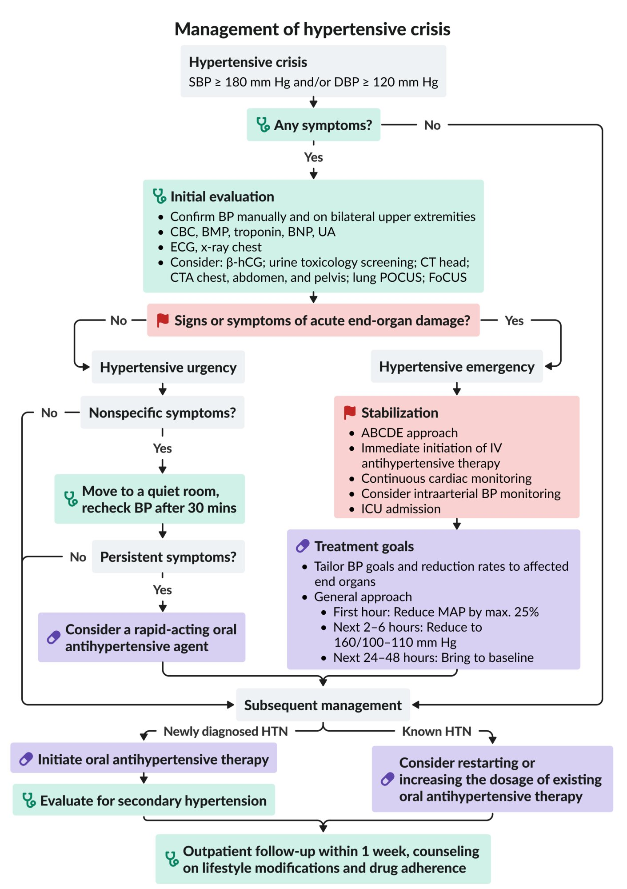

# Hypertensive crises

*Categories: Clinical knowledge > Internal medicine > Cardiology and angiology > Hypertensive disorders > Hypertensive crises*

[Original Article Link](https://coursology-qbank.com/amboss/article/Uq0bBS)

---

## Summary

Hypertensive crises refer to acute increases in blood pressure (generally defined as ≥ 180/120 mm Hg) that cause or increase the risk of <u>end-organ damage</u>, i.e., damage to the <u>brain</u> (e.g., <u>encephalopathy</u>, <u>stroke</u>), eyes (e.g., <u>retinopathy</u>), <u>cardiovascular system</u> (e.g., <u>ACS</u>, <u>pulmonary edema</u>, <u>aortic dissection</u>), and/or <u>kidneys</u> (e.g., <u>acute kidney injury</u>). They can be due to <u>primary hypertension</u> or precipitated by underlying conditions (e.g., <u>pheochromocytoma</u>, <u>pre-eclampsia</u>, drug toxicity). Management consists of rapidly identifying <u>end-organ damage</u> with <u>patient history</u>, <u>physical examination</u>, and focused testing, and determining whether the rapid lowering of the blood pressure with <u>IV antihypertensives</u> is required. The ideal IV <u>antihypertensive agent</u> is determined by the underlying disorder, end-organ systems affected, and other patient factors. In the absence of end-organ damage, hypertensive crises should be managed with rapid follow-up and oral <u>antihypertensives</u>, as the prognosis is poor if they are left untreated. See also <u>hypertension</u>.

---

## Definitions

* Preferred terminology

* Hypertensive crisis (acute severe <u>hypertension</u>): systolic blood pressure ≥ 180 mm Hg and/or <u>diastolic</u> blood pressure ≥ 120 mm Hg  [[2]](https://coursology-qbank.com/amboss/article/OzaIGM)

* Hypertensive urgency: hypertensive crisis that is either asymptomatic or associated with isolated nonspecific symptoms (e.g., <u>headache</u>, <u>dizziness</u>, or <u>epistaxis</u>) without signs of acute organ damage  [[3]](https://coursology-qbank.com/amboss/article/DxY1Ar)[[4]](https://coursology-qbank.com/amboss/article/Wn1PHh0)

* Hypertensive emergency: hypertensive crisis with signs of acute end-organ damage, mainly in the cardiovascular, central nervous, and renal systems (see “Clinical features” below)

* Historical terminology

* <u>Accelerated hypertension</u>: identical to <u>hypertensive emergency</u>

* Malignant hypertension: severe <u>hypertension</u> that occurs with <u>retinopathy</u> (flame hemorrhages, <u>papilledema</u>)  [[5]](https://coursology-qbank.com/amboss/article/vxYAyr)

Hypertensive crises fact sheet

---

## Etiology

* Drug-related

* Nonadherence to <u>antihypertensives</u>

* Drugs that may exacerbate <u>hypertension</u> (e.g., <u>MAO inhibitors</u>, <u>TCAs</u>, NSAIDS, <u>cocaine</u>, <u>amphetamines</u>, <u>ecstasy</u>, stimulant diet pills)

* Consumption of foods rich in <u>tyramine</u> (e.g., wine, chocolate, aged cheese, cured meat) during therapeutic use of <u>MAOIs</u>

* Combination or overlap (e.g., due to incorrect <u>washout periods</u>) of <u>MAOIs</u> with other drugs that increase the <u>monoamine</u> concentration (e.g., <u>SSRIs</u>)

* <u>Pheochromocytoma</u>, <u>hyperthyroidism</u>

* Acute and rapidly progressive renal disorders

* <u>Collagen vascular diseases</u> (e.g., <u>SLE</u>)

* <u>Eclampsia</u>/<u>Pre-eclampsia</u>

* <u>Head trauma</u>, spinal cord disorders

---

## Clinical features

### Clinical features of <u>hypertensive urgency</u>

* Asymptomatic or isolated, nonspecific symptoms (e.g., <u>headache</u>, <u>dizziness</u>, or <u>epistaxis</u>)  [[6]](https://coursology-qbank.com/amboss/article/35YSPp)[[7]](https://coursology-qbank.com/amboss/article/fEYkEI)

### Clinical features of hypertensive emergency

Signs and symptoms of <u>end-organ dysfunction</u>

* Cardiac

* <u>Heart failure exacerbation</u>, <u>de novo heart failure</u>, <u>flash pulmonary edema</u>: <u>dyspnea</u>, <u>crackles</u> on examination

* <u>Myocardial infarction</u>: <u>chest pain</u>, <u>diaphoresis</u>

* <u>Aortic dissection</u>: <u>chest pain</u>, asymmetric pulses

* Neurological [[8]](https://coursology-qbank.com/amboss/article/6L1jAh0)

* Hypertensive encephalopathy

* Pathophysiology: severe <u>hypertension</u> → failure of <u>CNS</u> blood flow autoregulation → <u>vasodilation</u> and hyperperfusion → <u>cerebral edema</u>

* Symptoms: <u>headache</u>, <u>vomiting</u>, confusion, <u>seizure</u>, blurry <u>vision</u>, <u>papilledema</u>

* <u>Ischemic</u> or hemorrhagic <u>stroke</u>: <u>focal neurological deficits</u>, <u>altered mental status</u>

* <u>Posterior reversible encephalopathy syndrome</u>: <u>seizures</u>, <u>headache</u>, visual changes, <u>altered mental status</u>

* Renal: Acute hypertensive nephrosclerosis (formerly <u>malignant nephrosclerosis</u>)

* <u>Acute kidney injury</u> (<u>azotemia</u> and/or <u>oliguria</u>, <u>edema</u>) and <u>microhematuria</u>

* Pathophysiology: severe <u>hypertension</u> → acute <u>thrombotic</u> microangiopathy → <u>thrombosis</u> of <u>glomerular</u> <u>capillaries</u> and <u>red blood cell</u> extravasation and fragmentation as well as luminal <u>thrombosis</u> of <u>arterioles</u> → <u>infarction</u> and <u>necrosis</u> of <u>endothelial</u> and mesangial cells → decreased <u>glomerular</u> blood flow → acute <u>kidney</u> damage

* <u>Biopsy</u>: <u>petechial</u> subcapsular hemorrhages, <u>renal infarction</u>, and segmental <u>capillary</u> loop <u>necrosis</u> with <u>crescent formation</u>

* Ophthalmic
* Acute <u>hypertensive retinopathy</u>: blurry <u>vision</u>, decrease in <u>visual acuity</u>, retinal flame hemorrhages, <u>papilledema</u>, <u>Elschnig spots</u>

* Other
* <u>Microangiopathic hemolytic anemia</u>: fatigue, <u>pallor</u>

> [!TIP]
> Suspect <u>hypertensive encephalopathy</u> in a patient presenting with diffuse neurological symptoms, severe <u>hypertension</u>, and nonspecific or normal <u>neuroimaging</u>. [[8]](https://coursology-qbank.com/amboss/article/6L1jAh0)

### Red flags for hypertensive emergency

The following symptoms in a patient with severe <u>hypertension</u> should raise suspicion for a <u>hypertensive emergency</u>:

* <u>Dyspnea</u>

* <u>Chest pain</u>

* <u>Altered mental status</u>

* <u>Focal neurological symptoms</u>

### Additional clinical features that may be present

* Signs of <u>sympathomimetic toxicity</u>

* In pregnant patients (in the second or <u>third trimester</u> ): <u>signs of preeclampsia</u> or <u>eclampsia</u> (see “<u>Clinical features of hypertensive pregnancy disorders</u>”)

* Signs of <u>catecholamine</u>-secreting tumors (see “<u>Clinical features of pheochromocytoma</u>”)

Hypertensive crises fact sheet

---

## Treatment

### Approach [[2]](https://coursology-qbank.com/amboss/article/OzaIGM)[[7]](https://coursology-qbank.com/amboss/article/fEYkEI)

#### <u>Hypertensive urgency</u>

* Usually, no immediate intervention is required for asymptomatic patients.

* Consider oral <u>antihypertensive agents</u> and monitoring if nonspecific symptoms are present.

* See “<u>Management of hypertensive urgency</u>” for details.

#### <u>Hypertensive emergencies</u>

See “<u>Management of hypertensive emergencies</u>” for further information.

* General therapeutic goals

* First hour: Reduce BP by max. 25% to prevent coronary insufficiency and to ensure adequate <u>cerebral perfusion pressure</u>.

* Subsequent 2–6 hours: Reduce BP to ∼ 160/100–110 mm Hg.

* Next 24–48 hours: Reduce BP to the patient's baseline.

* Special cases: i.e., conditions with unique therapeutic strategies

* <u>Stroke</u>: targets vary based on multiple factors

* See “<u>Antihypertensives in ischemic stroke</u>” for details.

* See “<u>Antihypertensives</u> in <u>ICH</u>” for details.

* <u>Aortic dissection</u>: first-hour lowering to <u>SBP</u> < 120 mm Hg (See “<u>Management of aortic dissection</u>” for details.) [[2]](https://coursology-qbank.com/amboss/article/OzaIGM)

* <u>Severe preeclampsia</u>, <u>eclampsia</u>, and <u>pheochromocytoma</u>: first-hour lowering to <u>SBP</u> < 140 mm Hg [[2]](https://coursology-qbank.com/amboss/article/OzaIGM)

* See “<u>Management of hypertensive pregnancy disorders</u>” for details.

* See “<u>Treatment of pheochromocytoma</u>” for details.

* <u>Scleroderma renal crisis</u> (<u>SRC</u>): oral <u>ACEIs</u> are the mainstay of therapy (see “<u>Management of SRC</u>” for details).

> [!TIP]
> Most patients with <u>hypertensive emergency</u> require immediate <u>IV antihypertensives</u> and critical care.

> [!WARNING]
> Avoid lowering <u>MAP</u> by more than 25% within the first hour, except in special cases, as this can lead to <u>hypoperfusion</u> and <u>ischemia</u> in certain organs (e.g., <u>brain</u>, <u>kidney</u>, <u>heart</u>).

Management of hypertensive crisis

### Management of hypertensive urgency [[2]](https://coursology-qbank.com/amboss/article/OzaIGM)[[7]](https://coursology-qbank.com/amboss/article/fEYkEI)

### Initial management

* Asymptomatic patients: No immediate intervention is required.  [[3]](https://coursology-qbank.com/amboss/article/DxY1Ar)[[7]](https://coursology-qbank.com/amboss/article/fEYkEI)

* Nonspecific symptoms (e.g., isolated <u>headache</u>, nonspecific <u>dizziness</u>, <u>epistaxis</u>)

* Move the patient to a quiet room for 30 minutes followed by repeat BP measurement.  [[7]](https://coursology-qbank.com/amboss/article/fEYkEI)

* If symptoms persist and are attributable to high BP: Consider a rapid-acting oral <u>antihypertensive agent</u>.  [[3]](https://coursology-qbank.com/amboss/article/DxY1Ar); 

* <u>Clonidine</u> DOSAGE

* <u>Captopril</u> DOSAGE

* <u>Labetalol</u> DOSAGE

* <u>Prazosin</u> DOSAGE

* Monitor the patient for a few hours to ensure BP and symptoms improve.

#### Subsequent management and disposition

* Newly diagnosed <u>hypertension</u>

* Refer for outpatient management.

* Consider evaluation for <u>secondary hypertension</u>.

* If unable to ensure outpatient follow-up, consider prescription of oral <u>antihypertensives</u>.

* Known <u>hypertension</u>: : Reinstitute or increase the dosage of existing oral <u>antihypertensive therapy</u>.

* All patients

* Ensure outpatient follow-up within 1 week.

* Provide <u>drug adherence</u> counseling and educate patients on <u>lifestyle modifications for hypertension</u>.

* See “<u>Management of hypertension</u>” for long-term treatment goals.

> [!TIP]
> Most patients with asymptomatic severe <u>hypertension</u> have chronic poorly controlled <u>hypertension</u>. Acute lowering of blood pressure is usually not indicated in these patients and may be harmful. [[3]](https://coursology-qbank.com/amboss/article/DxY1Ar)[[10]](https://coursology-qbank.com/amboss/article/cGYayq)

### Management of hypertensive emergencies [[2]](https://coursology-qbank.com/amboss/article/OzaIGM)[[7]](https://coursology-qbank.com/amboss/article/fEYkEI)

#### Initial management

* <u>ICU</u> admission and immediate initiation of intravenous <u>antihypertensive therapy</u> (indicated in most patients)

* <u>Continuous cardiac monitoring</u>

* Consider <u>intraarterial blood pressure monitoring</u>.

* Identify and treat any contributing comorbidities (e.g., <u>chronic renal failure</u>).

* Monitor <u>BMP</u> every 6 hours.

> [!WARNING]
> <u>Mean arterial pressure</u> should not be lowered by more than 25% within the first hour, except in special cases. Reducing the blood pressure too rapidly can lead to <u>hypoperfusion</u> and <u>ischemia</u> in certain organs (e.g., <u>brain</u>, <u>kidney</u>, <u>heart</u>).

#### Intravenous antihypertensives [[2]](https://coursology-qbank.com/amboss/article/OzaIGM)

Choice of agent depends on BP-lowering rate and targets, end-organ affected, underlying disorder, and patient comorbidities.

##### Agents by class

* <u>Calcium channel blockers</u>

* <u>Nicardipine</u> DOSAGE

* <u>Clevidipine</u> DOSAGE

* Nitric-oxide dependent <u>vasodilators</u> 

* <u>Sodium nitroprusside</u> DOSAGE

* <u>Nitroglycerin</u> DOSAGE

* Direct arterial <u>vasodilators</u>: <u>hydralazine</u> DOSAGE

* <u>Antiadrenergic drugs</u>

* Selective beta-1 <u>antagonist</u>: <u>esmolol</u> DOSAGE

* <u>Nonselective beta blocker</u> with <u>alpha-1 antagonism</u>: <u>labetalol</u> DOSAGE

* Nonselective alpha <u>antagonist</u>: <u>phentolamine</u> DOSAGE

* D1 <u>agonist</u>: <u>fenoldopam</u> DOSAGE

* <u>ACE inhibitor</u>: <u>enalaprilat</u> DOSAGE

> [!WARNING]
> The response to and duration of action of IV <u>hydralazine</u> can be unpredictable. It should, therefore, be used with caution.

> [!WARNING]
> Because prolonged use of <u>sodium nitroprusside</u> carries a risk of <u>cyanide toxicity</u>, it should be limited in dose and duration of use.

##### Agents by underlying condition [[1]](https://coursology-qbank.com/amboss/article/_sY5xq)[[2]](https://coursology-qbank.com/amboss/article/OzaIGM)[[7]](https://coursology-qbank.com/amboss/article/fEYkEI)

| Associated condition |  Preferred <u>antihypertensives</u>  [[2]](https://coursology-qbank.com/amboss/article/OzaIGM)  | Additional considerations |
| --- | --- | --- |
| <u>Aortic dissection</u> |   * First-line  * <u>Esmolol</u> DOSAGE  * <u>Labetalol</u> DOSAGE  * Adjunctive  * <u>Sodium nitroprusside</u> DOSAGE  * <u>Nicardipine</u> DOSAGE    |  * <u>Beta blockers</u> should be administered before <u>vasodilators</u> (e.g., <u>nicardipine</u>, <u>nitroprusside</u>).   |
| <u>Pulmonary edema</u> |   * <u>Clevidipine</u> DOSAGE  * <u>Sodium nitroprusside</u> DOSAGE  * <u>Nitroglycerin</u> DOSAGE  * See also “<u>Acute heart failure management</u>” and “<u>Flash pulmonary edema</u>.”    |   * <u>Nitroglycerin</u> is contraindicated if the patient has received a <u>phosphodiesterase inhibitor</u> (e.g., <u>sildenafil</u>, <u>tadalafil</u>) within the past 48 hours.  * <u>Beta blockers</u> are contraindicated if the patient has acute <u>pulmonary edema</u>, <u>bradycardia</u>, 2nd/3rd-degree <u>heart block</u>, or <u>cardiogenic shock</u>.    |
| <u>Acute coronary syndrome</u> |   * <u>Nitroglycerin</u> DOSAGE  * <u>Esmolol</u> DOSAGE  * <u>Labetalol</u> DOSAGE  * <u>Nicardipine</u> DOSAGE    |  |
| <u>Acute kidney injury</u> |   * <u>Clevidipine</u> DOSAGE  * <u>Nicardipine</u> DOSAGE  * <u>Fenoldopam</u> DOSAGE    |  * <u>Nitroprusside</u> and <u>esmolol</u> should be avoided.   |
|  <u>Catecholamine</u> excess  |   * <u>Phentolamine</u> DOSAGE  * <u>Clevidipine</u> DOSAGE  * <u>Nicardipine</u> DOSAGE  * See also “<u>Treatment of pheochromocytoma</u>” and “<u>Management of stimulant intoxication</u>.”    |   * <u>Benzodiazepines</u> are the first-line treatment for <u>sympathomimetic drug</u> toxicity.  * <u>Beta blockers</u> should be avoided.    |
| Acute <u>ischemic stroke</u> |   * <u>Labetalol</u>  * <u>Clevidipine</u>  * <u>Nicardipine</u>  * See “<u>BP management in ischemic stroke</u>” and “<u>BP management in ICH</u>” for detailed dosages.    |  * <u>Fenoldopam</u>, <u>nitroprusside</u>, and <u>nitroglycerin</u> should be avoided.   |
| Acute <u>intracerebral hemorrhage</u> |  |  |
|  <u>Hypertensive encephalopathy</u> [[8]](https://coursology-qbank.com/amboss/article/6L1jAh0)  |   * <u>Nicardipine</u> DOSAGE  * <u>Labetalol</u> DOSAGE    |  * Avoid <u>hydralazine</u>.  [[6]](https://coursology-qbank.com/amboss/article/35YSPp)   |
| <u>Hypertensive pregnancy disorders</u> |   * <u>Labetalol</u>  * <u>Hydralazine</u>  * See “<u>Antihypertensives for severe preeclampsia and eclampsia</u>” for other agents and detailed dosages.    |  * <u>ACE inhibitors</u> (e.g., <u>enalaprilat</u>), <u>ARBs</u>, <u>renin</u> inhibitors, and <u>nitroprusside</u> are contraindicated.   |

> [!NOTE]
> The drugs most commonly used to treat <u>hypertensive emergencies</u> are <u>nitroprusside</u>, <u>labetalol</u>, and <u>nicardipine</u>.

---