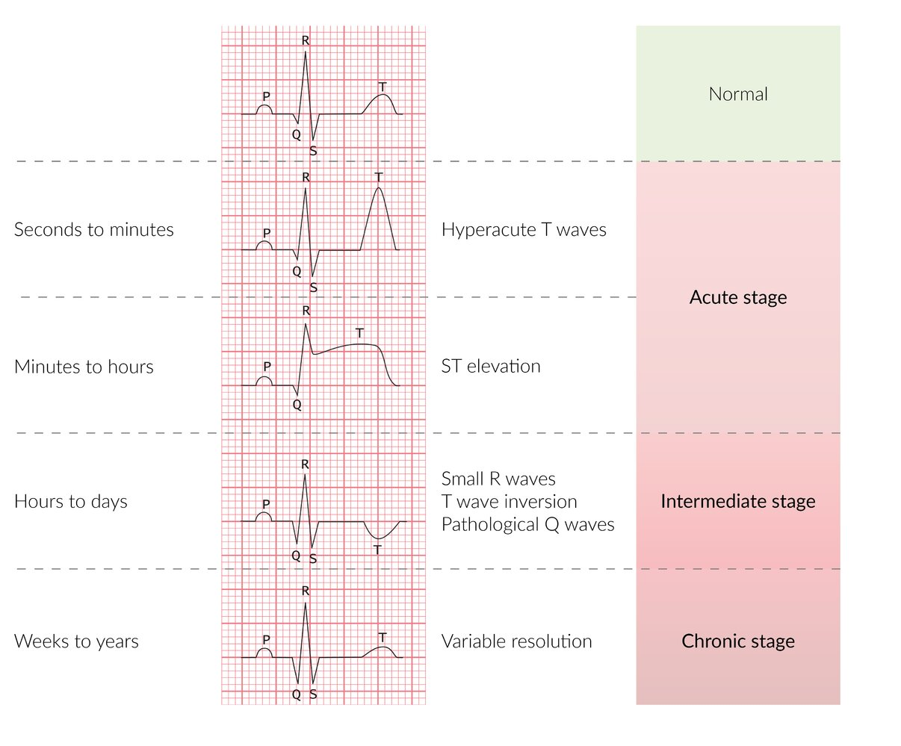
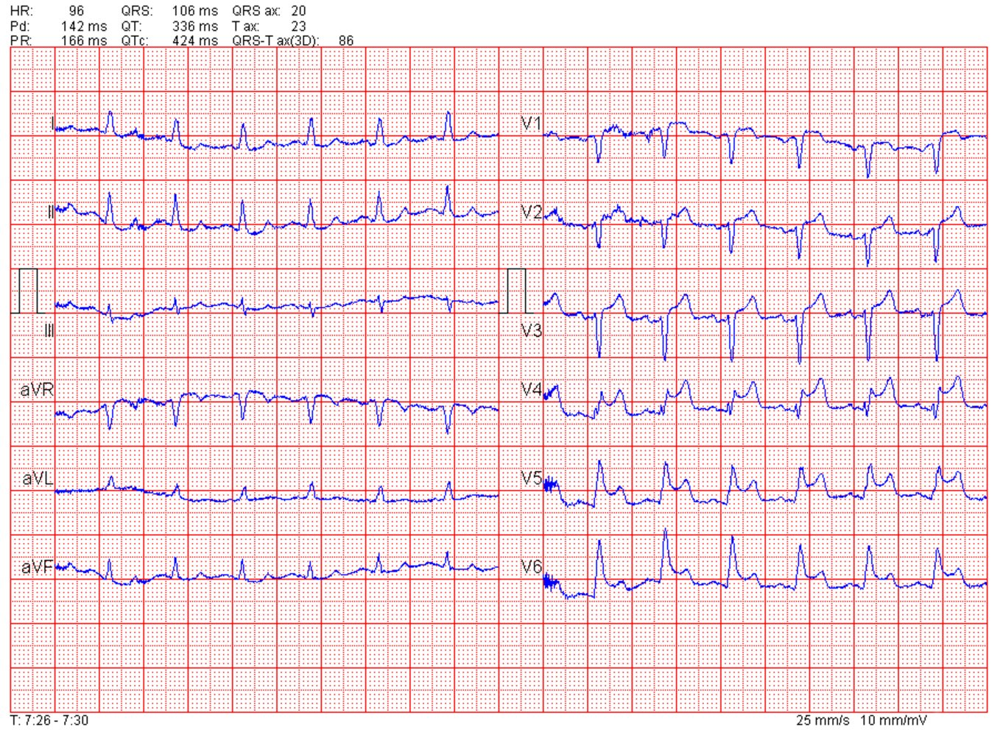
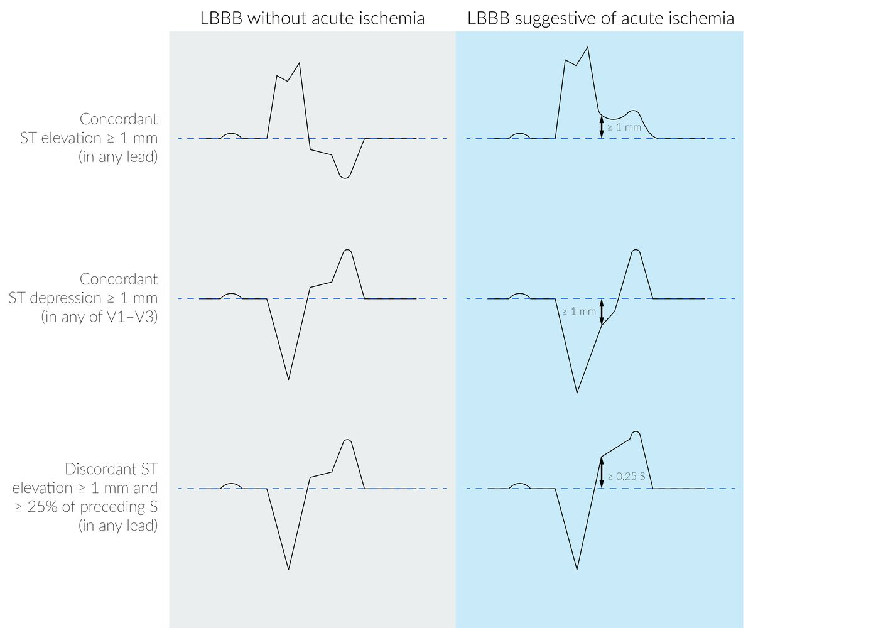
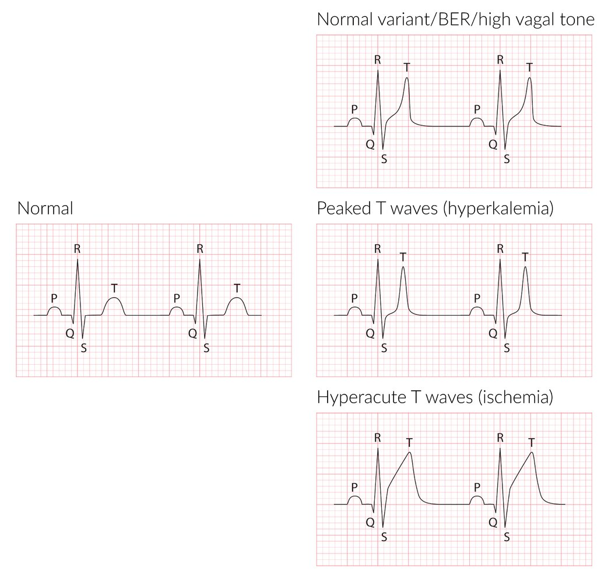
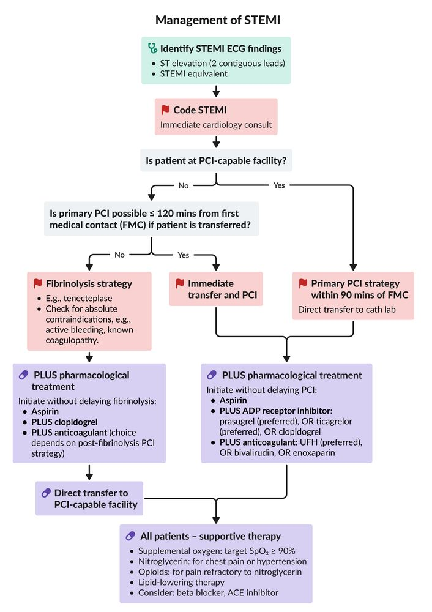

# Acute coronary syndrome

*Categories: Clinical knowledge > Internal medicine > Cardiology and angiology > Ischemic heart disease > Acute coronary syndrome*

[Original Article Link](https://coursology-qbank.com/amboss/article/Yq0nCS)

---

## Summary

Acute coronary syndrome (<u>ACS</u>) is a group of conditions caused by acute <u>myocardial</u> <u>ischemia</u>, including <u>unstable angina</u>, <u>non-ST-segment elevation myocardial infarction</u> (<u>NSTEMI</u>), and <u>ST-segment elevation myocardial infarction</u> (<u>STEMI</u>). It is caused by partial or complete occlusion of a <u>coronary artery</u>, leading to reduced blood flow to the <u>myocardium</u>. The classic presentation is acute retrosternal <u>chest pain</u>, often described as a dull pressure or tightness, which may be accompanied by <u>shortness of breath</u>, sweating, and <u>nausea</u>. Initial diagnosis involves a 12-lead <u>ECG</u> and measurement of <u>cardiac troponin</u> (cTn) levels. Based on <u>ECG</u> findings, <u>ACS</u> is categorized as <u>ST-elevation ACS</u> (<u>STE-ACS</u>) or non-<u>ST-elevation ACS</u> (<u>NSTE-ACS</u>). <u>NSTE-ACS</u> is further categorized as <u>NSTEMI</u> if serum cTn levels are elevated, or <u>unstable angina</u> if cTn levels are not elevated. Initial management for all patients includes <u>antiplatelet therapy</u> (e.g., <u>aspirin</u>), anticoagulation, and <u>analgesia</u>. Patients with <u>STEMI</u> require immediate <u>revascularization</u>, preferably with <u>percutaneous coronary intervention</u> (<u>PCI</u>), while the timing of invasive management for <u>NSTE-ACS</u> is based on risk <u>stratification</u>. Adjunctive medical therapy includes <u>statins</u>, <u>beta blockers</u>, and <u>RAAS inhibitors</u>.

This article focuses on the initial <u>management of ACS</u> patients. See “<u>Myocardial infarction</u>” for more details regarding, e.g., <u>histopathology</u> and long-term management.

---

## Overview

|  Overview of acute coronary syndrome (<u>ACS</u>) [[2]](https://coursology-qbank.com/amboss/article/mycVfU0)[[3]](https://coursology-qbank.com/amboss/article/qGdCZ70)  |  |  |  |
| --- | --- | --- | --- |
|  | NSTE-ACS |  | STE-ACS |
| Unstable angina |  Non-ST-segment elevation myocardial infarction (<u>NSTEMI</u>)  |  ST-segment elevation myocardial infarction (<u>STEMI</u>)  |  |
| Definition |  * Acute, transient <u>myocardial</u> <u>ischemia</u> that does not cause detectable quantities of cTn or persistent <u>ST-segment</u> elevations on <u>ECG</u>   |  * Acute <u>myocardial</u> <u>ischemia</u> characterized by elevated cTn without persistent <u>ST-segment</u> elevation on <u>ECG</u>   |  * <u>Acute myocardial infarction</u> characterized by persistent <u>ST-segment</u> elevation in at least two contiguous leads on <u>ECG</u>   |
|  Clinical presentation |   * <u>Angina</u> or <u>anginal equivalent</u> that is:  * New-onset  * Present at rest and/or with minimal exertion  * Usually not relieved by rest; may or may not be relieved by <u>nitroglycerin</u>  * Severe, persistent, and/or worsening (crescendo angina) [[4]](https://coursology-qbank.com/amboss/article/X3Y9SK)  * Autonomic symptoms may be present: <u>diaphoresis</u>, <u>syncope</u>, <u>palpitations</u>, <u>nausea</u>, and/or <u>vomiting</u>    |  |  |
| Pathophysiology |  * Partial occlusion of coronary vessel → decreased blood supply → <u>ischemic</u> symptoms without <u>infarction</u>   |   * Classically due to partial occlusion of a <u>coronary artery</u>  * Affects the inner layer of the <u>heart</u> (subendocardial <u>infarction</u>)    |   * Classically due to complete occlusion of a <u>coronary artery</u>  * Affects the full thickness of the <u>myocardium</u> (<u>transmural</u> <u>infarction</u>)    |
| <u>Cardiac troponin</u> |  * Not elevated   |  * Elevated (within 1–6 hours)   |  |
| <u>ECG</u> findings |   * No <u>ST elevations</u>  * Normal or nonspecific (e.g., <u>ST depression</u>, loss of R wave, <u>T-wave inversion</u>)    |  |  * <u>ST elevations</u> (in two contiguous leads) or new <u>left bundle branch block</u> with strong clinical suspicion of <u>myocardial</u> <u>ischemia</u>  [[3]](https://coursology-qbank.com/amboss/article/qGdCZ70)   |
| <u>Revascularization</u> |  * Invasive management depends on risk <u>stratification</u> (e.g., <u>GRACE score</u>).   |  |  * Immediate <u>revascularization</u>   |
| <u>Pharmacological treatment for ACS</u> |   * <u>Anticoagulants</u>, <u>antiplatelet therapy</u> (e.g., <u>aspirin</u>, <u>ADP</u> <u>receptor</u> inhibitors)  * <u>Statins</u>  * <u>Beta blockers</u>  * <u>ACEIs</u>  * <u>Pain management</u> (<u>opioids</u>, <u>nitrates</u>)    |  |  |

> [!WARNING]
> Subtypes of <u>ACS</u> cannot be differentiated based on clinical presentation alone.

> [!TIP]
> <u>MI</u> is differentiated from <u>unstable angina</u> by the presence of elevated <u>troponins</u>, while the type of <u>MI</u> (<u>NSTEMI</u> vs. <u>STEMI</u>) is determined by <u>ECG</u> findings.

---

## Clinical features

* Classic presentation  [[5]](https://coursology-qbank.com/amboss/article/kIYm1q)[[6]](https://coursology-qbank.com/amboss/article/35YSPp)[[7]](https://coursology-qbank.com/amboss/article/sCctte0)

* Acute retrosternal <u>chest pain</u>

* Typical: dull, squeezing pressure and/or tightness

* Commonly radiates to left chest, arm, shoulder, neck, <u>jaw</u>, and/or epigastrium

* Precipitated by exertion or <u>stress</u>

* Symptom relief after administration of <u>nitrates</u> is not a diagnostic criterion for cardiac <u>ischemia</u>.  [[7]](https://coursology-qbank.com/amboss/article/sCctte0)

* The peak time of occurrence is usually in the morning.

* See also “<u>Angina</u>.”

* <u>Dyspnea</u> (especially with exertion)

* <u>Pallor</u>

* <u>Nausea</u>, <u>vomiting</u>

* <u>Diaphoresis</u>, <u>anxiety</u>

* <u>Dizziness</u>, <u>lightheadedness</u>, <u>syncope</u>

* Other possible findings

* <u>Tachycardia</u>, <u>arrhythmias</u>

* Symptoms of <u>heart failure</u> (e.g., <u>orthopnea</u>, <u>pulmonary edema</u>) or <u>cardiogenic shock</u> (e.g., <u>hypotension</u>, <u>tachycardia</u>, cold extremities)

* New <u>heart murmur</u> on <u>auscultation</u> (e.g., new <u>S4</u>)

* Features commonly seen in older adults, individuals with <u>diabetes</u>, and women, e.g.: 

* Stabbing, sharp <u>chest pain</u>

* No or minimal <u>chest pain</u>

* Autonomic symptoms (e.g., <u>nausea</u>, <u>diaphoresis</u>)

* See also “<u>Anginal equivalents</u>.”

* Features of inferior wall <u>infarction</u>

* Epigastric <u>pain</u>

* <u>Bradycardia</u>

* Clinical triad in <u>right ventricular</u> <u>infarction</u>: <u>hypotension</u>, elevated <u>jugular venous pressure</u>, clear <u>lung</u> fields

> [!NOTE]
> Classically, it has been taught that <u>STEMI</u> manifests with more severe symptoms than <u>NSTEMI</u>, but this is not always the case.

Myocardial infarction fact sheet

Symptoms of an acute myocardial infarction

Chest pain localization in ACS

---

## Initial approach

See “<u>Management of chest pain</u>” for an approach to patients with undifferentiated <u>chest pain</u>.

### Approach [[3]](https://coursology-qbank.com/amboss/article/qGdCZ70)[[7]](https://coursology-qbank.com/amboss/article/sCctte0)

* <u>ABCDE approach</u>

* Perform a 12-lead <u>ECG</u> within the first 10 minutes of care.

* <u>IV access</u>

* Obtain high-<u>sensitivity</u> <u>cardiac troponin</u>.

* Continuous <u>telemetry</u> and <u>pulse oximetry</u>

* <u>Supplemental oxygen</u> to maintain <u>SpO2</u> ≥ 90%

* <u>Aspirin</u> DOSAGE if there are no contraindications

* Consider <u>analgesics for cardiac chest pain</u> as needed.

* Repeat testing if the initial <u>ECG</u> and/or <u>cardiac troponin</u> are nondiagnostic.

* Obtain additional <u>laboratory studies</u> (e.g., <u>BMP</u>, <u>CBC</u>) to guide management decisions.

* Assess risk using a risk <u>stratification</u> tool (e.g., <u>GRACE score</u>).

* Manage <u>tachyarrhythmias</u> and treat <u>acute heart failure</u>, <u>cardiogenic shock</u>, and/or <u>complete heart block</u> as needed.

> [!TIP]
> Obtain an <u>ECG</u> immediately if <u>ACS</u> is a potential diagnosis.

> [!WARNING]
> Any patient with <u>ST elevations</u> on <u>ECG</u> requires immediate evaluation for urgent <u>revascularization</u>. Further diagnostic evaluation should not delay care.

> [!TIP]
> A normal <u>ECG</u> or nonspecific <u>ECG</u> changes do not rule out <u>NSTE-ACS</u>. [[3]](https://coursology-qbank.com/amboss/article/qGdCZ70)

### Initial triage based on <u>ECG</u> findings [[3]](https://coursology-qbank.com/amboss/article/qGdCZ70)[[7]](https://coursology-qbank.com/amboss/article/sCctte0)

Follow local rapid diagnostic protocols and tailor the workup and management to individual <u>risk stratification for ACS</u>.

* <u>ST elevations</u>: immediate <u>revascularization in STEMI</u>, preferably <u>PCI</u>

* No <u>ST elevations</u>: See "<u>Decision pathway for possible NSTE-ACS</u>." 

* <u>ST depressions</u>, new <u>T-wave inversions</u>, and/or high clinical suspicion for <u>ACS</u>: <u>NSTE-ACS</u> is likely; begin <u>management of ACS</u>.

* Both nondiagnostic <u>ECG</u> and low or intermediate clinical suspicion for <u>ACS</u>

* Serial <u>ECGs</u>

* <u>hs-cTn</u> 1–2 hours after initial high-<u>sensitivity</u> test or 3–6 hours after initial conventional test [[3]](https://coursology-qbank.com/amboss/article/qGdCZ70)

> [!WARNING]
> Perform immediate <u>cardiac catheterization</u> (< 2 hours) in patients with <u>NSTE-ACS</u> and <u>cardiogenic shock</u>, electrical or <u>hemodynamic instability</u>, and/or refractory <u>angina</u>. [[2]](https://coursology-qbank.com/amboss/article/mycVfU0)[[3]](https://coursology-qbank.com/amboss/article/qGdCZ70)

### Decision pathway for possible NSTE-ACS [[3]](https://coursology-qbank.com/amboss/article/qGdCZ70)[[7]](https://coursology-qbank.com/amboss/article/sCctte0)

* Management based on <u>troponin</u> levels

* Interpret both the initial <u>troponin</u> value and the change between first and interval values (Δtrop).

* Detectable initial <u>troponin</u> and significant Δtrop : Start <u>ACS management</u>. [[8]](https://coursology-qbank.com/amboss/article/DLY1-p)

* Initial <u>troponin</u> above <u>ULN</u> and high clinical suspicion: Consider starting empiric <u>ACS management</u> before the second <u>troponin</u>. 

* Confirm diagnosis with Δtrop.

* Consult cardiology if uncertain.

* Undetectable <u>hs-cTn</u> ≥ 3 hours after symptom onset and low clinical suspicion: <u>NSTEMI</u> can usually be ruled out.  [[7]](https://coursology-qbank.com/amboss/article/sCctte0)[[9]](https://coursology-qbank.com/amboss/article/ap1QL30)

* Inconclusive serial <u>ECG</u> and <u>hs-cTn</u>

* Interpret results based on the patient's overall <u>ACS</u> risk.

* Follow local protocols, use clinical judgment, and consult cardiology as needed.  [[7]](https://coursology-qbank.com/amboss/article/sCctte0)

* <u>MI</u> is ruled out or remains uncertain

* Evaluate the likelihood of <u>unstable angina</u>.

* Consider additional investigations (e.g., third <u>troponin</u>, <u>cardiac stress testing</u>, <u>CCTA</u>).

* Evaluate alternative <u>causes of chest pain</u> and <u>differential diagnoses of elevated troponin</u>.

* See "<u>Negative initial workup of ACS</u>" for details.

> [!TIP]
> <u>Unstable angina</u> is a <u>clinical diagnosis</u> associated with normal <u>troponin</u> levels. Suggestive <u>ECG</u> changes can support the diagnosis but are not confirmatory.

---

## Diagnosis

### ECG findings in ACS [[3]](https://coursology-qbank.com/amboss/article/qGdCZ70)[[8]](https://coursology-qbank.com/amboss/article/DLY1-p)

<u>ECG</u> findings change over time. Look for <u>STEMI-equivalent ECG findings</u> and repeat <u>ECGs</u> if inconclusive.

#### ECG changes in STEMI [[3]](https://coursology-qbank.com/amboss/article/qGdCZ70)

* New (or presumed new) <u>ST-segment elevations</u>

* ≥ 1 mm in ≥ 2 anatomically contiguous leads (other than leads V2–V3)

* Leads V2–V3

* Men aged ≥ 40 years: ≥ 2 mm

* Men aged < 40 years: ≥ 2.5 mm

* Women: ≥ 1.5 mm

* Inferior <u>myocardial infarction</u> with <u>right ventricular</u> involvement may exhibit: [[8]](https://coursology-qbank.com/amboss/article/DLY1-p)

* <u>ST elevations</u> ≥ 1 mm in leads aVR and/or V1

* <u>ST elevations</u> ≥ 0.5 mm (or ≥ 1 mm in men aged < 30 years) in leads V3R and V4R

> [!TIP]
> The sequence of <u>ECG</u> changes in <u>ACS</u> over several hours to days: hyperacute <u>T wave</u> → <u>ST elevation</u> → pathological <u>Q wave</u> → <u>T-wave inversion</u> → ST normalization → <u>T-wave</u> normalization

#### STEMI-equivalent ECG findings [[3]](https://coursology-qbank.com/amboss/article/qGdCZ70)[[8]](https://coursology-qbank.com/amboss/article/DLY1-p)

* <u>Posterior myocardial infarction</u> [[3]](https://coursology-qbank.com/amboss/article/qGdCZ70)

* <u>ST depressions</u> ≥ 0.5 mm in leads V1–V3

* <u>ST elevations</u> ≥ 0.5 mm in leads <u>V7–V9</u>  [[8]](https://coursology-qbank.com/amboss/article/DLY1-p)

* <u>Left main coronary artery</u> occlusion or <u>three-vessel coronary artery disease</u> 

* <u>ST depressions</u> ≥ 1 mm in ≥ 6 leads [[10]](https://coursology-qbank.com/amboss/article/1nY2Hp)[[11]](https://coursology-qbank.com/amboss/article/T0b62H)

* Combined with <u>ST elevation</u> in V1 and/or <u>aVR ST-segment elevation</u>

* <u>LBBB</u> or <u>RBBB</u> with strong clinical suspicion for <u>myocardial infarction</u> [[12]](https://coursology-qbank.com/amboss/article/c0baUH)

* New or presumed new <u>LBBB</u> in the absence of symptoms is not a <u>STEMI</u> equivalent.

* Consider diagnostic criteria (e.g., <u>modified Sgarbossa criteria</u>) to evaluate the likelihood of <u>STEMI</u>.

* de Winter T wave: precordial <u>J-point</u> <u>depression</u> with tall, symmetrical <u>T waves</u> [[13]](https://coursology-qbank.com/amboss/article/Rzdlss0)[[14]](https://coursology-qbank.com/amboss/article/izdJss0)

* <u>Hyperacute T waves</u>: can be present without <u>ST elevations</u> in the very early stages of <u>ischemia</u>.

> [!WARNING]
> Obtain a <u>V7–V9</u> lead tracing if <u>ST depressions</u> are present in V1–V3, as this may be a sign of a <u>posterior wall STEMI</u>.

> [!TIP]
> Positive <u>modified Sgarbossa criteria</u> can help identify <u>STEMI</u> in symptomatic patients with <u>LBBB</u> for whom <u>ST-segment</u> assessment is difficult.

Timeline of ECG changes in STEMI

Acute inferior ST-segment elevation myocardial infarction (STEMI)

Acute inferior STEMI

Acute anterior ST-elevation myocardial infarction (STEMI)

Acute anterior ST elevation myocardial infarction (STEMI)

STEMI

Extensive anterolateral STEMI with septal involvement and reciprocal inferior changes

STEMI

Inferior myocardial infarction with anterior ST-elevations

Inferoposterior myocardial infarction

Modified Sgarbossa criteria

Modified Sgarbossa criteria for MI in LBBB

Abnormalities of the T-wave

#### ECG changes in NSTE-ACS [[3]](https://coursology-qbank.com/amboss/article/qGdCZ70)[[8]](https://coursology-qbank.com/amboss/article/DLY1-p)

* No persistent <u>ST elevations</u>

* Nonspecific signs of <u>ischemia</u> may be present, including:

* New (or presumed new) <u>ST-segment depressions</u>

* ≥ 0.5 mm in ≥ 2 anatomically contiguous leads

* Typically horizontal or down-sloping

* <u>T-wave inversions</u> of > 1 mm in V1–V6 with any of the following: 

* Prominent R wave

* R/S <u>ratio</u> > 1

* Transient <u>ST-segment elevation</u>

* <u>Wellens syndrome</u> after resolution of <u>ischemia</u>  [[15]](https://coursology-qbank.com/amboss/article/8hVOf80)

* Biphasic or markedly inverted <u>T waves</u> in leads V2–V3 (sometimes extending to lead V6)

* Absence of <u>Q waves</u>

Types of ST segment depression

> [!WARNING]
> Avoid excluding a diagnosis of <u>STEMI</u> based on a single <u>ECG</u>, as findings can change over time and with symptom fluctuation.

### <u>Laboratory studies</u> [[3]](https://coursology-qbank.com/amboss/article/qGdCZ70)

#### <u>Cardiac troponin</u> [[3]](https://coursology-qbank.com/amboss/article/qGdCZ70)

<u>Acute myocardial infarction</u> is characterized by the rise and/or fall of <u>cardiac troponin</u> on repeat testing with at least one elevated value.

* > 99th<u>percentile</u> <u>ULN</u>: <u>myocardial injury</u> (i.e., <u>NSTEMI</u> or <u>STEMI</u>)   [[8]](https://coursology-qbank.com/amboss/article/DLY1-p)

* No detectable elevation (with <u>ECG</u> features of <u>ACS</u>): <u>unstable angina</u>

* Testing intervals

* 1–2 hours after initial high-<u>sensitivity</u> test

* 3–6 hours after initial conventional test

* At symptom recurrence (if suspicion for <u>ACS</u> remains high) and/or appearance of new <u>ECG</u> changes  [[16]](https://coursology-qbank.com/amboss/article/OS1I-T0)

* Consider at 72 hours as a marker of <u>infarct</u> size. [[17]](https://coursology-qbank.com/amboss/article/D-d1zs0)

* Other <u>cardiac biomarkers</u> (e.g., <u>CK-MB</u>, <u>myoglobin</u>): not recommended unless <u>cardiac troponin</u> is unavailable [[8]](https://coursology-qbank.com/amboss/article/DLY1-p)

> [!TIP]
> In patients with a normal <u>ECG</u>, a single <u>high-sensitivity troponin</u> result below the limit of detection ≥ 3 hours after symptom onset is considered sufficient to rule out <u>myocardial infarction</u>. [[7]](https://coursology-qbank.com/amboss/article/sCctte0)

#### Additional studies

Obtain the following studies for risk <u>stratification</u> and to help guide management decisions.

* <u>BMP</u>: e.g., to check renal function for <u>GRACE score</u> and anticoagulation dosing  [[2]](https://coursology-qbank.com/amboss/article/mycVfU0)

* <u>CBC</u>: to assess for <u>anemia</u> requiring <u>blood transfusion</u>

* <u>BNP</u> or <u>NT-proBNP</u>: to assess for <u>heart failure</u>

* <u>Coagulation panel</u>: for anticoagulation management and assessment of bleeding risk

* <u>Lipid panel</u>

### Imaging [[3]](https://coursology-qbank.com/amboss/article/qGdCZ70)

* Indication: suspected or confirmed <u>ACS</u>

* Timing: prior to <u>hospital discharge</u>

* Preferred modality: <u>transthoracic echocardiography</u> (<u>TTE</u>)

* Alternatives

* <u>Cardiac MRI</u> (if <u>TTE</u> is nondiagnostic)

* <u>Myocardial perfusion imaging</u>

* Possible findings

* Wall motion abnormalities

* Decreased LV function

* Signs of different conditions that cause <u>chest pain</u> (see “<u>Differential diagnoses of chest pain</u>”)

* Mechanical complications of <u>ACS</u> (e.g., <u>papillary muscle rupture</u>)

* <u>LV thrombus</u>

> [!TIP]
> Urgent <u>TTE</u> is indicated for patients presenting with <u>hemodynamic instability</u>, <u>cardiogenic shock</u>, or suspected mechanical complications of <u>ACS</u>.

> [!WARNING]
> Do not delay <u>treatment of ACS</u> for imaging.

---

## Risk stratification

### Risk <u>stratification</u> tools [[3]](https://coursology-qbank.com/amboss/article/qGdCZ70)

* In patients with <u>NSTE-ACS</u>, multiple scoring systems are used to:

* Help identify high-risk vs. low-risk patients

* Guide timing of <u>PCI</u> and disposition

* Guide further diagnostic studies

* In patients with <u>STEMI</u> , these tools may be used to calculate mortality risk but are not used to determine management.

> [!WARNING]
> Risk <u>stratification</u> tools are not a substitute for clinical judgment.

### GRACE score for risk of mortality in <u>ACS</u>  [[3]](https://coursology-qbank.com/amboss/article/qGdCZ70)[[18]](https://coursology-qbank.com/amboss/article/8abOmH)[[19]](https://coursology-qbank.com/amboss/article/uabpmH)

* Based on the <u>Global</u> Registry of Acute Coronary Events (GRACE)

* May be used to inform management and disposition (e.g., <u>ICU</u> admission, timing of intervention in <u>NSTE-ACS</u>)

* Criteria 

* Patient age

* <u>Vital signs</u>

* Cardiac and renal function

* <u>Cardiac arrest</u> on presentation

* <u>ECG</u> findings

* <u>Troponin</u> levels

GRACE ACS risk

### TIMI score for NSTE-ACS   [[3]](https://coursology-qbank.com/amboss/article/qGdCZ70)[[20]](https://coursology-qbank.com/amboss/article/_0b5iH)

* Estimates the risk of mortality, new or recurrent <u>myocardial infarction</u>, or the need for urgent <u>revascularization</u> in patients with <u>NSTE-ACS</u>

* Can help determine the therapeutic regimen and timing for <u>revascularization</u>.

* Criteria

* Age ≥ 65 years

* <u>Coronary artery disease</u> (<u>CAD</u>) <u>risk factors</u> (e.g., <u>family history</u> of <u>CAD</u>, <u>diabetes mellitus</u>, smoking, <u>hypertension</u>, <u>hypercholesterolemia</u>)

* Known <u>CAD</u> (stenosis > 50%)

* Episodes of severe <u>angina</u> in the last 24 hours

* <u>Aspirin</u> use in the past 7 days

* ST deviation

* Elevated <u>cardiac biomarkers</u>

TIMI risk score (for NSTE-ACS)

### HEART score  [[21]](https://coursology-qbank.com/amboss/article/bYbHnH)[[22]](https://coursology-qbank.com/amboss/article/8tdO270)

* The <u>HEART score</u> is an acronym of its components:

* History

* <u>ECG</u>

* Age

* <u>Risk factors</u>

* <u>Troponin</u> values

* Risk assessment for <u>major adverse cardiovascular events</u> (<u>MACE</u>) in patients with <u>chest pain</u> presenting to the emergency department

* Can be integrated into decision pathways for early discharge

* Potentially reduces hospital admissions of low-risk patients

* Should not be used in patients with <u>STEMI</u> or those who are <u>hemodynamically unstable</u>

HEART score

---

## Management

### Approach [[2]](https://coursology-qbank.com/amboss/article/mycVfU0)[[3]](https://coursology-qbank.com/amboss/article/qGdCZ70)

* Consult cardiology; decisions regarding <u>revascularization</u> for <u>ACS</u> are ideally made by a multidisciplinary <u>heart</u> team.

* Continue or initiate continuous <u>telemetry</u>, serial <u>ECGs</u>, and serial <u>troponins</u> (frequency and duration are determined by cardiac risk).

* Supplement oxygen as needed to maintain saturation ≥ 90%. [[3]](https://coursology-qbank.com/amboss/article/qGdCZ70)

* Provide <u>pharmacological treatment for ACS</u>.

* <u>Dual antiplatelet therapy</u> (<u>DAPT</u>) with <u>aspirin</u> and a <u>P2Y12 inhibitor</u>

* <u>Parenteral anticoagulation</u> (with, e.g., <u>UFH</u>)

* <u>Analgesia</u> as needed to relieve cardiac <u>chest pain</u>

* <u>Statin</u> therapy, <u>beta blocker</u> therapy, and <u>RAAS inhibitor</u> therapy

* Consider a liberal <u>transfusion</u> strategy for patients with <u>anemia</u> (i.e., target <u>hemoglobin</u> ≥ 10 g/dL). [[3]](https://coursology-qbank.com/amboss/article/qGdCZ70)

* Consider checking <u>cardiac troponin</u> 3–6 hours after <u>PCI</u> to assess for <u>cardiac procedural myocardial injury</u>. [[8]](https://coursology-qbank.com/amboss/article/DLY1-p)

* See “<u>Management of cardiogenic shock</u>,” e.g., for patients with inferior <u>myocardial infarction</u> causing severe RV dysfunction.

> [!TIP]
> Options for initial <u>MI</u> treatment include "MONA-BASH": Morphine, Oxygen, Nitroglycerin, Antiplatelet drugs (<u>aspirin</u> + <u>ADP receptor inhibitor</u>), Beta blockers, ACE inhibitors, Statins, and Heparin. The scope of interventions depends on the patient's risk profile.

### Coronary revascularization [[2]](https://coursology-qbank.com/amboss/article/mycVfU0)[[3]](https://coursology-qbank.com/amboss/article/qGdCZ70)

See "<u>Revascularization in STEMI</u>" and "<u>Revascularization</u> in <u>NSTE-ACS</u>" for details.

* <u>Coronary angiography</u> with <u>PCI</u>; , i.e., <u>balloon dilation</u> with <u>stent implantation</u>, is the preferred <u>revascularization</u> strategy in <u>ACS</u>.  [[2]](https://coursology-qbank.com/amboss/article/mycVfU0)[[3]](https://coursology-qbank.com/amboss/article/qGdCZ70) 

* Primary PCI: <u>PCI</u> that is not preceded by <u>fibrinolysis</u>

* <u>PCI</u> after <u>thrombolysis</u>: <u>PCI</u> performed after <u>fibrinolysis for STEMI</u>

* <u>Coronary artery bypass grafting</u> (<u>CABG</u>) may be indicated in selected cases, e.g.: [[2]](https://coursology-qbank.com/amboss/article/mycVfU0)[[3]](https://coursology-qbank.com/amboss/article/qGdCZ70)

* Large area of <u>myocardium</u> at risk, <u>cardiogenic shock</u>, or <u>hemodynamic instability</u> alongside either of the following:

* Coronary anatomy poorly suited to <u>PCI</u>

* Unsuccessful <u>PCI</u>

* Mechanical complications (e.g., <u>papillary muscle rupture</u>, <u>ventricular septal rupture</u>) requiring <u>surgery</u>

* <u>Fibrinolytic therapy</u> is used for patients with <u>STEMI</u> if timely access to <u>PCI</u> is not available.

Coronary angiography in acute anterior myocardial infarction

Treatment of acute anterior myocardial infarction (2/2)

---

## Pharmacological treatment

See "<u>Prevention of recurrent myocardial infarction</u>" for long-term management.

### <u>Antiplatelet therapy</u> [[2]](https://coursology-qbank.com/amboss/article/mycVfU0)[[3]](https://coursology-qbank.com/amboss/article/qGdCZ70)

* <u>DAPT</u> with <u>aspirin</u> and a <u>P2Y12 inhibitor</u> reduces the risk of <u>major adverse cardiac events</u> after <u>acute myocardial infarction</u>.

* Timing of <u>aspirin</u>: at presentation

* Timing of <u>P2Y12 inhibitor</u> therapy [[23]](https://coursology-qbank.com/amboss/article/dEWouM0)

* Recommended after assessment of coronary anatomy (i.e., during <u>cardiac catheterization</u>) for most patients with <u>NSTE-ACS</u>

* If delayed (> 24 hours from presentation) cardiac cathetherization is planned, consider pretreatment with <u>P2Y12 inhibitor</u> in consultation with cardiology.

* There is insufficient evidence on pretreatment in patients with <u>STEMI</u>; follow local protocols.

* See "<u>Prevention of recurrent myocardial infarction</u>" for more information on the duration of <u>DAPT</u> after acute management.

* See "<u>Perioperative management of antiplatelet therapy in patients undergoing CABG</u>" for more information on this patient group.

|  Antiplatelet therapy for ACS [[2]](https://coursology-qbank.com/amboss/article/mycVfU0)[[3]](https://coursology-qbank.com/amboss/article/qGdCZ70)  |  |  |  |
| --- | --- | --- | --- |
| Agent | Patient group | Loading dosage | Maintenance dosage |
| <u>Aspirin</u> |  * All patients   |  * <u>Aspirin</u> DOSAGE [[3]](https://coursology-qbank.com/amboss/article/qGdCZ70)   |  * <u>Aspirin</u> DOSAGE [[3]](https://coursology-qbank.com/amboss/article/qGdCZ70)   |
| <u>P2Y12 inhibitor</u> |  * Patients undergoing <u>PCI</u>   |   * Preferred  * <u>Prasugrel</u> DOSAGE  * OR <u>ticagrelor</u> DOSAGE  * If other <u>P2Y12 inhibitors</u> are not tolerated or available: <u>clopidogrel</u> DOSAGE [[3]](https://coursology-qbank.com/amboss/article/qGdCZ70)    |   * <u>Prasugrel</u> [[3]](https://coursology-qbank.com/amboss/article/qGdCZ70)  * Weight ≥ 60 kg and age < 75 years: DOSAGE  * Weight < 60 kg or age ≥ 75 years: DOSAGE  * OR <u>ticagrelor</u> DOSAGE  * OR <u>clopidogrel</u> DOSAGE    |
|   * Patients with <u>NSTE-ACS</u> and no planned invasive evaluation  * Consider in patients with planned but delayed (>24 hours from presentation) invasive evaluation (i.e., cardiac cathetherization).    |   * Preferred: <u>ticagrelor</u> DOSAGE  * Alternative: <u>clopidogrel</u> DOSAGE if <u>ticagrelor</u> is not tolerated or available [[3]](https://coursology-qbank.com/amboss/article/qGdCZ70)    |  |  |
|  * Patients with <u>STEMI</u> receiving <u>fibrinolytic therapy</u>   |   * Age ≤ 75 years: <u>clopidogrel</u> DOSAGE [[3]](https://coursology-qbank.com/amboss/article/qGdCZ70)  * Age > 75 years: <u>clopidogrel</u> DOSAGE [[3]](https://coursology-qbank.com/amboss/article/qGdCZ70)    |  * <u>Clopidogrel</u> DOSAGE   |  |

> [!WARNING]
> Do not administer <u>prasugrel</u> to patients who have had a <u>TIA</u> or <u>stroke</u>. [[3]](https://coursology-qbank.com/amboss/article/qGdCZ70)

> [!WARNING]
> Pretreatment with <u>P2Y12 inhibitor</u> therapy prior to <u>cardiac catheterization</u> is not recommended for most patients with <u>NSTE-ACS</u> due to the increased risk of bleeding, but it can be considered if <u>cardiac catheterization</u> is planned > 24 hours after presentation. [[3]](https://coursology-qbank.com/amboss/article/qGdCZ70)

> [!TIP]
> IV cangrelor may be used for patients undergoing <u>PCI</u> who have not received a <u>loading dose</u> of a <u>P2Y12 inhibitor</u>. [[2]](https://coursology-qbank.com/amboss/article/mycVfU0)[[3]](https://coursology-qbank.com/amboss/article/qGdCZ70)

### Anticoagulation [[3]](https://coursology-qbank.com/amboss/article/qGdCZ70)

* The choice and duration are determined by the diagnosis and treatment strategy.

* Duration of therapy

* Patients undergoing <u>PCI</u>: Continue until <u>revascularization</u> (and post-<u>PCI</u> for <u>bivalirudin</u>).

* Patients receiving <u>fibrinolytic therapy</u> without planned invasive strategy: Continue for the duration of the hospital stay (maximum 8 days). [[3]](https://coursology-qbank.com/amboss/article/qGdCZ70)

* Patients with <u>NSTE-ACS</u> without planned invasive strategy: Continue for the duration of the hospital stay.

|  Anticoagulation for ACS [[3]](https://coursology-qbank.com/amboss/article/qGdCZ70)  |  |
| --- | --- |
| Clinical scenario | Agent |
| Initial therapy |   * Preferred: <u>unfractionated heparin</u> (<u>UFH</u>) DOSAGE adjusted to <u>aPTT</u> 60–80 seconds (follow local protocols) [[3]](https://coursology-qbank.com/amboss/article/qGdCZ70)  * Alternatives (if early invasive approach is not planned)  * <u>Enoxaparin</u> DOSAGE [[3]](https://coursology-qbank.com/amboss/article/qGdCZ70)  * <u>Fondaparinux</u> DOSAGE  [[3]](https://coursology-qbank.com/amboss/article/qGdCZ70)    |
|  During <u>PCI</u>   |   * Preferred: <u>UFH</u> to achieve activated clotting time of 250–300 seconds  * No prior anticoagulation administered: <u>heparin</u> DOSAGE [[3]](https://coursology-qbank.com/amboss/article/qGdCZ70)  * Prior anticoagulation administered: Titrate infusion rate to target per local protocols.  * Alternatives  * <u>Bivalirudin</u> DOSAGE  [[3]](https://coursology-qbank.com/amboss/article/qGdCZ70)  * <u>Enoxaparin</u>  * No prior anticoagulation administered: <u>enoxaparin</u> DOSAGE [[3]](https://coursology-qbank.com/amboss/article/qGdCZ70)  * Last dose 8–12 hours earlier or only 1 dose administered: <u>enoxaparin</u> DOSAGE [[3]](https://coursology-qbank.com/amboss/article/qGdCZ70)  * Last dose within previous 8 hours: no additional dose recommended [[3]](https://coursology-qbank.com/amboss/article/qGdCZ70)    |
| <u>STEMI</u> with <u>fibrinolytic therapy</u> |   * Preferred (if invasive approach is not planned): <u>enoxaparin</u>  DOSAGE  [[3]](https://coursology-qbank.com/amboss/article/qGdCZ70)  * Alternatives  * <u>UFH</u> DOSAGE adjusted to <u>aPTT</u> 50–70 seconds [[3]](https://coursology-qbank.com/amboss/article/qGdCZ70)  * <u>Fondaparinux</u> DOSAGE  [[3]](https://coursology-qbank.com/amboss/article/qGdCZ70)    |

> [!TIP]
> <u>Glycoprotein IIb/IIIa inhibitors</u> are not routinely recommended but may be administered to selected patients undergoing <u>PCI</u>.

> [!WARNING]
> <u>Fondaparinux</u> is contraindicated in patients undergoing <u>PCI</u> because of the risk of catheter <u>thrombosis</u>. [[3]](https://coursology-qbank.com/amboss/article/qGdCZ70)

### Analgesics for cardiac chest pain [[3]](https://coursology-qbank.com/amboss/article/qGdCZ70)

* <u>Nitrates</u>

* Sublingual <u>nitroglycerin</u>  DOSAGE for hemodynamically stable patients with <u>SBP</u> ≥ 90 mm Hg [[3]](https://coursology-qbank.com/amboss/article/qGdCZ70)

* IV <u>nitroglycerin</u>  DOSAGE [[3]](https://coursology-qbank.com/amboss/article/qGdCZ70)

* Use for <u>pain</u> refractory to sublingual <u>nitroglycerin</u> and/or <u>ACS</u> with <u>hypertension</u> or <u>pulmonary edema</u>.

* Avoid in patients with suspected RV <u>infarction</u>; , <u>SBP</u> < 90 mm Hg, or ↓ <u>SBP</u> > 30 mm Hg below baseline. [[3]](https://coursology-qbank.com/amboss/article/qGdCZ70)

* Avoid <u>nitrates</u> in patients who have recently taken a <u>PDE5 inhibitor</u> (e.g., within 24 hours for <u>sildenafil</u>; , or 48 hours for <u>tadalafil</u>). [[3]](https://coursology-qbank.com/amboss/article/qGdCZ70)

* <u>Opioids</u>: for <u>pain</u> resistant to maximally tolerated <u>nitroglycerin</u>

* <u>Morphine</u> DOSAGE [[3]](https://coursology-qbank.com/amboss/article/qGdCZ70)

* <u>Fentanyl</u> DOSAGE [[3]](https://coursology-qbank.com/amboss/article/qGdCZ70)

> [!WARNING]
> Patients with cardiac <u>chest pain</u> that is not relieved with <u>nitrates</u> should receive rapid <u>coronary revascularization</u>. <u>Opioids</u> may improve <u>chest pain</u> symptoms but do not preclude the need for <u>revascularization</u>. [[3]](https://coursology-qbank.com/amboss/article/qGdCZ70)

> [!WARNING]
> <u>NSAIDs</u> should not be used in patients with suspected or confirmed <u>ACS</u> because they are associated with an increased risk of <u>MACE</u>. [[3]](https://coursology-qbank.com/amboss/article/qGdCZ70)

### Lipid-lowering therapy [[3]](https://coursology-qbank.com/amboss/article/qGdCZ70)

These recommendations apply to patients diagnosed with <u>ACS</u> within the last 12 months.

* All patients: <u>high-intensity statin therapy</u>

* Add a <u>nonstatin lipid-lowering agent</u> (e.g., <u>ezetimibe</u>, <u>PCSK9 inhibitor</u>, <u>bempedoic acid</u>) for patients with : 

* <u>LDL</u>-C ≥ 70 mg/dL and already on a high-intensity <u>statin</u>

* <u>Statin intolerance</u>

* Consider adding a <u>nonstatin lipid-lowering agent</u> for patients already on a high-intensity <u>statin</u> with <u>LDL</u>-C ≥ 55 mg/dL.

* See “<u>Lipid-lowering therapy for ASCVD</u>” for agents and dosages.

### <u>Beta-blocker</u> therapy [[3]](https://coursology-qbank.com/amboss/article/qGdCZ70)

* Initiate low-dose oral <u>beta-blocker</u> therapy;  within 24 hours of presentation, unless there are <u>contraindications to beta blockers</u>.

* Titrate as tolerated by <u>heart rate</u> and blood pressure.

* Avoid or discontinue in patients with <u>heart failure symptoms</u> or <u>cardiogenic shock</u>.

### <u>RAAS inhibitor</u> therapy [[3]](https://coursology-qbank.com/amboss/article/qGdCZ70)

* Initiate ACEi or <u>ARB</u> for patients with high-risk features, i.e. : 

* <u>LVEF</u> ≤ 40%

* <u>Hypertension</u>

* <u>Diabetes</u>

* <u>Anterior</u> <u>STEMI</u>

* Initiate <u>mineralocorticoid receptor antagonist</u> therapy (i.e., <u>eplerenone</u>) for patients with <u>LVEF</u> ≤ 40% who also have <u>diabetes mellitus</u> and/or <u>symptoms of heart failure</u>.

### Other adjunctive therapy [[3]](https://coursology-qbank.com/amboss/article/qGdCZ70)

* Low-dose <u>colchicine</u>: Consider to reduce the risk of <u>MACE</u>.

* <u>SGLT-2 inhibitors</u> and <u>GLP-1 receptor agonists</u>: Initiate or continue in patients with indications (e.g., <u>diabetes</u>, <u>heart failure</u>); <u>ACS</u> alone is not an indication.

---

## Revascularization in STEMI

### Approach  [[2]](https://coursology-qbank.com/amboss/article/mycVfU0)[[3]](https://coursology-qbank.com/amboss/article/qGdCZ70)[[24]](https://coursology-qbank.com/amboss/article/ttdX270)

* Identify patients with <u>STEMI</u> as soon as possible for immediate <u>revascularization</u>.  [[3]](https://coursology-qbank.com/amboss/article/qGdCZ70)

* Immediate cardiology consult (code <u>STEMI</u>)

* Continuous <u>telemetry</u>

* Treatment of choice: primary <u>PCI</u> [[3]](https://coursology-qbank.com/amboss/article/qGdCZ70)

* Within 90 minutes of first medical contact if the patient is at a <u>PCI</u>-capable facility

* Within 120 minutes of first medical contact if hospital transfer for <u>PCI</u> is required

* Consider intravenous <u>fibrinolytic therapy in STEMI</u> in patients with both of the following: 

* <u>PCI</u> cannot be performed within 120 minutes (i.e., in patients who require hospital transfer for <u>PCI</u>) [[3]](https://coursology-qbank.com/amboss/article/qGdCZ70)

* No <u>contraindications to fibrinolytics for STEMI</u>

* Start <u>pharmacological treatment for ACS</u>. 

* Planned <u>PCI</u>

* <u>DAPT</u> with <u>aspirin</u> and <u>P2Y12 inhibitor</u> (e.g., <u>prasugrel</u> or <u>ticagrelor</u>); follow local protocols regarding timing of <u>P2Y12 inhibitor</u> administration.

* Anticoagulation with <u>UFH</u>

* Planned <u>fibrinolytic therapy</u>

* <u>DAPT</u> with <u>aspirin</u> and <u>clopidogrel</u>

* Anticoagulation with <u>LMWH</u> (e.g., <u>enoxaparin</u>)

* Serial <u>troponin</u> levels and <u>ECGs</u> to monitor for <u>cardiac procedural myocardial injury</u>

> [!WARNING]
> "Time is muscle": <u>Revascularization</u> should be performed immediately in patients with <u>STEMI</u>. All other interventions can wait.

Management of ST-segment elevation myocardial infarction (STEMI)

### <u>Percutaneous coronary intervention</u>  [[2]](https://coursology-qbank.com/amboss/article/mycVfU0)[[3]](https://coursology-qbank.com/amboss/article/qGdCZ70)

* Indications

* Onset of <u>ischemic</u> symptoms < 12 hours prior to first medical contact

* <u>Cardiogenic shock</u> or <u>hemodynamic instability</u> (regardless of symptom duration)

* Patients who have received <u>fibrinolytic therapy</u>

* May be considered in stable patients 12–24 hours after symptom onset

* Contraindication: stable patients (e.g., no ongoing <u>ischemia</u>, acute severe <u>heart failure</u>, or life-threatening <u>arrhythmia</u>) with occluded <u>artery</u> > 24 hours after onset of symptoms

Coronary angiography in acute anterior myocardial infarction

Treatment of acute anterior myocardial infarction (2/2)

### Fibrinolytic therapy in STEMI [[3]](https://coursology-qbank.com/amboss/article/qGdCZ70)

* Indications (all of the following must apply)

* <u>PCI</u> cannot be performed within 120 minutes of first medical contact.

* Symptom onset: < 12 hours or ≥ 12 hours with <u>hemodynamic instability</u> or large <u>infarct</u> size

* No <u>contraindications to fibrinolysis in STEMI</u>

* Timing: within 30 minutes of first medical contact [[3]](https://coursology-qbank.com/amboss/article/qGdCZ70)

* Contraindications: See “<u>Contraindications for fibrinolysis in STEMI</u> and <u>STEMI equivalents</u>.”

* Regimens (one of the following)

* <u>Tenecteplase</u> DOSAGE [[3]](https://coursology-qbank.com/amboss/article/qGdCZ70)

* <u>Alteplase</u>  DOSAGE [[3]](https://coursology-qbank.com/amboss/article/qGdCZ70)

* <u>Reteplase</u>  DOSAGE

* <u>Streptokinase</u>

* Postfibrinolysis: Evaluate for evidence of reperfusion (i.e., resolution of <u>chest pain</u> and <u>ST-elevations</u>) and transfer to a <u>PCI</u>-capable facility.

> [!TIP]
> Transfer to a <u>PCI</u>-capable facility after fibronolytic therapy. [[3]](https://coursology-qbank.com/amboss/article/qGdCZ70)[[24]](https://coursology-qbank.com/amboss/article/ttdX270)

|  Common contraindications for fibrinolytic therapy in STEMI and STEMI equivalents [[3]](https://coursology-qbank.com/amboss/article/qGdCZ70) |  |
| --- | --- |
| <u>Absolute contraindications</u> |   * Active bleeding (not including <u>menses</u>)  * <u>Bleeding diathesis</u> and/or known <u>coagulopathy</u>  * Prior <u>intracranial bleeding</u>  * Intracranial or intraspinal <u>surgery</u> within the past 2 months  * Serious <u>head trauma</u> within the past 3 months  * <u>Ischemic stroke</u> within the past 3 months, except acute <u>ischemic stroke</u> within 4.5 hours  * <u>SBP</u> > 180 mm Hg or <u>DBP</u> > 110 mm Hg unresponsive to therapy  * Intracranial conditions that increase the risk of bleeding (e.g., <u>arteriovenous malformation</u>)  * Suspected <u>aortic dissection</u>  * Intracranial <u>malignancy</u>  * Additionally for <u>streptokinase</u> (highly <u>antigenic</u>): previous exposure within 6 months  [[25]](https://coursology-qbank.com/amboss/article/xVbE9s)[[26]](https://coursology-qbank.com/amboss/article/U2bbSG)    |
| <u>Relative contraindications</u> |   * Major <u>surgery</u> in the past 21 days  * <u>SBP</u> > 180 mm Hg or <u>DBP</u> > 110 mm Hg on presentation  * <u>Ischemic stroke</u> > 3 months ago  * Internal bleeding (e.g., <u>GI bleed</u>) in the past 2–4 weeks  * <u>Oral anticoagulant therapy</u>  * Prolonged or traumatic <u>CPR</u> (> 10 minutes)  * Puncture at a noncompressible vascular site  * History of severe, poorly controlled <u>hypertension</u>  * Intracranial structural abnormality that is not an <u>absolute contraindication</u>  * Active <u>peptic ulcer disease</u>  * <u>Pregnancy</u>  * <u>Dementia</u>    |

---

## Revascularization in NSTE-ACS

### Approach [[2]](https://coursology-qbank.com/amboss/article/mycVfU0)[[3]](https://coursology-qbank.com/amboss/article/qGdCZ70)

* Management of <u>NSTE-ACS</u> is determined by the patient's risk of mortality and recurrent <u>ischemic</u> events.

* Hemodynamically or electrically unstable patients and those with intractable <u>angina</u> require an immediate invasive approach (i.e., <u>cardiac catheterization</u>).

* Calculate the <u>GRACE score</u> and/or <u>TIMI score for NSTE-ACS</u> for all patients, to help guide the timing of <u>cardiac catheterization</u>. [[2]](https://coursology-qbank.com/amboss/article/mycVfU0)

* Start <u>pharmacological treatment for ACS</u>, including:

* <u>DAPT</u> with <u>ASA</u> and <u>P2Y12 inhibitor</u> (e.g., <u>ticagrelor</u>); <u>P2Y12 inhibitor</u> is not generally recommended prior to <u>cardiac catheterization</u>.

* Anticoagulation

* <u>UFH</u> if <u>cardiac catheterization</u> is planned

* <u>LMWH</u> if initial noninvasive approach is planned

* Perform noninvasive <u>cardiac stress testing</u> or <u>coronary CTA</u> for clinically stable patients at low risk of <u>MACE</u>.

* Duration of <u>telemetry</u> and length of stay are determined by ongoing cardiac risk.

> [!WARNING]
> <u>Fibrinolytic therapy</u> is not indicated in patients with <u>NSTE-ACS</u>.

### <u>Invasive strategy for NSTE-ACS</u>

In the management of <u>NSTE-ACS</u>, an invasive approach involves <u>cardiac catheterization</u> with the intention of proceeding with <u>revascularization</u> (e.g., <u>PCI</u> or <u>CABG</u>) if significant blockages are found. Patient risk <u>stratification</u> guides the timing of <u>cardiac catheterization</u> (i.e., immediate, early, or delayed).

|  Invasive strategy for NSTE-ACS [[2]](https://coursology-qbank.com/amboss/article/mycVfU0)[[3]](https://coursology-qbank.com/amboss/article/qGdCZ70)  |  |  |
| --- | --- | --- |
| Approach | Indications | Timing of <u>coronary angiography</u> |
| Immediate invasive approach |  * Any of the following:  * <u>Cardiogenic shock</u>  * <u>Heart failure</u>  * Refractory <u>angina</u>  * <u>Hemodynamic instability</u>  * Electrical instability (e.g., <u>ventricular tachycardia</u>, <u>ventricular fibrillation</u>)   |  * Immediate: within 2 hours of first medical contact   |
| Routine invasive approach |  * Any of the following:  * <u>GRACE score</u> > 140  * Rapidly rising <u>troponin</u> levels despite optimal medical therapy  * Ongoing dynamic <u>ST-segment</u> changes   |  * Early: within 24 hours of first medical contact   |
|  * Any of the following:  * <u>GRACE score</u> 109–140  * No ongoing <u>ischemic</u> symptoms  * Stable or declining <u>troponin</u> levels   |  * Delayed: before <u>hospital discharge</u> (within 48–72 hours of first medical contact)   |  |
|   * Any of the following:  * <u>GRACE score</u> < 109 and/or <u>TIMI score for NSTE-ACS</u> < 2  * <u>Troponin</u> level < 99th <u>percentile</u> <u>ULN</u> (i.e., <u>unstable angina</u>)  * Lack of dynamic <u>ST-segment</u> changes  * PLUS any of the following:  * Positive <u>cardiac stress test</u> or <u>CCTA</u>  * Recurrent <u>ischemic</u> symptoms    |  |  |
|  Selective invasive approach   |  * All of the following:  * <u>GRACE score</u> < 109  * <u>TIMI score for NSTE-ACS</u> < 2  * No ongoing <u>ischemic</u> symptoms  * <u>Troponin</u> level < 99th <u>percentile</u> <u>ULN</u>  * Lack of dynamic <u>ST-segment</u> changes  * Equivocal <u>ACS</u> diagnosis   |  * Consider as outpatient.   |

---

## Differential diagnoses

See “<u>Differential diagnoses of chest pain</u>.”

### Differential diagnoses of increased troponin [[8]](https://coursology-qbank.com/amboss/article/DLY1-p)[[27]](https://coursology-qbank.com/amboss/article/kabmkH)

* Cardiovascular causes

* <u>Myocarditis</u>

* <u>Decompensated congestive heart failure</u>

* <u>Pulmonary embolism</u>

* <u>Cardiac arrhythmia</u>, <u>tachycardia</u>

* <u>Aortic dissection</u>

* <u>Hypertensive emergencies</u>

* <u>Structural heart disease</u>

* <u>Myocardial</u> drug toxicity (e.g., <u>doxorubicin</u>)

* Cardiac trauma (including <u>iatrogenic</u>/periprocedural)

* <u>Takotsubo cardiomyopathy</u>

* <u>Ischemia with nonobstructive coronary arteries</u>

* <u>Stroke</u>

* <u>Wellens syndrome</u>  [[15]](https://coursology-qbank.com/amboss/article/8hVOf80)

* Noncardiovascular causes

* <u>Renal failure</u>

* Critical illness (e.g., <u>sepsis</u>)

* <u>Hypothyroidism</u> or <u>hyperthyroidism</u>

### Differential diagnoses of ST elevations on ECG [[28]](https://coursology-qbank.com/amboss/article/tbYXvn)

* Early <u>repolarization</u>

* <u>LBBB</u>

* <u>Brugada syndrome</u>

* <u>Myocarditis</u>

* <u>Pericarditis</u>

* <u>Left ventricular aneurysm</u> [[29]](https://coursology-qbank.com/amboss/article/CbVqDG0)

* <u>Ischemia with nonobstructive coronary arteries</u> (e.g., <u>coronary artery spasm</u>, <u>coronary microvascular dysfunction</u>)

* <u>Pulmonary embolism</u>

* <u>Hyperkalemia</u>

* <u>Tricyclic antidepressant</u> use

* Poor <u>ECG lead placement</u>

The differential diagnoses listed here are not exhaustive.

---

## Complications

See also “<u>Complications of myocardial infarction</u>.”

### Mechanical complications [[3]](https://coursology-qbank.com/amboss/article/qGdCZ70)

* <u>Ventricular septal rupture</u> (i.e., acute <u>ventricular septal defect</u>)

* <u>Contained ventricular rupture</u> (<u>pseudoaneurysm</u>)

* <u>Papillary muscle rupture</u> or <u>infarction</u>

* <u>Ventricular free wall rupture</u>

> [!TIP]
> Patients with mechanical complications after acute <u>MI</u> should be managed in a dedicated cardiac <u>surgery</u> center. [[3]](https://coursology-qbank.com/amboss/article/qGdCZ70)

### Electrical complications [[3]](https://coursology-qbank.com/amboss/article/qGdCZ70)

* <u>Ventricular arrhythmias</u>

* <u>Ventricular tachycardia</u>

* <u>Ventricular fibrillation</u>

* <u>Bradyarrhythmias</u>

* <u>Mobitz type II AV block</u>

* <u>High-grade AV block</u>

* Alternating <u>bundle branch block</u>

* <u>Third-degree AV block</u>

### Other [[3]](https://coursology-qbank.com/amboss/article/qGdCZ70)

* <u>Heart failure</u> (see "<u>Management of acute heart failure</u>" for more details, including guidance on fluid management)

* <u>Early infarct-associated pericarditis</u>

* <u>Postmyocardial infarction syndrome</u> (<u>Dressler syndrome</u>)

* <u>LV thrombus</u>

We list the most important complications. The selection is not exhaustive.

---