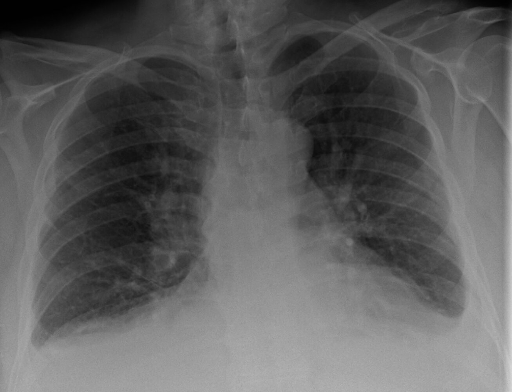
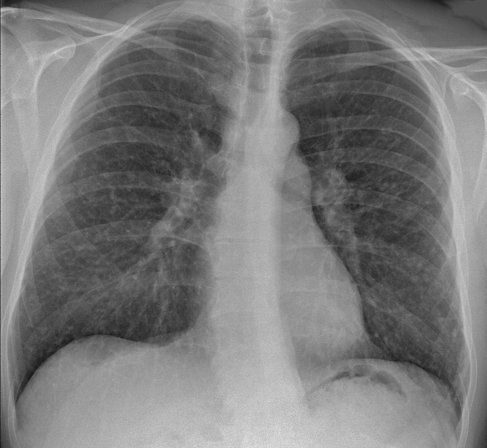

# Restrictive cardiomyopathy

*Categories: Clinical knowledge > Internal medicine > Cardiology and angiology > Myocardial diseases > Restrictive cardiomyopathy*

[Original Article Link](https://coursology-qbank.com/amboss/article/MI0MWh)

---

## Summary

Restrictive <u>cardiomyopathy</u> (RCM) is a rare type of <u>cardiomyopathy</u> characterized by marked <u>diastolic dysfunction</u>, normal (or near-normal) systolic function, and normal ventricular volumes. RCM occurs as a result of <u>myocardium</u> distortion due to <u>proliferation</u> of abnormal tissue or the deposition of abnormal compounds. Many diseases, both primary and acquired, cause RCM. Regardless of the etiology, RCM manifests with <u>congestive heart failure</u> (<u>CHF</u>), often with pronounced right-sided symptoms. <u>Echocardiography</u> is the first-line diagnostic test and is often followed by advanced imaging, including <u>cardiac MRI</u>. Initial management focuses on the <u>treatment of CHF</u> followed by identification and treatment of the underlying cause. In severe or refractory cases, <u>heart transplantation</u> may be necessary.

See also “<u>Cardiomyopathy</u>” for other <u>cardiomyopathy</u> types.

---

## Etiology

* RCM can be a <u>primary cardiomyopathy</u> or a <u>secondary cardiomyopathy</u>. [[5]](https://coursology-qbank.com/amboss/article/FhVgf80)

* There are four categories of RCM based on the underlying pathology, with some overlap between the categories.

* See also "<u>RCM in children</u>."

> [!NOTE]
> “PLEASe Help!”: <u>Causes of restrictive cardiomyopathy</u> include Postradiation/Postsurgery <u>fibrosis</u>, Löffler <u>endocarditis</u>, Endocardial fibroelastosis, Amyloidosis, Sarcoidosis, and Hemochromatosis.

### Infiltrative cardiomyopathy [[1]](https://coursology-qbank.com/amboss/article/GAXBO00)[[2]](https://coursology-qbank.com/amboss/article/FAXgl00)[[6]](https://coursology-qbank.com/amboss/article/tAXXl00)

* <u>Amyloidosis</u>: caused by an accumulation of abnormal <u>proteins</u> in the <u>myocardium</u>

* <u>Sarcoidosis</u>: secondary to deposition of <u>granulomas</u> in the <u>myocardium</u>

* <u>Primary hyperoxaluria</u>: secondary to oxalate deposits in the <u>myocardium</u>

> [!TIP]
> <u>Amyloidosis</u> is the most common cause of restrictive <u>cardiomyopathy</u> in high-income countries. [[7]](https://coursology-qbank.com/amboss/article/N3c-iX0)

### Storage disorders [[1]](https://coursology-qbank.com/amboss/article/GAXBO00)[[2]](https://coursology-qbank.com/amboss/article/FAXgl00)

* <u>Hereditary hemochromatosis</u>; : increased absorption of <u>iron</u> from <u>GI tract</u> (more commonly causes <u>dilated cardiomyopathy</u>)

* <u>Iron overload</u>: increased systemic <u>iron</u> from repeated <u>blood transfusions</u>

* Congenital enzyme abnormalities

* <u>Lysosomal storage diseases</u>

* <u>Glycogen storage disorders</u>

> [!TIP]
> Some storage disorders, e.g., <u>Gaucher disease</u>, can also cause <u>infiltrative cardiomyopathy</u>. [[1]](https://coursology-qbank.com/amboss/article/GAXBO00)

### Endomyocardial disorders [[6]](https://coursology-qbank.com/amboss/article/tAXXl00)

* Endomyocardial fibrosis: caused by <u>autoantibodies</u> against <u>myocardial</u> <u>proteins</u>

* Most common form of RCM worldwide; primarily found in sub-Saharan Africa  [[6]](https://coursology-qbank.com/amboss/article/tAXXl00)

* Mainly affects children and young adults

* Possible initiating factors [[8]](https://coursology-qbank.com/amboss/article/xrYEjq)

* Exposure to the element cerium

* Chronic <u>eosinophilia</u>

* Viral and parasitic infections

* <u>Magnesium</u> deficiency

* Hypereosinophilia (Löffler endocarditis): eosinophilic infiltration of the <u>myocardium</u> [[6]](https://coursology-qbank.com/amboss/article/tAXXl00)

* Endocardial fibroelastosis: a diffuse thickening of the <u>left ventricle</u> <u>endocardium</u> from the <u>proliferation</u> of fibrous and elastic tissue 

* Most commonly occurs in the first two years of life

* Can be primary (with unknown etiology) or secondary (associated with congenital <u>heart</u> conditions, e.g., <u>aortic stenosis</u>, aortic <u>atresia</u>, <u>coarctation of the aorta</u>, <u>patent ductus arteriosus</u>) [[9]](https://coursology-qbank.com/amboss/article/VRcGNX0)

* <u>Malignancy</u>: <u>carcinoid heart disease</u> or <u>metastatic</u> <u>tumor</u>

* <u>Iatrogenic</u>

* <u>Radiotherapy</u> to the chest: causes radiation-induced <u>fibrosis</u> [[6]](https://coursology-qbank.com/amboss/article/tAXXl00)

* <u>Chemotherapy</u> [[10]](https://coursology-qbank.com/amboss/article/eRcxNX0)

* Multiple <u>chemotherapy agents</u> have been associated with cardiac damage.

* <u>Anthracyclines</u> (e.g. <u>doxorubicin</u>) are most commonly associated with RCM [[10]](https://coursology-qbank.com/amboss/article/eRcxNX0)

* Cardiac <u>surgery</u>: postoperative scarring

### Noninfiltrative restrictive <u>cardiomyopathy</u>

* <u>Idiopathic</u> RCM: may be sporadic or familial

* <u>Systemic sclerosis</u> (<u>scleroderma</u>): <u>Microvascular</u> <u>ischemia</u> creates <u>reperfusion injury</u> with secondary <u>fibrosis</u>.

---

## Pathophysiology

* Infiltration (e.g., abnormal <u>proteins</u>, <u>glycogen</u>, <u>eosinophils</u>, <u>granulomas</u>, <u>iron</u>) or <u>proliferation</u> of connective or <u>fibrotic</u> tissue → ↓ elasticity of <u>myocardium</u> → ↓ ventricular compliance (severe <u>diastolic dysfunction</u>) → ↓ ventricular filling in <u>diastole</u>  → ↑ left and right-sided filling pressures → ↑ atrial size → ↑ pulmonary and systemic venous congestion → late-stage ↓ in LV systolic function → <u>hypotension</u> [[2]](https://coursology-qbank.com/amboss/article/FAXgl00)[[4]](https://coursology-qbank.com/amboss/article/sAXtO00)

---

## Clinical features

### Symptoms [[1]](https://coursology-qbank.com/amboss/article/GAXBO00)[[4]](https://coursology-qbank.com/amboss/article/sAXtO00)[[6]](https://coursology-qbank.com/amboss/article/tAXXl00)

* <u>Dyspnea on exertion</u> (most common symptom)

* Leg swelling

* <u>Palpitations</u>

* <u>Syncope</u>

* <u>Sudden cardiac death</u>

### <u>Physical examination</u> [[1]](https://coursology-qbank.com/amboss/article/GAXBO00)

* <u>Features of right-sided heart failure</u>

* <u>Jugular venous distention</u>

* <u>Peripheral edema</u>

* <u>Hepatomegaly</u> and <u>ascites</u>

* <u>Kussmaul sign</u>

* <u>Auscultatory</u> findings

* Prominent <u>S4 gallop</u>

* Possible <u>murmur</u> of <u>mitral regurgitation</u>  and/or <u>tricuspid regurgitation</u>

* Possible <u>dysrhythmia</u>: <u>Atrial fibrillation</u> is common.

* <u>Signs of heart failure</u> (e.g., <u>crackles</u> or dullness secondary to <u>pleural effusion</u>) [[4]](https://coursology-qbank.com/amboss/article/sAXtO00)

* Features of the underlying disease, e.g.: [[2]](https://coursology-qbank.com/amboss/article/FAXgl00)

* <u>Amyloidosis</u>: <u>carpal tunnel syndrome</u> , large <u>tongue</u>

* <u>Hemochromatosis</u>: <u>bronze skin</u>

* <u>Sarcoidosis</u>: <u>erythema nodosum</u>

> [!TIP]
> The symptoms and <u>signs of heart failure</u> are the most common clinical features of RCM. [[1]](https://coursology-qbank.com/amboss/article/GAXBO00)

---

## Diagnosis

### Approach

* Order initial studies (basic <u>laboratory studies</u>, <u>ECG</u>, <u>x-ray chest</u>, and <u>echocardiogram</u>) to confirm the <u>diagnosis of RCM</u>.

* Screen patients for associated complications.

* If the underlying etiology remains unclear, consider advanced studies (e.g., <u>cardiac MRI</u> or <u>endomyocardial biopsy</u>).

### Initial studies [[1]](https://coursology-qbank.com/amboss/article/GAXBO00)

* <u>ECG</u>

* Low <u>voltage</u> QRS complexes: classic but insensitive finding in infiltrative disease (e.g., <u>amyloidosis</u>) [[11]](https://coursology-qbank.com/amboss/article/LhcweX0)

* Conduction disorders (<u>AV block</u>, <u>LBBB</u>, <u>RBBB</u>) and <u>atrial fibrillation</u>

* Large <u>P wave</u>: consistent with <u>biatrial enlargement</u>

* May also be normal

* <u>X-ray chest</u> (PA and <u>lateral</u>)

* <u>X-ray findings of left atrial enlargement</u>

* <u>X-ray</u> features of <u>pulmonary congestion</u>

* Evidence of underlying disease (e.g., hilar <u>adenopathy</u> in <u>sarcoidosis</u>)

* <u>Laboratory studies</u>

* <u>CBC with differential</u>: <u>Eosinophil</u> count > 1.5 × 109/L is consistent with hypereosinophilic <u>heart</u> disease. [[4]](https://coursology-qbank.com/amboss/article/sAXtO00)

* <u>Comprehensive metabolic panel</u>: Nephropathy and hepatopathy are common in <u>amyloidosis</u>.

* <u>Troponin</u> and <u>NT-proBNP</u>: to establish the extent of <u>heart failure</u> and establish a baseline for treatment monitoring  [[2]](https://coursology-qbank.com/amboss/article/FAXgl00)[[4]](https://coursology-qbank.com/amboss/article/sAXtO00)[[12]](https://coursology-qbank.com/amboss/article/I3cYPX0)

* <u>Transthoracic echocardiography</u> [[1]](https://coursology-qbank.com/amboss/article/GAXBO00)[[2]](https://coursology-qbank.com/amboss/article/FAXgl00)[[13]](https://coursology-qbank.com/amboss/article/8AXOl00)

* <u>TTE</u> is the preferred initial test.   [[1]](https://coursology-qbank.com/amboss/article/GAXBO00)

* Characteristic findings of RCM on TTE [[1]](https://coursology-qbank.com/amboss/article/GAXBO00)

* Severe <u>diastolic dysfunction</u> (high early <u>diastolic</u> filling velocities and low late <u>diastolic</u> filling velocities)   [[1]](https://coursology-qbank.com/amboss/article/GAXBO00)[[14]](https://coursology-qbank.com/amboss/article/i7cJld0)

* Normal right and <u>left ventricular</u> volumes

* Left atrial or <u>biatrial enlargement</u>

* Preserved <u>ejection fraction</u> (may be reduced in late-stage disease)

* Typically normal ventricular wall thickness (may be increased in <u>amyloidosis</u>, <u>sarcoidosis</u>, and <u>lysosomal storage disease</u>)

* Findings of underlying disease, e.g.:

* In <u>amyloidosis</u>: reflective <u>myocardium</u> (speckling) [[15]](https://coursology-qbank.com/amboss/article/dzXo700)

* In <u>sarcoidosis</u>: regional wall motion abnormalities that do not match coronary blood flow distribution [[2]](https://coursology-qbank.com/amboss/article/FAXgl00)[[6]](https://coursology-qbank.com/amboss/article/tAXXl00)

> [!TIP]
> <u>Echocardiography</u> is the preferred first-line test for RCM because of its high <u>sensitivity</u> and <u>specificity</u> for this disease. [[1]](https://coursology-qbank.com/amboss/article/GAXBO00)[[16]](https://coursology-qbank.com/amboss/article/Q7culd0)

Low-voltage QRS complexes

Left bundle branch block (LBBB)

Atrial fibrillation with rapid ventricular response

Cardiogenic pulmonary edema

Enlarged left atrial appendage

Thoracic sarcoidosis

Restrictive cardiomyopathy

### Additional diagnostic studies

#### Assessment for associated disease states

* <u>Ambulatory ECG monitoring</u> (e.g., <u>holter monitor</u>): Indicated for patients with an abnormal <u>ECG</u>, symptomatic patients, and those with a history of <u>sarcoidosis</u>.  [[6]](https://coursology-qbank.com/amboss/article/tAXXl00)[[17]](https://coursology-qbank.com/amboss/article/73c4PX0)

* <u>Cardiac catheterization</u>: used to assess for <u>ischemic heart disease</u> or <u>constrictive pericarditis</u> [[1]](https://coursology-qbank.com/amboss/article/GAXBO00)

* Indications

* Prominent <u>chest pain</u>

* Regional wall abnormalities on <u>echocardiography</u> [[13]](https://coursology-qbank.com/amboss/article/8AXOl00)

* Diagnostic uncertainty between RCM and <u>constrictive pericarditis</u>

* Findings

* May show concurrent <u>ischemic heart disease</u>

* High <u>right atrial pressure</u>

* Abnormal ventricular pressure: <u>diastolic</u> pressure is usually slightly higher in the <u>left ventricle</u> compared to the right  [[1]](https://coursology-qbank.com/amboss/article/GAXBO00)[[2]](https://coursology-qbank.com/amboss/article/FAXgl00)[[13]](https://coursology-qbank.com/amboss/article/8AXOl00)

* Early decrease in ventricular <u>diastolic</u> pressure followed by a rapid rise

* Evaluation of secondary end-organ damage: Consider if found during initial studies, e.g., <u>doppler ultrasound</u> for <u>cardiac cirrhosis</u>, <u>urine analysis</u> and <u>renal ultrasound</u> in renal impairment

#### <u>Screening studies</u> for the suspected underlying cause

* <u>Hemochromatosis</u>: elevated <u>ferritin</u> and <u>transferrin saturation</u> [[2]](https://coursology-qbank.com/amboss/article/FAXgl00)

* <u>Sarcoidosis</u>

* <u>Angiotensin-converting enzyme</u> levels may be elevated.  [[6]](https://coursology-qbank.com/amboss/article/tAXXl00)

* <u>FDG-PET scan</u>: shows increased uptake in early disease and reduced uptake in advanced disease  [[2]](https://coursology-qbank.com/amboss/article/FAXgl00)

* <u>Amyloidosis</u>: serum <u>free light chains</u> and serum and <u>urine electrophoresis</u> [[1]](https://coursology-qbank.com/amboss/article/GAXBO00)

* <u>Lysosomal storage diseases</u>: enzyme and <u>genetic testing</u> [[1]](https://coursology-qbank.com/amboss/article/GAXBO00)

#### Advanced studies for RCM

* <u>Cardiac MRI</u> (<u>CMR</u>) [[1]](https://coursology-qbank.com/amboss/article/GAXBO00)[[18]](https://coursology-qbank.com/amboss/article/3_XSL00)[[19]](https://coursology-qbank.com/amboss/article/UzXbH00)

* Can establish a definitive diagnosis

* Can help guide chronic management of RCM by quantitating <u>myocardial</u> disease

* <u>Endomyocardial biopsy</u> (<u>EMB</u>) [[2]](https://coursology-qbank.com/amboss/article/FAXgl00)

* <u>EMB</u> provides tissue for a definitive histological diagnosis (e.g., <u>fibrosis</u>, <u>amyloidosis</u>, <u>iron</u> deposition, <u>granulomas</u>, eosinophilic infiltrates in <u>Löffler endocarditis</u>).

* Guided <u>biopsy</u> with electroanatomic mapping or <u>CMR</u> or PET is recommended.  [[2]](https://coursology-qbank.com/amboss/article/FAXgl00)[[20]](https://coursology-qbank.com/amboss/article/ZzXZr00)

* The use of <u>EMB</u> has decreased as <u>cardiac MRI</u> technology has improved. [[1]](https://coursology-qbank.com/amboss/article/GAXBO00)

---

## Treatment

### Approach

* Start symptomatic <u>treatment of heart failure</u>, including education on lifestyle modification.

* Screen for and treat associated diseases (e.g., <u>arrhythmias</u>, <u>thromboembolism</u>).

* Treat the underlying cause, when possible.

* Patients with severe or refractory symptoms:

* Consider <u>heart transplant</u>.

* If the patient is not a suitable candidate for transplant, refer early to <u>palliative care</u>, as symptoms can be challenging to manage.

> [!TIP]
> RCM is the most challenging form of <u>cardiomyopathy</u> to manage because treatment options are limited and <u>morbidity</u> and mortality are high. [[21]](https://coursology-qbank.com/amboss/article/oRc0LX0)

### Symptom management

#### <u>Treatment of congestive heart failure</u> [[2]](https://coursology-qbank.com/amboss/article/FAXgl00)[[22]](https://coursology-qbank.com/amboss/article/uAXpl00)

* The initial management of RCM is the <u>treatment of congestive heart failure</u> symptoms.

* The unique physiology of RCM and its underlying disease processes may necessitate modifications to the standard <u>treatment of CHF</u>.

|  <u>Heart failure management</u> in RCM [[1]](https://coursology-qbank.com/amboss/article/GAXBO00)[[2]](https://coursology-qbank.com/amboss/article/FAXgl00)[[4]](https://coursology-qbank.com/amboss/article/sAXtO00)  |  |  |
| --- | --- | --- |
| Medication | Treatment mechanism | Additional considerations specific to RCM |
| <u>Diuretics</u> |   * First-line <u>treatment for heart failure</u> secondary to RCM [[2]](https://coursology-qbank.com/amboss/article/FAXgl00)  * Slowly decrease <u>fluid overload</u> with gentle diuresis and <u>sodium</u> restriction [[1]](https://coursology-qbank.com/amboss/article/GAXBO00)    |  * Avoid rapid and/or high volume diuresis: may cause <u>hypotension</u>.  [[2]](https://coursology-qbank.com/amboss/article/FAXgl00)[[4]](https://coursology-qbank.com/amboss/article/sAXtO00)   |
| <u>Beta blockers</u> and <u>calcium channel blockers</u> (<u>CCBs</u>) |   * Reduce <u>sympathetic</u> tone  * Decrease <u>arrhythmias</u>  * Increase <u>diastolic</u> filling time    |  * Introduce slowly: Profound <u>hypotension</u> may occur.  [[4]](https://coursology-qbank.com/amboss/article/sAXtO00)   |
| <u>Angiotensin-converting enzyme inhibitors</u> (<u>ACEIs</u>) and <u>angiotensin receptor blockers</u> (<u>ARBs</u>) |   * Reduce <u>afterload</u>  * Reduce ventricular <u>hypertrophy</u> [[23]](https://coursology-qbank.com/amboss/article/D3c1kX0)    |  * Use with caution in RCM: may cause <u>hypotension</u>  [[2]](https://coursology-qbank.com/amboss/article/FAXgl00)   |

> [!WARNING]
> Start at very low doses when prescribing <u>beta blockers</u>, <u>CCBs</u>, <u>ACEIs</u>, or <u>ARBs</u> for patients with RCM; life-threatening <u>hypotension</u> may occur.

#### Management of associated <u>arrhythmias</u> [[1]](https://coursology-qbank.com/amboss/article/GAXBO00)[[6]](https://coursology-qbank.com/amboss/article/tAXXl00)

* Treat <u>atrial fibrillation</u>.

* Early <u>cardioversion</u>: <u>Tachycardia</u> can precipitate <u>acute heart failure</u> and <u>hypotension</u>. [[4]](https://coursology-qbank.com/amboss/article/sAXtO00)

* Medical therapy: Consider <u>beta blockers</u> (e.g., <u>sotalol</u>) or <u>amiodarone</u> (see “<u>Rate control for atrial fibrillation</u>” for further information including dosages). [[23]](https://coursology-qbank.com/amboss/article/D3c1kX0)

* Consider the following, depending on <u>ECG</u> and <u>Holter monitor</u> findings:

* Pacemaker placement: Patients with RCM frequently develop high-grade symptomatic <u>AV blocks</u>. [[1]](https://coursology-qbank.com/amboss/article/GAXBO00)

* <u>AICD</u>: Patients with RCM are at high risk for <u>sudden cardiac death</u> from ventricular <u>dysrhythmias</u>.  [[2]](https://coursology-qbank.com/amboss/article/FAXgl00)

> [!WARNING]
> <u>Digoxin</u> should be avoided in patients with RCM because it can worsen symptoms of several of the underlying etiologies (e.g., <u>amyloidosis</u>, <u>sarcoidosis</u>). [[2]](https://coursology-qbank.com/amboss/article/FAXgl00)

#### Anticoagulation

* Anticoagulation is indicated for patients with a known <u>thrombus</u>, a high risk of thrombogenesis, or <u>atrial fibrillation</u>. [[1]](https://coursology-qbank.com/amboss/article/GAXBO00)[[2]](https://coursology-qbank.com/amboss/article/FAXgl00)[[6]](https://coursology-qbank.com/amboss/article/tAXXl00)

* See “<u>Anticoagulation in atrial fibrillation</u>” for further information on anticoagulation, including dosages.

### Disease-specific treatment

Definitive treatment depends on the specific etiology (see “Etiology” section).

|  Disease-specific treatment of RCM [[1]](https://coursology-qbank.com/amboss/article/GAXBO00)[[4]](https://coursology-qbank.com/amboss/article/sAXtO00)]#19367][[2]](https://coursology-qbank.com/amboss/article/FAXgl00)  |  |  |
| --- | --- | --- |
| Etiology |  | Treatment |
| Infiltrative | <u>Amyloidosis</u>: lIght chain |   * <u>Chemotherapy</u>  * <u>Autologous stem cell transplant</u>  * <u>Monoclonal antibodies</u> against <u>plasma cells</u>    |
| <u>Amyloidosis</u>: <u>transthyretin</u> <u>amyloidosis</u> (ATTR) |   * <u>Liver transplant</u>  * <u>Transthyretin stabilizers</u>  * <u>RNA</u> <u>antisense</u> therapies (e.g., inotersen, patisiran)  * <u>Monoclonal antibodies</u>  * <u>Doxycycline</u> with tauroursodeoxycholic acid    |  |
| <u>Sarcoidosis</u> |   * <u>Immunosuppressive therapy</u>  [[6]](https://coursology-qbank.com/amboss/article/tAXXl00)  * Pacemaker with or without <u>AICD</u>    |  |
| Storage disorder | <u>Hereditary hemochromatosis</u> |   * Frequent <u>phlebotomy</u>  * <u>Iron chelation therapy</u>    |
| <u>Iron overload</u> |  * <u>Iron chelation therapy</u>  [[24]](https://coursology-qbank.com/amboss/article/5_XiK00)   |  |
| Endomyocardial disorder | <u>Hypereosinophilic syndrome</u> |   * <u>Corticosteroids</u>  * <u>IFN-α</u>  * <u>Hydroxyurea</u>    |
| <u>Radiotherapy</u> |   * Symptomatic treatment  * Possible <u>heart transplant</u>    |  |
| Noninfiltrative | <u>Systemic sclerosis</u> |   * Symptomatic treatment  * Early treatment with <u>dihydropyridine CCB</u> [[25]](https://coursology-qbank.com/amboss/article/phcLUX0)    |

### Management of severe or refractory RCM

* In patients who are unresponsive to medical therapy, consider <u>mechanical circulatory support</u> (e.g., <u>LVAD</u>), either as a <u>destination therapy</u> or a <u>bridge to transplant</u>.  [[26]](https://coursology-qbank.com/amboss/article/w3chkX0)

* Consider referral for a <u>heart transplant</u> (or <u>heart</u> and <u>liver transplant</u> in <u>amyloidosis</u>). [[4]](https://coursology-qbank.com/amboss/article/sAXtO00)

* For patients who are not candidates for a <u>heart transplant</u>, refer to <u>palliative care</u>.

---

## Differential diagnoses

* RCM and <u>constrictive pericarditis</u> have similar clinical presentations. Distinguishing between the two diseases is critical to determining the appropriate management.

* See also “<u>Cardiomyopathy</u>” article.

> [!TIP]
> <u>Echocardiography</u> is the initial test of choice to distinguish RCM from <u>constrictive pericarditis</u>. [[1]](https://coursology-qbank.com/amboss/article/GAXBO00)

|  Restrictive <u>cardiomyopathy</u> versus <u>constrictive pericarditis</u> [[1]](https://coursology-qbank.com/amboss/article/GAXBO00)[[13]](https://coursology-qbank.com/amboss/article/8AXOl00)[[27]](https://coursology-qbank.com/amboss/article/GhcB2X0)  |  |  |
| --- | --- | --- |
|  | RCM | <u>Constrictive pericarditis</u> |
| Clinical presentation |   * Signs and symptoms of <u>CHF</u>  * Positive <u>Kussmaul sign</u>    |  |
| <u>Auscultation</u> |   * Mitral or <u>tricuspid regurgitation</u>  * <u>S4 gallop</u>    |  * <u>Pericardial knock</u>   |
| <u>X-ray chest</u> |  * Atrial enlargement   |  * <u>Pericardial</u> calcification   |
| <u>Echocardiography</u> |  * Decreased respiratory variation in Doppler flow   |   * Ventricular septum shift with respiration  [[13]](https://coursology-qbank.com/amboss/article/8AXOl00)  * Thickened <u>pericardium</u> may be seen.    |
| CT or <u>MRI</u> chest |  * Normal <u>pericardium</u>   |  * Calcified or thickened <u>pericardium</u> [[1]](https://coursology-qbank.com/amboss/article/GAXBO00)   |
| <u>Cardiac catheterization</u> |   * <u>LVEDP</u> > RVEDP  * <u>Right ventricular</u> systolic pressure (RVSP) ≥ 55 mm Hg    |   * <u>LVEDP</u> similar to RVEDP  * Normal RVSP    |

The differential diagnoses listed here are not exhaustive.

---