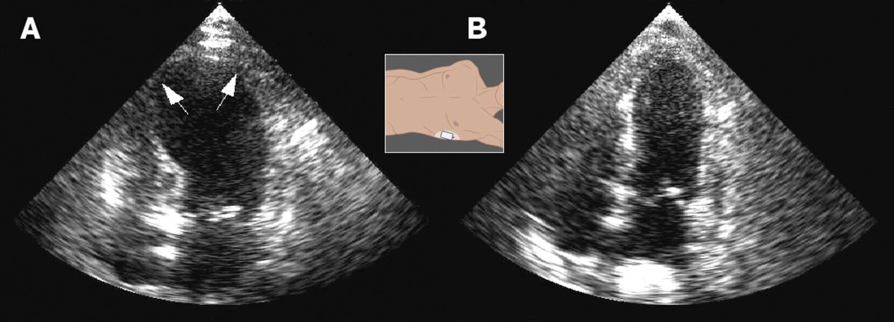
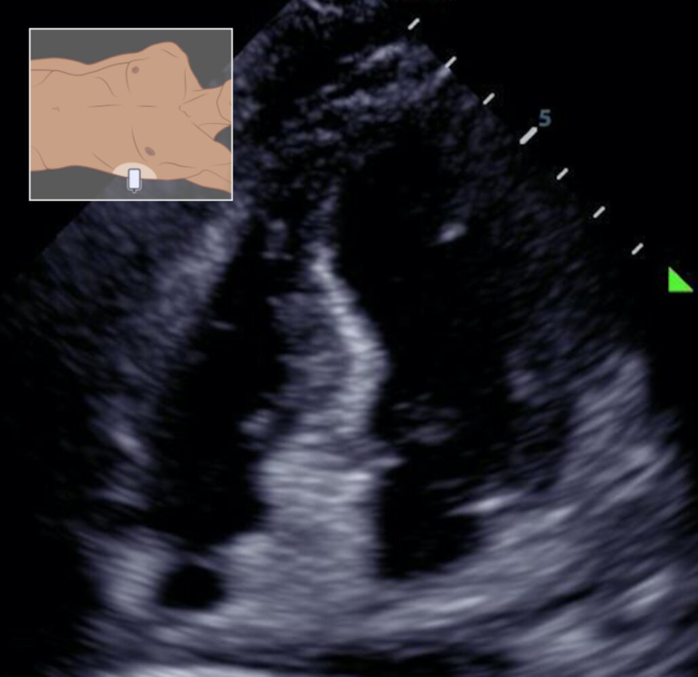

# Takotsubo cardiomyopathy

*Categories: Clinical knowledge > Internal medicine > Cardiology and angiology > Myocardial diseases > Takotsubo cardiomyopathy*

[Original Article Link](https://coursology-qbank.com/amboss/article/Bq0z0h)

---

## Summary

Takotsubo <u>cardiomyopathy</u>, also known as <u>stress</u>-induced <u>cardiomyopathy</u>, refers to acute, <u>stress</u>-induced, reversible dysfunction of the <u>left ventricle</u>. It is an uncommon but clinically significant cause of <u>chest pain</u> that can mimic <u>acute coronary syndrome</u> (<u>ACS</u>). Typically triggered by an extreme emotional <u>stressor</u> or severe illness, it is typically characterized by ballooning of the <u>left ventricular</u> wall, which can lead to <u>chest pain</u> and <u>heart failure</u>. While most cases fully resolve within a couple of weeks, patients can become critically ill, particularly if the disease causes <u>left ventricular outflow tract obstruction</u> (<u>LVOT obstruction</u>). As symptoms overlap with those seen in <u>acute coronary syndrome</u>, this condition should be excluded. See also <u>cardiomyopathy</u> for information on other <u>cardiomyopathies</u>.

---

## Definitions

* Definition: acute, <u>stress</u>-induced; , reversible dysfunction of the <u>left ventricle</u> that can mimic <u>acute coronary syndrome</u>

* Classification [[2]](https://coursology-qbank.com/amboss/article/KCYUGr)

* Primary form: Symptoms have led the patient to seek medical attention.

* Secondary form : The patient is already seriously ill with another condition, meaning that the presentation may be more insidious.

---

## Epidemiology

* 90% of affected individuals are <u>postmenopausal</u> women. [[3]](https://coursology-qbank.com/amboss/article/kCYmHr)

* More common in patients with preexisting mental illness [[4]](https://coursology-qbank.com/amboss/article/mqYV_J)

Epidemiological data refers to the US, unless otherwise specified.

---

## Etiology

* Triggers  [[3]](https://coursology-qbank.com/amboss/article/kCYmHr)[[4]](https://coursology-qbank.com/amboss/article/mqYV_J)

* Intense emotional <u>stress</u>

* The <u>stress</u> is usually negative (i.e., “broken <u>heart</u> syndrome”)

* Less common: strong, positive emotions (i.e., “happy <u>heart</u> syndrome”)

* Severe illness

* Drugs

* Pathophysiology: Emotional/physical <u>stress</u> → activation of the <u>sympathetic nervous system</u> → massive <u>catecholamine</u> discharge;  → cardiotoxicity, multivessel spasms, and dysfunction → <u>myocardial stunning</u>

---

## Clinical features

Symptoms overlap with those seen in <u>acute coronary syndrome</u> (see “Clinical features” in <u>acute coronary syndrome</u>) and are characteristically preceded by a stressful event. [[2]](https://coursology-qbank.com/amboss/article/KCYUGr)[[3]](https://coursology-qbank.com/amboss/article/kCYmHr)

* Most common symptoms

* Retrosternal <u>chest pain</u> with typical features of <u>angina</u>

* <u>Dyspnea</u>

* Additional symptoms

* <u>Syncope</u>

* <u>Arrhythmias</u>

* <u>Signs of heart failure</u> and/or <u>cardiogenic shock</u> (e.g., <u>hypotension</u>, <u>pulmonary edema</u>)

---

## Diagnosis

The diagnosis of takotsubo <u>cardiomyopathy</u> requires <u>left ventricle</u> regional wall motion abnormalities (typically reversible) that extend beyond a single <u>coronary artery</u> distribution in the absence of <u>obstructive coronary artery disease</u>. It is extremely difficult to distinguish between takotsubo <u>cardiomyopathy</u> and <u>acute coronary syndrome</u> (<u>ACS</u>) on the basis of <u>ECG</u> and laboratory test findings alone; emergency <u>coronary angiography</u> is usually required to rule out <u>ACS</u>. [[2]](https://coursology-qbank.com/amboss/article/KCYUGr)[[3]](https://coursology-qbank.com/amboss/article/kCYmHr)

### Approach

* Check <u>ECG</u>, <u>cardiac biomarkers</u>, and bedside <u>TTE</u> (if available).

* Determine the <u>pretest probability</u> of takotsubo <u>cardiomyopathy</u> and <u>ACS</u> (using patient <u>risk factors</u> and diagnostic criteria).

* If <u>pretest probability</u> for <u>ACS</u> is high, perform emergent <u>coronary angiography</u>.

* If <u>pretest probability</u> for <u>ACS</u> is low, consider noninvasive imaging methods (e.g., <u>TTE</u>).

* Check <u>cardiac MRI</u> to better characterize <u>myocardial</u> <u>edema</u>.

### Diagnostic criteria

Several diagnostic criteria are used to establish a diagnosis of <u>stress</u>-induced <u>cardiomyopathy</u>, including the revised Mayo Clinic criteria and the <u>InterTAK diagnostic score</u>.

* Revised Mayo Clinic criteria: all of the following must be present [[2]](https://coursology-qbank.com/amboss/article/KCYUGr)[[5]](https://coursology-qbank.com/amboss/article/hTbcqG)

* Presence of cardiac <u>ischemia</u>

* New <u>ECG</u> abnormalities: <u>ST-segment</u> elevation and/or <u>T-wave</u> inversions

* Elevation in serum <u>troponin</u>

* Presence of <u>LV dysfunction</u> (with or without apical involvement)

* Transient hypokinesis, dyskinesis, or akinesis of the <u>left ventricular</u> midsegments

* Wall motion abnormalities extend past a single <u>coronary artery</u> vascular distribution.

* A stressful trigger is often present.

* Absence of obstructive coronary disease or acute <u>plaque</u> rupture (typically requires <u>angiography</u>)

* Absence of <u>myocarditis</u> or <u>pheochromocytoma</u>

|  InterTAK diagnostic score  [[6]](https://coursology-qbank.com/amboss/article/nyY7f7)  |  |
| --- | --- |
| Variables | Points assigned |
| Female sex | 25 |
| Emotional <u>stress</u> | 24 |
| Physical <u>stress</u> | 13 |
| Absence of <u>ST depressions</u> on <u>ECG</u> | 12 |
| Acute, former, or chronic psychiatric disorder | 11 |
| Acute, former, or chronic neurological disorder | 9 |
|  <u>Prolonged QTc interval</u>   | 6 |
|  Interpretation   * ≥ 50 points suggests a high <u>probability</u> of takotsubo <u>cardiomyopathy</u>.  * ≤ 31 points suggests a high <u>probability</u> of <u>ACS</u>.     |  |

### <u>Laboratory studies</u> [[2]](https://coursology-qbank.com/amboss/article/KCYUGr)[[3]](https://coursology-qbank.com/amboss/article/kCYmHr)

* ↑ <u>Troponin T/I</u>

* ↑ <u>Creatine kinase-MB</u>

* ↑ <u>BNP</u>

### <u>ECG</u> [[3]](https://coursology-qbank.com/amboss/article/kCYmHr)

<u>ECG</u> is abnormal in > 95% of patients with takotsubo <u>cardiomyopathy</u> and usually shows <u>ischemic</u> changes. [[2]](https://coursology-qbank.com/amboss/article/KCYUGr)

* <u>ST elevations</u> (most common finding), typically in the <u>precordial leads</u> 
* <u>ST elevation</u> in aVR, in combination with <u>ST elevations</u> in V1–V3, is 100% specific for <u>stress</u> <u>cardiomyopathy</u> versus <u>ACS</u>. [[2]](https://coursology-qbank.com/amboss/article/KCYUGr)

* <u>ST depressions</u> are uncommon (< 10% of cases).

* Diffuse <u>T-wave inversions</u>

* <u>Prolonged QT interval</u>

### Imaging

* <u>Echocardiography</u> (<u>TTE</u>) [[7]](https://coursology-qbank.com/amboss/article/OCYIHr)

* Indications: all patients suspected of having takotsubo <u>cardiomyopathy</u>

* Supportive findings

* ↓ <u>LVEF</u>

* <u>Global</u> LV dyskinesis involving the apex (most common)

* Regional wall motion abnormalities

* Apical <u>left ventricular</u> ballooning (not always present)

* More rarely, midventricular ballooning (10–20% of cases) or basal ballooning (< 5% of cases) may be present [[2]](https://coursology-qbank.com/amboss/article/KCYUGr)

* <u>LVOT obstruction</u> may be present (up to 25% of cases) [[2]](https://coursology-qbank.com/amboss/article/KCYUGr)

* <u>Coronary angiography</u> (with <u>ventriculography</u>) [[3]](https://coursology-qbank.com/amboss/article/kCYmHr) 

* Indications: to exclude <u>ACS</u>

* Findings

* Most cases: normal <u>coronary arteries</u> or nonobstructive <u>coronary artery disease</u>

* ∼ 15% of cases: <u>obstructive coronary artery disease</u> may also be present

* <u>Cardiac MRI</u> [[2]](https://coursology-qbank.com/amboss/article/KCYUGr)[[8]](https://coursology-qbank.com/amboss/article/lCYvHr)[[9]](https://coursology-qbank.com/amboss/article/NCY-Hr)

* Indications

* To exclude differential diagnoses (e.g., <u>myocarditis</u>) and confirm the diagnosis of takotsubo <u>cardiomyopathy</u> in stable patients

* Allows for better imaging of the <u>right ventricle</u>

* Suggestive findings

* Similar to findings in <u>TTE</u>

* <u>Transmural</u> <u>edema</u> along the areas of wall motion abnormalities

* <u>Myocardial</u> scarring

* Possible additional findings

* <u>LVOT obstruction</u>

* Valve disease

* <u>Pericardial effusion</u>

* <u>LV thrombus</u>

* <u>Coronary CT angiography</u>: consider as an alternative for stable patients with contraindications to <u>cMRI</u> to exclude high-grade coronary stenosis [[2]](https://coursology-qbank.com/amboss/article/KCYUGr)

Takotsubo cardiomyopathy

Takotsubo cardiomyopathy

---

## Treatment

Treatment is mostly symptomatic and consists of <u>supportive care</u> and treatment of complications and comorbidities (e.g., <u>acute heart failure</u>, <u>arrhythmias</u>). It is critical to determine if <u>LVOT obstruction</u> (which is typically accompanied by <u>mitral regurgitation</u>) is present because <u>inotropic</u> support in these patients can precipitate worsening cardiac function and lead to <u>cardiogenic shock</u>. Consider empiric treatment for <u>acute coronary syndrome</u> until it can be ruled out. All patients should be admitted to the hospital for at least 48 hours of continuous <u>telemetry</u>.

### Hemodynamically stable patients [[2]](https://coursology-qbank.com/amboss/article/KCYUGr)[[10]](https://coursology-qbank.com/amboss/article/mCYVsr)

* <u>Heart failure management</u> [[2]](https://coursology-qbank.com/amboss/article/KCYUGr)

* Treat as <u>systolic heart failure</u> (see “Treatment” in <u>heart failure</u>).

* <u>ACE inhibitors</u> (e.g., <u>lisinopril</u> DOSAGE)

* Low-dose <u>beta blockers</u> (e.g., <u>metoprolol</u> tartrate DOSAGE)

### <u>Hemodynamically unstable</u> patients [[2]](https://coursology-qbank.com/amboss/article/KCYUGr)[[10]](https://coursology-qbank.com/amboss/article/mCYVsr)

#### No <u>LVOT obstruction</u>   [[2]](https://coursology-qbank.com/amboss/article/KCYUGr)

* <u>Inotropic</u> support: <u>Dobutamine</u> and <u>dopamine</u> can be used; however, both can cause <u>tachycardia</u> and worsening of takotsubo <u>cardiomyopathy</u>, and so other agents, e.g., levosimendan, may be preferable. Patients receiving <u>inotropic</u> support should be monitored closely for the development of <u>LVOT</u>. [[2]](https://coursology-qbank.com/amboss/article/KCYUGr)

* Levosimendan DOSAGE [[11]](https://coursology-qbank.com/amboss/article/qCYCGr)[[12]](https://coursology-qbank.com/amboss/article/tCYXFr)

* OR <u>milrinone</u> DOSAGE

* <u>Vasopressor</u> support: if <u>inotropes</u> are insufficient [[2]](https://coursology-qbank.com/amboss/article/KCYUGr)

* <u>Phenylephrine</u> DOSAGE

* OR <u>vasopressin</u> DOSAGE

* Advanced therapies: consider in refractory cases

* Intra-aortic balloon pump (<u>IABP</u>)

* <u>Left ventricular assist device</u>

* <u>ECMO</u>

#### <u>LVOT obstruction</u> (occurs in up to 25% of cases) [[2]](https://coursology-qbank.com/amboss/article/KCYUGr)

<u>LVOT obstruction</u> further impairs LV systolic function and can be very difficult to treat. <u>Inotropic</u> support should be avoided, as this can precipitate <u>cardiogenic shock</u> in patients with <u>LVOT obstruction</u>.

* <u>IV fluids</u>: may improve LV systolic function

* <u>Beta blocker</u>: Use of a short-acting, low-dose <u>beta blocker</u> (if tolerated) may be helpful to relieve <u>LVOT obstruction</u> but should be used with caution in patients with <u>hypotension</u>.   [[13]](https://coursology-qbank.com/amboss/article/KfbUMG)

* <u>Esmolol</u> DOSAGE [[14]](https://coursology-qbank.com/amboss/article/JCYsGr)

* <u>Propranolol</u> DOSAGE [[15]](https://coursology-qbank.com/amboss/article/Lfbw5G)

* <u>Metoprolol</u> tartrate DOSAGE [[16]](https://coursology-qbank.com/amboss/article/ofb0MG)

* <u>Vasopressor</u> support: in cases of <u>shock</u>

* <u>Phenylephrine</u> DOSAGE

* OR <u>vasopressin</u> DOSAGE

* Advanced therapies: consider in refractory cases

* <u>Left ventricular assist device</u>

* <u>ECMO</u>

* The following therapies should be avoided:

* <u>Inotropes</u>

* <u>Vasodilators</u>

* <u>Nitroglycerin</u>

* <u>Diuretics</u>

* <u>IABP</u>

> [!WARNING]
> Avoid <u>inotropes</u>, as they can worsen <u>LVOT obstruction</u> and precipitate <u>cardiogenic shock</u>.

### Additional considerations for all patients [[2]](https://coursology-qbank.com/amboss/article/KCYUGr)[[10]](https://coursology-qbank.com/amboss/article/mCYVsr)

* Empiric <u>treatment of ACS</u>: Consider until <u>ACS</u> is ruled out (see “Treatment” in <u>acute coronary syndrome</u> and “Diagnostic criteria” above).

* <u>VTE prophylaxis</u>: consider especially in patients with reduced apical motion and all unstable patients  [[2]](https://coursology-qbank.com/amboss/article/KCYUGr)

* <u>Unfractionated heparin</u> DOSAGE

* OR <u>low molecular weight heparin</u> (e.g., <u>enoxaparin</u> DOSAGE)

* Prevention of <u>arrhythmia</u>

* Monitor for at least 48 hours with continuous <u>telemetry</u>.

* Consider <u>beta-blocker</u> therapy (e.g., <u>metoprolol</u> tartrate DOSAGE).

* Chronic therapy

* Most standard <u>heart failure</u> therapies have no known significant benefits for patients with takotsubo <u>cardiomyopathy</u>. [[2]](https://coursology-qbank.com/amboss/article/KCYUGr)

* Consider chronic <u>beta blocker</u> therapy (e.g., <u>metoprolol</u> tartrate DOSAGE).

* Consider a chronic <u>ACE inhibitor</u> or <u>ARB</u> (e.g., <u>lisinopril</u> DOSAGE, <u>losartan</u> DOSAGE).  [[2]](https://coursology-qbank.com/amboss/article/KCYUGr)

* Identify and treat the underlying cause: e.g., <u>SSRI</u> therapy for <u>depression</u>

---

## Prognosis

Although most patients recover within days to weeks, relapses are not uncommon and in-hospital deaths occur especially in patients with complications leading to <u>cardiogenic shock</u>.

* Recovery: within 1–2 weeks in most cases [[2]](https://coursology-qbank.com/amboss/article/KCYUGr)

* Recurrence rate: 2–4% per year [[2]](https://coursology-qbank.com/amboss/article/KCYUGr)

* In-hospital mortality: up to 5% [[2]](https://coursology-qbank.com/amboss/article/KCYUGr)

---

## Prevention

* Avoid triggers of physical and/or emotional <u>stress</u>.

* Consider chronic <u>beta blocker</u> and/or <u>ACE inhibitor</u>/<u>ARB</u> therapy.  [[2]](https://coursology-qbank.com/amboss/article/KCYUGr)[[10]](https://coursology-qbank.com/amboss/article/mCYVsr)

* Consider assessment (and referral to treatment) for mental health comorbidities.  [[2]](https://coursology-qbank.com/amboss/article/KCYUGr)

---