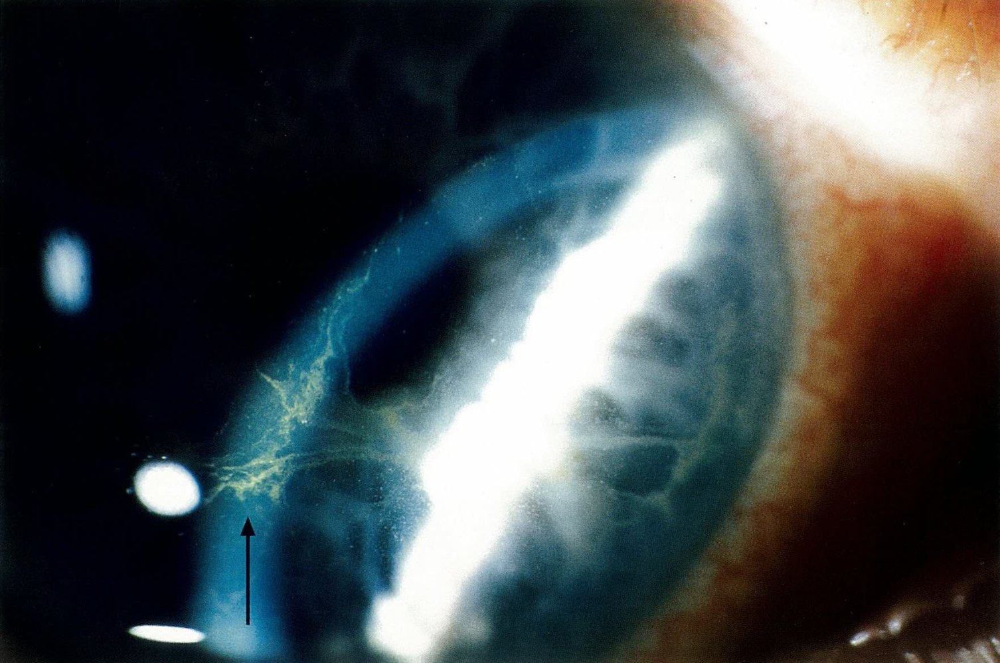
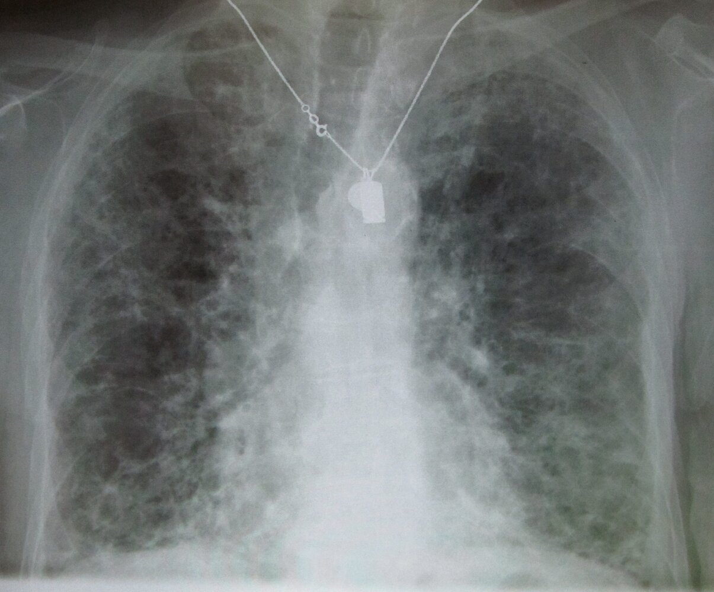
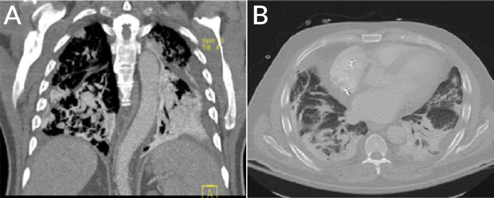

# Amiodarone

*Categories: Clinical knowledge > Internal medicine > Cardiology and angiology > Relevant pharmacology > Amiodarone*

[Original Article Link](https://coursology-qbank.com/amboss/article/Xm09Vg)

---

## Summary

Amiodarone is a <u>class III antiarrhythmic</u> agent that blocks <u>voltage-gated potassium channels</u>. It is used in the treatment of acute <u>ventricular tachycardia</u> and persistent <u>ventricular fibrillation</u> (VF) after unsuccessful <u>defibrillation</u>, as well as the long-term treatment of refractory <u>supraventricular arrhythmia</u> (<u>atrial fibrillation</u>). Since amiodarone has a very low negative <u>inotropic</u> effect, it can be used in patients with a reduced <u>ejection fraction</u> (EF). Side effects commonly involve the <u>thyroid</u>, <u>liver</u>, <u>heart</u>, eyes, and <u>central nervous system</u>. Pulmonary side effects, such as <u>lung</u> <u>fibrosis</u> and chronic <u>interstitial pneumonitis</u>, are rare but severe. Because amiodarone is a <u>cytochrome P450 inhibitor</u>, simultaneous administration of other drugs should be considered carefully to minimize the risk of interactions.

---

## Pharmacodynamics

* Primary mechanism of action: antiarrhythmic effect via blockage of <u>voltage-gated potassium channels</u> → prolonged <u>repolarization</u> of the <u>cardiac action potential</u>

* Secondary mechanism of action: inhibits <u>β-receptors</u> and <u>sodium</u> and <u>calcium</u> channels → decreases conduction through the AV and sinus node

* Special uses: : only antiarrhythmic agent with (almost) no negative <u>inotropic</u> effect → use in patients with reduced EF

References:[[1]](https://coursology-qbank.com/amboss/article/lOavsk)[[2]](https://coursology-qbank.com/amboss/article/NOa-sk)

---

## Adverse effects

### Overview

* Amiodarone is highly effective but typically limited to short-term treatment because of its side effect profile.

* Amiodarone accumulation in tissues can cause damage to the <u>thyroid</u>, <u>lungs</u>, nerves, <u>skin</u>, eyes, and <u>heart</u>.

* The lowest effective dose should be administered.

* Before initiating amiodarone therapy, patients should receive a <u>baseline ECG</u>, <u>chest x-ray</u>, ophthalmological exam, and <u>thyroid</u>, <u>liver</u>, and <u>pulmonary function tests</u>.

* <u>Thyroid</u> and <u>liver function</u> should be monitored every 3–6 months and <u>ECG</u> should be performed annually.

|  Overview of amiodarone adverse effects [[4]](https://coursology-qbank.com/amboss/article/mOaVGk) |  |
| --- | --- |
| Pulmonary |   * <u>Pulmonary fibrosis</u>  * Chronic <u>interstitial pneumonitis</u>  * Organizing <u>pneumonia</u>  * <u>ARDS</u>  * Solitary pulmonary mass    |
| <u>Thyroid</u> |   * <u>Hypothyroidism</u>  * <u>Hyperthyroidism</u> or <u>thyrotoxicosis</u>  * Exacerbation of preexisting <u>thyroid</u> conditions    |
| Hepatic |   * <u>AST</u> and/or <u>ALT</u> > 2x normal  * <u>Hepatitis</u> and <u>cirrhosis</u>    |
| Cardiac |   * Proarrhythmia  * <u>Bradycardia</u> and <u>AV block</u>  * <u>Hypotension</u>    |
| Ocular |   * Corneal micro-deposits  * <u>Optic neuritis</u>    |
| <u>GI tract</u> |   * <u>Nausea</u>  * <u>Anorexia</u>  * <u>Constipation</u>    |
| <u>Dermal</u> |   * <u>Photosensitivity</u>  * Blue discoloration    |
| <u>CNS</u> |   * <u>Peripheral neuropathy</u>  * <u>Ataxia</u>  * <u>Paresthesia</u>  * <u>Sleep</u> disturbance  * Impaired <u>memory</u>  * <u>Tremor</u>    |
| GU tract |   * <u>Epididymitis</u>  * <u>Erectile dysfunction</u>    |

Corneal microdeposits

Interstitial lung disease

Amiodarone-induced pulmonary toxicity

#### Pulmonary [[5]](https://coursology-qbank.com/amboss/article/RfYlNo)

* Amiodarone-induced pulmonary toxicity (<u>AIPT</u>) leads to the most deaths associated with amiodarone therapy.

* Toxicity correlates more closely with cumulative dose than with serum drug levels.

* Treatment: Discontinue amiodarone and initiate <u>corticosteroid</u> therapy.

#### <u>Thyroid</u>

* Amiodarone causes <u>thyroid</u> dysfunction in ∼ 10% of patients receiving long-term therapy.  [[3]](https://coursology-qbank.com/amboss/article/5dWiq40)

* Amiodarone-induced hypothyroidism 

* Pathophysiology

* ↑ <u>Iodine</u> content of amiodarone → inhibition of <u>thyroid hormone</u> biosynthesis (<u>Wolff-Chaikoff effect</u>)

* Amiodarone → inhibition of peripheral T4 to T3 conversion → ↑ concentrations of metabolically inactive <u>rT3</u>

* Treatment: <u>thyroid hormone</u> substitution (i.e., <u>levothyroxine</u>)

* Amiodarone-induced thyrotoxicosis

* Type I <u>amiodarone-induced thyrotoxicosis</u> 

* Pathophysiology: ↑ <u>iodine</u> content of amiodarone → ↑ <u>thyroid</u> <u>hormone</u> synthesis and release (<u>Jod-Basedow phenomenon</u>)

* Treatment: antithyroid therapy (e.g., <u>thionamides</u>); if resistant, then <u>radioiodine treatment</u> or surgical <u>thyroidectomy</u>

* Type II <u>amiodarone-induced thyrotoxicosis</u> 

* Pathophysiology: drug-induced damage of follicular cells → <u>destructive thyroiditis</u> → ↑ release of preformed <u>thyroid hormones</u>

* Treatment: <u>glucocorticoid</u> therapy

> [!NOTE]
> "Am-IOD-arone" consists of approx. 37% <u>iodine</u>.

#### Hepatic

* Asymptomatic rise in <u>AST</u> and <u>ALT</u> is common after initiation of amiodarone therapy.

* Amiodarone should be discontinued if <u>AST</u> and/or <u>ALT</u> rise above 2x higher than the normal range.

#### Cardiac

* Slows <u>heart rate</u> and AV-node conduction primarily through <u>calcium</u> channel-blocking activity

* Can cause <u>QT prolongation</u> but the risk of progression to <u>torsades de pointes</u> is low

#### Ocular

* Corneal micro-deposits occur in > 90% of patients and rarely cause symptoms but have the potential to result in halo <u>vision</u> (especially at night), <u>photophobia</u>, and blurred <u>vision</u>.  [[3]](https://coursology-qbank.com/amboss/article/5dWiq40)

We list the most important adverse effects. The selection is not exhaustive.

---

## Indications

* Acute treatment (IV administration) 

* Second-line therapy  for patients with <u>ventricular tachycardia</u> (VT) who are hemodynamically stable

* Persistent VT after <u>defibrillation</u>

* Pulseless <u>ventricular fibrillation</u>

* <u>Supraventricular tachycardia</u> in patients with cardiac failure (<u>LVEF</u> < 40%)

* Long-term treatment:  (oral administration): <u>rhythm control</u> in refractory symptomatic <u>atrial fibrillation</u> (<u>supraventricular arrhythmia</u>) and underlying <u>heart</u> disease  → restoration and maintenance of <u>sinus rhythm</u>

> [!TIP]
> Amiodarone is the drug of choice for <u>supraventricular arrhythmias</u> in most <u>heart failure</u> patients (<u>LVEF</u> < 40%).

References:[[1]](https://coursology-qbank.com/amboss/article/lOavsk)[[6]](https://coursology-qbank.com/amboss/article/ph0LUf)[[7]](https://coursology-qbank.com/amboss/article/5OaiGk)[[8]](https://coursology-qbank.com/amboss/article/MOaMGk)

---

## Contraindications

* Severe <u>sinus node dysfunction</u> with marked <u>sinus bradycardia</u>

* Second- and <u>third-degree heart block</u> (except in patients with a functioning pacemaker)

* <u>Hyperthyroidism</u> and <u>hypothyroidism</u>

* Known <u>allergy</u> to <u>iodine</u>

* Pre-existing <u>lung</u> disease

We list the most important contraindications. The selection is not exhaustive.

---

## Interactions

* Amiodarone is an inhibitor of <u>cytochrome P450</u> enzymes (see principles of pharmacology) → ↓ clearance of the following drugs:

* <u>Warfarin</u> (risk of bleeding)

* <u>Simvastatin</u> (increased risk of <u>rhabdomyolysis</u>)

* <u>Digoxin</u>

* <u>Cyclosporine</u>

* <u>Flecainide</u>, <u>procainamide</u>, <u>quinidine</u>

* <u>Sildenafil</u>

References:[[9]](https://coursology-qbank.com/amboss/article/nOa7Gk)

---