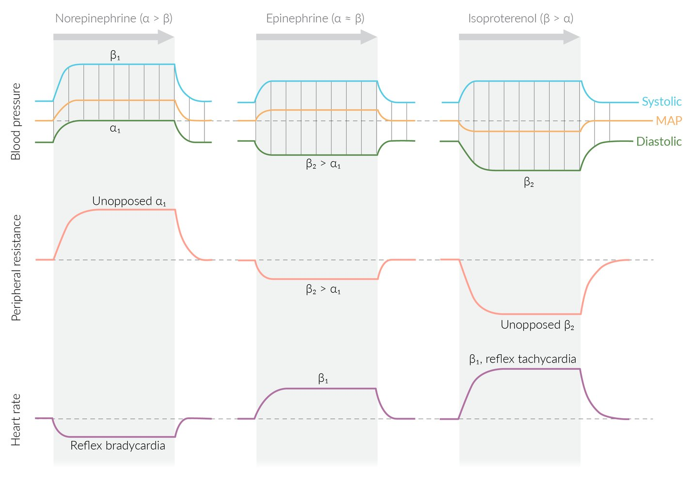

# Sympathomimetic drugs

*Categories: Clinical knowledge > Internal medicine > Cardiology and angiology > Relevant pharmacology > Sympathomimetic drugs*

[Original Article Link](https://coursology-qbank.com/amboss/article/tN0X1g)

---

## Summary

Sympathomimetics are substances that mimic or modify the actions of <u>endogenous</u> <u>catecholamines</u> of the <u>sympathetic nervous system</u>. Direct <u>agonists</u> directly activate <u>adrenergic receptors</u> while indirect <u>agonists</u> enhance the actions of <u>endogenous</u> <u>catecholamines</u>. Sympathomimetics stimulate alpha-1 adrenergic <u>receptors</u>, <u>beta-adrenergic receptors</u>, and <u>dopamine</u> (D) <u>receptors</u> in various target tissues, such as the eyes, <u>heart</u>, and vascular <u>smooth muscle</u>. The clinical indications for sympathomimetics are broad and include <u>asthma</u>, <u>heart failure</u>, <u>shock</u>, and <u>anaphylaxis</u>. Side effects include <u>hypertension</u>, <u>sinus tachycardia</u>, and <u>skeletal muscle</u> <u>tremor</u>.

---

## Overview

Sympathomimetic drugs mimic or enhance the actions of <u>endogenous</u> <u>catecholamines</u> of the <u>sympathetic nervous system</u> (fight-or-flight reaction).

### Direct sympathomimetic drugs

<u>Direct sympathomimetics</u> stimulate adrenergic and <u>dopaminergic</u> <u>receptors</u> directly.

* Beta-adrenergic agonists: predominantly act on the adrenergic beta-<u>receptors</u> (e.g., <u>isoproterenol</u>)

* Alpha-adrenergic agonists: predominantly act on the adrenergic alpha-<u>receptors</u> (e.g., <u>phenylephrine</u>)

* <u>Dopaminergic agonists</u>: predominantly act on the <u>D1 receptor</u> (e.g., <u>fenoldopam</u>)

|  <u>Overview of direct sympathomimetics</u> [[1]](https://coursology-qbank.com/amboss/article/ghYFWK)[[2]](https://coursology-qbank.com/amboss/article/Kz0UFi)  |  |  |  |
| --- | --- | --- | --- |
| Drugs | Action | Cardiovascular effects | Indications |
| <u>Albuterol</u>, <u>salmeterol</u>, <u>formoterol</u>, <u>terbutaline</u> |  * β2 > β1   |  * Mild increase in <u>heart rate</u> (HR)   |   * <u>Asthma</u>  * Acute exacerbation: short-acting selective <u>β2-agonists</u> (e.g., <u>albuterol</u>)  * Prophylaxis (in chronic disease): long-acting selective <u>β2-agonists</u> (e.g., <u>salmeterol</u>)  * <u>COPD</u>  * <u>Preterm labor</u>: <u>Terbutaline</u> is a <u>tocolytic</u> used to delay <u>preterm labor</u> for up to 48 hours.  * <u>Hyperkalemia</u>    |
| <u>Clonidine</u>, <u>guanfacine</u> |  * α2   |  * Lowers blood pressure (BP)   |   * <u>HTN</u>  * <u>ADHD</u>  * <u>Tourette syndrome</u>  * <u>Drug withdrawal</u>    |
| Dobutamine |   * β1 > β2, α  * <u>Inotropic</u> effects > <u>chronotropic</u> effects    |   * No change or mild decrease in BP  * Raises HR, <u>cardiac output</u> (CO)    |   * <u>Heart failure</u>  * <u>Cardiogenic shock</u>  * <u>Cardiac stress testing</u>    |
| Dopamine |   * D1 = D2 > β > α  * <u>Chronotropic</u> effects at lower doses (β effect)  * <u>Vasoconstriction</u> at high doses (α effect)    |  * Raises BP (at high doses), HR, CO   |   * <u>Heart failure</u>  * <u>Cardiogenic shock</u>  * <u>Unstable bradycardia</u>    |
| Epinephrine |   * β > α (at high doses the α effect is predominant)  * Stronger <u>β2-receptor</u> effect than <u>norepinephrine</u>    |  * Raises BP (at high doses), HR, CO   |   * <u>Anaphylaxis</u>  * <u>Cardiac arrest</u>  * <u>Septic shock</u>  * Postbypass <u>hypotension</u>  * <u>Asthma</u>  * <u>Open-angle glaucoma</u>    |
| Fenoldopam |   * D1  * <u>Vasodilates</u> coronary and peripheral vessels  * Promotes <u>natriuresis</u>    |   * Raises CO, HR  * Lowers BP (through vasodilatation)    |   * <u>Hypertensive crisis</u>  * Postoperative <u>hypertension</u>    |
| Isoproterenol |   * β1 = β2  * Marginal α effect    |   * Raises CO, HR  * Lowers BP (through vasodilatation)    |   * <u>Bradycardia</u> or <u>heart block</u>  * It may worsen <u>ischemia</u>.  * <u>Cardiac arrest</u> from <u>heart block</u> when pacemaker therapy is unavailable    |
| <u>Methyldopa</u> |  * α2   |  * Lowers BP   |  * <u>HTN</u>, especially in <u>pregnancy</u>   |
| Midodrine |  * α1   |   * Raises BP (through <u>vasoconstriction</u>)  * Lowers HR  * No change or decrease in CO    |   * Autonomic insufficiency and symptomatic <u>orthostatic hypotension</u>  * Possible side effect: worsening of <u>supine</u> <u>hypertension</u>    |
| Mirabegron |  * β3   |  * Raises BP   |  * <u>Urinary urge incontinence</u> or <u>overactive bladder</u>   |
| <u>Norepinephrine</u> |  * α1 > α2 > β1   |   * Raises BP (through <u>vasoconstriction</u>)  * Minimal effect on HR: weak activation of <u>β1-receptors</u> increases HR while increase of <u>mean arterial pressure</u> (<u>MAP</u>) causes reduction in HR (reflex <u>bradycardia</u>)  * No change or increase in CO    |   * <u>Septic shock</u>  * <u>Neurogenic shock</u>  * <u>Hypotension</u>    |
| Oxymetazoline |  * α1 > α2   |  * May raise BP   |   * <u>Epistaxis</u>  * <u>Rhinitis</u>, <u>sinusitis</u> (topical decongestant)  * <u>Rosacea</u>    |
| Phenylephrine |  * α1 > α2   |   * Raises BP (through <u>vasoconstriction</u>)  * Lowers HR  * No change or decrease in CO    |   * <u>Hypotension</u>  * <u>Rhinitis</u>, obstructed Eustachian tubes  * <u>Phenylephrine</u> acts as a <u>nasal decongestant</u> by reducing <u>hyperemia</u> and <u>mucosal</u> <u>edema</u>  * <u>Allergic conjunctivitis</u>  * Open-angle <u>glaucoma</u>  * <u>Ischemic priapism</u> (high-dose <u>intracavernosal phenylephrine injection</u>)    |

> [!NOTE]
> “DINED” is the acronym for examples of <u>direct sympathomimetic drugs</u>: Dopamine, Isoproterenol, Norepinephrine, Epinephrine, Dobutamine.

Examples of direct sympathomimetic drugs

### Indirect sympathomimetic drugs

<u>Indirect sympathomimetics</u> increase the <u>synaptic</u> activity of <u>endogenous</u> <u>catecholamines</u> by increasing presynaptic release or inhibiting reuptake.

|  <u>Overview of indirect sympathomimetics</u> [[1]](https://coursology-qbank.com/amboss/article/ghYFWK)[[3]](https://coursology-qbank.com/amboss/article/ShYyWK)  |  |  |  |  |
| --- | --- | --- | --- | --- |
| Drugs | Action |  |  | Indications |
| Indirect general <u>agonist</u> | Reuptake inhibitor | Releases <u>catecholamines</u> |  |  |
| <u>Amphetamines</u> |  * Yes   |  * Yes   |  * Yes   |   * <u>ADHD</u>  [[4]](https://coursology-qbank.com/amboss/article/PZYWbn)  * <u>Narcolepsy</u>  * <u>Obesity</u>    |
| <u>Cocaine</u> |  * Yes   |  * Yes   |  * No   |   * <u>Local anesthesia</u>  * <u>Vasoconstriction</u>    |
| Ephedrine |  * Yes   |  * No   |  * Yes   |   * Anesthesia-induced <u>hypotension</u>  * <u>Urinary incontinence</u>  * Nasal congestion (pseudoephedrine)  * Reduces <u>hyperemia</u> and <u>edema</u>  * Opens nasal meatus and Eustachian tubes    |

---

## Pharmacodynamics

|  Overview of sympathomimetic effects [[1]](https://coursology-qbank.com/amboss/article/ghYFWK)[[3]](https://coursology-qbank.com/amboss/article/ShYyWK)  |  |  |
| --- | --- | --- |
| Organ system | <u>Receptor</u> | <u>Sympathomimetic effect</u> |
| <u>Eye</u> |  * α1   |   * <u>Mydriasis</u> (↑ <u>pupillary dilator</u> muscle contraction)  * Distant <u>accommodation</u> (↑ <u>ciliary body</u> contraction)    |
|  * α2   |  * ↓ <u>Aqueous humor</u> production   |  |
|  * β2   |  * ↑ <u>Aqueous humor</u> production   |  |
| <u>Blood vessels</u> |  * α1   |   * ↑ Vascular <u>smooth muscle</u> contraction of <u>arterioles</u> → ↑ peripheral resistance → ↑ <u>afterload</u>  * Venoconstriction → ↑ <u>venous return</u> → ↑ <u>preload</u>    |
|  * α2   |  * ↑ <u>Platelet</u> aggregation   |  |
|  * β2   |  * Peripheral <u>vasodilation</u> → ↓ peripheral resistance → ↓ <u>afterload</u>   |  |
| <u>Heart</u> |  * β1   |   * ↑ HR  * ↑ Contractility  * ↑ <u>Automaticity</u> and conduction <u>velocity</u>    |
| <u>Bronchi</u> |  * β2   |  * Bronchodilation   |
| <u>Gastrointestinal tract</u> |  * α1   |  * Sphincter contraction   |
|  * β2   |  * ↓ <u>Peristalsis</u>   |  |
| <u>Liver</u> |  * α1   |   * ↑ <u>Glycogenolysis</u>  * ↑ <u>Gluconeogenesis</u> (β2 activation)    |
|  * β2   |  |  |
| <u>Pancreas</u> |  * α2   |  * ↓ <u>Insulin</u> release   |
|  * β2   |  * ↑ <u>Insulin</u> release   |  |
| <u>Kidneys</u> |  * β1   |  * ↑ Release of <u>renin</u>   |
| <u>Bladder</u> |  * α1   |  * Sphincter contraction → <u>urinary retention</u>   |
|  * β2   |  * <u>Detrusor</u> relaxation   |  |
|  * β3   |  |  |
| <u>Female reproductive organs</u> |  * β2   |  * ↓ Uterine tone (<u>tocolysis</u>)   |
| <u>Male reproductive organs</u> |  * α1   |  * <u>Ejaculation</u> from <u>vas deferens</u>   |
| <u>Skeletal muscle</u> |  * β2   |   * ↑ Contraction  * ↑ <u>Glycogenolysis</u>    |
|  * β3   |  * ↑ <u>Thermogenesis</u> in <u>skeletal muscle</u>   |  |
| <u>Adipose tissue</u> |  * α2   |  * ↓ <u>Lipolysis</u>   |
|  * β1–3   |  * ↑ <u>Lipolysis</u>   |  |

> [!NOTE]
> Both <u>alpha-adrenergic</u> and <u>beta-adrenergic</u> <u>agonists</u> are not fully selective at high doses.

---

## Adverse effects

See also “<u>Stimulant intoxication and withdrawal</u>.”

### <u>Direct sympathomimetics</u>

|  Side effects of <u>direct sympathomimetics</u> [[1]](https://coursology-qbank.com/amboss/article/ghYFWK) |  |
| --- | --- |
| Drugs | Side effects |
|  α1-<u>agonists</u> [[5]](https://coursology-qbank.com/amboss/article/XC09qR) |   * <u>Hypertension</u> (due to peripheral <u>vasoconstriction</u>) and reflex <u>bradycardia</u>  * <u>Urinary retention</u>  * <u>Ischemia</u> and <u>necrosis</u>, especially of the fingers or toes  * Rebound congestion (with <u>nasal decongestants</u> used > 4–6 days)  * <u>Piloerection</u>    |
| α2-<u>agonists</u> |   * The side effects of α2-<u>agonists</u> are mainly due to their <u>sympatholytic</u> effects. [[2]](https://coursology-qbank.com/amboss/article/Kz0UFi)  * <u>CNS depression</u> (e.g., sedation)  * Respiratory <u>depression</u>  * <u>Bradycardia</u> and <u>hypotension</u>  * <u>Miosis</u>  * Rebound <u>hypertension</u> after sudden interruption  * Dry mouth  * <u>α-Methyldopa</u>  * <u>Autoimmune hemolytic anemia</u> with positive <u>direct Coombs test</u>  * <u>SLE</u>-like syndrome  * <u>Hyperprolactinemia</u>    |
| β1-<u>agonists</u> |   * <u>Tachycardia</u> and <u>arrhythmias</u>  * Can precipitate <u>angina</u> or <u>myocardial infarction</u> in patients with <u>coronary artery disease</u>    |
| <u>β2-agonists</u> |   * <u>Tremor</u> (most common side effect), <u>agitation</u>, <u>insomnia</u>, <u>diaphoresis</u>  * <u>Hypotension</u> (due to peripheral <u>vasodilation</u>) and <u>reflex tachycardia</u>  * Metabolic disturbances: <u>hyperglycemia</u>, <u>hypokalemia</u>    |

> [!WARNING]
> <u>Catecholamines</u> (e.g., <u>epinephrine</u>, <u>norepinephrine</u>, <u>isoproterenol</u>, <u>dopamine</u>, <u>dobutamine</u>) should only be administered if monitored by an experienced physician! High-dose <u>catecholamine</u> administration requires intra-arterial blood pressure monitoring.

### <u>Indirect sympathomimetics</u>

|  Side effects of <u>indirect sympathomimetics</u> [[1]](https://coursology-qbank.com/amboss/article/ghYFWK) |  |
| --- | --- |
| Drugs | Side effects |
| <u>Amphetamines</u> |  * See “<u>Amphetamine</u> intoxication”.   |
| <u>Cocaine</u> |  * See “<u>Cocaine intoxication</u>”.   |
| <u>Ephedrine</u> |   * <u>Hypertension</u>  * Reflex <u>bradycardia</u> (due to <u>hypertension</u>) or <u>tachycardia</u>  * <u>Dizziness</u>  * <u>Nausea</u>, <u>vomiting</u>  * <u>Pseudoephedrine</u>  * Rebound congestion (when used > 4–6 days)  * <u>Anxiety</u> and/or ↑ <u>CNS</u> stimulation (e.g., alertness, nervousness, <u>insomnia</u>)  * <u>Tachyphylaxis</u>    |

> [!WARNING]
> In case of <u>cocaine intoxication</u>, the concurrent administration of <u>beta-blockers</u> can induce extreme <u>hypertension</u> and coronary vasospasm due to unopposed alpha-1 activation.

We list the most important adverse effects. The selection is not exhaustive.

---