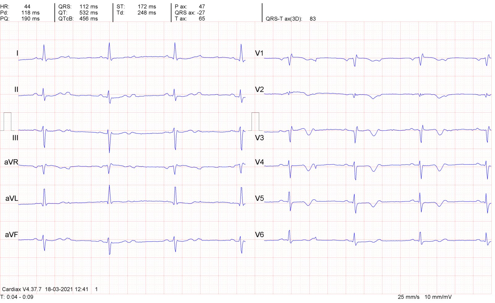
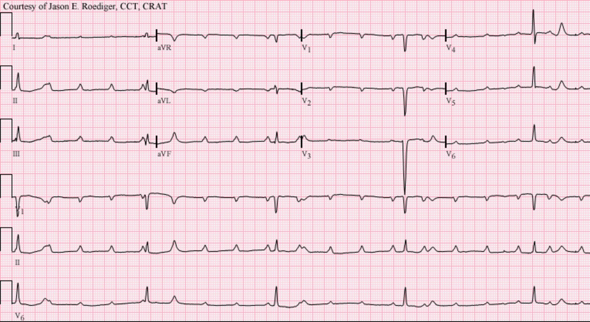
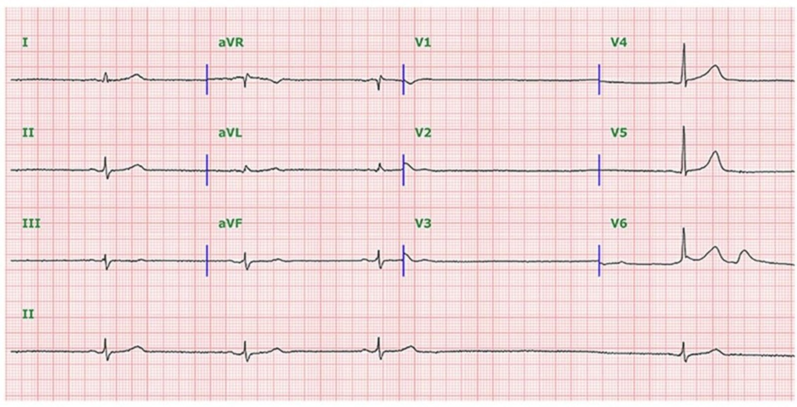
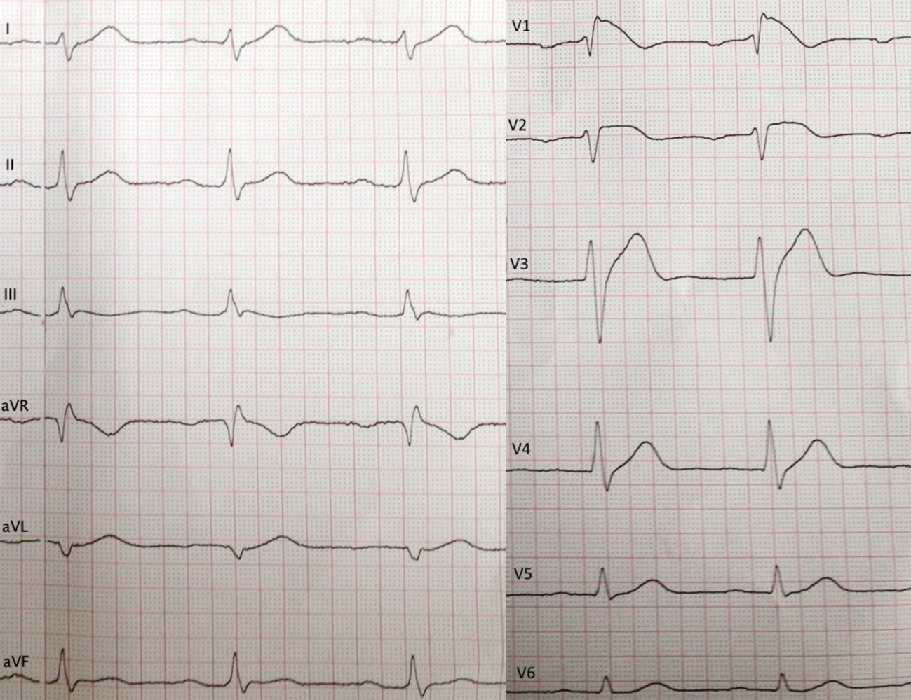
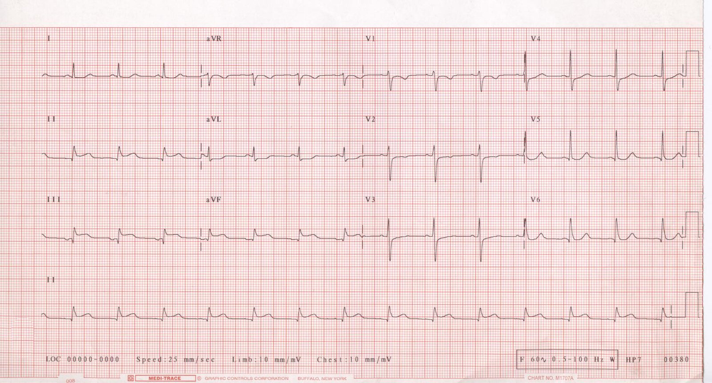
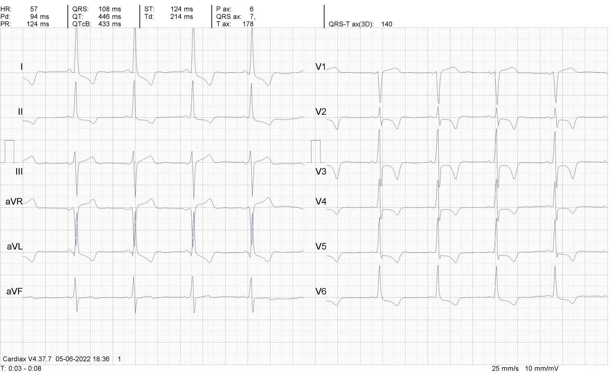
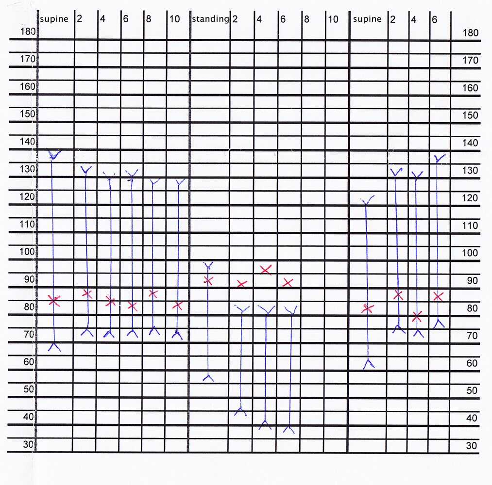
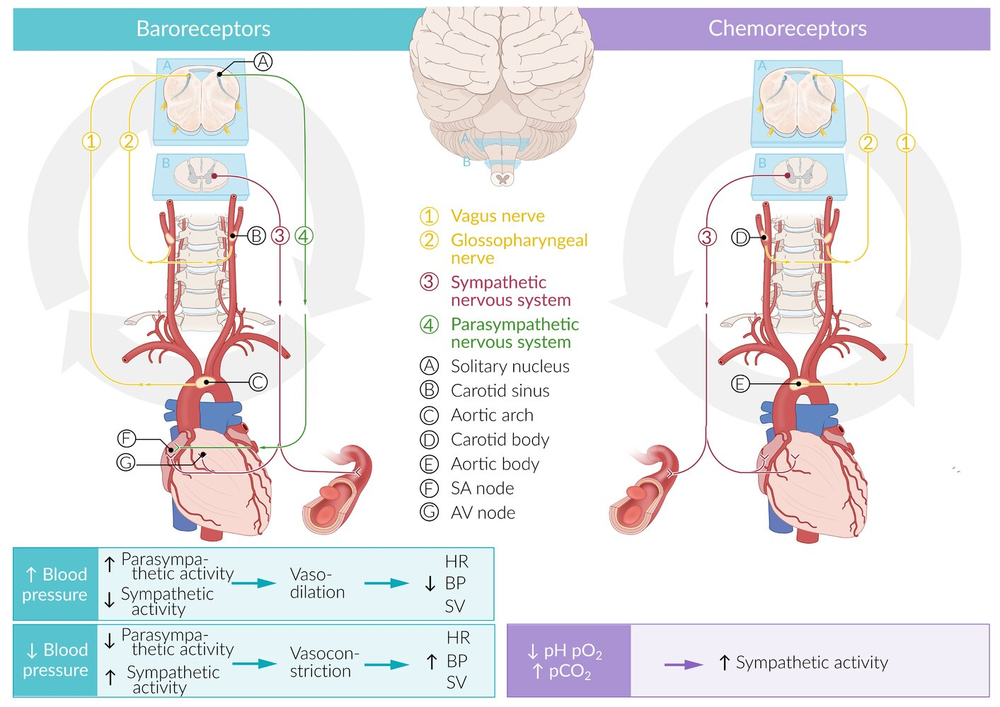
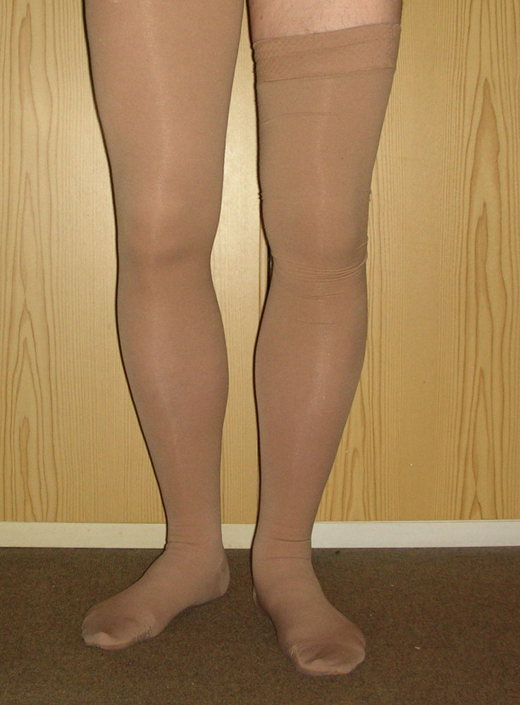

# Syncope

*Categories: Clinical knowledge > Internal medicine > Cardiology and angiology > Syncope and shock > Syncope*

[Original Article Link](https://coursology-qbank.com/amboss/article/b50Hig)

---

## Summary

Syncope is a sudden, <u>transient loss of consciousness</u>, which is thought to be secondary to cerebral <u>hypoperfusion</u>. It can be divided into <u>cardiac syncope</u>, e.g., due to <u>arrhythmias</u> or <u>structural heart disease</u> (potentially life-threatening), and <u>noncardiac syncope</u>, which includes frequently benign causes such as <u>reflex syncope</u> (due to <u>vasovagal</u> responses or <u>carotid sinus syndrome</u>) and <u>orthostatic syncope</u>. The diagnostic approach is focused on determining if <u>loss of consciousness</u> was due to syncope (ruling out differential diagnoses), ruling out immediately <u>life-threatening causes of syncope</u>, and determining the <u>risk of serious adverse events from syncope</u>, which further guide management and disposition. This involves obtaining a detailed history and performing a <u>physical examination</u>, including orthostatic <u>vital sign</u> measurements and an initial <u>ECG</u>. Further diagnostics should be guided by clinical suspicion of the underlying disease. In many cases, syncope is multifactorial and it is not possible to determine a specific etiology. The treatment strategy depends on the cause.

---

## Definitions

* Loss of consciousness: a state characterized by the loss of awareness of self and the surroundings and an inability to respond to stimuli [[1]](https://coursology-qbank.com/amboss/article/GEbBCv)

* Transient loss of consciousness: a temporary;  (short duration) and <u>self-limited</u> form of <u>loss of consciousness</u>; A term used predominantly during clinical evaluation while the pathogenesis is still unclear. [[1]](https://coursology-qbank.com/amboss/article/GEbBCv)[[2]](https://coursology-qbank.com/amboss/article/FEbgxv)

* Syncope: an abrupt <u>transient loss of consciousness</u> with rapid and spontaneous recovery, which is thought to be caused by cerebral <u>hypoperfusion</u> [[1]](https://coursology-qbank.com/amboss/article/GEbBCv)

* Presyncope: symptoms that usually precede syncope (e.g., <u>lightheadedness</u>, visual symptoms, possibly altered consciousness without <u>loss of consciousness</u>); may or may not progress to syncope. [[1]](https://coursology-qbank.com/amboss/article/GEbBCv)

---

## Overview

The following categories are consistent with nomenclature and classification used in the 2017 American <u>Heart</u> Association (<u>AHA</u>) syncope guidelines.  [[1]](https://coursology-qbank.com/amboss/article/GEbBCv)

### <u>Cardiac syncope</u>

Includes arrhythmogenic, <u>myocardial</u>, and other vascular etiologies of syncope

| Types of cardiac syncope |  |  |
| --- | --- | --- |
|  | Underlying mechanism(s) | Examples of underlying causes |
| <u>Arrhythmogenic syncope</u> |  * <u>Bradycardia</u>/<u>tachycardia</u> → ↓ <u>ejection fraction</u>   |   * <u>Sick sinus syndrome</u>  * <u>Ventricular tachycardia</u>  * <u>Atrioventricular block</u>  * <u>Supraventricular arrhythmias</u>  * <u>Adams-Stokes syndrome</u>  * <u>Torsades de pointes</u>    |
| Cardiovascular syncope |   * <u>Myocardial</u> dysfunction  * Cardiac outflow obstruction    |   * Massive <u>MI</u>  * <u>Aortic stenosis</u>  * <u>Mitral valve prolapse</u>  * <u>Atherosclerotic cardiovascular diseases</u>  * <u>Pulmonary embolism</u>  * <u>Pulmonary hypertension</u>  * <u>Hypertrophic cardiomyopathy</u>  * Severe <u>asymmetric septal hypertrophy</u>  * <u>Cardiac tamponade</u>    |

### <u>Noncardiac syncope</u>

Includes <u>reflex syncope</u> (most common type of syncope) and <u>orthostatic syncope</u>

| Types of noncardiac syncope |  |  |  |
| --- | --- | --- | --- |
|  |  | Underlying mechanism(s) | Examples of triggers and/or underlying causes |
| <u>Reflex syncopes</u> |  <u>Vasovagal syncope</u> (<u>Neurocardiogenic syncope</u>) |  * <u>Vasovagal response</u>   |   * Prolonged standing  * Emotional <u>stress</u>, e.g., due to fear, sight of blood, medical procedures  * <u>Pain</u> or injury  * Heat exposure  * Can be <u>idiopathic</u>    |
| <u>Situational syncope</u> |   * <u>Cough</u>  * Swallow  * Laughing  * Defecation  * <u>Micturition</u> (commonly seen in individuals with <u>prostatic</u> <u>hyperplasia</u>)    |  |  |
| <u>Carotid sinus syndrome</u> |  * <u>Carotid sinus</u> <u>sensitivity</u>   |  * Pressure on the carotid sinuses (e.g., during a massage, when shaving, tightening a necktie)   |  |
| <u>Orthostatic syncopes</u> |  |   * Most types of <u>orthostatic syncope</u>: <u>orthostatic hypotension</u>  * <u>Postural tachycardia syndrome</u> (POTS): <u>orthostasis</u> with <u>tachycardia</u> and no <u>hypotension</u>    |   * <u>Hypovolemia</u> (e.g., <u>dehydration</u>, hemorrhage, use of <u>diuretics</u>)  * Medications that cause <u>vasodilation</u> or limit <u>tachycardia</u> (e.g., <u>beta blockers</u>, <u>alpha blockers</u>, <u>calcium channel blockers</u>)  * Prolonged bed rest  * <u>Anemia</u>  * Age-related loss of <u>baroreceptor</u> <u>sensitivity</u>  * <u>Neurogenic orthostatic hypotension</u>: <u>Diabetic neuropathy</u>, <u>Parkinson disease</u>  * POTS: Poorly understood; Often occurs following other medical conditions (e.g., <u>pregnancy</u>, trauma, <u>surgery</u>, viral illness)    |

References:[[3]](https://coursology-qbank.com/amboss/article/df0oO2)[[4]](https://coursology-qbank.com/amboss/article/S30y3f)[[5]](https://coursology-qbank.com/amboss/article/F80go3)[[6]](https://coursology-qbank.com/amboss/article/H1aKRj)[[7]](https://coursology-qbank.com/amboss/article/s1atRj)[[8]](https://coursology-qbank.com/amboss/article/3WYSOL)[[9]](https://coursology-qbank.com/amboss/article/RWYlOL)[[10]](https://coursology-qbank.com/amboss/article/iWYJOL)

---

## Etiology

The following are lists of underlying <u>causes of syncope</u>. For a list of syncope mimics, i.e., other causes of <u>transient loss of consciousness</u>, see “<u>Differential diagnosis of syncope</u>.”

### Cardiac and vascular causes [[11]](https://coursology-qbank.com/amboss/article/xacE5a0)

This category includes life-threatening causes of syncope that require specialized management. See “<u>Cardiac syncope</u>” for further details.

* <u>Cardiac dysrhythmias</u>

* <u>Bradyarrhythmias</u>, e.g., <u>Mobitz II</u> or <u>3rd-degree AV block</u>

* <u>Ventricular tachyarrhythmias</u>, e.g., <u>sustained VT</u>, <u>ARVC</u>-associated VT

* <u>SVT</u>: e.g., <u>AVNRT</u>

* <u>Arrhythmias</u> associated with sudden <u>cardiac arrest</u>: e.g., <u>LQTS</u>, <u>Brugada syndrome</u>

* Malfunction or failure of pacemaker/<u>AICD</u>

* <u>Myocardial</u> dysfunction

* <u>Myocardial infarction</u> or <u>acute coronary syndrome</u>

* <u>Acute heart failure</u>

* <u>Myocarditis</u>

* <u>Cardiomyopathies</u>

* Ventricular outflow tract obstruction: e.g., <u>hypertrophic obstructive cardiomyopathy</u>

* <u>Valvular heart disease</u>: e.g., severe <u>aortic stenosis</u>

* Extracardiac vascular disorders

* Circulatory <u>shock</u>: e.g., <u>cardiogenic shock</u>, <u>hemorrhagic shock</u>, other types of <u>hypovolemic shock</u>, <u>septic shock</u>

* <u>Acute aortic syndromes</u>

* <u>Pericardial tamponade</u>

* Pulmonary: e.g, <u>pulmonary embolism</u>, <u>pulmonary hypertension</u>, <u>tension pneumothorax</u>

* Intracranial: e.g., <u>subarachnoid hemorrhage</u>, <u>pontine stroke</u>

> [!TIP]
> Cardiac and vascular <u>causes of syncope</u> have a higher chance of being life-threatening and should be ruled out first.

### Noncardiac causes

These typically benign etiologies can coexist in the same patient, i.e., they are not mutually exclusive. See “<u>Noncardiac syncope</u>” for further details.

* Reflex-mediated

* <u>Vasovagal syncope</u> (<u>neurocardiogenic syncope</u>)

* <u>Carotid sinus hypersensitivity</u>

* <u>Situational syncope</u>: e.g., micturitional syncope

* <u>Orthostasis</u>-related

* <u>Orthostatic hypotension</u>

* <u>Hypovolemia</u>: e.g., GI fluid loss, <u>diuretic</u> use, <u>adrenal insufficiency</u>

* Medication-induced: e.g., <u>beta blockers</u>, <u>calcium channel blockers</u>, <u>alpha blockers</u>

* Neurogenic (a type of <u>dysautonomia</u>): e.g., <u>diabetic neuropathy</u>, <u>Parkinson disease</u>

* Postural (orthostatic) <u>tachycardia</u> syndrome (POTS)

> [!TIP]
> Reflex-mediated and orthostatic <u>causes of syncope</u> occur more frequently and tend to be more benign than cardiac and vascular causes.

> [!TIP]
> <u>Vasovagal syncope</u> and <u>situational syncope</u> can occur more easily in patients with preexisting <u>orthostatic hypotension</u>.

---

## Clinical features

* <u>Prodrome</u>

* <u>Vasovagal</u>: impairment of senses; , <u>nausea</u>, <u>pallor</u>, warmth, <u>diaphoresis</u>, <u>lightheadedness</u>, and <u>hyperventilation</u>

* Orthostatic: <u>lightheadedness</u>, <u>nausea</u>, and <u>dizziness</u>

* Rapid onset <u>loss of consciousness</u>

* Accompanied by complete loss of muscle tone

* Last seconds to minutes followed by spontaneous recovery

* Convulsive syncope: common form in which <u>loss of consciousness</u> is accompanied by <u>myoclonic</u> movements

> [!WARNING]
> Patients with <u>cardiac syncope</u> often present without any <u>prodrome</u>, i.e., a sudden fall, which may be accompanied by injuries resulting from a lack of protective reflexes.

> [!TIP]
> Thorough neurological and cardiopulmonary assessments, including <u>pulse</u> and <u>blood pressure measurement</u> in the <u>supine</u>, standing, and sitting positions, are crucial for identifying the underlying etiology.

References:[[5]](https://coursology-qbank.com/amboss/article/F80go3)[[7]](https://coursology-qbank.com/amboss/article/s1atRj)

---

## Management

The following recommendations are consistent with the 2017 American <u>Heart</u> Association (<u>AHA</u>) syncope guidelines. [[1]](https://coursology-qbank.com/amboss/article/GEbBCv)

### Initial management [[1]](https://coursology-qbank.com/amboss/article/GEbBCv)[[2]](https://coursology-qbank.com/amboss/article/FEbgxv)[[11]](https://coursology-qbank.com/amboss/article/xacE5a0)[[12]](https://coursology-qbank.com/amboss/article/QEYuvI)[[13]](https://coursology-qbank.com/amboss/article/8EbOxv)[[14]](https://coursology-qbank.com/amboss/article/gbcFGa0)

Syncope and <u>presyncope</u> can be multifactorial, with widely varying etiologies and diagnostic approaches. Focus on identifying the possible <u>etiology of syncope</u> while excluding <u>differential diagnoses of syncope</u>. [[12]](https://coursology-qbank.com/amboss/article/QEYuvI)

* Stabilization (as needed)

* Consider stabilizing measures for acutely syncopal patients, e.g., <u>ABCDE survey</u>, <u>POC glucose</u>, <u>supine positioning</u>, <u>IV access</u>, <u>cardiac monitoring</u>, <u>fluid resuscitation</u>.

* Identify and treat <u>life-threatening causes of syncope</u> concurrently.

* Initial evaluation: Perform a detailed clinical assessment with select routine investigations.

* Obtain medication, medical, and <u>family history</u>  [[12]](https://coursology-qbank.com/amboss/article/QEYuvI)

* Determine triggers and ask witnesses (if available) for details about the event.

* Conduct a thorough <u>physical examination</u>.

* Obtain <u>ECG</u> and <u>orthostatic vital signs</u>

* Consider basic <u>laboratory studies</u>

* Risk <u>stratification</u>: Consider performing on all patients based on clinical features, historical factors, and results of the initial evaluation to help guide disposition and need for further investigations.

* Next steps

* Detailed diagnostics: Consider as guided by clinical suspicion, especially in patients without a clear cause of syncope identified on initial evaluation (see “Further investigations”).

* Definitive management: Depends on underlying etiology, risk <u>stratification</u>, and disease severity (see “<u>Cardiac syncope</u>” and “<u>Noncardiac syncope</u>”).

* Manage complications: e.g., fall injuries

> [!TIP]
> Evaluate patients with <u>presyncope</u> similarly to those with syncope.

> [!TIP]
> All forms of syncope are more likely to occur when multiple precipitating factors are present.

> [!TIP]
> Rule out <u>life-threatening causes of syncope</u> such as <u>pulmonary embolism</u>, hemorrhage, and serious cardiac conditions.

### Routine investigations [[1]](https://coursology-qbank.com/amboss/article/GEbBCv)[[2]](https://coursology-qbank.com/amboss/article/FEbgxv)[[12]](https://coursology-qbank.com/amboss/article/QEYuvI)[[13]](https://coursology-qbank.com/amboss/article/8EbOxv)

Adding an <u>ECG</u> and <u>orthostatic vital signs</u> to a thorough clinical evaluation can help identify the <u>etiology of syncope</u> in up to 50% of patients. [[12]](https://coursology-qbank.com/amboss/article/QEYuvI)

#### <u>ECG</u>

* Indicated in all patients

* Potential findings [[13]](https://coursology-qbank.com/amboss/article/8EbOxv)

* <u>Arrhythmias</u> and conduction abnormalities

* <u>Brugada syndrome</u>

* <u>Ischemic</u> changes

* Ventricular <u>hypertrophy</u>

Second degree AV block (2:1)

Third-degree atrioventricular block

Sinus bradycardia with sinus pause and junctional escape rhythm

Brugada pattern

Acute inferior ST-segment elevation myocardial infarction (STEMI)

Hypertrophic cardiomyopathy

#### Orthostatic vital signs [[15]](https://coursology-qbank.com/amboss/article/WccPYY0)

* Method

* Measure blood pressure and <u>heart rate</u> after the patient has been in a <u>supine position</u> for 3 minutes.

* Ask the patient to stand up and retake <u>vital signs</u> after 1 minute and 3 minutes (a third measurement after 10 minutes is optional).

* Document any symptoms that the patient experiences.

* Findings

* Normal: Minimal or no variation in blood pressure or <u>heart rate</u>

* Abnormal

* Significant drop in systolic and/or <u>diastolic</u> BP (See “<u>Orthostatic hypotension</u>.”)

* Significant increase in <u>heart rate</u> (See “POTS.”)

Test for orthostatic hypotension (active standing test)

#### <u>Laboratory studies</u>

These are commonly requested as part of the initial workup. See “Further investigations” for more detailed diagnostics.  [[12]](https://coursology-qbank.com/amboss/article/QEYuvI)

* <u>Glucose</u> (may detect <u>hypoglycemia</u>)

* <u>CBC</u> (may show ↓ serum <u>hemoglobin</u>)

* <u>BMP</u> (e.g., ↑ <u>BUN/creatinine ratio</u> may suggest <u>dehydration</u>)

* <u>Pregnancy test</u>

### Disposition [[1]](https://coursology-qbank.com/amboss/article/GEbBCv)[[2]](https://coursology-qbank.com/amboss/article/FEbgxv)[[11]](https://coursology-qbank.com/amboss/article/xacE5a0)[[12]](https://coursology-qbank.com/amboss/article/QEYuvI)[[13]](https://coursology-qbank.com/amboss/article/8EbOxv)[[14]](https://coursology-qbank.com/amboss/article/gbcFGa0)

Disposition decisions should take into account individual patient factors and follow local hospital policy (see also “Risk <u>stratification</u>”).

* Admission: e.g., for further investigations (e.g., provocation studies, cardiovascular imaging), <u>continuous cardiac monitoring</u>, and targeted management 

* Typically indicated for patients with <u>cardiac syncope</u>: e.g., <u>structural heart disease</u>, <u>pulmonary embolism</u>, <u>shock</u>, <u>SAH</u>

* In patients with <u>noncardiac syncope</u> (i.e., <u>reflex syncope</u> or <u>orthostatic syncope</u>) OR syncope of unclear origin after initial evaluation, consider admission if there is a high <u>risk of serious adverse events following syncope</u>.

* Consider critical care unit admission for patients with immediately <u>life-threatening causes of syncope</u>.

* Discharge [[1]](https://coursology-qbank.com/amboss/article/GEbBCv)[[12]](https://coursology-qbank.com/amboss/article/QEYuvI)[[13]](https://coursology-qbank.com/amboss/article/8EbOxv)

* In patients with <u>noncardiac syncope</u> OR syncope of unclear origin, consider discharge with reassurance and instructions if there is a low <u>risk of serious adverse events following syncope</u>.

* Consider outpatient <u>cardiac monitoring</u> (e.g., <u>loop recorder</u>, <u>Holter monitoring</u>) for recurrent or frequent syncopal episodes of unclear origin.

* Consultations: as guided by suspected underlying cause and severity (e.g., cardiology, <u>ICU</u>).

> [!TIP]
> Most serious <u>causes of syncope</u> are identified within hours to days; however, it can take up to 2 weeks to identify <u>arrhythmias</u>, and syncope can be <u>idiopathic</u> up to 40% of cases. [[1]](https://coursology-qbank.com/amboss/article/GEbBCv)[[11]](https://coursology-qbank.com/amboss/article/xacE5a0)[[12]](https://coursology-qbank.com/amboss/article/QEYuvI)[[13]](https://coursology-qbank.com/amboss/article/8EbOxv)

---

## Further investigations

These recommendations are consistent with the 2017 <u>AHA</u> syncope guidelines, the 2018 European society of cardiology (<u>ESC</u>) syncope guidelines, the 2021 American College of Radiology (<u>ACR</u>) appropriateness criteria for syncope, and Choosing Wisely recommendations on patients with syncope from the American Academy of <u>Neurology</u> (<u>AAN</u>), American College of Physicians (<u>ACP</u>), American College of Emergency Physicians (<u>ACEP</u>), and American <u>Epilepsy</u> Society (<u>AES</u>). Further investigations are not routinely indicated and should be guided by clinical suspicion. [[1]](https://coursology-qbank.com/amboss/article/GEbBCv)[[2]](https://coursology-qbank.com/amboss/article/FEbgxv)[[24]](https://coursology-qbank.com/amboss/article/SbcyGa0)[[25]](https://coursology-qbank.com/amboss/article/XFc9gV0)[[26]](https://coursology-qbank.com/amboss/article/cFcaSV0)[[27]](https://coursology-qbank.com/amboss/article/1Fc2SV0)[[28]](https://coursology-qbank.com/amboss/article/WFcPSV0)[[29]](https://coursology-qbank.com/amboss/article/dFcoSV0)

### Approach

* Consider expanded investigations in patients with syncope of unclear etiology after an initial evaluation, especially if there is a high <u>risk of serious adverse events from syncope</u>.

* Consider imaging studies based on the <u>pretest probability</u> (<u>PTP</u>) of <u>cardiac syncope</u> (see “Cardiovascular imaging”). [[25]](https://coursology-qbank.com/amboss/article/XFc9gV0)

* Patients with a high <u>PTP</u>: A resting <u>transthoracic echocardiogram</u> is usually appropriate.

* Patients with a low <u>PTP</u>: Consider <u>CXR</u>  ; most other advanced imaging studies are usually inappropriate.

* Consider syncope provocation studies in patients with a suspected but uncertain diagnosis of <u>noncardiac syncope</u>.

* Avoid routine neurological investigations unless there is a strong clinical suspicion for an underlying neurological cause. [[26]](https://coursology-qbank.com/amboss/article/cFcaSV0)[[27]](https://coursology-qbank.com/amboss/article/1Fc2SV0)[[28]](https://coursology-qbank.com/amboss/article/WFcPSV0)[[29]](https://coursology-qbank.com/amboss/article/dFcoSV0)

* Consider psychiatric evaluation for patients with suspected <u>psychogenic pseudosyncope</u>.

> [!TIP]
> In many cases of syncope (30–40%), the underlying etiology remains unclear even after an exhaustive diagnostic workup has been completed. [[1]](https://coursology-qbank.com/amboss/article/GEbBCv)[[12]](https://coursology-qbank.com/amboss/article/QEYuvI)[[13]](https://coursology-qbank.com/amboss/article/8EbOxv)

### Cardiovascular studies [[1]](https://coursology-qbank.com/amboss/article/GEbBCv)[[24]](https://coursology-qbank.com/amboss/article/SbcyGa0)

Consider the following in consultation with a cardiologist in patients with high-risk features or suspected structural cardiac disease.

* Rhythm monitoring

* Consider if there is clinical suspicion of <u>arrhythmia</u>.

* Choose the monitoring device based on the frequency of events (to increase the diagnostic yield), e.g.: [[1]](https://coursology-qbank.com/amboss/article/GEbBCv)

* <u>ECG Holter monitor</u>: symptoms likely to recur within 24–72 hours

* External <u>loop recorders</u>: symptoms likely to recur within 2–6 weeks

* <u>Implantable loop recorders</u>: for recurrent but infrequent symptoms  [[2]](https://coursology-qbank.com/amboss/article/FEbgxv)

* Findings include:

* <u>Sinus bradycardia</u> < 40 bpm

* <u>Sinus pauses</u> > 3 seconds

* <u>AV blocks</u>

* <u>Bundle branch blocks</u>

* Cardiothoracic imaging: Consider for patients with high-risk features or if there is clinical suspicion of structural disease. 

* <u>Echocardiogram</u>: common initial imaging modality to exclude or confirm structural disease  [[25]](https://coursology-qbank.com/amboss/article/XFc9gV0)

* <u>CTA</u> chest: Consider if <u>pulmonary artery</u> disease (e.g., <u>PAH</u>, <u>PE</u>) or <u>acute aortic syndromes</u> are suspected.

* <u>Coronary CTA</u>: Can help identify <u>coronary artery disease</u> or anomalous coronary anatomy (e.g., in young patients with exertional syncope).

* <u>Cardiac MRI</u>: Can help identify <u>infiltrative cardiomyopathies</u> or areas of scarring that could represent arrhythmogenic foci (e.g., in <u>ARVC</u>).

* <u>Cardiac stress testing</u>: Consider to detect <u>ischemic heart disease</u> in patients who experience syncope during exertion.

* <u>Cardiac enzymes</u>: Consider <u>troponin</u> only if <u>acute coronary syndrome</u> is suspected (may be elevated).  [[1]](https://coursology-qbank.com/amboss/article/GEbBCv)

* <u>Electrophysiological studies</u>

* Consider in select patients with suspected <u>arrhythmia</u> despite a normal initial evaluation.  [[1]](https://coursology-qbank.com/amboss/article/GEbBCv)[[2]](https://coursology-qbank.com/amboss/article/FEbgxv)

* Avoid if <u>cardiac imaging</u> and an <u>ECG</u> are both normal.

### Syncope provocation studies [[1]](https://coursology-qbank.com/amboss/article/GEbBCv)[[2]](https://coursology-qbank.com/amboss/article/FEbgxv)[[24]](https://coursology-qbank.com/amboss/article/SbcyGa0)

* <u>Carotid sinus massage</u>: Perform in patients > 40 years of age to determine if <u>reflex syncope</u> is due to <u>carotid sinus syndrome</u>.

* Tilt table test: Consider only for patients with recurrent syncopal episodes and if the diagnosis remains unclear following an initial evaluation. 

* Clinical applications [[30]](https://coursology-qbank.com/amboss/article/UccbbY0)

* Distinguish between different types of <u>reflex syncope</u> (i.e., <u>vasovagal</u> and <u>orthostatic hypotension</u>)

* Investigate <u>differential diagnoses of syncope</u>

* To distinguish syncope from <u>psychogenic pseudosyncope</u>

* To distinguish <u>convulsive syncope</u> from <u>epilepsy</u>

* Method 

* The patient is strapped onto a table and positioned at predetermined inclinations (possibly with an additional pharmacological provocation agent ).

* Variation in blood pressure and <u>heart rate</u> are registered and compared to the expected variations in healthy individuals.

* Contraindications include <u>ischemic heart disease</u>, uncontrolled <u>hypertension</u>, <u>left ventricular outflow tract obstruction</u>, and <u>aortic stenosis</u>

> [!WARNING]
> <u>Carotid sinus massage</u> is contraindicated in patients with a history of <u>TIA</u>, <u>stroke</u>, or <u>myocardial infarction</u> in the past 3 months, patients with <u>ventricular arrhythmias</u>, and those with a history of complications from a previous massage. [[31]](https://coursology-qbank.com/amboss/article/ERc8KX0)

### Neurological investigations [[1]](https://coursology-qbank.com/amboss/article/GEbBCv)[[2]](https://coursology-qbank.com/amboss/article/FEbgxv)[[24]](https://coursology-qbank.com/amboss/article/SbcyGa0)

These studies are not routinely recommended in patients with simple syncope without neurological features.  [[12]](https://coursology-qbank.com/amboss/article/QEYuvI)[[27]](https://coursology-qbank.com/amboss/article/1Fc2SV0)[[28]](https://coursology-qbank.com/amboss/article/WFcPSV0)

* CT or <u>MRI</u> head: Only consider if there is suspicion of a cerebrovascular event, <u>intracranial hypertension</u>, or a <u>head injury</u> from a fall.   [[27]](https://coursology-qbank.com/amboss/article/1Fc2SV0)[[28]](https://coursology-qbank.com/amboss/article/WFcPSV0)

* <u>Carotid ultrasound</u> with Doppler: Only consider if there are accompanying neurological features that suggest <u>TIA</u> or <u>stroke</u>.   [[26]](https://coursology-qbank.com/amboss/article/cFcaSV0)

* Autonomic evaluation (specialized studies): Consider in patients with suspected <u>autonomic dysfunction</u> to provoke and assess autonomic reflexes.  [[32]](https://coursology-qbank.com/amboss/article/lccvcY0)

* <u>EEG</u>: Only consider for patients with a high <u>pretest probability</u> of <u>seizures</u>.   [[29]](https://coursology-qbank.com/amboss/article/dFcoSV0)

> [!WARNING]
> Avoid routine <u>neuroimaging</u>, neurovascular studies, and <u>EEG</u> when evaluating patients with simple syncope without neurological symptoms or abnormal neurological findings. [[12]](https://coursology-qbank.com/amboss/article/QEYuvI)[[26]](https://coursology-qbank.com/amboss/article/cFcaSV0)[[27]](https://coursology-qbank.com/amboss/article/1Fc2SV0)[[28]](https://coursology-qbank.com/amboss/article/WFcPSV0)[[33]](https://coursology-qbank.com/amboss/article/tGcXaV0)

---

## Cardiac syncope

The term <u>cardiac syncope</u> is used in the 2017 <u>AHA</u> syncope guidelines to denote arrhythmogenic, <u>myocardial</u>, and vascular <u>causes of syncope</u> that are more often life-threatening.  [[1]](https://coursology-qbank.com/amboss/article/GEbBCv)

### General principles

* In <u>cardiac syncope</u>, reduced cerebral <u>perfusion</u> results from insufficient <u>cardiac output</u> due to acute cardiac and/or circulatory failure.

* This can manifest as <u>transient loss of consciousness</u> for different reasons, for example:

* The underlying cause is <u>paroxysmal</u> and <u>self-limiting</u>, e.g., <u>PSVT</u>.

* The underlying cause is dynamic and is triggered by specific physiological circumstances, e.g., dynamic <u>LVOT obstruction</u>, such as in <u>HOCM</u>, causes syncope if oxygen demand is increased.

* Cerebral <u>perfusion</u> is reduced during the delay between the onset of an inciting event (<u>MI</u>, <u>PE</u>, hemorrhage) and the effect of compensatory physiological responses (e.g., <u>sympathetic</u> activation).

* <u>Cardiac syncope</u> is associated with one-year <u>mortality rates</u> of up to 33%.

> [!TIP]
> Syncope may be the first manifestation of a life-threatening cardiac condition.

### Management [[1]](https://coursology-qbank.com/amboss/article/GEbBCv)[[2]](https://coursology-qbank.com/amboss/article/FEbgxv)[[12]](https://coursology-qbank.com/amboss/article/QEYuvI)[[13]](https://coursology-qbank.com/amboss/article/8EbOxv)

* Consider cardiac causes in patients who present with:

* A sudden fall without any <u>prodrome</u>

* A brief <u>prodrome</u> characterized by specific cardiovascular symptoms, e.g., <u>palpitations</u>, <u>chest pain</u>

* Place patients under <u>continuous cardiac monitoring</u>.

* Imaging (e.g., <u>TTE</u>, <u>CTA</u>), <u>laboratory studies</u> (e.g., <u>cardiac enzymes</u>), and cardiac rhythm monitoring may confirm the diagnosis.

* Common therapeutic measures include:

* Cardiac pacing

* <u>Antiarrhythmic drugs</u>

* <u>AICD</u> placement

* <u>Catheter ablation</u>

* <u>Fluid resuscitation</u>

* Definitive management depends on the specific underlying condition.

* Consult cardiology for prompt treatment of cardiac conditions.

|  Cardiac and vascular <u>causes of syncope</u> [[1]](https://coursology-qbank.com/amboss/article/GEbBCv)[[12]](https://coursology-qbank.com/amboss/article/QEYuvI)  |  |  |  |
| --- | --- | --- | --- |
| Conditions | Characteristic features | Diagnostic findings | Management |
| Arrhythmogenic syncope |   * <u>Patient history</u>  * <u>Family history</u> of sudden <u>death</u>  * Personal history of <u>heart</u> disease  * Medications use: <u>antiarrhythmics</u> or <u>antihypertensives</u> that can cause <u>drug-induced LQTS</u> or <u>bradycardia</u>  * Triggers: exercise  * Clinical features  * Slow or irregular <u>pulse</u>  * Complete recovery immediately after syncope  * Syncope while in a <u>prone</u> or <u>supine position</u>    |  * Cardiac rhythm monitoring (i.e., <u>ECG</u>, <u>Holter monitoring</u>, <u>loop recorder</u>, or continuous <u>telemetry</u>) may show evidence of:  * <u>Tachyarrhythmias</u>  * <u>Bradyarrhythmias</u>  * <u>Baseline ECG</u> findings consistent with an intermittent <u>arrhythmia</u> (e.g., <u>Brugada pattern</u>, <u>QTc prolongation</u>, <u>ECG delta wave</u>)   |   * See “<u>Management of tachycardia</u>.”  * See ”<u>Management of bradycardia</u>.”  * See “<u>Initial management of VT</u>.”  * See “<u>Overview of SVT management</u>.”    |
|  <u>Cardiomyopathy</u> [[34]](https://coursology-qbank.com/amboss/article/gccFbY0)[[35]](https://coursology-qbank.com/amboss/article/SccybY0)  |   * <u>Patient history</u>  * <u>Family history</u> of sudden <u>death</u>  * Personal history of a cardiac condition (e.g., <u>heart failure</u>)  * Triggers: <u>supine position</u>, exertion  * Clinical features  * <u>Palpitations</u>  * <u>Angina</u>    |   * <u>Baseline ECG</u>: may show signs of specific <u>cardiomyopathies</u>  * <u>HOCM</u>: e.g., signs of <u>LVH</u>  * <u>Infiltrative cardiomyopathy</u> (CDM): <u>AV blocks</u> and nonspecific <u>repolarization</u> abnormalities; <u>Low voltage QRS complexes</u> in <u>amyloidosis</u>  * <u>ARVC</u>: nonspecific variable findings  * <u>Cardiac imaging</u>: variable  * <u>HOCM</u>: <u>hypertrophic</u>, nondilated <u>left ventricle</u>, <u>LVOT obstruction</u>, <u>mitral regurgitation</u>  * <u>Infiltrative CDM</u>: <u>hypertrophic</u> ventricles (in the absence of valvular disease or <u>hypertension</u>), <u>hypokinesia</u>  * <u>ARVC</u>: <u>akinesia</u> or <u>dyskinesia</u>    |   * See “<u>Cardiomyopathy</u>.”  * See “<u>HCM</u> treatment”    |
| <u>Acute myocardial infarction</u> |   * <u>Patient history</u>: presence of <u>traditional ASCVD risk factors</u>  * Clinical features  * Substernal <u>pain</u> that radiates to the left shoulder  * <u>Nausea</u>, <u>vomiting</u>  * <u>Diaphoresis</u>, <u>anxiety</u>  * <u>Dizziness</u>, <u>lightheadedness</u>  * <u>Pain</u> that improves with <u>nitroglycerin</u>    |   * <u>ECG</u>  * <u>ECG changes in STEMI</u>  * <u>ECG findings in NSTE-ACS</u>  * Possibly elevated <u>cardiac enzymes</u>  * <u>Cardiac imaging</u>: may show motion wall abnormalities, hypokinesis    |   * See “<u>Acute management checklist for NSTEMI/UA</u>.”  * See “<u>Acute management checklist for STEMI</u>.”    |
|  <u>Valvular heart diseases</u> [[36]](https://coursology-qbank.com/amboss/article/fyXke00)  |   * <u>Patient history</u>: history of <u>connective tissue disorders</u> or inflammatory disorders  * Clinical features: variable depending on the affected valve(s)  * Systolic or <u>diastolic</u> <u>murmurs</u>  * Possibly alterations in peripheral pulses    |  * <u>Cardiac imaging</u>: variable depending on the affected valve(s)  * Chamber dilation or <u>hypertrophy</u>  * Valve thickening  * Calcifications   |   * See “<u>Aortic valve stenosis treatment</u>.”  * See “<u>Mitral valve stenosis treatment</u>.”  * See “<u>Overview of valvular heart disease treatment</u>.”    |
|  <u>Cardiac tamponade</u> [[37]](https://coursology-qbank.com/amboss/article/mFYViI)  |   * <u>Patient history</u> (suggesting <u>pericardial</u> disease)  * Cardiac <u>surgery</u>  * Thoracic trauma  * Recent viral infection  * Thoracic <u>malignancy</u>  * Autoimmune diseases  * Clinical features  * <u>Shortness of breath</u>  * <u>Chest pain</u>  * <u>Pulsus paradoxus</u>  * <u>Beck triad</u>  * <u>Cardiogenic shock</u>    |   * <u>ECG</u>: may show <u>tachycardia</u>, <u>electrical alternans</u>  * <u>X-ray chest</u>: enlarged <u>cardiac silhouette</u> may be visible  * <u>Cardiac imaging</u>: <u>pericardial effusion</u> with compression of cardiac chambers    |  * See “<u>Acute management checklist for cardiac tamponade</u>.”   |
|  Acute <u>aortic dissection</u> [[38]](https://coursology-qbank.com/amboss/article/mM0V6g)  |   * <u>Patient history</u>  * <u>Congenital heart disease</u>  * <u>Connective tissue disorders</u>  * <u>Hypertension</u>  * Thoracic trauma  * Clinical features  * Sudden and severe <u>chest pain</u>, <u>back pain</u>, and/or abdominal <u>pain</u>  * <u>Pulse deficits</u>  * Aortic <u>murmurs</u> (especially in patients with <u>proximal</u> dissection)    |   * <u>ECG</u>: nonspecific changes  * <u>CTA</u> chest or <u>MRI</u> chest: visualization of dissecting segment    |  * See “<u>Acute management checklist for aortic dissection</u>.”   |
|  <u>Pulmonary hypertension</u> [[39]](https://coursology-qbank.com/amboss/article/Z8YZOI)[[40]](https://coursology-qbank.com/amboss/article/G1cBRY0)  |   * <u>Patient history</u>  * Chronic respiratory diseases  * <u>Pulmonary embolism</u>  * <u>Connective tissue disorders</u>  * Clinical features  * <u>Shortness of breath</u>  * Recurrent episodes of syncope  * Loud and palpable <u>second heart sound</u> (often split)  * <u>Jugular vein distension</u>  * <u>Clubbing</u>    |   * <u>ECG</u>: can show <u>right axis deviation</u> and/or <u>arrhythmias</u> (e.g., <u>multifocal atrial tachycardia</u>, <u>atrial fibrillation</u>)  * <u>Cardiac imaging</u>: <u>hypertrophy</u> or dilation of the <u>right ventricle</u> may be visible    |  * See “<u>Treatment of pulmonary hypertension</u>.”   |
|  <u>Pulmonary embolism</u> [[41]](https://coursology-qbank.com/amboss/article/-xYD_r)  |   * <u>Patient history</u>  * <u>Immobilization</u>  * Recent <u>surgery</u>  * <u>Thrombophilia</u>  * <u>Malignancy</u>  * Clinical features (nonspecific)  * <u>Dyspnea</u>, <u>tachypnea</u>, <u>tachycardia</u>  * <u>Chest pain</u>  * See “<u>Wells score for pulmonary embolism</u>.”    |   * Elevated <u>D-dimer</u> most often present  * <u>CTA</u> chest: <u>pulmonary artery</u> filling defect(s)    |  * See “<u>Acute management checklist for pulmonary embolism</u>.”   |

---

## Noncardiac syncope

Recommendations in this article are consistent with the 2017 <u>AHA</u> syncope guidelines and the 2015 <u>Heart</u> Rhythm Society guidelines on <u>vasovagal syncope</u> and POTS. The term <u>noncardiac syncope</u> is used in the 2017 <u>AHA</u> syncope guidelines to denote typically benign <u>causes of syncope</u> that are not directly cardiogenic or vascular in origin but are mediated by neurological, hormonal, or metabolic effects on cardiovascular physiology.  [[1]](https://coursology-qbank.com/amboss/article/GEbBCv)[[2]](https://coursology-qbank.com/amboss/article/FEbgxv)[[42]](https://coursology-qbank.com/amboss/article/lFcvRV0)

### General principles

* <u>Noncardiac syncope</u> is frequently associated with a <u>prodrome</u> and specific physiological or environmental triggers, which vary depending on the etiology.

* When performed, syncope provocation studies (e.g., <u>tilt table test</u>) may aid the diagnosis.

* Other studies (e.g., <u>laboratory studies</u>, <u>ECG</u>) usually do not show significant findings.

> [!TIP]
> A <u>prodrome</u> characterized by <u>diaphoresis</u> and <u>pallor</u> is commonly reported in patients with all <u>types of noncardiac syncope</u>.

### Reflex syncope [[1]](https://coursology-qbank.com/amboss/article/GEbBCv)[[2]](https://coursology-qbank.com/amboss/article/FEbgxv)[[12]](https://coursology-qbank.com/amboss/article/QEYuvI)[[42]](https://coursology-qbank.com/amboss/article/lFcvRV0)

* Includes all types of <u>neurally mediated syncope</u>

* Common mechanism: <u>parasympathetic</u> hyperactivity (cardioinhibitory response), <u>sympathetic</u> hypoactivity (vasodepressor response), or a combination of both → vasodilatation (vasodepressor response) and/or <u>bradycardia</u> (cardioinhibitory response) → reduced BP → reduced cerebral <u>perfusion</u>

> [!TIP]
> <u>Reflex syncope</u> is the most common cause of syncope. It is benign and usually <u>self-limiting</u>.

#### Vasovagal syncope (VVS; <u>neurocardiogenic syncope</u>)

* <u>Epidemiology</u>

* Common in younger patients (the first episode is rare after 40 years of age)

* Can be recurrent

* Mechanism (vasovagal response): trigger activates <u>vagus nerve</u> → ↑ <u>parasympathetic</u> nervous tone → ↓ <u>heart rate</u>, blood pressure, and cardiac contractility, ↑ peripheral <u>vasodilation</u>

* Clinical features

* <u>Prodrome</u>: includes <u>nausea</u>, <u>diaphoresis</u>, <u>pallor</u>, and flushing

* Commonly followed by fatigue

* Possible triggers

* Prolonged standing

* Emotional <u>stress</u>, e.g., fear, the sight of blood, medical procedures

* <u>Pain</u> or injury

* Heat exposure

* Can be <u>idiopathic</u>

* Diagnosis is clinical and requires <u>presyncope</u> or syncope associated with the following: 

* Typical trigger and <u>prodrome</u>

* <u>Hypotension</u> with or without any of the following cardioinhibitory responses during the episode: [[43]](https://coursology-qbank.com/amboss/article/v1cAiY0)

* Documented <u>bradycardia</u>

* <u>Asystole</u> ≥ 3 seconds

* Treatment [[1]](https://coursology-qbank.com/amboss/article/GEbBCv)

* Initiate <u>nonpharmacological management of noncardiac syncope</u>.

* If symptoms persist, consider: [[1]](https://coursology-qbank.com/amboss/article/GEbBCv)

* <u>Midodrine</u> or <u>fludrocortisone</u> (for dosages see “<u>Medications for noncardiac syncope</u>”)

* Orthostatic training  [[44]](https://coursology-qbank.com/amboss/article/_8156i0)[[45]](https://coursology-qbank.com/amboss/article/z81r6i0)

* If > 40 years of age with prolonged spontaneous pauses: dual chamber pacemaker

#### Situational syncope

* Description: : Mechanism, clinical features, and diagnosis are identical to <u>vasovagal syncope</u>, except the trigger of the <u>vasovagal response</u> is a specific voluntary or involuntary action or physiological function, e.g., <u>micturition</u> syncope

* Possible triggers

* <u>Coughing</u>

* <u>Swallowing</u>

* Laughing

* Defecation (bowel movements)

* <u>Micturition</u> (commonly seen in individuals with <u>prostatic</u> <u>hyperplasia</u>)

* Treatment [[1]](https://coursology-qbank.com/amboss/article/GEbBCv)

* Initiate <u>nonpharmacological management of noncardiac syncope</u>.

* For controllable triggers (e.g., laughing, <u>coughing</u>): avoidance when possible

#### Carotid sinus syndrome

* Description: a type of recurrent <u>reflex syncope</u> that primarily occurs in individuals with <u>carotid sinus hypersensitivity</u> when pressure is applied to the <u>carotid sinus</u>

* Mechanism: increased <u>carotid sinus</u> <u>sensitivity</u> (due to, e.g., increased <u>baroreceptor</u> or peripheral <u>receptor</u> response)

* <u>Risk factors</u>: <u>coronary atherosclerosis</u>, previous history of neck <u>surgery</u> or <u>irradiation</u>, age (> 50 years)

* Trigger: pressure on the carotid sinuses (e.g., during a massage, when shaving, tightening a necktie)

* Diagnosis: <u>carotid sinus hypersensitivity</u> confirmed, e.g., pause in <u>heart rate</u> ≥ 3 seconds AND/OR fall in systolic blood pressure ≥ 50 mm Hg when pressure is applied by <u>carotid sinus massage</u>

* Treatment [[1]](https://coursology-qbank.com/amboss/article/GEbBCv)

* Educate patients to avoid triggers, e.g., tight-collared clothing.

* Consider a pacemaker for patients with <u>carotid sinus syndrome</u> with a cardioinhibitory response.

* See also “<u>Nonpharmacological management of noncardiac syncope</u>.”

Baroreceptor and chemoreceptor pathways

### Orthostatic syncope [[1]](https://coursology-qbank.com/amboss/article/GEbBCv)[[2]](https://coursology-qbank.com/amboss/article/FEbgxv)[[12]](https://coursology-qbank.com/amboss/article/QEYuvI)

Although <u>orthostasis</u> is most often benign in origin, there may be more serious underlying etiologies and it can increase the risk of other types of syncope.

* Common mechanism

* Orthostatic hypotension: standing up/postural change PLUS insufficient counterregulation, i.e., <u>reflex tachycardia</u> and <u>vasoconstriction</u> are impaired (due to <u>autonomic dysfunction</u>) or overwhelmed → dependent pooling of blood → <u>hypotension</u> (can be symptomatic or asymptomatic)

* Symptomatic <u>orthostasis</u>: Decreased cerebral <u>perfusion</u> leads to a decrease in both muscle tone and <u>level of consciousness</u>.

* Common underlying causes

* <u>Hypovolemia</u> (e.g., <u>dehydration</u>, hemorrhage, use of <u>diuretics</u> such as <u>thiazides</u>)

* Medications that cause <u>vasodilation</u> or limit <u>tachycardia</u> (e.g., <u>beta blockers</u>, <u>alpha blockers</u>, <u>calcium channel blockers</u>)

* Prolonged bed rest

* Age-related loss of <u>baroreceptor</u> <u>sensitivity</u>

* <u>Anemia</u>

* <u>Pregnancy</u>

* Diagnosis: Determine the likelihood of <u>orthostasis</u> based on its <u>pretest probability</u> (<u>PTP</u>) PLUS evidence on <u>physical examination</u> (i.e., <u>orthostatic vital signs</u>) or <u>tilt table test</u>. 

* Features associated with high <u>PTP</u> for <u>orthostasis</u> include:

* History of syncope while standing

* Absence of syncope while laying down

* Symptoms worsen in high temperatures

* Evidence of a typical underlying cause: e.g., clinical or <u>laboratory findings of hypovolemia</u>, responsible medications, <u>anemia</u>

* <u>Orthostasis</u> on examination

* <u>Orthostatic hypotension</u>: change from <u>supine</u> or seated position to a standing position → systolic BP decreases by ≥ 20 mm Hg AND/OR <u>diastolic</u> BP decreases by ≥ 10 mm Hg within 3 minutes [[2]](https://coursology-qbank.com/amboss/article/FEbgxv)

* Orthostatic <u>tachycardia</u>: See “POTS.”

* Combined results [[2]](https://coursology-qbank.com/amboss/article/FEbgxv)

* Low <u>PTP</u>: <u>Orthostatic syncope</u> is unlikely; further testing is needed independent of BP changes.

* High <u>PTP</u> and documented symptomatic <u>orthostatic hypotension</u>: <u>Orthostatic syncope</u> is highly likely.

* High <u>PTP</u> and documented asymptomatic <u>orthostatic hypotension</u>: <u>Orthostatic syncope</u> is possible.

* Treatment

* Initiate <u>nonpharmacological management of noncardiac syncope</u>.

* If symptoms persist, consider <u>midodrine</u> (see “<u>Medications for noncardiac syncope</u>”).

> [!WARNING]
> If there is evidence of underlying <u>hypovolemia</u>, determine its severity and rule out serious cardiac and vascular causes (see “<u>Cardiac syncope</u>”).

#### Neurogenic orthostatic hypotension [[1]](https://coursology-qbank.com/amboss/article/GEbBCv)[[2]](https://coursology-qbank.com/amboss/article/FEbgxv)[[12]](https://coursology-qbank.com/amboss/article/QEYuvI)

* Description: A subtype of <u>orthostatic hypotension</u> where the <u>autonomic dysfunction</u> that impairs or blunts the <u>reflex tachycardia</u> and/or <u>vasoconstriction</u> is caused by a neurological disorder.

* Possible underlying conditions include dysfunction of the:

* Central autonomic system: e.g., due to <u>Parkinson disease</u>, <u>dementia with Lewy bodies</u>

* Peripheral autonomic system: e.g., due to <u>pure autonomic failure</u>, <u>diabetic neuropathy</u>, <u>vitamin B12 deficiency</u>

* Diagnosis: similar to <u>orthostatic syncope</u>; other evidence of <u>dysautonomia</u> or signs of an underlying neurological disorder may also be present.

* Treatment [[1]](https://coursology-qbank.com/amboss/article/GEbBCv)

* Initiate <u>nonpharmacological management of noncardiac syncope</u>.

* Optimize treatment of underlying causes, e.g., <u>management of diabetes</u>.

* If symptoms persist, consider pharmacological therapy.

* First line: <u>fludrocortisone</u>, <u>droxidopa</u>, <u>midodrine</u>

* Refractory symptoms: <u>pyridostigmine</u> or <u>octreotide</u>

* For further information including dosages, see “<u>Medications for noncardiac syncope</u>.”

#### Postprandial orthostatic hypotension [[46]](https://coursology-qbank.com/amboss/article/vq1AZR0)[[47]](https://coursology-qbank.com/amboss/article/wq1h0R0)

* Description: a subtype of <u>orthostatic hypotension</u> that occurs after eating [[46]](https://coursology-qbank.com/amboss/article/vq1AZR0)

* Mechanism: not fully known; involves <u>splanchnic</u> venous pooling and is exacerbated by <u>autonomic dysfunction</u> [[47]](https://coursology-qbank.com/amboss/article/wq1h0R0)[[48]](https://coursology-qbank.com/amboss/article/fn1ksh0)

* <u>Risk factors</u>

* Adults ≥ 65 years old

* <u>Autonomic dysfunction</u>

* Clinical features

* Decrease in blood pressure after meals, especially ones that are large, high-<u>carbohydrate</u>, or include <u>alcohol</u>

* Can be asymptomatic or associated with <u>presyncope</u> and/or syncope

* Diagnosis

* Diagnosis is confirmed if, within 2 hours of a meal, either: [[47]](https://coursology-qbank.com/amboss/article/wq1h0R0)

* <u>SBP</u> decreases by ≥ 20 mm Hg  [[49]](https://coursology-qbank.com/amboss/article/Dq110R0)

* OR <u>postprandial</u> <u>SBP</u> is ≤ 90 mm Hg following a preprandial <u>SBP</u> ≥ 100 mm Hg

* Consider:

* <u>ABPM</u> [[2]](https://coursology-qbank.com/amboss/article/FEbgxv)[[46]](https://coursology-qbank.com/amboss/article/vq1AZR0)

* Referral for autonomic evaluation [[1]](https://coursology-qbank.com/amboss/article/GEbBCv)

* Treatment

* Initiate <u>nonpharmacological management of noncardiac syncope</u>.

* Additionally advise patients to: [[47]](https://coursology-qbank.com/amboss/article/wq1h0R0)

* Avoid large, high-<u>carbohydrate</u> meals.

* Allow foods to cool to room temperature before eating.

* Decrease <u>alcohol</u> intake.

* Avoid physical activity or quickly standing after meals.

* If symptoms persist, consider <u>octreotide</u>  or <u>acarbose</u>  (see “<u>Medications for noncardiac syncope</u>”). [[1]](https://coursology-qbank.com/amboss/article/GEbBCv)[[50]](https://coursology-qbank.com/amboss/article/381Smi0)

#### Postural tachycardia syndrome (POTS) [[42]](https://coursology-qbank.com/amboss/article/lFcvRV0)[[51]](https://coursology-qbank.com/amboss/article/dccoYY0)

* Description: A poorly understood subtype of <u>orthostatic syncope</u>; Often occurs following other medical conditions (e.g., <u>pregnancy</u>, trauma, <u>surgery</u>, viral illness)

* Clinical features

* Cardiac symptoms: e.g., <u>lightheadedness</u>, <u>presyncope</u>, <u>palpitations</u>, chest discomfort

* Noncardiac symptoms: e.g., <u>tremors</u>, <u>nausea</u>, fatigue, <u>brain fog</u>, blurred <u>vision</u>, <u>sleep</u> disturbance, exercise intolerance

* Symptoms are aggravated in the upright position and alleviated in the <u>recumbent position</u>.

* Diagnosis

* Requires the presence of characteristic clinical features for > 6 months with no alternate explanation PLUS the following during <u>physical examination</u> or tilt table testing: 

* Orthostatic <u>heart rate</u> increase by ≥ 30 beats/minutes within 10 minutes of standing  [[42]](https://coursology-qbank.com/amboss/article/lFcvRV0)

* Absence of significant <u>orthostatic hypotension</u>

* <u>CBC</u> and <u>thyroid</u> function studies can be helpful to exclude <u>anemia</u> and <u>thyrotoxicosis</u>.

* Consider extended testing (e.g., <u>TTE</u>, <u>exercise stress test</u>) on a case-by-case basis.

* Treatment

* Initiate <u>nonpharmacological management of noncardiac syncope</u>.

* Aerobic exercise programs may improve symptoms. [[42]](https://coursology-qbank.com/amboss/article/lFcvRV0)[[51]](https://coursology-qbank.com/amboss/article/dccoYY0)

* If symptoms persist, consider <u>midodrine</u>, <u>fludrocortisone</u>, or <u>propranolol</u> (see “<u>Medications for noncardiac syncope</u>”). [[42]](https://coursology-qbank.com/amboss/article/lFcvRV0)[[51]](https://coursology-qbank.com/amboss/article/dccoYY0)

> [!TIP]
> <u>Postural tachycardia syndrome</u> typically causes presyncope with significant orthostatic <u>tachycardia</u>. <u>Orthostatic hypotension</u> is minimal and a complete <u>loss of consciousness</u> is rare. [[51]](https://coursology-qbank.com/amboss/article/dccoYY0)

### Exercise-associated postural hypotension (<u>EAPH</u>) [[52]](https://coursology-qbank.com/amboss/article/xdWEH40)

* Definition: inability to stand or walk without assistance (i.e., collapse) after vigorous exertion

* <u>Epidemiology</u>: : occurs most commonly in athletes (especially upon completion of endurance running)

* <u>Risk factors</u>: <u>mild dehydration</u>, excessive exercise (overexertion), and reduced <u>baroreflex</u> response to <u>hypotension</u> due to long-term endurance training [[53]](https://coursology-qbank.com/amboss/article/CdWqH40)

* Pathophysiology

* During exercise, ↑ blood flow to muscles of the lower extremities;  → ↑ skeletal muscle pump activity → ↑ venous return to the <u>heart</u>

* Sudden cessation of exercise → loss of <u>skeletal muscle</u> pump activity → ↓ <u>venous return</u> → large volumes of blood pool in the lower extremities → <u>postural hypotension</u> → collapse

* Clinical features

* <u>Dizziness</u>, <u>weakness</u>;  (usually, no <u>loss of consciousness</u>)

* Body temperature is normal or mildly elevated.

* Diagnostics: diagnosis of exclusion

* Management

* Oral hydration and <u>Trendelenburg position</u>

* Rule out life-threatening causes of collapse (e.g., <u>cardiac arrest</u>, <u>exertional heatstroke</u>, <u>exercise-associated hyponatremia</u>.

* Prevention

* Adequate hydration before and during exercise

* Continued walking upon completion of vigorous exercise to prevent venous pooling in the lower extremities

### Management of noncardiac syncope [[1]](https://coursology-qbank.com/amboss/article/GEbBCv)[[2]](https://coursology-qbank.com/amboss/article/FEbgxv)[[42]](https://coursology-qbank.com/amboss/article/lFcvRV0)

Once life-threatening causes have been excluded, the remaining possible noncardiac causes for syncope are often benign and usually <u>self-limiting</u> or can be successfully managed with nonpharmacological treatment to prevent future episodes.

#### Nonpharmacological management of noncardiac syncope [[1]](https://coursology-qbank.com/amboss/article/GEbBCv)[[2]](https://coursology-qbank.com/amboss/article/FEbgxv)[[42]](https://coursology-qbank.com/amboss/article/lFcvRV0)

* Fluid management: : Increase fluid (2–3 liters/day) and <u>sodium</u> intake (6–9 g of salt/day) unless contraindicated.  [[1]](https://coursology-qbank.com/amboss/article/GEbBCv)

* Medication adjustment: Consider discontinuing or decreasing the dosage of offending or contributing drugs (e.g., <u>diuretics</u>, <u>antihypertensives</u>).

* Patient education

* If possible, instruct patients to avoid or anticipate triggers.

* Advise patients with a short <u>prodrome</u> to lie down when <u>prodrome</u> is detected (to avoid injuries from falls).

* Patients with long <u>prodromes</u> may benefit from acute water ingestion and physical counterpressure measures, e.g.: [[1]](https://coursology-qbank.com/amboss/article/GEbBCv)[[54]](https://coursology-qbank.com/amboss/article/281TNi0)

* Squatting

* Leg crossing

* Muscle tensing (e.g., abdominal contraction)

* Muscle pumping (e.g., marching in place)

* Bending over

* Advise the patient to educate friends and family on basic first aid for syncope.  [[55]](https://coursology-qbank.com/amboss/article/U81bNi0)

* <u>Compression stockings</u> (at least thigh high) : Consider for patients with <u>orthostatic syncope</u>.

Thigh-length compression stockings

#### Overview of pharmacological therapy

If symptoms persist despite nonpharmacological management, consider trialing medication.

|  Medications for noncardiac syncope  [[1]](https://coursology-qbank.com/amboss/article/GEbBCv)[[12]](https://coursology-qbank.com/amboss/article/QEYuvI)[[42]](https://coursology-qbank.com/amboss/article/lFcvRV0)  |  |  |
| --- | --- | --- |
| Medication | Indications | Cautions |
|  <u>Midodrine</u> DOSAGE  |   * <u>Orthostatic syncope</u>  * Recurrent <u>vasovagal syncope</u> (<u>off-label</u>)  * <u>Neurogenic orthostatic hypotension</u> (<u>off-label</u>)  * POTS (<u>off-label</u>)    |  * Contraindicated in patients with a history of:  * <u>Hypertension</u>  * <u>Heart failure</u>  * <u>Urinary retention</u>  * <u>Thyrotoxicosis</u>   |
|  <u>Fludrocortisone</u> DOSAGE  |   * Recurrent <u>vasovagal syncope</u> (<u>off-label</u>)  * <u>Neurogenic orthostatic hypotension</u> (<u>off-label</u>)  * POTS (<u>off-label</u>)    |  * Contraindicated in patients with <u>risk factors</u> for <u>sodium</u> and water retention (e.g., <u>hypertension</u>, <u>cirrhosis</u>, <u>renal failure</u>)   |
|  <u>Beta blockers</u>, e.g., <u>propranolol</u> DOSAGE[[51]](https://coursology-qbank.com/amboss/article/dccoYY0)  |   * POTS (<u>off-label</u>)  * Patients ≥ 42 years of age with recurrent VVS (<u>off-label</u>)    |  * <u>Contraindications to beta blockers</u>   |
|  <u>Droxidopa</u>  DOSAGE  |  * <u>Neurogenic orthostatic hypotension</u>   |   * Use with caution in patients with known <u>ischemic heart disease</u>, <u>arrhythmias</u>, and <u>congestive heart failure</u>.  * May interact with <u>antiparkinson drugs</u>    |
|  <u>Octreotide</u> DOSAGE [[56]](https://coursology-qbank.com/amboss/article/k71mNR0)[[57]](https://coursology-qbank.com/amboss/article/m81VMi0)[[58]](https://coursology-qbank.com/amboss/article/581iMi0)  |   * Refractory <u>postprandial hypotension</u> (<u>off-label</u>)  * Refractory <u>neurogenic orthostatic hypotension</u> (<u>off-label</u>)    |   * Known hypersensitivity  * <u>Diabetes mellitus</u> [[59]](https://coursology-qbank.com/amboss/article/i81Jmi0)    |
|  <u>Acarbose</u> DOSAGE [[48]](https://coursology-qbank.com/amboss/article/fn1ksh0)  |  * Refractory <u>postprandial hypotension</u> (<u>off-label</u>)   |   * <u>Diabetic ketoacidosis</u>  * <u>Cirrhosis</u>  * Chronic intestinal disorders (including <u>inflammatory bowel disease</u>)    |
|  <u>Pyridostigmine</u> DOSAGE [[60]](https://coursology-qbank.com/amboss/article/g81FNi0)  |  * Refractory <u>neurogenic orthostatic hypotension</u> (<u>off-label</u>)   |   * Contraindicated in bowel or <u>urinary obstruction</u>  * Use with caution in patients with <u>asthma</u>.    |

> [!TIP]
> Most drugs used in the <u>management of noncardiac syncope</u> are not licensed for this use; usage is <u>off-label</u> and local protocols should be followed where available.

---

## Differential diagnoses

The following is a list of syncope mimics, i.e., other causes of <u>transient loss of consciousness</u>. For a list of underlying <u>causes of syncope</u>, see “<u>Etiology of syncope</u>.”

|  <u>Differential diagnoses for syncope</u> [[2]](https://coursology-qbank.com/amboss/article/FEbgxv)  |  |  |
| --- | --- | --- |
|  | Common clinical features and <u>patient history</u> | Characteristic diagnostic findings |
| <u>Seizure</u> |   * <u>Prodrome</u>: possibly an <u>aura</u>  * <u>Ictal phase</u>: may be focal or generalized  * <u>Postictal phase</u>: possibly impaired consciousness or residual neurological symptoms  * <u>Seizures</u> due to other causes may be difficult to differentiate from <u>convulsive syncope</u>.    |   * <u>Lactate</u>: elevated in patients who experience <u>epileptic seizures</u>  * <u>Brain</u> imaging (CT, <u>MRI</u>): may show lesions, bleeding, or signs of infection  * Abnormal <u>EEG</u>  * Normal <u>tilt table test</u>    |
|  Psychogenic pseudosyncope [[61]](https://coursology-qbank.com/amboss/article/Ncc-cY0)  |   * Prolonged duration of the event  * Eyes closed  * Frequent episodes  * Unusual triggers and/or <u>prodromes</u>    |   * Normal <u>hemodynamic parameters</u> and <u>EEG</u> during the event (e.g., documented during <u>tilt table test</u>)  * Normal <u>EEG</u>    |
| <u>Subclavian steal syndrome</u> |   * Occurs when straining the <u>ipsilateral</u> arm  * Rare: complete <u>loss of consciousness</u>  * <u>Focal neurologic signs</u> during an attack (e.g., double images, <u>dysarthria</u>)    |  * <u>Duplex ultrasound</u> of the carotid and <u>subclavian arteries</u> showing stenosis   |
| <u>Hypoglycemia</u> |   * History of <u>diabetes</u> and use of <u>antihyperglycemics</u>  * Suggestive clinical features (e.g., <u>anxiety</u>, sweating, <u>tremors</u>)  * <u>Low blood sugar</u>  * Relief of symptoms when blood sugar increases    |   * Patients with <u>diabetes</u>: <u>glucose</u> < 70 mg/dL  * Patients without <u>diabetes</u>: <u>glucose</u> < 50 mg/dL    |
| <u>Traumatic brain injury</u> |  * History of trauma   |  * <u>Brain</u> imaging may show features such as <u>edema</u> of the <u>soft tissue</u>, <u>cranial</u> <u>fractures</u>, and/or <u>intracranial bleeding</u>.   |
|  <u>Heatstroke</u> [[62]](https://coursology-qbank.com/amboss/article/KAXUk00)  |   * Induced by significant heat, exertion  * High body temperature    |   * Predominantly a <u>clinical diagnosis</u>: elevated core body temperature in the presence of suggestive clinical features  * <u>Laboratory findings of hypovolemia</u>  * <u>Rhabdomyolysis</u>    |
| <u>Acute hyperventilation syndrome</u> |   * <u>Tachypnea</u>, <u>dyspnea</u>, <u>agitation</u>  * Possibly <u>paresthesias</u> and <u>tetany</u>  * Often occurs in patients with <u>panic disorders</u>    |  * <u>Arterial blood gas</u>: <u>respiratory alkalosis</u>   |
| Drop attacks |   * Sudden collapse without <u>loss of consciousness</u>  * Possible etiologies: <u>vertebrobasilar insufficiency</u>, <u>TIA</u>, <u>stroke</u>, <u>seizure</u>, vestibular dysfunction    |  * Diagnostic studies are indicated based on clinical evaluation: e.g., CT or <u>MRI</u> head , <u>audiometry</u> and ENT evaluation   |

References:[[7]](https://coursology-qbank.com/amboss/article/s1atRj)[[63]](https://coursology-qbank.com/amboss/article/kWYmlL)

The differential diagnoses listed here are not exhaustive.

---

## Special patient groups

### Syncope in children

* <u>Epidemiology</u>: Approx. 20% of children have experienced at least one episode of syncope before the age of 15. [[64]](https://coursology-qbank.com/amboss/article/-t1DTi0)

* Etiology

* Benign causes (common)

* <u>Vasovagal syncope</u> (most common) [[65]](https://coursology-qbank.com/amboss/article/ZF1Zgi0)

* <u>Breath-holding spells</u>

* <u>Orthostatic hypotension</u>

* Non-life-threatening <u>arrhythmias</u> (e.g., <u>bradycardia</u>, <u>supraventricular tachycardia</u>)

* Life-threatening causes (rare)

* Cardiac: e.g., <u>long QT syndrome</u>, <u>congenital heart defects</u>

* Metabolic: e.g., <u>hypoglycemia</u>, <u>electrolyte</u> disturbances (e.g., <u>hyperkalemia</u>)

* Infectious: e.g., <u>sepsis</u>

* Other: e.g., <u>heat stroke</u>, <u>poisoning</u> (e.g., sedatives, <u>alcohol</u>, and/or <u>recreational drugs</u>), <u>anaphylaxis</u>

* Syncope-mimicking conditions (e.g., <u>seizures</u>, <u>hyperventilation</u>, <u>narcolepsy</u>)

* Clinical features: same as clinical features in adults

* Management

* Rule out <u>life-threatening causes of syncope</u>.

* See “Management” section above.

---