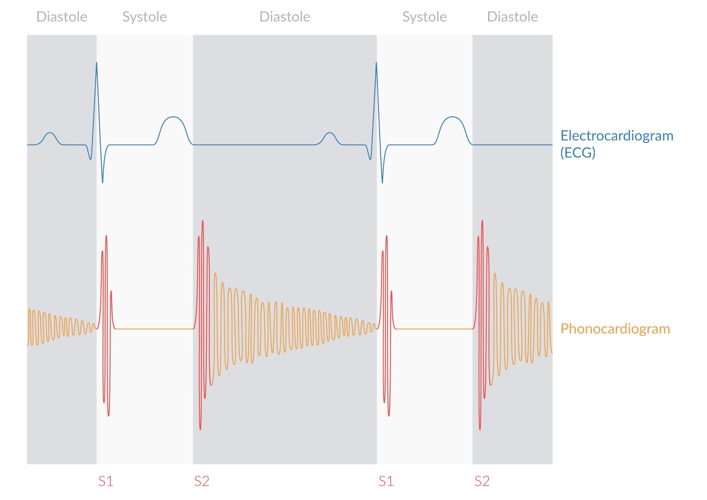
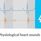
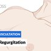
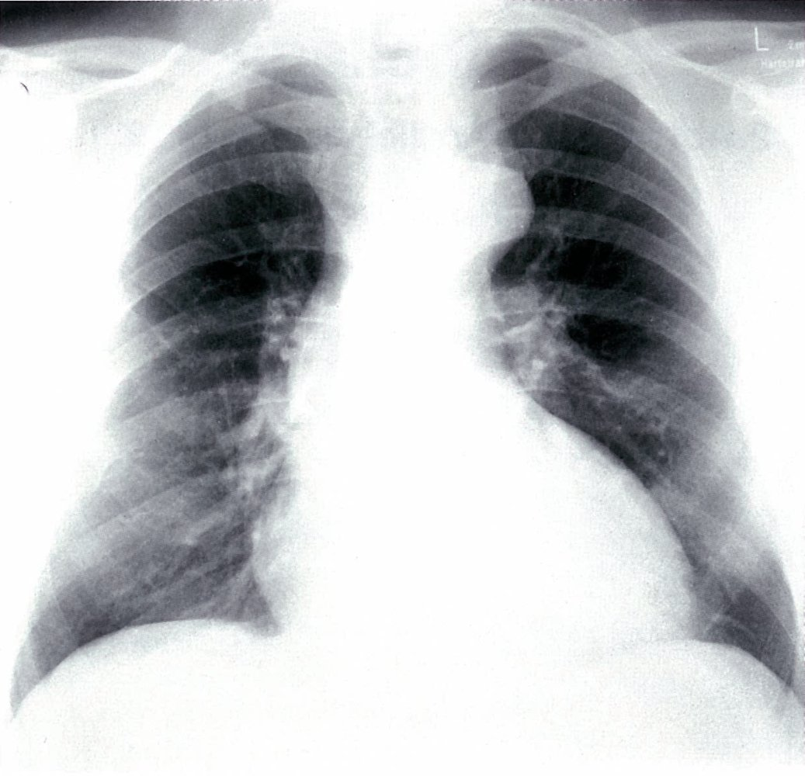

# Aortic regurgitation

*Categories: Clinical knowledge > Internal medicine > Cardiology and angiology > Valvular heart diseases > Aortic regurgitation*

[Original Article Link](https://coursology-qbank.com/amboss/article/0h0ecf)

---

## Summary

Aortic <u>regurgitation</u> (<u>AR</u>) is a <u>valvular heart disease</u> characterized by incomplete closure of the <u>aortic valve</u> leading to the reflux of blood from the aorta into the <u>left ventricle</u> (LV) during <u>diastole</u>. Aortic <u>regurgitation</u> can be acute (primarily caused by bacterial <u>endocarditis</u> or <u>aortic dissection</u>) or chronic (e.g., due to a congenital <u>bicuspid valve</u> or <u>rheumatic fever</u>) and may be caused by a valvular defect or an abnormality of the aorta. In most cases, acute <u>AR</u> leads to rapid deterioration of LV function with subsequent <u>pulmonary edema</u> and cardiac decompensation. Chronic <u>AR</u> may remain compensated for a long period of time, becoming symptomatic only when <u>left heart failure</u> develops. <u>Auscultation</u> reveals an <u>S3</u> and a high-pitched, decrescendo <u>early diastolic murmur</u>. Another characteristic diagnostic finding is widened <u>pulse pressure</u>. <u>Echocardiography</u> is the most important diagnostic tool, both for confirming the diagnosis and determining the severity of disease. In asymptomatic patients, <u>conservative treatment</u> consists of symptom management and physical activity as tolerated. Symptomatic patients or those with severely reduced LV function require surgical intervention, most commonly <u>aortic valve replacement</u>.

---

## Etiology

### Acute aortic <u>regurgitation</u> [[1]](https://coursology-qbank.com/amboss/article/POaWsk)[[2]](https://coursology-qbank.com/amboss/article/kIYm1q)

* <u>Infective endocarditis</u>

* <u>Aortic dissection</u> (<u>ascending aorta</u>)

* Chest trauma

* <u>Iatrogenic</u> complications

### Chronic aortic <u>regurgitation</u> [[1]](https://coursology-qbank.com/amboss/article/POaWsk)[[3]](https://coursology-qbank.com/amboss/article/nyb7fw)

* Primary valvular defect 

* Congenital <u>bicuspid aortic valve</u>: most common cause of <u>AR</u> in young adults in high-income countries

* Calcific <u>aortic valve</u> disease: most common cause of <u>AR</u> in older patients in high-income countries  [[1]](https://coursology-qbank.com/amboss/article/POaWsk)[[3]](https://coursology-qbank.com/amboss/article/nyb7fw)

* <u>Rheumatic heart disease</u>: most common cause of <u>AR</u> in lower-income countries  [[4]](https://coursology-qbank.com/amboss/article/IHXY7z)

* Aortic dilatation 

* <u>Connective tissue disorders</u> (e.g., <u>Marfan syndrome</u>, <u>Ehlers-Danlos</u> syndrome)

* Chronic <u>hypertension</u>

* <u>Aortitis</u> of any etiology (e.g., <u>tertiary syphilis</u>)

* <u>Thoracic aortic aneurysm</u>

---

## Pathophysiology

* General
* <u>Regurgitation</u> of blood from the aorta into the <u>left ventricle</u> (LV) leads to:

* Increased systolic blood pressure  and decreased <u>diastolic</u> pressure

* Widened <u>pulse pressure</u> → <u>water hammer pulse</u> (see “Diagnostics” below)

* Acute <u>AR</u>

* Because LV cannot sufficiently dilate in response to regurgitant blood, LV end-<u>diastolic</u> pressure increases rapidly → pressure transmits backwards into <u>pulmonary circulation</u> → <u>pulmonary edema</u> and <u>dyspnea</u>

* Decreased <u>cardiac output</u> if severe → <u>cardiogenic shock</u> and <u>myocardial</u> <u>ischemia</u>

* Chronic <u>AR</u>

* Initially, a compensatory increase in <u>stroke volume</u> can maintain adequate <u>cardiac output</u> despite <u>regurgitation</u> (compensated <u>heart failure</u>)

* Over time, increased <u>left ventricular</u> end-<u>diastolic</u> volume → LV enlargement and <u>eccentric hypertrophy</u> of <u>myocardium</u> → <u>left ventricular</u> <u>systolic dysfunction</u> → <u>decompensated heart failure</u>

References:[[6]](https://coursology-qbank.com/amboss/article/WVYPtL)

---

## Clinical features

### Acute aortic <u>regurgitation</u> [[2]](https://coursology-qbank.com/amboss/article/kIYm1q)[[7]](https://coursology-qbank.com/amboss/article/suYtsI)

#### Signs and symptoms

* Sudden, severe <u>dyspnea</u>

* Rapid cardiac decompensation secondary to <u>heart failure</u>

* <u>Pulmonary edema</u>

* Symptoms related to underlying disease (e.g., <u>fever</u> due to <u>endocarditis</u>, <u>chest pain</u> due to <u>aortic dissection</u>)

#### <u>Auscultation</u>

* <u>Soft S1</u>

* Soft and short <u>early diastolic murmur</u>

### Chronic aortic <u>regurgitation</u> [[2]](https://coursology-qbank.com/amboss/article/kIYm1q)

#### Signs and symptoms

* May be asymptomatic for up to decades despite progressive LV dilation

* <u>Palpitations</u>

* Symptoms of high <u>pulse pressure</u> 

* <u>Water hammer pulse</u> of peripheral <u>arteries</u> characterized by rapid upstroke and downstroke

* <u>Corrigan pulse</u>: <u>pulse</u> of carotid <u>arteries</u> characterized by rapid upstroke and downstroke

* <u>Traube sign</u>: pistol shot-like sounds heard over the <u>femoral artery</u> on <u>auscultation</u>

* Duroziez sign: to-and-fro <u>bruit</u> over the <u>femoral artery</u> that is heard when slight pressure is applied with a stethoscope

* Quincke sign: visible <u>capillary</u> <u>pulse</u> when pressure is applied to the tip of a fingernail

* De Musset sign: rhythmic nodding or bobbing of the head in synchrony with heartbeats

* <u>Symptoms of left heart failure</u>

* Exertional <u>dyspnea</u>

* <u>Angina</u>

* <u>Orthopnea</u>

* Easy fatigability

* <u>Syncope</u>

* Point of maximal impulse (<u>PMI</u>): diffuse, hyperdynamic, and displaced inferolaterally

#### <u>Auscultation</u>

* <u>S3</u>

* High-pitched, blowing, decrescendo <u>early diastolic murmur</u>  

* <u>AR</u> due to valvular disease: heard best in the left third and fourth <u>intercostal spaces</u> and along the left sternal border (<u>Erb point</u>)

* <u>AR</u> due to aortic root disease (e.g., <u>aortic dissection</u>): heard best along the right sternal border

* Worsens with squatting and handgrip

* Austin Flint murmur

* Rumbling, low-pitched, middiastolic or presystolic <u>murmur</u> heard best at the apex

* Caused by regurgitant blood striking the <u>anterior</u> leaflet of the <u>mitral valve</u>, which leads to premature closure of the mitral leaflets

* In more severe stages, possibly a harsh, crescendo-decrescendo <u>midsystolic murmur</u> that resembles the ejection <u>murmur</u> heard in <u>aortic stenosis</u>

* See also “<u>Auscultation in valvular defects</u>.”

Heart murmur in aortic and pulmonary insufficiency

Cardiovascular Examination - Clinical Examination of the Heart

Heart sounds (physiological) - Clinical examination | Δ AMBOSS

Aortic regurgitation - Heart murmur -  Clinical examination | Δ AMBOSS

Aortic Regurgitation (AR) - Heart Auscultation - Episode 2

---

## Diagnosis

### Approach

* <u>Transthoracic echocardiography</u> (<u>TTE</u>) is the primary diagnostic tool to diagnose <u>AR</u> and assess the severity of disease.

* Acute <u>AR</u> is an emergency that must be diagnosed and treated immediately.

* <u>CTA</u> Chest (or <u>TEE</u>) is the preferred diagnostic tool if <u>aortic dissection</u> is suspected.

* Additional diagnostics depend on patient stability and the suspected underlying condition (e.g., <u>blood cultures</u> for <u>endocarditis</u>).

* In chronic <u>AR</u>, <u>TEE</u>, <u>CMR</u>, or <u>cardiac catheterization</u> can be used to confirm the diagnosis if <u>TTE</u> findings are inconclusive.

### Initial evaluation

#### <u>Echocardiography</u> [[5]](https://coursology-qbank.com/amboss/article/-FXDk-)[[8]](https://coursology-qbank.com/amboss/article/5VXiEC)

* Indication: assessment of <u>aortic valve</u> structure and function, cause and severity of <u>regurgitation</u>, the <u>left ventricle</u> and other <u>heart valves</u>  [[2]](https://coursology-qbank.com/amboss/article/kIYm1q)

* <u>TTE</u>: modality of choice for initial assessment of all patients with suspected <u>AR</u>

* <u>TEE</u> [[5]](https://coursology-qbank.com/amboss/article/-FXDk-)

* Moderate to severe <u>AR</u>, if <u>TTE</u> findings are equivocal

* Preoperative planning

* Acute <u>AR</u> with suspected <u>aortic dissection</u>

* Supportive findings [[3]](https://coursology-qbank.com/amboss/article/nyb7fw)

* General findings

* Abnormal <u>aortic valve</u> leaflets

* Fluttering of the <u>anterior</u> <u>mitral valve</u> leaflet  [[2]](https://coursology-qbank.com/amboss/article/kIYm1q)[[3]](https://coursology-qbank.com/amboss/article/nyb7fw)

* Regurgitant <u>AR</u> jet on Doppler flow tracing

* Dilated aorta  [[9]](https://coursology-qbank.com/amboss/article/mM0V6g)

* Findings specific to acute <u>AR</u> [[7]](https://coursology-qbank.com/amboss/article/suYtsI)

* Reduced <u>cardiac output</u>

* Elevated end-<u>diastolic</u> <u>left ventricular</u> pressure

* Early <u>mitral valve</u> closing

* Rapid equilibration of aortic and <u>left ventricular</u> pressure

* Findings specific to chronic <u>AR</u>: increased LV size and volume  [[2]](https://coursology-qbank.com/amboss/article/kIYm1q)

#### Other [[5]](https://coursology-qbank.com/amboss/article/-FXDk-)

* <u>Laboratory studies</u>: not routinely indicated but useful for the evaluation of other causes of symptoms (see also “Diagnostics” in the “<u>Dyspnea</u>” and “<u>Chest pain</u>” articles)

* <u>Blood cultures</u>: in suspected <u>infective endocarditis</u> (at least three sets) [[10]](https://coursology-qbank.com/amboss/article/xJ0EwS)

* <u>BNP</u>/<u>NT-proBNP</u>  [[11]](https://coursology-qbank.com/amboss/article/kHbmqE)[[12]](https://coursology-qbank.com/amboss/article/OHbIqE)

* <u>ECG</u>: nonspecific; helps rule out differential diagnoses (e.g., <u>ACS</u>, <u>cardiac arrhythmia</u>)

* Acute <u>AR</u>: possible signs of the underlying cause (e.g., signs of <u>myocardial</u> <u>ischemia</u> in <u>aortic dissection</u>)

* Chronic <u>AR</u>

* <u>ECG signs of LVH</u>

* <u>ST-segment depression</u> and <u>T-wave</u> <u>inversion</u> in I, aVL, V5, and V6[[2]](https://coursology-qbank.com/amboss/article/kIYm1q)

* <u>Chest x-ray</u>: used to assess for <u>pulmonary edema</u> and rule out other causes of acute <u>dyspnea</u>

* Acute <u>AR</u> [[1]](https://coursology-qbank.com/amboss/article/POaWsk)

* Normal <u>heart silhouette</u>

* <u>X-ray</u> signs of <u>pulmonary congestion</u> or <u>edema</u>

* Chronic <u>AR</u> [[2]](https://coursology-qbank.com/amboss/article/kIYm1q)

* <u>X-ray signs of LVH</u>

* Enlarged <u>cardiac silhouette</u>

* Chronic <u>AR</u> or acute <u>AR</u> caused by <u>aortic dissection</u>: possible prominent aortic root/arch [[13]](https://coursology-qbank.com/amboss/article/z9YrJr)[[14]](https://coursology-qbank.com/amboss/article/-9YDJr)

Cardiomegaly and prominent thoracic aorta in aortic regurgitation

### Additional evaluation [[5]](https://coursology-qbank.com/amboss/article/-FXDk-)

#### Advanced imaging

* <u>Cardiac MRI</u> [[2]](https://coursology-qbank.com/amboss/article/kIYm1q)[[8]](https://coursology-qbank.com/amboss/article/5VXiEC)

* Indication: moderate to severe <u>AR</u> (<u>AR stage B</u>–<u>AR stage D</u>) with inadequate <u>echocardiographic</u> imaging or a discrepancy between clinical presentation and <u>echocardiographic</u> findings

* Objective: precise evaluation of anatomy and <u>hemodynamics</u>

* <u>CTA</u> chest

* Acute <u>AR</u>: indicated especially if <u>aortic dissection</u> is suspected

* Chronic <u>AR</u>: not routinely recommended

#### <u>Cardiac catheterization</u>

* Diagnostic hemodynamic <u>cardiac catheterization</u> with <u>aortography</u>

* Indication: moderate to severe <u>AR</u> (<u>AR stage B</u>–<u>AR stage D</u>) with inadequate <u>echocardiographic</u> imaging or a discrepancy between clinical presentation and <u>echocardiographic</u> findings

* Objective: hemodynamic evaluation (e.g., severity of <u>regurgitation</u>, intracardiac pressures, cardiac function)

* <u>Coronary angiography</u>

* Indications: preoperative cardiac risk <u>stratification</u> in patients with <u>angina</u>, reduced <u>LVEF</u>, signs of <u>ischemia</u>, or coronary <u>risk factors</u>

* Findings: <u>signs of CAD</u> (e.g., coronary stenosis)

#### <u>Exercise stress testing</u>

* Indication: may be used to provoke possible exertional symptoms or assess fitness in patients with severe <u>AR</u>

* Findings: symptoms of aortic <u>regurgitation</u> (e.g., <u>dyspnea</u>, <u>angina</u>)

---

## Treatment

### Approach [[2]](https://coursology-qbank.com/amboss/article/kIYm1q)[[5]](https://coursology-qbank.com/amboss/article/-FXDk-)

* Acute aortic <u>regurgitation</u>

* Severe acute <u>AR</u> requires surgical treatment as soon as possible.  [[3]](https://coursology-qbank.com/amboss/article/nyb7fw)[[15]](https://coursology-qbank.com/amboss/article/-l1DzS0)

* Consult cardiology and cardiothoracic <u>surgery</u> immediately.

* Medical management of complications (e.g., <u>pulmonary edema</u>) should not delay definitive treatment.

* Identify and treat the underlying cause (see, e.g., “Treatment” in “<u>Infective endocarditis</u>” and “<u>Aortic dissection</u>” articles).

* Chronic aortic <u>regurgitation</u>

* <u>Surgery</u> is the mainstay of treatment for symptomatic <u>AR</u> and severe asymptomatic <u>AR</u>.

* Optimize medical management of comorbidities (e.g., <u>heart failure treatment</u>), especially if <u>surgery</u> is contraindicated.

> [!WARNING]
> All patients with acute severe aortic <u>regurgitation</u> should undergo urgent surgical treatment. [[2]](https://coursology-qbank.com/amboss/article/kIYm1q)

> [!WARNING]
> <u>IABP</u> increases regurgitated volume and is contraindicated in acute severe <u>AR</u>. [[5]](https://coursology-qbank.com/amboss/article/-FXDk-)

### Surgical management [[5]](https://coursology-qbank.com/amboss/article/-FXDk-)

The choice of procedure depends on the cause of the valve defect and comorbidities. All patients with severe aortic <u>regurgitation</u> being considered for intervention should be evaluated by members of a <u>heart valve</u> team if feasible.

* Indications [[5]](https://coursology-qbank.com/amboss/article/-FXDk-)[[16]](https://coursology-qbank.com/amboss/article/UzYbH7)

* Acute severe <u>AR</u>

* Symptomatic chronic severe <u>AR</u>  (<u>AR stage D</u>)

* Asymptomatic chronic severe <u>AR</u> (<u>AR</u> stage C) with one of the following: 

* Reduced <u>LVEF</u> ≤ 55%

* Consider if <u>LVESD</u> > 50 mm

* Cardiac <u>surgery</u> for other indications

* Surgical <u>aortic valve replacement</u>: Standard procedure for acute and chronic <u>AR</u> (see “<u>Prosthetic heart valve</u>” for details)  [[3]](https://coursology-qbank.com/amboss/article/nyb7fw)

* Alternative procedures  [[2]](https://coursology-qbank.com/amboss/article/kIYm1q)

* Valve-sparing repair of <u>aortic sinuses</u> and <u>ascending aorta</u> : may be considered if <u>AR</u> is caused by aortic dilatation and the valve itself is unimpaired

* Primary <u>valve repair</u>: not routinely performed, but may be considered in isolated minor leaflet damage  [[2]](https://coursology-qbank.com/amboss/article/kIYm1q)

* <u>Transcatheter aortic valve replacement</u>: not recommended for treatment of isolated <u>AR</u>

* Follow-up

* Complications of <u>aortic valve replacement</u> include <u>arrhythmias</u>, <u>endocarditis</u>, and <u>thromboembolism</u>

* <u>Antithrombotic therapy for patients with prosthetic aortic valves</u> depends on the choice of valve replacement (mechanical or bioprosthetic) and <u>risk factors</u>.

### Medical management [[5]](https://coursology-qbank.com/amboss/article/-FXDk-)

#### Acute aortic <u>regurgitation</u> [[3]](https://coursology-qbank.com/amboss/article/nyb7fw)[[15]](https://coursology-qbank.com/amboss/article/-l1DzS0)

* Medical management is focused on stabilizing <u>hemodynamics</u> prior to <u>surgery</u>, e.g., via: 

* <u>Management of cardiogenic shock</u> with <u>inoconstrictors</u> or <u>inodilators</u> (e.g., <u>dobutamine</u> or <u>dopamine</u>)

* <u>Afterload</u> reduction with <u>vasodilators for acute heart failure</u> (e.g., <u>nitroprusside</u>)

* <u>Beta blockers</u> may be indicated in <u>aortic dissection</u>; avoid in other causes of acute <u>AR</u>.  [[5]](https://coursology-qbank.com/amboss/article/-FXDk-)

> [!WARNING]
> Avoid <u>beta blockers</u> in acute <u>AR</u>, unless due to <u>aortic dissection</u>. [[5]](https://coursology-qbank.com/amboss/article/-FXDk-)

#### Chronic aortic <u>regurgitation</u>

All patients should be screened and treated for other cardiac <u>risk factors</u>. No medical treatments are known to influence the progression of the disease. [[17]](https://coursology-qbank.com/amboss/article/mHbVIE)

* <u>Hypertension</u>

* Initiate treatment if systolic blood pressure is > 140 mm Hg and follow standard <u>hypertension</u> guidelines.

* <u>Vasodilators</u> (e.g., <u>ACE inhibitors</u>, <u>ARBs</u>) may be preferable to <u>beta blockers</u>.  [[17]](https://coursology-qbank.com/amboss/article/mHbVIE)

* <u>Heart failure</u>: : Manage according to guideline recommendations (see “<u>Treatment of heart failure</u>”).

* Prophylactic <u>antibiotics</u>

* At-risk patients, e.g., with <u>prosthetic valves</u> or a history of <u>infective endocarditis</u>: Consider <u>antibiotic prophylaxis</u> prior to certain dental procedures (see “<u>Prophylaxis for endocarditis</u>”). [[6]](https://coursology-qbank.com/amboss/article/WVYPtL)

* <u>Rheumatic heart disease</u>: long-term secondary prophylaxis (see “Prevention” in “<u>Rheumatic fever</u>” for details)  [[18]](https://coursology-qbank.com/amboss/article/kobmXu)

### Monitoring [[5]](https://coursology-qbank.com/amboss/article/-FXDk-)

* Serial <u>echocardiography</u>: Regular follow-up imaging is indicated for asymptomatic patients to identify possible progression and indications for intervention.

* Mild <u>regurgitation</u> (<u>AR stage B</u>): every 3–5 years

* Moderate <u>regurgitation</u> (<u>AR stage B</u>): every 1–2 years

* <u>AR stage C1</u> <u>regurgitation</u>: every 6–12 months

* On-demand imaging is indicated for patients with any change in signs or symptoms.

---