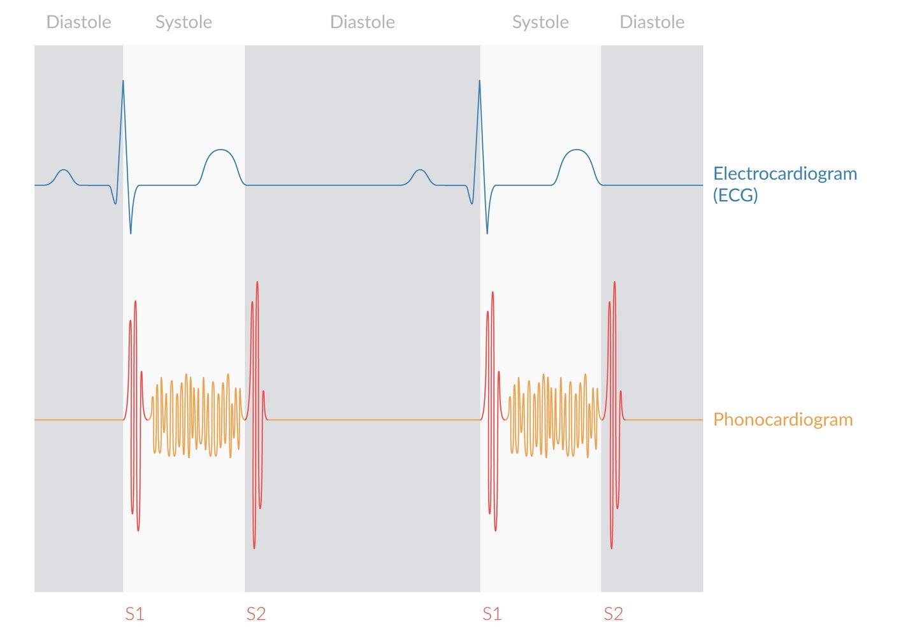
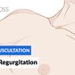

# Mitral regurgitation

*Categories: Clinical knowledge > Internal medicine > Cardiology and angiology > Valvular heart diseases > Mitral regurgitation*

[Original Article Link](https://coursology-qbank.com/amboss/article/Yh0ncf)

---

## Summary

Mitral <u>regurgitation</u> (MR) is the leakage of blood from the <u>left ventricle</u> into the <u>left atrium</u> due to incomplete closure of the <u>mitral valve</u> during <u>systole</u>. It is a common form of valvular disease and categorized according to onset (into acute and chronic forms) and etiology. <u>Primary MR</u> involves the structure of the <u>mitral valve</u> whereas <u>secondary MR</u> is a result of different pathologies that lead to valvular <u>incompetence</u> (e.g., <u>cardiomyopathy</u>). <u>Ischemic</u> MR can be acute (e.g., <u>papillary muscle rupture</u> in <u>myocardial infarction</u>) or chronic (in <u>coronary artery disease</u>). Symptoms vary from <u>cardiogenic shock</u> and <u>flash pulmonary edema</u> in acute manifestations to mild symptoms such as <u>cough</u> and <u>dyspnea</u> in chronic cases. <u>Echocardiography</u> is the diagnostic modality of choice; further imaging and treatment options are determined by the etiology. The definitive treatment in <u>primary MR</u> is surgical repair or valve replacement, while therapy of an underlying condition, e.g., <u>percutaneous coronary intervention</u> (<u>PCI</u>) in <u>coronary artery disease</u>, is the mainstay of therapy in <u>secondary MR</u>. Pharmacological treatment aims to reduce the degree of <u>heart failure</u>.

---

## Etiology

* Primary MR (organic): mitral <u>regurgitation</u> caused by direct involvement of the valve leaflets or <u>chordae tendinae</u> [[1]](https://coursology-qbank.com/amboss/article/B-Yzz7)

* Degenerative <u>mitral valve</u> disease (<u>mitral valve prolapse</u>, <u>mitral annular calcification</u>, ruptured <u>chordae tendinae</u>)

* <u>Rheumatic fever</u>

* <u>Infective endocarditis</u>

* <u>Ischemic</u> MR (e.g., <u>papillary muscle rupture</u> following acute <u>MI</u>)

* Secondary MR (functional): caused by changes of the <u>left ventricle</u> that lead to valvular <u>incompetence</u>

* <u>Coronary artery disease</u> or prior <u>myocardial infarction</u> causing <u>papillary muscle</u> involvement

* <u>Dilated cardiomyopathy</u>  (e.g., <u>peripartum cardiomyopathy</u>)  and left-sided <u>heart failure</u>

* Acute MR: Acute dysfunction of the <u>mitral valve</u> leads to <u>volume overload</u> and <u>symptoms of acute heart failure</u>. [[2]](https://coursology-qbank.com/amboss/article/Ccbqes)

* Chronic MR

* To preserve <u>cardiac output</u>, <u>valve dysfunction</u> is initially compensated for by <u>cardiac remodeling</u>.

* Over time, remodeling affects <u>LVEF</u>, leading to <u>heart failure</u>. [[2]](https://coursology-qbank.com/amboss/article/Ccbqes)

---

## Clinical features

### Acute mitral <u>regurgitation</u> [[6]](https://coursology-qbank.com/amboss/article/suYtsI)

* Signs and symptoms

* <u>Dyspnea</u>

* <u>Symptoms of left-sided heart failure</u>

* Signs and <u>symptoms of pulmonary edema</u> (e.g., bibasilar, fine, late inspiratory <u>crackles</u>)

* <u>Cardiogenic shock</u>: poor peripheral <u>perfusion</u>, <u>tachycardia</u>, <u>tachypnea</u>, and <u>hypotension</u>

* <u>Palpitations</u>  [[7]](https://coursology-qbank.com/amboss/article/qzYCF7)

* <u>Auscultation</u> [[6]](https://coursology-qbank.com/amboss/article/suYtsI)

* Soft, decrescendo <u>murmur</u>

* No <u>murmur</u> in severe <u>regurgitation</u> with LV <u>systolic dysfunction</u> or <u>hypotension</u> [[8]](https://coursology-qbank.com/amboss/article/szYt87)

* Potentially: <u>S3 heart sound</u>

### Chronic mitral <u>regurgitation</u>

* Signs and symptoms

* <u>Dyspnea</u> (including <u>exertional dyspnea</u>), dry <u>cough</u>

* Fatigue [[7]](https://coursology-qbank.com/amboss/article/qzYCF7)

* <u>Palpitations</u>  [[9]](https://coursology-qbank.com/amboss/article/EzY8u7)

* <u>Symptoms of left-sided heart failure</u> (potentially also symptoms of <u>right-sided heart failure</u>)

* <u>Auscultation</u> [[7]](https://coursology-qbank.com/amboss/article/qzYCF7)

* <u>Lateral</u> displacement of the apical impulse

* Quiet <u>S1</u> <u>heart sound</u>

* <u>S3 heart sound</u> in advanced stages of disease

* <u>Holosystolic murmur</u> (high-pitched, blowing) 

* Radiates to the left <u>axilla</u> and heard best over the apex (5th <u>intercostal space</u> at the left <u>midclavicular line</u>)

* Intensity can be increased by increasing <u>preload</u> (e.g., leg raise) or <u>afterload</u> (e.g., handgrip) due to increased <u>regurgitation</u>.

* See also <u>auscultation in valvular defects</u>

Heart murmur in ventricular septal defect, mitral regurgitation, and tricuspid regurgitation

Cardiovascular Examination - Clinical Examination of the Heart

Heart sounds (physiological) - Clinical examination | Δ AMBOSS

Mitral regurgitation - Heart murmur - Clinical examination | Δ AMBOSS

Mitral Regurgitation (MR) - Heart Auscultation - Episode 4

---

## Diagnosis

### Approach

* Rule out <u>myocardial infarction</u> and consider other <u>causes of AHF</u>.

* Perform <u>transthoracic echocardiography</u> (<u>TTE</u>).

* For suspected acute MR, obtain <u>emergency preoperative diagnostics</u>.

* Consider additional diagnostics (e.g. <u>coronary angiography</u>) based on the suspected etiology.

> [!WARNING]
> Acute MR is a medical and surgical emergency, as patients can decompensate rapidly. [[3]](https://coursology-qbank.com/amboss/article/-FXDk-)[[8]](https://coursology-qbank.com/amboss/article/szYt87)

### <u>Echocardiography</u>

* Indications: to assess the valve apparatus, size and function of <u>left ventricle</u> and <u>atrium</u>, and grade the severity of MR [[7]](https://coursology-qbank.com/amboss/article/qzYCF7)

* <u>TTE</u>: modality of choice for the initial assessment of all patients with suspected valvular abnormality  [[6]](https://coursology-qbank.com/amboss/article/suYtsI)[[7]](https://coursology-qbank.com/amboss/article/qzYCF7)

* <u>Transesophageal echocardiography</u> (<u>TEE</u>): indicated prior to <u>surgery</u> and during the diagnostic workup of MR if <u>TTE</u> is inadequate  [[1]](https://coursology-qbank.com/amboss/article/B-Yzz7)[[7]](https://coursology-qbank.com/amboss/article/qzYCF7)

#### Findings [[6]](https://coursology-qbank.com/amboss/article/suYtsI)[[11]](https://coursology-qbank.com/amboss/article/HuYKsI)[[12]](https://coursology-qbank.com/amboss/article/UzYbH7)

| Echocardiographic characteristics of primary mitral regurgitation |  |  |
| --- | --- | --- |
| Parameter | Acute MR | Chronic MR |
| Valve movement or function |  * Abnormal   |  * Abnormal   |
|  <u>Aortic valve</u> opening [[13]](https://coursology-qbank.com/amboss/article/mcbV1s)  |  * Decreased   |  * Decreased   |
|  <u>Pulmonary vein</u> flow [[14]](https://coursology-qbank.com/amboss/article/gdbF6s)  |  * May be reversed   |  * Generally normal   |
| <u>Left atrium</u> |  * Normal   |  * Dilated   |
| <u>Left ventricle</u> size |  * Normal   |  * Increased/remodeled   |
| <u>LVEF</u> |  * Normal   |   * Compensated: normal or increased  [[15]](https://coursology-qbank.com/amboss/article/Sdby6s)  * Decompensated: decreased [[16]](https://coursology-qbank.com/amboss/article/JzYsF7)    |
|  <u>Pulmonary artery</u> pressure [[17]](https://coursology-qbank.com/amboss/article/Rdblps)[[18]](https://coursology-qbank.com/amboss/article/Qdbups)  |  * Elevated   |   * Compensated: normal  * Decompensated: elevated    |
| <u>Right ventricle</u> <u>ejection fraction</u> |  * Normal   |   * Compensated: normal  * Decompensated: reduced  [[17]](https://coursology-qbank.com/amboss/article/Rdblps)[[19]](https://coursology-qbank.com/amboss/article/idbJps)    |

* Findings in <u>secondary mitral regurgitation</u> may include:  [[3]](https://coursology-qbank.com/amboss/article/-FXDk-)

* Normal valve anatomy but abnormal function

* Signs of an underlying condition may be present (e.g., apical <u>left ventricular</u> ballooning in <u>takotsubo cardiomyopathy</u>)

### <u>Laboratory studies</u>

* <u>Troponin</u>: Elevation may indicate <u>myocardial</u> <u>ischemia</u>.

* <u>BNP</u>

* Acute MR: typically normal because of the acute onset of symptoms [[20]](https://coursology-qbank.com/amboss/article/QcbuXs)

* Chronic MR: normal or elevated as <u>regurgitation</u> severity increases and the <u>left ventricle</u> is remodeled  [[7]](https://coursology-qbank.com/amboss/article/qzYCF7)[[21]](https://coursology-qbank.com/amboss/article/tzYXu7)

* <u>Blood cultures</u>: in suspected <u>infective endocarditis</u> (at least three sets) [[22]](https://coursology-qbank.com/amboss/article/xJ0EwS)

> [!TIP]
> <u>Myocardial infarction</u> must be ruled out in patients presenting with acute mitral <u>regurgitation</u>!

### <u>ECG</u>

* Acute MR: Findings are often nonspecific.

* Normal <u>sinus rhythm</u>

* <u>Sinus tachycardia</u> with nonspecific ST and <u>T-wave</u> abnormalities  [[6]](https://coursology-qbank.com/amboss/article/suYtsI)

* <u>Atrial fibrillation</u>  [[7]](https://coursology-qbank.com/amboss/article/qzYCF7)

* Signs of acute <u>ischemia</u> in <u>ischemic</u> MR (see <u>acute coronary syndrome</u>)

* Chronic MR: <u>ECG</u> changes usually reflect <u>cardiac remodeling</u>.

* <u>Left ventricular hypertrophy</u> (50% of patients) [[7]](https://coursology-qbank.com/amboss/article/qzYCF7)

* <u>P mitrale</u>

* <u>Atrial fibrillation</u>  [[9]](https://coursology-qbank.com/amboss/article/EzY8u7)

* Signs of right <u>heart</u> strain with <u>P pulmonale</u> in later stages  [[7]](https://coursology-qbank.com/amboss/article/qzYCF7)

### <u>Chest x-ray</u>

* Indications: assess for <u>pulmonary edema</u>, rule out other causes of acute <u>dyspnea</u>

* Supportive findings

* Decompensated MR and acute MR: signs of <u>pulmonary congestion</u> (see <u>x-ray</u> findings in <u>pulmonary congestion</u>)  [[6]](https://coursology-qbank.com/amboss/article/suYtsI)[[8]](https://coursology-qbank.com/amboss/article/szYt87)

* Acute MR: normal-sized <u>cardiac silhouette</u> [[6]](https://coursology-qbank.com/amboss/article/suYtsI)

* Chronic MR: Changes related to <u>cardiac remodeling</u> and associated <u>heart failure</u> may be visible.

* LV enlargement: laterally displaced left cardiac border

* LA enlargement: straightening of the left cardiac border and double density sign  [[23]](https://coursology-qbank.com/amboss/article/FzYgu7)

* Annular calcification may be visible as a C-shaped density. [[7]](https://coursology-qbank.com/amboss/article/qzYCF7)

### Additional evaluation

In <u>primary MR</u>, additional diagnostics should be considered if <u>echocardiography</u> does not allow for the adequate assessment of <u>mitral valve</u> function. In <u>secondary MR</u>, consider advanced diagnostics to determine the underlying condition (e.g., <u>coronary artery disease</u>).

* <u>Cardiac MRI</u> (<u>CMR</u>): if both <u>TTE</u> and <u>TEE</u> findings are inconclusive, and for suspected <u>cardiomyopathy</u> or <u>ischemic</u> MR  [[24]](https://coursology-qbank.com/amboss/article/ocb0Ws)

* <u>Stress echo</u>: in <u>ischemic</u> MR and to help assess the need for <u>surgery</u>  [[25]](https://coursology-qbank.com/amboss/article/ncb71s)

* <u>CT angiography</u>: in suspected <u>ischemic cardiomyopathy</u>

* <u>Coronary angiography</u>: in suspected <u>ischemic</u> MR, prior to surgical intervention

---

## Treatment

### Acute mitral <u>regurgitation</u> [[1]](https://coursology-qbank.com/amboss/article/B-Yzz7)[[3]](https://coursology-qbank.com/amboss/article/-FXDk-)

#### General principles

* Management of acute MR is complex and cardiology and cardiothoracic <u>surgery</u> should be consulted as early as possible.

* All patients with acute <u>primary MR</u> should undergo urgent surgical repair or valve replacement.

* Arrange early interfacility transfer if cardiothoracic <u>surgery</u> is not available locally.

* While awaiting <u>surgery</u>, any <u>symptoms of heart failure</u> should be managed with medical therapy (e.g., <u>diuretics</u>, <u>nitrates</u>, <u>antihypertensive drugs</u>).

* If <u>secondary MR</u> is suspected, identify and treat the underlying cause (e.g., <u>revascularization therapy</u> for <u>ischemic</u> MR)  [[10]](https://coursology-qbank.com/amboss/article/7zY487)

#### Initial stabilization

For acute <u>primary MR</u>, medical treatment is usually only a temporizing measure while <u>surgery</u> is planned. The aim is to reduce the <u>symptoms of heart failure</u> and improve forward flow.

* <u>Management of acute heart failure</u>

* <u>Vasodilators</u>: to reduce <u>afterload</u> and improve <u>cardiac output</u>

* <u>Nitroprusside</u> DOSAGE  [[7]](https://coursology-qbank.com/amboss/article/qzYCF7)[[26]](https://coursology-qbank.com/amboss/article/iebJAs)

* <u>Nitrates</u> (e.g., <u>nitroglycerin</u> DOSAGE)  [[7]](https://coursology-qbank.com/amboss/article/qzYCF7)[[27]](https://coursology-qbank.com/amboss/article/3ebSAs)

* <u>Nicardipine</u> DOSAGE  [[3]](https://coursology-qbank.com/amboss/article/-FXDk-)

* <u>Diuretics</u> (e.g., <u>furosemide</u> DOSAGE) and <u>noninvasive positive-pressure ventilation</u>: for acute <u>pulmonary edema</u>  [[28]](https://coursology-qbank.com/amboss/article/Sebyys)[[29]](https://coursology-qbank.com/amboss/article/AN1Rdh0)

* <u>Management of cardiogenic shock</u> [[29]](https://coursology-qbank.com/amboss/article/AN1Rdh0)[[30]](https://coursology-qbank.com/amboss/article/gebFys)

* <u>Vasopressors</u> (e.g., <u>norepinephrine</u> DOSAGE) [[31]](https://coursology-qbank.com/amboss/article/ipYJ6J)

* <u>Inotropes</u> (e.g., <u>dobutamine</u> DOSAGE)

* Management of <u>atrial fibrillation</u>: Consider <u>rhythm control</u> to improve <u>hemodynamics</u>. [[1]](https://coursology-qbank.com/amboss/article/B-Yzz7)

> [!WARNING]
> <u>Heart failure treatment</u> may worsen <u>hypotension</u>; use caution in <u>hemodynamically unstable</u> patients.

#### Bridging devices

* Indications

* Patients whose symptoms continue to deteriorate despite medical therapy [[32]](https://coursology-qbank.com/amboss/article/b-YHD7)

* Unstable patients prior to <u>surgery</u>

* Procedures

* <u>Intra-aortic balloon pump</u> (<u>IABP</u>) [[6]](https://coursology-qbank.com/amboss/article/suYtsI)[[32]](https://coursology-qbank.com/amboss/article/b-YHD7)

* Reduces <u>afterload</u> and <u>preload</u> and improves <u>cardiac output</u> [[32]](https://coursology-qbank.com/amboss/article/b-YHD7)

* Improves coronary blood flow [[32]](https://coursology-qbank.com/amboss/article/b-YHD7)

* Particularly useful in patients with acute MR driven by <u>ischemia</u> or <u>cardiomyopathy</u> [[32]](https://coursology-qbank.com/amboss/article/b-YHD7)

* Contraindicated in acute <u>aortic regurgitation</u>

* Consider <u>left ventricular assist device</u> (<u>LVAD</u>) or <u>ECMO</u> in patients who are deteriorating despite pharmacological therapy and <u>IABP</u>. [[8]](https://coursology-qbank.com/amboss/article/szYt87)

#### Surgical management [[3]](https://coursology-qbank.com/amboss/article/-FXDk-)[[6]](https://coursology-qbank.com/amboss/article/suYtsI)

* Indications

* Acute <u>primary MR</u>: emergency/urgent <u>surgery</u>

* Acute <u>secondary MR</u> that does not adequately respond to medical therapy

* Procedures

* <u>Valve repair</u>: preferred option because of the reduced risk of mortality and complications  [[33]](https://coursology-qbank.com/amboss/article/yzYdv7)

* Valve replacement: may be necessary if there is severe destruction of the <u>mitral valve</u> [[8]](https://coursology-qbank.com/amboss/article/szYt87)

* <u>Revascularization therapy</u>: e.g., <u>CABG</u>; may be helpful in <u>ischemic</u> MR [[3]](https://coursology-qbank.com/amboss/article/-FXDk-)

> [!TIP]
> All patients with acute <u>primary MR</u> should undergo urgent surgical repair or valve replacement.

### Chronic mitral <u>regurgitation</u> [[1]](https://coursology-qbank.com/amboss/article/B-Yzz7)[[3]](https://coursology-qbank.com/amboss/article/-FXDk-)

Management of chronic MR is guided by the symptoms and extent of <u>heart failure</u> and the cause of MR. Medical therapy should be initiated in all patients to optimize cardiac function but <u>surgery</u> is the definitive treatment option.

#### Medical management

* Identify and treat any underlying cause (particularly in <u>secondary MR</u>). [[7]](https://coursology-qbank.com/amboss/article/qzYCF7)

* <u>Heart failure management</u>  [[7]](https://coursology-qbank.com/amboss/article/qzYCF7)

* <u>Diuretics</u> (e.g., <u>furosemide</u> DOSAGE)

* <u>ACE inhibitors</u> (e.g., <u>lisinopril</u> DOSAGE) [[7]](https://coursology-qbank.com/amboss/article/qzYCF7)

* <u>Beta blockers</u> (e.g., <u>metoprolol</u> tartrate DOSAGE) [[7]](https://coursology-qbank.com/amboss/article/qzYCF7)

* Cardiology consult for further treatment options

* <u>Ischemic</u> MR: consideration and timing of <u>revascularization therapy</u> [[11]](https://coursology-qbank.com/amboss/article/HuYKsI)

* <u>Atrial fibrillation</u>: evaluation for <u>cardiac resynchronization therapy</u> [[7]](https://coursology-qbank.com/amboss/article/qzYCF7)

#### Surgical management and transcatheter mitral repair

* Chronic <u>primary MR</u> [[3]](https://coursology-qbank.com/amboss/article/-FXDk-)

* Indications: severe <u>primary MR</u> with any of the following 

* Asymptomatic patients with LV <u>systolic dysfunction</u>;  (<u>LVEF</u> ≤ 60% and/or <u>LVESD</u> ≥ 40 mm, stage C2)

* Symptomatic patients irrespective of LV systolic function (stage D)  [[3]](https://coursology-qbank.com/amboss/article/-FXDk-)[[34]](https://coursology-qbank.com/amboss/article/em1xeh0)

* Procedure

* <u>Valve repair</u> is preferred to replacement because it is associated with reduced mortality and fewer complications. [[33]](https://coursology-qbank.com/amboss/article/yzYdv7)

* Transcatheter <u>mitral valve</u> procedures, such as a clip device, can be considered in patients who are considered to be unsuitable for surgical repair and severely symptomatic. [[1]](https://coursology-qbank.com/amboss/article/B-Yzz7)

* Chronic <u>secondary MR</u> [[3]](https://coursology-qbank.com/amboss/article/-FXDk-)[[7]](https://coursology-qbank.com/amboss/article/qzYCF7)

* Indications: Consider for patients with severe MR (stage D) and persistent <u>symptomatic heart failure</u> (<u>NYHA</u> classes III–IV) despite optimal medical management.  [[3]](https://coursology-qbank.com/amboss/article/-FXDk-)

* Procedure:

* Transcatheter <u>mitral valve</u> procedures: consider on an individual basis in specialized centers [[1]](https://coursology-qbank.com/amboss/article/B-Yzz7)

* <u>LVAD</u> and <u>cardiac transplant</u>: consider for patients whose <u>heart failure</u> is driven by severe LV remodeling. [[1]](https://coursology-qbank.com/amboss/article/B-Yzz7)

---

## Complications

* <u>Heart failure</u>, <u>pulmonary edema</u>

* <u>Cardiogenic shock</u>

* <u>Atrial fibrillation</u>

* Increases risk of <u>stroke</u> and other thromboembolic complications

* Can result in <u>acute decompensation of heart failure</u> in chronic MR

* <u>Endocarditis</u>

* <u>Pulmonary artery hypertension</u>

We list the most important complications. The selection is not exhaustive.

---