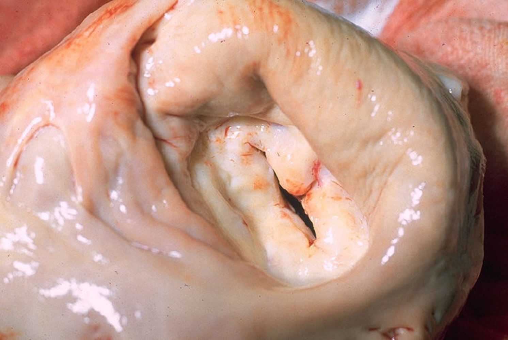
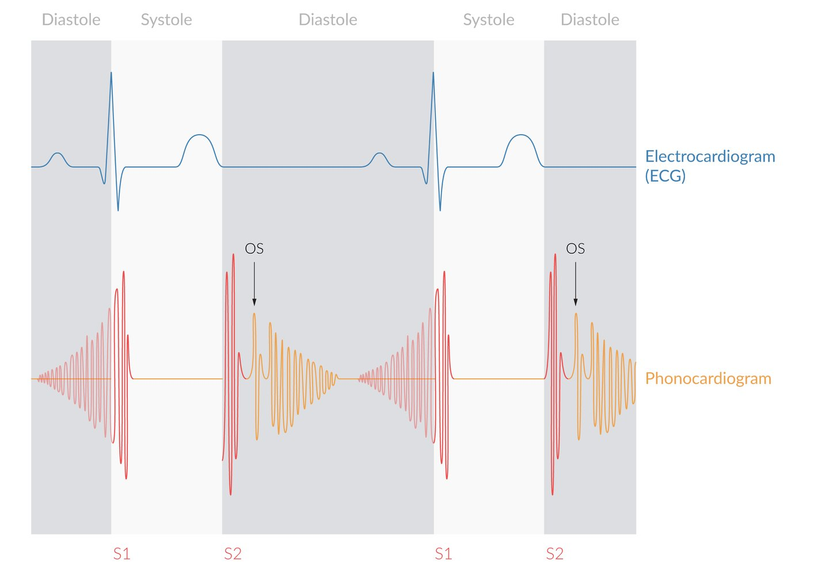
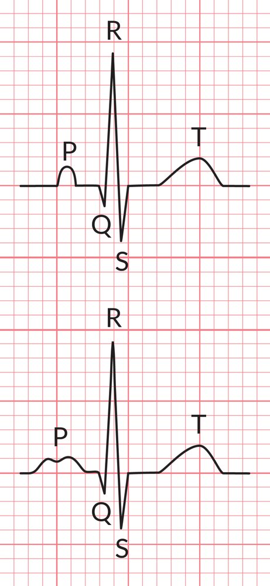

# Mitral valve stenosis

*Categories: Clinical knowledge > Internal medicine > Cardiology and angiology > Valvular heart diseases > Mitral valve stenosis*

[Original Article Link](https://coursology-qbank.com/amboss/article/tL0Xzg)

---

## Summary

Mitral stenosis (MS) is a structural anomaly of the <u>mitral valve</u> resulting in a decreased cross-sectional area of the valve. The stenosis impairs blood flow from the <u>left atrium</u> to the <u>left ventricle</u>, progressively causing left atrial distension, pulmonary venous congestion, <u>pulmonary hypertension</u>, and <u>congestive heart failure</u>. MS is most commonly a complication of <u>rheumatic fever</u> and is slowly progressive. Patients typically remain asymptomatic for years until the <u>mitral valve</u> area becomes critically reduced. Patients with severe stenosis often present with <u>atrial fibrillation</u> and <u>symptoms of heart failure</u> (<u>dyspnea</u>, fatigue, <u>orthopnea</u>). Asymptomatic patients are initially <u>managed conservatively</u> and the <u>mitral valve</u> is regularly monitored with <u>transthoracic echocardiography</u>. Once symptoms develop or the valve area decreases to 1.5 cm2, percutaneous <u>valvuloplasty</u> or surgical intervention may be considered. Occasionally, patients with MS have <u>heart failure</u> secondary to <u>tachycardia</u> or increased cardiac demand and require urgent medical management.

---

## Etiology

* Most commonly due to <u>rheumatic fever</u>

* Calcification of the <u>mitral valve</u> annulus

* Autoimmune diseases: <u>systemic lupus erythematosus</u>, <u>rheumatoid arthritis</u>

* Congenital

* Some conditions may mimic mitral stenosis: bacterial <u>endocarditis</u> of the <u>mitral valve</u> with large vegetation, left <u>atrial myxoma</u>

* Degenerative <u>aortic stenosis</u>

---

## Pathophysiology

* <u>Mitral valve</u> stenosis → obstruction of blood flow into the <u>left ventricle</u> (LV) → limited <u>diastolic</u> filling of the LV (↓ end-<u>diastolic</u> LV volume) → decreased <u>stroke volume</u> → decreased <u>cardiac output</u> (forward <u>heart failure</u>)

* <u>Mitral valve</u> stenosis → increase in left atrial pressure → backup of blood into <u>lungs</u> → increased pulmonary <u>capillary</u> pressure → <u>cardiogenic pulmonary edema</u> → <u>pulmonary hypertension</u> → backward <u>heart failure</u> and <u>right ventricular hypertrophy</u>

Mitral stenosis

---

## Clinical features

### Symptoms [[2]](https://coursology-qbank.com/amboss/article/35YSPp)

Patients with MS typically progress over many years from being asymptomatic to having symptoms of profound <u>heart failure</u>. Acute symptoms may occur in patients with <u>tachyarrhythmias</u> or an increased <u>cardiac output</u> secondary to <u>pregnancy</u>, <u>sepsis</u>, or exercise.

* <u>Dyspnea</u>

* Fatigue

* <u>Hoarseness</u>

* <u>Dysphagia</u>

* <u>Palpitations</u>

* Symptoms of embolic disease (e.g., <u>stroke</u>, <u>mesenteric</u> <u>ischemia</u>)

* Later stages

* <u>Symptoms of right heart failure</u>

* <u>Paroxysmal nocturnal dyspnea</u>

* <u>Orthopnea</u>

* <u>Hemoptysis</u>

### Examination findings [[2]](https://coursology-qbank.com/amboss/article/35YSPp)

* Mitral facies

* Sequelae of embolic disease (e.g., <u>focal neurologic deficits</u>, cool and <u>cyanotic</u> extremity)

* Irregular <u>heart</u> rhythm secondary to <u>atrial fibrillation</u>

* <u>Clinical features of right heart failure</u>, e.g., lower limb <u>pitting edema</u> , bibasilar <u>rales</u>

* <u>Auscultation</u> (see “<u>Auscultation in valvular defects</u>”)

* <u>Diastolic</u> <u>murmur</u> heard best at the 5th left <u>intercostal space</u> at the <u>midclavicular line</u> (the apex)

* Loud <u>first heart sound</u> (<u>S1</u>)

* Opening snap

* A high frequency, early to middiastolic sound, heard after <u>S2</u>

* Occurs when mitral leaflet motion suddenly stops during <u>diastole</u> because the stenosed valve has reached its maximum opening

* A shorter interval between <u>S2</u> and <u>opening snap</u> indicates more severe disease; occurs because left atrial pressure is greater than <u>left ventricular end-diastolic pressure</u> (<u>LVEDP</u>).

Mitral Stenosis (MS) - Heart Auscultation - Episode 3

Cardiovascular Examination - Clinical Examination of the Heart

Heart murmur in mitral stenosis

Pitting edema of lower leg

Fine Crackles (Rales) - Lung Auscultation - Episode 2

---

## Diagnosis

### Approach [[1]](https://coursology-qbank.com/amboss/article/-FXDk-)

* All patients with suspected mitral stenosis should undergo <u>transthoracic echocardiography</u> (<u>TTE</u>).

* <u>TTE</u> is the best initial test to evaluate the <u>mitral valve</u> and quantify the anatomical extent of the stenosis.

* Discordance between the patient's symptoms and the <u>echocardiographic</u> classification of the disease should prompt further testing.

* <u>Chest x-ray</u> and <u>ECG</u> may show characteristic changes depending on the stage and extent of disease.

* <u>Laboratory studies</u> are typically nonspecific, although they may support a diagnosis of associated <u>heart failure</u>.

### Initial evaluation

#### <u>Transthoracic echocardiography</u> (<u>TTE</u>) [[3]](https://coursology-qbank.com/amboss/article/R9XlMZ0)[[4]](https://coursology-qbank.com/amboss/article/Q9XuMZ0)

* <u>TTE</u> is the most important test for diagnosing and guiding the <u>treatment of mitral stenosis</u>.

* Characteristic findings include:

* Reduced <u>mitral valve</u> area (MVA): ≤ 1.5 cm2 is considered to be severe MS

* Thickened, calcified leaflets with commissural fusion

* Increased mean <u>diastolic</u> pressure gradient across the <u>mitral valve</u>

* Secondary cardiac changes, including:

* RV dilation

* LA enlargement

* Evidence of <u>pulmonary hypertension</u>

* MVA, valve pressure gradient, and presence or absence of symptoms and <u>pulmonary artery hypertension</u> are used to grade the severity of disease.

#### <u>ECG</u> [[5]](https://coursology-qbank.com/amboss/article/fyXke00)

* Often normal

* Characteristic findings include:

* <u>Left atrial enlargement</u>/<u>P mitrale</u>

* <u>Atrial fibrillation</u>

* <u>Right ventricular hypertrophy</u> (e.g., <u>right axis deviation</u>, dominant R wave in lead V1)

P mitrale 

Atrial fibrillation with rapid ventricular response

#### <u>Chest x-ray</u> (PA and <u>lateral</u> views) [[6]](https://coursology-qbank.com/amboss/article/x9XEpZ0)

* <u>Left atrial enlargement</u>

* The main <u>bronchi</u> appear elevated and have > 90% angulation (splayed).

* Straightening or convexity of the left cardiac border

* Double density sign

* <u>X-ray</u> features of <u>pulmonary congestion</u>

* <u>X-ray features of right ventricular enlargement</u>  [[7]](https://coursology-qbank.com/amboss/article/KxXUxZ0)

Enlarged left atrial appendage

#### Laboratory tests

* <u>BNP</u> or <u>NT-proBNP</u>: Levels increase in <u>proportion</u> to disease severity. [[8]](https://coursology-qbank.com/amboss/article/y9XdJZ0)

* <u>CBC</u>: <u>Leukocytosis</u> may indicate an underlying infectious (e.g., <u>infective endocarditis</u>) or inflammatory process.

* <u>BMP</u>: may demonstrate evidence of renal impairment  [[9]](https://coursology-qbank.com/amboss/article/gyXFe00)

* <u>Liver chemistries</u>: may show elevations secondary to <u>congestive hepatopathy</u>

* <u>CRP</u>: suggests ongoing inflammation in <u>rheumatic heart disease</u>  [[10]](https://coursology-qbank.com/amboss/article/TyX6e00)

### Additional evaluation [[1]](https://coursology-qbank.com/amboss/article/-FXDk-)

Further studies are indicated in select patients when <u>TTE</u> findings are unclear or do not correlate with symptoms, or when an intervention is planned.

#### <u>Transesophageal echocardiography</u> (<u>TEE</u>)

* Indicated to confirm the diagnosis if <u>TTE</u> examination is technically suboptimal

* Used prior to intervention to identify:

* Intracardiac <u>thrombus</u>

* Significant <u>mitral regurgitation</u>

#### <u>Stress</u> testing [[11]](https://coursology-qbank.com/amboss/article/6xXjxZ0)

* Useful when symptoms do not correlate with <u>echocardiographic</u> findings, e.g.:

* <u>TTE</u> shows severe MS but the patient reports no symptoms

* Patient is symptomatic but <u>TTE</u> shows mild or moderate disease

* <u>Exercise stress testing</u> is preferred over <u>pharmacological stress testing</u>.

#### <u>Cardiac catheterization</u>

* Indicated if other conditions (e.g., <u>diastolic dysfunction</u>, pulmonary disease) make staging unclear

* Can additionally:

* Quantify <u>pulmonary hypertension</u>, an important component of the treatment algorithm

* Identify <u>coronary artery disease</u> prior to planned surgical intervention

---

## Treatment

### Approach [[1]](https://coursology-qbank.com/amboss/article/-FXDk-)

The following recommendations are for rheumatic MS. For all other causes of MS, early consultation with cardiology is recommended as treatment can vary significantly.

* Initial management

* General cardiac care and serial TTEs until signs or symptoms of disease progression occur  [[12]](https://coursology-qbank.com/amboss/article/0CXeqZ0)

* In case of <u>acute heart failure</u>: immediate medical stabilizations and treatment of the precipitating cause

* Indications for interventional management include:

* Symptomatic MS

* MVA decreasing to < 1.5 cm2

* New-onset <u>pulmonary hypertension</u>

### Acute stabilization

* Abrupt onset of <u>acute heart failure</u> symptoms in patients with MS is usually secondary to <u>tachycardia</u> or increased <u>cardiac output</u>.

* Urgent cardiology consultation is recommended.

* Identify and treat the underlying cause, e.g., <u>sepsis</u> or <u>atrial fibrillation</u>.

* <u>Heart failure symptoms</u> are managed using standard therapy, e.g., <u>diuretics</u>.

* <u>Nitrates</u> may reduce <u>pulmonary congestion</u> but should be used with caution  (see “<u>Management of acute heart failure</u>” for further information and dosages). [[13]](https://coursology-qbank.com/amboss/article/qxXCxZ0)

> [!WARNING]
> Patients with mitral stenosis often develop <u>acute heart failure</u> following the onset of <u>atrial fibrillation</u>. Rapid and progressive treatment of <u>atrial fibrillation</u> is necessary in patients with severe mitral stenosis.

### <u>Conservative management</u>

Many patients with mild to moderate disease can be <u>managed conservatively</u> for years. Patients should remain under the care of cardiology with regular monitoring of valve function.

#### Serial <u>TTE</u> examinations [[1]](https://coursology-qbank.com/amboss/article/-FXDk-)

* Serial TTEs are performed to monitor the progression of MS and guide the timing of interventions.

* Patients typically do not develop symptoms until they have severe disease.

* Early detection prevents irreversible cardiac changes.

* Asymptomatic patients

* Every 3–5 years if MVA is > 1.5 cm2

* Every 1–2 years if MVA is 1–1.5 cm2

* Annually if MVA is < 1 cm2

* <u>TTE</u> should be repeated earlier if symptoms develop or change.

#### Optimizing medical therapy [[1]](https://coursology-qbank.com/amboss/article/-FXDk-)

* Patients should receive <u>guideline-directed medical therapy</u> (GDMT) for any concurrent <u>heart failure</u>.

* Screen for and treat all cardiac <u>risk factors</u>, e.g., <u>diabetes</u>, <u>hyperlipidemia</u>, and <u>hypertension</u>.

* Consider <u>heart rate</u> control (e.g., <u>beta blockers</u>) in younger patients in <u>sinus rhythm</u> with high resting or exercise-induced <u>heart rates</u>. 

* Decreasing the <u>heart rate</u> in patients with symptoms of mild to moderate <u>CHF</u> may improve cardiac symptoms.

* Consider one of the following agents: [[14]](https://coursology-qbank.com/amboss/article/tBXXc00)

* <u>Beta blockers</u>, e.g., <u>metoprolol</u> DOSAGE

* <u>Ivabradine</u> DOSAGE

* Treat <u>atrial fibrillation</u> with <u>rate control</u>.

> [!WARNING]
> Decreased <u>heart rate</u> may also limit <u>cardiac output</u> and cause <u>hypotension</u>; monitor patients carefully.

#### Anticoagulation

* Anticoagulation with a <u>vitamin K antagonist</u> (<u>VKA</u>) to a target <u>INR</u> of 2.5 is indicated if any of the following are present:  [[1]](https://coursology-qbank.com/amboss/article/-FXDk-)

* <u>Atrial fibrillation</u>

* History of embolic disease

* Intracardiac <u>thrombus</u>

* Mechanical prosthetic <u>mitral valve</u>

* First 3–6 months after bioprosthetic <u>mitral valve</u> implantation

* It is controversial whether anticoagulation is indicated for patients with MS who do not have one of the above features.

* For dosages, see “<u>Anticoagulation in atrial fibrillation</u>”.

#### Additional measures

* <u>Infectious endocarditis</u> (IE) prophylaxis [[1]](https://coursology-qbank.com/amboss/article/-FXDk-)

* MS alone is not an indication for <u>IE prophylaxis</u>.

* <u>IE prophylaxis</u> is indicated for dental procedures in high-risk patients (e.g., previous IE) with MS.

* See “<u>Endocarditis prophylaxis</u>” for <u>antibiotic</u> selection and dosing.

* Management of <u>rheumatic heart disease</u>

* Patients with acute or recurrent <u>rheumatic fever</u> with cardiac involvement need long-term, daily, antistreptococcal prophylaxis.

* See “Prevention” in “<u>Rheumatic fever</u>” for further information and dosages.

### Interventional management

Patients with severe or symptomatic MS should be considered for intervention.

#### Indications

* Asymptomatic patients with MVA ≤ 1.5 cm2 and either of the following:

* <u>Pulmonary artery systolic pressure</u> > 50 mm Hg

* New-onset <u>atrial fibrillation</u>

* Symptomatic patients with:

* MVA ≤ 1.5 cm2

* MVA > 1.5 cm2 and hemodynamically significant MS on <u>stress</u> test

#### Procedures

* Percutaneous <u>mitral valve</u> <u>balloon commissurotomy</u> (PMBC) [[15]](https://coursology-qbank.com/amboss/article/RCXl7Z0)

* PMBC is the preferred intervention in most patients with severe MS.

* A balloon catheter is advanced percutaneously through the <u>mitral valve</u> and inflated to break open commissural stenosis and increase the <u>mitral valve</u> area.  [[15]](https://coursology-qbank.com/amboss/article/RCXl7Z0)[[16]](https://coursology-qbank.com/amboss/article/FBXgc00)

* The <u>Wilkins score</u> is used to determine eligibility.

* <u>Surgery</u>

* Surgical interventions include open <u>commissurotomy</u> and <u>mitral valve</u> (mechanical or bioprosthetic) replacement.

* Indications

* Unfavorable anatomy for PMBC

* Presence of <u>thrombus</u> in the <u>left atrium</u>

* Mixed valvular disease (e.g., severe <u>MR</u>, tricuspid disease)

* Contraindicated if there is a prohibitively high surgical risk

Wilkins morphology score for mitral valve stenosis

---

## Complications

* <u>Atrial fibrillation</u> → <u>thromboembolic events</u>

* Progressive congestion of the <u>lungs</u>, <u>pulmonary edema</u>, <u>pulmonary hypertension</u>

* <u>Congestive heart failure</u>

* Enlarged <u>left atrium</u> (rare) → esophageal compression, <u>recurrent laryngeal nerve</u> palsy

We list the most important complications. The selection is not exhaustive.

---