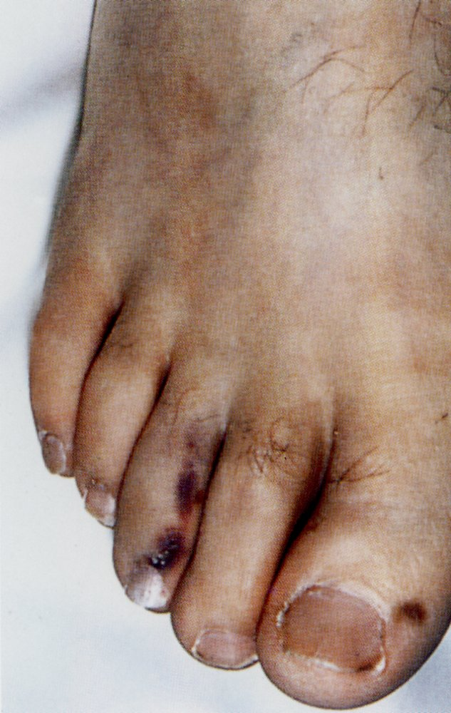
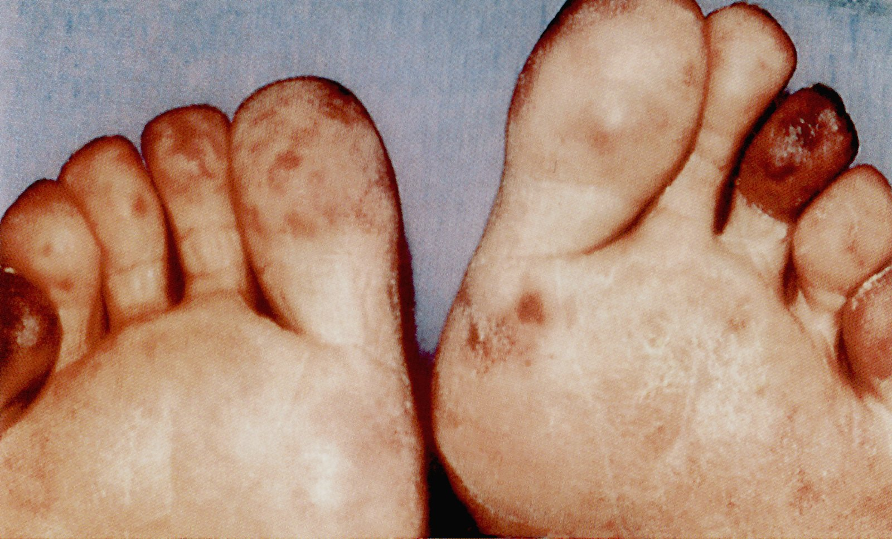
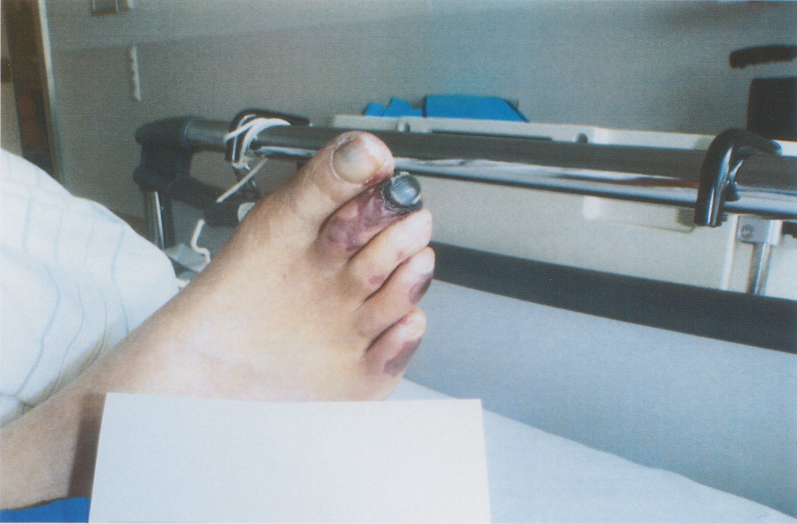
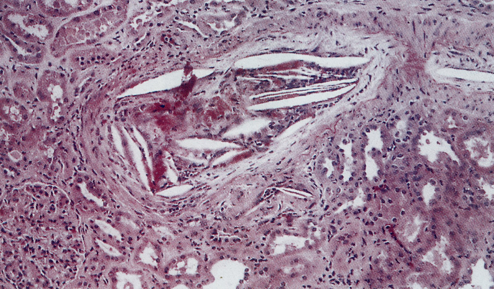
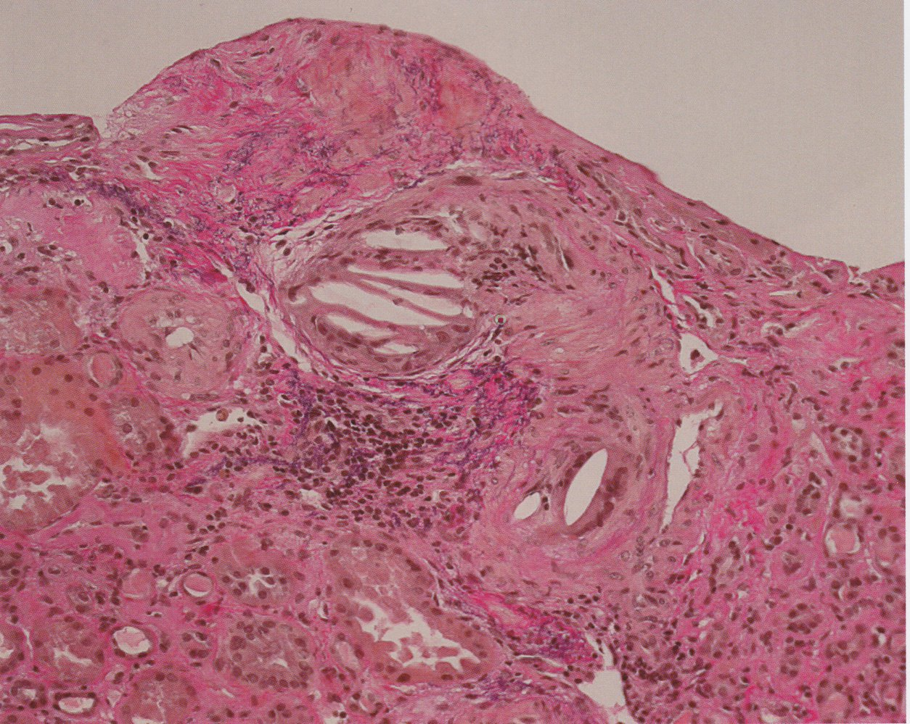

# Cholesterol embolization syndrome

*Categories: Clinical knowledge > Internal medicine > Cardiology and angiology > Vascular diseases > Cholesterol embolization syndrome*

[Original Article Link](https://coursology-qbank.com/amboss/article/Yu0np3)

---

## Summary

<u>Cholesterol</u> embolization syndrome is a condition in which <u>cholesterol</u> crystals dislodge from <u>atherosclerotic plaques</u> and enter the bloodstream, blocking small to medium <u>arteries</u> in various organs. <u>Incidence</u> is highest in older individuals with underlying <u>atherosclerosis</u>, particularly after invasive vascular procedures. Clinical features vary depending on the embolism location. Patients typically present with nonspecific systemic inflammatory symptoms and various types of <u>end-organ damage</u>, e.g., <u>acute renal failure</u>, <u>mesenteric</u> <u>ischemia</u>, peripheral <u>skin</u> manifestations (especially in the lower extremities), or <u>stroke</u>. The diagnosis is mostly clinical and may be supported by laboratory and imaging studies. Treatment primarily focuses on prevention of recurrence and includes <u>management of ASCVD</u> and removal of the embolic source, e.g., in patients with <u>abdominal aortic aneurysm</u>.

---

## Etiology

* <u>Iatrogenic</u> [[1]](https://coursology-qbank.com/amboss/article/q1YC3L)

* Vascular interventions, e.g., <u>percutaneous coronary intervention</u> (<u>PCI</u>) or <u>aortography</u>

* Abdominal aortic <u>surgery</u>, e.g., <u>abdominal aortic aneurysm repair</u>

* Cardiac <u>surgery</u>

* <u>Carotid revascularization</u>

* <u>Thrombolytic therapy</u> or <u>anticoagulant</u> therapy

* Traumatic

* Spontaneous <u>plaque</u> rupture (rare) [[1]](https://coursology-qbank.com/amboss/article/q1YC3L)

> [!TIP]
> Although thrombolytic and/or <u>anticoagulant</u> therapy are widely discussed as causes of <u>cholesterol</u> embolization syndrome, evidence is lacking. [[1]](https://coursology-qbank.com/amboss/article/q1YC3L)

---

## Pathophysiology

<u>Atherosclerosis</u> → rupture of <u>atherosclerotic plaque</u> (most commonly from the aorta) → blockage and inflammation of small to medium <u>arteries</u> by <u>cholesterol</u> crystals → formation of multiple small peripheral, muscular, or <u>visceral</u> <u>emboli</u> → <u>end-organ damage</u> [[1]](https://coursology-qbank.com/amboss/article/q1YC3L)

---

## Clinical features

### Signs of <u>end-organ damage</u> [[1]](https://coursology-qbank.com/amboss/article/q1YC3L)

The type of <u>end-organ damage</u> depends on the location of the <u>emboli</u>.

* Features of renal damage

* <u>Signs of acute kidney injury</u>

* <u>Signs of chronic kidney disease</u>

* <u>Hematuria</u>

* Peripheral <u>skin</u> manifestations 

* <u>Livedo reticularis</u>

* <u>Necrosis</u>

* <u>Purpura</u>

* <u>Cyanosis</u>

* <u>Ulceration</u>

* Blue toe syndrome: <u>ischemia</u> due to small vessel occlusion that manifests as toe discoloration (pulses typically remain palpable as large <u>arteries</u> are unaffected)

* Signs of gastrointestinal involvement:  (e.g., <u>intestinal ischemia</u> or <u>pancreatitis</u>)

* Abdominal <u>pain</u>

* <u>Diarrhea</u>

* <u>GI bleeding</u>

* Signs of <u>CNS</u> involvement (e.g., <u>ischemic stroke</u> or <u>TIA</u>): Signs of diffuse <u>brain damage</u> (e.g., confusion, <u>memory</u> loss) are more common than <u>focal neurological deficits</u>. [[1]](https://coursology-qbank.com/amboss/article/q1YC3L)

* Signs of retinal involvement

* <u>Hollenhorst plaques</u> on retinal exam

* <u>Amaurosis fugax</u>

### Nonspecific systemic inflammatory symptoms [[1]](https://coursology-qbank.com/amboss/article/q1YC3L)

* <u>Fever</u>

* Fatigue

* <u>Myalgia</u>

* <u>Anorexia</u> and weight loss

Toe necrosis

Toe necrosis

Toe necrosis

---

## Diagnosis

Diagnosis should be suspected in patients with a combination of <u>end-organ damage</u>, inflammatory response, and a history of <u>atherosclerosis</u>, especially in those with recent vascular intervention or <u>surgery</u>.

* Routine <u>laboratory studies</u>: Findings are nonspecific. [[1]](https://coursology-qbank.com/amboss/article/q1YC3L)[[2]](https://coursology-qbank.com/amboss/article/nyb7fw)

* <u>CBC with differential</u>

* <u>Leukocytosis</u>, <u>eosinophilia</u>

* <u>Anemia</u>

* <u>Thrombocytopenia</u>

* <u>Inflammatory markers</u>: ↑ <u>CRP</u>, ↑ <u>ESR</u>, hypocomplementemia

* <u>Renal function tests</u>: ↑ <u>BUN</u>, ↑ <u>creatinine</u>

* Urine studies: <u>proteinuria</u>, <u>hematuria</u>, <u>eosinophiluria</u>  [[3]](https://coursology-qbank.com/amboss/article/k71mNR0)

* Imaging

* Imaging of the affected organ showing multiple vessel occlusions can support the diagnosis.

* <u>TEE</u>, <u>MRA</u>, or <u>CTA</u> of the aorta may identify the source of atheroembolism. [[2]](https://coursology-qbank.com/amboss/article/nyb7fw)[[4]](https://coursology-qbank.com/amboss/article/fs1k8R0)

* <u>Biopsy</u> (of <u>skin</u>, muscle, or affected end-organ) [[2]](https://coursology-qbank.com/amboss/article/nyb7fw)

* Only definitive test; not routinely performed

* Findings include:

* Amorphous, eosinophilic material in the vessel lumen

* Spindle-shaped spaces (<u>cholesterol</u> clefts)

> [!TIP]
> The diagnosis of <u>cholesterol</u> embolization syndrome is mostly clinical and may be supported by laboratory and imaging studies.

Renal cholesterol emboli

Renal cholesterol emboli

---