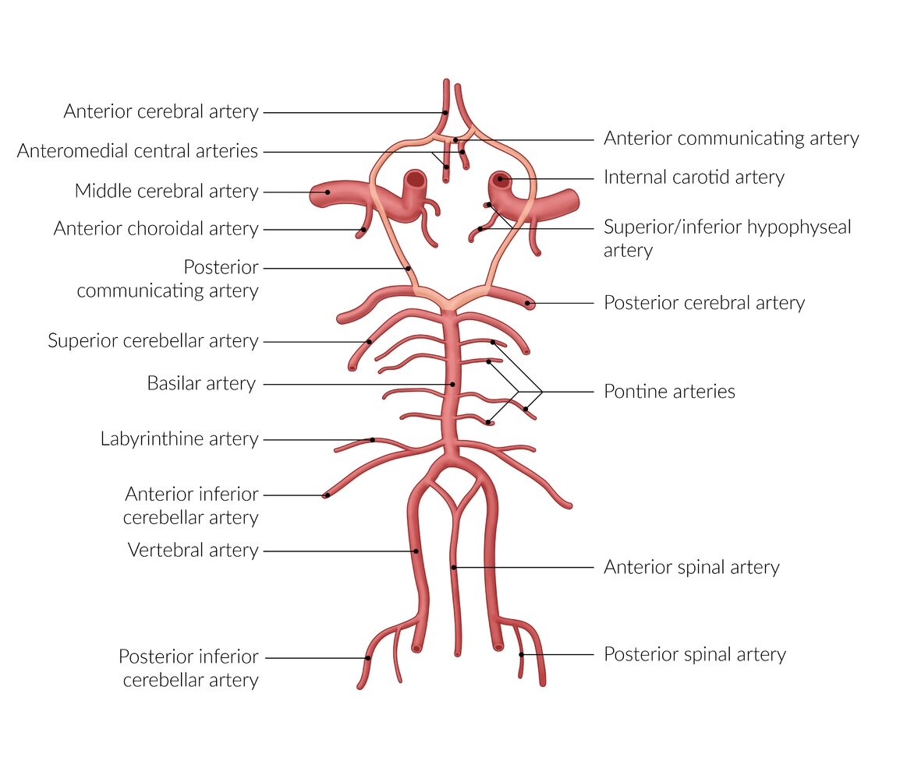
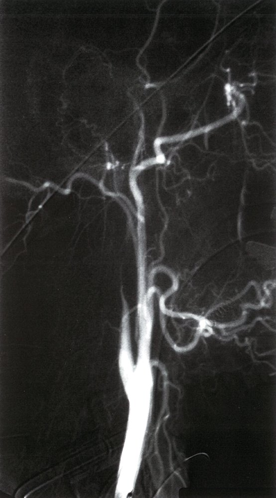

# Dissection of the carotid and the vertebral arteries

*Categories: Clinical knowledge > Internal medicine > Cardiology and angiology > Vascular diseases > Dissection of the carotid and the vertebral arteries*

[Original Article Link](https://coursology-qbank.com/amboss/article/Pi0W7f)

---

## Summary

<u>Dissection of the carotid</u> or <u>vertebral arteries</u> (collectively known as the cervical <u>arteries</u>) refers to the separation of the <u>tunica media</u> and <u>tunica intima</u> of a vessel. Cervical <u>artery</u> dissection can cause stenosis, <u>thrombosis</u>, or <u>distal</u> embolization. Most affected individuals are adults. Cervical <u>artery</u> dissections may occur after major trauma (e.g., <u>motor vehicle crashes</u>) or minor events (e.g., sneezing) and typically manifest with a <u>headache</u>, which may be followed by <u>ischemic</u> features (e.g., <u>stroke</u>) a few hours or days later. <u>CT angiography</u> (<u>CTA</u>) or <u>MR angiography</u> (<u>MRA</u>) of the head and neck is used to establish the diagnosis. Management is based on clinical presentation and includes <u>antithrombotic agents</u> for most patients, <u>thrombolysis</u> for patients with signs of <u>ischemic stroke</u>, and <u>surgery</u> in selected cases. Complications include recurrent <u>stroke</u> and/or dissection, delayed formation of a dissecting <u>aneurysm</u>, and complications associated with <u>ischemic stroke</u>.

For traumatic neck injuries, see “<u>Penetrating neck trauma</u>,” “<u>Blunt neck trauma</u>,” and “<u>Soft tissue injuries of the head and neck</u>.”

---

## Epidemiology

* Mean age

* Carotid <u>artery</u>: 40–45 years [[1]](https://coursology-qbank.com/amboss/article/ywXdlZ0)

* <u>Vertebral artery</u>: 40 years [[2]](https://coursology-qbank.com/amboss/article/AwXRlZ0)

* Important causes of <u>stroke</u> in young patients

* Occurrence: <u>Dissection of the carotid artery</u> occurs more frequently than <u>dissection of the vertebral artery</u> (∼ 4:1). [[3]](https://coursology-qbank.com/amboss/article/_wX5lZ0)

Epidemiological data refers to the US, unless otherwise specified.

---

## Etiology

* Triggers [[4]](https://coursology-qbank.com/amboss/article/AN1Rdh0)

* Penetrating or <u>blunt trauma</u>, e.g.:

* <u>Motor vehicle crashes</u>

* Mild trauma (e.g., falls)

* Minor events (e.g., <u>coughing</u>, sneezing, chiropractic maneuvers, heavy lifting)

* Playing sports (e.g., volleyball, basketball)

* Sexual intercourse

* <u>Childbirth</u>

* <u>Posterior</u> oropharyngeal injury (especially in children)

* <u>Risk factors</u>

* <u>Ehlers-Danlos syndrome</u>

* <u>Marfan syndrome</u>

* <u>Fibromuscular dysplasia</u>

* <u>Hypertension</u>

* <u>Cystic medial necrosis</u>

* Respiratory tract infection

* <u>Oral contraceptive</u> use

---

## Clinical features

### Dissection of the carotid artery

* Nonischemic features 

* <u>Ipsilateral</u> <u>headache</u>;   and facial/<u>neck pain</u> (constant, severe, throbbing or sharp)

* <u>Partial Horner syndrome</u>: <u>ptosis</u> and <u>miosis</u>

* <u>Pulse</u>-synchronous <u>tinnitus</u>

* Neck swelling

* Reduced <u>taste</u> sensation

* <u>Cranial nerve lesions</u>, usually <u>caudal</u> nerves (VI–XII)

* <u>Ischemic</u> features 

* Symptomatic <u>middle cerebral artery</u> <u>infarction</u> (see “<u>Stroke</u>”)

* <u>Amaurosis fugax</u> (<u>ischemic</u> <u>retina</u>)

### Dissection of the vertebral artery

* Nonischemic features

* Occipital <u>headache</u>

* <u>Posterior</u> nuchal <u>pain</u>

* <u>Ischemic</u> features: <u>vertebrobasilar insufficiency</u> (leads to <u>stroke</u> resembling <u>lateral</u> medullary dysfunction, e.g., <u>Wallenberg syndrome</u>) 

* <u>Ipsilateral</u> loss of <u>taste</u> and facial <u>pain</u> and numbness (most common symptom)

* <u>Contralateral</u> <u>pain</u> relief and reduced <u>temperature sensation</u>

* <u>Vertigo</u>

* <u>Ataxia</u>

* Central <u>Horner syndrome</u>

* <u>Dysphagia</u> and <u>dysarthria</u> or <u>hoarseness</u>

* <u>Nausea</u>, <u>vomiting</u>

Arterial supply of a spinal segment

Circle of Willis

> [!NOTE]
> Carotid or <u>vertebral artery dissection</u> is the separation of the <u>tunica media</u> and <u>tunica intima</u> of a vessel. This can lead to <u>thrombosis</u> of the false lumen, which can, in turn, lead to stenoses or embolisms with the risk of <u>stroke</u>.

---

## Diagnosis

> [!WARNING]
> Obtain emergency <u>neuroimaging</u>, e.g., CT head without contrast, for all patients with <u>signs of acute ischemic stroke</u> to rule out <u>intracranial hemorrhage</u>.

### Approach [[5]](https://coursology-qbank.com/amboss/article/Bfdzo60)

* Perform a clinical evaluation, including a <u>neurological examination</u>.

* <u>Signs of acute ischemic stroke</u>: See “<u>Initial management of acute stroke</u>.”

* Absence of <u>ischemic</u> features: Obtain <u>MRA</u> or <u>CTA</u> head and neck.

* Consult <u>neurology</u> and/or vascular <u>surgery</u> for:

* Further diagnostics, e.g., <u>angiography</u> for patients with ongoing clinical concerns and negative <u>MRA</u> or <u>CTA</u> head and neck

* Consideration of interfacility transfer (e.g., tertiary care facility)

* For patients with dissection, consider evaluation for <u>connective tissue disease</u> or <u>fibromuscular dysplasia</u> based on clinical suspicion.

> [!TIP]
> Obtain a detailed history of triggers and nonischemic features, as cervical <u>artery</u> dissection can be difficult to diagnose in the absence of <u>ischemic</u> symptoms. [[4]](https://coursology-qbank.com/amboss/article/AN1Rdh0)

### Imaging [[5]](https://coursology-qbank.com/amboss/article/Bfdzo60)[[6]](https://coursology-qbank.com/amboss/article/tGXXa-)[[7]](https://coursology-qbank.com/amboss/article/XTd9660)

#### <u>MRA</u> and <u>CTA</u> [[5]](https://coursology-qbank.com/amboss/article/Bfdzo60)

* First-line imaging studies to evaluate for cervical dissections 

* <u>CTA</u> head and neck

* <u>MRA</u> head and neck

* Findings

* Irregular and asymmetrical vessels

* <u>Intimal flap</u>

* Intramural <u>hematoma</u>

* Double lumen

* Dissecting <u>aneurysm</u>

* Tapering stenosis or occlusion

#### <u>Angiography</u>  [[7]](https://coursology-qbank.com/amboss/article/XTd9660)

<u>Angiography</u> is the most accurate imaging option for assessing degree of stenosis, but it is not suitable for screening due to the periprocedural risk of <u>iatrogenic</u> dissection and <u>stroke</u>. [[5]](https://coursology-qbank.com/amboss/article/Bfdzo60)

* Flame-shaped tapering of the vessel

* <u>Intimal flap</u>

* Double lumen

Internal carotid artery dissection

#### <u>Duplex ultrasonography</u> [[7]](https://coursology-qbank.com/amboss/article/XTd9660)

<u>Duplex ultrasonography</u> is of limited diagnostic value, as it is highly operator-dependent and may miss high cervical dissections. [[5]](https://coursology-qbank.com/amboss/article/Bfdzo60)

* Double lumen on <u>B-mode</u>

* Echodense material within the lumen

* High-resistance flow pattern or absence of flow on <u>Doppler ultrasound</u>

---

## Treatment

### Approach [[5]](https://coursology-qbank.com/amboss/article/Bfdzo60)

* <u>Signs of acute ischemic stroke</u>: Treat as <u>ischemic stroke</u> (see “<u>Initial management of acute stroke</u>”).

* Absence of <u>ischemic</u> features or following <u>stroke</u> treatment:

* Consult vascular <u>surgery</u> and/or neurosurgery for possible invasive treatment (e.g., <u>mechanical thrombectomy</u>, <u>stenting</u>)

* Initiate <u>antithrombotic therapy</u> (e.g., antiplatelet, anticoagulation) with specialist consultation.

> [!WARNING]
> Rule out <u>intracranial hemorrhage</u> before initiating any treatment.

> [!TIP]
> Perform baseline monitoring parameters (e.g., <u>INR</u>, <u>PT</u>, <u>PTT</u>) before administering <u>anticoagulant</u> therapy.

### <u>Antithrombotic therapy</u> [[5]](https://coursology-qbank.com/amboss/article/Bfdzo60)[[8]](https://coursology-qbank.com/amboss/article/wlch_c0)

The choice of agent and duration of therapy are based on patient factors and usually determined by a specialist.

* Duration: typically 3–6 months

* Patients with low bleeding risk

* <u>Parenteral anticoagulation</u> (e.g., with <u>heparin</u>) followed by oral anticoagulation

* OR <u>dual antiplatelet therapy</u> (<u>DAPT</u>)

* Patients with moderate bleeding risk

* <u>DAPT</u>

* OR antiplatelet monotherapy

### Invasive treatment [[5]](https://coursology-qbank.com/amboss/article/Bfdzo60)

Decisions on invasive treatments are made on an individual basis and by specialists; options include:

* Acute <u>mechanical thrombectomy</u> or <u>stenting</u>

* Subacute <u>angioplasty</u> and <u>stenting</u>

> [!TIP]
> Most asymptomatic <u>pseudoaneurysms</u>, which commonly follow dissection, do not require additional interventions. [[9]](https://coursology-qbank.com/amboss/article/ZTdZ660)

---