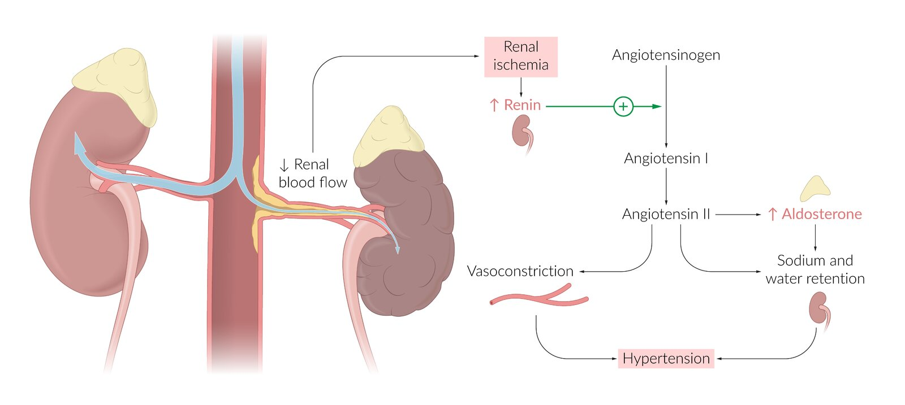
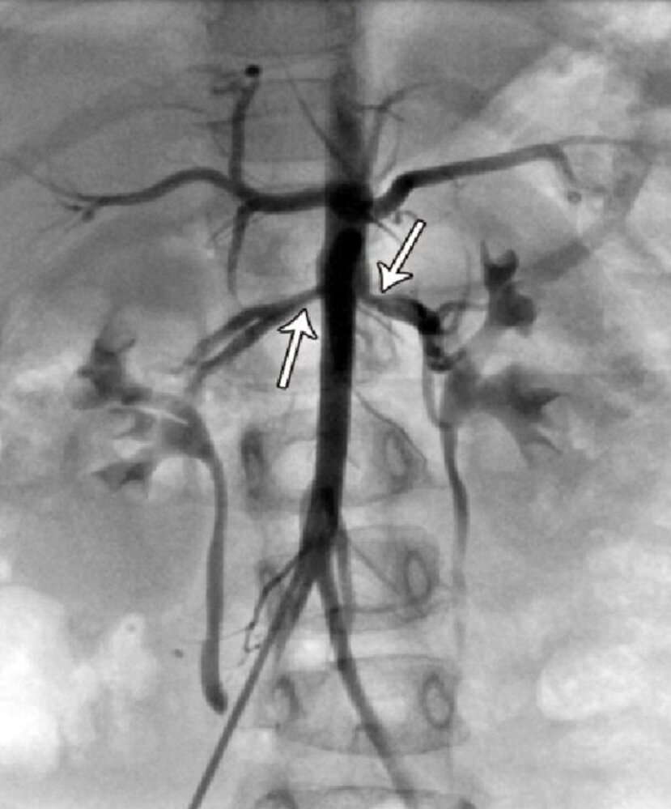
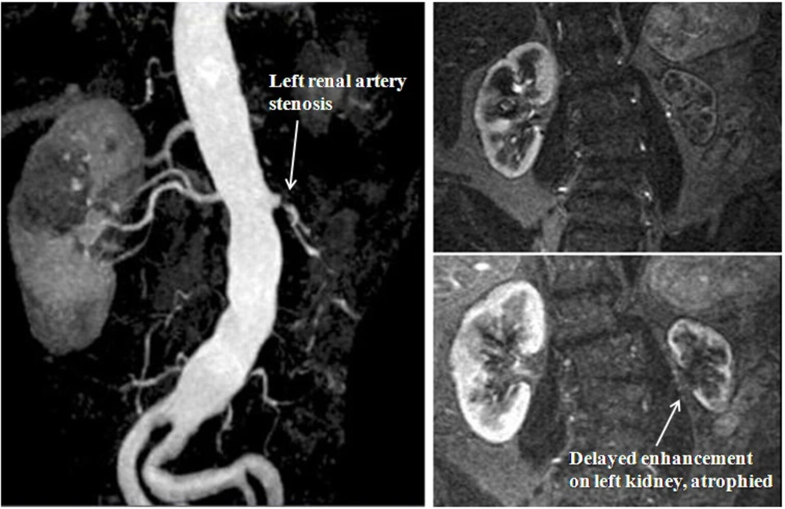
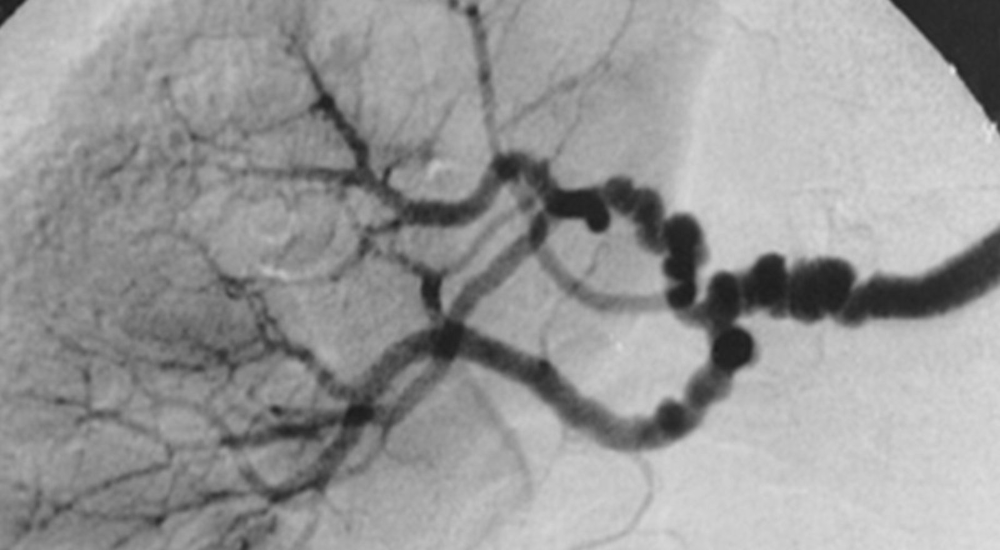
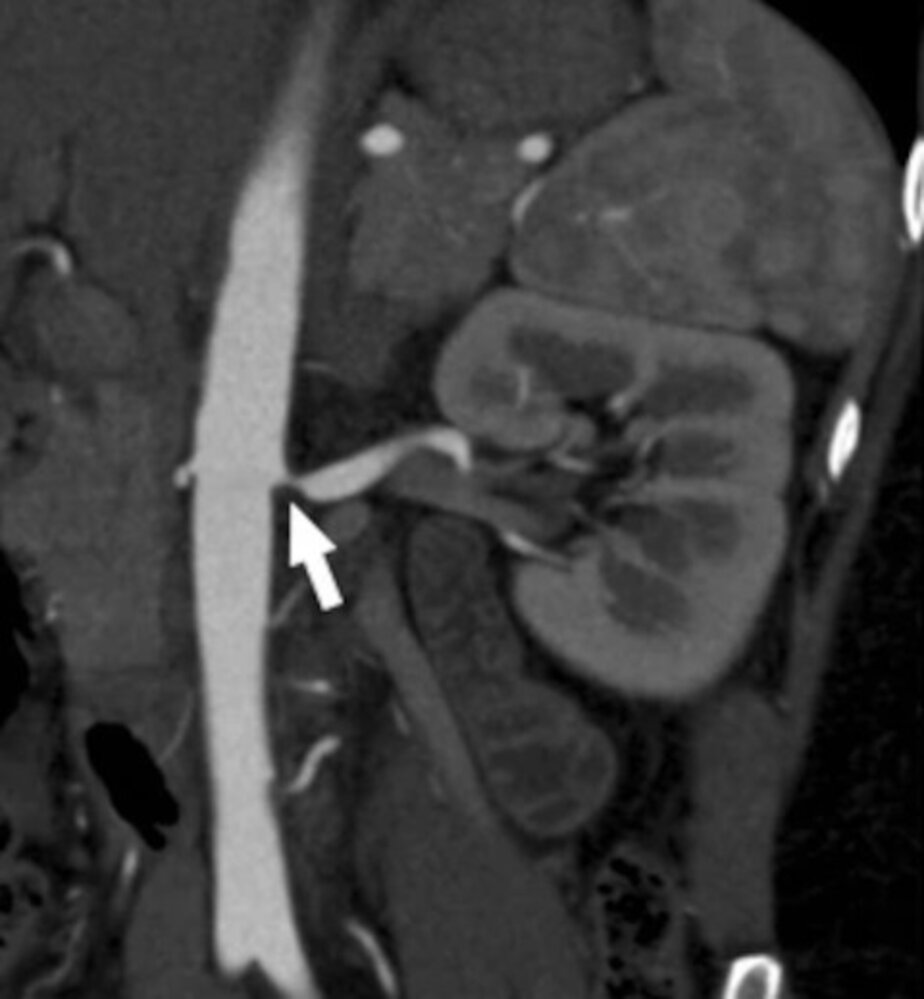
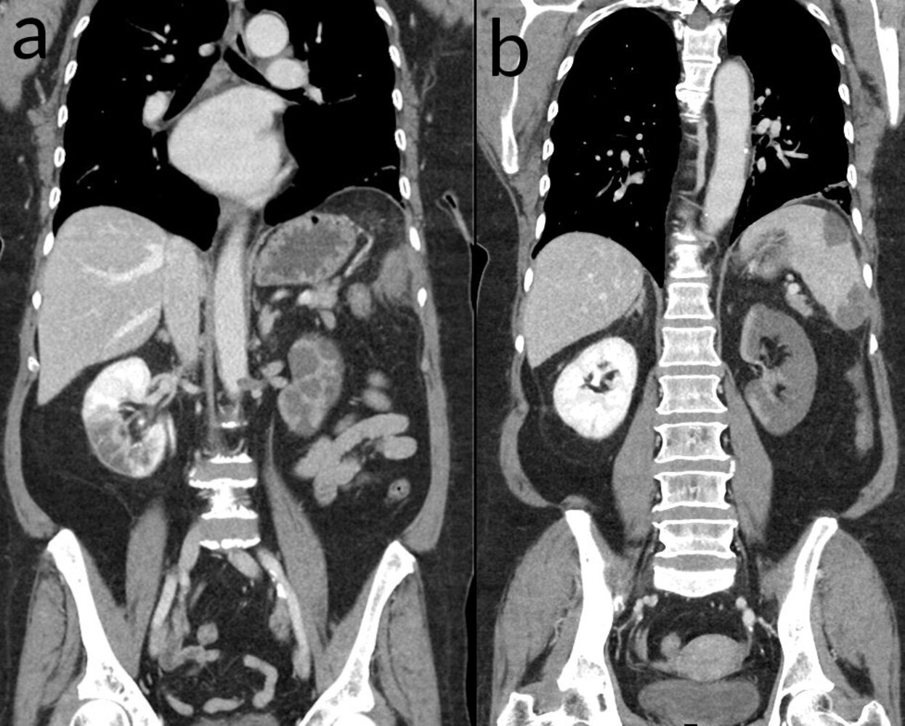

# Renal artery stenosis

*Categories: Clinical knowledge > Internal medicine > Cardiology and angiology > Vascular diseases > Renal artery stenosis*

[Original Article Link](https://coursology-qbank.com/amboss/article/q60CNS)

---

## Summary

<u>Renal artery</u> stenosis is the narrowing of one or both <u>renal arteries</u>. It is most commonly caused by <u>atherosclerosis</u>. In young women, <u>fibromuscular dysplasia</u> is an important underlying cause. Decreased <u>renal blood flow</u> due to <u>renal artery</u> stenosis causes activation of the <u>renin-angiotensin-aldosterone system</u>, which in turn results in <u>secondary hypertension</u>. <u>Physical examination</u> may reveal an abdominal <u>bruit</u>. Patients with progressive <u>renal artery</u> stenosis may develop <u>renal insufficiency</u> and renal <u>atrophy</u>. <u>Duplex ultrasonography</u> and/or <u>angiography</u> are used for screening and to confirm the diagnosis. Treatment of <u>renal artery</u> stenosis primarily consists of <u>antihypertensive therapy</u>, including <u>ACE inhibitors</u>, <u>angiotensin receptor blockers</u> (<u>ARBs</u>), <u>calcium channel blockers</u>, or <u>beta blockers</u>. <u>Antihypertensive therapy</u> may need to be continued indefinitely. Patients on <u>ACE inhibitors</u> or <u>ARBs</u> should be closely monitored for an increase in serum <u>creatinine</u>, especially if they have bilateral <u>renal artery</u> stenosis. Patients with <u>hemodynamically significant renal artery stenosis</u> may require <u>revascularization</u>. Treatment of the underlying cause is essential to prevent disease progression.

---

## Epidemiology

* Accounts for 1–10% of all <u>hypertension</u> cases [[1]](https://coursology-qbank.com/amboss/article/M1XMhC)

* 3–10% of pediatric cases of <u>secondary hypertension</u> have a renovascular etiology. [[2]](https://coursology-qbank.com/amboss/article/H1XKRC)

* Age and sex preponderance depend on the underlying cause (see “Etiology” below).

Epidemiological data refers to the US, unless otherwise specified.

---

## Etiology

* <u>Atherosclerosis</u> (∼ 90% of cases): occurs more often in men > 50 years of age; increased risk in smokers [[3]](https://coursology-qbank.com/amboss/article/bC0HqR)

* <u>Fibromuscular dysplasia</u> (∼ 10% of cases): mostly affects women < 50 years of age

* Other causes (∼ 1%) [[3]](https://coursology-qbank.com/amboss/article/bC0HqR)

* Improper surgical <u>anastomosis</u> after <u>renal transplantation</u>

* <u>Vasculitis</u> (e.g., <u>Takayasu arteritis</u>, <u>polyarteritis nodosa</u>, <u>Kawasaki disease</u>)

* Hereditary conditions (e.g., <u>neurofibromatosis type 1</u>)

* Extrinsic compression (e.g., <u>abdominal aortic aneurysm</u>, <u>retroperitoneal</u> tumors)

* Abdominal <u>radiation therapy</u>

---

## Pathophysiology

* Narrowing of one or both renal <u>arteries</u> → obstruction of renal blood flow → <u>ischemia</u> → <u>renin</u> release and activation of the <u>renin-angiotensin-aldosterone</u> system → <u>hyperreninemic</u> hyperaldosteronism (increased <u>renin</u> → increased angiotensin → increased <u>aldosterone</u>) → increased <u>sodium</u> retention and peripheral vascular resistance → renovascular hypertension (<u>secondary hypertension</u>) [[4]](https://coursology-qbank.com/amboss/article/N1X-SC)

* Prolonged renal <u>hypoperfusion</u> → chronic stimulation of the <u>juxtaglomerular apparatus</u> to secrete <u>renin</u> → <u>hyperplasia</u> of the <u>juxtaglomerular apparatus</u> [[5]](https://coursology-qbank.com/amboss/article/OfYImo)[[6]](https://coursology-qbank.com/amboss/article/lfYvmo)[[7]](https://coursology-qbank.com/amboss/article/b2aHTP)

* No improvement in renal blood flow → <u>ischemic</u> <u>renal injury</u> → <u>renal insufficiency</u> and progressive renal <u>atrophy</u> (unilateral or bilateral depending on laterality of RAS) [[3]](https://coursology-qbank.com/amboss/article/bC0HqR)

Renal artery stenosis

---

## Clinical features

* <u>Family history</u> of <u>hypertension</u> is often absent.

* <u>Hypertension</u>: severe (i.e., resistant to therapy) and/or early-onset (i.e, <u>hypertension</u> in individuals < 30 years of age) [[3]](https://coursology-qbank.com/amboss/article/bC0HqR)[[8]](https://coursology-qbank.com/amboss/article/B1YzQL)

* Abdominal <u>bruit</u> heard over the flank or epigastrium: present during both <u>systole</u> and <u>diastole</u> [[9]](https://coursology-qbank.com/amboss/article/270TOh)

* <u>Flash pulmonary edema</u>

* Features of <u>atherosclerosis</u> in other parts of the body (e.g., <u>peripheral artery disease</u>, <u>coronary artery disease</u>, <u>carotid stenosis</u>)

* Features of <u>renal insufficiency</u> (e.g., <u>nausea</u>, <u>edema</u>)

---

## Diagnosis

Imaging is required to confirm a clinical suspicion of <u>renal artery</u> stenosis. Laboratory findings may provide supportive evidence but are not diagnostic.

### Imaging [[8]](https://coursology-qbank.com/amboss/article/B1YzQL)[[10]](https://coursology-qbank.com/amboss/article/y1YdjL)

#### Indications

A high <u>pretest probability</u> for <u>renal artery</u> stenosis, as determined by the presence of ≥ 1 of the following features. [[8]](https://coursology-qbank.com/amboss/article/B1YzQL)

* Onset of <u>hypertension</u> before the age of 30 years

* Severe <u>hypertension</u> after the age of 55 years

* <u>Hypertension</u> resistant to a 3-drug antihypertensive regimen (<u>resistant HTN</u>)

* New-onset or worsening of renal dysfunction (↑ serum <u>creatinine</u>) after initiating <u>ACE inhibitors</u> or <u>ARBs</u>
* <u>ACE inhibitors</u> and <u>ARBs</u> can induce or worsen <u>renal insufficiency</u>, particularly in patients with severe bilateral <u>renal artery</u> stenosis or high-grade unilateral stenosis. [[11]](https://coursology-qbank.com/amboss/article/26XT4_)

* Acute worsening of previously controlled <u>hypertension</u>

* <u>Hypertension</u> with acute <u>end-organ damage</u> (<u>hypertensive emergency</u>)

* Unexplained renal <u>atrophy</u> or asymmetry of > 1.5 cm between the <u>kidneys</u>

* Unexplained acute <u>pulmonary edema</u>

#### Modalities [[8]](https://coursology-qbank.com/amboss/article/B1YzQL)[[10]](https://coursology-qbank.com/amboss/article/y1YdjL)[[11]](https://coursology-qbank.com/amboss/article/26XT4_)

The choice of modality depends on the presence and severity of renal dysfunction. Consider a nephrology and/or radiology consult in patients with significant renal dysfunction (<u>eGFR</u> < 30 mL/min/1.73 m2) to help guide this decision.

* First-line (screening) tests

* Renal dysfunction present: <u>duplex ultrasonography</u> (US) or <u>MR angiography</u> without contrast

* Normal or near-normal renal function: <u>duplex US</u>, <u>CT angiography</u>, or <u>MR angiography</u> with <u>gadolinium</u> contrast

* Second-line test: <u>catheter angiography</u> (diagnostic <u>gold standard</u>) [[12]](https://coursology-qbank.com/amboss/article/bIXHYz)

* Consider if the index of suspicion for <u>renal artery</u> stenosis is high despite inconclusive noninvasive imaging

* Disadvantages

* Invasive modality associated with procedural complications, including radiation exposure

* Risk of <u>contrast-induced nephropathy</u>

* Additional imaging (not recommended for establishing a diagnosis) [[10]](https://coursology-qbank.com/amboss/article/y1YdjL)

* Consider <u>captopril</u> <u>renal scintigraphy</u> to assess renal function.

* <u>Renal vein</u> <u>renin</u> measurement can help lateralize the most affected <u>kidney</u> (the <u>ischemic</u> <u>kidney</u> secretes higher levels of <u>renin</u> compared to the normal or less affected <u>kidney</u>).

> [!WARNING]
> In patients with renal dysfunction, there is a risk of <u>contrast-induced nephropathy</u> with CT/<u>catheter angiography</u> and a risk of <u>nephrogenic systemic fibrosis</u> with <u>MR angiography</u> with <u>gadolinium</u> contrast.

#### Findings

* Increased systolic flow <u>velocity</u> in the <u>renal artery</u> (on <u>duplex US</u>) [[10]](https://coursology-qbank.com/amboss/article/y1YdjL)

* Segmental narrowing of one or both <u>renal arteries</u>

* Stenotic segment(s) can be complete or partial and solitary or multiple.

* Hemodynamically significant renal artery stenosis [[13]](https://coursology-qbank.com/amboss/article/dIXobz)[[14]](https://coursology-qbank.com/amboss/article/CsXqCz)

* ≥ 70% narrowing of the <u>renal artery</u> diameter on imaging

* Or a 50–69% narrowing of the <u>renal artery</u> diameter with evidence of increased renal arterial pressures, such as: 

* Translesional systolic pressure gradient of ≥ 20 mm Hg

* <u>Mean pressure gradient</u> ≥ 10 mm Hg

* The site of <u>renal artery</u> stenosis differs according to the underlying etiology.

* <u>Proximal</u> 1/3rd: typically due to atherosclerotic disease [[15]](https://coursology-qbank.com/amboss/article/m1XVhC)

* <u>Distal</u> 2/3rdswith stenotic segments alternating with <u>aneurysms</u> (“string of beads” appearance): typically seen in <u>fibromuscular dysplasia</u>  [[16]](https://coursology-qbank.com/amboss/article/51XihC)

* <u>Ipsilateral</u> renal <u>atrophy</u> (decrease in <u>kidney</u> size)   [[15]](https://coursology-qbank.com/amboss/article/m1XVhC)

Bilateral renal artery stenosis

Left renal artery stenosis

String of beads sign in fibromuscular dysplasia

Renal artery stenosis

> [!TIP]
> Patients with <u>hemodynamically significant renal artery stenosis</u> may require <u>revascularization</u> procedures to control <u>hypertension</u>.

### <u>Laboratory studies</u>

* <u>BMP</u>

* Evidence of <u>renal insufficiency</u>

* <u>Hypokalemia</u> (uncommon)  [[17]](https://coursology-qbank.com/amboss/article/XIX9Yz)[[18]](https://coursology-qbank.com/amboss/article/cIXabz)

* <u>Urinalysis</u>: <u>Proteinuria</u> may be present.

* Tests to identify the underlying cause: See “Etiology.”

---

## Renal infarction

<u>Renal infarction</u> refers to the acute loss of blood supply to the renal <u>parenchyma</u> resulting in <u>necrosis</u> and loss of <u>kidney function</u>.

### Etiology

<u>Renal infarction</u> is usually caused by <u>thromboemboli</u> or in situ <u>thrombosis</u> with any of the following etiologies:

* <u>Idiopathic</u> cause

* Cardiovascular disease: <u>atrial fibrillation</u>, <u>endocarditis</u>, valvular or <u>ischemic heart disease</u>

* <u>Renal artery</u> disease: <u>renal artery</u> dissection, <u>Marfan syndrome</u>, <u>polyarteritis nodosa</u>, <u>fibromuscular dysplasia</u>

* <u>Hypercoagulable states</u>: <u>antiphospholipid syndrome</u>, <u>polycythemia vera</u>, <u>factor V Leiden</u>

### Clinical features

* <u>Fever</u>

* Acute onset flank or abdominal <u>pain</u>

* <u>Nausea and vomiting</u>

* Increased blood pressure

* <u>Oliguria</u>

### Diagnostics

Diagnosis is based on the presence of clinical features. Imaging confirms the diagnosis.

* <u>Laboratory studies</u>

* <u>CBC</u>: <u>leukocytosis</u>

* Serum: ↑ <u>creatinine</u> and <u>lactate dehydrogenase</u>

* <u>Urinalysis</u> and culture: frank or <u>microscopic hematuria</u> and <u>proteinuria</u> without casts

* Imaging studies (confirmatory)

* Abdominal <u>CT scan</u>

* <u>CT without contrast</u> is the preferred initial study (to rule out <u>urolithiasis</u>).

* <u>CT angiogram</u> if there are no signs of <u>urolithiasis</u> or <u>pyelonephritis</u> to evaluate for <u>infarction</u>: characteristically shows a wedge-shaped <u>perfusion</u> defect

* <u>Color Doppler ultrasound</u>: decreased or absent blood flow

* Other: Assess for cardiovascular causes.

* <u>Electrocardiography</u>

* <u>Echocardiography</u>

Renal and splenic infarction

### Differential diagnoses

* <u>Urolithiasis</u>

* <u>Pyelonephritis</u>

### Treatment

* <u>Antihypertensive therapy</u> (e.g., <u>ACE inhibitors</u>, <u>ARBs</u>)

* Anticoagulation (e.g., <u>direct oral anticoagulants</u>, <u>warfarin</u>)

* Percutaneous endovascular therapy (e.g., <u>thrombolysis</u>, thrombectomy with or without <u>angioplasty</u>)

References: [[19]](https://coursology-qbank.com/amboss/article/8NcO110)[[20]](https://coursology-qbank.com/amboss/article/uNcp110)

---

## Treatment

### Approach [[8]](https://coursology-qbank.com/amboss/article/B1YzQL)[[14]](https://coursology-qbank.com/amboss/article/CsXqCz)[[15]](https://coursology-qbank.com/amboss/article/m1XVhC)[[21]](https://coursology-qbank.com/amboss/article/OzaIGM)[[22]](https://coursology-qbank.com/amboss/article/1IX2bz)

* Medical therapy: preferred initial therapy in all patients

* <u>Treatment of hypertension</u>, preferably with <u>ACE inhibitors</u> or <u>ARBs</u>, is indicated in all patients. [[11]](https://coursology-qbank.com/amboss/article/26XT4_)

* Treatment of the underlying cause (e.g., treatment of <u>atherosclerosis</u>)

* Good response to optimal medical therapy : Continue medical therapy indefinitely.

* Poor response to optimal medical therapy: Consider <u>revascularization</u> procedures (endovascular/surgical).

* <u>Hemodynamically significant renal artery stenosis</u> with cardiac disease, complicated <u>HTN</u>, <u>chronic renal insufficiency</u>, or a solitary functional <u>kidney</u>: <u>Revascularization</u> is typically required to control <u>HTN</u> and prevent worsening of renal function.

### Medical therapy

All patients with symptomatic or asymptomatic <u>renal artery</u> stenosis should be initiated on medical therapy to control <u>HTN</u> and treat the underlying disease.

#### Treatment of associated <u>hypertension</u> [[8]](https://coursology-qbank.com/amboss/article/B1YzQL)[[11]](https://coursology-qbank.com/amboss/article/26XT4_)[[23]](https://coursology-qbank.com/amboss/article/qsXCDz)

* General principles

* Multiple agents may be required to achieve blood pressure control.

* Regimens including a <u>RAAS inhibitor</u> are preferable.  [[21]](https://coursology-qbank.com/amboss/article/OzaIGM)[[24]](https://coursology-qbank.com/amboss/article/WbcPsa0)

* Closely monitor renal function if <u>ACE inhibitors</u> or <u>ARBs</u> are initiated.

* Discontinue <u>ACEI</u> or <u>ARB</u> if <u>creatinine</u> ↑ > 0.5 mg/dL and/or <u>eGFR</u> ↓ > 30%.  [[25]](https://coursology-qbank.com/amboss/article/HsXKwz)

* Avoid <u>hypotension</u>, especially in patients who do not undergo <u>revascularization</u>.  [[25]](https://coursology-qbank.com/amboss/article/HsXKwz)

* <u>Antihypertensive therapy</u> may need to be continued indefinitely.

* Options

* <u>ACE inhibitors</u> (e.g., <u>lisinopril</u> DOSAGE)

* <u>Angiotensin receptor blockers</u> (e.g., <u>losartan</u> DOSAGE)

* <u>Calcium channel blockers</u> (e.g., <u>amlodipine</u> DOSAGE)

* <u>Beta blockers</u> (e.g., <u>metoprolol</u> DOSAGE)

> [!WARNING]
> Closely monitor serum <u>creatinine</u> and <u>K+</u> after initiating <u>ACE inhibitors</u> or <u>ARBs</u>, especially in patients with bilateral <u>renal artery</u> stenosis. Onset or rapid worsening of renal dysfunction can often be reversed by promptly discontinuing the agent.

#### <u>Management of ASCVD</u> [[15]](https://coursology-qbank.com/amboss/article/m1XVhC)[[21]](https://coursology-qbank.com/amboss/article/OzaIGM)

* <u>Lifestyle modifications for ASCVD prevention</u>

* <u>High-intensity statin therapy</u> (i.e., <u>atorvastatin</u> DOSAGE or <u>rosuvastatin</u> DOSAGE) unless contraindicated  [[26]](https://coursology-qbank.com/amboss/article/zYXr79)

* <u>Management of diabetes mellitus</u>

* Consider <u>antiplatelet therapy</u>.

### <u>Revascularization</u> procedures [[8]](https://coursology-qbank.com/amboss/article/B1YzQL)[[13]](https://coursology-qbank.com/amboss/article/dIXobz)[[14]](https://coursology-qbank.com/amboss/article/CsXqCz)

#### General principles

* Not routinely recommended for patients with well-controlled <u>HTN</u> on optimal medical therapy  [[27]](https://coursology-qbank.com/amboss/article/iGXJ_z)

* Only of moderate benefit in patients with <u>fibromuscular dysplasia</u> and of uncertain benefit in patients with atherosclerotic <u>renal artery</u> stenosis [[14]](https://coursology-qbank.com/amboss/article/CsXqCz)[[28]](https://coursology-qbank.com/amboss/article/RGXl_z)

* Unlikely to be beneficial in patients with small, nonviable <u>kidneys</u> [[14]](https://coursology-qbank.com/amboss/article/CsXqCz)

* Should be reserved primarily for patients with poor response to optimal medical therapy  or those with severe bilateral disease or stenosis affecting a solitary functioning <u>kidney</u>

#### Indications [[13]](https://coursology-qbank.com/amboss/article/dIXobz)[[14]](https://coursology-qbank.com/amboss/article/CsXqCz)

* <u>Hemodynamically significant renal artery stenosis</u> with any of the following:

* <u>Heart failure</u> with recurrent acute decompensations

* Sudden unexplained acute <u>pulmonary edema</u>

* Uncontrolled <u>unstable angina</u> despite maximal medical therapy

* Complicated or severe <u>hypertension</u>

* <u>Resistant HTN</u>

* Intolerance to <u>antihypertensives</u>  [[14]](https://coursology-qbank.com/amboss/article/CsXqCz)

* <u>HTN</u> with acute <u>end-organ damage</u> (<u>hypertensive emergency</u>)

* <u>HTN</u> with an unexplained unilateral small <u>kidney</u>

* Acute worsening of previously controlled <u>HTN</u>

* Bilateral stenosis or stenosis of a single functioning <u>kidney</u>:

* With progressive <u>renal insufficiency</u>

* Or asymptomatic patients with <u>hemodynamically significant renal artery stenosis</u>

#### Options [[11]](https://coursology-qbank.com/amboss/article/26XT4_)[[28]](https://coursology-qbank.com/amboss/article/RGXl_z)[[29]](https://coursology-qbank.com/amboss/article/U6Xb4_)

* Endovascular <u>revascularization</u>: percutaneous transluminal renal <u>angioplasty</u>

* Indications: appropriate for most patients who require intervention

* Procedure

* Atherosclerotic disease: <u>balloon angioplasty</u> with <u>stenting</u> of the stenotic segment(s)

* <u>Fibromuscular dysplasia</u>: <u>balloon angioplasty</u> typically without <u>stenting</u>

* Potential risks: injury at the <u>vascular access</u> site, <u>atheroembolism</u>, <u>retroperitoneal hematoma</u>, and <u>renal artery</u> dissection or rupture

* Surgical <u>revascularization</u>: aortorenal bypass surgery

* Indications

* <u>Fibromuscular dysplasia</u> either with macroaneurysms or affecting smaller branches of <u>renal arteries</u>

* Atherosclerotic disease affecting multiple small <u>renal arteries</u>

* Concomitant conditions requiring open surgical repair (e.g., <u>abdominal aortic aneurysm</u>)

* Disadvantages: potential <u>morbidity</u> and mortality risks of open surgical repair

#### Further management [[14]](https://coursology-qbank.com/amboss/article/CsXqCz)

* Dose reduction of <u>antihypertensive agent</u>(s) as indicated

* Serial postprocedural <u>duplex US</u>  to monitor response to therapy and identify restenosis

---