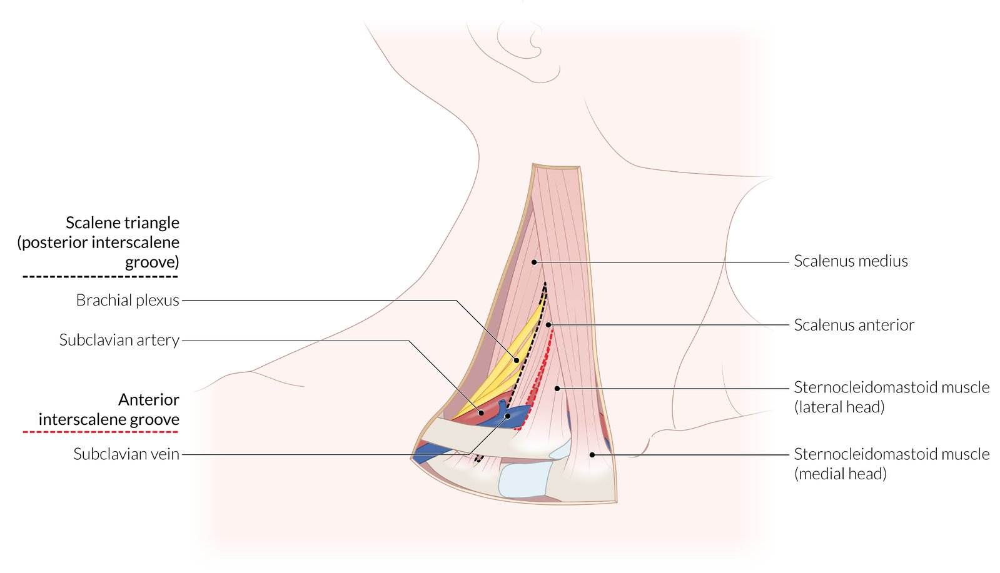
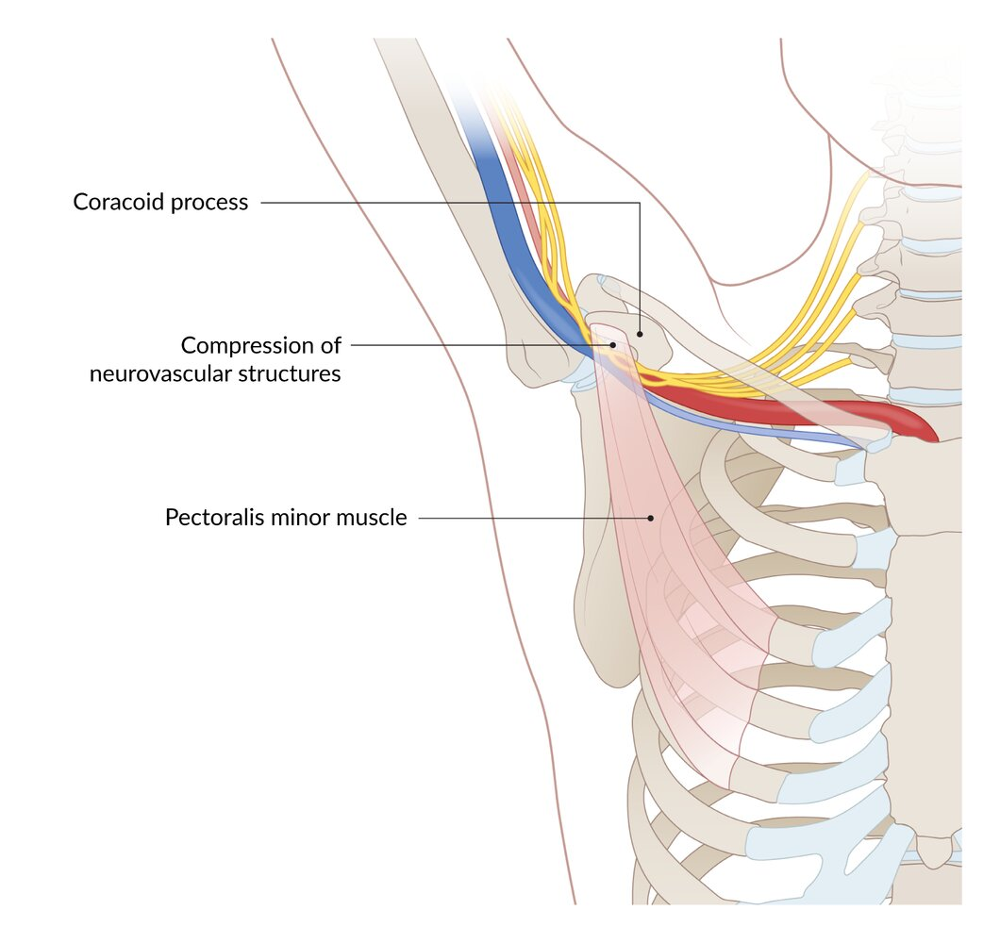
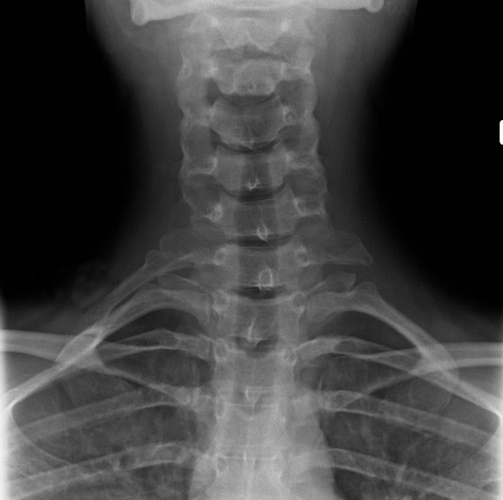
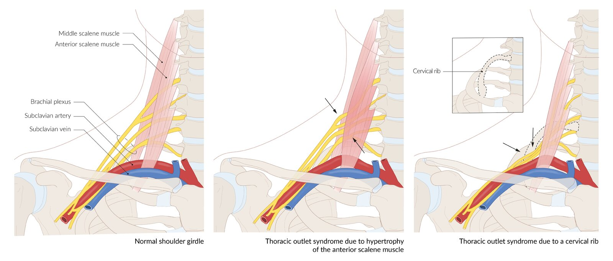
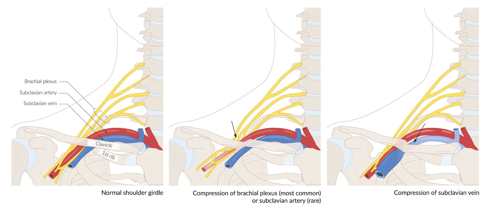

# Thoracic outlet syndrome

*Categories: Clinical knowledge > Internal medicine > Cardiology and angiology > Vascular diseases > Thoracic outlet syndrome*

[Original Article Link](https://coursology-qbank.com/amboss/article/QQ0uDf)

---

## Summary

Thoracic outlet syndrome (<u>TOS</u>) is an umbrella term for conditions involving the compression of neurovascular structures (e.g., the <u>brachial plexus</u> or the <u>subclavian artery</u> or <u>vein</u>) as they pass from the lower neck to the armpit. Causes include trauma, tumors, or the presence of a <u>cervical rib</u>. Neurogenic <u>TOS</u> is the most common type and involves the compression of the <u>brachial plexus</u>, leading to <u>neck pain</u> and numbness and tingling in the fingers. Arterial <u>TOS</u> involves compression of the <u>subclavian artery</u> and presents with <u>pain</u>, <u>pallor</u>, coldness, and pulselessness in the affected arm, especially during <u>overhead</u> activities. Venous <u>TOS</u> results in <u>pain</u>, <u>cyanosis</u>, and swelling of the arm. Imaging techniques such as duplex <u>sonography</u>, <u>X-ray</u>, <u>MRI</u>, or <u>electrodiagnostic testing</u> are used to detect the cause of <u>TOS</u>. Mild symptoms should be treated with <u>pain</u> medication and <u>physical therapy</u>. Surgical resection of the causal structures might become necessary in the case of progressive neurologic dysfunction or acute vascular insufficiency.

---

## Etiology

* Compression of subclavian vessels and the <u>lower trunk of the brachial plexus</u> (mainly occurs within the <u>scalene triangle</u>) due to: 

* Physical trauma (e.g. hyperextension neck injuries)

* Repetitive motion of the <u>abducted</u> and externally rotated shoulder;  (e.g., tennis, baseball, swimming, repetitive throwing, carrying heavy objects <u>overhead</u>)

* Structural abnormalities

* Bones: anomalous <u>cervical rib</u> , <u>collarbone fracture</u>, exostoses of the first <u>rib</u> or collarbone  [[1]](https://coursology-qbank.com/amboss/article/cdXaKC)

* <u>Soft tissue</u>: <u>hypertrophic</u> muscles in athletes and weight lifters, poor posture and <u>obesity</u>, <u>hematoma</u>, tumors (e.g., <u>Pancoast tumor</u>)

Scalene triangle

Thoracic outlet syndrome secondary to hyperabduction

Cervical rib

Thoracic outlet syndrome secondary to muscle hypertrophy or cervical rib

Thoracic outlet syndrome secondary to clavicle fracture

---

## Clinical features

Clinical features of <u>TOS</u> depend on the anatomic structure affected by compression and are more pronounced during and after <u>overhead</u> activity.

* Compression of parts of the <u>brachial plexus</u> (95% of cases) [[2]](https://coursology-qbank.com/amboss/article/edXxKC)

* Sensory loss or <u>paresthesia</u> (follows the distribution of the <u>ulnar nerve</u>)

* <u>Pain</u> in the neck and arm

* Gilliatt-Sumner hand: <u>atrophy</u> of intrinsic hand muscles, including the thenar, <u>hypothenar</u>, <u>lumbrical</u>, and <u>interossei</u> muscles

* Compression of the <u>subclavian vein</u> (up to 3% of cases) [[2]](https://coursology-qbank.com/amboss/article/edXxKC)

* Swelling

* Venous distention

* Diffuse hand or arm <u>pain</u>

* Heaviness

* Risk of <u>thrombosis</u> of the arm (<u>Paget-Schroetter disease</u>)

* Compression of the <u>subclavian artery</u> (< 1% of cases) [[2]](https://coursology-qbank.com/amboss/article/edXxKC)

* Mild arm ache and fatigue

* Pulselessness, pain, pallor, paresthesia, and poikilothermia (5 Ps)

* ↓ Blood pressure of > 20 mm Hg in the affected arm compared to the <u>contralateral</u> arm

* <u>Ischemia</u> can lead to <u>ulcerations</u> and <u>gangrene</u> of the affected arm.

> [!TIP]
> Swelling and venous distention in the arm may be a sign of venous <u>thrombosis</u> of the arm.

---

## Diagnosis

### Provocation tests

#### Adson test

* Definition: a provocation test that is used to reproduce symptoms of <u>TOS</u>

* Maneuver

* The patient sits in a relaxed position while the examiner palpates the radial <u>pulse</u>.

* Passive <u>abduction</u> of 90° and <u>lateral</u> rotation and extension of the arm

* The effect may be amplified by asking the patient to extend their head and rotate it to the affected side while breathing in deeply.

* This maneuver causes contraction of the <u>anterior</u> and <u>middle scalene</u> muscles, which narrows the <u>posterior scalene</u> gap, causing compression of the <u>subclavian artery</u> and the <u>brachial plexus</u>, with subsequent loss of the radial <u>pulse</u> or <u>paresthesia</u> in the case of arterial or neurogenic <u>TOS</u>.

* Interpretation

* Positive: reduced or absent <u>pulse</u> and/or <u>paresthesia</u>

* Negative: no change in <u>pulse</u> or sensation

#### Wright test

* Definition: a provocation test used to reproduce <u>paresthesia</u> and changes in the radial <u>pulse</u> by performing the following maneuvers

* Maneuver

* Passive <u>abduction</u> of the shoulder to 90° followed by <u>external rotation</u> and <u>flexion</u> of the <u>elbow</u>

* Hyperabduction of the arms over the head

* Interpretation

* Positive: reduced/absent <u>pulse</u> or <u>paresthesia</u>

* Negative: no change in <u>pulse</u> or sensation

#### Roos stress test

* Definition: a provocation test used to reproduce symptoms of <u>TOS</u>

* Maneuver: Both shoulders are positioned in <u>abduction</u> and are <u>externally rotated</u> at 90° angles, with <u>elbows</u> flexed at 90°, while the patient repeatedly makes a fist and then relaxes the hand.

* Interpretation

* Positive: sensation of heaviness or fatigue in affected limb

* Negative: no change in sensation

### Imaging

* Radiographs of the <u>spine</u>, shoulder, collarbone might show bony abnormalities

* CT or <u>MRI</u> imaging mainly to exclude other conditions that manifest similarly (e.g., <u>rotator cuff tear</u>, <u>Pancoast syndrome</u>, cervical disc disorders, <u>fibromyalgia</u>)

#### Other

* Neurogenic <u>TOS</u>: <u>electromyography</u>/<u>nerve conduction studies</u>

* Venous <u>TOS</u>: <u>duplex ultrasonography</u>

* Arterial <u>TOS</u>: <u>MR angiography</u>

---

## Treatment

* Mild cases

* <u>Physical therapy</u>

* Weight reduction

* <u>NSAIDs</u>

* <u>Thrombolytics</u> with continued anticoagulation in the case of venous <u>thrombosis</u>

* Thoracic outlet decompression <u>surgery</u>: in cases of acute vascular insufficiency or progressive neurologic dysfunction or if <u>conservative treatment</u> fails

* Transaxillary resection of the <u>cervical rib</u> or first <u>rib</u>

* Anterior scalenectomy: a surgical procedure in which the <u>anterior scalene muscle</u> is resected

* <u>Angioplasty</u> or venous/arterial bypass for severely narrowed vessels

---