# Vasculitides

*Categories: Clinical knowledge > Internal medicine > Cardiology and angiology > Vascular diseases > Vasculitides*

[Original Article Link](https://coursology-qbank.com/amboss/article/fT0kJ2)

---

## Summary

Vasculitides are a heterogeneous group of rare autoimmune diseases characterized by blood vessel inflammation (vasculitis). Inflammation can lead to <u>ischemia</u>, <u>necrosis</u>, and/or hemorrhage, with subsequent <u>end-organ damage</u>. Vasculitides are either primary (<u>idiopathic</u>) or secondary to an underlying disease (e.g., <u>HBV infection</u>, cancer, <u>systemic lupus erythematosus</u>) or drug use. Vasculitides are further classified based on the size of the affected vessels: small-, medium-, or <u>large-vessel vasculitis</u>, or variable vessel vasculitis. Diagnosing vasculitides is often challenging, as symptoms are usually nonspecific; vasculitides should be considered in patients presenting with <u>constitutional symptoms</u> and signs of multisystem disease (e.g., palpable <u>purpura</u>, pulmonary infiltrates, unexplained <u>ischemic</u> events). <u>Laboratory studies</u>, imaging, and <u>histopathology</u> are often required to confirm the diagnosis. Management should involve a multidisciplinary team (e.g., rheumatology, ophthalmology, <u>neurology</u>) and aims to promptly prevent the progression of vascular inflammation with <u>immunosuppressive therapy</u> to avoid organ damage and <u>death</u>. Treatment of the underlying cause (e.g., with <u>antiviral drugs</u>) and/or symptomatic management (e.g., with <u>NSAIDs</u>) is often necessary.

---

## General principles

### Etiology [[1]](https://coursology-qbank.com/amboss/article/F51gNh0)

* Primary (<u>idiopathic</u>)

* Secondary to another disease or drug use, e.g.:

* Infectious diseases

* Viral infection: e.g., <u>HBV</u>, <u>HCV</u>, <u>HIV</u>

* <u>Infectious endocarditis</u>

* <u>Tuberculosis</u>

* <u>Syphilis</u>

* Drugs: e.g., <u>hydralazine</u>, <u>cocaine</u>

* <u>Malignancy</u>: e.g., <u>multiple myeloma</u>, <u>lymphoproliferative disorders</u>

* Autoimmune diseases: e.g., <u>systemic lupus erythematosus</u> (<u>SLE</u>), <u>Sjogren syndrome</u>, <u>sarcoidosis</u>, <u>IBD</u>

### Classification [[2]](https://coursology-qbank.com/amboss/article/6tXje-)

* Based on the 2012 Chapel Hill Consensus Nomenclature

* Classification is based on the size of the vessel predominantly affected:  

* <u>Large-vessel vasculitis</u>

* <u>Medium-vessel vasculitis</u>

* <u>Small-vessel vasculitis</u>

* <u>ANCA-associated vasculitis of small vessels</u>

* <u>Non-ANCA-associated vasculitis of small vessels</u>

* Variable vessel vasculitis

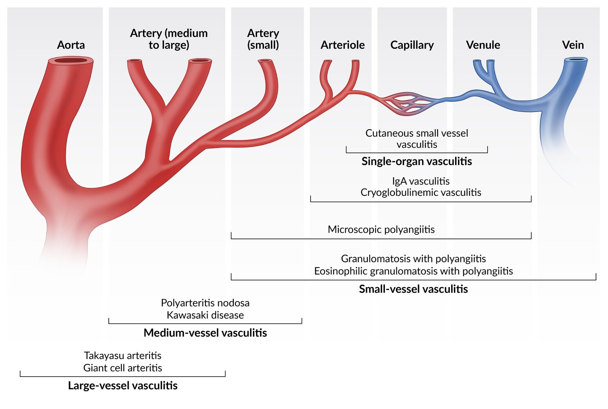

Types of vasculitis

### Approach to management [[1]](https://coursology-qbank.com/amboss/article/F51gNh0)

Vasculitis should be suspected in patients with <u>constitutional symptoms</u> and multisystemic inflammatory disease. Specific manifestations depend on the vessels affected.

* Tailor the approach to the suspected disease and/or affected organ or system.

* Rule out other (more common) diagnoses (e.g., infections, cancer, other autoimmune diseases).

* Assess for secondary causes of vasculitis (see “Etiology”).

* Consult a rheumatologist and/or other specialists as required.

* Start management based on disease severity and the affected organ or system.

> [!TIP]
> Most patients with vasculitis present with nonspecific features (e.g., <u>constitutional symptoms</u>, elevated <u>inflammatory markers</u>).

#### Initial evaluation

* Perform a thorough history and <u>physical examination</u>; ≥ 1 of the following clinical features are usually found in patients with vasculitis :

* Typical cutaneous lesions (e.g., palpable <u>purpura</u>, <u>livedo reticularis</u>, digital <u>gangrene</u>)

* <u>Pulmonary-renal syndromes</u> (e.g., <u>asthma</u>, <u>hemoptysis</u>, <u>glomerulonephritis</u>)

* Limb <u>claudication</u>, asymmetric pulses and/or blood pressure measurements, <u>bruits</u>

* Temporal <u>headache</u>, visual loss, <u>mononeuritis multiplex</u>

* Findings suggestive of vasculitis on routine studies include:

* <u>CBC</u>: <u>anemia of chronic disease</u>, <u>thrombocytosis</u>, <u>eosinophilia</u>

* <u>Inflammatory markers</u>: ↑ <u>ESR</u>, ↑ <u>CRP</u>

* Infectious diseases workup: positive <u>hepatitis B testing</u> or <u>hepatitis C testing</u>

* Autoimmune diseases workup: negative <u>ANAs</u> and <u>aPL antibodies</u>

* <u>Chest x-ray</u>: <u>lung</u> involvement (e.g., <u>ground glass opacity</u>, nodular lesions)

> [!TIP]
> Vasculitis has a wide variety of signs and symptoms; there is no single typical presentation.

#### Additional evaluation

Consider further diagnostics guided by clinical suspicion to:

* Determine the extent of the disease, e.g.:

* Urine studies and chest CT to evaluate for <u>kidney</u> and <u>lung</u> involvement

* <u>Nerve conduction studies</u>, <u>electromyography</u>, and <u>creatine kinase</u> levels

* Establish the type of vasculitis: e.g., ↓ <u>ANCAs</u> and ↑ <u>cryoglobulins</u> indicates <u>cryoglobulinemic vasculitis</u>

* Confirm the diagnosis: with imaging (e.g., <u>MRA</u>, <u>CTA</u>) or histological studies

#### Management

* <u>Immunosuppressive therapy</u> is generally indicated.

* Surgical therapy may be required in specific cases (e.g., those with limb <u>ischemia</u>).

* <u>Supportive care</u>

* Provide <u>pain management</u>.

* <u>Prevent complications of glucocorticoid therapy</u>.

* Monitor <u>adverse effects of immunosuppressants</u>.

* Consider <u>PCP prophylaxis</u>.

---

## Large-vessel vasculitis

| Overview of <u>large-vessel vasculitides</u> |  |  |  |
| --- | --- | --- | --- |
|  | Clinical features | Diagnostics | Management |
|  <u>Giant cell arteritis</u>   [[3]](https://coursology-qbank.com/amboss/article/hwccie0)  |   * Most commonly affects women > 50 years of age  * Visual impairment: may result in blindness  * New-onset <u>headache</u>  * Tender <u>temporal artery</u>  * <u>Jaw claudication</u>  * Associated with <u>polymyalgia rheumatica</u>    |   * ↑ <u>ESR</u> (≥ 50 mm/hour), ↑ <u>CRP</u>  * Negative <u>autoantibody</u> studies  * Duplex <u>sonography</u>: <u>halo sign</u> around the vessel [[4]](https://coursology-qbank.com/amboss/article/_pX5H_)  * <u>Temporal artery biopsy</u> (<u>gold standard</u>): <u>granulomatous inflammation</u>    |   * High-dose <u>glucocorticoids</u> to prevent permanent <u>vision loss</u>  * See “<u>Giant cell arteritis</u>” for more information.    |
|  <u>Takayasu arteritis</u> [[3]](https://coursology-qbank.com/amboss/article/hwccie0)[[5]](https://coursology-qbank.com/amboss/article/xpXE7_)  |   * Most commonly affects Asian women < 40 years of age  * Disparity in blood pressure between arms (<u>Takayasu arteritis</u> is also known as <u>pulseless disease</u>)  * <u>Bruit</u> over the <u>subclavian artery</u> or <u>abdominal aorta</u>  * <u>Syncope</u> and <u>angina pectoris</u>    |   * ↑ <u>ESR</u>, ↑ <u>CRP</u>  * <u>MR angiography</u> (preferred study): vascular wall thickening with luminal stenosis or occlusion of the aorta and major branches [[6]](https://coursology-qbank.com/amboss/article/j1b_gs)  * <u>Angiography</u>: stenosis of the <u>aortic arch</u> and <u>proximal</u> great vessels  * <u>Biopsy</u>: <u>granulomatous inflammation</u> of the aorta and its major branches [[5]](https://coursology-qbank.com/amboss/article/xpXE7_)    |   * <u>Glucocorticoids</u>  * PLUS a <u>glucocorticoid-sparing agent</u> (e.g., <u>methotrexate</u>, <u>azathioprine</u>, <u>infliximab</u>)  * See “<u>Takayasu arteritis</u>” for more information.    |

Polymyalgia rheumatica and giant cell arteritis fact sheet

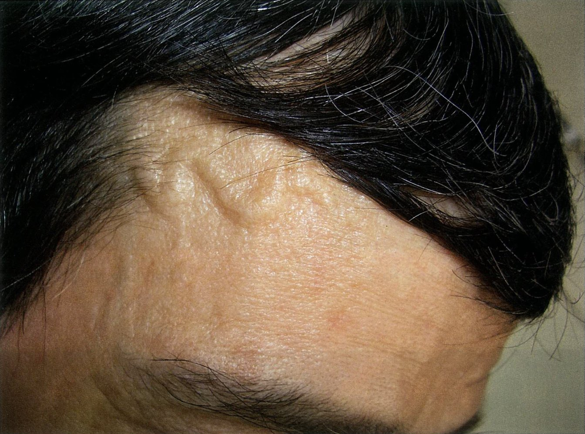

Giant cell arteritis

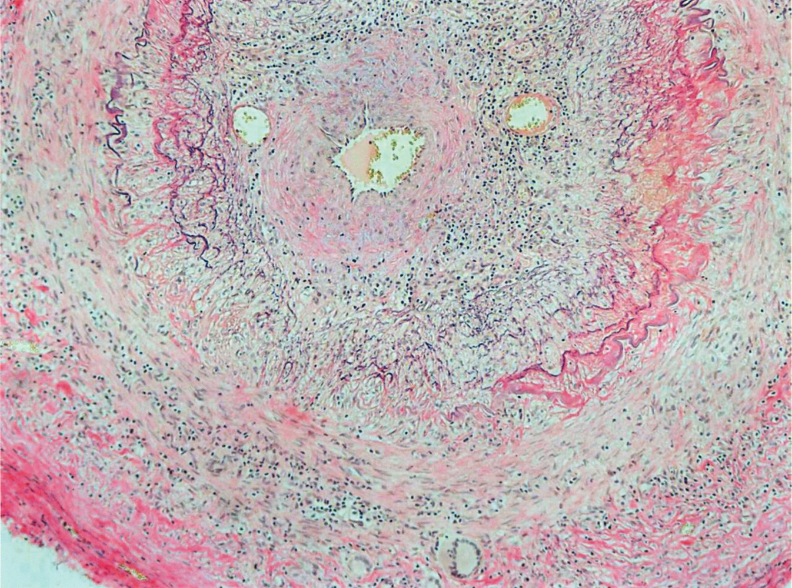

Temporal arteritis

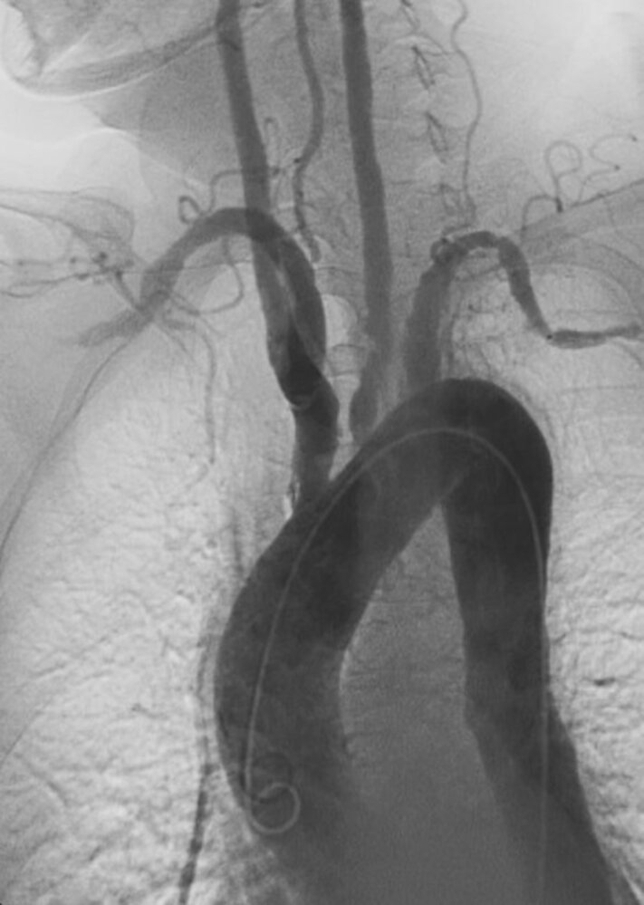

Great vessel stenoses

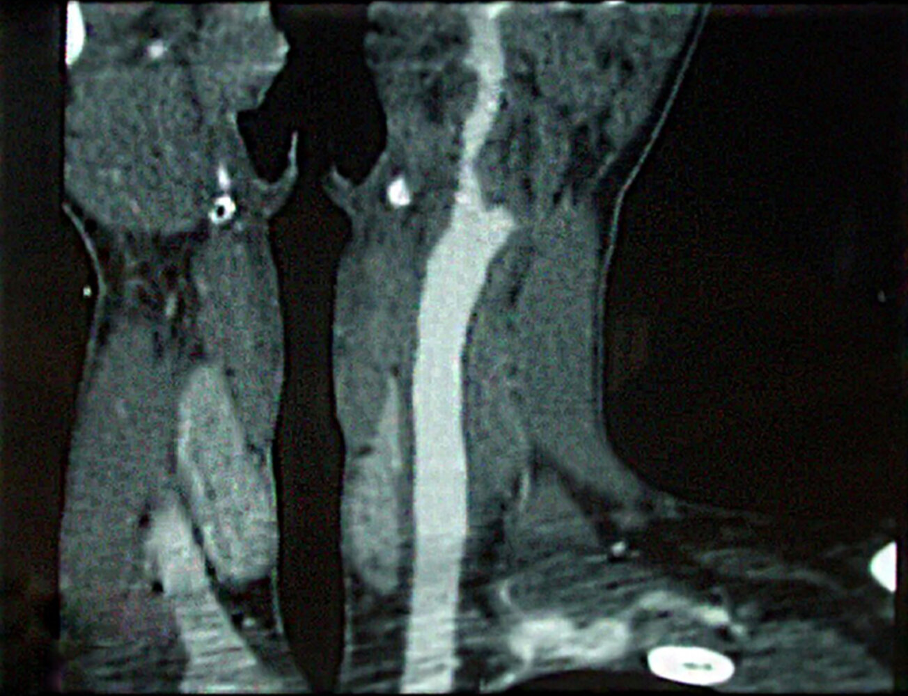

External carotid artery stenosis

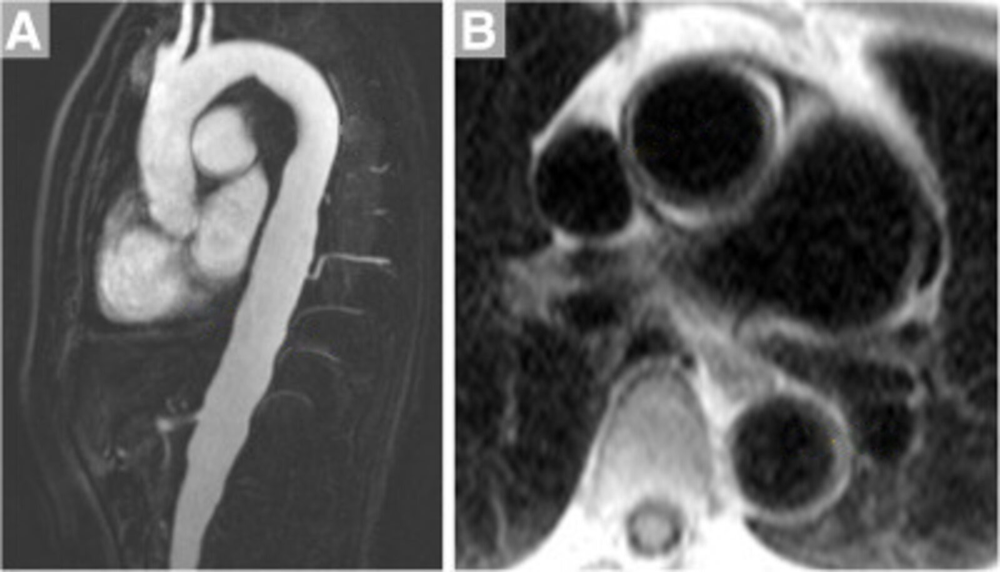

Takayasu arteritis

---

## Medium-vessel vasculitis

| Overview of medium-vessel vasculitides |  |  |  |
| --- | --- | --- | --- |
|  | Clinical features | Diagnostics | Management |
|  <u>Kawasaki disease</u>    |   * Most often occurs in children < 5 years of age  * "CRASH (<u>Conjunctivitis</u>, <u>Rash</u>, <u>Adenopathy</u>, <u>Strawberry tongue</u>, Hand-foot changes) and BURN (≥ 5 days of <u>fever</u>)”    |   * ↑ <u>ESR</u>, ↑ <u>CRP</u>, <u>thrombocytosis</u>  * <u>Echocardiography</u>: <u>coronary artery</u> <u>aneurysms</u>    |   * High-dose <u>aspirin</u> PLUS IVIG  * See “<u>Kawasaki disease</u>” for more information.    |
| <u>Polyarteritis nodosa</u> |   * Most often occurs in adults 45–65 years of age; <u>♂</u> > <u>♀</u>  * <u>Fever</u>, <u>malaise</u>  * Abdominal, muscle, and <u>joint</u> <u>pain</u>  * Renal impairment  * Neurological dysfunction (e.g., <u>polyneuropathy</u>, <u>stroke</u>)  * <u>Rash</u>, <u>ulcerations</u>, <u>nodules</u>  * Spares the <u>lungs</u>    |   * Associated with positive <u>HBV</u> and/or <u>HCV</u> studies  * <u>ANCA</u>: negative  * Muscle <u>biopsy</u>: <u>transmural</u> vasculitis    |   * <u>Glucocorticoids</u> PLUS <u>cyclophosphamide</u>  * See “<u>Polyarteritis nodosa</u>” for more information.    |

Clinical features of Kawasaki disease

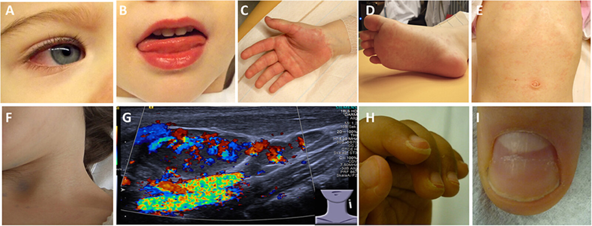

Typical findings in Kawasaki disease

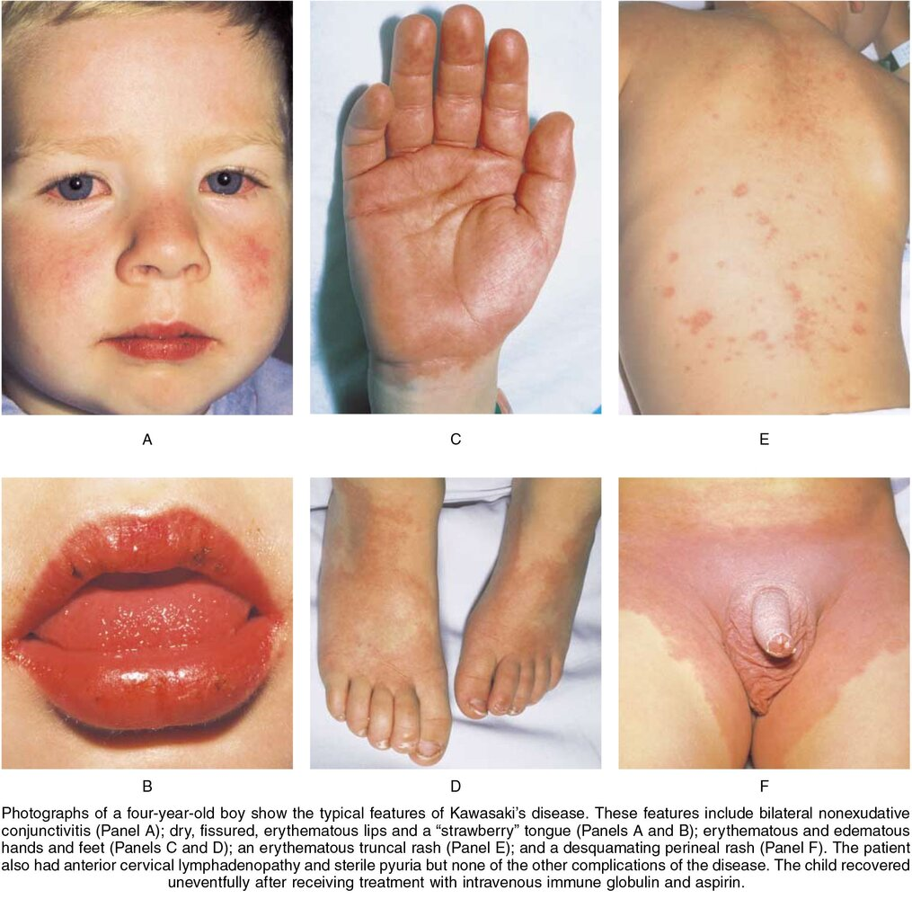

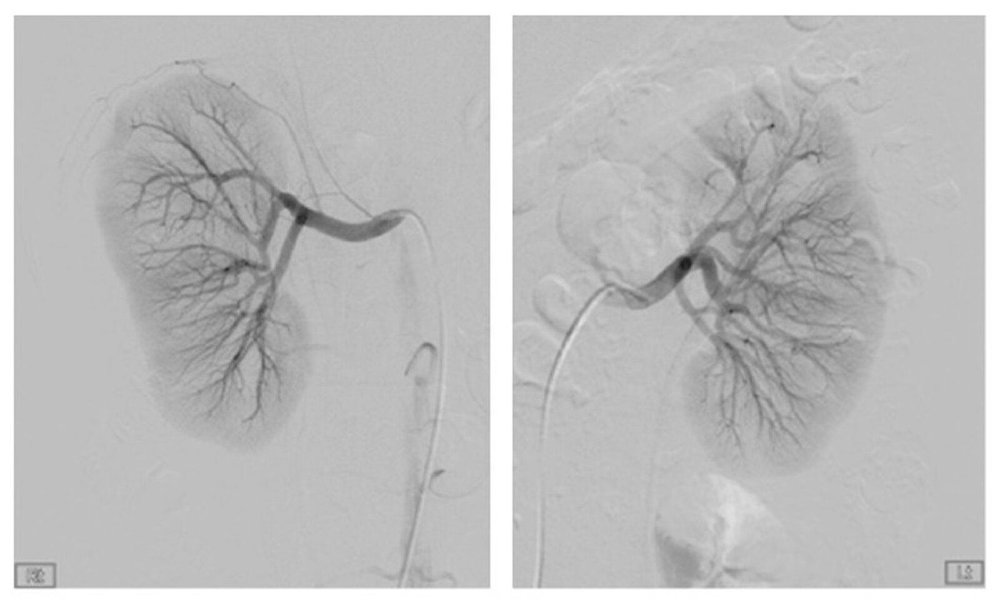

Renal artery microaneurysms

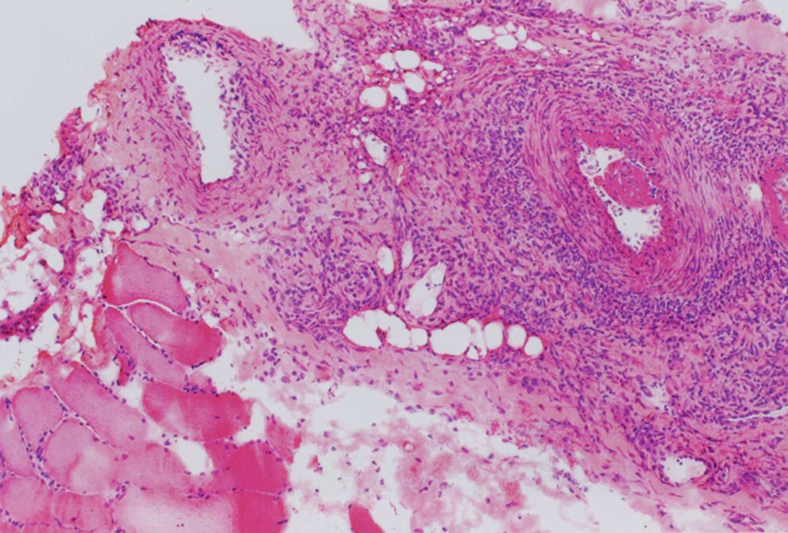

Muscle involvement in polyarteritis nodosa

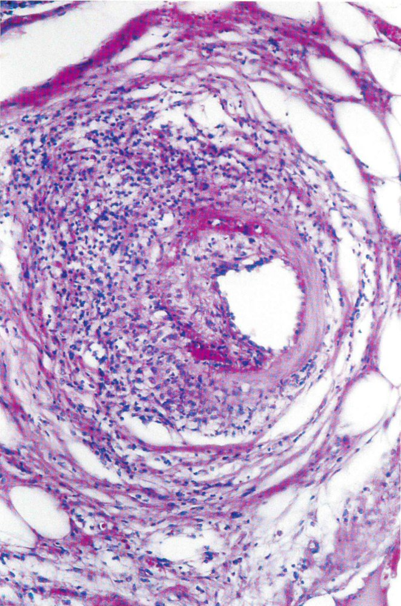

Polyarteritis nodosa

---

## Small-vessel vasculitis

### ANCA-associated small-vessel vasculitis

| Overview of <u>ANCA-associated small-vessel vasculitides</u> |  |  |  |
| --- | --- | --- | --- |
|  | Clinical features | Diagnostics | Management |
|  <u>Granulomatosis with polyangiitis</u>    |   * Most often occurs in adults 40–60 years of age; <u>♂</u> > <u>♀</u>  * <u>Chronic sinusitis</u>/<u>rhinitis</u>, <u>saddle nose deformity</u>  * <u>Chronic otitis media</u> and <u>mastoiditis</u>  * Treatment-resistant <u>pneumonia</u>-like symptoms such as <u>cough</u>, <u>dyspnea</u>, and <u>hemoptysis</u>  * <u>Rapidly progressive glomerulonephritis</u>    |   * <u>PR3-ANCA</u>  * <u>Biopsy</u> of the affected organs: granulomatous, necrotizing vasculitis, <u>glomerulonephritis</u>, <u>lung</u> involvement  * <u>Chest x-ray</u> or CT: multiple bilateral cavitating nodular lesions    |   * <u>Glucocorticoids</u>  * PLUS <u>methotrexate</u> OR <u>cyclophosphamide</u> OR <u>rituximab</u>  * See “<u>Granulomatosis with polyangiitis</u>” for more information.    |
| <u>Eosinophilic granulomatosis with polyangiitis</u> |   * Severe <u>allergic asthma</u>, <u>sinusitis</u>  * <u>Skin</u> manifestations (e.g., tender <u>nodules</u>)  * <u>Peripheral neuropathy</u>  * Gastrointestinal, cardiac, and/or renal involvement    |   * <u>MPO</u>/<u>p-ANCA</u> (∼ 40% of patients)  * Peripheral blood <u>eosinophilia</u>  * ↑ <u>IgE</u>  * <u>Biopsy</u> (<u>confirmatory test</u>): tissue <u>eosinophilia</u>, necrotizing <u>granulomas</u>    |   * <u>Glucocorticoids</u>  * PLUS <u>cyclophosphamide</u> OR <u>rituximab</u>  * See “<u>Eosinophilic granulomatosis with polyangiitis</u>” for more information.    |
| <u>Microscopic polyangiitis</u> |   * <u>Pauci-immune glomerulonephritis</u>  * <u>Hypertension</u>  * Palpable <u>purpura</u>  * Similar to <u>granulomatosis with polyangiitis</u> but spares the <u>nasopharynx</u>    |   * <u>MPO</u>/<u>p-ANCA</u>  * <u>Biopsy</u>: inflammation, no <u>granulomas</u>    |   * <u>Glucocorticoids</u>  * PLUS <u>rituximab</u> OR  <u>cyclophosphamide</u>  * See “<u>Microscopic polyangiitis</u>” for more information.    |

> [!NOTE]
> <u>Granulomatosis with polyangiitis</u> is the 'C' disease: Curvy nose (<u>saddle nose deformity</u>), Chronic <u>sinusitis</u>, Cough, Conjunctivitis and Corneal <u>ulceration</u>, Cardiac <u>arrhythmias</u>, non-Caseating <u>granulomas</u> on <u>biopsy</u>, c<u>ANCA</u>, Corticosteroids and Cyclophosphamide as treatment.

Granulomatosis with polyangiitis fact sheet

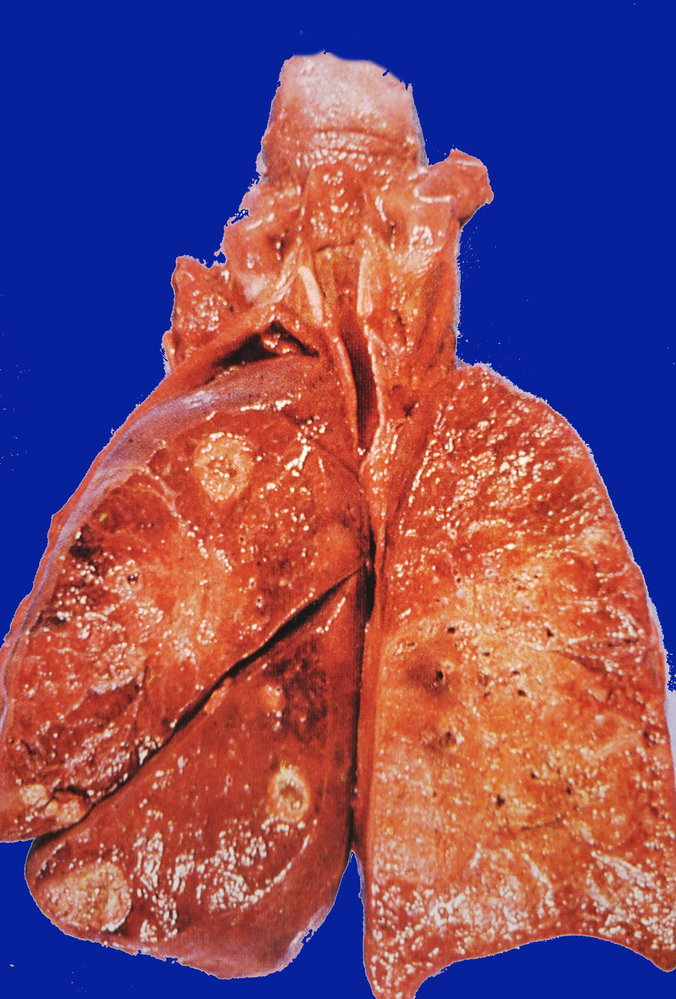

Pulmonary manifestation of granulomatosis with polyangiitis

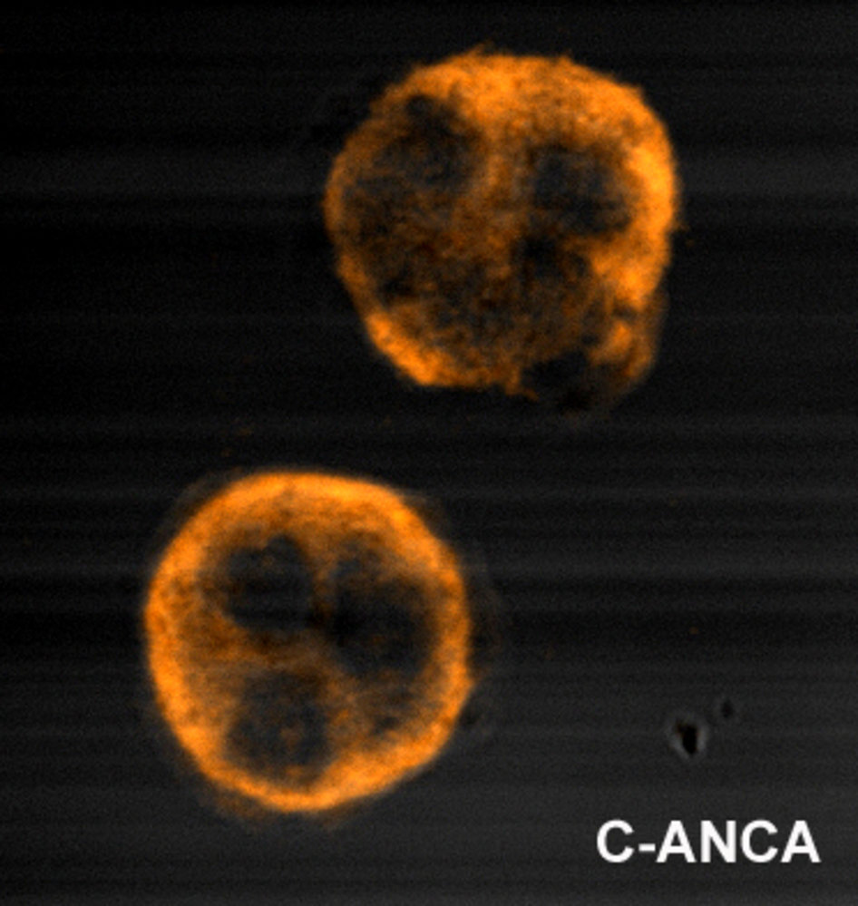

Cytoplasmic pattern of antineutrophil cytoplasmic antibodies (c-ANCA)

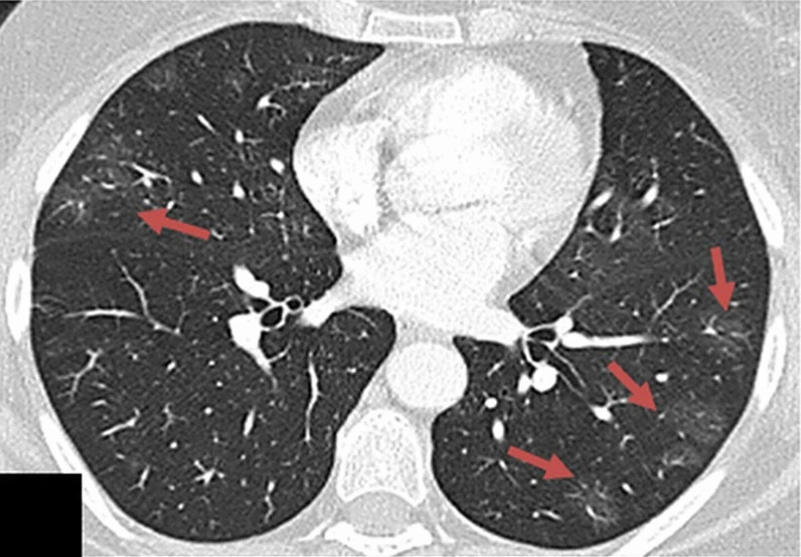

Multifocal ground-glass opacities

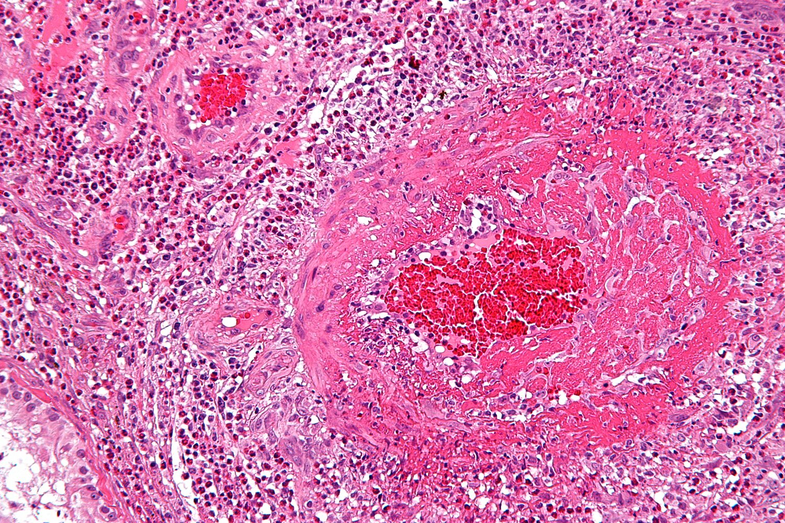

Eosinophilic granulomatosis with polyangiitis

### Non-ANCA-associated small-vessel vasculitis

| Overview of non-<u>ANCA-associated small-vessel vasculitides</u> |  |  |  |
| --- | --- | --- | --- |
|  | Clinical features | Diagnostics | Management |
|  <u>IgA vasculitis</u>    |   * Most often affects children (90% of patients are < 10 years of age)  * Palpable <u>purpura</u> on lower limbs  * <u>Arthritis</u> and/or <u>arthralgia</u>  * Abdominal <u>pain</u>  * <u>Hematuria</u> if <u>IgA nephropathy</u> is present  * Often secondary to <u>URTIs</u>    |   * ↑ <u>IgA</u> in serum  * <u>Biopsy</u>: <u>leukocytoclastic vasculitis</u> with <u>IgA</u> and C3 <u>immune complex</u> deposition    |   * Mild cases: symptomatic treatment (e.g., with <u>NSAIDs</u>)  * Severe cases: <u>glucocorticoids</u> PLUS IV hydration  * See “<u>IgA vasculitis</u>” for more information.    |
| <u>Cryoglobulinemic vasculitis</u> |   * Fatigue  * <u>Arthralgia</u>  * Palpable <u>purpura</u>  * <u>Glomerulonephritis</u>  * Most cases are secondary to <u>cryoglobulinemia</u> due to <u>HCV</u> infection.    |   * <u>Cryoglobulinemia</u> in serum  * Cutaneous or <u>renal biopsy</u>    |   * Mild cases: symptomatic treatment (e.g., with <u>NSAIDs</u>)  * Moderate or severe cases: <u>glucocorticoids</u> PLUS either <u>rituximab</u> OR <u>cyclophosphamide</u>  * Treatment of the underlying etiology (e.g., <u>DAAs</u> for <u>HCV infection</u>)  * See “<u>Cryoglobulinemic vasculitis</u>” for more information.    |
|  <u>Cutaneous small-vessel vasculitis</u> [[7]](https://coursology-qbank.com/amboss/article/C-Xqz00)[[8]](https://coursology-qbank.com/amboss/article/x-XEz00)  |   * Palpable <u>purpura</u>  * Causes  * <u>Idiopathic</u> in 45–50% of cases  * Drug-induced  * Infections    |  * <u>Skin biopsy</u>: <u>leukocytoclastic vasculitis</u>   |   * Management of the underlying etiology (e.g., discontinuation of inciting drugs, initiation of antivirals)  * Severe and/or chronic cases: <u>glucocorticoids</u> ± <u>glucocorticoid-sparing agents</u> (e.g., <u>colchicine</u>, <u>dapsone</u>)  * See “<u>Cutaneous small-vessel vasculitis</u>” for more information.    |

IgA vasculitis fact sheet

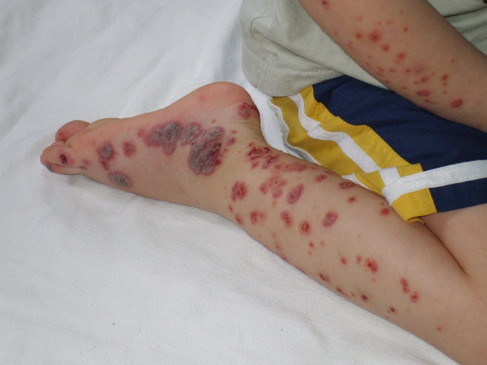

Purpura in IgA vasculitis

Leukocytoclastic vasculitis

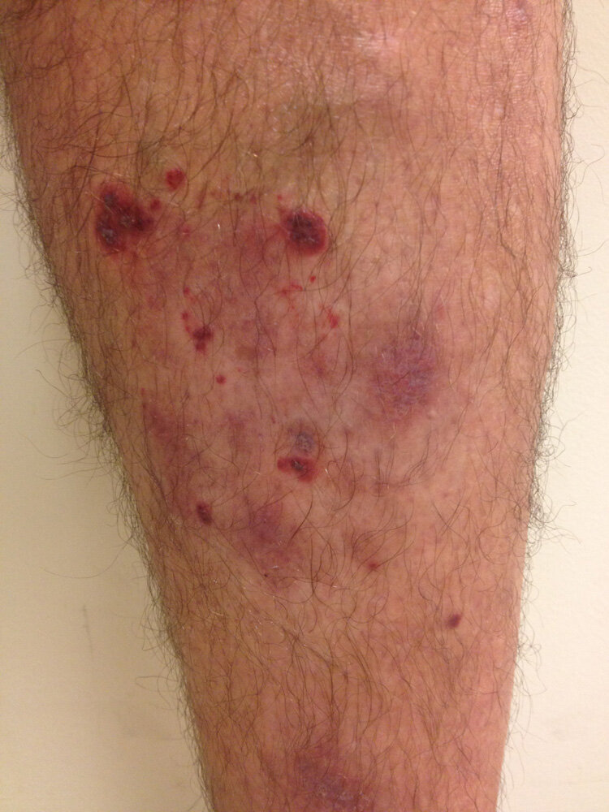

---

## Variable vessel vasculitis

| Overview of variable vessel vasculitides |  |  |  |
| --- | --- | --- | --- |
|  | Clinical features | Diagnostics | Management |
| <u>Behcet disease</u> |   * Most commonly occurs in individuals from Turkey, the Middle East, and Japan  * Oral and genital <u>ulcers</u>  * <u>Uveitis</u>  * <u>Erythema nodosum</u>    |  * Positive <u>pathergy test</u>   |   * <u>Glucocorticoids</u>  * PLUS other <u>immunosuppressive agents</u> based on the type and severity of manifestations  * See “<u>Behcet disease</u>” for more information.    |
|  <u>Cogan syndrome</u> [[2]](https://coursology-qbank.com/amboss/article/6tXje-)[[9]](https://coursology-qbank.com/amboss/article/dL1o9h0)  |   * Inflammatory ocular lesions, e.g.:  * <u>Interstitial keratitis</u>  * <u>Uveitis</u>  * <u>Episcleritis</u>  * <u>Inner ear</u> disease, e.g.:  * <u>Sensorineural hearing loss</u>  * <u>Acute vestibular syndrome</u>  * Vasculitis, e.g.:  * <u>Aortitis</u>  * <u>Aortic aneurysms</u>  * <u>Valvulitis</u> of the aortic or mitral valves    |  * <u>Clinical diagnosis</u>   |  * <u>Glucocorticoids</u>   |

---