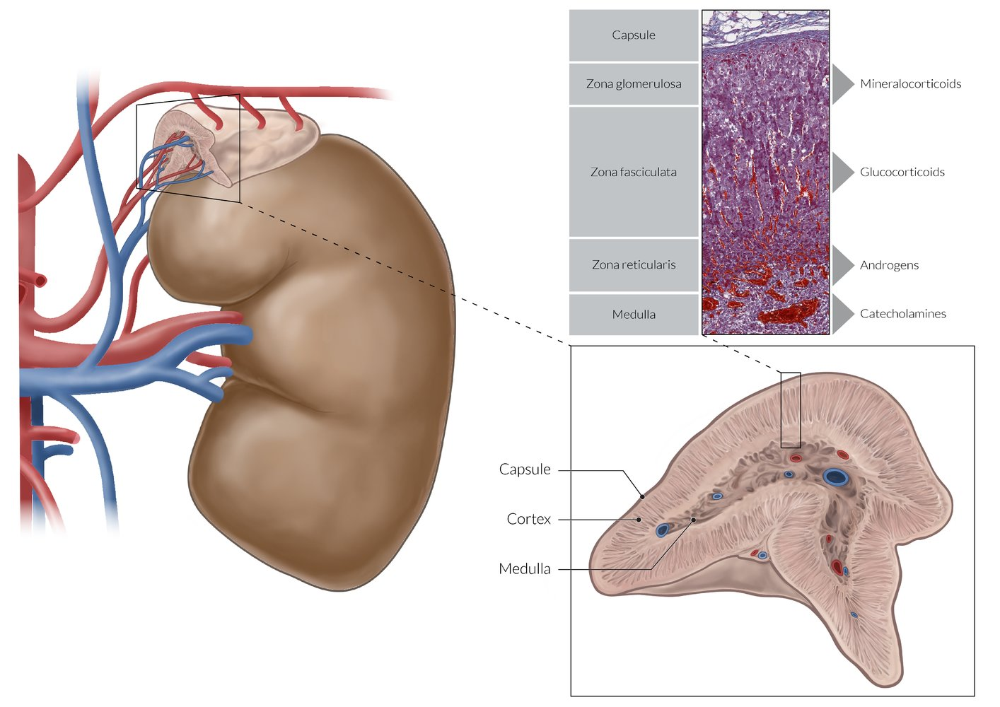
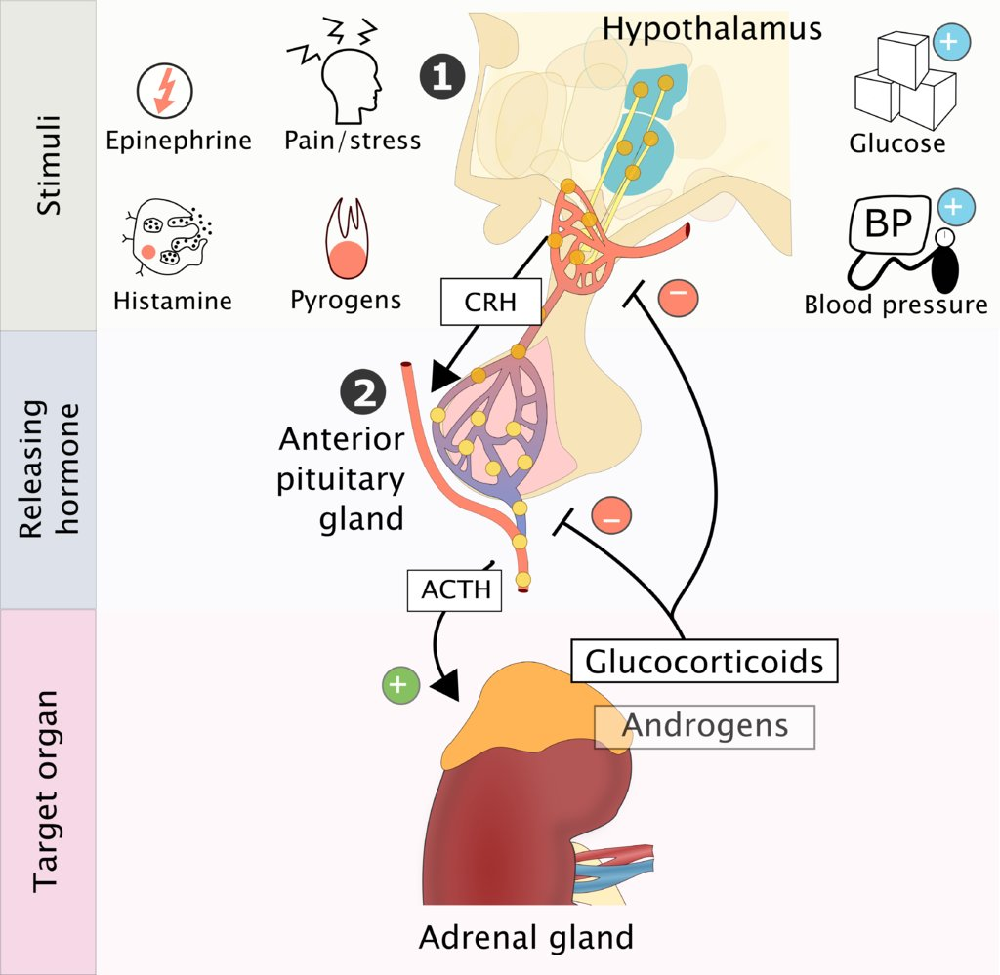
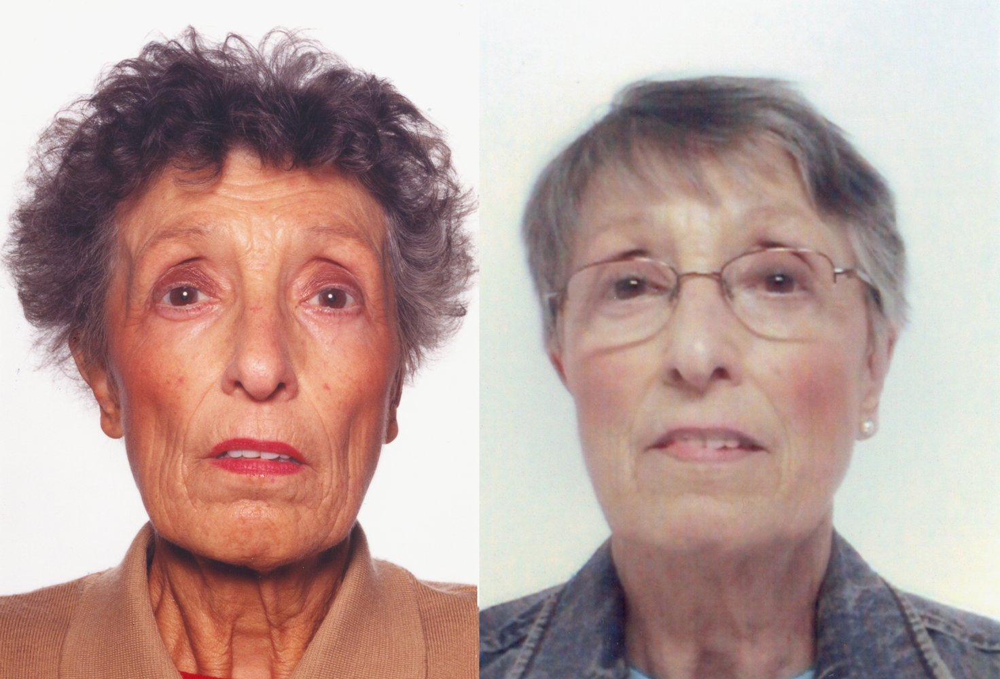
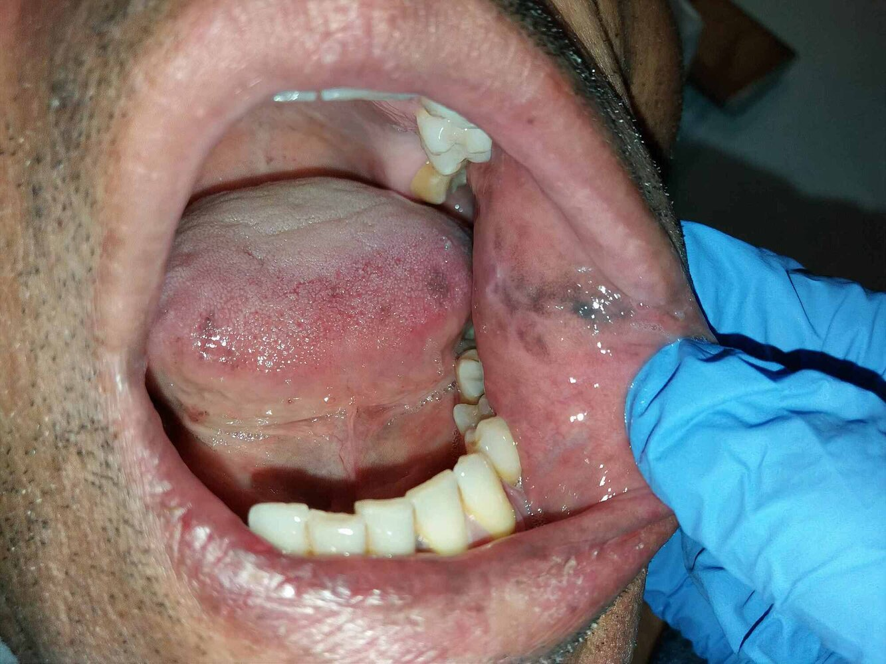
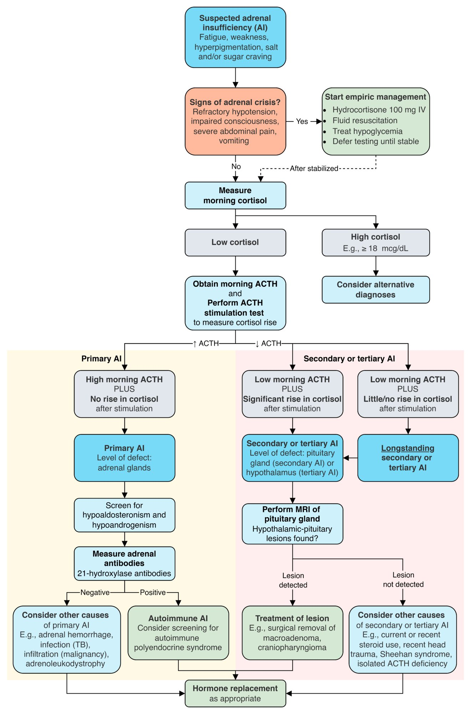

# Adrenal insufficiency

*Categories: Clinical knowledge > Internal medicine > Endocrinology > Adrenal glands disorders > Adrenal insufficiency*

[Original Article Link](https://coursology-qbank.com/amboss/article/Ug0bu2)

---

## Summary

<u>Adrenal</u> insufficiency is the decreased production of adrenocortical <u>hormones</u> (<u>glucocorticoids</u>, <u>mineralocorticoids</u>, and <u>adrenal</u> <u>androgens</u>) and is classified as primary, secondary, or tertiary. <u>Primary adrenal insufficiency</u> (<u>Addison disease</u>) is caused by a disorder of the <u>adrenal glands</u>. The most frequent cause of <u>primary adrenal insufficiency</u> in the US by far is <u>autoimmune adrenalitis</u>, which can occur sporadically or as a manifestation of <u>polyglandular autoimmune syndromes</u>. <u>Secondary adrenal insufficiency</u> is the result of decreased production of <u>ACTH</u> (<u>adrenocorticotropic hormone</u>) and <u>tertiary adrenal insufficiency</u> is the result of decreased production of <u>CRH</u> (<u>corticotropin-releasing hormone</u>) by the <u>hypothalamus</u>. Decreased levels of <u>ACTH</u> or <u>CRH</u> are seen following sudden cessation of prolonged <u>glucocorticoid</u> therapy and in <u>pituitary</u>/<u>hypothalamic</u> diseases. Patients with long-standing <u>adrenal</u> insufficiency can present with <u>postural hypotension</u>, <u>nausea</u>, <u>vomiting</u>, weight loss, <u>anorexia</u>, <u>lethargy</u>, <u>depression</u>, and/or <u>chronic hyponatremia</u>. There may also be a loss of libido as a result of <u>hypoandrogenism</u>. Patients with <u>primary adrenal insufficiency</u> tend to additionally develop <u>hyperpigmentation</u> of the <u>skin</u>, mild <u>hyperkalemia</u>, and <u>metabolic acidosis</u>. Serum <u>cortisol</u> levels that remain low even after the administration of <u>exogenous</u> <u>ACTH</u> (<u>ACTH stimulation test</u>) confirm the diagnosis of <u>primary adrenal insufficiency</u>. <u>Glucocorticoid</u> replacement therapy with <u>hydrocortisone</u> is required for all forms of <u>adrenal</u> insufficiency. The dose of <u>glucocorticoids</u> should be increased during periods of <u>stress</u> (e.g., <u>surgery</u>, trauma, infections) in order to prevent <u>adrenal crisis</u>, which is a severe, acute type of <u>adrenal</u> insufficiency that manifests with <u>shock</u>, <u>fever</u>, impaired consciousness, and severe abdominal <u>pain</u>. <u>Adrenal crisis</u> is life-threatening and should be treated immediately with high doses of <u>hydrocortisone</u> and <u>intravenous fluids</u>.

Recommendations in this article are consistent with the 2016 Endocrine Society clinical practice guidelines for the diagnosis and treatment of <u>primary adrenal insufficiency</u>. [[1]](https://coursology-qbank.com/amboss/article/L_awKM)

---

## Etiology

<u>Adrenal</u> insufficiency is a failure of the <u>adrenal glands</u> to produce adequate amounts of adrenocortical <u>hormones</u>. It can be primary, secondary, or tertiary.

### Primary adrenal insufficiency (<u>Addison disease</u>)

<u>Primary adrenal insufficiency</u> can be caused by abrupt destruction of the <u>adrenal gland</u> (<u>acute adrenal insufficiency</u>; e.g., due to massive <u>adrenal hemorrhage</u>) or by its gradual progressive destruction or <u>atrophy</u> (<u>chronic adrenal insufficiency</u>; e.g., due to autoimmune conditions, infection).

* Autoimmune adrenalitis

* Most common cause in the US among adults (∼ 80–90% of all cases of <u>primary adrenal insufficiency</u>)

* Caused by autoimmune destruction of both <u>adrenal</u> cortices

* Associated with other autoimmune endocrinopathies (see “<u>Autoimmune polyglandular syndromes</u>”)

* Infectious adrenalitis

* <u>Tuberculosis</u>: most common cause worldwide but rare in the US

* <u>CMV</u> disease in <u>immunosuppressed</u> states (especially <u>AIDS</u>)

* <u>Histoplasmosis</u>

* Adrenal hemorrhage [[2]](https://coursology-qbank.com/amboss/article/acaQaj)[[3]](https://coursology-qbank.com/amboss/article/56YilJ)

* <u>Sepsis</u>: especially meningococcal <u>sepsis</u> (endotoxic <u>shock</u>) → hemorrhagic <u>necrosis</u> (<u>Waterhouse-Friderichsen syndrome</u>)

* <u>Disseminated intravascular coagulation</u> (<u>DIC</u>)

* Anticoagulation: especially <u>heparin</u> (<u>heparin-induced thrombocytopenia</u>) [[4]](https://coursology-qbank.com/amboss/article/m6YVlJ)

* <u>Venous thromboembolism</u>, especially in <u>antiphospholipid syndrome</u> (<u>APS</u>) Recurrent <u>thromboses</u> are a typical manifestation of <u>APS</u>. [[5]](https://coursology-qbank.com/amboss/article/M6YMlJ)

* <u>Adrenal</u> <u>tumor</u> (most commonly <u>pheochromocytoma</u>) → intratumoral bleeding [[6]](https://coursology-qbank.com/amboss/article/L6YwlJ)

* (Short-term) <u>steroid</u> usage [[7]](https://coursology-qbank.com/amboss/article/K6YUNJ)

* Trauma (mostly <u>blunt trauma</u>, can also occur postoperatively) [[8]](https://coursology-qbank.com/amboss/article/o6Y0NJ)

* In <u>neonates</u>: <u>birth trauma</u>, difficult <u>labor</u> (e.g., <u>breech delivery</u>, forceps/<u>vacuum delivery</u>, <u>prolonged labor</u>), <u>maternal diabetes</u> [[9]](https://coursology-qbank.com/amboss/article/66YjNJ)

* Infiltration of the <u>adrenal glands</u>

* Tumors (adrenocortical tumors, <u>lymphomas</u>, <u>metastatic</u> <u>carcinoma</u>)

* <u>Amyloidosis</u>

* <u>Hemochromatosis</u>

* <u>Adrenalectomy</u>

* Impaired activity of enzymes that are responsible for <u>cortisol synthesis</u>

* <u>Cortisol synthesis</u> inhibitors (e.g., <u>rifampin</u>, <u>fluconazole</u>, <u>phenytoin</u>, <u>ketoconazole</u>): drug-induced adrenal insufficiency

* <u>21β-hydroxylase deficiency</u> (see “<u>Congenital adrenal hyperplasia</u>”)

* Other causes

* <u>Adrenoleukodystrophy</u> [[1]](https://coursology-qbank.com/amboss/article/L_awKM)

* <u>Vitamin B5 deficiency</u>  [[10]](https://coursology-qbank.com/amboss/article/p6YLNJ)

### Secondary adrenal insufficiency

<u>Secondary adrenal insufficiency</u> is caused by conditions that decrease <u>ACTH</u> production (impaired <u>hypothalamic-pituitary-adrenal axis</u>).

* Sudden discontinuation of chronic <u>glucocorticoid</u> therapy or <u>stress</u> (e.g., infection, trauma, <u>surgery</u>) during prolonged <u>glucocorticoid</u> therapy

* Prolonged <u>iatrogenic</u> suppression of the <u>hypothalamic-pituitary-adrenal axis</u>

* Impaired <u>endogenous</u> <u>cortisol</u> production in addition to discontinuation of <u>steroid</u> treatment, decrease in dosage, or increase in requirement (e.g., <u>stress</u>) → acute <u>glucocorticoid</u> deficiency

* <u>Hypopituitarism</u>: ↓ <u>ACTH</u> → ↓ <u>endogenous</u> <u>cortisol</u>

### Tertiary adrenal insufficiency

<u>Tertiary adrenal insufficiency</u> is caused by conditions that decrease <u>CRH</u> production.

* The most common cause is sudden discontinuation of chronic <u>glucocorticoid</u> therapy.

* Rarer causes include <u>hypothalamic</u> dysfunction (e.g., due to trauma, mass, hemorrhage, or <u>anorexia</u>): ↓ <u>CRH</u> → ↓ <u>ACTH</u> → ↓ <u>cortisol</u> release

> [!TIP]
> Secondary and <u>tertiary adrenal insufficiency</u> are far more common than <u>primary adrenal insufficiency</u>!

---

## Pathophysiology

For basic information on the <u>adrenal gland</u> and its functions, see “<u>Hormones of the adrenal cortex</u>.”

### <u>Primary adrenal insufficiency</u> (<u>Addison disease</u>)

Damage to the <u>adrenal gland</u> leads to the deficiency in all three <u>hormones</u> produced by the <u>adrenal cortex</u>: <u>androgen</u>, <u>cortisol</u>, and <u>aldosterone</u>.

* <u>Hypoandrogenism</u> 

* Loss of libido

* Impaired <u>spermatogenesis</u> (in men)

* <u>Hypocortisolism</u> leads to:

* ↑ <u>ACTH</u> → ↑ production of <u>POMC</u> (in order to increase <u>ACTH</u> production) → ↑ <u>melanocyte-stimulating hormone</u> (<u>MSH</u>) → <u>hyperpigmentation</u> of the <u>skin</u> (<u>bronze skin</u>) [[11]](https://coursology-qbank.com/amboss/article/HqYK-J)

* ↑ <u>ADH</u> level → retention of free water → dilutional <u>hyponatremia</u>

* ↓ Expression of enzymes involved in <u>gluconeogenesis</u> → ↓ rate of <u>gluconeogenesis</u> → <u>hypoglycemia</u>

* Lack of potentiation of <u>catecholamines</u> action → <u>hypotension</u>

* <u>Hypoaldosteronism</u> → <u>hypotension</u> (<u>hypotonic hyponatremia</u> and volume contraction), <u>hyperkalemia</u>, <u>metabolic acidosis</u>

### <u>Secondary adrenal insufficiency</u>

* ↓ <u>ACTH</u> → <u>hypoandrogenism</u> and <u>hypocortisolism</u>

* <u>Aldosterone</u> synthesis is not affected (<u>mineralocorticoid</u> production is controlled by <u>RAAS</u> and <u>angiotensin II</u>, not by <u>ACTH</u>).

> [!TIP]
> Signs of <u>aldosterone</u> deficiency can help differentiate <u>primary adrenal insufficiency</u> from secondary and <u>tertiary adrenal insufficiency</u>.

### <u>Tertiary adrenal insufficiency</u>

* ↓ <u>CRH</u> → ↓ <u>ACTH</u> → <u>hypoandrogenism</u> and <u>hypocortisolism</u>

* <u>Aldosterone</u> synthesis is not affected.

Location and microscopic anatomy of the adrenal gland

Regulation of the hypothalamic-pituitary-adrenal axis

Hormonal feedback control of the adrenal hormones

References:[[12]](https://coursology-qbank.com/amboss/article/jgY_Eo)

---

## Clinical features

| Hormonal changes | Clinical features | Laboratory findings | <u>Primary adrenal insufficiency</u> | <u>Secondary adrenal insufficiency</u> | <u>Tertiary adrenal insufficiency</u> |
| --- | --- | --- | --- | --- | --- |
|  Hypoaldosteronism   |   * <u>Hypotension</u>  * Salt craving    |   * <u>Hyponatremia</u>  * <u>Hyperkalemia</u>  * <u>Normal anion gap</u> <u>metabolic acidosis</u>    | ✓ |  * Absent   |  * Absent   |
| Hypocortisolism |   * Weight loss, <u>anorexia</u>  * Fatigue, <u>lethargy</u>, <u>depression</u>  * Muscle aches  * <u>Weakness</u>  * Gastrointestinal complaints (e.g., <u>nausea</u>, <u>vomiting</u>, <u>diarrhea</u>)  * Sugar cravings  * (Orthostatic) <u>hypotension</u>    |   * <u>Hypoglycemia</u>  * <u>Hyponatremia</u>    | ✓ | ✓ | ✓ |
| <u>Hypoandrogenism</u> |   * Loss of libido  * Loss of axillary and pubic <u>hair</u>    |  * ↓ <u>DHEA-S</u>   | ✓ | ✓ | ✓ |
| Elevated <u>ACTH</u> |  * <u>Hyperpigmentation</u> of areas that are not normally exposed to sunlight (e.g., <u>palmar</u> creases, <u>mucous membrane</u> of the <u>oral cavity</u>)   |  * ↑ <u>MSH</u>   | ✓ |  * Absent   |  * Absent   |

> [!WARNING]
> Most cases of <u>adrenal</u> insufficiency are subclinical and only become apparent during periods of <u>stress</u> (e.g., <u>surgery</u>, trauma, infections), when the <u>cortisol</u> requirement is higher!

> [!NOTE]
> Primary <u>adrenal</u> insufficiency Pigments the <u>skin</u>. Secondary <u>adrenal</u> insufficiency Spares the <u>skin</u>. Tertiary <u>adrenal</u> insufficiency is due to Treatment (<u>cortisol</u>).

Primary adrenal insufficiency fact sheet

Hyperpigmentation in Addison disease

Addison hyperpigmentation

References:[[13]](https://coursology-qbank.com/amboss/article/xD0EgR)

---

## Diagnosis

The following content pertains to both children and adults.

### Approach

* <u>Acute adrenal insufficiency</u>: Make a <u>clinical diagnosis</u>, and defer detailed testing until after empiric <u>glucocorticoids</u> are given (see “<u>Adrenal crisis</u>”).

* <u>Chronic adrenal insufficiency</u>: Use stepwise endocrine testing in all patients. 
1. * Morning <u>cortisol</u> [[14]](https://coursology-qbank.com/amboss/article/GdXBrC)
2. * Morning <u>ACTH</u>   [[1]](https://coursology-qbank.com/amboss/article/L_awKM)[[15]](https://coursology-qbank.com/amboss/article/43c3iX0)
3. * <u>ACTH stimulation test</u>

* <u>Primary adrenal insufficiency</u>: Screen for <u>hypoaldosteronism</u> and, in adults, for <u>hypoandrogenism</u>.

* Secondary and <u>tertiary adrenal insufficiency</u>: Differentiating between the two is often not required, as it does not influence management.  [[16]](https://coursology-qbank.com/amboss/article/l8bv5v)

* All patients: Investigate for an underlying cause.

|  Endocrine testing for adrenal insufficiency [[17]](https://coursology-qbank.com/amboss/article/CvbqXD)  |  |  |  |
| --- | --- | --- | --- |
|  | Morning <u>cortisol</u> | Morning <u>ACTH</u> | <u>ACTH stimulation test</u> |
|  <u>Primary adrenal insufficiency</u>   | ↓ | ↑ | No increase in serum <u>cortisol</u> after stimulation |
|  Secondary/<u>tertiary adrenal insufficiency</u>   | ↓ | Increase in serum <u>cortisol</u> after stimulation |  |
|  Long-standing secondary/<u>tertiary adrenal insufficiency</u>  [[18]](https://coursology-qbank.com/amboss/article/xvbEXD)  | ↓ | No (or very little) increase in serum <u>cortisol</u> after stimulation   |  |

> [!WARNING]
> Maintain a low threshold for <u>adrenal</u> insufficiency screening (especially in patients with nonspecific symptoms), as up to 50% of patients present with <u>adrenal crisis</u>, often due to missed or delayed diagnosis. [[19]](https://coursology-qbank.com/amboss/article/c9bamD)

Diagnosis of adrenal insufficiency

### Routine <u>laboratory studies</u>

* <u>Primary adrenal insufficiency</u> [[1]](https://coursology-qbank.com/amboss/article/L_awKM)[[20]](https://coursology-qbank.com/amboss/article/K9bUoD)

* <u>BMP</u>

* Na ↓, K ↑, Ca ↑

* <u>Normal anion gap</u> <u>metabolic acidosis</u>

* <u>Hypoglycemia</u>

* <u>Creatinine</u> ↑, <u>BUN</u> ↑

* <u>CBC</u>: <u>mild anemia</u>, <u>lymphocytosis</u>, <u>eosinophilia</u>

* <u>Secondary adrenal insufficiency</u>: potentially only ↓ Na or <u>hypoglycemia</u> [[20]](https://coursology-qbank.com/amboss/article/K9bUoD)

### Endocrine studies

Endocrine testing is typically performed sequentially (see “Approach”).

1. * Morning <u>cortisol</u> level: initial test  [[17]](https://coursology-qbank.com/amboss/article/CvbqXD)

* Levels ≥ 18 mcg/dL have a high <u>negative predictive value</u> for ruling out <u>adrenal</u> insufficiency. [[14]](https://coursology-qbank.com/amboss/article/GdXBrC)

* Levels < 5 mcg/dL strongly suggest <u>hypocortisolism</u>. [[1]](https://coursology-qbank.com/amboss/article/L_awKM)

* Random <u>cortisol</u> levels are of limited value, as <u>cortisol</u> secretion varies diurnally and with physiological <u>stress</u>.  [[12]](https://coursology-qbank.com/amboss/article/jgY_Eo)

* <u>Cortisol</u> levels are influenced by <u>cortisol</u>-binding globulin (<u>CBG</u>) and <u>albumin</u> levels.  [[1]](https://coursology-qbank.com/amboss/article/L_awKM)
2. * Morning <u>ACTH</u> level: Obtain if morning <u>cortisol</u> is low. [[17]](https://coursology-qbank.com/amboss/article/CvbqXD)

* <u>Primary adrenal insufficiency</u>: elevated <u>ACTH</u> levels ≥ 2 × <u>ULN</u> (typically, > 100 pg/mL)

* Secondary/<u>tertiary adrenal insufficiency</u>: <u>ACTH</u> levels low to normal

* <u>ACTH</u> secretion is subject to diurnal variation, which is why a morning sample is desirable. [[21]](https://coursology-qbank.com/amboss/article/0qbeCu)

* <u>Exogenous</u> <u>glucocorticoids</u> (via any route) can suppress <u>ACTH</u> secretion through negative feedback.
3. * Standard-dose ACTH stimulation test (<u>cosyntropin test</u>): <u>gold standard</u> to confirm the diagnosis of <u>adrenal</u> insufficiency [[17]](https://coursology-qbank.com/amboss/article/CvbqXD)

* Method: administration of <u>exogenous</u> <u>ACTH</u> to stimulate <u>cortisol</u> secretion [[1]](https://coursology-qbank.com/amboss/article/L_awKM)

* Adults: 250 mcg

* Children < 2 years: 125 mcg

* <u>Infants</u>: 15 mcg/kg

* Measurement of <u>cortisol</u> levels before and 30 and/or 60 minutes after injection

* Physiological response: <u>exogenous</u> <u>ACTH</u> → ↑ <u>cortisol</u>

* If a patient is on <u>prednisone</u>, <u>prednisolone</u>, or <u>dexamethasone</u>, temporarily switch them to <u>hydrocortisone</u> and hold <u>hydrocortisone</u> 24 hours prior to testing.

* Interpretation: <u>Adrenal</u> insufficiency is confirmed by a peak <u>cortisol</u> level 18–20 mcg/dL.

* Variant (not typically recommended): low-dose (1 mcg) <u>ACTH stimulation test</u> [[16]](https://coursology-qbank.com/amboss/article/l8bv5v)

* Uses a smaller dose of <u>exogenous</u> <u>ACTH</u> and is thought to better mimic physiological conditions

* Studies show mixed results regarding its superiority to the standard-dose test. [[22]](https://coursology-qbank.com/amboss/article/Q8bumv)[[23]](https://coursology-qbank.com/amboss/article/j8b_mv)[[24]](https://coursology-qbank.com/amboss/article/48b35v)

#### Screening for <u>hypoaldosteronism</u> and <u>hypoandrogenism</u> [[1]](https://coursology-qbank.com/amboss/article/L_awKM)

* <u>Hypoaldosteronism</u>: Obtain the following studies in all patients with <u>primary adrenal insufficiency</u>. 

* ↑ Plasma <u>renin</u> activity (<u>PRA</u>) or ↑ plasma <u>renin</u> concentration (PRC)  [[25]](https://coursology-qbank.com/amboss/article/hVXc8C)

* AND inappropriately normal or ↓ serum <u>aldosterone</u> [[1]](https://coursology-qbank.com/amboss/article/L_awKM)

* <u>Hypoandrogenism</u>

* ↓ <u>DHEA-S</u>: Measure in all adults with <u>adrenal</u> insufficiency.  [[26]](https://coursology-qbank.com/amboss/article/NbV-FG0)

* Only relevant in patients without <u>testes</u>, for whom the <u>adrenal glands</u> are one of the main sources of <u>androgens</u>

#### Other dynamic endocrine studies

These can be performed in consultation with an endocrinologist, e.g., if previous tests have been inconclusive.

* <u>Insulin</u> tolerance test (also <u>insulin</u> <u>hypoglycemia</u> test) [[17]](https://coursology-qbank.com/amboss/article/CvbqXD)

* Physiological response: administration of <u>insulin</u> → <u>hypoglycemia</u> (strong stimulator for <u>ACTH</u> and <u>cortisol</u> secretion) → <u>stress</u>-induced ↑ in plasma <u>ACTH</u> → ↑ in <u>cortisol</u> levels [[27]](https://coursology-qbank.com/amboss/article/BvbzXD)

* Secondary <u>adrenal</u> insufficiency: no incremental rise in <u>ACTH</u> and <u>cortisol</u> levels

* Unsafe in the elderly and in patients with known <u>seizures</u> and cardiac disease

* Overnight metyrapone stimulation test  [[16]](https://coursology-qbank.com/amboss/article/l8bv5v)[[18]](https://coursology-qbank.com/amboss/article/xvbEXD)

* Physiological response: <u>metyrapone</u> inhibits <u>11β hydroxylase</u> → impaired conversion of <u>11-deoxycortisol</u> to <u>cortisol</u> (last step of <u>cortisol synthesis</u>) → ↓ serum <u>cortisol</u> → ↑ in <u>CRH</u> and plasma <u>ACTH</u> (negative feedback) → ↑ in <u>adrenal</u> steroidogenesis → ↑ in <u>11-deoxycortisol</u> level

* In primary <u>adrenal</u> insufficiency: <u>metyrapone</u> → ↓ <u>cortisol</u> synthesis → ↑ in <u>CRH</u>/<u>ACTH</u> → no increase in <u>adrenal</u> <u>steroid</u> production → no increase in <u>11-deoxycortisol</u> or <u>cortisol</u> levels

* In secondary/tertiary <u>adrenal</u> insufficiency: <u>metyrapone</u> → ↓ <u>cortisol</u> → no increase in <u>CRH</u>/<u>ACTH</u> → no increase in <u>adrenal</u> <u>steroid</u> production → no increase in <u>11-deoxycortisol</u> or <u>cortisol</u> levels

* CRH stimulation test: used to distinguish between secondary and <u>tertiary adrenal insufficiency</u> [[18]](https://coursology-qbank.com/amboss/article/xvbEXD)

* Physiological response: <u>CRH</u> → ↑ <u>ACTH</u> → ↑ <u>cortisol</u>

* Secondary <u>adrenal</u> insufficiency: <u>CRH</u> → no increase in <u>ACTH</u> → no increase in <u>cortisol</u>

* Tertiary <u>adrenal</u> insufficiency: <u>CRH</u> → ↑ <u>ACTH</u> → ↑ <u>cortisol</u>

### Additional evaluation in adrenal insufficiency

The following tests are used to investigate underlying causes in consultation with an endocrinologist.

#### <u>Primary adrenal insufficiency</u> [[1]](https://coursology-qbank.com/amboss/article/L_awKM)[[17]](https://coursology-qbank.com/amboss/article/CvbqXD)

* Autoimmune screen

* <u>Antibodies</u> against <u>21-hydroxylase</u>: all individuals > 6 months of age

* If <u>antibodies</u> are present, consider evaluating for <u>autoimmune polyendocrine syndromes</u>. E.g.:

* <u>Hypoparathyroidism</u>: <u>calcium</u>, <u>PTH</u>

* <u>Diabetes</u>: <u>anti-GAD antibodies</u>, <u>islet cell</u> <u>antigen</u> <u>antibodies</u>

* <u>Pernicious anemia</u>: <u>antiparietal cell antibodies</u>, <u>anti-IF antibodies</u>

* <u>Thyroid disease</u>: <u>TSH-receptor antibodies</u>, <u>antithyroid peroxidase antibodies</u>

* Plasma <u>very long-chain fatty acid</u> to evaluate for <u>adrenoleukodystrophy</u> in:

* Preadolescent males

* Males without <u>antibodies</u> against <u>21-hydroxylase</u>

* <u>17-hydroxyprogesterone</u> levels to evaluate for <u>congenital adrenal hyperplasia</u> in: 

* <u>Infants</u>

* Other individuals with clinical suspicion for <u>CAH</u>

* Imaging

* <u>CXR</u>: Screen for <u>tuberculosis</u> if an infective cause is suspected.

* CT <u>adrenal glands</u>: Obtain in individuals without <u>antibodies</u> against <u>21-hydroxylase</u> to evaluate for <u>adrenal hemorrhage</u> and malignant, infiltrative, or infectious disease.

#### Secondary/<u>tertiary adrenal insufficiency</u> [[17]](https://coursology-qbank.com/amboss/article/CvbqXD)

The most common cause of <u>tertiary adrenal insufficiency</u> is <u>exogenous</u> <u>glucocorticoid</u> administration. [[12]](https://coursology-qbank.com/amboss/article/jgY_Eo)

* Imaging: <u>MRI</u> head to investigate for <u>pituitary</u>/<u>hypothalamic</u> lesion

* Advanced studies: : Consider additional screening for congenital disorders, e.g., <u>DNA methylation</u> analysis for <u>Prader-Willi</u> syndrome. [[28]](https://coursology-qbank.com/amboss/article/X9b9ND)

---

## Treatment

<u>Management of adrenal insufficiency in children</u> is discussed separately.

### Approach

* <u>Primary adrenal insufficiency</u>: replacement for <u>hypocortisolism</u>, <u>hypoaldosteronism</u>, and <u>hypoandrogenism</u>

* <u>Glucocorticoids</u>

* <u>Mineralocorticoids</u>

* <u>Androgens</u> (as needed)

* Secondary/<u>tertiary adrenal insufficiency</u>: replacement for <u>hypocortisolism</u> and <u>hypoandrogenism</u> 

* <u>Glucocorticoids</u>

* <u>Androgens</u> (as needed)

* Replacement of other <u>hormones</u> if there is concomitant <u>hypopituitarism</u>

* Underlying causes: Identify and treat reversible conditions in all patients.

* Prevention of <u>adrenal crisis</u>: See “<u>Stress-dose steroids</u>.”

> [!TIP]
> <u>Glucocorticoid</u> replacement therapy with <u>hydrocortisone</u> is required in all forms of <u>adrenal</u> insufficiency.

### <u>Steroid</u> replacement

#### <u>Glucocorticoids</u> [[1]](https://coursology-qbank.com/amboss/article/L_awKM)

* Agents

* <u>Hydrocortisone</u> DOSAGE [[1]](https://coursology-qbank.com/amboss/article/L_awKM)

* <u>Cortisone</u> acetate DOSAGE [[1]](https://coursology-qbank.com/amboss/article/L_awKM)

* <u>Prednisolone</u> DOSAGE [[1]](https://coursology-qbank.com/amboss/article/L_awKM)

* Considerations

* The total daily replacement dose should be given in divided doses, with the highest dose given in the morning to mimic diurnal fluctuations.

* Educate patients about increasing their <u>glucocorticoid</u> dose according to <u>outpatient sick day rules for adrenal insufficiency</u>.

* Side effects may arise due to overtreatment (see “<u>Cushing syndrome</u>”).

#### <u>Mineralocorticoids</u> [[1]](https://coursology-qbank.com/amboss/article/L_awKM)

* Agent: <u>fludrocortisone</u> DOSAGE (a synthetic <u>mineralocorticoid</u> with mostly <u>mineralocorticoid</u> and limited <u>glucocorticoid</u> effects)   [[1]](https://coursology-qbank.com/amboss/article/L_awKM)[[17]](https://coursology-qbank.com/amboss/article/CvbqXD)

* Considerations

* Advise patients not to restrict their salt intake.

* A temporary increase may be advised if increased sweating is anticipated (e.g., in the summer)

* Monitor for adequate replacement  and consider a dose reduction if <u>hypertension</u> develops. [[1]](https://coursology-qbank.com/amboss/article/L_awKM)

* Side effects are analogous to <u>glucocorticoids</u> (e.g., <u>hyperpigmentation</u>).

* Additional side effects include:

* Worsening of preexisting <u>heart failure</u>

* <u>Edema</u>

#### <u>Androgens</u> [[1]](https://coursology-qbank.com/amboss/article/L_awKM)

Consider treatment in anatomically female patients with low libido, depressive symptoms, and low energy levels.

* Agent: over-the-counter <u>DHEA</u>

* Considerations

* Results of studies investigating the positive effects of <u>DHEA</u> have been mixed and data on long-term outcomes is lacking. [[1]](https://coursology-qbank.com/amboss/article/L_awKM)

* Discontinue after 6 months if there is no positive effect.

### Treatment of the underlying cause and associated conditions

* Drug-induced <u>adrenal</u> insufficiency : Consider medication adjustment. [[1]](https://coursology-qbank.com/amboss/article/L_awKM)

* <u>Hypopituitarism</u>: Substitute other pituitaryhormones; see “<u>Hypopituitarism</u>.”

* Infectious adrenalitis: See “<u>Tuberculosis</u>,” “<u>HIV</u>,” and “<u>Cytomegalovirus infection</u>.”

* <u>Adrenal hemorrhage</u>: e.g., <u>Waterhouse-Friderichsen syndrome</u>.

* Infiltration of the <u>adrenal glands</u>: Treat <u>malignancy</u>, e.g., via <u>tumor</u> resection.

* <u>Autoimmune adrenalitis</u>: Treat other associated autoimmune endocrinopathies.

### Stress-dose steroids [[29]](https://coursology-qbank.com/amboss/article/EVX8wC)[[30]](https://coursology-qbank.com/amboss/article/vVXAwC)

<u>Management of adrenal insufficiency in children</u> is discussed separately.

* <u>Steroid</u> doses should be increased to prevent <u>adrenal crisis</u> in at-risk patients, e.g., in acute illness, <u>surgery</u>, or trauma (see also “Precipitating factors” in “<u>Adrenal crisis</u>”).

* Inpatient <u>steroid</u> doses are adjusted according to the level of <u>stress</u>.

* Patients who do not require hospitalization can be taught self-treatment plans; see <u>outpatient sick day rules for adrenal insufficiency</u>.

> [!WARNING]
> If the dose of <u>glucocorticoids</u> is not increased during periods of <u>stress</u>, the patient may develop an <u>adrenal crisis</u>!

#### Inpatient <u>stress-dose steroids</u> [[1]](https://coursology-qbank.com/amboss/article/L_awKM)[[29]](https://coursology-qbank.com/amboss/article/EVX8wC)

Adhere to any preexisting protocol/<u>care plan</u> by the patient's endocrinologist. The following recommendations can apply to all patients on adrenosuppressive doses of <u>glucocorticoids</u>.

* <u>Febrile</u> illness: Double the usual oral dose until recovery; consider IV route if the patient is <u>vomiting</u>.

* Critically ill patients: IV <u>hydrocortisone</u> DOSAGE [[31]](https://coursology-qbank.com/amboss/article/6Bbjbw)

* Perioperative patients

* Minor and moderate procedures : usual daily <u>steroid</u> dose PLUS <u>stress</u>-dose <u>hydrocortisone</u> DOSAGE followed by a return to the usual <u>steroid</u> dose [[29]](https://coursology-qbank.com/amboss/article/EVX8wC)

* Major procedure : usual daily <u>steroid</u> dose PLUS <u>stress</u>-dose <u>hydrocortisone</u> DOSAGE followed by <u>steroid</u> taper as needed [[29]](https://coursology-qbank.com/amboss/article/EVX8wC)

#### Outpatient sick day rules for adrenal insufficiency [[1]](https://coursology-qbank.com/amboss/article/L_awKM)[[19]](https://coursology-qbank.com/amboss/article/c9bamD)

The following rules should be taught to patients with <u>primary adrenal insufficiency</u> so that they can self-administer <u>glucocorticoids</u> in times of illness/physiological <u>stress</u>:

* <u>Sick day rule</u> one: circumstances requiring double or triple the routine oral <u>glucocorticoid</u> dose

* Illness with any of the following:

* <u>Fever</u> (double dose if > 38°C, and triple dose if > 39°C) [[1]](https://coursology-qbank.com/amboss/article/L_awKM)

* Need for bed rest

* Need for <u>antibiotics</u>

* Minor outpatient procedures (e.g., dental intervention)

* <u>Sick day rule</u> two: circumstances requiring IM/IV <u>glucocorticoids</u> or suppositories 

* Intractable <u>vomiting</u> or <u>diarrhea</u>

* Severe illness

* Trauma

* <u>Fasting</u> required for a procedure (e.g., <u>colonoscopy</u>)

* Perioperative period

---

## Adrenal crisis (Addisonian crisis)

<u>Adrenal crisis</u> is an acute, severe <u>glucocorticoid</u> deficiency that requires immediate emergency treatment.

### Precipitating factors for adrenal crisis

* <u>Stress</u> in patients with underlying <u>adrenal</u> insufficiency e.g.: 

* Gastrointestinal illness (most common)

* Other infections

* Perioperative period

* Physical <u>stress</u> or <u>pain</u>

* Psychological <u>stress</u>

* Sudden discontinuation of <u>glucocorticoids</u> after prolonged <u>glucocorticoid</u> therapy

* Bilateral <u>adrenal hemorrhage</u> or <u>infarction</u> (e.g., <u>Waterhouse-Friderichsen syndrome</u>)

* <u>Pituitary apoplexy</u>  [[32]](https://coursology-qbank.com/amboss/article/cDYaWr)

> [!TIP]
> In order to prevent the development of secondary and <u>tertiary adrenal insufficiency</u>, prolonged <u>steroid</u> therapy should be tapered slowly rather than stopped abruptly.

### Clinical features of adrenal crisis [[19]](https://coursology-qbank.com/amboss/article/c9bamD)

* <u>Hypotension</u>, <u>shock</u> (may present in young children as delayed <u>capillary refill</u> and/or <u>tachycardia</u>) [[33]](https://coursology-qbank.com/amboss/article/lbVvFG0)

* Impaired consciousness, <u>coma</u>

* <u>Fever</u>

* <u>Vomiting</u>, <u>diarrhea</u>

* Severe abdominal <u>pain</u> (which can resemble <u>peritonitis</u>)

### Diagnosis of <u>adrenal crisis</u> [[12]](https://coursology-qbank.com/amboss/article/jgY_Eo)[[19]](https://coursology-qbank.com/amboss/article/c9bamD)

* Based on clinical suspicion: Maintain a low threshold for diagnosis in at-risk patients , especially those with <u>shock</u> refractory to fluids and/or <u>vasopressors</u>. [[34]](https://coursology-qbank.com/amboss/article/eVXxtC)

* <u>Point-of-care testing</u> and routine <u>laboratory studies</u> 

* <u>Hyponatremia</u>, <u>hyperkalemia</u>, <u>hypercalcemia</u>

* <u>Hypoglycemia</u> (more common in children) [[33]](https://coursology-qbank.com/amboss/article/lbVvFG0)

* <u>Normal anion gap</u> <u>metabolic acidosis</u>  [[35]](https://coursology-qbank.com/amboss/article/goYFYJ)

* Endocrine testing: Consider if the diagnosis is uncertain (e.g., first presentation).

* Random <u>cortisol</u> level  [[36]](https://coursology-qbank.com/amboss/article/-dXDsC)[[37]](https://coursology-qbank.com/amboss/article/JVXsvC)

* The sample should be drawn prior to <u>hydrocortisone</u> administration.

* <u>ACTH stimulation test</u>: diagnostic confirmation once the patient has been stabilized (see “Diagnostics”)

> [!TIP]
> Consider <u>adrenal crisis</u> in patients with severe <u>hypotension</u> refractory to <u>fluid resuscitation</u> and/or <u>vasopressors</u>.

> [!WARNING]
> <u>Adrenal crisis</u> can be life-threatening, so treatment with high doses of <u>hydrocortisone</u> should be started immediately, without waiting for diagnostic confirmation of <u>hypocortisolism</u>!

### Management of adrenal crisis [[1]](https://coursology-qbank.com/amboss/article/L_awKM)[[19]](https://coursology-qbank.com/amboss/article/c9bamD)

<u>Management of adrenal crisis in children</u> is discussed separately.

* Empiric <u>glucocorticoid</u> replacement

* <u>Hydrocortisone</u> (preferred) DOSAGE  [[1]](https://coursology-qbank.com/amboss/article/L_awKM)[[37]](https://coursology-qbank.com/amboss/article/JVXsvC)

* <u>Prednisolone</u> (alternative if <u>hydrocortisone</u> is unavailable)

* <u>Dexamethasone</u> (least preferred alternative if <u>hydrocortisone</u> is unavailable)

* Consider adding <u>mineralocorticoid</u> replacement, e.g., <u>fludrocortisone</u> (<u>off-label</u>) DOSAGE for the following: [[31]](https://coursology-qbank.com/amboss/article/6Bbjbw)

* Patients receiving <u>glucocorticoids</u> other than <u>hydrocortisone</u>

* Patients with <u>septic shock</u> [[37]](https://coursology-qbank.com/amboss/article/JVXsvC)[[38]](https://coursology-qbank.com/amboss/article/DVX19C)

* <u>Fluid resuscitation</u>

* 1 L of normal (isotonic) saline in the first hour

* Further management should be guided by clinical response (see “<u>Intravenous fluid therapy</u>” and “<u>Shock</u>”).

* <u>Hypoglycemia</u>: IV dextrose, e.g., <u>50% dextrose</u> DOSAGE

* Identify and treat underlying causes (e.g., <u>sepsis</u>).

* Consider higher-level monitoring, e.g., intensive care

> [!NOTE]
> The 5 Ss of <u>adrenal crisis</u> treatment are Salt (<u>0.9% saline</u>), Sugar (<u>50% dextrose</u>), <u>Steroids</u> (100 mg <u>hydrocortisone</u> IV once, then 200 mg over 24 hours), Support (<u>normal saline</u> to correct <u>hypotension</u> and <u>electrolyte</u> abnormalities), and Search (for the underlying disorder).

---

## Autoimmune polyglandular syndromes

* Definition: a set of conditions characterized by autoimmune disease that causes multiple endocrine deficiencies, which affect the <u>hormone</u>-producing (endocrine) glands

* Types

* Type 1: (<u>APS-1</u>, Whitaker syndrome, <u>autoimmune polyendocrinopathy-candidiasis-ectodermal dystrophy</u>, or <u>APECED</u>) 

* Less common than <u>APS-2</u> (1:100,000)

* <u>Autosomal recessive inheritance</u>; no <u>HLA</u> association

* Caused by a mutation in the <u>autoimmune regulator</u> <u>gene</u> (<u>AIRE</u>)

* Age of onset: usually in childhood

* Associated endocrine deficiencies (two or more of the following should be present)

* Most commonly

* <u>Primary adrenal insufficiency</u>

* <u>Hypoparathyroidism</u>

* <u>Chronic mucocutaneous candidiasis</u>

* Ectodermal <u>dystrophy</u> of <u>skin</u>, <u>nails</u>, and <u>dental enamel</u>

* Less commonly: <u>hypogonadism</u>, <u>pernicious anemia</u>, <u>alopecia</u>, <u>vitiligo</u>, <u>hepatitis</u>

* Type 2 (<u>APS-2</u>, Schmidt syndrome): defined by the occurrence of <u>primary adrenal insufficiency</u> with <u>thyroid</u> autoimmune disease and/or <u>type 1 diabetes</u> mellitus [[39]](https://coursology-qbank.com/amboss/article/sqYt-J)

* More common than <u>APS-1</u> (1.4 - 2:100,000)

* Associated with HLA‑DR3 and/or HLA‑DR4 haplotypes

* Age of onset: usually in adulthood

* Main manifestation: <u>primary adrenal insufficiency</u>
* Associated endocrine deficiencies (one or more of the following may be present)

* Most commonly

* <u>Thyroid</u> autoimmune disease (e.g., <u>Hashimoto thyroiditis</u>)

* <u>Type 1 diabetes</u> mellitus

* Less commonly: <u>celiac disease</u>, <u>pernicious anemia</u>, <u>alopecia areata</u>, <u>vitiligo</u>

* Diagnostics: condition‑specific <u>antibody</u> tests (e.g., <u>TPO</u> <u>antibodies</u> in <u>Hashimoto thyroiditis</u>, <u>antiparietal cell antibodies</u> in <u>pernicious anemia</u>)

* Therapy: depends on the endocrine deficiency

* Replacement of deficient <u>hormones</u> (e.g., thyroxin, <u>hydrocortisone</u>, <u>insulin</u>)

* <u>Antifungal</u> therapy in <u>chronic mucocutaneous candidiasis</u>

* <u>Vitamin B12</u> supplementation in <u>pernicious anemia</u>; <u>vitamin D</u> in <u>hypoparathyroidism</u>

* <u>Immunosuppressive therapy</u> for, e.g., <u>hepatitis</u>, nephritis, <u>pneumonitis</u>

References:[[40]](https://coursology-qbank.com/amboss/article/z6YrnJ)[[41]](https://coursology-qbank.com/amboss/article/YUbnbG)

---