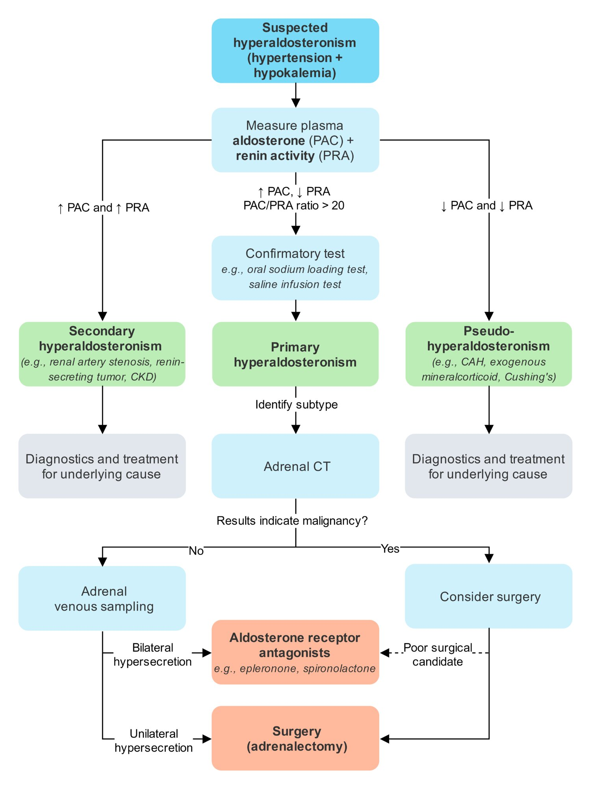
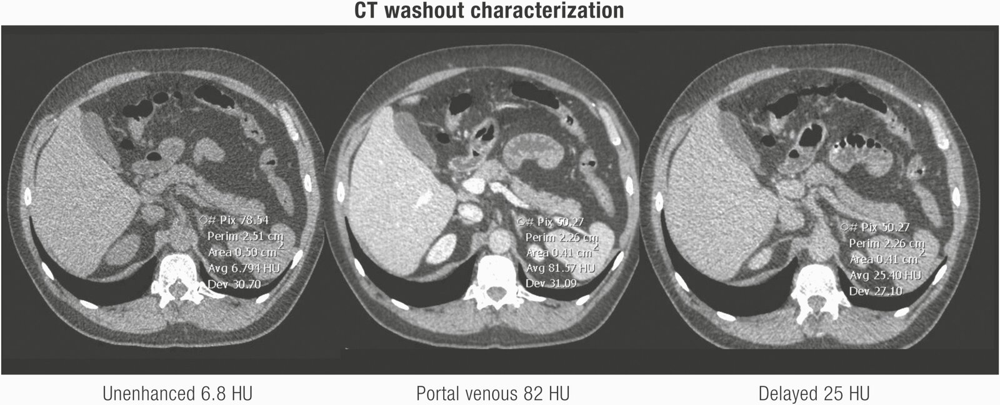

# Primary hyperaldosteronism

*Categories: Clinical knowledge > Internal medicine > Endocrinology > Adrenal glands disorders > Primary hyperaldosteronism*

[Original Article Link](https://coursology-qbank.com/amboss/article/2g0Tu2)

---

## Summary

Primary hyperaldosteronism, sometimes referred to as Conn syndrome, is an excess of <u>aldosterone</u> caused by autonomous overproduction. It is typically due to <u>adrenal hyperplasia</u> (most commonly bilateral) or <u>adrenal adenoma</u> (typically unilateral). Primary hyperaldosteronism is a common cause of <u>secondary hypertension</u>, occurring in > 5–12% of hypertensive patients. High systemic <u>aldosterone</u> levels result in increased renal <u>sodium</u> reabsorption and <u>potassium</u> secretion, which lead to water retention and <u>hypokalemia</u>. Patients are often asymptomatic and found to have <u>hypertension</u> at routine health checks. <u>Hypertension</u> due to primary hyperaldosteronism is often resistant to pharmacotherapy, and patients may have other <u>signs suggestive of secondary hypertension</u>, such as onset before the age of 30 or after the age of 55. If symptoms are present, these are usually manifestations of <u>hypokalemia</u> (e.g., <u>headache</u>, <u>muscle weakness</u>, and <u>polyuria</u>). Initial <u>laboratory values</u> in primary hyperaldosteronism classically show <u>hypokalemia</u>, <u>metabolic alkalosis</u>, high <u>plasma aldosterone concentration</u> (<u>PAC</u>), and low <u>plasma renin activity</u> (<u>PRA</u>). The plasma <u>aldosterone-to-renin ratio</u> is the initial <u>screening test</u>, followed by <u>confirmatory testing</u>. Further subtyping with imaging and/or <u>adrenal venous sampling</u> can determine whether <u>aldosterone</u> hypersecretion is unilateral or bilateral, which guides management. Treatment of unilateral disease consists of surgical resection, whereas bilateral disease is managed medically with <u>aldosterone antagonists</u> (e.g., <u>spironolactone</u>, <u>eplerenone</u>).

---

## Epidemiology

* <u>Prevalence</u>: estimated to be between 5 and 12% in hypertensive patients  [[1]](https://coursology-qbank.com/amboss/article/USXb_x)

* Sex

* <u>Aldosterone-producing adrenal adenoma</u>: <u>♀</u> > <u>♂</u> (2:1)

* <u>Adrenal hyperplasia</u> <u>♂</u> > <u>♀</u> (4:1)

Epidemiological data refers to the US, unless otherwise specified.

---

## Etiology

* Primary hyperaldosteronism (Conn syndrome) is caused by autonomous overproduction of <u>aldosterone</u> in the <u>zona glomerulosa</u> of one or both <u>adrenal glands</u> (see “<u>Hormones of the adrenal cortex</u>”).

* Most commonly due to the following conditions: [[2]](https://coursology-qbank.com/amboss/article/G6XBm_)

* Bilateral <u>idiopathic hyperplasia of the adrenal glands</u> (∼ 60%)

* <u>Aldosterone-producing adrenal adenoma</u> or aldosteronoma (∼ 30%)

* Less common causes include:

* Unilateral <u>hyperplasia</u> of one <u>adrenal gland</u>

* <u>Aldosterone</u>-secreting <u>carcinomas</u> of the <u>adrenal cortex</u>

* Familial hyperaldosteronism (e.g., <u>FH-I</u>) [[3]](https://coursology-qbank.com/amboss/article/pL0LAg)

* A genetic cause of primary hyperaldosteronism that may respond to different treatment options  [[4]](https://coursology-qbank.com/amboss/article/SuXyq-)

* More likely in patients with primary hyperaldosteronism at a young age (< 20 years), a <u>family history</u> of hyperaldosteronism, and/or a <u>family history</u> of early <u>stroke</u> [[3]](https://coursology-qbank.com/amboss/article/pL0LAg)[[5]](https://coursology-qbank.com/amboss/article/NuX-r-)

* Ectopic aldosterone production

* Autonomous <u>aldosterone</u> production that occurs outside the <u>adrenal gland</u> (e.g., <u>aldosterone</u>-producing tumors in the <u>kidneys</u> or <u>ovaries</u>) [[6]](https://coursology-qbank.com/amboss/article/OhcIVX0)

* Specialized imaging may be needed to confirm the diagnosis (e.g., <u>PET scan</u>). [[7]](https://coursology-qbank.com/amboss/article/lhcvVX0)

---

## Pathophysiology

### Autonomous <u>aldosterone</u> secretion and <u>hypertension</u>

* Physiological <u>aldosterone</u> secretion is regulated by the <u>renin-angiotensin-aldosterone system</u> (<u>RAAS</u>) and occurs in response to the detection of <u>low blood pressure</u> in the <u>kidneys</u> (see “<u>Renin-angiotensin-aldosterone system</u>”).

* ↑ <u>Aldosterone</u> → ↑ open Na+ channels in <u>principal cells</u> of luminal membrane at the cortical <u>collecting ducts</u> of the <u>kidneys</u> → ↑ Na+ reabsorption and retention → water retention → <u>hypertension</u>  [[8]](https://coursology-qbank.com/amboss/article/_TX5tx)

* Aldosterone escape [[9]](https://coursology-qbank.com/amboss/article/zTXrtx)

* Definition: Evasion of the Na+-retaining effects of inappropriately elevated <u>aldosterone</u> levels in conditions such as primary hyperaldosteronism or <u>congestive heart failure</u>

* Mechanism: <u>sodium</u> and water retention → volume expansion → secretion of <u>atrial natriuretic peptide</u> (<u>ANP</u>) and pressure <u>natriuresis</u> → compensatory diuresis → “<u>escape</u>” from <u>edema</u> formation and <u>hypernatremia</u>

> [!TIP]
> In <u>edematous</u> disorders the <u>aldosterone escape</u> mechanism is impaired, resulting in worsening <u>edema</u>.

### <u>Hypokalemia</u> and <u>metabolic alkalosis</u>

* ↑ Na+ reabsorption → electronegative lumen → electrical gradient through open <u>K+</u> channels → ↑ <u>K+</u> secretion → <u>hypokalemia</u>

* <u>Hypokalemia</u> → <u>metabolic alkalosis</u> via two mechanisms (both of which decrease extracellular H+, thereby increasing extracellular <u>pH</u>):

* Efflux of <u>K+</u> from intracellular to <u>extracellular space</u> in exchange for H+

* ↑ H+ secretion in the <u>kidney</u> in order to enable ↑ <u>K+</u> reabsorption

* <u>Diabetes insipidus</u>: <u>hypokalemia</u> → desensitization of renal tubules to <u>antidiuretic hormone</u> (<u>ADH</u>) → <u>polyuria</u> and <u>polydipsia</u>

---

## Clinical features

* <u>Hypertension</u>

* Sustained systolic blood pressure > 150 mm Hg or <u>diastolic</u> > 100 mm Hg over three measurements on three different days

* Systolic blood pressure > 140 mm Hg or <u>diastolic</u> > 90 mm Hg AND resistant to three-drug therapy with an adrenergic inhibitor, a <u>vasodilator</u>, and a <u>diuretic</u>

* See “<u>Secondary hypertension</u>.”

* Features of <u>hypokalemia</u> 

* Fatigue

* <u>Muscle weakness</u>, cramping

* <u>Headaches</u>

* <u>Paresthesia</u> in severe cases due to <u>metabolic alkalosis</u>

* <u>Polyuria</u> and <u>polydipsia</u>

* <u>Palpitations</u>

* <u>Constipation</u>

* Absence of significant <u>edema</u> (due to <u>aldosterone escape</u>)

> [!TIP]
> Primary hyperaldosteronism is characterized by <u>hypokalemia</u> and drug-<u>resistant hypertension</u>.

---

## Diagnosis

### Approach [[3]](https://coursology-qbank.com/amboss/article/pL0LAg)

* Determine whether diagnostic evaluation is warranted. Indications for diagnostic evaluation include:

* <u>Resistant hypertension</u> despite combination therapy with 3 <u>antihypertensives</u>

* <u>Family history</u> positive for:

* <u>First-degree relative</u> with primary hyperaldosteronism

* <u>Hypertension</u> or <u>cerebrovascular accident</u> at < 40 years of age

* <u>Hypokalemia</u> ;  [[3]](https://coursology-qbank.com/amboss/article/pL0LAg)[[10]](https://coursology-qbank.com/amboss/article/2MXTLA)

* Spontaneous or induced by <u>diuretics</u> [[10]](https://coursology-qbank.com/amboss/article/2MXTLA)

* Possibly associated with mild <u>hypernatremia</u> and/or <u>metabolic alkalosis</u> [[11]](https://coursology-qbank.com/amboss/article/LuXw7-)

* <u>Adrenal incidentaloma</u> on prior imaging

* <u>Sleep apnea</u> [[3]](https://coursology-qbank.com/amboss/article/pL0LAg)

* Eliminate <u>confounding</u> factors, e.g.: 

* Correct <u>hypokalemia</u> and encourage normal salt intake prior to testing.  [[3]](https://coursology-qbank.com/amboss/article/pL0LAg)[[12]](https://coursology-qbank.com/amboss/article/E8X8o-)

* Discontinue agents known to affect <u>renin</u> levels and use an alternative agent.  [[3]](https://coursology-qbank.com/amboss/article/pL0LAg)

* Perform <u>screening tests</u>: Measure the <u>plasma aldosterone concentration</u> (<u>PAC</u>) and <u>plasma renin activity</u> (<u>PRA</u>) to determine the <u>aldosterone-to-renin ratio</u> (<u>ARR</u>).

* Positive <u>screening tests</u>

* Confirm diagnosis (e.g., <u>oral sodium loading test</u> or <u>saline infusion test</u>)

* Identify subtype and etiology  and determine treatment

* Negative <u>screening tests</u>

* Consider repeating <u>screening tests</u> if the likelihood of primary hyperaldosteronism remains high.

* Consider other <u>causes of secondary hypertension</u>.

> [!TIP]
> Agents known to affect <u>renin</u> levels include <u>aldosterone receptor antagonists</u>, <u>ACE inhibitors</u>, and <u>potassium</u>-wasting <u>diuretics</u>. Alternatives include <u>alpha blockers</u> and <u>hydralazine</u>.

Diagnostic approach to hyperaldosteronism

### Screening: aldosterone-to-renin ratio (<u>ARR</u>) [[3]](https://coursology-qbank.com/amboss/article/pL0LAg)[[12]](https://coursology-qbank.com/amboss/article/E8X8o-)[[13]](https://coursology-qbank.com/amboss/article/s6Xtm_)

The <u>aldosterone-to-renin ratio</u> (<u>ARR</u>) is used to screen for primary hyperaldosteronism and differentiate it from other causes of elevated <u>aldosterone</u> (e.g., <u>secondary hyperaldosteronism</u>). [[14]](https://coursology-qbank.com/amboss/article/Nhc-VX0)

* Considerations

* Compares the <u>plasma aldosterone concentration</u> (<u>PAC</u>) to the <u>plasma renin activity</u> (<u>PRA</u>)

* Results are easily affected by external factors

* Low <u>specificity</u>  and variable <u>sensitivity</u> : Some sources recommend testing more than once for reliable screening.  [[3]](https://coursology-qbank.com/amboss/article/pL0LAg)[[12]](https://coursology-qbank.com/amboss/article/E8X8o-)[[13]](https://coursology-qbank.com/amboss/article/s6Xtm_)

* Interpretation

* ↑ <u>ARR</u>: positive screening result (cutoffs vary)  [[3]](https://coursology-qbank.com/amboss/article/pL0LAg)[[15]](https://coursology-qbank.com/amboss/article/v8XAo-)

* ↑ <u>PAC</u>: verifies elevated <u>aldosterone</u> and decreases <u>false positive</u> results compared to using <u>ARR</u> alone

* Example: <u>ARR</u> > 20 (preferably with <u>PAC</u> > 15 ng/dL) suggests elevated <u>aldosterone</u> and suppressed <u>renin</u>.

> [!NOTE]
> Patients with primary hyperaldosteronism have elevated <u>aldosterone</u> levels (<u>PAC</u>) that cause decreased <u>renin</u> activity (<u>PRA</u>), resulting in an elevated <u>ARR</u>. [(↑ <u>PAC</u>/↓ <u>PRA</u>) = ↑↑ <u>ARR</u>] [[3]](https://coursology-qbank.com/amboss/article/pL0LAg).

### Confirmatory testing in hyperaldosteronism [[3]](https://coursology-qbank.com/amboss/article/pL0LAg)[[5]](https://coursology-qbank.com/amboss/article/NuX-r-)[[12]](https://coursology-qbank.com/amboss/article/E8X8o-)[[13]](https://coursology-qbank.com/amboss/article/s6Xtm_)

A specialist will order <u>confirmatory testing</u> to verify that <u>aldosterone</u> production is nonsuppressible (i.e., not regulated by the <u>RAAS</u>).

* Test options

* Oral sodium loading test

* Ensure high <u>sodium</u> intake for 3 days and collect 24-hour urine <u>aldosterone</u> on the last day.

* Primary hyperaldosteronism is highly likely if urinary <u>aldosterone</u> > 12 mcg/day

* Saline infusion test

* Draw baseline <u>laboratory studies</u> (e.g., <u>PRA</u>, <u>PAC</u>), infuse <u>normal saline</u> over 4 hours, and draw <u>laboratory studies</u> again.

* Primary hyperaldosteronism is very probable in patients with <u>aldosterone</u> levels > 10 ng/dL

* Others: fludrocortisone suppression test or captopril suppression test

* Interpretation 

* <u>Aldosterone</u> suppression after interventions: primary hyperaldosteronism unlikely. Consider other diagnoses.

* No <u>aldosterone</u> suppression after interventions: primary hyperaldosteronism confirmed

### Determining the subtype

Once hyperaldosteronism is confirmed, imaging helps determine the underlying cause and select treatment.

#### Adrenal CT scan [[3]](https://coursology-qbank.com/amboss/article/pL0LAg)

<u>Adrenal</u> CT excludes large tumors and helps differentiate possible surgical candidates (e.g., unilateral <u>adenoma</u>) from nonsurgical candidates (e.g., bilateral <u>adrenal hyperplasia</u>).  [[3]](https://coursology-qbank.com/amboss/article/pL0LAg)

* Indication: recommended as initial imaging modality after <u>confirmatory tests</u> (preferred over <u>MRI</u>)

* Findings [[3]](https://coursology-qbank.com/amboss/article/pL0LAg)

* Bilateral or unilateral <u>adrenal hyperplasia</u>: may appear normal or show nodular changes

* <u>Aldosterone-producing adrenal adenoma</u>: <u>hypodense</u> <u>nodules</u> < 2 cm

* <u>Aldosterone</u>-producing <u>adrenal</u> <u>carcinomas</u>: large masses, usually > 4 cm, with potential features of <u>malignancy</u>

Adrenal adenoma

#### Adrenal venous sampling (<u>AVS</u>) [[3]](https://coursology-qbank.com/amboss/article/pL0LAg)[[5]](https://coursology-qbank.com/amboss/article/NuX-r-)

<u>AVS</u> is the <u>gold standard</u> for biochemically differentiating unilateral <u>aldosterone</u> overproduction from bilateral <u>aldosterone</u> overproduction. [[3]](https://coursology-qbank.com/amboss/article/pL0LAg)

* Indications: Both of the following criteria must be met.

* <u>Adrenal</u> CT suggestive of unilateral hyperaldosteronism

* Surgical intervention is desired and feasible   [[3]](https://coursology-qbank.com/amboss/article/pL0LAg)

* Procedure: catheterization of both <u>adrenal veins</u> and a peripheral <u>vein</u> (e.g., <u>IVC</u>) under <u>fluoroscopy</u> followed by a measurement of the <u>aldosterone</u>-to-<u>cortisol</u> <u>ratio</u> of each <u>vein</u>

* Findings [[3]](https://coursology-qbank.com/amboss/article/pL0LAg)

* Unilateral disease: significant difference in the <u>aldosterone</u>-to-<u>cortisol</u> <u>ratio</u> between the right and left <u>adrenal veins</u>

* Bilateral disease: little to no difference in <u>ratios</u> between the two <u>adrenal gland</u> <u>veins</u>

#### Additional testing for rare causes of primary hyperaldosteronism

When the underlying cause of primary hyperaldosteronism remains unclear or if specific criteria are met, a specialist may order further testing to evaluate for rare causes, e.g., <u>familial hyperaldosteronism</u> or <u>ectopic aldosterone production</u> (see “Etiology”).

---

## Differential diagnoses

### Secondary hyperaldosteronism

* Etiology

* <u>Renal artery stenosis</u> (e.g., due to <u>atherosclerosis</u>, <u>fibromuscular dysplasia</u>)

* <u>Renin</u>-secreting <u>tumor</u>

* <u>Chronic kidney disease</u>

* Advanced <u>CHF</u>

* <u>Fibromuscular dysplasia</u>

* <u>Liver cirrhosis</u>

* <u>Diuretics</u>

* <u>Laxative abuse</u>

* Diagnostics: ↑ <u>PAC</u> and ↑ <u>PRA</u>

### Pseudohyperaldosteronism

* Etiology

* <u>Congenital adrenal hyperplasia</u>

* <u>Exogenous</u> <u>mineralocorticoid</u>

* <u>Cushing syndrome</u>

* <u>Liddle syndrome</u>

* <u>DOC</u>-producing <u>tumor</u>

* <u>11β-hydroxysteroid dehydrogenase</u> deficiency

* Altered <u>aldosterone</u> metabolism

* <u>Glucocorticoid</u> resistance

* Excessive licorice ingestion: Excessive consumption of licorice can lead to inhibition of <u>cortisol</u> degradation → <u>hypertension</u> associated with <u>hypokalemia</u>.

* Diagnostics

* <u>Hypokalemia</u>

* ↓ <u>PAC</u> and ↓ <u>PRA</u>

The differential diagnoses listed here are not exhaustive.

---

## Treatment

### General principles [[3]](https://coursology-qbank.com/amboss/article/pL0LAg)

* Goals of management

* Reducing blood pressure

* Limiting <u>end-organ damage</u>

* Unilateral disease or <u>adrenal carcinoma</u>: <u>surgery</u> preferred

* Bilateral disease: medical management preferred

### Surgical treatment of hyperaldosteronism [[3]](https://coursology-qbank.com/amboss/article/pL0LAg)[[5]](https://coursology-qbank.com/amboss/article/NuX-r-)

* Indications: confirmed unilateral <u>adrenal</u> hyperaldosteronism in patients with no contraindications to <u>surgery</u> 

* Unilateral <u>aldosterone</u>-producing <u>adenoma</u> (most common)

* Unilateral <u>adrenal hyperplasia</u>

* <u>Adrenal carcinoma</u>

* Procedure: <u>laparoscopic</u> unilateral <u>adrenalectomy</u>

* Additional considerations

* Correct <u>hypokalemia</u> prior to <u>surgery</u>.

* Monitor for <u>hyperkalemia</u> immediately following the <u>surgery</u>.  [[3]](https://coursology-qbank.com/amboss/article/pL0LAg)

* Serial monitoring of blood pressure and <u>ARR</u> on an outpatient basis is recommended. [[3]](https://coursology-qbank.com/amboss/article/pL0LAg)[[5]](https://coursology-qbank.com/amboss/article/NuX-r-)

### Medical management of hyperaldosteronism [[3]](https://coursology-qbank.com/amboss/article/pL0LAg)

* Indications

* Bilateral hyperaldosteronism

* Unilateral hyperaldosteronism in the following situations:

* When <u>surgery</u> is not desired by the medical team and/or patient

* Refractory <u>hypertension</u> despite <u>surgery</u>

* First-line: <u>aldosterone receptor antagonists</u> 

* <u>Spironolactone</u> (preferred) DOSAGE

* <u>Eplerenone</u> DOSAGE

* Other agents

* Consider additional <u>antihypertensives</u>  to decrease the dose of <u>aldosterone antagonists</u> and/or reduce their side effects.

* <u>Glucocorticoids</u> : indicated only for the treatment of <u>FH-I</u> (rare)  [[3]](https://coursology-qbank.com/amboss/article/pL0LAg)[[4]](https://coursology-qbank.com/amboss/article/SuXyq-)

---