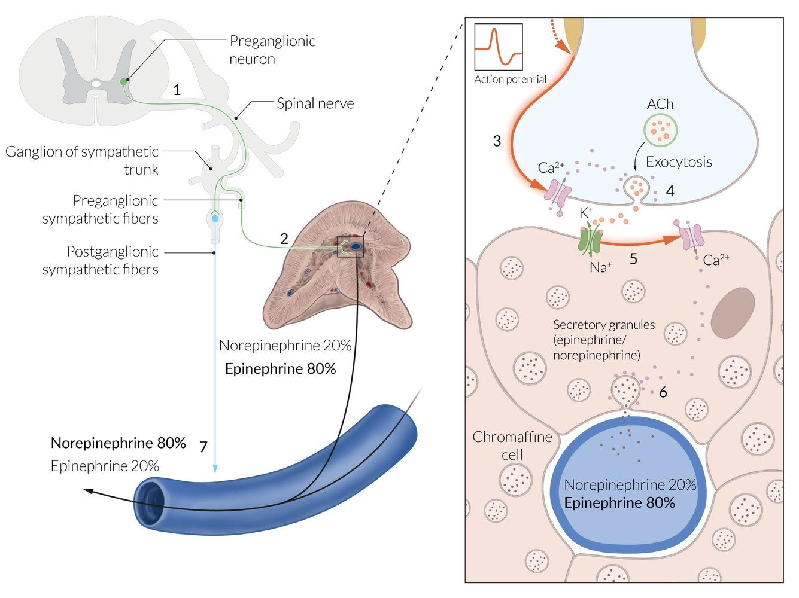
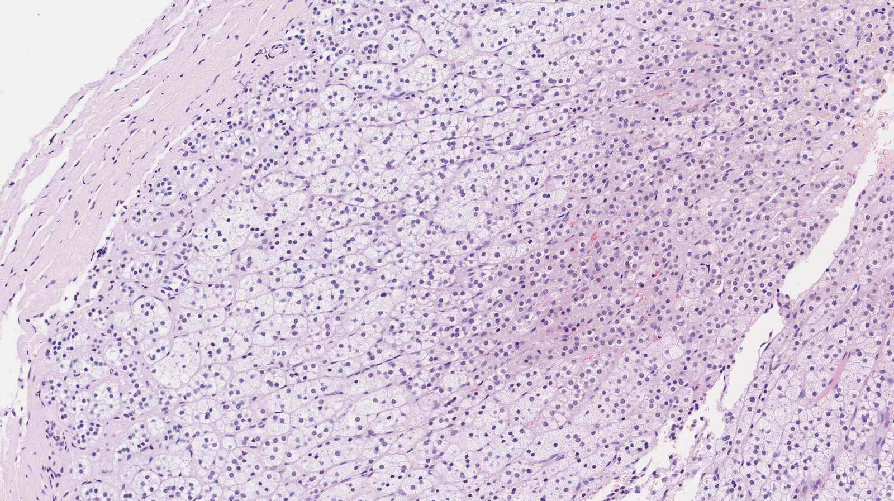
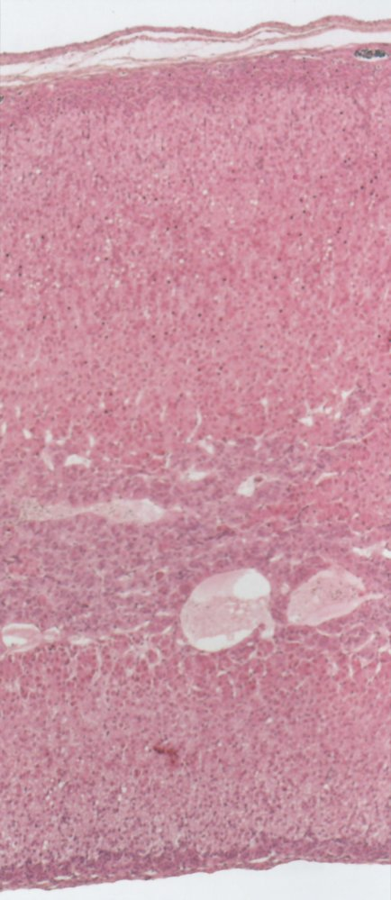
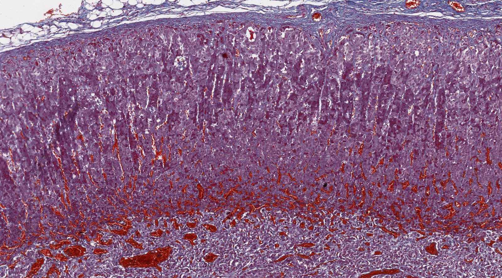
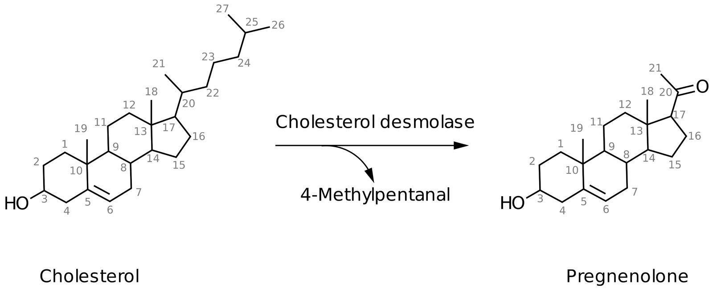
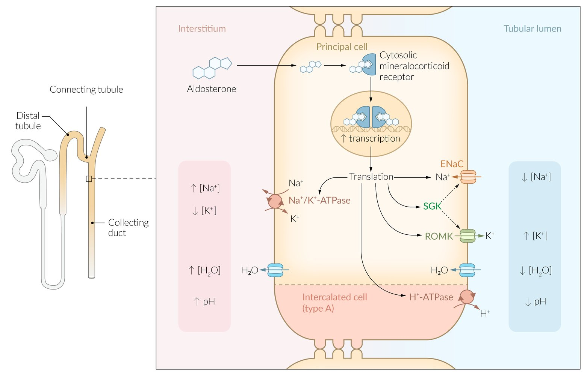
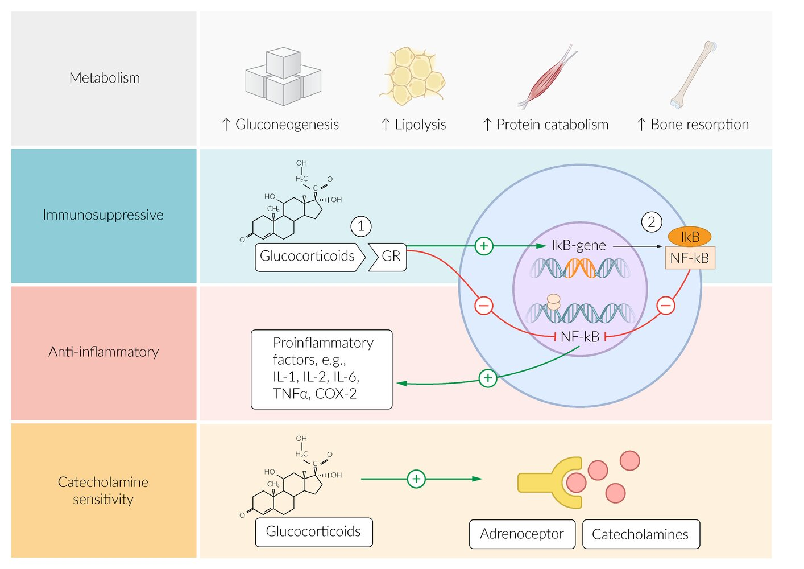
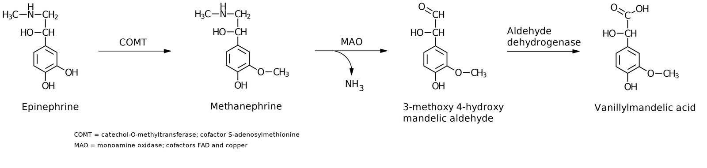

# Adrenal gland

*Categories: Clinical knowledge > Internal medicine > Endocrinology > Basics of endocrinology and metabolism > Adrenal gland*

[Original Article Link](https://coursology-qbank.com/amboss/article/V60GPS)

---

## Summary

The adrenal gland is a paired <u>retroperitoneal organ</u> located on the upper pole of each <u>kidney</u>. It receives its arterial supply from the superior, middle, and <u>inferior suprarenal arteries</u> and drains into the right and <u>left suprarenal veins</u>. The <u>lymphatics</u> drain into the left aortic and the right caval <u>lymph nodes</u>. The adrenal gland has two layers: the <u>adrenal cortex</u> (outer layer), which is derived from the <u>mesoderm</u>, and the <u>adrenal medulla</u> (inner layer), which is derived from <u>neural crest cells</u>. The <u>adrenal medulla</u> is composed of <u>chromaffin cells</u>, which secrete <u>catecholamines</u> (<u>norepinephrine</u>, <u>epinephrine</u>, <u>dopamine</u>). The <u>adrenal cortex</u> consists of three layers: the <u>zona glomerulosa</u>, the <u>zona fasciculata</u>, and the <u>zona reticularis</u>, which are responsible for the <u>synthesis of mineralocorticoids</u>, <u>glucocorticoids</u>, and <u>androgens</u> (precursors for <u>estrogen</u> and <u>testosterone</u>), respectively. <u>Mineralocorticoids</u> regulate renal <u>sodium</u> and water reabsorption and <u>potassium</u> excretion, while <u>glucocorticoids</u> play an important role in <u>glucose metabolism</u>. Diseases of the adrenal glands include <u>adrenal insufficiency</u> (due to an infection, hemorrhage, or autoimmune destruction), hyperaldosteronism (due to <u>hyperplasia</u> or <u>adenoma</u>), and <u>hypercortisolism</u> (due to <u>hyperplasia</u>, <u>adenoma</u>, or <u>exogenous</u> administration).

---

## Gross anatomy

### Overview

* Description: : a bilateral endocrine gland composed of an outer cortex that produces <u>steroid hormones</u> and inner medulla that produces <u>catecholamines</u> (e.g., <u>epinephrine</u>).

* Morphology

* Height and thickness: ∼ 5 cm

* Width: 1–2 cm

* The left adrenal gland is shaped like a crescent, while the right resembles a pyramid. [[1]](https://coursology-qbank.com/amboss/article/_pb5Hu)

* Location

* <u>Primary retroperitoneal organs</u>

* Each gland is located superior to the upper pole of the <u>kidney</u>.

* Enclosed by the renal <u>fascia</u> and <u>adipose capsule of the kidney</u>

* <u>Embryology</u> [[2]](https://coursology-qbank.com/amboss/article/zpbrHu)

* <u>Adrenal cortex</u>: derived from <u>mesothelial</u> cells

* <u>Adrenal medulla</u>: derived from <u>chromaffin cells</u>, which originate in the <u>neural crest</u> and migrate to the paraganglia and <u>adrenal medulla</u> during <u>embryonic development</u>

### Function

* <u>Adrenal cortex</u>: production of <u>steroid hormones</u> (<u>mineralocorticoids</u>, <u>glucocorticoids</u>, and <u>androgens</u>)

* <u>Adrenal medulla</u>: production of <u>catecholamines</u> (<u>epinephrine</u>, <u>norepinephrine</u>)

### Blood supply and <u>lymphatics</u>

Because the adrenal glands produce and subsequently release a number of essential <u>hormones</u>, they are very well vascularized and <u>perfused</u>.

* Arterial blood supply 

* <u>Superior suprarenal artery</u>

* <u>Middle suprarenal artery</u>

* <u>Inferior suprarenal artery</u>

* Venous drainage 

* The <u>right suprarenal vein</u> drains into the <u>inferior vena cava</u>.

* The <u>left suprarenal vein</u> drains into the left <u>renal vein</u> and then into the <u>inferior vena cava</u>.

* <u>Lymphatic drainage</u>

* Left aortic <u>lymph nodes</u>

* Right caval <u>lymph nodes</u>

> [!TIP]
> Venous drainage is different for the left and right adrenal gland. The <u>left suprarenal vein</u> empties into the left <u>renal vein</u>, while the <u>right suprarenal vein</u> drains into the <u>inferior vena cava</u>.

Abdominal aorta and inferior vena cava

### Innervation  [[3]](https://coursology-qbank.com/amboss/article/sJbtvu)

* <u>Sympathetic</u>: <u>preganglionic</u> <u>sympathetic</u> fibers from the major and minor <u>splanchnic nerves</u>

* <u>Parasympathetic</u>: fibers from phrenic and <u>vagal nerve</u>

Sympathetic innervation of the adrenal medulla

---

## Microscopic anatomy

### Adrenal cortex

* Overview: The <u>adrenal cortex</u> is surrounded by a fibrous capsule and composed of three main zones (or layers).

* Zones  

* Zona glomerulosa

* Outermost layer

* Cells are arranged in oval <u>clusters</u> surrounded by <u>connective tissue</u> from the fibrous capsule.

* Main site of <u>aldosterone</u> production

* Zona fasciculata

* Located between the <u>zona glomerulosa</u> and <u>zona reticularis</u>

* Cells are arranged in straight columns that are separated by small fibrous septa.

* Main site of <u>glucocorticoid</u> production

* Zona reticularis

* Inner cortical layer

* Small cells are arranged in an irregular netlike formation surrounded by <u>connective tissue</u> and <u>capillaries</u>.

* Main site of <u>androgen</u> production

> [!NOTE]
> To remember the microscopic anatomy and functions of the <u>adrenal cortex</u> going from outside to inside, think “<u>GFR</u>, the deeper you go, the sweeter it gets: Salt (<u>aldosterone</u>, zona Glomerulosa), Sugar (<u>glucocorticoids</u>, zona Fasciculata), and Sex (<u>androgens</u>, zona Reticularis).”

Location and microscopic anatomy of the adrenal gland

Layers of the adrenal cortex

Adrenal gland

### Adrenal medulla

* Overview: : The <u>adrenal medulla</u> is surrounded by the <u>adrenal cortex</u> and made up of modified <u>sympathetic</u> <u>postganglionic neurons</u>. [[4]](https://coursology-qbank.com/amboss/article/aJbQsu)

* Organization 

* Contains large, irregularly shaped, chromaffin cells with many secretory granules for <u>catecholamine</u> storage

* Arranged in <u>clusters</u> and grouped around <u>fenestrated capillaries</u>

* Tumors originating from <u>chromaffin cells</u> are called <u>pheochromocytomas</u>.

> [!NOTE]
> The cells of the <u>adrenal medulla</u> are modified <u>sympathetic</u> cells that are controlled by cholinergic <u>synapses</u>.

Location and microscopic anatomy of the adrenal gland

Transition zone of the adrenal cortex to the adrenal medulla

---

## Hormones of the adrenal cortex

Synthesis of all <u>steroid hormones</u> begins with the common precursor molecule, <u>cholesterol</u>, which is converted into <u>pregnenolone</u> via cholesterol desmolase. <u>Cholesterol desmolase</u> can be inhibited by <u>azole antifungals</u>.

| Overview of the <u>hormones of the adrenal cortex</u> |  |  |  |
| --- | --- | --- | --- |
| Features | <u>Aldosterone</u> | <u>Cortisol</u> | <u>Dehydroepiandrosterone</u> (<u>DHEA</u>) |
| <u>Hormone</u> class |  * <u>Mineralocorticoid</u>   |  * <u>Glucocorticoid</u>   |  * <u>Androgen</u>   |
| Production site |  * <u>Zona glomerulosa</u>   |  * <u>Zona fasciculata</u>   |  * <u>Zona reticularis</u>   |
| Function |   * <u>Blood pressure regulation</u>: influences renal <u>sodium</u> and water reabsorption and <u>potassium</u> excretion  * <u>Electrolyte</u> <u>homeostasis</u>  * See “<u>Mineralocorticoids</u>.”    |   * Mobilization of energy reserves  * <u>Immunosuppression</u>  * Antiinflammatory  * See “<u>Cortisol</u>.”    |   * Substrate in <u>estrogen</u> and <u>testosterone</u> synthesis  * See “<u>Androgens</u>.”    |
|  Regulation of secretion    |  * <u>Renin-angiotensin-aldosterone system</u> (<u>RAAS</u>)   |  * <u>CRH</u> → ↑ secretion of <u>ACTH</u> in the <u>pituitary gland</u> → ↑ secretion of <u>glucocorticoids</u> and <u>androgens</u> in the <u>adrenal cortex</u>   |  |
| Associated disorders |   * <u>Primary hyperaldosteronism</u>  * <u>Adrenal insufficiency</u>  * <u>Congenital adrenal hyperplasia</u>    |   * <u>Cushing syndrome</u>  * <u>Adrenal insufficiency</u>  * <u>Congenital adrenal hyperplasia</u>    |   * <u>Adrenal insufficiency</u>  * <u>Congenital adrenal hyperplasia</u>    |

> [!NOTE]
> <u>RAAS</u> regulates the release of <u>mineralocorticoids</u>.

Biosynthesis of pregnenolone

Action of aldosterone on renal tubular epithelial cells

Regulation of the hypothalamic-pituitary-adrenal axis

---

## Mineralocorticoids

### Mineralocorticoid synthesis

|  Biosynthesis of <u>aldosterone</u>   |  |  |  |
| --- | --- | --- | --- |
| Steps | Precursor | Enzyme | Product |
| 1. |  * <u>Pregnenolone</u>   |  * 3β-hydroxysteroid dehydrogenase   |  * <u>Progesterone</u>   |
| 2. |  * <u>Progesterone</u>   |  * 21-hydroxylase   |  * <u>11-deoxycorticosterone</u>   |
| 3. |  * 11-deoxycorticosterone   |  * 11β-hydroxylase and <u>aldosterone synthase</u>   |  * <u>Corticosterone</u>   |
| 4. |  * Corticosterone   |  * Aldosterone synthase   |  * <u>Aldosterone</u>   |

Biosynthesis of adrenal steroid hormones

### Mineralocorticoid function

* Mechanism of action: aldosterone binds to intracellular <u>mineralocorticoid</u> <u>receptors</u> in the <u>distal</u> tubule and <u>collecting duct</u> of the <u>kidney</u>, inducing <u>protein synthesis</u> and following changes:  

* ↑ <u>Na+/K+-ATPase</u> in the basolateral membrane → transportation of Na+ out and <u>K+</u> into the tubule cells

* ↑ Apical H+-ATPase → H+ excretion

* ↑ Na+ channels (<u>ENaC</u>; <u>epithelial sodium channel</u>) → ↑ Na+reabsorption

* ↑ <u>K+</u> channels (<u>ROMK</u>; <u>renal outer medullary potassium channel</u>) in the luminal membrane → ↑ <u>K+</u> excretion

* Effects

* These <u>aldosterone</u>-induced changes produce a concentration gradient → Na+ reabsorption → water reabsorption;   and <u>K+</u> secretion into the urine.

* Ultimately, these effects → ↑ blood pressure, <u>hypokalemia</u>, and ↑ <u>pH</u> level.

> [!NOTE]
> <u>Aldosterone</u> stimulates <u>potassium</u> excretion in the <u>collecting duct</u> of the <u>kidney</u> as well as <u>sodium</u> and water retention.

Action of aldosterone on renal tubular epithelial cells

### Renin-angiotensin-aldosterone system (<u>RAAS</u>)

* Overview

* <u>Hormone</u> system that regulates blood pressure, <u>electrolyte</u> <u>homeostasis</u>, and <u>fluid balance</u>

* Important target for blood pressure medication (e.g., <u>ACE inhibitors</u>, <u>AT1 blockers</u>, <u>diuretics</u>) and involved in the development of cardiac conditions (e.g., <u>congestive heart failure</u>, <u>cardiac remodeling</u>)

* Feedback mechanism
1. * A stimulus triggers <u>renin</u> secretion.
2. * Renin promotes the conversion of angiotensinogen (produced in the <u>liver</u>) to angiotensin I (<u>AT I</u>).
3. * <u>AT I</u> is turned into angiotensin II via angiotensin-converting enzyme (highest concentration in the <u>lungs</u> where it is produced by vascular <u>endothelial</u> cells).
4. * <u>Angiotensin II</u> causes <u>vasoconstriction</u> and triggers the secretion of <u>aldosterone</u>.

* Regulation of secretion

* Positive feedback

* ↓ Renal <u>perfusion</u> (e.g., due to <u>hypotension</u>, stimulation of <u>β1 receptors</u> in the <u>kidney</u>) triggers <u>renin</u> release.

* ↑ Serum <u>potassium</u> concentration → stimulation of <u>zona glomerulosa</u> cells → ↑ secretion of <u>aldosterone</u>

* Negative feedback: ↑ systemic arterial blood pressure → <u>ANP</u> release from atrial <u>myocytes</u> → inhibition of <u>renin</u> release → <u>vasodilation</u>, <u>natriuresis</u>, and ↑ diuresis (see ”<u>Atrial natriuretic peptide</u>”) [[5]](https://coursology-qbank.com/amboss/article/UqbbBu)

Renin-angiotensin-aldosterone system

### Clinical significance

* <u>Primary adrenal insufficiency</u>

* <u>Congenital adrenal hyperplasia</u>

* <u>Primary hyperaldosteronism</u> (<u>Conn syndrome</u>) and <u>secondary hyperaldosteronism</u>

* <u>Hyperkalemic renal tubular acidosis</u> (type 4)

---

## Glucocorticoids

### Glucocorticoid synthesis

|  Biosynthesis of <u>cortisol</u>   |  |  |  |  |
| --- | --- | --- | --- | --- |
| Steps |  | Precursor |  Enzyme  | Product |
| 1. | <u>Pregnenolone</u> pathway |  * <u>Pregnenolone</u>   |  * 17α-hydroxylase   |  * 17-hydroxypregnenolone   |
| <u>Progesterone</u> pathway |  * <u>Pregnenolone</u>   |  * 3β-hydroxysteroid <u>dehydrogenase</u>   |  * <u>Progesterone</u>   |  |
| 2. | <u>Pregnenolone</u> pathway |  * 17-hydroxypregnenolone   |  * 3β-hydroxysteroid <u>dehydrogenase</u>   |  * <u>17-hydroxyprogesterone</u>   |
| <u>Progesterone</u> pathway |  * <u>Progesterone</u>   |  * <u>17α-hydroxylase</u>   |  |  |
| 3. | Common pathway |  * 17-hydroxyprogesterone   |  * <u>21-hydroxylase</u>   |  * <u>11-deoxycortisol</u>   |
| 4. | Common pathway |  * <u>11-deoxycortisol</u>   |  * <u>11-β-hydroxylase</u> (metyrapone inhibits this reaction)   |  * <u>Cortisol</u>   |

Biosynthesis of adrenal steroid hormones

Congenital adrenal hyperplasia on steroid pathway and affecting drugs

Quiz: synthesis of adrenal gland hormones

### Glucocorticoid function

* Metabolism: <u>Cortisol</u> plays an important role in the mobilization of energy reserves.

* ↑ <u>Gluconeogenesis</u> to maintain blood <u>glucose</u> levels

* ↑ <u>Glycogen synthesis</u> to maintain <u>glucose</u> storage

* ↑ <u>Protein catabolism</u>

* ↑ <u>Lipolysis</u>

* ↑ Appetite

* ↑ <u>Insulin resistance</u>

* <u>Immune system</u>: antiinflammatory and <u>immunosuppressive</u> effects (see “<u>Pharmacodynamics of glucocorticoids</u>”)

* <u>Wound healing</u>: <u>fibroblast</u> inhibition → ↓ <u>collagen synthesis</u> → ↓ wound healing

* Blood pressure: mild <u>mineralocorticoid</u> effect (stimulation of <u>aldosterone</u> <u>receptors</u> in high concentrations) and ↑ <u>potassium</u> excretion → ↑ blood pressure

See “<u>Side effects of glucocorticoid therapy</u>.”

> [!NOTE]
> To remember the effects of <u>cortisol</u>, think “A BIG FIB”: increased Appetite, Blood pressure, Insulin resistance, Glucose production, and decreased Fibroblasts, Immunity, and Bone formation.

Molecular effects of glucocorticoids

### <u>Hypothalamic</u>-<u>pituitary</u> gland-<u>adrenal cortex</u>

* Feedback mechanism: a stimulus causes increased secretion of <u>corticotropin</u>-releasing <u>hormone</u> (<u>CRH</u>) → ↑ secretion of <u>adrenocorticotropic hormone</u> (<u>ACTH</u>) in the <u>pituitary gland</u> → ↑ secretion of <u>glucocorticoids</u> in the <u>adrenal cortex</u>.

* Regulation of secretion

* Positive feedback: A number of stimuli can trigger <u>CRH</u> release.

* Psychological/physical <u>pain</u> and <u>stress</u>

* Pyrogens, <u>epinephrine</u>, <u>histamine</u>

* <u>Hypoglycemia</u>

* <u>Hypotension</u>

* Negative feedback: <u>Glucocorticoids</u> themselves trigger a negative feedback loop that inhibits the secretion of <u>CRH</u> and <u>ACTH</u>.

* <u>Circadian rhythm</u> [[6]](https://coursology-qbank.com/amboss/article/0qbeCu)

* <u>Endogenous</u> biological rhythm influences <u>CRH</u> secretion.

* <u>Cortisol</u> levels are highest early in the morning and decrease during the day, until they drop sharply during the night and the early <u>phase of sleep</u>.

> [!TIP]
> <u>Cortisol</u> inhibits the secretion of <u>CRH</u> and <u>ACTH</u> via negative feedback, which, in turn, results in a decrease in <u>cortisol</u> secretion.

Hormonal feedback control of the adrenal hormones

The Neuroendocrine System: Regulatory Processes

### Clinical significance

* <u>Adrenal insufficiency</u>

* <u>Congenital adrenal hyperplasia</u>

* <u>Hypocortisolism</u>

* <u>Hypercortisolism</u>

---

## Androgens

### Androgen synthesis [[7]](https://coursology-qbank.com/amboss/article/MPYM26)

|  Biosynthesis of <u>androgens</u>  |  |  |  |  |  |  |  |
| --- | --- | --- | --- | --- | --- | --- | --- |
| Steps |  | Precursor | Enzyme | Product |  |  |  |
|  1. | <u>Pregnenolone</u> pathway |  * <u>Pregnenolone</u>   |  * <u>17α-hydroxylase</u>   |  * 17-hydroxypregnenolone   |  |  |  |
| <u>Progesterone</u> pathway |  * <u>Progesterone</u>   |  * <u>17-hydroxyprogesterone</u>   |  |  |  |  |  |
|  2. | <u>Pregnenolone</u> pathway |  * 17-hydroxypregnenolone   |  * 17,20-lyase   |  * Dehydroepiandrosterone (<u>DHEA</u>)   |  |  |  |
| <u>Progesterone</u> pathway |  * <u>17-hydroxyprogesterone</u>   |  * Androstenedione (also synthesized in the <u>gonads</u>)   |  |  |  |  |  |
|  3. | <u>Pregnenolone</u> pathway |  * <u>DHEA</u>   |  * <u>3β-hydroxysteroid dehydrogenase</u>   |  * <u>Androstenedione</u>   |  |  |  |

* Further processing occurs in the target tissue: <u>gonads</u>, <u>brain</u>, <u>adipose tissue</u> , <u>skin</u>, bone, and <u>placenta</u> (see “Function” below).

* <u>17α-hydroxylase</u> defect causes a rare form of <u>CAH</u> involving <u>pseudohermaphroditism</u> in males and <u>delayed puberty</u> in females.

> [!NOTE]
> In both men and women, <u>DHEA</u> and <u>androstenedione</u> are produced in the <u>adrenal cortex</u>, which are precursors for <u>testosterone</u> and <u>estrogen</u>. <u>Testosterone</u> is produced by <u>Leydig cells</u> in the <u>testes</u> in men and, to a lesser degree, <u>ovarian stroma</u> in women.

> [!NOTE]
> AnDRostenedione comes from the <u>ADR</u>enal glands and TESTostetone from the TESTes.

Biosynthesis of adrenal steroid hormones

### Androgen function

Adrenal <u>androgens</u> <u>DHEA</u> and <u>androstenedione</u> serve as precursors of:

* <u>Androgens</u>

* <u>Androstenedione</u> is converted into <u>testosterone</u>, which is then transformed into <u>dihydrotestosterone</u> (DHT) via <u>5α-reductase</u> (defect leads to <u>5α-reductase deficiency</u>).

* <u>5α-reductase inhibitors</u> (e.g., <u>finasteride</u>) inhibit the conversion and are used in the <u>treatment of BPH</u>.

* <u>Estrogen</u>

* Aromatase converts <u>testosterone</u> into estradiol and <u>androstenedione</u>, which is then transformed into estrone.

* Synthesized in men and <u>postmenopausal</u> women

#### Effects of <u>androgens</u>

* <u>Androgens</u> influence male <u>sexual differentiation</u> during <u>embryonic development</u>.

* <u>Testosterone</u> stimulates the differentiation of the following structures:

* <u>Epididymis</u>

* <u>Vas deferens</u>

* <u>Seminal vesicles</u>

* <u>DHT</u> stimulates the differentiation of:

* <u>Prostate</u>

* <u>Penis</u>

* <u>Scrotum</u>

* Male <u>pubertal development</u> of <u>secondary sexual characteristics</u>;  (e.g., <u>growth spurt</u>, increased muscle mass, penile growth, deepening of the voice, <u>Adam's apple</u> growth, <u>acne</u>)

* <u>Spermatogenesis</u>

* Increased libido

* <u>Anabolic</u> effects on muscles and bones (<u>epiphyseal plates</u> closure due to increased conversion to <u>estrogen</u>)

* Increased secretion of <u>sebaceous glands</u>

* Stimulate <u>erythropoiesis</u> (↑ <u>RBCs</u>)

* Influence behavior

#### Effects of <u>estrogen</u>

* Female <u>sexual differentiation</u> during <u>embryonic development</u>

* Female <u>pubertal development</u> of <u>secondary sexual characteristics</u>

* See “<u>Estrogen</u> and associated diseases.”

> [!NOTE]
> Generally, the effects of <u>androgens</u> in women become apparent only in cases of <u>androgen excess</u> (e.g., <u>PCOS</u>, <u>androgen</u>-secreting tumors).

### <u>Hypothalamic</u>-<u>pituitary gland</u>-<u>adrenal cortex</u> feedback mechanism

* A stimulus triggers increased secretion of <u>CRH</u> → ↑ secretion of <u>ACTH</u> in the <u>pituitary gland</u> → ↑ secretion of <u>androgens</u> in the <u>adrenal cortex</u>.

### Clinical significance

* <u>Adrenal insufficiency</u>

* <u>Congenital adrenal hyperplasia</u>

* <u>Androgen</u>-secreting tumors

---

## Hormones of the adrenal medulla

### Catecholamine synthesis

<u>Catecholamines</u> (<u>norepinephrine</u>, <u>epinephrine</u>, <u>dopamine</u>) can also be synthesized at sites in the human body other than the <u>adrenal medulla</u>, such as specific regions of the <u>CNS</u>;   and <u>postganglionic</u> adrenergic <u>neurons</u>.

|  Biosynthesis of <u>catecholamines</u>    |  |  |  |  |  |
| --- | --- | --- | --- | --- | --- |
|  Step   | Precursor | Enzyme | <u>Cofactor</u> | Product |  |
| First <u>hydroxylation</u> |  * <u>Phenylalanine</u>   |  * <u>Phenylalanine hydroxylase</u>   |  * Tetrahydrobiopterin (<u>THB</u>)   |  * <u>Tyrosine</u>   |  |
| Second <u>hydroxylation</u> |  * <u>Tyrosine</u>   |  * Tyrosine hydroxylase   |  * DOPA (<u>3,4-dihydroxyphenylalanine</u>)   |  |  |
| <u>Decarboxylation</u> |  * <u>DOPA</u>   |  * DOPA decarboxylase   |  * <u>Pyridoxal phosphate</u> (<u>Vitamin B6</u>)   |  * <u>Dopamine</u>   |  |
| <u>Hydroxylation</u> of the β-C-Atom |  * <u>Dopamine</u>   |  * Dopamine β-monooxygenase   |  * <u>Vitamin C</u>   |  * <u>Norepinephrine</u>   |  |
| <u>Methylation</u> |  * <u>Norepinephrine</u>   |  * Phenylethanolamine-N-Methyltransferase (<u>PNMT</u>) (<u>cortisol</u> induces expression of <u>PNMT</u>)   |  * S-Adenosylmethionine (<u>SAM</u>)   |  * <u>Epinephrine</u>   |  |

> [!NOTE]
> <u>Epinephrine</u> has the shortest <u>half-life</u> of the <u>catecholamines</u>.

Biosynthesis and breakdown of catecholamines

### Catecholamine function

* Mechanism: <u>Catecholamines</u> bind to various <u>adrenergic receptors</u> (see table below) located on different organs and tissues.

* Effects

* Binding triggers tissue-specific responses.

* This leads to <u>sympathetic</u> activation to prepare the human body for a fight-or-flight reaction.

| Overview of peripheral <u>adrenergic receptors</u> |  |  |  |  |
| --- | --- | --- | --- | --- |
| <u>Receptor</u> | <u>G protein</u> | <u>Signal transduction</u> | Location | Effect |
| α1 |  * Gq   |  * Stimulation of <u>phospholipase C</u>: PIP2 → <u>IP3</u> and <u>DAG</u> → ↑ <u>Ca2+</u>   |  * Vasculature (<u>skin</u> and <u>GI tract</u>)   |  * ↑ Contraction of smooth muscles → <u>vasoconstriction</u>   |
|   * <u>GI tract</u>  * <u>Bladder</u>    |  * ↑ Constriction of sphincters   |  |  |  |
| α2 |  * Gi   |  * Inhibition of <u>adenylate cyclase</u>: ↓ <u>cAMP</u>   |  * <u>White adipose tissue</u>   |  * ↓ <u>Lipolysis</u>   |
|   * <u>GI tract</u>  * <u>Bladder</u>    |  * ↓ Muscular contraction   |  |  |  |
|  * <u>Pancreas</u>   |  * ↓ <u>Insulin</u> secretion   |  |  |  |
| β1 |  * Gs   |  * Stimulation of <u>adenylate cyclase</u>: ↑ <u>cAMP</u>   |  * <u>Heart</u>   |   * ↑ <u>Chronotrope</u>  * ↑ <u>Inotrope</u>  * ↑ <u>Dromotropy</u>    |
|  * <u>Kidney</u>   |  * ↑ <u>Renin</u> secretion   |  |  |  |
| β2 |   * Vasculature (coronary vessels, <u>skeletal muscles</u>)  * <u>Bronchi</u>    |  * ↓ Contraction of smooth musculature → <u>vasodilation</u> and bronchodilation   |  |  |
|   * <u>Liver</u>  * <u>Skeletal muscles</u>    |  * ↑ <u>Glycogenolysis</u>   |  |  |  |
|  * <u>White adipose tissue</u>   |  * ↑ <u>Lipolysis</u>   |  |  |  |
|  * <u>Pancreas</u>   |  * ↑ <u>Insulin</u> secretion   |  |  |  |
|  * <u>Uterus</u>   |  * <u>Tocolysis</u>   |  |  |  |
| β3 |  * <u>Brown adipose tissue</u>   |  * ↑ <u>Lipolysis</u>   |  |  |

### Regulation of secretion

* <u>Catecholamine</u> secretion can be triggered by a number of stimuli, such as high-<u>stress</u> situations (e.g., fight-or-flight) or <u>cortisol</u>.

### Catecholamine degradation

* Enzymatic degradation occurs via catechol-O-methyltransferase (<u>COMT</u>) and monoamine oxidase (<u>MAO</u>).

* <u>MAO</u> can be blocked by <u>MAO inhibitors</u> to elevate <u>catecholamine</u> concentration in <u>synaptic cleft</u>.

* 3,4-Dihydroxyphenylacetic acid (<u>DOPAC</u>) is a neuronal metabolite formed by the breakdown of <u>dopamine</u> by <u>monoamine oxidase</u>.

* Vanillylmandelic acid (<u>VMA</u>) is an end-stage metabolite. Urinary excretion is elevated in patients with <u>pheochromocytoma</u> and <u>neuroblastoma</u>.

### Clinical significance

* <u>Pheochromocytoma</u>

* <u>Neuroblastoma</u>

* <u>Hyperphenylalaninemia</u> and <u>phenylketonuria</u>

---