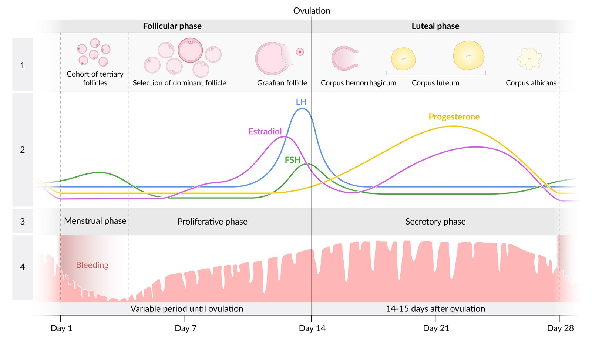
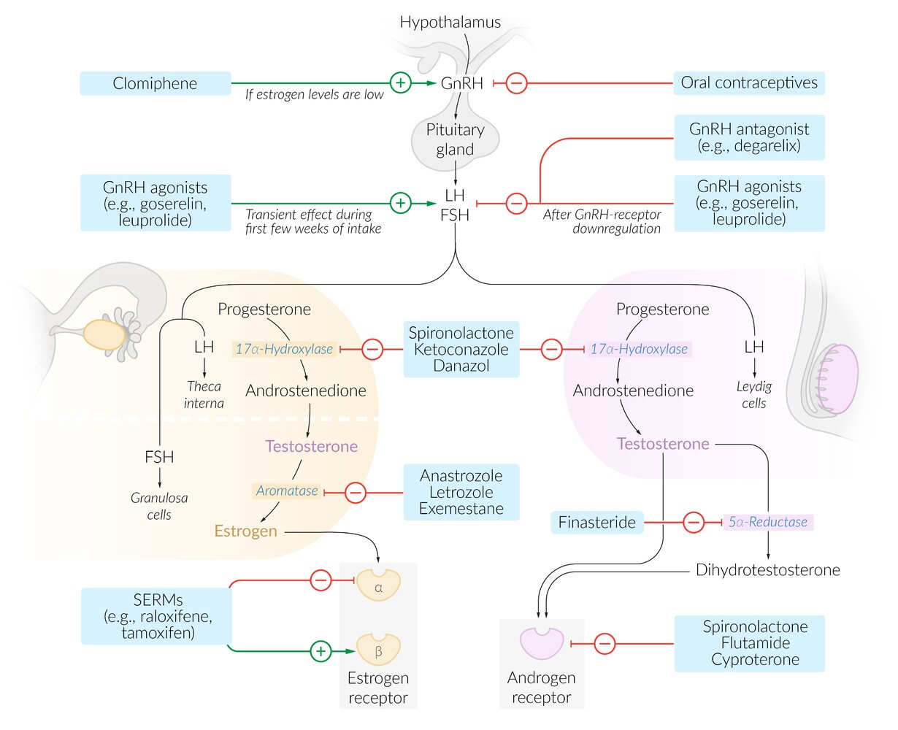

# Female sex hormones

*Categories: Clinical knowledge > Internal medicine > Endocrinology > Basics of endocrinology and metabolism > Female sex hormones*

[Original Article Link](https://coursology-qbank.com/amboss/article/uk0ppT)

---

## Summary

<u>Estrogen</u> is a female sex <u>hormone</u> that is produced in the <u>ovaries</u> and, to a lesser degree, in the <u>adrenal glands</u> and <u>adipose tissues</u>. It is essential for the development of primary and <u>secondary sex characteristics</u>, as well as function of the reproductive organs. <u>Estrogen</u> also plays a role in several other processes, including bone metabolism and <u>liver function</u>. While <u>ovarian insufficiency</u>, <u>aromatase deficiency</u>, and <u>hyperprolactinemia</u> result in pathologically low <u>estrogen</u> levels, a decrease in <u>estrogen</u> is a normal feature of <u>menopause</u>. Possible clinical features of <u>estrogen deficiency</u> include <u>menopausal</u> symptoms, vaginal and <u>endometrial</u> <u>atrophy</u>, and <u>osteoporosis</u>. Increased <u>estrogen</u> levels may also have adverse effects, including <u>gynecomastia</u>, <u>thrombosis</u>, and an increased risk of <u>breast</u> and <u>endometrial cancer</u>. <u>Progesterone</u> is a female sex <u>hormone</u> produced by the <u>corpus luteum</u> in nonpregnant women and, in pregnant women, by the <u>corpus luteum</u> graviditatis until the 10th week of <u>gestation</u>, after which the <u>placenta</u> takes over production. <u>Progesterone</u> plays an important role in the preparation of the <u>endometrium</u> for implantation of a fertilized <u>ovum</u> and maintenance of <u>pregnancy</u>. <u>Synthetic progesterone</u> derivatives are called “<u>progestins</u>” and are used as <u>contraceptives</u> and are used in the treatment of conditions resulting from <u>endometrial</u> <u>proliferation</u> (e.g., <u>endometriosis</u>, <u>endometrial cancer</u>).

---

## Overview

| Overview of female sex hormones |  |  |
| --- | --- | --- |
|  | <u>Estrogen</u> | <u>Progesterone</u> |
| Production |   * Ovarian <u>granulosa cells</u>  * <u>Fatty tissue</u>  * <u>Placenta</u>  * <u>Testicles</u>  * <u>Adrenal glands</u>    |   * In nonpregnant women: <u>granulosa cells</u> of the <u>corpus luteum</u>  * In pregnant women  * Until 10th week of <u>gestation</u>: <u>corpus luteum</u> graviditatis  * From 10th week of <u>gestation</u>: <u>placenta</u> (<u>syncytiotrophoblast</u>)    |
| Effects in <u>uterus</u> |   * <u>Endometrial</u> <u>proliferation</u>  * ↑ Myometrial excitability    |   * <u>Endometrial</u> glandular secretion and <u>spiral artery</u> development  * Inhibition of <u>endometrial</u> <u>proliferation</u>  * ↓ <u>Estrogen</u> <u>receptor</u> expression  * ↓ Myometrial excitability    |
| Effects in <u>cervix</u> |  * ↑ Production of cervical mucus (facilitates entry of <u>sperm</u>)   |  * ↓ Production of cervical mucus → thickening of cervical mucus (preventing the entry of <u>sperm</u> into the <u>uterus</u>)   |
| Effects in other tissues |   * Development of female <u>secondary sexual characteristics</u>  * Bone formation  * Water and <u>sodium</u> retention    |   * ↑ Body temperature (basis of the <u>basal body temperature method</u> of <u>contraception</u>)  * Inhibits <u>gonadotropin</u> secretion    |
| Effects of hyperproduction |   * ↑ Risk of <u>endometrial</u> and <u>breast cancer</u>  * ↑ Risk of <u>thrombosis</u>    |  * N/A   |
| Effects of hypoproduction |   * <u>Hot flashes</u>  * <u>Breast atrophy</u>  * ↓ <u>Bone density</u> and <u>secondary osteoporosis</u>  * <u>Urogenital atrophy</u>    |   * <u>Infertility</u>  * <u>Premature birth</u>, <u>spontaneous abortion</u>    |

---

## Estrogen

### Ovarian <u>estrogen</u> synthesis

<u>Estrogen</u> synthesis primarily takes place in the ovarian <u>granulosa cells</u>.

* <u>LH</u> stimulates <u>androgen synthesis</u> in ovarian <u>theca cells</u>.

* <u>FSH</u> stimulates conversion of <u>androgens</u> to <u>estrogens</u>.

* Conversion of <u>androgens</u> to <u>estrogens</u> is catalyzed by the <u>aromatase</u> enzyme.

See “<u>Androgens</u>” in "<u>Adrenal gland</u>."

### Extra-ovarian <u>estrogen</u> synthesis [[1]](https://coursology-qbank.com/amboss/article/hvac-m)

<u>Estrogen</u> is also produced in other <u>aromatase</u>-containing tissues:

* <u>Fatty tissue</u>

* <u>Placenta</u>

* <u>Testicles</u>

* <u>Adrenal glands</u>

### <u>Estrogen</u> types

There are three types of <u>estrogen</u>: <u>estradiol</u>, <u>estrone</u>, and estriol.

* <u>Potency</u>: <u>estradiol</u> > <u>estrone</u> > <u>estriol</u>

* During <u>pregnancy</u>, <u>estrogen</u> concentration increases.

* <u>Estradiol</u> and <u>estrone</u>: 100-fold increase

* <u>Estriol</u>: 1000-fold increase (it is secreted by the <u>placenta</u> as <u>unconjugated estriol</u> and a marker of fetal health)

* When <u>estrogen</u> binds to its <u>receptor</u> in the <u>cytoplasm</u>, a <u>hormone</u>-<u>receptor</u> complex is formed that translocates to the <u>nucleus</u>.

Menstrual cycle

> [!TIP]
> <u>Obesity</u> increases the risk of <u>postmenopausal</u> <u>breast cancer</u>. It is hypothesized that this is due to <u>estrogen</u> production in <u>adipose tissue</u>. [[2]](https://coursology-qbank.com/amboss/article/Rval-m)

> [!TIP]
> Measurement of <u>unconjugated estriol</u> (<u>uE3</u> or <u>free estriol</u>) is part of the prenatal screening for fetal anomalies (i.e., <u>triple screen test</u> and <u>quad screen test</u>). Decreased levels are associated with <u>Down syndrome</u>, Edward syndrome, <u>molar pregnancy</u>, and <u>fetal demise</u>.

---

## Effects

<u>Estrogen</u> is a <u>steroid hormone</u> that promotes female <u>sexual development</u> and stimulates the growth and maturation of primary and <u>secondary sex characteristics</u>.

### Genitalia/sex characteristics

* <u>Uterus</u>

* <u>Endometrial</u> <u>proliferation</u>

* ↑ Myometrial excitability

* <u>Cervix</u> [[3]](https://coursology-qbank.com/amboss/article/Qvau-m)

* ↑ Production of cervical mucus: facilitates passage of <u>sperm</u>

* Facilitates <u>cervical dilation</u> during <u>labor</u>

* <u>Vagina</u>: <u>proliferation</u> of <u>epithelium</u>

* <u>Pubis</u>: <u>hair</u> growth

* <u>Breast</u>: <u>breast</u> growth

### Extragenital tissue [[4]](https://coursology-qbank.com/amboss/article/PvaWZ5)[[5]](https://coursology-qbank.com/amboss/article/Jvasa5)

* Bones: ↑ bone formation by inhibiting bone resorption (induces <u>osteoclast</u> <u>apoptosis</u>)

* <u>Blood vessels</u>: protective effect against <u>atherosclerosis</u>

* Blood clotting: ↑ risk of <u>thrombosis</u>

* <u>Kidneys</u>: ↑ water and <u>sodium</u> retention (may contribute to <u>edema</u>)

* <u>Protein synthesis</u>

* Slightly ↑ (<u>anabolic</u> effect)

* ↑ Transport <u>proteins</u> (e.g., <u>SHBG</u>)

* <u>Adipose tissue</u>: female distribution of <u>adipose tissue</u>

* <u>Liver</u>

* ↓ <u>Bilirubin</u> excretion

* ↑ <u>HDL</u> and ↓ <u>LDL</u>

---

## Adverse effects

<u>Adverse effects of estrogen</u> can arise from high levels secondary to increased <u>endogenous</u> production or medication (e.g., <u>hormone replacement therapy</u> during <u>menopause</u>):

* ↑ Cancer risk

* <u>Endometrial cancer</u>

* <u>Breast cancer</u>  [[2]](https://coursology-qbank.com/amboss/article/Rval-m)[[6]](https://coursology-qbank.com/amboss/article/ivaJ-m)

* <u>Thrombosis</u>

* <u>Spider nevi</u>, <u>gynecomastia</u>, and testicular <u>atrophy</u> in individuals with <u>cirrhosis</u>

* <u>Breast hypertrophy</u>, <u>gynecomastia</u> (in men), <u>galactorrhea</u>

* Weight gain (<u>edema</u>)

* <u>Liver</u> toxicity [[7]](https://coursology-qbank.com/amboss/article/qvaCa5)

* <u>Nausea and vomiting</u>

* Depressive moods

> [!TIP]
> Although <u>estrogen</u> is a <u>risk factor</u> for the development of some types of cancer, it reduces the risk of <u>colon cancer</u>.

> [!TIP]
> High <u>estrogen</u> levels increase the risk of <u>thrombosis</u>.

---

## Hyperestrogenism

* Definition: a condition of increased circulating <u>estrogen</u>

* Etiology

* ↑ <u>Estrogen</u> production (e.g., due to <u>ovarian tumors</u>, <u>obesity</u>)

* Excess <u>estrogen</u> supplementation (e.g., due to <u>hormone replacement therapy</u>)

* ↓ Metabolism and excretion of <u>estrogens</u> (e.g., due to <u>chronic liver disease</u>)

* Clinical features

* Both sexes: <u>palmar erythema</u>, <u>spider telangiectasias</u>

* Men

* <u>Gynecomastia</u>

* Testicular <u>atrophy</u>

* Reduced libido

* <u>Erectile dysfunction</u>, <u>infertility</u>

* ↓ Body <u>hair</u> (e.g., loss of chest <u>hair</u>, female pattern of pubic <u>hair</u> distribution)

* Women

* Menstrual irregularities (see "<u>The menstrual cycle</u> and <u>menstrual cycle abnormalities</u>")

* Enlargement of the <u>breast</u> and <u>uterus</u>

* <u>Infertility</u>

* ↑ Cancer risk (e.g., <u>endometrial cancer</u>)

---

## Hypoestrogenism

* Definition: a condition of decreased circulating <u>estrogen</u>

* Etiology

* <u>Menopause</u>

* <u>Ovarian insufficiency</u>: <u>idiopathic</u> or secondary to an underlying conditions (e.g., <u>Turner syndrome</u>, <u>polycystic ovary syndrome</u>)

* Congenital <u>aromatase deficiency</u> (↓ <u>aromatase</u> → ↑ <u>androgens</u> and ↓ <u>estrogen</u>)

* <u>Hyperprolactinemia</u> (e.g., in <u>pituitary adenomas</u>, <u>hypothyroidism</u>)

* <u>GnRH agonists</u>

* Clinical features

* <u>Hot flashes</u>

* <u>Headaches</u>

* Reduced libido

* <u>Breast atrophy</u>

* ↓ <u>Bone density</u> and <u>secondary osteoporosis</u>

* <u>Urogenital atrophy</u>

* <u>Dyspareunia</u>

---

## Progesterone

### Production

* In nonpregnant women: <u>granulosa cells</u> of the <u>corpus luteum</u>

* In pregnant women

* Until the 10th week of <u>gestation</u>: <u>corpus luteum</u> graviditatis

* From 10th week of <u>gestation</u>: <u>placenta</u> (<u>syncytiotrophoblast</u>)

### Effects

* The effects of <u>progesterone</u> are mediated via <u>intracellular receptors</u>.

* For the effects of <u>progesterone</u> in <u>pregnancy</u>, see “<u>Placental function</u>” in "<u>The placenta, umbilical cord, and amniotic sac</u>.”

#### Genitalia/sex characteristics

* <u>Uterus</u>

* <u>Endometrial</u> glandular secretion and <u>spiral artery</u> development

* Inhibits <u>endometrial hyperplasia</u>

* ↓ <u>Estrogen</u> <u>receptor</u> expression

* ↓ Myometrial excitability

* <u>Cervix</u>: ↓ cervical mucus production → cervical mucus thickening (inhibits entry of spermatozoids to the <u>uterus</u>)

* <u>Breasts</u>: inhibits <u>prolactin</u> (the decrease in <u>progesterone</u> levels after delivery disinhibits <u>prolactin</u>, triggering lactation)

#### Extragenital effects

* <u>Hypothalamus</u>

* ↑ Body temperature (basis of <u>basal body temperature contraception method</u>)

* Inhibits <u>gonadotropin</u> secretion

#### Role in <u>menstrual cycle</u>

* After <u>ovulation</u>, the ruptured follicle transforms into the <u>corpus luteum</u>, which produces <u>progesterone</u>.

* <u>Progesterone</u> induces changes in internal reproductive organs required for proper implantation of a <u>zygote</u> and inhibits the secretion of <u>FSH</u> and <u>LH</u>, preventing other follicles from developing.

* See "<u>The menstrual cycle</u> and <u>menstrual cycle abnormalities</u>."

Menstrual cycle

### Clinical significance

* Associated pathologies: low levels of <u>progesterone</u> are associated with <u>infertility</u>, <u>premature birth</u>, and <u>spontaneous abortion</u> [[8]](https://coursology-qbank.com/amboss/article/LecwzY0)

* Clinical use

* <u>Synthetic progesterone</u> derivatives (<u>progestins</u>) are indicated for the following conditions:

* <u>Hormonal contraception</u>

* <u>Treatment of abnormal uterine bleeding</u>

* <u>Treatment of endometriosis</u>

* <u>Treatment of endometrial cancer</u>

* <u>Hormone replacement therapy</u> (prevent <u>endometrial</u> <u>proliferation</u> induced by <u>estrogens</u>)

* <u>Progesterone withdrawal test</u>

* See “Reproductive system drugs” in “<u>General endocrinology</u>” for more information about the pharmacology of <u>progestins</u>.

---

## Reproductive system drugs

| Overview of reproductive system drugs |  |  |  |  |
| --- | --- | --- | --- | --- |
| Drug class | Examples | Mechanism of action | Indications | Side effects |
| Selective estrogen receptor modulators (<u>SERMs</u>) |  * Tamoxifen   |   * <u>Competitive antagonist</u> on the <u>estrogen</u> <u>receptors</u> of the <u>breast</u> → ↓ <u>breast cancer</u> cell growth  * <u>Agonist</u> on <u>estrogen</u> <u>receptors</u> in the following tissues:  * <u>Bone tissue</u> → inhibition of <u>osteoclasts</u> → ↓ risk of <u>osteoporosis</u> and <u>fractures</u>  * <u>Endometrium</u> → ↑ <u>proliferation</u> [[9]](https://coursology-qbank.com/amboss/article/Txb6DD)  * <u>Myometrium</u> → ↑ <u>proliferation</u>    |   * <u>Premenopausal</u> <u>estrogen</u> <u>receptor</u>-positive <u>breast cancer</u>  * Vaginal <u>atrophy</u> (related to <u>menopause</u>)  * <u>Prostate cancer</u>: prevention of <u>gynecomastia</u>    |   * <u>Hot flashes</u>  * ↑ Risk of <u>endometrial cancer</u> [[9]](https://coursology-qbank.com/amboss/article/Txb6DD)  * ↑ Risk of <u>thromboembolic events</u> (e.g., <u>pulmonary embolism</u>, <u>DVT</u>)  * ↑ Risk of <u>uterine sarcoma</u>    |
|  * <u>Raloxifene</u>   |   * <u>Competitive antagonist</u> on <u>estrogen</u> <u>receptors</u> in the following tissues:  * <u>Breast</u> → ↓ <u>breast cancer</u> cell growth  * <u>Endometrium</u> and <u>myometrium</u> → ↓ <u>proliferation</u> (in contrast to <u>tamoxifen</u>)  * <u>Agonist</u> on <u>estrogen</u> <u>receptor</u> in <u>bone tissue</u> → inhibition of <u>osteoclasts</u>    |   * Prophylaxis of <u>breast cancer</u> in high-risk patients  * <u>Osteoporosis</u> in older patients (if <u>bisphosphonates</u> are contraindicated)    |   * ↑ Risk of <u>venous thromboembolism</u> and <u>cataracts</u> (lower risk than with <u>tamoxifen</u>) [[10]](https://coursology-qbank.com/amboss/article/07Ye4q)  * <u>Hot flashes</u> [[10]](https://coursology-qbank.com/amboss/article/07Ye4q)  * ↓ Risk of <u>endometrial cancer</u> and <u>uterine sarcoma</u>    |  |
|  * Clomiphene   |  * Blocks <u>hypothalamic</u> <u>estrogen</u> <u>receptors</u>, thereby inhibiting negative feedback and increasing release of <u>FSH</u> and <u>LH</u> to trigger <u>ovulation</u>   |  * <u>Infertility</u> (for <u>ovulation induction</u>)   |   * <u>Hot flashes</u>  * Multiple simultaneous <u>pregnancies</u>  * Visual disturbances  [[11]](https://coursology-qbank.com/amboss/article/oqb0zu)    |  |
|  Synthetic <u>estrogens</u> [[12]](https://coursology-qbank.com/amboss/article/XC09qR)  |   * Ethinyl estradiol  * Mestranol  * Diethylstilbestrol (<u>DES</u>)    |  * Activation of <u>estrogen</u> <u>receptors</u>   |   * <u>Hormone replacement therapy</u>  * Combined oral <u>contraception</u>  * <u>Hypogonadism</u>    |   * <u>Endometrial cancer</u>  * <u>Thromboembolic events</u>  * Vaginal <u>clear cell</u> <u>adenocarcinoma</u> (in patients exposed to <u>DES</u> in utero)  * ↑ Risk of cardiovascular conditions (e.g., <u>myocardial infarction</u>, <u>hypertension</u>)    |
| Aromatase inhibitors |   * Anastrozole  * Letrozole  * Exemestane    |  * Inhibition of <u>aromatase</u> → ↓ conversion of <u>androstenedione</u> to <u>estrone</u>, ↓ conversion of <u>testosterone</u> to <u>estradiol</u> → ↓ <u>tumor</u> growth   |   * <u>Postmenopausal</u> <u>estrogen</u> <u>receptor</u>-positive <u>breast cancer</u>  [[13]](https://coursology-qbank.com/amboss/article/FrYgQq)[[14]](https://coursology-qbank.com/amboss/article/a7YQ4q)  * <u>Letrozole</u>: used for <u>ovulation induction</u> (e.g., in <u>PCOS</u>)    |   * <u>Hot flashes</u>, night sweats  * Vaginal dryness  * ↑ Risk of <u>osteoporosis</u>  * <u>Myalgia</u>, <u>arthralgia</u>    |
| <u>Androgen</u> <u>agonists</u> |  * <u>Danazol</u> (synthetic <u>androgen</u>)   |   * <u>Partial agonist</u> action on <u>androgen</u> <u>receptor</u>  * Suppress <u>endometrial</u> <u>estrogen</u> and <u>progesterone</u> <u>receptors</u> [[15]](https://coursology-qbank.com/amboss/article/J7bs5E)    |   * <u>Endometriosis</u>  * <u>Uterine leiomyoma</u>  * <u>Hereditary angioedema</u>  [[16]](https://coursology-qbank.com/amboss/article/i7bJlE)    |   * Weight gain, <u>edema</u>  * <u>Acne</u>  * <u>Hirsutism</u>  * ↓ <u>HDL</u> levels  * <u>Hepatotoxicity</u>  * <u>Idiopathic intracranial hypertension</u>    |
| <u>Antiandrogens</u> |  * <u>Finasteride</u>   |  * Inhibits <u>5 alpha reductase</u>   |   * <u>Benign prostatic hyperplasia</u>  * <u>Androgenetic alopecia</u>    |   * <u>Gynecomastia</u>  * <u>Sexual dysfunction</u>    |
|   * Flutamide  * <u>Bicalutamide</u>  * Apalutamide  * Enzalutamide    |  * ↓ <u>Steroid</u> binding; achieved via nonsteroidal competitive inhibition at <u>androgen</u> <u>receptors</u>   |   * <u>Metastatic prostate cancer</u> in combination with <u>GnRH</u> analogs for <u>medical castration</u>  * <u>Hirsutism</u> (e.g., <u>PCOS</u>)  * <u>Androgenetic alopecia</u> in female individuals    |   * <u>Gynecomastia</u>  * <u>Hypogonadism</u> in males  * <u>Hepatotoxicity</u>    |  |
|  * Cyproterone   |   * Block <u>androgen</u> <u>receptor</u>  * <u>Progesterone</u>-like effects    |   * <u>Prostate cancer</u>  * <u>Hirsutism</u>  * <u>Precocious puberty</u>  * Hypersexuality    |  |  |
|  * <u>Spironolactone</u>   |   * Blocks <u>androgen</u> <u>receptor</u>  * Inhibits <u>17,20-desmolase</u> and <u>17 alpha-hydroxylase</u>  * Inhibits <u>5-alpha reductase</u> enzyme    |   * Androgenic effects of <u>PCOS</u> (e.g., <u>hirsutism</u>)  * <u>Androgenetic alopecia</u> in female individuals    |   * <u>Gynecomastia</u>  * <u>Breast</u> tenderness  * <u>Amenorrhea</u>    |  |
|  * <u>Ketoconazole</u>   |  * Inhibits several steps of <u>adrenal</u> sterol synthesis (e.g., <u>17,20-desmolase</u>, <u>17 alpha-hydroxylase</u>)   |   * Androgenic effects of <u>PCOS</u> (e.g., <u>hirsutism</u>)  * <u>Peripheral precocious puberty</u> (e.g., <u>McCune-Albright syndrome</u>)  * <u>Cushing syndrome</u>  * Advanced <u>prostate cancer</u> [[17]](https://coursology-qbank.com/amboss/article/KqbUzu)    |   * <u>Gynecomastia</u>  * <u>Amenorrhea</u>  * <u>CYP 450 inhibitor</u>  * <u>Hepatotoxicity</u>  * <u>QTc prolongation</u>    |  |
|  Anabolic steroids [[12]](https://coursology-qbank.com/amboss/article/XC09qR)  |   * Methyltestosterone  * Oxandrolone  * Fluoxymesterone    |  * Activate <u>androgen</u> <u>receptors</u> (synthetic derivatives of <u>testosterone</u>)   |   * Stimulation of <u>anabolism</u> following severe trauma, infection, <u>surgery</u>, etc.  * <u>Methyltestosterone</u> and <u>fluoxymesterone</u>  * <u>Hypogonadism</u>  * <u>Delayed puberty</u> in male individuals  * <u>Metastatic</u> <u>breast cancer</u> in <u>postmenopausal</u> individuals  * Often misused to enhance physical and athletic performance    |   * In male individuals  * Prolonged penile erections  * <u>Hypogonadism</u> (<u>gynecomastia</u>) in individuals with prior normal testicular function  * In female individuals  * <u>Virilization</u>  * Irregular <u>menses</u>  * In both sexes  * <u>Acne</u>, <u>hair</u> loss  * <u>Hepatotoxicity</u>  * Premature bone maturation and closure of <u>epiphyseal plates</u>  * <u>Dyslipidemia</u> (↑ <u>LDL</u>, ↓ <u>HDL</u>)  * Mood changes    |
|  Progestins [[12]](https://coursology-qbank.com/amboss/article/XC09qR)  |   * <u>Levonorgestrel</u>  * <u>Medroxyprogesterone</u>  * Megestrol acetate  * Norethindrone  * Etonogestrel    |  * Activate <u>progesterone</u> <u>receptors</u>   |   * <u>Contraception</u> (alone or in combination with <u>estrogens</u>)  * <u>Abnormal uterine bleeding</u>  * <u>Progesterone challenge test</u>  * <u>Endometrial cancer</u>  * <u>Endometriosis</u>    |   * <u>Breakthrough bleeding</u>  * <u>Venous thromboembolism</u>  * <u>Dizziness</u>  * <u>Bloating</u>  * Weight gain    |
|  Antiprogestins [[12]](https://coursology-qbank.com/amboss/article/XC09qR)  |  * Mifepristone   |  * Blocks <u>progesterone</u> <u>receptors</u> in the <u>corpus luteum</u>, leading to its dehiscence [[18]](https://coursology-qbank.com/amboss/article/nqb7_u)   |  * <u>Pregnancy</u> termination   |   * <u>Nausea</u>  * Abdominal <u>pain</u>  * <u>Headache</u>  * <u>Weakness</u>    |
|  * Ulipristal   |  * Selective <u>progesterone</u> <u>receptor</u> modulators that affect <u>ovulation</u> and implantation [[19]](https://coursology-qbank.com/amboss/article/6qbjzu)   |  * <u>Emergency contraception</u>   |  |  |

* See “<u>Hormonal contraceptives</u>.”

Drugs influencing the function of the hypothalamic-pituitary-gonadal-axis

---