# Lipids and their metabolism

*Categories: Clinical knowledge > Internal medicine > Endocrinology > Basics of endocrinology and metabolism > Lipids and their metabolism*

[Original Article Link](https://coursology-qbank.com/amboss/article/1p02oS)

---

## Summary

After ingested fats (lipids) are cleaved by enzymes, lipids are absorbed in the <u>small intestine</u> and transported via <u>the lymphatic system</u> into the bloodstream. During this transport process, lipids are bound to special <u>hydrophilic</u> <u>apolipoproteins</u>. These <u>lipoproteins</u> control fat metabolism and have different <u>proportions</u> of bound fat as well as different functions. Elevated <u>low-density lipoprotein</u> (<u>LDL</u>) and <u>triglycerides</u> are associated with an increased risk of <u>atherosclerosis</u>; however, an increase in <u>high-density lipoprotein</u> (<u>HDL</u>) has a positive effect on the vessels. Treatment of elevated lipid levels usually involves the administration of lipid‑lowering agents (e.g., <u>statins</u>). Lifestyle changes also play an important role.

Dyslipidemia - Part 1: Chylomicrons and Lipoproteins

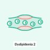

Dyslipidemia - Part 2: Cholesterol and Cholesterol Biosynthesis

Dyslipidemia - Part 4: Laboratory Parameters & Lipid-Lowering Agents

---

## Overview

### Lipids

* Definition: organic molecules that are soluble in nonpolar solvents but do not dissolve in polar solvents (e.g., water)

* Include:

* <u>Fatty acids</u>, e.g., branched-chain fatty acids: saturated <u>fatty acids</u> that have ≥ 1 methyl group that branch off of the main carbon chain

* <u>Triglycerides</u>

* Structural lipids: phospholipids, <u>sphingolipids</u>, and <u>glycolipids</u>

* <u>Steroids</u>/sterols: <u>cholesterol</u>, <u>bile acids</u>, and <u>steroid hormones</u>

* Substrates for:

* <u>Cell membrane</u> synthesis

* <u>Steroid hormone</u> synthesis

* <u>Vitamin D</u> synthesis

* <u>Bile</u> production

* <u>Energy storage</u> and utilization (see “<u>Sources of ATP synthesis</u>”)

### Lipid metabolism

* Digestion and absorption: Ingested fats (lipids) are cleaved by enzymes (e.g., <u>pancreatic lipase</u>) and absorbed in the <u>small intestine</u>.

* Lipid transport

* Absorbed lipids are transported in <u>chylomicrons</u> via <u>the lymphatic system</u> into the bloodstream, where they reach the <u>liver</u>, peripheral tissues (which have <u>LDL receptors</u>) and <u>adipose tissue</u> (storage).

* Lipids circulating in the bloodstream are transported in <u>lipoproteins</u> (contain <u>hydrophilic</u> <u>apolipoproteins</u>) because the hydrophobic lipids are insoluble in plasma.

Fat metabolism

Overview of major metabolic pathways

Section 11 Fat Metabolism

---

## Digestion and absorption of lipids

### Lipid digestion

* Dietary lipids: TAGs, phospholipids, and <u>cholesterol</u> esters

* Not readily absorbed by <u>enterocytes</u> due to:

* Hydrophobic properties

* Large molecular size

* First broken down by <u>lipases</u>;  in the mouth, <u>stomach</u>, and intestinal lumen and packaged into <u>micelles</u>

* Micelles  

* A spherical-shaped aggregation of <u>surfactant</u> molecules in a colloid

* Composed of an outer layer of <u>hydrophilic</u> (polar) heads and an inner hydrophobic (nonpolar) core

* Enclose lipids and <u>fat-soluble vitamins</u>, forming a package

* Readily absorbed by the membranes of <u>enterocytes</u> → deliver internal contents to <u>the cell</u>

* <u>Bile</u> release: Once a lipid enters the intestinal lumen, <u>bile</u> is secreted into the lumen to emulsify the lipid contents.

* <u>Pancreas</u> secretion: The <u>pancreas</u> secretes <u>pancreatic lipase</u>, colipase, and <u>cholesterol esterase</u>, which <u>hydrolyze</u> the lipid into <u>cholesterol</u>, <u>fatty acids</u>, and 2-monoglyceride molecules.

* Absorption of short-chain and <u>medium-chain fatty acids</u>: pass the <u>enterocytes</u> → released to the hepatic portal <u>vein</u> → <u>liver</u> → enter the general circulation and bind <u>albumin</u>

* Absorption of <u>long-chain fatty acids</u>: absorbed by <u>enterocytes</u> and activated → re-esterified to <u>triglycerides</u> and <u>cholesterol</u> esters
1. * Activation

* Takes place at the <u>cytosolic</u> side of the outer <u>mitochondrial membrane</u>

* <u>Acyl-CoA</u>-synthetase transfers <u>fatty acid</u> to <u>coenzyme A</u> → <u>activated fatty acid</u> (<u>acyl-CoA</u>)
2. * Esterification

* Takes place in ER

* Monoglyceride + <u>acyl-CoA</u> → TG

* Transport of TG to <u>Golgi apparatus</u>
3. * Formation of <u>chylomicrons</u>

* Takes place in <u>Golgi apparatus</u>

* <u>Apolipoproteins</u> B-48 and phospholipids are added.
4. * Secretion of <u>chylomicrons</u> into <u>lymph</u> → thoracic duct → bloodstream

> [!NOTE]
> <u>Acyl-CoA</u> and <u>acetyl-CoA</u> should not be confused with each other. Acyl-CoA is a collective name for all <u>activated fatty acids</u>. <u>Acetyl-CoA</u> is the <u>acyl-CoA</u> of <u>acetic acid</u> (also known as acetate).

> [!NOTE]
> There is a very small amount of lipid in the stool of healthy individuals. Defects in lipid digestion result in <u>steatorrhea</u> (i.e., <u>fatty stool</u>).

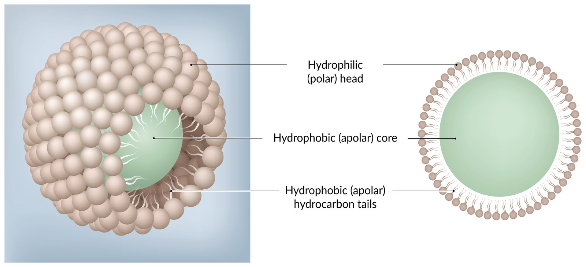

Micelle

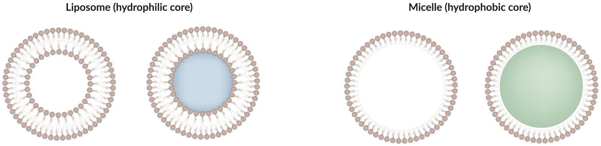

Comparison of liposomes and micelles

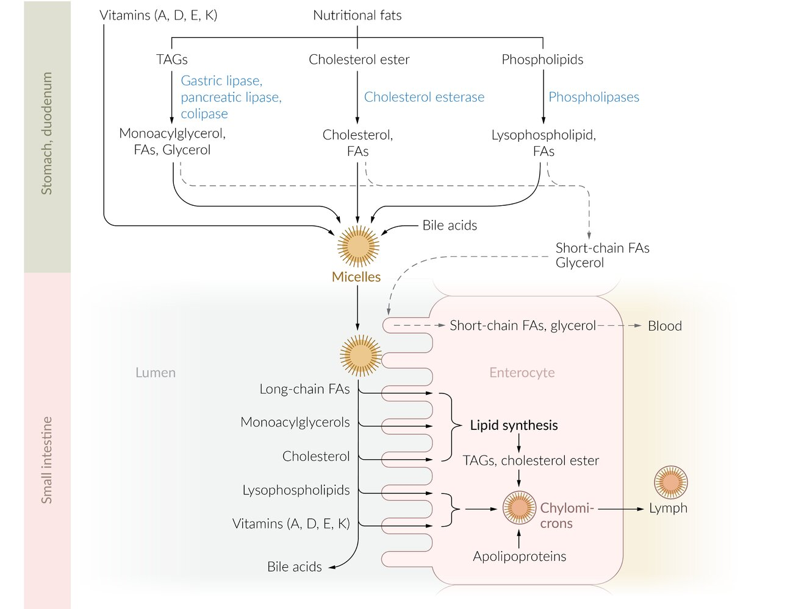

Absorption and metabolism of dietary lipids

### Enzymes in lipid digestion

Lipases are enzymes that catalyze the breakdown of fats into glycerol and <u>fatty acids</u>.

| Overview |  |  |
| --- | --- | --- |
| Enzyme | Site | Function |
| Lingual lipase |  * Secreted by lingual <u>serous glands</u>   |  * <u>Hydrolyzes</u> medium- and long-chain <u>triglycerides</u>   |
| Gastric lipase |  * Secreted by <u>gastric chief cells</u> of the fundic <u>mucosa</u> in the <u>stomach</u>.   |  * <u>Hydrolyzes</u> dietary <u>triglycerides</u> into a monoglyceride and a diglyceride   |
| <u>Pancreatic lipase</u> |  * Secreted by <u>exocrine pancreas</u> via <u>pancreatic duct</u> → <u>duodenum</u>   |  * <u>Hydrolyzes</u> dietary <u>triglycerides</u> in <u>small intestine</u> into monoglycerides and free <u>fatty acids</u>   |

### Lipid resorption

The <u>decomposition</u> products of lipid digestion form mixed <u>micelles</u> with <u>bile acids</u>.

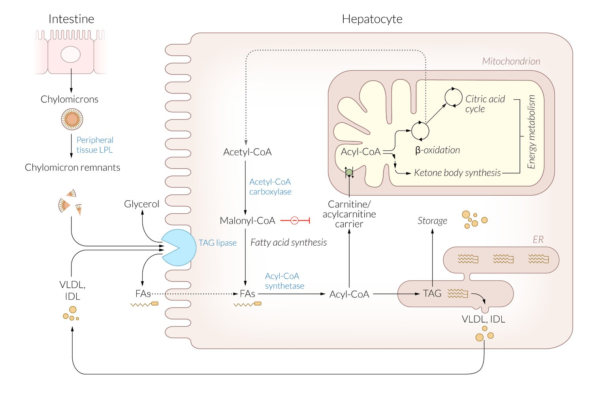

Absorption, metabolism, and synthesis of fatty acids

---

## Lipid transport

Section 14 Lipid Transport

### Lipoproteins [[1]](https://coursology-qbank.com/amboss/article/dpYooJ)

* Structure

* Consist of a hydrophobic core and a <u>hydrophilic</u> shell

* Core and shell are composed of different lipids, depending on the specific <u>lipoprotein</u> 

* Core: hydrophobic lipids (<u>cholesterol</u> esters, <u>triglycerides</u>)

* Shell: <u>hydrophilic</u> lipid components (free <u>cholesterol</u>, phospholipids) and <u>hydrophilic</u> <u>proteins</u>, which are known as <u>apolipoproteins</u>

* Main function:

* Transport of hydrophobic lipids in blood

* Of all <u>lipoproteins</u>, <u>HDL</u> and <u>LDL</u> transport the largest portion of <u>cholesterol</u>.

> [!NOTE]
> Abnormalities in the structure or metabolism of <u>lipoproteins</u> increase the risk of <u>atherosclerosis</u>.

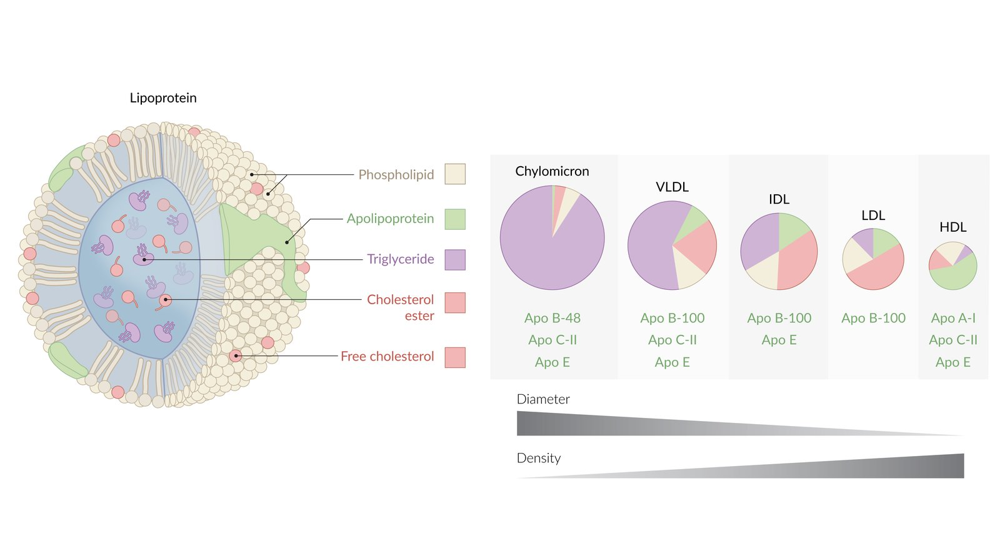

Structure of lipoproteins

| Overview of <u>lipoproteins</u> |  |  |  |
| --- | --- | --- | --- |
|  <u>Lipoproteins</u> (in order of descending density) | Composition | Function | <u>Apolipoproteins</u> |
| High-density <u>lipoprotein</u> (HDL) |   * Mostly <u>proteins</u> and phospholipids  * Some <u>cholesterol</u>  * Few <u>triglycerides</u>    |   * Secreted by intestinal <u>epithelium</u> and <u>liver</u>  * Transport <u>cholesterol</u> from peripheral tissues (e.g., atherosclerotic <u>arteries</u>) to the <u>liver</u> (reverse <u>cholesterol</u> transport), where it is excreted (e.g., via <u>bile</u>)  * Stores <u>apolipoproteins</u> essential <u>VLDL</u> and <u>chylomicron</u> metabolization (C, E)  * <u>HDL</u> synthesis is stimulated by <u>alcohol</u>  * Often referred to as “good <u>cholesterol</u>.”    |   * <u>ApoE</u>  * <u>ApoA-I</u>  * ApoC-II    |
| Low-density <u>lipoprotein</u> (LDL) |   * Mostly <u>cholesterol</u>  * Some phospholipids and <u>proteins</u>  * Few <u>triglycerides</u>    |   * Arise from IDL that is modified by hepatic <u>lipases</u> in peripheral tissue and the <u>liver</u>  * Transport <u>cholesterol</u> from the <u>liver</u> to peripheral tissues and <u>arteries</u>  * <u>Target cells</u> absorb <u>LDL</u> through <u>receptor</u>-mediated <u>endocytosis</u>  * Often referred to as “bad <u>cholesterol</u>”    |  * <u>ApoB-100</u>   |
| Intermediate-density <u>lipoprotein</u> (IDL) |  * <u>Triglycerides</u>, <u>cholesterol</u>, <u>proteins</u>, and phospholipids (quite equal <u>proportions</u>)   |   * Degradation of <u>VLDL</u> into IDL  * Transport <u>triglycerides</u> and <u>cholesterol</u> to the <u>liver</u>    |   * <u>ApoE</u>  * <u>ApoB-100</u>    |
| <u>Very low-density lipoprotein</u> (VLDL) |   * Mostly <u>triglycerides</u>  * Some <u>cholesterol</u> and phospholipids  * Few <u>proteins</u>    |   * Secreted by the <u>liver</u>  * Transport hepatic <u>triglycerides</u> from the <u>liver</u> to peripheral tissues    |   * <u>ApoE</u>  * ApoC-II  * <u>ApoB-100</u>    |
| Chylomicron |   * Mostly <u>triglycerides</u>  * Some <u>proteins</u>  * Very little <u>cholesterol</u> and phospholipids    |   * Secreted by the intestinal <u>epithelial</u> cells into <u>lymphatics</u>  * Transport dietary <u>triglycerides</u> from the intestine to peripheral tissues  * Transport <u>cholesterol</u> to the <u>liver</u> in the form of <u>triglyceride</u>-depleted <u>chylomicron</u> remnants    |   * <u>ApoE</u>  * ApoC-II  * <u>ApoB-48</u>    |

> [!NOTE]
> The <u>lipoproteins</u> in order of increasing <u>triglycerides</u> are <u>HDL</u>, <u>LDL</u>, IDL, <u>VLDL</u>, and <u>chylomicrons</u>.

> [!NOTE]
> Free <u>fatty acids</u> in the blood are not transported by <u>lipoproteins</u> but are instead bound to <u>albumin</u>.

> [!NOTE]
> <u>HDL</u> is Healthy (protective against <u>atherosclerosis</u>) and <u>LDL</u> is Lethal (<u>cholesterol</u> <u>plaque</u> formation in peripheral <u>arteries</u> increases risk of cardiac disease and <u>stroke</u>).

### Apolipoproteins

| Overview of <u>apolipoproteins</u> |  |  |  |
| --- | --- | --- | --- |
| <u>Apolipoprotein</u> |  | Function | Component of |
| Apo E |  |  * Mediates remnant uptake by the <u>liver</u>   |  * All except for <u>LDL</u>   |
| Apo A-I |  |  * Activates <u>LCAT</u>   |  * <u>HDL</u>   |
| Apo C-II |  |  * <u>Cofactor</u> for <u>lipoprotein lipase</u>, which participates in the cleavage of the substrates of the enzymes   |   * <u>Chylomicron</u>  * <u>VLDL</u>  * <u>HDL</u>    |
| Apo B | Apo B-48 |  * Mediates the secretion of <u>chylomicron</u> particles that originate from the intestine into the <u>lymphatics</u>   |   * <u>Chylomicron</u>  * <u>Chylomicron</u> remnant    |
| Apo B-100 |  * Mediates <u>endocytosis</u> of <u>LDL</u> by binding to LDL receptors on hepatic and extrahepatic tissues   |  * Particles originating from the <u>liver</u>  * LDL  * IDL  * V<u>LDL</u>   |  |

> [!NOTE]
> Particles originating from the LIVer: LDL, IDL, V<u>LDL</u>.

> [!NOTE]
> A-I is Activates <u>LCAT</u> and is only present on Alpha-<u>lipoproteins</u> (only <u>HDL</u>)

> [!NOTE]
> Two Cs of <u>apolipoprotein</u> C-II (two) function: Catalyzes Cleavage.

### Enzymes in lipid transport

| Overview |  |  |
| --- | --- | --- |
| Enzyme | Site | Function |
| Hepatic lipase |  * Released by the <u>liver</u> and activated in the bloodstream   |  * <u>Hydrolyze</u> triacylglycerides remaining in IDL particles (also called <u>hepatic triglyceride lipase</u>)   |
| Hormone-sensitive lipase |  * Intracellular [[2]](https://coursology-qbank.com/amboss/article/asXQtz)   |  * <u>Hydrolyzes</u> <u>triglycerides</u> and diglycerides stored in <u>adipocytes</u> into monoglycerides (<u>lipolysis</u>)   |
| Lecithin-cholesterol acyltransferase (<u>LCAT</u>) |  * Found on the surface of <u>HDL</u> (synthesized by the <u>liver</u>)   |   * Catalyzes esterification of plasma <u>cholesterol</u> (converts approx. ⅔ free <u>cholesterol</u> into cholesteryl ester)  * Nascent <u>HDL</u> → mature <u>HDL</u>    |
|  Lipoprotein lipase (<u>LPL</u>) |  * Secreted in vascular <u>endothelial</u> surface of extrahepatic tissues (esp. <u>adipose tissue</u>, <u>heart</u>, and <u>skeletal muscle</u>)   |   * <u>Hydrolyzes</u> <u>triglycerides</u> circulating in <u>chylomicrons</u> and VLDLs into <u>fatty acids</u> and glycerine, which can be taken up by cells  [[3]](https://coursology-qbank.com/amboss/article/0sXetz)  * Upregulated by <u>insulin</u>    |
| Cholesteryl ester transfer protein |  * Synthesized by the <u>liver</u>, secreted into the blood stream   |  * Transport protein that mediates the exchange of <u>triglycerides</u> and cholesteryl esters between <u>lipoproteins</u>   |
| PCSK9 |   * A <u>protease</u> that mediates the degradation of <u>LDL receptors</u>  * Binding of <u>PCSK9</u> to <u>LDL receptors</u> → internalization and breakdown of <u>LDL receptors</u> → inability of <u>LDL receptors</u> to bind <u>LDL</u> → ↑ in serum <u>LDL</u>  * Inhibition of <u>PCSK9</u> → ↑ recycling of <u>LDL receptors</u> → ↓ serum <u>LDL</u>    |  |

> [!NOTE]
> <u>Lipoprotein lipase</u> is activated by binding to its <u>cofactor</u> <u>apo C-II</u>.

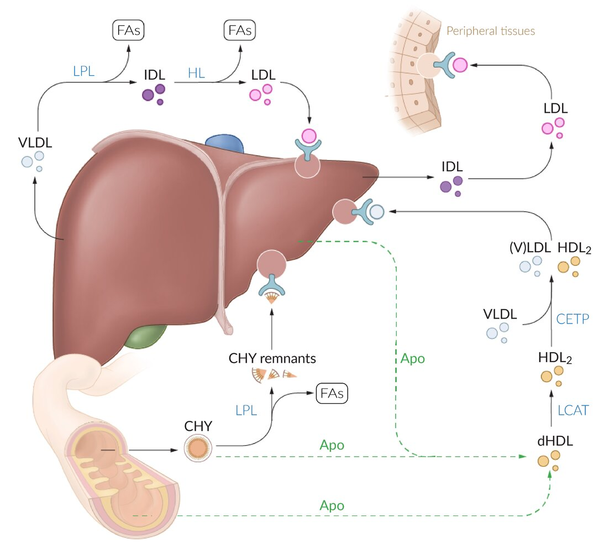

Lipoprotein transport overview

---

## Fatty acid metabolism

<u>Fatty acids</u> and <u>triacylglycerols</u> (TAGs) are important <u>energy carriers</u>. They are stored in the <u>adipose tissue</u> and can be mobilized from there if necessary and degraded (via <u>beta oxidation</u>) while releasing energy in the form of <u>ATP</u>. TAGs are the storage form of <u>fatty acids</u> in the body. They consist of one molecule of glycerine esterified with three <u>fatty acids</u>. TAG metabolism is subject to strict regulation by the <u>hormone</u>-sensitive <u>lipase</u> of <u>adipose tissue</u>.

### Fatty acids

#### Overview

* Carboxylic acid with an unbranched chain of carbon atoms differing in length (from 1–24 carbon atoms)

* Typically found as esters, including:

* Triglyceride (TAGs)

* A lipid composed of one glycerol molecule esterified with three <u>fatty acid</u> molecules

* Storage form of <u>fatty acids</u>, mainly stored in <u>adipose tissue</u>

* <u>Fatty acids</u> and TAGs are important <u>energy carriers</u>

* Monoglyceride and diglyceride: Only one or two of the hydroxyl groups of glycerol are esterified with <u>fatty acids</u>.

* Phospholipids

* <u>Cholesterol</u> esters

* Degradation via <u>beta oxidation</u> releases energy in the form of <u>ATP</u>

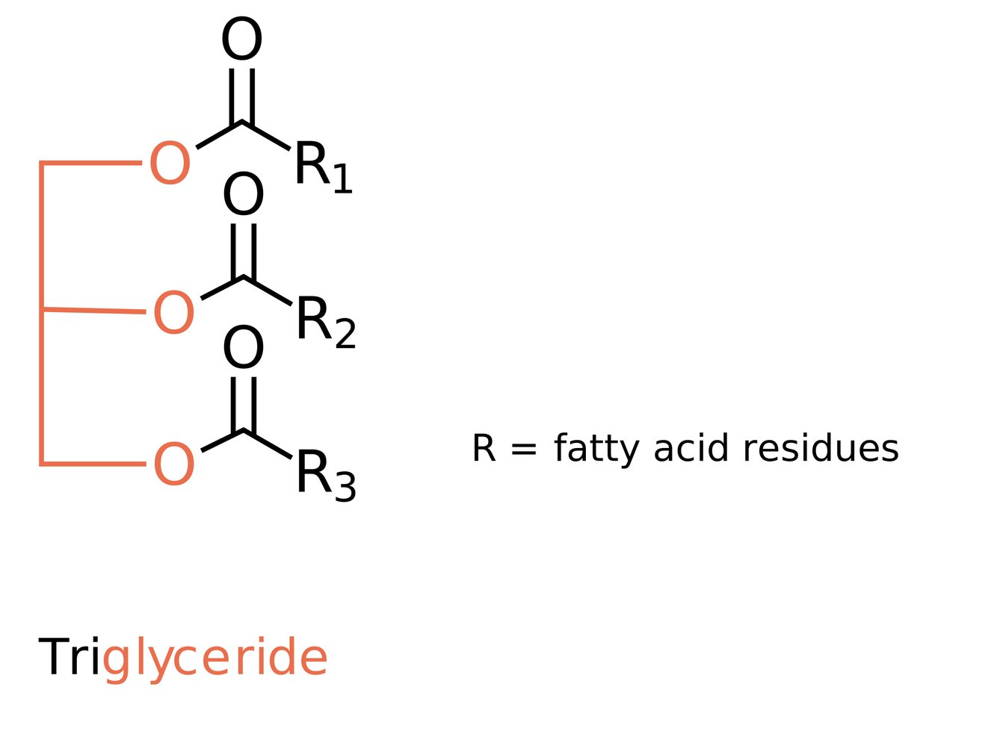

Triglyceride

> [!NOTE]
> An increased concentration of <u>triglycerides</u> in the blood is called <u>hypertriglyceridemia</u>. It can be hereditary (lack of <u>lipoprotein lipase</u>), acquired (<u>obesity</u>, chronic <u>alcohol</u> use), or a combination of both. Like <u>hyperlipoproteinemia</u>, <u>hypertriglyceridemia</u> increases the risk of vascular disease (<u>atherosclerosis</u>, <u>coronary heart disease</u>, <u>peripheral vascular disease</u>).

#### Characteristics

* <u>Fatty acid</u> length

* Short-chain fatty acid (<u>SCFA</u>): total carbon-chain length between 1–6

* Medium-chain fatty acid (<u>MCFA</u>): total carbon-chain length between 7–12

* Long-chain fatty acids (<u>LCFA</u>): total carbon-chain length between 13–20

* Very long-chain fatty acid (<u>VLCFA</u>): total carbon-chain length 20

* Odd-chain fatty acid: contains an odd number of carbon atoms

* <u>Fatty acid</u> saturation

* Saturated (without C=C double bonds)

* Unsaturated fatty acids (with C=C double bonds)

* Monounsaturated fatty acids: have one double bond

* Polyunsaturated fatty acids: have > 1 double bonds

* Nomenclature: <u>Unsaturated fatty acids</u> are named using the omega system.

* The last carbon in the <u>fatty acid</u> molecule (i.e., the furthest from the <u>carboxyl group</u>) is labeled as ω (omega).

* A <u>fatty acid</u> is given a name that reflects the position of the first double bond relative to omega-carbon

> [!NOTE]
> Excessive dietary intake of trans-<u>unsaturated fatty acids</u> (e.g., fried foods, margarine, and shortening) raises <u>LDL</u> levels and lowers <u>HDL</u> levels, thereby increasing the risk of cardiovascular events.

#### Essential fatty acids [[4]](https://coursology-qbank.com/amboss/article/tEXXx-)[[5]](https://coursology-qbank.com/amboss/article/FEXgx-)

* Definition: <u>polyunsaturated fatty acids</u> that cannot be synthesized by humans and need to be ingested

* Types

* Omega-3 fatty acids

* Examples: alpha-linolenic acid (<u>ALA</u>), eicosapentaenoic acid (EPA), docosahexaenoic acid (DHA)

* Sources: nuts, seeds, cold-water fish, algae

* Function

* Replace <u>arachidonic acid</u> in <u>platelet</u> membranes, leading to decreased thromboxane production and <u>platelet aggregation</u>

* Associated with decreased plasma <u>triglycerides</u> levels and decreased cardiovascular risk

* Omega-6 fatty acids

* Examples: linoleic acid

* Sources: cereals, soybeans, seeds, and seed oils

* Function: Metabolized to <u>arachidonic acid</u>, which is a precursor for <u>prostaglandins</u> and <u>leukotrienes</u>

* Clinical significance: Excessive intake, which often occurs in Western diets, promotes inflammation and is associated with an increased risk of cardiovascular events. [[5]](https://coursology-qbank.com/amboss/article/FEXgx-)

### Overview of <u>fatty acid metabolism</u>

The breakdown of <u>fatty acids</u> is not simply a reversal of <u>fatty acid synthesis</u>; there are a number of differences between the two processes.

| Overview |  |  |
| --- | --- | --- |
| Characteristics | Synthesis | Breakdown |
| Main goal |  * <u>Fatty acid</u> formation   |  * Energy generation   |
| Site |  * <u>Cytoplasm</u>   |  * <u>Mitochondria</u>   |
| Tissue |   * <u>Liver</u>  * <u>Adipose tissue</u>  * Lactating <u>mammary glands</u>    |   * <u>Liver</u>  * <u>Adipose tissue</u>  * Muscle    |
| Precursor |  * <u>Acetyl-CoA</u>   |  * <u>Acyl-CoA</u>   |
| Transporter |  * <u>Citrate</u> shuttle   |  * <u>Carnitine shuttle</u>   |
| Rate-determining enzyme |  * <u>Acetyl-CoA carboxylase</u>   |  * Carnitine palmitoyltransferase I   |
| Required substances |   * <u>ATP</u>  * <u>Biotin</u> (<u>cofactor</u>)  * CO2  * <u>NADPH</u>    |   * <u>NAD+</u>  * <u>FAD</u>  * H2O    |
| Upregulation |  * <u>Insulin</u>, ↑ <u>glucose</u>, <u>ATP</u>, and <u>citrate</u>   |  * <u>Glucagon</u> (indirectly)   |
| Downregulation |   * <u>Glucagon</u>, ↓ <u>glucose</u>, <u>epinephrine</u>, <u>AMP</u>, and <u>catecholamines</u>  * <u>Acyl-CoA</u> and palmitoyl-<u>CoA</u>    |   * <u>Malonyl-CoA</u>  * <u>Insulin</u>(indirectly)    |
| End products |   * <u>Palmitic acid</u>  * <u>NADP</u>    |   * <u>Acetyl-CoA</u>  * <u>Ketone bodies</u>  * <u>NADH</u>+  * <u>FADH2</u>    |

> [!NOTE]
> The Sytrate (<u>citrate</u>) shuttle is essential for <u>fatty acid</u> Synthesis.

> [!NOTE]
> <u>Fatty acids</u> travel to their site of degradation by CARnitine.

### Fatty acid synthesis

#### Overview

* Definition: the creation of <u>fatty acids</u> from <u>acetyl-CoA</u> and <u>NADPH</u> through the action of <u>fatty acid</u> <u>synthases</u>

* Metabolism site: <u>cytoplasm</u> of <u>liver</u> (mainly), <u>adipose tissue</u>, and lactating <u>mammary glands</u>

* Primary end-product: palmitic acid (<u>palmitate</u>), a 16-carbon <u>fatty acid</u> (only <u>fatty acid</u> that humans can synthesize de novo)
* The synthesis of one <u>palmitic acid</u> requires 8 <u>acetyl-CoA</u>, 7 <u>ATP</u>, and 14 <u>NADPH</u>.

* <u>Rate-limiting enzyme</u>: <u>acetyl-CoA carboxylase</u>

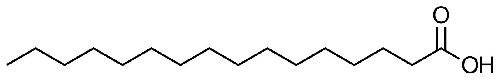

Palmitic acid

#### Procedure

1. * <u>Acetyl-CoA</u> groups (from <u>glycolysis</u>) are transported from the <u>mitochondria</u> to the <u>cytoplasm</u> through the <u>citrate</u> shuttle.

* In <u>mitochondria</u>, <u>acetyl-CoA</u> combines with <u>oxaloacetate</u> to form <u>citrate</u>.

* <u>Citrate</u> is then shuttled to the <u>cytoplasm</u> (instead of continuing in the <u>citric acid cycle</u>).
2. * In the <u>cytoplasm</u>, <u>ATP</u> <u>citrate</u> <u>lyase</u> <u>hydrolyzes</u> <u>citrate</u> back into <u>acetyl-CoA</u> and <u>oxaloacetate</u>.
3. * Acetyl CoA carboxylase activates <u>acetyl-CoA</u> and converts it into <u>malonyl-CoA</u>.

* <u>Acetyl-CoA carboxylase</u> requires <u>biotin</u>, <u>ATP</u>, and CO2.

* Fatty acid synthase uses the carbons from <u>acetyl-CoA</u> to synthesize a new <u>fatty acid</u> (i.e., <u>palmitate</u>).

#### Regulation

<u>Fatty acid synthesis</u> is regulated via <u>phosphorylation</u> of <u>acetyl-CoA</u> carboxylase.

* Upregulation
* <u>Insulin</u>, ↑ <u>glucose</u>, <u>ATP</u>, and <u>citrate</u> activate <u>acetyl-CoA</u> carboxylase (these substances indicate an energy excess).

* Excess <u>glucose</u> can be converted into <u>fatty acids</u> in the <u>liver</u> and then transported to the <u>adipose tissue</u> for storage.

* <u>Insulin</u> also enhances the synthesis of <u>acetyl-CoA carboxylase</u> via the <u>transcription factor</u> <u>SREBP</u>-1c.

* Downregulation

* <u>Glucagon</u>, ↓ <u>glucose</u>, <u>epinephrine</u>, <u>AMP</u>, <u>catecholamines</u>, inhibit <u>acetyl CoA</u>-carboxylase (these substances indicate an energy deficit).

* <u>Acyl-CoA</u> and palmitoyl-<u>CoA</u> inhibit <u>acetyl-CoA carboxylase</u> via negative feedback (indicating adequate supply of free <u>fatty acids</u>).

### Fatty acid degradation [[6]](https://coursology-qbank.com/amboss/article/_4Y5N6)

#### Overview

* Definition: : the process by which <u>fatty acids</u> are catabolized by the pathway of <u>beta oxidation</u>

* Aims: energy generation

* <u>ATP</u> production from <u>NADH</u> and <u>FADH2</u> creation

* During <u>fasting</u>: <u>ketone body</u> production from gained <u>acetyl-CoA</u>

* Metabolism site: <u>mitochondria</u>;  of several tissues, including <u>liver</u>, muscle, and <u>adipose tissue</u>; <u>erythrocytes</u> and the <u>brain</u> are not able to utilize <u>fatty acid</u>

* Primary end-products: <u>acetyl-CoA</u>, <u>ketone bodies</u>, <u>NADH</u>, and <u>FADH2</u>

* <u>Rate-limiting enzyme</u>: <u>carnitine palmitoyltransferase 1</u> (carnitine shuttle)

Fatty acid metabolism (overview)

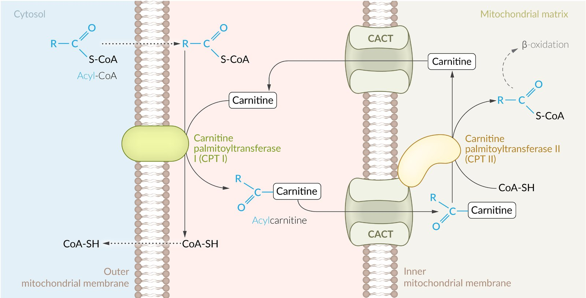

Carnitine shuttle

#### Procedure

1. * <u>Fatty acid</u> transport (into the <u>mitochondria</u>)

* <u>LCFA</u>: enter via <u>carnitine-dependent shuttle</u>

* Fatty acyl-CoA synthetase;  on the outer <u>mitochondrial membrane</u> activates the <u>fatty acid</u> by attaching <u>CoA</u> → forming a fatty <u>acyl group</u>

* Carnitine palmitoyltransferase 1 (also known as carnitine acyltransferase I) transfers the fatty <u>acyl group</u> to carnitine on the outer <u>mitochondrial</u> membrane → forming a fatty acylcarnitine

* Fatty acylcarnitine is then shuttled into the <u>mitochondria</u>.

* <u>SCFA</u> and <u>MCFA</u>: diffuse freely into <u>mitochondria</u>
2. * <u>Beta oxidation</u> (in <u>mitochondrial matrix</u>): a <u>catabolic</u> process in which a <u>fatty acid</u> chain is cleaved (oxidized) at the beta carbon (every second carbon) by <u>dehydrogenase</u> enzymes in several cycles.  

* Breaks down <u>odd-chain fatty acids</u> into <u>acetyl-CoA</u> and <u>propionyl CoA</u> (see <u>propionic acid pathway</u>) and even-chain <u>fatty acids</u> into <u>acetyl-CoA</u> only.

* <u>Beta oxidation</u> of <u>VLCFA</u> occurs in <u>peroxisomes</u> (see <u>degradation of VLCFA</u>).

* For every cleaved <u>acetyl-CoA</u>, one molecule of <u>FAD</u>, H2O, and <u>NAD+</u> each are required.

* <u>Acetyl-CoA</u> enters the citric cycle.

* <u>Acyl-CoA dehydrogenase</u> catalyzes the initial step of <u>beta oxidation</u>: fatty <u>acyl-CoA</u> + <u>NAD+</u> + <u>FAD</u>+ → <u>acetyl-CoA</u> + <u>NADH</u> + <u>FADH2</u> 
* Two types of acyl-CoA dehydrogenase

* Long-chain <u>acyl-CoA dehydrogenase</u> (LCAD)

* Medium-chain acyl-CoA dehydrogenase (<u>MCAD</u>)

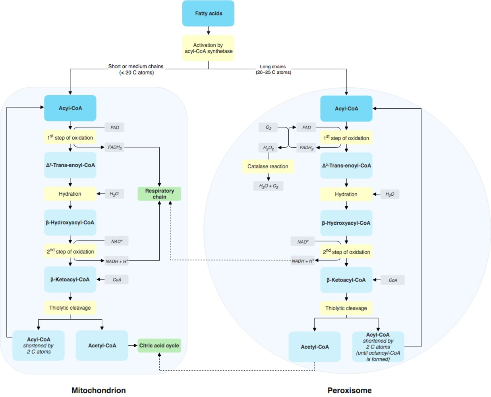

Beta-oxidation of even-numbered fatty acids (mitochondria/peroxisomes)

#### Regulation

* Upregulation: <u>glucagon</u> indirectly upregulates <u>beta oxidation</u> by inhibiting <u>acetyl CoA</u>-carboxylase and decreasing the <u>malonyl-CoA</u> concentration.

* Downregulation

* <u>Malonyl-CoA</u> inhibits carnitine palmitoyltransferase I (the rate-limiting step in <u>beta oxidation</u>).

* <u>Insulin</u> indirectly downregulates <u>beta oxidation</u> by activating <u>fatty acid synthesis</u> and increasing the <u>malonyl-CoA</u> concentration.

Absorption, metabolism, and synthesis of fatty acids

#### Clinical significance

* <u>Primary carnitine deficiency</u>

* <u>Medium-chain acyl-CoA dehydrogenase deficiency</u>

* Jamaican vomiting sickness

* <u>Acyl-CoA dehydrogenase</u> is inhibited by the toxin hypoglycin, contained in unripe ackee, the fruit of the ackee tree, which is found in West Africa and Jamaica.

* Intoxication results in severe <u>vomiting</u>, <u>coma</u>, and possibly <u>death</u>.

> [!NOTE]
> Carnitine deficiency results in toxic accumulation of <u>LCFA</u> in the <u>cytoplasm</u> of <u>myocytes</u> and other cells. Patients present with hypoketotic <u>hypoglycemia</u>, <u>fatty liver</u>, <u>myopathy</u>, <u>hypotonia</u>, and fatigue. Treatment consists of oral supplementation of the <u>amino acid</u> carnitine.

> [!NOTE]
> <u>MCAD deficiency</u> is characterized by the defective breakdown of <u>MCFA</u>, which renders FAs an unusable alternative energy source in the case of <u>carbohydrate</u> deficiency. Because the <u>liver</u> cannot degrade FAs beyond C8–C10, <u>acetyl-CoA</u> and <u>NADH</u> are missing for <u>ketone body</u> production and <u>gluconeogenesis</u>. This deficiency results in nonketotic <u>hypoglycemia</u>, <u>encephalopathy</u>, and <u>lethargy</u> in <u>fasting states</u>. C8–C10 acylcarnitines can be found in the blood.

#### Degradation of very long-chain fatty acids (20 carbons)

* <u>Beta oxidation</u> occurs in both <u>mitochondria</u> and <u>peroxisomes</u>.  

* <u>Peroxisomes</u>: <u>beta oxidation</u> until octanoyl-<u>CoA</u> (C8) is formed

* <u>Mitochondria</u>: further oxidation of C8

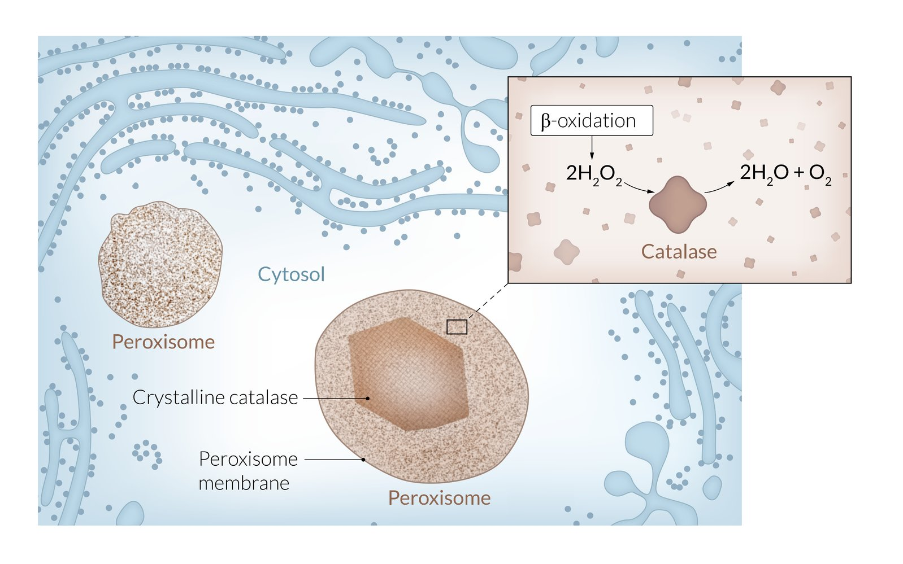

Peroxisome

Beta-oxidation of even-numbered fatty acids (mitochondria/peroxisomes)

#### Degradation of <u>fatty acids</u> with an odd number of carbon atoms (propionic acid pathway)

* Final cycle of <u>fatty acid oxidation</u>

* Degradation of <u>fatty acids</u> with an even number of carbon atoms yields two <u>acetyl-CoA</u> (out of a 4-carbon fragment).

* Degradation of <u>fatty acids</u> with an odd number of carbon atoms yields one <u>acetyl-CoA</u> and one <u>propionyl-CoA</u> (out of a 5-carbon fragment).

* In the <u>mitochondria</u>, propionyl-CoA is converted into <u>succinyl-CoA</u> (a <u>citric acid cycle</u> intermediate) in a two-step pathway.

* Propionyl-CoA carboxylase converts <u>propionyl-CoA</u> into methylmalonyl-CoA.
* Requires <u>biotin</u> as a <u>cofactor</u>

* Methylmalonyl-CoA mutase converts <u>methylmalonyl-CoA</u> into <u>succinyl-CoA</u>.
* Requires <u>vitamin B12</u> as a <u>cofactor</u>: <u>deficiency of vitamin B12</u> leads to elevation of <u>methylmalonyl-CoA</u> level (differentiating it from <u>folate deficiency</u>, which also causes <u>megaloblastic anemia</u>)

Degradation of odd chain fatty acids

### Triglyceride synthesis

Synthesized <u>triglycerides</u> are either stored in <u>adipose tissue</u> or transported to the muscle for energy utilization.

* <u>Triglyceride synthesis</u> occurs mainly in the <u>liver</u> and <u>adipose tissue</u>.

* Both glycerol and <u>fatty acids</u> have to be activated for <u>triglyceride synthesis</u>.

* Glycerol → glycerol-3-phosphate (catalyzed by glycerol kinase, which is found in the <u>liver</u> but not <u>adipose tissue</u>)

* <u>Fatty acids</u> → <u>acyl-CoA</u>

* Rate-determining enzyme: <u>glycerol-3-phosphate</u> acyltransferase (links <u>glycerol-3-phosphate</u> with two <u>acyl-CoA</u> molecules)

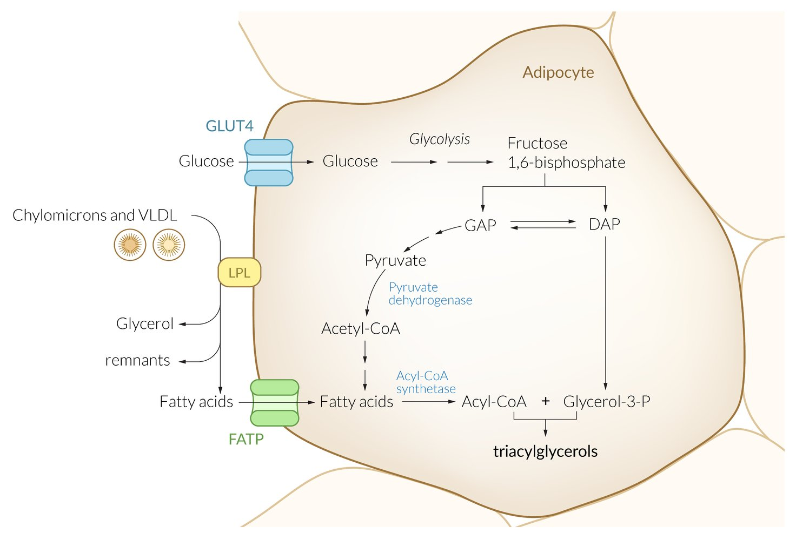

Lipogenesis in adipocytes

### <u>Triglyceride</u> degradation

* <u>Lipases</u> split <u>triglycerides</u> into glycerol and three <u>fatty acids</u>.

* Glycerol is converted to <u>glyceraldehyde-3-phosphate</u> (GAP), which undergoes <u>glycolysis</u> or <u>gluconeogenesis</u>.

* The <u>fatty acids</u> begin <u>beta oxidation</u>.

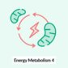

Energy Metabolism - Part 4: Fatty Acids & Carnitine Transporter

Energy Metabolism - Part 5: Beta-oxidation Reactions with molecular structures

Energy Metabolism - Part 5: Beta-oxidation Reactions without molecular structures

Energy Metabolism - Part 6: The Citric Acid Cycle with molecular structures

Energy Metabolism - Part 6: The Citric Acid Cycle without molecular structures

Energy Metabolism - Part 13: Fatty Acid Synthesis with molecular structures

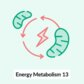

Energy Metabolism - Part 13: Fatty Acid Synthesis without molecular structures

---

## Ketone body metabolism

Section 12 Ketones

### Ketone bodies

* Water-soluble molecules that are produced by the <u>liver</u> and used by peripheral tissues (e.g., <u>heart</u>, <u>brain</u>, <u>skeletal muscle</u>) as an energy source when <u>glucose</u> is not readily available (e.g., during prolonged <u>starvation</u>, in <u>diabetic ketoacidosis</u>, or chronic <u>heavy drinking</u>)

* Three <u>ketone bodies</u>: acetoacetate, β-hydroxybutyrate, and acetone (acetone is a breakdown product of <u>acetoacetate</u> and <u>β-hydroxybutyrate</u>; has a fruity <u>smell</u>)

### Ketogenesis

* Metabolism site: : <u>mitochondria</u> of <u>hepatocytes</u>

* Starting substance: <u>acetyl-CoA</u>

* Steps
1. * Two molecules of <u>acetyl-CoA</u>, catalyzed by thiolase, condense to form acetoacetyl-<u>CoA</u>.
2. * Acetoacetyl-<u>CoA</u> combines with another molecule of <u>acetyl-CoA</u>, catalyzed by rate-determining enzyme <u>HMG-CoA synthase</u>, to produce HMG-CoA.
3. * HMG-CoA lyase subsequently breaks down <u>HMG-CoA</u> into <u>ketone bodies</u>; <u>acetoacetate</u> and <u>acetyl-CoA</u>
4. * <u>Acetoacetate</u> can then be reduced to <u>β-hydroxybutyrate</u> or undergo spontaneous <u>decarboxylation</u> to form acetone (which gives the breath a fruity <u>smell</u>).

* Regulation

* In prolonged <u>fasting</u> and <u>diabetic ketoacidosis</u>

* <u>Oxaloacetate</u> is depleted for <u>gluconeogenesis</u>.

* This results in a buildup of <u>acetyl-CoA</u> molecules → shunts the pathway toward the production of <u>ketone bodies</u>.

* In <u>alcoholism</u>

* Excess <u>NADH</u> shunts <u>oxaloacetate</u> to <u>malate</u>.

* This results in a buildup of <u>acetyl-CoA</u> molecules → shunts the pathway toward the production of <u>ketone bodies</u>.

> [!NOTE]
> <u>Ketone body</u> synthesis takes place exclusively in the <u>mitochondria</u> of <u>hepatocytes</u>. <u>Ketone bodies</u> are then released into the blood and transported to their target tissues (mainly the <u>brain</u> and muscle).

> [!NOTE]
> Two molecules of <u>acetyl-CoA</u> → acetoacetyl-<u>CoA</u> → <u>HMG-CoA</u> → <u>acetoacetate</u> → <u>β-hydroxybutyrate</u>. Acetone is formed by spontaneous <u>decarboxylation</u> of <u>acetoacetate</u>. The body has no use for acetone, which is excreted primarily via the <u>lungs</u> (gives breath a fruity odor). A small fraction is also exerted in the urine.

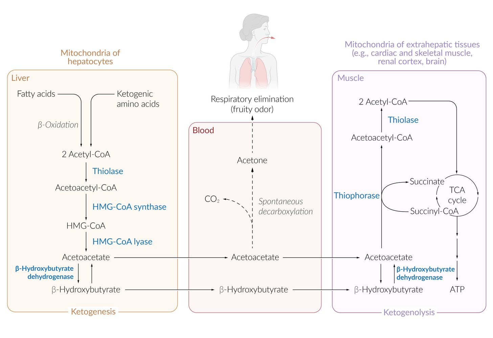

Ketone metabolism

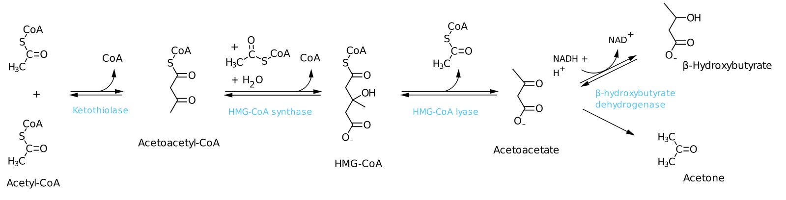

Ketogenesis

### Ketogenolysis

* Metabolism site: : <u>Mitochondria</u> of extrahepatic tissues (cardiac and <u>skeletal muscle</u>, the <u>brain</u>, and the <u>renal cortex</u>) can metabolize <u>acetoacetate</u> and <u>β-hydroxybutyrate</u>, producing <u>acetyl-CoA</u>, which means that <u>RBCs</u> are unable to use <u>ketone bodies</u> for energy (due to lack of <u>mitochondria</u>).

* Process  
1. * <u>β-hydroxybutyrate</u> → <u>acetoacetate</u>, catalyzed by <u>β-hydroxybutyrate</u> <u>dehydrogenase</u>
2. * <u>Acetoacetate</u> plus <u>succinyl-CoA</u> → acetoacetyl-<u>CoA</u> plus <u>succinate</u>, catalyzed by thiophorase (<u>succinyl-CoA acetoacetyl-CoA transferase</u> or <u>β-ketoacyl-CoA transferase</u>)
3. * Acetoacetyl-<u>CoA</u> → two molecules of <u>acetyl-CoA</u>, catalyzed by thiolase
4. * Finally, <u>acetyl-CoA</u> can be metabolized in the <u>TCA cycle</u>.

* Clinical relevance

* See “<u>Diabetic ketoacidosis</u>.”

* The urine test for <u>ketone bodies</u> can only screen for <u>acetoacetate</u> and, therefore, not detect <u>β-hydroxybutyrate</u>.

> [!NOTE]
> <u>RBCs</u> do not have <u>mitochondria</u> and <u>hepatocytes</u> lack the <u>thiophorase</u> (<u>β-ketoacyl-CoA transferase</u>) enzyme. Therefore, neither of them can utilize <u>ketone bodies</u> for energy.

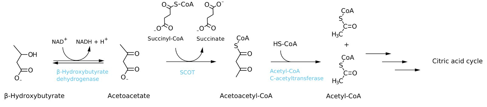

Degradation of ketone bodies

---

## Cholesterol metabolism

### Cholesterol

* Definition: a polycyclic <u>steroid</u> <u>alcohol</u> absorbed through food but also synthesized in the body

* Function:

* Incorporated in all <u>cell membranes</u> in the <u>lipid bilayer</u>: increases membrane fluidity and stability

* Precursor for synthesis of:

* <u>Steroid hormones</u> (e.g., <u>androgens</u>, <u>estrogens</u>, <u>mineralocorticoids</u>, <u>glucocorticoids</u>)

* <u>Bile acids</u>

* <u>Vitamin D</u>

* Digestion:

* Dietary <u>cholesterol</u> is a mixture of free and esterified <u>cholesterol</u> (i.e., bound to <u>fatty acids</u>).

* Esterified <u>cholesterol</u> is broken down by cholesterol esterase into <u>cholesterol</u> and free <u>fatty acids</u>.

* Resorption: <u>Cholesterol</u> combines with <u>bile salts</u> to form absorbable <u>bile salt</u> <u>micelles</u>.
* Further processing: reesterification in the <u>cytosol</u> of <u>enterocytes</u> and incorporation into <u>chylomicrons</u>

* Transport: Since <u>cholesterol</u> is <u>apolar</u>, it must be rendered into a water-soluble form for its transport within the body.

* Transport in <u>bile</u>

* As <u>cholesterol</u>: together with lecithin and <u>bile acids</u> in the form of water-soluble <u>micelles</u>

* As <u>bile acids</u>; : In the <u>liver</u>, <u>cholesterol</u> is partially converted to <u>bile acids</u>, which enter the <u>enterohepatic circulation</u>.

* Transport in blood via <u>lipoproteins</u>

* From the intestine to the <u>liver</u>: together with TAGs in <u>chylomicrons</u>

* From the <u>liver</u> to peripheral tissues: via <u>VLDL</u> and <u>LDL</u>

* From peripheral tissues to the <u>liver</u> (reverse <u>cholesterol</u> transport): via <u>HDL</u> and IDL

* Excretion: via <u>bile</u> as a whole molecule or modified in the form of <u>bile acids</u>

> [!NOTE]
> Excess <u>cholesterol</u> secretion into <u>bile</u> (e.g., in <u>pregnancy</u>, <u>obesity</u>) can lead to precipitation of <u>cholesterol</u> crystals and <u>gallstone</u> formation (<u>cholelithiasis</u>).

> [!NOTE]
> There is no intestinal absorption of <u>cholesterol</u> without <u>bile salts</u>. <u>Bile salt</u> deficiency can be caused by <u>gallstones</u> or a <u>tumor</u> of the <u>biliary tract</u>.

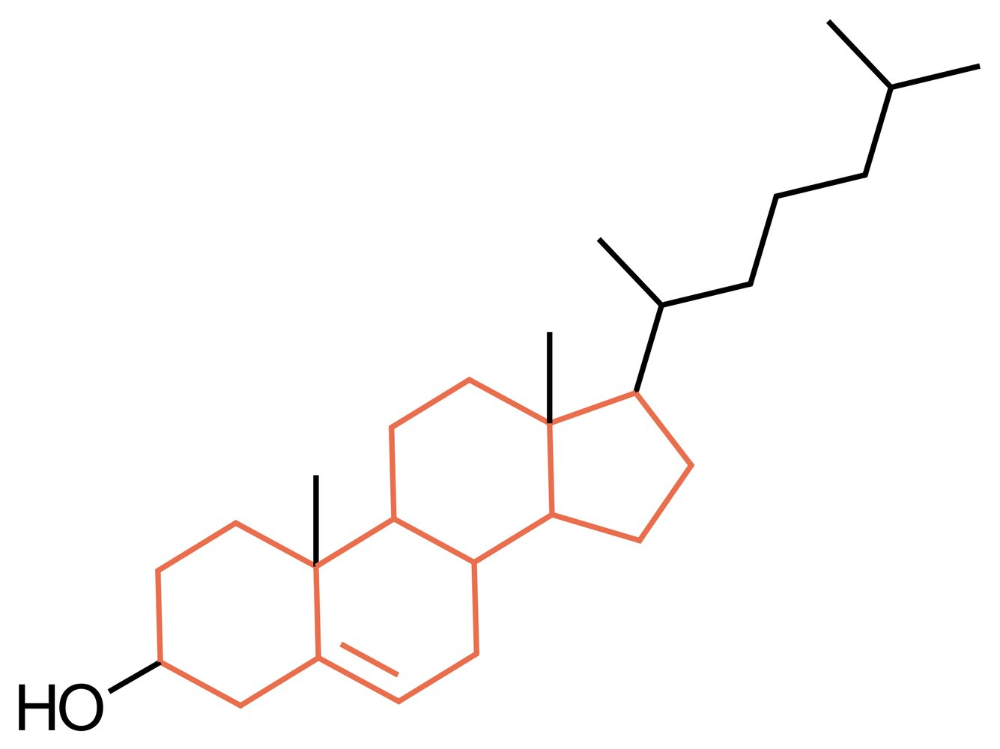

Cholesterol

### Cholesterol synthesis

* Starting substance: <u>acetyl-CoA</u>

* Metabolism site: <u>cytoplasm</u> of <u>hepatocytes</u> and intestinal <u>epithelial</u> cells

* Rate-determining enzyme: HMG-CoA reductase in the membrane of <u>smooth ER</u> (catalyzes the reaction: <u>HMG-CoA</u> → mevalonate; requires two <u>NADPH</u>)

* Regulation: of <u>HMG-CoA</u> reductase

* Stimulated by: <u>insulin</u>, <u>thyroxine</u>, <u>estrogen</u>

* Inhibited by: <u>glucagon</u>, <u>cholesterol</u> (feedback inhibition via <u>SREBP</u>)

* Sterol regulatory element-binding proteins (<u>SREBPs</u>): <u>transcription factors</u> that can bind to intracellular <u>cholesterol</u> via the SCAP protein

* <u>Cholesterol</u> deficiency: <u>SREBP</u> does not bind intracellular <u>cholesterol</u> but migrates to the <u>nucleus</u> and binds to the sterol regulatory element (SRE) of the <u>LDL receptor</u> <u>gene</u> and to enzymes of <u>cholesterol synthesis</u> → increased <u>transcription</u> of <u>LDL receptors</u> and enzymes → increased uptake and synthesis of <u>cholesterol</u>

* <u>Cholesterol</u> excess: SCAP-<u>SREBP</u> complex binds to <u>cholesterol</u> → no transportation to the <u>nucleus</u>

> [!NOTE]
> Simplified <u>cholesterol synthesis</u>: <u>acetyl-CoA</u> → acetoacetyl-<u>CoA</u> → <u>HMG-CoA</u> → <u>mevalonate</u> → squalene → <u>cholesterol</u>

> [!NOTE]
> The enzyme <u>HMG-CoA</u> reductase is clinically important because it is the target for drugs that are designed to reduce the plasma concentration of <u>cholesterol</u> (i.e., <u>HMG-CoA</u> reductase inhibitors, which have a structure similar to that of <u>mevalonate</u>). They are also referred to as <u>statins</u>.

Cholesterol

---

## Clinical significance

### Laboratory considerations

* In laboratory tests, total <u>cholesterol</u>, <u>triglycerides</u>, <u>HDL</u>, and <u>LDL</u> are usually measured.

* If levels are elevated or reduced, testing should be repeated after at least 2 weeks.

| Overview |  |  |  |  |
| --- | --- | --- | --- | --- |
| Laboratory parameter |  |  Elevated in [[7]](https://coursology-qbank.com/amboss/article/-4YDN6)[[8]](https://coursology-qbank.com/amboss/article/ZkYZm6)  | Reduced in | Prognostic correlations |
| <u>Cholesterol</u> | <u>HDL</u> |   * Healthy lifestyle (physical activity)  * <u>Moderate alcohol consumption</u> [[9]](https://coursology-qbank.com/amboss/article/csXaFz)    |   * <u>Hypertriglyceridemia</u>  * <u>Obesity</u>  * Smoking    |  * Elevated values have a protective effect against <u>atherosclerosis</u>.   |
| <u>LDL</u> |   * Diet high in fat  * <u>Nephrotic syndrome</u>  * <u>Hypothyroidism</u>  * <u>Cushing disease</u>  [[10]](https://coursology-qbank.com/amboss/article/0kYem6)  * <u>Diabetes mellitus</u> (type I and II)  * <u>Cholestasis</u>  * Familial    |  * Healthy lifestyle (calorie restriction, physical activity)   |  * Level correlates with the risk of <u>atherosclerosis</u>   |  |
|  <u>Triglyceride</u>  |  |   * Increased <u>alcohol</u> consumption  * <u>Obesity</u>  * Familial  * <u>Nephrotic syndrome</u>  * <u>Cushing disease</u>  * High-calorie diet  * <u>Diabetes mellitus</u>    |   * The risk of <u>atherosclerosis</u> has not been fully determined.  * Very high levels may lead to <u>acute pancreatitis</u>.    |  |

|  Parameters of fat metabolism [[11]](https://coursology-qbank.com/amboss/article/VqaGxl)  |  |  |
| --- | --- | --- |
| Laboratory parameter | Optimal level | Abnormal levels |
| Total <u>cholesterol</u> |  * < 200 mg/dL (< 5.17 mmol/L)   |   * Borderline: 200–239 mg/dL  * High: ≥ 240 mg/dL    |
|  <u>Triglycerides</u>  |  * < 150 mg/dL (< 1.69 mmol/L)   |   * Borderline: 150–199 mg/dL  * High: 200–499 mg/dL  * Very high: ≥ 500 mg/dL    |
| <u>LDL</u> |  * < 100 mg/dL (< 2.6 mmol/L)   |   * Near optimal: 100–129 mg/dL  * Borderline high: 130–159 mg/dL  * High: 160–189 mg/dL  * Very high: ≥ 190 mg/dL    |
| <u>HDL</u> |  * ≥ 60 mg/dL (≥ 1.55 mmol/L)   |  * Low: < 40 mg/dL   |
|  LDL/HDL ratio [[12]](https://coursology-qbank.com/amboss/article/tMXXqA)  |   * <u>♂</u>: < 3.5  * <u>♀</u>: < 3.0    |   * <u>♂</u>: > 3.5  * <u>♀</u>: > 3.0    |
|  Total <u>cholesterol</u>/<u>HDL</u> <u>ratio</u> [[12]](https://coursology-qbank.com/amboss/article/tMXXqA)  |   * <u>♂</u>: < 5.0  * <u>♀</u>: < 4.5    |   * <u>♂</u>: > 5.0  * <u>♀</u>: > 4.5    |

### Associated conditions

* <u>Atherosclerosis</u>

* <u>Cholesterol embolization syndrome</u>

* <u>Carotid artery stenosis</u>

* <u>Peripheral arterial disease</u>

* <u>Stroke</u>

* <u>Myocardial infarction</u>

* <u>Coronary heart disease</u>

* <u>Skin</u> manifestations

* <u>Xanthoma</u> (e.g., <u>tendinous xanthoma</u>)

* <u>Xanthelasma</u>

* <u>Eye</u> manifestations

* <u>Lipemia retinalis</u>

* <u>Arcus lipoides corneae</u>

* <u>Arcus senilis</u>

* <u>Disorders of fatty acid metabolism</u>

* <u>MCAD deficiency</u>

* <u>Carnitine transporter deficiency</u>

* <u>Abetalipoproteinemia</u>

* <u>Fatty liver</u>

### Other

* <u>Dyslipidemia classification according to Frederickson</u>

* <u>Statins</u>

* <u>Second-line lipid-lowering agents</u>

Dyslipidemia - Part 4: Laboratory Parameters & Lipid-Lowering Agents

---