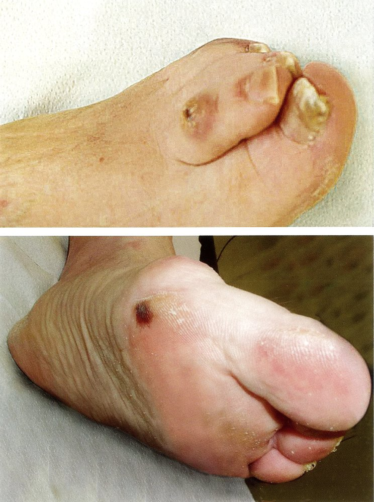
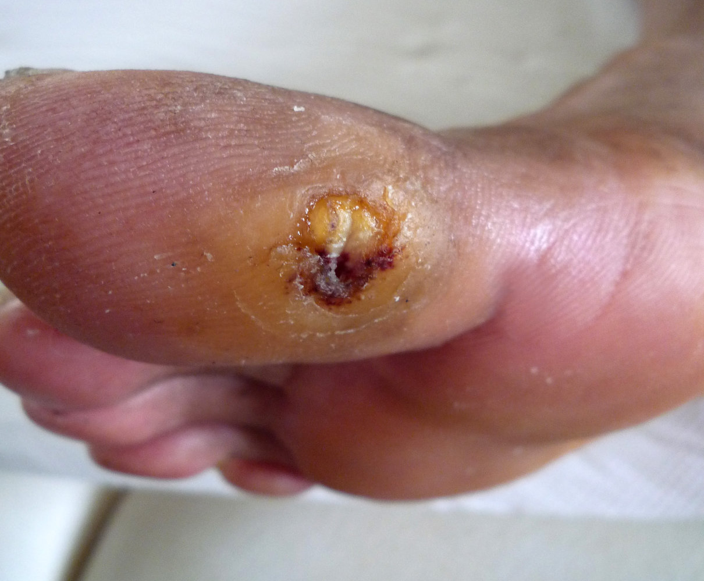
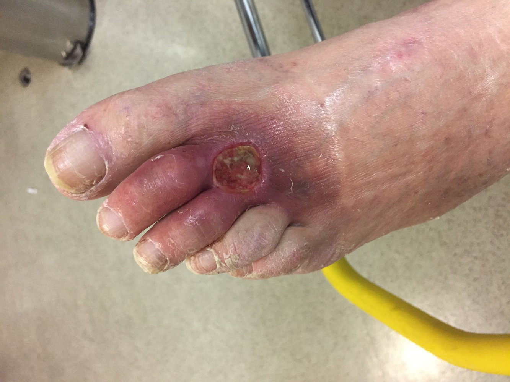
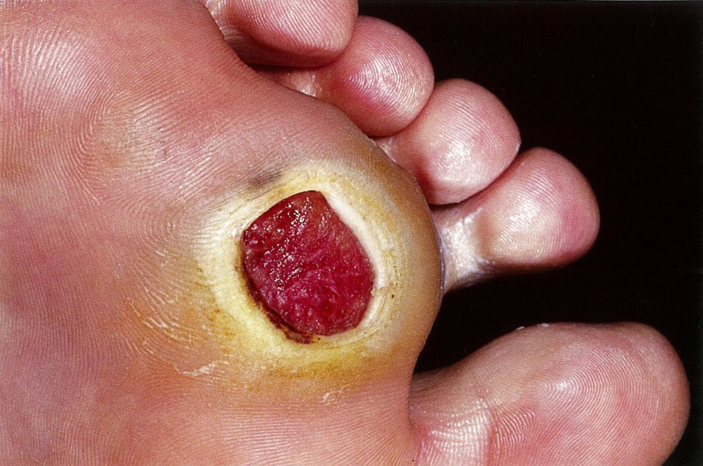
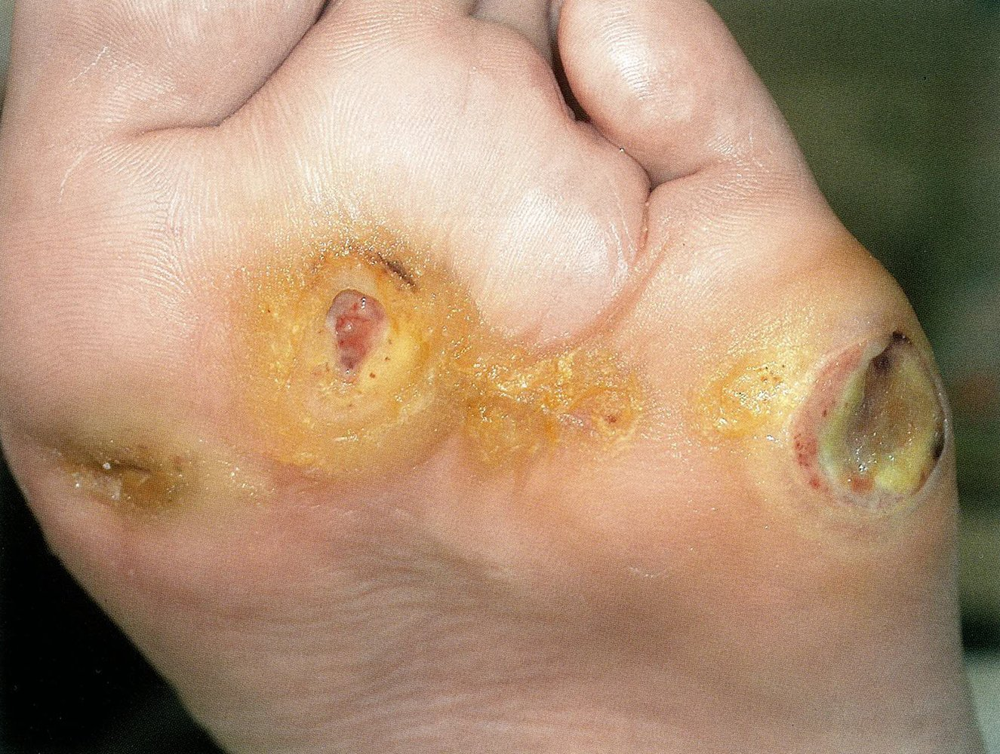
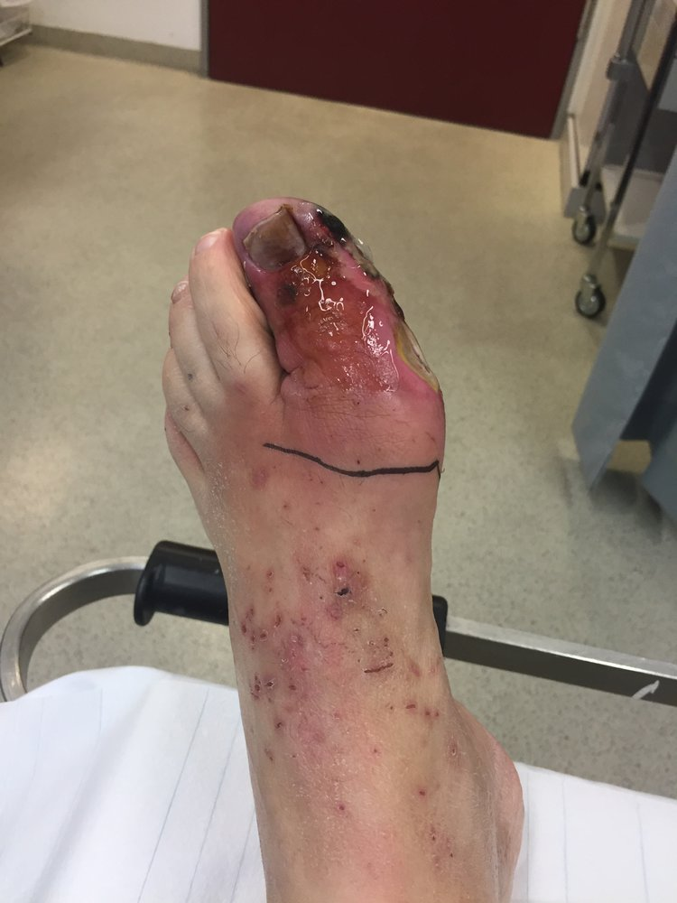
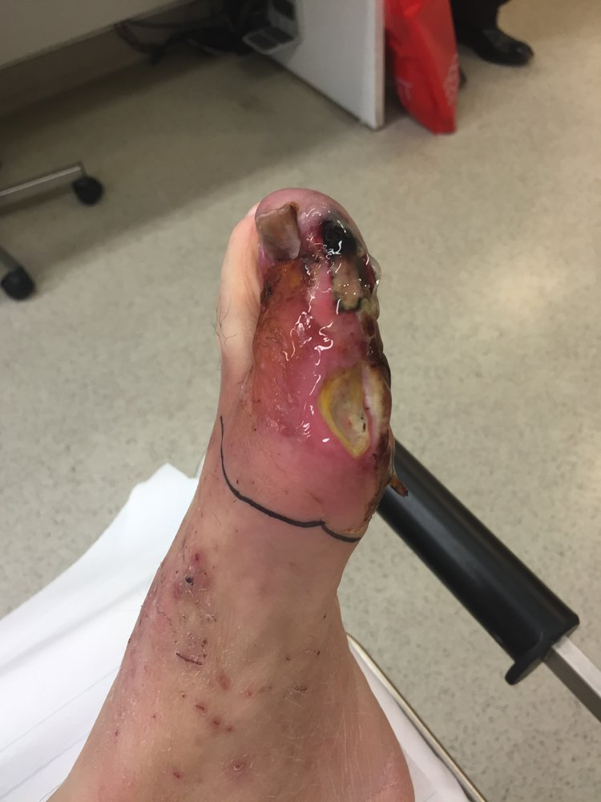
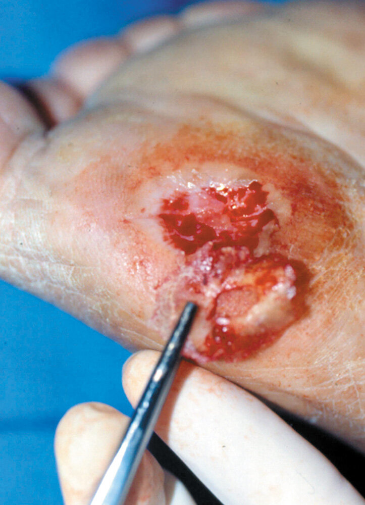
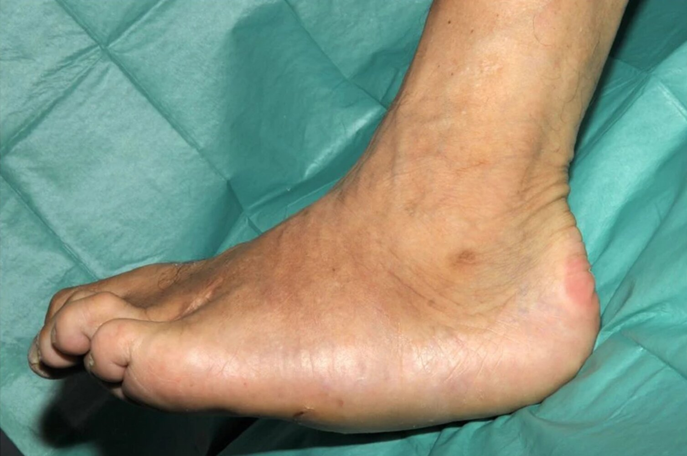
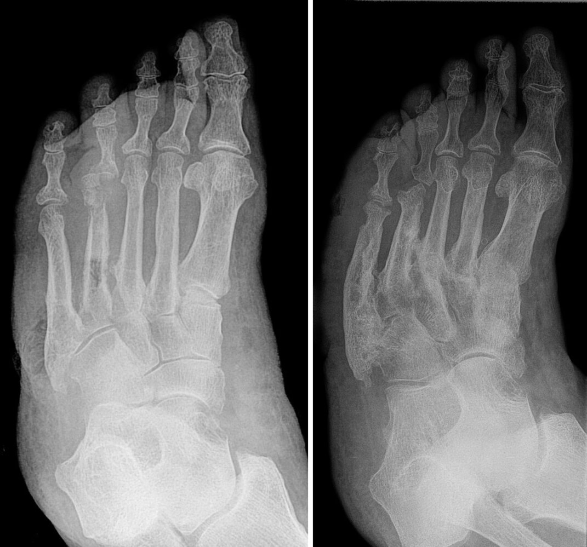

# Diabetic foot

*Categories: Clinical knowledge > Internal medicine > Endocrinology > Disorders of glucose metabolism > Diabetic foot*

[Original Article Link](https://coursology-qbank.com/amboss/article/Pt0Wd3)

---

## Summary

Diabetic foot is a condition that results from long-standing <u>diabetes</u> and comprises <u>ulcers</u>, infections, and <u>foot deformities</u>. These complications result from the effects of <u>diabetes</u> on the <u>peripheral nervous system</u> and <u>microvasculature</u>; once one complication (e.g., <u>ulceration</u>) develops, the likelihood of developing another (e.g., <u>osteomyelitis</u>) increases. Diagnosis and management depend on the specific complication, but usually involve assessment for associated neuropathy and <u>peripheral arterial disease</u> (<u>PAD</u>), involvement of a multidisciplinary foot care team, and optimization of <u>diabetes management</u>. All patients should be educated on <u>prevention of diabetic foot</u>, e.g., daily foot examinations, foot care, and glycemic control, and encouraged to attend scheduled <u>diabetic foot screenings</u>.

See also “<u>Diabetic neuropathy</u>.”

---

## Diabetic foot ulcers

### <u>Epidemiology</u>

* Up to one-third of patients with <u>diabetes</u> develop foot <u>ulcers</u>. [[2]](https://coursology-qbank.com/amboss/article/t81Xoi0)

* Associated with increased rates of: [[2]](https://coursology-qbank.com/amboss/article/t81Xoi0)[[3]](https://coursology-qbank.com/amboss/article/9p1N730)

* Hospitalization

* <u>Amputation</u>

* <u>Death</u>

> [!TIP]
> 80% of patients with <u>diabetes</u> requiring a lower limb <u>amputation</u> had a preceding foot <u>ulcer</u>. [[3]](https://coursology-qbank.com/amboss/article/9p1N730)

### <u>Risk factors</u> [[3]](https://coursology-qbank.com/amboss/article/9p1N730)[[4]](https://coursology-qbank.com/amboss/article/0_1e5j0)

* Poor glycemic control: Chronic <u>hyperglycemia</u> causes <u>nonenzymatic glycation</u> of <u>axon</u> <u>proteins</u> and subsequent development of progressive sensorimotor neuropathy, typically affecting multiple <u>peripheral nerves</u>.

* Long-term comorbidities

* <u>Peripheral neuropathy</u>

* <u>PAD</u>

* Long-term tobacco use

* <u>Microvascular</u> disease (e.g., <u>retinopathy</u>, <u>chronic kidney disease</u>)

* <u>Diabetic foot deformities</u> and calluses

* Prior <u>ulcers</u> or <u>amputation</u>

* Trauma

* Dermatological conditions, e.g., <u>fungal infections</u>

### Classification

<u>Diabetic foot ulcers</u> are classified as: [[3]](https://coursology-qbank.com/amboss/article/9p1N730)

* Neuropathic ulcers: due to neuropathy (e.g., peripheral sensory neuropathy, <u>autonomic neuropathy</u>)

* <u>Ischemic</u> <u>ulcers</u>: due to <u>PAD</u> and <u>microvascular</u> changes [[5]](https://coursology-qbank.com/amboss/article/--1D-j0)

* Neuroischemic <u>ulcers</u>: due to both neuropathy and <u>ischemic</u> changes

> [!TIP]
> Neuroischemic <u>ulcers</u> are becoming increasingly common and now comprise half of all <u>diabetic foot ulcers</u>. [[5]](https://coursology-qbank.com/amboss/article/--1D-j0)

### Clinical features [[2]](https://coursology-qbank.com/amboss/article/t81Xoi0)[[4]](https://coursology-qbank.com/amboss/article/0_1e5j0)

* <u>Skin</u> breakdown with or without surrounding tissue <u>necrosis</u> [[6]](https://coursology-qbank.com/amboss/article/dE1oui0) 

* <u>Neuropathic ulcers</u> occur at sites of repetitive <u>stress</u>/trauma, such as:

* Bony abnormalities

* On the bottom of the foot: Malum perforans most commonly manifests over the head of the <u>metatarsal bones</u> or the heel.  [[3]](https://coursology-qbank.com/amboss/article/9p1N730)

* <u>Ischemic</u> and neuroischemic <u>ulcers</u> often occur on the toes or <u>lateral</u> foot.

* Usually painless

* May be preceded by signs of infection, trauma, or calluses

* Underlying <u>risk factors</u> may be present, e.g.:

* <u>Signs and symptoms of diabetic peripheral neuropathy</u> (e.g., sensory loss, motor <u>weakness</u>)

* <u>Characteristic features of PAD</u> (e.g., cool foot with no palpable pulses)

Patient with diabetes, dermatophyte infection, and foot deformities

Diabetic foot ulcer

Diabetic foot

Neurotrophic ulcer (malum perforans)

Malum perforans

Features of arterial, venous, and neuropathic ulcers

### Diagnostics

* Assess for any signs of <u>diabetic foot infection</u>.

* Evaluate for <u>peripheral neuropathy</u> (see “<u>Diagnostics of polyneuropathy</u>”).

* Perform <u>diagnostics for PAD</u>.  [[3]](https://coursology-qbank.com/amboss/article/9p1N730)

* Consider imaging for underlying <u>diabetic foot osteomyelitis</u>.

### Management of <u>diabetic foot ulcers</u> [[3]](https://coursology-qbank.com/amboss/article/9p1N730)

* Management of underlying causes

* Optimize <u>management of diabetes</u> to meet <u>glycemic targets for diabetes</u>.

* Provide <u>management of PAD</u> if present (e.g., with surgical or endovascular <u>revascularization</u> procedures).  [[3]](https://coursology-qbank.com/amboss/article/9p1N730)

* Treat any associated <u>diabetic foot infections</u>.

* Specialized footwear  [[4]](https://coursology-qbank.com/amboss/article/0_1e5j0)[[7]](https://coursology-qbank.com/amboss/article/cI1abR0)

* Provide mechanical offloading from pressure points [[8]](https://coursology-qbank.com/amboss/article/Tuc6qV0)

* Reduce progression and recurrence of foot <u>ulcers</u>

* Decrease calluses

* <u>Wound care</u>: Provide in consultation with a <u>wound care</u> specialist.

* Dressings to promote <u>wound healing</u>  [[3]](https://coursology-qbank.com/amboss/article/9p1N730)

* <u>Debridement</u> (e.g., surgical) including removal of surrounding calluses, if present

* Refractory <u>ulcers</u>: little response after at least 4 weeks of therapy [[3]](https://coursology-qbank.com/amboss/article/9p1N730)[[4]](https://coursology-qbank.com/amboss/article/0_1e5j0)

* <u>Negative pressure wound therapy</u>

* <u>Hyperbaric oxygen therapy</u>

* <u>Biologic therapies</u> (e.g., <u>platelet-derived growth factor</u>)

* <u>Amputation</u>  [[6]](https://coursology-qbank.com/amboss/article/dE1oui0)

#### Follow-up

* Follow up with patients at 1–4 week intervals to assess healing progress.  [[3]](https://coursology-qbank.com/amboss/article/9p1N730)

* Patients should be followed up for life by foot care specialists (see “<u>Prevention of diabetic foot</u>”). [[4]](https://coursology-qbank.com/amboss/article/0_1e5j0)

> [!TIP]
> Management of <u>diabetic foot ulcers</u> frequently requires a multidisciplinary team (e.g., podiatrist, <u>wound care</u> specialist, vascular <u>surgeon</u>, endocrinologist). [[6]](https://coursology-qbank.com/amboss/article/dE1oui0)

> [!WARNING]
> <u>Antibiotics</u> are not indicated for <u>diabetic ulcers</u> unless there are <u>signs of wound infection</u>. [[8]](https://coursology-qbank.com/amboss/article/Tuc6qV0)

---

## Diabetic foot infections

<u>Diabetic foot ulcers</u> have a high risk of infection due to the negative effect of <u>diabetes</u> on <u>immunity</u> and <u>microvasculature</u>. [[3]](https://coursology-qbank.com/amboss/article/9p1N730)

### <u>Skin and soft tissue infections</u>

#### <u>Epidemiology</u>

* Infection occurs in ∼50% of <u>diabetic foot ulcers</u>. [[9]](https://coursology-qbank.com/amboss/article/SZWyaP0)

* Infection is a main <u>risk factor</u> for <u>amputation</u> in patients with <u>diabetes</u>. [[3]](https://coursology-qbank.com/amboss/article/9p1N730)

#### Etiology [[8]](https://coursology-qbank.com/amboss/article/Tuc6qV0)

* Infections are typically polymicrobial.

* <u>Staphylococci</u> and <u>streptococci</u> spp. are the most common causative pathogens.

#### Clinical features [[8]](https://coursology-qbank.com/amboss/article/Tuc6qV0)[[10]](https://coursology-qbank.com/amboss/article/VE1Gui0)

* Signs and symptoms

* <u>Edema</u>

* Induration

* <u>Erythema</u>  [[8]](https://coursology-qbank.com/amboss/article/Tuc6qV0)

* Tenderness

* Warmth

* <u>Purulent</u> <u>exudate</u>

* Classification of infection severity [[8]](https://coursology-qbank.com/amboss/article/Tuc6qV0)

* Mild: <u>superficial</u> infection with ≤ 2 cm of <u>erythema</u>

* Moderate: deep infection or > 2 cm of <u>erythema</u>

* Severe: any degree of infection plus <u>systemic inflammatory response syndrome</u>

Diabetic foot infection (cellulitis)

Cellulitis in diabetic foot infection

#### Diagnostics [[8]](https://coursology-qbank.com/amboss/article/Tuc6qV0)[[10]](https://coursology-qbank.com/amboss/article/VE1Gui0)

* <u>CBC</u>, <u>CRP</u>, <u>ESR</u>  [[8]](https://coursology-qbank.com/amboss/article/Tuc6qV0)

* Wound cultures via <u>biopsy</u> or <u>curettage</u>

* <u>Diagnostics for PAD</u> and <u>diagnostics of polyneuropathy</u>.

* Assessment for <u>diabetic foot osteomyelitis</u> (e.g., <u>probe to bone test</u>, imaging)

* Patients with severe infections: Additionally obtain <u>diagnostic studies for sepsis</u>.

#### Management [[3]](https://coursology-qbank.com/amboss/article/9p1N730)[[8]](https://coursology-qbank.com/amboss/article/Tuc6qV0)[[10]](https://coursology-qbank.com/amboss/article/VE1Gui0)

* Refer patients to a multidisciplinary foot care team when possible.  [[8]](https://coursology-qbank.com/amboss/article/Tuc6qV0)

* Admit patients with any of the following criteria:

* Severe infection

* <u>Chronic limb-threatening ischemia</u>

* <u>Barriers to follow-up</u>

* Little response to outpatient management

* Start <u>wound care</u>; patients may require <u>surgical debridement</u> or in severe cases, <u>amputation</u>.

* Initiate <u>empiric antibiotic therapy for skin and soft tissue infections</u>.  [[8]](https://coursology-qbank.com/amboss/article/Tuc6qV0)

* Consider the following factors when choosing an <u>antibiotic</u>:

* Infection severity

* Local resistance patterns

* Recent <u>antibiotic</u> use

* <u>Risk factors for MRSA infection</u> and/or <u>Pseudomonas aeruginosa</u>

* Route [[8]](https://coursology-qbank.com/amboss/article/Tuc6qV0)

* Mild infection: often treated with oral <u>antibiotics</u>

* Moderate infection: may be treated with either oral or parenteral <u>antibiotics</u>

* Severe infection: Parenteral <u>antibiotics</u> are generally recommended.

* Adjust <u>antibiotic therapy</u> as needed based on culture results and continue for up to 4 weeks.  [[10]](https://coursology-qbank.com/amboss/article/VE1Gui0)

> [!TIP]
> Patients with <u>diabetic foot infections</u> should receive <u>wound care</u> in addition to <u>antibiotic therapy</u>. [[8]](https://coursology-qbank.com/amboss/article/Tuc6qV0)

> [!WARNING]
> Topical <u>antibiotics</u> are not indicated for the treatment of <u>diabetic foot infections</u>. [[10]](https://coursology-qbank.com/amboss/article/VE1Gui0)

### Diabetic foot osteomyelitis [[3]](https://coursology-qbank.com/amboss/article/9p1N730)[[10]](https://coursology-qbank.com/amboss/article/VE1Gui0)

* Common in patients with <u>malum perforans</u> <u>ulcers</u>

* <u>Osteomyelitis</u> should be suspected in any patient with an <u>ulcer</u> and any of the following features: [[3]](https://coursology-qbank.com/amboss/article/9p1N730)[[11]](https://coursology-qbank.com/amboss/article/ZZWZZP0)

* Clinical features of <u>skin and soft tissue infection</u> (e.g., <u>erythema</u>, <u>edema</u>)

* <u>Ulcer</u> size > 2 cm2 and/or <u>ulcer</u> depth > 3 mm [[8]](https://coursology-qbank.com/amboss/article/Tuc6qV0)

* Exposed <u>bone tissue</u>

* Positive probe-to-bone test

* A clinical test to evaluate for <u>osteomyelitis</u> related to chronic <u>ulcers</u>

* A sterile blunt probe is inserted into the <u>ulcer</u>; direct contact of the probe with the bone indicates potential underlying <u>osteomyelitis</u>.

* Chronic (lasting several weeks) and/or treatment-resistant <u>ulcers</u>

* An <u>ulcer</u> overlying a bony prominence

* Markedly increased <u>ESR</u> (> 70 mm/hour)

* Unexplained <u>leukocytosis</u>

* Obtain serial plain radiographs and/or <u>MRI</u> (see also “<u>Diagnostics of osteomyelitis</u>”). [[3]](https://coursology-qbank.com/amboss/article/9p1N730)

* Treatment involves optimizing the <u>management of diabetes</u>, <u>antibiotics</u>, and possible <u>surgery</u> (see “<u>Treatment of osteomyelitis</u>”). [[3]](https://coursology-qbank.com/amboss/article/9p1N730)

Osteomyelitis

Foot ulcer with abscess and osteomyelitis

---

## Diabetic foot deformities

<u>Diabetic neuropathy</u> can lead to <u>foot deformities</u>, which increases a patient's risk of developing foot <u>ulcers</u> and requiring <u>amputation</u>. [[4]](https://coursology-qbank.com/amboss/article/0_1e5j0)

### Hammer toes and claw toes [[12]](https://coursology-qbank.com/amboss/article/UZWbaP0)

See also “<u>Toe deformities</u>.”

* Pathophysiology: occurs secondary to <u>diabetic neuropathy</u> due to loss of intrinsic muscle volume and thickening of the <u>plantar</u> <u>aponeurosis</u>  [[13]](https://coursology-qbank.com/amboss/article/7ZW41P0)

* Clinical features  [[12]](https://coursology-qbank.com/amboss/article/UZWbaP0)

* <u>Hammer toe</u>: <u>PIP</u> <u>joint</u> <u>flexion</u> with or without <u>DIP</u> <u>joint</u> extension or <u>MTP joint</u> hyperextension 

* Flexible <u>hammer toe</u>: <u>joint</u> deformity can be manually corrected

* Fixed (rigid) <u>hammer toe</u>: <u>joint</u> deformity cannot be manually corrected

* <u>Claw toe</u>: <u>PIP</u> <u>joint</u> <u>flexion</u>, <u>DIP</u> <u>joint</u> <u>flexion</u>, and <u>MTP joint</u> hyperextension

* Diagnosis

* Typically clinical, may be detected on <u>screening for diabetic foot</u>

* Imaging: Consider <u>weight-bearing</u> <u>x-rays</u> to assess for other <u>foot deformities</u>.  [[12]](https://coursology-qbank.com/amboss/article/UZWbaP0)

* Management: Refer to a foot care specialist. [[4]](https://coursology-qbank.com/amboss/article/0_1e5j0)

* Initial treatment is conservative and may include:

* Specialized therapeutic footwear (extra-depth shoes)

* Management of concurrent <u>diabetic neuropathy</u> and/or <u>peripheral artery disease</u>

* Consider <u>surgery</u> for: [[6]](https://coursology-qbank.com/amboss/article/dE1oui0)[[12]](https://coursology-qbank.com/amboss/article/UZWbaP0)

* Poor response to <u>conservative therapy</u>

* Prevention of <u>skin</u> complications (<u>callus</u>, <u>ulcer</u>)

### Diabetic neuropathic arthropathy (Charcot foot) [[14]](https://coursology-qbank.com/amboss/article/y-1d-j0)

* <u>Neuropathic arthropathy</u> is the development of bone destruction, subluxation/<u>dislocation</u>, and deformity secondary to neuropathy (most commonly <u>diabetic neuropathy</u>).

* The tarsus and tarsometatarsal <u>joints</u> are most commonly affected.

* Clinical presentation depends on the stage.

* Acute stage

* Swelling, warmth, <u>erythema</u>

* <u>Pain</u> is typically mild-to-moderate, as the underlying <u>peripheral neuropathy</u> reduces sensation.

* Chronic stage: painless bony deformities, midfoot collapse (<u>rocker-bottom foot deformity</u>), <u>osteolysis</u>, <u>fractures</u>

* Diagnosis requires <u>x-ray</u> (first line) and <u>MRI</u> (in diagnostic uncertainty).

* Initial treatment is conservative (mechanical offloading, <u>treatment of diabetes</u>); <u>surgery</u> is used for severe or refractory cases.

> [!WARNING]
> <u>Diabetic neuropathic arthropathy</u> can be challenging to distinguish from <u>diabetic foot osteomyelitis</u>; in diagnostic uncertainty, consider <u>bone biopsy</u>. [[3]](https://coursology-qbank.com/amboss/article/9p1N730)

Rocker-bottom deformity in Charcot foot

Diabetic neuropathic arthropathy

Diabetic neuropathic arthropathy

---

## Prevention

* Address <u>risk factors</u> for <u>diabetic foot ulcers</u>, e.g.: [[3]](https://coursology-qbank.com/amboss/article/9p1N730)[[4]](https://coursology-qbank.com/amboss/article/0_1e5j0)

* Optimize glycemic control (see “<u>Glycemic targets in diabetes</u>”).  [[3]](https://coursology-qbank.com/amboss/article/9p1N730)

* Encourage <u>smoking cessation</u>.

* Initiate <u>ASCVD prevention</u>.

* Screen patients ≥ 50 years old for concomitant <u>PAD</u> with an <u>ABI</u>. [[3]](https://coursology-qbank.com/amboss/article/9p1N730)

* Identify and treat dermatological conditions that increase the risk of <u>ulcers</u> (e.g., <u>onychomycosis</u>, calluses).

* Educate patients (or caregivers) on: [[3]](https://coursology-qbank.com/amboss/article/9p1N730)[[4]](https://coursology-qbank.com/amboss/article/0_1e5j0)[[7]](https://coursology-qbank.com/amboss/article/cI1abR0)

* The importance of attending regular <u>diabetic foot screenings</u>

* Daily self-monitoring, including:

* Foot examination

* <u>Skin</u> and <u>nail</u> care

* Avoiding self-treatment of <u>calluses/corns</u> (e.g., chemical removal agents); patients should see a healthcare professional.

* Selecting socks with no seams, or wearing socks with seams inside out to prevent rubbing

* Choosing appropriate footwear

* Avoid walking barefoot or wearing open-toed or open-heeled shoes.

* Ensure shoes fit properly and meet the criteria for safe footwear.

* Patients at high risk of <u>ulceration</u>  require specialized therapeutic footwear.

* Clinical features of diabetic foot and how to seek appropriate medical attention for them

> [!WARNING]
> Patients with other <u>microvascular</u> complications (e.g., <u>diabetic retinopathy</u>, <u>peripheral neuropathy</u>) may struggle to perform daily foot care; teach caregivers to examine the foot if there are concerns about the patient's ability to self-monitor. [[4]](https://coursology-qbank.com/amboss/article/0_1e5j0)

### Screening for diabetic foot [[3]](https://coursology-qbank.com/amboss/article/9p1N730)[[4]](https://coursology-qbank.com/amboss/article/0_1e5j0)[[7]](https://coursology-qbank.com/amboss/article/cI1abR0)

* Interval [[3]](https://coursology-qbank.com/amboss/article/9p1N730)[[4]](https://coursology-qbank.com/amboss/article/0_1e5j0)

* No previous complications: annually

* Previous sensory loss, <u>ulceration</u>, or <u>amputation</u>: at every visit

* Recommended assessment

* Focused history to determine if, since their last visit, there have been any new:

* Symptoms (e.g. burning, <u>pain</u>, numbness, <u>claudication</u>)

* <u>Risk factors</u> (e.g., <u>cigarette smoking</u>)

* Diabetic complications (e.g., <u>diabetic retinopathy</u>, <u>diabetic kidney disease</u>)

* <u>Inspection of the skin</u> (e.g., assessing for <u>skin</u> breakdown, calluses, <u>signs of wound infection</u>)

* Evaluation of bones (e.g., for deformities)

* <u>Focused examination of sensation</u> (e.g., <u>10g monofilament test</u>)

* <u>Palpation of pedal pulses</u>

Monofilament test

---