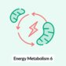
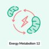
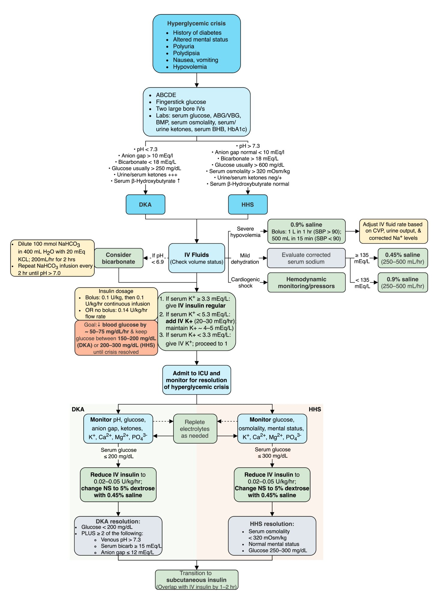

# Hyperglycemic crises

*Categories: Clinical knowledge > Internal medicine > Endocrinology > Disorders of glucose metabolism > Hyperglycemic crises*

[Original Article Link](https://coursology-qbank.com/amboss/article/jg0_E2)

---

## Summary

<u>Hyperglycemic</u> crisis is a condition characterized by severe <u>hyperglycemia</u> and metabolic disturbances and may be the initial manifestation of <u>diabetes mellitus</u> or a complication of <u>diabetes</u> or another condition. Inadequate <u>insulin</u> replacement (e.g., due to <u>poor adherence</u>) or increased <u>insulin</u> demand (e.g., due to acute illness, <u>surgery</u>, or <u>stress</u>) may lead to acute <u>hyperglycemia</u>. In <u>diabetic ketoacidosis</u> (<u>DKA</u>), which is more common in patients with <u>type 1 diabetes</u> (<u>T1DM</u>), no <u>insulin</u> is available to suppress <u>lipolysis</u>, causing <u>ketone</u> formation and <u>acidosis</u>. In a <u>hyperglycemic hyperosmolar state</u> (<u>HHS</u>), which is more common in patients with <u>type 2 diabetes</u> (<u>T2DM</u>), there is still some <u>insulin</u> available and therefore minimal or no <u>ketone</u> formation. Clinical features of both <u>DKA</u> and <u>HHS</u> include <u>polyuria</u>, <u>polydipsia</u>, <u>nausea and vomiting</u>, <u>volume depletion</u> (e.g., dry oral <u>mucosa</u>, decreased <u>skin turgor</u>), and eventually mental status changes and/or <u>coma</u>. Features unique to <u>DKA</u> include breath with a fruity odor, <u>hyperventilation</u>, and abdominal <u>pain</u>. <u>DKA</u> typically has an acute onset (e.g., within hours), while <u>HHS</u> usually develops insidiously (e.g., within days) and manifests with more extreme <u>volume depletion</u>. The mainstay of treatment for both <u>DKA</u> and <u>HHS</u> consists of <u>IV fluid resuscitation</u>, <u>electrolyte repletion</u>, and <u>insulin therapy</u>.

For <u>management of hyperglycemic crises in children</u>, see "<u>Diabetic ketoacidosis in children</u>." For patients with <u>hyperglycemia</u> without <u>DKA</u> or <u>HHS</u>, see also “<u>Diabetes mellitus</u>” and “<u>Inpatient management of hyperglycemia</u>.”

Energy Metabolism - Part 6: The Citric Acid Cycle with molecular structures

Energy Metabolism - Part 6: The Citric Acid Cycle without molecular structures

Energy Metabolism - Part 12: Ketone Body Metabolism

---

## Overview

| Comparison of DKA and HHS |  |  |
| --- | --- | --- |
|  |  <u>Diabetic ketoacidosis</u>  [[1]](https://coursology-qbank.com/amboss/article/KFdUQ70) |  <u>Hyperglycemic hyperosmolar state</u> [[1]](https://coursology-qbank.com/amboss/article/KFdUQ70) |
| <u>Insulin</u> |  * Absent   |  * Present   |
| <u>Ketones</u> |  * Present   |  * Absent   |
| Pathogenesis |  * Acute <u>stress</u> (e.g., infection) → increased metabolic demand or <u>insulin</u> noncompliance → ↑ <u>lipolysis</u> → ↑ fatty acids → ↑ <u>ketogenesis</u> (<u>β-hydroxybutyrate</u> > <u>acetoacetate</u>)   |   * Severe <u>hyperglycemia</u> → ↑ serum <u>osmolality</u> → <u>osmotic diuresis</u> → <u>dehydration</u>  * Especially the elderly are more susceptible to <u>dehydration</u> than younger people    |
| Signs/symptoms |   * <u>Dehydration</u>  * <u>Delirium</u>/<u>psychosis</u>  * <u>Kussmaul breathing</u>  * Abdominal <u>pain</u>  * <u>Nausea</u>, <u>vomiting</u>  * Fruity (acetone) breath odor    |   * Profound <u>dehydration</u>  * <u>Polydipsia</u>  * <u>Polyuria</u>  * <u>Lethargy</u>  * <u>Focal neurological deficits</u>  * <u>Seizures</u>    |
| Labs |   * <u>Hyperglycemia</u> ≥ 200 mg/dL  * <u>Anion gap metabolic acidosis</u> (↑ H+, ↓ HCO3), <u>pH</u> < 7.3  * Decreased intracellular <u>K+</u> (normal or increased serum <u>K+</u>)  * Hyperkaliuria (total <u>K+</u> depletion)  * Hyperketonuria, hyperketonemia  * <u>Leukocytosis</u>    |   * <u>Hyperglycemia</u> (≥ 600 mg/dL)  * ↑ <u>Serum osmolality</u> (total > 320 mOsm/kg, calculated > 300 mOsm/kg)  * Decreased intracellular <u>K+</u> (normal or increased serum <u>K+</u>)  * Normal serum <u>pH</u> and <u>ketones</u>    |
| Complications |   * <u>Cerebral edema</u>  * <u>Cardiac arrhythmias</u>  * <u>Heart failure</u>  * <u>Mucormycosis</u> (life-threatening)    |   * <u>Coma</u>  * <u>Death</u> (if untreated)    |
| Treatment |   * <u>Fluid resuscitation</u>  * Short-acting IV <u>insulin</u>  * Replacement of <u>potassium</u>  * <u>Glucose</u> supplementation in the case of <u>hypoglycemia</u>    |   * <u>Fluid resuscitation</u>  * IV <u>insulin</u>  * Replacement of <u>potassium</u>    |

> [!NOTE]
> The most important findings of <u>diabetic ketoacidosis</u> (<u>DKA</u>) are: Delirium/<u>psychosis</u>, Dehydration, Kussmaul respirations, Abdominal <u>pain</u>/<u>nausea</u>/<u>vomiting</u>, fruity (Acetone) breath odor.

---

## Etiology

* Lack of or insufficient <u>insulin replacement therapy</u>

* Undiagnosed, untreated <u>diabetes mellitus</u>

* Treatment failure in known diabetics: 

* <u>Insulin pump</u> failure

* Forgotten <u>insulin</u> injection

* <u>Poor adherence</u> to <u>insulin therapy</u>

* Inability to afford treatment

* Use of expired <u>insulin</u>

* Increased <u>insulin</u> demand

* <u>Stress</u>: infections, <u>surgery</u>, trauma, <u>myocardial infarction</u>, <u>burns</u>, <u>heatstroke</u>

* Drugs: <u>glucocorticoid</u> therapy, <u>cocaine</u> use, <u>alcohol abuse</u>

> [!TIP]
> <u>DKA</u>, often precipitated by infection (e.g., <u>pneumonia</u>, <u>urinary tract infection</u>), is a common initial manifestation of <u>type 1 diabetes mellitus</u> (∼ 30% of cases).

---

## Pathophysiology

### Pathophysiology of diabetic ketoacidosis (<u>DKA</u>)

<u>DKA</u> primarily affects patients with <u>type 1 diabetes</u>.

#### <u>Osmotic diuresis</u> and <u>hypovolemia</u>

* <u>Insulin</u> normally elevates cellular uptake of <u>glucose</u> from the blood.

* In the <u>insulin</u>-deficient state of <u>DKA</u>, <u>hyperglycemia</u> occurs.

* <u>Hyperglycemia</u>, in turn, leads to progressive <u>volume depletion</u> via <u>osmotic diuresis</u>.

* <u>Insulin</u> deficiency → <u>hyperglycemia</u> → <u>hyperosmolality</u> → <u>osmotic diuresis</u> and loss of <u>electrolytes</u> → <u>hypovolemia</u>

> [!WARNING]
> <u>Hypovolemia</u> resulting from <u>DKA</u> can lead to <u>acute kidney injury</u> (<u>AKI</u>) due to decreased <u>renal blood flow</u>! <u>Hypovolemic shock</u> may also develop.

#### <u>Metabolic acidosis</u> with increased <u>anion gap</u>

* <u>Insulin</u> deficiency increases fat breakdown (<u>lipolysis</u>) through increased activity of <u>hormone-sensitive lipase</u>.

* <u>Metabolic acidosis</u> develops as the free <u>fatty acids</u> generated by <u>lipolysis</u> become <u>ketones</u>, two of which are acidic (<u>acetoacetic acid</u> and <u>beta-hydroxybutyric acid</u>).

* Serum <u>bicarbonate</u> is consumed as a buffer for the acidic <u>ketones</u>. <u>Metabolic acidosis</u> with an <u>elevated anion gap</u> is therefore characteristic of <u>DKA</u>.

* <u>Insulin</u> deficiency → ↑ <u>lipolysis</u> → ↑ free <u>fatty acids</u> → hepatic <u>ketone</u> production (<u>ketogenesis</u>) → <u>ketosis</u> → <u>bicarbonate</u> consumption (as a buffer) → <u>anion gap</u> <u>metabolic acidosis</u>

> [!NOTE]
> <u>DKA</u> is an important <u>cause of anion gap metabolic acidosis</u> with respiratory compensation.

#### Intracellular <u>potassium</u> deficit

* As a result of <u>hyperglycemic</u> <u>hyperosmolality</u>, <u>potassium</u> shifts along with water from inside cells to the <u>extracellular space</u> and is lost in the urine.

* <u>Insulin</u> normally promotes cellular <u>potassium</u> uptake but is absent in <u>DKA</u>, compounding the problem.

* A total body <u>potassium</u> deficit develops in the body, although serum <u>potassium</u> may be normal or even paradoxically elevated.

* <u>Insulin</u> deficiency → <u>hyperosmolality</u> → <u>K+</u> shift out of cells + lack of <u>insulin</u> to promote <u>K+</u> uptake → intracellular <u>K+</u>depleted → total body <u>K+</u> deficit despite normal or even elevated serum <u>K+</u>

> [!NOTE]
> There is a total body <u>potassium</u> deficit in <u>DKA</u>. This becomes important during treatment, when <u>insulin</u> replacement leads to rapid <u>potassium</u> uptake by depleted cells and patients may require <u>potassium replacement</u>.

Diabetes mellitus, hyperglycemia, & ketoacidosis (DKA): question-based learning

### Pathophysiology of <u>hyperglycemic hyperosmolar state</u> (<u>HHS</u>)

* Primarily affects patients with <u>type 2 diabetes</u>

* The pathophysiology of <u>HHS</u> is similar to that of <u>DKA</u>.

* However, in <u>HHS</u>, there are still small amounts of <u>insulin</u> being secreted by the <u>pancreas</u>, and this is sufficient to prevent <u>DKA</u> by suppressing <u>lipolysis</u> and, in turn, <u>ketogenesis</u>.

* <u>HHS</u> is characterized by symptoms of marked <u>dehydration</u> (and loss of <u>electrolytes</u>) due to the predominating <u>hyperglycemia</u> and <u>osmotic diuresis</u>.

---

## Clinical features

### Signs and symptoms of both <u>DKA</u> and <u>HHS</u>

* <u>Polyuria</u>

* <u>Polydipsia</u>

* Recent weight loss

* <u>Nausea and vomiting</u>

* <u>Signs of significant dehydration</u>

* Neurological abnormalities

* <u>Altered mental status</u>

* <u>Lethargy</u>

* <u>Coma</u>

* Other <u>neurological examination</u> abnormalities, e.g., blurred <u>vision</u> and <u>weakness</u>

> [!WARNING]
> Patients with known <u>diabetes</u> who present with <u>nausea</u> and/or <u>vomiting</u> should be immediately assessed for <u>DKA</u>/<u>HHS</u>.

### Specific findings in <u>DKA</u> [[2]](https://coursology-qbank.com/amboss/article/jr0_Sh)

* Rapid onset (< 24 h) in contrast to <u>HHS</u>

* Abdominal <u>pain</u>

* Fruity odor on the breath (from exhaled acetone)

* <u>Hyperventilation</u>: rapid and/or deep breaths (Kussmaul respirations)

Kussmaul Breathing Pattern

### Comparison: <u>DKA</u> vs. <u>HHS</u> [[1]](https://coursology-qbank.com/amboss/article/KFdUQ70)

| Clinical findings of DKA versus HHS |  |  |
| --- | --- | --- |
|  | <u>DKA</u> | <u>HHS</u> |
| <u>Diabetes</u> | Typically type 1 | Typically type 2 |
| History of severe <u>stress</u>, illness, hospitalization | + | + |
| <u>Polyuria</u>, <u>polydipsia</u> | + | + |
| <u>Nausea</u>, <u>vomiting</u> | + | +/- |
| <u>Dehydration</u> | + | ++ (Profound) |
| Mental status | Usually alert | Usually altered |
| <u>Hyperventilation</u> or <u>Kussmaul breathing</u> | + | - |
| Fruity breath | + | - |
| Severe abdominal <u>pain</u> | + | - |
| Onset | Rapid (< 24 h) | Insidious (days) |

> [!TIP]
> In <u>DKA</u>, absolute <u>insulin</u> deficiency leads to the rapid development of symptomatic <u>acidosis</u> and an early presentation (within hours) with only moderate <u>hyperglycemia</u> (≥ 200 mg/dL). [[1]](https://coursology-qbank.com/amboss/article/KFdUQ70)

> [!TIP]
> In <u>HHS</u>, residual <u>insulin</u> production prevents significant ketoacidosis leading to insidious progression (days to weeks) and profound <u>hypovolemia</u> and <u>hyperglycemia</u> (≥ 600 mg/dL). [[1]](https://coursology-qbank.com/amboss/article/KFdUQ70)

---

## Diagnosis

### Approach [[1]](https://coursology-qbank.com/amboss/article/KFdUQ70)[[3]](https://coursology-qbank.com/amboss/article/GDdBfH0)

* Check serum <u>glucose</u> to confirm <u>hyperglycemia</u>.

* Check <u>BMP</u> for serum <u>bicarbonate</u>, <u>anion gap</u>, <u>electrolytes</u>, and renal function.

* Check for <u>ketones</u>.

* Urine <u>ketones</u>: Standard <u>urine dipstick</u> assays detect <u>acetoacetate</u> and acetone but not <u>β-hydroxybutyrate</u>.

* Serum <u>β-hydroxybutyrate</u>

* Check <u>blood gas analysis</u> for <u>pH</u>.  [[4]](https://coursology-qbank.com/amboss/article/1HY26q)

* Diagnostic workup to evaluate the underlying cause: <u>HbA1c</u>, <u>CBC</u>, <u>ECG</u>, infectious workup

> [!TIP]
> <u>DKA</u> is the diagnosis in patients who have <u>hyperglycemia</u> or a history of <u>diabetes</u> along with elevated <u>ketones</u> (in blood and/or urine) and <u>metabolic acidosis</u>.

> [!TIP]
> <u>HHS</u> is the diagnosis in patients who have <u>hyperglycemia</u> and <u>hyperosmolality</u>.

### Diagnostic criteria and severity

#### Diagnostic criteria of <u>HHS</u> [[1]](https://coursology-qbank.com/amboss/article/KFdUQ70)[[5]](https://coursology-qbank.com/amboss/article/eudxJ70)

* <u>Hyperglycemia</u> (blood <u>glucose</u> ≥ 600 mg/dL)

* <u>Hyperosmolality</u> (calculated effective <u>serum osmolality</u> > 300 mOsm/kg or total <u>serum osmolality</u> > 320 mOsm/kg)

* Absence of <u>ketonemia</u> and <u>acidosis</u>

#### Diagnostic criteria and severity of <u>DKA</u> [[1]](https://coursology-qbank.com/amboss/article/KFdUQ70)[[5]](https://coursology-qbank.com/amboss/article/eudxJ70)

* <u>Hyperglycemia</u> (blood <u>glucose</u> ≥ 200 mg/dL) and/or history of <u>diabetes</u>

* <u>Ketosis</u> (serum <u>β-hydroxybutyrate</u> ≥ 3 mmol/L and/or ≥ 2+ on urine strip)

* <u>Metabolic acidosis</u> (<u>pH</u> < 7.3 and/or <u>bicarbonate</u> < 18 mEq/L)

|  Severity of DKA [[1]](https://coursology-qbank.com/amboss/article/KFdUQ70) |  |  |  |  |
| --- | --- | --- | --- | --- |
|  | Arterial <u>pH</u> | Serum <u>bicarbonate</u> | Serum <u>β-hydroxybutyrate</u> | Mental status |
| Mild | 7.26–7.29 | 15–18 mEq/L | 31.2–62.5 mg/dL | Alert |
| Moderate | 7.0–7.25 | 10–14 mEq/L | 31.2–62.5 mg/dL | Alert or drowsy |
| Severe | < 7.0 | < 10 mEq/L | > 6 mmol/L | Stuporous or <u>comatose</u>  |

### Laboratory findings in hyperglycemic crises [[1]](https://coursology-qbank.com/amboss/article/KFdUQ70)

|  Laboratory findings in <u>DKA</u> and <u>HHS</u> [[1]](https://coursology-qbank.com/amboss/article/KFdUQ70)  |  |  |  |
| --- | --- | --- | --- |
| Laboratory test |  | <u>DKA</u> | <u>HHS</u> |
| <u>BMP</u> | <u>Glucose</u> |   * Typically≥ 200 mg/dL and < 600 mg/dL  * Approx. 10% of patients with <u>DKA</u> will be <u>euglycemic</u> (i.e., blood <u>glucose</u> < 200 mg/dL). [[1]](https://coursology-qbank.com/amboss/article/KFdUQ70)[[6]](https://coursology-qbank.com/amboss/article/gFdFh70)    |  * ≥ 600 mg/dL   |
| <u>Bicarbonate</u> |  * < 18 mEq/L   |  * ≥ 15 mEq/L   |  |
|  <u>Anion gap</u>    |  * Often <u>elevated anion gap</u> (> 12 mEq/L)   |  * <u>Normal anion gap</u> < 10 mEq/L   |  |
| <u>Urinalysis</u> |  |   * Moderate to large (≥ 2+) urine <u>ketones</u> (indicates <u>ketonuria</u>)  * <u>Glucosuria</u>    |   * Negative or small <u>ketones</u> (< 2+)  * <u>Glucosuria</u>    |
| Serum <u>β-hydroxybutyrate</u> |  |  * Elevated ≥ 3 mmol/L   |  * Normal (< 3 mmol/L)   |
| <u>Blood gas</u> |  |  * <u>pH</u> < 7.30   |  * <u>pH</u> ≥ 7.30   |
| <u>Serum osmolality</u> |  |  * Normal or mildly elevated   |  * Elevated (total > 320 mOsm/kg, calculated > 300 mOsm/kg)   |

Anion Gap

> [!TIP]
> Normal <u>serum osmolality</u> in a stuporous patient rules out <u>HHS</u>; assess for other <u>causes of altered mental status</u>.

> [!WARNING]
> <u>Euglycemia</u> does not rule out <u>DKA</u>. Assess <u>ketone</u> levels in all patients with <u>high anion gap metabolic acidosis</u> to evaluate for <u>euglycemic</u> <u>DKA</u>.

### <u>Electrolytes</u> and renal function [[3]](https://coursology-qbank.com/amboss/article/GDdBfH0)[[7]](https://coursology-qbank.com/amboss/article/x7YELq)

* <u>Sodium</u>

* <u>Hyponatremia</u> is common in both <u>DKA</u> and <u>HHS</u> due to <u>hypovolemic hyponatremia</u> ;   and <u>hypertonic hyponatremia</u>

* Always check <u>corrected sodium for hyperglycemia</u>.

* <u>Potassium</u> in <u>DKA</u>: normal or elevated (despite a total body deficit)

* <u>Magnesium</u> levels are typically low.

* <u>Phosphorus</u> levels may be elevated despite a total body deficit.

* <u>BUN</u> and <u>creatinine</u> are often elevated.  [[8]](https://coursology-qbank.com/amboss/article/TGY6Aq)

> [!TIP]
> For <u>anion gap</u> calculation, use the measured serum <u>sodium</u> concentration rather than the <u>corrected serum sodium concentration</u>. [[9]](https://coursology-qbank.com/amboss/article/4s13ER0)

### Additional diagnostic workup [[1]](https://coursology-qbank.com/amboss/article/KFdUQ70)[[3]](https://coursology-qbank.com/amboss/article/GDdBfH0)[[10]](https://coursology-qbank.com/amboss/article/B7YzLq)

Additional diagnostics are indicated depending on suspected precipitating causes and differential diagnoses.

* <u>HbA1c</u>

* Urine <u>pregnancy test</u>  [[11]](https://coursology-qbank.com/amboss/article/_7Y5oq)

* <u>Diagnostics for AMS</u>, e.g.:

* CT head

* Toxicology screen

* <u>Diagnostics for sepsis</u>, e.g.:

* <u>CBC with differential</u>

* Serum <u>lactate</u>

* <u>Diagnostics for myocardial infarction</u> (e.g., 12-lead <u>ECG</u>)

* <u>Diagnostics for acute abdomen</u>, e.g.:

* Abdominal imaging

* Serum <u>lipase</u> [[12]](https://coursology-qbank.com/amboss/article/isYJuq)

* Serum <u>transaminases</u>

> [!TIP]
> Rule out infection, <u>myocardial infarction</u>, and <u>pancreatitis</u> in all patients presenting with a <u>hyperglycemic</u> crisis.

> [!TIP]
> <u>Pregnancy</u> and <u>SGLT2</u>-inhibitors can cause <u>euglycemic</u> <u>DKA</u> (i.e., <u>high anion gap metabolic acidosis</u> with normal or near-normal <u>glucose</u>). [[11]](https://coursology-qbank.com/amboss/article/_7Y5oq)[[13]](https://coursology-qbank.com/amboss/article/-sYDxq)

---

## Management

### Approach [[1]](https://coursology-qbank.com/amboss/article/KFdUQ70)[[10]](https://coursology-qbank.com/amboss/article/B7YzLq)[[14]](https://coursology-qbank.com/amboss/article/AN1Rdh0)

* Initial steps

* <u>ABCDE approach</u>

* Urgent diagnostics (e.g., <u>POC glucose</u>, <u>BMP</u>, <u>blood gas analysis</u>)

* <u>Volume status assessment</u>

* Principal interventions

* <u>Fluid resuscitation</u>: initially with <u>normal saline</u> (<u>0.9% NaCl</u>) or <u>lactated Ringer's solution</u>

* <u>Potassium repletion</u>: for baseline <u>potassium</u> level ≤ 5 mEq/L

* <u>Insulin therapy</u>: Initiate <u>short-acting insulin</u> as soon as possible once <u>potassium</u> level is > 3.5 mEq/L.

* <u>IV sodium bicarbonate</u>: consider only for severe refractory <u>metabolic acidosis</u> (e.g., <u>pH</u> < 7.0)  [[1]](https://coursology-qbank.com/amboss/article/KFdUQ70)[[15]](https://coursology-qbank.com/amboss/article/e31xhg0)

* Identify and treat precipitating causes (e.g., <u>sepsis</u>).

* Avoid overly rapid correction of serum <u>sodium</u> and <u>osmolality</u>.

* Consider endocrine consult and admission to the <u>ICU</u>.

* <u>Noninsulin diabetes medications</u>

* Avoid noninsulin agents in patients with <u>T1DM</u>.

* Stop <u>SGLT2 inhibitors</u>.

* Consider use of other noninsulin agents for patients with <u>T2DM</u> in consultation with <u>endocrinology</u>.

> [!TIP]
> The goal of therapy is to resolve <u>hyperglycemia</u>, <u>ketonemia</u>, and <u>acidosis</u> in <u>DKA</u> and <u>hyperglycemia</u> and <u>hyperosmolarity</u> in <u>HHS</u>.

> [!WARNING]
> Pregnant patients with <u>DKA</u> should be assessed by an endocrinologist and <u>obstetrician</u> due to the potential for a <u>high-risk pregnancy</u>.

Management of hyperglycemic crisis: DKA and HHS

### Monitoring  [[1]](https://coursology-qbank.com/amboss/article/KFdUQ70)[[16]](https://coursology-qbank.com/amboss/article/5HYiIq)[[17]](https://coursology-qbank.com/amboss/article/y7Ydoq)

* All patients

* Hourly <u>vital signs</u>, mental status assessment, and hydration status

* <u>POC glucose</u> every 1–2 hours until <u>hyperglycemic</u> crisis resolves.

* <u>Blood gas</u> and <u>BMP</u> with <u>electrolytes</u> every 2–4 hours ≤ 0.5 mEq/L≤ 10 mEq/L

* <u>HHS</u>: <u>serum osmolality</u> every 2–4 hours until <u>hyperglycemic</u> crisis resolves

* <u>DKA</u>: serum <u>β-hydroxybutyrate</u> every 4 hours until <u>hyperglycemic</u> crisis resolves

> [!TIP]
> Regularly monitor <u>volume status</u>, serum <u>glucose</u>, serum <u>electrolytes</u>, and acid-base status.

> [!WARNING]
> Consider <u>cerebral edema</u> (due to overly rapid correction of <u>serum osmolality</u>) in patients with <u>headache</u>, mental status deterioration, <u>seizures</u>, and <u>pupillary</u> changes.

### Disposition [[1]](https://coursology-qbank.com/amboss/article/KFdUQ70)[[14]](https://coursology-qbank.com/amboss/article/AN1Rdh0)[[18]](https://coursology-qbank.com/amboss/article/KnbU88)

* Admission

* Indicated for all patients with <u>HHS</u> and most patients with <u>DKA</u>  [[19]](https://coursology-qbank.com/amboss/article/0i1eJg0)

* Consider <u>ICU</u> admission for patients with any of the following:

* Persistently <u>altered mental status</u> or <u>hemodynamic instability</u>

* Severe <u>DKA</u> or <u>HHS</u>

* Underlying critical illness (e.g., <u>sepsis</u>, <u>MI</u>)

* Discharge may be considered for patients with mild <u>DKA</u> and all of the following:

* Resolved <u>acidosis</u>

* No concerning precipitating cause

* Toleration of oral hydration and nutrition

* Adequate <u>basal-bolus insulin regimen</u>

* Ability to adhere to discharge instructions, including outpatient follow-up

---

## Fluid and electrolyte management

### <u>Fluid resuscitation</u> [[1]](https://coursology-qbank.com/amboss/article/KFdUQ70)[[10]](https://coursology-qbank.com/amboss/article/B7YzLq)[[16]](https://coursology-qbank.com/amboss/article/5HYiIq)

* First 2–4 hours: <u>0.9% NaCl</u> or balanced <u>crystalloid solutions</u> (e.g., <u>lactated Ringer's solution</u>) at 500–1000 mL/hour  [[1]](https://coursology-qbank.com/amboss/article/KFdUQ70)

* Next 8–12 hours: <u>0.9% NaCl</u> or <u>crystalloid solution</u> to replace 50% of <u>remaining fluid deficit</u> [[1]](https://coursology-qbank.com/amboss/article/KFdUQ70)

* Within the first 24–48 hours: Adjust IV fluid rate and composition according to <u>CVP</u>, urine output, blood <u>glucose</u>, and corrected <u>sodium</u> levels.
* Check <u>corrected sodium for hyperglycemia</u>.

* If corrected serum <u>sodium</u> ≥ 135 mmol/L: <u>0.45% NaCl</u> DOSAGE

* If corrected serum <u>sodium</u> < 135 mmol/L: <u>0.9% NaCl</u> DOSAGE

* Switch to a solution containing dextrose (e.g., <u>D5NS</u>) once <u>glucose</u> falls to < 250 mg/dL. [[1]](https://coursology-qbank.com/amboss/article/KFdUQ70)

> [!WARNING]
> Carefully monitor for <u>signs of fluid overload</u> during <u>fluid resuscitation</u>, especially in patients with comorbidities (e.g., <u>congestive heart failure</u>, <u>chronic kidney disease</u>). [[14]](https://coursology-qbank.com/amboss/article/AN1Rdh0)

> [!TIP]
> <u>IV fluids</u> alone can decrease blood <u>glucose</u> concentrations by 50 mg/dL/hour. [[1]](https://coursology-qbank.com/amboss/article/KFdUQ70)

> [!WARNING]
> To reduce the risk of complications in <u>HHS</u>, ensure that serum <u>sodium</u> levels decline by ≤ 10 mmol/L/day and <u>osmolality</u> decreases by less than 3–8 mOsm/kg/hour. [[1]](https://coursology-qbank.com/amboss/article/KFdUQ70)

### <u>Electrolyte repletion</u> [[1]](https://coursology-qbank.com/amboss/article/KFdUQ70)

* <u>Potassium</u>

* <u>Potassium</u> levels must be > 3.5 mEq/L before <u>insulin therapy</u> is initiated.

* Initiate <u>potassium replacement</u> if levels are ≤ 5 mEq/L.

* Maintain serum <u>potassium</u> between 4–5 mEq/L.

* Use extreme caution with <u>potassium repletion</u> in <u>anuric</u> patients.

* Monitor <u>potassium</u> levels 2 hours after starting <u>insulin</u> and every 2–4 hours thereafter until <u>hyperglycemic</u> crisis resolves.

* See also “<u>Repletion regimens for hypokalemia</u>.”

|  <u>Potassium repletion</u> in <u>hyperglycemic</u> crises [[1]](https://coursology-qbank.com/amboss/article/KFdUQ70)  |  |
| --- | --- |
| Serum postassium |  Recommended dose  [[1]](https://coursology-qbank.com/amboss/article/KFdUQ70)  |
| < 3.5 mEq/L |   * IV <u>potassium</u> <u>chloride</u> via <u>central line</u> DOSAGE  * Withhold <u>insulin</u> until <u>potassium</u> > 3.5 mEq/L.    |
| 3.5–5.0 mEq/L |  * <u>Potassium</u> <u>chloride</u> added to <u>IV fluids</u> DOSAGE   |
| > 5.0 mEq/L |  * No repletion recommended   |

* <u>Phosphorus</u>: Replete only if symptomatic (e.g., <u>muscle weakness</u>, cardiac or respiratory compromise) and phosphorous < 1 mmol/L (see “<u>Repletion regimens for hypophosphatemia</u>”). [[1]](https://coursology-qbank.com/amboss/article/KFdUQ70)

* <u>Magnesium</u>: See “<u>Repletion regimens for hypomagnesemia</u>.”

> [!WARNING]
> <u>Potassium</u> levels must be > 3.5 mEq/L before administering <u>insulin</u>, as <u>insulin</u> will lower serum <u>potassium</u> and potentially cause severe <u>hypokalemia</u>.

### Acid-base status [[1]](https://coursology-qbank.com/amboss/article/KFdUQ70)

* <u>Acidosis</u> usually resolves with fluids and <u>insulin therapy</u>; IV <u>sodium</u> <u>bicarbonate</u> is usually unnecessary.

* If <u>pH</u> < 7.0 despite adequate IV fluid resuscitation, administer <u>IV sodium bicarbonate</u>. DOSAGE

---

## Insulin therapy

### General principles [[1]](https://coursology-qbank.com/amboss/article/KFdUQ70)[[16]](https://coursology-qbank.com/amboss/article/5HYiIq)[[20]](https://coursology-qbank.com/amboss/article/4sY3Eq)

* <u>Insulin</u> is essential to halting <u>lipolysis</u> and ketoacidosis in patients with <u>DKA</u>.

* Recommended regimens 

* Initial <u>insulin</u> bolus  DOSAGE in <u>DKA</u> if there is a delay in initiating infusion [[1]](https://coursology-qbank.com/amboss/article/KFdUQ70)

* <u>Short-acting insulin</u> by continuous IV infusion (e.g., <u>regular insulin</u> in <u>DKA</u> DOSAGE or <u>HHS</u> DOSAGE) [[1]](https://coursology-qbank.com/amboss/article/KFdUQ70)

* Consider treatment with subcutaneous <u>rapid-acting insulin</u> analogues for uncomplicated mild-moderate <u>DKA</u>.

* Consider coadministration of low-dose basal <u>insulin</u>.

* In <u>HHS</u>, ensure blood <u>glucose</u> levels decline by less than 90–120 mg/dL/hour in order to prevent <u>cerebral edema</u>. [[1]](https://coursology-qbank.com/amboss/article/KFdUQ70)

* Check <u>glucose</u> level every 1–2 hours and adjust <u>insulin</u> infusion rate as needed.

* In patients requiring ongoing <u>insulin</u> infusion: 

* Switch <u>IV fluids</u> to <u>D5NS</u> or D10NS infusion once serum <u>glucose</u> falls to < 250 mg/dL.  [[1]](https://coursology-qbank.com/amboss/article/KFdUQ70)

* Titrate <u>insulin</u> to a glycemic target of 150–200 mg/dL (in <u>DKA</u>) or 200–250 mg/dL (in <u>HHS</u>). [[1]](https://coursology-qbank.com/amboss/article/KFdUQ70)

### <u>Resolution of hyperglycemic crises</u> [[1]](https://coursology-qbank.com/amboss/article/KFdUQ70)

|  Criteria for the resolution of hyperglycemic crises [[1]](https://coursology-qbank.com/amboss/article/KFdUQ70)[[3]](https://coursology-qbank.com/amboss/article/GDdBfH0)  |  |
| --- | --- |
| <u>DKA</u> | <u>HHS</u> |
|   * <u>Glucose</u> < 200 mg/dL  * Venous <u>pH</u> ≥ 7.30  * Serum <u>bicarbonate</u> ≥ 18 mEq/L  * Serum <u>ketone</u> < 0.6 mmol/L    |   * Normal <u>serum osmolality</u> (i.e., calculated < 300 mOsm/kg)  * Normal mental status  * Blood <u>glucose</u> < 250 mg/dL  * Urine output > 0.5 mL/kg/hour    |

### Transition to subcutaneous <u>insulin</u> [[1]](https://coursology-qbank.com/amboss/article/KFdUQ70)

* Criteria for transitioning to subcutaneous <u>insulin</u>

* Resolution of <u>hyperglycemic</u> crisis

* Precipitating factor identified and treated

* Patient tolerating oral nutrition and eating consistently

* Procedure for transitioning to subcutaneous <u>insulin</u> 

* Stop dextrose infusion.

* Administer a <u>basal-bolus insulin regimen</u> (∼ 50% basal <u>insulin</u> and 50% prandial <u>insulin</u>).

* Estimate total daily dose (TDD) based on: [[1]](https://coursology-qbank.com/amboss/article/KFdUQ70)

* Prior outpatient regimen in patients previously on <u>insulin</u> (adjust as needed)

* Weight-based estimates in <u>insulin</u>-naive patients (e.g., 0.3–0.6 units/kg/day) [[1]](https://coursology-qbank.com/amboss/article/KFdUQ70)

* IV <u>insulin</u> hourly requirement (e.g., quantity used in the preceding 6 hours)

* Continue IV <u>insulin</u> for 1–2 hours after initiating subcutaneous <u>insulin</u>.

---

## Differential diagnoses

* Other <u>causes of anion gap metabolic acidosis</u>, e.g.:

* <u>Alcoholic ketoacidosis</u>

* <u>Lactic acidosis</u>

* <u>Starvation</u> ketoacidosis

* Toxin ingestion

* Other causes of <u>hyperglycemia</u> and <u>hypovolemia</u> (e.g., <u>sepsis</u>, <u>acute pancreatitis</u>)

* Other <u>causes of AMS</u>, e.g., <u>hypoglycemia</u>

> [!TIP]
> All other <u>causes of altered mental status</u> must be considered in the differential diagnosis of <u>DKA</u>/<u>HHS</u>. Intoxication and other endocrine disorders, as well as <u>gastroenteritis</u>, <u>myocardial infarction</u>, <u>pancreatitis</u>, and other causes of <u>high anion gap metabolic acidosis</u>, should all be excluded.

The differential diagnoses listed here are not exhaustive.

---

## Complications

* <u>Cerebral edema</u>

* <u>Cardiac arrhythmias</u>

* <u>Heart failure</u>, <u>respiratory failure</u>

* <u>Mucormycosis</u> (<u>Mucor</u> and <u>Rhizopus</u> species)

* <u>Hypoglycemia</u>

* <u>Hypokalemia</u>

We list the most important complications. The selection is not exhaustive.

---