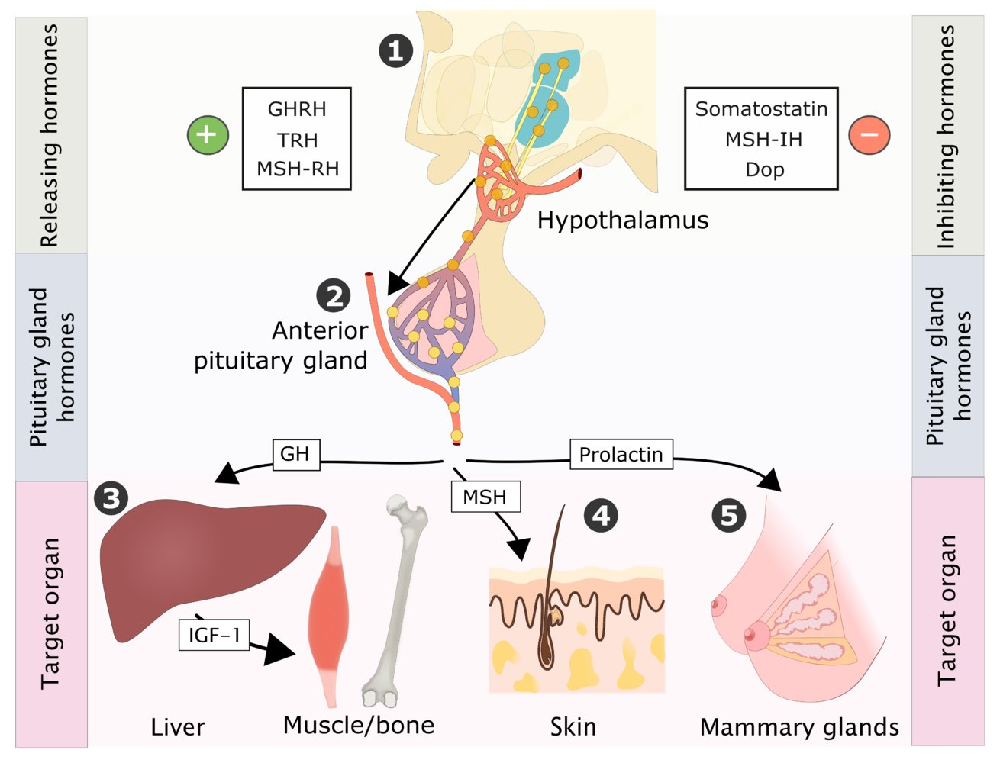
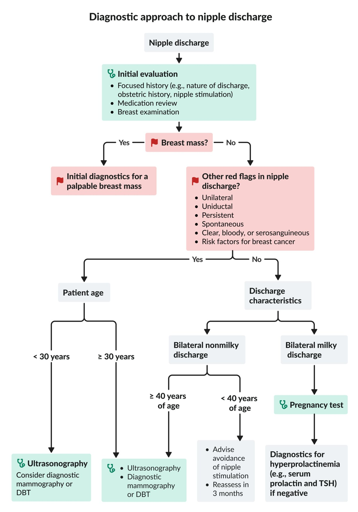
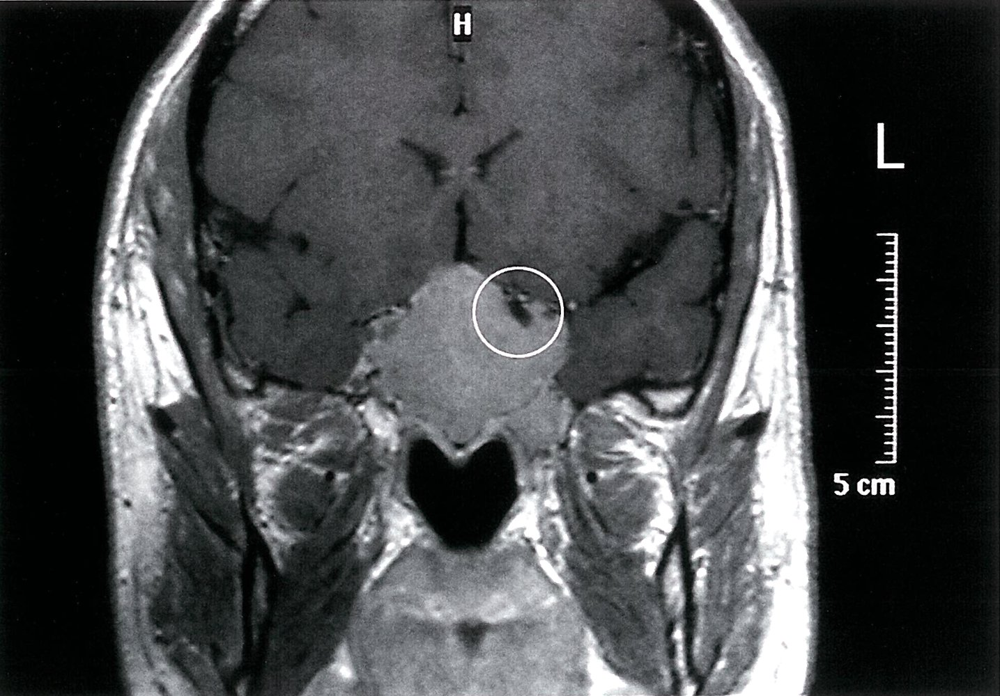
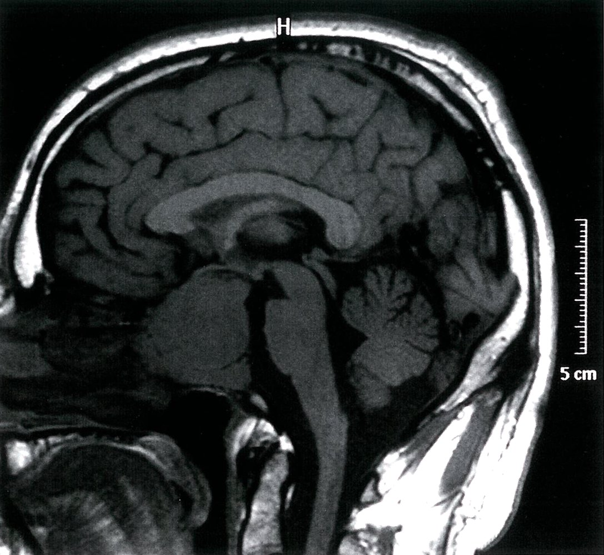
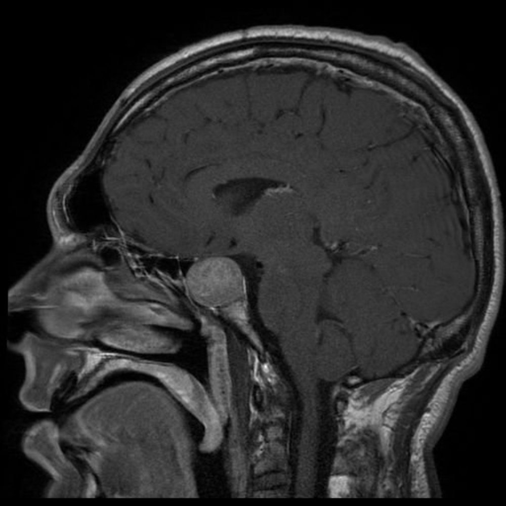

# Hyperprolactinemia

*Categories: Clinical knowledge > Internal medicine > Endocrinology > Hypothalamus and pituitary gland disorders > Hyperprolactinemia*

[Original Article Link](https://coursology-qbank.com/amboss/article/0g0eF2)

---

## Summary

Hyperprolactinemia is the increased production of <u>prolactin</u> by the <u>anterior pituitary</u>. Physiological hyperprolactinemia can be caused by <u>pregnancy</u>, lactation, and <u>stress</u>. Nonphysiological hyperprolactinemia is most often due to <u>pituitary adenomas</u> (e.g., <u>prolactinomas</u>, <u>corticotroph adenomas</u>) or medications. Other causes are diverse and include <u>primary hypothyroidism</u> and systemic conditions such as <u>chronic kidney disease</u> (<u>CKD</u>) and <u>cirrhosis</u>. Hyperprolactinemia commonly manifests with <u>galactorrhea</u> and/or features of <u>hypogonadotropic hypogonadism</u>, e.g., <u>menstrual cycle abnormalities</u>, <u>infertility</u>, or <u>erectile dysfunction</u>. Patients may also present with features of the underlying cause, e.g., <u>headaches</u> and visual disturbance in <u>prolactinomas</u>. Elevated serum <u>prolactin</u> levels confirm the diagnosis. Assess for non-<u>hypothalamic</u>-<u>pituitary</u> causes; if no diagnosis emerges, a <u>pituitary</u> <u>MRI</u> should be performed to assess for a <u>pituitary adenoma</u>. <u>Prolactinomas</u> are typically managed with <u>dopamine agonists</u>. Discontinuation of the causative agent should be considered for medication-induced hyperprolactinemia.

---

## Etiology

### <u>Hypothalamic</u>-<u>pituitary</u> [[1]](https://coursology-qbank.com/amboss/article/8TXOsx)[[2]](https://coursology-qbank.com/amboss/article/CTdqG60)[[3]](https://coursology-qbank.com/amboss/article/xTdEG60)

* <u>Pituitary adenomas</u>

* <u>Prolactinomas</u>: most common cause of nonphysiological hyperprolactinemia [[2]](https://coursology-qbank.com/amboss/article/CTdqG60)

* Other <u>pituitary adenomas</u>, e.g., <u>somatotropinomas</u> and <u>corticotroph adenomas</u>, can also secrete <u>prolactin</u>.

* <u>Hypothalamic-pituitary stalk damage</u> (<u>stalk effect</u>): : Damage to the <u>pituitary stalk</u> and/or portal vessels due to tumors, trauma, or <u>surgery</u> reduces <u>dopaminergic</u> inhibition on <u>pituitary</u> <u>lactotrophs</u>.

* <u>Primary hypothyroidism</u>: : <u>Hypothyroidism</u> leads to increased <u>thyrotropin-releasing hormone</u> (<u>TRH</u>), which stimulates <u>prolactin</u> release.

> [!NOTE]
> <u>Hypothalamic</u> <u>dopamine</u> inhibits <u>prolactin</u> secretion, whereas <u>TRH</u> stimulates it.

### Pharmacological [[2]](https://coursology-qbank.com/amboss/article/CTdqG60)[[3]](https://coursology-qbank.com/amboss/article/xTdEG60)

* <u>Dopamine antagonists</u> 

* <u>Typical antipsychotics</u> and <u>atypical antipsychotics</u>: e.g., <u>chlorpromazine</u>, <u>haloperidol</u>, <u>risperidone</u>, <u>amisulpride</u>

* <u>Antiemetics</u>: e.g., <u>metoclopramide</u>, <u>domperidone</u>

* <u>Tricyclic antidepressants</u>: e.g., <u>clomipramine</u>, <u>amitriptyline</u>

* <u>Antihypertensives</u>: <u>verapamil</u>, <u>reserpine</u>, <u>methyldopa</u>

* Other: <u>H2 receptor antagonists</u> (e.g., <u>cimetidine</u>), <u>opioid analgesics</u>, <u>oral contraceptive pills</u> , <u>cocaine</u>

### Other [[2]](https://coursology-qbank.com/amboss/article/CTdqG60)[[3]](https://coursology-qbank.com/amboss/article/xTdEG60)

* Physiological: sexual intercourse, exercise, lactation, <u>nipple</u> stimulation or <u>hearing</u> a crying <u>infant</u> in lactating individuals, <u>pregnancy</u>, <u>sleep</u>, <u>stress</u>

* Systemic diseases: <u>CKD</u>, <u>cirrhosis</u>, <u>PCOS</u> [[1]](https://coursology-qbank.com/amboss/article/8TXOsx)

* <u>Chest wall</u> pathology: e.g., due to <u>surgery</u> or <u>herpes zoster</u>, potentially through activation of the suckling stimulus pathway [[1]](https://coursology-qbank.com/amboss/article/8TXOsx)

* <u>Epileptic seizures</u>: In <u>generalized tonic-clonic seizures</u>, hyperprolactinemia is due to <u>epileptic</u> activity in the <u>hypothalamus</u>.  [[3]](https://coursology-qbank.com/amboss/article/xTdEG60)[[4]](https://coursology-qbank.com/amboss/article/TDX6dZ0)

---

## Pathophysiology

* ↑ <u>Prolactin</u> → <u>galactorrhea</u>

* ↑ <u>Prolactin</u> → suppression of <u>GnRH</u> → ↓ <u>LH</u>, ↓ <u>FSH</u> → ↓ <u>estrogen</u>, ↓ <u>testosterone</u> → <u>hypogonadotropic hypogonadism</u>

* For more details, see “<u>Hypothalamus and pituitary gland</u>.”

Hormonal feedback control of nontropic hormones

---

## Clinical features

|  Clinical features of hyperprolactinemia [[3]](https://coursology-qbank.com/amboss/article/xTdEG60)[[5]](https://coursology-qbank.com/amboss/article/9TdNG60)  |  |  |  |
| --- | --- | --- | --- |
| Pathophysiology |  | Female individuals | Male individuals |
| ↑ <u>Prolactin</u> |  |  * <u>Galactorrhea</u> (present in up to 90% of <u>premenopausal</u> women with hyperprolactinemia)  [[3]](https://coursology-qbank.com/amboss/article/xTdEG60)[[5]](https://coursology-qbank.com/amboss/article/9TdNG60)   |  * <u>Galactorrhea</u> (∼ 35% of patients) [[5]](https://coursology-qbank.com/amboss/article/9TdNG60)   |
| <u>Hypogonadotropic hypogonadism</u> | ↓ <u>LH</u> and ↓ <u>FSH</u> |   * Primary and/or secondary <u>amenorrhea</u>  * <u>Abnormal uterine bleeding</u>  * <u>Infertility</u>  [[5]](https://coursology-qbank.com/amboss/article/9TdNG60)    |  * Features of ↓ <u>testosterone</u>   |
| ↓ <u>Testosterone</u> |  * Loss of libido   |   * Loss of libido, <u>erectile dysfunction</u>  * <u>Infertility</u>  [[5]](https://coursology-qbank.com/amboss/article/9TdNG60)  * <u>Gynecomastia</u>  * <u>Osteoporosis</u>  * Reduced facial and body <u>hair</u>    |  |
| ↓ <u>Estrogen</u> |   * <u>Osteoporosis</u> (late sign)  * <u>Genitourinary syndrome of menopause</u> (e.g., <u>vulvovaginal atrophy</u>)    |  * Mild or absent features   |  |

> [!NOTE]
> Patients may also present with clinical features of the underlying cause, e.g., <u>bitemporal hemianopsia</u> and <u>headache</u> in <u>pituitary adenomas</u>.

---

## Diagnosis

Increased serum <u>prolactin</u> levels confirm the diagnosis. Additional studies are performed to establish the cause.

### Serum <u>prolactin</u>

* ↑ Serum <u>prolactin</u> 

* > 20 ng/mL in men [[3]](https://coursology-qbank.com/amboss/article/xTdEG60)

* > 25 ng/mL in women  [[3]](https://coursology-qbank.com/amboss/article/xTdEG60)

* > 200 ng/mL: suggestive of <u>prolactinoma</u> [[1]](https://coursology-qbank.com/amboss/article/8TXOsx)[[2]](https://coursology-qbank.com/amboss/article/CTdqG60)

* Consider potential analytical issues (e.g., the <u>hook effect</u>) if levels do not correlate with the clinical picture.  [[1]](https://coursology-qbank.com/amboss/article/8TXOsx)[[2]](https://coursology-qbank.com/amboss/article/CTdqG60)[[3]](https://coursology-qbank.com/amboss/article/xTdEG60)

### Additional studies [[1]](https://coursology-qbank.com/amboss/article/8TXOsx)[[2]](https://coursology-qbank.com/amboss/article/CTdqG60)[[3]](https://coursology-qbank.com/amboss/article/xTdEG60)

* If no pharmacological cause has been identified, consider the following:

* <u>Thyroid function tests</u>: to exclude <u>primary hypothyroidism</u>

* Serum <u>beta-hCG</u>: to exclude <u>pregnancy</u>

* <u>BMP</u> and <u>liver chemistries</u>: if <u>CKD</u> or <u>cirrhosis</u> is suspected

* <u>MRI</u> <u>pituitary gland</u> with IV contrast: as part of <u>pituitary adenoma diagnostics</u>    [[1]](https://coursology-qbank.com/amboss/article/8TXOsx)[[5]](https://coursology-qbank.com/amboss/article/9TdNG60)

* Other studies (e.g., <u>visual field testing</u>, <u>osteoporosis screening</u>) may be requested to assess for complications. [[2]](https://coursology-qbank.com/amboss/article/CTdqG60)

> [!TIP]
> Serum <u>prolactin</u> levels < 200 ng/mL suggest a cause other than a <u>prolactinoma</u>, e.g., pharmacological or <u>primary hypothyroidism</u>. [[2]](https://coursology-qbank.com/amboss/article/CTdqG60)[[3]](https://coursology-qbank.com/amboss/article/xTdEG60)

> [!TIP]
> Always review the patient's medication history for potential causes of hyperprolactinemia.

Diagnostic approach to nipple discharge

Pituitary mass 1/2

Pituitary mass 2/2

Pituitary gland tumor

---

## Treatment

### Approach

* Refer all patients to <u>endocrinology</u>.

* Treatment depends on the severity of symptoms and the underlying cause.

* Assess for and treat complications, e.g., <u>osteoporosis</u>, <u>bitemporal hemianopia</u>.

### Nonpharmacological hyperprolactinemia

* <u>Prolactinomas</u>: <u>Dopamine agonists</u> are the treatment of choice for <u>macroprolactinomas</u> and symptomatic microprolactinomas.  [[2]](https://coursology-qbank.com/amboss/article/CTdqG60); 

* <u>Cabergoline</u> (preferred) or <u>bromocriptine</u>   [[1]](https://coursology-qbank.com/amboss/article/8TXOsx)[[6]](https://coursology-qbank.com/amboss/article/tLXXzA)

* See “<u>Management of pituitary adenomas</u>” for more information.

* <u>Hypothyroidism</u>: See “<u>Management of hypothyroidism</u>.”

* <u>CKD</u>: See “<u>Management of CKD</u>.”  [[3]](https://coursology-qbank.com/amboss/article/xTdEG60)

* <u>Stalk effect</u>: <u>surgery</u> (preferred), or <u>radiation therapy</u> if <u>surgery</u> is contraindicated [[3]](https://coursology-qbank.com/amboss/article/xTdEG60)[[5]](https://coursology-qbank.com/amboss/article/9TdNG60)

### Pharmacological hyperprolactinemia [[1]](https://coursology-qbank.com/amboss/article/8TXOsx)[[3]](https://coursology-qbank.com/amboss/article/xTdEG60)

* Asymptomatic patients

* Observation

* <u>Hormone replacement therapy</u> may be considered to reduce <u>osteoporosis</u> risk. [[1]](https://coursology-qbank.com/amboss/article/8TXOsx)

* Symptomatic patients

* Consider discontinuation, dose reduction, or switching causative medications in consultation with specialists (e.g., a <u>psychiatrist</u>). [[1]](https://coursology-qbank.com/amboss/article/8TXOsx)

* A <u>pituitary</u> <u>MRI</u> may be considered if there is no improvement after medication adjustment. [[3]](https://coursology-qbank.com/amboss/article/xTdEG60)

---