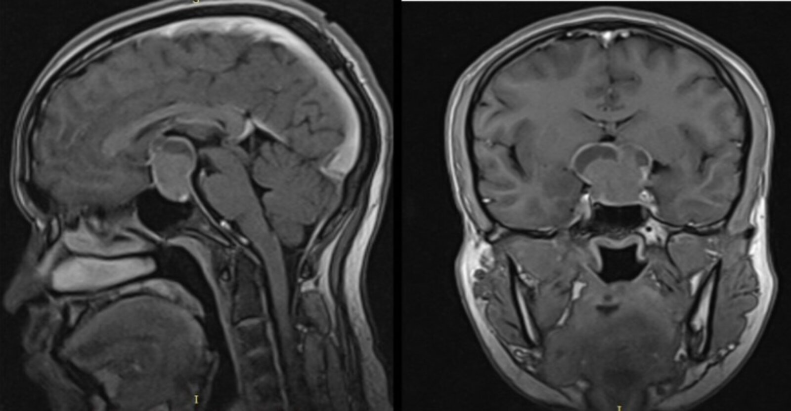
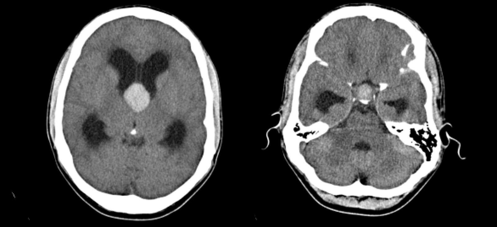
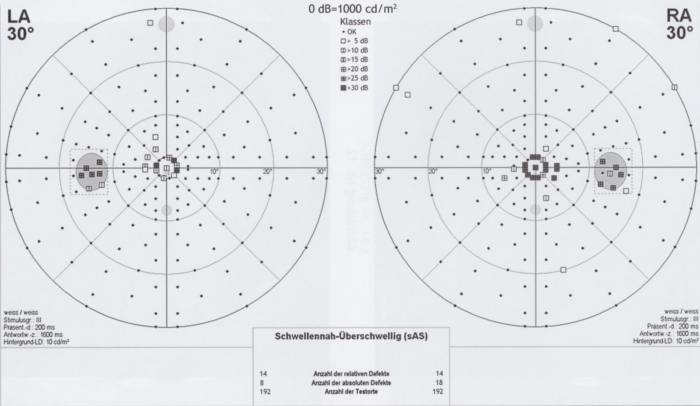

# Pituitary adenoma

*Categories: Clinical knowledge > Internal medicine > Endocrinology > Hypothalamus and pituitary gland disorders > Pituitary adenoma*

[Original Article Link](https://coursology-qbank.com/amboss/article/Oj0I0T)

---

## Summary

Pituitary adenomas (also known as <u>pituitary</u> <u>neuroendocrine tumors</u>) are <u>benign tumors</u> that arise sporadically from the <u>anterior pituitary gland</u>. They are classified as either microadenomas or macroadenomas according to their size, and as either secretory (functional) or nonsecretory (nonfunctioning) according to their ability to secrete <u>hormones</u>. Secretory <u>adenomas</u> produce the <u>pituitary</u> <u>hormone</u> of <u>the cell</u> type from which they arise, which results in a state of <u>hyperpituitarism</u>. Nonsecretory macroadenomas can destroy the surrounding normal <u>pituitary</u> tissue, which results in <u>hypopituitarism</u>. Additionally, large macroadenomas compress the <u>optic chiasm</u>; therefore, patients may present with signs of <u>mass effect</u> such as <u>bitemporal hemianopsia</u>. <u>MRI</u> <u>sella</u> with IV contrast is the <u>gold standard</u> imaging method for the <u>pituitary</u> and should reveal any intrasellar masses. <u>Pituitary</u> <u>hormone</u> assays are used to evaluate patients for endocrine abnormalities, and <u>perimetry</u> is used to identify <u>visual field</u> defects. <u>Transsphenoidal hypophysectomy</u> is the first-line therapy for most patients with symptomatic <u>pituitary</u> <u>adenomas</u>; patients with nonsecretory microadenomas generally only require follow-up (until they become symptomatic), and <u>prolactin</u>-producing <u>pituitary</u> <u>adenomas</u> (<u>prolactinomas</u>) should be initially treated with <u>dopamine agonists</u> (e.g., <u>cabergoline</u>, <u>bromocriptine</u>). <u>Pituitary</u> <u>irradiation</u> is indicated in recurrent <u>pituitary</u> <u>adenomas</u> and/or if surgical therapy is contraindicated.

---

## Epidemiology

* <u>Prevalence</u>  [[1]](https://coursology-qbank.com/amboss/article/pTXL7x)

* Approx. 80 cases per 100,000 individuals

* <u>Pituitary</u> <u>adenomas</u> account for ∼ 15% of primary <u>intracranial tumors</u>. [[1]](https://coursology-qbank.com/amboss/article/pTXL7x)

* Peak <u>incidence</u>: : 35–60 years [[2]](https://coursology-qbank.com/amboss/article/JTXs7x)

Epidemiological data refers to the US, unless otherwise specified.

---

## Etiology

* Most cases occur sporadically.

* Some cases (∼ 5%) have a genetic/familial association: [[3]](https://coursology-qbank.com/amboss/article/rTXfHx)

* <u>Multiple endocrine neoplasia</u> type 1

* Carney complex

* Caused by a <u>loss of function mutation</u> in the PRKAR1A <u>gene</u>, which encodes the regulatory subunit (R1α) of <u>protein kinase A</u>, resulting in increased <u>cAMP</u> activity

* Patients present with <u>cardiac myxoma</u>, spotty <u>skin</u> pigmentation, and <u>adrenal gland</u>, testicular, and <u>pituitary</u> <u>adenomas</u>.

* Familial isolated pituitary adenoma syndrome [[4]](https://coursology-qbank.com/amboss/article/qTXC7x)

* Caused by mutations in the <u>AIP</u> <u>gene</u>

* Patients present with <u>pituitary</u> <u>adenomas</u> without other associated abnormalities.

* The most common familial cause of <u>acromegaly</u>/<u>gigantism</u>

---

## Pathophysiology

* <u>Pituitary</u> <u>adenomas</u> are well-circumscribed, intrasellar tumors with monomorphic, polygonal cells arranged in sheets or cords without any <u>connective tissue</u> and/or <u>reticulin</u>.

* <u>Tumor</u> classification according to size

* Pituitary microadenoma: ≤ 10 mm

* Pituitary macroadenoma: > 10 mm

* <u>Tumor</u> classification according to ability to secrete <u>hormones</u>

* Nonsecretory <u>pituitary</u> <u>adenomas</u> [[5]](https://coursology-qbank.com/amboss/article/ITXYHx)

* Nonfunctioning tumors account for 15–45% of all <u>pituitary</u> <u>adenomas</u>.

* <u>Gonadotroph adenomas</u>

* Null cell <u>adenomas</u>

* Plurihormonal <u>adenomas</u>

* Silent somatotroph and <u>corticotroph adenomas</u>

* Secretory <u>pituitary</u> <u>adenomas</u>: <u>hormone</u> secretion → hyperpituitarism

* Most exclusively proliferate in only one type of endocrine cell and therefore secrete only one <u>pituitary</u> <u>hormone</u>.

* The presence of multiple <u>pituitary</u> <u>hormones</u> should also raise suspicions for atypical <u>pituitary</u> <u>adenomas</u> or <u>pituitary</u> <u>carcinomas</u>.

|  Secretory <u>pituitary</u> <u>adenomas</u>  |  |  |
| --- | --- | --- |
| Origin |  Relative frequency (as a percentage of all <u>pituitary</u> <u>adenomas</u>) | Pathophysiology |
|  <u>Lactotroph adenoma</u> (prolactinoma) [[6]](https://coursology-qbank.com/amboss/article/8TXOsx) |  * ∼ 40%   |  * <u>Hyperprolactinemia</u> results in:   * Women: <u>galactorrhea</u>, <u>amenorrhea</u>, reduced <u>bone density</u> due to suppression of <u>estrogen</u>  * Men: reduced libido and <u>infertility</u>   |
| Somatroph adenoma |  * 10–15%   |  * ↑ <u>Growth hormone</u> → <u>acromegaly</u> or <u>gigantism</u>   |
|  <u>Corticotroph adenoma</u>(<u>Cushing disease</u>)  |  * ∼ 5%   |  * ↑ <u>ACTH</u> → <u>secondary hypercortisolism</u>   |
| Thyrotroph adenoma |  * ∼ 1%   |  * ↑ <u>TSH</u> → secondary <u>hyperthyroidism</u>   |
| Gonadotroph adenoma |  * Rare   |  * ↑ <u>LH</u> and <u>FSH</u> (only 10–20% are functioning <u>adenomas</u>)   |

> [!TIP]
> <u>Prolactinomas</u> are the most common <u>pituitary</u> <u>adenomas</u>.

---

## Clinical features

| Type | Secretory <u>adenomas</u> |  Nonsecretory <u>adenomas</u> [[5]](https://coursology-qbank.com/amboss/article/ITXYHx) |
| --- | --- | --- |
| Microadenomas |  * Excess production of a <u>pituitary</u> <u>hormone</u>; the <u>hormone</u> is determined by the <u>histopathology</u> of the <u>pituitary</u> <u>adenoma</u> (see “<u>Hyperpituitarism</u>”).   |  * Mostly asymptomatic   |
| Macroadenomas |   * The <u>hormone</u> that is produced in excess is determined by the <u>histopathology</u> of the <u>pituitary</u> <u>adenoma</u>; other <u>pituitary</u> <u>hormones</u> may be deficient as a result of <u>pituitary</u> destruction.  * <u>Mass effects</u> (e.g., <u>headache</u>, <u>bitemporal hemianopsia</u> due to compression of the <u>optic chiasm</u>, <u>diplopia</u>)    |   * <u>Hypopituitarism</u>  * <u>Mass effects</u> (e.g., <u>headache</u>, <u>bitemporal hemianopsia</u>,  <u>diplopia</u>)    |

> [!NOTE]
> The symptoms associated with <u>pituitary</u> <u>adenomas</u> depend on the size of the <u>tumor</u> and whether the <u>tumor</u> produces <u>hormones</u>.

---

## Diagnosis

### Approach

The diagnostic approach varies according to clinical presentation.

|  Diagnostic approach for a suspected <u>pituitary</u> <u>adenoma</u> [[7]](https://coursology-qbank.com/amboss/article/tLXXzA)[[8]](https://coursology-qbank.com/amboss/article/DLX1-A)[[9]](https://coursology-qbank.com/amboss/article/xLXE-A)[[10]](https://coursology-qbank.com/amboss/article/9LXN-A)  |  |  |
| --- | --- | --- |
|  Presentation  | Initial evaluation | Further evaluation |
|  Symptoms of <u>mass effect</u> to the <u>pituitary</u>  |  * Imaging studies to confirm the presence of a <u>pituitary</u> <u>adenoma</u>   |   * <u>Hormone</u> assays to determine whether:  * The <u>pituitary</u> <u>adenoma</u> is secretory or nonsecretory  * Concomitant hormonal deficiencies exist (i.e., <u>hypopituitarism</u>)  * <u>Visual field testing</u>    |
| Symptoms of <u>hypopituitarism</u> or <u>hyperpituitarism</u> |  * <u>Hormone</u> assays to confirm <u>pituitary</u> endocrine dysfunction   |  * If <u>pituitary</u> endocrine dysfunction is confirmed: imaging studies   |
|  Pituitary incidentaloma [[8]](https://coursology-qbank.com/amboss/article/DLX1-A)  |   * Complete clinical assessment  * <u>MRI</u> <u>sella</u> if the mass was initially discovered using another imaging method    |  * <u>Hormone</u> assays to screen for <u>hypopituitarism</u> or <u>hyperpituitarism</u>   |

> [!TIP]
> In patients with endocrine dysfunction, order <u>hormone</u> assays before imaging to prevent overdiagnosis of <u>pituitary incidentalomas</u>. [[10]](https://coursology-qbank.com/amboss/article/9LXN-A)

### <u>Hormone</u> assays [[7]](https://coursology-qbank.com/amboss/article/tLXXzA)[[8]](https://coursology-qbank.com/amboss/article/DLX1-A)[[9]](https://coursology-qbank.com/amboss/article/xLXE-A)

#### Indications for testing

* First-line tests for all patients with symptomatic endocrine dysfunction

* <u>Pituitary</u> mass detected on imaging

* Prior to planned <u>pituitary</u> <u>surgery</u>

#### Initial studies

* Choice of studies

* Symptomatic patients: Studies are chosen according to clinical presentation.

* Asymptomatic patients: general screening

* Interpretation

* ↓ <u>Hormone</u> levels suggest <u>hypopituitarism</u>; see also “Diagnostics” in “<u>Hypopituitarism</u>.”

* ↑ <u>Hormone</u> levels suggest <u>hyperpituitarism</u> (secondary to a secretory <u>adenoma</u>); the <u>hormones</u> that are elevated will depend on the cellular origin of the <u>adenoma</u> (see “Pathophysiology”).

| Initial <u>hormone</u> studies for suspected <u>pituitary</u> endocrine dysfunction |  |
| --- | --- |
| Symptoms | Initial studies |
|  Asymptomatic patients [[9]](https://coursology-qbank.com/amboss/article/xLXE-A)  |  * Screen for hormonal abnormalities using the following:  [[8]](https://coursology-qbank.com/amboss/article/DLX1-A)  * Basal serum <u>prolactin</u> levels  * <u>Thyroid function tests</u> (<u>TFTs</u>)  * 24-hour urine <u>cortisol</u>  * <u>Insulin-like growth factor</u>-1 (<u>IGF-1</u>)  * <u>LH</u>/<u>FSH</u>  * <u>Testosterone</u> (men) and <u>estradiol</u> (women)   |
| <u>Hyperprolactinemia</u> |   * Elevated basal serum <u>prolactin</u> levels [[9]](https://coursology-qbank.com/amboss/article/xLXE-A)[[11]](https://coursology-qbank.com/amboss/article/puXLH-)  * 200–250 ng/mL: strongly suggestive of <u>prolactinoma</u>  * > 500 ng/mL: <u>pathognomonic</u> of <u>macroprolactinoma</u>  * Moderate elevations may be seen in <u>pituitary stalk compression syndrome</u>.  * For further information, see “Diagnostics” in “<u>Hyperprolactinemia</u>.”    |
| <u>Hypogonadism</u> or absent lactation |   * Basal serum <u>prolactin</u> levels  * <u>LH</u>/<u>FSH</u>  * <u>Testosterone</u> (men) and <u>estradiol</u> (women)  * For further information, see “Diagnostics” in “<u>Hypopituitarism</u>.”    |
| <u>Hyperthyroidism</u> or <u>hypothyroidism</u> |   * <u>TFTs</u>  * For further information, see “Diagnostics” in “<u>Hypothyroidism</u>” and “<u>Hyperthyroidism</u>.”    |
| <u>Hypercortisolism</u> |   * Tests to confirm <u>hypercortisolism</u> include:  * 24-hour urine <u>cortisol</u>  * Midnight salivary or serum <u>cortisol</u>  * Low-dose <u>dexamethasone suppression test</u>  * For further information, see “Diagnostics” in “<u>Cushing syndrome</u>.”    |
| <u>Adrenal insufficiency</u> |   * Morning <u>cortisol</u> levels  * If morning <u>cortisol</u> is abnormal, request morning <u>ACTH</u> levels.  * For further information, see “Diagnostics” in “<u>Adrenal insufficiency</u>.”    |
| <u>Acromegaly</u> or <u>gigantism</u> |   * <u>IGF-1</u>  * For further information, see “Diagnostics” in “<u>Acromegaly</u>.”    |

> [!TIP]
> Patients with <u>pituitary incidentalomas</u> should be evaluated for <u>hypopituitarism</u> and hormonal hypersecretion syndromes. [[8]](https://coursology-qbank.com/amboss/article/DLX1-A)

> [!WARNING]
> About a third of patients with <u>pituitary</u> <u>adenomas</u> have associated <u>hypopituitarism</u>; consider screening for <u>hormone</u> deficiencies in all patients with a <u>pituitary</u> mass. [[9]](https://coursology-qbank.com/amboss/article/xLXE-A)

### Imaging studies [[12]](https://coursology-qbank.com/amboss/article/7TX4Hx)[[13]](https://coursology-qbank.com/amboss/article/hoXcb_)

* <u>MRI</u> <u>sella</u> with IV contrast (<u>gold standard</u>)  

* Indications

* First-line diagnostic modality for suspected secretory or nonsecretory <u>pituitary</u> <u>adenomas</u>

* Postsurgical surveillance after resection of a <u>pituitary</u> mass

* Characteristic finding: intrasellar mass

* Potential additional findings [[7]](https://coursology-qbank.com/amboss/article/tLXXzA)

* Compression of adjacent structures (e.g., impingement on the <u>optic chiasm</u>)

* Hemorrhage  and <u>necrosis</u> in <u>pituitary apoplexy</u> [[10]](https://coursology-qbank.com/amboss/article/9LXN-A)[[14]](https://coursology-qbank.com/amboss/article/quXCH-)

* <u>Cavernous sinus</u> invasion

* CT <u>sella</u> with IV contrast 

* Indications

* Second-line diagnostic modality  [[13]](https://coursology-qbank.com/amboss/article/hoXcb_)

* Can be used to plan <u>transsphenoidal hypophysectomy</u>

* Supportive findings: similar to <u>MRI</u>

Pituitary mass 1/2

Pituitary mass 2/2

Sellar mass with suprasellar extension

Pituitary mass

### Additional investigations

* <u>Visual field testing</u> (e.g., <u>perimetry</u>)  [[7]](https://coursology-qbank.com/amboss/article/tLXXzA)[[9]](https://coursology-qbank.com/amboss/article/xLXE-A)

* Indicated for patients with visual symptoms or with <u>pituitary</u> <u>adenomas</u> affecting the <u>optic chiasm</u> on imaging [[15]](https://coursology-qbank.com/amboss/article/sTXtHx)

* The characteristic finding is <u>bitemporal hemianopsia</u>; visual alterations correlate with <u>tumor</u> size.

* <u>Histopathology</u>: Order markers of <u>proliferation</u> (e.g., <u>p53</u>) and <u>pituitary</u> <u>hormones</u> for resected <u>pituitary</u> <u>adenomas</u>, particularly if the <u>adenoma</u> is aggressive or recurrent. [[16]](https://coursology-qbank.com/amboss/article/7oX4W_)

* <u>Genetic testing</u>: <u>Genetic testing</u> is not routinely recommended; consider in patients with a <u>family history</u> suggestive of potential genetic syndromes (see “Etiology”).  [[7]](https://coursology-qbank.com/amboss/article/tLXXzA)

> [!WARNING]
> Visual defects may be present even in asymptomatic patients with a <u>pituitary</u> <u>adenoma</u>; consider early referral for <u>visual field testing</u> even in the absence of visual symptoms. [[9]](https://coursology-qbank.com/amboss/article/xLXE-A)

Bilateral central scotoma in perimetry

---

## Treatment

### Approach [[7]](https://coursology-qbank.com/amboss/article/tLXXzA)[[8]](https://coursology-qbank.com/amboss/article/DLX1-A)[[9]](https://coursology-qbank.com/amboss/article/xLXE-A)

* Assess patients for life-threatening and sight-threatening complications.

* Stabilize patients with acute hormonal imbalances.

* Refer patients with severe <u>vision loss</u> or <u>altered mental state</u> to neurosurgery urgently.

* Refer all patients to <u>endocrinology</u>.

* Treatment is based on the <u>tumor</u> type, <u>tumor</u> size, and presence of symptoms.

* Initial treatment options include <u>surgery</u>, pharmacotherapy, and observation.

* Refractory tumors : consider (repeat) <u>transsphenoidal hypophysectomy</u>, medical management, and/or <u>pituitary</u> <u>irradiation</u>.  [[7]](https://coursology-qbank.com/amboss/article/tLXXzA)[[17]](https://coursology-qbank.com/amboss/article/FTXgsx)[[18]](https://coursology-qbank.com/amboss/article/1FX2S-)

|  Initial treatment of <u>pituitary</u> <u>adenomas</u> [[7]](https://coursology-qbank.com/amboss/article/tLXXzA)[[8]](https://coursology-qbank.com/amboss/article/DLX1-A)[[9]](https://coursology-qbank.com/amboss/article/xLXE-A)  |  |
| --- | --- |
| <u>Tumor</u> type | First-line treatment |
| <u>Prolactinomas</u> (symptomatic or macroadenomas) |  Pharmacotherapy   |
| Secretory <u>adenomas</u> (except <u>prolactinomas</u>) | <u>Surgery</u> |
|  Symptomatic nonsecretory <u>adenomas</u>  |  |
| Asymptomatic microprolactinomas | Observation |
|  Asymptomatic nonsecretory <u>adenomas</u>  |  |

> [!TIP]
> The management of patients with <u>pituitary incidentalomas</u> is the same as for those with any other <u>pituitary</u> <u>adenoma</u>. [[7]](https://coursology-qbank.com/amboss/article/tLXXzA)[[8]](https://coursology-qbank.com/amboss/article/DLX1-A)

> [!TIP]
> Treat patients with secretory <u>incidentalomas</u> according to <u>tumor</u> type, and treat patients with nonsecretory <u>incidentalomas</u> if symptoms of <u>mass effect</u> are present. [[7]](https://coursology-qbank.com/amboss/article/tLXXzA)[[8]](https://coursology-qbank.com/amboss/article/DLX1-A)

> [!WARNING]
> <u>Pituitary</u> <u>adenomas</u> may bleed spontaneously, causing <u>pituitary apoplexy</u> (i.e., <u>pituitary</u> <u>tumor</u> apoplexy); this manifests with severe <u>headaches</u>, visual symptoms, cardiovascular collapse, and/or acute <u>secondary adrenal insufficiency</u>. [[10]](https://coursology-qbank.com/amboss/article/9LXN-A)

### Initial stabilization

Patients may be acutely unwell secondary to hormonal alterations; treat aggressively before starting definitive management.

* Acute <u>hypopituitarism</u>, i.e., <u>myxedema coma</u>, or <u>secondary adrenal insufficiency</u> (may be secondary to <u>pituitary apoplexy</u>)

* Rapid administration of <u>hydrocortisone</u> can be lifesaving.

* For details and dosage information, see “<u>Adrenal crisis</u>” and “<u>Myxedema coma</u>.”

* Acute <u>hyperpituitarism</u>, i.e., <u>thyroid storm</u>: For details, see “<u>Treatment of thyroid storm</u>.”

> [!WARNING]
> Do not delay <u>hydrocortisone</u> treatment in patients with <u>adrenal crisis</u> or <u>myxedema coma</u>.

### Surgical management [[7]](https://coursology-qbank.com/amboss/article/tLXXzA)[[8]](https://coursology-qbank.com/amboss/article/DLX1-A)[[9]](https://coursology-qbank.com/amboss/article/xLXE-A)[[10]](https://coursology-qbank.com/amboss/article/9LXN-A)

* Indications

* First-line treatment for:

* Secretory <u>adenomas</u> (excluding <u>prolactinomas</u>)

* Symptomatic nonsecretory <u>adenomas</u>

* <u>Pituitary apoplexy</u> with visual symptoms [[10]](https://coursology-qbank.com/amboss/article/9LXN-A)

* Second-line treatment if medical management fails in <u>prolactinomas</u>

* Presurgical stabilization

* Give patients with the following a <u>steroid stress dose</u> of <u>hydrocortisone</u> on the day of <u>surgery</u>:  [[19]](https://coursology-qbank.com/amboss/article/eFXxS-)[[20]](https://coursology-qbank.com/amboss/article/fFXkh-)

* Confirmed or suspected <u>ACTH</u> deficiency

* A <u>pituitary</u> <u>adenoma</u> that is likely to require total hypophysectomy

* In patients with <u>hyperthyroidism</u>, <u>antithyroid drugs</u> are recommended before <u>surgery</u> to achieve a <u>euthyroid</u> state (e.g., <u>methimazole</u>, <u>propylthiouracil</u>, <u>beta blockers</u>).

* Ensure that all patients who are referred to neurosurgery also receive an <u>endocrinology</u> consult.

* Procedure: transsphenoidal hypophysectomy [[21]](https://coursology-qbank.com/amboss/article/tTXXsx)

* Removal of <u>pituitary</u> tissue; performed under microscopic or endoscopic guidance via the <u>sphenoidal sinus</u>

* May be partial (hemihypophysectomy) or complete (total hypophysectomy)

* Follow-up

* Monitor for early <u>postoperative complications</u> during hospitalization (consider <u>ICU</u> admission).

* Regular follow-ups are necessary to detect new or recurrent <u>hormone</u> imbalances early.

> [!TIP]
> <u>Transsphenoidal hypophysectomy</u> can alter <u>ADH</u> secretion, causing transient or permanent <u>central DI</u> and/or <u>SIADH</u>. In some patients, these alterations can occur sequentially in a biphasic pattern (i.e., <u>DI</u> followed by <u>SIADH</u>), or less frequently, in a triphasic pattern (i.e., <u>DI</u> followed by <u>SIADH</u> followed by <u>DI</u>). [[22]](https://coursology-qbank.com/amboss/article/WFXPS-)

> [!WARNING]
> Following <u>transsphenoidal resection</u> and/or <u>pituitary</u> <u>irradiation</u>, patients may develop <u>hypopituitarism</u> and potentially require lifelong <u>hormone replacement therapy</u>.

### Pharmacotherapy [[7]](https://coursology-qbank.com/amboss/article/tLXXzA)

* Indications

* <u>Prolactinomas</u>: first-line treatment for symptomatic patients and those with macroadenoma

* Secretory <u>adenomas</u>: patients who are unsuitable for, or have symptoms refractory to, <u>surgery</u>

* Treatment options

* <u>Prolactinomas</u>: <u>Dopamine agonists</u> (cause the <u>adenoma</u> to shrink) 

* First line: cabergoline DOSAGE  [[8]](https://coursology-qbank.com/amboss/article/DLX1-A)

* Second line: <u>bromocriptine</u> DOSAGE

* <u>ACTH</u>-secreting <u>tumor</u> (see “<u>Cushing disease</u>” for details)

* <u>Somatostatin analogs</u> (e.g., pasireotide)

* Enzyme inhibitors (e.g., <u>ketoconazole</u>, <u>metyrapone</u>)

* <u>Glucocorticoid</u> <u>antagonists</u> (<u>mifepristone</u>)

* <u>GH</u>-secreting <u>tumor</u> (see “<u>Acromegaly</u>” for details)

* <u>Somatostatin analogs</u> (e.g., <u>octreotide</u>, <u>lanreotide</u>) ± <u>cabergoline</u>

* <u>GH</u>-<u>antagonists</u> (<u>pegvisomant</u>)

* <u>TSH</u>-secreting <u>tumor</u>: <u>somatostatin analogs</u> (e.g., <u>octreotide</u>, <u>lanreotide</u>)

### Observation

* Indications

* Asymptomatic microprolactinomas

* Asymptomatic nonsecretory <u>adenomas</u>

|  Observation strategies for asymptomatic nonsecretory <u>pituitary</u> <u>adenomas</u>  [[7]](https://coursology-qbank.com/amboss/article/tLXXzA)[[8]](https://coursology-qbank.com/amboss/article/DLX1-A)  |  |  |
| --- | --- | --- |
| Study | Follow-up intervals |  |
| Nonsecretory <u>incidentalomas</u> | Asymptomatic <u>prolactinoma</u> |  |
|  Imaging studies (<u>MRI</u>)   |   * Macroadenomas: Perform at 6 months and yearly thereafter.  * Microadenomas: Perform every 1–2 years.  [[8]](https://coursology-qbank.com/amboss/article/DLX1-A)    |  * Perform only if symptoms develop or <u>prolactin</u> levels increase.   |
| <u>Hormone</u> assays |   * Macroadenomas: Assess for <u>hypopituitarism</u> at 6 months and yearly thereafter.  * Microadenomas: No <u>hormone</u> assays are required if the patient is asymptomatic and <u>MRI</u> remains unchanged compared with baseline.    |  * Every 6–12 months   |
| <u>Visual field testing</u> |  * Refer for <u>visual field testing</u> if visual symptoms develop or imaging shows that the <u>tumor</u> is compressing the <u>optic chiasm</u>.   |  |
|  * Indication for surgical referral during follow-up  * Development of <u>hyperprolactinemia</u>  * Development of symptoms of <u>mass effect</u>  * Clinically significant growth during follow-up  * Patients who are planning a <u>pregnancy</u> and have a lesion close to the <u>optic chiasm</u>   |  |  |

---

## Differential diagnoses

* <u>Intracranial neoplasms</u> [[10]](https://coursology-qbank.com/amboss/article/9LXN-A)

* <u>Rathke cleft cyst</u> (most common sellar mass after <u>adenomas</u>)

* <u>Craniopharyngioma</u> (suprasellar mass): most commonly in children

* <u>Meningioma</u> (parasellar mass)

* <u>Neurofibroma</u>

* <u>Ectopic</u> <u>germinoma</u>

* Granulomatous disorders invading the sellar region or <u>hypothalamus</u>

* <u>Sarcoidosis</u>

* <u>Tuberculomas</u>

* Carotid <u>artery</u> <u>aneurysm</u>

* <u>Lymphocytic hypophysitis</u>

The differential diagnoses listed here are not exhaustive.

---