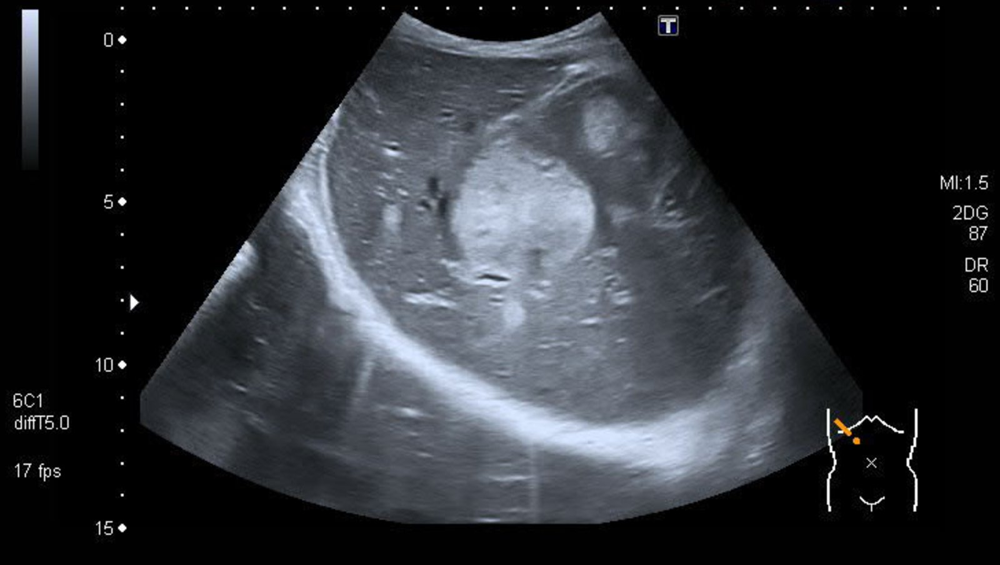

# Carcinoid syndrome

*Categories: Clinical knowledge > Internal medicine > Endocrinology > Neoplastic endocrine diseases > Carcinoid syndrome*

[Original Article Link](https://coursology-qbank.com/amboss/article/_h05gf)

---

## Summary

<u>Carcinoid</u> syndrome is a <u>paraneoplastic condition</u> caused by intermittent secretion of <u>serotonin</u> and other vasoactive substances (e.g., <u>kallikrein</u>, <u>histamine</u>) by <u>neuroendocrine neoplasms</u> (<u>NENs</u>). It is primarily associated with <u>metastatic</u> well-differentiated <u>NENs</u>, i.e., <u>neuroendocrine tumors</u> (<u>NETs</u>), in the <u>gastrointestinal tract</u>. Symptoms include episodic cutaneous flushing, <u>diarrhea</u>, abdominal <u>pain</u>, and <u>wheezing</u>. In advanced cases, manifestations can include <u>pellagra</u>, <u>mesenteric</u> <u>fibrosis</u>, and cardiac valvular <u>fibrosis</u> (particularly affecting the right <u>heart</u>). Elevated urinary <u>5-hydroxyindoleacetic acid</u> (<u>5-HIAA</u>) levels confirm the diagnosis. Imaging (e.g., CT, <u>MRI</u>, PET/CT) is used for locating tumors and staging. <u>Somatostatin analogues</u> (e.g., <u>octreotide</u>) are first-line treatments. <u>Carcinoid crisis</u> is a potentially life-threatening complication that is typically triggered by <u>general anesthesia</u> and/or perioperative manipulation of the <u>NEN</u> due to an efflux of vasoactive substances; prevention involves perioperative <u>somatostatin analogue</u> infusion.

---

## Pathophysiology

<u>Carcinoid</u> syndrome is a <u>paraneoplastic condition</u> caused by excess production, storage, and <u>systemic circulation</u> of multiple different <u>hormones</u> synthesized by certain metabolically active <u>NENs</u>. [[1]](https://coursology-qbank.com/amboss/article/dbWosP0)[[2]](https://coursology-qbank.com/amboss/article/-dWDs40)[[3]](https://coursology-qbank.com/amboss/article/6KdjhI0)

* <u>Serotonin</u> (most prominent) [[1]](https://coursology-qbank.com/amboss/article/dbWosP0)

* Release downstream of sites of <u>serotonin</u> metabolism (<u>liver</u> or <u>lungs</u>), e.g., due to:

* Intestinal <u>NENs</u> that have <u>metastasized</u> to the <u>liver</u> (most common)  [[4]](https://coursology-qbank.com/amboss/article/kIYm1q)

* Extraintestinal <u>NENs</u> (e.g., ovarian or <u>bronchial tumors</u>)

* Effects of <u>serotonin</u> excess

* ↑ Gut <u>peristalsis</u> and intestinal fluid secretion → <u>secretory diarrhea</u>

* ↑ <u>Fibroblast</u> growth and fibrogenesis → <u>carcinoid heart disease</u>, <u>retroperitoneal fibrosis</u>, and/or <u>mesenteric</u> <u>fibrosis</u>

* Depletion of <u>tryptophan</u> (precursor of <u>serotonin</u> and <u>niacin</u>) → ↓ protein synthesis, <u>hypoalbuminemia</u>, and/or <u>niacin deficiency</u> due to increased <u>serotonin</u> metabolism  [[2]](https://coursology-qbank.com/amboss/article/-dWDs40)

* ∼ 40 additional vasoactive substances (e.g., <u>histamine</u>, <u>prostaglandins</u>, tachykinins, <u>kallikrein</u>) → <u>vasodilation</u> → cutaneous flushing  [[1]](https://coursology-qbank.com/amboss/article/dbWosP0)

> [!NOTE]
> <u>Serotonin</u> is degraded via <u>first-pass metabolism</u> in the <u>liver</u> and by <u>monoamine oxidases</u> in the <u>lungs</u>.

---

## Clinical features

<u>Carcinoid</u> syndrome is caused by intermittent secretion of <u>serotonin</u> and other vasoactive substances by <u>NENs</u>. [[1]](https://coursology-qbank.com/amboss/article/dbWosP0)[[3]](https://coursology-qbank.com/amboss/article/6KdjhI0)

* Cutaneous flushing: pink or red discoloration, especially on the face, neck, and chest ;  [[1]](https://coursology-qbank.com/amboss/article/dbWosP0)

* Onset: sudden and often multiple episodes a day

* Typical duration: a few minutes

* Triggers include <u>alcohol</u>, physical exertion, and <u>tyramine</u>-containing foods (e.g., chocolate)

* <u>Diarrhea</u> (usually secretory)

* Abdominal <u>pain</u> (e.g., due to <u>mass effect</u> from the <u>tumor</u> or complications of <u>mesenteric</u> <u>fibrosis</u>)

* <u>Dyspnea</u>, <u>wheezing</u>

* <u>Diaphoresis</u>

* <u>Hypotension</u>

* Carcinoid heart disease: cardiac <u>fibrosis</u> due to chronic excess circulating <u>serotonin</u> [[5]](https://coursology-qbank.com/amboss/article/wKdhiI0)

* Endocardial <u>fibrosis</u>, especially affecting the right <u>heart</u>

* <u>Tricuspid insufficiency</u> and/or <u>pulmonary stenosis</u>

* <u>Features of right-sided heart failure</u>

> [!TIP]
> Consider <u>carcinoid</u> syndrome and workup for a <u>NEN</u> in patients presenting with <u>secretory diarrhea</u>, episodic flushing, <u>wheezing</u>, and right-sided cardiac valvular abnormalities.

Carcinoid syndrome

---

## Diagnosis

### Biochemical testing [[1]](https://coursology-qbank.com/amboss/article/dbWosP0)

The following studies can be used to diagnose <u>carcinoid</u> syndrome and/or monitor disease progression in consultation with a specialist (e.g., endocrinologist).

* ↑ 5-Hydroxyindoleacetic acid (<u>5-HIAA</u>) on <u>24-hour urine collection</u> (first-line study)  [[1]](https://coursology-qbank.com/amboss/article/dbWosP0)[[6]](https://coursology-qbank.com/amboss/article/9KdNiI0)

* ↑ <u>Fasting</u> plasma <u>5-HIAA</u> levels: alternative to urinary <u>5-HIAA</u> levels

* ↑ Serum <u>chromogranin A</u> levels: for monitoring disease progression

* <u>NT-proBNP</u>: to screen for <u>carcinoid heart disease</u> [[3]](https://coursology-qbank.com/amboss/article/6KdjhI0)

### Imaging [[1]](https://coursology-qbank.com/amboss/article/dbWosP0)[[7]](https://coursology-qbank.com/amboss/article/YeWnx40)

Imaging studies are used to locate primary and <u>metastatic</u> <u>NENs</u>.

* Abdominal imaging, e.g., CT, <u>MRI</u>, or <u>ultrasound</u>

* <u>Somatostatin</u> <u>receptor</u> PET/CT, e.g., using <u>Gallium-68 DOTATATE</u>

* <u>Chest x-ray</u>: if there is suspicion for a bronchial or <u>thymic</u> <u>tumor</u>

* <u>TTE</u>: to evaluate for <u>carcinoid heart disease</u>

* At diagnosis for patients with suggestive findings

* Annually for patients with <u>5-HIAA</u> levels > 5× <u>ULN</u> [[8]](https://coursology-qbank.com/amboss/article/Y6dnjI0)

Liver metastases from pancreatic neuroendocrine tumor

---

## Differential diagnoses

* <u>Angioedema</u>

* <u>Anaphylaxis</u>

* <u>Anxiety</u>

* <u>Hot flashes</u>

* <u>Aldehyde dehydrogenase 2 deficiency</u>

* <u>Laxative misuse</u>

* See also “<u>Differential diagnoses of diarrhea</u>.”

| Endocrine differential diagnoses of <u>carcinoid</u> syndrome |  |  |  |  |
| --- | --- | --- | --- | --- |
|  | Blood <u>glucose</u> | <u>Diarrhea</u> | Associated genetic syndromes | Other findings |
|  <u>Carcinoid</u> syndrome [[3]](https://coursology-qbank.com/amboss/article/6KdjhI0)[[9]](https://coursology-qbank.com/amboss/article/1Id2br0)  |  * Normal   |  * Yes (watery)   |   * <u>MEN 1</u>  * <u>NF-1</u>    |   * Cutaneous flushing  * <u>Wheezing</u>  * <u>Carcinoid heart disease</u>  * <u>Pellagra</u>    |
|  <u>Zollinger-Ellison syndrome</u> [[10]](https://coursology-qbank.com/amboss/article/PYWW6P0)  |  * Normal   |  * Yes (usually <u>steatorrhea</u>)   |  * <u>MEN 1</u>   |   * <u>GERD</u>  * <u>PUD</u>    |
|  <u>VIPoma</u> [[11]](https://coursology-qbank.com/amboss/article/WIdPbr0)  |  * ↑   |  * Yes (<u>WDHA syndrome</u>)   |  * <u>MEN 1</u>   |   * <u>Symptoms of hypokalemia</u>  * <u>Dehydration</u>  * <u>Achlorhydria</u>    |
|  <u>Pheochromocytoma</u> [[4]](https://coursology-qbank.com/amboss/article/kIYm1q)[[9]](https://coursology-qbank.com/amboss/article/1Id2br0)  |  * Slightly ↑   |  * No   |   * <u>MEN 2A</u> and <u>MEN 2B</u>  * <u>NF-1</u>  * <u>VHL</u>    |   * Episodic <u>hypertension</u>  * <u>Headache</u>  * <u>Diaphoresis</u>  * <u>Heart</u> <u>palpitations</u>, <u>tachycardia</u>    |
|  <u>Medullary thyroid carcinoma</u> [[12]](https://coursology-qbank.com/amboss/article/u0Xp39)  |  * Normal   |  * Sometimes (more common in <u>metastatic</u> disease)   |  * <u>MEN 2A</u> and <u>MEN 2B</u>   |   * Cutaneous flushing  * <u>Thyroid nodule</u>    |
|  <u>Mastocytosis</u> [[13]](https://coursology-qbank.com/amboss/article/ENd81q0)  |  * Normal   |  * Yes (due to ↑ <u>histamine</u>)   |  * None   |   * Cutaneous flushing  * Abdominal <u>pain</u>  * <u>Gastric ulcers</u>    |
|  <u>Hyperthyroidism</u> [[4]](https://coursology-qbank.com/amboss/article/kIYm1q)  |  * ↑   |  * Sometimes (due to intestinal hypermotility)   |  * None   |   * Heat intolerance  * Weight loss  * <u>Tremor</u>  * <u>Goiter</u>    |

The differential diagnoses listed here are not exhaustive.

---

## Treatment

Treatment of <u>carcinoid</u> syndrome should be guided by appropriate specialists (e.g., oncology, gastroenterology) and includes both symptomatic management and treatment of the causative <u>neuroendocrine neoplasm</u>.

### Pharmacological treatment [[1]](https://coursology-qbank.com/amboss/article/dbWosP0)[[7]](https://coursology-qbank.com/amboss/article/YeWnx40)

* <u>Somatostatin analogues</u> (e.g., <u>octreotide</u>  DOSAGE): first-line treatment for symptom control

* Telotristat DOSAGE: a <u>tryptophan hydroxylase</u> inhibitor used as an adjunct to treat <u>carcinoid</u> syndrome <u>diarrhea</u> that does not respond to <u>somatostatin analogues</u> alone

* <u>Antidiarrheal agents</u> (e.g., <u>loperamide</u>) and/or <u>anticholinergics</u> (e.g., <u>diphenoxylate/atropine</u>): Consider depending on the cause of <u>diarrhea</u>.

* <u>Interferon alpha</u>: for symptoms refractory to <u>somatostatin analogues</u>

* <u>Antineoplastic agents</u>: may be effective for high-grade <u>NENs</u>

* Radiolabeled <u>somatostatin analogues</u>: targeted <u>radiotherapy</u> for selected patients

### <u>Surgery</u> and interventional treatment [[1]](https://coursology-qbank.com/amboss/article/dbWosP0)[[7]](https://coursology-qbank.com/amboss/article/YeWnx40)

* <u>Cytoreductive surgery</u>

* Hepatic resection

* <u>Embolization therapy</u> for <u>liver</u> tumors

* <u>Ablative therapy</u> (e.g., <u>radiofrequency ablation</u>)

---