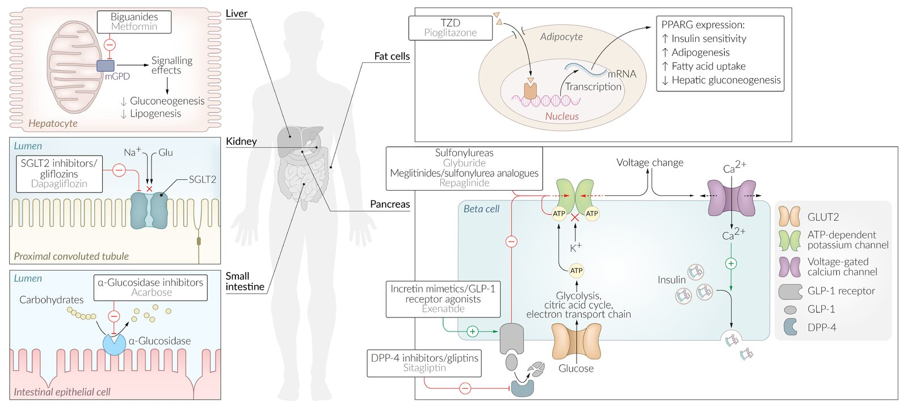
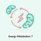

# Diabetes medications

*Categories: Clinical knowledge > Internal medicine > Endocrinology > Relevant pharmacology > Diabetes medications*

[Original Article Link](https://coursology-qbank.com/amboss/article/7m04Sg)

---

## Summary

The <u>diabetes</u> medications described in this article are pharmacological agents that have been approved for <u>hyperglycemic</u> treatment in type 2 <u>diabetes mellitus</u> (DM). If lifestyle modifications (weight loss, dietary modification, and exercise) do not sufficiently reduce <u>HbA1c</u> levels (target level: ∼ 7%), pharmacological treatment with <u>diabetes</u> medications should be initiated. These drugs can be classified according to their mechanism of action as insulinotropic or noninsulinotropic. They are available as monotherapy or combination therapies, with the latter involving two or more <u>diabetes</u> medications and/or <u>insulin</u>. The exact treatment algorithms are reviewed in the treatment section of <u>diabetes mellitus</u>. The drug of choice for all patients with <u>type 2 diabetes</u> is <u>metformin</u>. This drug has beneficial effects on <u>glucose metabolism</u> and promotes weight loss or at least weight stabilization. In addition, numerous studies have demonstrated that <u>metformin</u> can reduce mortality and the risk of complications. If <u>metformin</u> is contraindicated, not tolerated, or does not sufficiently control blood <u>glucose</u> levels, another class of <u>diabetes</u> medication may be administered. In patients with moderate or severe <u>renal failure</u> or other significant comorbidities, most <u>diabetes</u> medications are not recommended or should be used with caution. Oral <u>diabetes</u> medications are not recommended during <u>pregnancy</u> or <u>breastfeeding</u>.

<u>Insulin therapy</u> is described in a separate article.

---

## Overview

### Classification

* Insulinotropic agents 

* Stimulate the secretion of <u>insulin</u> from <u>pancreatic</u> <u>β cells</u>

* <u>Glucose</u>-dependent (<u>GLP-1 agonists</u>, <u>DPP-4 inhibitors</u>): <u>Insulin</u> secretion is stimulated by elevated blood <u>glucose</u> levels (postprandially).

* <u>Glucose</u>-independent (<u>sulfonylurea</u>, <u>meglitinides</u>): <u>Insulin</u> is secreted regardless of the blood <u>glucose</u> level, even if blood <u>glucose</u> levels are low → risk of <u>hypoglycemia</u>

* Depend on residual <u>β-cell</u> function

* Noninsulinotropic agents

* Effective in patients with nonfunctional <u>β cells</u>

* Not dependent on residual <u>insulin</u> production

* Agents: <u>biguanides</u> (<u>metformin</u>), <u>SGLT-2 inhibitors</u>, <u>thiazolidinediones</u>, <u>α-glucosidase inhibitors</u>, <u>amylin analogues</u>

### Overview

See “<u>Antihyperglycemic treatment of diabetes mellitus</u>” for details on the treatment of <u>type 2 DM</u> with the <u>diabetes</u> medications listed below.

| Overview of diabetes medications |  |  |  |  |  |
| --- | --- | --- | --- | --- | --- |
| Class | Agents |  Mechanism of action   | Side effects | Contraindications | Interactions |
| Insulinotropic |  |  |  |  |  |
| <u>Sulfonylureas</u> |   * First generation  * <u>Chlorpropamide</u>  * Tolbutamide  * Second generation  * <u>Glyburide</u>  * <u>Glimepiride</u>  * <u>Glipizide</u>    |  * Increase <u>insulin</u> secretion from <u>pancreatic</u> <u>β cells</u>   |   * Risk of <u>hypoglycemia</u> (second generation)  * Weight gain  * <u>Disulfiram-like reaction</u> (first generation)  * Hematological changes: <u>agranulocytosis</u>, <u>hemolysis</u>    |   * Severe cardiovascular comorbidity  * <u>Obesity</u>  * Severe renal or <u>liver</u> failure  * <u>Sulfonamide</u> <u>allergy</u> (particularly long-acting substances)    |  * <u>Biguanides</u>: Concomitant use may be associated with an increase in cardiovascular mortality.   |
|  <u>Meglitinides</u>  |   * Nateglinide  * Repaglinide    |   * Risk of <u>hypoglycemia</u>  * Weight gain    |  * Severe <u>liver</u> failure   |  * <u>Sulfonylureas</u>: ↑ risk of <u>hypoglycemia</u>   |  |
| <u>Dipeptidyl peptidase-4 (DPP-4) inhibitors</u> |   * Saxagliptin  * Sitagliptin  * <u>Linagliptin</u>    |  * Inhibit <u>GLP-1</u> degradation  → ↑ <u>glucose</u>-dependent <u>insulin</u> secretion   |   * Gastrointestinal symptoms  * <u>Pancreatitis</u>  * <u>Nasopharyngitis</u>, <u>upper respiratory tract infection</u>  * <u>Headache</u>, <u>dizziness</u>  * <u>Arthralgia</u>  * <u>Edema</u>    |   * <u>Liver</u> failure  * Moderate to severe <u>renal failure</u>    |  * <u>CYP3A4</u>/5 inhibitors: ↑ concentration of <u>saxagliptin</u> [[1]](https://coursology-qbank.com/amboss/article/AWcRLY0)   |
|  <u>Glucagon-like peptide-1</u> (<u>GLP-1</u>) <u>agonists</u> (<u>incretin mimetic drugs</u>) |   * <u>Exenatide</u>  * <u>Liraglutide</u>  * <u>Albiglutide</u>  * <u>Semaglutide</u>    |  * Stimulate the <u>GLP-1</u> <u>receptor</u> directly   |   * ↑ Risk of <u>pancreatitis</u> and possibly <u>pancreatic cancer</u>  * <u>Nausea</u>    |  * Preexisting, symptomatic <u>gastrointestinal motility disorders</u>   |  * <u>Warfarin</u>: ↑ <u>INR</u> [[2]](https://coursology-qbank.com/amboss/article/_Wc5LY0)   |
| Noninsulinotropic |  |  |  |  |  |
| <u>Biguanides</u> |  * <u>Metformin</u>   |  * Enhances the effect of <u>insulin</u>   |   * <u>Lactic acidosis</u> (possible triggers: <u>dehydration</u>, infection, renal impairment)  * Weight loss  * Gastrointestinal complaints are common (e.g., <u>diarrhea</u>, abdominal cramps)  * ↓ <u>Vitamin B12</u> absorption    |   * <u>Chronic kidney disease</u>  * <u>Metformin</u> must be paused before administration of iodinated contrast medium and major <u>surgery</u>.    |  * <u>Sulfonylureas</u>: Concomitant use may be associated with an increase in cardiovascular mortality.   |
| <u>Sodium-glucose cotransporter 2</u> (<u>SGLT-2</u>) inhibitors |   * Canagliflozin  * Dapagliflozin  * Empagliflozin    |  * Increase <u>glucose</u> excretion with urine through the inhibition of <u>SGLT-2</u> in the <u>kidney</u>   |   * Genital <u>yeast</u> infections and <u>UTIs</u>  * <u>Glucosuria</u>  * <u>Polyuria</u> and <u>dehydration</u>  * <u>Diabetic ketoacidosis</u>  * Weight loss  * Potentially <u>carcinogenic</u> effects are being investigated (<u>breast cancer</u>, <u>bladder cancer</u>)    |   * <u>Recurrent urinary tract infections</u>  * <u>Chronic kidney disease</u>    |  * No severe <u>drug interactions</u> [[3]](https://coursology-qbank.com/amboss/article/zWcrLY0)   |
| <u>Alpha-glucosidase inhibitors</u> |  * <u>Acarbose</u>   |  * Decrease intestinal <u>glucose absorption</u>   |  * Gastrointestinal symptoms (flatulence, <u>diarrhea</u>, feeling of satiety)   |   * Severe <u>renal failure</u>  * Any preexisting intestinal conditions (e.g., <u>inflammatory bowel disease</u>)    |  * Other <u>diabetes</u> medications: <u>hypoglycemia</u> [[4]](https://coursology-qbank.com/amboss/article/-WcDLY0)   |
| <u>Thiazolidinediones</u> |   * Pioglitazone  * Rosiglitazone    |   * Reduce <u>insulin resistance</u> through the stimulation of <u>peroxisome proliferator-activated receptors</u> (PPARs)  * Increase <u>transcription</u> of <u>adipokines</u>    |   * <u>Edema</u>  * Cardiac failure  * Weight gain  * ↑ Risk of bone <u>fractures</u> (<u>osteoporosis</u>)  * ↑ <u>LDL</u>    |   * <u>Congestive heart failure</u>  * <u>Liver</u> failure    |  * CYP2C8 inhibitors (e.g., <u>gemfibrozil</u>): ↑ concentration of <u>glitazones</u> [[5]](https://coursology-qbank.com/amboss/article/ZdcZoY0)   |
| Amylin analogs |  * Pramlintide   |   * Decrease <u>glucagon</u> release  * Slow gastric emptying  * Increase feeling of satiety    |   * Risk of <u>hypoglycemia</u>  * <u>Nausea</u>    |  * <u>Gastroparesis</u>   |  * Delayed effect of concomitantly administered drugs due slowed gastric emptying (e.g, <u>ampicillin</u>, <u>acetaminophen</u>) [[6]](https://coursology-qbank.com/amboss/article/0dceoY0)   |

> [!TIP]
> Almost all <u>diabetes</u> medications listed above are oral drugs, except for <u>amylin analogues</u> and <u>GLP-1 analogues</u>, which are injectable.

> [!NOTE]
> To remember the important oral <u>diabetes</u> medications, think: “My Pancreas Needs Fitting Treatment!” - Metformin, -gliPs, -gliNs, -gliFs, -gliTs

Mechanism of action: oral diabetes medications

Diabetes medications: Pros and Cons

Energy Metabolism - Part 7: The Electron Transport Chain

Energy Metabolism - Part 8: Anaerobic vs. Aerobic Metabolism

### Common contraindications of <u>diabetes</u> medications

* <u>Type 1 diabetes mellitus</u>: Patients require <u>insulin therapy</u> (see principles of <u>insulin therapy</u>).

* <u>Pregnancy</u> and <u>breastfeeding</u> (see also <u>gestational diabetes</u>)

* All <u>diabetes</u> medications are contraindicated.

* <u>Diabetes</u> medications should be substituted with human <u>insulin</u> as early as possible (ideally prior to the <u>pregnancy</u>).

* <u>Renal failure</u>

* <u>Chronic kidney disease</u> is by far the most relevant contraindication; it significantly limits the possibilities of <u>diabetes</u> medication regimens.

* <u>Diabetes</u> medications that may be administered if <u>GFR</u> < 30 mL/min include <u>DPP-4 inhibitors</u>, <u>incretin mimetic drugs</u>, <u>meglitinides</u>, and <u>thiazolidinediones</u>.

* <u>Morbidity</u> and <u>surgery</u> 

* Major <u>surgery</u> performed under <u>general anesthesia</u>

* Acute conditions requiring hospitalization (infections, organ failure)

* Elective procedures associated with an increased risk of <u>hypoglycemia</u> (periods of <u>fasting</u>, irregular food intake)

> [!TIP]
> <u>Sulfonylureas</u> are associated with the highest risk of <u>hypoglycemia</u>. All other substances do not carry a significant risk of <u>hypoglycemia</u> when used as monotherapy. Combination therapy, particularly with <u>sulfonylurea</u>, significantly increases the risk of <u>hypoglycemia</u>.

---

## Biguanides (metformin)

### Active agent

* Metformin

### Clinical profile

* Mechanism of action: enhances the effect of <u>insulin</u>

* Reduction in <u>insulin resistance</u> via modification of <u>glucose</u> metabolic pathways

* Inhibits mitochondrial glycerophosphate dehydrogenase (<u>mGPD</u>) → ↓ hepatic <u>gluconeogenesis</u> and intestinal <u>glucose absorption</u> [[7]](https://coursology-qbank.com/amboss/article/SKYyfJ)

* Increases peripheral <u>insulin</u> <u>sensitivity</u> → ↑ peripheral <u>glucose</u> uptake and <u>glycolysis</u>

* Lowers <u>postprandial</u> and <u>fasting blood glucose</u> levels

* Reduces <u>LDL</u>, increases <u>HDL</u>

* Indications: drug of choice in all patients with <u>type 2 diabetes</u>

* Clinical characteristics [[8]](https://coursology-qbank.com/amboss/article/hKYcTJ)

* Glycemic <u>efficacy</u>: lowers <u>HbA1c</u> by 1.2–2% over 3 months

* Weight loss (often desired) or weight stabilization

* No risk of <u>hypoglycemia</u>

* Beneficial effect on <u>dyslipidemia</u>

* Reduces the risk of macroangiopathic complications in patients with <u>diabetes</u>

* Must be paused prior to <u>surgery</u>

* Cost-effective

* Important side effects

* Metformin-associated lactic acidosis 

* <u>Incidence</u>: ∼ 8 cases/100,000 patient years

* High-risk groups

* Elderly individuals

* Patients with <u>renal insufficiency</u> or <u>CHF</u>

* Clinical features: frequently nonspecific

* Gastrointestinal symptoms: <u>nausea</u>, <u>vomiting</u>, <u>diarrhea</u>, abdominal <u>pain</u>, flatulence

* Severe symptoms: muscle cramps, <u>hyperventilation</u>, <u>apathy</u>, <u>disorientation</u>, <u>coma</u>

* Diagnostics

* ↑ Serum <u>lactate</u>

* <u>Arterial blood gas</u>: <u>metabolic acidosis</u> and <u>anion gap</u>

* Treatment: Discontinue <u>metformin</u> and treat <u>acidosis</u>.

* <u>Vitamin B12 deficiency</u>

* Metallic <u>taste</u> in the mouth (<u>dysgeusia</u>)

* Contraindications

* <u>Renal failure</u> (if <u>creatinine clearance</u> < 30 mL/min)

* Intravenous iodinated contrast medium

* <u>Heart failure</u> (<u>NYHA</u> III and IV), <u>respiratory failure</u>, <u>shock</u>, <u>sepsis</u>

* <u>Alcoholism</u>

* Severe <u>liver</u> failure

* <u>Chronic pancreatitis</u>, <u>starvation</u> <u>ketosis</u>, ketoacidosis, <u>sepsis</u>

* Important interactions: <u>sulfonylureas</u>

> [!TIP]
> Because of its favorable risk-benefit <u>ratio</u>, <u>metformin</u> is the drug of choice for monotherapy and combination therapy in all stages of <u>type 2 DM</u>.

---

## Thiazolidinediones (glitazones, insulin sensitizers)

### Active agents

* Pioglitazone

* Rosiglitazone

### Clinical profile

* Mechanism of action: : activation of the <u>transcription factor</u> PPARγ (<u>peroxisome proliferator-activated receptor</u> of gamma type in the <u>nucleus</u>) → ↑ <u>transcription</u> of <u>genes</u> involved in <u>glucose</u> and lipid metabolism → ↑ levels of <u>adipokines</u> such as adiponectin and <u>insulin sensitivity</u> → ↑ storage of <u>fatty acids</u> in <u>adipocytes</u>, ↓ products of lipid metabolism (e.g., free <u>fatty acids</u>) → ↓ free <u>fatty acids</u> in circulation → ↑ <u>glucose</u> utilization and ↓ hepatic <u>glucose</u> production

* Indications: may be considered as monotherapy in patients with severe <u>renal failure</u> and/or contraindications for <u>insulin therapy</u>

* Clinical characteristics [[9]](https://coursology-qbank.com/amboss/article/n_X7K00)[[10]](https://coursology-qbank.com/amboss/article/L_XwK00)

* Glycemic <u>efficacy</u>: lowers <u>HbA1c</u> by 1% in 3 months

* Favorable effect on lipid metabolism: ↓ <u>triglyceride</u>, ↓ <u>LDL</u>, ↑ <u>HDL</u>

* No risk of <u>hypoglycemia</u>

* Onset of action is delayed by several weeks.

* Important side effects [[11]](https://coursology-qbank.com/amboss/article/XC09qR)

* ↑ Risk of <u>heart failure</u>

* ↑ Risk of bone <u>fractures</u> (<u>osteoporosis</u>)

* Fluid retention and <u>edema</u>

* Weight gain

* <u>Rosiglitazone</u>: ↑ risk of cardiovascular complications like cardiac <u>infarction</u> or <u>death</u>

* Contraindications

* <u>Congestive heart failure</u> (<u>NYHA</u> III or IV)

* <u>Liver</u> failure

* <u>Pioglitazone</u>: history of <u>bladder cancer</u> or active <u>bladder cancer</u>; <u>macrohematuria</u> of unknown origin

---

## Sulfonylureas

### Active agents

* First generation

* Chlorpropamide

* Tolbutamide

* Second generation

* Glyburide (long-acting agent)

* Glipizide (short-acting agent)

* Glimepiride

### Clinical profile [[12]](https://coursology-qbank.com/amboss/article/gKYFfJ)

* Mechanism of action

* Block <u>ATP</u>-sensitive <u>potassium</u> channels of the <u>pancreatic</u> <u>β cells</u> → <u>depolarization</u> of <u>the cell</u> membrane → <u>calcium</u> influx → <u>insulin</u> secretion

* Extrapancreatic effect: ↓ hepatic <u>gluconeogenesis</u>, ↑ peripheral <u>insulin sensitivity</u>

* Indications

* Patients who are not <u>overweight</u>, do not consume <u>alcohol</u>, and adhere to a consistent dietary routine

* Generally not frequently used

* Clinical characteristics

* Glycemic <u>efficacy</u>: lowers <u>HbA1c</u> by 1.2% over 3 months

* Low cost

* Important side effects

* Life-threatening <u>hypoglycemia</u>; increased risk under the following circumstances:

* Simultaneous intake of <u>CYP2C9</u> inhibitors (e.g., <u>amiodarone</u>, <u>trimethoprim</u>, <u>fluconazole</u>) [[13]](https://coursology-qbank.com/amboss/article/TKY6fJ)

* Patients with <u>renal failure</u>

* Decreased <u>carbohydrate</u> intake (diets or periods of <u>fasting</u>)

* Elevated <u>glucose</u> utilization (e.g., unaccustomed physical activity)

* <u>Sulfonylurea overdose</u>

* <u>Alcohol</u> intolerance (first-generation agents): <u>disulfiram-like reaction</u>

* Weight gain

* Hematological changes: <u>granulocytopenia</u>, <u>hemolytic anemia</u>

* Allergic <u>skin</u> reactions

* <u>Sulfonylureas</u> are associated with more cardiovascular (<u>macrovascular</u>) complications than <u>metformin</u>.

* <u>β-cell</u> <u>apoptosis</u>: Studies suggest that <u>sulfonylureas</u> induce <u>β-cell</u> <u>apoptosis</u> in human <u>islet cells</u>. [[14]](https://coursology-qbank.com/amboss/article/3oXSb_)

* Contraindications

* <u>Beta blockers</u> (can mask <u>hypoglycemic</u> symptoms while lowering serum <u>glucose</u> levels)

* Severe cardiovascular comorbidity

* <u>Obesity</u>

* <u>Sulfonamide</u> <u>allergy</u> (particularly long-acting substances)

* Severe <u>liver</u> and <u>kidney failure</u>

> [!WARNING]
> <u>Beta-blockers</u> may mask the warning <u>signs of hypoglycemia</u> (e.g., <u>tachycardia</u>) and decrease serum <u>glucose</u> levels even further (see <u>hypoglycemia</u>). Since <u>sulfonylureas</u> also increase the risk of <u>hypoglycemia</u>, the combination of these two substances should be avoided!

---

## Meglitinides (sulfonylurea analogue)

### Active agents

* Repaglinide

* Nateglinide

### Clinical profile

* Mechanism of action (similar mechanism of action to that of <u>sulfonylureas</u>) 

* Blockage of <u>ATP</u>-sensitive <u>potassium</u> channels of the <u>pancreatic</u> <u>beta cells</u> → <u>depolarization</u> of <u>the cell</u> membrane → <u>calcium</u> influx → <u>insulin</u> secretion

* <u>Meglitinides</u> should be taken shortly before meals.

* Indications: : particularly suitable for patients with <u>postprandial</u> peaks in blood <u>glucose</u> levels, but overall rarely prescribed

* Clinical characteristics

* Glycemic <u>efficacy</u>: lowers <u>HbA1c</u> by 0.75% over 3 months

* Tolerated well by patients with <u>chronic kidney disease</u>

* More expensive than <u>sulfonylureas</u>

* Important side effects

* Life-threatening <u>hypoglycemia</u>, especially in patients with <u>renal failure</u> (less of a risk than with <u>sulfonylureas</u>)

* Weight gain

* <u>Hepatotoxicity</u> (rare)

* Contraindications: severe <u>liver</u> failure

* Interactions: <u>sulfonylureas</u>

---

## Glucagon-like peptide-1 receptor agonists (incretin mimetics)

### Active agents

* Exenatide

* Liraglutide

* Albiglutide

* Dulaglutide

* Semaglutide

* Lixisenatide

### Clinical profile [[15]](https://coursology-qbank.com/amboss/article/B_0zqi)[[16]](https://coursology-qbank.com/amboss/article/A_0RIi)[[17]](https://coursology-qbank.com/amboss/article/z_0rIi)

* Mechanism of action 

* Incretin effect: food intake → activation of <u>enteroendocrine cells</u> in the gastrointestinal tract → release of GLP-1 → <u>GLP-1</u> degradation via the enzyme <u>DPP-4</u> → end of the <u>GLP-1</u> effect

* <u>Incretin mimetic drugs</u> bind to the <u>GLP-1</u> <u>receptors</u> and are resistant to degradation by <u>DPP-4</u> enzyme → ↑ <u>insulin</u> secretion, ↓ <u>glucagon</u> secretion, slow gastric emptying (↑ feeling of satiety, ↓ weight)

* Clinical characteristics

* Glycemic <u>efficacy</u>: lowers <u>HbA1c</u> by 0.5–1.5 % over 3 months

* Subcutaneous injection (<u>semaglutide</u> also available as oral drug)

* Weight loss (may be wanted)

* No risk of <u>hypoglycemia</u>

* Side effects

* Gastrointestinal symptoms

* <u>Nausea</u>, <u>vomiting</u>

* Strong feeling of satiety (often desired)

* <u>Pancreatitis</u>;  and potentially <u>pancreatic cancer</u>  [[18]](https://coursology-qbank.com/amboss/article/y_0dIi)

* Potential risk of <u>medullary thyroid cancer</u> (MTC): further investigation required

* Contraindications

* Preexisting symptomatic <u>gastrointestinal motility disorders</u>

* <u>Chronic pancreatitis</u> or a <u>family history</u> of <u>pancreatic</u> tumors

* Personal or <u>family history</u> of MTC or <u>multiple endocrine neoplasia</u> syndrome type 2 (<u>MEN 2</u>)

---

## Dipeptidyl peptidase-4 inhibitors (gliptins)

### Active agents

* Sitagliptin

* Saxagliptin

* Linagliptin

### Clinical profile [[15]](https://coursology-qbank.com/amboss/article/B_0zqi)[[19]](https://coursology-qbank.com/amboss/article/2lYTw6)[[20]](https://coursology-qbank.com/amboss/article/flYkw6)

* Mechanism of action: indirectly increase the <u>endogenous</u> <u>incretin</u> effect by inhibiting the DPP-4 that breaks down <u>GLP-1</u> → ↑ <u>insulin</u> secretion, ↓ <u>glucagon</u> secretion, <u>delayed gastric emptying</u>

* Indications: See “Antihyperglycemic therapy algorithm for <u>type 2 diabetes</u>.”

* Clinical characteristics

* Glycemic <u>efficacy</u>: lowers <u>HbA1c</u> by 0.5–0.75% over 3 months

* No risk of <u>hypoglycemia</u> unless <u>insulin</u> and/or insulinotropic drugs are used simultaneously because <u>insulin</u> release is <u>glucose</u>-dependent

* Usually no weight changes

* Important side effects

* Gastrointestinal symptoms: <u>diarrhea</u>, <u>constipation</u> (milder than in <u>GLP-1 agonist</u> exposure)

* <u>Arthralgia</u>

* ↑ Feeling of satiety (often favorable) due to <u>delayed gastric emptying</u>

* <u>Nasopharyngitis</u> and <u>upper respiratory tract infection</u>

* Urinary infections (mild)

* ↑ Risk of <u>pancreatitis</u>

* Worsening renal function, <u>acute renal failure</u>

* <u>Headaches</u>, <u>dizziness</u>

* Contraindications

* <u>Liver</u> failure

* <u>Renal failure</u>

* Hypersensitivity

---

## Sodium-glucose cotransporter 2 inhibitors (gliflozins)

### Active agents

* Dapagliflozin

* Empagliflozin

* Canagliflozin

### Clinical profile [[21]](https://coursology-qbank.com/amboss/article/Q7Yulq)[[22]](https://coursology-qbank.com/amboss/article/m7YVmq)

* Mechanism of action: reversible inhibition of <u>SGLT-2</u> in the <u>proximal</u> tubule of the <u>kidney</u> → ↓ <u>glucose</u> reabsorption in the <u>proximal convoluted tubule</u> of the <u>kidney</u> → <u>glycosuria</u> and <u>polyuria</u>

* Indications: especially in young patients with treatment-compliant <u>type 2 DM</u> without significant <u>renal failure</u>

* Clinical characteristics

* Glycemic <u>efficacy</u>: lowers <u>HbA1c</u> by 0.6% over 3 months

* Promotes weight loss

* ↓ Blood pressure

* ↓ Risk of cardiovascular mortality in patients with <u>type 2 DM</u> and cardiovascular disease

* Important side effects

* <u>Urinary tract infections</u>, genital infections (<u>vulvovaginal candidiasis</u>, <u>balanitis</u>) due to <u>glucosuria</u>

* <u>Dehydration</u> → weight loss, <u>orthostatic hypotension</u>

* Severe <u>diabetic ketoacidosis</u>

* ↑ Risk of lower limb <u>amputation</u>: Studies suggest a small increase in <u>amputation</u> rates under <u>canagliflozin</u> treatment. [[23]](https://coursology-qbank.com/amboss/article/M_XMK00)

* Studies indicate a <u>carcinogenic</u> effect (<u>breast cancer</u>, <u>bladder cancer</u>)

* Contraindications

* <u>Chronic kidney disease</u>: If <u>GFR</u> decreases, <u>drug efficacy</u> decreases and adverse effects increase.

* <u>Recurrent urinary tract infections</u> (e.g., in patients with anatomical or functional anomalies of the <u>urinary tract</u>)

---

## Alpha-glucosidase inhibitors

### Active agents

* Acarbose

* Miglitol

### Clinical profile

* Mechanism of action

* Inhibit alpha-glucosidase (a brush border enzyme expressed by intestinal <u>epithelial</u> cells) → delayed and ↓ intestinal <u>glucose absorption</u> and ↓ <u>carbohydrate</u> breakdown, resulting in ↓ <u>hyperglycemia</u> after food ingestion

* Particularly effective in controlling <u>postprandial</u> blood <u>glucose</u> levels

* The undigested <u>carbohydrates</u> reach the <u>colon</u>, where they are degraded by intestinal bacteria, resulting in the production of intestinal gas.

* Clinical characteristics

* Glycemic <u>efficacy</u>: lowers <u>HbA1c</u> by 0.8% over 3 months

* No risk of <u>hypoglycemia</u>

* Important side effects: gastrointestinal symptoms (flatulence, <u>bloating</u>, abdominal discomfort, <u>diarrhea</u>)

* Contraindications

* Severe <u>renal failure</u>

* <u>Inflammatory bowel disease</u>

* Conditions associated with <u>malabsorption</u>

---