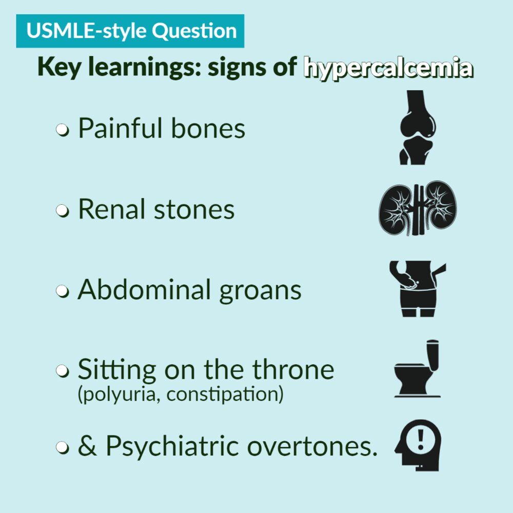
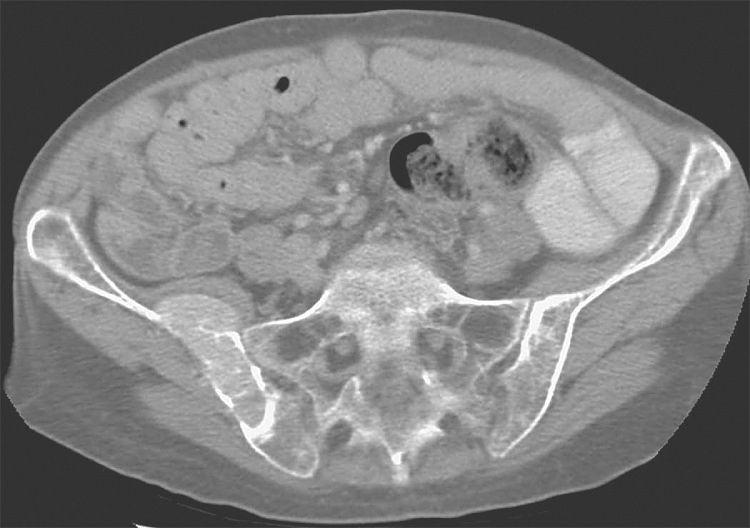
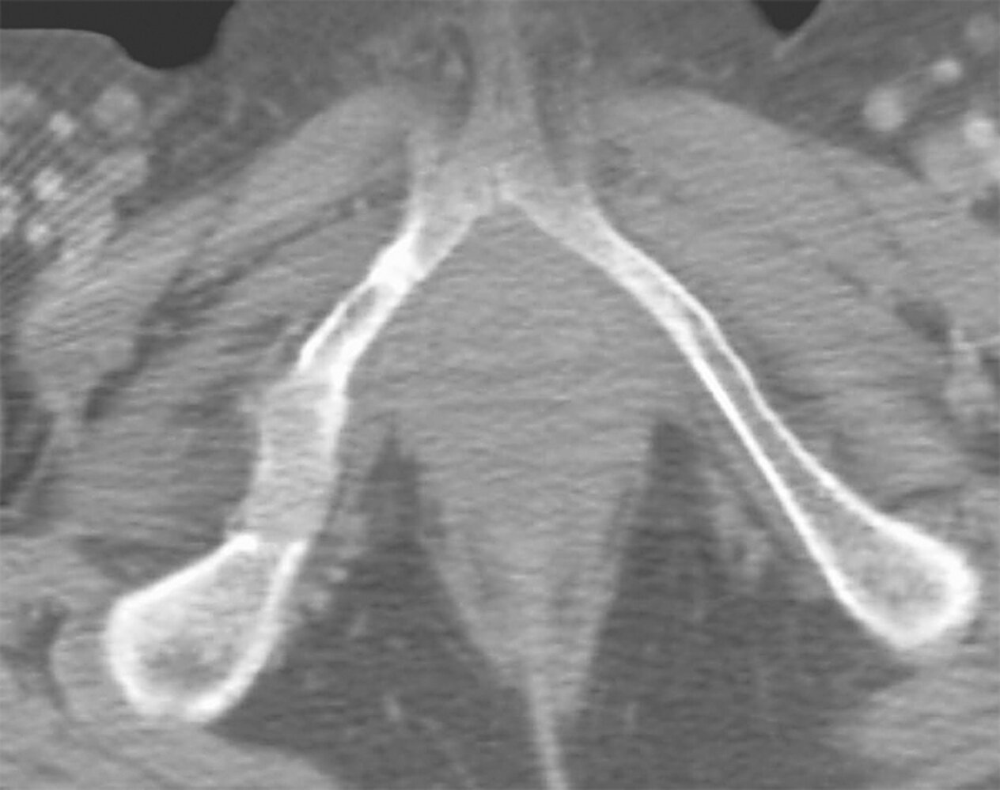

# Hyperparathyroidism

*Categories: Clinical knowledge > Internal medicine > Endocrinology > Thyroid and parathyroid gland disorders > Hyperparathyroidism*

[Original Article Link](https://coursology-qbank.com/amboss/article/gg0Fu2)

---

## Summary

Hyperparathyroidism (HPT) is characterized by abnormally high <u>parathyroid hormone</u> (<u>PTH</u>) levels in the blood due to <u>parathyroid gland</u> overactivity. HPT is further classified based on the underlying cause: primary HPT (<u>pHPT</u>), secondary HPT (<u>sHPT</u>), or tertiary HPT (<u>tHPT</u>). <u>pHPT</u> is characterized by elevated <u>PTH</u> and <u>calcium</u> levels and is usually caused by <u>parathyroid adenomas</u> or <u>hyperplasia</u>, or, in rare cases, parathyroid <u>carcinomas</u>. Although <u>pHPT</u> is often asymptomatic, symptoms such as bone <u>pain</u>, <u>gastric ulcers</u>, and <u>kidney stones</u> may be present in severe or untreated cases. <u>sHPT</u> is characterized by high <u>PTH</u> and low <u>calcium</u> levels and may be caused by <u>chronic kidney disease</u> (<u>CKD</u>), <u>vitamin D deficiency</u>, insufficient <u>calcium</u> intake, or <u>malabsorption</u>. <u>sHPT</u> is also called reactive HPT, as the increase in <u>PTH</u> production is a physiological response to <u>hypocalcemia</u> rather than an abnormality of the <u>parathyroid glands</u>. If <u>sHPT</u> and elevated serum <u>PTH</u> levels persist, <u>tHPT</u> may develop, resulting in a shift from low to high serum <u>calcium</u> levels. Diagnostics and classification involve evaluating <u>calcium</u>, <u>PTH</u>, and <u>phosphate</u> levels, and, in the case of <u>sHPT</u>, identifying the underlying cause (e.g., <u>CKD</u>). <u>Surgery</u> is the primary treatment option for most patients with <u>pHPT</u> or <u>tHPT</u>. Patients who do not undergo <u>surgery</u> can be managed with either <u>calcimimetics</u> or, if <u>osteoporosis</u> is present, <u>bisphosphonates</u>. In <u>sHPT</u>, management focuses on treating the underlying cause.

---

## Overview

All forms of HPT are characterized by elevated <u>PTH</u> levels (or inappropriately normal levels ). See also “<u>Calcium homeostasis</u>.”

|  Overview of hyperparathyroidism [[1]](https://coursology-qbank.com/amboss/article/kIYm1q)[[2]](https://coursology-qbank.com/amboss/article/H81KLi0)[[3]](https://coursology-qbank.com/amboss/article/Ov1IZQ0)  |  |  |  |  |
| --- | --- | --- | --- | --- |
|  |  | Primary hyperparathyroidism (<u>pHPT</u>) | Secondary hyperparathyroidism (<u>sHPT</u>) | Tertiary hyperparathyroidism (<u>tHPT</u>) |
| Definition |  |  * <u>Hypercalcemia</u> due to abnormally active <u>parathyroid glands</u>   |  * <u>Hypocalcemia</u> and/or <u>hyperphosphatemia</u> cause reactive <u>hyperplasia</u> of <u>parathyroid glands</u> with overproduction of <u>PTH</u>.   |  * <u>Hypercalcemia</u> caused by autonomous and refractory secretion of <u>PTH</u> secondary to untreated <u>sHPT</u>   |
| Causes |  |   * <u>Adenoma</u> (most common)  * <u>Hyperplasia</u>  * <u>Carcinoma</u>    |   * <u>CKD</u>  * <u>Calcium</u> deficiency (e.g., <u>malnutrition</u>, <u>malabsorption</u>)  * <u>Vitamin D deficiency</u>    |  * Persistent <u>sHPT</u>   |
| Laboratory studies in hyperparathyroidism |  <u>Calcium</u> (<u>ionized calcium</u> or <u>corrected calcium</u>) |   * Blood: high  * <u>Hypercalciuria</u> (i.e., high <u>Ca/Cr clearance ratio</u>)    |  * Normal or low   |  * High   |
| <u>PTH</u> |  * High (or inappropriately normal)   |  * High   |  * Very high   |  |
| <u>Phosphate</u> |  * Low   |   * Normal or high in <u>CKD</u>  * Low with most other causes    |  * High   |  |
| <u>Alkaline phosphatase</u> |  * High   |  |  |  |
| Treatment |  Surgical therapy  |   * Indicated for symptomatic patients and certain asymptomatic patients  [[2]](https://coursology-qbank.com/amboss/article/H81KLi0)  * Almost always curative    |   * Not generally indicated  * Consider for patients refractory to medical therapy if modifiable factors have been addressed (e.g., <u>vitamin D deficiency</u>). [[3]](https://coursology-qbank.com/amboss/article/Ov1IZQ0)    |   * Usually first-line treatment [[1]](https://coursology-qbank.com/amboss/article/kIYm1q)  * May be curative    |
| Medical management |   * For patients not eligible for <u>surgery</u> or after unsuccessful <u>parathyroidectomy</u>  * Includes:  * <u>Bisphosphonates</u> (for patients with <u>osteopenia</u> or <u>osteoporosis</u>)  * <u>Calcimimetics</u> (e.g., <u>cinacalcet</u>)  * <u>Vitamin D</u> supplementation (for patients with deficiency)    |   * First line for all patients  * Includes:  * Treatment of the underlying cause (i.e., <u>vitamin D</u> supplementation and/or <u>CKD management</u>)  * Treatment of <u>hyperphosphatemia</u>  * Maintenance of normal <u>calcium</u> levels  * <u>Calcimimetics</u>    |  * Similar to <u>pHPT</u>   |  |

> [!NOTE]
> <u>pHPT</u> develops as a result of <u>hyperplasia</u> of the <u>parathyroid glands</u>. <u>sHPT</u> develops as a result of decreased levels of <u>calcium</u> in the blood (reactive HPT).

> [!TIP]
> <u>Hypercalcemic crises</u> can occur in primary and tertiary HPT.

---

## Primary hyperparathyroidism

### <u>Epidemiology</u>

* Lifetime <u>incidence</u>: 1/80

* Sex:  <u>♀</u> > <u>♂</u> (3:1)

* Age: Most cases occur after age 50 years. [[4]](https://coursology-qbank.com/amboss/article/KhcUUX0)

* <u>Prevalence</u>: ∼ 0.1–0.5% [[5]](https://coursology-qbank.com/amboss/article/6hcjUX0)

### Etiology [[1]](https://coursology-qbank.com/amboss/article/kIYm1q)

* Parathyroid gland adenoma (∼ 85%): <u>benign tumor</u> of the <u>parathyroid glands</u> [[2]](https://coursology-qbank.com/amboss/article/H81KLi0)

* <u>Hyperplasia</u> or multiple <u>adenomas</u> (∼ 15%) [[1]](https://coursology-qbank.com/amboss/article/kIYm1q)

* In rare cases:

* <u>Carcinomas</u> (∼ 0.5%)  [[2]](https://coursology-qbank.com/amboss/article/H81KLi0)[[3]](https://coursology-qbank.com/amboss/article/Ov1IZQ0)

* <u>Idiopathic</u>

* <u>Multiple endocrine neoplasia type 1</u> or 2

* Medication: <u>lithium</u> or <u>thiazide diuretics</u>  [[2]](https://coursology-qbank.com/amboss/article/H81KLi0)[[6]](https://coursology-qbank.com/amboss/article/D0W1RP0)

### Pathophysiology

* Overproduction of <u>PTH</u> by <u>parathyroid chief cells</u>

* Effect of <u>PTH</u> on bone → ↑ bone resorption → ↑ release of <u>calcium</u> <u>phosphate</u> → ↑ <u>calcium</u> levels

* Induces <u>RANKL</u> expression in <u>osteoblasts</u> → binding of <u>RANKL</u> to <u>RANK</u> on <u>osteoclasts</u> → activation of <u>osteoclasts</u>

* Induces <u>IL-1</u> expression in <u>osteoblasts</u> → activation of <u>osteoclasts</u>

* Effect of <u>PTH</u> on the <u>kidneys</u> → ↑ <u>phosphate</u> excretion (phosphaturia)

### Clinical features

Patients with <u>pHPT</u> are usually asymptomatic. Symptomatic patients often have <u>clinical features of hypercalcemia</u>.

* General: <u>weakness</u>

* <u>Cardiovascular system</u> 

* <u>Left ventricular hypertrophy</u>

* <u>Arterial hypertension</u>

* <u>Shortened QT interval</u>

* <u>Urinary tract</u>

* <u>Nephrolithiasis</u>, <u>nephrocalcinosis</u>

* Abdominal/flank <u>pain</u>

* <u>Polyuria</u>, <u>polydipsia</u>

* <u>Musculoskeletal system</u>

* Bone, muscle, and <u>joint</u> <u>pain</u>

* <u>Pseudogout</u>

* Digestive tract

* Lack of appetite → weight loss

* <u>Nausea</u>, <u>constipation</u>

* Gastric or <u>duodenal ulcers</u>

* <u>Acute pancreatitis</u>

* Psychological symptoms: : <u>depression</u>, fatigue, <u>anxiety</u>, <u>sleep disorders</u>

> [!TIP]
> The majority of patients are asymptomatic.

> [!NOTE]
> "Stones, bones, abdominal groans, thrones, and psychiatric overtones!"

Mnemonic: signs of hypercalcemia

Hypercalcemia fact sheet

### Diagnostics [[2]](https://coursology-qbank.com/amboss/article/H81KLi0)[[7]](https://coursology-qbank.com/amboss/article/08beOv)

#### Approach

* Consider <u>pHPT</u> in patients with <u>hypercalcemia</u>.

* Obtain <u>laboratory studies</u> to confirm <u>hypercalcemia</u> and assess for elevated intact <u>PTH</u> levels.

* Evaluate for <u>features of hypercalcemia</u>

* Determine surgical eligibility using detailed <u>patient history</u> and laboratory and imaging findings.

* Consider <u>genetic counseling</u> referral if there is suspicion for an inherited condition based on the patient's <u>family history</u>.  [[7]](https://coursology-qbank.com/amboss/article/08beOv)

#### <u>Laboratory studies</u> [[2]](https://coursology-qbank.com/amboss/article/H81KLi0)[[7]](https://coursology-qbank.com/amboss/article/08beOv)

* Diagnostic confirmation: both results must be present on two separate occasions, ≥ 2 weeks apart  [[2]](https://coursology-qbank.com/amboss/article/H81KLi0)

* ↑ Serum <u>calcium</u>

* ↑ Serum intact <u>PTH</u> (or inappropriately normal)

* Additional studies: for patients with confirmed <u>pHPT</u>

* Serum <u>creatinine</u> and <u>estimated GFR</u>: to evaluate for renal dysfunction

* <u>25-hydroxyvitamin D</u>: to assess for deficiency [[2]](https://coursology-qbank.com/amboss/article/H81KLi0)

* <u>Phosphate</u>: may be low  [[2]](https://coursology-qbank.com/amboss/article/H81KLi0)

* <u>ALP</u>: high as a result of <u>bone turnover</u>

* 24-hour urinary <u>calcium</u> and <u>creatinine</u> [[3]](https://coursology-qbank.com/amboss/article/Ov1IZQ0)[[7]](https://coursology-qbank.com/amboss/article/08beOv)

* ↑ Ca/Cr clearance <u>ratio</u> (> 0.02): suggests <u>pHPT</u> and is a <u>risk factor</u> for <u>nephrocalcinosis</u> and <u>nephrolithiasis</u>

* ↓ Ca/Cr clearance <u>ratio</u> (< 0.01): suggests <u>familial hypocalciuric hypercalcemia</u>, which can mimic <u>pHPT</u>

> [!TIP]
> A normal <u>PTH</u> level does not exclude <u>pHPT</u>. <u>PTH</u> should be low in patients with <u>hypercalcemia</u>, therefore, a normal <u>PTH</u> level would suggest <u>pHPT</u>.

#### Routine imaging studies [[2]](https://coursology-qbank.com/amboss/article/H81KLi0)[[7]](https://coursology-qbank.com/amboss/article/08beOv)

Obtain in all patients with confirmed <u>pHPT</u> to evaluate for renal and skeletal manifestations.

* Skeletal evaluation

* Assess for <u>osteoporosis</u>, <u>osteopenia</u>, and <u>fragility fractures</u>.

* Preferred modality: <u>dual-energy x-ray absorptiometry</u> (<u>DXA</u>) including <u>vertebral fracture assessment</u> (<u>VFA</u>)  [[8]](https://coursology-qbank.com/amboss/article/Y41n3S0)

* Alternative: <u>vertebral</u> <u>x-ray</u> (to assess for spinal <u>fragility fractures</u>)

* Renal imaging

* Assess for <u>nephrolithiasis</u> and/or <u>nephrocalcinosis</u>.

* Options include abdominal <u>CT without contrast</u>, <u>renal ultrasound</u>, and <u>abdominal x-ray</u>.

#### Additional imaging studies

* Neck imaging [[7]](https://coursology-qbank.com/amboss/article/08beOv)

* For surgical planning to determine the location of the abnormal glands and evaluate for concomitant <u>thyroid disease</u>

* Options include <u>ultrasound</u> neck and nuclear imaging, i.e., <u>Tc-99m</u> sestamibi scan.

* <u>X-ray</u> is not routinely indicated; potential findings include:

* Decreased <u>BMD</u>

* Cortical thinning: especially prominent in the <u>phalanges</u> of the hand; manifests as acroosteolysis (a subperiosteal pattern of bone resorption)  [[9]](https://coursology-qbank.com/amboss/article/P81W5i0)

* <u>Salt and pepper skull</u>: granular decalcification manifesting as diffusely distributed lytic foci on imaging of the <u>calvarium</u>  [[9]](https://coursology-qbank.com/amboss/article/P81W5i0)

* Features of <u>osteitis fibrosa cystica</u>

> [!TIP]
> Parathyroid imaging is used for surgical planning but is not indicated for initial diagnosis. [[2]](https://coursology-qbank.com/amboss/article/H81KLi0)[[7]](https://coursology-qbank.com/amboss/article/08beOv)

### Differential diagnoses

* Other causes of <u>PTH-mediated hypercalcemia</u>: i.e., <u>tHPT</u>, <u>familial hypocalciuric hypercalcemia</u>

* Causes of <u>non-PTH-mediated hypercalcemia</u>: e.g., <u>hypercalcemia of malignancy</u>, granulomatous disorders

### Management [[2]](https://coursology-qbank.com/amboss/article/H81KLi0)[[7]](https://coursology-qbank.com/amboss/article/08beOv)

#### Approach

Management should be guided by a specialist.

* Provide <u>treatment for hypercalcemia</u>.

* Refer all symptomatic patients and eligible asymptomatic patients for surgical evaluation.

* For patients who do not undergo <u>surgery</u>:

* Start pharmacotherapy.

* Monitor for complications.

> [!TIP]
> <u>Parathyroidectomy</u> is curative in ∼ 98% of patients and therefore is indicated for most patients with <u>pHPT</u>. [[2]](https://coursology-qbank.com/amboss/article/H81KLi0)

> [!WARNING]
> Start immediate <u>hypercalcemia treatment</u> (e.g., <u>IV fluids</u>, <u>calcitonin</u>, and <u>bisphosphonates</u>) for patients with a serum <u>calcium</u> level > 14 mg/dL (> 3.5 mmol/L).

#### Surgical therapy [[2]](https://coursology-qbank.com/amboss/article/H81KLi0)[[7]](https://coursology-qbank.com/amboss/article/08beOv)

* Indications: symptomatic patients, and asymptomatic patients who fulfill any of the following criteria

* Age < 50 years

* <u>Hypercalcemia</u>: serum <u>calcium</u> level > 1 mg/dL above the <u>ULN</u>

* Renal involvement

* <u>Estimated GFR</u> < 60 mL/minute

* <u>Hypercalciuria</u>

* <u>Nephrolithiasis</u> or <u>nephrocalcinosis</u> on imaging

* Skeletal involvement

* Reduced <u>BMD</u> (<u>T-score</u> ≤ -2.5 at any site)

* <u>Vertebral fracture</u>

* Procedures [[7]](https://coursology-qbank.com/amboss/article/08beOv)

* Solitary <u>adenoma</u>:  minimally invasive parathyroidectomy of the affected gland

* <u>Hyperplasia</u>: total <u>parathyroidectomy</u> (removal of all four glands) with reimplantation of half a gland in easily accessible muscle

* <u>Carcinoma</u>: <u>tumor</u> resection (with removal of the <u>ipsilateral</u> <u>thyroid</u> lobe and <u>enlarged lymph nodes</u>)

#### Pharmacotherapy [[2]](https://coursology-qbank.com/amboss/article/H81KLi0)

* Calcimimetics (e.g., cinacalcet)

* Mechanism of action: increases the <u>sensitivity</u> of <u>calcium-sensing receptors</u> in <u>parathyroid glands</u> to circulating <u>Ca2+</u> → inhibition of <u>PTH</u> release

* Indications 

* Parathyroid <u>carcinoma</u> with <u>hypercalcemia</u>

* <u>pHPT</u> and <u>severe hypercalcemia</u> in patients who do not undergo <u>parathyroidectomy</u>  [[2]](https://coursology-qbank.com/amboss/article/H81KLi0)

* <u>sHPT</u> in patients with <u>CKD</u> who are on dialysis

* Adverse effects include <u>hypocalcemia</u>, <u>nausea</u>, <u>vomiting</u>, and <u>diarrhea</u>.

* Contraindications: <u>hypocalcemia</u>

* <u>Bisphosphonates</u> (e.g., alendronate): for patients with <u>osteopenia</u> or <u>osteoporosis</u>

* <u>Denosumab</u>: alternative to <u>bisphosphonates</u>

* <u>Vitamin D</u> supplementation

* For patients with <u>vitamin D deficiency</u> or insufficiency

* Goal <u>25-hydroxyvitamin D</u> level > 30 ng/mL

> [!TIP]
> Low <u>vitamin D</u> levels further stimulate the <u>parathyroid glands</u>, which increases <u>PTH</u> secretion, leading to an increased risk of complications from <u>pHPT</u>. [[7]](https://coursology-qbank.com/amboss/article/08beOv)

#### Monitoring [[2]](https://coursology-qbank.com/amboss/article/H81KLi0)

* Indication: patients who do not undergo parathyroid <u>surgery</u>

* Imaging studies (every 1–2 years)

* <u>DXA</u> with <u>VFA</u> to assess <u>BMD</u>

* Renal imaging (e.g., abdominal <u>CT without contrast</u>, <u>renal ultrasound</u>) to assess for <u>nephrolithiasis</u> and/or <u>nephrocalcinosis</u>

* <u>Laboratory studies</u> (yearly)

* Serum <u>calcium</u>, <u>25-hydroxyvitamin D</u>, <u>creatinine</u>, <u>estimated GFR</u>

* 24-hour urine <u>calcium</u>

#### Complications

* Osteitis fibrosa cystica (<u>OFC</u>): a rare skeletal disorder seen in advanced hyperparathyroidism characterized by replacement of calcified bone with fibrous tissue

* Most commonly seen in <u>primary hyperparathyroidism</u> but can also occur in <u>secondary hyperparathyroidism</u>

* ↑ <u>PTH</u> → ↑ <u>RANK ligand</u> expression → activation of <u>osteoclasts</u> → bone resorption, <u>cortical bone</u> destruction, and fibrous tissue deposition

* Features include bone <u>pain</u>, subperiosteal thinning, and bone cysts; multiple bone cysts in the <u>skull</u> may result in a <u>salt and pepper skull</u> (pepper <u>pot</u>) appearance on <u>x-ray</u>.

* In advanced <u>OFC</u>, large, cystic, vascular cavities with a <u>tumor</u>-like appearance on <u>x-ray</u> and a brown color due to <u>hemosiderin</u> deposition (<u>brown tumors</u>) can form in <u>long bones</u>.

* Hungry bone syndrome [[10]](https://coursology-qbank.com/amboss/article/Dv11XQ0)

* Definition: A complication of <u>parathyroidectomy</u> characterized by <u>severe hypocalcemia</u> despite normal or elevated <u>PTH</u> levels

* Diagnosis

* Severe or symptomatic <u>hypocalcemia</u> and/or <u>hypocalcemia</u> that persists for > 4 days postoperatively  [[10]](https://coursology-qbank.com/amboss/article/Dv11XQ0)

* Can also manifest with <u>hypophosphatemia</u>, <u>hypomagnesemia</u>, and <u>hyperkalemia</u>

* Management

* Frequent postoperative monitoring and serum <u>calcium</u>, <u>phosphate</u>, and <u>magnesium</u> supplementation

* For more information, see “<u>Treatment of hypocalcemia</u>.”

* Prevention: Consider preoperative <u>calcium</u> supplementation, <u>calcitriol</u>, and low-dose IV pamidronate 1–2 days before <u>surgery</u> for high-risk patients.  [[10]](https://coursology-qbank.com/amboss/article/Dv11XQ0)

Osseous lesion with extra-osseous extension

Osseous soft tissue lesion

---

## Secondary and tertiary hyperparathyroidism

### Etiology

* <u>Secondary hyperparathyroidism</u>

* <u>Chronic kidney disease</u> (most frequent cause)

* <u>Malnutrition</u>

* <u>Vitamin D deficiency</u> (e.g., reduced exposure to sunlight, nutritional deficiency, <u>liver cirrhosis</u>)

* <u>Cholestasis</u>

* <u>Tertiary hyperparathyroidism</u>: caused by persistent <u>sHPT</u>

### Pathophysiology

* <u>Secondary hyperparathyroidism</u>: ↓ <u>calcium</u> and/or ↑ <u>phosphate</u> blood levels → reactive <u>hyperplasia</u> of the parathyroid glands → ↑ <u>PTH</u> secretion [[11]](https://coursology-qbank.com/amboss/article/Tq06BS)

* <u>Chronic kidney disease</u> → impaired renal <u>phosphate</u> excretion → ↑ <u>phosphate</u> blood levels→ ↑ <u>PTH</u> secretion

* In addition, <u>CKD</u> → ↓ biosynthesis of active <u>vitamin D</u> → ↓ intestinal <u>calcium</u> resorption and ↓ renal <u>calcium</u> reabsorption → <u>hypocalcemia</u> → ↑ <u>PTH</u> secretion

* <u>Tertiary hyperparathyroidism</u>: chronic renal disease → refractory and autonomous secretion of <u>PTH</u> → <u>hypercalcemia</u>

* Renal disease: secondary or <u>tertiary hyperparathyroidism</u> → <u>renal osteodystrophy</u> → bone lesions

### Clinical features

* Symptoms related to the underlying cause of <u>sHPT</u> or <u>tHPT</u> (commonly <u>CKD</u>)

* <u>Clinical features of hypocalcemia</u> or <u>features of hypercalcemia</u>

* Bone <u>pain</u> and increased risk of <u>fractures</u>

* <u>Osteitis fibrosa cystica</u>

* <u>Rugger-jersey spine sign</u>

### Diagnostics [[3]](https://coursology-qbank.com/amboss/article/Ov1IZQ0)[[12]](https://coursology-qbank.com/amboss/article/Q0WufP0)[[13]](https://coursology-qbank.com/amboss/article/Lybwfw)

#### Approach

* Consider <u>sHPT</u> in patients with <u>hypocalcemia</u> and an associated underlying condition (e.g., <u>CKD</u>, <u>vitamin D deficiency</u>).

* Consider <u>tHPT</u> in patients with long-standing <u>sHPT</u> who develop <u>hypercalcemia</u>.

* Imaging studies are not routinely indicated.

* See also “Diagnostics" in “<u>CKD-MBD</u>.”

#### <u>Laboratory studies</u> [[12]](https://coursology-qbank.com/amboss/article/Q0WufP0)

* Diagnostic confirmation

* ↑ <u>PTH</u> and ↓ <u>calcium</u>: <u>sHPT</u>

* ↑ <u>PTH</u> (or inappropriately normal) and ↑ <u>calcium</u>: <u>tHPT</u>

* Additional studies: to support the diagnosis and assess for modifiable factors

* <u>Phosphate</u>

* ↓ <u>Phosphate</u>: <u>sHPT</u> not caused by <u>CKD</u>

* Normal or ↑ <u>phosphate</u>: <u>sHPT</u> caused by <u>CKD</u>

* ↑ <u>Phosphate</u>: <u>tHPT</u>

* ↑ <u>ALP</u>: sign of <u>bone turnover</u>

* ↑ <u>Creatinine</u> and ↓ <u>vitamin D</u>: <u>signs of CKD</u>-MBD

### Differential diagnoses

* Other <u>causes of hypercalcemia</u>

* Other <u>causes of hypocalcemia</u>

* Other <u>causes of hyperphosphatemia</u>

### Treatment [[11]](https://coursology-qbank.com/amboss/article/Tq06BS)[[12]](https://coursology-qbank.com/amboss/article/Q0WufP0)

* Treatment of the underlying condition 

* See “<u>Management of chronic kidney disease</u>” and “<u>CKD-MBD</u>.”

* In patients with <u>vitamin D deficiency</u>: Supplement with <u>vitamin D</u> analogues (e.g., <u>ergocalciferol</u>).

* Treatment of complications, e.g.:

* <u>Hyperphosphatemia</u>

* Dietary <u>phosphorus</u> restriction (e.g., no soft cheese or nuts)

* Consider <u>phosphate binders</u> (e.g., if dietary restriction alone is unsuccessful).

* <u>Hypercalcemia</u>: may include <u>IV fluids</u>, <u>diuretics</u>, <u>calcitonin</u>, and <u>bisphosphonates</u>

* <u>Calcimimetics</u> [[12]](https://coursology-qbank.com/amboss/article/Q0WufP0)

* For treatment of <u>sHPT</u> in patients with <u>CKD</u> who are on dialysis

* Consider for patients with <u>tHPT</u> (<u>off-label</u>).

* <u>Parathyroidectomy</u> [[1]](https://coursology-qbank.com/amboss/article/kIYm1q)[[14]](https://coursology-qbank.com/amboss/article/zv1rcQ0)

* Consider for <u>sHPT</u> refractory to medical therapy.

* Mainstay of treatment for <u>tHPT</u>

---