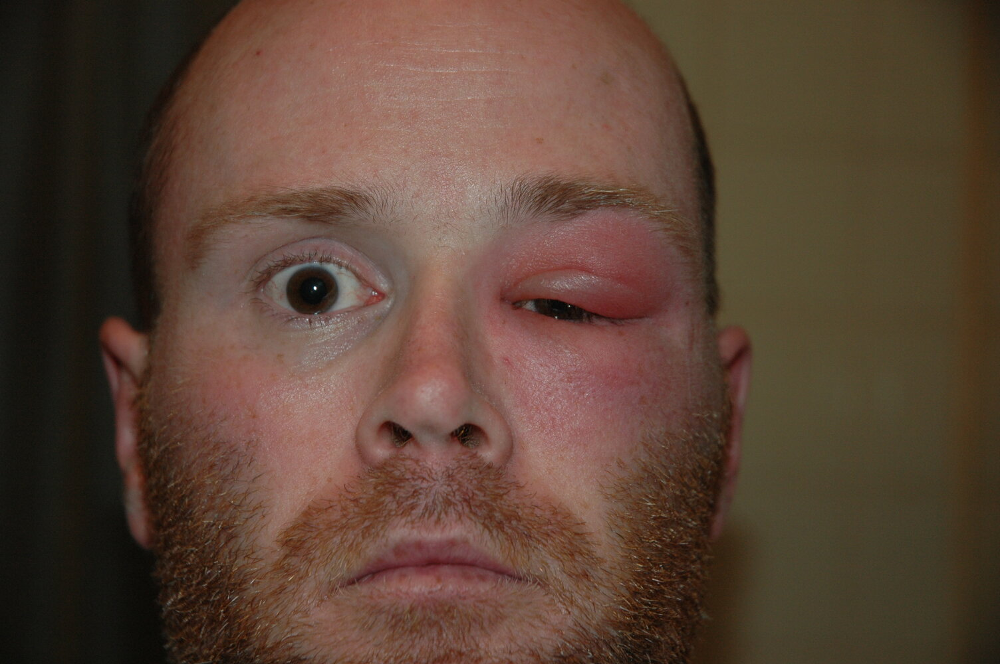
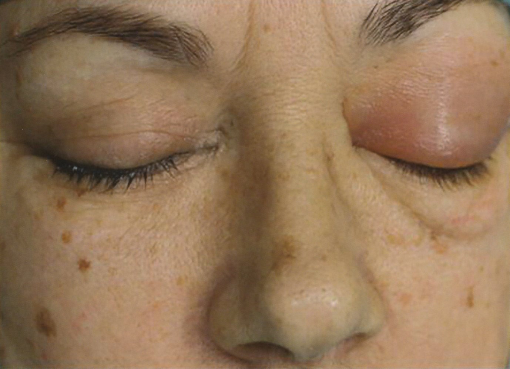
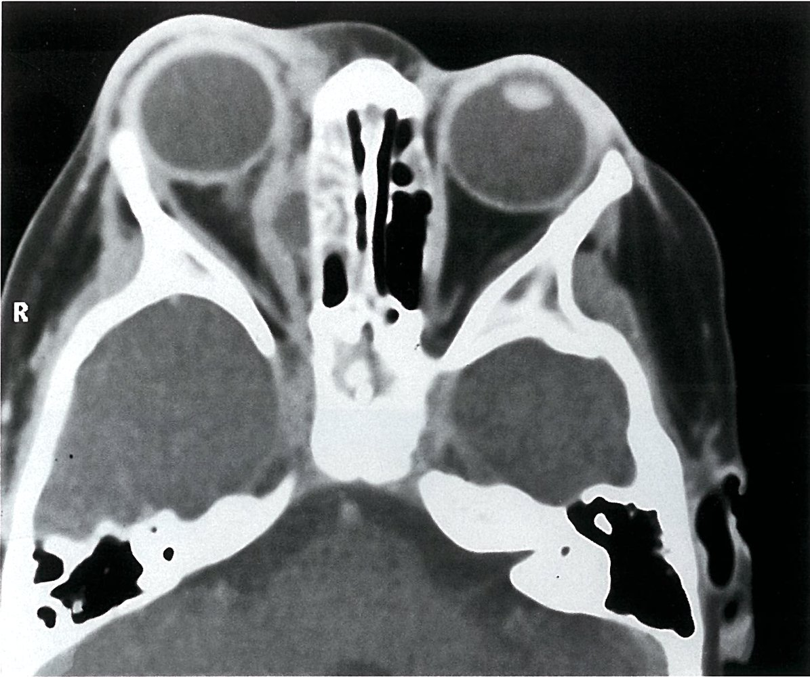
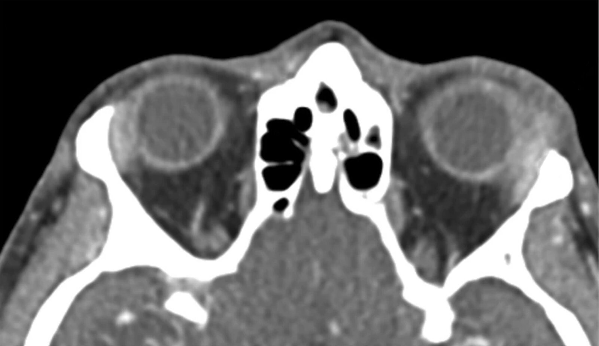
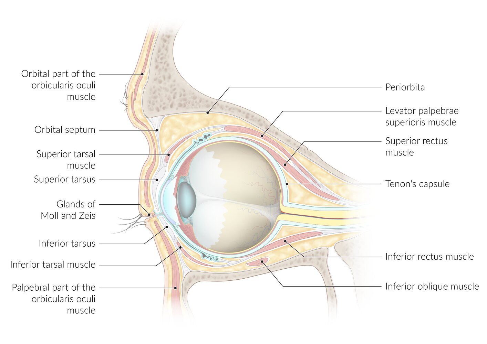
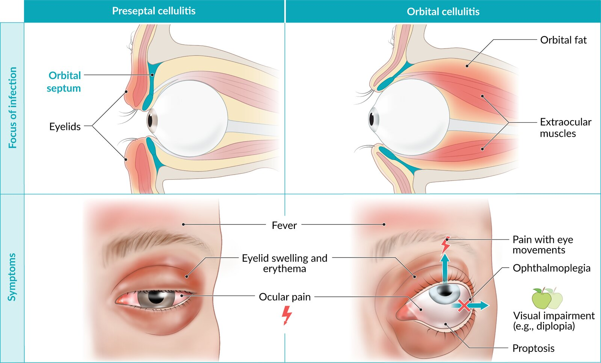

# Orbital disorders

*Categories: Clinical knowledge > Internal medicine > Endocrinology > Thyroid and parathyroid gland disorders > Orbital disorders*

[Original Article Link](https://coursology-qbank.com/amboss/article/G50Blg)

---

## Summary

The <u>orbit</u> is the bony cavity that encloses the globe and accessory organs of the <u>eye</u>, including the ocular muscles, <u>lacrimal glands</u>, nerves, vessels, and retrobulbar <u>adipose tissue</u>. Diseases of the orbital cavity include <u>preseptal cellulitis</u>, <u>orbital cellulitis</u>, <u>orbital compartment syndrome</u>, <u>rhabdomyosarcoma</u>, and <u>lacrimal apparatus disorders</u>. Typical symptoms associated with these diseases include <u>exophthalmos</u> and <u>diplopia</u>. Treatment is based on the underlying disease. Preseptal and <u>orbital cellulitis</u> require prompt initiation of <u>antibiotics</u>. <u>Orbital compartment syndrome</u> (<u>OCS</u>) is an ophthalmic emergency that requires immediate <u>lateral canthotomy and cantholysis</u> to prevent significant <u>vision loss</u>.

See also “<u>Diseases of the lacrimal apparatus</u>,” “<u>Traumatic eye injuries</u>,” and “<u>Graves ophthalmopathy</u>.”

---

## Orbital and periorbital infections

Infections around the <u>orbit</u> are classified as <u>preseptal cellulitis</u>, <u>orbital cellulitis</u>, or <u>orbital abscess</u> (rare); misidentification of the type of infection can lead to inappropriate management and <u>vision loss</u>. [[1]](https://coursology-qbank.com/amboss/article/NBW-aL0)[[2]](https://coursology-qbank.com/amboss/article/xDWEgn0)[[3]](https://coursology-qbank.com/amboss/article/9DWNgn0)

### Overview

| Preseptal cellulitis vs. orbital cellulitis |  |  |
| --- | --- | --- |
|  |  <u>Preseptal cellulitis</u>  |  <u>Orbital cellulitis</u>  |
| Location |  * Confined to <u>soft tissues</u> <u>anterior</u> to <u>orbital septum</u>   |  * Involves <u>soft tissues</u> <u>posterior</u> to the <u>orbital septum</u>   |
| Etiology |  * Most common: direct <u>inoculation</u>, e.g., scratch, bite   |  * Most common: <u>bacterial sinusitis</u>   |
| Distinguishing clinical features |   * <u>Fever</u> can be present  * No <u>red flags for orbital cellulitis</u>    |   * Systemic signs of infection (e.g., <u>fever</u>, <u>malaise</u>) often present  * <u>Red flags of orbital cellulitis</u> present    |
| Diagnostics |  * <u>Clinical diagnosis</u>   |  * <u>Clinical diagnosis</u> confirmed on CT <u>orbits</u> and sinuses with contrast   |
| Treatment |  * Empiric oral <u>antibiotics</u>   |  * Empiric IV <u>antibiotics</u>   |
| Complications |  * Rare   |   * Visual loss  * <u>Orbital compartment syndrome</u>  * Systemic or <u>CNS</u> infections (e.g., <u>brain abscess</u>)  * <u>Cavernous sinus thrombosis</u>    |
| Disposition |  * Outpatient management   |  * Hospital admission   |

> [!WARNING]
> <u>Preseptal cellulitis</u> and <u>orbital cellulitis</u> can present similarly with unilateral <u>pain</u>, swelling, and redness of the <u>eyelid</u> and periorbital tissues. The primary distinguishing features are <u>red flags of orbital cellulitis</u>, e.g., <u>proptosis</u>, <u>ophthalmoplegia</u>, and reduced <u>visual acuity</u>.

Preseptal cellulitis

Orbital cellulitis

Orbital cellulitis

Ethmoid sinusitis with orbital involvement

Dacryoadenitis

Anatomy of the eye and surrounding structures

Preseptal cellulitis versus orbital cellulitis

---

## Preseptal (periorbital) cellulitis

### Definition [[2]](https://coursology-qbank.com/amboss/article/xDWEgn0)[[4]](https://coursology-qbank.com/amboss/article/iBWJ0L0)

* Infection confined to orbital <u>soft tissues</u> <u>anterior</u> to the <u>orbital septum</u>

* Involves the <u>skin</u> of the <u>eyelid</u> and/or the <u>orbicularis oculi muscle</u>

Preseptal cellulitis versus orbital cellulitis

Anatomy of the eye and surrounding structures

### <u>Epidemiology</u> [[4]](https://coursology-qbank.com/amboss/article/iBWJ0L0)

* More common in children than adults

* Peak age group < 5 years old

### Etiology [[4]](https://coursology-qbank.com/amboss/article/iBWJ0L0)

* Direct <u>inoculation</u> (most common), e.g., scratch, <u>insect bite</u>, <u>animal bite</u>

* Local spread from adjacent infection, e.g., <u>sinusitis</u>, <u>dacryocystitis</u>

* Hematogenous spread from distant infection, e.g., <u>acute otitis media</u>, <u>pneumonia</u>

### Clinical features  [[4]](https://coursology-qbank.com/amboss/article/iBWJ0L0)[[5]](https://coursology-qbank.com/amboss/article/oDW02n0)

* Unilateral <u>pain</u>, swelling, and redness of the <u>eyelid</u> and periorbital tissues

* Systemic signs of infection, e.g., <u>fever</u>

* No <u>red flags for orbital cellulitis</u>

> [!WARNING]
> Reduced <u>visual acuity</u>, <u>RAPD</u>, <u>diplopia</u>, <u>ophthalmoplegia</u>, and/or <u>proptosis</u> are <u>red flags for orbital cellulitis</u>; further investigation is required. [[2]](https://coursology-qbank.com/amboss/article/xDWEgn0)[[6]](https://coursology-qbank.com/amboss/article/oBW0bL0)

Preseptal cellulitis versus orbital cellulitis

Preseptal cellulitis

### Diagnostics [[2]](https://coursology-qbank.com/amboss/article/xDWEgn0)[[3]](https://coursology-qbank.com/amboss/article/9DWNgn0)[[4]](https://coursology-qbank.com/amboss/article/iBWJ0L0)[[7]](https://coursology-qbank.com/amboss/article/AN1Rdh0)

<u>Preseptal cellulitis</u> is a <u>clinical diagnosis</u>; testing may be performed if there is diagnostic uncertainty, e.g.:

* <u>Laboratory studies</u>: <u>CBC</u>, cultures (e.g., <u>conjunctival</u>, blood)

* Imaging: CT <u>orbits</u> and sinuses with contrast  [[2]](https://coursology-qbank.com/amboss/article/xDWEgn0)

* Indications

* Unable to perform a <u>comprehensive eye examination</u>, e.g., because of <u>eyelid</u> <u>edema</u>

* <u>Red flags for orbital cellulitis</u>

* Findings: <u>soft tissue</u> thickening <u>anterior</u> to the <u>orbital septum</u>

Dacryoadenitis

Ethmoid sinusitis with orbital involvement

### Differential diagnosis [[3]](https://coursology-qbank.com/amboss/article/9DWNgn0)[[4]](https://coursology-qbank.com/amboss/article/iBWJ0L0)

* <u>Orbital cellulitis</u>

* <u>Conjunctivitis</u>

* <u>Blepharitis</u>

* <u>Dacryocystitis</u>

* <u>Dacryoadenitis</u>

* <u>Contact dermatitis</u>

### Treatment [[4]](https://coursology-qbank.com/amboss/article/iBWJ0L0)[[8]](https://coursology-qbank.com/amboss/article/GzWB8L0)

* Empiric oral <u>antibiotics</u> are indicated for all patients.

* IV <u>antibiotics</u> and ophthalmology consultation may be indicated in severe cases, e.g., concern for <u>orbital cellulitis</u>, inpatient admission required (see “Disposition”). [[8]](https://coursology-qbank.com/amboss/article/GzWB8L0)

#### Oral <u>antibiotics</u>

* Duration: for 10–14 days

* Options for patients without <u>MRSA risk factors</u>

* <u>Amoxicillin/clavulanic acid</u> DOSAGE [[8]](https://coursology-qbank.com/amboss/article/GzWB8L0)

* <u>Cefpodoxime</u> DOSAGE [[8]](https://coursology-qbank.com/amboss/article/GzWB8L0)

* Cefdinir DOSAGE [[8]](https://coursology-qbank.com/amboss/article/GzWB8L0)

* Adults only: <u>moxifloxacin</u> (<u>off-label</u>) DOSAGE  [[8]](https://coursology-qbank.com/amboss/article/GzWB8L0)

* Options for patients with <u>MRSA risk factors</u>

* <u>Trimethoprim/sulfamethoxazole</u> (<u>off-label</u>) DOSAGE [[8]](https://coursology-qbank.com/amboss/article/GzWB8L0)

* <u>Clindamycin</u> DOSAGE [[8]](https://coursology-qbank.com/amboss/article/GzWB8L0)

* Adults only: <u>Doxycycline</u> (<u>off-label</u>) DOSAGE  [[8]](https://coursology-qbank.com/amboss/article/GzWB8L0)

#### IV <u>antibiotics</u>

* Treatment is similar to that of <u>orbital cellulitis</u> (see “Management” in “<u>Orbital cellulitis</u>”).

* Tailor dosage under ophthalmology guidance.

### Complications [[6]](https://coursology-qbank.com/amboss/article/oBW0bL0)

* Progression to <u>orbital cellulitis</u>

* Spread to <u>CNS</u>, e.g., <u>meningitis</u>, <u>encephalitis</u> (uncommon)

### Disposition

Admit patients with any of the following:

* Age < 5 years

* Toxic appearance

* Unable to attend follow-up

* No improvement within 24–48 hours

---

## Orbital cellulitis

<u>Orbital cellulitis</u> is a <u>medical emergency</u>; urgent ophthalmology consultation and IV <u>antibiotics</u> are recommended.

### Definition [[2]](https://coursology-qbank.com/amboss/article/xDWEgn0)

* Infection primarily involving but not confined to orbital <u>soft tissues</u> <u>posterior</u> to the <u>orbital septum</u>

* Involves the orbital fat, <u>extraocular muscles</u>, and/or neurovascular tissues

Preseptal cellulitis versus orbital cellulitis

Anatomy of the eye and surrounding structures

### <u>Epidemiology</u> [[4]](https://coursology-qbank.com/amboss/article/iBWJ0L0)

* More common in children than adults

* Highest <u>incidence</u> in winter

### Etiology [[5]](https://coursology-qbank.com/amboss/article/oDW02n0)[[9]](https://coursology-qbank.com/amboss/article/3BWS0L0)

* Local spread from adjacent infection, e.g.:

* <u>Bacterial rhinosinusitis</u> (most common)

* <u>Odontogenic infection</u>

* <u>Preseptal cellulitis</u>

* <u>Dacryocystitis</u>

* Direct <u>inoculation</u>, e.g., orbital trauma, <u>surgery</u>

* Hematogenous spread, e.g., <u>bacteremia</u>, <u>septic emboli</u>

### Clinical features  [[4]](https://coursology-qbank.com/amboss/article/iBWJ0L0)[[5]](https://coursology-qbank.com/amboss/article/oDW02n0)[[10]](https://coursology-qbank.com/amboss/article/gBWFZL0)

* Localized features: unilateral <u>pain</u>, swelling, and redness of the <u>eyelid</u> and periorbital tissues

* Systemic features of infection: e.g., <u>fever</u>, <u>malaise</u>

* Red flags for orbital cellulitis

* <u>Proptosis</u>

* <u>Chemosis</u>

* Decreased <u>visual acuity</u>

* <u>Ophthalmoplegia</u>

* Signs of optic neuropathy (e.g., <u>dyschromatopsia</u>, <u>RAPD</u>)

Preseptal cellulitis versus orbital cellulitis

Orbital cellulitis

Orbital cellulitis

### Diagnostics [[1]](https://coursology-qbank.com/amboss/article/NBW-aL0)[[8]](https://coursology-qbank.com/amboss/article/GzWB8L0)

<u>Orbital cellulitis</u> is a <u>clinical diagnosis</u> confirmed with CT imaging.

* <u>Laboratory studies</u>: <u>CBC</u>, <u>inflammatory markers</u>, cultures (e.g., <u>conjunctival</u>, blood)

* Imaging [[11]](https://coursology-qbank.com/amboss/article/KDWU2n0)

* CT <u>orbits</u> and sinuses with contrast: to confirm the diagnosis and evaluate for <u>orbital abscess</u>, <u>retained foreign bodies</u>

* <u>MRI</u> of <u>orbit</u> and sinuses: to rule out suspected <u>cavernous sinus thrombosis</u> or other intracranial complications [[2]](https://coursology-qbank.com/amboss/article/xDWEgn0)[[10]](https://coursology-qbank.com/amboss/article/gBWFZL0)

Dacryoadenitis

Ethmoid sinusitis with orbital involvement

### Differential diagnosis [[3]](https://coursology-qbank.com/amboss/article/9DWNgn0)[[4]](https://coursology-qbank.com/amboss/article/iBWJ0L0)

* Infectious, e.g., <u>preseptal cellulitis</u>, <u>orbital abscess</u>

* Trauma, e.g., <u>retrobulbar hemorrhage</u>, <u>orbital fracture</u>

* Autoimmune disease, e.g., <u>granulomatosis with polyangiitis</u>, <u>sarcoidosis</u>

* Orbital <u>neoplasm</u>

* <u>Cavernous sinus thrombosis</u>

> [!WARNING]
> Consider <u>cavernous sinus thrombosis</u> in patients with bilateral <u>eyelid</u> swelling, <u>ptosis</u>, <u>proptosis</u>, <u>ophthalmoplegia</u>, <u>papilledema</u>, or <u>meningismus</u>. [[11]](https://coursology-qbank.com/amboss/article/KDWU2n0)

### Management [[1]](https://coursology-qbank.com/amboss/article/NBW-aL0)[[2]](https://coursology-qbank.com/amboss/article/xDWEgn0)[[7]](https://coursology-qbank.com/amboss/article/AN1Rdh0)[[11]](https://coursology-qbank.com/amboss/article/KDWU2n0)

* Consult ophthalmology urgently as soon as <u>orbital cellulitis</u> is suspected.

* Initiate empiric IV <u>antibiotics</u>.

* <u>Vancomycin</u> DOSAGE [[8]](https://coursology-qbank.com/amboss/article/GzWB8L0)

* PLUS one of the following:

* <u>Ampicillin/sulbactam</u> DOSAGE [[8]](https://coursology-qbank.com/amboss/article/GzWB8L0)

* <u>Piperacillin/tazobactam</u> DOSAGE [[8]](https://coursology-qbank.com/amboss/article/GzWB8L0)

* <u>Ceftriaxone</u> DOSAGE AND <u>metronidazole</u> DOSAGE

* Consider empiric <u>management of systemic fungal infections</u> (e.g., <u>mucormycosis</u>, <u>aspergillosis</u>) in patients with <u>risk factors for systemic fungal infection</u>.

* Manage <u>orbital abscess</u> if present.

* Provide supportive therapy, e.g.:

* <u>Nasal decongestant</u> spray for concomitant <u>sinusitis</u>, e.g., <u>oxymetazoline</u>

* Ophthalmic lubricants if <u>proptosis</u> interferes with <u>eye</u> closure

* <u>Systemic corticosteroids</u> to reduce local inflammation, only with expert guidance [[12]](https://coursology-qbank.com/amboss/article/eBWx-n0)

### Complications [[2]](https://coursology-qbank.com/amboss/article/xDWEgn0)[[11]](https://coursology-qbank.com/amboss/article/KDWU2n0)

* Orbital abscess: a <u>purulent</u> collection in the orbital compartment  [[1]](https://coursology-qbank.com/amboss/article/NBW-aL0)[[2]](https://coursology-qbank.com/amboss/article/xDWEgn0)[[6]](https://coursology-qbank.com/amboss/article/oBW0bL0)[[13]](https://coursology-qbank.com/amboss/article/qBWCbL0)[[14]](https://coursology-qbank.com/amboss/article/rBWfXL0)

* Usually diagnosed on CT

* Urgent surgical drainage is often required to prevent intracranial extension, <u>cavernous sinus thrombosis</u>, and/or <u>vision loss</u>.

* Nonoperative management can be considered in select cases.

* Reduced <u>visual acuity</u> or <u>vision loss</u>

* Intracranial <u>abscess</u>

* <u>Cavernous sinus thrombosis</u>

* <u>Endophthalmitis</u>

### Disposition

* Admit all patients for IV <u>antibiotics</u> and assessment by an ophthalmologist.

* Consult additional specialists as needed, e.g.:

* Otolaryngology: evidence of <u>sinusitis</u>

* Neurosurgery: evidence of intracranial extension or <u>meningitis</u>

* <u>Oral maxillofacial surgery</u>: evidence of <u>odontogenic infection</u>

* Infectious diseases: suspected fungal infection

---