# Gastrointestinal tract

*Categories: Clinical knowledge > Internal medicine > Gastroenterology > Basics of gastroenterology > Gastrointestinal tract*

[Original Article Link](https://coursology-qbank.com/amboss/article/M60MlS)

---

## Summary

The gastrointestinal tract (GIT) is the system of organs that allows for the consumption and digestion of food, absorption of <u>nutrients</u>, and excretion of waste in the form of fecal matter. It includes the <u>oral cavity</u>, <u>esophagus</u>, <u>stomach</u>, <u>small intestine</u>, and <u>large intestine</u>. It is derived from the <u>primitive gut tube</u> and can be divided into the <u>foregut</u>, <u>midgut</u>, and <u>hindgut</u>, each of which is distinct in its embryological development and neurovascular supply. The <u>veins</u> of all three embryological segments drain directly or indirectly into the <u>portal vein</u>, which is connected to the caval venous system via a system of <u>portocaval shunts</u>. The GIT is innervated by the <u>sympathetic nervous system</u>, <u>parasympathetic nervous system</u>, and <u>enteric nervous system</u>, the last of which is unique to the GIT. All organs of the GIT are composed of four histological layers: <u>mucosa</u>, <u>submucosa</u>, muscularis propria, and serosa (<u>intraperitoneal organs</u>) or adventitia (<u>extraperitoneal organs</u>). The <u>secretory and regulatory products of the gastrointestinal tract</u> vary from segment to segment depending on the regional histological characteristics, presence of specialized cells, and function.

This article provides an overview of the gastrointestinal tract as a whole. The <u>oral cavity</u>, <u>stomach</u>, <u>small intestine</u>, and <u>large intestine</u> are covered in detail in their own articles, as are the accessory organs such as the <u>liver</u>, <u>gall bladder</u>, and <u>pancreas</u>. The <u>peritoneum</u> and major <u>blood vessels</u> of the <u>abdominal cavity</u> are covered in the “<u>Abdominal cavity</u>” article.

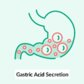

Regulating Gastric Acid Secretion: Acetylcholine, Gastrin, and Histamine

---

## Overview

### Organs [[1]](https://coursology-qbank.com/amboss/article/ES08Yf)

* Parts of the gastrointestinal tract

* <u>Oral cavity</u> and <u>pharynx</u>

* <u>Esophagus</u>

* <u>Stomach</u>

* <u>Small intestine</u>

* <u>Large intestine</u>

* Accessory organs to the gastrointestinal tract

* <u>Liver</u>

* <u>Gall bladder</u>

* <u>Pancreas</u>

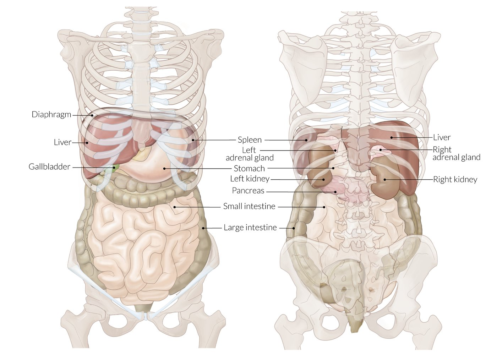

Abdominal organs

Sections of the stomach

Anatomy of the stomach

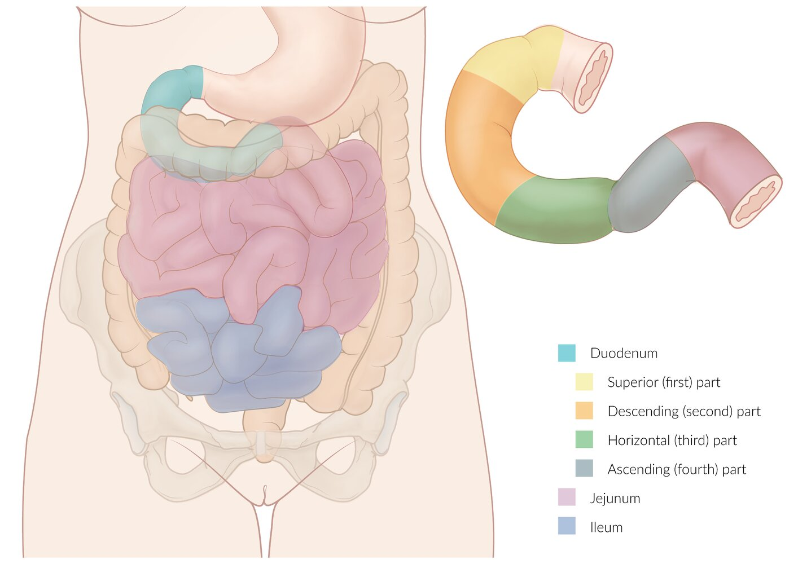

Parts of the small intestine

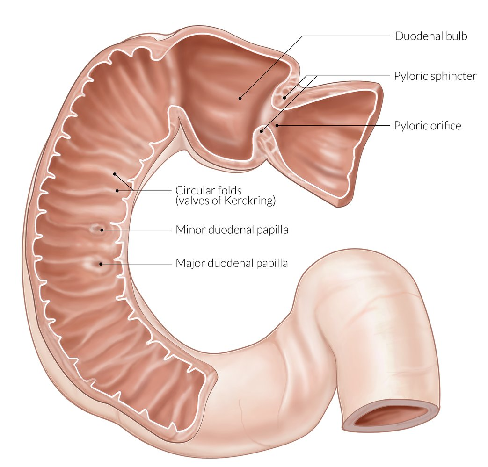

Characteristic structures of the duodenum

Parts of the colon

### Function

* Ingestion of food and water

* <u>Mastication</u>

* Transport of the food bolus or <u>chyme</u> through the gastrointestinal tract

* Digestion (i.e., breaking food down into <u>nutrients</u>)

* Absorption of <u>nutrients</u> and water

* Excretion of waste as feces

* <u>Immunity</u>

### Developmental derivatives of the <u>primitive gut tube</u> [[1]](https://coursology-qbank.com/amboss/article/ES08Yf)

The organs of the gastrointestinal tract and their associated neurovascular structures can be grouped into three groups based on their development from the <u>primitive gut tube</u>: <u>foregut</u>, <u>midgut</u>, <u>hindgut</u>. (For more info on the embryological development of the gastrointestinal tract, see the “<u>Embryology</u>” section below.)

| Foregut, midgut, and hindgut derivatives and corresponding neurovascular structures |  |  |  |  |
| --- | --- | --- | --- | --- |
|  |  | Foregut | Midgut | Hindgut |
| Derivatives |  |   * <u>Esophagus</u>  * <u>Stomach</u>  * <u>Proximal</u> <u>duodenum</u> (<u>proximal</u> to the <u>Ampulla of Vater</u>)  * <u>Liver</u>  * <u>Gall bladder</u> and <u>bile</u> ducts  * <u>Pancreas</u>  * <u>Trachea</u>, respiratory tract, and <u>lungs</u>    |   * <u>Distal</u> <u>duodenum</u> (<u>distal</u> to the <u>Ampulla of Vater</u>)  * <u>Jejunum</u>  * <u>Ileum</u>  * <u>Cecum</u>  * <u>Ascending colon</u>  * <u>Proximal</u> ⅔ of the <u>transverse colon</u>    |   * <u>Distal</u> ⅓ of the <u>transverse colon</u>  * <u>Descending colon</u>  * <u>Rectum</u>  * <u>Anal canal</u> <u>proximal</u> to the <u>pectinate line</u>  * <u>Urogenital sinus</u>    |
| <u>Vertebral</u> level |  |  * T12–L1   |  * L1   |  * L3   |
| <u>Artery</u> |  |  * <u>Celiac trunk</u>   |  * <u>Superior mesenteric artery</u>   |  * <u>Inferior mesenteric artery</u>   |
| <u>Vein</u> |  |  * <u>Portal vein</u>   |  * <u>Superior mesenteric vein</u>   |  * <u>Inferior mesenteric vein</u>   |
|  Innervation    | <u>Parasympathetic</u> |  * <u>Vagus nerve</u>   |  * <u>Vagus nerve</u>   |  * <u>Pelvic splanchnic nerves</u>   |
| <u>Sympathetic</u> |  * T5–T9 thoracic <u>splanchnic nerves</u>   |  * T10–T12 thoracic <u>splanchnic nerves</u>   |  * L1–L2 lumbar <u>splanchnic nerves</u>   |  |

> [!NOTE]
> <u>Foregut</u> derivatives are supplied by the <u>celiac artery</u>, <u>midgut</u> derivatives by the <u>superior mesenteric artery</u>, and <u>hindgut</u> derivatives by the <u>inferior mesenteric artery</u>.

> [!NOTE]
> <u>Referred pain</u> from the <u>foregut</u> is felt in the epigastrium, <u>pain</u> from the <u>midgut</u> in the umbilical region, and <u>pain</u> from the <u>hindgut</u> in the hypogastrium.

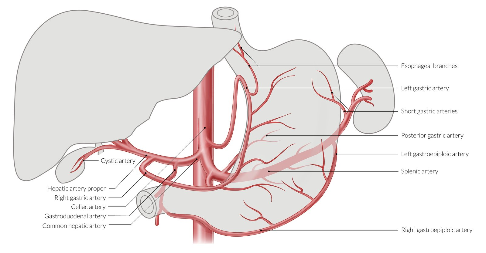

Branches of the celiac trunk

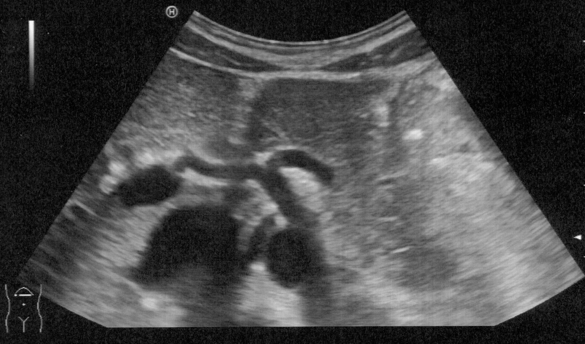

Branches of the celiac trunk

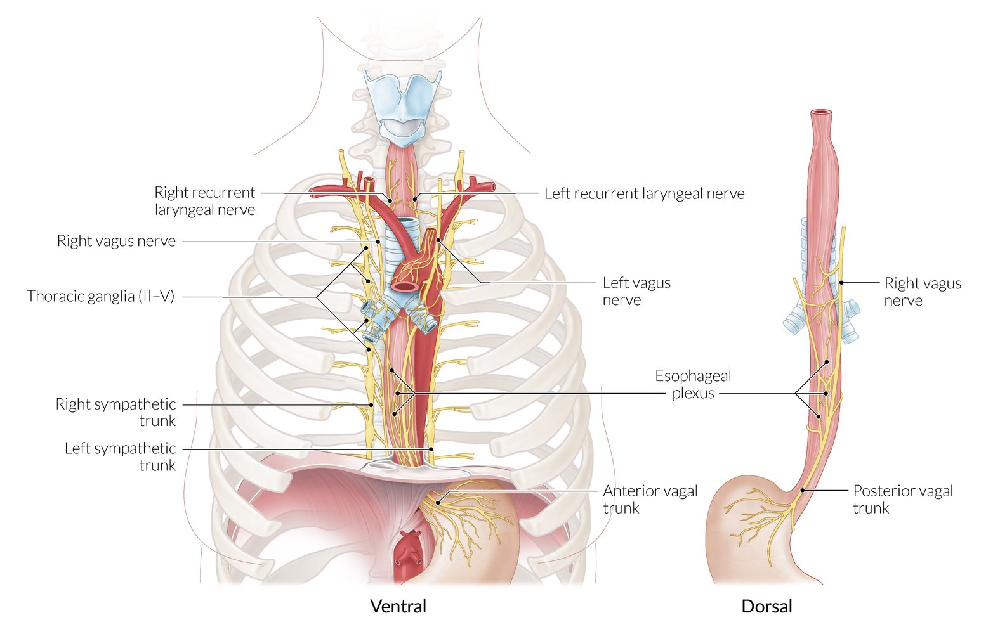

Sympathetic and parasympathetic innervation of the esophagus

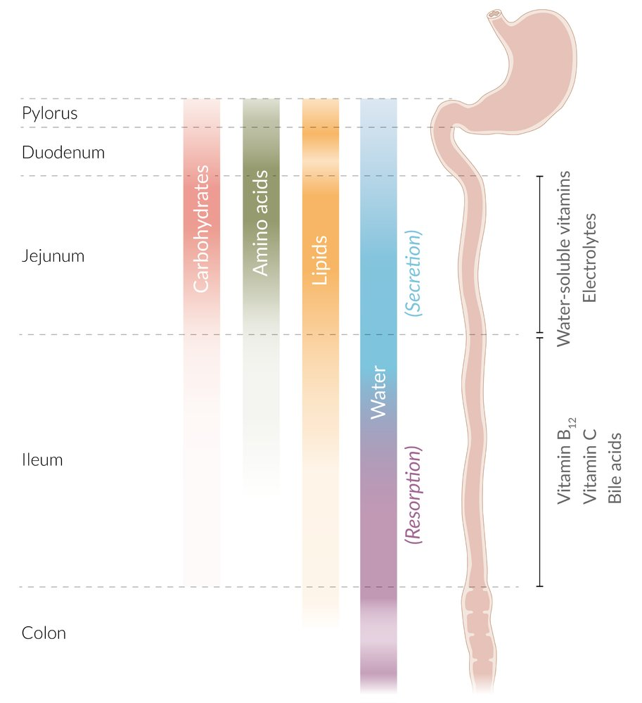

Intestinal resorption

---

## Vasculature

For more detailed information about the branches, course, and supply by individual vessels, see the corresponding sections in the "<u>Abdominal cavity</u>" article.

### Arterial supply

* Most of the GIT is supplied by the <u>anterior</u> (unpaired) <u>branches of the abdominal aorta</u>. In contrast, non-GI organs in the <u>abdominal cavity</u> are supplied by the <u>posterior</u> and/or <u>lateral</u> (paired) <u>branches of the abdominal aorta</u>.

* Exceptions:

* <u>Esophagus</u>: supplied by the esophageal branches of the <u>inferior thyroid artery</u>, the <u>thoracic aorta</u>, and the <u>left gastric artery</u>

* <u>Distal</u> <u>anal canal</u>: supplied by the <u>middle rectal artery</u>  and the <u>inferior rectal artery</u>

* <u>Watershed zones</u>

* <u>Splenic flexure</u>: supplied by the branches of both superior and <u>inferior mesenteric arteries</u>

* Rectosigmoid junction: supplied by the <u>superior rectal artery</u> and last sigmoid branch of the <u>inferior mesenteric artery</u>

| Overview of arterial blood supply of the gastrointestinal tract |  |  |  |
| --- | --- | --- | --- |
| <u>Artery</u> | Characteristics | Branches | Region supplied |
| <u>Celiac trunk</u> |   * First <u>anterior</u> <u>branch of the abdominal aorta</u>  * Arises at the level of the 12th thoracic <u>vertebra</u> (T12)    |   * <u>Left gastric artery</u>: supplies abdominal <u>esophagus</u> and <u>lesser curvature of the stomach</u>  * <u>Splenic artery</u>  * <u>Left gastroepiploic artery</u>: supplies <u>greater curvature of the stomach</u>; important <u>anastomosis</u> with right gastroepiploic <u>arteries</u>  * <u>Short gastric arteries</u>: supply <u>fundus of the stomach</u>  * <u>Pancreatic</u> branches  * <u>Common hepatic artery</u>  * <u>Proper hepatic artery</u>  * <u>Right gastric artery</u>: supplies the <u>lesser curvature of the stomach</u>; important <u>anastomosis</u> with left gastric <u>arteries</u>  * Right and <u>left hepatic arteries</u> * <u>Cystic artery</u>: branch of the <u>right hepatic artery</u>  * <u>Gastroduodenal artery</u>   * <u>Right gastroepiploic artery</u>: supplies the <u>greater curvature of the stomach</u>  * <u>Superior pancreaticoduodenal artery</u>: supplies the head of the <u>pancreas</u> and the <u>proximal</u> <u>duodenum</u>    |   * <u>Foregut</u>  * <u>Spleen</u>    |
| <u>Superior mesenteric artery</u> |   * Second <u>anterior</u> <u>branch of the abdominal aorta</u>  * Arises at the level of the 1st lumbar <u>vertebra</u> (L1)  * Passes <u>anterior</u> to the third segment of the <u>duodenum</u>  * Most commonly affected by <u>acute mesenteric ischemia</u>    |   * <u>Inferior pancreaticoduodenal artery</u>: supplies the head of the <u>pancreas</u> and <u>distal</u> <u>duodenum</u>  * Intestinal <u>arteries</u> to the <u>jejunum</u> and <u>ileum</u>  * <u>Ileocolic artery</u>: supplies the <u>distal</u> <u>ileum</u>, <u>cecum</u>, <u>appendix</u>  * <u>Right colic artery</u>: supplies the <u>ascending colon</u>  * <u>Middle colic artery</u>: supplies the <u>transverse colon</u>    |  * <u>Midgut</u>   |
| <u>Inferior mesenteric artery</u> |   * Third <u>anterior</u> <u>branch of the abdominal aorta</u>  * Arises at the level of the 3rd lumbar <u>vertebra</u> (L3)    |   * <u>Left colic artery</u>: supplies <u>distal</u> ⅓ of the <u>transverse colon</u> and <u>descending colon</u>  * <u>Sigmoid artery</u>: supplies <u>sigmoid colon</u>  * <u>Superior rectal artery</u>: supplies <u>rectum</u> and <u>proximal</u> <u>anal canal</u>    |  * <u>Hindgut</u>   |

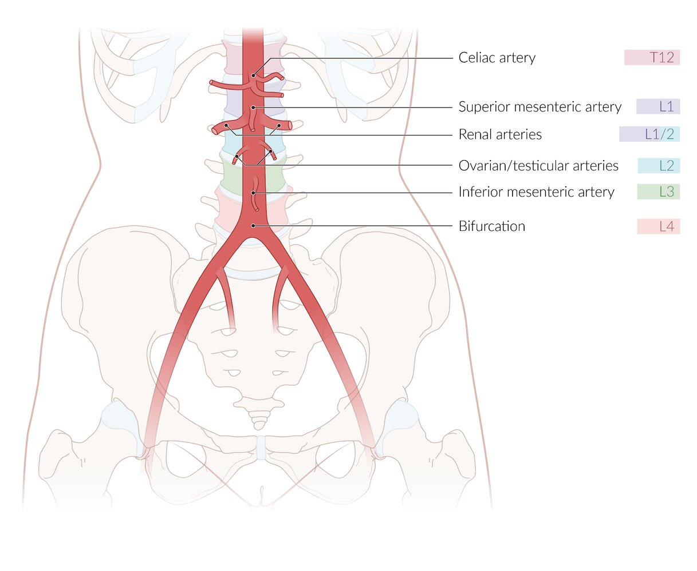

Landmarks of the abdominal aorta

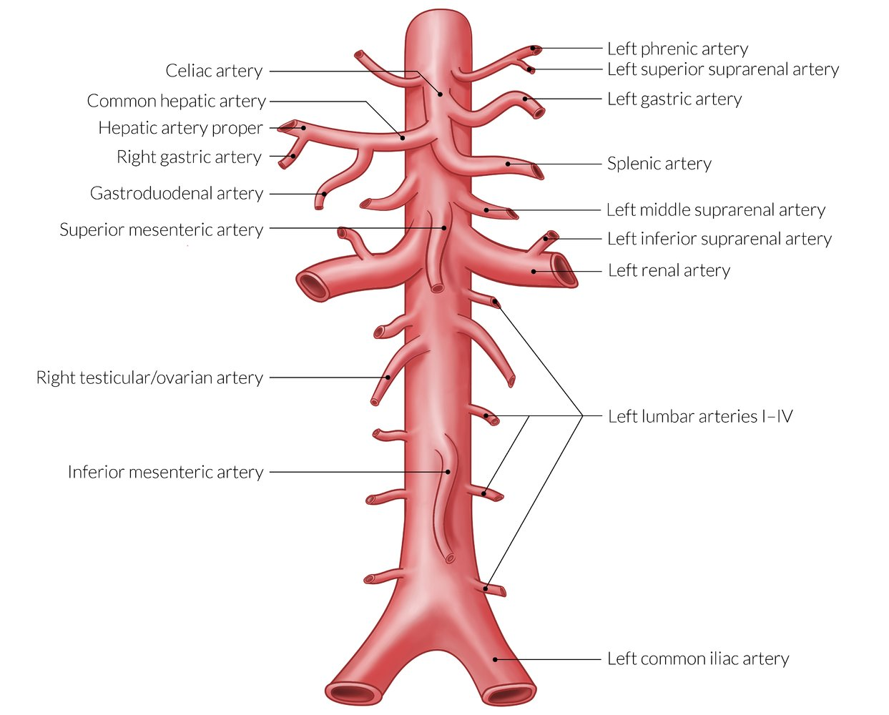

Branches of the abdominal aorta

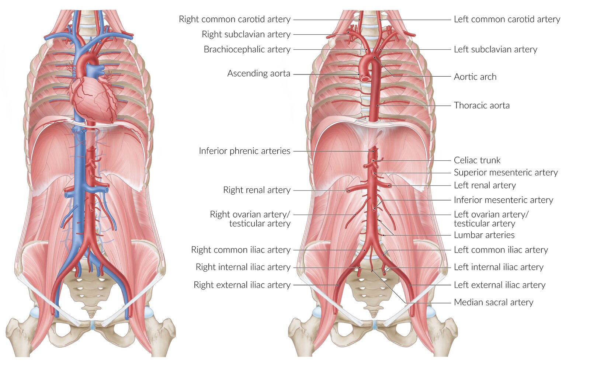

Parts of the aorta and its branches

Abdominal aorta and inferior vena cava

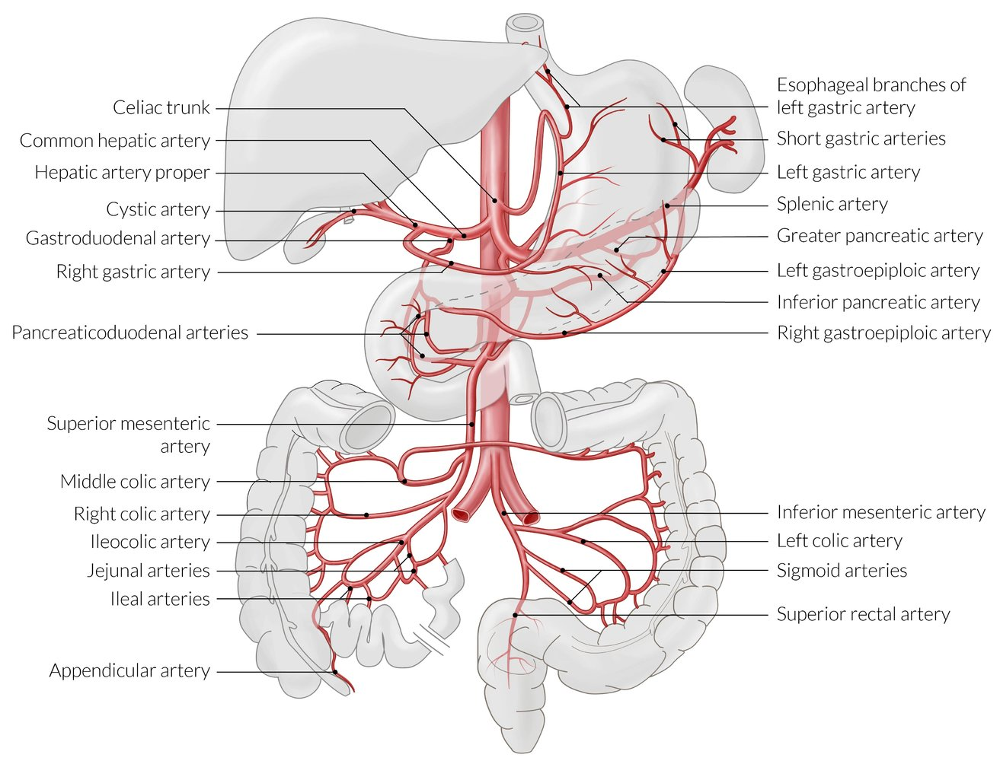

Arterial supply of the gastrointestinal tract

Branches of the celiac trunk

Arterial blood supply of the colon

### Venous drainage

* The <u>veins</u> of most of the gastrointestinal tract drain directly or indirectly into the <u>portal vein</u>.

* Exceptions:

* <u>Esophagus</u>: drains into the inferior <u>thyroid</u> <u>vein</u>, the <u>azygos vein</u>, <u>hemiazygos vein</u>, and the <u>left gastric vein</u>

* <u>Distal</u> <u>anal canal</u> (<u>below the pectinate line</u>): drains into the <u>inferior vena cava</u>

* For more information about the tributaries of each individual <u>vein</u> and description of <u>portocaval anastomoses</u> and <u>cavocaval anastomoses</u>, see the “<u>Abdominal cavity</u>” article.

| Overview of venous drainage from the gastrointestinal tract |  |  |  |
| --- | --- | --- | --- |
| <u>Vein</u> | Characteristics | Areas drained | Drains into |
| Portal vein |   * Formed by the union of the <u>splenic vein</u> and the <u>superior mesenteric vein</u>  * Carries blood from the gastrointestinal tract and accessory organs to the <u>liver</u>    |   * <u>Foregut</u> (directly)  * <u>Stomach</u>  * Right and left gastric <u>veins</u> → <u>portal vein</u>  * <u>Left gastroepiploic vein</u> and short gastric <u>veins</u> → splenic <u>vein</u> → <u>portal vein</u>  * Right gastroepiploic <u>vein</u> → superior <u>mesenteric</u> <u>vein</u> → <u>portal vein</u>  * <u>Proximal</u> <u>duodenum</u> → superior pancreaticoduodenal vein→ <u>portal vein</u>  * <u>Midgut</u> (indirectly via the <u>SMV</u>)  * <u>Hindgut</u> (indirectly via the <u>IMV</u>)    |  * <u>IVC</u>   |
|  Superior mesenteric vein (<u>SMV</u>) |  * Joins the <u>splenic vein</u> to form the <u>portal vein</u>   |  * <u>Midgut</u>   |  * <u>Portal vein</u>   |
|  Inferior mesenteric vein (<u>IMV</u>) |  * Drains into the <u>splenic vein</u>, which then joins the <u>SMV</u> to form the <u>portal vein</u>   |  * <u>Hindgut</u> (up to the <u>pectinate line</u>)   |  * Splenic <u>vein</u> → <u>portal vein</u>   |

Tributaries of the hepatic portal vein

---

## Innervation and gut motility

### Innervation of the gastrointestinal tract [[2]](https://coursology-qbank.com/amboss/article/4mY3fp)

* The gastrointestinal tract is innervated by the <u>autonomic nervous system</u>.

* Extrinsic innervation: <u>parasympathetic</u> and <u>sympathetic nervous system</u>

* Intrinsic innervation: <u>enteric nervous system</u>

* Embryologically derived from the <u>neural crest</u>

* Regulated by the <u>autonomic nervous system</u> but can function independently

* Crucial for gastrointestinal motility and secretion

* For more information about the extrinsic and intrinsic innervation, see “Nerves of the <u>abdominal cavity</u>” and “<u>Enteric nervous system</u>” correspondingly.

| Overview of <u>innervation of the gastrointestinal tract</u> |  |  |  |  |  |
| --- | --- | --- | --- | --- | --- |
| Innervation |  | <u>Foregut</u> | <u>Midgut</u> | <u>Hindgut</u> | Effect |
| Extrinsic innervation | <u>Parasympathetic</u> innervation |  * <u>Vagus nerves</u>   |  * <u>Vagus nerves</u>   |  * <u>Pelvic splanchnic nerves</u> (through the <u>inferior hypogastric plexus</u>)   |   * ↑ Secretion  * ↑ Motility  * ↓ Sphincter tone    |
| <u>Sympathetic</u> innervation (<u>prevertebral ganglia</u>) |  * <u>Celiac ganglia</u> (input from thoracic <u>splanchnic nerves</u> T5–T9)   |  * <u>Superior mesenteric ganglia</u> (input from thoracic <u>splanchnic nerves</u> T10–T12)   |  * <u>Inferior mesenteric ganglia</u> (input from <u>lumbar splanchnic nerves</u> L1–L2)   |   * ↓ Secretion  * ↓ Motility  * ↑ Sphincter tone    |  |
| Site of <u>referred pain</u> |  |  * Epigastric region   |  * Umbilical regions   |  * Hypogastric region   |  * -   |
|  <u>Enteric nervous system</u> (Intrinsic innervation) |  <u>Submucosal plexus</u> (<u>Meissner plexus</u>) |  * <u>Neurons</u> and <u>ganglia</u> that lie within the <u>submucosal</u> layer of the alimentary canal   |  |  |  * Regulates local gastrointestinal secretion and <u>nutrient</u> absorption   |
|  <u>Myenteric plexus</u> (<u>Auerbach plexus</u>) |   * <u>Neurons</u> and <u>ganglia</u> that lie between the longitudinal and circular <u>smooth muscle</u> layers of the muscularis propria  * <u>Interstitial cells of Cajal</u> (<u>ICC</u>)    |  |  |   * Regulates inherent myogenic motility of the GIT  * <u>ICC</u> act as pacemaker cells for the rhythmic phasic contractions of the gut (<u>migratory motor complex</u>) that occur in the <u>fasting</u> or interdigestive state    |  |

Autonomic innervation of the gastrointestinal tract

### Motility and contractile activity of the gastrointestinal tract [[3]](https://coursology-qbank.com/amboss/article/kmYmfp) [[4]](https://coursology-qbank.com/amboss/article/OmYIfp)

| Gut motility |  |
| --- | --- |
| Type of contractions | Description |
| Peristalsis |   * Concerted waves of contraction and relaxation of the <u>muscularis propria of the gastrointestinal tract</u>  * Propels intestinal contents <u>caudally</u> (antegrade <u>peristalsis</u>) or cranially (retrograde <u>peristalsis</u>)  * Contraction of the longitudinal <u>smooth muscle</u> layer shortens the length of the intestine, which aids in propulsion.  * Relaxation of the circular <u>smooth muscle</u> layer causes the intestine to widen, allowing intestinal contents to pass.    |
| Segmentation |   * Waves of contraction of the muscularis propria  * Aid mixing of <u>chyme</u> with digestive enzymes  * Not propulsive    |
| Migratory motor complex (rhythmic phasic contractions) |   * Slow basal electric rhythm with low amplitude waves  * Generated by the <u>interstitial cells of Cajal</u> in the <u>myenteric plexus</u>  * Stimulated by <u>motilin</u>, which is secreted by <u>Mo cells</u> of the <u>small intestine</u>  * Predominantly occurs in the <u>fasting</u> (interdigestive) phase  * Propels intestinal contents <u>caudally</u>  * Frequency of <u>MMC</u>:  * <u>Stomach</u>: 3/min  * <u>Duodenum</u>: 12/min  * <u>Ileum</u>: 9/min  * <u>Colon</u>: 3/min    |
| Ultrapropulsive contractions |   * Large amplitude contractions (giant complexes)  * Stimulated by the <u>parasympathetic nervous system</u>  * Occur primarily in the <u>small intestines</u> and <u>colon</u>  * Responsible for mass movement of <u>chyme</u>/feces    |
| <u>Tonic</u> contractions |   * Most significant at sphincters and intestinal junctions  * Regulates the passage of food/<u>chyme</u>  * Partially responsible for fecal continence    |

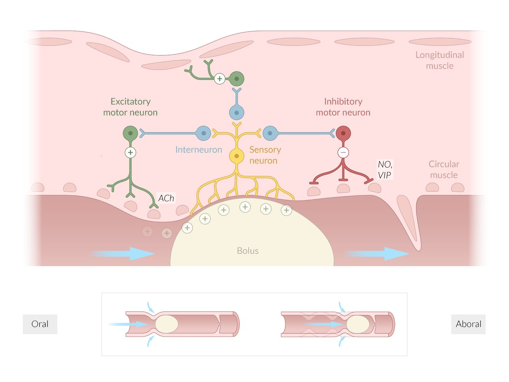

Peristalsis

> [!NOTE]
> The <u>sympathetic</u> system has an inhibitory effect on the gastrointestinal tract.
> The <u>parasympathetic</u> system promotes gastrointestinal secretion and motility.
> The <u>enteric nervous system</u> can function independently of the <u>central nervous system</u>.

---

## Microscopic anatomy

### Layers of the gastrointestinal tract

All organs of the gastrointestinal tract have four histological layers.

| Layers of gastrointestinal tract wall |  |
| --- | --- |
| Layers | Characteristics and contents |
| Mucosa (gastrointestinal tract) |   * Epithelium of the gastrointestinal tract: simple <u>columnar epithelium</u>  * <u>Lamina propria</u>: contains <u>mucosal</u> glands (e.g., gastric glands) and <u>lymphatics</u> (e.g., <u>Peyer patches</u>)  * Muscularis mucosae: layer of <u>smooth muscle</u> between the <u>mucosa</u> and the <u>submucosa</u>    |
| Submucosa (gastrointestinal tract) |   * <u>Lymphatics</u> and <u>blood vessels</u>  * Glands (e.g., <u>Brunner glands</u>)  * <u>Submucosal plexus</u> (<u>Meissner plexus</u>)    |
| Muscularis propria (gastrointestinal tract) |   * Inner circular and outer longitudinal layer of <u>smooth muscle</u>  * <u>Myenteric plexus</u> (<u>Auerbach plexus</u>)    |
| Serosa (gastrointestinal tract) |   * Serosa: <u>mesothelial</u> layer of <u>visceral peritoneum</u> covering the <u>intraperitoneal organs</u>  * Adventitia: layer of adventitial tissue covering the <u>retroperitoneal organs</u>    |
| Adventitia (gastrointestinal tract) |  |

> [!NOTE]
> <u>Erosive gastritis</u> only affects the <u>mucosa</u>, whereas <u>peptic ulcers</u> also affect the deeper <u>submucosal</u> layer.

Histological layers of the gastrointestinal tract

### Regional histological characteristics of the gastrointestinal tract

| <u>Epithelium</u> of gastrointestinal tract |  |  |  |  |  |
| --- | --- | --- | --- | --- | --- |
| Structure |  | <u>Epithelium</u> type | Specialized cells and secretory products | Special features | Function |
| <u>Oral cavity</u> |  |  * <u>Stratified</u> <u>squamous epithelium</u>   |   * <u>Serous glands</u>  * <u>Mucous glands</u>    |   * <u>Epithelial</u> <u>keratinization</u> (masticatory <u>epithelium</u>) on dorsum of <u>tongue</u>, <u>hard palate</u>, <u>gingiva</u>  * <u>Lingual papillae</u> on the <u>anterior</u> ⅔ of the <u>tongue</u>  * <u>Taste buds</u>  * <u>Teeth</u>    |   * <u>Mastication</u> of food  * Initial breakdown of <u>carbohydrates</u> (salivary <u>amylase</u>)  * <u>IgA</u> secretion    |
| <u>Esophagus</u> |  |   * <u>Nonkeratinized stratified squamous epithelium</u>  * Transitions to <u>columnar epithelium</u> at the <u>gastroesophageal junction</u>    |  |   * Upper ⅓ of the muscularis propria layer contains <u>skeletal muscle</u>.  * Middle and lower ⅔ of the muscularis propria layer contain <u>smooth muscle</u>.    |   * Transmission of food bolus from <u>pharynx</u> → <u>stomach</u>  * <u>Lower esophageal sphincter</u> prevents <u>regurgitation</u> of food from <u>stomach</u> → <u>esophagus</u>    |
|  <u>Stomach</u>   |  |  * Simple <u>columnar epithelium</u>   |   * <u>Chief cells</u>: <u>pepsinogen</u>  * <u>Parietal cells</u>: <u>hydrochloric acid</u>, <u>intrinsic factor</u>  * Enteroendocrine (EE) cells: <u>histamine</u>, <u>serotonin</u>, <u>somatostatin</u>  * <u>Foveolar cells</u>: mucus  * <u>P/D1 cells</u>: <u>ghrelin</u>    |   * <u>Mucosa</u> contains gastric glands that open onto the surface via gastric pits.  * <u>Epithelium</u> is covered by a protective mucus layer.    |   * Mechanical and <u>chemical digestion</u> of food  * Secretion of <u>intrinsic factor</u>    |
|  <u>Duodenum</u>   |  |  * Simple <u>columnar epithelium</u> with villi and <u>microvilli</u>   |   * <u>Goblet cells</u>: mucous  * <u>Paneth cells</u> : <u>lysozyme</u>, <u>defensins</u>, and <u>TNF-α</u>  * Enteroendocrine (EE) cells: <u>gastrin</u>, <u>cholecystokinin</u> (<u>CCK</u>), <u>gastric inhibitory peptide</u> (<u>GIP</u>), <u>secretin</u>, <u>serotonin</u>, and <u>substance P</u>    |   * Villi that increase the absorptive surface  * <u>Plicae circulares</u>  * <u>Crypts of Lieberkuhn</u>  * <u>Brunner glands</u> (<u>submucosa</u>): secrete <u>bicarbonate</u>    |   * <u>Chemical digestion</u> of food  * Neurohormonal regulation of <u>gastric acid</u> secretion  * <u>Iron</u> (Fe2+) absorption    |
|  <u>Jejunum</u>    |  |  * Simple <u>columnar epithelium</u> with villi and <u>microvilli</u>   |  * Similar to the <u>duodenum</u>   |   * Similar to the <u>duodenum</u>  * <u>Brunner glands</u> absent  * <u>Plicae circulares</u>  * Taller, more prominent, and greater in number than in the <u>ileum</u>  * Result in <u>jejunum</u> having a feathered appearance on imaging with oral contrast  * Increase surface area, which is beneficial for absorption    |   * Absorption of <u>nutrients</u> and water  * <u>IgA</u> secretion  * Primary site of <u>folate</u> absorption    |
| <u>Ileum</u> |  |  * Simple <u>columnar epithelium</u> with villi and <u>microvilli</u>   |   * Similar to the <u>duodenum</u>  * Contains the highest density of <u>goblet cells</u>  in the <u>small intestine</u>  * <u>Peyer patches</u>  (<u>aggregated lymphoid nodules</u> within <u>lamina propria</u> and <u>submucosa</u>)    |   * Similar to the <u>duodenum</u>  * <u>Plicae circulares</u> (<u>proximal</u> <u>ileum</u>)    |   * Absorption of <u>nutrients</u> and water  * Specific site of absorption of <u>vitamin B12</u> and <u>bile acids</u>  * Lubrication of <u>chyme</u>  * Gut <u>immunity</u> (<u>IgA</u> secretion, <u>Peyer patches</u>)    |
| <u>Appendix</u> |  |  * Simple <u>columnar epithelium</u>   |  * <u>Goblet cells</u>   |  * <u>Submucosa</u> contains numerous lymphoid follicles.   |  * Vestigial organ; also hypothesized to play a role in gut <u>immunity</u>   |
|  <u>Colon</u>   |  |  * Simple <u>columnar epithelium</u>   |  * <u>Goblet cells</u>   |   * <u>Crypts of Lieberkuhn</u> (fewer than in the <u>small intestine</u>)  * No villi    |   * Absorption of Na+ and <u>Cl-</u>  * Absorption of water  * Synthesis of <u>vitamin K</u> and <u>B vitamins</u> by <u>colonic</u> bacteria  * Solidification of <u>chyme</u> into stool  * Lubrication for the passage of feces    |
| <u>Rectum</u> and <u>anal canal</u> | <u>Above the pectinate line</u> |  * Simple <u>columnar epithelium</u>   |  |  * No <u>crypts of Lieberkuhn</u>   |  * Voluntary and involuntary control of defecation   |
| <u>Below the pectinate line</u> |   * <u>Stratified</u> squamous <u>epithelial</u> lining  * Transitions to <u>keratinized stratified squamous epithelium</u> toward the anal orifice    |  |  |  |  |

> [!NOTE]
> Intestinal <u>stem cells</u> are located in the <u>crypts of Lieberkuhn</u>. These divide to replace all of the cells of the intestinal <u>epithelium</u> every 5 days.

> [!NOTE]
> <u>Brunner glands</u>, which produce alkaline secretions (e.g., <u>bicarbonate</u>) to neutralize <u>stomach acid</u>, are often <u>hyperplastic</u> in the tissue surrounding <u>duodenal ulcers</u> because it is frequently exposed to excess acid.

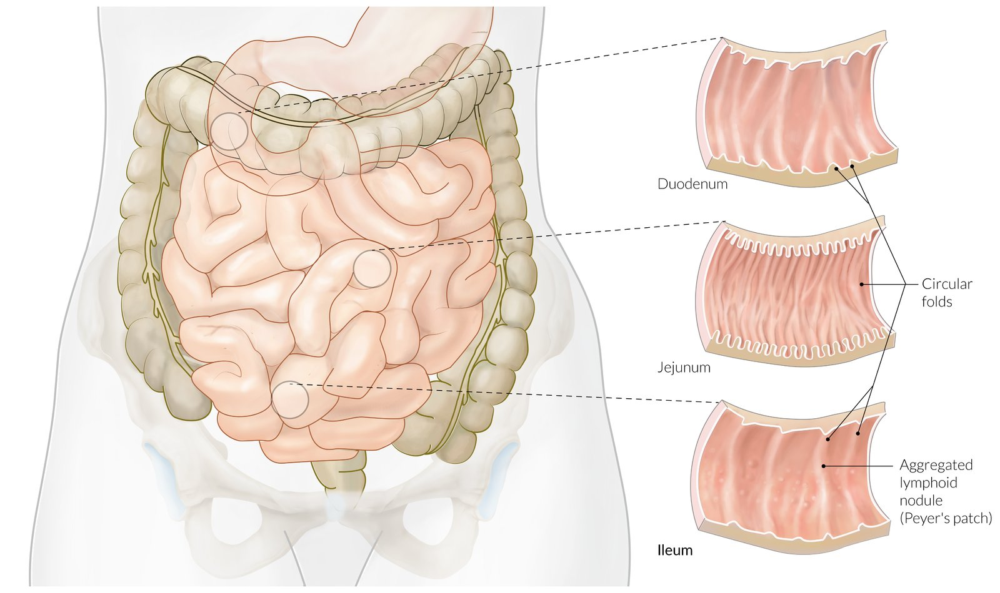

Plicae circulares

Gastric gland

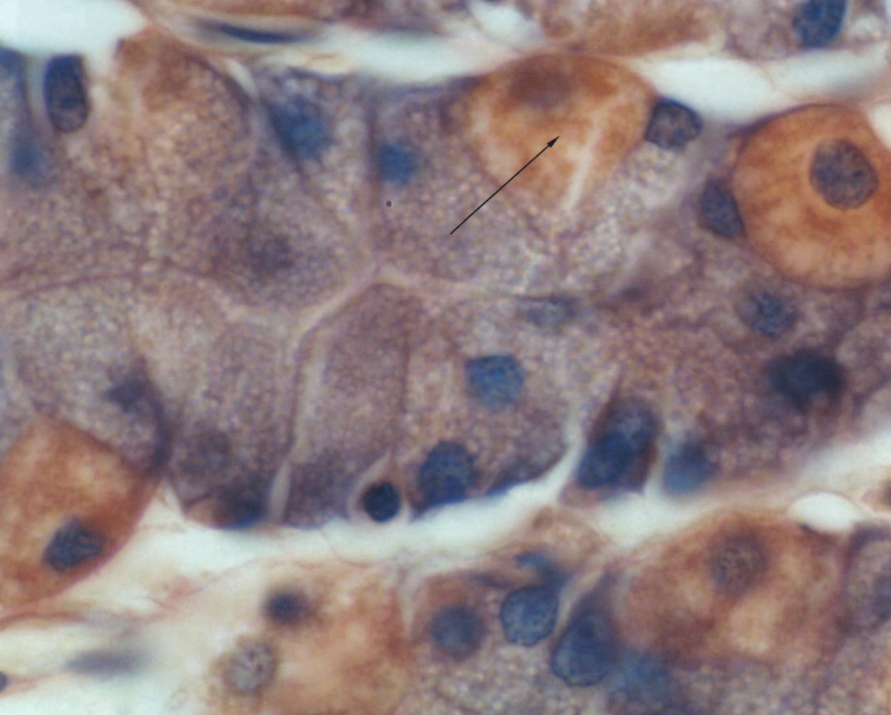

Parietal cells and chief cells

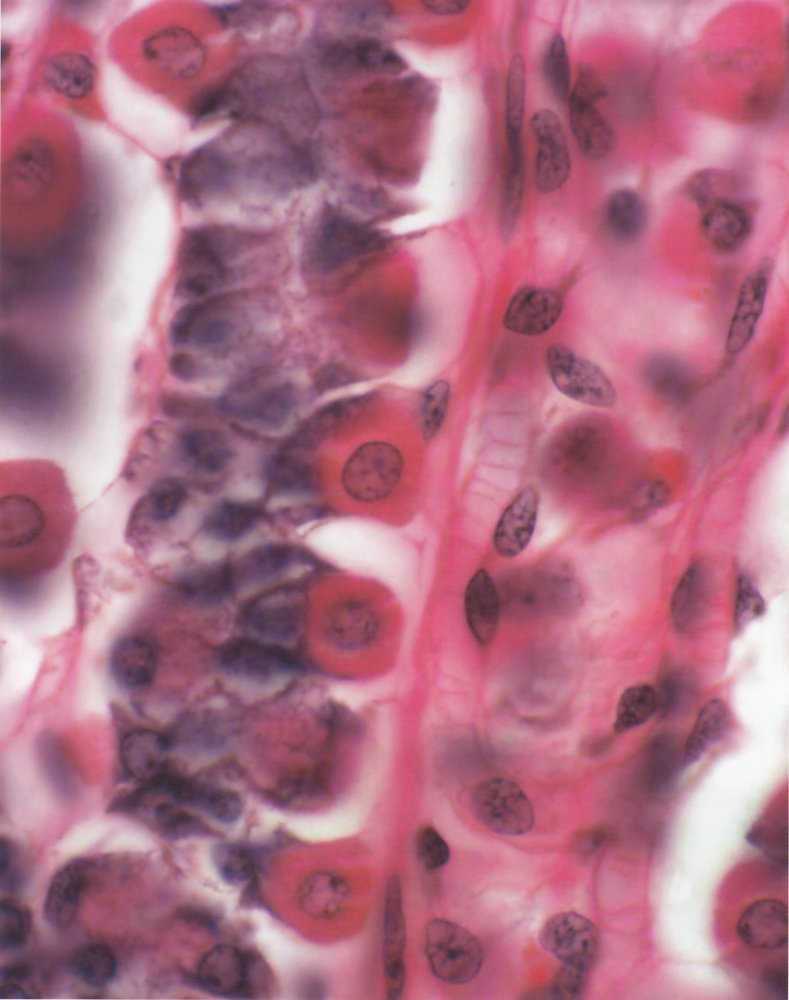

Gastric mucosa

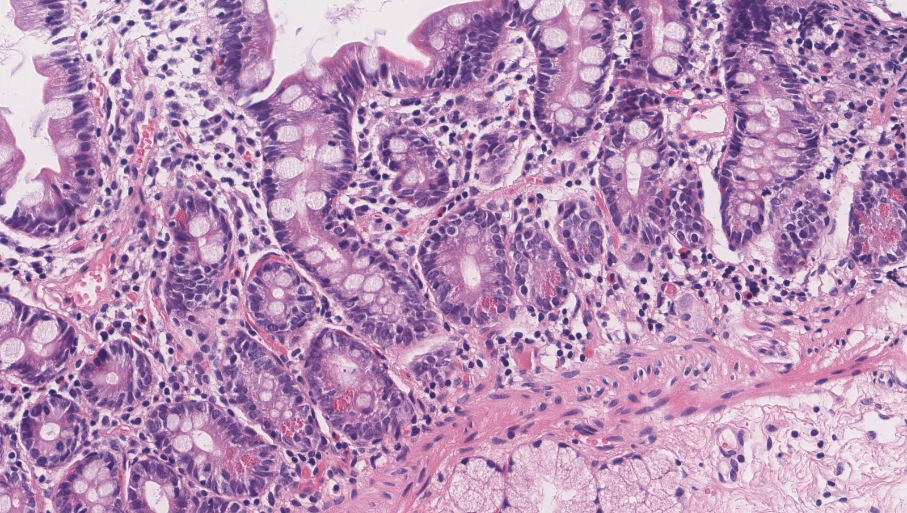

Paneth cells

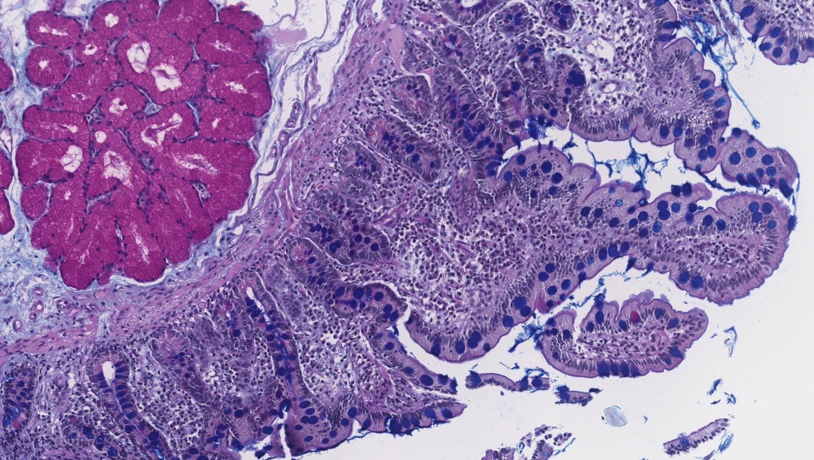

Brunner glands

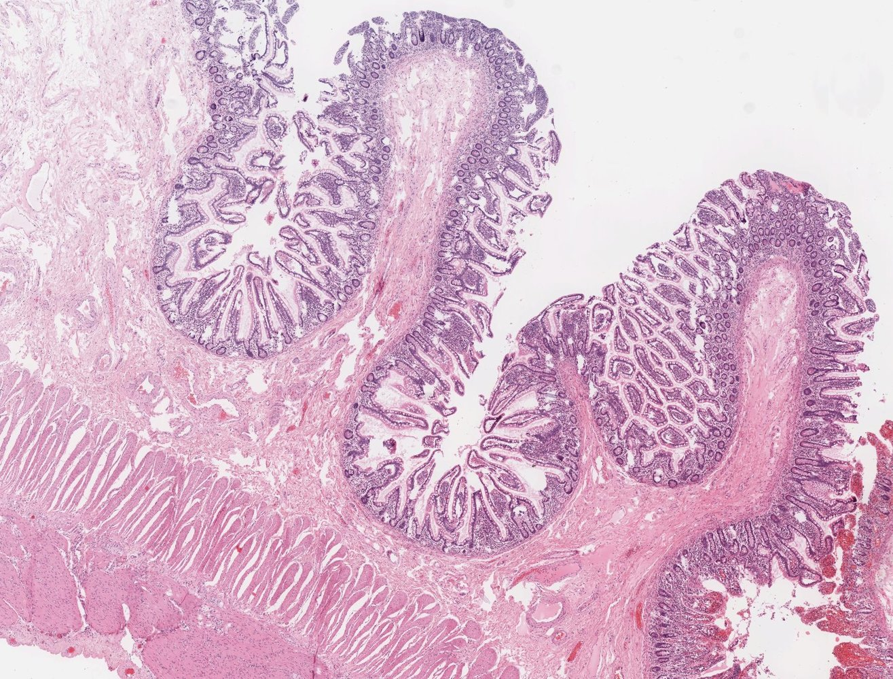

Jejunum

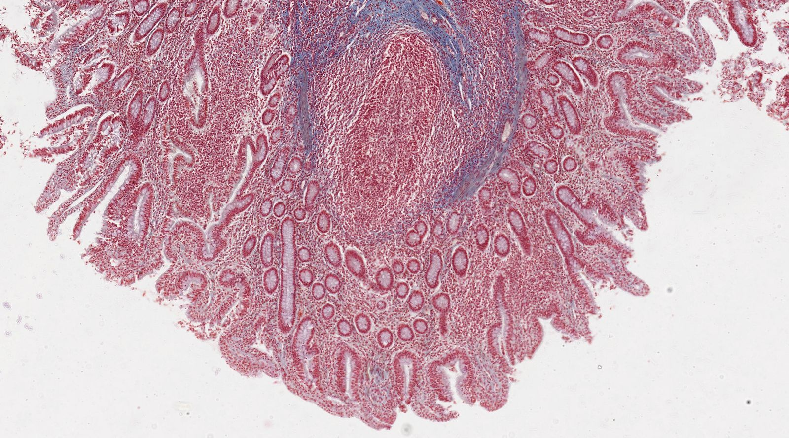

Peyer patches

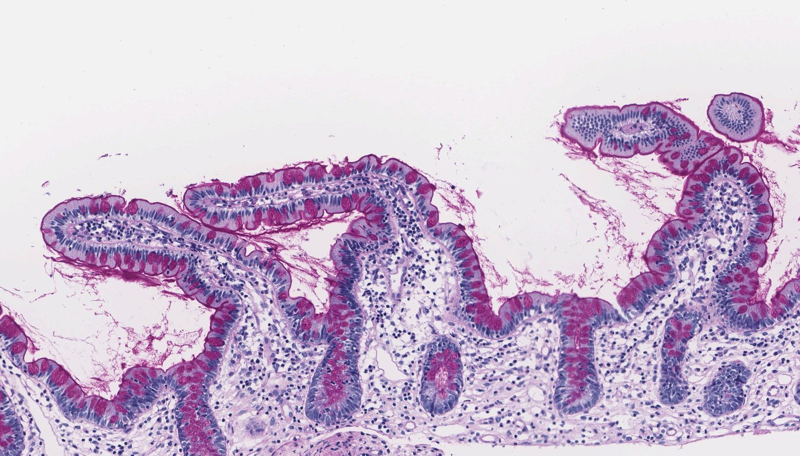

Goblet cells in the small intestine

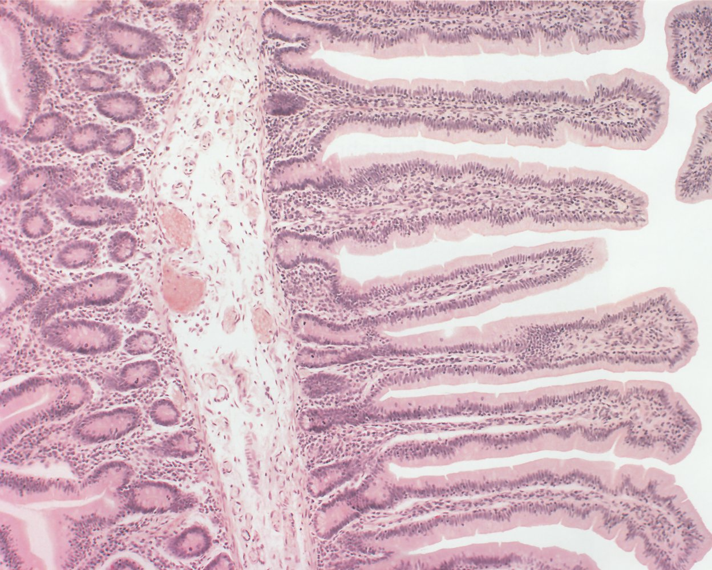

Intestinal mucosa and submucosa

Layers of the colonic wall

Colonic mucosa

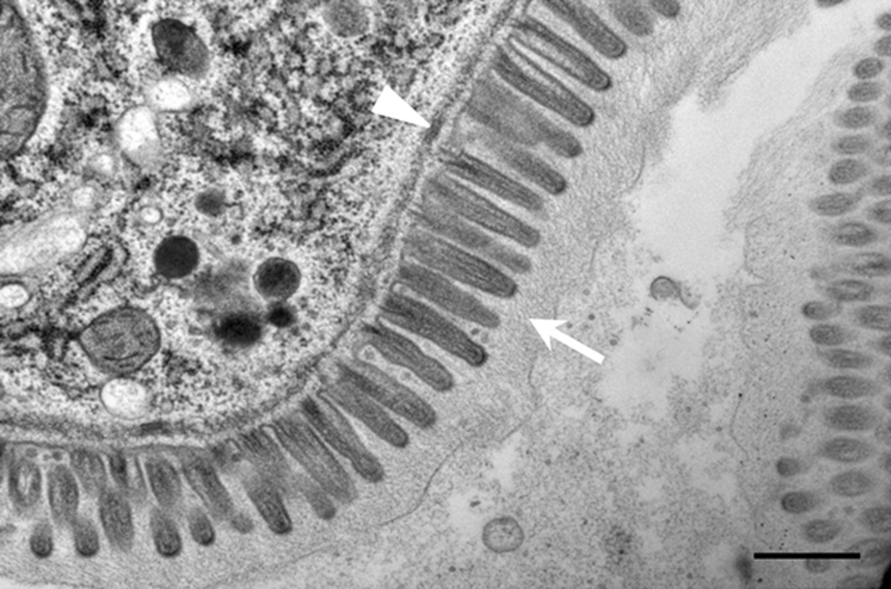

Brush border in enterocyte

Intestinal resorption

> [!NOTE]
> The Submucosal layer contains the MeiSSner plexus and produces Secretions.

> [!NOTE]
> Remember the layers of gut wall from inside to outside with MSMS: Mucosa, Submucosa, Muscularis propria, Serosa.

---

## Secretory and regulatory products of the gastrointestinal tract

| Hormones and secretions of the gastrointestinal tract |  |  |  |  |  |
| --- | --- | --- | --- | --- | --- |
| Products |  | Cell type | Function | Control |  |
| Stimulation | Inhibition |  |  |  |  |
| <u>Gastric secretory products</u> | Gastric acid (<u>hydrochloric acid</u>) |  * Gastric <u>parietal cells</u>   |   * ↓ <u>Stomach</u> <u>pH</u>  * Activates <u>pepsinogen</u> to <u>pepsin</u>  * Kills microorganisms (except <u>Helicobacter pylori</u>)    |   * <u>Vagus nerve</u> (<u>ACh</u>)  * <u>Gastrin</u>  * <u>Histamine</u>    |   * <u>GIP</u>  * <u>Prostaglandins</u>  * <u>Secretin</u>  * <u>Somatostatin</u>  * <u>Cholecystokinin</u>    |
| Intrinsic factor (IF; <u>vitamin B12</u> binding protein) |  * <u>Gastric parietal cells</u>   |  * Binds to <u>vitamin B12</u> and enables its absorption in the <u>terminal ileum</u>   |   * <u>Vagus nerve</u> (<u>ACh</u>)  * <u>Gastrin</u>  * <u>Histamine</u>    |   * <u>GIP</u>  * <u>Prostaglandins</u>  * <u>Secretin</u>  * <u>Somatostatin</u>    |  |
| Pepsin (converted from prohormone pepsinogen) |  * <u>Gastric chief cells</u>   |  * Protein digestion   |   * <u>Vagus nerve</u> (<u>ACh</u>)  * Low gastric <u>pH</u>    |   * High gastric <u>pH</u>  * <u>Somatostatin</u>    |  |
| Bicarbonate |   * <u>Mucosal</u> cells (<u>salivary glands</u>, <u>stomach</u>, <u>pancreas</u>, <u>duodenum</u>)  * <u>Brunner glands</u> (<u>duodenum</u>)    |  * Neutralizes <u>gastric acid</u>   |  * <u>Secretin</u>   |  * None   |  |
| <u>Gastric regulatory products</u> | Gastrin |  * G cells (<u>antrum</u> of the <u>stomach</u>, <u>duodenum</u>)   |   * ↑ Gastric acid secretion  * ↑ Gastric motility  * <u>Proliferation</u> of the gastric <u>mucosa</u>    |   * <u>Vagus nerve</u> (via gastrin-releasing peptide and <u>GRP</u> released from presynaptic terminals of <u>postganglionic</u> fibers)  * <u>Amino acids</u> and <u>peptides</u>  * Decreased acidity  * Distention of the <u>stomach</u>  * Chronic <u>PPI</u> administration    |   * <u>Somatostatin</u>  * Gastric <u>pH</u> < 1.5    |
| Ghrelin |  * <u>P/D1 cells</u> (<u>stomach</u>)   |   * ↑ Appetite and hunger (<u>lateral hypothalamus</u>) [[5]](https://coursology-qbank.com/amboss/article/nPY726)  * ↑ <u>Neuropeptide Y</u> release (arcuate <u>nucleus</u> of <u>hypothalamus</u>)  * ↑ <u>Growth hormone</u> release (<u>anterior pituitary</u>)  * ↑ Gastric motility [[6]](https://coursology-qbank.com/amboss/article/LPYw26)    |   * <u>Fasting</u>  * <u>Sleep deprivation</u>    |  * <u>Stomach</u> distention (food intake)   |  |
| <u>Histamine</u> |  * <u>Enterochromaffin-like cells</u> (<u>stomach</u>)   |  * ↑ Gastric acid secretion   |  * <u>Gastrin</u>   |  * <u>Somatostatin</u>   |  |
| Small intestinal regulatory products | Cholecystokinin |  * <u>I cells</u> (<u>duodenum</u>, <u>jejunum</u>)   |   * ↑ Contraction of the <u>gallbladder</u>  * ↑ Secretion of <u>pancreatic enzymes</u> by acting on neural muscarinic pathways  * ↑ Relaxation of the <u>sphincter of Oddi</u>  * ↓ Gastric emptying    |  * <u>Postprandial</u>: <u>fatty acids</u> and <u>amino acids</u> entering the <u>small intestine</u>   |   * <u>Somatostatin</u>  * <u>Fasting</u>    |
| Somatostatin |   * <u>D cells</u> (<u>duodenum</u>, <u>pancreas</u>)  * <u>Hypothalamus</u>    |   * Inhibits gastrointestinal secretions  * ↓ <u>Gastric acid</u>  * ↓ <u>Gastrin</u>  * ↓ <u>Pepsinogen</u>  * ↓ <u>Cholecystokinin</u>  * ↓ <u>Secretin</u>  * ↓ <u>Pancreatic</u> secretions (<u>VIP</u>, <u>glucagon</u>, <u>insulin</u>)  * ↓ <u>Gastric inhibitory polypeptide</u>  * Inhibits <u>gall bladder</u> contraction  * Decreases motility of the <u>stomach</u> and intestine  * Causes <u>splanchnic</u> <u>vasoconstriction</u>  [[7]](https://coursology-qbank.com/amboss/article/lJXv8_)  * Decreases <u>growth hormone</u> and <u>TSH</u> secretion    |  * <u>Postprandial</u>: <u>gastric acid</u>, <u>fatty acids</u>, and <u>amino acids</u> entering the <u>duodenum</u>   |  * <u>Vagus nerve</u> (<u>ACh</u>)   |  |
| Secretin |  * <u>S cells</u> (<u>duodenum</u>)   |   * ↑ Secretion of <u>bile</u>  * ↑ <u>Pancreatic</u> secretion of <u>bicarbonate</u>, which neutralizes the acidic <u>chyme</u> arriving from the <u>stomach</u> (necessary for <u>pancreatic enzyme</u> function)  * ↓ Secretion of <u>gastric acid</u>    |  * <u>Postprandial</u>: ↑ <u>gastric acid</u> and <u>fatty acids</u> in the <u>duodenum</u>   |  * <u>Somatostatin</u>   |  |
| Gastric inhibitory polypeptide (<u>GIP</u>) |  * <u>K cells</u> (<u>duodenum</u>, <u>jejunum</u>)   |   * ↑ <u>Insulin</u> secretion (more pronounced with the administration of oral <u>glucose</u> compared to intravenous <u>glucose</u>)  * ↓ Secretion of <u>gastric acid</u>    |  * <u>Postprandial</u>: <u>fatty acids</u>, <u>glucose</u>, <u>amino acids</u> entering <u>small intestine</u>   |  * <u>Fasting</u>   |  |
| Motilin |  * <u>Mo cells</u> (<u>small intestine</u>)   |  * Produces <u>migratory motor complexes</u> (↑ intestinal motility)   |  * <u>Fasting</u>   |  * Intake of food   |  |
| Vasoactive intestinal peptide (<u>VIP</u>) |   * <u>Small intestine</u>  * <u>Gallbladder</u>  * <u>Parasympathetic</u> <u>neurons</u> in sphincters  * <u>APUD cells</u> of the <u>pancreas</u>    |   * ↑ Secretion of water and <u>electrolytes</u>  * ↑ Relaxation of intestinal sphincters and <u>smooth muscle</u>    |   * Distention of the <u>stomach</u>  * <u>Vagal</u> stimulation    |  * <u>Sympathetic</u> activity   |  |
|  <u>Nitric oxide</u> (NO) [[8]](https://coursology-qbank.com/amboss/article/lmYvfp) |   * <u>Epithelial</u> cells  * <u>Smooth muscle cells</u>  * Neural cells    |   * Relaxation of <u>smooth muscle</u> and sphincters (e.g., <u>LES</u>)  * Improves circulation (<u>vasodilatory</u> property)    |  * -   |  * -   |  |

The secretions of the <u>pancreas</u> are also involved in digestion. For a description of these, see “<u>Exocrine pancreas</u>” and “<u>Endocrine pancreas</u>.”

> [!NOTE]
> Autoimmune destruction of parietal cells → ↓ intrinsic factor production → ↓ absorption of B12 in the terminal <u>ileum</u> → <u>pernicious anemia</u>

> [!NOTE]
> Elevated serum <u>gastrin</u> levels can be used to support the diagnoses of <u>atrophic gastritis</u> and <u>Zollinger-Ellison</u> syndrome.

> [!NOTE]
> <u>Ghrelin</u> is increased in <u>Prader-Willi</u> syndrome and decreased following <u>gastric bypass surgery</u>.

> [!NOTE]
> Ghrelin causes greed for food.

> [!NOTE]
> The <u>antibiotic</u> <u>erythromycin</u> belongs to the class of drugs called <u>motilin</u> <u>agonists</u>, which can induce <u>peristalsis</u> and increase gastric emptying.

> [!NOTE]
> <u>Octreotide</u>, a <u>somatostatin analog</u>, is used to treat bleeding <u>esophageal varices</u>, <u>gastrinomas</u>, severe noninfectious <u>diarrhea</u> (e.g., <u>chemotherapy-induced diarrhea</u>, <u>carcinoid syndrome</u>), <u>glucagonoma</u>, and <u>acromegaly</u>.

> [!NOTE]
> <u>VIPoma</u> is a <u>VIP</u>-secreting <u>tumor</u> that can manifest with WDHA syndrome: Watery Diarrhea, Hypokalemia, and Achlorhydria.

> [!NOTE]
> In <u>achalasia</u>, degeneration of inhibitory <u>neurons</u> within the myenteric plexuses (Auerbach plexus) → deficient inhibitory <u>neurotransmitters</u> such as <u>nitric oxide</u> and vasoactive intestinal <u>peptide</u> → higher resting pressures of the <u>lower esophageal sphincter</u>.

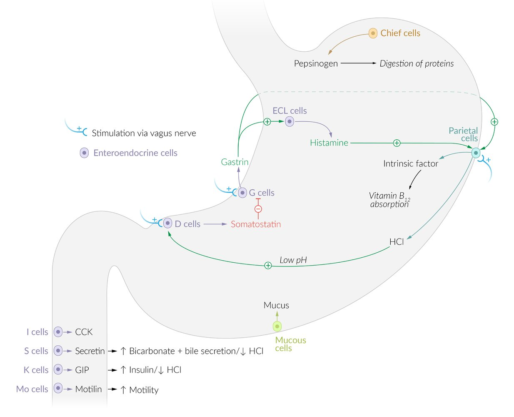

Regulation of gastric acid secretion

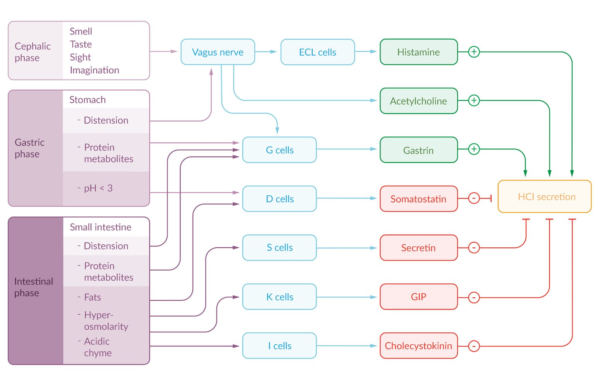

Phases of gastric acid secretion

Gastroprotective therapy

---

## Embryology

* Primitive gut tube : Most of the gastrointestinal tract is derived from the <u>primitive gut tube</u>, which is a derivative of the <u>endodermal</u> lining of the <u>yolk sac</u>; ; :  following craniocaudal and <u>lateral</u> embryonic folds. (See “Morphogenesis” in the article on <u>embryogenesis</u>.) 

* 4th week of development: The three regions of the <u>primitive gut tube</u> become distinguishable (i.e., <u>foregut</u>, <u>midgut</u>, and <u>hindgut</u>), and each region has its own neurovascular supply.

* Most organs of the gastrointestinal tract are derived from these three regions. (See “<u>Foregut, midgut, and hindgut derivatives and corresponding neurovascular structures</u>” above.)

* Non-gut tube derivatives

* <u>Buccopharyngeal membrane</u>: <u>oral cavity</u>

* <u>Cloacal membrane</u>: the <u>anal canal</u> <u>distal</u> to the <u>pectinate line</u>

* <u>Dorsal</u> <u>mesentery</u>: <u>spleen</u>, <u>dorsal</u> <u>pancreatic</u> bud, the <u>gastrosplenic ligament</u>, <u>splenorenal ligament</u>, and the <u>greater omentum</u>

* <u>Ventral</u> <u>mesentery</u>: <u>liver</u>, <u>ventral</u> <u>pancreatic</u> bud, the <u>falciform ligament</u>, and the <u>lesser omentum</u>

* Somatic <u>mesoderm</u>: <u>parietal peritoneum</u>

* <u>Splanchnic</u> <u>mesoderm</u>: <u>visceral peritoneum</u>

* Germ <u>layers of the gastrointestinal tract</u>

* <u>Endoderm</u>  : <u>epithelium</u> and <u>mucosal</u> glands of the gastrointestinal tract and the <u>parenchyma</u> of the <u>liver</u> and <u>pancreas</u> (the splenic <u>parenchyma</u> is derived from <u>mesoderm</u>.)

* <u>Mesoderm</u>: <u>lamina propria</u>, <u>muscularis mucosa</u>, <u>submucosa</u>, and muscularis propria

* <u>Ectoderm</u> (<u>neural crest cells</u>): <u>enteric nervous system</u>

* Rotation of the foregut: 90° clockwise around its <u>longitudinal axis</u> (between the 4th and 6th week of development)

* The <u>anterior</u> border forms the <u>lesser curvature</u> and the <u>posterior</u> border forms the <u>greater curvature of the stomach</u>.

* The <u>liver</u> and <u>duodenum</u> move to the right, while the <u>spleen</u> and <u>pancreas</u> move to the left of the <u>abdominal cavity</u>.

* The left <u>vagus nerve</u> is then <u>anterior</u> to the <u>stomach</u>, while the right vagus is <u>posterior</u> to it.

* Rotation of the midgut: 270° counterclockwise around the <u>superior mesenteric artery</u> (SMA)  
1. * 4th week: <u>midgut</u> elongation in utero
2. * 6th week: physiological <u>herniation</u> of the <u>midgut</u> out of the umbilical ring;   → 90° counter-clockwise rotation
3. * 10th week: reentry of the <u>midgut</u> into the abdominal cavity → 180° rotation around the <u>superior mesenteric artery</u> inside the <u>abdominal cavity</u> (for a total of 270°)  → fixation of the <u>duodenojejunal flexure</u> and <u>cecum</u> to the <u>posterior</u> abdominal wall

> [!NOTE]
> <u>Omphalocele</u> is caused by a failure of the <u>midgut</u> to return to the <u>abdominal cavity</u> after its physiological <u>herniation</u> through the umbilical ring. Accordingly, the <u>amniotic membrane</u> and <u>peritoneum</u> form the hernial sac of the <u>omphalocele</u>.

> [!NOTE]
> <u>Gastroschisis</u> is caused by a developmental defect of the abdominal wall through which intestinal loops herniate out directly (i.e., the hernial sac is absent).

> [!NOTE]
> A <u>congenital umbilical hernia</u> is caused by a protrusion of intra-abdominal contents through a patent umbilical orifice. The <u>peritoneum</u> is the hernial sac of an <u>umbilical hernia</u>.

Primitive gut (4th week of development)

Endodermal development

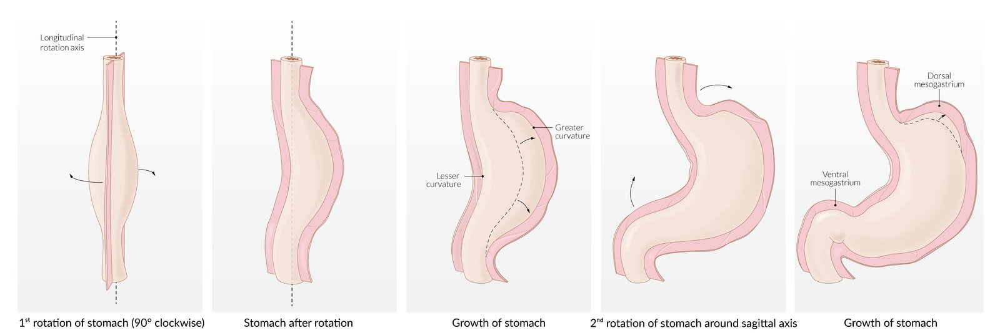

Rotation of the stomach

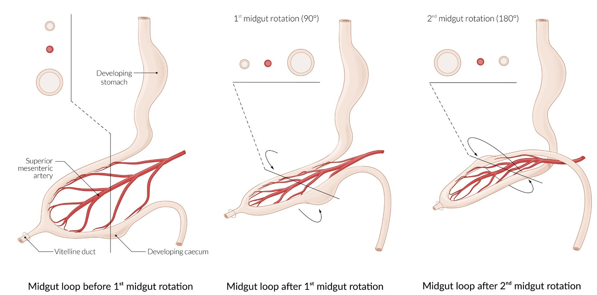

Intestinal rotation

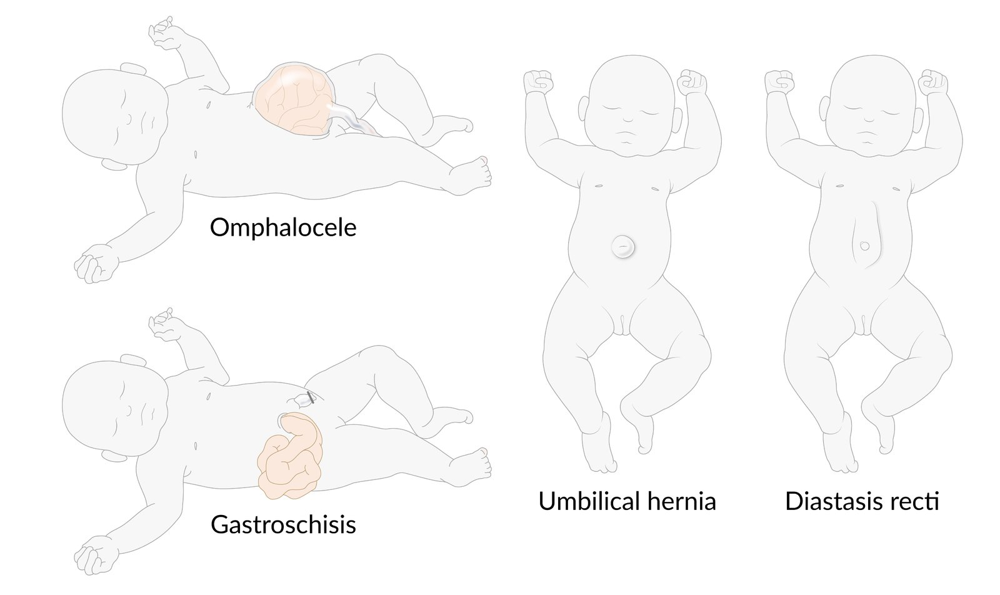

Congenital malformations of the anterior abdominal wall

---

## Clinical significance

* See “Clinical significance” of the:

* <u>Esophagus</u>

* <u>Stomach</u>

* <u>Small intestine</u>

* <u>Large intestine</u>

* <u>Liver</u>

* <u>Pancreas</u>

* <u>Oral cavity</u> and <u>teeth</u>

* <u>Gall bladder</u> and <u>bile</u>

* <u>Diseases of the salivary glands</u>

* <u>Spontaneous bacterial peritonitis</u>

* <u>Ascites</u>

* <u>Neuroendocrine tumor</u>

* <u>Esophageal atresia</u>

---