# Large intestine

*Categories: Clinical knowledge > Internal medicine > Gastroenterology > Basics of gastroenterology > Large intestine*

[Original Article Link](https://coursology-qbank.com/amboss/article/R60lkS)

---

## Summary

The large intestine is the terminal portion of the <u>gastrointestinal tract</u> and is derived from the <u>midgut</u>, <u>hindgut</u>, and cloaca. Derivatives of the <u>midgut</u> include the <u>cecum</u>, <u>appendix</u>, <u>ascending colon</u>, and <u>proximal</u> two-thirds of the <u>transverse colon</u>. Derivatives of the <u>hindgut</u> include the <u>descending colon</u>, <u>sigmoid colon</u>, <u>rectum</u>, <u>distal</u> third of the <u>transverse colon</u>, and the portion of the <u>anal canal</u> <u>above the pectinate line</u>. The portion of the <u>anal canal</u> <u>distal</u> to the <u>pectinate line</u> is derived from the cloaca (<u>ectoderm</u>). The <u>superior mesenteric artery</u> supplies the <u>midgut</u> and the <u>inferior mesenteric artery</u> supplies the <u>hindgut</u>. The <u>veins</u> of the <u>midgut</u> and <u>hindgut</u> derivatives drain into the <u>portal vein</u>. The <u>distal</u> <u>anal canal</u> is supplied by the <u>internal pudendal artery</u> and drains into the <u>inferior vena cava</u>. The <u>mesenteric</u> <u>lymph nodes</u> receive <u>lymphatic drainage</u> from the <u>colon</u>. The internal iliac and <u>inguinal lymph nodes</u> drain <u>lymph</u> from the <u>rectum</u> and <u>anal canal</u>. The large intestine is innervated by the <u>autonomic nervous system</u> (<u>mesenteric</u> plexus), except for the <u>distal</u> <u>anal canal</u>, which receives somatic innervation from the <u>pudendal nerve</u>. The <u>mucosa</u> of the large intestine is <u>columnar epithelium</u>, except for the <u>distal</u> <u>anal canal</u>, which is lined with <u>stratified</u> <u>squamous epithelium</u>. The main functions of the large intestine are the absorption of <u>sodium</u> and water, excretion of <u>potassium</u> and <u>bicarbonate</u>, synthesis of <u>vitamin K</u> and group B <u>vitamins</u> (by the <u>colonic</u> bacteria), and the storage and expulsion of feces.

Organ fact sheet: large intestine

---

## Gross anatomy

### Overview

The large intestine is the terminal portion of the <u>gastrointestinal tract</u> and is approx. 5 ft long. The large intestine is divided into the <u>cecum</u> and <u>appendix</u>, the <u>ascending colon</u>, <u>transverse colon</u>, <u>descending colon</u>, <u>sigmoid colon</u>, <u>rectum</u>, and <u>anal canal</u>.

### Function [[1]](https://coursology-qbank.com/amboss/article/0NYe-6)

* Absorbs water and <u>electrolytes</u>

* Absorbs <u>vitamins</u>

* Eliminates feces

### Subdivisions of the large intestine

#### Cecum

* <u>Intraperitoneal</u>

* U-shaped, sac-like structure located in the right iliac fossa

* The three taeniae coli converge at the base of the <u>cecum</u>.

* Receives <u>chyme</u> through the <u>ileocecal junction</u>

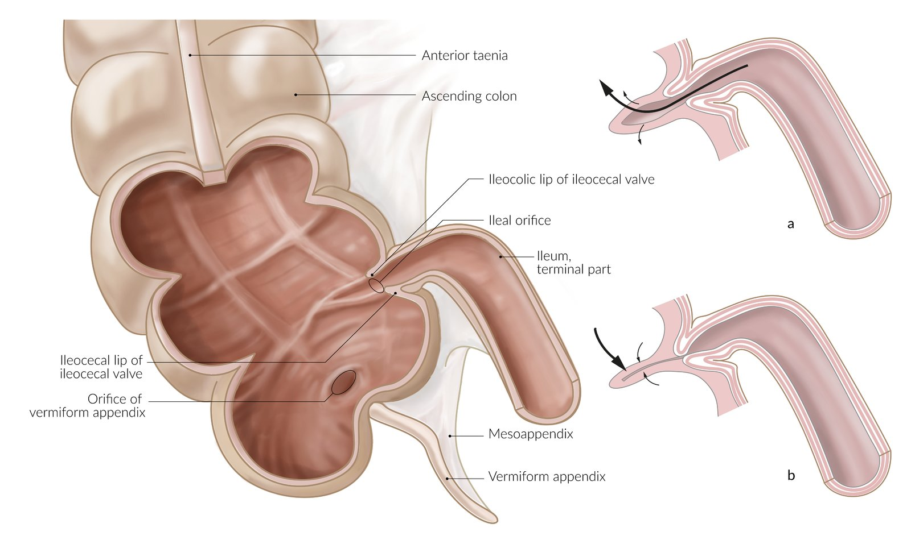

Ileal orifice and ileocaecal valve

#### Vermiform appendix[[2]](https://coursology-qbank.com/amboss/article/IlYYy6)

* <u>Intraperitoneal</u>

* Blind tubular structure that arises from the base of the <u>cecum</u>

* Located in the right iliac fossa

* The position of its free end is variable.

* The most common position is retrocecal

* Other positions include paracecal , preileal , postileal , and <u>pelvic</u>

> [!NOTE]
> <u>McBurney point</u> represents where the base of the <u>appendix</u> lies in the right iliac fossa. Tenderness at this point is a sign of <u>acute appendicitis</u>.

#### Colon

* Connects the <u>cecum</u> proximally and the <u>rectum</u> distally

* Ascending colon

* <u>Retroperitoneal</u>

* Ascends along the right posterolateral abdominal wall from the <u>cecum</u> up to the right subcostal region, where it makes a 90° turn to the left (hepatic flexure)

* Transverse colon

* <u>Intraperitoneal</u>

* Extends from the hepatic flexure to the <u>splenic hilum</u>, where it makes a 90° turn <u>caudally</u> (splenic flexure)

* Descending colon

* <u>Retroperitoneal</u>

* Descends along the left posterolateral abdominal wall from the <u>splenic flexure</u> to the left iliac fossa

* Sigmoid colon

* <u>Intraperitoneal</u>

* The S-shaped terminal portion of the <u>descending colon</u> located in the left iliac fossa

* Extends up to the <u>S3</u> <u>vertebra</u>

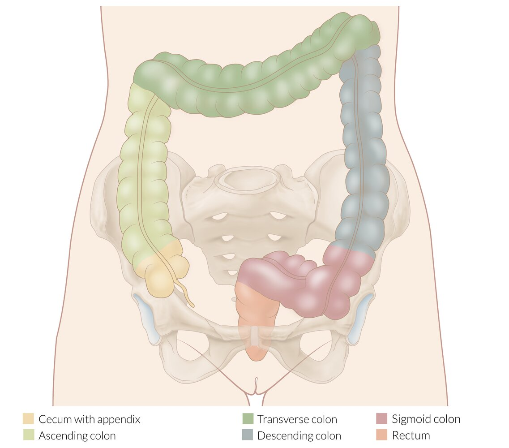

Parts of the colon

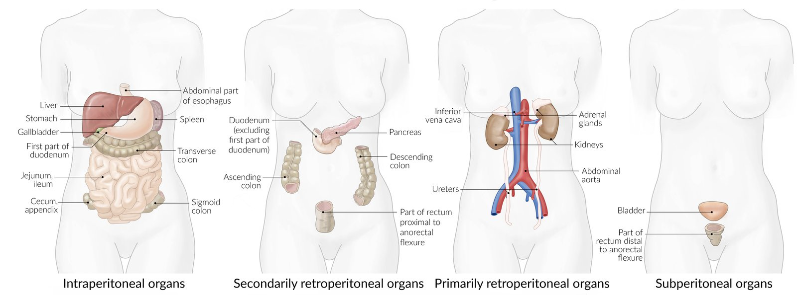

Peritoneal localization of abdominal organs

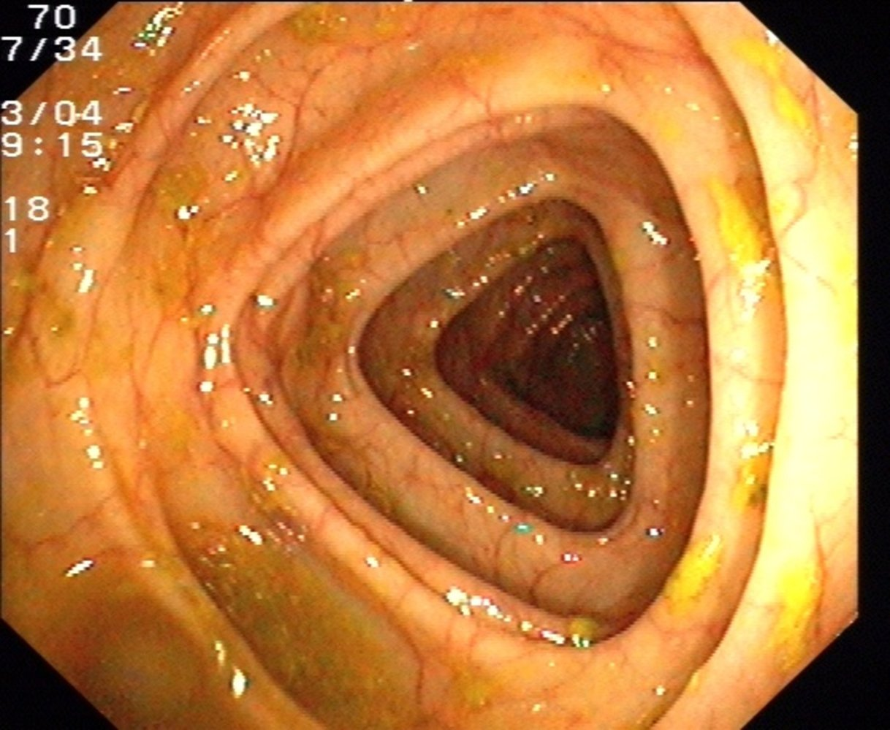

Normal transverse colon

> [!NOTE]
> The <u>intraperitoneal</u> parts of the large intestine (i.e., the <u>cecum</u>, <u>transverse colon</u>, and <u>sigmoid colon</u>) are susceptible to <u>volvulus</u>.

#### Rectum

* Partially <u>retroperitoneal</u>; does not have a <u>mesentery</u>

* Extends from the <u>S3</u> <u>vertebra</u> to the <u>anorectal junction</u>

* The <u>peritoneum</u> on the <u>anterior</u> rectal wall reflects anteriorly onto the <u>bladder</u> in males and the <u>uterus</u> in females, forming a blind pouch.

* <u>Rectovesical pouch</u> (in males): separates the <u>anterior</u> wall of the <u>rectum</u> from the <u>posterior</u> wall of the <u>bladder</u>, the <u>prostate</u>, the <u>seminal vesicles</u>, and <u>vas deferens</u>

* <u>Rectouterine pouch</u> (in females): separates the <u>anterior</u> wall of the <u>rectum</u> from the <u>posterior</u> wall of the <u>uterus</u> and upper <u>vagina</u>

* Anorectal junction

* Located at the <u>pelvic diaphragm</u>

* Anorectal flexure

* <u>Puborectalis muscle</u> forms a sling around the <u>anorectal junction</u>, forming a <u>posterior</u> curve

* Contributes to fecal continence

Female pelvic organs

Free fluid in rectouterine pouch of Douglas

Median section of the male pelvis with detail of a testicle

> [!NOTE]
> Because the rectovesical (m)/rectouterine (f) pouch is the most <u>caudal</u> aspect of the <u>peritoneal cavity</u>, fluids (e.g., ascitic fluid, blood, <u>pus</u>) tend to collect in this space.

#### Anal canal

* Extraperitoneal

* The terminal part of the <u>gastrointestinal tract</u>

* Approx. 4 cm long

* Extends from the <u>anorectal junction</u> at the <u>pelvic diaphragm</u> to the anal orifice

* Pectinate line (<u>dentate line</u>)

* A circumferential scalloped line formed by the <u>anal valves</u> at the inferior end of the <u>anal columns</u>

* Divides the <u>anal canal</u> into <u>proximal</u> and <u>distal</u> thirds

|  | <u>Proximal</u> to the <u>pectinate line</u> | <u>Distal</u> to the <u>pectinate line</u> |
| --- | --- | --- |
| Embryologic origin |  * <u>Endoderm</u> (from the <u>hindgut</u>)   |  * <u>Ectoderm</u> (from the cloaca)   |
| <u>Epithelium</u> |  * Simple <u>columnar epithelium</u>   |  * <u>Squamous epithelium</u>   |
| Arterial supply |  * <u>Superior rectal artery</u>   |   * Branches of the <u>middle rectal artery</u>  * <u>Inferior rectal artery</u>    |
| Venous drainage |  * Portal system   |  * Caval system   |
| <u>Lymphatic drainage</u> |  * <u>Internal iliac lymph nodes</u>   |  * <u>Superficial inguinal lymph nodes</u>   |
| Innervation |   * <u>Visceral</u>: <u>inferior mesenteric plexus</u> (<u>inferior hypogastric plexus</u>)  * Not sensitive to <u>pain</u>    |   * Somatic: inferior rectal branch of the <u>pudendal nerve</u> (<u>S2</u>–<u>S4</u>)  * Sensitive to <u>pain</u>    |

* Internal anal sphincter

* An involuntary <u>smooth muscle</u> sphincter

* Innervated by the <u>autonomic nervous system</u>

* External anal sphincter

* Voluntary <u>skeletal muscle</u> sphincter

* Innervated by the somatic nervous system (inferior rectal branch of the <u>pudendal nerve</u>)

* Anal glands lie in the intersphincteric groove between the internal and external anal sphincters.

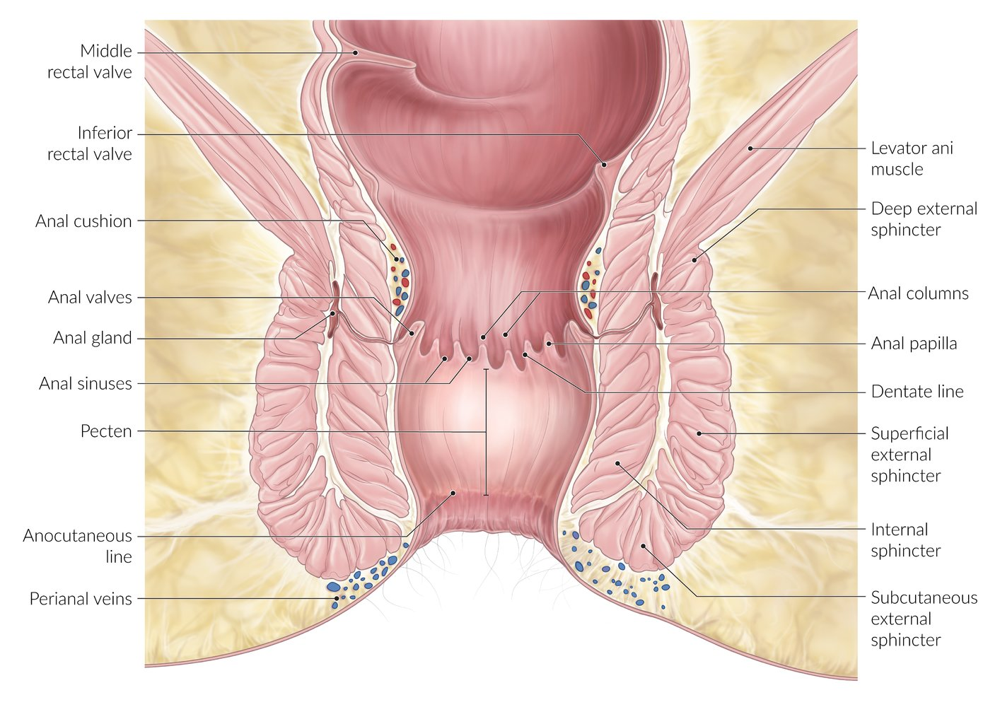

Anal canal

> [!NOTE]
> <u>Internal hemorrhoids</u> occur <u>above the pectinate line</u> (<u>superior rectal vein</u>) and are not painful (<u>visceral</u> innervation). <u>External hemorrhoids</u> occur <u>below the pectinate line</u> and are painful because the <u>pudendal nerve</u> provides this area with somatic innervation.

> [!NOTE]
> The <u>pudendal nerve</u> (<u>S2</u>–<u>S4</u>) innervates the <u>external anal sphincter</u>. Injury to this nerve (e.g., during <u>childbirth</u>) can cause <u>fecal incontinence</u> and perianal sensory loss.

### Vasculature and innervation of the large intestine [[3]](https://coursology-qbank.com/amboss/article/aNYQ-6)

|  |  |  <u>Arteries</u>   |  <u>Veins</u>   | <u>Lymphatics</u> | Innervation |
| --- | --- | --- | --- | --- | --- |
|  <u>Midgut</u> derivatives <u>Cecum</u>, <u>appendix</u>, <u>ascending colon</u>, <u>proximal</u> 2/3 of the <u>transverse colon</u>  |  |  * Branches of the superior mesenteric artery (SMA)   |  * Branches of the <u>superior mesenteric vein</u> → <u>portal vein</u>   |  * <u>Superior mesenteric lymph nodes</u>: <u>colon</u> to <u>splenic flexure</u>   |  * <u>Visceral</u>: <u>superior mesenteric plexus</u>   |
|  <u>Hindgut</u> derivatives <u>Distal</u> 1/3 of the <u>transverse colon</u>, <u>descending colon</u>, and <u>sigmoid colon</u>  |  |  * Branches of the inferior mesenteric artery (<u>IMA</u>)   |  * <u>Left colic vein</u> and <u>sigmoid veins</u> drain into the <u>inferior mesenteric vein</u> → <u>splenic vein</u> → <u>portal vein</u>   |  * <u>Inferior mesenteric lymph nodes</u>: <u>colon</u> from <u>splenic flexure</u> to upper <u>rectum</u>   |  * <u>Visceral</u>: <u>inferior mesenteric plexus</u>   |
| <u>Rectum</u> and <u>anal canal</u> |  Above <u>pectinate line</u>   |  * <u>Superior rectal artery</u>   |  * <u>Superior rectal vein</u> → <u>inferior mesenteric vein</u> → <u>splenic vein</u> → <u>portal vein</u>   |  * <u>Internal iliac lymph nodes</u>   |  |
|  Below <u>pectinate line</u>   |   * <u>Middle rectal artery</u>  * Inferior rectal artery    |  * Middle and <u>inferior rectal vein</u> → <u>internal pudendal vein</u> → <u>internal iliac vein</u> → <u>common iliac vein</u> → <u>inferior vena cava</u>   |  * <u>Superficial inguinal lymph nodes</u>   |  * Somatic: inferior rectal branch of the <u>pudendal nerve</u> (<u>S2</u>–<u>S4</u>)   |  |

* <u>Watershed areas</u> of the <u>colon</u>:     [[4]](https://coursology-qbank.com/amboss/article/HlYKy6)

* The <u>splenic flexure</u> (Griffiths point): junction between the SMA and <u>IMA</u>, located between the <u>left colic artery</u> and the <u>marginal artery of Drummond</u>

* Rectosigmoid junction (Sudeck point): junction between the <u>IMA</u> and <u>internal iliac artery</u>, located between the last sigmoid branch of the <u>IMA</u> and the <u>superior rectal artery</u>

> [!NOTE]
> The <u>rectum</u> is a site of <u>portosystemic anastomosis</u>. <u>Rectal varices</u> develop in <u>portal hypertension</u> due to the shunting of venous blood from the <u>superior rectal vein</u> (portal system) to the middle and <u>inferior rectal veins</u> (systemic or caval circulation).

> [!NOTE]
> The <u>watershed areas</u> of the <u>splenic flexure</u> (<u>Griffiths point</u>) and rectosigmoid junction (<u>Sudeck point</u>) are the regions of the <u>colon</u> at highest risk of <u>ischemia</u> secondary to <u>hypoperfusion</u>.

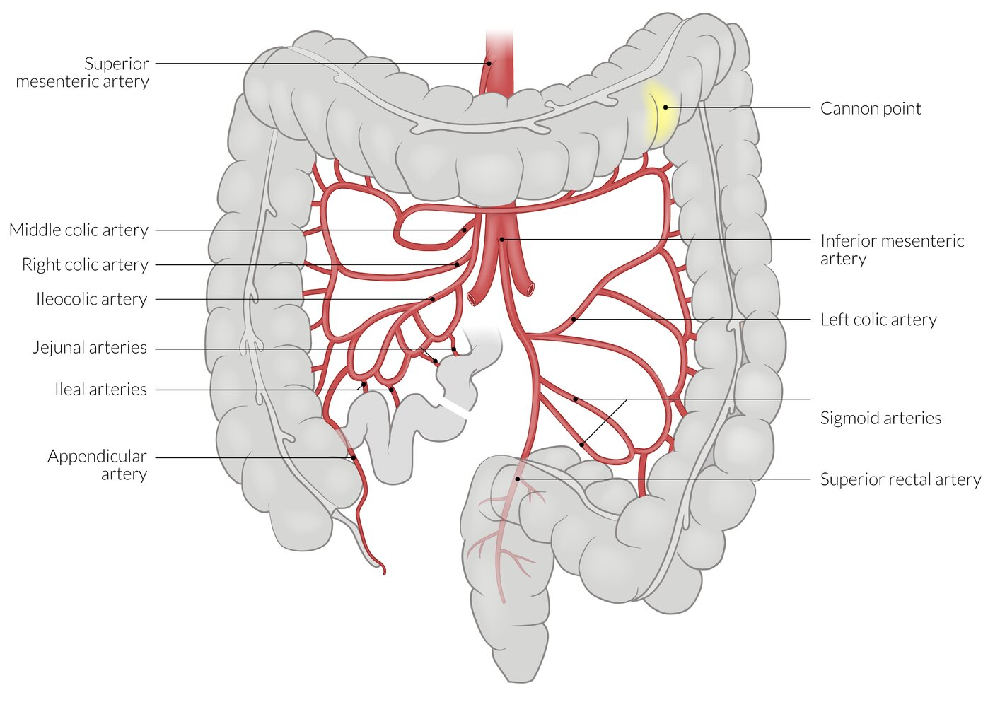

Arterial blood supply of the colon

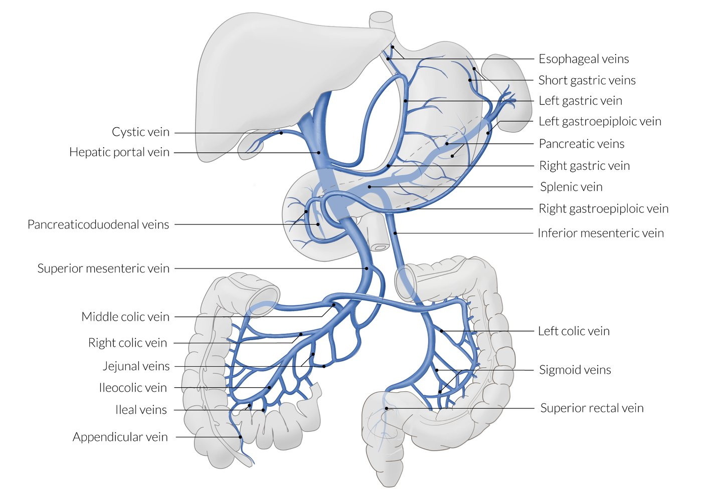

Tributaries of the hepatic portal vein

Watershed areas in colon ischemia

References:[[5]](https://coursology-qbank.com/amboss/article/KPYUf6)

---

## Microscopic anatomy

* The large intestine is composed of the same four histological <u>layers of the alimentary canal</u>

* Teniae coli and haustra 

* Only present in the muscularis propria of the <u>cecum</u> and <u>colon</u>

* Not present in the <u>sigmoid colon</u>, <u>rectum</u>, or <u>anal canal</u>

* Converge at the base of the <u>appendix</u>

|  |  | <u>Mucosa</u> | <u>Submucosa</u> | Muscularis propria | Serosa |
| --- | --- | --- | --- | --- | --- |
| <u>Cecum</u> and <u>colon</u> |  |   * Columnar <u>epithelial</u> lining  * Contains <u>intestinal glands</u> (<u>crypts of Lieberkuhn</u>) lined with <u>goblet cells</u>  * <u>Lamina propria</u> containing <u>mucosa-associated lymphoid tissue</u> (<u>MALT</u>)  * No villi    |   * <u>Collagen</u>, <u>elastic fibers</u>  * Contains <u>blood vessels</u> and the <u>Meissner plexus</u>    |   * Inner circular <u>smooth muscle</u> and bands of longitudinal <u>smooth muscle</u> (<u>teniae coli</u>) separated by the <u>Auerbach plexus</u>  * <u>Teniae coli</u> with <u>haustra</u>    |  * <u>Mesothelium</u> of the <u>visceral peritoneum</u>   |
| <u>Appendix</u> |  |  * Columnar <u>epithelial</u> lining   |   * Contains numerous lymphoid follicles that distort the <u>mucosal</u> crypts  * Contains <u>blood vessels</u> and the <u>Meissner plexus</u>    |   * Inner circular and outer longitudinal <u>smooth muscle</u> layers separated by the <u>Auerbach plexus</u>  * No <u>teniae coli</u>    |  |
| <u>Rectum</u> and <u>anal canal</u> | <u>Above the pectinate line</u> |  * Columnar <u>epithelial</u> lining   |   * <u>Collagen</u>, <u>elastic fibers</u>  * Contain <u>blood vessels</u> and the <u>Meissner plexus</u>  * Contain the internal hemorrhoidal plexus of veins    |   * Inner circular and outer longitudinal <u>smooth muscle</u> layers separated by the <u>Auerbach plexus</u>  * No <u>teniae coli</u>    |  * Adventitial tissue; no serosa   |
| <u>Below the pectinate line</u> |   * <u>Stratified</u> squamous <u>epithelial</u> lining  * Transitions to <u>keratinized stratified squamous epithelium</u> toward the anal orifice  * No <u>crypts of Lieberkuhn</u>    |  * Contain the external hemorrhoidal plexus of veins   |   * The inner circular layer of <u>smooth muscle</u> forms the <u>internal anal sphincter</u>.  * No <u>teniae coli</u>    |  |  |

> [!NOTE]
> Anal cancers are typically <u>adenocarcinomas</u> <u>above the pectinate line</u> and <u>squamous cell carcinomas</u> <u>below the pectinate line</u>.

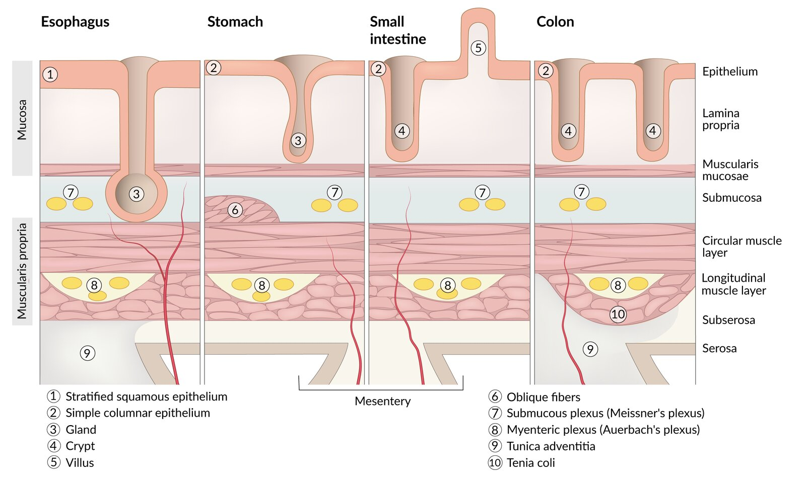

Histological layers of the gastrointestinal tract

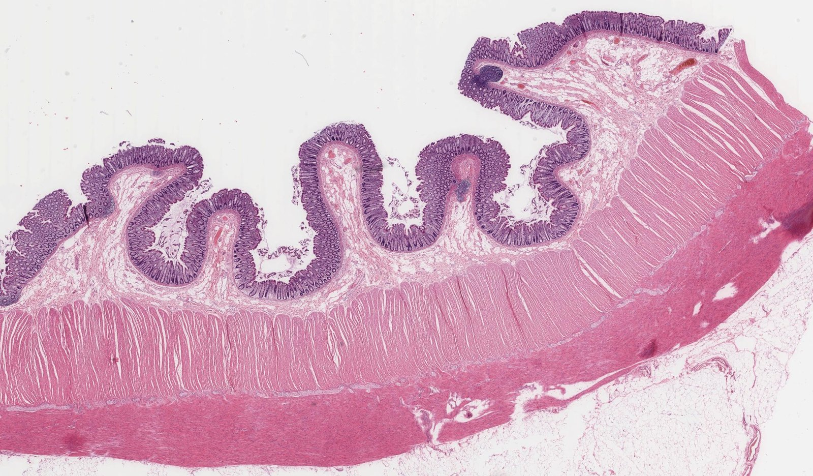

Layers of the colonic wall

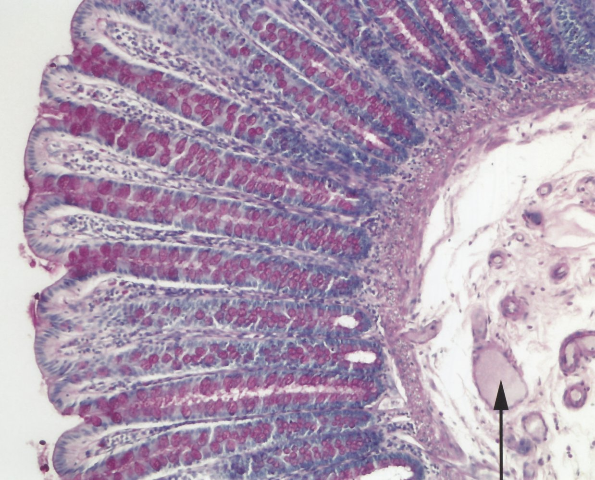

Colonic mucosa

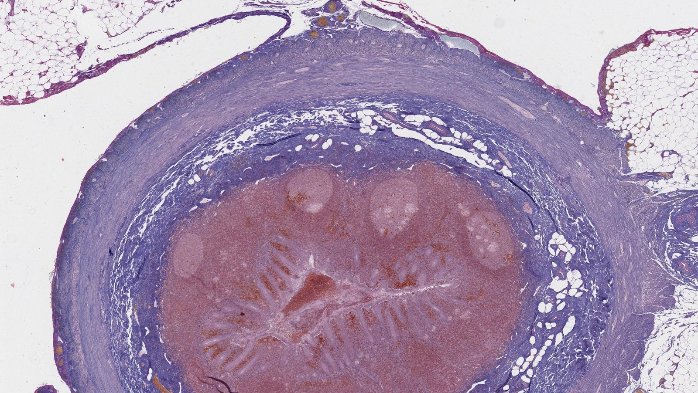

Transverse section of the appendix

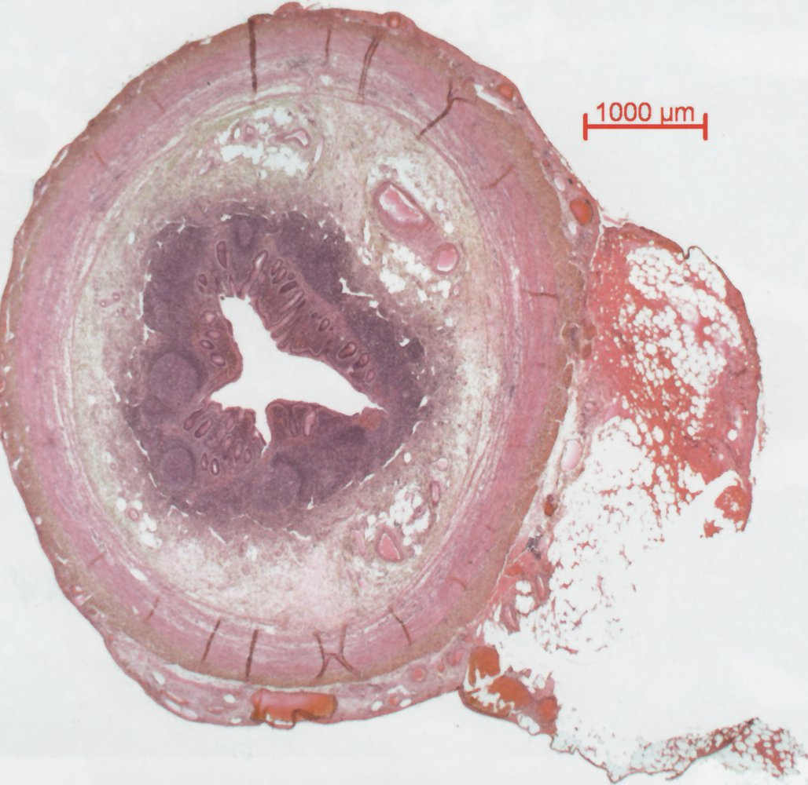

Normal appendix

---

## Function

* Ascending and <u>transverse colon</u> [[1]](https://coursology-qbank.com/amboss/article/0NYe-6)

* Absorption of Na+ and <u>Cl-</u>

* Absorption of water along the osmotic gradient created by Na+ absorption

* <u>Aldosterone</u> increases the absorption of Na+ and water as well as the excretion of <u>K+</u> and <u>HCO3-</u> from the <u>colon</u>.

* Synthesis of <u>vitamin K</u> and <u>B vitamins</u> by <u>colonic</u> bacteria

* Solidification of <u>chyme</u> into stool

* Lubrication for the passage of feces

* <u>Distal</u> <u>colon</u>, <u>rectum</u>, and <u>anal canal</u>: storage, propulsion, and expulsion of feces
* Defecation process
1. * Involuntary relaxation of the <u>internal anal sphincter</u> for anal sampling: prior to defecation, a small amount of rectal content passes into the <u>anal canal</u> to test consistency (gas, liquid, or solid)
2. * Voluntary relaxation of the <u>external anal sphincter</u> and <u>puborectalis muscle</u> and contraction of abdominal muscles or <u>Valsalva maneuver</u> expel stool from the <u>anal canal</u>
3. * Contraction of <u>external anal sphincter</u> to reestablish continence (closing reflex)

> [!NOTE]
> Na+ and water are reabsorbed by the <u>colon</u>, while <u>K+</u> and <u>HCO3-</u> are excreted.

---

## Embryology

* <u>Midgut</u>: from the <u>distal</u> <u>duodenum</u> through the <u>proximal</u> two-thirds of the <u>transverse colon</u>

* <u>Hindgut</u> (<u>endoderm</u>): from the <u>distal</u> third of the <u>transverse colon</u> through the <u>anal canal</u> <u>above the pectinate line</u>

* <u>Proctodeum</u> (<u>ectoderm</u>): <u>anal canal</u> <u>below the pectinate line</u>

* See “<u>Embryology</u>” in “<u>Gastrointestinal tract</u>.”

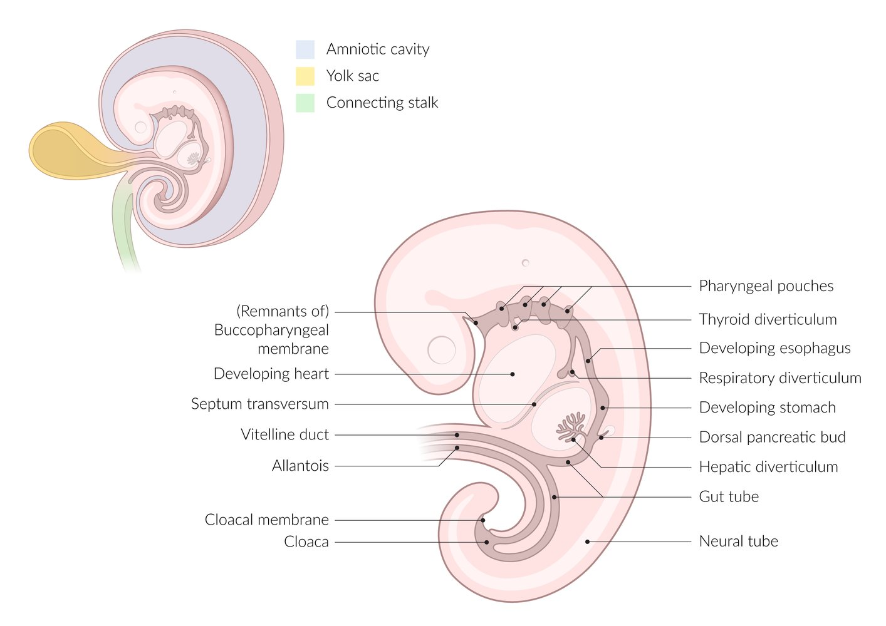

Endodermal development

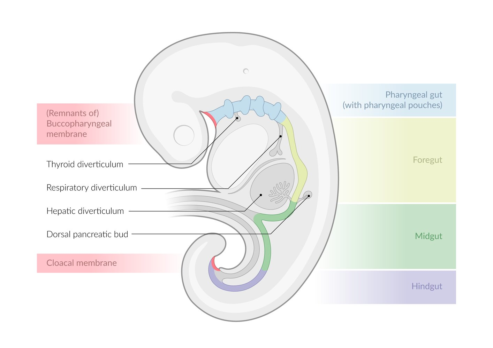

Primitive gut (4th week of development)

---

## Clinical significance

### <u>Colon</u>

* Functional disorders

* <u>Constipation</u>

* <u>Irritable bowel syndrome</u>

* Colitis

* Inflammatory

* <u>Inflammatory bowel diseases</u>

* <u>Crohn disease</u>

* <u>Ulcerative colitis</u>

* <u>Appendicitis</u>

* Infectious

* <u>Necrotizing enterocolitis</u>

* <u>Clostridium enterocolitis</u>

* <u>Toxic megacolon</u>

* <u>Ischemic</u>

* <u>Acute mesenteric ischemia</u>

* <u>Chronic mesenteric ischemia</u>

* <u>Colonic ischemia</u>

* Tumors

* <u>Colorectal cancer</u>

* <u>Colonic polyps</u>

* Polyposis syndromes

* <u>Familial adenomatous polyposis</u>

* <u>Juvenile polyposis syndrome</u>

* <u>Lynch syndrome</u>

* <u>Peutz-Jeghers syndrome</u>

* <u>Gardner syndrome</u>

* <u>Turcot syndrome</u>

* Others

* <u>Intussusception</u> (most commonly in <u>small intestine</u>)

* Sigmoid <u>volvulus</u>

* <u>Cecal volvulus</u>

* <u>Angiodysplasia</u>

* <u>Diverticulosis</u> and <u>diverticulitis</u>

* <u>Hirschsprung disease</u>

### <u>Rectum</u> and <u>anal canal</u>

* <u>Hemorrhoids</u>

* <u>Anal fissures</u>

* <u>Anal atresia</u>

* <u>Cauda equina syndrome</u> (<u>fecal incontinence</u>)

* <u>Anal cancer</u>

* <u>Anal abscess and fistula</u>

---