# Liver

*Categories: Clinical knowledge > Internal medicine > Gastroenterology > Basics of gastroenterology > Liver*

[Original Article Link](https://coursology-qbank.com/amboss/article/j60_kS)

---

## Summary

The liver is a wedge-shaped organ that is located underneath the <u>diaphragm</u> in the right upper abdominal quadrant. It is covered by a capsule and connected to surrounding structures via <u>ligaments</u>. The <u>porta hepatis</u> structures are found in a <u>fissure</u> between two of the four liver lobes. The <u>hepatic artery proper</u> and the <u>portal vein</u> provide the liver with a dual blood supply. Microscopically, the liver is divided into lobules, each with a <u>central vein</u> and a <u>portal triad</u>. Each <u>portal triad</u> consists of an <u>artery</u>, <u>vein</u>, and <u>bile</u> ductule, and is accompanied by lymphatic vessels and a branch of the <u>vagus nerve</u>. Liver <u>parenchyma</u> consists of <u>hepatocytes</u> and <u>hepatic sinusoids</u>. <u>Hepatic sinusoids</u> drain into the <u>central vein</u> of each lobule. The liver is responsible for <u>energy metabolism</u>, synthesis of various substances (e.g., <u>glucose</u>, <u>ketones</u>, <u>bile acid</u>), <u>glucose</u> <u>homeostasis</u> regulation, <u>nutrient</u> storage, and the clearance/excretion of toxins (e.g., ethanol) and waste products. In fetuses, the liver is the site of <u>erythropoiesis</u> from 6 weeks' <u>gestation</u> until <u>birth</u>. During <u>embryogenesis</u>, the liver originates from the <u>endoderm</u>. The <u>ligamentum teres</u> forms from the obliterated <u>umbilical vein</u> and is located in the free edge of the <u>falciform ligament</u>.

Organ fact sheet: liver

---

## Gross anatomy

### General structure

* Largest gland in the body
* Weight: 2.6–3.3 lb in adults [[1]](https://coursology-qbank.com/amboss/article/bLXHwA)[[2]](https://coursology-qbank.com/amboss/article/XLX9wA)

* Wedge-shaped

* Consists of four lobes:

* Right (largest)

* Left

* Quadrate

* Caudate

* Typically divided into 8 segments

* Surrounded by the hepatic capsule (two layers)

* Outer serous layer derived from <u>peritoneum</u>, which covers the entire liver (except the bare area of the liver)

* Fibrous inner layer (the Glisson capsule) that covers the entire liver (including the <u>bare area of the liver</u>), the hepatic <u>artery</u>, <u>portal vein</u>, and <u>bile</u> ducts

* Porta hepatis structures 

* <u>Common hepatic duct</u> (leaving)

* <u>Hepatic artery proper</u> (entering)

* <u>Hepatic portal vein</u> (entering)

* Hepatic nerve plexus and lymphatic vessels

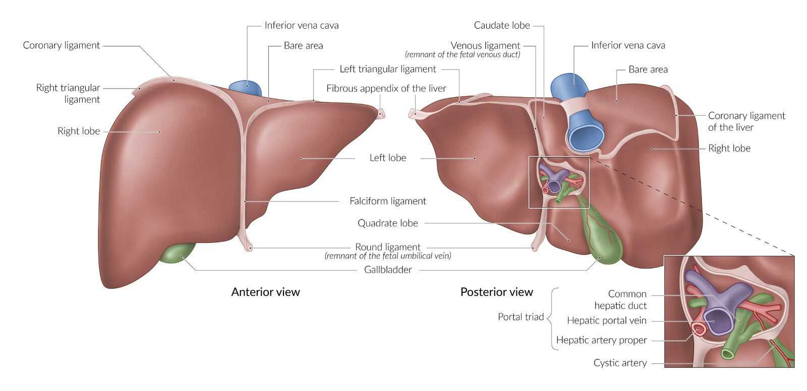

Gross anatomy of the liver

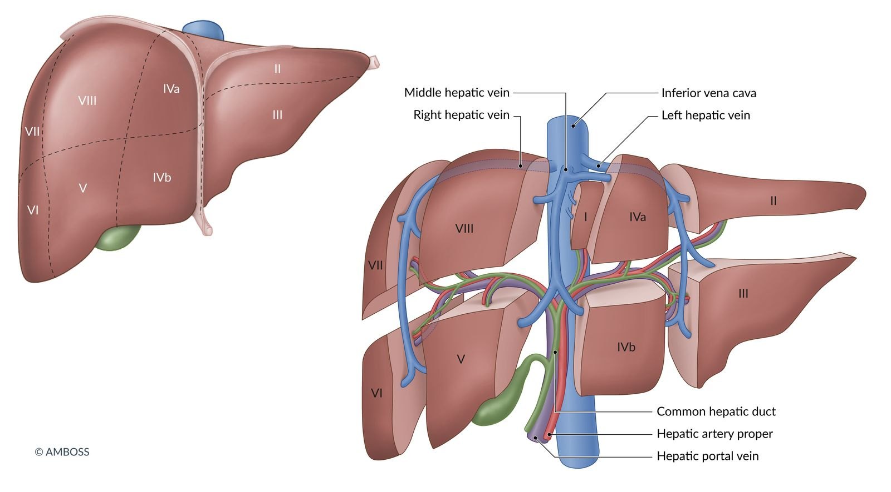

Couinaud classification of liver anatomy

### Location

* Location: under the <u>diaphragm</u> in the right upper abdomen.

* Extends from the fifth <u>intercostal space</u> to the right <u>costal margin</u> in the <u>midclavicular line</u>

* Percussed at the fifth <u>intercostal space</u>: see <u>abdominal examination</u>

### <u>Ligaments</u>

* Falciform ligament

* Connects liver to abdominal wall

* Divides liver into right (larger) and left (smaller) lobes

* Contains <u>round ligament of liver</u>

* <u>Hepatoduodenal ligament</u>

* Connects liver to <u>duodenum</u>

* Contains <u>portal triad</u> (<u>proper hepatic artery</u>, <u>portal vein</u>, <u>common bile duct</u>)
* Clinical correlate: in cases of liver hemorrhage, temporary clamping of the <u>hepatoduodenal ligament</u> (<u>Pringle maneuver</u>) can help to achieve <u>hemostasis</u>

* <u>Gastrohepatic ligament</u>

* Connects liver to <u>lesser curvature of the stomach</u>

* Contains gastric <u>arteries</u>

### Vasculature

| Vasculature of the liver |  |
| --- | --- |
| Type of vessel | Vessels |
| <u>Arteries</u> |  * Dual blood supply  * Hepatic artery proper (supplies 20–40% of blood): a branch of the <u>common hepatic artery</u>, which branches off the <u>celiac trunk</u> of the <u>abdominal aorta</u>  * Portal vein (supplies 60–80% of blood)   * Forms from the <u>superior mesenteric vein</u> (<u>SMV</u>) and <u>splenic vein</u>  * Collects blood from <u>gastrointestinal tract</u>, <u>spleen</u>, and <u>pancreas</u>  * Despite being deoxygenated, it still supplies the liver with about half its oxygen demands.  * Delivers <u>nutrients</u> and other metabolites   |
| <u>Veins</u> |  * <u>Hepatic veins</u>, which drain into the <u>inferior vena cava</u>   |
| <u>Lymphatics</u> |  * <u>Celiac lymph node</u> cluster   |

Branches of the celiac trunk

Tributaries of the hepatic portal vein

> [!NOTE]
> As part of the liver's dual blood supply, the <u>portal vein</u> allows tissue to remain oxygenated and preserve function in the event of an obstructed hepatic <u>artery</u>.

### Innervation

* <u>Glisson capsule</u> and serosa: lower <u>intercostal nerves</u>

* <u>Parenchyma</u>: <u>hepatic plexus</u>

* Contains <u>sympathetic</u> (from the <u>celiac plexus</u>) and <u>parasympathetic</u> (<u>vagus nerve</u>) nerve fibers, which regulate metabolism, blood flow, and <u>bile</u> secretion.

* Liver <u>pain</u> can refer to several areas due to shared nerve pathways: e.g., right shoulder , upper right quadrant, epigastric region.

> [!NOTE]
> Distention of the capsule results in well-localized, sharp <u>pain</u>, as seen in <u>ascites</u>, inflammation, or <u>hepatic cancer</u>.

References:[[3]](https://coursology-qbank.com/amboss/article/ES08Yf)[[4]](https://coursology-qbank.com/amboss/article/p30Ljf)[[5]](https://coursology-qbank.com/amboss/article/iRYJ5K)[[6]](https://coursology-qbank.com/amboss/article/olY0B6)

---

## Microscopic anatomy

* <u>Visceral peritoneum</u>: serosa that covers the liver

* Hepatic lobules: Sheets of <u>connective tissue</u> divide the liver into small hexagonal units called lobules. These consist of: 

* A central hepatic vein in the middle

* <u>Portal triads</u> at the vertices

* A portal triad consists of: 

* Branch of <u>hepatic artery proper</u>

* Branch of <u>portal vein</u>

* <u>Bile</u> ductule

* Each <u>portal triad</u> is accompanied by the following structures:

* Lymphatic vessels

* Branch of the <u>vagus nerve</u>

* <u>Parenchyma</u>

* Mostly consists of hepatocytes 

* Contain large amounts of <u>smooth endoplasmic reticulum</u>, which is involved in detoxification

* The basolateral surface of <u>hepatocytes</u> faces the sinusoids. .

* The apical surface of <u>hepatocytes</u> faces the lumen of the <u>bile canaliculi</u>.
* <u>Hepatocytes</u> secrete <u>bile</u> into the canaliculi → secretions flow parallel to the sinusoids, but in the opposite direction of blood → <u>bile canaliculi</u> form the intrahepatic <u>bile</u> ducts → <u>common bile duct</u> (delivers <u>bile</u> into the <u>duodenum</u>)

* Hepatic sinusoids;  are large <u>capillaries</u> lined with highly fenestrated <u>endothelial</u> cells: Blood flows through the sinusoids and empties into the <u>central vein</u> of each lobule.

* Functions

* Absorption of <u>nutrients</u> from blood and secretion of products synthesized by special carriers into the blood

* Kupffer cells (a type of <u>macrophage</u>) are housed in the sinusoids. These cells <u>phagocytize</u> foreign particles, bacteria, and damaged, old blood cells.

* The plasma-filled space between the sinusoids and <u>hepatocytes</u> is called the perisinusoidal space (of Disse): contains hepatic stellate cells (<u>Ito cells</u>), which store <u>vitamin A</u> and are the main source of <u>extracellular matrix</u> production in liver injury (formation of <u>scar</u> tissue → <u>fibrosis</u>)

* Histological zones: 

* Zone 1: The periportal zone 

* Is best oxygenated and, therefore, is most resistant to <u>ischemia</u>.

* Affected first in viral <u>hepatitis</u> and toxic substance ingestion, e.g., <u>cocaine</u>.

* Zone 2: intermediate zone (liver): affected in <u>yellow fever</u>

* Zone 3: pericentral <u>vein</u>/centrilobular zone

* The least oxygenated zone, and thus most susceptible to <u>ischemia</u>

* Most sensitive to metabolic toxins (e.g., ethanol, <u>CCl4</u>, <u>halothane</u>, <u>rifampin</u>, <u>acetaminophen</u>)

* Has the highest amount of <u>cytochrome P-450</u>

> [!NOTE]
> Zone 1 is first and zone 3 is last to receive O2.

> [!NOTE]
> Zone II is affected in yellow <u>fever</u>.

Hepatic microstructure: hepatic lobule

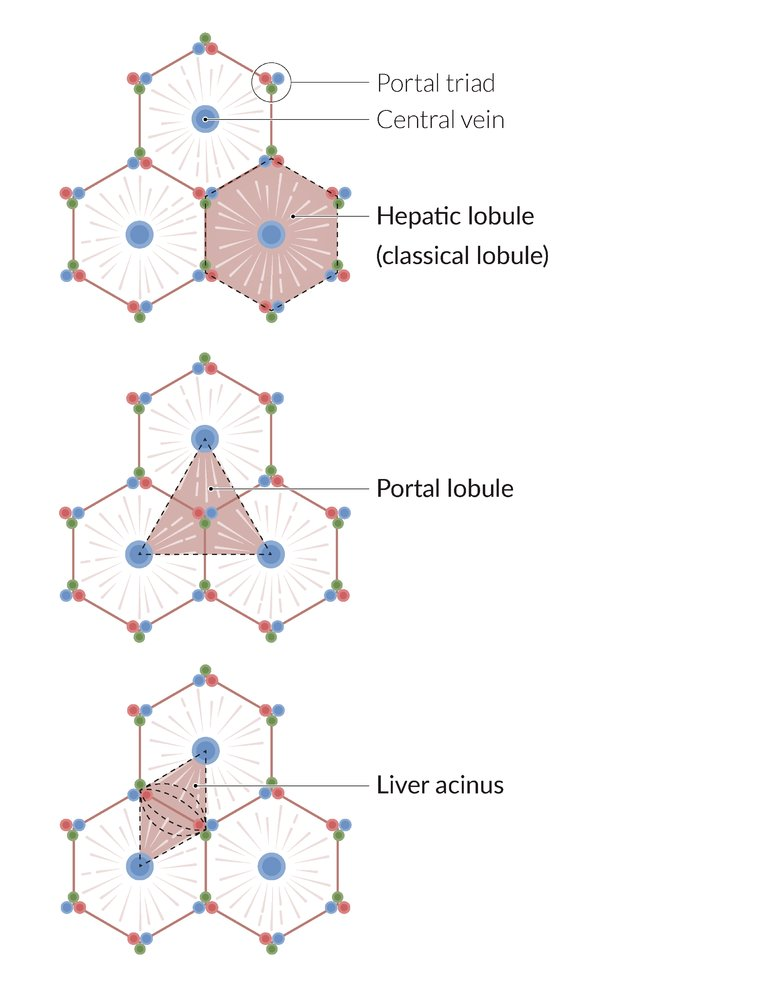

Architecture of the liver

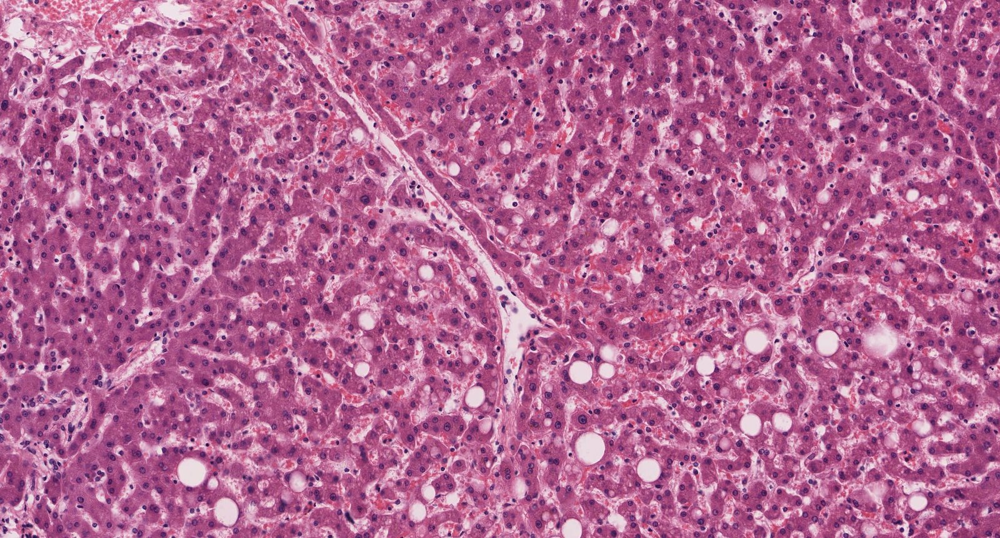

Plates of hepatocytes of hepatic lobules

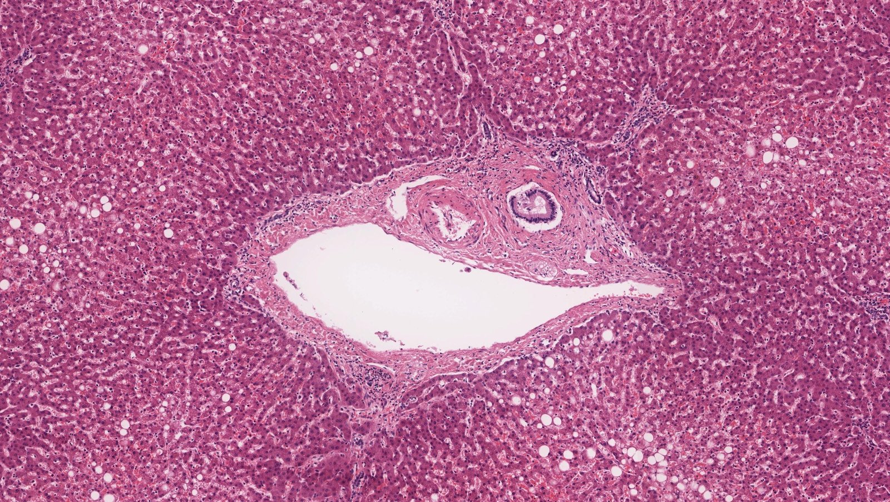

Portal triad

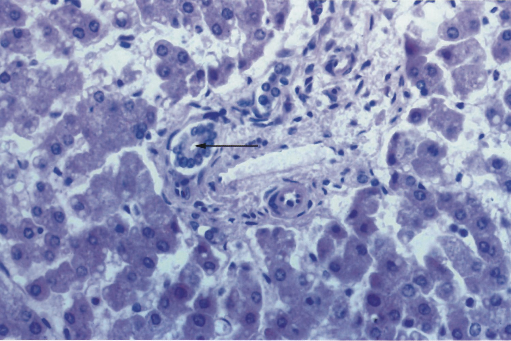

Periportal zone and portal triad of liver

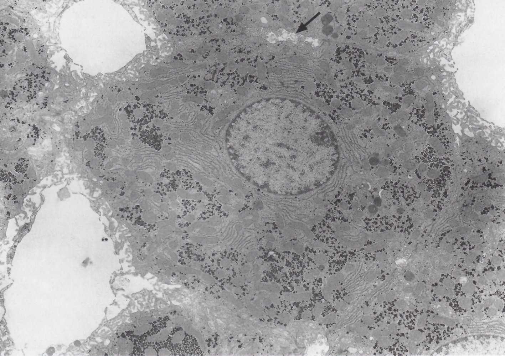

Hepatocyte

Hepatic microstructure: sinusoids, perisinusoidal space, and hepatocytes

Hepatic microstructure: hepatic lobule showing bile canaliculi

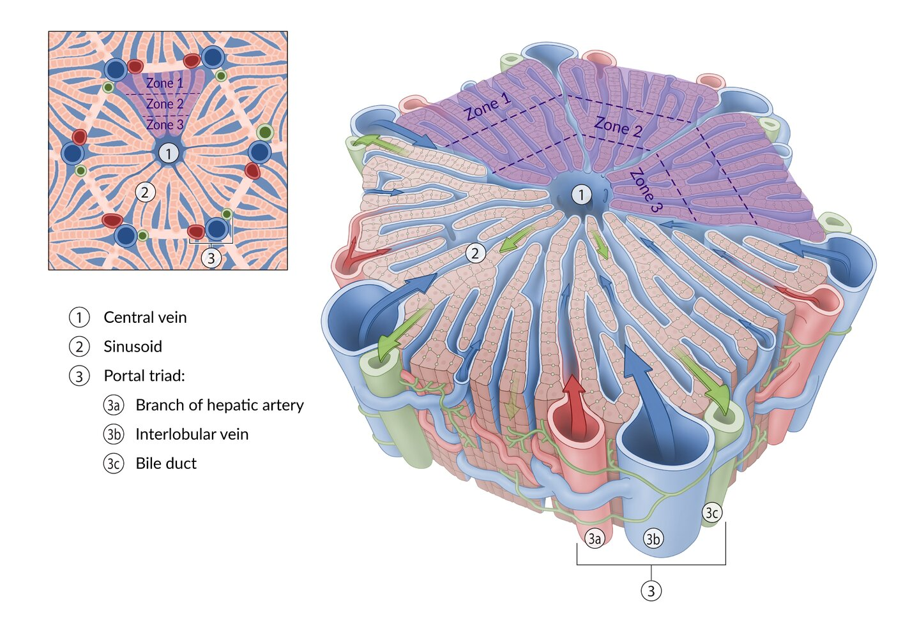

References:[[3]](https://coursology-qbank.com/amboss/article/ES08Yf)[[5]](https://coursology-qbank.com/amboss/article/iRYJ5K)

---

## Function

| Functions of the liver |  |
| --- | --- |
| Function | Related biochemical pathways |
|  <u>Energy metabolism</u>  |   * <u>Glycolysis</u>  * <u>Beta-oxidation</u>  * <u>Amino acid</u> degradation  * Lipid metabolism  * Expression of <u>LDL</u> and lipid remnant <u>receptors</u>  * Production of nascent <u>HDL</u> (which transports <u>cholesterol</u> from periphery to liver)  * <u>HDL</u> and <u>chylomicrons</u> transport <u>cholesterol</u> from periphery to liver  * Liver delivers <u>triglycerides</u> to peripheral tissues via <u>VLDL</u>  * <u>Breakdown of fructose</u>  * Breakdown of <u>serotonin</u>    |
| Synthesis |   * <u>Gluconeogenesis</u>  * Production of <u>ketone bodies</u>  * <u>Fatty acids</u> and <u>amino acids</u> → <u>acetoacetate</u> + <u>beta-hydroxybutyrate</u>  * Provide energy for the muscles and the <u>brain</u>  * The liver cannot use <u>ketone bodies</u> for itself because liver cells lack <u>β-ketoacyl-CoA transferase</u> (<u>thiophorase</u>)  * Synthesis of <u>plasma proteins</u> (e.g., <u>albumin</u>, globulins, <u>clotting factors</u> , <u>acute-phase reactants</u> such as <u>ferritin</u>, <u>CRP</u>, and <u>hepcidin</u>)  * <u>Cholesterol biosynthesis</u>  * <u>Fatty acid synthesis</u>   * During day 1 of <u>fasting</u> → <u>glycogen</u> reserves used for <u>gluconeogenesis</u>  * During days 1–3 of <u>fasting</u> (after <u>glycogen</u> is depleted) → production of free <u>fatty acids</u> for energy  * <u>Bile acid</u> synthesis  * <u>Vitamin D</u>: conversion of <u>vitamin D3</u> and D2 to 25-OH (which is subsequently transformed to 1,25-(OH)2, the active form of <u>vitamin D</u>, in the <u>kidney</u>)    |
| Regulation |  * <u>Glucose</u> <u>homeostasis</u>   * Raise blood <u>glucose</u> via :  * <u>Glycogenolysis</u>  * <u>Gluconeogenesis</u>  * Lower blood <u>glucose</u> via :  * <u>Glycogen synthesis</u>  * <u>Glycolysis</u>   |
| Storage |   * <u>Glycogen</u>  * <u>Lipoproteins</u>  * <u>Fat-soluble vitamins</u> (A, K, E, D), <u>folate</u>, and <u>vitamin B12</u>  * <u>Iron</u> and <u>copper</u>    |
| Detoxification and clearance/excretion |   * <u>Urea cycle</u> (<u>amino acid metabolism</u>): Liver produces <u>urea</u>, which is excreted by the <u>kidneys</u>.  * <u>Cytochrome-P450 system</u> involved in detoxification  * Biotransformation: Conversion of <u>lipophilic</u> substances into water-soluble substances, which can then be eliminated with the urine or <u>bile</u>.   * <u>Breakdown of ethanol</u>  * Removal of <u>unconjugated bilirubin</u> (liver conjugates it with glucuronate and excretes it in <u>bile</u>)    |
| Fetal |  * Site of <u>erythropoiesis</u> from 6 weeks' <u>gestation</u> until <u>birth</u>   |

For laboratory parameters for each of the functions, see “<u>Parameters of hepatocellular damage</u>,” “<u>Parameters of cholestasis</u>,” and “<u>Parameters of hepatic synthesis</u>” in “<u>Liver function</u> tests.”

Energy Metabolism - Part 3: Regulation of Glycolysis

Energy Metabolism - Part 5: Beta-oxidation Reactions with molecular structures

Energy Metabolism - Part 5: Beta-oxidation Reactions without molecular structures

Energy Metabolism - Part 8: Anaerobic vs. Aerobic Metabolism

Energy Metabolism - Part 10: Gluconeogenesis Reactions with molecular structures

Energy Metabolism - Part 10: Gluconeogenesis Reactions without molecular structures

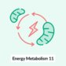

Energy Metabolism - Part 11: Regulation of Gluconeogenesis

Energy Metabolism - Part 12: Ketone Body Metabolism

Energy Metabolism - Part 13: Fatty Acid Synthesis with molecular structures

Energy Metabolism - Part 13: Fatty Acid Synthesis without molecular structures

References:[[7]](https://coursology-qbank.com/amboss/article/Lvaw05)[[8]](https://coursology-qbank.com/amboss/article/l4Yvj6)[[9]](https://coursology-qbank.com/amboss/article/m4YVP6)

---

## Ethanol metabolism

Section 13 Ethanol

### Breakdown of ethanol

Example of <u>zero-order elimination</u> (for <u>alcohol dehydrogenase</u>); : A constant amount of <u>alcohol</u> is metabolized per unit time (∼ 1 oz of <u>alcohol</u>/hour). <u>NAD+</u> is the <u>limiting reactant</u> for this pathway.

1. * Oxidation of ethanol to acetaldehyde by alcohol dehydrogenase
2. * Oxidation of acetaldehyde to acetate by acetaldehyde dehydrogenase

* <u>Disulfiram</u> <u>competitively inhibits</u> <u>acetaldehyde dehydrogenase</u>, which is useful in the <u>treatment of alcohol use disorder</u>: acetaldehyde builds up quickly after <u>alcohol</u> consumption and causes hangover symptoms, which usually discourages patients from drinking. [[9]](https://coursology-qbank.com/amboss/article/m4YVP6)

* Other drugs (e.g., <u>procarbazine</u>) have a <u>disulfiram-like</u> effect
3. * Ligation of acetate and <u>coenzyme A</u> to <u>acetyl-CoA</u> by thiokinase under <u>ATP</u> consumption

> [!TIP]
> When large quantities of <u>alcohol</u> are consumed, acetaldehyde builds up faster than it can be metabolized by <u>acetaldehyde dehydrogenase</u>. Excess acetaldehyde plays a major role in hangover symptoms.

> [!NOTE]
> Female individuals are more susceptible to <u>ethanol intoxication</u> than male individuals, even when consuming similar levels of <u>alcohol</u>. This is mainly because they have lower <u>total body water</u> and <u>alcohol dehydrogenase</u> activity than male individuals of comparable size. These physiological factors result in higher and more prolonged <u>blood alcohol concentration</u>, leading to faster intoxication. [[10]](https://coursology-qbank.com/amboss/article/VNWGZN0)

> [!NOTE]
> It is DISgusting to drink <u>alcohol</u> when taking DISulfiram!

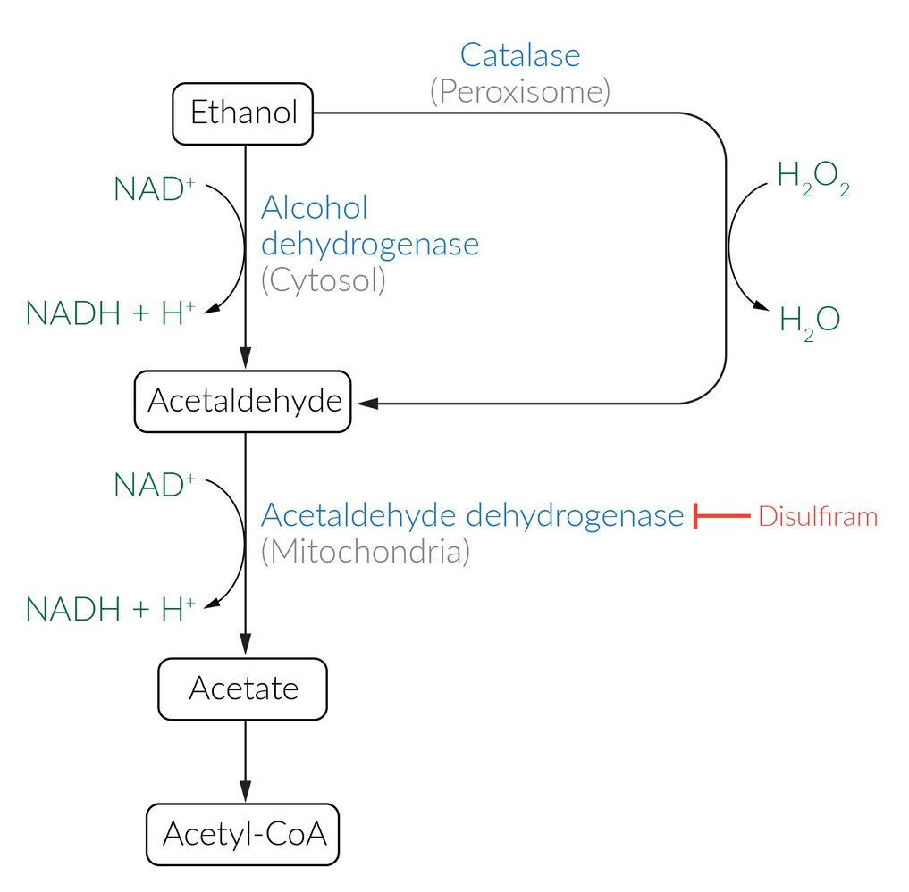

Ethanol metabolism

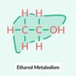

Ethanol Metabolism: Alcohol Breakdown in the Body

### Metabolic consequences of heavy ethanol consumption

When ethanol is metabolized, there is an increase in the <u>NADH</u>/<u>NAD+</u> <u>ratio</u> in the liver. Heavy ethanol consumption and consequently excess <u>NADH</u> result in:

* <u>Anion gap metabolic acidosis</u> 

* <u>Lactic acidosis</u>: increased conversion of <u>pyruvate</u> to <u>lactate</u> by <u>lactate dehydrogenase</u> → ↑ <u>lactate</u>

* Ketoacidosis: <u>Acetyl-CoA</u> is shunted into the <u>ketogenesis</u> pathway instead of the <u>TCA cycle</u> (increased <u>NADH</u>/<u>NAD+</u> <u>ratio</u> inhibits the <u>TCA cycle</u>, leading to a buildup of <u>acetyl-CoA</u>) → ↑ <u>ketone bodies</u>

* <u>Fasting</u> <u>hypoglycemia</u>
* ↑ <u>NADH</u>/<u>NAD+</u> <u>ratio</u> → inhibition of conversion of <u>cytosolic</u> <u>malate</u> to oxaloacetic acid (<u>OAA</u>), increased conversion of <u>OAA</u> to <u>malate</u> → impaired <u>gluconeogenesis</u>, inhibition of <u>TCA cycle</u>

* <u>Hepatosteatosis</u>

* In the <u>glycolysis</u> pathway, ↑ <u>NADH</u>/<u>NAD+</u> <u>ratio</u> leads to increased conversion of <u>DHAP</u> to <u>glycerol-3-phosphate</u>

* ↑ <u>NADH</u>/<u>NAD+</u><u>ratio</u> → inhibition of <u>TCA</u> → ↑ <u>acetyl-CoA</u> → ↑ <u>fatty acid synthesis</u>

* ↑ <u>Fatty acids</u> and ↑ <u>glycerol-3-phosphate</u> → ↑ <u>triglycerides</u> → <u>hepatic steatosis</u>

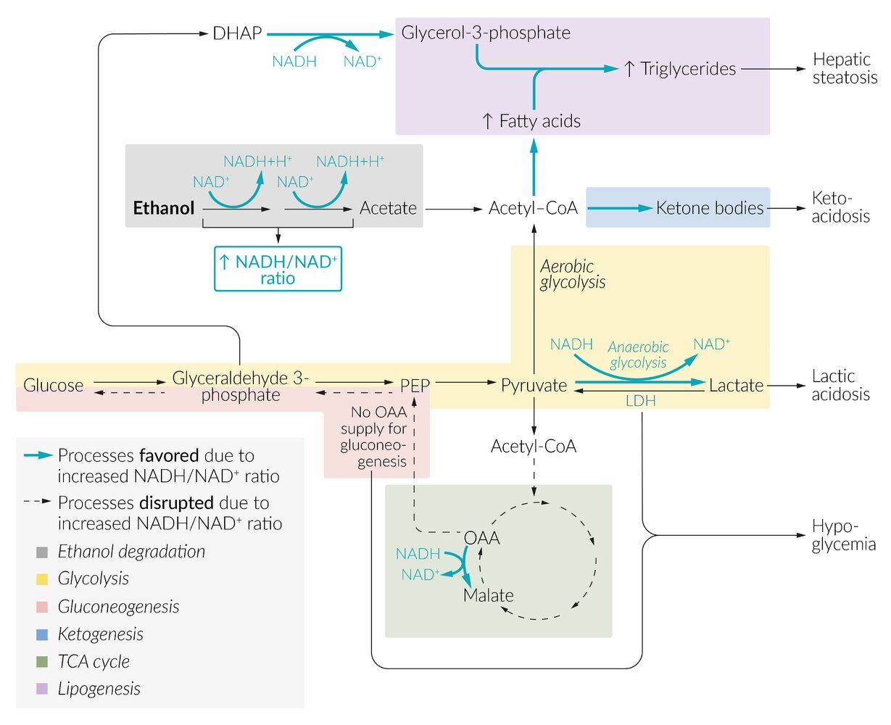

Changes in liver metabolism due to risky alcohol use

---

## Embryology

* <u>Endoderm</u> origin [[11]](https://coursology-qbank.com/amboss/article/54YiP6)

* Derived from junction of <u>foregut</u> and <u>midgut</u> [[11]](https://coursology-qbank.com/amboss/article/54YiP6)

* Ligamentum teres: formed from the obliterated <u>umbilical vein</u> [[11]](https://coursology-qbank.com/amboss/article/54YiP6)

---

## Clinical significance

* Hepatic inflammation

* <u>Alcoholic hepatitis</u>

* <u>Non-alcoholic steatohepatitis</u>

* <u>Autoimmune hepatitis</u>

* <u>Fitz-Hugh-Curtis syndrome</u>

* Hepatic infection

* <u>Differential diagnosis of viral hepatitis</u>

* <u>Liver abscesses</u> (e.g., due to <u>Klebsiella</u> or <u>amebic liver abscess</u>)

* Parasitic infection (e.g., <u>Plasmodium vivax</u> and <u>P. ovale</u> have <u>hypnozoite</u> forms that reside in the liver)

* Hepatic tumors

* <u>Hepatocellular carcinoma</u>

* <u>Angiosarcoma</u> (e.g., due to <u>arsenic</u> or <u>vinyl chloride</u> exposure)

* <u>Colon cancer</u> <u>metastases</u>

* <u>Benign liver tumors and hepatic cysts</u>

* <u>Hepatic adenoma</u>

* <u>Hydatid cyst disease</u>

* Hereditary diseases

* <u>Hemochromatosis</u>: <u>iron overload</u>

* <u>Wilson disease</u>: <u>copper</u> overload

* Von Gierke's Disease: increased liver <u>glycogen</u>

* Black liver due to <u>Dubin-Johnson syndrome</u>

* Others

* <u>Fatty liver</u>

* <u>Hepatomegaly</u> (e.g., due to <u>right heart failure</u> or <u>schistosomiasis</u>)

* <u>Budd-Chiari syndrome</u>

* <u>Ischemia</u> (typically affects <u>central vein</u> zone)

* <u>Cirrhosis</u>

Diffuse hepatic steatosis

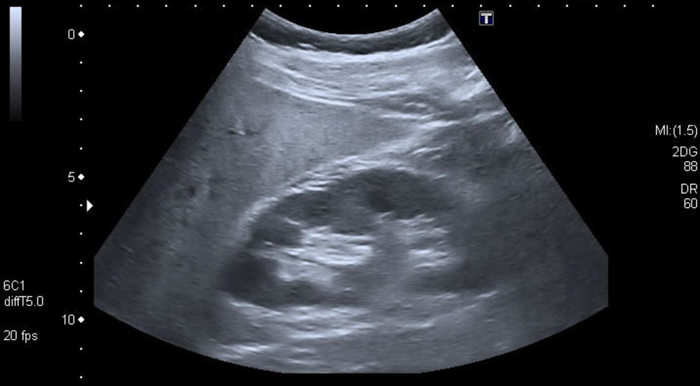

Hepatic steatosis

Decompensated hepatic cirrhosis

---