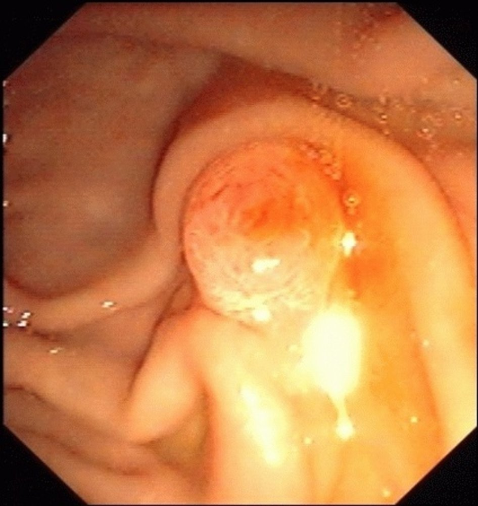
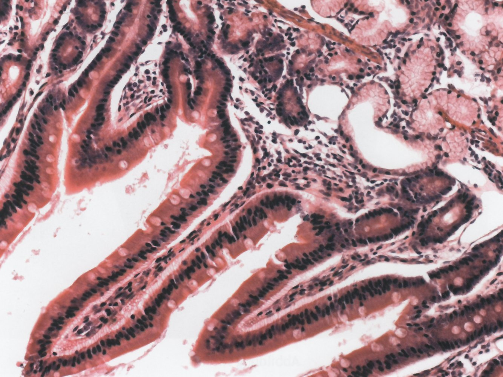
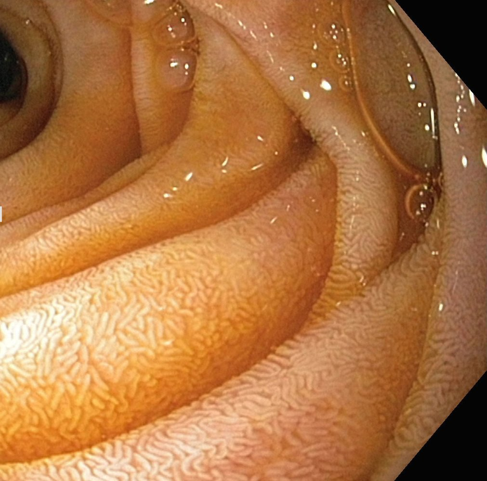
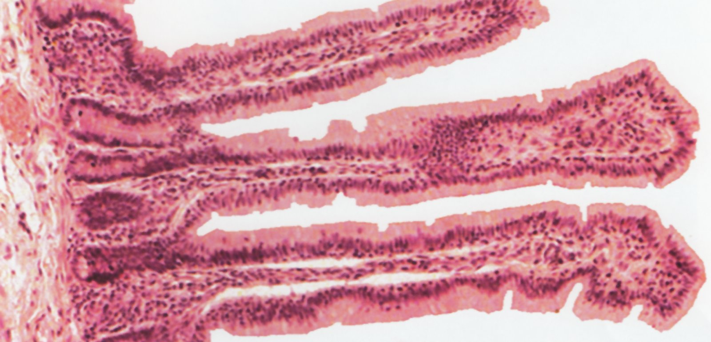
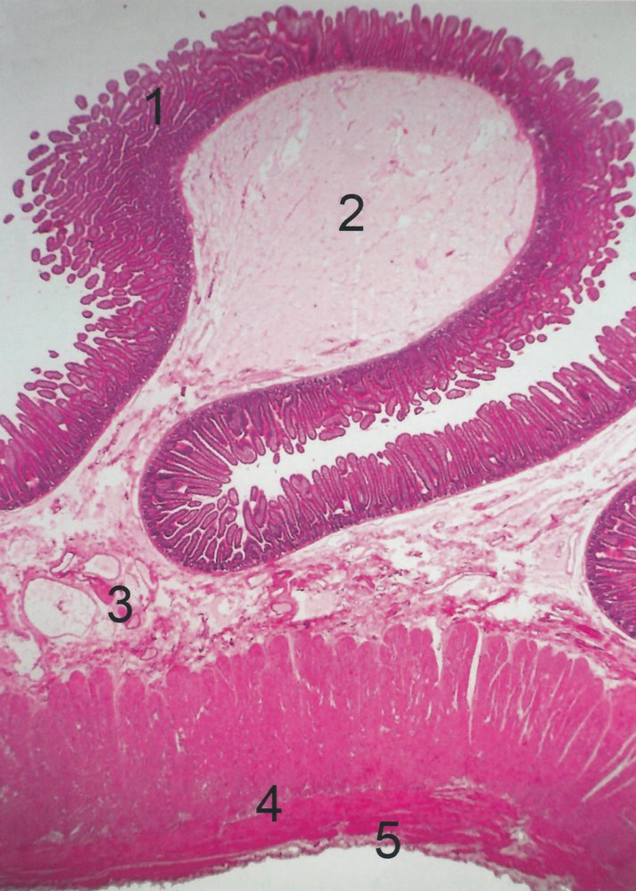
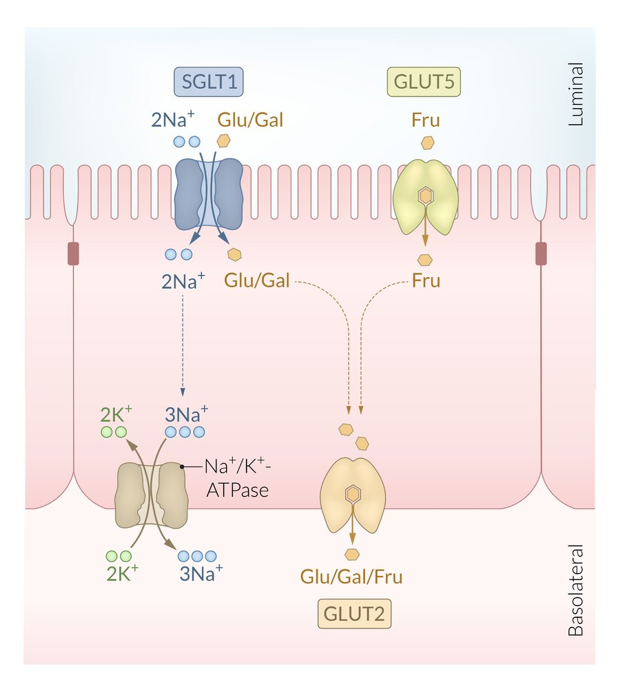

# Small intestine

*Categories: Clinical knowledge > Internal medicine > Gastroenterology > Basics of gastroenterology > Small intestine*

[Original Article Link](https://coursology-qbank.com/amboss/article/eJ0xGS)

---

## Summary

The small intestine is a hollow <u>intraperitoneal organ</u> that develops from the <u>distal</u> <u>foregut</u> and <u>midgut</u>. It extends from the <u>pylorus</u> of the <u>stomach</u> to the <u>ileocecal junction</u> and is subdivided into the <u>duodenum</u>, the <u>jejunum</u>, and <u>ileum</u>. With the exception of the <u>proximal</u> <u>duodenum</u>, which is supplied by the <u>celiac trunk</u>, the main arterial supply for the small intestine is provided by branches of the <u>superior mesenteric artery</u>. The <u>veins of the small intestine</u> drain into the <u>portal vein</u> and the <u>lymphatics</u> eventually drain into the superior <u>mesenteric</u> and <u>celiac lymph nodes</u>. The small intestine is innervated by the <u>sympathetic and parasympathetic nervous system</u>, as well as the <u>myenteric plexus</u> and <u>submucous plexus</u> of the <u>enteric nervous system</u>. The <u>mucosa</u> of the small intestine contains many folds (i.e., <u>plicae circulares</u>, <u>intestinal villi</u>, and <u>microvilli</u>), which greatly increase its absorptive surface area. It also contains <u>intestinal glands</u> (<u>crypts of Lieberkuhn</u>) made up of <u>enterocytes</u>, which reabsorb <u>nutrients</u>, and other <u>specialized cells of the small intestine</u> (e.g., <u>stem cells</u>, <u>Paneth cells</u>, <u>goblet cells</u>, <u>enteroendocrine cells</u>). <u>Pancreatic</u> secretions and <u>bile</u> collect in the <u>duodenum</u> and break down <u>chyme</u> into sugars, <u>amino acids</u>, and <u>fatty acids</u>. Absorption of <u>micronutrients</u> and water predominantly occurs in the <u>jejunum</u>. Absorption of <u>vitamin B12</u> and <u>bile acids</u> occurs in the <u>terminal ileum</u>.

Organ fact sheet: small intestine

---

## Gross anatomy

### Overview [[1]](https://coursology-qbank.com/amboss/article/ES08Yf)

* Characteristics

* Middle portion of the <u>gastrointestinal tract</u> situated between the <u>pylorus</u> proximally and the <u>ileocecal junction</u> distally

* Length (adult): ∼ 21 ft (6.5 m)

* Subdivisions: <u>duodenum</u>, <u>jejunum</u>, and <u>ileum</u>

* <u>Embryology</u>: develops from the <u>distal</u> <u>foregut</u> and <u>midgut</u>

* Function

* Enzymatic breakdown of <u>chyme</u> into <u>monosaccharides</u>, <u>amino acids</u>, and <u>fatty acids</u> (predominantly in the <u>duodenum</u>)

* Absorption of <u>nutrients</u> and water (predominantly in the <u>jejunum</u> and <u>ileum</u>)

* <u>Innate immune system</u> and <u>adaptive immune system</u> function

### Anatomical subdivisions

Parts of the small intestine

#### Duodenum

* First and widest part of the small intestine

* C-shaped: surrounds the head of the <u>pancreas</u>

* Located mainly within the epigastric and umbilical regions of the abdomen

| Parts of the duodenum |  |  |  |  |
| --- | --- | --- | --- | --- |
|  | <u>Peritoneal</u> relations | Embryological origin | Important anatomy | Clinical significance |
| First part of the duodenum (superior) (duodenal bulb) |  * <u>Intraperitoneal</u>   |  * <u>Foregut</u>   |  * The <u>gastroduodenal artery</u> and <u>common bile duct</u> lie <u>posterior</u> to the <u>duodenal bulb</u>.   |   * Most common site of <u>duodenal ulcers</u>  * A <u>posterior</u> <u>duodenal ulcer</u> may erode the <u>gastroduodenal artery</u> and cause an <u>upper GI bleed</u>.  * Attached to the <u>liver</u> via the <u>hepatoduodenal ligament</u>    |
| Second part of the duodenum (descending) |  * <u>Retroperitoneal</u>   |   * <u>Proximal</u> to the <u>ampulla of Vater</u>: <u>foregut</u>  * <u>Distal</u> to the <u>ampulla of Vater</u>: <u>midgut</u>    |  * Contains:  * <u>Ampulla of Vater</u>  * Major duodenal papilla: protrusion of the <u>ampulla of Vater</u> into the <u>duodenum</u>  * <u>Sphincter of Oddi</u>  * Minor duodenal papilla: opening of the <u>accessory pancreatic duct</u>   |   * The <u>major duodenal papilla</u> is cannulated during <u>ERCP</u>.  * <u>Ampulla of Vater sphincterotomy</u> is performed for impacted <u>distal</u> <u>choledocholithiasis</u>.    |
| Third part of the duodenum (horizontal) |  * <u>Midgut</u>   |   * <u>Anterior</u> relation: superior <u>mesenteric vessels</u>  * <u>Posterior</u> relation: aorta    |  * <u>SMA syndrome</u>   |  |
| 4th (ascending) part |   * Duodenojejunal flexure (<u>DJ flexure</u>)  * Junction between the ascending <u>duodenum</u> and the <u>jejunum</u>  * Located on the left side of the L2 <u>vertebra</u>  * Ligament of Treitz: avascular <u>peritoneal fold</u> that fixes the <u>DJ flexure</u> to the <u>posterior</u> abdominal wall    |  * <u>DJ flexure</u> on the right side of the L2 <u>vertebra</u> indicates <u>intestinal malrotation</u>.   |  |  |

> [!NOTE]
> Only the 1st part of the <u>duodenum</u> is <u>intraperitoneal</u>. The 2nd–4th parts are <u>retroperitoneal</u>.

Pancreatic regional anatomy

Extrahepatic biliary tree

Characteristic structures of the duodenum

Endoscopic view of the major duodenal papilla

#### Jejunum

* Second part of the small intestine

* Located mainly in the <u>LUQ</u> of the abdomen

* <u>Intraperitoneal</u>

#### Ileum

* Final and narrowest part of the small intestine

* Located mainly in the <u>RLQ</u> of the abdomen

* <u>Intraperitoneal</u>

* Separated from the <u>large intestine</u> at the ileocecal junction by the ileocecal valve: 

* Muscular sphincter;  that regulates the passage of fluid and <u>nutrients</u> from the <u>ileum</u> into the <u>cecum</u> and prohibits reflux

* Provides a mechanical barrier to bacterial migration into the small intestine

> [!NOTE]
> Swallowed foreign objects are most likely to become lodged in the narrowest parts of the small intestine: the <u>pylorus</u>, the <u>DJ flexure</u>, and the <u>ileocecal junction</u>.

### Vasculature, lymphatics, and innervation of the small intestine

| <u>Vasculature, lymphatics, and innervation of the small intestine</u> |  |  |  |
| --- | --- | --- | --- |
|  | <u>Duodenum</u> | <u>Jejunum</u> | <u>Ileum</u> |
|  <u>Arteries</u>    |   * <u>Proximal</u> to the <u>major duodenal papilla</u> (<u>foregut</u> derivatives): branches of the <u>celiac trunk</u>    * <u>Gastroduodenal artery</u>  * <u>Superior pancreaticoduodenal artery</u>  * <u>Distal</u> to the <u>major duodenal papilla</u> (<u>midgut</u> derivatives): branches of the <u>superior mesenteric artery</u> (<u>inferior pancreaticoduodenal artery</u>)    |  * <u>Jejunal branches</u> of the <u>superior mesenteric artery</u> → <u>intermesenteric arterial anastomoses</u>  → vasa recta (intestines)   |   * <u>Ileal branches</u> of the <u>superior mesenteric artery</u> → <u>intermesenteric arterial anastomoses</u>  → vasa recta  * <u>Ileocolic artery</u> supplies the <u>distal</u> <u>ileum</u>.    |
|  <u>Veins</u>    |   * Superior pancreaticoduodenal <u>vein</u> → <u>portal vein</u>  * Inferior pancreaticoduodenal <u>vein</u> → <u>SMV</u> → <u>portal vein</u>    |  * <u>SMV</u> → <u>portal vein</u>   |  |
| <u>Lymphatics</u> |  * Celiac and superior <u>mesenteric</u> nodes   |  * Superior <u>mesenteric</u> nodes   |  |
| Innervation |  * <u>Celiac plexus</u>  * <u>Parasympathetic</u>: <u>vagus nerves</u>  * <u>Sympathetic</u>: greater and <u>lesser splanchnic nerves</u>   |  * <u>Superior mesenteric plexus</u>  * <u>Parasympathetic</u>: <u>vagus nerves</u>  * <u>Sympathetic</u>: greater and <u>lesser splanchnic nerves</u>   |  |

> [!NOTE]
> <u>Functional bowel obstruction</u>, or <u>paralytic ileus</u>, occurs most commonly as a postoperative complication. <u>Mechanical bowel obstruction</u> of the small bowel occurs most commonly as a result of postoperative <u>bowel adhesions</u>.

---

## Microscopic anatomy

The four histological layers of the small intestine are the same as the <u>layers of the gastrointestinal tract</u>.

### <u>Microscopic anatomy of the small intestine</u>

|  Microscopic anatomy of the small intestine [[2]](https://coursology-qbank.com/amboss/article/8NYO1p) |  |  |  |  |
| --- | --- | --- | --- | --- |
| Parts of the small intestine | <u>Mucosa</u> | <u>Submucosa</u> | Muscularis propria | Serosa |
|  <u>Duodenum</u>   |   * Simple <u>columnar epithelium</u>  * Structures that increase the absorptive surface area  * Plicae circulares: transverse folds of the <u>mucosa</u> and <u>submucosa</u> (visible to the naked <u>eye</u>) and most prominent in the <u>jejunum</u>  * Intestinal villi  * Finger-like projections of <u>mucosa</u>  * Shortest in the <u>duodenum</u>  * Tallest in the <u>jejunum</u>  * Lined by simple <u>columnar epithelium</u> and the <u>specialized cells of the small intestine</u>  * Each villus has an <u>arteriole</u>, <u>venule</u>, and lymphatic channel at its core.  * <u>Microvilli</u>   * Minute projections from the <u>epithelial</u> cells of the villi  * Give the small intestinal <u>mucosal</u> surface a “brush border” appearance  * Have a <u>superficial</u> layer of <u>glycocalyx</u> that enables binding of <u>nutrients</u> and enzymes  * Crypts of Lieberkuhn    * <u>Intestinal glands</u>  * Lie within the <u>lamina propria</u>  * Flanked by two adjacent villi  * Lined by <u>specialized cells of the small intestine</u>    |   * Brunner glands    * Lined by columnar cells that secrete mucus and <u>HCO3-</u>  * Secretions neutralize acidic <u>chyme</u> from the <u>stomach</u>.  * <u>Meissner plexus</u>    |   * Inner circular <u>smooth muscle</u> and outer longitudinal <u>smooth muscle</u> layers  * <u>Auerbach plexus</u> lies between the two layers of <u>smooth muscle</u>.    |  * <u>Mesothelium</u> of the <u>visceral peritoneum</u>   |
|  <u>Jejunum</u>    |   * Similar to <u>duodenal</u> <u>mucosa</u>  * <u>Plicae circulares</u> are most prominent in the <u>jejunum</u>.    |   * No glands  * <u>Meissner plexus</u>    |  |  |
| <u>Ileum</u> |   * Similar to <u>duodenal</u> <u>mucosa</u>, with thinning out of <u>plicae circulares</u>  * Peyer patches   * Aggregates of nonencapsulated lymphoid tissue within the <u>lamina propria</u> and <u>submucosa</u> (GALT of the <u>ileum</u>)  * Contain specialized cells:  * <u>Microfold cells</u> (M cells): endocytose <u>antigens</u> and deliver them to <u>antigen-presenting cells</u>  * <u>B lymphocytes</u> in <u>germinal centers</u> become <u>plasma cells</u> and secrete <u>IgA</u>, which prevents pathogens from binding to and invading the intestinal <u>mucosa</u>.    |  |  |  |

> [!NOTE]
> <u>IgA</u> is the main <u>antibody</u> of the intestines and is often called “secretory <u>IgA</u>” because it is also found in tears, saliva, mucus, and <u>breast milk</u>.

Histological layers of the gastrointestinal tract

Duodenum

Plicae circulares

Plicae circulares (valves of Kerckring)

Brush border in enterocyte

Intestinal villi and crypts of Lieberkuhn

Brunner glands

Jejunum

Jejunum

Peyer patches

### <u>Specialized cells of the small intestine</u>

| Specialized cells of the small intestine |  |  |  |  |
| --- | --- | --- | --- | --- |
| Cell |  | Secretory product | Location and characteristics | Function |
| Enterocytes |  |  * None   |   * Simple <u>columnar epithelium</u>  * <u>Basal nuclei</u>  * Lining villi and <u>crypts of Lieberkuhn</u>  * Most common cell type of the intestinal <u>mucosa</u>    |   * Absorb <u>nutrients</u>  * Transport <u>nutrients</u> to the bloodstream    |
|  Enteroendocrine cells    | <u>G cells</u> |  * <u>Gastrin</u>   |  * <u>Crypts of Lieberkuhn</u> (lower half)   |  * See “<u>Secretory and regulatory products of the gastrointestinal tract</u>”.   |
| <u>D cells</u> |  * <u>Somatostatin</u>   |  |  |  |
| I cells |  * <u>Cholecystokinin</u>   |  |  |  |
| S cells |  * <u>Secretin</u>   |  |  |  |
| K cells |  * <u>Gastric inhibitory polypeptide</u>   |  |  |  |
| Mo cells |  * <u>Motilin</u>   |  |  |  |
|  Paneth cells    |  |   * <u>Lysozyme</u>  * Defensin  * <u>TNF-α</u>    |   * <u>Crypts of Lieberkuhn</u> (base)  * More common in <u>jejunum</u> and <u>ileum</u>  * Contain acidophilic granules    |   * <u>Lysozymes</u> and <u>defensins</u> destroy bacteria.  * <u>TNF-α</u> regulates the <u>immune response</u> to pathogens.    |
|  <u>Goblet cells</u>    |  |   * Mucous  * Glycoproteins    |   * Villi  * <u>Crypts of Lieberkuhn</u>  * Most abundantly present in the small intestine    |   * Lubricates the <u>GIT</u>  * Traps bacteria  * Aids binding of <u>immunoglobulins</u> to pathogens    |
| <u>Stem cells</u> |  |  * None   |  * <u>Crypts of Lieberkuhn</u> (lower half)   |   * Proliferate and differentiate into the various cells of the small intestine  * Repair <u>mucosal</u> injuries    |

> [!NOTE]
> The diagnosis of <u>celiac disease</u> is confirmed via endoscopy of the <u>duodenum</u>. <u>Biopsy</u> specimens show villous <u>atrophy</u>, crypt <u>hyperplasia</u>, and intraepithelial <u>lymphocytic</u> infiltration.

---

## Function

* <u>Duodenum</u>

* Neutralization of acidic <u>chyme</u>

* Breakdown of food by digestive <u>pancreatic enzymes</u> and <u>bile</u>

* See also “<u>Secretory and regulatory products of the gastrointestinal tract</u>”.

* <u>Jejunum</u> and <u>ileum</u>

* Absorption of water and <u>nutrients</u> by <u>enterocytes</u> 

* <u>Glucose</u> and <u>amino acids</u> are cotransported with Na+ into <u>enterocytes</u>.

* Water is absorbed along the osmotic gradient created by the absorption of Na+.

* <u>Bile acids</u> emulsify fats to form <u>micelles</u>, which further breakdown fats into monoglycerides that are then absorbed by <u>enterocytes</u>.

* Most <u>nutrients</u> are absorbed in the <u>jejunum</u>.

* <u>Vitamin B12</u> and <u>bile salts</u> are absorbed in the <u>terminal ileum</u> (i.e., <u>enterohepatic circulation</u>).

* <u>Immunity</u> [[3]](https://coursology-qbank.com/amboss/article/uNYp1p)

* <u>Innate immunity</u> conferred by:

* <u>Epithelium</u>, which forms a physical barrier against microbial infection

* <u>Macrophages</u> and <u>dendritic cells</u> within the <u>submucosa</u>

* <u>Lysozymes</u> and <u>defensins</u> secreted by <u>Paneth cells</u>

* <u>Adaptive immunity</u> conferred by:

* <u>Peyer patches</u> containing T and <u>B lymphocytes</u> and <u>M cells</u>

* <u>IgA</u>

> [!NOTE]
> <u>Vitamin B12</u> must be bound to <u>intrinsic factor</u> to be absorbed.

> [!NOTE]
> Dude Is Just Feeling Ill, Bro: The Duodenum is the site of Iron (Fe2+) absorption. The Jejunum is the primary site of Folate absorption. The terminal Ileum is the site of <u>vitamin</u> B12 (dependent on <u>intrinsic factor</u>) and Bile salt absorption.

Intestinal resorption

Intestinal reabsorption of glucose

---

## Embryology

* <u>Foregut</u>: <u>duodenum</u> <u>proximal</u> to the <u>major duodenal papilla</u>

* <u>Midgut</u>: <u>distal</u> <u>duodenum</u>, <u>jejunum</u>, and <u>ileum</u>

* See “<u>Embryology</u>” in “<u>Gastrointestinal tract</u>” for further details.

> [!NOTE]
> <u>Duodenal atresia</u> occurs when the closed <u>duodenum</u> fails to recanalize during development. It is frequently accompanied by further anomalies, especially <u>Down syndrome</u>, and appears on abdominal <u>x-ray</u> as a <u>double bubble sign</u>.

> [!NOTE]
> <u>Jejunal</u> and <u>ileal atresia</u> result from vascular accidents in utero, which cause <u>ischemia</u>, <u>necrosis</u>, and reabsorption of segments of the small intestine.

> [!NOTE]
> <u>Meckel diverticulum</u> is the most common congenital <u>gastrointestinal tract</u> anomaly and can result in <u>intussusception</u>, <u>volvulus</u>, or obstruction in the <u>terminal ileum</u>.

Primitive gut (4th week of development)

Endodermal development

Intestinal rotation

---

## Clinical significance

* Infections

* <u>Typhoid fever</u>

* <u>Whipple disease</u>

* <u>Necrotizing enterocolitis</u>

* <u>Malabsorption syndromes</u>

* <u>Malabsorption</u>

* <u>Tropical sprue</u>

* <u>Celiac disease</u>

* <u>Lactose intolerance</u>

* Developmental disorders

* Malrotation

* <u>Duodenal atresia and stenosis</u>

* <u>Jejunal atresia</u>

* <u>Meckel diverticulum</u>

* Malignancies

* <u>MALT lymphoma</u>

* <u>Adenocarcinoma</u>

* <u>Gastrinoma</u>

* Other <u>neuroendocrine tumors</u>

* Others

* <u>Crohn disease</u>

* <u>Duodenal ulcer</u>

* <u>Intussusception</u>

* <u>Acute mesenteric ischemia</u>

* <u>Chronic mesenteric ischemia</u>

* <u>Bowel obstruction</u>

* <u>Juvenile polyposis syndrome</u>

* <u>Selective IgA deficiency</u>

* <u>Superior mesenteric artery syndrome</u>

---